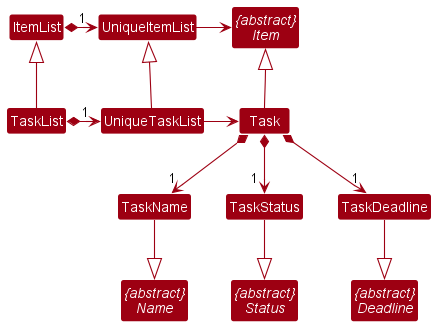

* Table of Contents
{:toc}
* [Acknowledgements](#Acknowledgements)
* [Design](#Design)
* [Implementation](#Implementation)

--------------------------------------------------------------------------------------------------------------------

## **Acknowledgements**

* {list here sources of all reused/adapted ideas, code, documentation, and third-party libraries -- include links to the original source as well}

--------------------------------------------------------------------------------------------------------------------

## **Setting up, getting started**

--------------------------------------------------------------------------------------------------------------------

## **Design**

### Architecture

### UI component
The UI consists of a MainWindow that is made up of different parts. 
For instance, `CommandBox`, `ResultDisplay`, `PersonListPanel`, `ScoreListPanel`,
`TaskListPanel`, `StatusBarFooter` etc. All theses, including the MainWindow, 
inherit from the abstract UiPart class which captures the commonalities between 
classes that represent parts of visible GUI.

The UI component uses the JavaFx UI framework. The layout of these UI 
parts are defined in matching `.fxml` files that are in the `src/main/resources/view`
folder. For example, the layout of the `MainWindow` is specified in `MainWindow.fxml`.

The UI component,
* executes user commands using the `Logic` component.
* listens for changes to `Model` data so that the UI can be
updated with the modified data.
* keeps a reference to the `Logic` component, because the UI relies on the `Logic`
to execute the commands. 
* depends on some classes in the `Model` component, as it displays `Person` object
residing in the `Model`. 

### Logic component

### Model component
**API** : [`Model.java`](https://github.com/AY2223S2-CS2103-W17-1/tp/blob/master/src/main/java/seedu/address/model/Model.java)

The `Model` component,

* stores the address book data i.e., all `Person` objects (which are contained in a `UniquePersonList` object).
* stores the currently 'selected' `Person` objects (e.g., results of a search query) as a separate _filtered_ list which is exposed to outsiders as an unmodifiable `ObservableList<Person>` that can be 'observed' e.g. the UI can be bound to this list so that the UI automatically updates when the data in the list change.
* stores a `UserPref` object that represents the user’s preferences. This is exposed to the outside as a `ReadOnlyUserPref` objects.
* does not depend on any of the other three components (as the `Model` represents data entities of the domain, they should make sense on their own without depending on other components)

:information_source: **Note:** An alternative (arguably, a more OOP) model is given below. It has a `Tag` list in the `AddressBook`, which `Person` references. This allows `AddressBook` to only require one `Tag` object per unique tag, instead of each `Person` needing their own `Tag` objects. 

#### Task model
**API** : [`Task.java`](https://github.com/AY2223S2-CS2103-W17-1/tp/blob/master/src/main/java/seedu/address/model/task/Task.java)

* A `Person` has a `TaskList` object which holds all their `Task` objects.
* Each `Task` object has a `TaskStatus` assigned to it and can be any of `INPROGRESS`, `LATE` or `COMPLETE`.
* The `creationDate` will be hidden from the user and only be used for sorting the `TaskList`.

### Storage component

### Common classes

--------------------------------------------------------------------------------------------------------------------

## **Implementation**

This section describes some noteworthy details on how certain features are implemented.

### \[Proposed\] Undo/redo feature

#### Proposed Implementation

#### Design considerations:

_{more aspects and alternatives to be added}_

### \[Proposed\] Data archiving

_{Explain here how the data archiving feature will be implemented}_

--------------------------------------------------------------------------------------------------------------------

## **Documentation, logging, testing, configuration, dev-ops**

* [Documentation guide](Documentation.md)
* [Testing guide](Testing.md)
* [Logging guide](Logging.md)
* [Configuration guide](Configuration.md)
* [DevOps guide](DevOps.md)

--------------------------------------------------------------------------------------------------------------------

## **Appendix: Requirements**

### Product scope

**Target user profile**:

* Private math tuition teachers
* has a need to manage a number of students' contacts and performance
* prefer desktop apps over other types
* prefers typing to mouse interactions
* is reasonably comfortable using CLI apps

**Value proposition**:

Tutors tend to use multiple applications to keep track of their schedule/progress work. MATHUTORING comes in to centralise the features into a single application with a contact management system to track the students’ progress report which subsequently allows the tutors to plan their lesson plan for future lessons and overall view of their schedule for ease of planning.

### User stories

Priorities: High (must have) - `* * *`, Medium (nice to have) - `* *`, Low (unlikely to have) - `*`

| Priority | As a …​ | I want to …​                                                | So that I can…​                                                                          |
|----------|---------|-------------------------------------------------------------|------------------------------------------------------------------------------------------|
| `* * *`  | user    | see a list of my students                                   | know who my students are and how many students I have                                    |
| `* * *`  | user    | purge all current data                                      | get rid of sample/experimental data I used for exploring the app                         |
| `* * *`  | user    | create my student contacts                                  | add new students into my contact list                                                    |
| `* * *`  | user    | edit my student contacts                                    | my contact list is more extensive/flexible                                               |
| `* * *`  | user    | delete my student contacts                                  | remove contacts of students that I don't teach anymore                                   |
| `* * *`  | user    | use the help section                                        | learn the available commands in the application                                          |
| `* * *`  | user    | import my data                                              | backup data and open in another device                                                   |
| `* * *`  | user    | export my data                                              | load data into a new device                                                              |
| `* * *`  | user    | delete / mark student’s tasking(s)                          | identify what taskings are done/obsolete                                                 |
| `* * *`  | user    | check the student’s taskings                                | understand how good the student is doing                                                 |
| `* * `   | user    | filter my student contacts                                  | look up on a single student/students of the same level instead of reading through a list |
| `* * `   | user    | have a secure delete of my data                             | prevent myself from accidentally deleting information                                    |
| `* * `   | user    | create a progress report                                    | keep track of the student's progress                                                     |
| `* * `   | user    | edit the student’s tasking                                  | edit the information of the student's tasking                                            |
| `* * `   | user    | see a calendar                                              | view on which day I have classes                                                         |
| `* * `   | user    | extract students' progress report                           | show the parents their kids' performance                                                 |
| `* `     | user    | note down a more detailed class description                 | know what I need to do for a certain class                                               |
| `* `     | user    | filter the calendar                                         | see clearly how many classes I have within a period of time (week/month, etc.)           |
| `* `     | user    | be able to do a wildcard search                             | know what I can do on the app if I forgot the exact command I want to execute            |
| `* `     | user    | indicate whether a student has paid the tuition fee         | easily remember which student hasn't paid the tuition fee                                |
| `* `     | user    | export my data to the cloud                                 | save my data online                                                                      |
| `* `     | user    | export the calendar data                                    | backup the calendar data and import the data to a calendar application                                   |
| `* `     | user    | have a reminder                                             | remember what classes I have for tomorrow                                                |
| `* `     | user    | auto send an email to the student to confirm the attendance | know whether the student will attend the class or not and decide whether I should conduct the class     |
| `* `     | user    | indicate whether the student attends the class              | view the student's attendance record                                                     |
| `* `     | user    | auto send an email to remind the student about the tuition fee payment  | eliminate my task of manually reminding the student to pay the tuition fee                                                                |

*{More to be added}*

### Use cases

(For all use cases below, the **System** is the `MATHUTORING` and the **Actor** is the `Tutor`, unless specified otherwise)

**Use case: Delete a student**

**MSS**

1.  Tutor requests to list students.
2.  MATHUTORING shows a list of students.
3.  Tutor requests to delete a specific student in the list.
4.  MATHUTORING deletes the student.

    Use case ends.

**Extensions**

* 2a. The list is empty.

  Use case ends.

* 3a. The given index is invalid.

    * 3a1. MATHUTORING shows an error message.

      Use case resumes at step 2.
      
* 3b. The given command argument(s) are invalid.
    * 3b1. MATHUTORING shows an error message.

      Use case resumes at step 2.

**Use case: Update a student**

**MSS**

1.  Tutor requests to list students.
2.  MATHUTORING shows a list of students.
3.  Tutor requests to edit a specific student in the list.
4.  MATHUTORING edits the student.

    Use case ends.

**Extensions**

* 2a. The list is empty.

  Use case ends.

* 3a. The given index is invalid.

    * 3a1. MATHUTORING shows an error message.

      Use case resumes at step 2.

* 3b. The given command argument(s) are invalid.

    * 3b1. MATHUTORING shows an error message.

      Use case resumes at step 2.

**Use case: Delete a task**

**MSS**

*{More to be added}*

**Extensions**

*{More to be added}*

**Use case: Update a task**

**MSS**

*{More to be added}*

**Extensions**

*{More to be added}*

**MSS**

*{More to be added}*

**Extensions**

*{More to be added}*

**Use case: Add a score**

**MSS**

1. Tutor requests to add a score.
2. MATHUTORING creates the score with score label, score value and score date.
3. MATHUTORING stores the score to the score list storage. 

    Use case ends.

**Extensions**

* 1a. MATHUTORING detects that the score label, score value or score date is missing.

    * 1a1. MATHUTORING informs the tutor that there is missing element.

      Use case resumes at step 2.
  
* 1b. MATHUTORING detects that score label, score value or score date has an invalid format.

  * 1b1. MATHUTORING informs the tutor that the form of new score is invalid.

    Use case ends.

* 1c. MATHUTORING detects that the score has already exited.

    * 1c1. MATHUTORING informs the tutor that the score has already exited.

      Use case ends.

**Use case: Delete a score**

**MSS**

1. Tutor requests to list students.
2. MATHUTORING shows a list of students.
3. Tutor requests to check specific student.
4. MATHUTORING shows a list of scores for that student.
5. Tutor requests to delete a specific score of a specific student.
6. MATHUTORING deletes the score.

   Use case ends.

**Extensions**
  
* 2a. The list is empty.

  Use case ends.

* 3a. The given student's index is invalid.

    * 3a1. MATHUTORING informs the tutor that the index is invalid.

      Use case resumes at step 2.

* 4a. The score list is empty.
 
  Use case ends.

* 5a. The given student's index is invalid.

    * 5a1. MATHUTORING informs the tutor that the index is invalid.

      Use case resumes at step 1.

* 5b. The given score's index is invalid.

    * 5b1.  MATHUTORING informs the tutor that the index is invalid.
      
      Use case resumes at step 3.
    
**Use case: Import application data via CLI**

**MSS**

1. Tutor requests to import application data.
2. MATHUTORING loads the data into the application.

    Use case ends.

**Extensions**
* 1a. MATHUTORING detects a command format error. 
  
  Use case resumes at step 1.

* 1b. MATHUTORING detects the file does not follow the parsing format.

  Use case resumes at step 1.

**Use case: Import application data via GUI**

**MSS**

1. Tutor requests to import application data.
2. MATHUTORING opens Import GUI window.
3. Tutor request to upload file.
4. MATHUTORING opens the OS file explorer.
5. Tutor selects a directory to upload the data.
6. MATHUTORING saves the file.
7. MATHUTORING loads the data into the application.

    Use case ends.

**Extensions**
* 6a. MATHUTORING detects the file does not follow the parsing format.
 
  Use case resumes at step 3.

**Use case: Export application data via CLI**

**MSS**

1. Tutor requests to export application data.
2. MATHUTORING saves the file.

    Use case ends.

**Extensions**
* 1a. MATHUTORING detects a command format error. 
  
  Use case resumes at step 1.

**Use case: Export application data via GUI**

**MSS**

1. Tutor requests to export application data.
2. MATHUTORING opens the OS file explorer.
3. Tutor selects a directory to save the data.
4. MATHUTORING saves the file.

    Use case ends.

**Extensions**
* 2a. File explorer closed by Tutor by mistake. 
  
  Use case resumes at step 1.

* 2b. File explorer closed by Tutor.

  Use case ends.

**Use case: Export student's progress via CLI**

**MSS**

1. Tutor requests to export student's progress.
2. MATHUTORING saves the file.

   Use case ends.

**Extensions**
* 1a. MATHUTORING detects a command format error.

  Use case resumes at step 1.

* 1b. MATHUTORING detects that a file with the exact same name and type exists in the selected directory and is currently being opened.

    Use case ends.

**Use case: Export student's progress via GUI**

**MSS**

1. Tutor requests to export student's progress.
2. MATHUTORING shows an export progress window.
3. MATHUTORING opens the OS file explorer.
4. Tutor selects a directory and specifies the file name to save the PDF file.
5. MATHUTORING saves the file.

   Use case ends.

**Extensions**
* 2a. Export progress window closed by Tutor by mistake.
    
  Use case ends.

* 2b. Export progress window closed by Tutor by mistake.

  Use case ends.

* 3a. File explorer closed by Tutor by mistake.

  Use case resumes at step 2.

* 3b. File explorer closed by Tutor.

  Use case resumes at step 2.

* 4a. File name specified is invalid.

  * 4a1. File explorer informs the tutor that the file name is invalid.
      
    Use case resumes at step 2.

* 4b. A file with the exact same name and type exists in the selected directory and is currently being opened.
  
  * 4b1. MATHUTORING informs the tutor that the file cannot be saved due to a file with the same name and type in the same directory is being opened. 
  
    Use case ends.

*{More to be added}*

### Non-Functional Requirements

1.  Should work on any _mainstream OS_ as long as it has Java `11` or above installed.
2.  Should be able to hold up to 1000 students' information without a noticeable sluggishness in performance for typical usage.
3.  A user with above average typing speed for regular English text (i.e. not code, not system admin commands) should be able to accomplish most of the tasks faster using commands than using the mouse.
4.  The application should work on both 32-bit and 64-bit environments.
5.  The application should respond within 3 seconds.
6.  The user interface should be intuitive enough for users who are not IT-savvy.
7.  The product is free of charge.

*{More to be added}*

### Glossary

* **Mainstream OS**: Windows, Linux, Unix, OS-X
* **Tutors**: Private math tuition teachers that will be using the application
* **Students' progress**: For our current version, the progress of a student is tracked through 
the number of tasks the student has completed 
* **Students' performance**: For our current version, the performance of a student is tracked through a view
of the student's scores. In future implementation, a student's performance will be shown in a line chart

*{More to be added}*

--------------------------------------------------------------------------------------------------------------------

## **Appendix: Instructions for manual testing**

### Launch and shutdown

### Deleting a person

### Saving data
