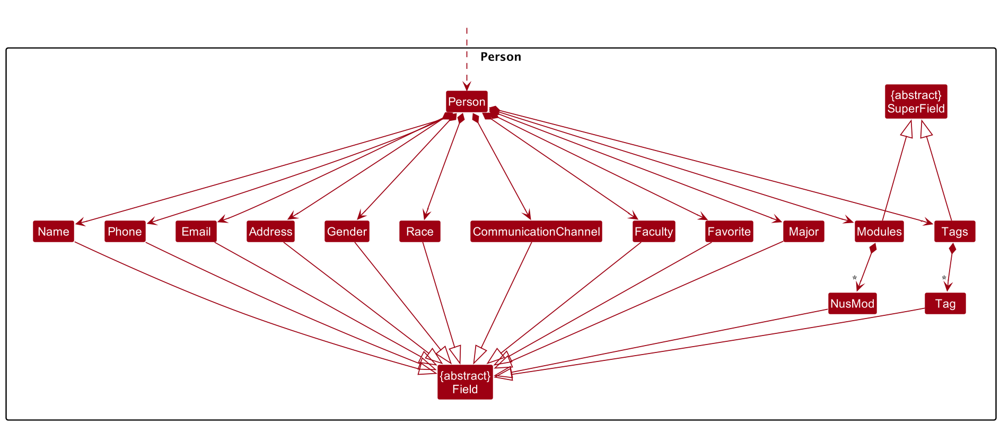
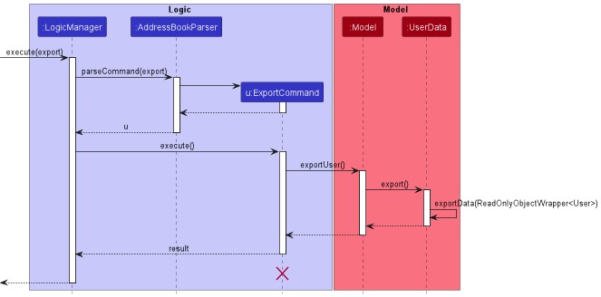

## Table Of Contents
* Table of Contents
{:toc}
--------------------------------------------------------------------------------------------------------------------

## **Acknowledgements**

* [Star icon](https://github.com/AY2223S2-CS2103T-F12-3/tp/blob/master/src/main/resources/images/star.png) created by [Pixel perfect - Flaticon](https://www.flaticon.com/free-icons/star).
* [Module code list](https://github.com/AY2223S2-CS2103T-F12-3/tp/blob/master/src/main/resources/data/modules.json) adapted from [NUSMods API](https://api.nusmods.com/v2/).

--------------------------------------------------------------------------------------------------------------------
## **NeoBook**
### Introduction
NeoBook is an address book app designed to connect NUS students with their seniors or other students with similar academic paths, making their contacts much more organized.
The app allows students to find contacts with similar traits and view their schedules to help them connect with each other more conveniently.
### Purpose
This Developer Guide aims to provide technical documentation for developers who want to contribute to NeoBook's development.
The guide includes a list of setting up instructions, design documentation, app requirements, user stories, use cases, and other relevant technical details.
### Target Audience
The target readers of this Developer Guide are developers who are familiar with the programming languages and frameworks used in the development of NeoBook.

--------------------------------------------------------------------------------------------------------------------

## **Setting up, getting started**

Refer to the guide [_Setting up and getting started_](SettingUp.md).

--------------------------------------------------------------------------------------------------------------------

## **Design**

:bulb: **Tip:** The `.puml` files used to create diagrams in this document can be found in the [diagrams](https://github.com/AY2223S2-CS2103T-F12-3/tp/tree/master/docs/diagrams) folder. Refer to the [_PlantUML Tutorial_ at se-edu/guides](https://se-education.org/guides/tutorials/plantUml.html) to learn how to create and edit diagrams.

### Architecture

The ***Architecture Diagram*** given above explains the high-level design of the App.

Given below is a quick overview of main components and how they interact with each other.

**Main components of the architecture**

**`Main`** has two classes called [`Main`](https://github.com/se-edu/addressbook-level3/tree/master/src/main/java/seedu/address/Main.java) and [`MainApp`](https://github.com/se-edu/addressbook-level3/tree/master/src/main/java/seedu/address/MainApp.java). It is responsible for,
* At app launch: Initializes the components in the correct sequence, and connects them up with each other.
* At shut down: Shuts down the components and invokes cleanup methods where necessary.

[**`Commons`**](#common-classes) represents a collection of classes used by multiple other components.

The rest of the App consists of four components.

* [**`UI`**](#ui-component): The UI of the App.
* [**`Logic`**](#logic-component): The command executor.
* [**`Model`**](#model-component): Holds the data of the App in memory.
* [**`Storage`**](#storage-component): Reads data from, and writes data to, the hard disk.

**How the architecture components interact with each other**

The *Sequence Diagram* below shows how the components interact with each other for the scenario where the user issues the command `delete 1`.

Each of the four main components (also shown in the diagram above),

* defines its *API* in an `interface` with the same name as the Component.
* implements its functionality using a concrete `{Component Name}Manager` class (which follows the corresponding API `interface` mentioned in the previous point.

For example, the `Logic` component defines its API in the `Logic.java` interface and implements its functionality using the `LogicManager.java` class which follows the `Logic` interface. Other components interact with a given component through its interface rather than the concrete class (reason: to prevent outside component's being coupled to the implementation of a component), as illustrated in the (partial) class diagram below.

The sections below give more details of each component.

### UI component

The **API** of this component is specified in [`Ui.java`](https://github.com/se-edu/addressbook-level3/tree/master/src/main/java/seedu/address/ui/Ui.java)

The UI consists of a `MainWindow` that is made up of parts e.g.`CommandBox`, `ResultDisplay`, `BodyPanel`, `StatusBarFooter` etc. All these, including the `MainWindow`, inherit from the abstract `UiPart` class which captures the commonalities between classes that represent parts of the visible GUI.

The `UI` component uses the JavaFx UI framework. The layout of these UI parts are defined in matching `.fxml` files that are in the `src/main/resources/view` folder. For example, the layout of the [`MainWindow`](https://github.com/AY2223S2-CS2103T-F12-3/tp/blob/master/src/main/java/seedu/address/ui/MainWindow.java) is specified in [`MainWindow.fxml`](https://github.com/AY2223S2-CS2103T-F12-3/tp/blob/master/src/main/resources/view/MainWindow.fxml)

The `UI` component,

* executes user commands using the `Logic` component.
* listens for changes to `Model` data so that the UI can be updated with the modified data.
* keeps a reference to the `Logic` component, because the `UI` relies on the `Logic` to execute commands.
* depends on some classes in the `Model` component, as it displays `Person`, `Event`, and `User` objects residing in the `Model`.

The UI is styled using CSS, primarily via [`DarkTheme.css`](https://github.com/AY2223S2-CS2103T-F12-3/tp/blob/master/src/main/resources/view/DarkTheme.css) and [`Extensions.css`](https://github.com/AY2223S2-CS2103T-F12-3/tp/blob/master/src/main/resources/view/Extensions.css) that are imported by `MainWindow.fxml`. The `HelpWindow` has its own separate CSS file, [`HelpWindow.css`](https://github.com/AY2223S2-CS2103T-F12-3/tp/blob/master/src/main/resources/view/HelpWindow.css).

In `DarkTheme.css`, there is a system of reuse. For example,

* Themes have their own defined variables:
  * `-fx-primary`: primary theme colour
  * `-fx-primary-foreground`: primary theme colour, usually for foreground and accented components
  * `-fx-primary-background`: primary theme colour, usually for background and muted components
  * `-fx-primary-text`: primary text colour
  * `-fx-secondary-text`: secondary text colour
  * `-fx-list-odd`: background colour of odd-indexed list cells
  * `-fx-list-even`: background colour of even-indexed list cells
  * `-fx-list-selected`: background colour of selected list cells

* Labels have defined font sizes: `label-h1`, `label-h2`, `label-h3`, `label-h4`, `label-h5`, `label-h6`, and `label-p`, corresponding to the different headings and paragraph font sizes.

* Paddings have been defined and standardised with a width of 10. For example, `pa` represents "all padding", `pt` for "top padding", and `pa-b` for "all padding except bottom".

### Logic component

**API** : [`Logic.java`](https://github.com/se-edu/addressbook-level3/tree/master/src/main/java/seedu/address/logic/Logic.java)

Here's a (partial) class diagram of the `Logic` component:

How the `Logic` component works:
1. When `Logic` is called upon to execute a command, it uses the `AddressBookParser` class to parse the user command.
1. This results in a `Command` object (more precisely, an object of one of its subclasses e.g., `AddCommand`) which is executed by the `LogicManager`.
1. The command can communicate with the `Model` when it is executed (e.g. to add a person).
1. The result of the command execution is encapsulated as a `CommandResult` object which is returned back from `Logic`.

The Sequence Diagram below illustrates the interactions within the `Logic` component for the `execute("delete 1")` API call.

:information_source: **Note:** The lifeline for `DeleteCommandParser` should end at the destroy marker (X) but due to a limitation of PlantUML, the lifeline reaches the end of diagram.

Here are the other classes in `Logic` (omitted from the class diagram above) that are used for parsing a user command:

How the parsing works:
* When called upon to parse a user command, the `AddressBookParser` class creates an `XYZCommandParser` (`XYZ` is a placeholder for the specific command name e.g., `AddCommandParser`) which uses the other classes shown above to parse the user command and create a `XYZCommand` object (e.g., `AddCommand`) which the `AddressBookParser` returns back as a `Command` object.
* All `XYZCommandParser` classes (e.g., `AddCommandParser`, `DeleteCommandParser`, ...) inherit from the `Parser` interface so that they can be treated similarly where possible e.g, during testing.

### Model component
**API** : [`Model.java`](https://github.com/se-edu/addressbook-level3/tree/master/src/main/java/seedu/address/model/Model.java)

The `Model` component,

* stores the address book data i.e., all `Person` objects (which are contained in a `UniquePersonList` object).
* stores the currently 'selected' `Person` objects (e.g., results of a search query) as a separate _filtered_ list which is exposed to outsiders as an unmodifiable `ObservableList<Person>` that can be 'observed' e.g. the UI can be bound to this list so that the UI automatically updates when the data in the list change.
* stores a `UserPref` object that represents the user’s preferences. This is exposed to the outside as a `ReadOnlyUserPref` objects.
* does not depend on any of the other three components (as the `Model` represents data entities of the domain, they should make sense on their own without depending on other components)

Within the Model component holds the Person Class.

Each field in Person inherits from either the Field abstract class or the SuperField abstract class.

* The Field abstract class represents a field with a singular value. This is used for fields like e.g. Name, Gender
and Major.
* The SuperField abstract class represents a field that has multiple values. This is used for fields like e.g. Modules
and Tags. The SuperField class contains a set of values that are a subclass of Field.
* The Field and SuperField abstract classes are used to abstract our common logic between the various fields in Person, while
  also allowing for polymorphism.

:information_source: **Note:** An alternative (arguably, a more OOP) model is given below. It has a `Tag` list in the `AddressBook`, which `Person` references. This allows `AddressBook` to only require one `Tag` object per unique tag, instead of each `Person` needing their own `Tag` objects. 

### Storage component

**API** : [`Storage.java`](https://github.com/se-edu/addressbook-level3/tree/master/src/main/java/seedu/address/storage/Storage.java)

The `Storage` component,
* can save both address book data, user data and user preference data in json format, and read them back into
corresponding objects.
* inherits from `UserDataStorage`, `AddressBookStorage` and `UserPrefStorage`, which means it can be treated as either one
(if only the functionality of only one is needed).
* depends on some classes in the `Model` component (because the `Storage` component's job is to save/retrieve objects
that belong to the `Model`). In particular, the changes to the following 5 classes will require a change in their
respective classes in Storage.
  * Person
  * Event
  * User
  * NusMod
  * Tag

### Common classes

Classes used by multiple components are in the `seedu.addressbook.commons` package.

--------------------------------------------------------------------------------------------------------------------

## **Implementation**

This section describes some noteworthy details on how certain features are implemented.

### Command for tab switching

Due to the limited space on most displays, the application uses tabs to switch between various panels, such as the address book, events, and personal information panels.

The tab switching mechanism is facilitated by [`TabUtil`](https://github.com/AY2223S2-CS2103T-F12-3/tp/blob/docs/dg-tab-command/src/main/java/seedu/address/logic/ui/tab/TabUtil.java), which contains the list of all tabs relevant in the application. Tabs are represented by [`TabInfo`](https://github.com/AY2223S2-CS2103T-F12-3/tp/blob/docs/dg-tab-command/src/main/java/seedu/address/logic/ui/tab/TabInfo.java), made up of an `Index` (which the user references in the `tab` command) and a [`TabType`](https://github.com/AY2223S2-CS2103T-F12-3/tp/blob/docs/dg-tab-command/src/main/java/seedu/address/logic/ui/tab/TabType.java) (which defines the possible tabs in the application). Their relationship is shown below:

#### Design considerations

There are two ways to switch between tabs:
* **Method 1:** Click on individual tabs in the tabs bar
* **Method 2:** Use the `tab` command

Consequently, the state of the selected tab needs to be shared between the two methods, so that the user can be correctly notified if they are already on a tab that they are trying to navigate to.

> **Example:** If the user has navigated from the 1st tab to the 3rd using the tab bar before trying to navigate back to the 1st tab using `tab 1`, they should not be warned that they are already on the 1st tab. In other words, both methods should have their states in sync from the perspective of the user, so as not to induce unexpected behaviour.

### Command for selecting

The `select` feature allows user to select which contact's details to display on the person details panel.

There is _selected person_ field in `AddressBook` that keep tracks of which person's details should be displayed.
This field is initialised to null at the start when no person is selected yet.
The `select` feature is facilitated through `SelectCommandParser` and `SelectCommand`.
The `LogicManager` executes the `SelectCommand`, which communicates with the `ModelManager` and updates the _selected person_ field in `AddressBook`.

The following sequence diagram illustrates the execution of a successful select command.
Low-level details of the parsing of select command in logic is omitted as it has been described [above](#logic-component)

Upon execution, the `selectedPerson` field of AddressBook would be updated, allowing the GUI to access it
and display changes accordingly.

#### Design considerations

There are two ways to select a contact:
* **Method 1:** Click on the contact in the current displayed contact list
* **Method 2:** Use the `select` command

Consequently, the state of the selected person needs to be shared between the two methods, so that the user can be correctly notified if they have already selected the contact that they are trying to access.
> **Example:**
> - If the user has selected index 1 by clicking on the contact, executing "select 1" should result in a warning that the contact is already selected.
> - If the user has selected index 1 by using `select 1`, clicking on the same contact at index 1 should "deselect" contact.

### Command for Favourite Contacts

For improved User Experience, we want users to be able to easily look up contacts they frequently contact.
This addresses the issue of convenience.

The Favourite Command works by having the User entering a "fav" command and specify the index of that particular contact. The index will be displayed on the UI of the AddressBook.
The Favourited Contact will have a Star Emoji displayed beside the Contact's name and will also be displayed under a "Favourite" List for easier convenience and lookup for the User.

### Command for Unfavourite Contacts

Following the Favourite Contacts Command, we want users to fully manage their favourite list. We added an Unfavourite Command to remove contacts they do not frequently contact.

The Unfavourite Command works by having the User entering a "unfav" command and specify the index of that particular contact that is currently in the Favourite List. The index will be displayed on the UI of the AddressBook.
The Unfavourited Contact will remove the Star Emoji displayed beside the Contact's name and remove the Contact from the Favourite List.

### Command for Add Event Command

NeoBook implements an Event Calendar Interface for users to track any notable events. There are 2 types of Events that can be added by the Users. Firstly, a One Time event that occurs only once on the specified date and time.
Secondly, recurring events that occur periodically e.g. Weekly Lectures, Daily Reminders etc. There are multiple recurrences which can be specified by the users: Daily, Weekly, Monthly and Yearly.
Users have can choose to input these 4 different type of Recurring Events into NeoBook.

The Add Event Command works by having the User entering the "addevent" command. The User will then specify the Description of the Event, Start Date and Time of the event,
End Date and Time of the Event, followed by the Recurrence type, whether it is Daily, Weekly, Monthly, Yearly, or a One-Time Event. All are required fields except the Recurrence Field.
If left unspecified, the Event will be added as a One-Time Event, the Success Message will prompt to the user, what type of Event will have be added to the Events Calendar UI of NeoBook.

### Command for Edit Event Command

The Edit Event Command allows users to modify any of the specific fields for an existing event in the NeoBook calendar. To use this command, the user will enter "editevent" followed by the index number that corresponds to the event they wish to modify.
The user can then include multiple field prefix/desired-change arguments in the same command. The field prefixes are as follows: "d" for Description, "s" for Start Date, "e" for End Date, and "r" for Recurrence Type.
After each field prefix, the user should enter the desired change they would like to make to the corresponding field. For example, to change the Description of an event with index number 1 to "Meeting with clients", the user would enter "editevent 1 /d Meeting with clients".

Once all the desired fields have been updated, the Success Message will prompt to the user that the event has been updated in the Events Calendar UI of NeoBook.
It is important to note that the index number must be specified in order to edit an event, and at least one field prefix/desired-change argument must be included in the command. If an incorrect index number is entered or if a field prefix is misspelled or not recognized, the command will not work and an error message will be displayed.

### Command for Tagging Person to Event Command

The Tag Person to Event command allows users to tag a contact in their NeoBook to an event. Not only does it tag the person to the event, but any changes to the person will also dynamically change the information of the tagged person to the event. Currently, due to how the storage is set up, there is no way to have the same Person object be linked properly to the event. This is because on startup, NeoBook recreates a new Person object in its addressbook while each event essentially just creates a new Person object that it is tagged to. However, it would not make sense if the user had to manually update the tag if anything within the contact changed. So to dynamically pair the Person object being tagged to the event and the Person object in the Contacts list, NeoBook checks through all events on any EditPersonCommand and to look for any event where the person is tagged to. Then it edits those Person objects to its new edited version.

In the future, a more proper implementation would include more coupling with storage. The flow on startup would be:
1) All Person objects in NeoBook's contact list is loaded up
2) All events in NeoBook are loaded up
   1) While loading the events, make a reference to the appropriate Person object within the contact list within the taggedPerson set in events.

This would make it such that we would not have to check through every single contact in NeoBook for edits as any changes to the Person object would be reflected in events.

Alternatively, you could set up an Observable<Person> such that we subscribe to any changes for the certain person that NeoBook has tagged to an event and appropriately make any changes.

Regardless, it is important to note that the implementation will likely have to change depending on the direction of the project.

### \[Proposed\] Undo/redo feature

#### Proposed Implementation

The proposed undo/redo mechanism is facilitated by `VersionedAddressBook`. It extends `AddressBook` with an undo/redo history, stored internally as an `addressBookStateList` and `currentStatePointer`. Additionally, it implements the following operations:

* `VersionedAddressBook#commit()` — Saves the current address book state in its history.
* `VersionedAddressBook#undo()` — Restores the previous address book state from its history.
* `VersionedAddressBook#redo()` — Restores a previously undone address book state from its history.

These operations are exposed in the `Model` interface as `Model#commitAddressBook()`, `Model#undoAddressBook()` and `Model#redoAddressBook()` respectively.

Given below is an example usage scenario and how the undo/redo mechanism behaves at each step.

Step 1. The user launches the application for the first time. The `VersionedAddressBook` will be initialized with the initial address book state, and the `currentStatePointer` pointing to that single address book state.

Step 2. The user executes `delete 5` command to delete the 5th person in the address book. The `delete` command calls `Model#commitAddressBook()`, causing the modified state of the address book after the `delete 5` command executes to be saved in the `addressBookStateList`, and the `currentStatePointer` is shifted to the newly inserted address book state.

Step 3. The user executes `add n/David …​` to add a new person. The `add` command also calls `Model#commitAddressBook()`, causing another modified address book state to be saved into the `addressBookStateList`.

:information_source: **Note:** If a command fails its execution, it will not call `Model#commitAddressBook()`, so the address book state will not be saved into the `addressBookStateList`.

Step 4. The user now decides that adding the person was a mistake, and decides to undo that action by executing the `undo` command. The `undo` command will call `Model#undoAddressBook()`, which will shift the `currentStatePointer` once to the left, pointing it to the previous address book state, and restores the address book to that state.

:information_source: **Note:** If the `currentStatePointer` is at index 0, pointing to the initial AddressBook state, then there are no previous AddressBook states to restore. The `undo` command uses `Model#canUndoAddressBook()` to check if this is the case. If so, it will return an error to the user rather
than attempting to perform the undo.

The following sequence diagram shows how the undo operation works:

:information_source: **Note:** The lifeline for `UndoCommand` should end at the destroy marker (X) but due to a limitation of PlantUML, the lifeline reaches the end of diagram.

The `redo` command does the opposite — it calls `Model#redoAddressBook()`, which shifts the `currentStatePointer` once to the right, pointing to the previously undone state, and restores the address book to that state.

:information_source: **Note:** If the `currentStatePointer` is at index `addressBookStateList.size() - 1`, pointing to the latest address book state, then there are no undone AddressBook states to restore. The `redo` command uses `Model#canRedoAddressBook()` to check if this is the case. If so, it will return an error to the user rather than attempting to perform the redo.

Step 5. The user then decides to execute the command `list`. Commands that do not modify the address book, such as `list`, will usually not call `Model#commitAddressBook()`, `Model#undoAddressBook()` or `Model#redoAddressBook()`. Thus, the `addressBookStateList` remains unchanged.

Step 6. The user executes `clear`, which calls `Model#commitAddressBook()`. Since the `currentStatePointer` is not pointing at the end of the `addressBookStateList`, all address book states after the `currentStatePointer` will be purged. Reason: It no longer makes sense to redo the `add n/David …​` command. This is the behavior that most modern desktop applications follow.

The following activity diagram summarizes what happens when a user executes a new command:

#### Design considerations

**Aspect: How undo & redo executes**

* **Alternative 1 (current choice):** Saves the entire address book.
  * Pros: Easy to implement.
  * Cons: May have performance issues in terms of memory usage.

* **Alternative 2:** Individual command knows how to undo/redo by
  itself.
  * Pros: Will use less memory (e.g. for `delete`, just save the person being deleted).
  * Cons: We must ensure that the implementation of each individual command are correct.

_{more aspects and alternatives to be added}_

### \[Proposed\] Exporting User information

#### Proposed Implementation

Using the User model already implemented into NeoBook. We can create a string that a user can copy to send to their friends, such that when they run that string, the user's contact will be added into their NeoBook. The string can then be easily copy-pasted by displaying it as the CommandResult of the ExportCommand.

The following sequence diagram shows how the undo operation works:

:information_source: **Note:** The lifeline for `UndoCommand` should end at the destroy marker (X) but due to a limitation of PlantUML, the lifeline reaches the end of diagram.

The return result of exportData(ReadOnlyObjectWrapper<User>) will be the String that the user can copy and easily send to a friend.

For example:
User has
- Name: John
- Address: Serangoon Central
- Tags: Friend, Soccer Fanatic
- Gender: Male

The return result of exportData(ReadOnlyObjectWrapper<User>) will be:
 
`add n/John a/Serangoon Central t/Friend t/Soccer Fanatic g/Male`

Then this String will be displayed as a CommandResult on the UI for the User to easily copy.

#### Design considerations

**Aspect: How the user can send the information to another user:**

* **Alternative 1 (current choice):** Copy and paste.
    * Pros: Easy to implement.
    * Cons: May be too analog.
    * Extra: Make the result be auto copied to the user's clipboard upon click.

* **Alternative 2:** Email.
    * Pros: Easier to format and for the user to use in a more professional setting. The user can also specify which contact he is sending the exported information to and NeoBook can create a draft email to the email of the contact specified.
    * Cons: Difficult to implement.

--------------------------------------------------------------------------------------------------------------------

## **Documentation, logging, testing, configuration, dev-ops**

* [Documentation guide](Documentation.md)
* [Testing guide](Testing.md)
* [Logging guide](Logging.md)
* [Configuration guide](Configuration.md)
* [DevOps guide](DevOps.md)

--------------------------------------------------------------------------------------------------------------------

## **Appendix: Requirements**

### Product scope (v1.1)

**Target user profile**:

* NUS students who want to connect with seniors/other students with common academic paths
* Freshmen looking to get advice from their seniors in the same course or taken the same modules
* Students who want to get internship advice from others who have worked in that company
* Students who want to know more about their friends and seniors' schedules to be able to find time to connect with them

**Value proposition**: Being able to find contacts with similar traits and being able to view their schedule to find an appropriate time to connect with them.

### User stories

Priorities: High (must have) - `* * *`, Medium (nice to have) - `* *`, Low (unlikely to have) - `*`

| Priority | As a …​                                                 | I want to …​                                                                                                           | So that I can…​                                |
| -------- |---------------------------------------------------------|------------------------------------------------------------------------------------------------------------------------|------------------------------------------------|
| `* * *`  | Student who often needs help with school work           | I want to be able to see who is likely to be available currently                                                       | Get help as soon as possible                   |
| `* * *`  | Student who often contacts external organisations       | Segregate my contacts into different categories (e.g. friends, family, t-shirt suppliers, bus drivers , sponsors etc.) | Organise my contacts effectively               |
| `* * *`  | Student sourcing for internships                        | I am able to see Students internship experience                                                                        | To find out more about their interview process |
| `* * *`  | Student who wants to go for a career fair with somebody | I want to find people who are available at a certain time                                                              | So that I can go to the career fair with them  |
| `* *`    | Student who made a new connection                       | I want to be able to add a new contact                                                                                 | So that I can save the person’s details        |
| `*`      | Student who is in to keeping everything in one place    | I like being able to keep everything I need to see in one place                                                        | So that I dont forget anything                 |

*{More to be added}*

### Use cases

(For all use cases below, the **System** is the `AddressBook` and the **Actor** is the `user`, unless specified otherwise)

**Use case: Add a person**

**MSS**

1.  User requests to add a person
2.  User enters person details and submits the command
3.  AddressBook saves the person

    Use case ends.

**Extensions**

* 2a. AddressBook is unable to save the person.

    * 2a1. AddressBook shows an error message.

      Use case resumes at step 1.

**Use case: Delete a person**

**MSS**

1.  User requests to list persons
2.  AddressBook shows a list of persons
3.  User requests to delete a specific person in the list
4.  AddressBook deletes the person

    Use case ends.

**Extensions**

* 2a. The list is empty.

  Use case ends.

* 3a. The given index is invalid.

    * 3a1. AddressBook shows an error message.

      Use case resumes at step 2.

**Use case: Editing a person**

**MSS**

1.  User enters a command to edit an existing person by specifying their index number and new details
2.  AddressBook updates the person's details

    Use case ends.

**Extensions**

* 1a. User enters an invalid command or incorrect details.

    * 1a1. AddressBook shows an error message.

      Use case ends.

* 1b. User enters an invalid index number.

    * 1b1. AddressBook shows an error message.

      Use case ends.

* 2a. AddressBook is unable to update the person's details.

    * 2a1. AddressBook shows an error message.

      Use case ends.

**Use case: List all persons**

**MSS**

1.  User enters a command to list all persons
2.  AddressBook shows a list of all persons with their details

    Use case ends.

**Extensions**

* 1a. User enters an invalid command.

    * 1a1. AddressBook shows an error message.

      Use case ends.

**Use case: Find persons by specified fields**

**MSS**

1.  User enters a command to search for persons by specifying one or more keywords for different fields
2.  AddressBook searches for persons who contain any of the given keywords for the fields specified
3.  AddressBook returns a list of persons matching the search criteria

    Use case ends.

**Extensions**

* 1a. User enters an invalid command or incorrect details.

    * 1a1. AddressBook shows an error message.

      Use case ends.

* 3a. No persons are found matching the search criteria.

    * 3a1. AddressBook shows an empty list message.

      Use case ends.

**Use case: Clearing all entries**

**MSS**

1.  User enters a command to clear all entries
2.  AddressBook clears all entries from the address book
3.  AddressBook shows a success message

    Use case ends.

**Extensions**

* 1a. User enters an invalid command or incorrect details.

    * 1a1. AddressBook shows an error message.

      Use case ends.

* 2a. AddressBook is unable to clear all entries.

    * 2a1. AddressBook shows an error message.

      Use case ends.

*{More to be added}*

### Non-Functional Requirements

1. Should work on any _mainstream OS_ as long as it has Java `11` or above installed.
2. Should be able to hold up to 1000 persons without a noticeable sluggishness in performance for typical usage.
3. A user with above average typing speed for regular English text (i.e. not code, not system admin commands) should be able to accomplish most of the tasks faster using commands than using the mouse.
4. Should be easy to use and navigate, even for users who are not familiar with the NUS student community. This could include features such as clear labeling, intuitive interfaces, and helpful error messages.
5. Should be accessible to users with disabilities, including those who use screen readers or other assistive technologies. The user interface should be highly readable for all users.
6. Should provide fast response times and minimal resource usage, even when running on lower-end hardware.
7. Should be able to handle errors and exceptions gracefully, without crashing or losing user data. This could include features such as error logging, fault tolerance mechanisms, and data backup options.

*{More to be added}*

### Glossary

* **Mainstream OS**: Windows, Linux, Unix, OS-X
* **Private contact detail**: A contact detail that is not meant to be shared with others

--------------------------------------------------------------------------------------------------------------------

## **Appendix: Instructions for manual testing**

Given below are instructions to test the app manually.

:information_source: **Note:** These instructions only provide a starting point for testers to work on;
testers are expected to do more *exploratory* testing.

## General

### Launch and shutdown

1. Initial launch

   1. Download the jar file and copy into an empty folder

   1. Double-click the jar file Expected: Shows the GUI with a set of sample contacts. The window size may not be optimum.

2. Saving window preferences

   1. Resize the window to an optimum size. Move the window to a different location. Close the window.

   1. Re-launch the app by double-clicking the jar file. 
       Expected: The most recent window size and location is retained.

3. _{ more test cases …​ }_

## Address-book related

### Adding a person
1. Adding a person while all persons/no persons are being shown
   1. Prerequisites: List all persons using the `list` command. Multiple persons in the list. Navigate to the `Address book` tab using `tab 1`
   2. Test Cases
      1. **Test case 1**: `add n/Pierce a/Serangoon Central t/Friend t/Genius` 
         - Testing for: Command successful execution
         - Expected: A contact is added to the contact list with Pierce as its name, Serangoon Central as its address, and Friend and Genius as its tags.
      
      2. **Test case 2**: `add p/91238917 a/Serangoon Central` 
         - Testing for: No name specified
         - Expected: No contact is added. Error details show in the status message.
      3. **Test case 3**: `add n/@`, `add n/pierce p/words`, `add n/Stanley e/notanemail`, ...
         - Testing for: Invalid fields
         - Expected: Same as test case 2

### Deleting a person

1. Deleting a person while all persons are being shown

   1. Prerequisites: List all persons using the `list` command. Multiple persons in the list. Navigate to the `Address book` tab using `tab 1`

   2. Test Cases
      1. **Test case 1**: `delete 1`
         - Testing for: Command successful execution
         - Expected: First contact is deleted from the list. Details of the deleted contact shown in the status message. Timestamp in the status bar is updated.

      2. **Test case 2**: `delete 0`
         - Testing for: Erroneous index results in command failure
         - Expected: No person is deleted. Error details shown in the status message.

      3. **Other test cases**: `delete`, `delete x`(where x is larger than the list size), `delete -1` 
         - Testing for: Erroneous index results in command failure
         - Expected: Similar to test case 2.

### Editing data of a contact
1. Edit data of contact.
    1. Prerequisites: Non-empty address-book. Navigate to the `Address book` tab using `tab 1`
    2. Test Cases
        1. Test case 1: `edit N n/Pierce`, `edit N a/Serangoon Central`, ... where N is a number between 1 and the number of contacts in the list
            - Testing for: Successful command execution
            - Expected: Field of first contact updates to that specified in the command
        2. Test case 2: `edit 1 n/@#`, `edit 1 e/123`, ...
            - Testing for: Invalid fields results in command failure
            - Expected: Contacts do not update. Error details shown in the status message.
        3. Test case 3: `edit 1 x n/Pierce`, ... where x is anything that does not have a field specifier and is not a number between 1 and the number of contacts in the list
            - Testing for: Unspecified field results in command failure
            - Expected: Contacts do not update. Error details shown in the status message.
        4. Test case 4: `edit M n/Pierce`, ... where M is a number not between 1 and the number of contacts in the list
            - Testing for: Unspecified field results in command failure
            - Expected: Contacts do not update. Error details shown in the status message.
        5. Test case 4: `edit`
            - Testing for: No fields specified results in command failure
            - Expected: User does not update. Error details shown in the status message.

### Finding a person
1. Finding a person while all persons are being shown
   1. Prerequisites: List all persons using the `list` command. Multiple persons in the list. Navigate to the `Address book` tab using `tab 1`
   2. Test Cases
      1. Test case 1: `find n/Pi`
         - Testing for: Command successful execution 
         - Expected: Shows all contacts with `Pi` in their names show up in the contacts list.
      2. Test case 2: `find n/Stan n/Pierce`
        
         - Testing for: Command successful execution
         - Expected: Shows all contacts with `Stan` **or** `Pierce` in their names will show up in the contacts list
      3. Test case 3: `find n/Pie m/Comp`
        
         - Testing for: Command successful execution
         - Expected: Shows all contacts with `Pie` in their name field **and** have `Comp` in their major field.
      4. Test case 4: `find`
        
         - Testing for: No fields specified results in command failure
         - Expected: List does not update. Error details shown in the status message.
      5. Test case 5: `find 1 n/Pi`
         
         - Testing for: Index specified results in command failure
         - Expected: List does not update. Error details shown in the status message.
2. Find a contact when there are no contacts
   1. Prerequisites: Empty addressbook. Navigate to the `Address book` tab using `tab 1`
   2. Test Cases
      1. Test case 1: `find n/pierce`
          - Testing for: Successful command execution
          - Expected: Command executes, but list does not change as there are no contacts.
      3. Test case 5: `find 1 n/Pierce`
          - Testing for: Index specified results in command failure
          - Expected: List does not update. Error details shown in the status message.

### Favouriting/Unfavouriting a contact

### Selecting a contact

## Events-related

### Adding an event

### Deleting an event

### Editing an event

### Tagging/Untagging a contact to an event

## User-related
### Editing data of User
1. Edit data of User specified in Me tab.
    1. Prerequisites: Navigate to Me tab using `tab 3`
    2. Test Cases
       1. Test case 1: `edituser n/Pierce`, `edituser a/Serangoon Central`, ...
           - Testing for: Successful command execution
           - Expected: Field of user updates to that specified in the command
       2. Test case 2: `edituser n/@#`, `edituser e/123`, ...
          - Testing for: Invalid fields results in command failure
          - Expected: User does not update. Error details shown in the status message.
       3. Test case 3: `edituser x`, `edituser x n/Pierce`, ... where x is anything that does not have a field specifier.
          - Testing for: Unspecified field results in command failure
          - Expected: User does not update. Error details shown in the status message.
       4. Test case 4: `edituser`
          - Testing for: No fields specified results in command failure
          - Expected: User does not update. Error details shown in the status message.

## UI-related
### Light/Dark mode
1. Set UI to light mode from dark mode
    1. Prerequisites: UI currently in dark mode (can be switched using the `dark` command)
    2. Test Cases
       1. Test case 1: `light`
          - Testing for: Successful command execution
          - Expected: UI updates to light mode
1. Set UI to light mode from light mode
    1. Prerequisites: UI currently in light mode (can be switched using the `light` command)
    2. Test Cases
        1. Test case 1: `light`
            - Testing for: Successful command execution
            - Expected: UI updates to light mode
1. Set UI to dark mode from light mode
    1. Prerequisites: UI currently in light mode (can be switched using the `light` command)
    2. Test Cases
        1. Test case 1: `dark`
            - Testing for: Successful command execution
            - Expected: UI updates to dark mode
1. Set UI to light mode from light mode
    1. Prerequisites: UI currently in dark mode (can be switched using the `dark` command)
    2. Test Cases
        1. Test case 1: `dark`
            - Testing for: Successful command execution
            - Expected: UI updates to dark mode

### Moving to another tab in NeoBook

### Saving data

1. Dealing with missing/corrupted data files
   1. _{explain how to simulate a missing/corrupted file, and the expected behavior}_
2. _{ more test cases …​ }_

## **Appendix: Effort**

## **Appendix: Planned enhancements**

1. For commands that take an index in the preamble, the current error message when integers of 0 or less is `Invalid command format!` followed by the usage message of the command, which is too general. We plan to change the error message to reference the incorrect index instead: `The provided index should be greater than 0`.
2. For commands that take prefixes, providing an invalid prefix after a valid one results in an error message regarding the constraints of the valid prefix, which could be confusing. We plan to change the error message to point out the invalid prefix and show the command usage.
3. Inputs in the app currently have inconsistent character handling for languages other than English. We plan to unify this handling behaviour throughout the app.
4. The user is currently able to fill nonsensical information into certain fields (e.g., `Psychology` as Major with `Computing` as Faculty, or `McSpicy` as Gender). We plan to use readily available information to build a series of checks that would warn the user for such discrepancies.
5. The `Tags` and `Favourite` fields for the user currently exist but are not reflected in the `Me` tab as we felt it to be irrelevant from the perspective of the user. However, they can be useful with the introduction of contact import and export features, hence we plan to build a section for the user to customise such information when they export their `Me` page for others to import as a contact.
6. Events happening on the same day are currently ordered by their index. We plan to adopt a chronological order instead as it is more intuitive to the user.
7. The command line currently requires users to know the command formats exactly, which steepens the learning curve and may slow down some users. We plan to add fuzzy command recognition and autocomplete features for a better user experience.
