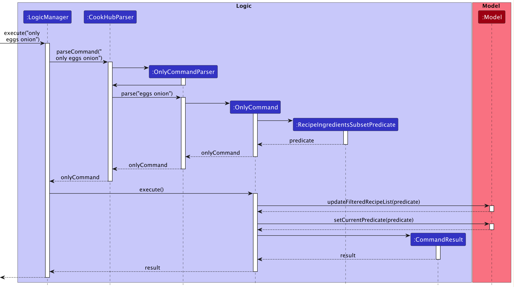
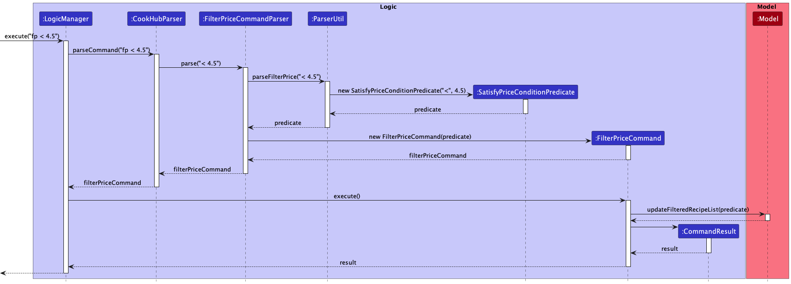

    

CookHub is a desktop application for student chefs who have limited time and resources on their hands, 
optimized for use via the Command Line Interface (CLI) while still having the benefits of a Graphical User 
Interface (GUI).

CookHub is a powerful, but lightweight application that allows you to manage your recipes efficiently and 
effectively. 

* Table of Contents
{:toc}

--------------------------------------------------------------------------------------------------------------------
## **Purpose** ##
This Developer Guide for CookHub v1.4 serves to describe and illustrate the architecture systems used to 
design and implement the application. It contains an overall view of the system hierarchy, 
logical views of the system components, a process view of the system’s communication and reasons for 
specific design implementations. This guide is primarily intended for application developers.

--------------------------------------------------------------------------------------------------------------------

## **Acknowledgements**

CookHub is adapted from the [AddressBook-Level3](https://github.com/se-edu/addressbook-level3) project 
created by the [SE-EDU initative](https://se-education.org).

--------------------------------------------------------------------------------------------------------------------

## **Setting up, getting started**

Refer to the guide [_Setting up and getting started_](SettingUp.md).

--------------------------------------------------------------------------------------------------------------------

## **Design**

:bulb: **Tip:** The `.puml` files used to create diagrams in this document can be found in the [diagrams](https://github.com/se-edu/addressbook-level3/tree/master/docs/diagrams/) folder. Refer to the [_PlantUML Tutorial_ at se-edu/guides](https://se-education.org/guides/tutorials/plantUml.html) to learn how to create and edit diagrams.

### Architecture

The ***Architecture Diagram*** given above explains the high-level design of the App.

Given below is a quick overview of main components and how they interact with each other.

**Main components of the architecture**

**`Main`** has two classes called [`Main`](https://github.com/se-edu/addressbook-level3/tree/master/src/main/java/seedu/address/Main.java) and [`MainApp`](https://github.com/se-edu/addressbook-level3/tree/master/src/main/java/seedu/address/MainApp.java). It is responsible for,
* At app launch: Initializes the components in the correct sequence, and connects them up with each other.
* At shut down: Shuts down the components and invokes cleanup methods where necessary.

[**`Commons`**](#common-classes) represents a collection of classes used by multiple other components.

The rest of the App consists of four components.

* [**`UI`**](#ui-component): The UI of the App.
* [**`Logic`**](#logic-component): The command executor.
* [**`Model`**](#model-component): Holds the data of the App in memory.
* [**`Storage`**](#storage-component): Reads data from, and writes data to, the hard disk.

**How the architecture components interact with each other**

The *Sequence Diagram* below shows how the components interact with each other for the scenario where the user issues the command `delete 1`.

Each of the four main components (also shown in the diagram above),

* Defines its *API* in an `interface` with the same name as the Component.
* Implements its functionality using a concrete `{Component Name}Manager` class (which follows the corresponding API `interface` mentioned in the previous point.

For example, the `Logic` component defines its API in the `Logic.java` interface and implements its functionality using the `LogicManager.java` class which follows the `Logic` interface. Other components interact with a given component through its interface rather than the concrete class (reason: to prevent outside component's being coupled to the implementation of a component), as illustrated in the (partial) class diagram below.

The sections below give more details of each component.

### UI component

The **API** of this component is specified in [`Ui.java`](https://github.com/se-edu/addressbook-level3/tree/master/src/main/java/seedu/address/ui/Ui.java)

The UI consists of a `MainWindow` that is made up of parts e.g.`CommandBox`, `ResultDisplay`, 
`RecipeListPanel`,
`StatusBarFooter` etc. All these, including the `MainWindow`, inherit from the abstract `UiPart` class which captures the commonalities between classes that represent parts of the visible GUI.

The `UI` component uses the JavaFx UI framework. The layout of these UI parts are defined in matching `.fxml` files that are in the `src/main/resources/view` folder. For example, the layout of the [`MainWindow`](https://github.com/se-edu/addressbook-level3/tree/master/src/main/java/seedu/address/ui/MainWindow.java) is specified in [`MainWindow.fxml`](https://github.com/se-edu/addressbook-level3/tree/master/src/main/resources/view/MainWindow.fxml)

The `UI` component,

* Executes user commands using the `Logic` component.
* Listens for changes to `Model` data so that the UI can be updated with the modified data.
* Keeps a reference to the `Logic` component, because the `UI` relies on the `Logic` to execute commands.
* Depends on some classes in the `Model` component, as it displays `Recipe` object residing in the `Model`.

### Logic component

**API** : [`Logic.java`](https://github.com/se-edu/addressbook-level3/tree/master/src/main/java/seedu/address/logic/Logic.java)

Here's a (partial) class diagram of the `Logic` component:

How the `Logic` component works:
1. When `Logic` is called upon to execute a command, it uses the `CookHubParser` class to parse the user command.
2. This results in a `Command` object (more precisely, an object of one of its subclasses e.g., `AddCommand`) which is executed by the `LogicManager`.
3. The command can communicate with the `Model` when it is executed (e.g. to add a recipe).
4. The result of the command execution is encapsulated as a `CommandResult` object which is returned back from `Logic`.

The Sequence Diagram below illustrates the interactions within the `Logic` component for the `execute("delete 1")` API call.

:information_source: **Note:** The lifeline for `DeleteCommandParser` should end at the destroy marker (X) but due to a limitation of PlantUML, the lifeline reaches the end of diagram.

Here are the other classes in `Logic` (omitted from the class diagram above) that are used for parsing a user command:

How the parsing works:
* When called upon to parse a user command, the `CookHubParser` class creates an `XYZCommandParser` (`XYZ` is a placeholder for the specific command name e.g., `AddCommandParser`) which uses the other classes shown above to parse the user command and create a `XYZCommand` object (e.g., `AddCommand`) which the `CookHubParser` returns back as a `Command` object.
* All `XYZCommandParser` classes (e.g., `AddCommandParser`, `DeleteCommandParser`, `EditCommandParser`, `FindCommandParser`, `CookHubParser`) inherit from the `Parser` interface so that they can be treated similarly where possible e.g, during testing.

### Model component
**API** : [`Model.java`](https://github.com/se-edu/addressbook-level3/tree/master/src/main/java/seedu/address/model/Model.java)

The `Model` component,

* Stores the address book data i.e., all `Recipe` objects (which are contained in a `UniqueRecipeList` 
  object).
* Stores the currently 'selected' `Recipe` objects (e.g., results of a search query) as a separate _filtered_ 
  list which is exposed to outsiders as an unmodifiable `ObservableList<Recipe>` that can be 'observed' e.g. 
  the UI can be bound to this list so that the UI automatically updates when the data in the list change.
* Stores a `UserPref` object that represents the user’s preferences. This is exposed to the outside as a `ReadOnlyUserPref` objects.
* Does not depend on any of the other three components (as the `Model` represents data entities of the domain, they should make sense on their own without depending on other components)

### Storage component

**API** : [`Storage.java`](images/StorageClassDiagram.png)

The `Storage` component,
* can save both recipe book data and user preference data in json format, and read them back into corresponding objects.
* inherits from both `RecipeBookStorage` and `UserPrefStorage`, which means it can be treated as either one (if only the functionality of only one is needed).
* depends on some classes in the `Model` component (because the `Storage` component's job is to save/retrieve objects that belong to the `Model`)
* converts classes into their respective string formats in order to save them in json format

### Common classes

Classes used by multiple components are in the `seedu.recipebook.commons` package.

--------------------------------------------------------------------------------------------------------------------

## **Implementation**

This section describes some noteworthy details on how certain features are implemented.

### Add feature

#### What is it?
The `add` command is a fundamental feature of CookHub and it allows users to easily manage add recipes to their recipe book.
By typing this command with the correct command flags, users can add their own recipes, which contain the title, description, steps, ingredients, and tags.

#### Usage
The `add` command format is as shown below:

`add t/TITLE d/DESCRIPTION i/INGREDIENT... s/STEP... [tag/TAG]...`

The meanings of each prefix is as shown below:
- `t/` signifies the title of the recipe
- `d/` signifies the description of the recipe
- `i/` signifies the ingredient of the recipe
- `s/` signifies the step of the recipe
- `tag/` signifies the tag of the recipe

#### Implementation 
The add application mechanism is facilitated by the Ui, Logic and Model components of CookHub.

Given below are the steps that illustrate the interaction between the components when it receives a valid add
application command from the user.

1. The Ui component receives the user command from the `CommandBox` of the GUI.
2. The command is passed to `LogicManager` via its `execute()` method.
3. The `LogicManager` passes the string input to the `CookHubParser` via the `parseCommand()` method.
4. The `CookHubParser` in turn creates an `AddCommandParser` which has the purpose of parsing `add` commands.
5. The `CookHubParser` then passes the string input to the `AddCommandParser` via the `parse()` method.
6. The `AddCommandParser` then identifies the different prefixes in the string and creates respective recipe components
   (i.e. title, description, steps, ingredients) by calling on `ParserUtil`.
7. `ParserUtil` creates the recipe components and returns it back to `AddCommandParser`.
8. `AddCommandParser` creates a `Recipe` instance with the recipe components as the parameters.
9. The newly created `Recipe` instance will then be used to create an `AddCommand`. This command instances
   is returned to `LogicManager`.
10. The `LogicManager` then calls the `execute()` method of the `AddCommand`. 
11. `AddCommand` then calls the `addRecipe(recipe)` of `Model`.
12. An instance of `CommandResult` is returned, signifying a successful command execution.
13. The Ui component displays the contents of the `CommandResult` to the User.
The sequence diagram for the `add` command is as shown below:

### Find feature

#### What is it? 
The `find` command helps users search recipes according to which component of the recipe they are looking for.

Users can find the application by using the command flags. The command flags specifies signifies which component
of a recipe you are searching through.

#### Usage 
The `find` command format is as shown below:

`find [r/RECIPE] [t/TITLE] [s/STEP] [i/INGREDIENT] [tag/TAG]`

The meaning of each prefix is as shown below:

- the flag `r/` searches through the entire recipe and its components
- the flag `t/` searches only through the recipe's title
- the flag `s/` searches only through the recipe's steps
- the flag `i/` seaches only through the recipe's ingredient names
- the flag `tag/` searches only through the recipe's tags

#### Implementation

1. The Ui component receives the user command from the `CommandBox` of the GUI.
2. The command is passed to `LogicManager` via its `execute()` method.
3. The `LogicManager` passes the string input to the `CookHubParser` via the `parseCommand()` method.
4. The `CookHubParser` in turn creates an `FindCommandParser`.
5. The `CookHubParser` then passes the string input to the `FindCommandParser` via the `parse()` method.
6. The `FindCommandParser` then identifies the different prefixes in the string and creates a list of keywords.
7. `FindCommandParser` will then call the respective methods responsible for parsing the predicate related to the current
command flags (i.e. `parseTitlePredicate`, `parseIngredientsPredicate`, etc.)) in `ParserUtil`.
8. `ParserUtil` creates an instance of `ContainsKeywordsPredicate`.
9. `FindCommandParser` will instantiate an instance of `FindCommand` with the previously obtained predicate as the parameter.
10. The `LogicManager` then calls the `execute()` method of the `FindCommand`.
11. The current recipe book is updated by calling `updateFilteredRecipeList(predicate)` on `Model`. 
12. An instance of `CommandResult` is created which contains the information that will be displayed back to the User after
    the execution of the command.
13. The Ui component displays the contents of the `CommandResult` to the User.

The sequence diagram for the `find` command is as shown below:

### Only feature

#### What is it?
The `only` feature helps users gather a list of recipes that can be made with only a limited set of ingredients.

Users can type in a list of ingredients. A list of recipes that can be made with those ingredients, or less will be displayed.

#### Usage 
The `only` command format is as shown below:

`only INGREDIENT...`

#### Implementation 
1. The Ui component receives the user command from the `CommandBox` of the GUI.
2. The command is passed to `LogicManager` via its `execute()` method.
3. The `LogicManager` passes the string input to the `CookHubParser` via the `parseCommand()` method.
4. The `CookHubParser` in turn creates an `OnlyCommandParser` that is responsible for the specific purpose of
   parsing user commands for finding applications.
5. The `CookHubParser` then passes the string input to the `OnlyCommandParser` via the `parse()` method.
6. The `OnlyCommandParser` then identifies the different prefixes in the string and creates a list of keywords.
7. An instance of `RecipeIngredientsSubsetPredicate` is created.
8. An instance of`OnlyCommand()` with `RecipeIngredientsSubsetPredicate` as the parameter
9. This `OnlyCommand` is returned to `LogicManager`.
10. The `LogicManager` then calls the `execute()` method of the `OnlyCommand`. 
11. The current recipe book is updated by calling `updateFilteredRecipeList(predicate)` on `Model`.
12. An instance of `CommandResult` is created which contains the information that will be displayed back to the User after
    the execution of the command.
13. The Ui component displays the contents of the `CommandResult` to the User.
    
The sequence diagram for the `only` command is as shown below:

### Sort feature

#### What is it?
The `sort` command helps users sort recipes in ascending or descending order of price.

#### Usage
The `sort` command format is as shown below:

`find ORDER`

- *ORDER* can only be `asc` or `desc`.
- `asc` is used for ascending order, and `desc` is used for descending order
- The price of a recipe is determined by cost of all ingredients required.

#### Implementation

The following activity diagram for the `sort` command shows a high-level logic of how the logic of the sort command 
is implemented. 

The explanation for the diagram in text form is as follows:

If the order is asc, the recipe is sorted in ascending order of price and the sorted list is displayed 
by the UI. If the order is desc, the recipe is sorted in descending order of price and the sorted list is displayed
by the UI. Otherwise, a ParseException containing a message informing users that the sort order can only be `asc` or `desc`
will be displayed by the UI.

### Filter by price feature

#### What is it?
The `fp` command helps users filter out all recipes that satisfies a certain price condition

#### Usage
The `fp` command format is as shown below:

`fp COMPARATOR PRICE`

- *COMPARATOR* can only be `<` or `>`.
- `<` is used to represent "less than"
- `>` is used to represent "more than"
- *PRICE* can take on any positive real number
- The price of a recipe is determined by cost of all ingredients required.
- 
#### Implementation

1. The Ui component receives the user command from the `CommandBox` of the GUI.
2. The command is passed to `LogicManager` via its `execute()` method.
3. The `LogicManager` passes the string input to the `CookHubParser` via the `parseCommand()` method.
4. The `CookHubParser` in turn creates an `FindCommandParser`.
5. The `CookHubParser` then passes the string input to the `FilterPriceCommandParser` via the `parse()` method.
6. The `FilterPriceCommandParser` then passes the string input to the `FilterPriceCommandParser`
via the`parseFilterPrice()` method.
7. The `ParserUtil` then parses out the *COMPARATOR* and *PRICE* and creates a new
`SatisfyPriceConditionPredicate` by passing the two arguments into its constructor.
8. The `SatisfyPriceConditionPredicate` is returned to `FilterPriceCommandParser` which creates a new `FilterPriceCommand`
by passing the predicate into its constructor.
9. This `FilterPriceCommand` is then returned to `LogicManager`.
10. The `LogicManager` then calls the `execute()` method of the `FilterPriceCommand`.
11. The current recipe book is updated by calling `updateFilteredRecipeList(predicate)` on `Model`.
12. An instance of `CommandResult` is created which contains the information that will be displayed back to the User after
    the execution of the command.
13. Finally, the Ui component displays the contents of the `CommandResult` to the User.

The sequence diagram for the `find` command is as shown below:

### \[Proposed\] Data archiving

_{Explain here how the data archiving feature will be implemented}_
- Currently, we are not doing data archiving, however that will be in consideration for your future iteration v1.3

--------------------------------------------------------------------------------------------------------------------

## **Documentation, logging, testing, configuration, dev-ops**

* [Documentation guide](Documentation.md)
* [Testing guide](Testing.md)
* [Logging guide](Logging.md)
* [Configuration guide](Configuration.md)
* [DevOps guide](DevOps.md)

--------------------------------------------------------------------------------------------------------------------

## **Appendix: Requirements**

### Product scope

**Target user profile**:

* Student chefs who favour their own collection of personal recipes rather than online recipes
* Student chefs on a tight budget and schedule
* Student chefs who have limited ingredients
* Student chefs who are capable of typing fast
* Prefers typing to mouse interaction
* Is reasonably comfortable using CLI applications

**Value proposition**:

* Increase efficiency of preparing ingredients and cooking given limited time and resources
* Provide convenience to student chefs with recipes catered to their needs
* Easily plan out a week's worth of meals with grocery lists and meal plans
* Helps student chefs easily access their personal vault of recipes instead of using a recipe notebook
* Easy customisation of personal recipes without wasting space (cancelling on the notebook or writing on a new page)
* Quick access to recipes while on the go

### User stories

Priorities: High (must have) - `* * *`, Medium (nice to have) - `* *`, Low (unlikely to have) - `*`

| Priority | As a …​                               | I want to …​                                                                                           | So that I can…​                                                                                                                                           |
|----------|---------------------------------------|--------------------------------------------------------------------------------------------------------|-----------------------------------------------------------------------------------------------------------------------------------------------------------|
| `* `     | cook                                  | easily view the recipes that I viewed recently                                                         | have easy access to my favourite recipes                                                                                                                  |
| `* * `   | cook                                  | assign difficulty tags                                                                                 | easily search up easy recipes when I am busy                                                                                                              |
| `* `     | cook on a limited budget              | filter recipes by cost                                                                                 | so I can use recipes that costs less                                                                                                                      |
| `* * `   | student who wants to stay fit         | assign healthy tags                                                                                    | make meals that are healthy                                                                                                                               |
| `* `     | cook                                  | add designs to my recipe                                                                               | to beautify it                                                                                                                                            |
| `* * * ` | cook                                  | add a title to the recipe                                                                              | refer to it easily                                                                                                                                        |
| `* * * ` | cook                                  | have a clear view of my recipe                                                                         | easily follow instructions to make a meal                                                                                                                 |
| `* * * ` | cook                                  | read the recipes I have created                                                                        ||
| `* * * ` | cook                                  | create a recipe                                                                                        ||
| `* * `   | student who has limited time          | search for the cooking time                                                                            | be better able to plan my time                                                                                                                            |
| `* `     | student with limited mental resources | create a meal plan for the week                                                                        | take less time to think                                                                                                                                   |
| `* `     | cook                                  | get a random recipe                                                                                    | get inspiration for what to cook                                                                                                                          |
| `* * * ` | cook                                  | see usage instructions                                                                                 | refer to instructions when I forget how to use the App                                                                                                    |
| `* * `   | cook                                  | duplicate recipes                                                                                      | easily add variations                                                                                                                                     |
| `* * `   | consumer of food                      | rate the recipes                                                                                       | know which ones are worth cooking again                                                                                                                   |
| `* * * ` | cook                                  | edit all parts of the recipe                                                                           | update and improve on the recipe after trying it out                                                                                                      |
| `* * `   | cook                                  | save my favourite recipes                                                                              | easily find them again                                                                                                                                    |
| `* * `   | cook                                  | categorize my recipes with labels                                                                      | easily sort and filter them                                                                                                                               |
| `* * * ` | cook                                  | delete recipes                                                                                         ||
| `* * `   | cook with limited ingredients         | search up on recipes that contain only the ingredients I have in my fridge                             |                                                                                                                                                           |
| `* `     | cook                                  | get a list of groceries I need for the recipes for the week                                            | limit my trips to the grocery store                                                                                                                       |
| `* * `   | student with limited finanaces        | add in the price of the ingredients                                                                    | budget for my meals                                                                                                                                       |
| `* * * ` | cook                                  | add recipes step by step                                                                               | easily follow along when cooking easily                                                                                                                   |
| `* * * ` | novice cook                           | add recipes step by step                                                                               | easily follow along while cooking                                                                                                                         |
| `* * `   | cook                                  | input the number of servings wanted and have the amount of ingredients needed be updated automatically | input the number of servings wanted and have the amount of ingredients needed be updated automatically so that a different number of people can be served |
| `* * `   | cook                                  | see most recent recipe cooked                                                                          | to quickly cook                                                                                                                                           |
| `* * `   | cook                                  | easily search recipes based on the ingredients                                                         | so that I can always find something to cook                                                                                                               |
| `* * `   | friend                                | export recipes                                                                                         | family and friends can use my ideas                                                                                                                       |
| `* * `   | cook                                  | import recipes easily                                                                                  | save time adding recipes                                                                                                                                  |
| `* * `   | cook                                  | add ingredients to each recipe                                                                         | know what I need to cook                                                                                                                                  |
| `* * `   | cook                                  | get a list of groceries to buy                                                                         | know what groceries I need to cook my recipes                                                                                                             |

*{More to be added}*

### Use cases

(For all use cases below, the **System** is `CookHub` and the **Actor** is the `user`, unless specified otherwise)

**Use case: UC01 - Add a recipe**

**MSS**

1. User requests to add a recipe.
2. CookHub creates the recipe and displays the updated recipe list.

   Use case ends.

**Extensions**

* 1a. User did not provide details for mandatory fields (title, description, ingredients, steps).
  * 1a1. CookHub displays an error message that specifies the fields that are missing.
    
    Use case ends.

* 1b. Error occurred when parsing arguments for certain fields.
  * 1b1. CookHub displays an error message that specifies the incorrect input field value entered.

    Use case ends.

* 1c. Recipe already exists in CookHub.
  * 1c1. CookHub displays an error message that informs user of the duplicate recipe.

    Use case ends.

    
**Use case: UC02 - Delete a recipe**

**MSS**

1. User requests to delete a specific recipe.
2. CookHub deletes the recipe and displays the updated recipe list.

   Use case ends.

**Extensions**

* 1a. The list is empty.

  Use case ends.

* 1a.  The specified index is invalid.
   *  1a1. CookHub shows an error message.

      Use case ends.

* 1b. User did not provide any index.
  * 1b1. CookHub shows an error message.

    Use case ends.
  

**Use case: UC03 - Edit a recipe**

**MSS**
1. User requests to edit a specific recipe.
2. CookHub edits the recipe and displays the updated recipe list.

    Use case ends.

**Extensions**

* 1a. The list is empty.

  Use case ends.

* 1a.  The specified index is invalid.
    *  1a1. CookHub shows an error message.

       Use case ends.

* 1b. User did not provide any index.
    * 1b1. CookHub shows an error message.

      Use case ends.

* 1c. Error occurred when parsing arguments for specified fields to edit.
    * 1c1. CookHub displays an error message that specifies the incorrect input field value entered.

      Use case ends.

**Use case: UC04 - Clear recipe list**

**MSS**
1. User requests to clear all recipes in the recipe book.
2. CookHub displays a new empty recipe book.

   Use case ends.

**Use case: UC05 - Exit CookHub**

**MSS**
1. User requests to exit the program.
2. CookHub closes the program window.

    Use case ends.

**Use case: UC06 - Find recipes by keywords**

**MSS**
1. User requests to find recipes using the title, description, ingredient, step or tag as the keyword.
2. CookHub displays the filtered list of recipes.

   Use case ends.

**Extensions**

* 1a. User did not provide any keyword.
    * 1a1. CookHub displays an error message.

      Use case ends.

* 1b. No matching recipes are found and the filtered list is empty.
    
    Use case resumes at step 2.

**Use case: UC07 - Sort recipes by specified order**

**MSS**
1. User requests to sort recipe book by ascending or descending order of price.
2. CookHub displays the sorted list of recipes.

   Use case ends.

**Extensions**

* 1a. User did not provide any order.
    * 1a1. CookHub displays an error message.

      Use case ends.

* 1b. User provided an order that is not recognized by CookHub (not ascending nor descending).
    * 1b1. CookHub displays an error message.

      Use case ends.
    

**Use case: UC08 - Filter recipes by price**

**MSS**
1. User requests to filter recipes that are lower than or higher than specified value.
2. CookHub displays the filtered list of recipes.

   Use case ends.

**Extensions**

* 1a. User did not provide the right command format.
    * 1a1. CookHub displays an error message.

      Use case ends.

* 1b. No recipes fall in the range of price and the filtered list is empty.

  Use case resumes at step 2.

**Use case: UC09 - Favourite a recipe**

**MSS**

1. User requests to add a specific recipe to favourites.
2. CookHub adds the recipe to favourites and displays the updated recipe list.

   Use case ends.

**Extensions**

* 1a.  The specified index is invalid.
    *  1a1. CookHub shows an error message.

       Use case ends.

* 1b. User did not provide any index.
    * 1b1. CookHub shows an error message.

      Use case ends.

**Use case: UC10 - Get groceries for recipes**

**MSS**

1. User requests to get a list of groceries for the specified recipes.
2. CookHub displays the ingredients required for the specified recipes.

   Use case ends.

**Extensions**

* 1a.  The specified indices are invalid.
    *  1a1. CookHub shows an error message.

       Use case ends.

* 1b. User did not provide any index.
    * 1b1. CookHub shows an error message.

      Use case ends.

### Non-Functional Requirements

1. Should work on any mainstream OS as long as there is Java 11 installed.
2. Should be able to support almost 500 to 1000 recipes without noticeable sluggishness in performance for 
   typical usage, depending on the size of each recipe.
3. A user with above average typing speed for regular English text should be able to accomplish most of 
   the tasks faster using commands than using the mouse.
4. Should be able to be scalable to store more aspects of a recipe, or more functionalities, such as 
   tagging, sorting, etc.
5. Should not be required to handle pictures of recipes or ingredients.
6. Should have a response time of 5 seconds or less.
7. Should support the use of UK and US English language.

### Glossary

* **Mainstream OS**: Windows, Linux, Unix, OS-X
* **GUI**: Graphical User Interface, a visual display that allows interaction with users
* **API**: Application Programming Interface, a set of functions that allow created applications to access 
  the features of an operating system, application or other service
* **Recipe book**: A book of instructions explaining how to prepare various kinds of dishes  

--------------------------------------------------------------------------------------------------------------------

## **Appendix: Instructions for manual testing**

Given below are instructions to test the app manually.

:information_source: **Note:** These instructions only provide a starting point for testers to work on;
testers are expected to do more *exploratory* testing.

### Launch and shutdown

1. Initial launch

   1. Download the jar file and copy into an empty folder

   1. Double-click the jar file Expected: Shows the GUI with an empty list. The window size may not be 
      optimum.

2. Saving window preferences

   1. Resize the window to an optimum size. Move the window to a different location. Close the window.

   2. Re-launch the app by double-clicking the jar file. 
       Expected: The most recent window size and location is retained.
   
### Adding a recipe

1. Adding a recipe while all recipes are being shown
    1. Prerequisites: List all recipes using the `list` command. Multiple recipes in the list.

    2. Test case: `add t/Orange juice d/Yummy i/Orange, 1, piece, 0.50 s/Juice the orange` 
        Expected: `Orange juice` is added into the list. Success message shown in the result display.

    3. Test case: `add t/Corndogs` 
        Expected: No recipe is added. Error message shown in the result display.

### Editing a recipe

1. Editing a recipe while all recipes are being shown
    1. Prerequisites: List all recipes using the `list` command. Multiple recipes in the list.

    2. Test case: `edit 1 d/Refreshing`
        Expected: The description of the first recipe is changed to `Refreshing`. Success message shown in 
       the result display.
    
    3. Test case: `edit 1`
        Expected: The first recipe remains the same. Error message shown in the result display.

    4. Test case: `edit 0 t/Pizza`
        Expected: No recipe is edited. Error message shown in the result display.

### Deleting a recipe

1. Deleting a recipe while all recipes are being shown

   1. Prerequisites: List all recipes using the `list` command. Multiple recipes in the list.

   2. Test case: `delete 1` 
      Expected: First recipe is deleted from the list. Success message is shown in the result display.

   3. Test case: `delete 0` 
      Expected: No recipe is deleted. Error message shown in result display.

   4. Other incorrect delete commands to try: `delete`, `delete x`, `...` (where x is larger than the list size) 
      Expected: Similar to previous.
   

### Clearing all data

1. Prerequisites: List all recipes using the `list` command. Multiple recipes in the list.

2. Test case: `clear` 
    Expected: All data are deleted from CookHub.

3. Incorrect command to try: `clear.`
   Expected: No data deleted. Error message shown in result display.

### Saving data

1. Dealing with corrupted data files

   1. Open `data/recipebook.json` in the directory where CookHub is located at.
   2. On line 2, edit the word `recipes` to `recipe`.
   3. Relaunch `cookhub.jar`.
   4. Expected: Data is corrupted and the system will recognise the mismatch. CookHub starts with an empty 
      data file.

2. Dealing with missing data files

    1. Delete the file `recipebook.json` in the `data` directory where CookHub is located at.
    2. Relaunch `cookhub.jar`.
    3. Expected: Data file is missing. CookHub starts with an empty data file.

    

### Appendix: Planned Enhancements

1. Filter by price after find function will only apply the filter on the subset of recipes that have been generated by the "find" function

2. After sorting recipes by price, calling the list function will reset the list to its original order

3. The find command when used on two separate ingredients (eg. egg and tomatoes) will find all the recipes that use either eggs or tomatoes and not recipes that include both egg and tomatoes.

4. Modify edit function such that user cannot change a recipe title to one that already exists in the RecipeBook regardless of casing in the letters of the title.

5. Restrict ingredient name and unit of measurement to only valid inputs and not random string input or numerical input

6. All the command words, flags and arguments such as (sort asc or desc) should be case insensitive.

7. We want to upgrade the find command such that it can also find by substrings and not just by the words. e.g. `find t/egg` should be able to find a recipe with the title 'eggs'

8. Allow ingredients prices to be more general, for example, olive oil that is bought by the bottle. Currently in CookHub, we only allow to the users to input the price by tablespoon, which is hard to calculate.

9. Allow find to work with multiple flags

10. Duplicate ingredients should not be allowed

### Appendix: Effort
Our team has put in substantial effort into developing this application. Knowing who our product is 
targeted towards and determining how our product will meet their needs and solve their challenges are of 
utmost importance to us. As such, we have developed an extensive list of 31 [user stories](#user-stories) to 
generate the features we want to include in our application.

From then on, we had to prepare the codebase. An initial challenge we faced was understanding and refactoring the codebase which was complex and 
overwhelming. Morphing the model from `Person` to `Recipe` meant that we had to modify 
various classes and fields (e.g. changing the `email` field of the `Person` object to a `description` field 
for the `Recipe` object), and as a result, many test cases broke. However, we understood that this was part of the experience of understanding 
the codebase of AB3. As such, we devoted a significant amount of time fixing the test cases and morphing the code to follow our application's agenda.

We wanted to offer flexibility for users yet maintain a sense of structure and consistency with our 
application. Thus, a challenge was deciding on the right balance between how rigid we wanted to model the 
various fields of the `Recipe` object and how flexible user inputs can be. For instance, for the 
`Ingredient` class, we initially implemented it to simply take in an entire `String` with no check constraints. However, after 
careful deliberation and reflection on the issues that this imposed (e.g. the issue that users can input 
whatever they want into this field), we decided to structure the 
`Ingredient` field to take in a `String` that follows the format: `INGREDIENT_NAME, 
QUANTITY, UNIT_OF_MEASUREMENT, PRICE_PER_UNIT`. This allowed us 
to ensure structure in our codebase by doing a check on the various subfields of the `Ingredient` field 
(e.g. `QUANTITY` must be numeric while `INGREDIENT_NAME` must be a word or sentence).

Wanting to model a `Recipe` object in our application meant that we had to implement an extra panel to
allow users to view the details of the recipe (i.e `RecipeDetailsPanel`). With little experience in JavaFX,
this meant that we had to take the time to learn and familiarise ourselves with the library and the various
tools it offers. We also made extra effort to ensure that the UI was responsive, user-friendly and intuitive.

Overall, despite the limited time frame we had to work with to develop our product, we were able to 
prioritize the most essential features and functionalities, which allowed us to deliver a quality product. 
Not only that, we also developed a deeper understanding of the various software engineering methods, as 
well as honing our skills in areas such as brainstorming, testing and debugging. 
