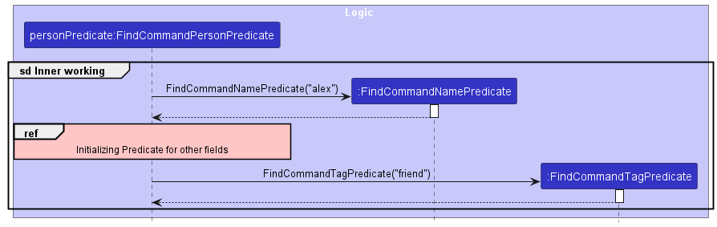

* Table of Contents
{:toc}

--------------------------------------------------------------------------------------------------------------------

## **Acknowledgements**

* This project is based on the AddressBook-Level3 project created by the [SE-EDU initiative](https://se-education.org).

--------------------------------------------------------------------------------------------------------------------

## **Introduction**

This Developer Guide serves as documentation of the **[architecture](#architecture)** and **[design](#design)** of **SOCket**, an application for managing contacts and projects quickly using CLI (Command Line Interface), with some key **[implementation](#implementation)** details of SOCKet's features. The current version of SOCket is `v1.4`.

The Developer Guide is written to aid present and future developers of SOCket with understanding the architecture, design and non-trivial implementations of SOCket's features. In doing so, this guide imparts the knowledge required for developers to further modify and extend the features and functionality of SOCket beyond its current state.

The code for SOCket is hosted on GitHub **[here](https://github.com/AY2223S2-CS2103T-T12-4/tp)**.

Refer to the following section for how to **[set up and get started](#setting-up-getting-started)** with SOCket.

--------------------------------------------------------------------------------------------------------------------

## **Setting up, getting started**

Refer to the guide [_Setting up and getting started_](SettingUp.md).

--------------------------------------------------------------------------------------------------------------------

## **Design**

:bulb: **Tip:** The `.puml` files used to create diagrams in this document can be found in the [diagrams](https://github.com/AY2223S2-CS2103T-T12-4/tp/tree/master/docs/diagrams/) folder. Refer to the [_PlantUML Tutorial_ at se-edu/guides](https://se-education.org/guides/tutorials/plantUml.html) to learn how to create and edit diagrams.

### Architecture

The ***Architecture Diagram*** given above explains the high-level design of the App.

Given below is a quick overview of main components and how they interact with each other.

**Main components of the architecture**

**`Main`** has two classes called [`Main`](https://github.com/AY2223S2-CS2103T-T12-4/tp/blob/master/src/main/java/seedu/socket/Main.java) and [`MainApp`](https://github.com/AY2223S2-CS2103T-T12-4/tp/blob/master/src/main/java/seedu/socket/MainApp.java). It is responsible for,
* At app launch: Initializes the components in the correct sequence, and connects them up with each other.
* At shut down: Shuts down the components and invokes cleanup methods where necessary.

[**`Commons`**](#common-classes) represents a collection of classes used by multiple other components.

The rest of the App consists of four components.

* [**`UI`**](#ui-component): The UI of the App.
* [**`Logic`**](#logic-component): The command executor.
* [**`Model`**](#model-component): Holds the data of the App in memory.
* [**`Storage`**](#storage-component): Reads data from, and writes data to, the hard disk.

**How the architecture components interact with each other**

The ***Sequence Diagram*** below shows how the components interact with each other for the scenario where the user issues the command `delete 1`.

Each of the four main components (also shown in the diagram above),

* defines its *API* in an `interface` with the same name as the component.
* implements its functionality using a concrete `{Component Name}Manager` class (which follows the corresponding API `interface` mentioned in the previous point.

For example, the `Logic` component defines its API in the `Logic.java` interface and implements its functionality using the `LogicManager.java` class which follows the `Logic` interface. Other components interact with a given component through its interface rather than the concrete class (reason: to prevent outside component's being coupled to the implementation of a component), as illustrated in the (partial) class diagram below.

The sections below give more details of each component.

### UI component

The **API** of this component is specified in [`Ui.java`](https://github.com/AY2223S2-CS2103T-T12-4/tp/blob/master/src/main/java/seedu/socket/ui/Ui.java)

Shown below is the class diagram for the `UI` component:

The UI consists of a `MainWindow` that is made up of parts e.g.`CommandBox`, `ResultDisplay`, `PersonListPanel`, `StatusBarFooter` etc. All these, including the `MainWindow`, inherit from the abstract `UiPart` class which captures the commonalities between classes that represent parts of the visible GUI.

The `UI` component uses the JavaFx UI framework. The layout of these UI parts are defined in matching `.fxml` files that are in the `src/main/resources/view` folder. For example, the layout of the [`MainWindow`](https://github.com/AY2223S2-CS2103T-T12-4/tp/blob/master/src/main/java/seedu/socket/ui/MainWindow.java) is specified in [`MainWindow.fxml`](https://github.com/AY2223S2-CS2103T-T12-4/tp/blob/master/src/main/resources/view/MainWindow.fxml)

The `UI` component,

* executes user commands using the `Logic` component.
* listens for changes to `Model` data so that the UI can be updated with the modified data.
* keeps a reference to the `Logic` component, because the `UI` relies on the `Logic` to execute commands.
* depends on some classes in the `Model` component, as it displays `Person` and `Project` object residing in the `Model`.

### Logic component

The **API** of this component is specified in [`Logic.java`](https://github.com/AY2223S2-CS2103T-T12-4/tp/blob/master/src/main/java/seedu/socket/logic/Logic.java)

Here's a (partial) class diagram of the `Logic` component:

How the `Logic` component works:
1. When `Logic` is called upon to execute a command, it uses the `SocketParser` class to parse the user command.
1. This results in a `Command` object (more precisely, an object of one of its subclasses e.g., `AddCommand`) which is executed by the `LogicManager`.
1. The command can communicate with the `Model` when it is executed (e.g. to add a person).
1. The result of the command execution is encapsulated as a `CommandResult` object which is returned back from `Logic`.

The Sequence Diagram below illustrates the interactions within the `Logic` component for the `execute("delete 1")` API call.

:information_source: **Note:** The lifeline for `DeleteCommandParser` should end at the destroy marker (X) but due to a limitation of PlantUML, the lifeline reaches the end of diagram.

Here are the other classes in `Logic` (omitted from the class diagram above) that are used for parsing a user command:

How the parsing works:
* When called upon to parse a user command, the `SocketParser` class creates an `XYZCommandParser` (`XYZ` is a placeholder for the specific command name e.g., `AddCommandParser`) which uses the other classes shown above to parse the user command and create a `XYZCommand` object (e.g., `AddCommand`) which the `SocketParser` returns back as a `Command` object.
* All `XYZCommandParser` classes (e.g., `AddCommandParser`, `DeleteCommandParser`, ...) inherit from the `Parser` interface so that they can be treated similarly where possible e.g, during testing.

Shown below is the activity diagram for how SOCket parses a user input:

### Model component
The **API** of this component is specified in [`Model.java`](https://github.com/AY2223S2-CS2103T-T12-4/tp/blob/master/src/main/java/seedu/socket/model/Model.java)

Shown below is the class diagram for the `Model` component:

The `Model` component,

* stores the `Socket` data, i.e., all `Person` objects (contained in a `UniquePersonList` object) and all `Project` objects (contained in a `UniqueProjectList` object).
* stores the `VersionedSocket` data, i.e., `Socket` states to restore, either to `undo` or `redo` changes
* stores the currently 'selected' `Person` objects (e.g., results of a search query) as a separate _filtered_ list which is exposed to outsiders as an unmodifiable `ObservableList<Person>` that can be 'observed' e.g. the UI can be bound to this list so that the UI automatically updates when the data in the list change.
* stores the `Project` objects as a separate _filtered_ list which is exposed to outsiders as an unmodifiable `ObservableList<Project>` that can be 'observed' e.g. the UI can be bound to this list so that the UI automatically updates when the data in the list change.
* stores a `UserPref` object that represents the user’s preferences. This is exposed to the outside as a `ReadOnlyUserPref` objects.
* does not depend on any of the other three components (as the `Model` represents data entities of the domain, they should make sense on their own without depending on other components)

:information_source: **Note:** An alternative (arguably, a more OOP) model is given below. It has `Language` and `Tag` lists in `Socket`, which `Person` references. This allows `Socket` to only require one `Language`/`Tag` object per unique language/tag, instead of each `Person` needing their own `Language`/`Tag` objects. 

### Storage component

The **API** of this component is specified in [`Storage.java`](https://github.com/AY2223S2-CS2103T-T12-4/tp/blob/master/src/main/java/seedu/socket/storage/Storage.java)

Shown below is the class diagram for the `Storage` component:

The `Storage` component,
* can save both `Socket` data and user preference data in json format, and read them back into corresponding objects.
* can save data on `Person` members of a `Project` and restore references to same `Person` objects in `UniquePersonList` upon reading `Socket` data back into corresponding objects.
* inherits from both `SocketStorage` and `UserPrefStorage`, which means it can be treated as either one (if only the functionality of only one is needed).
* depends on some classes in the `Model` component (because the `Storage` component's job is to save/retrieve objects that belong to the `Model`).

### Common classes

Classes used by multiple components are in the `seedu.socket.commons` package.

--------------------------------------------------------------------------------------------------------------------

## **Implementation**

This section describes some noteworthy details on how certain features are implemented.

### Undo/Redo feature

#### Implementation

_This feature was implemented as proposed in [AddressBook-Level3](https://se-education.org/addressbook-level3/DeveloperGuide.html#proposed-undoredo-feature)_

The undo/redo mechanism is facilitated by `VersionedSocket`. It extends `Socket` with an undo/redo history, stored internally as an `socketStateList` and `currentStatePointer`. Additionally, it implements the following operations:

* `VersionedSocket#commit()` — Saves the current 'Socket' state in its history.
* `VersionedSocket#undo()` — Restores the previous 'Socket' state from its history.
* `VersionedSocket#redo()` — Restores a previously undone 'Socket' state from its history.

These operations are exposed in the `Model` interface as `Model#commitSocket()`, `Model#undoSocket()` and `Model#redoSocket()` respectively.

Given below is an example usage scenario and how the undo/redo mechanism behaves at each step.

Step 1. The user launches the application for the first time. The `VersionedSocket` will be initialized with the initial `Socket` state, and the `currentStatePointer` pointing to that single `Socket` state.

Step 2. The user executes `delete 5` command to delete the 5th person in 'Socket'. The `delete` command calls `Model#commitSocket()`, causing the modified state of `Socket` after the `delete 5` command executes to be saved in the `socketStateList`, and the `currentStatePointer` is shifted to the newly inserted `Socket` state.

Step 3. The user executes `add n/David …​` to add a new person. The `add` command also calls `Model#commitSocket()`, causing another modified `Socket` state to be saved into the `socketStateList`.

:information_source: **Note:** If a command fails its execution, it will not call `Model#commitSocket()`, so the `Socket` state will not be saved into the `socketStateList`.

Step 4. The user now decides that adding the person was a mistake, and decides to undo that action by executing the `undo` command. The `undo` command will call `Model#undoSocket()`, which will shift the `currentStatePointer` once to the left, pointing it to the previous `Socket` state, and restores `Socket` to that state.

:information_source: **Note:** If the `currentStatePointer` is at index 0, pointing to the initial `Socket` state, then there are no previous `Socket` states to restore. The `undo` command uses `Model#canUndoSocket()` to check if this is the case. If so, it will return an error to the user rather
than attempting to perform the undo.

The following sequence diagram shows how the undo operation works:

:information_source: **Note:** The lifeline for `UndoCommand` should end at the destroy marker (X) but due to a limitation of PlantUML, the lifeline reaches the end of diagram.

The `redo` command does the opposite — it calls `Model#redoSocket()`, which shifts the `currentStatePointer` once to the right, pointing to the previously undone state, and restores `Socket` to that state.

:information_source: **Note:** If the `currentStatePointer` is at index `socketStateList.size() - 1`, pointing to the latest `Socket` state, then there are no undone `Socket` states to restore. The `redo` command uses `Model#canRedoSocket()` to check if this is the case. If so, it will return an error to the user rather than attempting to perform the redo.

Step 5. The user then decides to execute the command `list`. Commands that do not modify the `Socket`, such as `list`, will usually not call `Model#commitSocket()`, `Model#undoSocket()` or `Model#redoSocket()`. Thus, the `socketStateList` remains unchanged.

Step 6. The user executes `clear`, which calls `Model#commitSocket()`. Since the `currentStatePointer` is not pointing at the end of the `socketStateList`, all `Socket` states after the `currentStatePointer` will be purged. Reason: It no longer makes sense to redo the `add n/David …​` command. This is the behavior that most modern desktop applications follow.

The following activity diagram summarizes what happens when a user executes a new command:

#### Design considerations

**Aspect: How undo & redo executes:**

* **Alternative 1 (current choice):** Saves the entire `Socket`.
  * Pros: Easy to implement.
  * Cons: May have performance issues in terms of memory usage.

* **Alternative 2:** Individual command knows how to undo/redo by
  itself.
  * Pros: Will use less memory (e.g. for `delete`, just save the person being deleted).
  * Cons: We must ensure that the implementation of each individual command are correct.

### List Feature

#### Implementation

The `list` feature allows user to display a list of persons. The user can filter the list by tag or language. `list` filters the list by **AND** search. If no argument is given, then list by default displays all persons in SOCket.
The feature is mainly facilitated by the `ListCommand` class and with the help of Predicate classes.
`ListCommand` extends `Command` and implements the following operation:
* `ListCommand#execute()` - Displays the list of persons in SOCket that contains the given keyword of each respective fields.

The `ListCommandParser` class is used to parse and verify the user input to create the list command.
Once the input is parsed by `ListCommandParser`, a list of keywords for each respective field is then used to create the respective Predicate class to check if any keyword matches the given field of a Person.

The Predicates relevant to `ListCommand` differ from `FindCommand` in the way that it looks for full keyword matches in Person(s). If no fields are given, list of persons will be update by `PREDICATE_SHOW_ALL_PERSONS`/ a true predicate.
Otherwise, this list of Predicate classes include:
* `ListCommandLanguagePredicate`
* `ListCommandTagPredicate`

This Predicate class will return True as long as any of the Predicate classes inside it returns True.
The Predicate classes works using an AND search, persons will be shown in the resulting list only if all the keywords given should match to the Person.

The following sequence diagram shows how the `list` operation works:

#### Design considerations

**Aspect: Filtering by other fields**

* Initially considered list to not have additional arguments but as decided to filter through Language and Tag due to:
  * Find currently does a partial keyword match, thus list allows user to have the option to do full keyword matches 
  * As language(s) and tag(s) are the only fields which can belong to more than one person, it makes sense to use list to do full keyword matches on these fields only.

### Sort Feature

#### Implementation

The sort feature allows users to sort the list of persons and projects in the application. 
The feature is facilitated by the `SortCommand` and `SortProjectCommand` classes. 
They extend `Command` and implements the following operations:
* `SortCommand#execute()` — Sorts the list of persons in the application.
* `SortProjectCommand#execute()` — Sorts the list of projects in the application.

The `SortCommandParser` and `SortProjectCommandParser` classes are used to parse the user input and create the respective commands. 
The respective classes verify that the user input is valid and create the commands accordingly.
If no argument is provided, Persons will be sorted by name and Projects will be sorted by deadline by default.

The input is then passed to the `sort` function in `UniquePersonList` and `UniqueProjectList` respectively.
The `sort` makes use of a comparator that sorts the persons or projects by the category specified by the user. 
If the person or project does not have that field, they are sorted at the back. If there are multiple persons or contacts where the field is empty, they are sorted by name.

The following sequence diagram shows how the sort operation works for persons (implementation is similar for projects):

### Find Feature

#### Implementation

The *find* feature allows users to display a list of contacts from SOCket that contains the given keyword of each respective fields.
The feature is facilitated by the `FindCommand` class mainly but Predicate classes are also used.
`FindCommand` extends `Command` and implements the following operation:
* `FindCommand#execute()` — Finds and displays the list of persons in the application that contains the given keyword of each respective fields.

The `FindCommandParser` class is used to parse & verify the user input to create the find command.
Once the input is parsed by `FindCommandParser`, a list of keywords for each respective field is then used to create a Predicate class that checks if any keyword matches the given field of a Person.

This list of Predicate classes include:
* `FindCommandAddressPredicate`
* `FindCommandEmailPredicate`
* `FindCommandLanguagePredicate`
* `FindCommandNamePredicate`
* `FindCommandPhonePredicate`
* `FindCommandProfilePredicate`
* `FindCommandTagPredicate`

All the above Predicate classes will be enclosed inside a `FindCommandPersonPredicate` class.
This Predicate class will return True as long as any of the Predicate classes inside it returns True.
The Predicate classes works using an OR search, as long as a keyword matches any word in the respective field, that person will be shown in the resulting list from find command.

If no argument is provided, an empty list will be shown.

The following sequence diagram shows how the `find` operation works:

#### Design considerations

**Aspect: AND search or OR search**
* An AND search has been considered for *find* initially but ultimately dropped in favor of OR search due to the following reasons:
  * *List* command already does an AND search. Though only on Tag & Language currently, it can be extended to include the other fields eventually, making *find* a duplicate command of *list* command should *find* command use AND search as well.
  * We intend for *find* command to be a more broad search, getting all persons that matches just a keyword. This is to help users narrow down their search should they forgot the exact name of a contact they are looking for.

**Aspect: Full keyword match or Partial keyword match**
* We have also considered a partial match of the keyword (For example: `han` keyword will match field with the value `hans`). However we decide to implement a full match due to the following reason:
  * Having partial match may bring out unintended matches as the possible range of results is broadened. We fear that doing a partial match may be too broad for find command to function as a way for users to narrow down their search.

### Remove Feature

#### Implementation

The remove feature allows users to remove a given value in Person's and Project's respective fields.
The feature is facilitated by the `RemoveCommand` class and `RemoveProjectCommand` classes.
They extend `Command` and implement the following operations:
* `RemoveCommand#execute()`  — Removes the respective Person's field value based on the given input.
* `RemoveProjectCommand#execute()`  — Removes the respective Project's field value based on the given input.

The `RemoveCommandParser` and `RemoveProjectCommandParser` classes are used to parse the user input and remove the value that matches to the existing value in the respective field using `RemovePersonDescriptor` and `RemoveProjectDescriptor` respectively.
`RemovePersonDescriptor` and `RemoveProjectDescriptor` objects are created and pass with the `Index` (parsed from the user input) into respective commands.
The respective classes verify that the user input is valid and create the commands accordingly.

If no argument is provided, an exception will be thrown. Otherwise, if only predicate is present, the corresponding field of the Person/Project will be emptied.

#### Design considerations

**Remove a specific field value**
* While an edit feature that allows users to add or remove field values can be useful in certain contexts, it may not be appropriate or necessary in all situations:
    * If user decides to remove 1 out of many field values in a person's tag field, user will have a difficult time to type all the must-have value. WIth remove feature, user just need to type out the tag that he/she wish to remove.
    * Currently, edit feature for language field is cumulative, language will not be removed, so remove feature helps to resolve the issue on language removal.

### Project feature:

#### Implementation

This feature allows users to create and track ongoing projects. Details of each `Project` are recorded as attributes of the `Project`, which include `ProjectName`, `ProjectRepoHost`, `ProjectRepoName`, `ProjectDeadline`, `ProjectMeeting`, and a `Set<Person>`, which stores the `Person` objects involved with the `Project`. `Project` objects are stored in a `UniqueProjectList` in `Socket`.

Any changes to `Person` objects that are associated with a `Project` object automatically updates the outdated `Person` object in the associated `Project` object (i.e., `edit`, `remove`, `delete`).

The following sequence diagram shows how updates are made to the associated `Project` object when updates are made to `Person` objects on execution of a `DeleteCommand`:

Step 1. The `DeleteCommand#execute()` method is called.

Step 2. The `ModelManager#deletePerson(p)` method of the `ModelManager` implementing the `Model` interface is then called.

Step 3. This calls the method `Socket#removePerson(p)`, which:

* calls `UniquePersonList#remove(p)` to delete the person `p` from the `UniquePersonList` `persons`.
* calls `UniqueProjectList#removeMemberInProjects(p)` which removes any stored references to the deleted person `p` from the `Project` objects in the `UniqueProjectList` `projects`.

Step 4. The execution of the `DeleteCommand` then continues, and the result is encapsulated as a `CommandResult` (not shown) and returned.

:information_source: **Note:** The diagram omits the `commitSocket()` and creation of a `CommandResult` portions of the execution as they are not relevant to the discussion.

Updates to `Person` objects associated with a `Project` object through the other commands are handled similarly.

The following classes handle operations on `Project` objects:
* `XYZProjectCommand` - represents a command operating on `Project` objects, i.e., `AddProjectCommand`, `EditProjectCommand`, etc.
* `XYZProjectCommandParser` - parses the respective `XYZProjectCommand` that operates on `Project` objects.
* `AssignCommand`, `UnassignCommand` - represent commands for assigning/unassigning a `Person` object to a `Project` object.

The `JsonAdaptedProject` class handles the reading/writing to storage for `Project` objects. It makes use of `JsonAdaptedPerson` to store the `Person` objects associated with the `Project`. Storage for `Person` objects associated with a `Project` object are stored in the `.json` file by making a copy of the data for the `Person` in the "persons" list in the "members" list under the respective `Project` object in the "projects" list.

When `JsonSerializableSocket#toModelType` is called to convert the stored data into a `Socket` object, the restored `Person` objects in the `UniquePersonList` are matched to the duplicate `Person` objects in the `Project` objects and the duplicate `Person` objects are replaced with the exiting objects in the `UniquePersonList`.

#### Design considerations:

**Aspect: How `Project` objects are stored:**

* **Alternative 1 (current choice):** Stores the `Project` objects with the `Person` objects in a single `.json` file.
    * Pros: Fewer files to manage, simpler to write data to upon any changes to `Socket`.
    * Cons: Corrupt data in "projects" will cause entire file to be discarded, deleting "persons" data.

* **Alternative 2:** Stores the `Project` objects with the `Person` objects in separate `.json` files.
    * Pros: Corrupt data in "projects" will only cause "projects" file to be discarded.
    * Cons: More files to manage, harder to write data to upon any changes to `Socket`.

--------------------------------------------------------------------------------------------------------------------

## **Documentation**

The [Documentation guide](Documentation.md) covers how documentation is managed for SOCket.

--------------------------------------------------------------------------------------------------------------------

## **Logging**

The [Logging guide](Logging.md) covers how logging is used in SOCket.

--------------------------------------------------------------------------------------------------------------------

## **Testing**

The [Testing guide](Testing.md) covers types of test cases used in SOCket, as well as how to run them.

--------------------------------------------------------------------------------------------------------------------

## **Configuration**

The [Configuration guide](Configuration.md) covers how certain properties of SOCket can be managed through the configuration file.

--------------------------------------------------------------------------------------------------------------------

## **Dev-ops**

The [DevOps guide](DevOps.md) covers build automation and steps to create releases for SOCket.

--------------------------------------------------------------------------------------------------------------------

## **Appendix: Requirements**

### Product scope

**Target user profile**:

* has a need to manage a significant number of contacts (peers, professors in NUS Computing)
* has a need to group and manage groups of contacts
* has a need to view the skills and proficiencies of contacts (programming languages, modules)
* has a need to access the GitHub profiles/repositories of contacts
* has a need to track deadlines and responsibilities associated with contacts
* prefer desktop apps over other types
* can type fast
* prefers typing to mouse interactions
* is reasonably comfortable using CLI apps

**Value proposition**: manage contacts faster than a typical mouse/GUI driven app, store information relevant to NUS Computing students (GitHub profile, repository, programming language proficiencies, modules taken), quickly find contacts that satisfy certain criteria (taken a particular module, in a group)

### User stories

Priorities: High (must have) - `* * *`, Medium (nice to have) - `* *`, Low (unlikely to have) - `*`

| Priority | As a …​                                                         | I can…​                                                    | So that I can…​                                                                           |
|----------|-----------------------------------------------------------------|------------------------------------------------------------|-------------------------------------------------------------------------------------------|
| `* * *`  | new user                                                        | see usage instructions                                     | refer to instructions when I forget how to use the App                                    |
| `* * *`  | user                                                            | add a new person                                           |                                                                                           |
| `* * *`  | user                                                            | delete a person                                            | remove entries that I no longer need                                                      |
| `* * *`  | user                                                            | find a person by name                                      | locate details of persons without having to go through the entire list                    |
| `* * *`  | student with many friends                                       | save my friend's details                                   | easily contact them                                                                       |
| `* * *`  | student who likes to ask questions                              | save my professors' details                                | easily contact them to ask questions                                                      |
| `* * *`  | student with fast typing speed                                  | use command based inputs to search for contacts            | quickly pull out contacts without needing to spend time moving my mouse                   |
| `* *`    | user                                                            | hide private contact details                               | minimize the chance of someone else seeing them by accident                               |
| `* *`    | student involved in project work                                | search contacts belonging to a certain group               | contact my groupmates easily                                                              |
| `* *`    | student with many assignments                                   | tag deadlines and responsibilities to my contacts          | easily keep track of which tasks are more urgent and who is taking care of it             |
| `* *`    | organised user                                                  | group contacts into different groups                       | manage my contacts easily                                                                 |
| `* *`    | software engineering student with many SE projects              | access the github repositories of my peers                 | easily keep track of the github repos that I'm involved and interested in                 |
| `* *`    | student interested in hackathons                                | find students based on skills                              | form groups with them                                                                     |
| `* *`    | software engineering student                                    | find repositories of group projects I am involved in       | easily access team repositories                                                           |
| `* *`    | student who is organised                                        | sort all my peers' contact information                     | have only one platform where I know my contacts are organized                             |
| `* *`    | software engineering student                                    | tag contacts with their skills                             | know what skills they have and can easily find those with a particular skill              |
| `* *`    | advanced user                                                   | use the shortcut keys                                      | get things done more effectively                                                          |
| `* *`    | busy software engineering student                               | create shortcuts to long commands                          | not type out long commands repeatedly to save time                                        |
| `* *`    | student constantly getting into new projects with other members | quickly remove tags of specific groups and delete contacts | not be flooded with too much irrelevant contacts which can cause accidental wrong contact |
| `* *`    | software engineering student with many peers                    | save and access my peers' github information               | easily access their profiles and view their repositories                                  |

### Use cases

(For all use cases below, the **System** is the `SOCket` and the **Actor** is the `user`, unless specified otherwise)

**Use case: UC01 - Add a contact**

**MSS:**

1.  User requests to add a contact.
2.  SOCket adds the contact.

    Use case ends.

**Extensions:**

* 1a. There are no details provided.

    * 1a1. SOCket shows an error message.

      Use case resumes at step 1.

* 1b. There is no name provided.

    * 1b1. SOCket shows an error message.

      Use case resumes at step 1.

**Use case: UC02 - Edit a contact**

**MSS:**

1.  User requests to list contacts.
2.  SOCket shows a list of contacts.
3.  User requests to edit a specific contact's details in the list.
4.  SOCket edits the contact's details.

**Extensions:**

* 2a. The list is empty.

  Use case ends.

* 3a. The given index is invalid.

    * 3a1. SOCket shows an error message.

      Use case resumes at step 2.

* 3b. There are no details provided.

    * 3b1. SOCket shows an error message.

      Use case resumes at step 2.

* 3c. There are no tags provided.

    * 3b1. SOCket removes all tags associated with the contact.

      Use case ends.

* 3d. There are tag(s) provided.

    * 3b1. SOCket removes existing tags associated with the contact and adds the tag(s) provided.

      Use case ends.

**Use case: UC03 Delete a contact**

**MSS:**

1.  User requests to list contacts.
2.  SOCket shows a list of contacts.
3.  User requests to delete a specific contact in the list.
4.  SOCket deletes the contact.

    Use case ends.

**Extensions:**

* 2a. The list is empty.

  Use case ends.

* 3a. The given index is invalid.

    * 3a1. SOCket shows an error message.

      Use case resumes at step 2.

**Use case: UC04 Sort contacts**

**MSS:**

1.  User requests to list contact.
2.  SOCket shows a list of contacts.
3.  User requests to sort the list by a category.
4.  SOCket sorts the contacts by that category and displays the sorted contact list.

    Use case ends.

**Extensions:**

* 2a. The list is empty.

  Use case ends.

* 3a. The given category is invalid.

  * 3a1. SOCket shows an error message. 
  
    Use case resumes from step 2.
  
* 3b. No category is given.

  * 3b1. SOCket sorts the list by name and displays the sorted list.
    
     Use case ends.

**Use case: UC05 Find contact(s)**

**MSS:**

1.  User request to find a contact with the given keywords in their respective fields.
2.  SOCket shows a list of contacts that contains any of the given keyword in their respective fields.

    Use case ends.

**Extensions:**

* 1a. No contact matches any of the given keywords in their respective fields.

    * 1a1. SOCket shows an empty list of contacts. 
      
      Use case ends.

* 1b. No keywords are given for all fields.

    * 1b1. SOCket shows an empty list of contacts.

      Use case ends.

**Use case: UC06 Clear contacts/tag**

**MSS:**

1. User chooses to clear off group of contacts.
2. SOCket requests for confirmation to delete the contacts.
3. User confirms.
4. SOcket deletes all the contacts.

Use case ends.

**Extensions:**

* 1a. All the given tags are present in SOCket.

  * 1a1. SOCket request to delete all the contacts under the tags.

* 1b. Some given tags are not present in SOCket.

  * 1b1. SOCket shows an error message, listing all the wrong tags.

  * 1b2. SOCket request to delete all the contacts under the correct tags.
    
    Use case resumes at step 2.

* 1c. All the given tag are not present in SOCket.

    * 1c1. SOCket shows an error message, listing all the wrong tags.
  
    * 1c2. SOCket requests for correct tags. 
  
      Steps 1c1-1c2 are repeated until a tag is entered correctly.

      Use case resumes at step 2.

* 1d. No tag is provided.

    * 1d1. SOCket request to delete all the contacts.

      Use case resumes at step 2.
  
* *a. At any time, User choose to cancel the operation.

    * *a1. SOCKet stops the operation.

      Use case ends.

**Use case: UC07 List contacts**

**MSS:**

1. User requests to list contacts.
2. SOCket shows a list of contacts.
3. User requests to list contacts by language(s) and tag(s).
4. SOCket shows a list of contacts with given language(s) and tag(s).

   Use case ends.

**Extensions:**

* 3a. The given tag(s) or language(s) is invalid.

    * 3a1. SOCket shows an error message.

      Use case resumes at step 2.
      
* 3b. No contact matches the given language(s) or tag(s). 

    * 3b1. SOCket shows an empty list of contacts. 
    
      Use case resumes at step 2. 

* 3c. No category is given.
      
  Use case resumes at step 2. 

**Use case: UC08 Access Help page**

**MSS:**

1. User requests for help.
2. SOCket shows the help page.

   Use case ends.

**Use case: UC09 - Exit SOCket**

**MSS:**

1.  User requests to exit SOCket.
2.  SOCket exits.

    Use case ends.

**Use case: UC10 Hide contact details**

**MSS:**

1. User requests to list contact.
2. SOCket shows a list of contacts.
3. User requests to hide a category of a specific contact.
4. SOCket hides the specific category of that user.

   Use case ends.

**Extensions:**

* 2a. The list is empty.

  Use case ends.

* 3a. The given category is invalid.

    * 3a1. SOCket shows an error message.

      Use case resumes at step 2.

* 3b. The contact does not have that category.

    * 3b1. SOCket shows an error message.

      Use case resumes at step 2.

      Use case ends.

**Use case: UC11 Using shortcut command**

**MSS:**

1.  User binds a command to a given keyword of their choice.
2.  SOCket shows a message to confirm shortcut key created.
3.  User types the keyword bound to the command.
4.  SOCket will execute the command.
    Use case ends.

**Extensions:**

*  3a. Command bounded to the keyword is not valid.

    * 3a1. SOCket shows an error message.

      Use case ends.

**Use case: UC12 Access peer GitHub information**

**MSS:**

1.  User requests to list contact.
2.  SOCket shows a list of contacts.
3.  User requests to view a specific contact's github information.
4.  SOCket opens the contact's github profile in a browser.

    Use case ends.

**Extensions:**

* 2a. The list is empty.

  Use case ends.

* 3a. The contact does not have github information.
    
   Use case resumes at step 2.

**Use case: UC13 Undo recent changes**

**MSS:**

1. User requests to undo changes.
2. SOCket undoes changes.

   Use case ends.

**Extensions:**

* 1a. No changes exist.

    * 1a1. SOCket shows an error message.

      Use case ends.

**Use case: UC14 Redo recent undone changes**

**MSS:**

1. User requests to restore recent undone changes.
2. SOCket restores undone changes.

   Use case ends.

**Extensions:**

* 1a. No undone changes exist.

    * 1a1. SOCket shows an error message.

      Use case ends.

**Use case: UC15 Tagging a contact**

**MSS:**

1.  User <ins>find contact(s) (UC05)</ins> they wish to tag.
2.  User tags the list of contacts currently shown with a tag name.
3.  SOCket tags all contacts in the list currently shown, displays all contacts with the given tag name to the user.

    Use case ends.

**Use case: UC16 Set deadlines & responsibilities**

**MSS:**

1. User has a team project and creates an event.
2. SOCket creates the event.
3. User request to groups all the team members contact under the event created.
4. SOCket groups the contacts together.
5. User enters a deadline date to each milestone of the project.
6. SOCket allocates the date to respective milestone.
7. User chooses to give role to each team members.
8. SOCket assigned the given roles to respective team members.

   Use case ends.

**Extensions:**

* 5a. SOCket detects a syntax error in the entered date.

    * 5a1. SOCket shows an error message.
  
      Use case resume at step 6 when the date entered is correct.

   Use case resumes at step 2.

**Use case: UC17 Removing tag/language(s)**

**MSS**

1. User found that he/she has place a wrong tag to a person.
2. User request to remove the specific tag.
3. SOCket find the person and removes the tag associated to it.

   Use case ends.

**Extensions**

* 2a. SOCket detects that user inputs an empty field after the tag prefix.

    * 2a1. SOCket removes all tags associated to it.

      Use case ends.

**Use case: UC18 Viewing a person's detail**

**MSS**

1. User <ins>find contact(s) (UC05)</ins> he/she wishes to view.
2. SOCket lists out all the contact associated to the category.
3. User wishes to view the first contact in the list.
4. SOCket displays all the person's information at the detail display window.

   Use case ends.

**Use case: UC19 Sorting project list**

Similar to **UC04 Sort Contacts**, except,
* the list being sorted is the list of projects instead of contacts
* the default sort when no category is provided is by the deadline of the project instead of the name.

**Use case: UC20 Assigning a member from a project**
1. _{ to be added }_

**Use case: UC21 Unassigning a member from a project**
1. User requests to remove a member from a project.
2. SOCket removes the member from the project.

   Use case ends.

**Extensions**

* 2a. The chosen member is not assigned to the project.
    * 2a1. SOCket shows an error message.

      Use case ends.
* 2b. The chosen project does not exist.
    * 2b1. SOCket shows an error message.

      Use case ends.

**Use case: UC22 Delete a project**

Similar to **UC03 Delete a contact**, except,
* a list of projects is shown instead of contacts.
* a project is deleted instead of a contact.

### Non-Functional Requirements

1.  Should work on any _mainstream OS_ as long as it has Java `11` or above installed.
1.  Should work on 64-bit environments.
1.  Should be able to hold up to 1000 contacts without a noticeable sluggishness in performance for typical usage.
1.  Should be able to hold up to 100 projects without a noticeable sluggishness in performance for typical usage.
1.  A user with above average typing speed for regular English text (i.e. not code, not system admin commands) should be able to accomplish most of the tasks faster using commands than using the mouse.

--------------------------------------------------------------------------------------------------------------------

## **Appendix: Glossary**

* **Mainstream OS**: Windows, Linux, Unix, OS-X
* **GitHub profile**: GitHub username e.g. `chia-yh`
* **GitHub repository**: repository path e.g. `AY2223S2-CS2103T-T12-4/tp`

--------------------------------------------------------------------------------------------------------------------

## **Appendix: Planned Enhancements**

1. The current `VALIDATION_REGEX` for validating the `Name` field is flawed, and does not consider names with `/`, `-` or `.` valid.
   1. Valid `Name` fields:
      1. `Hubert Blaine Wolfeschlegelsteinhausenbergerdorff Sr`
      1. `Alex Yeoh2`
   1. Invalid `Name` fields:
      1. `Balakrishnan s/o Nagamuthu`
      1. `Chien-Ming Wang`
      1. `S. R. Nathan`

   We plan to update the `VALIDATION_REGEX` to also allow other possible names including, but not limited to, those under "Invalid `Name` fields" above. The `VALIDATION_REGEX` currently does not restrict `Name` length to allow for contacts with long names. These cases are handled in the UI by allowing the contact list to be scrollable, and wrapping long names in the detail panel.
1. The current `VALIDATION_REGEX` for validating the `Phone` field is flawed, and does not consider phone numbers with `+`, `-`, ` `, `(`, or `)` valid.
   1. Valid `Phone` fields:
      1. `995`
      1. `12345678`
   1. Invalid `Phone` fields:
      1. `+65 12345678`
      1. `01234-012345`
      1. `(01234) 012345` 

   We plan to update the `VALIDATION_REGEX` to allow other possible phone numbers including, but not limited to, those under "Invalid `Phone` fields" above, as well as limiting the length of a valid `Phone` field to follow the longest conventionally accepted phone number.
1. The current restrictions allow for adding a `Project` with an overdue `ProjectDeadline` field, without any indication that the deadline has passed. As users may want to keep the details of finished projects for posterity, we plan on continuing to allow the `ProjectDeadline` field to be set to an overdue deadline, however, further checks will be added when setting the `ProjectDeadline` field to notify users when setting an overdue deadline, showing an additional message: `The project deadline has already passed.` 
1. The current UI makes use of a horizontal scroll bar to handle the interaction of overflowing text with tags in the contact panel. To enhance the user experience, we plan to only display the tag count initially. If the user chooses to view a specific contact, the contact card will then expand to show the full list of tags associated with that contact.

--------------------------------------------------------------------------------------------------------------------

## **Appendix: Instructions for manual testing**

Given below are instructions to test the app manually.

:information_source: **Note:** These instructions only provide a starting point for testers to work on;
testers are expected to do more *exploratory* testing.

### Launch and shutdown

1. Initial launch

   1. Download the jar file and copy into an empty folder

   1. Double-click the jar file Expected: Shows the GUI with a set of sample contacts. The window size may not be optimum.

1. Saving window preferences

   1. Resize the window to an optimum size. Move the window to a different location. Close the window.

   1. Re-launch the app by double-clicking the jar file. 
       Expected: The most recent window size and location is retained.

### Adding a contact

1. Adding a contact to the contact list

    1. Test case: `add n/John Doe p/98765432 g/johndoe l/Python` 
       Expected: Adds a contact with the name `John Doe` and the provided phone, GitHub profile, and language details.

    1. Test case: `add n/John Doe` 
       Expected: Adds a contact with the name `John Doe` and no other details.

    1. Test case: `add n/John Doe p/abc` 
       Expected: No contact is added. An error message is shown as an invalid phone number was given. An error is logged in the console.

    1. Other incorrect add commands to try: `add`, `add John Doe`
       Expected: No contact is added. An error message is shown as an invalid command was given. An error is logged in the console.

### Editing a contact

1. Editing a contact while all contacts are being shown

    1. Prerequisites: List all contacts using the `list` command. At least one contact in the list.

    1. Test case: `edit 1 n/Dohn Joe` 
       Expected: First contact in the list is edited with the name `Dohn Joe`

    1. Test case: `edit 1 t/friend t/owesmoney` 
       Expected: Existing tags of the first contact in the list are replaced with the tags `friend` and `owesmoney`

    1. Test case: `edit 1 l/Python` 
       Expected: The `Python` language is added to the existing languages of the first contact. An error is logged in the console.

    1. Test case: `edit 1` 
       Expected: No contact is edited. An error message is shown as no fields to edit were provided. An error is logged in the console.

    1. Test case: `edit 0` 
       Expected: No contact is edited. An error message is shown as an invalid index was given. An error is logged in the console.

    1. Other incorrect edit commands to try: `edit`, `edit John Doe` 
       Expected: No contact is edited. An error message is shown as an invalid command was given.

### Finding contacts
1. Finding contacts while all contacts are being shown.

    1. Test case: `find n/alex` 
       Expected: Contacts with name that contains `alex` is shown.

    1. Test case: `find l/Java`  
       Expected: Contacts with language that contains `Java` is shown.

    1. Test case: `find n/alex t/neighbours` 
       Expected: Contacts with name `alex` or tag `neighbours` is shown.

    1. Test case: `find l/` 
       Expected: An empty contact list is shown.

    1. Test case: `find` 
       Expected: An empty contact list is shown.

    1. Test case: `find n/next n/alex` 
       Expected: Same list of contacts as *find test case 1i* is shown as only the value of the last occurrence of a prefix is used. 

2. Listing contacts while some contacts are being shown.
    1. Prerequisites: Filter the contact list with `find` or `list` command.

    1. Test case: `find n/alex` 
       Expected: All contacts with name that contains `alex` in SOCket (including those not shown before executing `find n/alex`) is shown.

    1. Test case: `find l/Java`  
       Expected: All contacts with language that contains `Java` in SOCket (including those not shown before executing `find l/Java`) is shown.

    1. Test case: `find n/alex t/neighbours` 
       Expected: All contacts with name `alex` or tag `neighbours` in SOCket (including those not shown before executing `find n/alex t/neighbours`) is shown.

    1. Test case: `find l/` 
       Expected: An empty contact list is shown.

    1. Test case: `find` 
       Expected: An empty contact list is shown.

    1. Test case: `find n/next n/alex` 
       Expected: Same list of contacts as *find test case 2ii* is shown as only the value of the last occurrence of a prefix is used. 

### Listing contacts
1. Listing contacts while all contacts are being shown.
   1. Prerequisites: At least one contact in the list.
   
   1. Test case: `list t/friend` 
      Expected: Contacts tagged with `friend` is shown.
   
   1. Test case: `list l/Java`  
      Expected: Contacts with language `Java` is shown.
   
   1. Test case: `list t/friend l/Java` 
      Expected: Contacts with tag `friend` and language `Java` is shown.
   
   1. Test case: `list l/` 
      Expected: An error is message is shown as an invalid syntax for language is given.
   
   1. Test case: `list 12345` 
      Expected: Same list of contacts is shown as this would be regarded as a `list` command. 
   
2. Listing contacts while some contacts are being shown. 
   1. Prerequisites: Filter the contact list with `find` or `list` command. At least one contact in the list. 
   
   1. Test case: `list` 
      Expected: All contacts from the unfiltered list is shown.
   
   1. Test case: `list t/friend` 
      Expected: Contacts tagged with `friend` in the filtered list is shown.
   
### Removing a contact's field

1. Removing a contact's field while all contacts are being shown
    1. Prerequisites: At least one contact in the shown list.

    1. Test case: `remove 1 l/` 
       Expected: The language field of the first contact is removed. Language field in the person detail panel becomes empty.

    1. Test case: `remove 1 l/ t/` 
       Expected: The language and tag field of the first contact are removed. Language and tag field in the person detail card becomes empty.

    1. Test case: `remove 1 t/friends` 
       Expected: The language field of the first contact is removed only if its tag name previously was `friends`. Otherwise, an error message is shown as the field does not exist in the SOCKet.

    1. Test case: `remove 0 t/` 
       Expected: No contact field is removed. An error message is shown as the given index is invalid. An error is logged in the console.

    1. Test case: `remove 0` 
       Expected: No contact field is removed. An error message is shown as the given syntax is invalid. An error is logged in the console.

### Deleting a contact

1. Deleting a contact while all contacts are being shown

   1. Prerequisites: List all contacts using the `list` command. Multiple contacts in the list.

   1. Test case: `delete 1` 
      Expected: First contact is deleted from the list. Details of the deleted contact shown in the status message. Timestamp in the status bar is updated.

   1. Test case: `delete 0` 
      Expected: No contact is deleted. Error details shown in the status message. Status bar remains the same.

   1. Other incorrect delete commands to try: `delete`, `delete x`, `...` (where x is larger than the list size) 
      Expected: Similar to previous.

### Clearing all contacts or tags

1. Clearing all contacts or contacts associated with the given tag(s) while all contacts are being shown

   1. Test case: `clear` 
      Expected: All contacts are cleared.
   
   1. Test case: `clear t/` 
      Expected: All contacts are cleared.
   
   1. Test case: `clear t/friends`
      Expected: Contacts with tag `friends` are cleared.
   
   1. Test case: `clear t/enemy`
      Expected: If there are no contact with the tag `enemy`, no contact is cleared. An error message is shown as no such tag was found in the SOCket.

### Sorting contacts

1. Sorting contacts while all contacts are shown
   1. Prerequisites: At least two contacts in the list.
   2. Test case: 'sort'  
      Expected: Contacts are sorted by name in alphanumerical order.
   3. Test case: 'sort name'  
      Expected: Contacts are sorted by name in alphanumerical order.
   4. Test case: 'sort address'  
      Expected: Contacts are sorted by address in alphanumerical order. Contacts without an address are at the back.
   5. Other categories to try: 'phone', 'email', 'github'  
      Expected: Contacts are sorted by the given category in alphanumerical order. Contacts without the given category are at the back.
   6. Test case: 'sort invalid'  
      Expected: An error message is shown as an invalid category was given. An error is logged in the console.

### Viewing a contact's detailed information

1. Viewing a contact's detail while all the contacts are being shown

   1. Prerequisites: At least one project in the list.

   1. Test case: `view 1` 
      Expected:  Detailed information of the first contact is displayed in the person detail panel.
   
   1. Test case: `view 1 t/` 
      Expected: No contact is displayed in the person details panel. An error message is shown as an invalid command was given.
   
   1. Test case: `view 0` 
      Expected: No contact is displayed in the person details panel. An error message is shown as an invalid index was given. An error is logged in the console. 

### Adding a project

1. Adding a project to the project list.
    1. Prerequisites: No project in the list named `Project 1`, `Project 2`, `Project 3` or `Project 4`.

    1. Test case: `addpj n/Project 1 h/project-1 r/ProjectOne d/29/04/22-0900 m/24/03/22-1400` 
       Expected: Project with the project name `Project 1`, repo host `project-1`, repo name `ProjectOne`, deadline `29/04/22-0900` & meeting `24/03/22-1400` is added to the project list.

    1. Test case: `addpj n/Project 2 h/project-1 r/ProjectOne d/29/04/22-0900 m/24/03/22-1400` 
       Expected: Project with the project name `Project 2`, repo host `project-1`, repo name `ProjectOne`, deadline `29/04/22-0900` & meeting `24/03/22-1400` is added to the project list.

    1. Test case: `addpj n/Project 3 h/project-1 r/ProjectOne d/29/04/22-0900` 
       Expected: Project with the project name `Project 1`, repo host `project-1`, repo name `ProjectOne` & deadline `29/04/22-0900` is added to the project list.

    1. Test case: `addpj n/Project 4 h/project-4 r/ProjectThree` 
       Expected:  No project is added to the project list as deadline value is missing.

### Editing a project

1. Editing a project while all projects are being shown
    1. Prerequisites: At least one project in the list.

    1. Test case: `editpj 1 n/Project Bravo` 
       Expected: First project in the list is edited with the project name `Project Bravo`

    1. Test case: `editpj 1 r/BravoRepo` 
       Expected: Existing repo name of the first project in the list are replaced with the repo name `BravoRepo`

    1. Test case: `editpj 1` 
       Expected: No project is edited. An error message is shown as no fields to edit were provided. An error is logged in the console.

    1. Test case: `editpj 0` 
       Expected: No project is edited. An error message is shown as an invalid index was given. An error is logged in the console.

    1. Other incorrect edit commands to try: `editpj`, `editpj Project Alpha` 
       Expected: No project is edited. An error message is shown as an invalid command was given.

### Deleting a project

1. Deleting a project while all projects are being shown

    1. Prerequisites: At least one project in the shown list.

    1. Test case: `deletepj 1` 
       Expected: First project is deleted from the list. Details of the deleted project shown in the status message. Timestamp in the status bar is updated.

    1. Test case: `deletepj 0` 
       Expected: No project is deleted. Error details shown in the status message. Status bar remains the same.

    1. Other incorrect delete commands to try: `deletepj`, `deletepj x`, `...` (where x is larger than the list size) 
       Expected: Similar to previous.

### Removing a project's field

1. Removing a project while all projects are being shown
   1. Prerequisites: At least one project in the shown list.

   1. Test case: `removepj 1 h/` 
      Expected: First project repo host field is removed. Repo host in the project card becomes `Not Available`.

   1. Test case: `removepj 1 h/ r/` 
      Expected: First project repo host and repo name fields are removed. Repo host and Repo name in the project card becomes `Not Available`.

   1. Test case: `removepj 1 r/first-project` 
      Expected: First project repo name field is removed only if its repo name previously was `first-project`. Otherwise, an error message is shown as the field does not exist in the project.

   1. Test case: `removepj 0 h/` 
      Expected: No project field is removed. An error message is shown as the given index is invalid. An error is logged in the console.

   1. Test case: `removepj 0` 
      Expected: No project field is removed. An error message is shown as the given syntax is invalid. An error is logged in the console.

### Clearing all projects

1. Clearing all projects in the list.
   1. Test case: `clearpj`
      Expected: All projects are cleared.
   
   1. Test case: `clearpj 123`
      Expected: All projects are cleared.
   
   1. Test case: `clearpj h/`
      Expected: All projects are cleared.

### Sorting projects

1. Sorting projects while all projects are being shown
   1. Prerequisites: At least two projects in the list.
   2. Test case: 'sortpj'  
      Expected: Projects are sorted by deadline in chronological order. Projects without a deadline are at the back.
   3. Test case: 'sortpj name'  
      Expected: Projects are sorted by name in alphanumerical order.
   4. Test case: 'sortpj reponame'  
      Expected: Projects are sorted by repo name in alphanumerical order. Projects without a repo name are at the back.
   5. Other categories to try: 'repohost', 'deadline', 'meeting'  
      Expected: Projects are sorted by the given category in alphanumerical order. Projects without the given category are at the back.
   6. Test case: 'sortpj invalid'  
      Expected: Projects are not sorted. An error message is shown as an invalid category was given. An error is logged in the console.

### Assigning a contact to a project

1.  Assigning a person contact to a project while all contacts & projects are being shown.
    1. Prerequisites: At least one contacts & exactly two project in their shown list.

    1. Test case: `assign 1 1` 
       Expected: First contact in the contact list is assigned to the first project in the project list.

    1. Test case: `assign 1 3` 
       Expected: First contact in the contact list is not assigned to any project in the project list. An error message is shown as the index provided for the project list is invalid.

    1. Test case: `assign a 1` 
       Expected: An error message is shown as the given syntax is invalid.

    1. Test case: `assign 1 b` 
       Expected: An error message is shown as the given syntax is invalid.

### Unassigning a contact from a project

1. Unassigning a contact from a project while all projects are being shown
   1. Prerequisites: At least one project with an existing contact named 'Amy Bee' assigned to the first project
   2. Test case: `unassign 1 n/Amy Bee` 
      Expected: Amy Bee is unassigned from the first project.
   3. Test case: `unassign 1 n/Bob Choo'` 
      Expected: No contact is unassigned from the first project. An error message is shown as the contact is not assigned to the project.

### Saving data

1. Dealing with missing/corrupted data files

   1. Prerequisites: A `.json` data file containing some data
   1. Test case: Corrupted `.json` file

      Open the `.json` file with a text editor and change any field to an invalid value (e.g. change a `"phone"` field to `abc`). Launch SOCket.
   
      Expected: SOCket starts with no data. An error is logged in the console.
