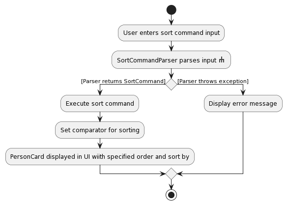

* Table of Contents
{:toc}

--------------------------------------------------------------------------------------------------------------------

## **Acknowledgements**

* Libraries used: [JavaFX](https://openjfx.io/), [Jackson](https://github.com/FasterXML/jackson), [JUnit5](https://github.com/junit-team/junit5)
* Icons used: [Fluent UI](https://github.com/microsoft/fluentui-system-icons)

--------------------------------------------------------------------------------------------------------------------

## **Setting up, getting started**

Refer to the guide [_Setting up and getting started_](SettingUp.md).

--------------------------------------------------------------------------------------------------------------------

## **Design**

:bulb: **Tip:** The `.puml` files used to create diagrams in this document can be found in the [diagrams](https://github.com/se-edu/addressbook-level3/tree/master/docs/diagrams/) folder. Refer to the [_PlantUML Tutorial_ at se-edu/guides](https://se-education.org/guides/tutorials/plantUml.html) to learn how to create and edit diagrams.

### Architecture

The ***Architecture Diagram*** given above explains the high-level design of the App.

Given below is a quick overview of main components and how they interact with each other.

**Main components of the architecture**

**`Main`** has two classes called [`Main`](https://github.com/se-edu/addressbook-level3/tree/master/src/main/java/seedu/address/Main.java) and [`MainApp`](https://github.com/se-edu/addressbook-level3/tree/master/src/main/java/seedu/address/MainApp.java). It is responsible for,
* At app launch: Initializes the components in the correct sequence, and connects them up with each other.
* At shut down: Shuts down the components and invokes cleanup methods where necessary.

[**`Commons`**](#common-classes) represents a collection of classes used by multiple other components.

The rest of the App consists of four components.

* [**`UI`**](#ui-component): The UI of the App.
* [**`Logic`**](#logic-component): The command executor.
* [**`Model`**](#model-component): Holds the data of the App in memory.
* [**`Storage`**](#storage-component): Reads data from, and writes data to, the hard disk.

**How the architecture components interact with each other**

The *Sequence Diagram* below shows how the components interact with each other for the scenario where the user issues the command `delete 1`.

Each of the four main components (also shown in the diagram above),

* defines its *API* in an `interface` with the same name as the Component.
* implements its functionality using a concrete `{Component Name}Manager` class (which follows the corresponding API `interface` mentioned in the previous point.

For example, the `Logic` component defines its API in the `Logic.java` interface and implements its functionality using the `LogicManager.java` class which follows the `Logic` interface. Other components interact with a given component through its interface rather than the concrete class (reason: to prevent outside component's being coupled to the implementation of a component), as illustrated in the (partial) class diagram below.

The sections below give more details of each component.

### UI component

The **API** of this component is specified in [`Ui.java`](https://github.com/se-edu/addressbook-level3/tree/master/src/main/java/seedu/address/ui/Ui.java)

The UI consists of a `MainWindow` that is made up of parts e.g.`CommandBox`, `ResultDisplay`, `PersonListPanel`, `StatusBarFooter` etc. All these, including the `MainWindow`, inherit from the abstract `UiPart` class which captures the commonalities between classes that represent parts of the visible GUI.

The `UI` component uses the JavaFx UI framework. The layout of these UI parts are defined in matching `.fxml` files that are in the `src/main/resources/view` folder. For example, the layout of the [`MainWindow`](https://github.com/se-edu/addressbook-level3/tree/master/src/main/java/seedu/address/ui/MainWindow.java) is specified in [`MainWindow.fxml`](https://github.com/se-edu/addressbook-level3/tree/master/src/main/resources/view/MainWindow.fxml)

The `UI` component,

* executes user commands using the `Logic` component.
* listens for changes to `Model` data so that the UI can be updated with the modified data.
* keeps a reference to the `Logic` component, because the `UI` relies on the `Logic` to execute commands.
* depends on some classes in the `Model` component, as it displays `Person` object residing in the `Model`.

### Logic component

**API** : [`Logic.java`](https://github.com/se-edu/addressbook-level3/tree/master/src/main/java/seedu/address/logic/Logic.java)

Here's a (partial) class diagram of the `Logic` component:

How the `Logic` component works:
1. When `Logic` is called upon to execute a command, it uses the `AddressBookParser` class to parse the user command.
1. This results in a `Command` object (more precisely, an object of one of its subclasses e.g., `AddCommand`) which is executed by the `LogicManager`.
1. The command can communicate with the `Model` when it is executed (e.g. to add a person).
1. The result of the command execution is encapsulated as a `CommandResult` object which is returned back from `Logic`.

The Sequence Diagram below illustrates the interactions within the `Logic` component for the `execute("delete 1")` API call.

:information_source: **Note:** The lifeline for `DeleteCommandParser` should end at the destroy marker (X) but due to a limitation of PlantUML, the lifeline reaches the end of diagram.

Here are the other classes in `Logic` (omitted from the class diagram above) that are used for parsing a user command:

How the parsing works:
* When called upon to parse a user command, the `AddressBookParser` class creates an `XYZCommandParser` (`XYZ` is a placeholder for the specific command name e.g., `AddCommandParser`) which uses the other classes shown above to parse the user command and create a `XYZCommand` object (e.g., `AddCommand`) which the `AddressBookParser` returns back as a `Command` object.
* All `XYZCommandParser` classes (e.g., `AddCommandParser`, `DeleteCommandParser`, ...) inherit from the `Parser` interface so that they can be treated similarly where possible e.g, during testing.

### Model component
**API** : [`Model.java`](https://github.com/se-edu/addressbook-level3/tree/master/src/main/java/seedu/address/model/Model.java)

The `Model` component,

* stores the TeamBuilder data i.e., all `Person` objects (which are contained in a `UniquePersonList` object) and all `Team` objects (which are contained in a `UniqueTeamList` object).
* stores the currently 'selected' `Person` objects (e.g., results of a search query) as a separate _filtered_ list which is exposed to outsiders as an unmodifiable `ObservableList<Person>` that can be 'observed' e.g. the UI can be bound to this list so that the UI automatically updates when the data in the list change.
* stores a `UserPref` object that represents the user’s preferences. This is exposed to the outside as a `ReadOnlyUserPref` objects.
* does not depend on any of the other three components (as the `Model` represents data entities of the domain, they should make sense on their own without depending on other components)

:information_source: **Note:** An alternative (arguably, a more OOP) model is given below. It has a `Tag` list in the `AddressBook`, which `Person` references. This allows `AddressBook` to only require one `Tag` object per unique tag, instead of each `Person` needing their own `Tag` objects. 

### Storage component

**API** : [`Storage.java`](https://github.com/se-edu/addressbook-level3/tree/master/src/main/java/seedu/address/storage/Storage.java)

The `Storage` component,
* can save both TeamBuilder data and user preference data in json format, and read them back into corresponding objects.
* inherits from both `AddressBookStorage` and `UserPrefStorage`, which means it can be treated as either one (if only the functionality of only one is needed).
* depends on some classes in the `Model` component (because the `Storage` component's job is to save/retrieve objects that belong to the `Model`)

### Common classes

Classes used by multiple components are in the `seedu.addressbook.commons` package.

--------------------------------------------------------------------------------------------------------------------

## **Implementation**

This section describes some noteworthy details on how certain features are implemented.

### Add person feature

The add person feature allows for some fields to be optional. However, the person must have a name, and their name cannot be the same as another existing contact in TeamBuilder.

The interactions between components for the `add` command is similar to the `delete` command shown [above](#logic-component).

Below shows the activity diagram when the user inputs the add command in the command box:

{:.center}

The _rake_ symbol in the `AddCommandParser parses input` actions is used to indicate that the action is describes in another subsidiary activity diagram. The subsidiary diagram is as shown below:

{:.center}

### Create team feature

The activity diagram when user inputs create command in the command box is similar to the Add person feature shown [above](#add-person-feature), with the difference being that Person objects are swapped with Team objects and error messages.

The same applies for CreateCommandParser, where the activity diagram is similar to AddCommandParser, with the difference being that the valid prefixes are now `tn/` and `td/` etc. The error messages are also catered towards Team creation, as opposed to Person creation.

### Optional Fields feature

The AB3 implementation made it such that you could not add a contact without having all of their fields present. We felt this to be not user-friendly as for our purposes it is unreasonable for users to have the phone, email, address, and major of the contact they which to add.

Thus, we have made it such that the only mandatory field is the persons name.

> This feature has only been added to phone so far.

To achieve this, we needed to: 
1. Allow users to input empty fields.
2. Allow users to omit field prefixes.
3. Allow users to edit contacts to empty their field.

This meant that the validation regex in each field class _e.g. Phone class, Email class_ had to allow for empty strings/ white spaces as an input, and the parser for each of these fields should know how to handle theses cases.

We considered using "java.util.Optional" package to resolve the issue, however in the end since we do need a 'default empty field' to act as a place holder for each of the fields _e.g. a empty_phone instance_, it made the Optional functionality redundant.

Additionally, storing fields as Optional classes caused many dependencies issues which required wide-spread change. Thus, we opted for the following changes:

1. The value for each Person field classes is now private, e.g. Phone.value is not accessible outside of phone class
2. Constructor for field class set to private
3. Public `of()` method created for each class to be called from other classes. `of()` method creates and instance of the class, given the parameters. E.g. `Phone.of(String <Phone_number>)' creates the phone instance with phone number given as argument.
4. Default instance for empty fields for each field class is created and stored within its own class. E.g. Phone class has a `private static final Phone EMPTY_PHONE` instance.
5. The default instance mentioned above can be returned by calling a static method in the class.

### Undo/Redo feature

#### Implementation

The `undo`/`redo` mechanism is based on the memento design pattern. Within the memento design pattern, there are three main classes:

1. `Originator` - The object that becomes modified and requires to be restored using `undo`/`redo`.
2. `Memento` - The wrapper of a saved state of an `Originator` that is used to restore the `Originator`.
3. `Caretaker` - The aggregator of `Memento` that controls the sequence of `Memento`s for `undo`/`redo`.

{:.center}

While the Memento Design Pattern is mostly used for `Undo`, we can extend its functionality to include `Redo`.

Implementing this design pattern results in the following:

- `Model` inferface extends the `Originator` interface, resulting in a concrete `Originator` in `ModelManger`.
- `TeamBuilderMemento` implements the `Memento` interface and acts as a saved state of `ModelManager`
- `HistoryUtil` replaces the `Caretaker` and tracks the timeline and order of `Memento`
- Any modifying `Command` will call `HistoryUtil#storePast` with `Model#save()` and their `COMMAND_WORD`.\
(`AddCommand` is given as an example.)

{:.center}

As we want `undo`/`redo` to provide feedback to the user, the `Commands` must provide context to `HistoryUtil`

Given below is an example usage scenario and how the undo/redo mechanism behaves at each step.

**Step 1.**
The user launches the application for the first time. The `HistoryUtil` will be initialized with two empty `Memento` arrays, one for `undo` and another for `redo`. The array counter will be `-1` indicating totally empty arrays.

{:.center}

**Step 2.**
The user executes `delete 5` command to delete the 5th person in the team builder. The `delete` command calls `Model#save()` before any actions, causing the initial state of the team builder to be saved as a `Memento`. The `delete` command provides the resutling `Memeto` and the context of the change (deleting 5) to `HistoryUtil#storePast`. The `Memento` is saved in `undoHistory` and the array counter increases to `0`.

{:.center}

Step 3. The user executes `add n/David …​` to add a new person. The `add` command also calls `Model#save()` before any actions, saving another `Memento`. The `Memento` and description (add n/david ...) is stored through `HistoryUtil#storePast`. The `Memento` is saved in `undoHistory` and the array counter increases to `1`.

{:.center}

:information_source:**Note:** If a command fails its execution, it will not call `Model#save()`, so the `Memento` is not stored in `HistoryUtil`.

Step 4. The user now decides that adding the person was a mistake, and decides to undo that action by executing the `undo` command. The `undo` command will call `HistoryUtil#undo`, which will call `Memento#restore()` on `undoHistory[currentNum]`. `Memento#restore()` will be called and state before the `add` command is restored. `HistoryUtil#undo` also moves the `Memento` into `redoFuture` and outputs an `Optional<String> description` to the `undo` command. The `undo` command then feedbacks to the user that the undo has occured successfully.

{:.center}

:information_source: **Note:** If the `currentNum` is at index -1, then there are no previous TeamBuilder states to restore. In this case, `HistoryUtil#undo` returns `Optional.empty()`.
As `undo` command uses `Optional::isPresent` to check if undo is successful, it will then return an error message to the user.

The following sequence diagram shows how the undo operation works:

{:.center}

:information_source:**Note:** The lifeline for `UndoCommand` should end at the destroy marker (X) but due to a limitation of PlantUML, the lifeline reaches the end of diagram.

The `redo` command does the opposite — it calls `HistoryUtil#redo()`, which checks the `redoFuture` for any `Memento` to restore at `counterNum`. If present, the `Memento` is restored and a `Optional<String>` containing the description of the `Memento` is given to the `redo` command. The restored `Memento` is moved to `undoHistory` and removed from `redoFuture`. The `redo` command feedbacks the output to the user.

:information_source: **Note:** If the `counterNum` is at an index where `redoFuture` is null, then there are no undone `Memento` to restore. The `redo` command uses the `Optional<String>` output `Optional::isPresent` to check if this is the case. If so, it will return an error message the user.

Step 5. The user then decides to execute the command `list`. Commands that do not modify the TeamBuilder, such as `list`, will usually not call `Model#Save()`, `HistroyUtil#storePast` , `HistroyUtil#undo`, `HistoryUtil#redo`. Thus, the `Model` remains unchanged.

{:.center}

Step 6. The user executes `clear`, which calls `Model#Save` and stores the resulting `Memento` and description (clear) into `HistoryUtil#storePast`. Since there is a new `Memento` for `undoHistory` that is not from `redoFuture`, all `Memento` in `redoFuture` are purged. Reason: It no longer makes sense to redo the `add n/David …​` command. This is the behavior that most modern desktop applications follow.

{:.center}

The following activity diagram summarizes what happens when a user executes a new command:

#### Design considerations:

**Aspect: How undo & redo executes:**

* **Alternative 1 (current choice):** Saves the state of the team builder found in ModelManager (Current choice).
  * Pros: Easy to implement, easy to extend, easy to modify of "state" saved.
  * Cons: May have performance issues in terms of memory usage if state saved is too large.

* **Alternative 2:** Individual command knows how to undo/redo by
  itself.
  * Pros: Will use less memory (e.g. for `delete`, just save the person being deleted).
  * Cons: We must ensure that the implementation of each individual command are correct.
* **Alternative 3:** Save the entire team builder inside VersionedTeamBuilder, replacing TeamBuilder (Original AB-3 Choice)
  * Pros: Easy to implement.
  * Cons: Difficult to extend. Performance issues in terms of memeory usage. Undo/Redo timeline tied to TeamBuilder. No user feedback on what command was undone/redone.

### Sort feature

Both fields for sorting persons are compulsory, namely the order of sorting and the sort by criteria. The order and
sort by criteria that are available are listed in the User Guide.

Below shows the activity diagram when the user inputs the sort command in the command box:

{:.center}

The subsidiary diagram, for SortCommandParser, is as shown below:

{:.center}

#### Implementation

The `filteredPersons` variable in the ModelManager.java is defined by passing in the `getPersonList()` from `addressBook` 
into a `FilteredList` object. However, `sortedPersons` variable in the ModelManager.java is instead defined by passing 
in `filteredPersons` into a `SortedList` object. 

This ensures that modifications (deletes/edits) to the persons after a `list` or `sort` command will be consistent.

#### Design considerations:

The `parse` function in SortCommandParser.java is used to trim and process the arguments before instantiating 
SortCommand object. The `execute` function in SortCommand is used to identify the order and sort by to be used by the 
comparator and to run the sort with the comparator. This ensures that subsequent additions to sort by, such as sort by 
name etc, would only require to edit the `execute` function.

The `SortBy` Enum ensures that new sorting options can be extended in future iterations. A new switch case can be added
to the `SortCommand` to perform an `updateSort()` for the `Model` object, with the corresponding comparator.

### Show Team feature

#### Implementation

Show command utilizes the `updateFilterPersonList()` method implemented in ModelManager.java to filter the 
`filtleredPersons` list variable in ModelManager with the given predicate `TeamContainsKeywordsPredicate`.

The `TeamContainsKeywordsPredicate` object takes in a `List<String>` from `ShowCommandParser`, and make use of the
`containsWordIgnoreCase()` from `StringUtil` to conduct matching between the user input and the `tagName` of each 
the `teams` of each `Person` object.

#### Design considerations:

The `get` command utilizes the `filter()` method from FilterCommand.java. It filters the person list based on tag `teams`
while the Filter command targets on other features such as `major` and `name`. 

This guarantees that from the users' perspective, `filter` and `get` are separate commands.

--------------------------------------------------------------------------------------------------------------------

## **Documentation, logging, testing, configuration, dev-ops**

* [Documentation guide](Documentation.md)
* [Testing guide](Testing.md)
* [Logging guide](Logging.md)
* [Configuration guide](Configuration.md)
* [DevOps guide](DevOps.md)

--------------------------------------------------------------------------------------------------------------------

## **Appendix: Requirements**

### Product scope

**Target user profile**:

* looking to form teams for hackathons/competitions/projects
* prefer desktop apps over other types
* can type fast
* prefers typing to mouse interactions
* is reasonably comfortable using CLI apps

**Value proposition**: group based on expertise/competence/availability/goals to find better teammates

### User stories

Priorities: High (must have) - `* * *`, Medium (nice to have) - `* *`, Low (unlikely to have) - `*`

| Priority | As a …​         | I want to …​                                        | So that I can…​                                                       |
|----------|-----------------|-----------------------------------------------------|-----------------------------------------------------------------------|
| `* * *`  | new user        | delete the sample contacts                          | start finding actual teammates                                        |
| `* * *`  | new user        | delete a contact                                    | remove contact deemed unsuitable for any team                         |
| `* * *`  | normal user     | add a contact                                       | find their info for later use                                         |
| `* * *`  | normal user     | add tags to contacts                                | see what their proficiencies are and what they are look to accomplish |
| `* * *`  | normal user     | edit a contact                                      | rectify changes or mistakes                                           |
| `* * *`  | normal user     | view contact list                                   | see all my contacts                                                   |
| `* *`    | first time user | see some sample contacts when I open the app        | easily try out its features without needing to add my data first      |
| `* *`    | first time user | see a help message explaining features to try first | start by trying features that are more suited for new users           |
| `* *`    | forgetful user  | have a clear contact list for my social hub         | Have quick access to my contact lists to find the target person       |

*{More to be added}*

### Use cases

(For all use cases below, the **System** is the `TeamBuilder` and the **Actor** is the `user`, unless specified otherwise)

**Use case: Add a contact**

**MSS**

1. User enters add command followed by input fields.
2. TeamBuilder parses input with AddCommandParser.
3. TeamBuilder creates AddCommand.
4. TeamBuilder executes AddCommand.
5. TeamBuilder saves person in model and storage.
   
   Use case ends.

**Extensions**
- 2a. Inputs for command invalid.
  - 2a1. TeamBuilder displays error caused by invalid field/ missing field.
  - 2a2. TeamBuilder displays valid format for add command.
    
     Use case ends.
- 4a. User inputs name which already exists in TeamBuilder.
  - 4a1. TeamBuilder displays error message indicating duplicate name.
  
    Use case ends

**Use case: Delete a contact**

**MSS**

1.  User requests to list contacts.
2.  TeamBuilder shows a list of contacts.
3.  User requests to delete a specific contact in the list.
4.  TeamBuilder deletes the person.

    Use case ends.

**Extensions**

* 2a. The list is empty.

  Use case ends.

* 3a. The given index is invalid.

    * 3a1. TeamBuilder shows an error message.

      Use case resumes at step 2.

**Use case: List all contact**

**MSS**

1.  User requests to list contacts.
2.  TeamBuilder shows a list of contacts.
3.  User requests to edit a specific contact in the list.
4.  TeamBuilder edit the person.

    Use case ends.

**Extensions**

* 2a. The list is empty.

  Use case ends.

* 3a. The given index is invalid.

    * 3a1. TeamBuilder shows an error message.

      Use case resumes at step 2.

*{More to be added}*

### Non-Functional Requirements

1.  Should work on any _mainstream OS_ as long as it has Java `11` or above installed.
2.  Should be able to hold up to 1000 persons without a noticeable sluggishness in performance for typical usage.
3.  A user with above average typing speed for regular English text (i.e. not code, not system admin commands) should be able to accomplish most of the tasks faster using commands than using the mouse.

*{More to be added}*

### Glossary

* **Actor**: In the context of use cases, the actor is a role that a person play when using the system.
* **API**: (Application Programming Interface) How separate components of the program communicate with each other.
* **Architecture**: Referring to software architecture, showing overall organization of the system.
* **Framework**: A set of pre-written code containing predefined classes and functions that helps developers build a software.
* **GUI**: (Graphical User Interface) A Ui using icons, menu, and mouse to interact with the system.
* **JavaFX**: A framework used to create user interfaces in java.
* **Mainstream OS**: Windows, Linux, Unix, OS-X
* **Parsing**: In the context of our program, parsing is to transform a piece of user input into something that can be run by our program
* **Private contact detail**: A contact detail that is not meant to be shared with others
* **Sequence Diagrams**: User to model the interactions between entities in a system within a specific scenario.
* **UI**: (User Interface) Where the human interacts with the program.

--------------------------------------------------------------------------------------------------------------------

## **Appendix: Instructions for manual testing**

Given below are instructions to test the app manually.

:information_source: **Note:** These instructions only provide a starting point for testers to work on;
testers are expected to do more *exploratory* testing.

### Launch and shutdown

1. Initial launch

   1. Download the jar file and copy into an empty folder

   1. Double-click the jar file Expected: Shows the GUI with a set of sample contacts. The window size may not be optimum.

1. Saving window preferences

   1. Resize the window to an optimum size. Move the window to a different location. Close the window.

   1. Re-launch the app by double-clicking the jar file. 
       Expected: The most recent window size and location is retained.

1. _{ more test cases …​ }_

### Deleting a person

1. Deleting a person while all persons are being shown

   1. Prerequisites: List all persons using the `list` command. Multiple persons in the list.

   1. Test case: `delete 1` 
      Expected: First contact is deleted from the list. Details of the deleted contact shown in the status message. Timestamp in the status bar is updated.

   1. Test case: `delete 0` 
      Expected: No person is deleted. Error details shown in the status message. Status bar remains the same.

   1. Other incorrect delete commands to try: `delete`, `delete x`, `...` (where x is larger than the list size) 
      Expected: Similar to previous.

1. _{ more test cases …​ }_

### Saving data

1. Dealing with missing/corrupted data files

   1. _{explain how to simulate a missing/corrupted file, and the expected behavior}_

1. _{ more test cases …​ }_

## Planned Enhancement