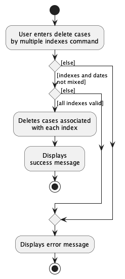
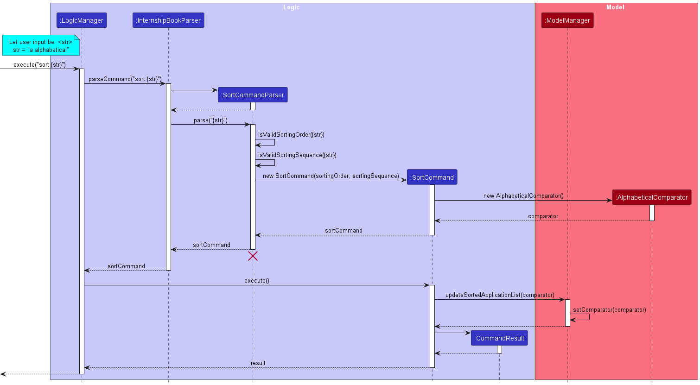

* Table of Contents
  {:toc}

--------------------------------------------------------------------------------------------------------------------

## **Acknowledgements**

* {list here sources of all reused/adapted ideas, code, documentation, and third-party libraries -- include links to the original source as well}

--------------------------------------------------------------------------------------------------------------------

## **Setting up, getting started**

Refer to the guide [_Setting up and getting started_](SettingUp.md).

--------------------------------------------------------------------------------------------------------------------

## **Design**

:bulb: **Tip:** The `.puml` files used to create diagrams in this document can be found in the [diagrams](https://github.com/AY2223S2-CS2103-W17-2/tp/tree/master/docs/diagrams/) folder. Refer to the [_PlantUML Tutorial_ at se-edu/guides](https://se-education.org/guides/tutorials/plantUml.html) to learn how to create and edit diagrams.

### Architecture

The ***Architecture Diagram*** given above explains the high-level design of the App.

Given below is a quick overview of main components and how they interact with each other.

**Main components of the architecture**

**`Main`** has two classes called [`Main`](https://github.com/AY2223S2-CS2103-W17-2/tp/tree/master/src/main/java/seedu/age/Main.java) and [`MainApp`](https://github.com/AY2223S2-CS2103-W17-2/tp/tree/master/src/main/java/seedu/age/MainApp.java). It is responsible for,
* At app launch: Initializes the components in the correct sequence, and connects them up with each other.
* At shut down: Shuts down the components and invokes cleanup methods where necessary.

[**`Commons`**](#common-classes) represents a collection of classes used by multiple other components.

The rest of the App consists of four components.

* [**`UI`**](#ui-component): The UI of the App.
* [**`Logic`**](#logic-component): The command executor.
* [**`Model`**](#model-component): Holds the data of the App in memory.
* [**`Storage`**](#storage-component): Reads data from, and writes data to various platforms of storage.

**How the architecture components interact with each other**

The *Sequence Diagram* below shows how the components interact with each other for the scenario where the user issues the command `delete 1`.

Each of the four main components (also shown in the diagram above),

* defines its *API* in an `interface` with the same name as the Component.
* implements its functionality using a concrete `{Component Name}Manager` class (which follows the corresponding API `interface` mentioned in the previous point.

For example, the `Logic` component defines its API in the `Logic.java` interface and implements its functionality using the `LogicManager.java` class which follows the `Logic` interface. Other components interact with a given component through its interface rather than the concrete class (reason: to prevent outside component's being coupled to the implementation of a component), as illustrated in the (partial) class diagram below.

The sections below give more details of each component.

### UI component

The **API** of this component is specified in [`Ui.java`](https://github.com/AY2223S2-CS2103-W17-2/tp/tree/master/src/main/java/seedu/age/ui/Ui.java)

The UI consists of a `MainWindow` that is made up of parts e.g.`CommandBox`, `ResultDisplay`, `PersonListPanel`, `StatusBarFooter` etc. All these, including the `MainWindow`, inherit from the abstract `UiPart` class which captures the commonalities between classes that represent parts of the visible GUI.

The `UI` component uses the JavaFx UI framework. The layout of these UI parts are defined in matching `.fxml` files that are in the `src/main/resources/view` folder. For example, the layout of the [`MainWindow`](https://github.com/AY2223S2-CS2103-W17-2/tp/tree/master/src/main/java/seedu/age/ui/MainWindow.java) is specified in [`MainWindow.fxml`](https://github.com/AY2223S2-CS2103-W17-2/tp/tree/master/src/main/resources/view/MainWindow.fxml)

The `UI` component,

* executes user commands using the `Logic` component.
* listens for changes to `Model` data so that the UI can be updated with the modified data.
* keeps a reference to the `Logic` component, because the `UI` relies on the `Logic` to execute commands.
* depends on some classes in the `Model` component, as it displays `Person` object residing in the `Model`.

### Logic component

**API** : [`Logic.java`](https://github.com/AY2223S2-CS2103-W17-2/tp/tree/master/src/main/java/seedu/age/logic/Logic.java)

Here is a (partial) class diagram of the `Logic` component:

How the `Logic` component works:
1. When `Logic` is called upon to execute a command, it uses the `DengueHotspotTrackerParser` class to parse the user command.
1. This results in a `Command` object (more precisely, an object of one of its subclasses e.g., `AddCommand`) which is executed by the `LogicManager`.
1. The command can communicate with the `Model` when it is executed (e.g. to add a case).
1. The result of the command execution is encapsulated as a `CommandResult` object which is returned back from `Logic`.

The Sequence Diagram below illustrates the interactions within the `Logic` component for the `execute("delete 1")` API call.

Here are the other classes in `Logic` (omitted from the class diagram above) that are used for parsing a user command:

How the parsing works:
* When called upon to parse a user command, the `DengueHotspotTrackerParser` class will do one of the following:
  * create an `XYZCommandParser` (`XYZ` is a placeholder for the specific command name e.g., `AddCommandParser`) which uses the other classes shown above to parse the user command and create a `XYZCommand` object (e.g., `AddCommand`) that the `DengueHotspotTrackerParser` returns back as a `Command` object.
  * create an `XYZCommand`.
* All `XYZCommandParser` classes (e.g., `AddCommandParser`, `DeleteCommandParser`, ...) inherit from the `Parser` interface so that they can be treated similarly where possible e.g, during testing.
* Similarly, all `XYZCommand` classes inherit from the `Command` abstract class and are executable.

### Model component
**API** : [`Model.java`](https://github.com/AY2223S2-CS2103-W17-2/tp/tree/master/src/main/java/seedu/age/model/Model.java)

Here is a (partial) class diagram of the `Model` component:

The `Model` component

* stores the Dengue Hotspot Tracker data i.e., all `Person` objects (which are contained in a `UniquePersonList` object).
* stores the currently 'selected' `Person` objects (e.g., results of a search query) as a separate _filtered_ list which is exposed to outsiders as an unmodifiable `ObservableList<Person>` that can be 'observed' e.g. the UI can be bound to this list so that the UI automatically updates when the data in the list change.
* stores a `UserPref` object that represents the user’s preferences. This is exposed to the outside as a `ReadOnlyUserPref` objects.
* does not depend on any of the other three components (as the `Model` represents data entities of the domain, they should make sense on their own without depending on other components)

### Storage component

**API** : [`Storage.java`](https://github.com/AY2223S2-CS2103-W17-2/tp/tree/master/src/main/java/seedu/age/storage/Storage.java)

The `Storage` component,
* can save both Dengue Hotspot Tracker data and user preference data in csv format, and read them back into corresponding objects.
* inherits from both `DengueHotspotTrackerStorage` and `UserPrefStorage`, which means it can be treated as either one (if only the functionality of only one is needed).
* depends on some classes in the `Model` component (because the `Storage` component's job is to save/retrieve objects that belong to the `Model`)
* temporarily saves `DengueHotspotTracker` data while the app is running, for `undo` and `redo` commands.

### Common classes

Classes used by multiple components are in the `seedu.dengue.commons` package.

--------------------------------------------------------------------------------------------------------------------

## **Implementation**

This section describes some noteworthy details on how certain features are implemented.

### Undo/redo feature

#### Implementation

The undo/redo mechanism is facilitated by `TemporaryMemory`. It extends `SpecialisedStackForMemory`, which implements `StackWithStorage`.
`TemporaryMemory` only stores the 10 most recent actions performed by the user, when the app is open. This means that when the app is closed and open again, the user will not be able to perform an undo or redo.
`TemporaryMemory` can be viewed as a stack which supports additional operations.

1. `TemporaryMemory` only contains 10 saved iterations of the file. Therefore, older iterations are deleted.
2. `TemporaryMemory` supports the redo command, and therefore, after performing an undo, more recent iterations of the file are still stored in an auxiliary storage component.
3. When the user performs an undo and then edits/saves the file once again, more recent iterations of the file must be overwritten. Therefore, this temporary storage is cleared.

`TemporaryMemory`, therefore, is a specialised memory stack, where each item is an iteration of the Dengue Hotspot Tracker file. It holds as attributes a `Deque` for the primary memory stack and an auxiliary storage `Stack`, which temporarily stores popped items (undone operations).

* `TemporaryMemory#saveNewLatest(ReadOnlyDengueHotspotTracker latest)` — Saves the current Dengue Hotspot Tracker state in its history, pushing it into the primary memory stack represented by a `Deque`.
* `TemporaryMemory#undo()` — Restores the previous Dengue Hotspot Tracker state from its history. This pops an item from the primary memory stack represented by a `Deque` and pushes it into the auxiliary storage stack implemented with a `Stack`.
* `TemporaryMemory#redo()` — Restores a previously undone Dengue Hotspot Tracker state from its history. This pushes an item from the auxiliary `Stack` back into the primary memory stack.
* `TemporaryMemory#loadCurrent()` — Peeks into the top element of the stack and loads it.
  These operations are exposed in the `Model` interface as `Model#saveChanges()`, `Model#undo()`, `Model#redo()` and `Model#updateFromMemoryStack()`.
  Given below is an example usage scenario and how the undo/redo mechanism behaves at each step.

Step 1. The user launches the application for the first time. The `DengueHotspotTracker` will be initialized with the initial Dengue Hotspot Tracker state, and the `TemporaryMemory` stack implementation contains only the current Dengue Hotspot Tracker state.

Step 2. The user executes `delete 5` command to delete the fifth case in the Dengue Hotspot Tracker. The `delete` command calls `Model#saveChanges()`. The Dengue Hotspot Tracker is modified, and a copy of the modified Dengue Hotspot Tracker is generated by `DengueHotspotTracker#generateDeepCopy()`. This deep copy is pushed into the `TemporaryMemory` stack under its `Deque`.

Step 3. The user executes `add n/David d/2000 31 January...` to add a new case. The `add` command also calls `Model#saveChanges()`, causing another modified Dengue Hotspot Tracker state to be deep-copied and saved into the `TemporaryMemory` stack, under its `Deque`.

:information_source: **Note:** If a command fails its execution, it will not call `Model#saveChanges()`, so the Dengue Hotspot Tracker state will not be saved into the `TemporaryMemory`.

Step 4. The user now decides that adding the case was a mistake, and decides to undo that action by executing the `undo` command. The `undo` command pops an item from the primary `Deque` in `TemporaryMemory`, and pushes it into the auxiliary storage `Stack`. The new top-level item in the primary `Deque` stack will be read in as the current file.

:information_source: **Note:** If there is only 1 element in the `Deque`, then there are no previous DengueHotspotTracker states to restore. The `undo` command uses `TemporaryMemory#canUndo` to check if this is the case. If so, it will return an error to the user rather
than attempting to perform the undo.

Step 5. The user again decides that adding the case was not a mistake, and decides to redo the action by executing the `redo` command. The `redo` command pops an item from the auxiliary `Stack` in `TemporaryMemory` and pushes it back into the primary stack `Deque`, where it is being read as the current file.

Step 6. The user now wishes to perform an undo twice. The user executes the `undo 2` command to undo two steps. As with before, 2 iterations of the tracker data are popped from the `TemporaryMemory` primary `Deque` and pushed into the auxiliary `Stack`.

The following sequence diagram shows how the undo operation works:

:information_source: **Note:** The lifeline for `UndoCommand` should end at the destroy marker (X) but due to a limitation of PlantUML, the lifeline reaches the end of diagram.

The `redo` command does the opposite — it calls `TemporaryMemory#redo()`, which pops from the auxiliary `Stack` once, and pushes the popped item back into the primary `Deque`, restoring the Dengue Hotspot Tracker to a previous state.

Step 7. The user then decides to execute the command `list`. Commands that do not modify the Dengue Hotspot Tracker, such as `list`, will usually not call `Model#saveChanges()`. Thus `Model#undo()` or `Model#redo()` will ignore this command. Thus, the `TemporaryMemory` remains unchanged.

The following activity diagram summarizes what happens when a user executes a new command:

#### Design considerations:

**Aspect: How undo & redo executes:**

* **Alternative 1 (current choice):** Saves 10 previous iterations of the entire dengue case list temporarily while the app is running.
    * Pros: Saves memory as all tracker iterations are deleted when the app closes. Deleting older tracker iterations also helps to improve performance.
    * Cons: User may not have access to older data.

* **Alternative 2:** Saves 10 previous iterations of the entire dengue case list in a JSON file.
    * Pros: User can have direct access to older data.
    * Cons: Can be very messy to implement.

### Data import and export

DengueHotspotTracker data is stored in a csv file format.

### Prefix find Feature

#### Implementation

The proposed Prefix find feature mechanism is primarily facilitated by the `DengueHotspotTrackerParser#parseCommand()`,
`FindCommandParser#parse()`, `ArgumentTokenizer#Tokenize()`, `ArgumentMultimap#getValue()`, and `FindCommand#execute()`
methods.

Given below is an example usage scenario and how the Prefix find mechanism behaves at each step.

Step 1. The user launches the application.

Step 2. The user executes the `find a/ 13 n/ Thomas p/ 612` command to filter the list of cases which contain a dengue
case associated with the name Thomas, who is of the age 13 and has a postal code beginning with 612.

Step 3. `DengueHotspotTrackerParser#parseCommand()` parses the command and, detecting the `find` command word,
passes the argument `a/ 13 n/ Thomas p/ 612` to the `FindCommandParser`.

Step 4. `FindCommandParser#parse()` will call on `ArgumentTokenizer#Tokenize()` and subsequently gets the values of
each individual Prefix using `ArgumentMultimap#getValue()`.

Step 5. `FindCommand#execute()` will get the most updated list of filtered cases based on the values given from
`ArgumentMultimap#getValue()` and shows it on the User Interface.

The following sequence diagram summarises what happens when a user executes a Prefix find operation:

The following activity diagram summarises what happens when a user executes a Prefix find operation:

#### Design Considerations

**Aspect: How Prefix find handle input that does not make sense (Numerics in names, non-existent postal codes
or age past 200)**

* **Alternative 1 (current choice):** Accepts the user input and executes the find command as per usual.
    * Pros: Allows for user freedom in cases that there may be people with Numerics in names, and the underlying code
      would not have to change if new postal codes were to be implemented.
    * Cons: In the case of the input being erroneous, there is no indication that the for the user that it may be due to
      what they keyed in.

* **Alternative 2:** Displays a message indicating that the input may be erroneous for each of the available prefix.
    * Pros: In the case of the input being erroneous, there would be an indication that the for the user that their input
      may be unintended.
    * Cons: Less flexibility and requires changes to the code base if new postal codes are added.

### Multi-index delete feature

#### Implementation

The multi-index delete mechanism is primarily facilitated by the `DengueHotspotTrackerParser#parseCommand()`, `DeleteCommandParser#parse()`, and `DeleteCommand#execute()` methods.

Given below is an example usage scenario and how the multi-index delete mechanism behaves at each step.

Step 1. The user launches the application and uses the `find` command to filter the list of cases. The `ModelManager`’s `FilteredList<Person>` is updated.

Step 2. The user executes the `delete 1 3` command to delete the first and third cases in the filtered list currently being shown. `DengueHotspotTrackerParser#parseCommand()` parses the command and, detecting the `delete` command word, passes the argument `1 3` to the `DeleteCommandParser`.

Step 3. `DeleteCommandParser#parse()` is called. A list of valid indexes `List<Index>` is returned, and a `DeleteCommand` is constructed, taking in this list of indexes as an argument.

Step 4. `DeleteCommand#execute()` will get the most updated list of filtered cases and delete the cases associated with each given index. Users will be notified with a message upon successful deletion of all relevant cases.

The following sequence diagram shows how the multi-index delete operation works:

The following activity diagram summarises what happens when a user executes a multi-index delete command:

#### Design Considerations

**Aspect: How multi-index delete indicates successful execution:**

* **Alternative 1 (current choice):** Display a message indicating that a number of cases were successfully deleted, the number of cases corresponding to the size of the list of indexes.
    * Pros: Short and succinct, without taking up too much space on the GUI.
    * Cons: Does not show exactly which cases were deleted.

* **Alternative 2:** Display a message indicating successful deletion for each individual deleted case, along with the details of the deleted case.
    * Pros: Shows exactly which cases were deleted for easy validation.
    * Cons: Unnecessarily lengthy; may take up too much space if many cases were deleted at once.

### Delete-by-date feature

#### Implementation

The delete-by-date mechanism is primarily facilitated by the `DengueHotspotTrackerParser#parseCommand()`, `DeleteCommandParser#parse()`, and `DeleteCommand#execute()` methods.

Given below is an example usage scenario and how the delete-by-date mechanism behaves at each step.

Step 1. The user launches the application and uses the `find` command to filter the list of cases. The `ModelManager`’s `FilteredList<Person>` is updated.

Step 2. The user executes the `delete d/2023-03-30` command to delete all cases from 30th March 2023 in the filtered list currently being shown. `DengueHotspotTrackerParser#parseCommand()` parses the command and, detecting the `delete` command word, passes the argument `d/2023-03-30` to the `DeleteCommandParser`.

Step 3. `DeleteCommandParser#parse()` is called. The date `2023-03-30` is extracted, and a `DeleteCommand` is constructed, taking in this date as a Date object argument.

Step 4. `DeleteCommand#execute()` will get the most updated list of filtered cases and delete the cases from the given date. Users will be notified with a message upon successful deletion of all relevant cases stating the number of cases deleted and the date the cases were from.

To see how the delete-by-date mechanism works, as well as to understand the design considerations taken, you may refer to the multi-index delete feature’s sequence diagram, as they work largely similarly besides the parsing of dates and the use of the `executeDate` method instead.

**Aspect: What attributes the `delete` command can delete by:**

* **Alternative 1 (current choice):** Allow users to `delete` only by date.
    * Pros: Provides a convenient shortcut for the most probable use case out of all batch-delete use cases,
      rather than clogging up the app with features that will likely go unused.
    * Cons: The user may be confused at the difference in affordances between `delete` and the other commands
      that similarly allow for prefixes to target a particular attribute, such as `edit` and `find`.

* **Alternative 2:** Allow users to `delete` by all attributes, e.g. delete by name, age, postal, etc.,
  similar to the `edit` and `find` commands.
    * Pros: `delete` command would better match the functionality allowed by the other commands that
      similarly allow for prefixes to target a particular attribute, such as `edit` and `find`.
    * Cons: Deleting by name, age, etc. are use cases that are much rarer than deleting by date.
      If necessary, they can be accomplished by `find`ing by the relevant attribute before `clear`ing.
      Allowing deletion by date provides a handy shortcut for the most probable use case, keeping the app
      free of less important features.

### Delete-by-date-range feature

#### Implementation

This feature is largely similar to the delete-by-date feature, except that the user can input up to two dates,
a start date `sd/` and an end date `ed/`. For instance, `delete sd/2023-03-23 ed/2023-03-25` will
delete all cases from 23rd March 2023 to 25th March 2023 inclusively.

### Sort feature

#### Implementation

The sort mechanism is primarily facilitated by the `DengueHotspotTrackerParser#parseCommand()`, `SortCommandParser#parse()`, and `SortCommand#execute()` methods.

Given below is an example usage scenario and how the sort mechanism behaves at each step.

Step 1. The user launches the application and executes the `sort n/` command to sort the list by name.

Step 2. `DengueHotspotTrackerParser#parseCommand()` parses the command and, detecting the `sort` command word, passes the argument `n/` to the `SortCommandParser`.

Step 3. `SortCommandParser#parse()` is called. Detecting the `n/` argument, it constructs a `SortCommand` with a `PersonNameComparator` and sort type `“NAME”` as arguments. (The equivalents for sorting by age `a/` and date `d/` are the `PersonAgeComparator` and `PersonDateComparator` respectively.)

Step 4. `SortCommand#execute()` will sort a copy of the filtered list `toSort`. `Model#sort(toSort)` will then update the new sorted list in the Model.

The following sequence diagram shows how the sort operation works:

--------------------------------------------------------------------------------------------------------------------

## **Documentation, logging, testing, configuration, dev-ops**

* [Documentation guide](Documentation.md)
* [Testing guide](Testing.md)
* [Logging guide](Logging.md)
* [Configuration guide](Configuration.md)
* [DevOps guide](DevOps.md)

--------------------------------------------------------------------------------------------------------------------

## **Appendix: Requirements**

### Product scope

**Target user profile**:

* NEA personnel in charge of delegating personnel to dengue hotspots in order to mitigate the spread of dengue via pest control
* has some mastery over using a computer
* prefers typing to other means of input

**Value proposition**: Inefficient allocation of pest control resources will cost excess time and money. This app will help optimise resources by tracking dengue cases, classifying them by neighbourhood, and identifying clusters.

### User stories

Priorities: High (must have) - `* * *`, Medium (nice to have) - `* *`, Low (unlikely to have) - `*`

| Priority | As a …​  | I want to …​                                                             | So that I can…​                                                      |
| -------- |----------|--------------------------------------------------------------------------|----------------------------------------------------------------------|
| `* * *`  | new user | easily view a help page                                                  | know how to use the app                                              |
| `* * *`  | user     | add a new dengue case                                                    | keep track of the dengue cases in Singapore                          |
| `* * *`  | user     | delete cases from the dengue case list by case ID                        | remove entries that I no longer need                                 |
| `* * *`  | user     | find dengue cases whose postal codes start with any of the input numbers | locate details of cases without having to go through the entire list |
| `* *`    | user     | export the data from the dengue case list from a database in a csv file  | analyse them outside of the app              |
| `*`      | new user | clear all entries                                                        | start over with an empty data set                                               |

*{More to be added}*

### Use cases

(For all use cases below, the **System** is the `DengueHotspotTracker` and the **Actor** is the `user`, unless specified otherwise)

**Use case: Delete a case**

**MSS**

1.  User requests to list cases
2.  DengueHotspotTracker shows a list of cases
3.  User requests to delete a specific case in the list
4.  DengueHotspotTracker deletes the case

    Use case ends.

**Extensions**

* 2a. The list is empty.

  Use case ends.

* 3a. The given index is invalid.

    * 3a1. DengueHotspotTracker shows an error message.

      Use case resumes at step 2.

**Use case: Sort the case list**

**MSS**

1.  User requests to list cases
2.  DengueHotspotTracker shows a list of cases
3.  User requests to sort the list by a given criterion
4.  DengueHotspotTracker sorts the list by the given criterion

    Use case ends.

**Extensions**

* 2a. The list is empty.

  Use case ends.

* 3a. The given criterion is invalid.

    * 3a1. DengueHotspotTracker shows an error message.

      Use case resumes at step 2.

### Non-Functional Requirements

1.  Should work on any _mainstream OS_ as long as it has Java `11` or above installed.
2.  Should be able to hold up to 1000 dengue cases without a noticeable sluggishness in performance for typical usage.
3.  A user with above average typing speed for regular English text (i.e. not code, not system admin commands) should be able to accomplish most of the tasks faster using commands than using the mouse.

*{More to be added}*

### Glossary

* **Mainstream OS**: Windows, Linux, Unix, OS-X
* **Case**: A person who has contracted Dengue fever.
  * Can be used interchangeably with **Person**.
* **CSV file**: Comma-separated values file

--------------------------------------------------------------------------------------------------------------------

## **Appendix: Instructions for manual testing**

Given below are instructions to test the app manually.

:information_source: **Note:** These instructions only provide a starting point for testers to work on;
testers are expected to do more *exploratory* testing.

### Launch and shutdown

1. Initial launch

    1. Download the jar file and copy into an empty folder

    1. Double-click the jar file Expected: Shows the GUI with a set of sample contacts. The window size may not be optimum.

1. Saving window preferences

    1. Resize the window to an optimum size. Move the window to a different location. Close the window.

    1. Re-launch the app by double-clicking the jar file. 
       Expected: The most recent window size and location is retained.

### Deleting cases

1. Deleting a single case while all cases are being shown
    1. Prerequisites: List all cases using the `list` command. Multiple cases in the list.
    1. Test case: `delete 1` 
       Expected: First case is deleted from the list. Details of the deleted contact shown in the status message.
    1. Test case: `delete 0` 
       Expected: No case is deleted. Error details shown in the status message.
    1. Other incorrect single-index delete commands to try: `delete`, `delete x`, `...` (where x is larger than the list size) 
       Expected: Similar to previous.
2. Deleting multiple cases while all cases are being shown
   2. Prerequisites: List all cases using the `list` command. Multiple cases in the list.
   2. Test case: `delete 1 2` 
      Expected: First and second cases are deleted from the list. Number of cases deleted shown in the status message.
   2. Test case: `delete 0 1`  
      Expected: No case is deleted as at least one of the given indexes is out of range. Error details shown in the status message.

### Exporting/Importing data
1. Testing import CSV
   1. Remove `denguehotspottracker.csv` file in the /data folder.
   1. Run `DengueHotSpotTracker` to obtain an initialized list of cases.
   1. Enter Command: `export sampledata.csv` to export existing list of cases. 
      Expected: Successfully exported data to sampledata.csv
   1. Enter Command: `clear` to clear existing list of cases.
   1. Enter Command: `import sampledata.csv` to import sampledata.csv. 
      Expected: Successfully imported data from sampledata.csv

### Saving data

1. Dealing with missing/corrupted data files
   1. Ensure that `DengueHotspotTracker` is currently not running.
   1. Open `data/denguehotspottracker.csv` file with your favourite text editor.
   1. Remove any of the quotation marks.
   1.Run `DengueHotspotTracker`. Since the data file is not in the correct format, `DengueHotspotTracker` should start without any data.

--------------------------------------------------------------------------------------------------------------------

## **Appendix: Planned Enhancements**

### Sorting by descending order

The sort command currently only allows users to sort in ascending order. Users might find it more useful in some cases to
sort by descending order instead, e.g. if they wish to examine the most recent cases, or find the cases with the highest ages.
We plan to add the ability to sort by descending order to make the app more useful for our users.

### Wrapping longer names for better readability

Currently, longer names will be truncated; to see the full name, the user needs to manually resize the app window. To
reduce inconvenience on users, we plan to add text wrapping so that longer names can still be fully read without the user
having to manually adjust the window size.

### Standardising success messages

Although both the `find` and `delete` commands can filter the case list by date and date range, their success messages differ:
the `find` command merely states the number of cases found, while the `delete` command further clarifies the date or date range
within which the cases were found:

  

While minor, the discrepancy may cause confusion to users. We plan to standardise the
success message, mentioning in both cases the date or date range within which the cases were found for greater clarity.

In addition, the success messages differ in whether they use "case" or "person". Standardising this could also reduce
confusion for the user.