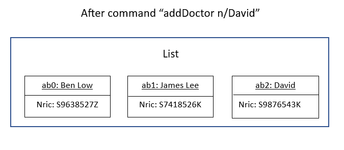
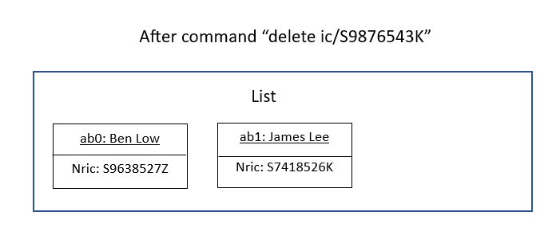
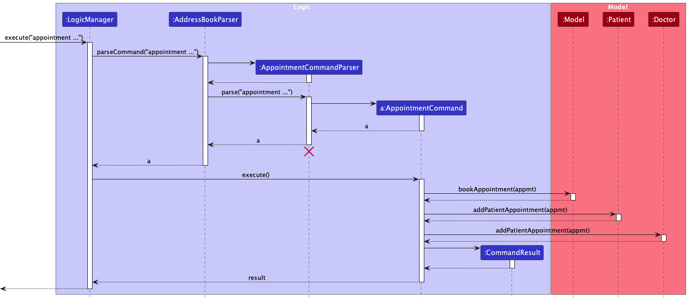

* Table of Contents
{:toc}

--------------------------------------------------------------------------------------------------------------------

## **Acknowledgements**

* {list here sources of all reused/adapted ideas, code, documentation, and third-party libraries -- include links to the original source as well}

--------------------------------------------------------------------------------------------------------------------

## **Setting up, getting started**

Refer to the guide [_Setting up and getting started_](SettingUp.md).

--------------------------------------------------------------------------------------------------------------------

## **Design**

:bulb: **Tip:** The `.puml` files used to create diagrams in this document can be found in the [diagrams](https://github.com/se-edu/addressbook-level3/tree/master/docs/diagrams/) folder. Refer to the [_PlantUML Tutorial_ at se-edu/guides](https://se-education.org/guides/tutorials/plantUml.html) to learn how to create and edit diagrams.

### Architecture

The ***Architecture Diagram*** given above explains the high-level design of the App.

Given below is a quick overview of main components and how they interact with each other.

**Main components of the architecture**

**`Main`** has two classes called [`Main`](https://github.com/se-edu/addressbook-level3/tree/master/src/main/java/seedu/address/Main.java) and [`MainApp`](https://github.com/se-edu/addressbook-level3/tree/master/src/main/java/seedu/address/MainApp.java). It is responsible for,
* At app launch: Initializes the components in the correct sequence, and connects them up with each other.
* At shut down: Shuts down the components and invokes cleanup methods where necessary.

[**`Commons`**](#common-classes) represents a collection of classes used by multiple other components.

The rest of the App consists of four components.

* [**`UI`**](#ui-component): The UI of the App.
* [**`Logic`**](#logic-component): The command executor.
* [**`Model`**](#model-component): Holds the data of the App in memory.
* [**`Storage`**](#storage-component): Reads data from, and writes data to, the hard disk.

**How the architecture components interact with each other**

The *Sequence Diagram* below shows how the components interact with each other for the scenario where the user issues the command `delete ic/S9876543K`.

Each of the four main components (also shown in the diagram above),

* defines its *API* in an `interface` with the same name as the Component.
* implements its functionality using a concrete `{Component Name}Manager` class (which follows the corresponding API `interface` mentioned in the previous point.

For example, the `Logic` component defines its API in the `Logic.java` interface and implements its functionality using the `LogicManager.java` class which follows the `Logic` interface. Other components interact with a given component through its interface rather than the concrete class (reason: to prevent outside component's being coupled to the implementation of a component), as illustrated in the (partial) class diagram below.

The sections below give more details of each component.

### UI component

The **API** of this component is specified in [`Ui.java`](https://github.com/se-edu/addressbook-level3/tree/master/src/main/java/seedu/address/ui/Ui.java)

The UI consists of a `MainWindow` that is made up of parts e.g.`CommandBox`, `ResultDisplay`, `PersonListPanel`, `StatusBarFooter` etc. All these, including the `MainWindow`, inherit from the abstract `UiPart` class which captures the commonalities between classes that represent parts of the visible GUI.

The `UI` component uses the JavaFx UI framework. The layout of these UI parts are defined in matching `.fxml` files that are in the `src/main/resources/view` folder. For example, the layout of the [`MainWindow`](https://github.com/se-edu/addressbook-level3/tree/master/src/main/java/seedu/address/ui/MainWindow.java) is specified in [`MainWindow.fxml`](https://github.com/se-edu/addressbook-level3/tree/master/src/main/resources/view/MainWindow.fxml)

The `UI` component,

* executes user commands using the `Logic` component.
* listens for changes to `Model` data so that the UI can be updated with the modified data.
* keeps a reference to the `Logic` component, because the `UI` relies on the `Logic` to execute commands.
* depends on some classes in the `Model` component, as it displays `Person` object residing in the `Model`.

### Logic component

**API** : [`Logic.java`](https://github.com/se-edu/addressbook-level3/tree/master/src/main/java/seedu/address/logic/Logic.java)

Here's a (partial) class diagram of the `Logic` component:

How the `Logic` component works:
1. When `Logic` is called upon to execute a command, it uses the `AddressBookParser` class to parse the user command.
1. This results in a `Command` object (more precisely, an object of one of its subclasses e.g., `AddCommand`) which is executed by the `LogicManager`.
1. The command can communicate with the `Model` when it is executed (e.g. to add a person).
1. The result of the command execution is encapsulated as a `CommandResult` object which is returned back from `Logic`.

The Sequence Diagram below illustrates the interactions within the `Logic` component for the `execute("delete ic/S9876543K")` API call.

:information_source: **Note:** The lifeline for `DeleteCommandParser` should end at the destroy marker (X) but due to a limitation of PlantUML, the lifeline reaches the end of diagram.

Here are the other classes in `Logic` (omitted from the class diagram above) that are used for parsing a user command:

How the parsing works:
* When called upon to parse a user command, the `AddressBookParser` class creates an `XYZCommandParser` (`XYZ` is a placeholder for the specific command name e.g., `AddCommandParser`) which uses the other classes shown above to parse the user command and create a `XYZCommand` object (e.g., `AddCommand`) which the `AddressBookParser` returns back as a `Command` object.
* All `XYZCommandParser` classes (e.g., `AddCommandParser`, `DeleteCommandParser`, ...) inherit from the `Parser` interface so that they can be treated similarly where possible e.g, during testing.

### Model component
**API** : [`Model.java`](https://github.com/se-edu/addressbook-level3/tree/master/src/main/java/seedu/address/model/Model.java)

The `Model` component,

* stores the address book data i.e., all `Person` objects (which are contained in a `UniquePersonList` object).
* stores the currently 'selected' `Person` objects (e.g., results of a search query) as a separate _filtered_ list which is exposed to outsiders as an unmodifiable `ObservableList<Person>` that can be 'observed' e.g. the UI can be bound to this list so that the UI automatically updates when the data in the list change.
* stores a `UserPref` object that represents the user’s preferences. This is exposed to the outside as a `ReadOnlyUserPref` objects.
* does not depend on any of the other three components (as the `Model` represents data entities of the domain, they should make sense on their own without depending on other components)

:information_source: **Note:** An alternative (arguably, a more OOP) model is given below. It has a `Tag` list in the `AddressBook`, which `Person` references. This allows `AddressBook` to only require one `Tag` object per unique tag, instead of each `Person` needing their own `Tag` objects. 

#### Person
{add diagram}

* The `Person` object under the `Model` component, stores information of a generic person 
* A `Person` object extends a `Patient` or a `Doctor`, which stores information specific to a patient and a doctor respectively
* Note that only the `Nric` uniquely identifies each `Person`

#### Appointment
{add diagram}

* The `Appointment` object is stored within the `Appointment` package, under the `Model` component.
* Stores the required information of an appointment, including patient's `Nric`, `Booking`, and doctor's `Nric`
  * Note that the patient's `Nric` and doctor's `Nric` has to exist in `MediConnect`

#### Prescription
{add diagram}

* The `Prescription` object is stored within the `Prescription` package, under the `Model` component.
* Stores the required information of a prescription, including `Cost`, and `Medication`
    * Note that `Prescription` can only be created for an existing `Patient` in `MediConnect`

### Storage component

**API** : [`Storage.java`](https://github.com/se-edu/addressbook-level3/tree/master/src/main/java/seedu/address/storage/Storage.java)

The `Storage` component,
* can save both address book data and user preference data in json format, and read them back into corresponding objects.
* inherits from both `AddressBookStorage` and `UserPrefStorage`, which means it can be treated as either one (if only the functionality of only one is needed).
* depends on some classes in the `Model` component (because the `Storage` component's job is to save/retrieve objects that belong to the `Model`)

### Common classes

Classes used by multiple components are in the `seedu.addressbook.commons` package.

--------------------------------------------------------------------------------------------------------------------

## **Implementation**

This section describes some noteworthy details on how certain features are implemented.

### Adding a Person

The add mechanism is facilitated by `MediConnect`.

It allows the user to add new a person (Patient/Doctor) to the `list` using `addPatient` or `addDoctor`

Given below is an example usage scenario and how the add mechanism behaves at each step.

Step 1. The user launches the application. The list of existing patients and doctors is shown.

Step 2. The user inputs the appropriate command (either addPatient or addDoctor), followed by the required input fields as shown below:  
&nbsp;&nbsp;&nbsp;&nbsp;&nbsp;&nbsp;&nbsp;&nbsp;&nbsp;&nbsp;&nbsp;`addDoctor n/Sarah Tan p/99123456 e/sarah@abc.com ic/T7654321P a/Sarah Rd t/Pediatrician`

Step 3. The `addDoctor` command will check whether all the required fields are correct and if the person does not already exist in the doctors' list.

Step 4. call Model...

Step 5. create new Doctor object and add to list...

### Deleting a Person

The delete mechanism is facilitated by `MediConnect`. It extends `MediConnect` with a delete function.

Given below is an example usage scenario and how the delete mechanism behaves at each step.

Step 1. The user launches the application for the first time. The `MediConnect` will be initialized with the initial address book state, and the `currentStatePointer` pointing to that single address book state.

Step 2. The user executes addDoctor n/David Tan …​ to add a new doctor. The add command also calls Model#commitAddressBook(), causing another modified address book state to be saved into the addressBookStateList.

Step 3. The user now wants to delete the person, and decides to carry out the delete operation by executing the `delete` command.

Step 4. The user executes `delete ic/S9876543K` command to delete the person with the `NRIC S9876543K` in the MediConnect. The `delete` command calls `Model#commitAddressBook()`, causing the modified state of the address book after the `delete ic/S9876543K` command executes to be saved in the `addressBookStateList`, and the `currentStatePointer` is shifted to the newly inserted address book state.

#### Design considerations:

**Aspect: How delete executes:**

* **Current choice:** Delete the patient/doctor with the given NRIC
    * Pros: Easy to implement. No need to worry about multiple people with same name, since everyone has a unique nric number.
    * Cons: Cannot delete multiple people at once. User might delete the wrong nric accidentally since it is a long chain of numbers.

    
### Display feature

The display feature is to allow the user to view all detailed particulars of a `Patient` or `Doctor`. Note that the `Person` has to exist in `MediConnect`.  This feature is intended to complement the `Edit`, `Appointment` and `Prescription` features, allowing users to access all of the `Person`'s information when updating records.

Given below is an example usage scenario and how the display mechanism behaves at each step.

Scenario: Mary Smith is a patient (already registered in the system) who has just arrived at the clinic for her appointment. She is required to register her visit before consulting the doctor.

Step 1. The healthcare administrative staff wishes to verify that Mary has an appointment scheduled at this time. The staff first verifies Mary Smith's `Nric` with her, and executes `display ic/S1234567X`. As seen from Mary's appointment list, an appointment is indeed scheduled for today, and the staff proceeds to register her visit.

The sequence diagram below shows how the DisplayCommand works:

* When the user inputs `display ic/[NRIC]`, the `LogicManager` calls `AddressBookParser` to parse the command. This creates an `AppointmentCommandParser` to parse the person's `Nric` through `ParserUtil`
    * Any invalid inputs will throw a `ParseException`
* Otherwise, it creates an `DisplayCommand`. The `LogicManager` then executes the `DisplayCommand`, upon which the `Person` is retrieved by `Nric` before calling `Model#updatePersonView()` to display the detailed view of the retrieved `Person` 
    * `CommandException` is thrown
        * if `Patient` or `Doctor` retrieved by `Nric` does not exist

### Appointment feature

`Appointment` represents a scheduled meeting between a `Patient` and a `Doctor`. When a `Patient` is scheduled an appointment with a `Doctor`, that corresponding `Doctor` will have an appointment scheduled with that particular `Patient`. Each `Appointment` consists of the following:
* Patient's `Nric` of the `Patient` scheduled for an appointment
* `Booking` consisting the date of the appointment
* Doctor's `Nric` of the `Doctor` that the `Patient` is scheduled with in the appointment
  
#### Adding an appointment

Given below is an example usage scenario and how the add appointment mechanism behaves at each step.

Scenario: Mary Smith is an outpatient (already registered in the system) due for her medical check-up with Dr. Paul West (already registered in the system) in 2 weeks, on 01-02-2023 10:00. (Note: This scenario assumes that there is currently no existing appointment data that has been created or stored in MediConnect.)

Step 1. The healthcare administrative staff first verifies Mary Smith's `Nric` with her, and executes `appointment ic/S1234567X d/01-02-2023 10:00 dric/S7654321R` command to add an appointment for Mary Smith at the specified date, with Dr Paul West. This adds an `Appointment` to Mary, an`Appointment` to Dr. Paul, and an `Appointment` to the `HospitalAppointmentList`. The successful execution of the command confirms that both Mary Smith does not have any prior booking on this date and that Dr. Paul West is not scheduled to meet any other patients on the same date.

The sequence diagram below shows how the AppointmentCommand works:

* When the user inputs `appointment ic/[NRIC] d/[DATE] dric/[NRIC]`, the `LogicManager` calls `AddressBookParser` to parse the command. This creates an `AppointmentCommandParser` to parse the patient's `Nric`, `Booking`, and doctor's `Nric` inputs through `ParserUtil`
  * Any invalid inputs will throw a `ParseException`
* Otherwise, it creates an `AppointmentCommand` with the new `Appointment` created. The `LogicManager` then executes the `AppointmentCommand`, upon which the `Appointment` is added to the `Patient` and `Doctor`'s appointment list, as well as the `Model` by calling `ModelManager#bookAppointment()`. 
  * `CommandException` is thrown
    * if `Patient` or `Doctor` retrieved by `Nric` does not exist, or
    * if `Appointment` already exists in `Model`
* Since the `Patient` and `Doctor`'s `Appointment` attributes have been updated, new instances of `Patient` and `Doctor` are created, and saved with `Model#setPerson()`

#### Deleting an appointment

The sequence diagram below shows how the `DeleteAppointmentCommand` is parsed:
{add a sequence diagram}

Given below is an example usage scenario and how the delete appointment mechanism behaves at each step.

Scenario: Mary Smith already has a medical check-up scheduled with Dr. Paul West (already registered in the system) on 01-02-2023 10:00. However, she realizes that she cannot make it and wishes to cancel the appointment. (Note: This scenario assumes that there is currently no existing appointment data that has been created or stored in MediConnect.)

Step 1. The healthcare administrative staff first verifies Mary Smith's `Nric` with her, and executes `display ic/S1234567X` to view all her existing appointment bookings. This displays Mary's list of appointments, and the appointment that needs to be cancelled is located at index 1.

Step 2. The user executes `deleteAppointment 1 ic/S1234567X` command to delete the appointment at index 1 of Mary's list of appointments. This removes the `Appointment` from Mary's and Dr. Paul's appointment list, and from `HospitalAppointmentList`.

The sequence diagram below shows how the DeleteAppointmentCommand works:

* When the user inputs `deleteAppointment INDEX ic/[NRIC]`, the `LogicManager` calls `AddressBookParser` to parse the command. This creates a `DeleteAppointmentCommandParser` to parse the patient's `Nric`, and `INDEX` through `ParserUtil`
    * Any invalid inputs will throw a `ParseException`
* Otherwise, it creates a `DeleteAppointmentCommand`. The `LogicManager` then executes the `DeleteAppointmentCommand`, upon which the `Appointment` to be deleted is retrieved and removed from the `Patient` and `Doctor`'s appointment list, as well as the `Model` by calling `ModelManager#deleteAppointment()`.
    * `CommandException` is thrown
        * if `Patient` or `Doctor` retrieved by `Nric` does not exist, or
        * if `INDEX` is invalid
* Since the `Patient` and `Doctor`'s `Appointment` attributes have been updated, new instances of `Patient` and `Doctor` are created, and saved with `Model#setPerson()`

#### Design considerations:

**Aspect: Command format:**

* **Alternative 1 (current choice):** Delete appointment specified by the `INDEX`.
    * Pros: User can input a shorter command.
    * Cons: Can be tedious to find the appointment to delete if the appointment list gets very long.

* **Alternative 2:** Delete appointment specified by the `Booking` and doctor's `Nric`.
    * Pros: User does not have to search through the patient's appointment list to identify which appointment to delete.
    * Cons: More tedious to implement and less convenient for the user to input command.

### \[Proposed\] Undo/redo feature

#### Proposed Implementation

The proposed undo/redo mechanism is facilitated by `VersionedAddressBook`. It extends `AddressBook` with an undo/redo history, stored internally as an `addressBookStateList` and `currentStatePointer`. Additionally, it implements the following operations:

* `VersionedAddressBook#commit()` — Saves the current address book state in its history.
* `VersionedAddressBook#undo()` — Restores the previous address book state from its history.
* `VersionedAddressBook#redo()` — Restores a previously undone address book state from its history.

These operations are exposed in the `Model` interface as `Model#commitAddressBook()`, `Model#undoAddressBook()` and `Model#redoAddressBook()` respectively.

Given below is an example usage scenario and how the undo/redo mechanism behaves at each step.

Step 1. The user launches the application for the first time. The `VersionedAddressBook` will be initialized with the initial address book state, and the `currentStatePointer` pointing to that single address book state.

Step 2. The user executes `delete ic/S9876543K` command to delete the person with the `NRIC S9876543K` in the address book. The `delete` command calls `Model#commitAddressBook()`, causing the modified state of the address book after the `delete ic/S9876543K` command executes to be saved in the `addressBookStateList`, and the `currentStatePointer` is shifted to the newly inserted address book state.

Step 3. The user executes `add n/David …​` to add a new person. The `add` command also calls `Model#commitAddressBook()`, causing another modified address book state to be saved into the `addressBookStateList`.

:information_source: **Note:** If a command fails its execution, it will not call `Model#commitAddressBook()`, so the address book state will not be saved into the `addressBookStateList`.

Step 4. The user now decides that adding the person was a mistake, and decides to undo that action by executing the `undo` command. The `undo` command will call `Model#undoAddressBook()`, which will shift the `currentStatePointer` once to the left, pointing it to the previous address book state, and restores the address book to that state.

:information_source: **Note:** If the `currentStatePointer` is at index 0, pointing to the initial AddressBook state, then there are no previous AddressBook states to restore. The `undo` command uses `Model#canUndoAddressBook()` to check if this is the case. If so, it will return an error to the user rather
than attempting to perform the undo.

The following sequence diagram shows how the undo operation works:

:information_source: **Note:** The lifeline for `UndoCommand` should end at the destroy marker (X) but due to a limitation of PlantUML, the lifeline reaches the end of diagram.

The `redo` command does the opposite — it calls `Model#redoAddressBook()`, which shifts the `currentStatePointer` once to the right, pointing to the previously undone state, and restores the address book to that state.

:information_source: **Note:** If the `currentStatePointer` is at index `addressBookStateList.size() - 1`, pointing to the latest address book state, then there are no undone AddressBook states to restore. The `redo` command uses `Model#canRedoAddressBook()` to check if this is the case. If so, it will return an error to the user rather than attempting to perform the redo.

Step 5. The user then decides to execute the command `list`. Commands that do not modify the address book, such as `list`, will usually not call `Model#commitAddressBook()`, `Model#undoAddressBook()` or `Model#redoAddressBook()`. Thus, the `addressBookStateList` remains unchanged.

Step 6. The user executes `clear`, which calls `Model#commitAddressBook()`. Since the `currentStatePointer` is not pointing at the end of the `addressBookStateList`, all address book states after the `currentStatePointer` will be purged. Reason: It no longer makes sense to redo the `add n/David …​` command. This is the behavior that most modern desktop applications follow.

The following activity diagram summarizes what happens when a user executes a new command:

#### Design considerations:

**Aspect: How undo & redo executes:**

* **Alternative 1 (current choice):** Saves the entire address book.
  * Pros: Easy to implement.
  * Cons: May have performance issues in terms of memory usage.

* **Alternative 2:** Individual command knows how to undo/redo by
  itself.
  * Pros: Will use less memory (e.g. for `delete`, just save the person being deleted).
  * Cons: We must ensure that the implementation of each individual command are correct.

_{more aspects and alternatives to be added}_

### \[Proposed\] Data archiving

_{Explain here how the data archiving feature will be implemented}_

--------------------------------------------------------------------------------------------------------------------

## **Documentation, logging, testing, configuration, dev-ops**

* [Documentation guide](Documentation.md)
* [Testing guide](Testing.md)
* [Logging guide](Logging.md)
* [Configuration guide](Configuration.md)
* [DevOps guide](DevOps.md)

--------------------------------------------------------------------------------------------------------------------

## **Appendix: Requirements**

### Product scope

**Target user profile**:

* Hospital administrative staff, Doctors
* has a need to manage a significant number of patient/doctor data
* prefer desktop apps over other types
* can type fast
* prefers typing to mouse interactions
* is reasonably comfortable using CLI apps

**Value proposition**: manage patient/doctor details faster than a typical mouse/GUI driven app

### User stories

Priorities: High (must have) - `* * *`, Medium (nice to have) - `* *`, Low (unlikely to have) - `*`

| Priority | As a …​                  | I want to …​                                                                                                                | So that …​                                                                              |
| -------- |--------------------------|-----------------------------------------------------------------------------------------------------------------------------|-----------------------------------------------------------------------------------------|
| `* * *`  | healthcare provider | access a dashboard to keep track of my patients' information, medical history, and appointment schedules                    | I can provide better care.                                                              |
|          | healthcare provider | view bed availability in real-time                                                                                          | I can make informed decisions about patient admission and discharge.                    |
| `* * *`  | healthcare provider      | update patient information and medical history after each appointment                                                       | I have a complete and accurate record of the patient's health.                          |
|          | healthcare provider      | generate and send prescription orders to the pharmacy directly from the application                                         | I can streamline the process for my patients.                                           |
|          | healthcare provider      | access real-time data on the patient's vital signs and monitor the patient's health remotely                                | I can quickly respond to changes in the patient's health.                               |
|          | healthcare provider      | access and update my own schedule and availability through the application                                                  | I can manage my workload and provide better care for my patients.                       | 
|          | healthcare provider      | view and manage patient waiting times                                                                                       | I can minimize wait times and improve patient satisfaction.                             |
| `* * *`  | healthcare provider      | access a directory of specialist doctors and referral information                                                           | I can quickly and easily connect my patients with the right care.                       |
|          | healthcare provider      | provide virtual consultations and appointments through the application                                                      | I can reach more patients and provide better access to care.                            |
|          | healthcare provider      | access a library of patient education materials and resources                                                               | I can provide better information and support to my patients.                            |
|          | healthcare provider      | view and manage patient waitlists and triage patient needs                                                                  | I can prioritize the most urgent cases and provide better access to care.               |
|          | healthcare provider      | access and view patient insurance information and make necessary updates                                                    | I can accurately bill patients and manage healthcare costs.                             |
|          | healthcare provider      | send appointment confirmations and reminders to patients                                                                    | they can arrive prepared for their appointments.                                        |
|          | healthcare administrator | access analytics and metrics on patient engagement, appointment booking, and resource utilization                           | I can make data-driven decisions to improve the hospital's operations.                  |
|          | healthcare administrator | access real-time data on hospital utilization and resource allocation                                                       | I can optimize the hospital's operations and improve patient outcomes.                  |
| `* * *`  | healthcare administrator | access patients' records on the go/at home any time when it's necessary to provide admin support anytime.                   |                                                                                         |
|          | healthcare administrator | manage the hospital staff and workload better using the app                                                                 | there are sufficient people during each shift.                                          |
|          | healthcare administrator | quickly retrieve patient's bill through the application                                                                     | I can send invoices to the patients more efficiently.                                   |
|          | healthcare administrator | receive reminders for appointments and medication                                                                           | I don't forget to inform any patients.                                                  |
|          | healthcare administrator | provide feedback and rate my experience with the application                                                                | I can improve the application to better suit my needs.                                  |
|          | healthcare administrator | access patient's test results and medical records through the application                                                   | I can provide doctors with the patient's health history.                                |
|          | healthcare administrator | create an account                                                                                                           | I can login and handle patient's and doctor's information.                              |
|          | healthcare administrator | communicate with the rest of the healthcare team and provide updates on patient's health status                             | I can provide better healthcare to the patients.                                        |
|          | healthcare administrator | schedule and reschedule appointments through the application                                                                | I can accomodate to the patients and doctors availability.                              |
|          | healthcare administrator | provide emergency contact information through the application                                                               | I can quickly find the patient's designated emergency contacts in case of an emergency. |
|          | healthcare administrator | view and manage patient's bills and medication through the application                                                      | I can keep track of patient bills and medical records.                                  |
|          | tech illiterate healthcare administrator | navigate through the app easily without help.                                                                               |                                                                                         |

*{More to be added}*

### Use cases

(For all use cases below, the **System** is `MediConnect (MC)`, unless specified otherwise)

**Use case: UC01 - Add patient’s information**

**Actor: Healthcare administrator**

**MSS**

1. User chooses to add patient’s information..
2. MC requests for details of the information.
3. User enters the requested details.
4. MC displays the new patient information..

    Use case ends.

**Extensions**

* 3a. MC detects an error in the entered data.

  * 3a1. MC requests for the correct data.

  * 3a2. User enters new data.

    Steps 3a1-3a2 are repeated until the data entered are correct.

    Use case resumes from step 4.

**Use case: UC02 - Add doctor’s information**

**Actor: Healthcare administrator**

**MSS**

1. User chooses to add doctor’s information..
2. MC requests for details of the information.
3. User enters the requested details.
4. MC displays the new doctor’s information..

    Use case ends.

**Extensions**

* 3a. MC detects an error in the entered data.

  * 3a1. MC requests for the correct data.

  * 3a2. User enters new data.

    Steps 3a1-3a2 are repeated until the data entered are correct.

    Use case resumes from step 4.

**Use case: UC03 - Retrieve patient’s information**

**Actor: Doctor**

**MSS**

1. User chooses to retrieve patient’s information..
2. MC retrieves the patient’s information
3. MC displays the patient information that was retrieved..
   
    Use case ends.

**Extensions**

* 3a. MC detects an error in the entered data.

  * 3a1. MC requests for the correct data.

  * 3a2. User enters new data.

    Steps 3a1-3a2 are repeated until the data entered are correct.

    Use case resumes from step 4.

* 3b. User request an unassigned patient’s information

  * 3b1. MC denies the request.

    Use case ends.

**Use case: UC04 - Delete patient's information**

**Actor: Hospital administration**

**MSS**

1. User choose to delete patient information.
2. MC request for the patient's nric number.
3. User enters the requested details
4. MC displays the confirmation of the deleted patient..

   Use case ends.

**Extensions**
* 3a. MC cannot find the patient's nric in the list

  * 3a1. MC informs the user that the patient cannot be found

  * 3a2. User enters the corrected nric.

    Steps 3a1-3a2 are repeated until the data entered are correct.

    Use case resumes from step 4.

* 3b. User does not enter the `ic/` field after the `delete` command.

  * 3b1. MC informs the user that it is an invalid command format.

  * 3b2. User enters the correct command format.

    Steps 3b1-3b2 are repeated until the data entered are correct.

    Use case resumes from step 4.

* 3c. User does not enter a nric number or enters an invalid nric format number after the `ic/` field.

  * 3c1. MC informs the user that NRIC must follow a specific format.

  * User enters the correct nric format number.

    Steps 3c1-3c2 are repeated until the data entered are correct.

    Use case resumes from step 4.

**Use case: UC04 - Book patient's appointment**

**Actor: Healthcare administrator**

**MSS**

1. User chooses to book patient’s appointment..
2. MC requests for details of the information..
3. User enters the requested details..
4. MC displays the updated appointment information for the patient and the doctor.
   
    Use case ends.

**Extensions**
* 4a. MC detects that the patient already has an appointment scheduled for that appointment slot.

  * 4a1. MC informs the user that the appointment has been booked
  
  * 4a2. User enters another appointment slot.
  
    Steps 4a1-4a2 are repeated until the data entered are correct.
  
    Use case resumes from step 4.
  
* 4b. MC detects that the doctor has already scheduled an appointment with another patient at this particular time slot.
  
  * 4b1. MC informs the user that the appointment has been booked
  
  * 4b2. User enters another appointment slot. 
  
    Steps 4b1-4b2 are repeated until the data entered are correct. 
  
    Use case resumes from step 4.

* 4c. MC detects that the patient's nric does not exist.
  
  * 4c1. MC informs the user that the patient's nric is invalid
  
  * 4c2. User enters another patient nric
  
    Steps 4c1-4c2 are repeated until the data entered are correct. 
  
    Use case resumes from step 4.
  
* 4d. MC detects that the doctor's nric does not exist.
  
    * 4d1. MC informs the user that the doctor's nric is invalid
  
    * 4d2. User enters another doctor nric 
  
      Steps 4d1-4d2 are repeated until the data entered are correct.

      Use case resumes from step 4.

**Use case: UC05 - Cancel patient's appointment**

**Actor: Healthcare administrator**

**MSS**

1. User chooses to cancel patient’s appointment..
2. MC requests for details of the information..
3. User enters the requested details..
4. MC displays the updated appointment information for the patient and the doctor. 
   
    Use case ends.

**Extensions**

* 5a. MC detects that an invalid index is entered.
  
    * 5a1. MC informs the user that the specified index is invalid
  
    * 5a2. User enters another index.
    
      Steps 5a1-5a2 are repeated until the data entered are correct. 

      Use case resumes from step 4. 

* 5b. MC detects that the patient's nric does not exist.
  
    * 5b1. MC informs the user that the patient's nric is invalid
  
    * 5b2. User enters another patient nric
  
      Steps 5b1-5b2 are repeated until the data entered are correct.

      Use case resumes from step 4.
  
*{More to be added}*

### Non-Functional Requirements

1. Users cannot view information of unassigned patients
2. System should be backward compatible with data produced by earlier versions of the system;
3. Requires Java 11
4. The system should be usable by a novice who is tech illiterate
5. **Any other noteworthy points:** Confidential information is hidden, requires access rights

*{More to be added}*

### Glossary

* **Mainstream OS**: Windows, Linux, Unix, OS-X
* **Patient**: Define as a customer of the hospital and only has read-access
* **Doctor**: Define as staff of the hospital and only has read-access
* **Administrator**: Define as admin staff of the hospital and has write-access

--------------------------------------------------------------------------------------------------------------------

## **Appendix: Instructions for manual testing**

Given below are instructions to test the app manually.

:information_source: **Note:** These instructions only provide a starting point for testers to work on;
testers are expected to do more *exploratory* testing.

### Launch and shutdown

1. Initial launch

   1. Download the jar file and copy into an empty folder

   1. Double-click the jar file Expected: Shows the GUI with a set of sample contacts. The window size may not be optimum.

1. Saving window preferences

   1. Resize the window to an optimum size. Move the window to a different location. Close the window.

   1. Re-launch the app by double-clicking the jar file. 
       Expected: The most recent window size and location is retained.

1. _{ more test cases …​ }_

### Deleting a person

1. Deleting a person while all persons are being shown

   1. Prerequisites: List all persons using the `list` command. Multiple persons in the list.

   1. Test case: `delete ic/S1234567A` 
      Expected: First contact is deleted from the list. Details of the deleted contact shown in the status message. Timestamp in the status bar is updated.

   1. Test case: `delete ic/0` 
      Expected: No person is deleted. Error details shown in the status message. Status bar remains the same.

   1. Other incorrect delete commands to try: `delete`, `delete x`, `...` (where x is larger than the list size) 
      Expected: Similar to previous.

1. _{ more test cases …​ }_

### Saving data

1. Dealing with missing/corrupted data files

   1. _{explain how to simulate a missing/corrupted file, and the expected behavior}_

1. _{ more test cases …​ }_
