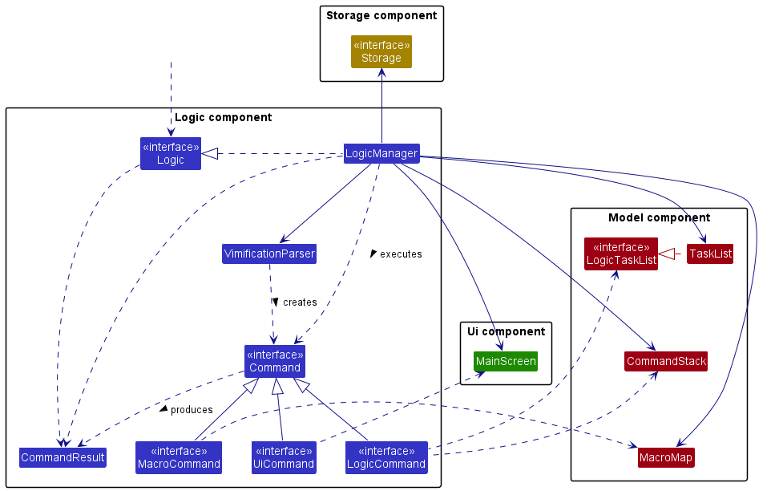
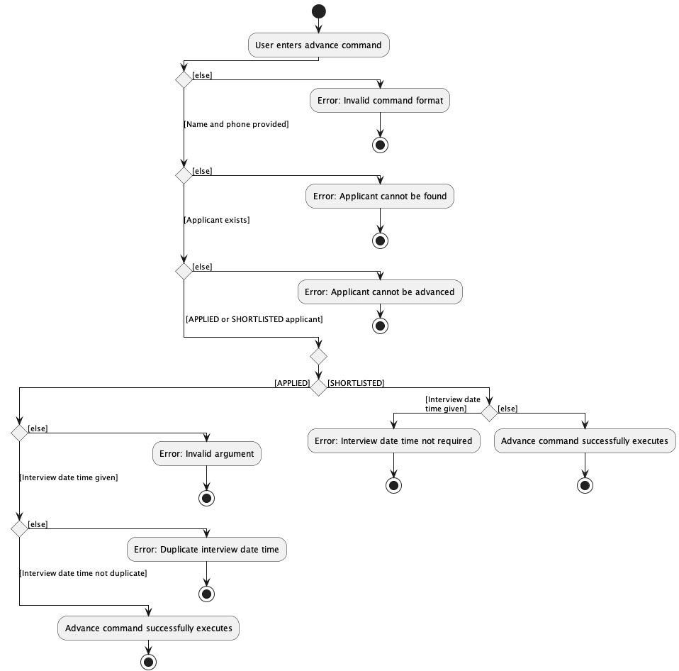
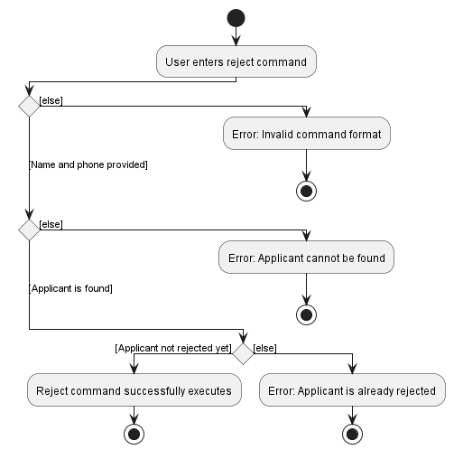
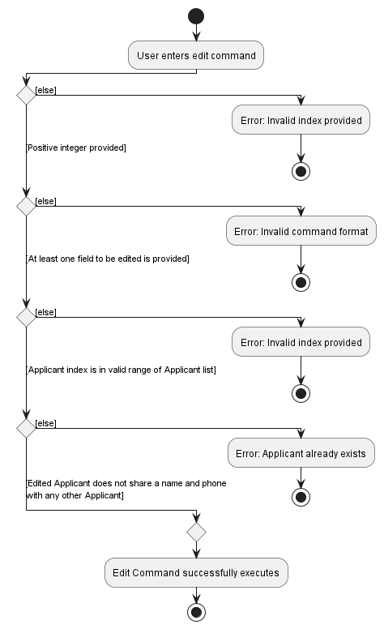
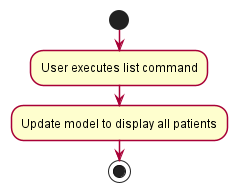
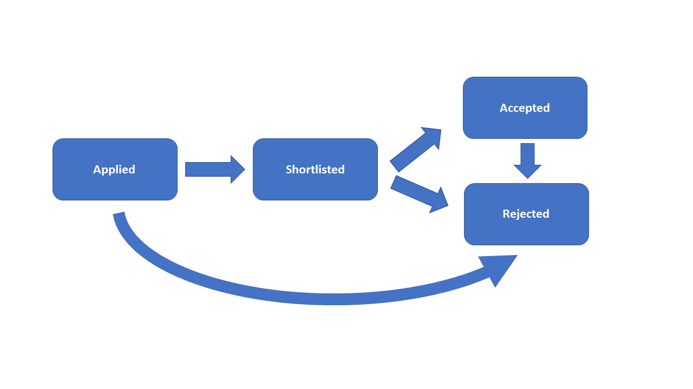

## Table of Contents

* [About HMHero](#about-hmhero)
* [How to use this Developer Guide](#how-to-use-this-developer-guide)
    * [Icons and Hyperlinks](#31-icons-and-hyperlinks)
    * [Purpose of User Guide](#32-purpose-of-user-guide)
3. [Installation](#4-installation)
4. [Quick Start](#5-quick-start)
    * [User Interface](#51-user-interface)
    * [Key Definitions](#52-key-definitions)
        * [Applicant](#521-applicant)
        * [Notes](#522-notes)
        * [Flags](#523-flags)
        * [Placeholders](#524-placeholders)
    * [Command Format](#53-command-format)
    * [Trying your First Command](#54-trying-your-first-command)
5. [Commands](#6-commands)
    * [Applicant Commands](#61-applicant-commands)
        * [Create a new applicant `add`](#611-create-a-new-applicant-add)
        * [Search for an applicant `find`](#612-search-for-an-applicant-find)
        * [List all applicants `list`](#613-list-all-applicants-list)
        * [Delete an applicant `delete`](#614-delete-an-applicant-delete)
        * [Advance an applicant `advance`](#615-advance-an-applicant-advance)
        * [Reject an applicant `reject`](#616-reject-an-applicant-reject)
        * [List all interview dates of applicants `interview`](#617-list-all-interview-dates-of-applicants-interview)
        * [Edit an existing applicant `edit`](#618-edit-an-existing-applicant-edit)
        * [Remind upcoming interviews `remind`](#619-remind-upcoming-interviews-remind)
    * [Statistic Commands](#62-statistics-commands)
    * [General Commands](#63-general-commands)
        * [Receive help during usage `help`](#631-receive-help-during-usage-help)
        * [Exit HMHero `exit`](#632-exit-hmhero-exit)
6. [Command summary](#7-command-summary)
    * [Applicant Commands](#71-applicant-commands)
    * [Statistics Commands](#72-statistics-commands)
    * [General Commands](#73-general-commands)
7. [Troubleshooting](#8-troubleshooting)
8. [FAQ](#9-faq)
9. [Acknowledgements](#10-acknowledgements)
10. [Glossary](#11-glossary)

--------------------------------------------------------------------------------------------------------------------

## **About HMHero**

HMHero is an Applicant Managing System designed to be used by human resource professionals, hiring managers,
and recruiters who want to streamline the recruitment process and make it more efficient,
helping their organizations manage job applications and hiring processes more effectively.

This Developer Guide is a detailed documentation on HMHero's design and implementation, describing the architecture,
an outline of all parts of HMHero and how they work together, and specifications on
feature implementation and considerations.

This guide is intended to assist developers in maintaining, upgrading or evolving HMHero.

--------------------------------------------------------------------------------------------------------------------

## **How to use this Developer Guide**

#### Person in place of Applicant

In this Developer Guide, `Person` is used in place of Applicant. Take note that when mentioning `Person`, we are
always talking about an Applicant in HMHero.

#### Icons and Hyperlinks

You may come across colored boxes containing text that will aid you in better understanding how to use each feature.

:information_source: <strong>Info:</strong>  
Highlight and display information you should pay attention to. 

:bulb: <strong>Tip:</strong>  
Highlight tips which you might find useful. 

:exclamation: <strong>Caution:</strong>  
Highlight dangers and things to look out for. 

Other than the icons mentioned above, you maye also come across <a href> Phrases coloured in blue </a> are hyperlinks
that will bring you to another part of this documentation that is relevant to the phrase.

[Back to Table of Contents](#table-of-contents)

--------------------------------------------------------------------------------------------------------------------

## **Acknowledgements**

* {list here sources of all reused/adapted ideas, code, documentation, and third-party libraries -- include links to the original source as well}

--------------------------------------------------------------------------------------------------------------------

## **Setting up, getting started**

Refer to the guide [_Setting up and getting started_](SettingUp.md).

--------------------------------------------------------------------------------------------------------------------

## **Design**

:bulb: <strong>Tip:</strong> The `.puml` files used to create diagrams in this document can be found in the [diagrams](https://github.com/AY2223S2-CS2103T-W14-4/tp/tree/master/docs/diagrams) folder. Refer to the [_PlantUML Tutorial_ at se-edu/guides](https://se-education.org/guides/tutorials/plantUml.html) to learn how to create and edit diagrams.

### Architecture

    <b>Figure 1.1.1</b> Architecture diagram for high-design of the App

The ***Architecture Diagram*** given above explains the high-level design of the App.

Given below is a quick overview of main components and how they interact with each other.

**Main components of the architecture**

**`Main`** has two classes called [`Main`](https://github.com/AY2223S2-CS2103T-W14-4/tp/blob/master/src/main/java/seedu/address/Main.java) and [`MainApp`](https://github.com/AY2223S2-CS2103T-W14-4/tp/blob/master/src/main/java/seedu/address/MainApp.java). It is responsible for,
* At app launch: Initializes the components in the correct sequence, and connects them up with each other.
* At shut down: Shuts down the components and invokes cleanup methods where necessary.

[**`Commons`**](#common-classes) represents a collection of classes used by multiple other components.

The rest of the App consists of four components.

* [**`UI`**](#ui-component): Manage the HMHero application User Interface
* [**`Logic`**](#logic-component): Manage the execution of commands.
* [**`Model`**](#model-component): Holds the data of the App in memory.
* [**`Storage`**](#storage-component): Reads data from and writes data to the hard disk.

**How the architecture components interact with each other**

The *Sequence Diagram* below shows how the components interact with each other for the scenario where the user issues the command `delete n/Alex p/91234567`.

    <b>Figure 1.1.2</b> Sequence Diagram for the command <code>delete n/Alex p/91234567</code>

 

Each of the four main components (also shown in the diagram above),

* defines its *API* in an `interface` with the same name as the Component.

* implements its functionality using a concrete `{Component Name}Manager` class (which follows the corresponding API `interface` mentioned in the previous point.)

For example, the `Logic` component defines its API in the `Logic.java` interface and implements its functionality using the `LogicManager.java` class which follows the `Logic` interface. Other components interact with a given component through its interface rather than the concrete class (reason: to prevent outside component's being coupled to the implementation of a component), as illustrated in the (partial) class diagram below.

    <b>Figure 1.1.3</b> Class Diagram for Component Managers

The sections below give more details of each component.

### UI component

The **API** of this component is specified in [`Ui.java`](https://github.com/AY2223S2-CS2103T-W14-4/tp/blob/master/src/main/java/seedu/address/ui/Ui.java)

    <b>Figure 1.2.1</b> Class Diagram for UI Components

The UI consists of a `MainWindow` that is made up of parts e.g.`CommandBox`, `ResultDisplay`, `PersonListPanel`, `StatusBarFooter` etc. All these, including the `MainWindow`, inherit from the abstract `UiPart` class which captures the commonalities between classes that represent parts of the visible GUI.

The `UI` component uses the JavaFx UI framework. 

Steps to start making changes to the UI:
1. The layout of these UI parts are defined in matching `.fxml` files that are in the [`src/main/resources/view`](https://github.com/AY2223S2-CS2103T-W14-4/tp/tree/master/src/main/resources/view) folder.
2. The managing classes of these UI parts are defined in matching `.java` files in the [`src/main/java/seedu/address/ui`](https://github.com/AY2223S2-CS2103T-W14-4/tp/tree/master/src/main/java/seedu/address/ui) folder.
3. The stylesheets for these UI parts can be found in `Extensions.css`, `HMHero.css`, and `Mainwindow.css`, except `UserProfilePanel` and `HelpWindow` with separate CSS files in matching `.css` files in the [`src/main/resources/view`](https://github.com/AY2223S2-CS2103T-W14-4/tp/tree/master/src/main/resources/view) folder.
4. For instance, the layout of the `HelpWindow` is specified in [`HelpWindow.fxml`](https://github.com/AY2223S2-CS2103T-W14-4/tp/blob/master/src/main/resources/view/HelpWindow.fxml) with managing class at [`HelpWindow.java`](https://github.com/AY2223S2-CS2103T-W14-4/tp/blob/master/src/main/java/seedu/address/ui/HelpWindow.java) and CSS file at [`HelpWindow.css`](https://github.com/AY2223S2-CS2103T-W14-4/tp/blob/master/src/main/resources/view/HelpWindow.css).
 

The `UI` component,

* executes user commands using the `Logic` component.
* listens for changes to `Model` data so that the UI can be updated with the modified data.
* keeps a reference to the `Logic` component, because the `UI` relies on the `Logic` to execute commands.
* depends on some classes in the `Model` component, as it displays `Person` object residing in the `Model`.

### Logic component

**API** : [`Logic.java`](https://github.com/AY2223S2-CS2103T-W14-4/tp/blob/master/src/main/java/seedu/address/logic/Logic.java)

Here's a (partial) class diagram of the `Logic` component:

    <b>Figure 1.3.1</b> Class diagram for Logic Components

How the `Logic` component works:
1. When `Logic` is called upon to execute a command, it uses the `HMHeroParser` class to parse the user command.
2. This results in a `Command` object (more precisely, an object of one of its subclasses e.g., `AddCommand`) which is executed by the `LogicManager`.
3. The command can communicate with the `Model` when it is executed (e.g. to add a person).
4. The result of the command execution is encapsulated as a `CommandResult` object which is returned back from `Logic`.

The Sequence Diagram below illustrates the interactions within the `Logic` component for the `execute("delete n/John p/91234567")` API call.

    <b>Figure 1.3.2</b> Sequence Diagram for the command <code>delete n/Alex p/91234567</code>

:information_source: **Note:** The lifeline for `DeleteCommandParser` should end at the destroy marker (X) but due to a limitation of PlantUML, the lifeline reaches the end of diagram.

Here are the other classes in `Logic` (omitted from the class diagram above) that are used for parsing a user command:

    <b>Figure 1.3.3</b> Class diagram for Parser Components

How the parsing works:
* When called upon to parse a user command, the `HMHero` class creates an `XYZCommandParser` (`XYZ` is a placeholder for the specific command name e.g., `AddCommandParser`) which uses the other classes shown above to parse the user command and create a `XYZCommand` object (e.g., `AddCommand`) which the `HMHeroParser` returns back as a `Command` object.
* All `XYZCommandParser` classes (e.g., `AddCommandParser`, `DeleteCommandParser`, ...) inherit from the `Parser` interface so that they can be treated similarly where possible e.g, during testing.

### Model component
**API** : [`Model.java`](https://github.com/AY2223S2-CS2103T-W14-4/tp/blob/master/src/main/java/seedu/address/model/Model.java)

    <b>Figure 1.4.1</b> Class diagram for Model Component

The `Model` component,

* stores the address book data i.e., all `Person` objects (which are contained in a `UniquePersonList` object).
* stores the currently 'selected' `Person` objects (e.g., results of a search query) as a separate _filtered_ list which is exposed to outsiders as an unmodifiable `ObservableList<Person>` that can be 'observed' e.g. the UI can be bound to this list so that the UI automatically updates when the data in the list change.
* stores a `UserPref` object that represents the user’s preferences. This is exposed to the outside as a `ReadOnlyUserPref` objects.
* does not depend on any of the other three components (as the `Model` represents data entities of the domain, they should make sense on their own without depending on other components)

:information_source: **Note:** An alternative (arguably, a more OOP) model is given below. It has a `Note` list in the `HMHero`, which `Person` references. This allows `HMHero` to only require one `Note` object per unique note, instead of each `Person` needing their own `Note` objects. 

    <b>Figure 1.4.2</b> Class diagram for Model Components

### Storage component

**API** : [`Storage.java`](https://github.com/AY2223S2-CS2103T-W14-4/tp/blob/master/src/main/java/seedu/address/storage/Storage.java)

    <b>Figure 1.5.1</b> Class diagram for Storage Components

The `Storage` component,
* can save both address book data and user preference data in json format, and read them back into corresponding objects.
* inherits from both `HMHeroStorage` and `UserPrefStorage`, which means it can be treated as either one (if only the functionality of only one is needed).
* depends on some classes in the `Model` component (because the `Storage` component's job is to save/retrieve objects that belong to the `Model`)

### Common classes

Classes used by multiple components are in the `seedu.addressbook.commons` package.

--------------------------------------------------------------------------------------------------------------------

## **Implementation**

This section describes some noteworthy details on how certain features are implemented.

#### Adding an Applicant

##### Overview

The `add` command creates a new `Person`, which represents an Applicant in HMHero's Applicant Managing System.

:information_source: <strong>Command Format:</strong>
`add n/NAME p/PHONE e/EMAIL a/ADDRESS [applied/APPLIEDDATETIME] [note/NOTE]...`  
Refer to [Glossary](#glossary) for more information on Command format.

Here is the activity diagram showing the process of the `add` command:

##### Feature Details

1. The user specifies Applicants details to create. Compulsory fields are name, phone, address, and email. Optional
fields include application date time and notes about the applicant.
1. If any of the compulsory fields are not provided, or the provided inputs are in the wrong format, an error message
   will be displayed. The user will be prompted to enter the command correctly via the error message.
1. All applicants added will start at the Applied Status.
1. If application date time was not provided, HMHero would assume the application date time of the Applicant to be now
   (the current date and time on the user's computer)
1. The applicant is cross-referenced in the `Model` to check if it already exists. If it does, an error is raised
to inform the user.
1. If step 5 completes without any exceptions, the new `Person` is created and stored inside HMHero.

##### Feature Considerations

When checking for duplicates in the `UniquePersonList` inside `Model`, any `Person` cannot have the same name and phone
as another. HMHero checks for both the name and phone number when checking for duplicates to prevent the situation of
applicants having the same name.

When implementing this feature, we restricted users to only add applicants into the `APPLIED` status. This is because
we wanted HMHero to adhere to the flow of the hiring process. Allowing users to add applicants into specific statuses
could introduce confusion to how `add` command is used.

#### Advancing an Applicant

##### Overview

The `advance` command advances an `Person` in HMHero, which advances the `Status` of a `Person`.

:information_source: <strong>Command Format:</strong>
`advance n/NAME p/PHONE [d/INTERVIEWDATETIME]`  
Refer to [Glossary](#glossary) for more information on Command format and applicant status.

Here is the activity diagram showing the process of the `advance` command:

##### Feature Details
1. The user specifies an applicant name and phone that represents a `Person` to be advanced.
2. If the name and phone is not provided, an error is thrown and the user is prompted to
enter the command correctly via an error message.
3. The name and phone are cross-referenced in the `Model` to check if an applicant with the corresponding name and phone exists. If it does not, then an error is raised to inform the user.
4. The status must be either Applied or Shortlisted. Else, then an error is raised to inform the user.
5. If the interview datetime is not provided when the status is Applied, the user will be prompted to enter the command
correctly via an error message.
6. If the interview datetime provided exists in the `Model`, the user will be prompted to enter the command
correctly via an error message.
7. If the interview datetime is provided when the status is Shortlisted, the user will be prompted to enter the command
correctly via an error message.
8. If step 7 is reached without any error message, HMHero advances the specified `Person`'s `Status`.

##### Feature Considerations

When implementing this feature, we realised that we could model HMHero to track hiring process in the real world 
more effectively by enforcing the rule that the user can only advance applicants one stage at a time. 
We thus decided to provide a default behaviour when advancing an applicant's status.

#### Rejecting an Applicant

##### Overview

The `reject` command rejects a `Person` in HMHero, which changes the `status` of a `Person` to `REJECTED`.

:information_source: <strong>Command Format:</strong>
`reject n/NAME p/PHONE`  
Refer to [Glossary](#glossary) for more information on Command format.

Here is the activity diagram showing the process of the `reject` command:

##### Feature Details
1. The user specifies an applicant name and phone that represents an `Person` to be rejected.
2. If the name and phone is not provided, an error is thrown and the user is prompted to
enter the command correctly via an error message.
3. The name and phone are cross-referenced in the `Model` to check if an applicant with the corresponding name and phone exists.
    If it does not, then an error is raised to inform the user.
4. HMHero confirms that the applicant's status is not already `REJECTED`. Else, an error is raised to inform the user.
5. If step 4 completes without any exceptions, then the `Person` is successfully rejected.

##### Feature Considerations

While it may be feasible to implement the `reject` command to successfully execute on 
applicants with `REJECTED` status, we felt that throwing an error message would provide more value for the user to 
inform them that the applicant has already been rejected.  
Additionally, we realised that it is common for hiring managers to reject applicants without removing them. Thus, the
`reject` command does not perform the same functionality as the `delete` command.
We also allowed the rejecting of applicants with the `ACCEPTED` status for the rare case where users might want to
reject an accepted applicant due to an unforeseen circumstance.

#### Finding an Applicant

##### Overview

The `find` command filters applicants based on fields specified by the user. 
Fields have to be denoted by flags. Allowed fields for filtering are `name` and `phone`.

:information_source: <strong>Command Format:</strong>
`find [n/NAME] [p/PHONE]`  
Refer to [Glossary](#glossary) for more information on Command format.

:information_source: <strong>Command Format:</strong>
`find [n/NAME] [p/PHONE]`  
Refer to [Glossary](#glossary) for more information on Command format.

Here is the activity diagram showing the process of the `find` command:

The sequence diagram for `find n/John` in HMHero is as such:

:information_source: <strong>Note:</strong>
The lifeline for `FindCommandParser` should end at the destroy marker (X) but due to a limitation of <strong>PlantUML</strong>, the lifeline reaches the end of the diagram.
Additionally, take note that interactions with utility classes such as `ArgumentTokenizer`, `ArgumentMultimap`, and `Messages` are excluded as including them would cause the UML diagram to be cluttered and too small to read.

##### Feature Details
1. The user specifies one or more fields to filter through the applicant list.
2. If the user specifies more than one field, the filtered applicant list has to match all fields.
3. If the user specifies a field more than once, only the last argument is considered when filtering applicants.

##### Feature considerations
The UI displays a `FilteredList` obtained from an immutable applicant list.
The `FindCommandParser` creates the `Predicate` used to filter the applicant list. When the `FindCommand` is executed,
the `FilteredList` sets its `Predicate` field to the created `Predicate`. The UI shows the new `FilteredList`.

Applicant fields are required as an input as it is helpful to reduce user confusion and facilitate finding applicants based on multiple fields.

#### Editing an Applicant

##### Overview

The `edit` feature edits the attached attributes of a specified `Person`,which is specified by the one-indexed `personList` presented to the user.

:information_source: <strong>Command Format:</strong>
`edit INDEX [n/NAME] [p/PHONE] [e/EMAIL] [a/ADDRESS] [d/INTERVIEWDATETIME] [note/NOTE]...`  
Refer to [Glossary](#glossary) for more information on Command format.

Here is the activity diagram showing the process of the `edit` command:

##### Feature Details

1. The user can perform commands that modify the shown applicant list. (Eg. `find` and `interview` commands)
2. The user specifies an index that represents a `Person` to be edited.
3. If a non-zero unsigned integer index is not provided, an error is thrown and the user is prompted to enter the command correctly via an error message.
4. At least one field to be edited has to be provided. Else, the user will be prompted to enter the command correctly via an error message.
5. If an index that is not in the valid range of the list is provided, an error is thrown and the user is prompted to enter the command correctly via an error message.
6. The `edit` command creates a new applicant based on the given fields. The created applicant is cross-referenced in the `Model` to check if it already exists. If it already does, then an error is raised to inform the user.
7. If step 6 completes without any exceptions, then the `Person` at the specified index is successfully edited.

##### Feature Considerations

Similar to the `add` command, it should be noted that when checking for duplicates in the `UniquePersonList` inside the
`Model`, Applicants cannot have the same name and phone number. For example, if a `Person` with the name `Thomas` and
phone number `91823452` already exists inside the list, then you cannot edit an existing `Person` to have the name `Thomas` and
phone number `91823452`.

When providing multiple arguments with the same delimiter,
the last instance of the repeat delimiter is taken during the `parse` command.

#### Displaying the list

##### Overview
The `list` command displays the full list by HMHero.

Here is the activity diagram showing the process of the `list` command:

##### Feature Details

1. The user calls the `list` command.
1. HMHero performs the necessary calculations to obtain the statistics. HMHero displays the result to the user.

##### Feature Considerations

The statistics of the number of applicants in each stage of the application cycle were chosen as a baseline, 
and they are a good starting point for users to help track the number of applicants. 
For example, the user can obtain the total number of applicants, 
and also provide the total numbers of applicants for each status.

#### Showing all shortlisted applicants

##### Overview
The `interview` command displays the list of all shortlisted applicants, sorted by earliest interview date.

##### Feature Details
1. The user calls the `interview` command.
2. The applicant list is filtered for shortlisted applicants.
3. The resulting filtered applicant list is sorted by interview date, from earliest to latest.
4. HMHero displays the resulting `SortedList` to the user.

#### Filter applicants based on notes

##### Overview
The `skill` command displays the list of applicants that matches the keyword provided.

##### Feature Details
1. The user calls the `skill` command.
2. The applicant list is filtered for applicants with notes that match the keyword provided.
3. HMHero displays the filtered applicant list to the user.

##### Feature Considerations

We limited the length of the keyword to a maximum of 45 characters because the longest word in the English dictionary
has a length of 45 characters so there is no reason for the keyword to have a length longer than that.

--------------------------------------------------------------------------------------------------------------------

## **Documentation, logging, testing, configuration, dev-ops**

* [Documentation guide](Documentation.md)
* [Testing guide](Testing.md)
* [Logging guide](Logging.md)
* [Configuration guide](Configuration.md)
* [DevOps guide](DevOps.md)

--------------------------------------------------------------------------------------------------------------------

## **Appendix: Requirements**

### Product scope

**Target user profile**:

* Has a need to manage a significant number of applicants who applied to their department
* Is a Hiring Manager
* Prefers desktop apps over other types
* Can type fast
* Prefers typing to mouse interactions
* Prefers using CLI to GUI to increase productivity

**Value proposition**: 
* Users can track and monitor the progress of each applicant in the application cycle very easily.
* Users can quickly search applicants with particular skill-sets.
* Users can obtain insights on their hiring practices to look for areas for improvement.

### User stories

**Note:** The following legend describes the symbols used in this section:

| Priority | Symbol  | Meaning          | 
|----------|---------|------------------|
| High     | `* * *` | Must have        | 
| Medium   | `* *`   | Nice to have     | 
| Low      | `*`     | Unlikely to have | 

| Priority | As a …                                | I want to …                                                        | So that …                                                                             |
|:---------|---------------------------------------|--------------------------------------------------------------------|---------------------------------------------------------------------------------------|
| `* * *`  | Hiring Manager                        | List out all existing applicants                                   | I can have a glance of the status of the application cycle of all applicants.         |
| `* * *`  | Hiring Manager                        | Advance the application stage of an applicant                      | I can change an applicant status into the next stage of the application cycle.        |
| `* * *`  | Hiring Manager                        | Add an applicant into HMHero                                       | I can add users who have applied to the department.                                   |
| `* * *`  | Hiring Manager                        | Delete a single applicant                                          | I can delete applicants that I do not wish to track in the application anymore.       |
| `* * *`  | Busy Hiring Manager                   | Search for applicants                                              | I can view the details of specific applicants.                                        |
| `* * * ` | Senior Hiring Manager                 | Identify duplicate applications from the same applicant            | I can prevent applicants from sending multiple applications.                          |
| `* * `   | Busy Hiring Manager                   | View the interview dates for all shortlisted applicants            | I can better schedule future working days.                                            |
| `* * `   | Hiring Manager                        | Take down some additional notes for each applicant                 | I can note down skill-sets of an applicant, for future reference.                     |
| `* * `   | Forgetful Hiring Manager              | Remind myself of interviews that are coming up                     | I will not forget to attend any interview that I have scheduled.                      |
| `* * `   | Clumsy Hiring Manager                 | Check whether there are any clashes in interview dates and timings | I can prevent myself from scheduling more than 1 interview in the same date and time. |
| `* * `   | Hiring Manager                        | View the summary statistics of my hiring process                   | I can work on improving my future hiring processes.                                   |
| `* `     | Clumsy Hiring Manager                 | Get a confirmation message when deleting an applicant              | I can prevent accidental deletions of applicants.                                     |
| `* `     | Old Hiring Manager                    | Highlight and enlarge the keywords that I am looking for           | I can easily see the keywords that I am looking for.                                  |
| `* `     | Careless Hiring Manager               | Undo recent actions or commands                                    | I can reverse commands that I have mistakenly carried out.                            |
| `* `     | Hiring Manager for multiple positions | Create jobs with required skill sets for each job                  | I can keep track of skill-sets needed for each job to match applicants.               |

### Use cases

(For all use cases below, the **System** is the `HMHero` and the **Actor** is the `Hiring Manager`, unless specified otherwise)

MSS refers to *Main Success Scenario*.

**Use case: List all applicants**

Precondition: HMHero already has some applicants stored.

**MSS**

1. User enters command to view applicants in the list.
2. HMHero shows list of applicants.

   Use case ends.

**Use case: Add an applicant**

Precondition: Applicant does not exist in HMHero yet.

**MSS**

1.  User enters command to add a specific applicant in the list.
2.  HMHero adds the applicant.

    Use case ends.

**Extensions**

* 1a. Compulsory fields (name, phone, email, address) are not given.

    * 1a1. HMHero shows an error message.

      Use case resumes at step 1.

**Use case: Delete an applicant**

Precondition: HMHero already has some applicants stored.

**MSS**

1.  User requests to list all applicants.
2.  HMHero shows a list of applicants.
3.  User enters the command to delete a specific applicant in the list.
4.  HMHero deletes the applicant.

    Use case ends.

**Extensions**

* 3a. The given applicant's name does not exist.

    * 3a1. HMHero shows an error message.

      Use case resumes at step 3.

* 3b. The given applicant's phone number does not exist.

    * 3b1. HMHero shows an error message.

      Use case resumes at step 3.

* 3c. The given applicant's name and corresponding phone number combination for an applicant does not exist.

    * 3c1. HMHero shows an error message.

      Use case resumes at step 3.

**Use case: Advance an applicant’s status**

Precondition: Status of Applicant to advance is not **Accepted** or **Rejected** and HMHero already has some applicants 
stored.

**MSS**

1.  User requests to list applicants.
2.  HMHero shows a list of applicants.
3.  User enters the command to advance the status of a specific applicant in the list.
4.  HMHero advances the applicant’s status.

    Use case ends.

**Extensions**

* 3a. The given applicant's name does not exist.

    * 3a1. HMHero shows an error message.

      Use case resumes at step 3.

* 3b. The given applicant's phone number does not exist.

    * 3b1. HMHero shows an error message.

      Use case resumes at step 3.

* 3c. The given applicant's name and corresponding phone number combination for an applicant does not exist.

    * 3c1. HMHero shows an error message.

      Use case resumes at step 3.

* 3d. The given applicant’s current status is **Applied** but no interview date and time was given. 

    * 3d1. HMHero shows an error message.

      Use case resumes at step 3.

* 3e. The given applicant’s current status is **Shortlisted** but an interview date and time was given.

    * 3e1. HMHero shows an error message.

      Use case resumes at step 3.

* 3f. The given interview date time is of invalid formatting.

    * 3f1. HMHero shows an error message.

      Use case resumes at step 3.

**Use case: Reject an applicant’s status**

Precondition: Status of Applicant to reject is not **Rejected** and HMHero already has some applicants stored.

**MSS**

1.  User requests to list applicants.
2.  HMHero shows a list of applicants.
3.  User enters the command to reject a specific applicant in the list.
4.  HMHero sets the applicant’s status as **Rejected**.

    Use case ends.

**Extensions**

* 3a. The given applicant's name does not exist.

    * 3a1. HMHero shows an error message.

      Use case resumes at step 3.

* 3b. The given applicant's phone number does not exist.

    * 3b1. HMHero shows an error message.

      Use case resumes at step 3.

* 3c. The given applicant's name and corresponding phone number combination for an applicant does not exist.

    * 3c1. HMHero shows an error message.

      Use case resumes at step 3.

**Use case: Finding applicants**

Precondition: Applicant to find exists in HMHero.

**MSS**

1.  User requests to list applicants.
2.  HMHero shows a list of applicants.
3.  User enters the command to find an applicant.
4.  HMHero shows all applicants that matches the given parameters.

    Use case ends.

**Extensions**

* 3a. HMHero detects that the command entered is of invalid formatting.
    * 3a1. HMHero shows an error message
  
      Use case resumes at step 3.

**Use case: Finding applicants with specific skills**

Precondition: Applicants with skills that user gave exists in HMHero.

**MSS**

1.  User requests to list applicants.
2.  HMHero shows a list of applicants.
3.  User enters the command to find applicants that match specific skills.
4.  HMHero shows all applicants with notes that match the given skills.

    Use case ends.

**Extensions**

* 3a. HMHero detects that the command entered is of invalid formatting.
    * 3a1. HMHero shows an error message

      Use case resumes at step 3.

**Use case: Remind upcoming interviews**

Precondition: There are shortlisted applicants in HMHero.

**MSS**

1.  User requests to list applicants.
2.  HMHero shows a list of applicants.
3.  User enters the command to remind himself/herself of the upcoming interviews.
4.  HMHero shows all applicants with interview dates within the next three days.

    Use case ends.

**Extensions**

* 3a. HMHero detects that the command entered is of invalid formatting.
    * 3a1. HMHero shows an error message

      Use case resumes at step 3.

**Use case: View all interview dates**

Precondition: There are shortlisted applicants in HMHero.

**MSS**

1.  User enters the command to view interview dates and times of all `SHORTLISTED` applicants.
2.  HMHero shows the interview date and times of all `SHORTLISTED` applicants, sorted from earliest to latest.

    Use case ends.

**Extensions**

* 1a. HMHero detects that the command entered is of invalid formatting.
    * 1a1. HMHero shows an error message

      Use case resumes at step 3.

**Use case: View summary statistics of hiring cycle**

**MSS**

1. User enters the command to view summary statistics.
2. HMHero shows summary statistics.

    Use case ends.

**Extensions**

* 1a. HMHero detects that the command entered is of invalid formatting.
    * 1a1. HMHero shows an error message

      Use case resumes at step 1.

### Non-Functional Requirements

1.  Should work on any _mainstream OS_ as long as it has Java `11` or above installed.
2.  Should be able to hold up to 1000 persons without a noticeable sluggishness in performance for typical usage.
3.  A user with above average typing speed for regular English text (i.e. not code, not system admin commands) should be able to accomplish most of the tasks faster using commands than using the mouse.
4.  Should not require any internet connection.
5.  Should be usable by a novice who has never used managed applicants on HMHero before.
6.  Should be for a single user (i.e. not a multi-user product where different users can run the application at different times on a shared computer).
7.  The data of the application is stored locally.
8.  No database management system should be used.
9.  The product is not required to handle the screening of resumes for each applicant.

### Glossary
#### Quick Reference
- [ADDRESS (Placeholder)](#address-placeholder)
- [Address](#address)
- [Applicant](#applicant)
- [Application Cycle](#application-cycle)
- [COMMAND_WORD (Placeholder)](#commandword-placeholder)
- [Command](#command)
- [Command Line (CLI)](#command-line)
- [Placeholder](#email-placeholder)
- [Email](#email)
- [Flags](#flags)
- [Graphical User Interface(GUI)](#graphical-user-interface)
- [Help Window](#help-window)
- [Hiring Manager](#hiring-manager)
- [Input](#input)
- [INTERVIEW_DATE (Placeholder)](#interviewdate-placeholder)
- [Interview Date](#interview-date)
- [KEYWORD (Placeholder)](#keyword-placeholder)
- [Main Operating System](#mainstream-os)
- [Main Success Scenario](#main-success-scenario)
- [NAME (Placeholder)](#name-placeholder)
- [Name](#name)
- [NOTES (Placeholder)](#notes-placeholder)
- [Notes](#notes)
- [Output](#output)
- [Parameter](#parameter)
- [PHONE_NUMBER (Placeholder)](#phonenumber-placeholder)
- [Phone Number](#phone-number)
- [Placeholder](#placeholder)
- [STATUS (Placeholder)](#status-placeholder)
- [Status](#status)
- [Syntax](#syntax)
- [URL](#url)
- [Use Case](#use-case)
- [User Story](#user-story)

### A
> #### ADDRESS Placeholder
> The ADDRESS is a text representing the address of the applicants.
> #### Address
> The address of the applicant provided by the user.
> #### Applicant
> The person who apply to the company for the job.
> #### Application Cycle
> All applicants added are at the Applied status by default. From there, hiring managers can advance their application status to Shortlisted, then to Accepted. Applicants can be rejected at any stage.

### C
> #### COMMAND_WORD Placeholder
> The COMMAND_WORD is a text indicating a command word of a command
> #### Command
> A feature or function that HMHero can perform.
> #### Command Line
> The typing interface that you use to interact with HMHero. It is represented as the box where you type in commands.

### E
> #### EMAIL Placeholder
> The EMAIL is a text representing the email address of the applicants.
> #### Email
> The email address of the applicant provided by the user.

### F
> #### Flags
> A marker to identify the type of input by the user. For instance, in `n/NAME`, `n/` is the flag.

### G
> #### Graphical User Interface
> A Graphical User Interface is a graphics-based interface that uses icons, menus and a mouse (to click on the icon or pull down the menus) to manage interaction with the system. In HMHero, this presents as the window that appears when launching it.

### H
> #### Help Window
> A pop-up window containing help information, shown only after calling a <kbd>help</kbd> command.
> #### Hiring Manager
> A person responsible for overseeing the recruitment process within an organization, from identifying staffing needs to making hiring decisions.

### I
> #### Input
> The text that a user would enter into HMHero
> #### INTERVIEW_DATE Placeholder
> The INTERVIEW_DATE is the date indicating when the applicant is having his/her interview.
> #### Interview Date
> Date where applicants are going to have their interviews. Interview date is in the format "day-month-year hour:minute", represented in the "DD-MM-YYYY HH:MM" format.

### K
> #### KEYWORD Placeholder
> The KEYWORD is the text we use search for an item. It can be `NAME` or `PHONE_NUMBER` of the applicant.

### M
> #### Mainstream OS
> Mainstream Operating Systems (OS) refers to Windows, Linux, Unix, OS-X
> #### Main Success Scenario
> The Main Success Scenario (MSS) describes the most straightforward interaction for a given use case, assuming that nothing goes wrong.

### N
> #### NAME Placeholder
> The NAME is a text representing the name of the applicants.
> #### Name
> The name of the applicant provided by the user.
> #### NOTES Placeholder
> The NOTES are some texts that use to represent the skill set of the applicants.
> #### Notes
> The skill set the applicant possesses provided by the user.

### O
> #### Output
> The result after calling a Command. Results are displayed in the GUI.

### P
> #### Parameter
> Values that are passed while calling the Commands. For instance, when calling `find n/NAME`, parameter here is `n/NAME`.
> #### PHONE_NUMBER Placeholder
> The PHONE_NUMBER is an integer representing the phone number of the applicant.
> #### Phone Number
> The phone number of the applicant provided by the user.
> #### Placeholder
> Placeholders in HMHero refers to the UPPER_CASE words that appear after the flags in commands that is provided by the user. For instance, `n/NAME`, `NAME` is a placeholder

### S
> #### STATUS Placeholder
> The STATUS is a text that represent the current state of the applicant.
> #### Status
> Status has four stages, which are APPLIED, SHORTLISTED, ACCEPTED and REJECTED. Status can only be modified by using <kbd>advance</kbd> or <kbd>reject</kbd> command.
> #### Syntax
> The structure of statements/inputs users type into the Command Line.

### U
> #### URL
> A hyperlink to a website.
> #### Use Case
> A use case describes an interaction between the user and the system for a specific functionality of the system.
> #### User Story
> User stories are short, simple descriptions of a feature told from the perspective of the person who desires the new capability, usually a user or customer of the system. It is typically in the format “As a {user type/role} I can {function} so that {benefit}”.

--------------------------------------------------------------------------------------------------------------------

## **Appendix: Instructions for manual testing**

Given below are instructions to test the app manually.

:information_source: **Note:** 
These instructions only provide a starting point for testers to work on; testers are expected to do more *exploratory* testing.

### Launch

1. Initial launch

   1. Download the `hmhero.jar` file and copy into an empty folder.

   2. Double-click the jar file  
   Expected: Shows the GUI with a set of sample applicants.
     

2. Saving window preferences

   1. Resize the window to an optimum size. Move the window to a different location. Close the window.

   2. Re-launch the app by double-clicking the jar file. 
      Expected: The most recent window size and location is retained.

### Adding a person

Prerequisites: An applicant with the name Fred and phone number 999 does not exist in HMHero yet.

Test case: `add n/Fred p/999 e/test@gmail.com a/12345` 
Expected: Applicant named Fred and with phone number 999 is added to the list.
Details of the added applicant shown in the output box.
Application date follows the current date and time.

Test case: `add n/Fred p/999 e/test@gmail.com a/12345 applied/01-01-2023 18:00` 
Expected: Applicant named Fred and with phone number 999 is added to the list.
Details of the added applicant shown in the output box.
Application date is `01-01-2023 18:00`.

Test case: `add n/Fred p/999` 
Expected: No applicant is added. Error message for invalid command format.

### Deleting a person

Prerequisites: An applicant with the name Fred and phone number 999 exists in HMHero.

Test case: `delete n/Fred p/999` 
Expected: Applicant named Fred and with phone number 999 is deleted from the list. 
Details of the deleted applicant shown in the output box.

Test case: `delete n/Fred p/000` 
Expected: No applicant is deleted. Error message for not finding any applicant.

Test case: `delete n/Fred` 
Expected: No applicant is deleted. Error message for invalid command format.

### Advancing an applicant

Prerequisites: There are two applicants: 
1. Applicant with the name Fred, phone number 999 and status `APPLIED`. 
2. Applicant with the name Freddy, phone number 000, status `SHORTLISTED` and interview date time `05-05-2023 18:00`.

Test case: `advance n/Fred p/999 d/04-04-2023 18:00` 
Expected: Applicant named `Fred` and with phone number 999 is advanced to `SHORTLISTED`.

Test case: `advance n/Fred p/999 d/05-05-2023 18:00` 
Expected: Applicant is not advanced. Error message for clashing interview date time with Freddy

Test case: `advance n/Fred p/999` 
Expected: Applicant is not advanced. Error message for no interview date time given.

Test case: `advance n/Freddy p/000 d/05-05-2023 18:00` 
Expected: Applicant is not advanced. Error message for no interview date time is needed.

Test case: `advance n/Fred` 
Expected: Applicant is not advanced. Error message for invalid command format.

### Rejecting an applicant

Prerequisites: There are two applicants:
1. Applicant with the name Fred, phone number 999 and status `APPLIED`.
2. Applicant with the name Freddy, phone number 000, status `REJECTED`.

Test case: `reject n/Fred p/999` 
Expected: Applicant named Fred and with phone number 999 is rejected.

Test case: `reject n/Freddy p/999` 
Expected: Applicant is not rejected. Error message for applicant is already rejected.

Test case: `reject n/Fred` 
Expected: Applicant is not rejected. Error message for invalid command format.

### Finding applicants

Prerequisite: Applicants to find exist in HMHero

Test case: `find n/Fred` 
Expected: All applicants with name `Fred` listed.

Test case: `find p/999` 
Expected: All applicants with phone number `999` listed.

Test case: `find n/Fred p/999` 
Expected: Applicant with name `Fred` and phone number `999` listed.

Test case: `find n/` 
Expected: Error message for invalid command format.

### Finding applicants with specific skills

Test case: `skill java` 
Expected: All applicants with `java` written in `notes`

Test case: `skill` 
Expected: Error message for invalid command format.

### Remind upcoming interviews

Prerequisite: There are shortlisted applicants with scheduled interviews in the next 3 days. 

Test case: `remind` 
Expected: All applicants with interviews coming up in the next 3 days are listed (if any).

### View all interviews

Prerequisite: There are shortlisted applicants with scheduled interviews

Test case: `interview` 
Expected: All shortlisted applicants are listed, sorted by their interview dates from earliest
to latest.

### View summary statistics

Test case: `summary` 
Expected: Statistic of overall hiring process is shown in output box.

### Help

Test case: `help` 
Expected: The Help Window pops up and shows a general help message.

### Clear

Test case: `clear` 
Expected: All applicants in HMHero are deleted.

### Exit

Test case: `exit` 
Expected: HMHero application closes.

## **Effort**

It was not easy to develop HMHero. Our team struggled with ways to make our product unique and stand out from existing products in the market,
while at the same time ensuring that this product could be completed in the short span of time given.

### Managing Tasks

While working on this project, our team was also occupied with other modules that we were juggling throughout the semester. 
Hence, it was not easy carving out time every week to meet with the team, apart from the scheduled weekly meetings.
Some weeks required more than one meeting, and we had to work around the different clashes in timetables between each team members.
However, we are grateful for the effort that every member has put in to make this project a success and meet our expectations.

### Improved UI
The original AB3 program only displayed the list of persons which is not very useful for an application tracking applicants. 
To make our app effective, we enhanced the output command box to include information of each applicant for each command that is associated with the specific applicant. 
This makes it easier for the user to track the status of their applicants as they execute their commands.

In terms of colour scheme, we thought that the dark theme of AB3 was uninspiring and made use of own blue and light colored theme to give this app a nice, warm and welcoming feel. 

### Extensive Testing

The increased number of classes, along with all the commands, means that code coverage is likely to decrease and more testing had to be done as compared to that in AB3.

Hence, we took it as an opportunity to do extensive testing for our application through writing effective unit tests for our commands, 
parsers and model objects. We redesigned how testing is done for commands and manage to cover all commands successfully. 
We achieved a ~86% code coverage from the original ~72% in AB3, and increased the number of test cases from 248 (in AB3) to 301 (in HMHero).

## **Planned Enhancements**

1. Allowing a command specific to adding of notes to an applicant. Our current implementation requires for the user to re-key every single note that was already registered in HMHero when trying to 
edit the applicant and adding extra notes to the applicant. This may be very cumbersome and troublesome for the user especially if the applicant already has a long list of notes registered.
2. Enhancing commands involving date time inputs to check for invalid date inputs for specific months. For example, `31-02-2023` is an invalid date for the month of February.
However, with Java's LocalDateTime class, it does not see this as an invalid LocalDateTime class but instead automatically refactors this date to `28-02-2023`, without notifying the user.
This would be better if an error message is thrown to alert the user of this automatic change instead of silently changing it without notifying the user. Note that an error is still thrown for obvious invalid dates
such as `32-02-2023`, but just not for the case of specific dates that may be valid in certain months but invalid for other months.
3. Enhancing the `edit` command to check for changing an interview date to a date in the past should throw a warning to alert the user that the edited interview date time is in the past. This should not be the case
when the user edits the interview date time of an applicant and hence should be warned to the user, but still allow the change to execute.
4. Enhancing the GUI to show more information such as the Application DateTime of an applicant more easily instead of having to execute a command to view information. 
Currently out GUI hides these information and is only available for the user after the user executes a relevant command that changes these information. This might be inconvenient for users and is a room for improvement
in future enhancements.
5. Enhancing the `add` and `edit` command to warn the user if duplicate phone numbers are used in the new or edited entries. While phone numbers are unique, there is the slight possibility that a new applicant is using the phone number 
of an old applicant (who has changed his/her phone number). Hence, we shall not deny these commands to throw an error but rather we should warn the user when these commands are executed so that the user aware of it.
6. Adding a feature that allows for importing of csv files so that users can transfer existing data into HMHero, instead of having to re-key all the existing entries
manually into HMHero at the start.
7. Enhancing the `summary` command to produce useful charts and graphs for Hiring Managers to have a better visualisation of the hiring process.
8. Enhancing the checking of emails to have a valid domain name such as `@gmail.com` or `@nus.edu.sg` instead of just checking for the presence of `@` in the email.

