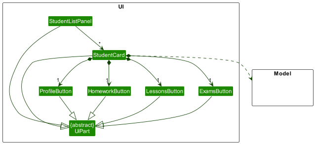
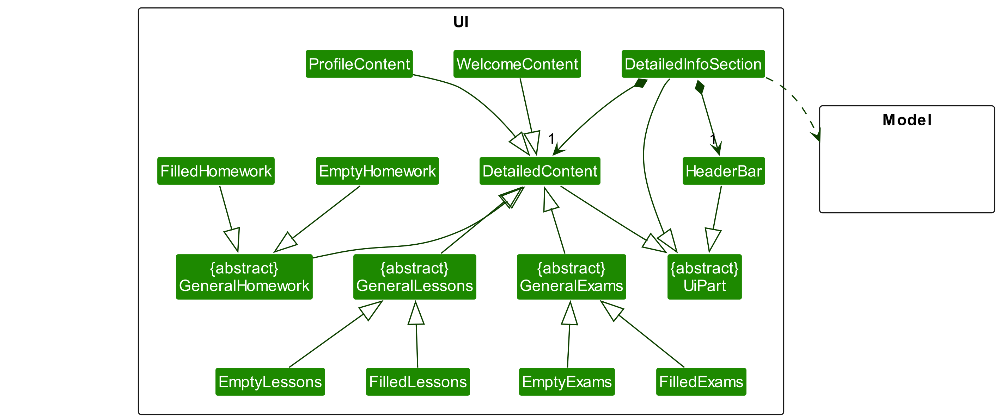
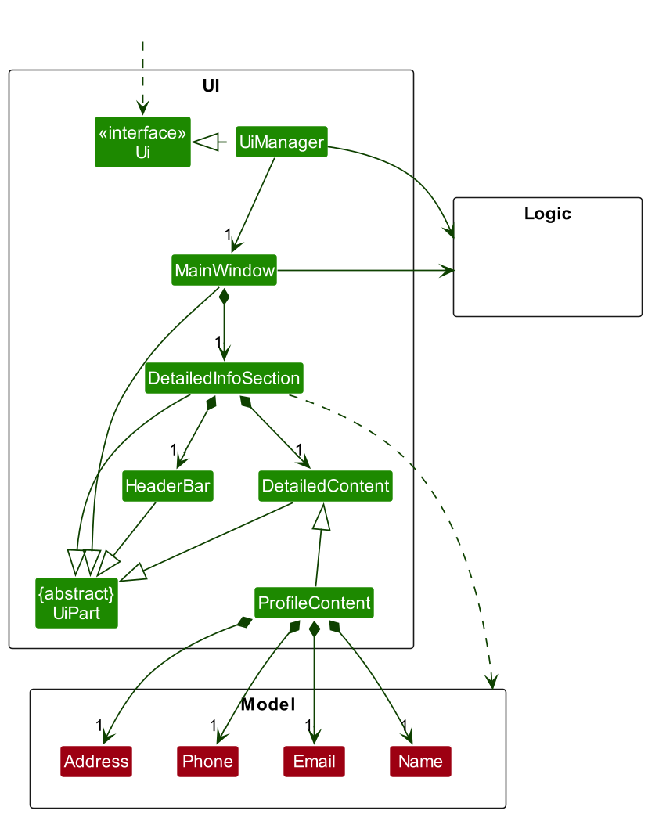
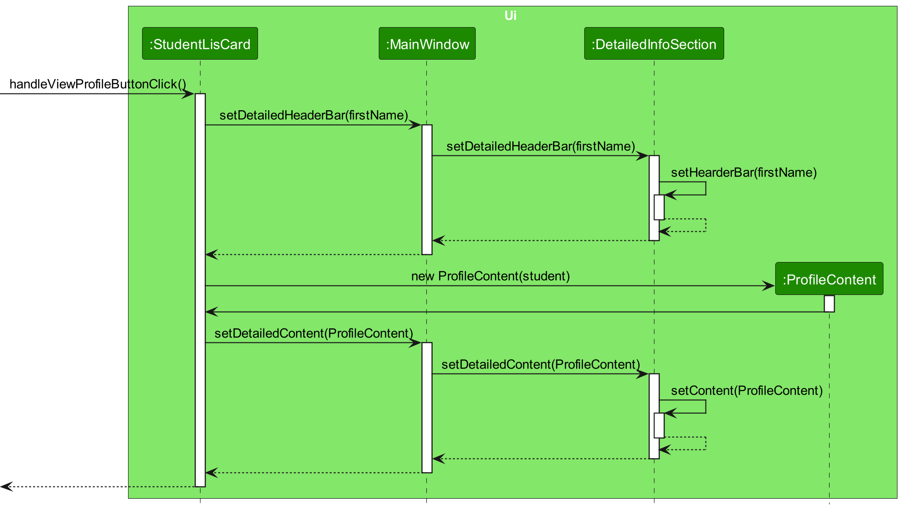
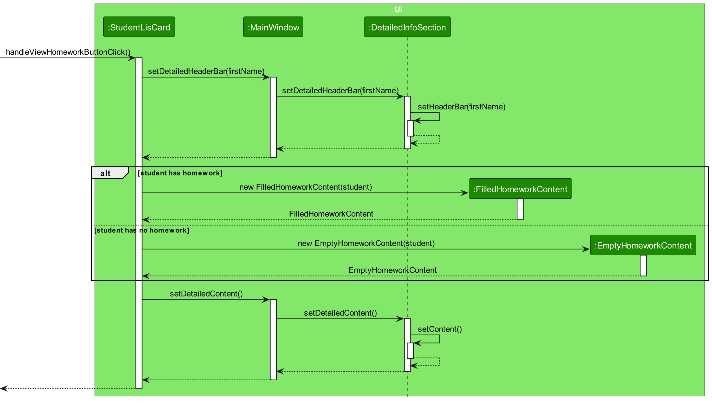
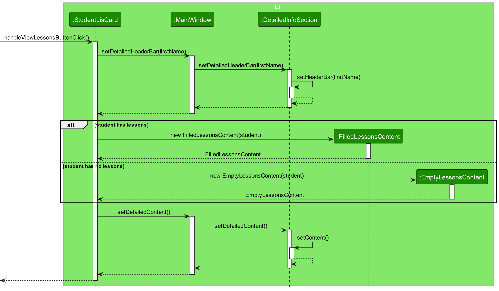
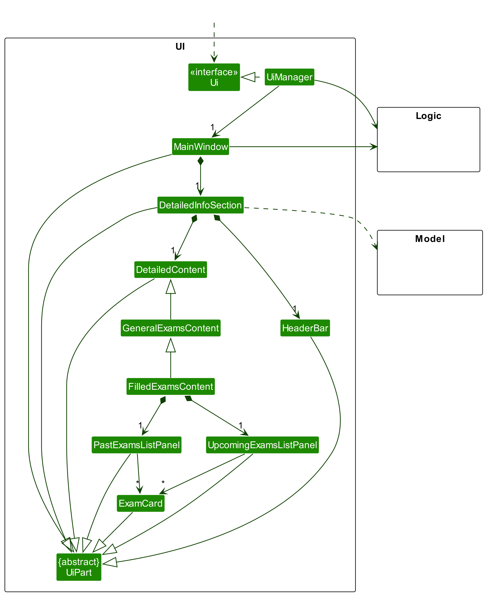
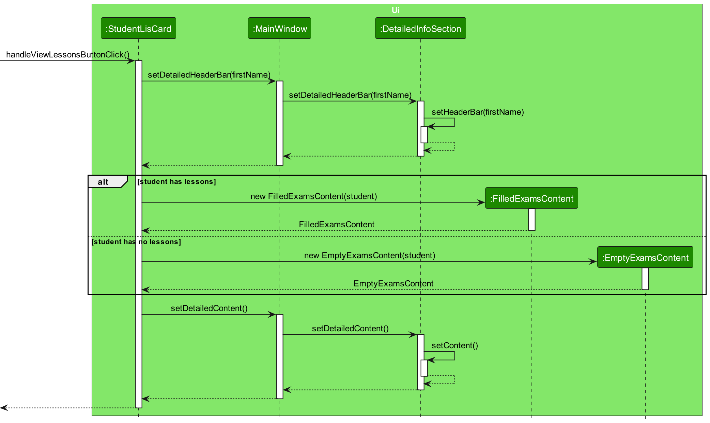
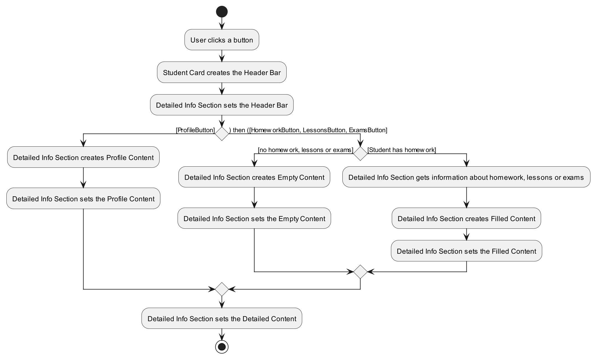
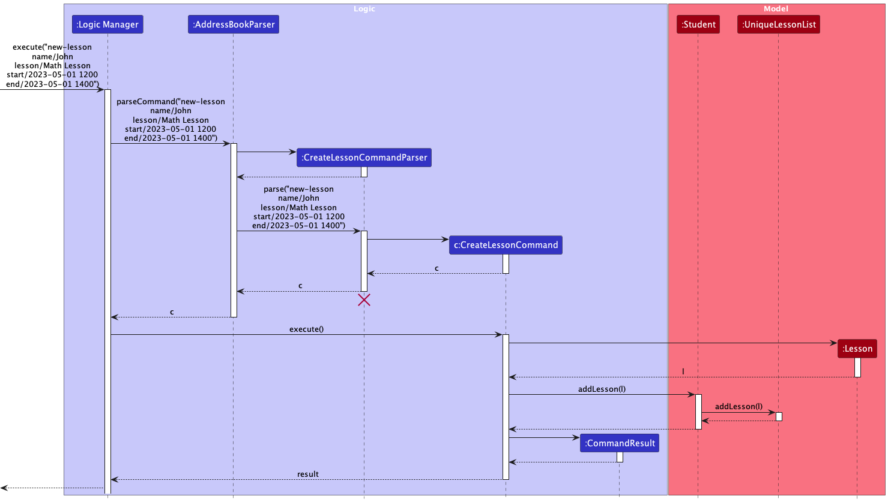

TutorPro is a **desktop app designed to help private tutors manage their student information effectively**. With TutorPro, tutors can easily keep track of their students' addresses, contact details, lessons, homework, and progress, all in one place. This app is optimized for use via a Graphical User Interface (GUI), allowing tutors to interact with the app using easy-to-understand buttons and menus. However, TutorPro also provides a Command Line Interface (CLI) for those who prefer a faster way of getting things done. Whether you're managing a handful of students or hundreds, TutorPro can help you streamline your workflow and make your tutoring experience more efficient.

--------------------------------------------------------------------------------------------------------------------

## Table of Contents

- [Table of Contents](#table-of-contents)
- [**Acknowledgements**](#acknowledgements)
- [**Setting up, getting started**](#setting-up-getting-started)
- [**Design**](#design)
  * [Architecture](#architecture)
  * [UI component](#ui-component)
  * [Logic component](#logic-component)
  * [Model component](#model-component)
  * [Storage component](#storage-component)
  * [Common classes](#common-classes)
- [**Implementation**](#implementation)
  * [Quick Access Buttons on Each Student Card](#quick-access-buttons-on-each-student-card)
    + [Motivation for Quick Access Buttons](#motivation-for-quick-access-buttons)
    + [Implementation of Quick Access Buttons](#implementation-of-quick-access-buttons)
    + [Alternatives considered for Quick Access Buttons](#alternatives-considered-for-quick-access-buttons)
  * [Create Lesson feature](#create-lesson-feature)
  * [School and GradeLevel Fields](#school-and-gradelevel-fields)
    + [v1.2 Implementation of School and GradeLevel Fields](#v12-implementation-of-school-and-gradelevel-fields)
    + [New Implementation of School and GradeLevel Fields in v1.3](#new-implementation-of-school-and-gradelevel-fields-in-v13)
  * [\[Proposed\] Undo/redo feature](#proposed-undoredo-feature)
    + [Proposed Implementation](#proposed-implementation)
    + [Design considerations:](#design-considerations)
  * [\[Proposed\] Data archiving](#proposed-data-archiving)
- [**Documentation, logging, testing, configuration, dev-ops**](#documentation-logging-testing-configuration-dev-ops)
- [**Appendix: Requirements**](#appendix-requirements)
  * [Product scope](#product-scope)
  * [User stories](#user-stories)
- [Use cases](#use-cases)
  * [Add a new student](#add-a-new-student)
  * [Delete a student](#delete-a-student)
  * [Update a student's particulars](#update-a-students-particulars)
  * [View a student's profile](#view-a-students-profile)
  * [Assign homework for a student](#assign-homework-for-a-student)
  * [View a Student's Homework](#view-a-students-homework)
  * [Mark a Homework as DONE](#mark-a-homework-as-done)
  * [Mark a Homework as NOT DONE](#mark-a-homework-as-not-done)
  * [View a particular Student's Lessons](#view-a-particular-students-lessons)
  * [View all Students' Lesson history](#view-all-students-lesson-history)
  * [Add Lesson](#add-lesson)
  * [Add Exam](#add-exam)
  * [View a particular Student's Exams](#view-a-particular-students-exams)
  * [View all Students' Exams](#view-all-students-exams)
- [Non-Functional Requirements](#non-functional-requirements)
- [Glossary](#glossary)
- [**Appendix: Instructions for manual testing**](#appendix-instructions-for-manual-testing)
  * [Launch and shutdown](#launch-and-shutdown)
  * [Deleting a student](#deleting-a-student)
  * [Saving data](#saving-data)

<small><i><a href='http://ecotrust-canada.github.io/markdown-toc/'>Table of contents generated with markdown-toc</a></i></small>

--------------------------------------------------------------------------------------------------------------------

## **Acknowledgements**

* {list here sources of all reused/adapted ideas, code, documentation, and third-party libraries -- include links to the original source as well}

--------------------------------------------------------------------------------------------------------------------

## **Setting up, getting started**

Refer to the guide [_Setting up and getting started_](SettingUp.md).

--------------------------------------------------------------------------------------------------------------------

## **Design**

:bulb: **Tip:** The `.puml` files used to create diagrams in this document can be found in the [diagrams'](https://github.com/AY2223S2-CS2103T-W13-4/tp/tree/master/docs/diagrams) folder. Refer to the [_PlantUML Tutorial_ at se-edu/guides](https://se-education.org/guides/tutorials/plantUml.html) to learn how to create and edit diagrams.

### Architecture

The ***Architecture Diagram*** given above explains the high-level design of the App.

Given below is a quick overview of the main components and how they interact with each other.

**Main components of the architecture**

**`Main`** has two classes called [`Main`](https://github.com/AY2223S2-CS2103T-W13-4/tp/blob/master/src/main/java/seedu/address/Main.java) and [`MainApp`](https://github.com/AY2223S2-CS2103T-W13-4/tp/blob/master/src/main/java/seedu/address/MainApp.java). It is responsible for,
* At app launch: Initializes the components in the correct sequence, and connects them up with each other.
* At shut down: Shuts down the components and invokes cleanup methods where necessary.

[**`Commons`**](#common-classes) represents a collection of classes used by multiple other components.

The rest of the App consists of four components.

* [**`UI`**](#ui-component): The UI of the App.
* [**`Logic`**](#logic-component): The command executor.
* [**`Model`**](#model-component): Holds the data of the App in memory.
* [**`Storage`**](#storage-component): Reads data from, and writes data to, the hard disk.

**How the architecture components interact with each other**

The *Sequence Diagram* below shows how the components interact with each other for the scenario where the user issues the command `delete 1`.

Each of the four main components (also shown in the diagram above),

* defines its *API* in an `interface` with the same name as the Component.
* implements its functionality using a concrete `{Component Name}Manager` class (which follows the corresponding API `interface` mentioned in the previous point.

For example, the `Logic` component defines its API in the `Logic.java` interface and implements its functionality using the `LogicManager.java` class which follows the `Logic` interface. Other components interact with a given component through its interface rather than the concrete class (reason: to prevent outside component's being coupled to the implementation of a component), as illustrated in the (partial) class diagram below.

The sections below give more details of each component.

### UI component

The **API** of this component is specified in [`Ui.java`](https://github.com/AY2223S2-CS2103T-W13-4/tp/blob/master/src/main/java/seedu/address/ui/Ui.java)

The UI consists of a `MainWindow` that is made up of parts e.g.`CommandBox`, `ResultDisplay`, `studentListPanel`, `StatusBarFooter` etc. All these, including the `MainWindow`, inherit from the abstract `UiPart` class which captures the commonalities between classes that represent parts of the visible GUI.

The `UI` component uses the JavaFx UI framework. The layout of these UI parts are defined in matching `.fxml` files that are in the `src/main/resources/view` folder. For example, the layout of the [`MainWindow`](https://github.com/AY2223S2-CS2103T-W13-4/tp/blob/master/src/main/java/seedu/address/ui/MainWindow.java) is specified in [`MainWindow.fxml`](https://github.com/AY2223S2-CS2103T-W13-4/tp/blob/master/src/main/resources/view/MainWindow.fxml)

The `UI` component,

* executes user commands using the `Logic` component.
* listens for changes to `Model` data so that the UI can be updated with the modified data.
* keeps a reference to the `Logic` component, because the `UI` relies on the `Logic` to execute commands.
* depends on some classes in the `Model` component, as it displays `student` object residing in the `Model`.

### Logic component

**API** : [`Logic.java`](https://github.com/AY2223S2-CS2103T-W13-4/tp/blob/master/src/main/java/seedu/address/logic/Logic.java)

Here's a (partial) class diagram of the `Logic` component:

How the `Logic` component works:
1. When `Logic` is called upon to execute a command, it uses the `AddressBookParser` class to parse the user command.
2. This results in a `Command` object (more precisely, an object of one of its subclasses e.g., `AddCommand`) which is executed by the `LogicManager`.
3. The command can communicate with the `Model` when it is executed (e.g. to add a student).
4. The result of the command execution is encapsulated as a `CommandResult` object which is returned from `Logic`.

The Sequence Diagram below illustrates the interactions within the `Logic` component for the `execute("delete 1")` API call.

:information_source: **Note:** The lifeline for `DeleteCommandParser` should end at the destroy marker (X) but due to a limitation of PlantUML, the lifeline reaches the end of diagram.
the 

Here are the other classes in `Logic` (omitted from the class diagram above) that are used for parsing a user command:

How the parsing works:
* When called upon to parse a user command, the `AddressBookParser` class creates an `XYZCommandParser` (`XYZ` is a placeholder for the specific command name e.g., `AddCommandParser`) which uses the other classes shown above to parse the user command and create a `XYZCommand` object (e.g., `AddCommand`) which the `AddressBookParser` returns back as a `Command` object.
* All `XYZCommandParser` classes (e.g., `AddCommandParser`, `DeleteCommandParser`, ...) inherit from the `Parser` interface so that they can be treated similarly where possible e.g, during testing.

### Model component
**API** : [`Model.java`](https://github.com/AY2223S2-CS2103T-W13-4/tp/blob/master/src/main/java/seedu/address/model/Model.java)

The `Model` component,

* stores the address book data i.e., all `Student` objects (which are contained in a `UniqueStudentList` object).
* stores the currently 'selected' `Student` objects (e.g., results of a search query) as a separate _filtered_ list which is exposed to outsiders as an unmodifiable `ObservableList<Student>` that can be 'observed' e.g. the UI can be bound to this list so that the UI automatically updates when the data in the list change.
* stores a `UserPref` object that represents the user’s preferences. This is exposed to the outside as a `ReadOnlyUserPref` objects.
* doesn't depend on any of the other three components (as the `Model` represents data entities of the domain, they should make sense on their own without depending on other components)

### Storage component

**API** : [`Storage.java`](https://github.com/AY2223S2-CS2103T-W13-4/tp/blob/master/src/main/java/seedu/address/storage/Storage.java)

The `Storage` component,
* can save both address book data and user preference data in json format, and read them back into corresponding objects.
* inherits from both `AddressBookStorage` and `UserPrefStorage`, which means it can be treated as either one (if only the functionality of only one is needed).
* depends on some classes in the `Model` component (because the `Storage` component's job is to save/retrieve objects that belong to the `Model`)

### Common classes

Classes used by multiple components are in the `seedu.addressbook.commons` package.

--------------------------------------------------------------------------------------------------------------------

## **Implementation**

This section describes some noteworthy details on how certain features are implemented.

### Quick Access Buttons on Each Student Card

#### Motivation for Quick Access Buttons
When a `tutor` wants to view a `student's` profile, homework, lessons, or exams, they need to use the commandBox. However, the current ResultDisplay is purely text-based, making it difficult and time-consuming for `tutors` to access and digest the relevant information.

To address this issue, we propose the implementation of Quick Access Buttons on each `Student Card`. These buttons will provide tutors with easy and quick access to the relevant `student` information. By simply clicking on the appropriate button, tutors can view the `student's` profile, homework, lessons, or exams in a more informative and visually appealing way, complete with multiple diagrams or charts.

The inclusion of these Quick Access Buttons will not only improve the user experience for `tutors` but also save them valuable time that can be better spent on other aspects of their teaching. With the information at their fingertips, `tutors` will be better equipped to make informed decisions and provide personalized guidance to each student.

#### Implementation of Quick Access Buttons

Given below is the partial class diagram of `Ui` component related to Quick Access Buttons on the Student Card.

Each `Student Card` contains exactly four buttons `Profile`, `Homework`, `Lessons`, and `Exams`. Each of the buttons can generate a Special `DetailedContent`, which will be displayed in the `DetialedInfoSection` on the `MainWindow`

Given below is the partial class diagram of `Ui` component related to Detailed Information Section on the Student Card.

The `DetailedInfoSection` is made up of a `HeaderBar`, displaying the type of the current `DetailedInfoSection` and the name of the `Student` to which the information belongs. `DetailedContent`component has five subclasses extending it, namely `WelcomeContent`, `ProfileContent`,  `GeneralHomeworkContent`,  `GeneralLessonsContent`, `GeneralExamsContent`. 

Given below is the partial class diagram of `Ui` component related to Profile Content.

Given below is the sequence diagram showing how the action of clicking the `ProfileButton` of a `Student` creates a new `ProfileContent` for that particular student

**How the Profile Section is created when the Profile Button is Clicked**

1. Based on the graph above, after the user clicks the view profile button, `StudentCard` calls `Student#getFullName()`, which then calls `Name#getFirstName()`.
2. `StudentCard` then calls `DetailedInfoSection#SetDeatiledHeaderBar()`, which then calls `DetailedInfoSection#SetDeatiledHeaderBar()`, with the `FirstName` returned from the previous calls. 
3. `DetailedInfoSection` creates a new `HeaderBar` and sets it to be the new `DetailedHeaderBar` to be displayed.
4. `StudentCard` will create a new `ProfileContent` with the `Student`. 
5. The `ProfileContent` constructor calls `Student#getName()`, `Student#getPhone()`, `Student#getEmail()`, `Student#getAddress()` which returns the name, phone, email, and address of the student.
6. `StudentCard` then calls `DetailedInfoSection#SetDeatiledContent()`, which then calls `DetailedInfoSection#SetDeatiledContent()`, with the `ProfileContent` created from the previous calls. 
7. `DetailedInfoSection` sets it to be the new `DetailedContent` to be displayed.

`GeneralHomeworkContent`,  `GeneralLessonsContent`, `GeneralExamsContent` are further extended by subclasses:

* `EmptyHomeworkContent` and `FilledHomeworkContent` extend `GeneralHomeworkContent`, representing the situation where the `Student` has `Homework` and where the `Student` has no `Homework` respectively. 

  Specifically, `FilledHomeworkContent` has `HomeworkListPanel` with `HomeworkCard` on it, showing all homework of a `Student` and a `HomeworkPieChart`, reflecting the ratio of completed and pending `Homework` of  a `Student.`

   Given below is the partial class diagram of `Ui` component related to Filled Homework Content.

  

  Given below is the sequence diagram showing how the action of clicking the `HomeworkButton` of a `Student` creates a new `HomeworkContent` for that particular student

  

  **How the Filled Homework Section is created when the Homework Button is Clicked**

  1. Based on the graph above, after the user clicks the view homework button, `StudentCard` calls `Student#getFullName()`, which then calls `Name#getFirstName()`.
  2. `StudentCard` then calls `DetailedInfoSection#SetDeatiledHeaderBar()`, which then calls `DetailedInfoSection#SetDeatiledHeaderBar()`, with the `FirstName` returned from the previous calls. 
  3. `DetailedInfoSection` creates a new `HeaderBar` and sets it to be the new `DetailedHeaderBar` to be displayed.
  4. If `Student` does not have `Homework`, `StudentCard` will create a new `EmptyHomeorkContent` with the `Student`. 
  5. If `Student` have `Homework`, `StudentCard` will create a new `FilledHomeorkContent` with the `Student`. 
  6. The `FilledHomeworkContent` constructor calls `Student#getName()`, `Student#getHomeworkPiechartData()`, `Student#HomeworkList()`, which returns the name, Pie Chart Data, and Homework List.
  7. `StudentCard` then calls `DetailedInfoSection#SetDeatiledContent()`, which then calls `DetailedInfoSection#SetDeatiledContent()`, with the `EmptyHomeworkContent`  or `FilledHomeworkContent`created from the previous calls. 
  8. `DetailedInfoSection` sets it to be the new `DetailedContent` to be displayed.

* `EmptyLessonsContent` and `FilledLessonsContent` extend `GeneralLessonsContent`, representing the situation where the `Student` has `Lessons` and where the `Student` has no `Lessons` respectively. 

  Specifically, `FilledLessonsContent` has `PastLessonsListPanel` with `LessonCard` on it, showing all past `Lessons` of a `Student` and `UpcomingLessonsListPanel` with `LessonCard` on it, showing all upcoming `Lessons` of a `Student`.

   Given below is the partial class diagram of `Ui` component related to Filled Lessons Content.

  

  Given below is the sequence diagram showing how the action of clicking the `LessonsButton` of a `Student` creates a new `LessonsContent` for that particular student

  

  **How the Filled Lessons Section is created when the Lesson Button is Clicked**

  1. Based on the graph above, after the user clicks the view lessons button, `StudentCard` calls `Student#getFullName()`, which then calls `Name#getFirstName()`.
  2. `StudentCard` then calls `DetailedInfoSection#SetDeatiledHeaderBar()`, which then calls `DetailedInfoSection#SetDeatiledHeaderBar()`, with the `FirstName` returned from the previous calls. 
  3. `DetailedInfoSection` creates a new `HeaderBar` and sets it to be the new `DetailedHeaderBar` to be displayed.
  4. If `Student` does not have `Lessons`, `StudentCard` will create a new `EmptyLessonsContent` with the `Student`. 
  5. If `Student` have `Lessons`, `StudentCard` will create a new `FilledLessonsContent` with the `Student`. 
  6. The `FilledLessonsContent` constructor calls `Student#getName()`, `Student#getPastLessonsList()`, `Student#UpcomingLessonsList()`, which returns the name, Past Lessons List, and Upcoming Lessons List.
  7. `StudentCard` then calls `DetailedInfoSection#SetDeatiledContent()`, which then calls `DetailedInfoSection#SetDeatiledContent()`, with the `EmptyLessonsContent`  or `FilledLessonsContent`created from the previous calls. 
  8. `DetailedInfoSection` sets it to be the new `DetailedContent` to be displayed.

* `EmptyExamsContent` and `FilledExamsContent` extend `GeneralExamsContent`, representing the situation where the `Student` has `Exams` and where the `Student` has no `Exams` respectively. 

  Specifically, `FilledExamsContent` has `AllExamsListPanel` with `ExamCard` on it, showing all past `Exams` of a `Student` and `UpcomingLessonsListPanel` with `ExamCard` on it, showing the most recent three upcoming `Exams` of a `Student`

  Given below is the partial class diagram of `Ui` component related to Filled Exams Content

  

  Given below is the sequence diagram showing how the action of clicking the `ExamsButton` of a `Student` creates a new `ExamsContent` for that particular student

  

  **How the Filled Exams Section is created when the Exam Button is Clicked**

  1. Based on the graph above, after the user clicks the view exams button, `StudentCard` calls `Student#getFullName()`, which then calls `Name#getFirstName()`.
  2. `StudentCard` then calls `DetailedInfoSection#SetDeatiledHeaderBar()`, which then calls `DetailedInfoSection#SetDeatiledHeaderBar()`, with the `FirstName` returned from the previous calls. 
  3. `DetailedInfoSection` creates a new `HeaderBar` and sets it to be the new `DetailedHeaderBar` to be displayed.
  4. If `Student` does not have `Exams`, `StudentCard` will create a new `EmptyExamsContent` with the `Student`. 
  5. If `Student` have `Exams`, `StudentCard` will create a new `FilledExamsContent` with the `Student`. 
  6. The `FilledExamssContent` constructor calls `Student#getName()`, `Student#ExamsList()`, `Student#UpcomingExamsList()`, which returns the name, All Exam List, Upcoming Exams List.
  7. `StudentCard` then calls `DetailedInfoSection#SetDeatiledContent()`, which then calls `DetailedInfoSection#SetDeatiledContent()`, with the `EmptyExamsContent`  or `FilledExamsContent`created from the previous calls. 
  8. `DetailedInfoSection` sets it to be the new `DetailedContent` to be displayed.

The following activity diagram summarises how the UI responds to a click button command.

####  Alternatives considered for Quick Access Buttons

While designing the Quick Access Buttons on the Student Card, several alternatives were considered to ensure an optimal user experience.

* **Alternative 1 :** One alternative that was considered was to have a pop-up window for each button click event. However, this alternative was ultimately rejected due to its potential drawbacks.
  * Pros: 
    * Provides a clear and separate window to display the detailed information for each button.
    * It Can be designed to provide a consistent layout and structure for displaying the detailed information.
    * It Can be a good choice if there is a need to provide a lot of detailed information for each button click.
    * It Can be helpful in providing a larger viewing area for the detailed information.
  * Cons: 
    * It Requires additional user interaction to close the pop-up window, which can be cumbersome and time-consuming.
    * It Can be less optimized for a command-line interface (CLI), where users prefer quick and direct access to information.
    * It Can lead to a cluttered user interface if multiple pop-up windows are open at the same time.
    * It Can require additional resources and time to design and implement compared to other alternatives.

### Create Lesson feature
the `new-lesson` command adds a Lesson (specified with student name, lesson name, start time, and end time) to a particular Student. Given below is an example usage scenario and how the command works:

Step1. The user inputs a `new-lesson` command with parameters name/John, lesson/Math lesson, start/2023-05-01 1200, and end/2023-05-01 1400. When Logic is called upon to execute a command, it uses the AddressBookParser class to parse the user command. The parser recognises the command words and calls the CreateLessonCommandParser.

Step2. The `CreateLessonCommandParser` recognises each parameter passed in.

Step3. `CreateLessonCommandParser` creates a new `CreateLessonCommand` with appropriate parameters.

Step4. `CreateLessonCommand` is executed by LogicManager, creating a new Lesson object and then calls the `addLesson` method in Student

Step5. The Student calls the `addLesson` method in the UniqueLessonList, adding the Lesson to his list of Lessons.

Step6. The result of the command execution is encapsulated as a `CommandResult` object which is returned from `Logic`.

The Sequence Diagram below illustrates the interactions within the Logic component for to execute("new-lesson name/John lesson/Math lesson start/2023-05-01 1200 end/2023-05-01 1400") API call.

The following activity diagram summarizes what happens when a user executes a CreateLessonCommand:

### School and GradeLevel Fields

#### v1.2 Implementation of School and GradeLevel Fields

As of v1.2, School and GradeLevel fields are parsed via the `AddCommandParser` class. `AddCommandParser#parse` method 
checks whether the prefixes for school and/or gradeLevel are present, and if present, then adds it to 
the new student as `Tags`. They are then treated throughout the program the same as other `Tags`.

It has been implemented this way for its ease of implementation, and because it shows the School and GradeLevel 
in the Students list view, without having to open up the student's profile.

#### New Implementation of School and GradeLevel Fields in v1.3

In v1.3, we're adding School and GradeLevel as separate fields in the Student's profile, instead of `Tags`. These will 
show up in the Student Profile view.

This is to reduce the number of Tags placed under each Student's name in the Students list view, making it look less 
cluttered.

### \[Proposed\] Undo/redo feature

#### Proposed Implementation

The proposed undo/redo mechanism is facilitated by `VersionedAddressBook`. It extends `AddressBook` with an undo/redo history, stored internally as an `addressBookStateList` and `currentStatePointer`. Additionally, it implements the following operations:

* `VersionedAddressBook#commit()` — Saves the current address book state in its history.
* `VersionedAddressBook#undo()` — Restores the previous address book state from its history.
* `VersionedAddressBook#redo()` — Restores a previously undone address book state from its history.

These operations are exposed in the `Model` interface as `Model#commitAddressBook()`, `Model#undoAddressBook()` and `Model#redoAddressBook()` respectively.

Given below is an example usage scenario and how the undo/redo mechanism behaves at each step.

Step 1. The user launches the application for the first time. The `VersionedAddressBook` will be initialized with the initial address book state, and the `currentStatePointer` pointing to that single address book state.

Step 2. The user executes `delete 5` command to delete the 5th student in the address book. The `delete` command calls `Model#commitAddressBook()`, causing the modified state of the address book after the `delete 5` command executes to be saved in the `addressBookStateList`, and the `currentStatePointer` is shifted to the newly inserted address book state.

Step 3. The user executes `add n/David …​` to add a new student. The `add` command also calls `Model#commitAddressBook()`, causing another modified address book state to be saved into the `addressBookStateList`.

:information_source: **Note:** If a command fails its execution, it will not call `Model#commitAddressBook()`, so the address book state will not be saved into the `addressBookStateList`.

Step 4. The user now decides that adding the student was a mistake, and decides to undo that action by executing the `undo` command. The `undo` command will call `Model#undoAddressBook()`, which will shift the `currentStatePointer` once to the left, pointing it to the previous address book state, and restores the address book to that state.

:information_source: **Note:** If the `currentStatePointer` is at index 0, pointing to the initial AddressBook state, then there are no previous AddressBook states to restore. The `undo` command uses `Model#canUndoAddressBook()` to check if this is the case. If so, it will return an error to the user rather
than attempting to perform the undo.

The following sequence diagram shows how the undo operation works:

:information_source: **Note:** The lifeline for `UndoCommand` should end at the destroy marker (X) but due to a limitation of PlantUML, the lifeline reaches the end of diagram.

The `redo` command does the opposite — it calls `Model#redoAddressBook()`, which shifts the `currentStatePointer` once to the right, pointing to the previously undone state, and restores the address book to that state.

:information_source: **Note:** If the `currentStatePointer` is at index `addressBookStateList.size() - 1`, pointing to the latest address book state, then there are no undone AddressBook states to restore. The `redo` command uses `Model#canRedoAddressBook()` to check if this is the case. If so, it will return an error to the user rather than attempting to perform the redo.

Step 5. The user then decides to execute the command `list`. Commands that don't modify the address book, such as `list`, will usually not call `Model#commitAddressBook()`, `Model#undoAddressBook()` or `Model#redoAddressBook()`. Thus, the `addressBookStateList` remains unchanged.

Step 6. The user executes `clear`, which calls `Model#commitAddressBook()`. Since the `currentStatePointer` is not pointing at the end of the `addressBookStateList`, all address book states after the `currentStatePointer` will be purged. Reason: It no longer makes sense to redo the `add n/David …​` command. This is the behavior that most modern desktop applications follow.

The following activity diagram summarizes what happens when a user executes a new command:

#### Design considerations:

**Aspect: How undo & redo executes:**

* **Alternative 1 (current choice):** Saves the entire address book.
  * Pros: Easy to implement.
  * Cons: May have performance issues in terms of memory usage.

* **Alternative 2:** Individual command knows how to undo/redo by
  itself.
  * Pros: Will use less memory (e.g. for `delete`, just save the student being deleted).
  * Cons: We must ensure that the implementation of each command are correct.

_{more aspects and alternatives to be added}_

### \[Proposed\] Data archiving

_{Explain here how the data archiving feature will be implemented}_

--------------------------------------------------------------------------------------------------------------------

## **Documentation, logging, testing, configuration, dev-ops**

* [Documentation guide](Documentation.md)
* [Testing guide](Testing.md)
* [Logging guide](Logging.md)
* [Configuration guide](Configuration.md)
* [DevOps guide](DevOps.md)

--------------------------------------------------------------------------------------------------------------------

## **Appendix: Requirements**

### Product scope

**Target user profile**:

Our users:
* have a need to manage any number of students
* prefer offline desktop apps over other types
* can type commands fast
* prefer typing, with some mouse control
* prefer a more robust, aesthetic GUI, as opposed to a verbose list of students on a command line
* are reasonably comfortable using CLI

**Value proposition**: Manage students' academic progress faster and more conveniently than a typical mouse/GUI driven app

--------------------------------------------------------------------------------------------------------------------

### User stories

Priorities: 
- High (must have) - `* * *`
- Medium (nice to have) - `* *` 
- Low (unlikely to have) - `*`

| Category                                                          | Priority | As a …​ | I want to …​                                                                                          | So that I can…​                                                                                                                                                                                 |
|:------------------------------------------------------------------|----------|---------|-------------------------------------------------------------------------------------------------------|-------------------------------------------------------------------------------------------------------------------------------------------------------------------------------------------------|
| Track Student Homework                                            | `* * *`  | tutor   | Mark homework as completed/uncompleted/half-completed.                                                | I can track what needs to be done in order to give reminders to student.                                                                                                                        |
|                                                                   | `* * *`  | tutor   | Assign tutor homework deadlines.                                                                      | I can track what homework I have assigned to the student and when it needs to be done by to follow the lesson plan                                                                              |
|                                                                   | `* * *`  | tutor   | Assign school homework deadlines                                                                      | I can track what homework the school has assigned my students, to help them finish and when.                                                                                                    |
|                                                                   | `* * *`  | tutor   | View completed and uncompleted homework                                                               | I can separately track pending homework.                                                                                                                                                        |
| Store and access students’ info (addresses, personal particulars) | `* *`    | tutor   | Click open a “view profile” button beside a Student to look at his/her home address and phone number. | I can have easy access to the students’ information.                                                                                                                                            |
|                                                                   | `* *`    | tutor   | Update my students' personal information as needed                                                    | I can keep my records accurate and up-to-date                                                                                                                                                   |
|                                                                   | `* * *`  | tutor   | Click a button with a student’s name to view his/her upcoming school exams/assignments                | Change my lesson plans accordingly to prepare the student for such tasks. For example, change all sessions of a week to Chemistry lessons to prepare the student for an upcoming Chemistry exam |
| Lesson Plan Management                                            | `* * *`  | tutor   | Create lesson plans for future classes                                                                | I can always plan ahead of my lessons                                                                                                                                                           |
|                                                                   | `* *`    | tutor   | View my students’ lesson history                                                                      | I can recap past lessons with my student.                                                                                                                                                       |
|                                                                   | `* *`    | tutor   | View the date and time of a past lesson                                                               | I can see how many lessons I’ve had over a period of time                                                                                                                                       |
| Track Student Exams                                               | `* *`    | tutor   | Assign and view school exam dates to my students                                                      | I can keep track of how long my student has to prepare for an exam.                                                                                                                             |
|                                                                   | `* *`    | tutor   | View all my students' exams at a glance                                                               | I can provide extra instruction to students that have exams coming up.                                                                                                                          |

*{As at v1.2, more to be added}*

--------------------------------------------------------------------------------------------------------------------

## Use cases

### Add a new student

**MSS**

1.  User enters new-student command with NAME, ADDRESS, PHONE, EMAIL and (optionally) School, Grade Level.
2.  TutorPro adds the new student to the student list.
    
    Use case ends.

**Extensions**

* 2a. A student with the same name already exists.
    * 2a1. TutorPro notifies the user of a duplicate.
    * 2a2. TutorPro continues to take input.
      
    
    Use case continues at step 1.
    
* 2b. The wrong formatting was used.
    * 2b1. TutorPro notifies the user of wrong formatting.
    * 2b2. TutorPro continues to take input.
      
    
    Use case continues at step 1.

### Delete a student

**MSS**

1.  User requests to list students
2.  TutorPro shows a list of students
3.  User requests to delete a specific student in the list
4.  TutorPro deletes the student
    
    Use case ends.

**Extensions**

* 2a. The list is empty.
  
    Use case ends.

* 3a. The given index is invalid.

    * 3a1. TutorPro shows an error message.
      
    
    Use case resumes at step 2.

### Update a student's particulars

**MSS**

1.  User enters new-student command with NAME, ADDRESS, PHONE, EMAIL and (optionally) School, Grade Level.
2.  TutorPro adds the new student to the student list.
    Use case ends.

**Extensions**

* 2a. The wrong formatting was used.
    * 2b1. TutorPro notifies the user of wrong formatting.
    * 2b2. TutorPro continues to take input.
      Use case continues at step 1.

### View a student's profile

**MSS**

1.  User requests to list students
2.  TutorPro shows a list of students
3.  User clicks on **Profile** button of a particular student
4.  TutorPro displays the profile of that student.

    Use case ends.

**Extensions**

* 1a. The list is empty.

  Use case ends.

### Assign homework for a student

**MSS**

1.  User requests to list students
2.  TutorPro shows a list of students
3.  User enters assign-homework command with student name and homework title.
4.  TutorPro assigns the homework to that particular student.

    Use case ends.

**Extensions**

* 2a. The list is empty.

  Use case ends.

* 3a. The given name doesn't exist in the list.
* 3b. The user used invalid command format.

    * 3*1. TutorPro shows an error message.

  Use case resumes at step 3.

### View a Student's Homework

**MSS**

1.  User enters view-homework command with a student's name.
2.  TutorPro shows all the completed/incomplete homework of that student.

    Use case ends.

**Extensions**

* 1a. Alternatively, the user clicks on the **Homework** button next to the student name.

  Use case resumes at 2.

### Mark a Homework as DONE

**MSS**

1. User clicks on **Homeworks** button of a student.
2. TutorPro shows that student's homeworks.
3. User enters mark-homework with student name, and homework index.
4. TutorPro updates the status of that homework as DONE.

    Use case ends.

**Extensions**

* 2a. The student's homework list is empty.

    Use case ends.

* 3a. The given index is invalid.

    * 3a1. TutorPro shows an error message.

    Use case resumes at step 3.

### Mark a Homework as NOT DONE

**MSS**

1. User clicks on **Homeworks** button of a student.
2. TutorPro shows that student's homeworks.
3. User enters unmark-homework command with student name, and homework index.
4. TutorPro updates the status of that homework as NOT DONE.

   Use case ends.

**Extensions**

* 2a. The student's homework list is empty.

  Use case ends.

* 3a. The given index is invalid.

    * 3a1. TutorPro shows an error message.

  Use case resumes at step 3.

### View a particular Student's Lessons 

**MSS**

1. User clicks on **Lessons** button of a student.
2. TutorPro shows that student's past and upcoming Lessons.

   Use case ends.

**Extensions**

* 2a. The student's lesson list is empty.

  Use case ends.

### View all Students' Lesson history

**MSS**

1. User enters view-lesson command without any arguments.
2. TutorPro shows all students' past and upcoming Lessons.

   Use case ends.

**Extensions**

* 2a. None of the students have any lessons.
  * 2a1. TutorPro shows an empty Lesson list.

    Use case ends.

### Add Lesson

**MSS**

1. User enters new-lesson command with student name, lesson title and start and end times.
2. TutorPro adds the lesson to that student's Lesson list.

   Use case ends.

**Extensions**

* 1a. The named student doesn't exist
  * 1a1. TutorPro returns an error message.
  
    Use case resumes at 1.
  
* 1b. The start/end time is in the past.
  * 1b1. TutorPro returns an error message.

    Use case resumes at 1.

* 1c. The start/end time format is invalid.
    * 1c1. TutorPro returns an error message showing the accepted time formats.

      Use case resumes at 1.

### Add Exam

**MSS**

1. User enters new-exam command with student name, exam title and start and end times.
2. TutorPro adds the exam to that student's exam list.

   Use case ends.

**Extensions**

* 1a. The named student doesn't exist
    * 1a1. TutorPro returns an error message.

      Use case resumes at 1.

* 1b. The start/end time is in the past.
    * 1b1. TutorPro returns an error message.

      Use case resumes at 1.

* 1c. The start/end time format is invalid.
    * 1c1. TutorPro returns an error message showing the accepted time formats.

      Use case resumes at 1.

### View a particular Student's Exams

**MSS**

1. User clicks on **Exams** button of a student.
2. TutorPro shows that student's past and upcoming Exams.

   Use case ends.

**Extensions**

* 2a. The student's exam list is empty.

  Use case ends.

*{More to be added}*

### View all Students' Exams

**MSS**

1. User enters view-exam command without any arguments.
2. TutorPro shows all students' past and upcoming exams.

   Use case ends.

**Extensions**

* 2a. None of the students have any lessons.
    * 2a1. TutorPro shows an empty Lesson list.

      Use case ends.

--------------------------------------------------------------------------------------------------------------------

## Non-Functional Requirements

1.  Should work on any _mainstream OS_ as long as it has Java `11` or above installed.
2.  Should be able to hold up to 1000 students without a noticeable sluggishness in performance for typical usage.
3.  A user with above average typing speed for regular English text (i.e. not code, not system admin commands) should be able to accomplish most of the tasks faster using commands than using the mouse.
4.  Commands should be easy to remember(close to English words) and not cryptic for non-tech users to remember.
5.  Commands shouldn't be verbose.
6.  Results should be easy to read for non-tech users (e.g. shouldn't look like long, cluttered log files).

--------------------------------------------------------------------------------------------------------------------

## Glossary
* **Student**: A student who is taking lessons from the Tutor.
* **Tutor**: A student who is teaching the Student. Here, the Tutor is also the user of the application.
* **Lesson**: A meeting between the Tutor and the Student.
* **Exam**: A test taken by the Student.
* **Homework**: A task given to the Student by the Tutor.
* **TutorPro**: The name of the application.
* **Mainstream OS**: Windows, Linux, Unix, OS-X

--------------------------------------------------------------------------------------------------------------------

## **Appendix: Instructions for manual testing**

Given below are instructions to test the app manually.

:information_source: **Note:** These instructions only provide a starting point for testers to work on;
testers are expected to do more *exploratory* testing.

### Launch and shutdown

1. Initial launch

   1. Download the jar file and copy into an empty folder

   2. Double-click the jar file Expected: Shows the GUI with a set of sample contacts. The window size may not be optimum.

2. Saving window preferences

   1. Resize the window to an optimum size. Move the window to a different location. Close the window.

   2. Re-launch the app by double-clicking the jar file. 
       Expected: The most recent window size and location is retained.

3. _{ more test cases …​ }_

### Deleting a student

1. Deleting a student while all students are being shown

   1. Prerequisites: List all students using the `list` command. Multiple students in the list.

   2. Test case: `delete 1` 
      Expected: First contact is deleted from the list. Details of the deleted contact shown in the status message. Timestamp in the status bar is updated.

   3. Test case: `delete 0` 
      Expected: No student is deleted. Error details shown in the status message. Status bar remains the same.

   4. Other incorrect delete commands to try: `delete`, `delete x`, `...` (where x is larger than the list size) 
      Expected: Similar to previous.

2. _{ more test cases …​ }_

### Saving data

1. Dealing with missing/corrupted data files

   1. _{explain how to simulate a missing/corrupted file, and the expected behavior}_

2. _{ more test cases …​ }_
