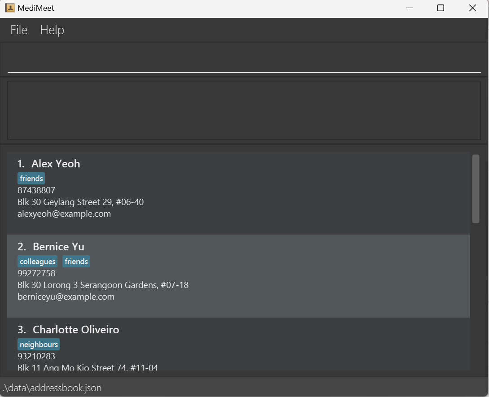

## **Overview**
**MediMeet** is a desktop application for doctors to manage their patients’ details and appointment dates. MediMeet enables doctors to effectively manage patient details and appointments, and saves costs by reducing the need for personal assistants or appointment managers.

## **Table of Contents**
* Table of Contents
{:toc}

--------------------------------------------------------------------------------------------------------------------

## **Acknowledgements**

* {list here sources of all reused/adapted ideas, code, documentation, and third-party libraries -- include links to the original source as well}
* MediMeet is a fork of [AddressBook](https://se-education.org/addressbook-level3/) by SE-EDU.

--------------------------------------------------------------------------------------------------------------------

## **Setting up, getting started**

Refer to the guide [_Setting up and getting started_](SettingUp.md).

--------------------------------------------------------------------------------------------------------------------

## **Design**

:bulb: **Tip:** The `.puml` files used to create diagrams in this document can be found in the [diagrams](https://github.com/AY2223S2-CS2103T-W12-4/tp/tree/master/docs/diagrams/) folder. Refer to the [_PlantUML Tutorial_ at se-edu/guides](https://se-education.org/guides/tutorials/plantUml.html) to learn how to create and edit diagrams.

### Architecture

The ***Architecture Diagram*** given above explains the high-level design of the App.

Given below is a quick overview of main components and how they interact with each other.

**Main components of the architecture**

**`Main`** has two classes called [`Main`](https://github.com/AY2223S2-CS2103T-W12-4/tp/tree/master/src/main/java/seedu/address/Main.java) and [`MainApp`](https://github.com/AY2223S2-CS2103T-W12-4/tp/tree/master/src/main/java/seedu/address/MainApp.java). It is responsible for,
* At app launch: Initializes the components in the correct sequence, and connects them up with each other.
* At shut down: Shuts down the components and invokes cleanup methods where necessary.

[**`Commons`**](#common-classes) represents a collection of classes used by multiple other components.

The rest of the App consists of four components.

* [**`UI`**](#ui-component): The UI of the App.
* [**`Logic`**](#logic-component): The command executor.
* [**`Model`**](#model-component): Holds the data of the App in memory.
* [**`Storage`**](#storage-component): Reads data from, and writes data to, the hard disk.

**How the architecture components interact with each other**

The *Sequence Diagram* below shows how the components interact with each other for the scenario where the user issues the command `delete 1`.

Each of the four main components (also shown in the diagram above),

* defines its *API* in an `interface` with the same name as the Component.
* implements its functionality using a concrete `{Component Name}Manager` class (which follows the corresponding API `interface` mentioned in the previous point.

For example, the `Logic` component defines its API in the `Logic.java` interface and implements its functionality using the `LogicManager.java` class which follows the `Logic` interface. Other components interact with a given component through its interface rather than the concrete class (reason: to prevent outside component's being coupled to the implementation of a component), as illustrated in the (partial) class diagram below.

The sections below give more details of each component.

### UI component

The **API** of this component is specified in [`Ui.java`](https://github.com/AY2223S2-CS2103T-W12-4/tp/tree/master/src/main/java/seedu/address/ui/Ui.java)

The UI consists of a `MainWindow` that is made up of parts e.g.`CommandBox`, `ResultDisplay`, `AppointmentListPanel`, `PatientListPanel`, `StatusBarFooter` etc. All these, including the `MainWindow`, inherit from the abstract `UiPart` class which captures the commonalities between classes that represent parts of the visible GUI.

The `UI` component uses the JavaFx UI framework. The layout of these UI parts are defined in matching `.fxml` files that are in the `src/main/resources/view` folder. For example, the layout of the [`MainWindow`](https://github.com/AY2223S2-CS2103T-W12-4/tp/tree/master/src/main/java/seedu/address/ui/MainWindow.java) is specified in [`MainWindow.fxml`](https://github.com/AY2223S2-CS2103T-W12-4/tp/tree/master/src/main/resources/view/MainWindow.fxml)

The `UI` component,

* executes user commands using the `Logic` component.
* listens for changes to `Model` data so that the UI can be updated with the modified data.
* keeps a reference to the `Logic` component, because the `UI` relies on the `Logic` to execute commands.
* depends on some classes in the `Model` component, as it displays `Patient` and `Appointment` objects
* residing in the `Model`.

### Logic component

**API** : [`Logic.java`](https://github.com/AY2223S2-CS2103T-W12-4/tp/tree/master/src/main/java/seedu/address/logic/Logic.java)

Here's a (partial) class diagram of the `Logic` component:

How the `Logic` component works:
1. When `Logic` is called upon to execute a command, it uses the `AddressBookParser` class to parse the user command.
2. This results in a `Command` object (more precisely, an object of one of its subclasses e.g., `AddCommand`) which is executed by the `LogicManager`.
3. The command can communicate with the `Model` when it is executed (e.g. to add a Patient).
4. The result of the command execution is encapsulated as a `CommandResult` object which is returned back from `Logic`.

The Sequence Diagram below illustrates the interactions within the `Logic` component for the `execute("delete 1")` API call.

:information_source: **Note:** The lifeline for `DeleteCommandParser` should end at the destroy marker (X) but due to a limitation of PlantUML, the lifeline reaches the end of diagram.

Here are the other classes in `Logic` (omitted from the class diagram above) that are used for parsing a user command:

How the parsing works:
* When called upon to parse a user command, the `AddressBookParser` class creates an `XYZCommandParser` (`XYZ` is a placeholder for the specific command name e.g., `AddCommandParser`) which uses the other classes shown above to parse the user command and create a `XYZCommand` object (e.g., `AddCommand`) which the `AddressBookParser` returns back as a `Command` object.
* All `XYZCommandParser` classes (e.g., `AddCommandParser`, `DeleteCommandParser`, ...) inherit from the `Parser` interface so that they can be treated similarly where possible e.g, during testing.

### Model component
**API** : [`Model.java`](https://github.com/AY2223S2-CS2103T-W12-4/tp/tree/master/src/main/java/seedu/address/model/Model.java)

The `Model` component,

* stores the address book data i.e., all `Patient` objects (which are contained in a `UniquePatientList` object), and all `Appointment` objects (which are contained in a `UniqueAppointmentList` object).
* stores the currently 'selected' `Patient` and `Appointment` objects (e.g., results of a search query) as a separate _filtered_ list which is exposed to outsiders as an unmodifiable `ObservableList<Patient>`/`ObservableList<Appointment>` that can be 'observed' e.g. the UI can be bound to this list so that the UI automatically updates when the data in the list change.
* stores a `UserPref` object that represents the user’s preferences. This is exposed to the outside as a `ReadOnlyUserPref` objects.
* does not depend on any of the other three components (as the `Model` represents data entities of the domain, they should make sense on their own without depending on other components)

:information_source: **Note:** An alternative (arguably, a more OOP) model is given below. It has a `Tag` list in the `AddressBook`, which `Patient` references. This allows `AddressBook` to only require one `Tag` object per unique tag, instead of each `Patient` needing their own `Tag` objects. 

### Storage component

**API** : [`Storage.java`](https://github.com/AY2223S2-CS2103T-W12-4/tp/tree/master/src/main/java/seedu/address/storage/Storage.java)

The `Storage` component,
* can save both address book data and user preference data in json format, and read them back into corresponding objects.
* inherits from `AddressBookStorage`, `AppointmentListStorage` and `UserPrefStorage`, which means it can be treated as either one (if only the functionality of only one is needed).
* depends on some classes in the `Model` component (because the `Storage` component's job is to save/retrieve objects that belong to the `Model`)

### Common classes

Classes used by multiple components are in the `seedu.addressbook.commons` package.

--------------------------------------------------------------------------------------------------------------------

## **Implementation**

This section describes some noteworthy details on how certain features are implemented.

### Edit patient (`edit_patient`) command

**Overview**

Edits a patient in the patient list. Patient names cannot be modified.

**Implementation**

The edit command edits a patient in the patient list by first finding the patient, creating a new `EditPatientDescriptor` based on the original patient, modifying that object with the given parameters, then replacing the patient in the model's patient list with a new patient constructed using the given `EditPatientDescriptor`.

**Design considerations**

One way to reduce the amount of overhead in each edit command is to store only the relevant changes for each edit command in `EditPatientDescriptor`. This would remove the need to make a copy of every field of the original patient which would save some time. However, this would require `EditCommand#execute()` to have to check for each field's presence, through something like an `Optional`. This would also involve making `Patient` mutable, which would make it difficult to ensure that the patient list stays valid after various commands.

### Edit appointment (`edit_appt`) command

**Overview**

Edits an appointment in the appointment list. Editing appointment may update calendar if there is a change in date/time.

**Implementation**

The edit appointment command edits an appointment in the appointment list by finding the appointment, creating a new `EditAppointmentDescriptor` based on the original appointment, modifying that object with the given parameters, then replacing the appointment in the model's appointment list with a new appointment constructed using the given `EditAppointmentDescriptor`.

**Design considerations**

Similar to `edit`, storing the relevant changes for each edit command instead of storing every field of the appointment would make the edit appointment command more efficient. However, making any model mutable is undesirable as immutability allows us to easily ensure certain properties about the internal list of patients and appointments.

### Find patient (`find_patient`) and find patient by details (`find_patient_details`) commands

**Overview**

Finds a patient from the patient list and updates the displayed patient list. `find` will only match keywords to patient names, while `find_details` will match keywords to all of a patient's fields, including address and tags.

**Implementation**

The find and find details commands offer two ways of finding a patient to view their info. `find` is less comprehensive, and only searches for by patient name, while `find_details` tries to find a match in a patient's details, including their phone, address, email and tags. Both utilise a `Predicate<Patient>` in order to filter `model`'s appointment list via `Model#updateFilteredPatientList(Predicate<Patient>)`. `find` uses a `NameContainsKeywordsPredicate`, while `find_details` uses a `DetailsContainKeywordsPredicate`.

Both predicates work in a similar fashion as they implement Java's base `Predicate` interface. `NameContainsKeywordsPredicate#test(Patient)` takes the patient's full name, turns it into a `List<String>`, and checks if any of the keywords match any word in the name. `DetailsContainKeywordsPredicate#test(Patient)` calls `Patient#getDetailsAsList()` and matches the keywords against that list of all the patient's details instead.

**Design considerations**

The two commands are very similar. Currently, they only differ in their predicate's type, and have the same `execute` method implementation. An alternative way of implementing `find_details` would be to change `FindCommand`'s constructor to accept a `Predicate<Patient>` instead, and `FindCommandParser` to create the correct type of `Predicate`.

We chose to use two different commands as we expect to expand upon the find commands differently in the future, such as allowing partial matches for `find` but not `find_details`. The details of a patient often include too many words for partial matching to be relevant. Thus, decoupling the commands from each other allows future extension of the commands to be easier.

### Find appointment (`find_appt`) command

**Overview**

Finds an appointment from the appointment list given a time or timeslot and updates the displayed appointment list. If only one time is provided, appointments that occur during that time will be found. If two times are provided, all appointments that occur anytime during that time period will be found.

A more detailed view of the way the predicate is created is shown below.

**Implementation**

The find appointment command utilises a `Predicate<Appointment>` in order to filter `model`'s appointment list via `Model#updateFilteredAppointmentList(Predicate<Appointment>)`. The type of `Predicate` is determined during parsing, where a single date time in the command will use a `TimeInTimeslotPredicate`, while two date times in the command will result in a `AppointmentDuringTimePredicate` being used instead.

`TimeInTimeslotPredicate#test(Appointment)` checks if the time in the command is during the timeslot of the given appointment.  `AppointmentDuringTimePredicate#test(Appointment)` checks if the given timeslot in the command overlaps with the timeslot of the given appointment.

**Design considerations**

We chose to use a single command instead of two different commands like `find` and `find_details` since the functionality of the two types of appointment finding commands is very similar, and unlikely to change in the future.

### Delete patient (`delete_patient`) command

**Overview**

Deletes a patient from the patient list. Also deletes any appointments for the patient from the appointment list. This will update calendar accordingly.

**Implementation**

The delete patient command allows the user to delete an existing patient from MediMeet. This is executed by filtering `model` list via `Model#getPatientList()` and obtaining a `lastShownList` list. The patient to be removed is identified by the index according to the filtered list. All appointments related to the patient will also be deleted. This is executed in the `ModelManager` by using a for loop to remove appointments with the target patient name.

### Delete appointment (`delete_appt`) command

**Overview**

Deletes an appointment from the appointment list. Calendar is updated accordingly.

**Implementation**

The delete appointment command allows the user to delete an existing appointment from MediMeet. This is executed by filtering `model` list via `Model#getAppointmentList()` and obtaining a `lastShownList` list. The appointment to be removed is identified by the index according to the filtered list.

**Design considerations**

We originally wanted to identify Appointments by their `AppointmentId` instead of their index as we expect to identify each appointment by their own unique IDs. However, we chose to use indexes in a similar fashion to patients so that users would not need to confuse themselves with two different types of commands.

### Help (`help`) command

**Overview*

Creates popup message to assist help.

**Implementation**

The help command creates a pop up window message redirecting the user to the user guide. This is executed by passing a boolean `showHelp = true` into `CommandResult`. In `MainWindow`, the boolean `CommandResult.isShowHelp()` is set to true and will execute the `handleHelp()` method. This method will check if the help window is already showing. If it is not, it will open the window for the user.

### View patient card (`view`) command

**Overview*

Creates popup message for user to fully view patient card of desired index.

**Implementation**

The view command creates a pop up window message displaying the patient card to the user. This is executed by passing a boolean `showHelp = true` as well as the `index` of the desired patient into `CommandResult`. In `MainWindow`, the boolean `CommandResult.isView()` is set to true and will execute the `handleView()` method. This method will check if the view window is already showing. If it is not, it will open the window for the user.

--------------------------------------------------------------------------------------------------------------------

## **Documentation, logging, testing, configuration, dev-ops**

* [Documentation guide](Documentation.md)
* [Testing guide](Testing.md)
* [Logging guide](Logging.md)
* [Configuration guide](Configuration.md)
* [DevOps guide](DevOps.md)

--------------------------------------------------------------------------------------------------------------------

## **Appendix: Requirements**

### Product scope

**Target user profile**:
* is a receptionist for a small clinic, or a doctor who is a General Practitioner (GP)
* has a need to manage a significant number of contacts
* prefer desktop apps over other types
* can type fast
* prefers typing to mouse interactions
* is reasonably comfortable using CLI apps

**Value proposition**: MediMeet enables doctors to effectively manage patient details and appointments, and saves costs by reducing the need for Patiental assistants or appointment managers.

### User stories

    Priorities: High (must have) - `* * *`, Medium (nice to have) - `* *`, Low (unlikely to have) - `*`

| Priority | As a …​ | I want to …​                                                      | So that I can…​                                                       |
|----------|---------|-------------------------------------------------------------------|-----------------------------------------------------------------------|
| `* * *`  | doctor  | view details about my patients                                    | I can see everything I need to know about them at a glance            |
| `* * *`  | doctor  | add a new patient to the addressbook                              | I can have new patients                                               |
| `* * *`  | doctor  | edit patients' details                                            | I can update patient details                                          |
| `* * *`  | doctor  | find a particular patient's details                               | I can easily locate patients                                          |
| `* * *`  | doctor  | keep records of a patient                                         | I can check their medical history                                     |
| `* * *`  | doctor  | quickly add notes about a patient                                 | I can keep an accurate and up-to-date record of their medical history |
| `* * *`  | doctor  | add patient appointments                                          | I can schedule and keep track of all my patient visits                |
| `* * *`  | doctor  | view upcoming appointment                                         | I can see when my next appointment will be                            |
| `* * *`  | doctor  | view the number of patients I have to see in a day                | I can gauge my workload                                               |
| `* * *`  | doctor  | navigate the ui using keyboard commands                           | I work faster and more efficiently                                    |
| `* * *`  | doctor  | mark appointments as done                                         | I can remove it from my calendar                                      |
| `* * *`  | doctor  | access help guide                                                 | I can be assisted when I have trouble using MediMeet                  |
| `* * *`  | doctor  | delete appointments                                               | I can remove patients who cancelled appointments                      |
| `* * *`  | doctor  | save data to memory                                               | I can store the data after closing the application                    |
| `* * *`  | doctor  | retrieve data from memory                                         | I can have my saved data after restarting the application             |
| `* * *`  | doctor  | delete a patient from the address book                            | I can remove data for former patients                                 |
| `* *`    | doctor  | automate appointment assignment                                   | I don't have to manually add appointments                             |
| `* *`    | doctor  | access different templates for emailing different users           | I can quickly send standard emails to various users                   |
| `* *`    | doctor  | send mass emails                                                  | I don't have to send them indivually if I can't make it that day      |
| `* *`    | doctor  | set my availability                                               | I can block off time for tasks or meetings                            |
| `* *`    | doctor  | view my appointments and patient information on any device        | I can access these details from anywhere                              |
| `* *`    | doctor  | add sample data                                                   | I can test out MediMeet                                               |
| `* *`    | doctor  | purge all data                                                    | I can remove sample or confidential data                              |
| `* *`    | doctor  | filter my appointments by date, patient name, or appointment type | I can find the data I need quickly                                    |
| `* *`    | doctor  | add billing info                                                  | I can manage patient financials centrally                             |
| `* *`    | doctor  | add appointments to calendar                                      | I can view my schedule at a glance                                    |
| `*`      | doctor  | share patient details with other doctors                          | other doctors can access the necessary details                        |
| `*`      | doctor  | login to the system                                               | I can prevent malicious actors from accessing my data                 |
| `*`      | doctor  | reset my password                                                 | I still have access to my account if I forget my password             |
| `*`      | doctor  | delete my account                                                 | I can remove all my data when it is no longer needed                  |
| `*`      | doctor  | can change my password if needed                                  | I can ensure the security of my account                               |

### Use cases

(For all use cases below, the **System** is the `MediMeet` and the **Actor** is the `user`, unless specified otherwise)

**Use case: Delete a Patient**

**MSS**

1.  User requests to list Patients
2.  AddressBook shows a list of Patients
3.  User requests to delete a specific Patient in the list
4.  AddressBook deletes the Patient

    Use case ends.

**Extensions**

* 2a. The list is empty.

  Use case ends.

* 3a. The given index is invalid.

    * 3a1. AddressBook shows an error message.

      Use case resumes at step 2.

**Use case: Set availability**

**MSS:**

1. User requests to set availability.
2. MediMeet asks for date/time of availability.
3. User enters date/time of availability.
4. MediMeet sets the date/time of availability for the user.
   Use case ends.

**Extensions:**

* 3a. The given index is invalid.

    * 3a1. MediMeet requests for a valid time/time input.
    * 3a2. User provides a valid date/time input.

Steps 3a1-3a2 are repeated until a valid input is provided.
Use case resumes at step 4.

**Use case: View patient appointments and details**

**MSS:**

1. User requests to view patient appointments and details.
2. MediMeet shows the list of patients that match the request.
3. User selects the desired patient.
4. MediMeet displays the patient appointments and details.
   Use case ends.

**Extensions:**

* 1a. MediMeet cannot find any patients that match the search request.

    * 1a1. MediMeet requests for a valid search request.
    * 1a2. User provides a valid search request.

Steps 1a1-1a2 are repeated until a valid input is provided.
Use case resumes at step 2.

**Use case: Filter appointments**

**MSS:**

1. User requests to filter appointments.
2. MediMeet asks the user to enter the criteria to filter appointments by.
3. User enters the criteria to filter appointments by.
4. MediMeet shows the list of appointments that match the request.
   Use case ends.

**Extensions:**

* 3a. MediMeet cannot find any patients that match the search request.

    * 3a1. MediMeet requests for a valid search request.
    * 3a2. User provides a valid search request.

Steps 3a1-3a2 are repeated until a valid input is provided.
Use case resumes at step 4.

*{More to be added}*

**Use case: UC1 - Edit patient details**

**MSS**

1. User requests to edit the details of a patient.
2. MediMeet shows the list of patients that match the search request.
3. User selects the desired patient.
4. MediMeet displays the patient details.
5. User provides the edited patient details.
6. MediMeet edits the details of the patient and displays the new patient details.

   Use case ends.

**Extensions**

* 1a. MediMeet cannot find any patients that match the search request.
  * 1a1. MediMeet requests for a valid search request.
  * 1a2. User provides a valid search request.
  * Steps 1a1-1a2 are repeated until a valid search request is provided.
  * Use case resumes from step 2.

* 5a. MediMeet detects an error in the entered data.
  * 5a1. MediMeet requests for the correct data.
  * 5a2. User enters new data.
  * Steps 5a1-5a2 are repeated until the data entered are correct.
  * Use case resumes from step 6.

**Use case: UC7 - Add note about a patient**

**MSS**

1. User requests to add a note to a patient.
2. MediMeet shows the list of patients that match the request.
3. User selects the desired patient.
4. MediMeet displays the patient details.
5. User provides the new note.
6. MediMeet adds the note to the patient and displays the new patient details and notes.
   Use case ends.

**Extensions**

* 1a. No patients match the search request.
  * 1a1. MediMeet requests for a valid search request.
  * 1a2. User provides a valid search request.
  * Steps 1a1-1a2 are repeated until a valid search request is provided.
  * Use case resumes from step 2.

**Use case: UC8 - Add patient appointment**

**MSS**

1. User requests to add appointment and enters the desired description and desired patient to add the appointment for.
2. MediMeet shows the list of patients that match the request.
3. User selects the desired patient.
4. MediMeet adds the appointment and updates the calendar.
5. MediMeet displays the patient's details.
   Use case ends.

**Extensions**

* 1a. MediMeet detects an error in the entered data.
  * 1a1. MediMeet requests for the correct data.
  * 1a2. User enters new data.
  * Steps 1a1-1a2 are repeated until the data entered are correct.
  * Use case resumes from step 2.

* 1b. The desired patient is not provided.
  * 1b1. MediMeet requests for the patient details.
  * 1b2. User enters patient details.
  * Steps 1b1-1b2 are repeated until the data entered are correct.
  * Use case resumes from step 2.

* 1c. No patients match the desired patient details.
  * 1c1. MediMeet requests for valid patient details.
  * 1c2. User provides valid patient details.
  * Steps 1c1-1c2 are repeated until a valid search request is provided.
  * Use case resumes from step 2.

### Non-Functional Requirements

1. Should work on any _mainstream OS_ as long as it has Java `11` or above installed.
2. A user with above average typing speed for regular English text (i.e. not code, not system admin commands) should be able to accomplish most of the tasks faster using commands than using the mouse.
3. Should load quickly and be responsive, even with a large amount of patient data.
4. Should be reliable, with minimal errors that could impact the doctor's ability to manage their appointments and patient details.
5. Should use clear and concise language, icons, and design elements to help the doctor understand the information presented and the actions they can take.
6. Should provide clear and easily accessible help and documentation, including FAQs and tutorials, to assist the doctor in using the platform effectively.
7. Should be designed to prevent errors and provide clear, actionable error messages if errors occur, so that the doctor can quickly correct any issues.

### Glossary

* **Mainstream OS**: Windows, Linux, Unix, OS-X
* **Private contact detail**: A contact detail that is not meant to be shared with others
* **Availability**: The date/time the user is open to taking appointments for

--------------------------------------------------------------------------------------------------------------------

## **Appendix: Instructions for manual testing**

Given below are instructions to test the app manually.

:information_source: **Note:** These instructions only provide a starting point for testers to work on;
testers are expected to do more *exploratory* testing.

### Launch and shutdown

1. Initial launch

   1. Download the jar file and copy into an empty folder

   2. Double-click the jar file Expected: Shows the GUI with a set of sample contacts. The window size may not be optimum. A sample of the expected result is shown below:
   

1. Saving window preferences

   1. Resize the window to an optimum size. Move the window to a different location. Close the window.

   1. Re-launch the app by double-clicking the jar file. 
       Expected: The most recent window size and location is retained.

1. _{ more test cases …​ }_

### Deleting a Patient

1. Deleting a Patient while all Patients are being shown

   1. Prerequisites: List all Patients using the `list` command. Multiple Patients in the list.

   1. Test case: `delete 1` 
      Expected: First contact is deleted from the list. Details of the deleted contact shown in the status message. Timestamp in the status bar is updated.

   1. Test case: `delete 0` 
      Expected: No Patient is deleted. Error details shown in the status message. Status bar remains the same.

   1. Other incorrect delete commands to try: `delete`, `delete x`, `...` (where x is larger than the list size) 
      Expected: Similar to previous.

1. _{ more test cases …​ }_

### Saving data

1. Dealing with missing/corrupted data files

   1. _{explain how to simulate a missing/corrupted file, and the expected behavior}_

1. _{ more test cases …​ }_
