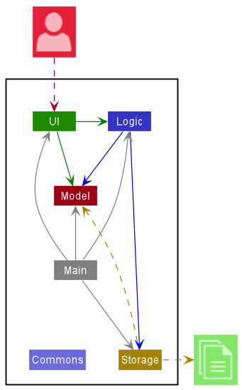
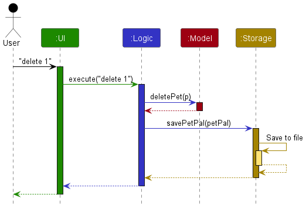
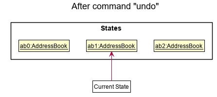
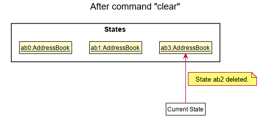

## Table of Contents

* Table of Contents
{:toc}

--------------------------------------------------------------------------------------------------------------------
## Introduction to PetPal
PetPal is a desktop application meant for Pet Daycare owners to manage their pet clients. It is optimized for typing
using the Command Line Interface (CLI) while also having a Graphical User Interface (GUI) to complement its use.

Use of PetPal can be scaled to include pet shelters, groomers or trainers.

PetPal uses Java 11, and can be run on most operating systems that supports Java (e.g. Windows, macOS, Linux)


## About the Developer Guide
### Objectives
This guide is targeted towards potential developers that would want to contribute to the open-source project - PetPal.

This developer guide serves as a way for them to hopefully be able to learn about the overall design architecture of PetPal and
the current and proposed features, detailing the design considerations and how it is implemented/going to be implemented.

The Design section makes use of various UML diagrams which were created using [PlantUML](https://plantuml.com/)


<br>

### Instructions for use
#### General formatting conventions
* Text in [blue](#about-the-developer-guide) are hyperlinks that direct you to the relevant section of the page or to other websites.
* Text in **bold** are used to emphasize important details to look out for or to distinguish headers from the rest of the text.
* Text in `code snippets such as this` are used to show inputs and their format.


<div markdown="block" class="alert alert-block alert-success">

* :bulb: **Note:**
  Information that is useful to note.
</div>

<div markdown="block" class="alert alert-block alert-danger">

* :heavy_exclamation_mark: **Caution:**
  Important information to note.
</div>

[Return to Table of Contents](#table-of-contents)

--------------------------------------------------------------------------------------------------------------------

## **Setting up**

Refer to the guide [_Setting up and getting started_](SettingUp.md).

## **Getting started**
After [setting up](#setting-up), double-click the jar file to launch PetPal.

### Getting Familiar With Your User Interface


1. **Pet Cards**: Contain all the information of a pet. (Highlighted in red)
2. **Command Line**: Type in your commands here. (Highlighted in yellow)
3. **Result Display**: The result of your command execution appears here. (Highlighted in blue)
4. **Help Button**: Provides the URL of this user guide.

[Return to Table of Contents](#table-of-contents)

--------------------------------------------------------------------------------------------------------------------

## **Design**

<div markdown="span" class="alert alert-primary">

:bulb: **Tip:** The `.puml` files used to create diagrams in this document can be found in the
[diagrams](https://github.com/se-edu/addressbook-level3/tree/master/docs/diagrams/) folder.
Refer to the [_PlantUML Tutorial_ at se-edu/guides](https://se-education.org/guides/tutorials/plantUml.html)
to learn how to create and edit diagrams.
</div>

### Architecture



The ***Architecture Diagram*** given above explains the high-level design of the App.

Given below is a quick overview of main components and how they interact with each other.

**Main components of the architecture**

**`Main`** has two classes called [`Main`](https://github.com/AY2223S2-CS2103T-T14-2/tp/tree/master/src/main/java/seedu/address/Main.java)
and [`MainApp`](https://github.com/AY2223S2-CS2103T-T14-2/tp/tree/master/src/main/java/seedu/address/MainApp.java). It is responsible for,
* At app launch: Initializes the components in the correct sequence, and connects them up with each other.
* At shut down: Shuts down the components and invokes cleanup methods where necessary.

[**`Commons`**](#common-classes) represents a collection of classes used by multiple other components.

The rest of the App consists of four components.

* [**`UI`**](#ui-component): The UI of the App.
* [**`Logic`**](#logic-component): The command executor.
* [**`Model`**](#model-component): Holds the data of the App in memory.
* [**`Storage`**](#storage-component): Reads data from, and writes data to, the hard disk.


**How the architecture components interact with each other**

The *Sequence Diagram* below shows how the components interact with each other for the scenario where the user issues the command `delete 1`.



Each of the four main components (also shown in the diagram above),

* defines its *API* in an `interface` with the same name as the Component.
* implements its functionality using a concrete `{Component Name}Manager` class (which follows the corresponding API `interface` mentioned in the previous point.

For example, the `Logic` component defines its API in the `Logic.java` interface and implements its functionality using the `LogicManager.java` class which follows the `Logic` interface. Other components interact with a given component through its interface rather than the concrete class (reason: to prevent outside component's being coupled to the implementation of a component), as illustrated in the (partial) class diagram below.


The sections below give more details of each component.

### UI component

The **API** of this component is specified in [`Ui.java`](https://github.com/AY2223S2-CS2103T-T14-2/tp/tree/master/src/main/java/seedu/address/ui/Ui.java)


The UI consists of a `MainWindow` that is made up of parts e.g.`CommandBox`, `ResultDisplay`, `petListPanel`, `StatusBarFooter` etc. All these, including the `MainWindow`, inherit from the abstract `UiPart` class which captures the commonalities between classes that represent parts of the visible GUI.

The `UI` component uses the JavaFx UI framework. The layout of these UI parts are defined in matching `.fxml` files that are in the `src/main/resources/view` folder. For example, the layout of the [`MainWindow`](https://github.com/se-edu/addressbook-level3/tree/master/src/main/java/seedu/address/ui/MainWindow.java) is specified in [`MainWindow.fxml`](https://github.com/se-edu/addressbook-level3/tree/master/src/main/resources/view/MainWindow.fxml)

The `UI` component,

* executes user commands using the `Logic` component.
* listens for changes to `Model` data so that the UI can be updated with the modified data.
* keeps a reference to the `Logic` component, because the `UI` relies on the `Logic` to execute commands.
* depends on some classes in the `Model` component, as it displays `pet` object residing in the `Model`.

### Logic component

**API** : [`Logic.java`](https://github.com/AY2223S2-CS2103T-T14-2/tp/tree/master/src/main/java/seedu/address/logic/Logic.java)

Here's a (partial) class diagram of the `Logic` component:


How the `Logic` component works:
1. When `Logic` is called upon to execute a command, it uses the `PetPalParser` class to parse the user command.
2. This results in a `Command` object (more precisely, an object of one of its subclasses e.g., `AddCommand`) which is executed by the `LogicManager`.
3. The command can communicate with the `Model` when it is executed (e.g. to add a pet).
4. The result of the command execution is encapsulated as a `CommandResult` object which is returned back from `Logic`.

The Sequence Diagram below illustrates the interactions within the `Logic` component for the `execute("delete 1")` API call.


<div markdown="span" class="alert alert-info">:information_source: **Note:** The lifeline for `DeleteCommandParser` should end at the destroy marker (X) but due to a limitation of PlantUML, the lifeline reaches the end of diagram.
</div>

Here are the other classes in `Logic` (omitted from the class diagram above) that are used for parsing a user command:


How the parsing works:
* When called upon to parse a user command, the `PetPalParser` class creates an `XYZCommandParser` (`XYZ` is a placeholder for the specific command name e.g., `AddCommandParser`) which uses the other classes shown above to parse the user command and create a `XYZCommand` object (e.g., `AddCommand`) which the `PetPalParser` returns back as a `Command` object.
* All `XYZCommandParser` classes (e.g., `AddCommandParser`, `DeleteCommandParser`, ...) inherit from the `Parser` interface so that they can be treated similarly where possible e.g, during testing.

### Model component
**API** : [`Model.java`](https://github.com/AY2223S2-CS2103T-T14-2/tp/tree/master/src/main/java/seedu/address/model/Model.java)


The `Model` component,

* stores the pet pal data i.e., all `pet` objects (which are contained in a `UniquepetList` object).
* stores the currently 'selected' `pet` objects (e.g., results of a search query) as a separate _filtered_ list which is exposed to outsiders as an unmodifiable `ObservableList<pet>` that can be 'observed' e.g. the UI can be bound to this list so that the UI automatically updates when the data in the list change.
* stores a `UserPref` object that represents the user’s preferences. This is exposed to the outside as a `ReadOnlyUserPref` objects.
* does not depend on any of the other three components (as the `Model` represents data entities of the domain, they should make sense on their own without depending on other components)

<div markdown="span" class="alert alert-info">:information_source: **Note:** An alternative (arguably, a more OOP) model is given below. It has a `Tag` list in the `PetPal`, which `pet` references. This allows `PetPal` to only require one `Tag` object per unique tag, instead of each `pet` needing their own `Tag` objects.<br>


</div>


### Storage component

**API** : [`Storage.java`](https://github.com/AY2223S2-CS2103T-T14-2/tp/tree/master/src/main/java/seedu/address/storage/Storage.java)


The `Storage` component,
* can save both address book data and user preference data in json format, and read them back into corresponding objects.
* inherits from both `PetPalStorage` and `UserPrefStorage`, which means it can be treated as either one (if only the functionality of only one is needed).
* depends on some classes in the `Model` component (because the `Storage` component's job is to save/retrieve objects that belong to the `Model`)

### Common classes

Classes used by multiple components are in the `seedu.PetPal.commons` package.

[Return to Table of Contents](#table-of-contents)

--------------------------------------------------------------------------------------------------------------------

## **Implementation**

This section describes some noteworthy details on how certain features are implemented.

### Remind Feature

#### Current Implementation

The `remind` mechanism is facilitated by the `Deadline`, `RemindCommand`,  classes.
The `Deadline` class has a `deadline` field which is of type `LocalDateTime`. Additionally, it also has a description of type `String`.

'RemindCommand' extends from the abstract class `Command`. It overrides the `Command#execute()` method to filter the pet list to show only pets with `Deadline` that are within 3 days from today's date.

Given below is an example usage scenario and how the set file mechanism behaves at each step.
Given below is an example usage scenario and how the `remind` mechanism behaves at each step.

Step 1. The user launches the application for the first time.

Step 2. The user decides to add a pet to the pet list. The user executes `add o/Alice n/Doggo p/98765432 e/example@gmail.com a/311, Clementi Ave 2, #02-25 ts/2023-03-27 21:09:09 d/Feed dog - 2023-03-27 21:09:09 t/Dog t/Chihuahua` command to add a pet named `Doggo` with reminder to feed the dog and  deadline of `2023-03-27 21:09:09` to the pet list. The `add` command calls the `AddCommand#execute()` method.

Step 3. The user may exit and reopen Petpal at a future date. The user intends to see all deadlines that are due soon. The user executes `remind` command to filter the pet list to show only pets with `Deadline` that are within 3 days from today's date. The `remind` command calls the `RemindCommand#execute()` method.

Step 4. The `RemindCommand#execute()` method calls the `Model#updateFilteredPetList()` method to filter the pet list to show only pets with `Deadline` that are within 3 days from today's date.

The following sequence diagram shows how the remind operation works:


The following activity diagram summarizes what happens when a user executes a new command:


#### Design Considerations:
**Choice 1 (Current Choice) : Filter pet list upon command**
* Pros:
    * User can easily find upcoming deadlines easily.
* Cons:
    * Counterintuitive since reminders shouldn't need user input to be shown.

**Choice 2 : Alert users of upcoming deadlines upon startup**
* Pros:
    * User will be reminded of upcoming deadlines upon startup.
* Cons:
    * Might be annoying to users who don't want to be reminded of upcoming deadlines.


### Calculator Feature

#### Current Implementation
The calculator mechanism is facilitated by the `AddCommand` class.
The calculator  calculates the amount of money owed by pet owners to the daycare owners,
based on an initial timestamp of type java `LocalDateTime` that is required to be non-null when
entering the `Add` command.

##### Given below is an example usage scenario and how the calculator mechanism behaves at each step:
Step 1. The user launches the application for the first time.

Step 2. The user decides to add a pet to the pet list. The user executes
`add o/Alice n/Doggo p/98765432 e/example@gmail.com a/311, Clementi Ave 2, #02-25 ts/2023-03-27 21:09:09 d/Feed dog -
2023-03-27 21:09:09 t/Dog t/Chihuahua` command to add a pet named `Doggo` with reminder to feed the dog and  deadline of
`2023-03-27 21:09:09` to the pet list. The `add` command calls the `AddCommand#execute()` method.

Step 3. The user may exit and reopen PetPal at a future date. The user will see how much is the amount due to them as a field in each pet card by their respective owners.

Step 4. The amount updates upon clicking on the PetCard on panel, or upon restarting the client.

The calculator feature is not an additional command, and does not have an activity or sequence diagram.


### Archive Feature

#### Current Implementation
The archive mechanism is facilitated by the `ArchiveCommand` class.
The `ArchiveCommand#execute()` adds the provided `Pet` into an archive list and deletes the `Pet` from the pet list,
the `Pet` must exist in the pet list.

##### Given below is an example usage scenario and how the set file mechanism behaves at each step:
```text
Step 1. The user launches the application for the first time
Step 2. The user decides to archive a pet in the pet list. The user executes `archive 1`
Step 3. The user can view the archived pets in data/archive.json file
```
##### Extensions:
```text
Step 2a. The PetPal list does not have any pets, the pet at list position 1 does not exist
     3a. The PetPal returns an error message: `The provided index is out of bounds`
```


### Highlight Feature

#### Current Implementation
The highlight mechanism is facilitated by the 'PetListPanel', 'Pet', and 'MarkCommand' classes.
This feature highlight pets that have not been marked and have a deadline within a day in the GUI.
The highlight feature will be executed automatically every certain time window without user input to support real-time state.

#### Given below is an example usage scenario and how the highlight mechanism behaves at each step:
Step 1. The user launches the application.

Step 2. The user decides to add two pet to the pet list with a deadline due three days later.

Step 3. The given pet will not be highlighted at this moment.

Step 4. The user decides to mark the first pet as done.

Step 5. The user exit the application and decided to reopen it two days later.

Step 6. The second pet that have not been marked will be highlighted while the first pet will not be highlighted since it was already marked.

The following activity diagram summarizes what happens during the process:


### Design Considerations:
**Aspect: How to reduce human error:**

**Alternative 1 (Current Choice) : Automatically execute the feature every certain period of time**
* Pros:
    * Shows real-time state.
    * Will not show outdated list state.
* Cons:
    * Use more memory executing the feature at every period of time.

**Alternative 2 : Provide Refresh button to update the pet list**
* Pros:
    * Use less memory since it will be executed only when needed.
* Cons:
    * User might forget to refresh to the updated state and shows the outdated instead.


### \[Proposed\] Importing data from excel (csv)

#### Proposed Implementation
The proposed importing function is an extension of the base `PetPal`, uses a `CsvToJsonParser` to convert csv data
to application readable json data.

#### Design considerations:
- **Alternative 1 (current choice)** : Write an external script that parses the csv data based on the column names
  into a json save file that works with PetPal, which they will then put into the data file before starting PetPal
  for PetPal to be able to read and modify the imported data
    - Pros: Might be easier to implement
    - Cons: Might be confusing for users to use (running external script)

- **Alternative 2** : Provide an interface for users to upload their csv data into PetPal and automatically parses
  the data into json format and refreshes the database.
    - Pros: Easier and more intuitive for users to use
    - Cons: Builds upon **Alternative 1**, requiring more work to implement


### Undo Feature
#### Current Implementation
The undo mechanism is facilitated by the `ModelManager`, `UndoCommand`,  classes.
The `ModelManager` class is implemented by PetPal and has a `petPalCache` field which is of type`PetPal`.

'UndoCommand' extends from the abstract class `Command`. It overrides the `Command#execute()` method to filter the pet list to show only pets with `Deadline` that are within 3 days from today's date.
##### Given below is an example usage scenario and how the undo mechanism behaves at each step:
<pre>
Step 1. The user launches the application for the first time.

Step 2. The user decides to add a pet to the pet list. The user executes `add o/Alice n/Doggo p/98765432 e/example@gmail.com a/311, Clementi Ave 2, #02-25 ts/2023-03-27 21:09:09 d/Feed dog - 2023-03-27 21:09:09 t/Dog t/Chihuahua` command to add a pet named `Doggo` with reminder to feed the dog and  deadline of `2023-03-27 21:09:09` to the pet list. The `add` command calls the `AddCommand#execute()` method.

Step 3. The user realises that he has made a mistake and executes `undo`.
</pre>
Step 4. The list displayed returns to previous state without the new Doggo added.
##### Extensions:
<pre>
Step 2a. The user decides to delete a pet from the pet list. The user executes `delete 1`.
     3a. The user realises that he has made a mistake and executes `undo`.
     4a. The list displayed returns to previous state with item 1 that was just deleted.
</pre>

The following sequence diagram shows how the undo operation works:


The following activity diagram summarizes what happens when a user executes a new command:


### \[Proposed\] Undo/redo feature

#### Proposed Implementation

The proposed undo/redo mechanism is facilitated by `VersionedPetPal`. It extends `PetPal` with an undo/redo history, stored internally as an `PetPalStateList` and `currentStatePointer`. Additionally, it implements the following operations:

* `VersionedPetPal#commit()`— Saves the current address book state in its history.
* `VersionedPetPal#undo()`— Restores the previous address book state from its history.
* `VersionedPetPal#redo()`— Restores a previously undone address book state from its history.

These operations are exposed in the `Model` interface as `Model#commitPetPal()`, `Model#undoPetPal()` and `Model#redoPetPal()` respectively.

Given below is an example usage scenario and how the undo/redo mechanism behaves at each step.

Step 1. The user launches the application for the first time. The `VersionedPetPal` will be initialized with the initial address book state, and the `currentStatePointer` pointing to that single address book state.


Step 2. The user executes `delete 5` command to delete the 5th pet in the address book. The `delete` command calls `Model#commitPetPal()`, causing the modified state of the address book after the `delete 5` command executes to be saved in the `petPalStateList`, and the `currentStatePointer` is shifted to the newly inserted address book state.


Step 3. The user executes `add n/David …​` to add a new pet. The `add` command also calls `Model#commitPetPal()`, causing another modified address book state to be saved into the `petPalStateList`.


<div markdown="span" class="alert alert-info">:information_source: **Note:** If a command fails its execution, it will not call `Model#commitPetPal()`, so the address book state will not be saved into the `petPalStateList`.

</div>

Step 4. The user now decides that adding the pet was a mistake, and decides to undo that action by executing the `undo` command. The `undo` command will call `Model#undoPetPal()`, which will shift the `currentStatePointer` once to the left, pointing it to the previous address book state, and restores the address book to that state.



<div markdown="span" class="alert alert-info">:information_source: **Note:** If the `currentStatePointer` is at index 0, pointing to the initial PetPal state, then there are no previous PetPal states to restore. The `undo` command uses `Model#canUndoPetPal()` to check if this is the case. If so, it will return an error to the user rather
than attempting to perform the undo.

</div>

The following sequence diagram shows how the undo operation works:


<div markdown="span" class="alert alert-info">:information_source: **Note:** The lifeline for `UndoCommand` should end at the destroy marker (X) but due to a limitation of PlantUML, the lifeline reaches the end of diagram.

</div>

The `redo` command does the opposite—it calls `Model#redoPetPal()`, which shifts the `currentStatePointer` once to the right, pointing to the previously undone state, and restores the address book to that state.

<div markdown="span" class="alert alert-info">:information_source: **Note:** If the `currentStatePointer` is at index `petPalStateList.size() - 1`, pointing to the latest address book state, then there are no undone PetPal states to restore. The `redo` command uses `Model#canRedoPetPal()` to check if this is the case. If so, it will return an error to the user rather than attempting to perform the redo.

</div>

Step 5. The user then decides to execute the command `list`. Commands that do not modify the address book, such as `list`, will usually not call `Model#commitPetPal()`, `Model#undoPetPal()` or `Model#redoPetPal()`. Thus, the `petPalStateList` remains unchanged.


Step 6. The user executes `clear`, which calls `Model#commitPetPal()`. Since the `currentStatePointer` is not pointing at the end of the `petPalStateList`, all address book states after the `currentStatePointer` will be purged. Reason: It no longer makes sense to redo the `add n/David …​` command. This is the behavior that most modern desktop applications follow.



The following activity diagram summarizes what happens when a user executes a new command:


#### Design considerations:

**Aspect: How undo & redo executes:**

* **Alternative 1 (current choice):** Saves the entire address book.
  * Pros: Easy to implement.
  * Cons: May have performance issues in terms of memory usage.

* **Alternative 2:** Individual command knows how to undo/redo by
  itself.
  * Pros: Will use less memory (e.g. for `delete`, just save the pet being deleted).
  * Cons: We must ensure that the implementation of each individual command are correct.


[Return to Table of Contents](#table-of-contents)

--------------------------------------------------------------------------------------------------------------------

## **Documentation, logging, testing, configuration, dev-ops**

* [Documentation guide](Documentation.md)
* [Testing guide](Testing.md)
* [Logging guide](Logging.md)
* [Configuration guide](Configuration.md)
* [DevOps guide](DevOps.md)

--------------------------------------------------------------------------------------------------------------------

## **Appendix: Requirements**

### Product scope

**Target user profile**:

* has a need to manage a significant number of pet details
* prefer desktop apps over other types
* can type fast
* prefers typing to mouse interactions
* is reasonably comfortable using CLI apps
* prefers an app with GUI.

**Value proposition**: manage pet details better than a typical mouse driven app


### User stories

Priorities: High (must have) - `* * *`, Medium (nice to have) - `* *`, Low (unlikely to have) - `*`

| Priority | As a …              | I want to …                            | So that I can…                                                             |
|----------|---------------------|----------------------------------------|----------------------------------------------------------------------------|
| `* * *`  | new staff           | see usage instructions                 | refer to instructions when I forget how to use the app                     |
| `* * *`  | staff               | add a new pet                          |                                                                            |
| `* * *`  | staff               | input pet details                      | track the details of each pet                                              |
| `* * *`  | staff               | delete a pet                           | remove entries that I no longer need                                       |
| `* * *`  | staff               | find a pet by name                     | locate details of pets without having to go through the entire list        |
| `* * *`  | staff               | tag pets                               | take note of pet personalities or special requirements to know their needs |
| `* *`    | forgetful pet owner | get a reminder for my pet              | remember to fetch my pets from the daycare                                 |
| `* *`    | pet owner           | keep track of my own pets              | know that my pets are taken care of well                                   | 
| `* *`    | staff               | keep track of pet locations            | account for missing pets                                                   | 
| `* *`    | forgetful staff     | get a reminder for pets                | track pets that have overstayed their duration                             |
| `* *`    | staff               | input pet attendance                   | track pet attendance in the daycare                                        |
| `* *`    | staff               | view pet appointment dates             | bring pets to vet if necessary                                             | 
| `* *`    | staff               | search for a pet via tags              | cater different services to different pets                                 | 
| `* *`    | staff               | schedule appointment dates             | remember when pet owners are coming to pick up or drop off their pets      |
| `* *`    | staff               | look at vaccination status of pets     | know what vaccinations required are missing                                |
| `* *`    | staff               | archive pet information                | keep a record of older pet clients                                         |
| `* *`    | friendly staff      | send personal messages to pet owners   | update or help pet owners                                                  |
| `* *`    | general staff       | write and save notes for pets          | track additional information if needed                                     |
| `* *`    | staff               | export pet data                        | backup pet data                                                            |
| `* *`    | new staff           | import pet data                        |                                                                            |
| `*`      | staff               | input feedback for pet owners          | let the pet owners know how to better care for their pets behaviours       | 
| `*`      | pet owner           | give staff feedback                    | let the staff know how to improve their services                           |
| `*`      | pet owner           | check pet attendance                   | track how long my pet has been in daycare                                  |
| `*`      | pet owner           | look at staff comments on the feedback | acknowledge staff feedback and give clarification                          |
| `*`      | business owner      | have an overview on the pet welfare    | know that pet owners and staffs are satisfied                              |
| `*`      | staff               | receive pet owner feedback             | know how to take better care of pets                                       |
| `*`      | pet owner           | view daycare availability              | check if there are slots available to board my pet                         |
| `*`      | pet owner           | view facilities                        | know the available amenities for my pets                                   |
| `*`      | clueless pet owner  | look for pet daycare locations         | know which facilities are available                                        |
| `*`      | poor staff          | keep track of hours worked             | keep track of earnings                                                     |
| `*`      | business owner      | keep track of money owed by pet owners |                                                                            |

[Return to Table of Contents](#table-of-contents)

### Use cases

(For all use cases below, the **System** is `PetPal` and the **Actor** is the `user`, unless specified otherwise)

**Use case: View help** 

[//]: # TODO()


**Use case:List the list of pets**

**MSS**

1. Actor requests to list pets
2. System displays list<br>
   Use case ends.

**Extensions**
* 2a. There are no pet details.<br>
  Use case ends.


**Use case: Add a pet**

**MSS**
1. Actor requests to add pet
2. System deletes the pet<br>
   Use case ends.

**Extensions**
* 2a. Any required detail(s) are missing
    * 2a1. System shows an error message.<br>
      Use case ends.


**Use case: View reminders**

[//]: # TODO()


**Use case: Find pet by name**

[//]: # TODO()


**Use case: Edit a pet**

[//]: # TODO()


**Use case: Change rate of Cost**

[//]: # TODO()


**Use case: Mark deadline**

[//]: # TODO()


**Use case: Delete a pet**

**MSS**
1.  Actor requests to list pets
2.  System shows a list of pets
3.  Actor requests to delete a specific pet in the list
4.  System deletes the pet<br>
    Use case ends.

**Extensions**

* 2a. The list is empty.<br>
  Use case ends.

* 3a. The given index is invalid.
    * 3a1. System shows an error message.<br>
      Use case resumes at step 2.


**Use case: Archive a pet**

[//]: # TODO()


**Use case: Clear the pet list**

[//]: # TODO()


**Use case: Undo a command**

[//]: # TODO()


**Use case: Exit the System**

**MSS**
1. Actor requests to exit
2. System exits<br>
    Use case ends.


[Return to Table of Contents](#table-of-contents)
--------------------------------------------------------------------------------------------------------------------

### Non-Functional Requirements

1.  Should work on any _mainstream OS_ as long as it has Java `11` or above installed.
2.  Should be able to hold up to 1000 pets without a noticeable sluggishness in performance for typical usage.
3.  A user with above average typing speed for regular English text (i.e. not code, not system admin commands) should be able to accomplish most of the tasks faster using commands than using the mouse.


### Glossary
| Term          | Definition                            |
|---------------|---------------------------------------|
| Mainstream OS | Refers to Windows, Linux, Unix, MacOS |

[Return to Table of Contents](#table-of-contents)


--------------------------------------------------------------------------------------------------------------------

## **Appendix: Instructions for manual testing**

Given below are instructions to test the app manually.

<div markdown="span" class="alert alert-info">:information_source: **Note:** These instructions only provide a starting point for testers to work on;
testers are expected to do more *exploratory* testing.

</div>

### Launch and shutdown

1. Initial launch

   1. Download the jar file and copy into an empty folder

   2. Double-click the jar file.<br>Expected: Shows the GUI with a set of sample contacts

2. Saving window preferences

   1.  Move the window to a different location. Close the window.

   2. Re-launch the app by double-clicking the jar file.<br>
       Expected: The most recent window size and location is retained.

### Deleting a pet

1. Deleting a pet while all pets are being shown

   1. Prerequisites: List all pets using the `list` or `l` command. Multiple pets in the list.

   2. Test case: `delete 1`<br>
      Expected: First Pet entry is deleted from the list. Details of the deleted pet entry shown in the status message.
      Timestamp in the status bar is updated.

   3. Test case: `delete 0`<br>
      Expected: No pet is deleted. Error details shown in the status message. Status bar remains the same.

   4. Other incorrect delete commands to try: `delete`, `delete x` (where x is an integer larger than the list size), `delete abc`, (where abc is a string or special characters)<br>
      Expected: Similar to previous.

2. _{ more test cases … }_

### Saving data

1. Viewing the save files

    1. Exit the app by typing `exit` or `e`.<br>Expected: A new folder called `data` is created in the folder where your jar file is at

    2. Double-click the `data` folder.<br>Expected: 2 files, `petpal.json` (which includes sample data) and `archive.json` is present in the `data` folder

2. Dealing with missing/corrupted data files

   1. To simulate a missing data file, go to the `data` folder and delete `petpal.json` and/or `archive.json`

3. _{ more test cases … }_

[Return to Table of Contents](#table-of-contents)

--------------------------------------------------------------------------------------------------------------------

## **Acknowledgements**

* This project is based on the AddressBook-Level3 project created by the [SE-EDU initiative](https://se-education.org)
* Libraries used: [JavaFX](https://openjfx.io/), [Jackson](https://github.com/FasterXML/jackson), [JUnit5](https://github.com/junit-team/junit5)

[Return to Table of Contents](#table-of-contents)
