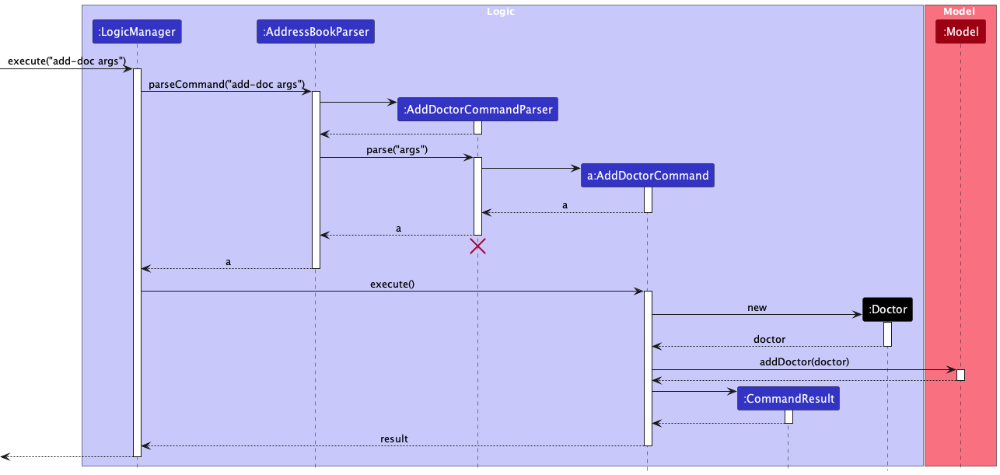
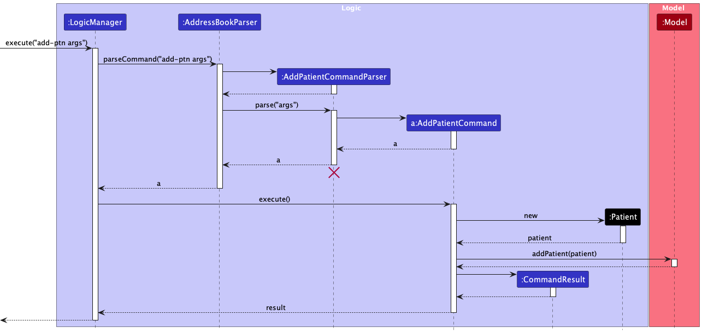
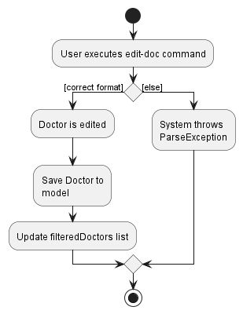

* Table of Contents
{:toc}

--------------------------------------------------------------------------------------------------------------------

## **Acknowledgements**

This project is based on the AddressBook-Level3 project created by the [SE-EDU initiative](https://se-education.org).

--------------------------------------------------------------------------------------------------------------------

## **Setting up, getting started**

Refer to the guide [_Setting up and getting started._](./SettingUp.md)

--------------------------------------------------------------------------------------------------------------------

## Design

:bulb: **Tip:** The `.puml` files used to create diagrams in this document can be found in the [diagrams](https://github.com/se-edu/addressbook-level3/tree/master/docs/diagrams/) folder. Refer to the [_PlantUML Tutorial_ at se-edu/guides](https://se-education.org/guides/tutorials/plantUml.html) to learn how to create and edit diagrams.

### Architecture

The ***Architecture Diagram*** given above explains the high-level design of the App.

Given below is a quick overview of main components and how they interact with each other.

**Main components of the architecture**

**`Main`** has two classes called [`Main`](https://github.com/se-edu/addressbook-level3/tree/master/src/main/java/seedu/address/Main.java) and [`MainApp`](https://github.com/se-edu/addressbook-level3/tree/master/src/main/java/seedu/address/MainApp.java). It is responsible for,
* At app launch: Initializes the components in the correct sequence, and connects them up with each other.
* At shut down: Shuts down the components and invokes cleanup methods where necessary.

[**`Commons`**](#common-classes) represents a collection of classes used by multiple other components.

The rest of the App consists of four components.

* [**`UI`**](#ui-component): The UI of the App.
* [**`Logic`**](#logic-component): The command executor.
* [**`Model`**](#model-component): Holds the data of the App in memory.
* [**`Storage`**](#storage-component): Reads data from, and writes data to, the hard disk.

**How the architecture components interact with each other**

The *Sequence Diagram* below shows how the components interact with each other for the scenario where the user issues the command `del-doc 1`.

Each of the four main components (also shown in the diagram above),

* defines its *API* in an `interface` with the same name as the Component.
* implements its functionality using a concrete `{Component Name}Manager` class (which follows the corresponding API `interface` mentioned in the previous point.

For example, the `Logic` component defines its API in the `Logic.java` interface and implements its functionality using the `LogicManager.java` class which follows the `Logic` interface. Other components interact with a given component through its interface rather than the concrete class (reason: to prevent outside component's being coupled to the implementation of a component), as illustrated in the (partial) class diagram below.

The sections below give more details of each component.

### UI component

The **API** of this component is specified in [`Ui.java`](https://github.com/se-edu/addressbook-level3/tree/master/src/main/java/seedu/address/ui/Ui.java)

The UI consists of a `MainWindow` that is made up of parts e.g.`CommandBox`, `ResultDisplay`, `PersonListPanel`, `StatusBarFooter` etc. All these, including the `MainWindow`, inherit from the abstract `UiPart` class which captures the commonalities between classes that represent parts of the visible GUI.

The `UI` component uses the JavaFx UI framework. The layout of these UI parts are defined in matching `.fxml` files that are in the `src/main/resources/view` folder. For example, the layout of the [`MainWindow`](https://github.com/se-edu/addressbook-level3/tree/master/src/main/java/seedu/address/ui/MainWindow.java) is specified in [`MainWindow.fxml`](https://github.com/se-edu/addressbook-level3/tree/master/src/main/resources/view/MainWindow.fxml)

The `UI` component,

* executes user commands using the `Logic` component.
* listens for changes to `Model` data so that the UI can be updated with the modified data.
* keeps a reference to the `Logic` component, because the `UI` relies on the `Logic` to execute commands.
* depends on some classes in the `Model` component, as it displays `Person` object residing in the `Model`.

### Logic component

**API** : [`Logic.java`](https://github.com/AY2223S2-CS2103T-F12-1/tp/tree/master/src/main/java/seedu/address/logic/Logic.java)

Here's a (partial) class diagram of the `Logic` component:

How the `Logic` component works:
1. When `Logic` is called upon to execute a command, it uses the `AddressBookParser` class to parse the user command.
1. This results in a `Command` object (more precisely, an object of one of its subclasses e.g., `AddDoctorCommand`) which is executed by the `LogicManager`.
1. The command can communicate with the `Model` when it is executed (e.g. to add a doctor).
1. The result of the command execution is encapsulated as a `CommandResult` object which is returned back from `Logic`.

The Sequence Diagram below illustrates the interactions within the `Logic` component for the `execute("delete-doc 1")` API call.

:information_source: **Note:** The lifeline for `DeleteDoctorCommandParser` should end at the destroy marker (X) but due to a limitation of PlantUML, the lifeline reaches the end of diagram.

Here are the other classes in `Logic` (omitted from the class diagram above) that are used for parsing a user command:

How the parsing works:
* When called upon to parse a user command, the `AddressBookParser` class creates an `XYZCommandParser` (`XYZ` is a placeholder for the specific command name e.g., `AddDoctorCommandParser`) which uses the other classes shown above to parse the user command and create a `XYZCommand` object (e.g., `AddDoctorCommand`) which the `AddressBookParser` returns back as a `Command` object.
* All `XYZCommandParser` classes (e.g., `AddDoctorCommandParser`, `DeleteDoctorCommandParser`, ...) inherit from the `Parser` interface so that they can be treated similarly where possible e.g, during testing.

### Model component
**API** : [`Model.java`](https://github.com/AY2223S2-CS2103T-F12-1/tp/tree/master/src/main/java/seedu/address/model/Model.java)

The `Model` component,

* stores the address book data i.e., all `Doctor` and `Patient` objects (which are contained in a `UniqueDoctorList` and `UniquePatientList` object).
* stores the currently 'selected' `Doctor` and `Patient` objects (e.g., results of a search query) as a separate _filteredDoctors_ and _filteredPatients_ list which is exposed to outsiders as an unmodifiable `ObservableList<Doctor>` and `ObservableList<Patient>` that can be 'observed' e.g. the UI can be bound to this list so that the UI automatically updates when the data in the list change.
* stores a `UserPref` object that represents the user’s preferences. This is exposed to the outside as a `ReadOnlyUserPref` objects.
* does not depend on any of the other three components (as the `Model` represents data entities of the domain, they should make sense on their own without depending on other components)

### Storage component

**API** : [`Storage.java`](https://github.com/AY2223S2-CS2103T-F12-1/tp/tree/master/src/main/java/seedu/address/storage/Storage.java)

The `Storage` component,
* can save both address book data and user preference data in json format, and read them back into corresponding objects.
* inherits from both `AddressBookStorage` and `UserPrefStorage`, which means it can be treated as either one (if only the functionality of only one is needed).
* depends on some classes in the `Model` component (because the `Storage` component's job is to save/retrieve objects that belong to the `Model`)

### Common classes

Classes used by multiple components are in the `seedu.addressbook.commons` package.

---

## Implementation

### Add Doctor Feature

#### What it does
{: .no_toc}

Adds a doctor to the bottom of the list of currently existing doctors. Users are able to add any valid doctor to the list. If a record of the same doctor already exists in the list, the command will not be allowed and an error will be thrown to alert user.

Example Use: `add-doc n/John Doe p/98765432 e/johnd@example.com s/Cardiology y/5 t/surgeon`

#### Implementation
{: .no_toc}

Upon entry of the add doctor command, an `AddDoctorCommand` class is created. The `AddDoctorCommand` class extends the abstract `Command` class and implements the `execute()` method. Upon execution of this method, a `Doctor` object is added to the model’s list of doctors if all the attributes provided are valid and a duplicate instance does not exist.

Given below is an example usage scenario of how the add doctor command behaves at each step.

Step 1. User launches the application

Step 2. User executes `add-doc n/John Doe p/98765432 e/johnd@example.com s/Cardiology y/5 t/surgeon` to save a doctor.

Step 3. The doctor is added to the model’s list of doctors if valid.

The following sequence diagram illustrates how the add doctor operation works:

*args: Refers to a valid sequence of arguments provided by the user. Example: "n/John Doe p/98765432 e/johnd@example.com s/Cardiology y/5 t/surgeon"

### Add Patient Feature

#### What it does
{: .no_toc}

Adds a patient to the bottom of the list of currently existing patients. Users are able to add any valid patient to the list. If a record of the same patient already exists in the list, the command will not be allowed and an error will be thrown to alert user.

Example Use: `add-ptn n/John Doe p/98765432 e/jdoe@gmail.com h/1.85 w/70.5 d/Fever st/Outpatient r/Patient was given paracetamol for fever t/friends`

#### Implementation
{: .no_toc}

Upon entry of the add patient command, an `AddPatientCommand` class is created. The `AddPatientCommand` class extends the abstract `Command` class and implements the `execute()` method. Upon execution of this method, a `Patient` object is added to the model’s list of patients if all the attributes provided are valid and a duplicate instance does not exist.

Given below is an example usage scenario of how the add doctor command behaves at each step.

Step 1. User launches the application

Step 2. User executes `add-ptn n/John Doe p/98765432 e/jdoe@gmail.com h/1.85 w/70.5 d/Fever st/Outpatient r/Patient was given paracetamol for fever t/friends` to save a patient.

Step 3. The patient is added to the model’s list of patients if valid.

The following sequence diagram illustrates how the add doctor operation works:

*args: Refers to a sequence of valid arguments provided by the user. Example: "n/John Doe p/98765432 e/jdoe@gmail.com h/1.85 w/70.5 d/Fever st/Outpatient r/Patient was given paracetamol for fever t/friends"

#### Edit Doctor Feature

### What it does
{: .no_toc}

Users can edit specific doctors in the clinic by providing at least one of the optional fields. Existing values will be
updated to the input values and all other values will remain the same. The doctor to be edited can be specified through
the doctor's index.

Example Use: `edit-doc 2 n/Gabriel Tan p/12345678 s/Cardiology`

### Implementation
{: .no_toc}

Upon entry of the edit doctor command, an `EditDoctorCommand` class is created. The `EditDoctorCommand` class extends
the abstract `Command` class and implements the `execute()` method. The `EditDoctorDescriptor` is created with the arguments given
by the user. A new `Doctor` object is created with the new arguments, with the attributes of the old `Doctor` object copied over
if the argument for that specific attribute is not provided by the user. `EditDoctorDescriptor` is then passed to `EditDoctorCommandParser`.
The `EditDoctorCommand` is created using the `EditDoctorDescriptor`. Upon execution of `EditDoctorCommand`, a `Doctor` object is added to the model’s list of doctors if all the attributes provided are valid and a duplicate instance does not exist.

The following activity diagram illustrates the user flow for editing a doctor:

Given below is an example usage scenario of how the add doctor command behaves at each step.

Step 1. User launches the application

Step 2. User executes `edit-doc n/Simon` to edit a doctor.

Step 3. The doctor is edited and saved to the model’s list of doctors if valid.

The following sequence diagram illustrates how the edit doctor operation works:

### Delete Doctor Feature

#### What it does
{: .no_toc}

Deletes a doctor at the specified **one-based index** of list of currently existing/found doctors. Users are able to delete any doctor in the list. If an index larger than or equal to the size of the doctor’s list is provided, the command will not be allowed and an error will be thrown to alert user.

Example Use: `del-doc 1`

#### Implementation
{: .no_toc}

Upon entry of the delete doctor command, a `DeleteDoctorCommand` class is created. The `DeleteDoctorCommand` class extends the abstract `Command` class and implements the `execute()` method. Upon execution of this method, the doctor at specified **one-based index** is removed if the index provided is valid.

Given below is an example usage scenario of how the delete doctor command behaves at each step.

Step 1. User launches the application

Step 2. User executes `del-doc 1` to delete the doctor at index 1 (one-based indexing).

Step 3. The doctor at this index is removed if the index provided is valid.

The following sequence diagram illustrates how the delete doctor operation works:

### Delete Patient Feature

#### What it does
{: .no_toc}

Deletes a patient at the specified **one-based index** of list of currently existing/found patient. Users are able to delete any patient in the list. If an index larger than or equal to the size of the patient’s list is provided, the command will not be allowed and an error will be thrown to alert user.

Example Use: `del-ptn 1`

#### Implementation
{: .no_toc}

Upon entry of the delete doctor command, a `DeletePatientCommand` class is created. The `DeletePatientCommand` class extends the abstract `Command` class and implements the `execute()` method. Upon execution of this method, the patient at specified **one-based index** is removed if the index provided is valid.

Given below is an example usage scenario of how the delete patient command behaves at each step.

Step 1. User launches the application

Step 2. User executes `del-ptn 1` to delete the patient at index 1 (one-based indexing).

Step 3. The patient at this index is removed if the index provided is valid.

The following sequence diagram illustrates how the delete patient operation works:

### GUI Features

#### Enlarged Info Card feature
{: .no_toc}

As triage staff manage the contacts of doctors and patients, they may wish to pull up
the personal information of the doctor or patient. Therefore, the right-most column within
Docedex has been reserved to show the personal information of the selected doctor or patient.

##### Brief introduction to the components involved
{: .no_toc}

Let's call the card which displays this information **info cards**. However, the information
displayed for a doctor compared to a patient has a few differences. Thus, two different info cards
are required - one to display patient information and one to display doctor information.

Let's call these cards `EnlargedDoctorInfoCard` and `EnlargedPatientInfoCard`. However, we
only have one `StackPane` to display the information of the queried doctor or patient.
So, we need a way to toggle between displaying either card, depending on whether the user
has selected a doctor or patient to view.

##### Exploring the user journey
{: .no_toc}

To explore how this is implemented, we will focus on the user clicking on a `DoctorListViewCell`
representing a doctor, though the ideas below can be extended to the user clicking on a
`PatientListViewCell`, as well as other ways of querying for a doctor or patient
(ie. through select-doc or select-ptn command).

Below, we see the sequence diagram of how a mouse click from the user on the `DoctorListViewCell`
causes the display of information related to the doctor card through the `EnlargedDoctorInfoCard`.

##### More details on implementation
{: .no_toc}

When the user clicks on a `DoctorListViewCell`, the `displayDoctor()` call sets the state of the
`EnlargedInfoCardDisplayController` to show the doctor. After which, the `ContactDisplay`
is prompted to feedback this change to the user, by displaying the `EnlargedDoctorInfoCard`
containing the information of the doctor represented by the clicked `DoctorListViewCell`.

A similar process happens when the user clicks on a `PatientListViewCell`.

##### How is the state of the application stored
{: .no_toc}

Within `EnlargedInfoCardDisplayController`, two booleans corresponding to displaying doctor
and patient information respectively store the state of the application.

These booleans should never contain the same value for the following reasons:
1) If both booleans are `false`, then no information is displayed.
2) If both booleans are `true`, then both doctor and patient information will be
displayed over each other.

##### Alternatives considered
*_This section is still in progress_*

--------------------------------------------------------------------------------------------------------------------

## **Documentation, Logging, Testing, Configuration, Dev-Ops**

Here are some useful links on the following!
* [Documentation guide](Documentation.md)
* [Testing guide](Testing.md)
* [Logging guide](Logging.md)
* [Configuration guide](Configuration.md)
* [DevOps guide](DevOps.md)

--------------------------------------------------------------------------------------------------------------------

## Appendix A: Planned Enhancements
### User Interface

- **Problem:** Let's say that a user selected a patient, before using the
[`list-doc` command](./UserGuide.md#listing-all-doctors). Note that the `list-doc` command does not involve
selection of patient cards. In this case, the user interface does not clear the selection on the previously
selected card. However, all the doctors are listed on the GUI, as requested by the user through `list-doc`.
Therefore, there may be confusion as to whether the listed doctors are assigned to the previously selected
patient or not. (Note: This problem exists if you select a doctor and then enter `list-ptn` too)
  - **Solution:** The list commands will clear any selection of patient or doctor cards.
 
- **Problem:** Let's say that a user adds a doctor using the
[`add-doc` command](./UserGuide.md#adding-a-doctor). Docedex will automatically select the newly
added doctor as detailed [here](./UserGuide.md#note-about-selecting-doctors-or-patients).
In doing so, the patients list disappears, as the newly added doctor has no assigned patients.
However, this may be confusing to some, as there is no visual feedback that the patients list
is reflecting the newly added doctor's assigned patients. Therefore, some users have confused
this behaviour with all patients being deleted. (Note: This problem exists if you add a patient instead too)
  - **Solution:** The title of the patients list will be updated to display "XXX's Patients", where XXX is the
name of the newly added doctor. The same fix will be done for the title of the doctors list to support
a similar behaviour when adding patients.
- **Problem:** The command usage message is not consistent across the UserGuide and EditXYZCommands
- **Solution:** Update the `MESSAGE_USAGE` field in [`EditDoctorCommand`](https://github.com/AY2223S2-CS2103T-F12-1/tp/tree/master/src/main/java/seedu/address/logic/commands/EditDoctorCommand.java), [`EditPatientCommand`](https://github.com/AY2223S2-CS2103T-F12-1/tp/blob/master/src/main/java/seedu/address/logic/commands/EditPatientCommand.java) and associated tests ([`EditDoctorCommandTest`](https://github.com/AY2223S2-CS2103T-F12-1/tp/blob/master/src/test/java/seedu/address/logic/commands/EditDoctorCommandTest.java), [`EditPatientCommandTest`](https://github.com/AY2223S2-CS2103T-F12-1/tp/blob/master/src/test/java/seedu/address/logic/commands/EditPatientCommandTest.java)) with parameter information present in the [UserGuide](./UserGuide.md#editing-a-doctor).

### Appendix B: Product scope

**Target user profile**
We hope to target admin staff within a clinic who have to settle triaging of patients. 
Here are some characteristics of our target user profile:  
* needs to manipulate patient and doctor information quickly
* needs to assign patients to the appropriate doctors quickly
* prefer desktop apps over other mediums
* can type fast
* prefers typing to mouse interactions
* is reasonably comfortable using CLI apps

**Value proposition**: Perform quick lookup and assignment of appropriate doctors to each patient in triage,
faster than a typical mouse/GUI driven app.

### Appendix C: User stories

In the table below, **_user_** refers to the triage admin staff.

Priorities: High (must have) - `* * *`, Medium (nice to have) - `* *`, Low (unlikely to have) - `*`

| Priority | As a …​ | I want to …​                                                              | So that I can…​                                                                  |
|----------|---------|---------------------------------------------------------------------------|----------------------------------------------------------------------------------|
| `* * *`  | user    | add doctor/patient contacts into my address book                          | store their contacts in case I need them in the future                           |
| `* * *`  | user    | look up doctors by their name, specialty and/or years of experience       | assign patients to relevant doctors                                              |
| `* * *`  | user    | look up patients by their name,                                           | view which doctors treated found patients or verify their diagnosis              |
| `* * *`  | user    | edit the doctor/patient contacts in Docedex                               | keep the doctor/patient contacts up to date                                      |
| `* * *`  | user    | delete doctors/patients that have left the hospital, died or have retired | ensure all doctor/patient contacts are relevant                                  |
| `* * *`  | user    | save my doctor/patient contacts in my desktop                             | refer to doctor/patient contacts in the future                                   |
| `* * *`  | user    | load my contacts from a file when I boot up the application               | refer to doctor/patient contacts created in the past                             |
| `* * *`  | user    | tag patients with a status                                                | determine assignment priorities to doctors                                       |
| `* * *`  | user    | detect duplicate entries                                                  | either halt operation or update information.                                     |
| `* *`    | user    | access the help menu                                                      | know how to use the commands within Docedex                                      |
| `* *`    | user    | tag patients to the doctor                                                | keep track of patients treated by the doctor                                     |
| `* *`    | user    | tag doctors to the patients                                               | keep track of doctors treating the patient                                       |
| `* *`    | user    | exit the application through the CLI                                      | terminate use of the application                                                 |
| `*`      | user    | see the history of doctors I viewed recently                              | re-access recently queried doctor contacts quickly                               |
| `*`      | user    | self-destruct my address book                                             | protect clinic's information in the event of a cyber-attack (last-ditch effort). |
 | `*`      | user    | select doctors/patients through the CLI                                   | minimize the use of a mouse/pointing device                                      |
### Appendix D: Use cases

For all use cases below, we assume the following unless specified otherwise
- The **System** is `Docedex`
- The **Actor** is the `user`
- The following preconditions
  - The `user` has launched the `Docedex` application.

Furthermore, a lot of **use cases are similar when manipulating
doctors and patients**. Therefore, to keep the developer guide concise, the
use cases elaborated upon below are only detailed for doctors. Nonetheless, they
can be extrapolated for patients too, without changes to the major details within
the use case. Such associated pairs of use cases are listed in the table below.

| **Doctor Use Case**            | **Respective Patient Use Case** |
|--------------------------------|---------------------------------|
| UC1 - Add Doctor               | UC7 - Add Patient               |
| UC2 - Delete Doctor            | UC8 - Delete Patient            |
| UC3 - Edit Doctor              | UC9 - Edit Patient              |
| UC4 - Find Doctor              | UC10 - Find Patient             |
| UC5 - List Doctor              | UC11 - List Patient             |
| UC6 - Assign Doctor to Patient | UC12 - Assign Patient to Doctor |

**Use case: UC1 - Add Doctor**

**MSS**

1. User requests to add a doctor by specifying information about the doctor.
2. Docedex confirms the addition of the doctor. 
   Use case ends.

**Extensions**

* 1a. User enters invalid command.
  * 1a. Docedex detects error in command.
    * 1a1. Docedex prompts user to correct the format of the command.  
    * 1a2. User enters command and information to add a doctor. 
    Steps 1a1-1a2 are repeated until a valid add command is entered. 
    Use case resumes from step 2.
* 1b. Docedex detects duplicate doctor entry.
  * 1b1. Docedex prompts user to not enter duplicate information  
  * 1b2. User re-enters command to add a doctor. 
  Steps 1b1-1b2 are repeated until a unique entry is entered. 
  Use cases resumes from step 2.

**Use case: UC2 - Delete Doctor**

**MSS**

1. User requests to delete a specific doctor.
2. Docedex confirms the deletion of the doctor contact. 
   Use case ends.

**Extensions**

* 1a. Docedex detects an error in the command format.
  * 1a1. Docedex requests to correct the format of the command.
  * 1a2. User enters command to delete a doctor. 
  Steps 1a1-1a2 are repeated until a valid delete command is entered. 
  Use case resumes from step 2.
* 1b. Docedex detects that the requested doctor does not exist.
  * 1b1. Docedex alerts the user that the requested doctor does not exist.
  * 1b2. User re-enters the command. 
    Steps 1b1-1b2 are repeated until the user enters a doctor that exists in Docedex. 
    Use case resumes from step 2.

**Use case: UC3 - Edit Doctor**

**MSS**

1. User requests to edit a doctor's information by specifying the updated information.
2. Docedex confirms the update of the doctor's information. 
   Use case ends.

**Extensions**

* 1a. Docedex detects an error in the command format.
  * 1a1. Docedex requests to correct the format of the command.
  * 1a2. User enters command to delete a doctor. 
    Steps 1a1-1a2 are repeated until a valid delete command is entered. 
    Use case resumes from step 2.
* 1b. Docedex detects duplicate doctor entry.
  * 1b1. Docedex prompts user to not enter duplicate information  
  * 1b2. User re-enters command to edit a doctor. 
    Steps 1b1-1b2 are repeated until the edited doctor does not exist in Docedex. 
    Use cases resumes from step 2.
* 1c. Docedex detects that the requested doctor does not exist.
  * 1c1. Docedex alerts the user that the requested doctor does not exist.
  * 1c2. User re-enters the command. 
    Steps 1c1-1c2 are repeated until the user enters a doctor that exists in Docedex. 
    Use case resumes from step 2.

**Use case: UC4 - Find Doctor**

**MSS**

1. User requests to find doctors that meet a particular criteria
2. Docedex shows a list of doctors that meet the criteria requested by user.
   Use case ends.

**Extensions**

* 1a. Docedex detects an error in the command format.
  * 1a1. Docedex requests to correct the format of the command.
  * 1a2. User enters command to delete a doctor. 
    Steps 1a1-1a2 are repeated until a valid delete command is entered. 
    Use case resumes from step 2.

**Use case: UC5 - List Doctor**

**MSS**

1. User requests to list all doctors in Docedex.
2. Docedex shows a list of all doctors stored.
   Use case ends.

**Extensions**

* 1a. Docedex detects an error in the command format.
  * 1a1. Docedex requests to correct the format of the command.
  * 1a2. User enters command to delete a doctor. 
    Steps 1a1-1a2 are repeated until a valid delete command is entered. 
    Use case resumes from step 2.

**Use case: UC6 - Assign Doctor To Patient**

**MSS**

1. User requests to assign a doctor to a patient in Docedex.
2. Docedex confirms the assignment of the doctor to the patient.
   Use case ends.

**Extensions**

* 1a. Docedex detects an error in the command format.
  * 1a1. Docedex requests to correct the format of the command.
  * 1a2. User enters command to delete a doctor. 
    Steps 1a1-1a2 are repeated until a valid delete command is entered. 
    Use case resumes from step 2.
* 1b. Docedex detects that the requested doctor does not exist.
  * 1b1. Docedex alerts the user that the requested doctor does not exist.
  * 1b2. User re-enters the command. 
    Steps 1b1-1b2 are repeated until the user enters a doctor that exists in Docedex. 
    Use case resumes from step 2.
* 1c. Docedex detects that the requested patient does not exist.
  * 1c1. Docedex alerts the user that the requested patient does not exist.
  * 1c2. User re-enters the command. 
    Steps 1c1-1c2 are repeated until the user enters a patient that exists in Docedex. 
    Use case resumes from step 2.
* 1d. Docedex detects that the patient and doctor are already assigned to each other.
  * 1d1. Docedex alerts the user that the patient and doctor are already assigned to each other. 
    Use case ends.

### Appendix E: Non-Functional Requirements

1. Should work on any _mainstream OS_ as long as it has Java `11` or above installed.
2. Should be able to hold up to 1000 doctor contacts and 1000 patient contacts without noticeable reduction in performance.
3. A user with above average typing speed for regular English text (i.e. not code, not system admin commands)
should be able to accomplish most of the tasks faster using commands than using the mouse.
4. Should not utilize any network to transmit any information.
5. The average time required to boot up the application should be under 10 seconds.
6. Feedback from Docedex should be displayed within 2 seconds of the user's input.
7. The file size of the application's `jar` should not exceed 100MB.
8. Should utilize less than 2GB of memory when in use.

### Appendix F: Glossary

* **Mainstream OS**: Windows, Linux, Unix, OS-X.
* **User**: Triage Admin Staff within the clinic.
* **Contact**: Data entry that stores the contact information of a doctor or patient in Docedex.

### Appendix G: Effort

This section is still being updated!

### Appendix H: Instructions for manual testing

Given below are instructions to test the app manually.

:information_source:
**Note:** These instructions only provide a starting point for testers to work on.
Testers are encouraged to do more *exploratory* testing.

#### Launch and shutdown

1. Initial launch

  1. Download the jar file and copy into an empty folder

  1. Double-click the jar file Expected: Shows the GUI with a set of sample contacts. The window size may not be optimum.

1. Saving window preferences

  1. Resize the window to an optimum size. Move the window to a different location. Close the window.

  1. Re-launch the app by double-clicking the jar file. 
     Expected: The most recent window size and location is retained.

1. _{ more test cases …​ }_

#### Deleting a doctor

1. Deleting a doctor while all doctors are being shown

  1. Prerequisites: List all doctors using the `list-doc` command. Multiple doctors in the list.

  1. Test case: `del-doc 1` 
     Expected: First doctor contact is deleted from the displayed doctors list. Details of the deleted contact shown in the status message.

  1. Test case: `del-doc 0` 
     Expected: No doctor is deleted. Error details shown in the status message. Status bar remains the same.

  1. Other incorrect delete commands to try: `delete`, `del-doc x`, `...` (where x is larger than the list size) 
     Expected: Similar to previous.

1. _{ more test cases …​ }_

#### Saving data

1. Dealing with missing/corrupted data files

  1. _{explain how to simulate a missing/corrupted file, and the expected behavior}_

1. _{ more test cases …​ }_

--------------------------------------------------------------------------------------------------------------------
