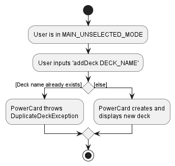
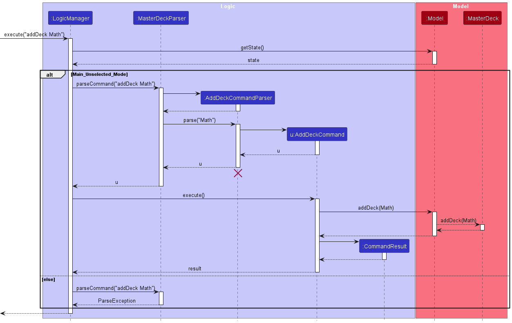
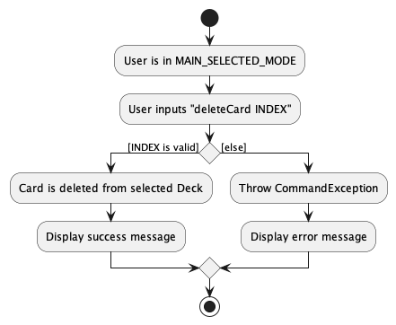
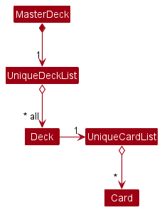

* Table of Contents
{:toc}

--------------------------------------------------------------------------------------------------------------------

## **Acknowledgements**

* Our application is based on the [AB3](https://se-education.org/addressbook-level3/) project created by the [SE-EDU initiative](https://se-education.org/)
* Our application makes use of [JavaFX](https://openjfx.io/) as the UI framework.

--------------------------------------------------------------------------------------------------------------------

## **Setting up, getting started**

Refer to the guide [_Setting up and getting started_](SettingUp.md).

--------------------------------------------------------------------------------------------------------------------

## **Design**

:bulb: **Tip:** The `.puml` files used to create diagrams in this document can be found in the [diagrams](https://github.com/AY2223S2-CS2103T-W11-3/tp/tree/master/docs/diagrams) folder. Refer to the [_PlantUML Tutorial_ at se-edu/guides](https://se-education.org/guides/tutorials/plantUml.html) to learn how to create and edit diagrams.

### Architecture

The ***Architecture Diagram*** given above explains the high-level design of the App.

Given below is a quick overview of main components and how they interact with each other.

**Main components of the architecture**

**`Main`** has two classes called [`Main`](https://github.com/AY2223S2-CS2103T-W11-3/tp/blob/master/src/main/java/seedu/address/Main.java) and [`MainApp`](https://github.com/AY2223S2-CS2103T-W11-3/tp/blob/master/src/main/java/seedu/address/MainApp.java). It is responsible for,
* At app launch: Initializes the components in the correct sequence, and connects them up with each other.
* At shut down: Shuts down the components and invokes cleanup methods where necessary.

[**`Commons`**](#common-classes) represents a collection of classes used by multiple other components.

The rest of the App consists of four components.

* [**`UI`**](#ui-component): The UI of the App.
* [**`Logic`**](#logic-component): The command executor.
* [**`Model`**](#model-component): Holds the data of the App in memory.
* [**`Storage`**](#storage-component): Reads data from, and writes data to, the hard disk.

**How the architecture components interact with each other**

The *Sequence Diagram* below shows how the components interact with each other for the scenario where the user issues the command `deleteCard 1`.

Each of the four main components (also shown in the diagram above),

* defines its *API* in an `interface` with the same name as the Component.
* implements its functionality using a concrete `{Component Name}Manager` class (which follows the corresponding API `interface` mentioned in the previous point.

For example, the `Logic` component defines its API in the `Logic.java` interface and implements its functionality using the `LogicManager.java` class which follows the `Logic` interface. Other components interact with a given component through its interface rather than the concrete class (reason: to prevent outside component's being coupled to the implementation of a component), as illustrated in the (partial) class diagram below.

The sections below give more details of each component.

### UI component

The **API** of this component is specified in [`Ui.java`](https://github.com/AY2223S2-CS2103T-W11-3/tp/blob/master/src/main/java/seedu/address/ui/Ui.java)

The UI consists of a `MainWindow` that is made up of parts e.g.`CommandBox`, `ResultDisplay`, `PersonListPanel`, `StatusBarFooter` etc. All these, including the `MainWindow`, inherit from the abstract `UiPart` class which captures the commonalities between classes that represent parts of the visible GUI.

The `UI` component uses the JavaFx UI framework. The layout of these UI parts are defined in matching `.fxml` files that are in the `src/main/resources/view` folder. For example, the layout of the [`MainWindow`](https://github.com/se-edu/addressbook-level3/tree/master/src/main/java/seedu/address/ui/MainWindow.java) is specified in [`MainWindow.fxml`](https://github.com/se-edu/addressbook-level3/tree/master/src/main/resources/view/MainWindow.fxml)

The `UI` component,

* executes user commands using the `Logic` component.
* listens for changes to `Model` data so that the UI can be updated with the modified data.
* keeps a reference to the `Logic` component, because the `UI` relies on the `Logic` to execute commands.
* depends on some classes in the `Model` component, as it displays `Card` object residing in the `Model`.

### Logic component

**API** : [`Logic.java`](https://github.com/AY2223S2-CS2103T-W11-3/tp/blob/master/src/main/java/seedu/address/logic/Logic.java)

Here's a (partial) class diagram of the `Logic` component:

How the `Logic` component works:
1. When `Logic` is called upon to execute a  command, it checks the current mode of the application (`MAIN_UNSELECTED`, `MAIN_SELECTED`, `REVIEW`) to determine which method within `MasterDeckParser` to call next.   
2. It then calls the appropriate parsing method within the `MasterDeckParser` class to parse the user command.
3. This results in a `Command` object (more precisely, an object of one of its subclasses e.g., `AddCardCommand`) which is executed by the `LogicManager`.
4. The command can communicate with the `Model` when it is executed (e.g. to add a card).
5. The result of the command execution is encapsulated as a `CommandResult` object which is returned back from `Logic`.

The Sequence Diagram below illustrates the interactions within the `Logic` component for the `execute("deleteCard 1")` API call.

:information_source: **Note:** The lifeline for `DeleteCardCommandParser` should end at the destroy marker (X) but due to a limitation of PlantUML, the lifeline reaches the end of diagram.

Here are the other classes in `Logic` (omitted from the class diagram above) that are used for parsing a user command:

How the parsing works:
* When called upon to parse a user command, the `MasterDeckParser` class parse the command differently based on the current mode (`MAIN_UNSELECTED`, `MAIN_SELECTED`, `REVIEW`) of the application and creates an `XYZCommandParser` (`XYZ` is a placeholder for the specific command name e.g., `AddCardCommandParser`) which uses the other classes shown above to parse the user command and create a `XYZCommand` object (e.g., `AddCardCommand`) which the `MasterDeckParser` returns back as a `Command` object.
* All `XYZCommandParser` classes (e.g., `AddCardCommandParser`, `DeleteCardCommandParser`, ...) inherit from the `Parser` interface so that they can be treated similarly where possible e.g, during testing.

### Model component

**API** : [`Model.java`](https://github.com/se-edu/addressbook-level3/tree/master/src/main/java/seedu/address/model/Model.java)

The `Model` component,

* stores the master deck data i.e., all `Card` objects (which are contained in a `UniqueCardList` object) and all `Deck` objects (which are contained in a `UniqueDeckList` object).
* stores the currently 'selected' `Card` objects (e.g., results of a selecting a deck) as a separate _filtered_ list which is exposed to outsiders as an unmodifiable `ObservableList<Card>` that can be 'observed' e.g. the UI can be bound to this list so that the UI automatically updates when the data in the list change.
* stores the currently 'selected' `Deck` objects (e.g., results of a deck search query) as a separate _filtered_ list which is exposed to outsiders as an unmodifiable `ObservableList<Deck>` that can be 'observed' e.g. the UI can be bound to this list so that the UI automatically updates when the data in the list change.
* stores a `UserPref` object that represents the user’s preferences. This is exposed to the outside as a `ReadOnlyUserPref` objects.
* stores an optional `Review` object, which handles the cards being reviewed by the user. Refer [below](#Review) for more details. 
* does not depend on any of the other three components (as the `Model` represents data entities of the domain, they should make sense on their own without depending on other components)

Each `Card` object,
* stores one `Question`, one `Answer`, one `Deck` which the `Card` object references from the `Deck` list, and one optional difficulty `Tag`.
* belongs to the `Deck` it references.

##### Review 

The `Review`
* stores a `Deck` currently being reviewed.
* stores a `UniqueCardList` instance which stores all the `Card` instances belonging to the `Deck` being reviewed.
* stores the 'current' `Card` object (the current card being displayed in the review) in a separate filtered list which is exposed to outsiders as an unmodifiable `ObservableList<Card>` that can be ‘observed’.
  * The UI can be bound to this list so that the UI automatically updates when the `Card` in the list changes.
  * The list is always filtered to contain one `Card` at any time.

### Storage component

**API** : [`Storage.java`](https://github.com/AY2223S2-CS2103T-W11-3/tp/blob/master/src/main/java/seedu/address/storage/Storage.java)

The `Storage` component,
* can save both master deck data and user preference data in json format, and read them back into corresponding objects.
* inherits from both `MasterDeckStorage` and `UserPrefStorage`, which means it can be treated as either one (if only the functionality of only one is needed).
* depends on some classes in the `Model` component (because the `Storage` component's job is to save/retrieve objects that belong to the `Model`)

### Common classes

Classes used by multiple components are in the `seedu.addressbook.commons` package.

--------------------------------------------------------------------------------------------------------------------

## **Implementation**

This section describes some noteworthy details on how certain features are implemented.

### Command Validity Based on Application Mode
The activity diagram below illustrates what happens when a user enters a command.

:information_source: **Note:** It's important to note that the validity of a user's command is not solely determined by the user's input, but also by the **current mode of the application**.

Our application has three modes: `MAIN_UNSELECTED_MODE`, `MAIN_SELECTED_MODE`, and `REVIEW_MODE`, each with its own set of exclusive commands. 
To enforce this, the `LogicManager` class checks the current mode of the user and **enables/disables** certain commands as necessary.

- #### When the user is in `MAIN_UNSELECTED_MODE`:
    - This mode primarily handles **deck-related** commands, such as `AddDeckCommand` and `FindDecksCommand`.
    - No deck is selected in this mode, so card-related and review-related commands are disabled.
- #### When the user is in `MAIN_SELECTED_MODE`:
    - This mode primarily handles **card-related** commands, such as `AddCardCommand` and `FindCardsCommand`.
    - A deck is selected in this mode, so deck-related commands, such as `AddDeckCommand`, are disabled.
    - Review-related commands are also disabled, as there is no ongoing review.
- #### When the user is in `REVIEW_MODE`:
    - This mode primarily handles **review-related** commands, such as `FlipCardCommand` and `NextCardCommand`.
    - A review is ongoing in this mode, so deck-related and card-related commands are disabled.

### Implementation of `MAIN_UNSELECTED_MODE` Features

Commands in the `MAIN_UNSELECTED_MODE` that are implemented for when a **deck is not selected** behave similarly as the example below: 

List of decks and list of cards are stored separately in `UniqueDeckList` and `UniqueCardList`. Although a card belongs to a deck, it is not stored within a deck. Each card indicates a deck that it belongs to itself.

Commands in the Main Mode that are implemented for **when a deck is not selected** behave similarly as the example below: 

#### addDeck Feature

`MasterDeck` extends `ReadOnlyMasterDeck`, which stores a reference to `UniqueDeckList`. It implements following operation:
- `MasterDeck#addDeck()` - Add a new deck to the list.

This operation is exposed in the Model interface as `Model#addDeck()`. It is supported by the dependence of the model interface on `MasterDeck#addDeck()`.

Given below is an example usage scenario and how the `addDeck()` mechanism behaves at each step.

Step 1. The user launches the application for the first time. The `MasterDeck` will be initialized with the default MasterDeck state.

Step 2. The user executes `addDeck Math` command to add a new deck. The `addDeck` command calls `Model#addDeck()`, which executes adding a new deck feature.

Step 3. A new deck is now added on the list and able to execute further functionalities.

:information_source: **Note:** In case of a duplicate deck name, an exception will be thrown and the newly created deck will not be saved in the `MasterDeck`. However, naming a deck is case-sensitive. For example, user cannot create two Math decks but it is allowed to create Math deck and math deck. 

The following activity diagram summarizes what happens when a user executes addDeck command:

The following sequence diagram shows how the addDeck operation works:

### Implementation of `MAIN_SELECTED_MODE` Features

Commands in the `MAIN_SELECTED_MODE` behave similarly as the example of `deleteCard` below:

:information_source: **Note:** 
The primary distinction between the features found in MAIN_SELECTED_MODE and MAIN_UNSELECTED_MODE is that the former requires the selection of a deck.

#### deleteCard Feature

The `deleteCard INDEX` feature allows users to delete specific card from their selected deck.
Given below is an example usage scenario and how the `deleteCard()` mechanism behaves at each step.

Step 1. The user has a **deck selected** and keys in `deleteCard INDEX` to delete card at the specified index. If the index is invalid, an error will be thrown.

Step 2. The card is now deleted from the deck.

The following activity diagram summarizes the action taken when `deleteCard` is executed:

### Implementation of Review Mode Features
A `Review` object is stored within the `Model` and represents the current review. 
- If the current review object is `null`, it indicates that there is currently no ongoing review, thus the application in the Main mode.
- To construct a `Review` object, the `Model` will pass in a list of cards to be reviewed (as filtered by `CardInDeckPredicate` and `CardHasTagPredicate`), the `Deck` to be reviewed and an integer representing the review limit set by user if any. 

Within the `Review` object, the list of cards to be reviewed are stored in a `UniqueCardList`.
- Note that this list of cards are not the same card objects as those in the `MasterDeck` and hence any changes to be made on a card during review will need to be made on the equivalent cards in both the `MasterDeck` and the current review's `UniqueCardList`. 
- The `UniqueCardList` is used to construct the `ObservableList` and `FilteredList` of cards which is passed upwards to the UI to display the current card under review. 

Each time a `Review` object is constructed, a list of integers representing a shuffled order of indices of the cards is created.
- A pointer representing the current card index is used to iterate across this list of shuffled indices to get the current card under review from the `UniqueCardList`.
- The pointer is incremented when the user moves on to the next card and decremented when the user moves back to the previous card

Within the `Review` object, there is an `ObservableList` of a `Pair` of strings representing the following statistics of the current review: deck name, current card number, current tag count for each difficulty and the navigation guide. 
- The statistics are displayed on the left panel during the review mode.
- In a `Pair` of strings, the first string represents the title of the statistic while the second contains information about that respective statistic. (e.g. String 1: "Deck Name", String 2: "Chemistry")
- These statistics are constantly updated whenever a command executed (e.g. tag current card with new difficulty) changes any of the above statistics of the review.

#### nextCard Feature
`Review#goToNextCard()` is the operation that allows the user to move to the next card during a review.

This operation is exposed in the Model interface as `Model#goToNextCard()`.

Given below is an example usage scenario and how the `goToNextCard()` mechanism behaves at each step.

Step 1. The user starts a review. A `Review` object is created within the `Model` class. The current mode of the application is changed to `REVIEW_MODE`.

Step 2. The user reviews the first card by testing their knowledge on the question, flipping the card to see the answer, then tagging the appropriate difficulty of the card.

Step 3. The user moves on to the next card by executing `]` in the command line interface. `]` is the command word for the `NextCardCommand`.

The following activity diagram summarizes what happens when a user executes `NextCard` command:

### Implementation of MasterDeck

The `MasterDeck` class contains all data regarding the `Deck` and `Card` the users have created. 
Below are the current implementation we chose for `MasterDeck` and the possible alternative designs that we will explore in the future.

#### Current Implementation

MasterDeck stores 2 independent lists, a `UniqueCardList` storing all existing unique cards and a `UniqueDeckList` storing all existing unique decks.

Each `Card` instance references an existing instance of `Deck`. This reference denotes that the card belongs to a specific deck.

Below is an object diagram representing an example instance of `MasterDeck` under the current implementation.

Why we chose this design:
- Ease of implementation: The deck behaves similarly to a tag whose purpose is to group the cards together. This allows us to take reference from the source code of the `Tag` class from the AddressBook3 (AB3). 
- Single Responsibility Principle: The `UniqueDeckList` class's sole responsibility is to store and modify the user-created decks. If we store a `UniqueCardList` inside each deck (similar to the alternative design below), the `UniqueDeckList` has to be responsible for managing the cards inside each deck as well. This can potentially violate Single Responsibility Principle (SRP). 

Limitation:
- Worse time complexity: Some commands (e.g., `selectDeck`) require the whole card list to be filtered to show only the cards in a specific deck. This incurs a worse runtime complexity, as performance degrades when the size of the card list grows.

#### Alternative Designs

A more intuitive design for `MasterDeck` is given below.

- The `MasterDeck` has a `UniqueDeckList` which stores unique instances of decks. 
- Each deck in turn stores a reference to a `UniqueCardList`.
- Each `UniqueCardList` stores a list of unique instances of cards inside a specific deck.

Pros:
- This design follows Object-Oriented Programming (OOP) more closely, as a deck is supposed to contain a list of cards in the real world.
- Time complexity is improved for some commands (e.g., `selectDeck` retrieves cards from a deck much faster, as it does not require filtering every single existing card like our current implementation).

Cons:
- Requires a complete overhaul of the code base and test cases, which may not be practical considering our limited development time.

While the alternative design seems more appropriate than our current design, we deem it less feasible to implement due to our project's time constraint. Furthermore, the performance difference is negligible as our average user does not have enough flashcards to cause noticeable performance degradation. Nevertheless, we intend to prioritize the implementation of the alternative design in future iterations, as time and resources permit.

--------------------------------------------------------------------------------------------------------------------

## **Documentation, logging, testing, configuration, dev-ops**

* [Documentation guide](Documentation.md)
* [Testing guide](Testing.md)
* [Logging guide](Logging.md)
* [Configuration guide](Configuration.md)
* [DevOps guide](DevOps.md)

--------------------------------------------------------------------------------------------------------------------

## **Appendix: Requirements**

### Product scope

**Target user profile**:

* Needs to study a group of terms and definitions efficiently
* prefer desktop apps over other types
* can type fast
* prefers typing to mouse interactions
* is reasonably comfortable using CLI apps

**Value proposition**: study various topics using flashcards on the computer

### User stories

Priorities: High (must have) - `* * *`, Medium (nice to have) - `* *`, Low (unlikely to have) - `*`

| Priority | As a …​  | I want to …​                                                                               | So that I can…​                                        |
|----------|----------|--------------------------------------------------------------------------------------------|--------------------------------------------------------|
| `* * *`  | new user | see usage instructions                                                                     | refer to instructions when I forget how to use the App |
| `Epic`   | user     | **manage PowerCards**                                                                      ||
| `* * *`  | user     | create a new PowerCard with a question and answer pair                                     ||
| `* *`    | user     | search for PowerCards using keywords in the questions                                      ||
| `* *`    | user     | rewrite the question or the answer in the PowerCard                                        ||
| `Epic`   | user     | **group PowerCards into decks of the same topic**                                          ||
| `* * *`  | user     | set the name of a masterDeck                                                               ||
| `* * *`  | user     | list all decks I have created                                                              ||
| `* * *`  | user     | list all the PowerCards in a masterDeck                                                    ||
| `* * *`  | user     | add PowerCards in a masterDeck                                                             ||
| `* * *`  | user     | remove PowerCards in a masterDeck                                                          ||
| `* *`    | user     | rename a masterDeck                                                                        ||
| `* *`    | user     | delete a masterDeck                                                                        ||
| `* *`    | user     | add the description of each masterDeck                                                     | I can check later what this masterDeck is about.       |
| `Epic`   | user     | **review decks of PowerCards**                                                             ||
| `* * *`  | user     | review a single masterDeck of PowerCards                                                   | I can test my knowledge of the topic                   |
| `* * *`  | user     | mark a flash card to be correct / wrong during review                                      ||
| `* *`    | user     | review multiple decks of PowerCards                                                        | I can test my knowledge of multiple topics             |
| `* *`    | user     | see how many PowerCards I have left to review in one masterDeck                            ||
| `Epic`   | user     | **keep track of how effective my learning has been**                                       ||
| `* *`    | user     | record the number of questions I got right                                                 | I can see my progress                                  |
| `* *`    | user     | see which are the PowerCards I struggle with / succeed at                                  ||
| `*`      | user     | see which topics (decks) I am stronger / weaker in                                         ||
| `*`      | user     | see how many times I have reviewed a PowerCard or masterDeck                               ||
| `*`      | user     | see how long I spent on each question during review                                        ||
| `*`      | user     | revise PowerCards that I got wrong for                                                     | I can see what I’m weak at                             |
| `* *`    | user     | reset the statistics                                                                       ||
| `Epic`   | user     | **share and receive decks from my friends**                                                ||
| `* * *`  | user     | import decks from other users.                                                             ||
| `* * *`  | user     | export decks for other users.                                                              ||
| `Epic`   | user     | **undo and redo changes I make**                                                           ||
| `*`      | user     | retrieve a masterDeck or flash card should I accidentally delete a PowerCard or masterDeck ||
| `*`      | user     | redo changes that I had undone.                                                            ||
| `Epic`   | user     | **adjust the frequency of certain PowerCards appearing based on my input**                 ||
| `* *`    | user     | tag PowerCards that are hard                                                               | they will appear more frequently                       |
| `* *`    | user     | tag PowerCards that are easy                                                               | they will appear less frequently                       |

### Use cases

For all use cases below, the **System** is the `Powercard` and the **Actor** is the `user`, unless specified otherwise.

**Use case: UC1 - Add a powerdeck**

**MSS:**

1. User requests to create a new deck with a specified name.
2. System creates a new deck with the given name.   

   Use case ends.

**Use case: UC2 - Select a powerdeck**

**MSS:**
1. User chooses a deck to add powercard to.
2. System enters the chosen deck and shows cards in that deck.

   Use case ends.

**Use case: UC - Add a powercard**

**MSS:**
1. User <u>selects a powerdeck (UC2)</u> to add powercard to.
2. User enters the question and answer details for the card.
3. System adds the card to the chosen deck.

   Steps 3-4 are repeated for as many times as required until the User finishes adding more cards to the deck.
   
   Use case ends.

**Use case: UC - Delete a powercard**

**MSS:**

1. User <u>selects a powerdeck (UC2)</u> to delete powercard from.
2. User requests to delete a specific powercard in the deck.
3. System deletes the powercard.  

  Use case ends.

**Extensions:**

* 2a. The list is empty.  
       
  Use case ends.

* 3a1. System shows an error message.  

  Use case resumes at step 2.

**Use case: UC - Find a powercard**

**MSS:**

1. User requests to find powercards containing a certain string in the question.
2. System shows a list of cards matching the query.

   Use case ends.

**Extensions:**

* 2a. There are no powercards the match the query.    
  
  Use case ends.

**Use case: UC - Review  a deck**

**MSS:**

1. User requests to review a particular deck
2. Application shows a random, non-repeating card in the deck
3. User attempts to answer the question in the card.
4. Application reveals the answer to the powercard.
5. User self-grades question as easy/medium/difficult.  
   Repeat step 2-5 until all powercards in deck have been exhausted.

   Use case ends.

**Extensions:**

* 1a. There are no decks with the name requested by the user.  
  Use case ends.

* *a. User decides to end the review early.  
  * *a1. User requests to end the review session.  
  * *a2. Powercard ends the session and brings the user back to the area before the review started.  
    Use case ends.

### Non-Functional Requirements

1. Should work on any _mainstream OS_ as long as it has Java `11` or above installed.
2. Should be able to hold up to 1000 Powercards without a noticeable sluggishness in performance for typical usage.
3. A Powercard should load when prompted without any noticeable lag
4. Every command should provide a response within 2 seconds
5. The Powercard program is not expected to determine the correctness of the user’s response
6. A Powercard should be easily added/deleted in less than 3 commands after opening the program
7. The data stored by Powercard should be forward compatible such that old data can still be loaded in newer versions of the program
8. The maximum character limit of a powercard text should be [TO BE DETERMINED]
*{More to be added}*

### Glossary

* **Mainstream OS**: Windows, Linux, Unix, OS-X
* **Deck**: A group of PowerCards (flashcards) of a specific topic
*{More to be added}*

--------------------------------------------------------------------------------------------------------------------

## **Appendix: Instructions for manual testing**

Given below are instructions to test the app manually.

:information_source: **Note:** These instructions only provide a starting point for testers to work on;
testers are expected to do more *exploratory* testing.

### Launch and shutdown

1. Initial launch

   1. Download the jar file and copy into an empty folder

   2. Double-click the jar file Expected: Shows the GUI with a set of sample contacts. The window size may not be optimum.

2. Saving window preferences

   1. Resize the window to an optimum size. Move the window to a different location. Close the window.

   2. Re-launch the app by double-clicking the jar file. 
       Expected: The most recent window size and location is retained.

3. _{ more test cases …​ }_

### Deleting a card

1. Deleting a card while all cards are being shown

   1. Prerequisites: List all cards using the `list` command. Multiple cards in the list.

   2. Test case: `delete 1` 
      Expected: First contact is deleted from the list. Details of the deleted contact shown in the status message. Timestamp in the status bar is updated.

   3. Test case: `delete 0` 
      Expected: No card is deleted. Error details shown in the status message. Status bar remains the same.

   4. Other incorrect delete commands to try: `delete`, `delete x`, `...` (where x is larger than the list size) 
      Expected: Similar to previous.

2. _{ more test cases …​ }_

### Saving data

1. Dealing with missing/corrupted data files

   1. _{explain how to simulate a missing/corrupted file, and the expected behavior}_

2. _{ more test cases …​ }_

### Appendix: Planned Enhancement
In order to counter known feature flaws from testing, the following are enhancements to be implemented in future.
**1. Making the command box scrollable**
- Currently, the command box is not scrollable - when the user types into the command box, the content does not wrap.
- Users are likely to type long questions and answers hence it would be more convenient if the command box was scrollable.
- We plan to make content in the command box wrap and the command box itself scrollable.

#### Figure 1.1 Current: Non Scrollable Command Box

#### Figure 1.2 Planned Enhancement: Scrollable Command Box

**2. Review by untagged cards**
- Currently, a user can only review all cards or cards that are specifically tagged with a difficulty.
- However, a user may want to review only untagged cards (which they have yet to review).
- Hence, the `review` command should support a flag `-u` where untagged cards will be reviewed.

**3. Enable removing of tags**
- Currently, if a user intends to remove a tag from a card, they need to delete the card and create a new card without a tag.
- Hence, it would be more convenient if the user is able to untag a card directly from the edit command.
- Example: `editCard 2 t\` would untag card with displayed index 2.
- Additionally, a user may want to clear all tags of a deck before sharing with others.
- Hence, it would be more convenient if there is a `clearTags` command to untag all cards in a deck
- Example: `clearTags`

**4. Setting minimum width for components**
- Currently, the size of the GUI panels can be shrunk by the user to a large extent as seen in figure 4 below such that the app is messy and essentially unusable.
- Hence, we intend to fix it by setting a minimum width for each component.
#### Figure 4.1 Current: Unusable GUI when shrunk by a large extent
- 

#### Figure 4.2 Planned Enhancement: GUI with minimum width
- 
