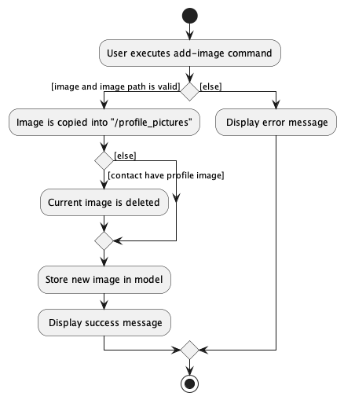

**Target user profile**:

University students who need to keep track of their contacts from different classes/ccas/clubs etc.

**Value proposition**:

Students often take many classes and meet different people. This application helps them to organise their
contacts list for an easier way to set up proper communication channels. This makes it easier for students to form
connections with their peers during their time in University.

**User stories**:
1. As a student, I can find all relevant university contacts/POCs for various purposes
2. As a student, I can delete the image for a person on my contact list
3. As a forgetful student, I can see who a person on my contact list looks like
4. As a user, I can add a contact so that I can keep track of my contacts.
5. As a user, I can view all contacts so that I can have an accessible list of contacts.
6. As a user, I can delete a contact so that I can remove unneeded and/or incorrect contacts.
7. As a student, I can to find other students in my classes that have been added as a contact so that I can ask them for help

**Use cases**:

System: BookFace

Use case: UC1 - Add Contact

Actor: User

MSS:
1. User chooses to add a contact.
2. User enters contact's details.
3. New user's contact's details are added to BookFace.
Use case ends.

Extensions:

2a. BookFace detects incomplete/invalid details entered.
BookFace displays an example of valid details.
System repeats Step 1-2 until valid details are entered.

Use case: UC2 - Delete Contact

Actor: User

MSS:
1. User chooses to delete a contact.
2. User enters contact's index.
3. Contact is deleted from BookFace.
Use case ends.

Extensions:

2a. BookFace detects incomplete/invalid index entered.
BookFace displays an example of a valid index.
System repeats Step 1-2 until valid information is entered.

Use case: UC3 - Edit Contact

Actor: User

MSS:
1. User chooses to edit a contact.
2. User enters contact's new details.
3. Contact is edited in BookFace.
Use case ends.

Extensions:

2a. BookFace detects incomplete/invalid details entered.
BookFace displays an example of valid details.
System repeats Step 1-2 until valid details are entered.

Use case: UC4 - Find Contact

Actor: User

MSS:
1. User chooses to find a contact.
2. User enters contact's name.
3. BookFace displays the matching contacts.
   Use case ends.

Extensions:

2a. BookFace detects no name entered.
BookFace displays an example of a valid name.
System repeats Step 1-2 until a name is entered.

Use case: UC5 - List Contacts

Actor: User

MSS:
1. User chooses to view all contacts.
2. BookFace displays all the user's contacts.
   Use case ends.

Use case: UC6 - Get Help on Commands

Actor: User

MSS:
1. User chooses to view instructions on how to use BookFace.
2. BookFace displays a url to its User Guide.
   Use case ends.

Use case: UC7 - Add Image for a Contact
Actor: User
MSS:
1. User chooses to add an image for a contact.
2. User enters contact index and image file path.
3. Image is added for contact.
   Use case ends.

Extensions:

2a. BookFace detects invalid/incomplete filepath or index.
BookFace displays an example of a valid filepath and index.
System repeats Step 1-2 until valid information is entered.

Use case: UC8 - Delete Image for a Contact

Actor: User

MSS:
1. User chooses to delete an image for a contact.
2. User enters contact index.
3. Image is deleted for contact.
   Use case ends.

Extensions:

2a. BookFace detects incomplete/invalid index entered.
BookFace displays an example of a valid index.
System repeats Step 1-2 until valid information is entered.

2b. BookFace detects that the contact does not have an image added.
Use case ends.

Use case: UC9 - Import Contacts from a Faculty

Actor: User

MSS:
1. User chooses to import contacts for a faculty.
2. User enters faculty name.
3. New contacts' details are added to BookFace.
   Use case ends.

Extensions:

2a. BookFace detects incomplete/invalid details entered.
BookFace displays an example of valid details.
System repeats Step 1-2 until valid details are entered.

**Glossary** :
* Student: A user who belongs to a faculty and attends one or more classes with other students
* Tutor: A user who tutors students in one or more classes
* Faculty: a group of university departments concerned with a major division of knowledge
* Contact: A person of interest, either student or tutor, who's details have been recorded by the user

# Implementation
## Add Image Feature
### Add Image Implementation

The add-image mechanism is facilitated by `AddImageCommand`, `AddImageCommandParser` and `ImageUtil` class.

- `AddImageCommand` extends `Command`
- `AddImageCommandParser` extends `Parser`

The `AddImageCommandParser` parses the user input into index of contact and path to an image. 
It returns a `AddImageCommand` with the 2 information retrieved. 
`AddImageCommand#execute` copies the image provided by the user via a path and replaces the current image with the new one. 
It also saves the file name of the new image to the `model`.

Given below is an example usage scenario and how the add-image mechanism behaves at each step.

Step 1. When user wants to add an image to a contact, they use the `add-image` command.

Step 2. The `LogicManger` receives the command text from the user input and gives it to `AddressBookParser`. `AddressBookParser` calls `AddImageCommandParser` to parse the user input.

Step 3. The `AddImageCommandParser` retrieves the contact index as well as the image path and creates a `AddImageCommand`

Step 4. `AddImageCommand#execute` is called. The method calls `ImageUtil#importImage` to copy the image into the "profile_pictures/" directory. 
Once that is successful, `AddImageCommand#execute` proceeds to call `ImageUtil#deleteImage` to remove the current image. 
Finally `AddImageCommand#execute` updates the model provided in the arguments.

> **Note**: If the path given is invalid or if the file at the given path is not a png/jpeg image, the command will not be completed.

The following sequence diagram shows how the add-image operation works: 

The following activity diagram summarizes what happens when a user executes add-image command:  

### Design considerations:

- Alternative 1 (current choice): Copy the image into application-created directory
   - Pros:
      - A single location to store/check for images
      - Naming scheme determined by application
   - Cons:
      - Copying is a file I/O which have many caveats
- Alternative 2: Save the path provided by User
   - Pros:
      - Does not require any file I/O
      - Easy to save as only the Path as a string
   - Cons:
      - Path is easily invalidated (e.g. user moves/deletes/renames the image)
