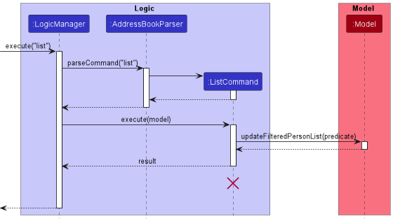

- Table of Contents
  {:toc}

---

## Acknowledgements

- {list here sources of all reused/adapted ideas, code, documentation, and third-party libraries -- include links to the original source as well}

---

## Setting up, getting started

Refer to the guide [_Setting up and getting started_](SettingUp.md).

---

## **Design**

:bulb: **Tip:** The `.puml` files used to create diagrams in this document can be found in the [diagrams](https://github.com/se-edu/addressbook-level3/tree/master/docs/diagrams/) folder. Refer to the [_PlantUML Tutorial_ at se-edu/guides](https://se-education.org/guides/tutorials/plantUml.html) to learn how to create and edit diagrams.

### Architecture

The **_Architecture Diagram_** given above explains the high-level design of the App.

Given below is a quick overview of main components and how they interact with each other.

**Main components of the architecture**

**`Main`** has two classes called [`Main`](https://github.com/se-edu/addressbook-level3/tree/master/src/main/java/seedu/address/Main.java) and [`MainApp`](https://github.com/se-edu/addressbook-level3/tree/master/src/main/java/seedu/address/MainApp.java). It is responsible for,

- At app launch: Initializes the components in the correct sequence, and connects them up with each other.
- At shut down: Shuts down the components and invokes cleanup methods where necessary.

[**`Commons`**](#common-classes) represents a collection of classes used by multiple other components.

The rest of the App consists of four components.

- [**`UI`**](#ui-component): The UI of the App.
- [**`Logic`**](#logic-component): The command executor.
- [**`Model`**](#model-component): Holds the data of the App in memory.
- [**`Storage`**](#storage-component): Reads data from, and writes data to, the hard disk.

**How the architecture components interact with each other**

The _Sequence Diagram_ below shows how the components interact with each other for the scenario where the user issues the command `delete 1`.

Each of the four main components (also shown in the diagram above),

- defines its _API_ in an `interface` with the same name as the Component.
- implements its functionality using a concrete `{Component Name}Manager` class (which follows the corresponding API `interface` mentioned in the previous point.

For example, the `Logic` component defines its API in the `Logic.java` interface and implements its functionality using the `LogicManager.java` class which follows the `Logic` interface. Other components interact with a given component through its interface rather than the concrete class (reason: to prevent outside component's being coupled to the implementation of a component), as illustrated in the (partial) class diagram below.

The sections below give more details of each component.

### UI component

The **API** of this component is specified in [`Ui.java`](https://github.com/se-edu/addressbook-level3/tree/master/src/main/java/seedu/address/ui/Ui.java)

The UI consists of a `MainWindow` that is made up of parts e.g.`CommandBox`, `ResultDisplay`, `PersonListPanel`, `StatusBarFooter` etc. All these, including the `MainWindow`, inherit from the abstract `UiPart` class which captures the commonalities between classes that represent parts of the visible GUI.

The `UI` component uses the JavaFx UI framework. The layout of these UI parts are defined in matching `.fxml` files that are in the `src/main/resources/view` folder. For example, the layout of the [`MainWindow`](https://github.com/se-edu/addressbook-level3/tree/master/src/main/java/seedu/address/ui/MainWindow.java) is specified in [`MainWindow.fxml`](https://github.com/se-edu/addressbook-level3/tree/master/src/main/resources/view/MainWindow.fxml)

The `UI` component,

- executes user commands using the `Logic` component.
- listens for changes to `Model` data so that the UI can be updated with the modified data.
- keeps a reference to the `Logic` component, because the `UI` relies on the `Logic` to execute commands.
- depends on some classes in the `Model` component, as it displays `Person` object residing in the `Model`.

### Logic component

**API** : [`Logic.java`](https://github.com/se-edu/addressbook-level3/tree/master/src/main/java/seedu/address/logic/Logic.java)

Here's a (partial) class diagram of the `Logic` component:

How the `Logic` component works:

1. When `Logic` is called upon to execute a command, it uses the `AddressBookParser` class to parse the user command.
1. This results in a `Command` object (more precisely, an object of one of its subclasses e.g., `AddCommand`) which is executed by the `LogicManager`.
1. The command can communicate with the `Model` when it is executed (e.g. to add a person).
1. The result of the command execution is encapsulated as a `CommandResult` object which is returned back from `Logic`.

The Sequence Diagram below illustrates the interactions within the `Logic` component for the `execute("delete 1")` API call.

:information_source: **Note:** The lifeline for `DeleteCommandParser` should end at the destroy marker (X) but due to a limitation of PlantUML, the lifeline reaches the end of diagram.

Here are the other classes in `Logic` (omitted from the class diagram above) that are used for parsing a user command:

How the parsing works:

- When called upon to parse a user command, the `AddressBookParser` class creates an `XYZCommandParser` (`XYZ` is a placeholder for the specific command name e.g., `AddCommandParser`) which uses the other classes shown above to parse the user command and create a `XYZCommand` object (e.g., `AddCommand`) which the `AddressBookParser` returns back as a `Command` object.
- All `XYZCommandParser` classes (e.g., `AddCommandParser`, `DeleteCommandParser`, ...) inherit from the `Parser` interface so that they can be treated similarly where possible e.g, during testing.

### Model component

**API** : [`Model.java`](https://github.com/se-edu/addressbook-level3/tree/master/src/main/java/seedu/address/model/Model.java)

The `Model` component,

- stores the address book data i.e., all `Person` objects (which are contained in a `UniquePersonList` object).
- stores the currently 'selected' `Person` objects (e.g., results of a search query) as a separate _filtered_ list which is exposed to outsiders as an unmodifiable `ObservableList<Person>` that can be 'observed' e.g. the UI can be bound to this list so that the UI automatically updates when the data in the list change.
- stores a `UserPref` object that represents the user’s preferences. This is exposed to the outside as a `ReadOnlyUserPref` objects.
- does not depend on any of the other three components (as the `Model` represents data entities of the domain, they should make sense on their own without depending on other components)

:information_source: **Note:** An alternative (arguably, a more OOP) model is given below. It has a `Tag` list in the `AddressBook`, which `Person` references. This allows `AddressBook` to only require one `Tag` object per unique tag, instead of each `Person` needing their own `Tag` objects. 

### Storage component

**API** : [`Storage.java`](https://github.com/se-edu/addressbook-level3/tree/master/src/main/java/seedu/address/storage/Storage.java)

The `Storage` component,

- can save both address book data and user preference data in json format, and read them back into corresponding objects.
- inherits from both `AddressBookStorage` and `UserPrefStorage`, which means it can be treated as either one (if only the functionality of only one is needed).
- depends on some classes in the `Model` component (because the `Storage` component's job is to save/retrieve objects that belong to the `Model`)

### Common classes

Classes used by multiple components are in the `seedu.addressbook.commons` package.

---

## **Implementation**

This section describes some noteworthy details on how certain features are implemented.

### Add module, lecture, and video feature

The `add` command supports:

- Adding a module to the tracker
- Adding a lecture to a module in the tracker
- Adding a video to a lecture which belongs to a module in the tracker

It's behaviour is dependent on the arguments provided by the user.

The feature utilises the following classes:

- `AddCommandParser` – Creates the appropriate `AddCommand` subclass object base on the user's input
- `AddCommand` – Base class of any `Command` subclass that adds some entity to the tracker
- `AddModuleCommand` – Subclass of `AddCommand` which handles adding a module to the tracker
- `AddLectureCommand` – Subclass of `AddCommand` which handles adding a lecture to a module
- `AddVideoCommand` – Subclass of `AddCommand` which handles adding a video to a lecture

The following sequence diagram depicts an `add` command execution for adding a module to the tracker.

The following is a description of the code execution flow:

1. `AddCommandParser#parse(String)` takes the user's input as an argument and determines the intent of the command as well as the appropriate subclass of `AddCommand` to create an object for. The following table describes how the intent is determined base on the arguments provided in the user's input. Any combination of inputs that do not comply with the combination of arguments specified in the table is considered an error and will result in a `ParseException` being thrown and the command will not be executed.

   | Has preamble | Has `/mod` argument | Has `/lec` argument | Intent      | `AddCommand` subclass |
   | ------------ | ------------------- | ------------------- | ----------- | --------------------- |
   | Yes          | No                  | No                  | Add module  | `AddModuleCommand`    |
   | Yes          | Yes                 | No                  | Add lecture | `AddLectureCommand`   |
   | Yes          | Yes                 | Yes                 | Add video   | `AddVideoCommand`     |

2. The argument values are then checked for their validity by using the appropriate methods in `ParserUtil`. If any of the values are invalid, a `ParserException` will be thrown and the command will not be executed.

3. The appropriate `AddCommand` subclass object is created and then returned to the caller.

4. `LogicManager` calls the `Command#execute(Model)` method of the `Command` object returned by `AddCommandParser#parse(String)`. During execution of the command, a `CommandException` can be thrown for the following scenarios:

   - The `Module`, `Lecture`, or `Video` being added already exist
   - The `Module` which a `Lecture` is being added to does not exist
   - The `Module` which a `Lecture` is specified to be in does not exist
   - The `Lecture` which a `Video` is being added to does not exist

5. If no errors occur (no exceptions are thrown), the command succeeds in adding the module/lecture/video to the tracker.

### Delete module, lecture, and video feature

The `delete` command supports:

- Deleting a single specified module.
- Deleting a single specified lecture under a specified module context.
- Deleting a single specified video under a specified module and specified lecture context.
- Deleting multiple specified modules / lectures / videos under the respective specified contexts mentioned in the above points.
  - E.g.: User wishes to delete a module CS2040S.\
     Executing `delete CS2040S` would allow the user to do so, unless the module does not exist, in which case, Le Tracker will throw an error.
  - E.g.: User wishes to delete multiple modules CS2107, ST2334 AND CS3230\
     Executing `delete CS2107, ST2334, CS3230` will allow the user to do so. If either module does not exist, nothing is deleted and Le Tracker will throw an error.

This feature's behaviour is dependent on the arguments provided by the user, as well as by the state of Le Tracker.

**Implementation Details**

The feature utilises the following classes:

- `DeleteCommandParser`: parses the arguments appropriately for the appropriate `DeleteCommand` to be returned to be executed
- `DeleteCommand`: Abstract class extending from `Commands` for commands that delete a specified entity from the tracker
- `DeleteModuleCommand`: Subclass of `DeleteCommand` which handles the deletion a module from the tracker
- `DeleteLectureCommand`: Subclass of `DeleteCommand` which handles the deletion a lecture from a module in the tracker
- `DeleteVideoCommand`: Subclass of `DeleteCommand` which handles the deletion a video from a lecture from a module in the tracker.
- `DeleteMultipleCommand`: Abstract class extending from `DeleteCommand` for delete commands that delete multiple specified entities from the tracker
- `DeleteMultipleModulesCommand`: Subclass of `DeleteMultipleCommand` which handles the deletion of multiple modules from the tracker
- `DeleteMultipleLecturesCommand`: Subclass of `DeleteMultipleCommand` which handles the deletion of multiple lectures from the same module in the tracker
- `DeleteMultipleVideosCommand`: Subclass of `DeleteMultipleCommand` which handles the deletion of multiple videos from the same lecture in the same module in the tracker.

The following diagram shows the Class Diagram of the `DeleteCommand` hierarchy:

The following diagram shows the Sequence Diagram of executing a `DeleteMultipleModulesCommand`:

The following is a description of the code execution flow

1. `DeleteCommandParser#parse(String)` takes the user's input as a `String` argument and determines the intention of the command (delete module, lecture or video).
   The following table below depicts the consideration of inputs against the user's argument:

   | Has Preamble | has `/mod` argument | has `/lec` agrgument | Intent        |
   | ------------ | ------------------- | -------------------- | ------------- |
   | Yes          | No                  | No                   | Delete Module |
   | Yes          | Yes                 | No                   | DeleteLecture |
   | Yes          | Yes                 | Yes                  | DeleteVideo   |

2. The argument values are then checked on as such:

   - ModuleCode: valid mod code that begins with capital letters, followed by numbers. could end with capital letters at the end
   - LectureName: valid lecture name that does not contain symbols
   - VideoName: valid lecture name that does not contain symbols

   Note: LectureName and VideoName should not contain commas (","). Rather than throwing as errors, Le Tracker will treat it as though the user intended to delete multiple entities

3. The appropriate `DeleteCommand` subclass object is created then returned to its caller.

4. If no exceptions are thrown, Le Tracker has successfully maanged to delete the specified module/lecture/video from itself

**Reasons for such implementation**

1. Adhering to Open-Close Principle: Open for Extension, Closed for Modification.
2. Having abstract classes to group multiple commands together allows for adherance of DRY (Don't Repeat Yourself) in cases such as `DeleteCommand.COMMAND_WORD` in every class

**Alternatives considered**

1. Combine all featured classes into one large single class
   - Pros:
     - all file content in one single place
     - easily adheres to DRY since there would be no need to repeat information across multiple files
   - Cons:
     - violates Open-Close Principle
     - creates a large file that needs to be edited. Hard to search through

**Possible further implementation**

- encapsulate conditional checks in each delete command execution

### Mark / UnMark video feature

The `mark` command supports:

- Marking unmarked videos as watched
- Marking marked videos as unwatched
- Marking multiple videos in 1. and 2.
  - E.g.: User wishes to mark a video "Vid 1" in lecture "Week 1" of module "CS2040S" as watched.\
    Executing `mark Vid 1 /mod CS2040S /lec Week 1` would allow the user to do so, unless either one of the following conditions are true:
    1. the module (CS2040S) does not exist in the Tracker
    2. the lecture (Week 1) does not exist in the module (CS2040S)
    3. the video (Vid 1) does not exist in the lecture of the module (CS2040S > Week 1)
    4. the video (CS2040S > Week 1 > Vid 1) has already been marked as watched
  - E.g.: User wishes to mark multiple videos "Vid 3", "Vid 4" and "Lecture Summary" in lecture "Topic 4" of module "ST2334" as unwatched.\
    Executing `unmark Vid 3, Vid 4, Lecture Summary /mod ST2334 /lec Topic 1` would allow the user to do so, unless either on of the following conditions are true:
    1. the module (ST2334) doese not exist in the Tracker
    2. the lecture (Topic 1) does not exist in the module (ST2334)
    3. either of the videos (Vid 3, Vid 4, Lecture Summary) does not exist in the lecture of the module (ST2334 > Topic 1)
    4. either of the videos (Vid 3, Vid 4, Lecture Summary) has already been marked as unwatched

This feature's behaviour is dependent on the arguments provided by the user, as well as the state of Le Tracker.

**Implementation Details**

The feature utilises the following classes:

- `MarkCommand`: Abstract class extending from `Command` for commands that mark a specified video as watched or unwatched
- `MarkAsWatchedCommandParser`: parses arguments appropriately for `MarkAsWatchedCommand` to be returned to be executed
- `MarkAsWatchedCommand`: Subclass of `MarkCommand` which handles marking a video as watched. Can handle marking multiple videos as well
- `MarkAsUnwatchedCommandParser`: parses arguments appropriately for `MarkAsUnwatchedCommand` and `MarkMultipleAsUnwatchedCommand` to be returned to be executed
- `MarkAsUnwatchedCommand`: Subclass of `MarkCommand` which handles marking a video as unwatched
- `MarkMultipleAsUnwatchedCommand`: Subclass of `MarkCommand` which handles marking multiple videos as unwatched

The following diagram shows the Sequence Diagram of executing a `MarkAsWatchedCommand`:

The following is a description of the code execution flow

1. `MarkAsWatchedCommandParser#parse(String)` / `MarkAsUnwatchedCommandParser#parse(String` takes the user's input as a `String` argument and determines the target video to be marked. The following table below depicts the command returned against the user's intent

   | Parser                         | Has Multiple Videos | Command                          |
   | ------------------------------ | ------------------- | -------------------------------- |
   | `MarkAsWatchedCommandParser`   | --                  | `MarkAsWatchedCommand`           |
   | `MarkAsUnwatchedCommandParser` | Yes                 | `MarkAsUnwatchedCommand`         |
   |                                | No                  | `MarkMultipleAsUnwatchedCommand` |
   | ---                            | ---                 | ---                              |

2. The argument values are then checked on as such:

   - ModuleCode: valid module code that complies with the module code format
   - LectureName: valid lecture name that does not containt symbols
   - VideoName: valid lecture name that does not contain symbols

   Note: LectureName and VideoName should not contain commas (","). Rather than throwing errors, Le Tracker will treat it as though the user intended to delete multiple videos

3. The appropriate `MarkCommand` subclass object is created then returned to its caller

4. Upon execution, the argument values in the `MarkCommand` subclass object are then checked on as such:

   - ModuleCode: if module with ModuleCode exists in Le Tracker
   - LectureName: if lecture with LectureName exists in module ModuleCode
   - VideoName: if video(s) with VideoName exists in lecture LectureName of module ModuleCode and whether the video(s) is/are marked or unmarked (differs according to whether `mark` or `unmark` is called)

5. If no exceptions are thrown, Le Tracker has successfully managed to mark/unmark the specified video(s)

**Reasons for such implementation**

1. Adhering to Open-Close Principle: Open for Extension, Closed for Modification
2. Having abstract classes to group mark commands together allows for adherance of DRY (Don't Repeat Yourself) in cases such as success message formats in every class

**Alternatives considered**

1. Combine all featured classes into one large single class
   Pros:
   - all file content in one single place
   - easily adheres to DRY since there would be no need to repeat information across multiple files
     Cons:
   - violates Open-Close Principle
   - creates a large file that needs to be edited. Hard to search through

**Possible further implementation**

- Collate `MarkAsUnwatchedCommand` and `MarkMultipleAsUnwatchedCommand` into one class, similar to `MarkAsWatchedCommand`

### List module, lecture and video feature

The `list` command supports:

- Listing modules in the tracker
- Listing lectures in a module in the tracker
- Listing videos in a lecture which belongs to a module in the tracker

It's behaviour is dependent on the arguments provided by the user.

The feature utilises the following classes/variable:

- `ListCommandParser` – Creates the appropriate `ListCommand` subclass object base on the user's input
- `ListCommand` – Base class of any `Command` subclass that list some entity in the tracker
- `PREDICATE_SHOW_ALL_MODULES` – Constant `Predicate` with type `ReadOnlyModule` that list all modules
- `LecturePredicate` – Class that implements `Predicate` interface with type `ReadOnlyLecture`
- `VideoPredicate` – Class that implements `Predicate` interface with type `Video`

The following sequence diagram depicts a `list` command execution for listing lectures in a module in the tracker.

The following is a description of the code execution flow:

1. `ListCommandParser#parse(String)` takes the user's input as an argument and determines the intent of the command as well as the appropriate subclass of `ListCommand` to create an object for. The following table describes how the intent is determined base on the arguments provided in the user's input. Any combination of inputs that do not comply with the combination of arguments specified in the table is considered an error and will result in a `ParseException` being thrown and the command will not be executed.

   In Root Context:

   | Has `/mod` argument | Has `/lec` argument | Intent        | `Predicate` tested           |
   | ------------------- | ------------------- | ------------- | ---------------------------- |
   | No                  | No                  | List modules  | `PREDICATE_SHOW_ALL_MODULES` |
   | Yes                 | No                  | List lectures | `LecturePredicate`           |
   | Yes                 | Yes                 | List videos   | `VideoPredicate`             |

   In Module Context:

   | Has `/mod` argument | Has `/lec` argument | Intent        | `Predicate` tested |
   | ------------------- | ------------------- | ------------- | ------------------ |
   | No                  | No                  | List lectures | `LecturePredicate` |
   | Yes                 | No                  | List lectures | `LecturePredicate` |
   | No                  | Yes                 | List videos   | `VideoPredicate`   |
   | Yes                 | Yes                 | List videos   | `VideoPredicate`   |

   In Lecture Context:

   | Has `/mod` argument | Has `/lec` argument | Intent        | `Predicate` tested |
   | ------------------- | ------------------- | ------------- | ------------------ |
   | Yes                 | No                  | List lectures | `LecturePredicate` |
   | No                  | Yes/No              | List videos   | `VideoPredicate`   |
   | Yes                 | Yes                 | List videos   | `VideoPredicate`   |

   In All Context:

   | Has `/r` argument | Intent      | `Predicate` tested           |
   | ----------------- | ----------- | ---------------------------- |
   | Yes               | List module | `PREDICATE_SHOW_ALL_MODULES` |

2. The argument values are then checked for their validity by using the appropriate methods in `ParserUtil`. If any of the values are invalid, a `ParserException` will be thrown and the command will not be executed.

3. The appropriate `ListCommand` subclass object is created and then returned to the caller.

4. `LogicManager` calls the `Command#execute(Model)` method of the `Command` object returned by `ListCommandParser#parse(String)`. During execution of the command, a `CommandException` can be thrown for the following scenarios:

   - The `Module` which `Lectures` are to be listed does not exist
   - The `Lecture` which `Videos` are to be listed does not exist

5. Note that extra arguments are ignored.\
   Examples:

   - `list /r foo` or `list bar /r` :arrow_right: `list /r`
   - `list bar /mod CS2040S` :arrow_right: `list /mod CS2040S`

6. If no errors occur (no exceptions are thrown), the command succeeds in listing the modules/lectures/videos.

### Find module, lecture and video feature

The `find` command supports:

- Finding a module in the tracker
  1. By module code and name
  2. By module tags
- Finding a lecture in a module in the tracker
  1. By lecture name
  2. By lecture tags
- Finding a video in a lecture which belongs to a module in the tracker
  1. By video name
  2. By video tags

It's behaviour is dependent on the arguments provided by the user.

The feature utilises the following classes:

- `FindCommandParser` – Creates the appropriate `FindCommand` subclass object base on the user's input
- `FindCommand` – Base class of any `Command` subclass that finds some entity in the tracker
- `ModuleContainsKeywordsPredicate` – Class that implements `Predicate` interface with type `ReadOnlyModule`
- `ModuleTagContainsKeywordsPredicate` – Class that implements `Predicate` interface with type `ReadOnlyModule`
- `LectureNameContainsKeywordsPredicate` – Class that implements `Predicate` interface with type `ReadOnlyLecture`
- `LectureTagContainsKeywordsPredicate` – Class that implements `Predicate` interface with type `ReadOnlyLecture`
- `VideoNameContainsKeywordsPredicate` – Class that implements `Predicate` interface with type `Video`
- `VideoTagContainsKeywordsPredicate` – Class that implements `Predicate` interface with type `Video`

The following sequence diagram depicts a `find` command execution for finding a module in the tracker.

Below is an activity diagram that showcase the event that occurs when find command is executed.

The following is a description of the code execution flow:

1. `FindCommandParser#parse(String)` takes the user's input as an argument and determines the intent of the command as well as the appropriate subclass of `FindCommand` to create an object for. The following table describes how the intent is determined base on the arguments provided in the user's input. Any combination of inputs that do not comply with the combination of arguments specified in the table is considered an error and will result in a `ParseException` being thrown and the command will not be executed.

   In Root Context:

   | Has preamble | Has `/mod` argument | Has `/lec` argument | Has `/byTag` argument | Intent       | `Predicate` tested                     |
   | ------------ | ------------------- | ------------------- | --------------------- | ------------ | -------------------------------------- |
   | Yes          | No                  | No                  | No                    | Find module  | `ModuleContainsKeywordsPredicate`      |
   | Yes          | No                  | No                  | Yes                   | Find module  | `ModuleTagContainsKeywordsPredicate`   |
   | Yes          | Yes                 | No                  | No                    | Find lecture | `LectureNameContainsKeywordsPredicate` |
   | Yes          | Yes                 | No                  | Yes                   | Find lecture | `LectureTagContainsKeywordsPredicate`  |
   | Yes          | Yes                 | Yes                 | No                    | Find video   | `VideoNameContainsKeywordsPredicate`   |
   | Yes          | Yes                 | No                  | Yes                   | Find video   | `VideoTagContainsKeywordsPredicate`    |

   In Module Context:

   | Has preamble | Has `/mod` argument | Has `/lec` argument | Has `/byTag` argument | Intent       | `Predicate` tested                     |
   | ------------ | ------------------- | ------------------- | --------------------- | ------------ | -------------------------------------- |
   | Yes          | Yes/No              | No                  | No                    | Find lecture | `LectureNameContainsKeywordsPredicate` |
   | Yes          | Yes/No              | No                  | Yes                   | Find lecture | `LectureTagContainsKeywordsPredicate`  |
   | Yes          | Yes/No              | Yes                 | No                    | Find video   | `VideoNameContainsKeywordsPredicate`   |
   | Yes          | Yes/No              | Yes                 | Yes                   | Find video   | `VideoTagContainsKeywordsPredicate`    |

   In Lecture Context:

   | Has preamble | Has `/mod` argument | Has `/lec` argument | Has `/byTag` argument | Intent       | `Predicate` tested                     |
   | ------------ | ------------------- | ------------------- | --------------------- | ------------ | -------------------------------------- |
   | Yes          | Yes                 | No                  | No                    | Find lecture | `LectureNameContainsKeywordsPredicate` |
   | Yes          | Yes                 | No                  | Yes                   | Find lecture | `LectureTagContainsKeywordsPredicate`  |
   | Yes          | No                  | No                  | No                    | Find video   | `VideoNameContainsKeywordsPredicate`   |
   | Yes          | Yes                 | Yes                 | No                    | Find video   | `VideoNameContainsKeywordsPredicate`   |
   | Yes          | No                  | No                  | Yes                   | Find video   | `VideoTagContainsKeywordsPredicate`    |
   | Yes          | Yes                 | Yes                 | Yes                   | Find video   | `VideoTagContainsKeywordsPredicate`    |

   In All Context:

   | Has preamble | Has `/r` argument | Has `/byTag` argument | Intent      | `Predicate` tested                   |
   | ------------ | ----------------- | --------------------- | ----------- | ------------------------------------ |
   | Yes          | Yes               | No                    | Find module | `ModuleContainsKeywordsPredicate`    |
   | Yes          | Yes               | Yes                   | Find module | `ModuleTagContainsKeywordsPredicate` |

2. The argument values are then checked for their validity by using the appropriate methods in `ParserUtil`. If any of the values are invalid, a `ParserException` will be thrown and the command will not be executed.

3. The appropriate `FindCommand` subclass object is created and then returned to the caller.

4. `LogicManager` calls the `Command#execute(Model)` method of the `Command` object returned by `FindCommandParser#parse(String)`. During execution of the command, a `CommandException` can be thrown for the following scenarios:

   - The `Module` specified by user does not exist when listing `Lectures`
   - The `Lecture` of a `Module` or the `Module` specified by user does not exist when listing `Videos`

5. If no errors occur (no exceptions are thrown), the command succeeds in finding the module/lecture/video associated to the keyword.

### Navigation feature

> The navigation system was designed to eliminate the need for users to repeat the same /mod /lec arguments for multiple commands. This is based on the observation that users often make multiple commands from the same context (i.e. tracking a specific module or lecture).

Similar to the `cd` command which changes the current working directory in Unix-based systems, the navigation family of commands allows the user to navigate through the hierarchy to a specified module or lecture. Once the user has navigated to a context, they do not need to include the /mod or /lec arguments for commands related to the current context.

Instead, the navigation system will inject /mod /lec arguments into the user's command. Hence, commands will be able to infer the specified module or lecture from the current context without being directly coupled to the navigation system.

**Usage scenario**

Given below is an example usage scenario and how the navigation system behaves at each step.

Steps:

1. The user launches the application. The Navigation system is initialized with the root context which has no module code or lecture name.

2. The user wants to navigate to the module CS2040S and executes the `nav CS2040S` command.

   

3. The user wants to navigate to the lecture Week 1 in the CS2040S context and executes the `nav Week 1` command.

4. The user wants to list the videos of the CS2040S/Week 1 context and executes `list` command.

### Tag module, lecture, and video feature

The `tag` command supports:

- Tagging a module in the tracker
- Tagging a lecture of a module in the tracker
- Tagging a video of a lecture which belongs to a module in the tracker

The `tag` behaviour is dependent on the arguments provided by the user. Modules, lectures, and videos can have
multiple, unique tags. If a command contains new tags and tags that were already added to modules, lectures, or
videos, only the new tags will be added.

The feature utilises the following classes:

- `TagCommandParser` – Creates the appropriate `TagCommand` subclass object based on the user's input
- `TagCommand` – Execute the command to add tags to a module, lecture, or video based on the user's input

The following is a description of the code execution flow:

1. `TagCommandParser#parse(String)` takes in the user input and determine whether the user wanted to tag a module,
   a lecture, or a video based on the appropriate prefixes included in the user's input.
2. The user input is then checked to determine whether it contains the required prefixes according to the table
   below. Any combination of inputs that do not satisfy the command's required prefixes will be considered an error.
   A `ParseException` will be thrown, and the command will not be executed.

   | Intent      | has `/mod` prefix | has `/lec` prefix | has `/vid` prefix | has `/tags` prefix |
   | ----------- | ----------------- | ----------------- | ----------------- | ------------------ |
   | Tag Module  | No                | No                | No                | Yes                |
   | Tag Lecture | Optional          | No                | No                | Yes                |
   | Tag Video   | Optional          | Optional          | No                | Yes                |

3. A set of tags to add is then determined from the user's input. Afterwards, The command creates an
   appropriate `TagCommand` object and returns it to the called.
4. `LogicManager` calls the `Command#execute(Model)` method of the `TagCommand` object returned by
   `TagCommandParser#parse (String)`. During the execution, a CommandException will be thrown if no tags were
   provided, or if the tracker doesn't contain the specified module, lecture, or video.
5. If no errors occur (no exceptions are thrown), the command succeeds in tagging the module, lecture, or video.

### Untag module, lecture, and video feature

The `untag` command supports:

- Removing tags from a module in the tracker
- Removing tags from a lecture of a module in the tracker
- Removing tags from a video of a lecture which belongs to a module in the tracker

The `untag` behaviour is dependent on the arguments provided by the user. Multiple tags can be deleted in a single
command. If a command contains nonexistent tags and tags that were already added to modules, lectures, or
videos, a `CommandException` will be thrown.

The feature utilises the following classes:

- `UntagCommandParser` – Creates the appropriate `UntagCommand` subclass object based on the user's input
- `UntagCommand` – Execute the command to remove tags from a module, lecture, or video based on the user's input

The following is a description of the code execution flow:

1. `UntagCommandParser#parse(String)` takes in the user input and determine whether the user wanted to untag a module,
   a lecture, or a video based on the appropriate prefixes included in the user's input.
2. The user input is then checked to determine whether it contains the required prefixes according to the table
   below. Any combination of inputs that do not satisfy the command's required prefixes will be considered an error.
   A `ParseException` will be thrown, and the command will not be executed.

   | Intent        | has `/mod` prefix | has `/lec` prefix | has `/vid` prefix | has `/tags` prefix |
   | ------------- | ----------------- | ----------------- | ----------------- | ------------------ |
   | Untag Module  | No                | No                | No                | Yes                |
   | Untag Lecture | Optional          | No                | No                | Yes                |
   | Untag Video   | Optional          | Optional          | No                | Yes                |

3. A set of tags to remove is then determined from the user's input. Afterwards, The command creates an
   appropriate `UntagCommand` object and returns it to the called.
4. `LogicManager` calls the `Command#execute(Model)` method of the `UntagCommand` object returned by
   `UntagCommandParser#parse (String)`. During the execution, a CommandException will be thrown if no tags were
   provided, if the tracker doesn't contain the specified module, lecture, or video, or if there are tags from the
   user input that doesn't exist in the module, lecture, or video.
5. If no errors occur (no exceptions are thrown), the command succeeds in removing the tags from the module, lecture,
   or video.

### Import archived data feature

**Reasons for such implementation**

- The user need to retrieved data when the user wants to review the concepts taught in a module,
  lecture, or video

### Exporting data feature

**Reasons for such implementation**

- The user need to save storage space after finished studying a module. The UI will also be less packed

## Documentation, logging, testing, configuration, dev-ops

- [Documentation guide](Documentation.md)
- [Testing guide](Testing.md)
- [Logging guide](Logging.md)
- [Configuration guide](Configuration.md)
- [DevOps guide](DevOps.md)

---

## Appendix: Requirements

### Product scope

**Target user profile**:

- NUS Students
- has a need to manage a significant number of lectures
- falling behind on lectures
- feeling unmotivated to watch lectures
- feeling lost regarding lecture content
- prefer desktop apps over other types
- can type fast
- prefers typing to mouse interactions
- is reasonably comfortable using CLI apps

**Value proposition**: fun, fast and stress-free way to organise and track lecture material

- gamified tracking application
- easily log lecture progress, search for lecture by mod code / keywords / topics for a stress-free learning environment
- tailored to needs of students: provides additional information specific to lecture media such as watch progress and topics
- faster than a typical mouse/GUI driven app

### User stories

Priorities: High (must have) - `* * *`, Medium (nice to have) - `* *`, Low (unlikely to have) - `*`

| Priority | As a/an …​       | I can …​                                                                      | So that I can…​                                                                          |
| -------- | ---------------- | ----------------------------------------------------------------------------- | ---------------------------------------------------------------------------------------- |
| `* * *`  | new user         | access a starter guide on how to use the app                                  |                                                                                          |
| `* * *`  | forgetful user   | access a help manual easily                                                   | recall on how to use the app                                                             |
| `* * *`  | user             | add a module, lecture or video                                                |                                                                                          |
| `* * *`  | user             | delete a module, lecture or video                                             | remove entries that I no longer need                                                     |
| `* * *`  | user             | find modules or lectures or videos by relevant keywords                       | can avoid wasting unnecessary time at looking through the list to find it one-by-one     |
| `* * *`  | user             | mark the video that I have watched                                            | know the ones that I have not watched                                                    |
| `* * *`  | user             | unmark the video that I have previously marked as watched                     | correct my mistakes when I mark a video wrongly                                          |
| `* * *`  | user             | tag modules, lectures and videos                                              | find a specific modules/lectures/videos by relevant keywords                             |
| `* * *`  | user             | set timestamps on videos                                                      | know where I pause on the video I was watching                                           |
| `* * *`  | user             | remove tags from modules, lectures or videos                                  | revert when I tag a module, lecture or video wrongly                                     |
| `* * *`  | user             | see my lecture watch progress of a module (lectures watched / total lectures) | have an idea of my current progress for the module                                       |
| `* *`    | seasoned user    | export and archive my progress from previous semesters                        | have a clean tracker but still reference lecture information from past modules if needed |
| `* *`    | user             | backup data that I have entered into the app and import previous backups      | restore my tracker should I change my device or wipe my device                           |
| `* *`    | seasoned user    | look up notes from previous semester module content                           | supplement my current semester content                                                   |
| `* *`    | user             | easily access my lecture slides                                               | refer to them when watching a lecture                                                    |
| `* *`    | user             | find lecture videos that cover a specific topic                               | avoid wasting time on non-relevant videos                                                |
| `* *`    | unmotivated user | feel rewarded for making progress in watching lectures                        | be motivated to keep up or catch up                                                      |
| `* *`    | user             | bookmark the lectures                                                         | find them easily                                                                         |
| `* *`    | user             | group my lectures                                                             | they appear more organise                                                                |
| `* *`    | forgetful user   | constantly be reminded of the "help" command                                  | continue using the app even when I forgot all the other commands                         |
| `* *`    | seasoned user    | bypass the tutorial and disable any features for helping beginners            | I am not held back and annoyed by those features                                         |
| `* *`    | user             | write summaries/notes for lectures I have watched                             | reference those notes when I'm revising the contents of the lecture                      |
| `* *`    | user             | collate questions about a specific lecture                                    | pull it up when I have a chance to ask the professor                                     |
| `* *`    | seasoned user    | delete notes from previous semesters                                          | save my storage space                                                                    |
| `* *`    | user             | see a quick overview of my current progress for all modules                   |                                                                                          |
| `*`      | user             | view videos on any device (e.g. laptop, mobile)                               | access them wherever I am                                                                |
| `*`      | user             | allow app notification to notify me when a new lecture is out                 | stay up to date with my lectures                                                         |

### Use cases

(For all use cases below, the **System** is the `Le Tracker` and the **Actor** is the `user`, unless specified otherwise)

**Use case: List modules**

**MSS**

1. User wants to see all modules.
2. User types in command `list`.
3. A list of module is populated.

   Use case ends.

**Use case: List module's lectures**

**MSS**

1. User wants to see all lectures of a module.
2. User types in command `list /mod CS2040S`.
3. A list of lectures of module `CS2040S` is populated.

   Use case ends.

**Extensions**

- 2a. The module does not exists.

  - 2a1. LeTracker shows an error message.

    Use case resumes at step 1.

**Use case: List lecture's videos**

**MSS**

1. User wants to see all videos of a lecture in a module.
2. User types in command `list /mod CS2040S /lec Week 1`.
3. A list of videos of lecture `Week 1` in module `CS2040S` is populated.

   Use case ends.

**Extensions**

- 2a. The module does not exists.

  - 2a1. LeTracker shows an error message.

    Use case resumes at step 1.

- 2b. The lecture does not exists.

  - 2a1. LeTracker shows an error message.

    Use case resumes at step 1.

**Use case: Find module**

**MSS**

1. User wants to find modules that starts with `Data`.
2. User types in command `find Data`.
3. A list of modules whose name starts with `Data` is populated.

   Use case ends.

**Use case: Find lecture**

**MSS**

1. User wants to find lectures belonging to module `CS2040S` that starts with `Week`.
2. User types in command `find Week /mod CS2040S`.
3. A list of lectures whose name starts with `Week` is populated.

   Use case ends.

**Use case: Find video**

**MSS**

1. User wants to find videos belonging to lecture `Week 1` of module `CS2040S` that starts with `Vid`.
2. User types in command `find Vid /mod CS2040S /lec Week 1`.
3. A list of lectures whose name starts with `Vid` is populated.

   Use case ends.

**Use case: Add a module**

**MSS**

1. User requests to add a new module.
2. User specifies the name and code of the module.
3. A new module is added into the list.

   Use case ends.

**Extensions**

- 2a. The module name or code is blank.

  - 2a1. LeTracker shows an error message.

    Use case resumes at step 1.

- 2b. Module code already exists.

  - 2b1. LeTracker shows an error message.

    Use case resumes at step 1.

**Use case: Add a lecture**

**Preconditions**: User has added a module

**MSS**

1. User requests to add a new lecture.
2. User specifies a name for the lecture with reference to a module code.
3. A new lecture is appended into the list in that module.

   Use case ends.

**Extensions**

- 2a. Lecture name is blank.

  - 2a1. LeTracker shows an error message.

    Use case resumes at step 1.

- 2b. Module code does not exist.

  - 2b1. LeTracker shows an error message.

    Use case resumes at step 1.

**Use case: Add a video**

**Preconditions**: User has added a module and a lecture

**MSS**

1. User requests to add a new video.
2. User specifies a name for the video with reference to a module code and that module lecture index number.
3. A new video is appended into the list in that lecture residing in the module.

   Use case ends.

**Extensions**

- 2a. Video name is blank.

  - 2a1. LeTracker shows an error message.

    Use case resumes at step 1.

- 2b. Module code does not exist.

  - 2b1. LeTracker shows an error message.

    Use case resumes at step 1.

- 2c. Lecture index does not exist.

  - 2c1. LeTracker shows an error message.

    Use case resumes at step 1.

**Use case: Mark/Unmark a video**

**Preconditions**: User has added a module and a lecture and a video

**MSS**

1. User requests to mark/unmark a video as watched.
2. User specifies the module code, lecture index number and video index number to mark/unmark.
3. Video shows a marked/unmarked indicator.

   Use case ends.

**Extensions**

- 2a. Module code does not exist.

  - 2a1. LeTracker shows an error message.

    Use case resumes at step 1.

- 2b. Lecture index does not exist.

  - 2b1. LeTracker shows an error message.

    Use case resumes at step 1.

- 2c. Video index does not exist.

  - 2b1. LeTracker shows an error message.

    Use case resumes at step 1.

- 3a. Video to mark is already marked as watched.

  3a1. LeTracker shows an error message.

  Use case resumes at step 1.

- 3b. Video to unmark is already unmarked.

  3b1. LeTracker shows an error message.

  Use case reumes at step 1.

**Use case: Delete a Module**

**MSS**

1. User requests to list modules
2. Le Tracker shows a list of modules
3. User requests to delete a specific module in the list
4. Le Tracker deletes the module

   Use case ends.

**Extensions**

- 2a. There are no modules.

  Use case ends.

- 4a. The given module code is invalid. (does not exist or does not follow the module code format)

  4a1. Le Tracker shows an error message.

  Use case resumes at step 1.

**Use case: Delete a Lecture**

**MSS**

1. User requests to list lectures of a specific module
2. Le Tracker shows a list of lectures of the specified module
3. User requests to delete a specific lecture in the list, while citing the correct _module code_
4. Le Tracker deletes the lecture

   Use case ends.

**Extensions**

- 2a. There is no lecture in the specified module.

  Use case ends.

- 2b. There is no such module.

  - 2b1. Le Tracker shows an error message.

    Use case resumes at step 1.

- 3a. The given index is invalid.

  - 3a1. Le Tracker shows an error message.

    Use case resumes at step 2.

- 3b. The given module code is invalid.

  - 3b1. Le Tracker shows an error message.

    Use case resumes at step 2.

**Use case: Delete a Lecture Video**

**MSS**

1. User requests to list lecture videos of a specific lecture of a specific module
2. Le Tracker shows a list of lecture videos of such specifications
3. User requests to delete a specific video in the list, while citing the correct _module code_ and \_lecture id
4. Le Tracker deletes the lecture video

   Use case ends.

**Extensions**

- 2a. There is no video in the specified module lecture.

  Use case ends.

- 2b. There is no such lecture in the module.

  - 2b1. Le Tracker shows an error message.

    Use case resumes at step 1.

- 2c. There is no such module.

  - 2c1. Le Tracker shows an error message.

    Use case resumes at step 1.

- 3a. The given index of the video is invalid.

  - 3a1. Le Tracker shows an error message.

    Use case resumes at step 2.

- 3b. The given index of the lecture is invalid.

  - 3b1. Le Tracker shows an error message.

    Use case resumes at step 2.

- 3c. The given index of the module is invalid.

  - 3c1. Le Tracker shows an error message.

    Use case resumes at step 2.

### Non-Functional Requirements

Usability:

- The app should be easy to navigate and use, with a user-friendly interface that is intuitive and clear.
- The app should be accessible to users of different skill levels and backgrounds.
- A user with above average typing speed for regular English text (i.e. not code, not system admin commands) should be able to accomplish most of the tasks faster using commands than using the mouse.

Reliability:

- The app should be reliable and stable, with minimal downtime or disruptions. It should be able to handle a large number of users and requests without crashing or malfunctioning.
- The app should be able to continue functioning even if a component or service fails, with backup systems or redundancy in place.

Performance:

- The app should respond quickly to user requests, with minimal loading times or delays.
- The app should be able to hold up to 1000 lectures without a noticeable sluggishness in performance for typical usage.

Security:

- The app should be secure, with measures in place to protect user data and prevent unauthorized access. This may include encryption, authentication, and authorization mechanisms.

Scalability:

- The app should be scalable, with the ability to handle an increasing number of users and data as the user base grows.

Compatibility:

- The app should work on any _mainstream OS_ as long as it has Java `11` or above installed so that it can be accessed and used by a wide range of users.

Maintainability:

- The app should be easy to maintain and update, with clear and well-organized code, documentation, and version control. This will help ensure that the app remains functional and up-to-date over time.

### Glossary

- **Mainstream OS**: Windows, Linux, Unix, OS-X
- **Module Code**: Unique code identifier for each module
- **Lecture Name**: Unique name identifier for each lecture
- **Video Name**: Unique name identifier for each video
- **Timestamp**: A video timestamp set by user in the format of `HH:mm:ss` where `HH` is the number of hours, `mm` is the number of minutes, and `ss` is number of seconds, each integer being 2 digits long

## Appendix: Instructions for manual testing

Given below are instructions to test the app manually.

**Note:** These instructions only provide a starting point for testers to work on;
testers are expected to do more _exploratory_ testing.

### Launch and shutdown

1. Initial launch

   1. Download the jar file and copy into an empty folder

   1. Double-click the jar file Expected: Shows the GUI with a set of sample contacts. The window size may not be optimum.

1. Saving window preferences

   1. Resize the window to an optimum size. Move the window to a different location. Close the window.

   1. Re-launch the app by double-clicking the jar file.
      Expected: The most recent window size and location is retained.

1. _{ more test cases …​ }_

### Deleting a person

1. Deleting a person while all persons are being shown

   1. Prerequisites: List all persons using the `list` command. Multiple persons in the list.

   1. Test case: `delete 1`
      Expected: First contact is deleted from the list. Details of the deleted contact shown in the status message. Timestamp in the status bar is updated.

   1. Test case: `delete 0`
      Expected: No person is deleted. Error details shown in the status message. Status bar remains the same.

   1. Other incorrect delete commands to try: `delete`, `delete x`, `...` (where x is larger than the list size)
      Expected: Similar to previous.

1. _{ more test cases …​ }_

### Saving data

1. Dealing with missing/corrupted data files

   1. _{explain how to simulate a missing/corrupted file, and the expected behavior}_

1. _{ more test cases …​ }_
