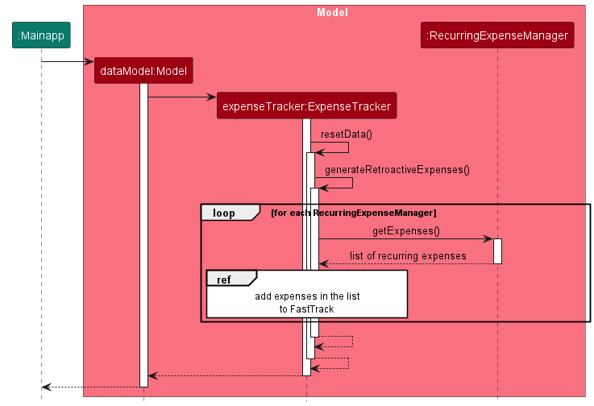
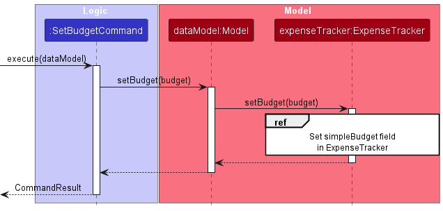

* Table of Contents
  {:toc}
---

## **FastTrack**
FastTrack is an easy-to-use financial management desktop application designed for NUS SoC undergraduate students who are living on a tight budget. With a combination of a Command Line Interface (CLI) and Graphical User Interface (GUI), our app provides a user-friendly and efficient way to track your expenses and manage your finances.

--------------------------------------------------------------------------------------------------------------------
## **Purpose of this guide**

The purpose of this guide is to give you a comprehensive insight for developing and maintaining FastTrack.

If you are a developer, this guide will give you an overview of the high-level [design](#design) and architecture of FastTrack. It also delves into the [implementation](#implementation) and design considerations of FastTrack features, allowing you to learn the ins and outs of FastTrack in no time. If you are lost now, you can start by first looking at the [set-up](#setting-up-getting-started) portion.

If you like to know more about the motivation behind FastTrack, checkout the [requirements](#appendix-requirements) section where we cover the [product scope](#product-scope) as well as the [user stories](#user-stories) and [use cases](#use-cases).

--------------------------------------------------------------------------------------------------------------------

## How to use this guide

Here are some notations used in this guide.

### Format
* `Command` is used to label commands and components.
* {Placeholder} are used to label placeholders.
* [Optional], square brackets are used to notate optional fields.
* :information_source: **Note** is used to provide additional information that you should know. 

---

## **Acknowledgements**

* This project is based on the [AddressBook-Level3](https://github.com/se-edu/addressbook-level3) project created by the [SE-EDU initiative](https://se-education.org/)
* Libraries used: 
  * [JavaFX](https://openjfx.io/)
  * [Jackson](https://github.com/FasterXML/jackson)
  * [JUnit5](https://github.com/junit-team/junit5)

--------------------------------------------------------------------------------------------------------------------

## **Setting up, getting started**

Refer to the guide [_Setting up and getting started_](SettingUp.md).

--------------------------------------------------------------------------------------------------------------------

## **Design**

This section gives you an overview of the different components of FastTrack and how they interact with each other. 

:bulb: **Tip:** The `.puml` files used to create diagrams in this document can be found in the [diagrams](https://github.com/se-edu/addressbook-level3/tree/master/docs/diagrams/) folder. Refer to the [_PlantUML Tutorial_ at se-edu/guides](https://se-education.org/guides/tutorials/plantUml.html) to learn how to create and edit diagrams.

### Architecture

The ***Architecture Diagram*** given below explains the high-level design of the FastTrack and how each component is connected.

**Main components of the architecture**

**`Main`** has two classes called [`Main`](https://github.com/AY2223S2-CS2103T-W09-2/tp/blob/master/src/main/java/fasttrack/Main.java) and [`MainApp`](https://github.com/AY2223S2-CS2103T-W09-2/tp/blob/master/src/main/java/fasttrack/MainApp.java). It is responsible for,

* At app launch: Initializes the components in the correct sequence, and connects them up with each other.
* At shut down: Shuts down the components and invokes cleanup methods where necessary.

[**`Commons`**](#common-classes) represents a collection of classes used by multiple other components.

FastTrack also consists of five other components.

* [**`UI`**](#ui-component): The UI of the App.
* [**`Logic`**](#logic-component): The command executor.
* [**`Model`**](#model-component): Holds the data of the App in memory.
* [**`AnalyticModel`**](#analyticmodel-component): Holds the data and outputs statistics based on the data in memory. 
* [**`Storage`**](#storage-component): Reads data from, and writes data to, the hard disk.

**How the architecture components interact with each other**

The *Sequence Diagram* below shows how the components interact with each other for the scenario where the user issues the command `delete 1`.

#replace

Each of the 5 main components (also shown in the diagram above),

* defines its *API* in an `interface` with the same name as the Component.
* implements its functionality using a concrete `{Component Name}Manager` class (which follows the corresponding API `interface` mentioned in the previous point.)

For example, the `Logic` component defines its API in the `Logic.java` interface and implements its functionality using the `LogicManager.java` class which follows the `Logic` interface. Other components interact with a given component through its interface rather than the concrete class (reason: to prevent outside component's being coupled to the implementation of a component), as illustrated in the (partial) class diagram below.

The sections below give more details of each component.

### UI component

This component is responsible for displaying and interacting with users of FastTrack through the GUI.

The **API** of this component is specified in [`Ui.java`](https://github.com/AY2223S2-CS2103T-W09-2/tp/blob/master/src/main/java/fasttrack/ui/Ui.java)

#replace

The UI consists of a `MainWindow` that is made up of the following parts.
* `CategoryListPanel`
  * `CategoryCard`
* `ExpenseListPanel`
  * `ExpenseCard`
* `RecurringExpensePanel`
  * `RecurringExpenseCard`
* `StatisticsPanel`
* `CommandBox`
  * `SuggestionListPanel`
    * `SuggestionCard`
* `ResultDisplay`
  * `ResultsHeader`
  * `ResultsDetails`

All these, including the `MainWindow`, inherit from the abstract `UiPart` class which captures the commonalities between classes that represent parts of the visible GUI.

The `UI` component uses the JavaFx UI framework. The layout of these UI parts are defined in matching `.fxml` files that are in the `src/main/resources/view` folder. For example, the layout of the [`MainWindow`](https://github.com/se-edu/addressbook-level3/tree/master/src/main/java/seedu/address/ui/MainWindow.java) is specified in [`MainWindow.fxml`](https://github.com/se-edu/addressbook-level3/tree/master/src/main/resources/view/MainWindow.fxml)

The `UI` component,

* executes user commands using the `Logic` component.
* listens for changes to `Model` data so that the UI can be updated with the modified data.
* keeps a reference to the `Logic` component, because the `UI` relies on the `Logic` to execute commands.
* depends on some classes in the `Model` component, as it displays `Person` object residing in the `Model`.

### Logic component

**API** : [`Logic.java`](https://github.com/AY2223S2-CS2103T-W09-2/tp/blob/master/src/main/java/fasttrack/logic/Logic.java)

Here's a (partial) class diagram of the `Logic` component, to help guide you along on how it works:

#ReplaceUMLHere

#### **How the `Logic` component works:**
1. When `Logic` is called upon to execute a command, it uses the `ExpenseTrackerParser` class to parse the user command.
1. This results in a `Command` object (more precisely, an object of one of its subclasses' subclass e.g., `AddCategoryCommand`, which implements `AddCommand`) which is executed by the `LogicManager`.
1. The command can communicate with the `Model` when it is executed (e.g. to add a category).
1. The result of the command execution is encapsulated as a `CommandResult` object which is returned back from `Logic`.

The Sequence Diagram below illustrates the interactions within the `Logic` component for the `execute("delcat 1")` API call.

#ReplaceUMLHere

:information_source: **Note:** The lifeline for `DeleteCommandParser` should end at the destroy marker (X) but due to a limitation of PlantUML, the lifeline reaches the end of diagram.

Here are the other classes in `Logic` (omitted from the class diagram above) that are used for parsing a user command:

#ReplaceUMLHere

#### **How the parsing works:**
* When called upon to parse a user command, the `ExpenseTrackerParser` class creates an `XYZCommandParser` (`XYZ` is a placeholder for the specific command name e.g., `AddCategoryParser`) which uses the other classes shown above to parse the user command and create a `XYZCommand` object (e.g., `AddCategoryCommand`) which the `ExpenseTrackerParser` returns back as a `Command` object.
* All `XYZCommandParser` classes (e.g., `AddCategoryParser`, `DeleteCategoryParser`, ...) inherit from the `Parser` interface so that they can be treated similarly where possible e.g, during testing.

### Model component
**API** : [`Model.java`](https://github.com/AY2223S2-CS2103T-W09-2/tp/blob/master/src/main/java/fasttrack/model/Model.java)

#ReplaceUMLHere

The `Model` component,

* contains the expense tracker data i.e., all `Category` objects (which are contained in a `UniqueCategoryList` object), which is pulled from the `ReadOnlyExpenseTracker` instance.
* contains the currently 'selected' `Category` objects (e.g., results of a search query) as a separate _filtered_ list which is exposed to outsiders as an unmodifiable `ObservableList<Category>` that can be
'observed' e.g. the UI can be bound to this list so that the UI automatically updates when the data in the list change.
* contains the expense tracker data i.e., all `Expense` objects (which are contained in a `ExpenseList` object), which is pulled from the `ReadOnlyExpenseTracker` instance.
* contains the currently 'selected' `Expense` objects (e.g., results of a search query) as a separate _filtered_ list which is exposed to outsiders as an unmodifiable `ObservableList<Expense>` that can be
'observed' e.g. the UI can be bound to this list so that the UI automatically updates when the data in the list change.
* does not depend on any of the other four components (as the `Model` represents data entities of the domain, they should make sense on their own without depending on other components)

#Check if this is needed anymore

:information_source: **Note:** An alternative (arguably, a more OOP) model is given below. It has a `Category` list in the `ExpenseTracker`, which `Expense` references. This allows `ExpenseTracker` to only require one `Category` object per unique expense, instead of each `Expense` needing their own `Category` objects. 

#ReplaceUMLHere

### AnalyticModel component

**API** : [`AnalyticModel.java`](https://github.com/AY2223S2-CS2103T-W09-2/tp/blob/master/src/main/java/fasttrack/model/AnalyticModel.java)

#ReplaceUMLHere
#This requires brand-new UML diagram of how analyticmodel component works.

The `AnalyticModel` component,
* contains the expense tracker data (i.e. all `Expense` and `Category` objects, which are respectively contained in `ExpenseList` and `UniqueCategoryList` objects), which are pulled from the `ReadOnlyExpenseTracker` instance. 
* calculates statistics based on the expense tracker data available.
* listens to any changes made to expense tracker data (by attaching listeners to the `ExpenseList`), thus dynamically updating statistics.

### Storage component

**API** : [`Storage.java`](https://github.com/AY2223S2-CS2103T-W09-2/tp/blob/master/src/main/java/fasttrack/storage/Storage.java)

#ReplaceUMLHere

The `Storage` component,
* can save both expense tracker data and user preference data in json format, and read them back into corresponding objects.
* inherits from `ExpenseTrackerStorage`
* depends on some classes in the `Model` component (because the `Storage` component's job is to save/retrieve objects that belong to the `Model`)

### Common classes

Classes used by multiple components are in the `seedu.addressbook.commons` package.

--------------------------------------------------------------------------------------------------------------------

## **Implementation**

This section describes some noteworthy details on how certain features are implemented.

### \[Implemented\] Add Category feature

#### **Command format:**
`addcat c/NAME [s/SUMMARY]` where `NAME` is the new category name and an optional `SUMMARY` of the category. 

#### **What is the feature about:**
This command allows the user to add a new category to FastTrack. If the new category has the same name as an existing category in the database, the command will not be executed. 

#### **Sequence of actions:**

1. The user enters `addcat c/food s/expense on food` in the command box.  
2. The input is then [parsed](#how-the-parsing-works) and a `AddCategoryCommand` object is created with the new `Category` object.   
3. `AddCategoryCommand#execute()` is called, which will trigger the model to add a category.  
4. `Model#addCategory()` is called, which further calls `ExpenseTracker#addCategory()`.   
5. `UniqueCategoryList#add()` is called to add the new category to FastTrack.  
6. A `CommandResult` is returned.  

:information_source: **Note:**
* At step 3, if the new category has the same name as an existing category, a `CommandException` will be thrown and the sequence of action will be terminated.

### \[Implemented\] Delete Category feature

#### **Command format:**
`delcat INDEX` where `INDEX` refers to the index of the category to be deleted when `lcat` is called.

#### **What is the feature about:**
This command allows user to delete a category of choice, expenses with the deleted category will have its category replaced with the `MiscellaneuosCategory`. The category will be removed from the user's database.

#### **Sequence of actions:**

1. The user enters `delcat 1` in the command box.  
2. The input is then [parsed](#how-the-parsing-works) and a `DeleteCategoryCommand` object is created using the given `INDEX`.  
3. `DeleteCategoryCommand#execute()` is called, this will retrieve the category object to be deleted from the list of categories.   
4. This will call `Model#deleteCategory()`, which will further call `ExpenseTracker#removeCategory()`.  
5. `UniqueCategoryList#remove()` is called to remove the `Category` at index 2, and `ExpenseList#replaceDeletedCategory()` is called to replace all expenses with the deleted `Category` with `MiscellaneousCategory`.  
6. A `CommandResult` object is returned.  

:information_source: **Note:**
* At step 2, if an invalid `INDEX` is given, a `CommandException` will be thrown and the sequence of action will be terminated.
* At step 3, if the `INDEX` given is out of range, a `CommandException` will be thrown and the sequence of action will be terminated.

### \[Implemented\] Edit Category feature

#### **Command format:**
`edcat INDEX [c/NAME] [s/SUMMARY]` where `INDEX` refers to the index of the category to be edited when `lcat` is called, `NAME` is the new name of the category, `SUMMARY` is the new summary of the category. Note that either a `NAME` or `SUMMARY` must be present for the command to be executed.

#### **What is the feature about:**
This command allows user to edit a category of choice. We allow users to edit either the category's name, summary or both in this command. 

#### **Sequence of actions:**

1. User enters `edcat 1 c/food s/expense on food` in the command box.  
2. The input is then [parsed](#how-the-parsing-works) and a `EditCategoryCommand` object is created using the given index `1`, new category name `food` and new summary `expense on food`.   
3. `EditCategoryCommand#execute()` is called. The category to edit is obtained from the `Model` and stored as `categoryToEdit`.   
4. The function checks that a new category name is present, thus it calls `UserDefinedCategory#setCategoryName()` on `categoryToEdit`, changing the name of the target category to the given new name.  
5. The function checks that a new category summary is present, thus is calls `UserDefinedCategory#setDescription()` on `categoryToEdit`, changing the summary of the target category with the given new summary.  
6. A `CommandResult` object is returned.  

:information_source: **Note:**
* At step 2, if an invalid `INDEX` is given or **both** `c/NAME` and `s/SUMMARY` is missing, a `CommandException` will be thrown and the sequence of actions will be terminated.
* At step 4, if there is a category with the same name as the new name given, a `CommandException` is thrown and the sequence of actions will be terminated.

#### Design considerations:
**Aspect: How the category object is edited**:

* **Alternative 1 (Current choice):** Directly retrieve and edit the currently-specified `Category` object.
  * Pros: No need to re-point all `Expense` objects currently affiliated with the `Category` object that is being edited.
  * Cons: Mutates the state of the `Category` object, which might not be ideal if seeking immutability.

* **Alternative 2 :** Retrieve the specified `Category` object's name and summary, and create a new `Category` object
that uses the same name and summary before replacing the required name or summary depending on user's arguments.
  * Pros: Enforces immutability by replacing the previous `Category` object.
  * Cons: There is now a need to re-direct all `Expense` objects affiliated with the previous `Category` object of interest.

### **\[Implemented\] Recurring Expense feature:**

#### **What is the feature about:**
Since recurring expenses are prominent in today's society (e.g. Netflix, Transportation), therefore having a feature to allows FastTrack to regularly add recurring expenses automatically is a must.

To implement this feature, 3 classes were added:
1. [`RecurringExpenseManager`](#the-recurringexpensemanager-class)
2. [`RecurringExpenseList`](#the-recurringexpenselist-class)
3. [`RecurringExpenseType`](#the-recurringexpensetype-class)

##### **The `RecurringExpenseManager` class:**
The `RecurringExpenseManager` class is used as a generator of recurring expenses. When a user wants to add a recurring expense in FastTrack, the user can use the `addrec` command to create a new `RecurringExpenseManager` object. This object will have the following fields:
* `expenseName` - Name of the recurring expense.
* `amount` - Unit price of the recurring expense.
* `category` - The category of the recurring expense.
* `startDate` - The date to start adding the recurring expenses.
* `[endDate]` - An optional ending date of the recurring expense.
* `nextExpenseDate` - The next date to charge the recurring expense.
* `recurringExpenseType` - The interval to charge the recurring expense (day, week, month, year).

##### **The `RecurringExpenseList` class:**
The `RecurringExpenseList` class works similar to the `ExpenseList` and `UniqueCategoryList` classes where is stores all the `RecurringExpenseManager` object created by the user. 

##### **The `RecurringExpenseType` class:**
This is an enum class that stores the valid intervals (day, week, month, year) for a recurring expense. It also contains the `RecurringExpenseType#getNextExpenseDate()` method that calculates the next date given the interval and target date.

#### **Sequence of actions:**

Below is the sequence diagram when a user opens FastTrack:

Pre-requisite: The user has added some `RecurringExpenseManager` into FastTrack and all `RecurringExpenseManager` objects have their `nextExpenseDate` updated.

1. When the user reopens FastTrack, `Mainapp` will instantiate a new `Model` and `ExpenseTracker` object with the saved data. This will call `ExpenseTracker#resetData()`.   
2. `ExpenseTracker#generateRetroactiveExpenses()` is then called, this method goes through the user's `RecurringExpenseList` and calls the `RecurringExpenseManager#getExpenses()` method on each object.   
3. If the `nextExpenseDate` of the `RecurringExpenseManager` object is equal or before today's date, a new expense based on the parameters in the `RecurringExpenseManager` object will be added to a list until `nextExpenseDate` is after today's date or `endDate` if specified. The list is returned to the `ExpenseTracker`.  
4. The `ExpenseTracker` will then add each of the expenses in the returned list to FastTrack.

#### **Design considerations:**
##### Aspect: Making `RecurringExpenseManager` a class:

* **Alternative 1:** Have a `RecurringExpenseManager` extend from `Expense`. Consist of another list of recurring expenses generated by the RecurringExpenseManager. 
  * Pros: Addition of 1 class only. Works similar to an `Expense` object with just an addition list to store the recurring expenses. 
  * Cons: Methods for adding a new recurring expense is longer as we need to traverse the entire expense list to locate the `RecurringExpenseManager` and add to the back of the list. Furthermore, the deletion of the `RecurringExpenseManager` also removes the existing recurring expenses.    
* **Alternative 2 (current choice):** Abstract `RecurringExpenseManager` to its own class, similar to category. 
  * Pros: Able to easily locate all `RecurringExpenseManager` objects that the user created, making addition of recurring expenses into FastTrack simpler and quicker. Deletion of the `RecurringExpenseManager` does not delete existing recurring expenses.
  * Cons: Requires the addition of another `RecurringExpenseList` class to store all `RecurringExpenseManager` objects. Tedious to maintain and implement. 

**Alternative 2** was chosen as it would be more ideal to abide by the _Separation of Concerns_ principle. This allows proper separation of the generator class `RecurringExpenseManager` and the `Expense` class.

### **\[Implemented\] Budget feature:**

#### **Command format:**
`set p/AMOUNT` where `AMOUNT` refers to the monthly budget amount. 

#### **What is the feature about:**
This feature allows users to add a monthly budget to FastTrack. A weekly budget will be calculated for users by taking `AMOUNT` / 4. The `Budget` class is meant to be coupled with `AnalyticModel` to allow users to view helpful [statistics](#implemented-expense-statistics-feature) such as remaining budget etc. 

#### **Sequence of actions:**

Below is the sequence diagram when a user uses the `set` command:

1. User enters `set p/1000` in the command box.  
2. The input is then [parsed](#how-the-parsing-works) and a `SetBudgetCommand` object is created with a `Budget` object with an amount of `1000`.  
3. `SetBudgetCommand#execute()` is called, this will further call `Model#setBudget()` and `ExpenseTracker#setBudget()`. This will set the observable `simpleBudget` in `ExpenseTracker` to the given new `Budget`.   
4. A `CommandResult` object is returned.  

:information_source: **Note:**
* At step 2, if an invalid amount is given, a `CommandException` will be thrown and the sequence of action will be terminated.
#### **Design considerations:**

##### Aspect: Making `Budget` a class:
* **Alternative 1:** Make budget a field with `Double` type in `ExpenseTracker` rather than creating a new class.
  * Pros: Easier to implement as there is no need for a creation of a class. 
  * Cons: Budget related calculations have to be done within the `ExpenseTracker` class, adding clutter. Modifications to the budget will also be more tedious as we have to locate these methods within `ExpenseTracker`.  
  
* **Alternative 2 (Current choice):** Make a new `Budget` class.
  * Pros: Abstract all budget related operations to a class to maintain clean code. Modifications to budget related operations are also easier. 
  * Cons: Less convenient as it requires the creation of a new class. 

**Alternative 2** was chosen as it abides to the separation of concerns principle. This is to achieve better modularity and readability of the code base. 

### \[Implemented\] Expense Statistics Feature

#### **What is the feature about:**

FastTrack allows the user to view a summary of their expense statistics for both the current week and month.
These statistics are displayed on the expense summary screen on the right window of the application and are updated automatically everytime the user adds, edits or deletes an expense from FastTrack.

The following statistics are calculated and displayed to the user. In FastTrack, the user is allowed to set only a monthly budget. A weekly budget is then defined as the value of the monthly budget divided by four (weeks).

1. `Weekly Spending` - Total amount spent for the current week
2. `Monthly Spending` - Total amount spent for the current month
3. `Weekly Remaining` - Amount of weekly budget remaining for the current week
4. `Monthly Remaining` - Amount of monthly budget remaining for the current month
5. `Weekly % Change` - Percentage increase/decrease of weekly spending relative to the previous week
6. `Monthly % Change` - Percentage increase/decrease of monthly spending relative to the previous month
7. `Total Spent` - The total amount the user has spent to-date
8. `Budget Utilised` - The percentage of monthly budget that the user has utilised this month

#### Implementation Details
The current implementation of the expense summary feature requires consistent calculations of the user's expense statistics. As such, an `AnalyticModelManager`, which implements the `AnalyticModel` interface is used to keep track of all of these statistics.
It contains fields which keep track of each individual statistic as mentioned in the above list, as well as specific methods to perform new calculations and updates to each of these fields.

The following Class Diagram describes the structure of the `AnalyticModelManager`.

// class diagram for AnalyticModelManager

`AnalyticModelManager` requires an instance of `ExpenseTracker` to read and obtain the following unmodifiable, `ObservableList` objects containing data from FastTrack:
1. `allExpenses`: an `ObservableList` of Expense objects representing all expenses in the expense tracker
2. `allCategories`: an `ObservableList` of Category objects representing all expense categories in the expense tracker
3. `simpleBudget`: a `ObjectProperty<Budget>` object representing the monthly budget of the user.

The fields contained within `AnalyticModelManager` are of type `DoubleProperty` which implement the `Observable` interface. This allows the `UI` to establish bindings to each property.
A binding is a mechanism of JavaFX allows for the establishment of relationships between variables. The `UI` observes each `DoubleProperty` for changes, and then updates the GUI automatically when it detects that the `DoubleProperty` has changed.

Each `DoubleProperty` is updated using the respective calculation method, e.g. `AnalyticModelManager#getWeeklySpent()` for the `weeklySpent` property. A listener listens for changes in the `ObservableList` objects, `allExpenses` and `allCategories`.
Each time a change is detected, for example, when the user has deleted an expense or changed the amount of an expense, for each expense statistic, its corresponding calculation method is called, causing the corresponding property to be updated. This notifies the `UI` to update and display the new calculated expense statistics on the GUI.

This method of implementation closely follows the _Observer Pattern_, which promotes loose coupling between the `UI` and the `AnalyticModelManager`. Bindings can also be added or removed dynamically, making any changes to the expense summary statistics more flexible and adaptable.

#### Design Considerations

**Aspect: Separation of Analytics and App Data**:

* **Alternative 1 (Current choice):** Create two separate `ModelManager` components, one for managing analytics and another for managing app data.
    * Pros: As analytics functions are read-only and do not require modifying the internal data of FastTrack, keeping the expense summary statistics in a separate component is ideal as it abides by the _Separation of Concerns_ principle.
    * Cons: Less convenient to implement as a new class would be created.
* **Alternative 2 :** Store fields and methods for calculating expense summary statistics inside the existing `ModelManager` component.
    * Pros: Easier to implement as the class already exists, there is no need to instantiate another `AnalyticModelManager` class.
      * Cons: Will result in the current `ModelManager` being cluttered due to the presence of many differing getter and setter methods. Violates the _Separation of Concerns_ principle since the process of calculating statistics does not involve modifying the data within FastTrack, i.e. is purely read-only.

**Alternative 1** was chosen as it would be more ideal to abide by the principle of _Separation of Concerns_. Moreover, as many developers were working on features that require direct modification of the `ModelManager` component, separating analytics into another `AnalyticModelManager` eliminates the possibility of merge conflicts.

**Aspect: GUI update when user updates expenses in FastTrack**:

* **Alternative 1:** Call methods to calculate and refresh the summary statistics after every user command.
    * Pros: More convenient to implement since it is easy to ensure the GUI is always updated whenever the user enters a command
    * Cons: Inefficient, as this would require tearing down and creating a new instance of each `UI` component in order to display the updated data. Redundant calculations would also need to be performed every single time the user enters a command that does not change the underlying expense data.
* **Alternative 2 (Current choice):** Use the _Observer Pattern_ to allow `UI` to update whenever the underlying data of FastTrack changes
    * Pros: More efficient, since no redundant calculations are performed. The `AnalyticModelManager` also does not need a reference to the `UI` component to perform an update, which reduces the coupling between these classes.
    * Cons: Was more time-consuming to implement, due to the need to learn about mechanisms like bindings and change listeners in JavaFX.

**Alternative 2** was chosen as it was neater to implement and performs statistic calculations only when absolutely necessary, this preventing unnecessary wastage of computational resources.

--------------------------------------------------------------------------------------------------------------------

## **Documentation, logging, testing, configuration, dev-ops**

* [Documentation guide](Documentation.md)
* [Testing guide](Testing.md)
* [Logging guide](Logging.md)
* [Configuration guide](Configuration.md)
* [DevOps guide](DevOps.md)

--------------------------------------------------------------------------------------------------------------------

## **Appendix: Requirements**

### Product scope

**Target user profile**:
* NUS undergraduate students from the School of Computing
* Tech-savvy and able to type fast
* Comfortable using CLI apps
* Has to manage a large number of different general consumption and professional recurring expenses

**Value proposition**:
* Easy-to-use and allows students to log their daily expenses quickly and efficiently via a CLI
* Students can keep track of their spending habits with informative statistics
* FastTrack provides visual feedback and suggestions to help NUS students make more informed financial decisions

### User stories

Priorities: High (must have) - `* * *`, Medium (nice to have) - `* *`, Low (unlikely to have) - `*`

| Priority | As a …​               | I want to …​                                                          | So that I can…​                                                               |
|----------|-----------------------|-----------------------------------------------------------------------|-------------------------------------------------------------------------------|
| `* * *`  | New user              | See usage instructions                                                | Refer to instructions when I forget how to use the app                        |
| `* * *`  | NUS Computing Student | Add my own expense categories                                         | Categorise my expenses with a high degree of customisation                    |
| `* * *`  | NUS Computing Student | Delete an expense category                                            | Remove categories that I no longer need                                       |
| `* * *`  | NUS Computing Student | List all categories                                                   | See all my categories at a glance                                             |
| `* * *`  | NUS Computing Student | Log an expense in a single command                                    | Keep track of expenses in the system                                          |
| `* * *`  | NUS Computing Student | List all expenses in total                                            | Get an overview of my expenses                                                |
| `* * *`  | NUS Computing Student | List all expenses by category                                         | Analyse my expenses in each category                                          |
| `* * *`  | NUS Computing Student | Delete an expense                                                     | Remove expenses which I have keyed in incorrectly                             |
| `* * *`  | NUS Computing Student | See a summary of my expenses                                          | Analyse and correct my spending habits                                        |
| `* * *`  | NUS Computing Student | Keep track of Software-As-A-Service/application hosting subscriptions | Be prepared when a recurring expense is due soon                              |
| `* * *`  | NUS Computing Student | Find an expense based on a keyword                                    | Easily filter expenses based on their name                                    |
| `* * *`  | NUS Computing Student | Edit an expense                                                       | Update the details of an expense without deleting and creating a new one      |
| `* * *`  | NUS Computing Student | See how much I have spent in total in the list                        | Can see how much I have spent in total for any number of expenses in the list |
| `* *`    | NUS Computing Student | See my expense to budget statistics                                   | Ensure my expenses are within or have exceeded a predefined budget            |
| `* *`    | NUS Computing Student | List all expenses for a specified time frame                          | Track my expenses on a timely basis                                           |
| `* *`    | NUS Computing Student | Add descriptions to my categories containing additional details       | Define my categories distinctly                                               |
| `* *`    | NUS Computing Student | See a percentage breakdown of my expenses                             | Be aware of what categories I should spend less on                            |
| `* *`    | NUS Computing Student | Get feedback on how I can change my spending habits                   | Develop good financial habits                                                 |

## Use cases

(For all use cases below, the **System** is `FastTrack` and the **Actor** is the `user`, unless specified otherwise)

**Precondition: The user has launched the FastTrack application**

### Use case: UC1 - Add category

**MSS**

1. User requests to add a new category to FastTrack.
2. User enters the add command with the category name.
3. FastTrack adds the new category.
4. FastTrack responds with a success message indicating the category has been successfully added.

    Use case ends.

**Extensions**
* 2a. The user does not enter the required category name.
  * 2a1. FastTrack responds telling the user that a name is required and the command is invalid.
  * 2a2. User enters add command with the category name.
  * 2a3. Steps 2a1-2a2 are repeated until the data entered are correct.

    Use case resumes at step 3.

* 2b. The category name already exists
  * 2b1. FastTrack informs the user that the category name has already been used and prompts the user for a different category name.
  * 2b2. User enters add command with the category name.
  * 2b3. Steps 2b1-2b2 are repeated until the data entered are correct.

    Use case resumes at step 3.

### Use case: UC2 - Delete a Category

**MSS**

1. User lists all categories using UC4.
2. User requests to delete a category from FastTrack.
3. User enters the delete command with the index i of the category to be deleted.
4. FastTrack deletes the category at index i.
5. FastTrack displays a success message to the user indicating the category has been successfully deleted.

   Use case ends.

**Extensions**
* 3a. The user selects an invalid category index (the index is out of bounds of the list)
    * 3a1. FastTrack displays an error message telling the user to key in a valid index.
    * 3a2. User enters delete command with the category index.
    * 3a3. Steps 3a1-3a2 are repeated until the data entered are correct.

      Use case resumes at step 4.

### Use case: UC3 - Edit an Expense

**MSS**

1. The user lists all expenses using UC7.
2. The user selects the expense they want to edit from the list of expenses.
3. User keys in the command to edit the expense.
4. FastTrack responds with a success message indicating the expense has been successfully edited.

**Extensions**
* 2a. The user selects an expense that does not exist.
    * 2a1. FastTrack displays an error message and does not allow the user to edit the expense.
* 2b. The user tries to save an expense with invalid or missing data.
    * 2b1. FastTrack displays an error message indicating the fields that need to be corrected.

**Precondition: The user has created at least one expense in the app**
### Use case: UC4 - List all Categories

**MSS**

1.  User requests to list all categories.
2.  FastTrack displays all categories.

   Use case ends.

**Extensions**
* 2a. The user does not have any categories.
    * 2a1. FastTrack only displays the Misc category

### Use case: UC5 - Add an expense

**MSS**

1.  User wants to add an expense to be tracked.
2.  User keys in the command to add an expense to be tracked.
3.  FastTrack responds with a successfully added message.

**Extensions**

* 2a. User keys in information in wrong format.
  * 2a1. FastTrack returns an error, requesting that the user inputs information in the correct format.
  * 2a2. User inputs information again.
  * 2a3. Steps 2a1-2a2 are repeated until the information being input is of the correct format.

    Use case resumes from step 3.

### Use case: UC6 - Delete an expense

**MSS**

1. User wants to delete an expense that has been tracked.
2. User uses UC7 (to list out all expenses currently added).
3. User keys in the command to delete the expense.
4. FastTrack responds with a successfully deleted message.

    Use case ends.

**Extensions**

* 3a. User keys in an invalid expense index.
    * 3a1. FastTrack returns an error, requesting that the user inputs the correct expense index.
    * 3a2. User inputs information again.
    * 3a3. Steps 3a1-3a2 are repeated until the expense index being input by the user is valid.

      Use case resumes from step 4.

**MSS**

### Use case: UC7 - List all expense

**MSS**

1.  User requests to list all expense.
2.  FastTrack displays all expenses added by user.

    Use case ends.

### Use case: UC8 - List all expense in a given category

**MSS**

1.  User requests to list all expense in a given category.
2.  FastTrack displays all expenses in a given category added by user.
   Use case ends.

* 1a. User does not enter a category.
  * 1a1. FastTrack displays error message.

      Use case ends.

* 1b. The given category is invalid.

    * 1b1. FastTrack displays an error message.

      Use case ends.

### Use case: UC9 - List all expense in the past week

**MSS**

1. User requests to list all expense in the past week.
2. FastTrack displays all expenses added by user in the past week .

    Use case ends.

### Use case: UC10 - List all expense in a given category in the past week

**MSS**

1. User requests to list all expense in a category in the past week.
2. FastTrack displays all expenses added by user in the category in the past week.

    Use case ends.

### Use case: UC11 - Find an expense

**MSS**

1.  User requests to find an expense.
2.  FastTrack displays all expenses related to the keyword provided.

    Use case ends.

### Use case: UC12 - Clear all expenses from the expense log

**MSS**

1. User wants to wipe all currently-logged expenses.
2. User keys in the command to clear all logged expenses.

    Use case ends.

### Use case: UC13 - Get Help within the app

**MSS**

1. User wants to check help for the commands to use FastTrack.
2. User keys in the command to get help.
3. FastTrack opens a pop-up window to show help for commands and a link to the User Guide.

    Use case ends.

### Use case: UC13 - Exit from FastTrack

**MSS**

1. User wants to exit the application.
2. User keys in the command to exit the application.
3. FastTrack exits and is closed.

    Use case ends.

### Non-Functional Requirements

1. Should work on any _mainstream OS_ as long as it has Java `11` or above installed.
2. Should be able to hold up to 1000 expenses without a noticeable sluggishness in performance for typical usage.
3. A user with above average typing speed for regular English text (i.e. not code, not system admin commands) should be able to accomplish most of the tasks faster using commands than using the mouse.
4. FastTrack should be designed in a modular, scalable manner to enable easy addition of new features in the future.
5. The code should be well-organized and well-documented to ensure ease of maintenance and debugging.
6. FastTrack should protect user data from unauthorized access or modification.
7. Any modification to the data will result in a prompt update to the user interface.

### Glossary

* **Mainstream OS**: Windows, Linux, Unix, OS-X

--------------------------------------------------------------------------------------------------------------------

## **Appendix: Instructions for manual testing**

Given below are instructions to test the app manually.

:information_source: **Note:** These instructions only provide a starting point for testers to work on;
testers are expected to do more *exploratory* testing.

### Launch and shutdown

1. Initial launch

   1. Download the jar file and copy into an empty folder

   1. Double-click the jar file Expected: Shows the GUI with a set of sample contacts. The window size may not be optimum.

1. Saving window preferences

   1. Resize the window to an optimum size. Move the window to a different location. Close the window.

   1. Re-launch the app by double-clicking the jar file. 
       Expected: The most recent window size and location is retained.

1. _{ more test cases …​ }_

### Saving data

1. Dealing with missing/corrupted data files

   1. _{explain how to simulate a missing/corrupted file, and the expected behavior}_

1. _{ more test cases …​ }_
