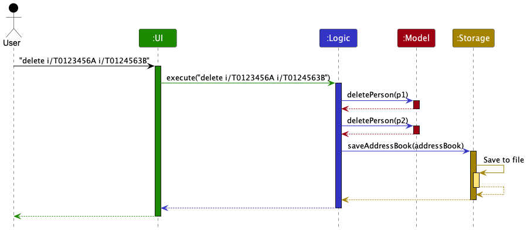
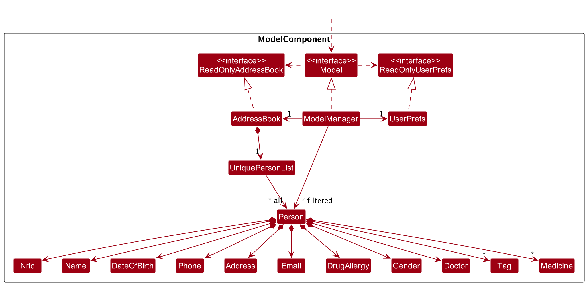
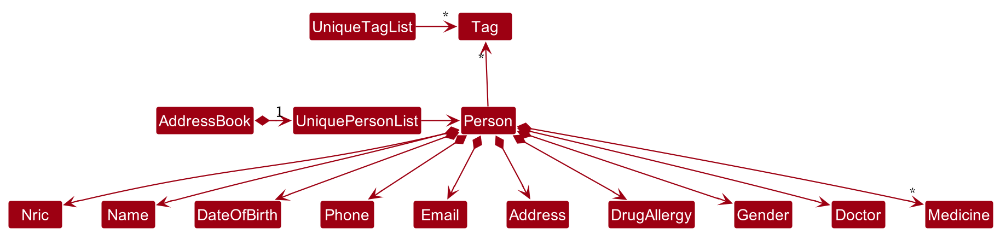
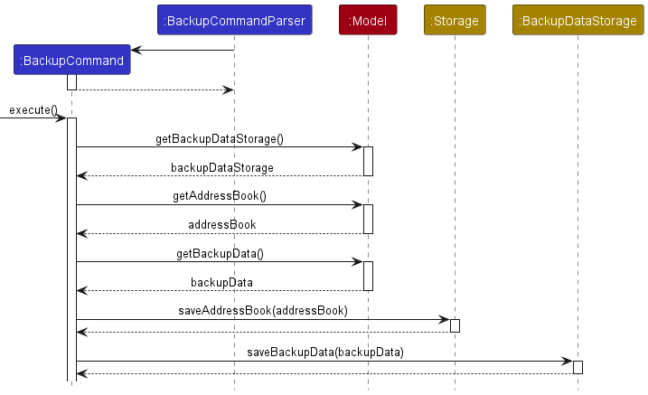
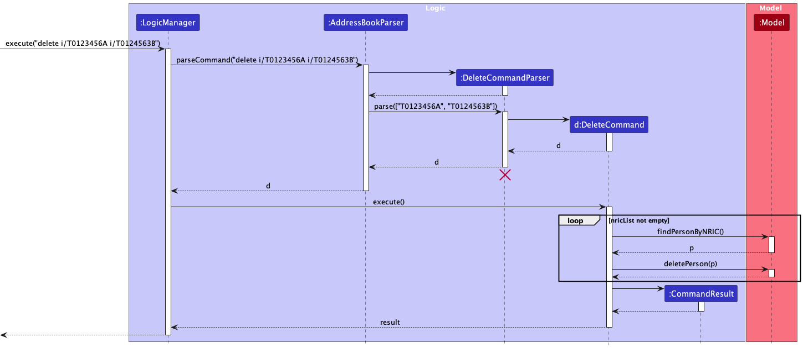

# Table of Contents:

- [Acknowledgements](#acknowledgements)
- [Setting up, getting started](#setting-up-getting-started)
- [Design](#design)
    - [Architecture](#architecture)
    - [UI Component](#ui-component)
    - [Logic Component](#logic-component)
    - [Model Component](#model-component)
    - [Storage Component](#storage-component)
    - [Common Classes](#common-classes)
- [Implementation](#implementation)
    - [Backup/Load feature](#backupload-feature)
    - [Undo/Redo feature](#undoredo-feature)
    - [Add patient feature](#add-patient-feature)
    - [Edit patient feature](#edit-patient-feature)
    - [View patient particulars feature](#view-patient-particulars-feature)
    - [Delete patient feature](#delete-patient-record-by-nric-feature)
    - [Filter patients feature](#filter-patient-record-by-attribute)
    - [Light/dark theme](#lightdark-theme)
    - [Adding Nric as identifier](#adding-nric-as-identifier)
    - [Adding health conditions](#adding-health-conditions)
    - [Adding attending doctor](#adding-attending-doctor)
- [Documentation, logging, testing, configuration, dev-ops](#documentation-logging-testing-configuration-dev-ops)
- [Appendix: Requirements](#appendix-requirements)
    - [Product Scope](#product-scope)
    - [User stories](#user-stories)
    - [Use cases](#use-cases)
    - [Non-Functional Requirements](#non-functional-requirements)
    - [Glossary](#glossary)
- [Appendix: Instructions for manual testing](#appendix-instructions-for-manual-testing)
    - [Launch and shutdown](#launch-and-shutdown)
    - [Adding a person](#adding-a-person)
    - [Deleting a person](#deleting-a-person)
    - [Finding a person](#finding-a-person)
    - [Saving and Loading data](#saving-and-loading-data)

--------------------------------------------------------------------------------------------------------------------

## **Acknowledgements**

* Adapted from [AB3](https://github.com/se-edu/addressbook-level3)
* Adapted `Theme` from [here](https://github.com/junlong4321/tp/blob/master/src/main/java/tutorspet/ui/stylesheet/Stylesheet.java)

--------------------------------------------------------------------------------------------------------------------

## **Setting up, getting started**

Refer to the guide [_Setting up and getting started_](SettingUp.md).

--------------------------------------------------------------------------------------------------------------------
[return to table of contents](#table-of-contents)

## **Design**

:bulb: **Tip:** The `.puml` files used to create diagrams in this document can be found in
the [diagrams](https://github.com/se-edu/addressbook-level3/tree/master/docs/diagrams/) folder. Refer to the [_PlantUML
Tutorial_ at se-edu/guides](https://se-education.org/guides/tutorials/plantUml.html) to learn how to create and edit
diagrams.

[return to table of contents](#table-of-contents)

### Architecture

The ***Architecture Diagram*** given above explains the high-level design of the App.

Given below is a quick overview of main components and how they interact with each other.

**Main components of the architecture**

**`Main`** has two classes
called [`Main`](https://github.com/se-edu/addressbook-level3/tree/master/src/main/java/seedu/address/Main.java)
and [`MainApp`](https://github.com/se-edu/addressbook-level3/tree/master/src/main/java/seedu/address/MainApp.java). It
is responsible for,

* At app launch: Initializes the components in the correct sequence, and connects them up with each other.
* At shut down: Shuts down the components and invokes cleanup methods where necessary.

[**`Commons`**](#common-classes) represents a collection of classes used by multiple other components.

The rest of the App consists of four components.

* [**`UI`**](#ui-component): The UI of the App.
* [**`Logic`**](#logic-component): The command executor.
* [**`Model`**](#model-component): Holds the data of the App in memory.
* [**`Storage`**](#storage-component): Reads data from, and writes data to, the hard disk.

**How the architecture components interact with each other**

The *Sequence Diagram* below shows how the components interact with each other for the scenario where the user issues
the command `delete i/T0123456A T0124563B`.

Each of the four main components (also shown in the diagram above),

* defines its *API* in an `interface` with the same name as the Component.
* implements its functionality using a concrete `{Component Name}Manager` class (which follows the corresponding
  API `interface` mentioned in the previous point.

For example, the `Logic` component defines its API in the `Logic.java` interface and implements its functionality using
the `LogicManager.java` class which follows the `Logic` interface. Other components interact with a given component
through its interface rather than the concrete class (reason: to prevent outside component's being coupled to the
implementation of a component), as illustrated in the (partial) class diagram below.

The sections below give more details of each component.

[return to table of contents](#table-of-contents)

### UI component

The **API** of this component is specified
in [`Ui.java`](https://github.com/se-edu/addressbook-level3/tree/master/src/main/java/seedu/address/ui/Ui.java)

The UI consists of a `MainWindow` that is made up of parts e.g.`CommandBox`, `ResultDisplay`, `PersonListPanel`
, `StatusBarFooter` etc. All these, including the `MainWindow`, inherit from the abstract `UiPart` class which captures
the commonalities between classes that represent parts of the visible GUI.

The `UI` component uses the JavaFx UI framework. The layout of these UI parts are defined in matching `.fxml` files that
are in the `src/main/resources/view` folder. For example, the layout of
the [`MainWindow`](https://github.com/se-edu/addressbook-level3/tree/master/src/main/java/seedu/address/ui/MainWindow.java)
is specified
in [`MainWindow.fxml`](https://github.com/se-edu/addressbook-level3/tree/master/src/main/resources/view/MainWindow.fxml)

The `UI` component,

* executes user commands using the `Logic` component.
* listens for changes to `Model` data so that the UI can be updated with the modified data.
* keeps a reference to the `Logic` component, because the `UI` relies on the `Logic` to execute commands.
* depends on some classes in the `Model` component, as it displays `Person` object residing in the `Model`.

[return to table of contents](#table-of-contents)

### Logic component

**
API** : [`Logic.java`](https://github.com/se-edu/addressbook-level3/tree/master/src/main/java/seedu/address/logic/Logic.java)

Here's a (partial) class diagram of the `Logic` component:

How the `Logic` component works:

1. When `Logic` is called upon to execute a command, it uses the `AddressBookParser` class to parse the user command.
1. This results in a `Command` object (more precisely, an object of one of its subclasses e.g., `AddCommand`) which is
   executed by the `LogicManager`.
1. The command can communicate with the `Model` when it is executed (e.g. to add a person).
1. The result of the command execution is encapsulated as a `CommandResult` object which is returned back from `Logic`.

The Sequence Diagram below illustrates the interactions within the `Logic` component for
the `execute("delete i/T0123456A T0124563B")` API call.

:information_source: **Note:** The lifeline for `DeleteCommandParser` should end at the destroy marker (X) but due to a limitation of PlantUML, the lifeline reaches the end of diagram.
[] refers to an ArrayList Object.

Here are the other classes in `Logic` (omitted from the class diagram above) that are used for parsing a user command:

How the parsing works:

* When called upon to parse a user command, the `AddressBookParser` class creates an `XYZCommandParser` (`XYZ` is a
  placeholder for the specific command name e.g., `AddCommandParser`) which uses the other classes shown above to parse
  the user command and create a `XYZCommand` object (e.g., `AddCommand`) which the `AddressBookParser` returns back as
  a `Command` object.
* All `XYZCommandParser` classes (e.g., `AddCommandParser`, `DeleteCommandParser`, ...) inherit from the `Parser`
  interface so that they can be treated similarly where possible e.g, during testing.

[return to table of contents](#table-of-contents)

### Model component

**
API** : [`Model.java`](https://github.com/se-edu/addressbook-level3/tree/master/src/main/java/seedu/address/model/Model.java)

The `Model` component,

* stores the address book data i.e., all `Person` objects (which are contained in a `UniquePersonList` object).
* stores the currently 'selected' `Person` objects (e.g., results of a search query) as a separate _filtered_ list which
  is exposed to outsiders as an unmodifiable `ObservableList<Person>` that can be 'observed' e.g. the UI can be bound to
  this list so that the UI automatically updates when the data in the list change.
* stores a `UserPref` object that represents the user’s preferences. This is exposed to the outside as
  a `ReadOnlyUserPref` objects.
* does not depend on any of the other three components (as the `Model` represents data entities of the domain, they
  should make sense on their own without depending on other components)

:information_source: **Note:** An alternative (arguably, a more OOP) model is given below. It has a `Tag` list in the `AddressBook`, which `Person` references. This allows `AddressBook` to only require one `Tag` object per unique tag, instead of each `Person` needing their own `Tag` objects. 

[return to table of contents](#table-of-contents)

### Storage component

**
API** : [`Storage.java`](https://github.com/se-edu/addressbook-level3/tree/master/src/main/java/seedu/address/storage/Storage.java)

The `Storage` component,

* can save both address book data and user preference data in json format, and read them back into corresponding
  objects.
* inherits from both `AddressBookStorage` and `UserPrefStorage`, which means it can be treated as either one (if only
  the functionality of only one is needed).
* depends on some classes in the `Model` component (because the `Storage` component's job is to save/retrieve objects
  that belong to the `Model`)

[return to table of contents](#table-of-contents)

### Common classes

Classes used by multiple components are in the `seedu.addressbook.commons` package.

--------------------------------------------------------------------------------------------------------------------

## **Implementation**

This section describes some noteworthy details on how certain features are implemented.

### Backup/Load feature

The backup feature is facilitated by BackupCommand. Upon execution, it creates a new Storage object. The current state
of the address book, accessed via the model object, is then saved onto the hard disk via the storage object to a
specified location (default: data/backup/...)

Steps of its execution are as follows:

* `BackupCommandParser` parses user input and creates a new BackupCommand with a specified`index` and `description`
* `BackupCommand` is then executed with `execute()`
    * A new `Storage` object is created with the path of the backup file specified.
    * The current Addressbook data, retrieved via `Model.getAddressBook()`, is now saved to the specified location via `
      storage.saveAddressBook()`
    * A `BackupDataStorage` object is retrieved from the model using a getter method. The details of the backup are then
      saved into the hard disk using `BackupDataStorage.saveBackupData()`

[return to table of contents](#table-of-contents)

### Undo/redo feature

#### Implementation

The proposed undo/redo mechanism is facilitated by `VersionedAddressBook`. It extends `AddressBook` with an undo/redo
history, stored internally as an `addressBookStateList` and `currentStatePointer`. Additionally, it implements the
following operations:

* `VersionedAddressBook#commit()` — Saves the current address book state in its history.
* `VersionedAddressBook#undo()` — Restores the previous address book state from its history.
* `VersionedAddressBook#redo()` — Restores a previously undone address book state from its history.

These operations are exposed in the `Model` interface as `Model#commitAddressBook()`, `Model#undoAddressBook()`
and `Model#redoAddressBook()` respectively.

Given below is an example usage scenario and how the undo/redo mechanism behaves at each step.

Step 1. The user launches the application for the first time. The `VersionedAddressBook` will be initialized with the
initial address book state, and the `currentStatePointer` pointing to that single address book state.

Step 2. The user executes `delete i/T1234567A` command to delete the person with NRIC T1234567A. The `delete` command
calls `Model#commitAddressBook()`, causing the modified state of the address book after the `delete i/T1234567A` command executes
to be saved in the `addressBookStateList`, and the `currentStatePointer` is shifted to the newly inserted address book
state.

Step 3. The user executes `add i/T1234567A …​` to add a new person. The `add` command also calls `Model#commitAddressBook()`
, causing another modified address book state to be saved into the `addressBookStateList`.

:information_source: **Note:** If a command fails its execution, it will not call `Model#commitAddressBook()`, so the address book state will not be saved into the `addressBookStateList`.

Step 4. The user now decides that adding the person was a mistake, and decides to undo that action by executing
the `undo` command. The `undo` command will call `Model#undoAddressBook()`, which will shift the `currentStatePointer`
once to the left, pointing it to the previous address book state, and restores the address book to that state.

:information_source: **Note:** If the `currentStatePointer` is at index 0, pointing to the initial AddressBook state, then there are no previous AddressBook states to restore. The `undo` command uses `Model#canUndoAddressBook()` to check if this is the case. If so, it will return an error to the user rather
than attempting to perform the undo.

The following sequence diagram shows how the undo operation works:

:information_source: **Note:** The lifeline for `UndoCommand` should end at the destroy marker (X) but due to a limitation of PlantUML, the lifeline reaches the end of diagram.

The `redo` command does the opposite — it calls `Model#redoAddressBook()`, which shifts the `currentStatePointer` once
to the right, pointing to the previously undone state, and restores the address book to that state.

:information_source: **Note:** If the `currentStatePointer` is at index `addressBookStateList.size() - 1`, pointing to the latest address book state, then there are no undone AddressBook states to restore. The `redo` command uses `Model#canRedoAddressBook()` to check if this is the case. If so, it will return an error to the user rather than attempting to perform the redo.

Step 5. The user then decides to execute the command `list`. Commands that do not modify the address book, such
as `list`, will usually not call `Model#commitAddressBook()`, `Model#undoAddressBook()` or `Model#redoAddressBook()`.
Thus, the `addressBookStateList` remains unchanged.

Step 6. The user executes `clear`, which calls `Model#commitAddressBook()`. Since the `currentStatePointer` is not
pointing at the end of the `addressBookStateList`, all address book states after the `currentStatePointer` will be
purged. Reason: It no longer makes sense to redo the `add i/T1234567A …​` command. This is the behavior that most modern
desktop applications follow.

The following activity diagram summarizes what happens when a user executes a new command:

[return to table of contents](#table-of-contents)

### Add patient feature

#### Implementation

The implemented add mechanism is facilitated by `AddCommandParser`. It extends `AddressBookParser` and implements the
following operations:

* `AddCommandParser#parse()` — Parses user input into `Person` and creates an `AddCommand` object

These operations are exposed in the Model interface as methods with the same name e.g.
`Model#addPerson()`.

Given below is an example usage scenario and how the add command works at each step

Step 1. A new patient visits the clinic/hospital and the clinic administrator registers the new patient in the patient
records system.

Step 2. The administrator
executes `add i/T0012345A n/John Doe p/98765432 a/John street, block 123, #01-01 d/NKDA g/Male e/johnd@example.com t/Diabetic`
. The `AddCommand` is executed and `Model#hasPerson` is called and followed by a call to `Model#addPerson()`
which adds the record into the patient records system if the record does not already exist in the system.

[return to table of contents](#table-of-contents)

### Edit patient feature

#### Implementation

The implemented edit mechanism is facilitated by `EditCommandParser`. It extends `AddressBookParser` and implements the
following operations:

* `EditCommandParser#parse()` — Parses user input into `INDEX` and `editPersonDescriptor` and creates an `EditCommand`
  object

These operations are exposed in the Model interface as methods with the same name e.g.
`Model#setPerson()`.

Given below is an example usage scenario and how the add command works at each step

Step 1. A patient visits the clinic/hospital and the clinic administrator registers the patient. The patient mentions
that he has changed his phone number to 987654321.

Step 2. The administrator executes `edit 1 p/987654321`. The `EditCommand` is executed and `Model#getFilteredPersonList`
is called, then the parsed index is checked for validity followed by getting the patient record specified by the index.
Next, `EditCommand#createEditedPerson` is called, followed by calls to both `Person#isSamePerson`
and `Model#hasPerson()` to check for possible duplicates. `Model#setPerson` is called followed
by `Model#updateFilteredPersonList()`
which adds the record into the patient records system if the record does not already exist in the system.

[return to table of contents](#table-of-contents)

### View patient particulars feature

#### Implementation

The logic mechanism of this feature is the same as finding a patient by NRIC, but it will show all information of the patient on the view pane
including email, birthdate, drug allergies, and medicines. The view pane UI construction is similar to person card, which needs one `Person` as a parameter. 
This operation could be activated by typing a command or double-clicking the patient card. 

Given blow is an example usage scenario and how the view command works at each step

Step 1. The clinical/hospital administrator wants to see the detailed information of a patient with NRIC `T1234567A` 
in order to know what medicine he/she used.

Step 2. The clinical/hospital administrator double-clicks the corresponding person card in the list panel or execute `view i/T1234567A`.
Then personal particulars of that patient will appear on the view pane.

[return to table of contents](#table-of-contents)

### Delete patient record by NRIC feature

#### Implementation

The implemented delete mechanism is facilitated by `DeleteCommandParser`. It extends `AddressBookParser` and implements
the following operations:

* `DeleteCommandParser#parse()` — Parses user input into `ArrayList<NRIC>` and creates a `DeleteCommand` object

These operations are exposed in the Model interface as methods with the same name e.g.
`Model#deletePerson()`.

Given below is an example usage scenario and how the delete command works at each step

Step 1. The clinical/hospital administrator has been informed of death of 2 patients and their NRIC, T0123456A
T0124563B.

Step 2. The administrator executes `delete i/T0123456A i/T0124563B`. The `DeleteCommand` is executed and for each `NRIC`
in the `Set<NRIC>`, `Model#findPersonByNric()` is called and followed by a call to `Model#deletePerson()`
which deletes the record in the system with the specified `NRIC`.

The following sequence diagram shows how the delete command works:

#### Design considerations:

**Aspect: Deletion criteria**

* **Alternative 1 (current choice):** Deletion by `NRIC`.
    * Pros: Very efficient as program will search for the record with specified `NRIC` and delete it.
    * Cons: Might be less convenient for clinical administrator to type out `NRIC` as compared to INDEX especially for
      the top few records displayed.

* **Alternative 2:** Deletion by INDEX.
    * Pros: More convenient for clinical administrator to type out INDEX for the top few displayed records.
    * Cons: If the record we are searching for does not appear in the top few records, we would have to execute a find
      command and then get corresponding INDEX to carry out deletion.

[return to table of contents](#table-of-contents)

### Filter patient record by attribute

#### Implementation

The implemented delete mechanism is facilitated by `FindCommandParser`. It extends `AddressBookParser` and implements
the following operations:

* `FindCommandParser#parse()` — Parses user input into a `Predicate` object according to the `Prefix` used. It then
  creates a `FindCommand` object and passes the `Predicate` into `FindCommand` object.

These operations are exposed in the Model interface as Model#updateFilteredPersonList.

Given below is an example usage scenario and how the find command works at each step

Step 1. The clinical/hospital administrator has been informed of death of 2 patients and their NRIC, T0123456A
T0124563B.

Step 2. The administrator executes `find n/Alice`. The model then creates a `Predicate` based on the provided prefix and 
passes the `Predicate` as an argument when creating a `FindCommand`. The `FindCommand` will then be executed by the model 
and it filters the list of person that matches the provided `NAME`.

The following sequence diagram shows how the find command works:

#### Design considerations:

**Aspect: Filter criteria**

* **Alternative 1 (current choice):** Find by `NRIC`, `Name`, `Tag`, `Medicine`, `Doctor`.
    * Pros:
        * Very efficient as program will search for the record with specified `NRIC` and return the filtered person list
        * Allows clinical administrator to filter for frequently used `Medicine` and stock up relevant supplies
        * Allows clinical administrator to filter for common health condition `Tag` of patients at the clinic.
    * Cons:
        * Might be less convenient for clinical administrator to type out `NRIC` as compared to INDEX especially for the
          top few records displayed.
        * clinical administrator might need to type more since the `Attributes` to find by are generally longer in
          spelling.

* **Alternative 2:** Find by any `Attribute`. Eg. `Address`, `Phone` etc.
    * Pros: More convenient for clinical administrator to search by any attributes that he deem easy to type
    * Cons: Unlikely for the clinical administrator to use other attributes to find a particular patient.

[return to table of contents](#table-of-contents)

### Light/dark Theme

#### Implementation

The theme is facilitated by `Theme`. It contains two modes which are light mode and dark mode. The light mode is closely
related to `LightModeCommand` and `LightTheme.css`. The dark mode is associated to `DarkModeCommand` and `DarkTheme.css`
. Moreover, two attributes (`showLight` and `showDark`) of `CommandResult` indicate what the current theme is.

Given below is an example usage scenario and how the light/dark mechanism behaves at each step.

Step 1. The user launches the application and the current theme is Dark.

Step 2. The user executes `light` command and the theme changed to light mode.

Step 3. The user clicks the `Theme` button above and select the `Dark` choice. The theme go back to the dark mode again.

#### Design considerations:

**Aspect: How light & dark executes:**

* **Alternative 1 (current choice):** CSS file for Dark and Light separately.
    * Pros: Easy to implement.
    * Cons: More resource space and necessity to switch between two file paths.

* **Alternative 2:** One CSS file containing the information of two modes.
    * Pros: Less resource space and no need to change the file path.
    * Cons: Not easy to implement and require more FXML changes.

[return to table of contents](#table-of-contents)

### Adding Nric as identifier

#### Implementation

The proposed `Nric` field is done similar to the implementation of the `Name` field.

Previously, name was used as the unique identifier for a `Person` object, where we check for equality between
two `Person` objects by name matching. As we acknowledge that in a clinical/hospital system, several patients may have
the same name, `Nric` was identified as a better unique identification choice.

The following additional constraints will be applied:

1. `Nric` will be mandatory field when adding a new `Person`.
2. `Nric` has to be in the following format: `@xxxxxxx#`
    1. `@` has to be one of the following: `S`, `T`, `F`, `G`, or `M`
    2. `xxxxxxx` is a 7-digit serial number, each `x` can be any number `0-9`
    3. `#` can be any capital alphabet `A-Z`, and the field cannot be blank.
3. `Nric` must be unique, the system will not allow the addition of a new person otherwise

Given below is an updated `Model` component diagram.

#### Design considerations:

**Aspect: Mutability of `Nric` field:**

* **Alternative 1 (current choice):** `Nric` is mutable.
    * Pros: Easy to make corrections if entered wrongly, no need to type the entire `add` command again
    * Cons: `Nric` never changes for a person, it may not make sense to make it mutable.

* **Alternative 2:** `Nric` is immutable.
    * Pros: Will ensure no tampering of identifier for a `Person` object.
    * Cons: If `Nric` is wrongly entered, user will have to re-type the entire `add` command.
        * This can have heavier consequences if much more data is added before the mistake is noticed.

[return to table of contents](#table-of-contents)

### Adding Date Of Birth

The proposed `DateOfBirth` field is done similar to the implementation of the `Name` field.

E.g., 12 April 2000, 1 January 2001

The addition of this field will allow staff to quickly filter by date of birth, or quickly glance at a patient to verify 
identity.

#### Design considerations:

**Aspect: Implementing a new object to represent `DateOfBirth`:**

* **Alternative 1 (current choice):** Convert `DateOfBirth` given in the format `dd/mm/yyyy` to `dd month yyyy`.
    * Pros: User does not have to type the full date in string when adding a person.
    * Cons: It might be messy when adding a person since there will be more `/`.

* **Alternative 2:** User have to type in the full date when adding a person.
    * Pros: It will not be as messy since there will be less `/` when adding a person.
    * Cons: User will have to type more which might result in more errors when adding a person.

[return to table of contents](#table-of-contents)

### Adding Health Conditions

The proposed implementation of separate `Conditions` object to encapsulate health conditions of a patient.

E.g., Diabetic, Dyslexic, Osteporotic.

The addition of this field will allow staff to quickly filter by conditions, or quickly glance at a patient to identify
what known conditions he/she has.

#### Design considerations:

**Aspect: Implementing a new object to represent `Conditions`:**

* **Alternative 1 (current choice):** Convert `Tag` objects to health conditions.
    * Pros: The `Tag` object originally implemented in AB3 currently does not have much meaning in the context of
      HospiSearch. The highlighting of the tags can be repurposed to show a quick view of known conditions a patient
      has.
    * Cons: If a patient has many pre-existing conditions, this may end up as visual clutter. Furthermore, we may wish
      for other details to be highlighted instead of health conditions.

* **Alternative 2:** Implement `Conditions` as a separate object
    * Pros: We can still tag a patient with details other than health conditions. The functionality of `Tag` will not be
      deprecated.
    * Cons: This will require more restructuring of the codebase, the location to display health conditions may not be
      as obvious as well compared to the current display of tags.

[return to table of contents](#table-of-contents)

### Adding Gender

The proposed `Gender` field is done similar to the implementation of the `Name` field.

E.g., Male, Female, Others

The addition of this field will allow staff to quickly verify the gender of a patient.

#### Design considerations:

**Aspect: Implementing a new object to represent `Gender`:**

* **Alternative 1 (current choice):** Gender is restricted to `Male`, `Female`, `Others`.
    * Pros: There will only be 3 categories to classify a person.
    * Cons: Cannot represent other genders.

[return to table of contents](#table-of-contents)

### Adding Attending Doctor

The proposed implementation of separate `Doctor` object to encapsulate the current attending doctor of a patient.

The addition of this field will allow staff to quickly filter by attending doctor, or quickly glance at a patient to identify
what doctor is in charge of him/her.

#### Design considerations:

**Aspect: Implementing a new object to represent conditions:**

* **Alternative 1 (current choice):** Have the `doctor` field function similar to the `name` field.
    * Pros: More flexibility, in terms of tagging patients to doctors
    * Cons: Will have to ensure no ambiguous `doctor` names, e.g., if there are two `doctor`s  named `Ben`, we will
       have to include their surname to differentiate.

* **Alternative 2:** Have a separate encapsulation for `doctor` where we record doctors as persons as well, then link
                     each patient to a `doctor`'s nric.
    * Pros: Less ambiguity, we can navigate to the specific `doctor`.
    * Cons: This will require more restructuring of the codebase, storing both doctors and patients, which makes the
      database more messy.

--------------------------------------------------------------------------------------------------------------------
[return to table of contents](#table-of-contents)

## **Documentation, logging, testing, configuration, dev-ops**

* [Documentation guide](Documentation.md)
* [Testing guide](Testing.md)
* [Logging guide](Logging.md)
* [Configuration guide](Configuration.md)
* [DevOps guide](DevOps.md)

--------------------------------------------------------------------------------------------------------------------

## **Appendix: Requirements**

### Product scope

**Target user profile**:

* has a need to manage a significant number of contacts
* prefer desktop apps over other types
* can type fast
* prefers typing to mouse interactions
* is reasonably comfortable using CLI apps

**Value proposition**: HospiSearch is a comprehensive hospital records management system designed to streamline
administrative tasks and improve patient care. With our app, you can easily store, retrieve, and manage patient records,
appointment schedules, and billing information all in one place

[return to table of contents](#table-of-contents)

### User stories

Priorities: High (must have) - `* * *`, Medium (nice to have) - `* *`, Low (unlikely to have) - `*`

| Priority | As a …​  | I want to …​                | So that I can…​                                        |
|----------|----------|-----------------------------|--------------------------------------------------------|
| `* * *`  | new user | see the user guide          | know about all functions                               |
| `* * *`  | new user | access a help menu          | know about all commands                                |
| `* * *`  | admin    | add patients’ records       | keep track of their information                        |
| `* * *`  | admin    | edit patients’ records      | update their information                               |
| `* * *`  | admin    | view a patient particulars  | have an overall understanding of the patient           |
| `* * *`  | admin    | delete patients’ records    | free up space for other patient records                |
| `* *`    | admin    | list all patients           | have an overview                                       |
| `* *`    | admin    | search for a patient record | find the needed information quickly                    |
| `**`     | admin    | backup data                 | backup data in the event of a primary data failure     |
| `**`     | admin    | load data                   | load data in the event of a primary data failure       |
| `**`     | admin    | undo commands               | roll back current state if I made a unintended command |
| `**`     | admin    | redo commands               | roll back current state if I made an unintended redo   |
| `*`      | admin    | clear data                  | start the database from scratch                        |

[return to table of contents](#table-of-contents)

### Use cases

(For all use cases below, the **System** is the `HospiSearch` and the **Actor** is the `user`, unless specified
otherwise)

**Use case: UC1 - Add patient to system**

**MSS**

1. Administrator types add command together with the patient details (NRIC, age, gender, medicine usage, health
   conditions).
2. HS adds the patient to the system. Use case ends.

**Extensions**

* 1a. HS detects an error in the entered patient details or missing patient details.

  1a1. HS requests for the correct data. 1a2. Administrator enters the new data. Steps 1a1-1a2 are repeated until the
  data entered are correct. Use case resumes at step 2.

**Use case: UC2 - Edit patients' details**

**MSS**

1. Administrator requests to update a patients' details and enters the updated information.
2. HS updates the patient's record in the system. Use case ends.

**Extensions**

* 1a. HS detects an error in the updated information.

  1a1. HS requests for the correct data. 1a2. Administrator enters the new data. Steps 1a1-1a2 are repeated until the
  data entered are correct. Use case resumes at step 2.

**Use case: UC3 - Help Administrator obtain information on HospiSearch**

**MSS**

1. Administrator is new to the system and requests for help.
2. HS gives a list of all possible commands together with brief descriptions to guide the user. Use case ends.

**Use case: UC4 - Clear all data**

**MSS**

1. Administrator requests to clear all data in the system.
2. HS clears all the data in the system. Use case ends.

**Use case: UC5 - Search for patients by address**

**MSS**

1. Administrator wants to search for patient by his address
2. HS provides a list of all people staying in the given address

**Extensions**

* 1a. No such patient has the specified address. Use case ends.

**Use case: UC6 - Search for patients by medicine**

**MSS**

1. Administrator requests for a list of patients using a certain type of medicine as he wants to stock up on medicine.
2. HS provides a list of patients using the specified type of medicine. Use case ends.

**Extensions**

* 1a. There are no patients using the specified type of medicine in HS system. Use case ends.

**Use case: UC7 - Get patient by NRIC**

**MSS**

1. Administrator wants to get patient details’ based on the patient’s NRIC.
2. HS provides the details of the patient with the specified NRIC. Use case ends.

**Extensions**

* 1a. There is no such patient with specified NRIC in the HS system. Use case ends.

[return to table of contents](#table-of-contents)

### Non-Functional Requirements

1. Should work on any _mainstream OS_ as long as it has Java `11` or above installed.
2. Should be able to hold up to 1000 persons without a noticeable sluggishness in performance for typical usage.
3. Should be able to produce find results in less than 3 seconds for a database of less than 10000 user information.
4. A user with above average typing speed for regular English text (i.e. not code, not system admin commands) should be
   able to accomplish most of the tasks faster using commands than using the mouse.

[return to table of contents](#table-of-contents)

### Glossary

* **Mainstream OS**: Windows, Linux, Unix, OS-X
* **Private contact detail**: A contact detail that is not meant to be shared with others

--------------------------------------------------------------------------------------------------------------------
[return to table of contents](#table-of-contents)

## **Appendix: Instructions for manual testing**

Given below are instructions to test the app manually.

:information_source: **Note:** These instructions only provide a starting point for testers to work on;
testers are expected to do more *exploratory* testing.

### Launch and shutdown

1. Initial launch

    1. Download the jar file and copy into an empty folder

    1. Double-click the jar file Expected: Shows the GUI with a set of sample contacts. The window size may not be
       optimum.

1. Saving window preferences

    1. Resize the window to an optimum size. Move the window to a different location. Close the window.

    1. Re-launch the app by double-clicking the jar file. 
       Expected: The most recent window size and location is retained.

[return to table of contents](#table-of-contents)

### Adding a person

1. Adding a person to HospiSearch
    1. Prerequisites: Current person (identified by `Nric`) does not exist in the database
    2. Test
       case: `add i/S1234567A n/John Doe p/98765432 e/johnd@example.com a/311, Clementi Ave 2, #02-25 g/Male d/NKDA`  
       Expected: person above is added to HospiSearch, provided another entry does not have the same `nric`. Timestamp
       in the status bar is updated.
    3. Test case: `add n/John Doe p/98765432 e/johnd@example.com a/311, Clementi Ave 2, #02-25 g/Male d/NKDA`  
       Expected: No person is added. Error details shown in the status message. Status bar remains the same.
    4. Test case: `add i/S1234567A p/98765432 e/johnd@example.com a/311, Clementi Ave 2, #02-25 g/Male d/NKDA`  
       Expected: No person is added. Error details shown in the status message. Status bar remains the same.
    5. Test case: `add S1234567A 98765432 johnd@example.com 311, Clementi Ave 2, #02-25 Male NKDA`  
       Expected: No person is added. Error details shown in the status message. Status bar remains the same.
    6. Other incorrect add commands to try: `add`, `add x/...`, `...` (where x is some invalid tag)

[return to table of contents](#table-of-contents)

### Deleting a person

1. Deleting a person while all persons are being shown

    1. Prerequisites: List all persons using the `list` command. Multiple persons in the list.

    1. Test case: `delete i/S1234567A` 
       Expected: Patient record with the specified NRIC will be removed.

    1. Other incorrect delete commands to try: `delete`, `delete x`, `...` (where x is larger than the list size) 
       Expected: Similar to previous.

[return to table of contents](#table-of-contents)

### Finding a person

1. Finding a person while all persons are being shown

    1. Prerequisites: List all persons using the `list` command. Multiple persons in the list.

    2. Test case: `find i/S1234567A` 
       Person with the exact matching NRIC will be shown. It is case-insensitive.

    3. Test case: `find n/JAMES` 
       Persons with names containing the string 'james' will be shown. It is case-insensitive.

    4. Test case: `find t/diabetic` 
       Persons with `diabetic` tags will be shown. It is case-insensitive.

    5. Test case: `find m/panadol` 
       Persons that have been prescribed `panadol` will be shown. It is case-insensitive.

    6. Test case: `find n/` 
       Expected: No particular string has been input after the given prefix. Error details shown in the status message.
       Status bar remains the same.

    7. Test case: `find n/ t/` 
       Expected: Multiple attributes have been input. Error details shown in the status message. Status bar remains the
       same.

    8. Other incorrect delete commands to try: `find`, `find x`(no prefix have been given), 
       `find n/ i/`,  `find n/ m/ i/`, `...`  
       Expected: Similar to previous wrong commands.

2. Returning to the full list of persons
    1. List all persons using the `list` command to return back to the full list of persons in the database.

[return to table of contents](#table-of-contents)

### Saving and Loading data

1. Saving current state of HospiSearch
   1. Prerequisites: There are 1 or more patient records in HospiSearch.  
   The following test cases should be executed sequentially (one after the other)/
   2. Test case 1.1: `backup 1`, then `viewbackups`  
      Expected: Current state is saved in backup slot 1.
   3. Test case 1.2: `delete i/x`, (replace x with `nric` of the first patient), then `load 1`
      Expected: The state of HospiSearch should be as if the `delete` command was not executed.

[return to table of contents](#table-of-contents)

### Appendix:Planned Enhancements

1. At present, a user has the option to enter an individual's `NRIC` number in the future, such as adding a person with 
NRIC T99******, despite the year 2099 being in the future. We intend to implement a feature that will validate 
`NRIC`s and generate an error message `Please input a valid NRIC` should an `NRIC` from the future be inputted.

2. Currently, a user is unable to input a `DateOfBirth` with a year that is in the future.In the future, We plan to make 
it such that we will check for future dates inputted as `DateOfBirth` and generate an error message `Only dates that 
have occurred are valid inputs`

3. Currently, a user is unable to input `Medicine`s that contain non-alphanumeric characters.In the future, we plan to 
make it such that you can input `Medicine`s with non-alphanumeric characters such as "retin-A".

4. Currently, you are unable to input `Name`s that contain non-alphanumeric characters.In the future, we plan to
make it such that you can input `Name`s with non-alphanumeric characters such as "s/o".

5. Currently, whenever a user `views` a patient, the scroll bar will bring you back to the very top of the list of 
patients. In the future, we will ensure tha the scroll bar remains in position even after running a `view` command.

[return to table of contents](#table-of-contents)
