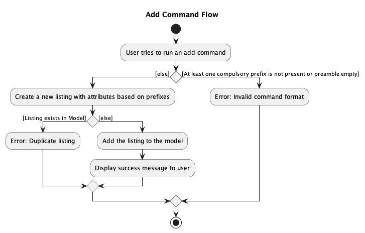
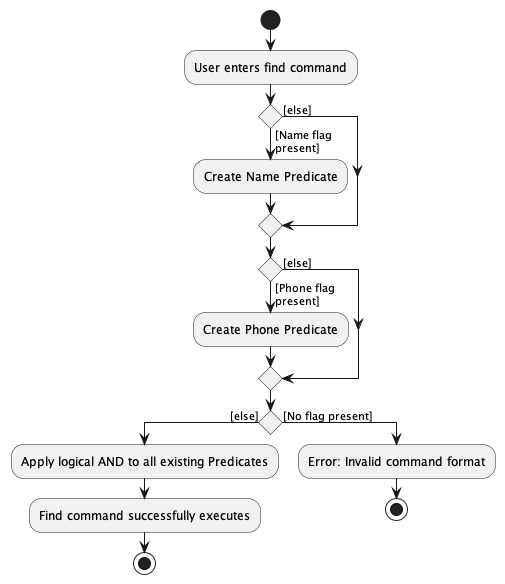

* Table of Contents
{:toc}

## **Introduction**

-------------------------------------------------------------------------------------------------------------------
_Ez-Schedule_ is a **desktop application for managing and scheduling of events, optimized for use via a Command Line
Interface** (CLI) while still providing an easy way to visualize all events through a Graphical User Interface (GUI).

_Ez-Schedule_ will benefit a fast typist who needs to plan and track upcoming events.

### **Acknowledgements**

* This project is based on the AddressBook Level 3 (AB3) project created by the SE-EDU initiative.
* Libraries used: JavaFX, JUnit5

### **Setting Up, Getting Started**

Refer to the guide [_Setting Up and Getting Started_](SettingUp.md).

## **Design**

--------------------------------------------------------------------------------------------------------------------

:bulb: **Tip:** 
The `.puml` files used to create diagrams in this document can be found in the 
[diagrams](https://github.com/AY2223S2-CS2103-W17-3/tp/blob/master/docs/diagrams/) folder. 
Refer to the [_PlantUML Tutorial_ at se-edu/guides](https://se-education.org/guides/tutorials/plantUml.html) 
to learn how to create and edit diagrams.

[MainClass]: https://github.com/AY2223S2-CS2103-W17-3/tp/blob/master/src/main/java/ezschedule/Main.java
[MainAppClass]: https://github.com/AY2223S2-CS2103-W17-3/tp/blob/master/src/main/java/ezschedule/MainApp.java
[UiClass]: https://github.com/AY2223S2-CS2103-W17-3/tp/blob/master/src/main/java/ezschedule/ui/Ui.java
[MainWindowClass]:https://github.com/AY2223S2-CS2103-W17-3/tp/blob/master/src/main/java/ezschedule/ui/MainWindow.java
[MainWindowView]: https://github.com/AY2223S2-CS2103-W17-3/tp/blob/master/src/main/resources/view/MainWindow.fxml
[LogicClass]: https://github.com/AY2223S2-CS2103-W17-3/tp/blob/master/src/main/java/ezschedule/logic/Logic.java
[ModelClass]: https://github.com/AY2223S2-CS2103-W17-3/tp/blob/master/src/main/java/ezschedule/model/Model.java
[StorageClass]: https://github.com/AY2223S2-CS2103-W17-3/tp/blob/master/src/main/java/ezschedule/storage/Storage.java

### **Architecture**

The **_Architecture Diagram_** given above explains the high-level design of the App.

Given below is a quick overview of main components and how they interact with each other.

**Main components of the architecture**

**`Main`** has two classes called [`Main`][MainClass] and [`MainApp`][MainAppClass].
It is responsible for,
* At app launch: Initializes the components in the correct sequence, and connects them up with each other.
* At shut down: Shuts down the components and invokes cleanup methods where necessary.

[**`Commons`**](#common-classes) represents a collection of classes used by multiple other components.

The rest of the App consists of four components.

* [**`UI`**](#ui-component): The UI of the App.
* [**`Logic`**](#logic-component): The command executor.
* [**`Model`**](#model-component): Holds the data of the App in memory.
* [**`Storage`**](#storage-component): Reads data from, and writes data to, the hard disk.

### **How the Architecture Components Interact With Each**

The _Sequence Diagram_ below shows how the components interact with each other for the scenario where the user issues 
the command `delete 1`.

Each of the four main components (also shown in the diagram above),

* defines its _API_ in an `interface` with the same name as the Component.
* implements its functionality using a concrete `{Component Name}Manager` class (which follows the corresponding 
  API `interface` mentioned in the previous point).

For example, the `Logic` component defines its API in the `Logic.java` interface and implements its functionality using 
the `LogicManager.java` class which follows the `Logic` interface. Other components interact with a given component 
through its interface rather than the concrete class(reason: to prevent outside component's being coupled to the 
implementation of a component), as illustrated in the (partial) class diagram below.

### **UI Component**

**API** : [`Ui.java`][UiClass]

The UI consists of a `MainWindow` that is made up of parts e.g.`CommandBox`, `ResultDisplay`, `EventListPanel`, 
`StatusBarFooter` etc. All these, including the `MainWindow`, inherit from the abstract `UiPart` class which captures 
the commonalities between classes that represent parts of the visible GUI.

The `UI` component uses the JavaFx UI framework. 
The layout of these UI parts are defined in matching `.fxml` files that are in the `src/main/resources/view` folder. 
For example, the layout of the [`MainWindow`][MainWindowClass] is specified in [`MainWindow.fxml`][MainWindowView].

The `UI` component,

* executes user commands using the `Logic` component.
* listens for changes to `Model` data so that the UI can be updated with the modified data.
* keeps a reference to the `Logic` component, because the `UI` relies on the `Logic` to execute commands.
* depends on some classes in the `Model` component, as it displays `Event` object residing in the `Model`.

### **Logic Component**

**API** : [`Logic.java`][LogicClass]

Here's a (partial) class diagram of the `Logic` component:

How the `Logic` component works:
1. When `Logic` is called upon to execute a command, it uses the `SchedulerParser` class to parse the user command.
1. This results in a `Command` object (more precisely, an object of one of its subclasses e.g., `AddCommand`) which is executed by the `LogicManager`.
1. The command can communicate with the `Model` when it is executed (e.g. to add a event).
1. The result of the command execution is encapsulated as a `CommandResult` object which is returned back from `Logic`.

The Sequence Diagram below illustrates the interactions within the `Logic` component for the `execute("delete 1")` API call.

:information_source: **Note:** 
The lifeline for `DeleteCommandParser` should end at the destroy marker (X) but due to a limitation of PlantUML,
the lifeline reaches the end of diagram.

Here are the other classes in `Logic` (omitted from the class diagram above) that are used for parsing a user command:

How the parsing works:
* When called upon to parse a user command, the `SchedulerParser` class creates an `XYZCommandParser` (`XYZ` is a placeholder for the specific command name e.g., `AddCommandParser`) which uses the other classes shown above to parse the user command and create a `XYZCommand` object (e.g., `AddCommand`) which the `AddressBookParser` returns back as a `Command` object.
* All `XYZCommandParser` classes (e.g., `AddCommandParser`, `DeleteCommandParser`, ...) inherit from the `Parser` interface so that they can be treated similarly where possible e.g, during testing.

### **Model Component**

**API** : [`Model.java`][ModelClass]

The `Model` component,

* stores the scheduler data i.e., all `Event` objects (which are contained in a `uniqueEventList` object).
* stores the currently 'selected' `Event` objects (e.g., results of a search query) as a separate _filtered_ list 
  which is exposed to outsiders as an unmodifiable `ObservableList<Event>` that can be 'observed' e.g. the UI can be 
  bound to this list so that the UI automatically updates when the data in the list change.
* stores a `UserPref` object that represents the user’s preferences. 
  This is exposed to the outside as a `ReadOnlyUserPref` objects.
* does not depend on any of the other three components (as the `Model` represents data entities of the domain, 
  they should make sense on their own without depending on other components)

### **Storage Component**

**API** : [`Storage.java`][StorageClass]

The `Storage` component,
* can save both scheduler data and user preference data in json format, and read them back into corresponding objects.
* inherits from both `SchedulerStorage` and `UserPrefStorage`, which means it can be treated as either one (if only the 
  functionality of only one is needed).
* depends on some classes in the `Model` component (because the `Storage` component's job is to save/retrieve objects that belong to the `Model`)

### **Common Classes**

Classes used by multiple components are in the `ezschedule.commons` package.

## **Implementation**

--------------------------------------------------------------------------------------------------------------------
This section describes some noteworthy details on how certain features are implemented.

### **Add Command**

  
Activity Diagram for a typical `add` command

### **Recur Command**

Activity Diagram for a typical `recur` command

### **Edit Command**

  
Activity Diagram for a typical `edit` command

### **Delete Command**

  
Activity Diagram for a typical `delete` command

### **Find Command**

  
Activity Diagram for a typical `find` command

### **Next Command**

  
Activity Diagram for a typical `next` command

### **Undo Command**

  
Activity Diagram for a typical `undo` command

### **List Command**

### **Help Command**

### **Exit Command**

## **Documentation, Logging, Testing, Configuration, Dev-Ops**

--------------------------------------------------------------------------------------------------------------------
* [Documentation guide](Documentation.md)
* [Testing guide](Testing.md)
* [Logging guide](Logging.md)
* [Configuration guide](Configuration.md)
* [DevOps guide](DevOps.md)

## **Glossary**
--------------------------------------------------------------------------------------------------------------------
* **Mainstream OS**: Windows, Linux, Unix, OS-X
* **Event**: A task with a starting time and an ending time
* **Ongoing Event**: An event that has started, but not ended
* **Upcoming Event**: An event that has not started
* **Clashing Events**: One or more events where any duration of the event overlaps with the another event

## **Appendices**

--------------------------------------------------------------------------------------------------------------------

### **Appendix A: Project Requirements**

#### **Product Scope**

**Target user profile**:
* has a need to manage a significant number of events
* prefer desktop apps over other types
* prefers visual representation of output
* is reasonably comfortable using CLI apps
* can type fast

**Value proposition**: manage events at high-level, provides faster event analysis with graphical outputs.

#### **User Stories**

Priorities: High (must have) - `* * *`, Medium (nice to have) - `* *`, Low (unlikely to have) - `*`

| Priority | As a …         | I want to …                                   | So that I can…                                                          |
|----------|----------------|-----------------------------------------------|-------------------------------------------------------------------------|
| `* * *`  | new user       | see usage instructions                        | refer to instructions when I forget how to use the App                  |
| `* * *`  | user           | add a event's schedule into the app           | see their schedules                                                     |
| `* * *`  | user           | delete an event from the app                  | remove events that are no longer scheduled                              |
| `* * *`  | user           | list all events                               | have a high-level overview of all events that I currently have          |
| `* * *`  | regular user   | save my scheduler on exit                     | reload them again next time                                             |
| `* * *`  | regular user   | load my events in the scheduler on start      | use the scheduler immediately without having to reenter all events      |
| `* *`    | clumsy user    | undo a command                                | reset the scheduler to the previous state before I made a mistake       |
| `* *`    | forgetful user | see my next event clearly                     | readily see what is upcoming for me without having to type any commands |
| `* *`    | user           | sort my events based on date and time         | readily see my upcoming events chronologically                          |
| `* *`    | regular user   | repeat an event over a certain period of time | easily repeated events in my scheduler for the same type of events      |
| `* *`    | long term user | see my monthly schedule easily                | readily see which days I am more available, or which are my busier days |
| `* *`    | forgetful user | find my next event                            | check on the next event in the scheduler                                |
| `* *`    | clumsy user    | undo accidental deletions                     | easily restore accidents in scheduling                                  |
| `* *`    | user           | find an event by name                         | locate details of events without having to go through the entire list   |
| `* *`    | user           | find an event by date                         | locate details of events without having to go through the entire list   |
| `* *`    | user           | edit my schedule                              | make changes to events                                                  |
| `* *`    | busy user      | be able to schedule many events               | schedule as many events as I want                                       |

#### **Use Cases**

(For all use cases below, the **System** is the `EZ-Schedule` and the **Actor** is the `user`, unless specified otherwise)

**Use case: Add an event**

**MSS**
1. User requests to add an event
2. System adds the event  
   Use case ends.

**Extensions**
* 1a. The event already exist.
    * 1a1. System shows an error message. 
      Use case ends.

* 1b. The given event format invalid.
    * 1b1. System shows an error message. 
      Use case ends.

* 1c. The given end time of the event is before start time.
    * 1c1. System shows an error message. 
      Use case ends.

**Use case: Recur an event**

**MSS**

1. User requests to recur an event over a period of time
2. System repeatedly adds the event 
   Use case ends.

**Extensions**

* 1a. The length of time to recur is not appropriate.
    * 1a1. System shows an error message. 
      Use case ends.

* 1b. The given event format invalid.
    * 1b1. System shows an error message. 
      Use case ends.

* 1c. The given end date of recur is in the past.
    * 1c1. System shows an error message. 
      Use case ends.

* 1d. There is a clash of events in an upcoming day.
    * 1d1. System shows an error message. 
      Use case ends.

**Use case: Edit an event**

**MSS**

1. User requests to edit an event
2. System edits the event 
   Use case ends.

**Extensions**

* 1a. The event already exist.
    * 1a1. System shows an error message. 
      Use case ends.

* 1b. The given format invalid.
    * 1b1. System shows an error message. 
      Use case ends.

**Use case: Delete an event**

**MSS**

1. User requests to delete an event/ events
2. System deletes the event(s) 
   Use case ends.

**Extensions**

* 1a. The given index/ indices is invalid.
    * 1a1. System shows an error message. 
      Use case ends.

* 1b. The given format invalid.
    * 1b1. System shows an error message. 
      Use case ends.

**Use case: Find an event by name**

**MSS**

1. User requests to find an event by name
2. System finds events with matching name
3. System displays events with matching name 
   Use case ends.

**Extensions**

* 1a. The given event format invalid.
    * 1a1. System shows an error message. 
      Use case ends.

**Use case: Show next event(s) by name**

**MSS**

1. User requests to show next x number of event(s)
2. System displays the next x number of events in chronological order 
   Use case ends.

**Extensions**

* 1a. The given event format invalid.
    * 1a1. System shows an error message. 
      Use case ends.

**Use case: Undo a delete**

**MSS**
1. User requests to undo the recent delete
2. System restores the most recent delete 
   Use case ends.

**Extensions**

* 1a. Undo is the first command given to the scheduler.
    * 1a1. System shows an error message. 
      Use case ends.

**Use case: List all events**

**MSS**

1. User requests to list all events
2. System shows all events in the scheduler 
   Use case ends.

**Use case: Get help instructions**

**MSS**

1. User requests for help instructions
2. System shows help instructions 
   Use case ends.

**Use case: Exit the application**

**MSS**

1. User requests to exit the application
2. System saves all events
3. System exits the application 
   Use case ends.

#### **Non-Functional Requirements**

1. Should work on any _mainstream OS_ as long as it has Java `11` or above installed.
2. Should be able to hold up to 1000 events without a noticeable sluggishness in performance for typical usage.
3. A user with above average typing speed for regular English text (i.e. not code, not system admin commands) should be able to accomplish most of the tasks faster using commands than using the mouse.
4. A user with colour blindness may require a high-contrast setting for graphical outputs.

*{More to be added}*

### **Appendix B: Planned Enhancements**

To resolve certain known feature flaws, we have planned to add some enhancements in the near future:

**Data Verification when loading save files**

Currently, the program reads and loads the data from the save files directly.
As long as the data is in the correct format, the data can be loaded successfully.
We plan to enhance this by verifying the validity of the data, 
that is making sure the saved events does not violate constraints such as overlapping time.

This will help to prevent errors made by advanced user who decided to modify the save files directly.
While the advanced user may be aware of the structure of the file,
knowing if the event added has conflict with any existing events can be hard,
especially if there are many existing events.

### **Appendix C: Instructions for Manual Testing**

Presented below are a series of instructions, organized in **Context, Action, Result (CAR)** format, 
that can be followed to perform manual testing of the application.

:information_source: **Note:** These instructions only provide a starting point for testers to work on;
testers are expected to do more *exploratory* testing.

#### **Launch and Shutdown**

#### Scenario 1  
{: .no_toc}  
**Context:** Initial launch

**Action:**
1. Download the jar file and copy into an empty folder
2. Double-click the jar file
3. Ensure that it is launched in `Java 11`

**Result:**  Displays the GUI with the application opened to full-screen

#### Scenario 2
{: .no_toc}  
**Context:** Normal launch

**Action:** Launch the application again (follow from scenario 1 step 2)

**Result:**  Displays the GUI with the application opened to full-screen

#### Scenario 3
{: .no_toc}  
**Context:**  Restarting the application with existing data

**Action:**
1. Click on the 'X' button located in the top-right corner of the screen
2. Double-click the jar file

**Result:**  The existing data should remain unchanged

#### **Adding an Event**

#### Scenario 1
{: .no_toc}  
**Context:** The `Event` has not yet been added to _Ez-Schedule_

**Action:** Execute the command `add n/Tennis d/2023-05-01 s/10:00 e/12:00`

**Result:** 
* The `Event` has been successfully added to _Ez-Schedule_
* Details of the `Event` is also added to the Events List Panel and the Calendar

#### Scenario 2
{: .no_toc}  
**Context:** An identical `Event` to the one being added, already exists in _Ez-Schedule_

**Action:**  Execute the command `add n/Tennis d/2023-05-01 s/10:00 e/12:00`

**Result:** The Response Box will display the message "This event already exists in the scheduler"

#### Scenario 3
{: .no_toc}  
**Context:** The selected time slot is already occupied by another `Event` in _Ez-Schedule_

**Action:**  Execute the command `add n/Tennis d/2023-05-01 s/10:00 e/12:00`

**Result:** The Response Box will display the message "Another event already exists at the chosen time"

#### **Recurring an Event**

#### Scenario 1
{: .no_toc}  
**Context:** No conflicting `Event` scheduled during the recurring time frame specified

**Action:** Execute the command: `recur 1 d/2023-05-10 every/day`

**Result:**
* The `Event` will be added repeatedly until the specified end date
* Details of all the `Event` is also added to the Events List Panel and the Calendar

#### Scenario 2
{: .no_toc}  
**Context:** Another `Event` already exist in the recurring time frame specified by the `Event` being added

**Action:** Execute the command: `recur 1 d/2023-05-10 every/day`

**Result:** The Response Box will display the message "Unable to recur. 10 May has a clashing event."

#### **Editing an Event**

#### Scenario 1
{: .no_toc}  
**Context:** There exists an `Event` with the index 1 in _Ez-Schedule_

**Action:** Execute the command: `edit 1 n/Basketball`

**Result:** The name of the `Event` has been updated to Basketball

#### Scenario 2
{: .no_toc}  
**Context:** Modify an `Event` to make it identical to another `Event` already present in _Ez-Schedule_

**Action:** Execute `edit` command with arguments identical to another existing `Event`

**Result:** The Response Box will display the message "This event already exists in the scheduler"

#### **Deleting Events**

#### Scenario 1
{: .no_toc}  
**Context:** There exists an `Event` with the index 1 in _Ez-Schedule_

**Action:** Execute the command: `delete 1`

**Result:** 
* The `Event` is removed from _Ez-Schedule_
* Details of the `Event` is also removed from the Events List Panel, Upcoming Events Panel, and the Calendar

#### Scenario 2
{: .no_toc}  
**Context:** There exists multiple `Event` with the indexes 1, 2 and 3 in _Ez-Schedule_

**Action:** Execute the command: `delete 1 2 3`

**Result:** 
* All the `Event` is removed from _Ez-Schedule_
* Details of the `Event` is also removed from the Events List Panel, Upcoming Events Panel, and the Calendar

#### Scenario 3
{: .no_toc}  
**Context:** One of the specified indexes, index 10, does not exist in _Ez-Schedule_

**Action:** Execute the command: `delete 1 2 3 10`

**Result:** 
* The Response Box will display the message "The event index 10 provided is invalid"
* None of the `Event` with valid index will be removed from _Ez-Schedule_

#### **Finding Events**

#### Scenario 1
{: .no_toc}  
**Context:** There exists at least one `Event` whose `Name` includes the word Tennis

**Action:** Execute the command: `find n/Tennis`

**Result:** 
* The Events List Panel will be updated to display only those `Event` whose `Name` includes the word Tennis
* The Calendar will highlight all the date boxes that correspond to days on which the found `Event` are scheduled

#### Scenario 2
{: .no_toc}  
**Context:** There exists at least one `Event` whose `Name` partially matches the word 'Ten'

**Action:** Execute the command: `find n/Ten`

**Result:**
* The Events List Panel will be updated to display only `Event` whose `Name` includes Ten, which may include `Name` such as Tennis
* The Calendar will highlight all the date boxes that correspond to days on which the found `Event` are scheduled

#### Scenario 3
{: .no_toc}  
**Context:** There exists at least 1 `Event` whose `Date` correspond to May 1, 2023

**Action:** Execute the command: `find d/2023-05-01`

**Result:**
* The Events List Panel will be updated to display only those `Event` whose `Date` are May 1, 2023
* The date box for May 1, 2023 will be highlighted on the Calendar

#### Scenario 4
{: .no_toc}  
**Context:** There exists at least one `Event` whose `Name` includes the word Tennis and `Date` corresponds to May 1, 2023

**Action:** Execute the command: `find n/Tennis d/2023-05-01`

**Result:**
* The Events List Panel will be updated to display only those `Event` whose `Name` includes the word Tennis and `Date` are May 1, 2023
* The date box for May 1, 2023 will be highlighted on the Calendar

#### **Show Next Events**

#### Scenario 1
{: .no_toc}  
**Context:** None needed

**Action:** Execute the command: `next`

**Result:**
* The Response Box will display the message "1 events listed!"
* The Upcoming Events Panel will display the next upcoming or ongoing event that you have

#### Scenario 2
{: .no_toc}  
**Context:** There exists at least two upcoming or ongoing `Event`

**Action:** Execute the command: `next 2`

**Result:**
* The Response Box will display the message "2 events listed!"
* The Upcoming Events Panel will display the next 2 upcoming or ongoing event that you have

#### **Undo a Command**

#### Scenario 1
{: .no_toc}  
**Context:** None needed

**Action:**
1. Execute the command: `add n/Tennis d/2023-05-01 s/10:00 e/12:00`
2. Execute the command: `undo`  

**Result:** 
* The Response Box will display the message "Action undone: add"
* The Tennis `Event` that was added will be removed from _Ez-Schedule_

#### Scenario 2
{: .no_toc}  
**Context:** No conflicting `Event` scheduled during the recurring time frame specified

**Action:**
1. Execute the command: `recur 1 d/2023-05-10 every/recur`
2. Execute the command: `undo`

**Result:**
* The Response Box will display the message "Action undone: recur"
* All the `Event` that was added will be removed from _Ez-Schedule_

#### Scenario 3
{: .no_toc}  
**Context:** There exists an `Event` with an index 1 and a `Name` of Tennis in _Ez-Schedule_

**Action:**
1. Execute the command: `edit 1 n/Basketball`
2. Execute the command: `undo`

**Result:**
* The Response Box will display the message "Action undone: edit"
* The Tennis `Event` that was edited to Basketball will be changed back to Tennis

#### Scenario 4
{: .no_toc}  
**Context:** There exists an `Event` with an index 1 in _Ez-Schedule_

**Action:**
1. Execute the command: `delete 1`
2. Execute the command: `undo`

**Result:**
* The Response Box will display the message "Action undone: delete"
* The `Event` with index 1 that was deleted is added back into _Ez-Schedule_

### **Appendix D: Effort**

**Difficulty Level:** 

**Challenges Faced:**
* During the first milestone, we decided to "morph" by creating a parallel package and using AB3 as code reference.
  We would copy over whichever code we deem relevant. Halfway through the milestone, one of us realised that doing this
  possibly violated [`Constraint-Brownfield`][tp constraints brownfield]. After checking with our tutor/prof, we had to
  restart again, effectively wasting our effort and restricting our duration for `milestone 1` by half.
* During morphing, the refactor of `Person` to `Event`, as well as `AddressBook` to `Scheduler` was tedious and
  required a lot of careful checking. Despite using IDE features like refactor and find-and-replace, there were
  still variable name and comments which we had to change, and we had to painstakingly double-check everything.
* Furthermore, the morphing process also invalidated many of the existing test cases (from AB3) resulting in the 
  Java CI failing for a prolonged period. We spend a lot of time in `milestone 2` changing/fixing the broken test 
  cases, which left us with not a lot of time to implement new features in `milestone 2` and `milestone 3`.

**Effort Required:** High effort for the morphing process.

**Achievements of Project:**

[tp constraints brownfield]: https://nus-cs2103-ay2223s2.github.io/website/admin/tp-constraints.html#constraint-brownfield
