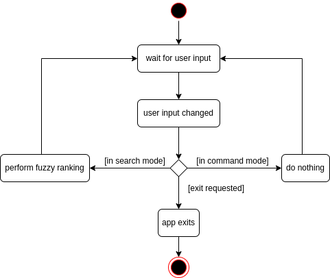

* Table of Contents
{:toc}

--------------------------------------------------------------------------------------------------------------------

## **Acknowledgements**

* {list here sources of all reused/adapted ideas, code, documentation, and third-party libraries -- include links to the original source as well}

--------------------------------------------------------------------------------------------------------------------

## **Setting up, getting started**

Refer to the guide [_Setting up and getting started_](SettingUp.md).

--------------------------------------------------------------------------------------------------------------------

## **Design**

:bulb: **Tip:** The `.puml` files used to create diagrams in this document can be found in the [diagrams](https://github.com/se-edu/addressbook-level3/tree/master/docs/diagrams/) folder. Refer to the [_PlantUML Tutorial_ at se-edu/guides](https://se-education.org/guides/tutorials/plantUml.html) to learn how to create and edit diagrams.

### Architecture

The ***Architecture Diagram*** given above explains the high-level design of the App.

Given below is a quick overview of main components and how they interact with each other.

**Main components of the architecture**

**`Main`** has two classes called [`Main`](https://github.com/se-edu/addressbook-level3/tree/master/src/main/java/seedu/address/Main.java) and [`MainApp`](https://github.com/se-edu/addressbook-level3/tree/master/src/main/java/seedu/address/MainApp.java). It is responsible for,
* At app launch: Initializes the components in the correct sequence, and connects them up with each other.
* At shut down: Shuts down the components and invokes cleanup methods where necessary.

[**`Commons`**](#common-classes) represents a collection of classes used by multiple other components.

The rest of the App consists of four components.

* [**`UI`**](#ui-component): The UI of the App.
* [**`Logic`**](#logic-component): The command executor.
* [**`Model`**](#model-component): Holds the data of the App in memory.
* [**`Storage`**](#storage-component): Reads data from, and writes data to, the hard disk.

**How the architecture components interact with each other**

The *Sequence Diagram* below shows how the components interact with each other for the scenario where the user issues the command `delete 1`.

Each of the four main components (also shown in the diagram above),

* defines its *API* in an `interface` with the same name as the Component.
* implements its functionality using a concrete `{Component Name}Manager` class (which follows the corresponding API `interface` mentioned in the previous point.

For example, the `Logic` component defines its API in the `Logic.java` interface and implements its functionality using the `LogicManager.java` class which follows the `Logic` interface. Other components interact with a given component through its interface rather than the concrete class (reason: to prevent outside component's being coupled to the implementation of a component), as illustrated in the (partial) class diagram below.

The sections below give more details of each component.

### UI component

The **API** of this component is specified in [`Ui.java`](https://github.com/se-edu/addressbook-level3/tree/master/src/main/java/seedu/address/ui/Ui.java)

The UI consists of a `MainWindow` that is made up of parts e.g.`CommandBox`, `ResultDisplay`, `PersonListPanel`, `StatusBarFooter` etc. All these, including the `MainWindow`, inherit from the abstract `UiPart` class which captures the commonalities between classes that represent parts of the visible GUI.

The `UI` component uses the JavaFx UI framework. The layout of these UI parts are defined in matching `.fxml` files that are in the `src/main/resources/view` folder. For example, the layout of the [`MainWindow`](https://github.com/se-edu/addressbook-level3/tree/master/src/main/java/seedu/address/ui/MainWindow.java) is specified in [`MainWindow.fxml`](https://github.com/se-edu/addressbook-level3/tree/master/src/main/resources/view/MainWindow.fxml)

The `UI` component,

* executes user commands using the `Logic` component.
* listens for changes to `Model` data so that the UI can be updated with the modified data.
* keeps a reference to the `Logic` component, because the `UI` relies on the `Logic` to execute commands.
* depends on some classes in the `Model` component, as it displays `Person` object residing in the `Model`.

### Logic component

**API** : [`Logic.java`](https://github.com/se-edu/addressbook-level3/tree/master/src/main/java/seedu/address/logic/Logic.java)

Here's a (partial) class diagram of the `Logic` component:

How the `Logic` component works:
1. When `Logic` is called upon to execute a command, it uses the `AddressBookParser` class to parse the user command.
1. This results in a `Command` object (more precisely, an object of one of its subclasses e.g., `AddProjectCommand`) which is executed by the `LogicManager`.
1. The command can communicate with the `Model` when it is executed (e.g. to add a project).
1. The result of the command execution is encapsulated as a `CommandResult` object which is returned back from `Logic`.

The Sequence Diagram below illustrates the interactions within the `Logic` component for the `execute("dp -pn Mycelium")` API call.

:information_source: **Note:** The lifeline for `DeleteProjectCommandParser` should end at the destroy marker (X) but due to a limitation of PlantUML, the lifeline reaches the end of diagram.

Here are the other classes in `Logic` (omitted from the class diagram above) that are used for parsing a user command:

How the parsing works:
* When called upon to parse a user command, the `AddressBookParser` class creates an `XYZCommandParser` (`XYZ` is a placeholder for the specific command name e.g., `AddProjectCommandParser`) which uses the other classes shown above to parse the user command and create a `XYZCommand` object (e.g., `AddProjectCommand`) which the `AddressBookParser` returns back as a `Command` object.
* All `XYZCommandParser` classes (e.g., `AddProjectCommandParser`, `DeleteProjectCommandParser`, ...) inherit from the `Parser` interface so that they can be treated similarly where possible e.g, during testing.

### Model component
**API** : [`Model.java`](https://github.com/se-edu/addressbook-level3/tree/master/src/main/java/seedu/address/model/Model.java)

The `Model` component,

* stores the address book data i.e., all `Person` objects (which are contained in a `UniquePersonList` object).
* stores the currently 'selected' `Person` objects (e.g., results of a search query) as a separate _filtered_ list which is exposed to outsiders as an unmodifiable `ObservableList<Person>` that can be 'observed' e.g. the UI can be bound to this list so that the UI automatically updates when the data in the list change.
* stores a `UserPref` object that represents the user’s preferences. This is exposed to the outside as a `ReadOnlyUserPref` objects.
* does not depend on any of the other three components (as the `Model` represents data entities of the domain, they should make sense on their own without depending on other components)

:information_source: **Note:** An alternative (arguably, a more OOP) model is given below. It has a `Tag` list in the `AddressBook`, which `Person` references. This allows `AddressBook` to only require one `Tag` object per unique tag, instead of each `Person` needing their own `Tag` objects. 

### Smaller components used by Model component
***Classes:*** [`Client.java`](https://github.com/AY2223S2-CS2103T-W14-1/tp/blob/master/src/main/java/mycelium/mycelium/model/client/Client.java), [`Project.java`](https://github.com/AY2223S2-CS2103T-W14-1/tp/blob/master/src/main/java/mycelium/mycelium/model/client/Client.java)

The `Model` box is the central component of the Mycelium's data. It contains
the entities `Client` and `Project` which are used to store the data of each
entity.

The `Client` class contains the attributes for a client's `Name`, `Email`,
`YearOfBirth`, source and `Phone` number, where the name and email are
compulsory fields. The rest of the attributes are optional, and hence stored in
`Optional` objects. The source attribute is a `String`.

The `Project` class contains the attributes for a project's `Name`,
`ProjectStatus`, `Email`, source, description, acceptedOn and deadline, where
the project name and email are compulsory fields. The rest of the attributes
are optional, where source, description and deadline are wrapped in `Optional`
objects. These optional attributes are typed:

- source: String
- projectStatus: `ProjectStatus`
- description: String
- acceptedOn: `LocalDate`
- deadline: `LocalDate`

Each entity uses different methods, which they inherit from `ClientModel` and
`ProjectModel` interface via the `Model` interface respectively.

Moreover, each entity is also stored in a `UniqueList`, which ensures that the
list do not contain duplicates. `UniqueList` from each entity is then stored in
`AddressBook`, which contains the overarching methods for handling each type of
list. 

### Storage component

**API** : [`Storage.java`](https://github.com/se-edu/addressbook-level3/tree/master/src/main/java/seedu/address/storage/Storage.java)

The `Storage` component,
* can save both address book data and user preference data in json format, and read them back into corresponding objects.
* inherits from both `AddressBookStorage` and `UserPrefStorage`, which means it can be treated as either one (if only the functionality of only one is needed).
* depends on some classes in the `Model` component (because the `Storage` component's job is to save/retrieve objects that belong to the `Model`)

### Common classes

Classes used by multiple components are in the `mycelium.mycelium.commons` package.

--------------------------------------------------------------------------------------------------------------------

## **Implementation**

This section describes some noteworthy details on how certain features are implemented.

### \[Proposed\] Undo/redo feature

#### Proposed Implementation

The proposed undo/redo mechanism is facilitated by `VersionedAddressBook`. It extends `AddressBook` with an undo/redo history, stored internally as an `addressBookStateList` and `currentStatePointer`. Additionally, it implements the following operations:

* `VersionedAddressBook#commit()` — Saves the current address book state in its history.
* `VersionedAddressBook#undo()` — Restores the previous address book state from its history.
* `VersionedAddressBook#redo()` — Restores a previously undone address book state from its history.

These operations are exposed in the `Model` interface as `Model#commitAddressBook()`, `Model#undoAddressBook()` and `Model#redoAddressBook()` respectively.

Given below is an example usage scenario and how the undo/redo mechanism behaves at each step.

Step 1. The user launches the application for the first time. The `VersionedAddressBook` will be initialized with the initial address book state, and the `currentStatePointer` pointing to that single address book state.

Step 2. The user executes `delete 5` command to delete the 5th person in the address book. The `delete` command calls `Model#commitAddressBook()`, causing the modified state of the address book after the `delete 5` command executes to be saved in the `addressBookStateList`, and the `currentStatePointer` is shifted to the newly inserted address book state.

Step 3. The user executes `add n/David …​` to add a new person. The `add` command also calls `Model#commitAddressBook()`, causing another modified address book state to be saved into the `addressBookStateList`.

:information_source: **Note:** If a command fails its execution, it will not call `Model#commitAddressBook()`, so the address book state will not be saved into the `addressBookStateList`.

Step 4. The user now decides that adding the person was a mistake, and decides to undo that action by executing the `undo` command. The `undo` command will call `Model#undoAddressBook()`, which will shift the `currentStatePointer` once to the left, pointing it to the previous address book state, and restores the address book to that state.

:information_source: **Note:** If the `currentStatePointer` is at index 0, pointing to the initial AddressBook state, then there are no previous AddressBook states to restore. The `undo` command uses `Model#canUndoAddressBook()` to check if this is the case. If so, it will return an error to the user rather
than attempting to perform the undo.

The following sequence diagram shows how the undo operation works:

:information_source: **Note:** The lifeline for `UndoCommand` should end at the destroy marker (X) but due to a limitation of PlantUML, the lifeline reaches the end of diagram.

The `redo` command does the opposite — it calls `Model#redoAddressBook()`, which shifts the `currentStatePointer` once to the right, pointing to the previously undone state, and restores the address book to that state.

:information_source: **Note:** If the `currentStatePointer` is at index `addressBookStateList.size() - 1`, pointing to the latest address book state, then there are no undone AddressBook states to restore. The `redo` command uses `Model#canRedoAddressBook()` to check if this is the case. If so, it will return an error to the user rather than attempting to perform the redo.

Step 5. The user then decides to execute the command `list`. Commands that do not modify the address book, such as `list`, will usually not call `Model#commitAddressBook()`, `Model#undoAddressBook()` or `Model#redoAddressBook()`. Thus, the `addressBookStateList` remains unchanged.

Step 6. The user executes `clear`, which calls `Model#commitAddressBook()`. Since the `currentStatePointer` is not pointing at the end of the `addressBookStateList`, all address book states after the `currentStatePointer` will be purged. Reason: It no longer makes sense to redo the `add n/David …​` command. This is the behavior that most modern desktop applications follow.

The following activity diagram summarizes what happens when a user executes a new command:

#### Design considerations:

**Aspect: How undo & redo executes:**

* **Alternative 1 (current choice):** Saves the entire address book.
  * Pros: Easy to implement.
  * Cons: May have performance issues in terms of memory usage.

* **Alternative 2:** Individual command knows how to undo/redo by
  itself.
  * Pros: Will use less memory (e.g. for `delete`, just save the person being deleted).
  * Cons: We must ensure that the implementation of each individual command are correct.

_{more aspects and alternatives to be added}_

### \[Proposed\] Data archiving

_{Explain here how the data archiving feature will be implemented}_

### Fuzzy searching

A fuzzy search searches for text that matches a term closely instead of
exactly. In Mycelium, this is implemented using [Levenshtein
distance](https://en.wikipedia.org/wiki/Levenshtein_distance). A higher
distance corresponds to a better match; a lower distance corresponds to a worse
match. The goal of this feature is to provide interactive fuzzy searching and
display sorted results such that the best match is at the top; here,
"interactive" means that results are ranked and displayed *as* the user types
their query.

:information_source: **Note:** We will use the terms "fuzzy search" and "fuzzy
find" interchangeably in this document. The term "fuzzy ranking" refers to the
entire routine of processing items, computing their Levenshtein distance
against some input, and sorting them such that the closest matches are at the
front.

The main algorithm is in `Fuzzy#delta`, which is a pure function computing the
distance between two strings. In order to use it from the application, we also
have the `FuzzyManager` class which simplifies the task of ranking clients and
projects. The class diagram below shows a high level overview of the classes
involved.

First, we briefly note that since the same command input box must be toggled
between use for regular commands (e.g. for basic CRUD) as well as for fuzzy
searching, the `CommandBox` has a `mode` attribute to help it distinguish
between the two states. (The toggling between states is handled by key actions,
which is discussed in another section.) The `Mode` abstract class is
responsible for taking action upon changes in user input. In particular, the
`SearchMode` class encapsulates the logic required to handle search requests
(via a change in user input) as well as applying updates to the UI. The
following sequence diagrams illustrate this in further detail.

The two figures above illustrate the end to end sequence between a change in
user input (e.g. a user types a single character) until the updating of the UI.
The `handleInputChanged()` method on `CommandBox` is invoked by JavaFX, and the
contents of the command box are passed to a `SearchMode` instance to handle.
From here, it is a three-step process.

1. Retrieve an unmodified view of the clients and projects from a `Logic` instance
1. Pass the two lists through the `FuzzyManager#rankItems` method, which
   performs fuzzy ranking on the lists of clients and projects
1. Apply the two ranked lists to the `MainWindow`

The `FuzzyManager#rankItems` method is just a convenient pure function which,
when given a list of clients or projects and a query string, constructs a new
sorted and filtered list based on how well each item matches the query. It
relies on the algorithm implemented within the `Fuzzy` class.

#### Ranking considerations

For ease of use, there is a `Fuzzy#ratio` method which wraps `Fuzzy#delta`.
The former returns a score between 0 and 1, where 0 means that the two strings
are completely different, and 1 means the two are identical. Let us call this
number the *delta score* of two strings.

Thus, the entire ranking process can be described as such:

1. Compute the delta score of each project and client's name against the input text
1. Sort the projects and clients by descending scores
1. Prune the projects and clients whose score is below a certain threshold

Note that we have not specified the threshold in the last point. At the moment,
the threshold is set to zero, meaning only strings which are *completely*
different (i.e. not even a single character matches) are pruned. Raising the
threshold would reduce the number of results displayed; thus, this is a point
for potential fine-tuning in the future.

#### `CommandBox` state

As mentioned above, the same command box is used for entering regular commands
as well as fuzzy searching, so we need some way to track the state of the
command box, i.e. at any point in time, whether it should be taking in commands
or performing fuzzy searching. This is achieved through a `mode` attribute on
the `CommandBox` class. At the time of writing, there are two modes in used -
`CommandMode`, which is the usual mode used for entering commands to, for
instance, create a project, and `SearchMode`, which allows the command box to
function as an interactive search bar.

The class diagram below gives an overview of the `Mode` abstract class. The two
methods of interest are `onInputChange()` and `onInputSubmit()`. The latter is
invoked by `CommandBox` when the user pressed enter, while the former is
invoked upon every change in the input. Thus, `SearchMode` implements its logic
in the `onInputChange()` method.

The activity diagram below illustrates this dispatching of state concerning
changes in user input.

#### Updating the UI

From the second sequence diagram above, we see that updates to the UI after
fuzzy ranking is done via two setters - `MainWindow#setClients` and
`MainWindow#setProjects`. This departs from the model used in our CRUD
operations, where (immutable) references to a `FilteredList` of clients and
projects were obtained upon UI initialization, and any changes such as the
creation or deletion of a client were automatically propagated to the UI with
no additional setters required in our application's code.

However, the inclusion of fuzzy search introduces an important requirement -
*sorting*. We wish to modify the order of items based on how well they match
the user's input, *and* filter out the items which match poorly. Furthermore,
upon the user exiting fuzzy search mode, we need to revert the user's view of
clients and projects back to the way it was, before fuzzy searching began.

In order to decouple these requirements from the more basic ones of CRUD, we
avoid modifying the original `FilteredList` owned by the UI. The general idea
is to replace the two lists of projects and clients every time the fuzzy
ranking is performed. Thus the fuzzy ranking is free to perform any kind of
sorting and filtering it requires without worrying about any unintentional
side-effects on the UI. After the user exits from fuzzy finding mode, the UI
then retrieves a clean reference to the lists of clients and projects from the
address book, which automatically reverts it to its pre-fuzzy state.

### Statistics Dashboard

Statistics Dashboard displays statistics regarding Projects. There are three 
main statistics: projects that are due within one week, projects that are overdue
and a pie chart showing progress overview. The goal of this feature is to provide users 
with useful information related to productivity to make adjustments accordingly.

For projects that are due within one week, only top three projects that match the 
condition will be displayed to ensure that users can focus on the most urgent projects. 

For overdue list, all overdue projects will be displayed to make sure that users can 
keep track of all the deadlines they have missed. 

For progress overview pie chart, there will be at most three segments. The three segments 
will correspond to three project statuses, which are `not_started`, `done` and `in_progress`.
The size of each segment is proportional to the number of projects with its corresponding segment
label. 

#### Updating the UI

For due project lists, overdue project lists and pie chart, `FilteredList` retrieved by 
using `Logic#getFilteredProjectList` cannot be used because it will affect the UI. Besides, 
all the statistics need filtering out, making it not possible to use `FilteredList#setPredicate`. 
Thus, for the dashboard to update accordingly as changes are made to project list, a `ListChangeListener` 
will be attached to the original list of projects. Whenever there is a change in the project list (e.g. 
a new project is added), all the statistics will be updated as well.
Moreover, when there are no projects available, there will be messages displayed.

This diagram above shows us that the MainWindow is responsible for instantiating the StatisticsBox. 
The fillInnerParts() method is part of the UI's initialization routine. The `ObservableList<Project>#addListener()`
will be called to listen for changes in project list. The remaining methods are not important in this discussion. 

### UiEvents

UiEvents is an abstraction of Keyboard events that can trigger some changes in
user interface and its behaviour. The `UiEventManager` class is responsible of
bundling all UiEvents that can occur. The following is the class diagram of the
`UiEventManager` class.

There are currently 3 registered event handlers, namely:
* `HelpKey` (F1)
  * Opens up the help menu, and focuses on it if already opened
* `FindKey` (Ctrl+F)
  * toggles between CommandMode and SearchMode.
* `SwitchKey` (Ctrl+W)
  * Switches between the tabs

#### UiEvent Handling
When a keyboard input is registered, the `UiEventManager#catchAndExecute(KeyEvent)`
method will be called. The following is the sequence diagram for the mentioned method.

The key combination that triggered the event will be checked against each of the 3
registered event handlers *(`HelpKey`, `FindKey`, and `SwitchKey`)*. Once there is a match,
an instance of the event handler will be created, executed and the event consumed to
prevent the event from propagating any further.

##### `HelpKey`

##### `FindKey`

#### `SwitchKey`

--------------------------------------------------------------------------------------------------------------------

## **Documentation, logging, testing, configuration, dev-ops**

* [Documentation guide](Documentation.md)
* [Testing guide](Testing.md)
* [Logging guide](Logging.md)
* [Configuration guide](Configuration.md)
* [DevOps guide](DevOps.md)

--------------------------------------------------------------------------------------------------------------------

## **Appendix: Requirements**

### Product scope

**Target user profile**:
**Freelance Devs**

Freelance web developers with postings on multiple online marketplaces for digital services (e.g. Fiverr) who want to manage projects and clients easily while tracking their contract terms and hours spent per project.

**Value proposition**:
Mycelium strives to be a one-stop shop for freelance web developers to consolidate projects from multiple sources. Manage descriptive yet concise information about each client, all through an intuitive console-first interface. Mycelium is tailored for the modern web developer, enabling you to build strong and trusted relationships with clients.

### User stories

Priorities: High (must have) - `* * *`, Medium (nice to have) - `* *`, Low (unlikely to have) - `*`

| Priority | As a ...               | I want to ...                                                                                                  | So that ...                                                                          |
|----------|------------------------|----------------------------------------------------------------------------------------------------------------|--------------------------------------------------------------------------------------|
| * * *    | user                   | easily access each project by name for convenience.                                                            |                                                                                      |
| * * *    | user                   | create new projects and contacts.                                                                              |                                                                                      |
| * * *    | user                   | delete projects and contacts I no longer need.                                                                 |                                                                                      |
| * * *    | user                   | use the application on different platforms and operating systems.                                              |                                                                                      |
| *        | new user               | experience an intuitive user-interface. There should be help messages to guide me around the features.         | I can refer to instructions when I forget how to use the App                         |
| *        | user                   | efficiently log information about a new client                                                                 | I minimise the effort and time needed to start a project.                            |
| *        | new user               | login using my GitHub account                                                                                  | it is convenient to login.                                                           |
| *        | new user               | sign up using email and password                                                                               | I can avoid using third party authentication sources, like GitHub or Google.         |
| *        | forgetful user         | be reminded of up coming deadlines                                                                             | I will not miss out any deliverables set by clients.                                 |
| *        | user                   | easily categorise the type of each project I have been working on                                              | it is easier to reflect on in the future and navigate.                               |
| *        | user                   | view statistics related to productivity (which channel I gain most projects, money from)                       | I know which project to put more focus on to earn better money.                      |
| *        | user                   | track my client’s payment status                                                                               | transaction management would be fuss-free.                                           |
| *        | user                   | track my project’s progress                                                                                    | I can provide timely updates to my clients.                                          |
| *        | user                   | track the time I have worked on for each project                                                               | I can ensure I have allocated time for the different projects I am working on.       |
| *        | user                   | easily view all of my freelance job requests from Fiverr and Upwork in one place.                              |                                                                                      |
| *        | user                   | update my availability status for each platform in one place                                                   | I don't miss out on job offers due to scheduling conflicts.                          |
| *        | user                   | store client information, such as contact details and project specifications, in one place                     | I can quickly access it when needed.                                                 |
| *        | user with many clients | easily communicate with clients through the product                                                            | I can streamline my workflow and avoid having to switch between different platforms. |
| *        | user                   | receive notifications when I receive new job offers or when deadlines are approaching                          | I can stay on top of my workload.                                                    |
| *        | user                   | easily generate invoices for each freelance job and track payment status                                       | I can manage my finances more effectively.                                           |
| *        | user                   | easily rate and review clients                                                                                 | I can make informed decisions about which jobs to accept in the future.              |
| *        | user                   | follow the work of other developers                                                                            | I can find opportunities to collaborate.                                             |
| *        | user                   | use the app to estimate the amount of time that I will need for a project                                      | I can determine if I have the capacity to take on new projects.                      |
| *        | user                   | keep in contact with other developers                                                                          | I can work on larger projects efficiently.                                           |
| *        | user                   | update details of existing projects and contacts                                                               | I can keep up with changing requirements of clients.                                 |
| *        | user                   | personalize my contacts                                                                                        | I can know each client better                                                        |
| *        | user                   | export data from the product in different formats, such as CSV or Excel                                        | I can use the information elsewhere.                                                 |
| *        | user                   | securely store confidential information, such as client details                                                | I can keep sensitive information safe.                                               |
| *        | user                   | use the product offline                                                                                        | I can access my information when I don't have an internet connection.                |
| *        | user                   | easily search and filter projects based on specific criteria, such as deadline, client name, or project status | I can quickly find the information I need.                                           |

### Use cases

(For all use cases below, the **System** is the `Mycelium` and the **Actor** is the `user`, unless specified otherwise)

**Use case: Create a project**

**MSS**

1. User enters command and submits details for new project
2. Mycelium creates the project
3. User can view the new project listed in panel

   Use case ends.

**Extensions**

* 1a. Required project details are not provided.
   * 1a1. Mycelium shows an error message.

   Use case resumes at step 1.

* 1b. Some projet details are invalid.
   * 1b1. Mycelium shows an error message.

   Use case resumes at step 1.

**Use case: Create a client**

**MSS**

1. User enters command and submits details for new client
2. Mycelium creates the client
3. User can view the new client listed in panel

   Use case ends.

**Extensions**

* 1a. Required client details are not provided.
   * 1a1. Mycelium shows an error message.

   Use case resumes at step 1.

* 1b. Some project details are invalid.
   * 1b1. Mycelium shows an error message.

   Use case resumes at step 1.

**Use case: Delete a project**

**MSS**

1. User enters command and submits name of project to delete
2. Mycelium deletes the project
3. User can no longer see project listed in panel

   Use case ends.

**Extensions**

* 1a. Project with submitted name does not exist.
   * 1a1. Mycelium shows an error message.

   Use case resumes at step 1.

**Use case: Delete a client**

**MSS**

1. User enters command and submits email of client to delete
2. Mycelium deletes the client
3. User can no longer see client listed in panel

   Use case ends.

**Extensions**

* 1a. Client with submitted email does not exist.
   * 1a1. Mycelium shows an error message.

   Use case resumes at step 1.

### Non-Functional Requirements

1.  Should work on any _mainstream OS_ as long as it has Java `11` or above installed.
1.  Should be able to hold up to 1000 clients without a noticeable sluggishness in performance for typical usage.
1.  Should be able to hold up to 1000 projects without a noticable sluggishness in performance for typical usage.
1.  A user with above average typing speed for regular English text (i.e. not code, not system admin commands) should be able to accomplish most of the tasks faster using commands than using the mouse.
1.  All user operations should complete under 100ms.
1.  Should not lose any work in case the application crashes.
1.  Data persists when the application restarts.

*{More to be added}*

### Glossary

* **Console-first Interface**: An interface with interactions primarily through
                               text commands
* **Project**: A freelance software development job
* **Client**: An individual associated with a particular project

--------------------------------------------------------------------------------------------------------------------

## **Appendix: Instructions for manual testing**

Given below are instructions to test the app manually.

:information_source: **Note:** These instructions only provide a starting point for testers to work on;
testers are expected to do more *exploratory* testing.

### Launch and shutdown

1. Initial launch

   1. Download the jar file and copy into an empty folder

   1. Double-click the jar file Expected: Shows the GUI with a set of sample contacts. The window size may not be optimum.

1. Saving window preferences

   1. Resize the window to an optimum size. Move the window to a different location. Close the window.

   1. Re-launch the app by double-clicking the jar file. 
       Expected: The most recent window size and location is retained.

1. _{ more test cases …​ }_

### Deleting a person

1. Deleting a person while all persons are being shown

   1. Prerequisites: List all persons using the `list` command. Multiple persons in the list.

   1. Test case: `delete 1` 
      Expected: First contact is deleted from the list. Details of the deleted contact shown in the status message. Timestamp in the status bar is updated.

   1. Test case: `delete 0` 
      Expected: No person is deleted. Error details shown in the status message. Status bar remains the same.

   1. Other incorrect delete commands to try: `delete`, `delete x`, `...` (where x is larger than the list size) 
      Expected: Similar to previous.

1. _{ more test cases …​ }_

### Saving data

1. Dealing with missing/corrupted data files

   1. _{explain how to simulate a missing/corrupted file, and the expected behavior}_

1. _{ more test cases …​ }_
