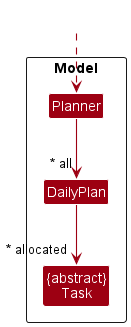
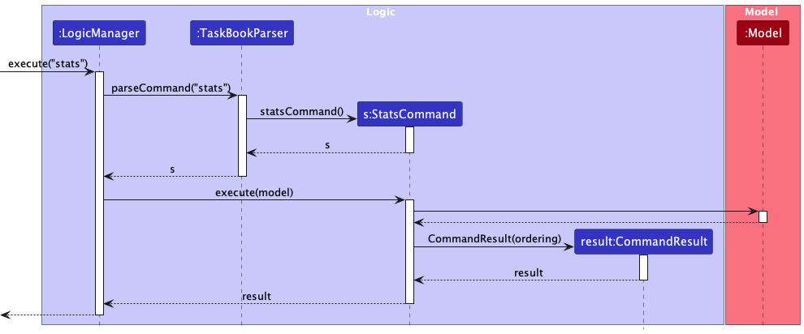
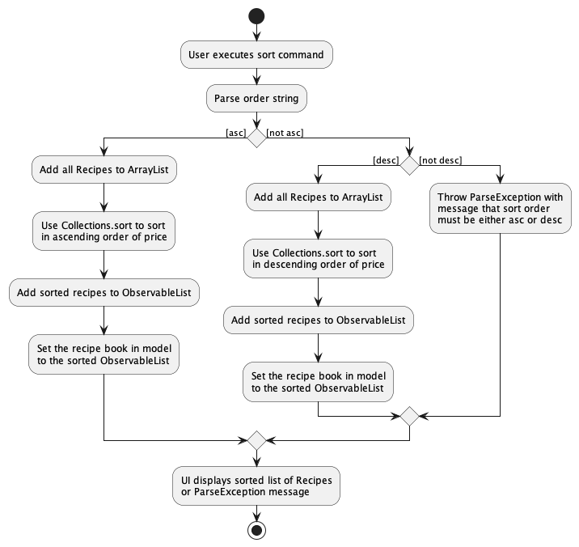
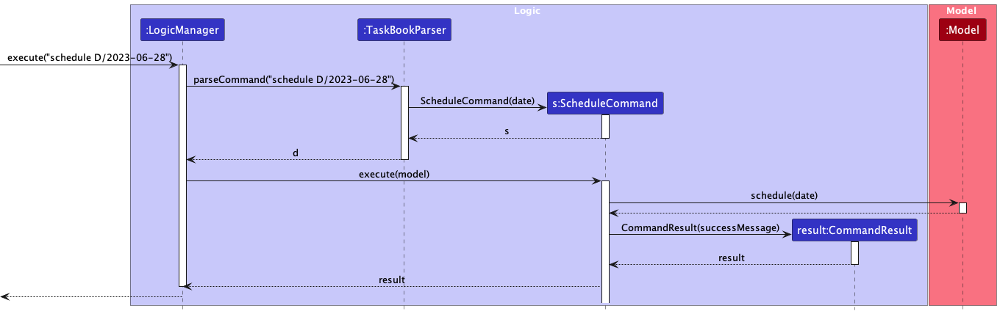
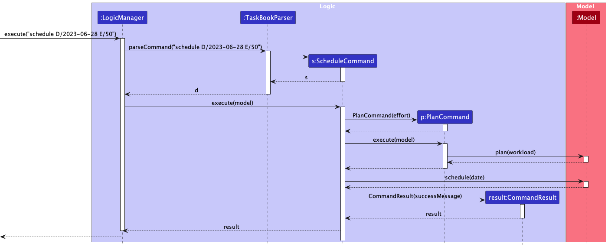

* Table of Contents
  * [1. Introduction](#1-introduction)
    * [1.1 Acknowledgements](#11-acknowledgements)
    * [1.2 Setting up, getting started](#12-setting-up-getting-started)
  * [2. Design](#2-design)
    * [2.1 Architecture](#21-architecture)
    * [2.2 UI Component](#22-ui-component)
    * [2.3 Logic Component](#23-logic-component)
    * [2.4 Model Component](#24-model-component)
    * [2.5 Storage Component](#25-storage-component)
    * [2.6 Common Classes](#26-common-classes)
  * [3. Implementation](#3-implementation)
    * [3.1 Add Feature](#31-add-feature)
      * [3.1.1 Add a subsection](#311-add-a-subsection)
      * [3.1.2 Delete a subsection](#312-delete-a-subsection)
    * [3.2 Clear Feature](#32-clear-feature)
    * [3.3 Delete Feature](#33-delete-feature)
    * [3.4 Edit Feature](#34-edit-feature)
    * [3.5 Find Feature](#35-find-feature)
    * [3.6 List Feature](#36-list-feature)
    * [3.7 Help Feature](#37-help-feature)
    * [3.8 Stats Feature](#38-stats-feature)
    * [3.9 Sort Feature](#39-sort-feature)
    * [3.10 Alert Feature](#310-alert-feature)
    * [3.11 Schedule Feature](#311-schedule-feature)
      * [3.11.1 How it works](#3111-how-it-works) 
      * [3.11.2 Generating a new plan](#3112-generating-a-new-plan)
    * [3.12 Tag Color Codes](#312-tag-color-codes)
  * [4. Documentation, Logging, Testing, Configuration, DevOps](#4-documentation-logging-testing-configuration-dev-ops)
  * [5. Appendix: Requirements](#5-appendix-requirements)
  * [6. Appendix: Instructions for manual testing](#6-appendix-instructions-for-manual-testing)
  * [7. Appendix: Planned Enhancements](#7-appendix-planned-enhancements)
    * [7.1 Accommodating long inputs](#71-accommodating-long-inputs)
    * [7.2 Enabling find by subsection](#72-enabling-find-by-subsection)
    * [7.3 Enabling edit by subsection](#73-enabling-edit-by-subsection)
    * [7.4 Enabling schedule by subsection](#74-enabling-schedule-by-subsection)
    * [7.5 Enabling sort by subsection](#75-enabling-sort-by-subsection)
    * [7.6 Better error messages](#76-better-error-messages)

--------------------------------------------------------------------------------------------------------------------

## 1. Introduction

This Developer Guide details Clock-Work's design and implementation details.

Clock-Work is a **desktop application for managing tasks, optimized for use via a Command Line Interface** (CLI) while still having the benefits of a Graphical User Interface (GUI).
It is an application curated for the average Computer Science student, and supports basic commands like `add`, `edit`, `delete`, and advanced commands like `alert`, `schedule`, `find`.
By helping Computer Science students plan their time more efficiently, Clock-Work aims to make the busy Computing life a little more manageable.

This guide is meant for developers who are interested in Clock-Work, and want to contribute to it.

If you are only interested in using the application, do take a look at our [User Guide](UserGuide.md) instead.

If you would like to contact the development team, we can be contacted at our [About Us](AboutUs.md).

### 1.1 **Acknowledgements**

* This project is built from the AddressBook-Level3 project created by the SE-EDU initiative.
* Tag's color code examples courtesy of [Sasha Trubetskoy](https://sashamaps.net/docs/resources/20-colors/).

### 1.2 **Setting up, getting started**

Refer to the guide [_Setting up and getting started_](SettingUp.md).

--------------------------------------------------------------------------------------------------------------------

## 2. **Design**

**This section provides an overview of the classes used within Clock-Work. The general interactions between components, and the internal structure of a component is explained here.
A good understanding of the content in this section is useful in understanding how the individual features are implements in [3 - Implementation](#3-implementation)**

:bulb: **Tip:** The `.puml` files used to create diagrams in this document can be found in the [diagrams](https://github.com/AY2223S2-CS2103T-W13-3/tp/tree/master/docs/diagrams) folder. Refer to the [_PlantUML Tutorial_ at se-edu/guides](https://se-education.org/guides/tutorials/plantUml.html) to learn how to create and edit diagrams.

### 2.1 Architecture

The ***Architecture Diagram*** given above explains the high-level design of the App.

Given below is a quick overview of main components and how they interact with each other.

**Main components of the architecture**

**`Main`** has two classes called [`Main`](https://github.com/AY2223S2-CS2103T-W13-3/tp/blob/master/src/main/java/seedu/task/Main.java) and [`MainApp`](https://github.com/AY2223S2-CS2103T-W13-3/tp/blob/master/src/main/java/seedu/task/MainApp.java). It is responsible for,
* At app launch: Initializes the components in the correct sequence, and connects them up with each other.
* At shut down: Shuts down the components and invokes cleanup methods where necessary.

[**`Commons`**](#26-common-classes) represents a collection of classes used by multiple other components.

The rest of the App consists of four components.

* [**`UI`**](#22-ui-component): The UI of the App.
* [**`Logic`**](#23-logic-component): The command executor.
* [**`Model`**](#24-model-component): Holds the data of the App in memory.
* [**`Storage`**](#25-storage-component): Reads data from, and writes data to, the hard disk.

**How the architecture components interact with each other**

The *Sequence Diagram* below shows how the components interact with each other for the scenario where the user issues the command `delete 1`.

Each of the four main components (also shown in the diagram above),

* defines its *API* in an `interface` with the same name as the Component.
* implements its functionality using a concrete `{Component Name}Manager` class (which follows the corresponding API `interface` mentioned in the previous point.

For example, the `Logic` component defines its API in the `Logic.java` interface and implements its functionality using the `LogicManager.java` class which follows the `Logic` interface. Other components interact with a given component through its interface rather than the concrete class (reason: to prevent outside component's being coupled to the implementation of a component), as illustrated in the (partial) class diagram below.

The sections below give more details of each component.

### 2.2 UI component

The **API** of this component is specified in [`Ui.java`](https://github.com/AY2223S2-CS2103T-W13-3/tp/blob/master/src/main/java/seedu/task/ui/Ui.java)

The UI consists of a `MainWindow` that is made up of parts e.g.`CommandBox`, `ResultDisplay`, `TaskListPanel`, `StatusBarFooter` etc. All these, including the `MainWindow`, inherit from the abstract `UiPart` class which captures the commonalities between classes that represent parts of the visible GUI.

The `UI` component uses the JavaFx UI framework. The layout of these UI parts are defined in matching `.fxml` files that are in the `src/main/resources/view` folder. For example, the layout of [`MainWindow`](https://github.com/AY2223S2-CS2103T-W13-3/tp/blob/master/src/main/java/seedu/task/ui/MainWindow.java) is specified in [`MainWindow.fxml`](https://github.com/AY2223S2-CS2103T-W13-3/tp/blob/master/src/main/resources/view/MainWindow.fxml)

The `UI` component,

* executes user commands using the `Logic` component.
* listens for changes to `Model` data so that the UI can be updated with the modified data.
* keeps a reference to the `Logic` component, because the `UI` relies on the `Logic` to execute commands.
* depends on some classes in the `Model` component, as it displays `Task` object residing in the `Model`.

### 2.3 Logic component

**API** : [`Logic.java`](https://github.com/AY2223S2-CS2103T-W13-3/tp/blob/master/src/main/java/seedu/task/logic/Logic.java)

Here's a (partial) class diagram of the `Logic` component:

How the `Logic` component works:
1. When `Logic` is called upon to execute a command, it uses the `TaskBookParser` class to parse the user command.
1. This results in a `Command` object (more precisely, an object of one of its subclasses e.g., `AddCommand`) which is executed by the `LogicManager`.
1. The command can communicate with the `Model` when it is executed (e.g. to add a task).
1. The result of the command execution is encapsulated as a `CommandResult` object which is returned back from `Logic`.

The Sequence Diagram below illustrates the interactions within the `Logic` component for the `execute("delete 1")` API call.

:information_source: **Note:** The lifeline for `DeleteCommandParser` should end at the destroy marker (X) but due to a limitation of PlantUML, the lifeline reaches the end of diagram.

Here are the other classes in `Logic` (omitted from the class diagram above) that are used for parsing a user command:

How the parsing works:
* When called upon to parse a user command, the `TaskBookParser` class creates an `XYZCommandParser` (`XYZ` is a placeholder for the specific command name e.g., `AddCommandParser`) which uses the other classes shown above to parse the user command and create a `XYZCommand` object (e.g., `AddCommand`) which the `TaskBookParser` returns back as a `Command` object.
* All `XYZCommandParser` classes (e.g., `AddCommandParser`, `DeleteCommandParser`) inherit from the `Parser` interface so that they can be treated similarly where possible e.g, during testing.

### 2.4 Model component
**API** : [`Model.java`](https://github.com/AY2223S2-CS2103T-W13-3/tp/blob/master/src/main/java/seedu/task/model/Model.java)

The `Model` component,
* stores `TaskBook`, `Planner` and `UserPref` object.
* `TaskBook` stores the data of all `Task` objects.
* `Planner` stores the data of all generated `DailyPlan` objects.
* `UserPref` stores an object that represents the user's preference. This is exposed to the outside as a `ReadOnlyUserPref` objects. 
* does not depend on any of the other three components (as the `Model` represents data entities of the domain, they should make sense on their own without depending on other components)

The `TaskBook` component,
* stores `Task` are contained in a `UniqueTaskList` object.
* stores the currently 'selected' `Task` objects (e.g., results of a search query) as a separate _filtered_ list which is exposed to outsiders as an unmodifiable `ObservableList<Task>` that can be 'observed' e.g. the UI can be bound to this list so that the UI automatically updates when the data in the list change.

* stores the generated plan, i.e. all `DailyPlan` objects 
We wish to show more details in the DailyPlan Class but the styling restricts us from doing so
The `Planner` component,

:information_source: **Note:** An alternative (arguably, a more OOP) model is given below. It has a `Tag` list in the `TaskBook`, which `Task` references. This allows `TaskBook` to only require one `Tag` object per unique tag, instead of each `Task` needing their own `Tag` objects. 

### 2.5 Storage component

**API** : [`Storage.java`](https://github.com/AY2223S2-CS2103T-W13-3/tp/blob/master/src/main/java/seedu/task/storage/Storage.java)

The `Storage` component,
* can save task book, user preference, and planner data in json format, and read them back into corresponding objects.
* inherits from `TaskBookStorage`, `UserPrefStorage` and `PlannerStorage`, which means it can be treated as either one (if only the functionality of only one is needed).
* depends on some classes in the `Model` component (because the `Storage` component's job is to save/retrieve objects that belong to the `Model`)

### 2.6 Common classes

Classes used by multiple components are in the `seedu.task.commons` package.

--------------------------------------------------------------------------------------------------------------------

## 3. **Implementation**

**This section describes some noteworthy details on how certain features are implemented.**

**You are encouraged to look at the documentation for individual features before making any changes to prevent unintended behaviour.**

### 3.1 Add Feature

The add feature now supports three types of additions: simple tasks, events and deadlines. The `AddCommandParser` will handle the prefixes in the input before the `AddCommand` adds a list of tasks into the taskbook.
Also, our feature allows the user to input multiple tasks with the same descriptions and tags but with different names. This makes it easier for user to add repetitive tasks with similar details.

You can find the specific implementation in the `AddCommandParser` class and the `AddCommand` class

Given below is a scenario of how the add command is used and behaves.

Step 1. The user inputs an `add` Command with parameters `n/CS2109S n/CS2103T n/homework`.

Step 2. The `AddCommandParser` recognises that the input command has two names and one description as the parameters. Since there is no deadline prefix 'D' and event prefixes 'f' and 't', the parser will create tasks that are simple tasks. The tasks will have the same description but different names

Step 3. All the tasks are added to a temporary task list and the list is stored in the add command.

Step 4. The add command is returned to the logic manager for execution.

Step 5. For each of the task in the temporary task list, we add them to the task list in the model.

Step 6. The result of execution is returned to the logic manager and the UI will display the result as a message.

The following diagram summarises the sequence of events happening during the execution.

The following diagram summarises how the activities unfold after the user types 'Find' Command.

#### 3.1.1 Add a Subsection
Our app supports adding a subsection to a parent task. The command word is `subsection` and the parameters are `index`, `n/name` and `d/description`. Note that the description here is optional.
A user may wish to add a subsection to a task named "Do homework" with index 1 in the list currently shown to the user, and the user can do so by entering `subsection 1 n/CS2100 d/Lab 1`.
Note that subsection only contains a name and description, unlike the parent task that contains more fields.

Given below is an example usage scenario and how `subsection` is executed.

Step 1. The user inputs a `subsection` command with parameter `1 n/CS2100 d/Lab 1`. The parser recognises the command word and calls AddSubtaskParser.

Step 2. The `AddSubtaskParser` interprets the index and create a new subtask class with input name and description.

Step 3. `AddSubtaskParser` calls `AddSubtaskCommand`.

Step 4. `AddSubtaskCommand` is executed and a new parent task with the new subtask added to the `subtaskList` is created.

Step 5. The new parent task replaces the old parent task.

Step 6. Results are shown immediately on UI.

The following diagram summarises the sequence of events happening during the execution.

The following diagram summarises how the activities unfold after the user types 'Find' Command.

#### 3.1.2 Delete a Subsection
The user can delete a subsection from a parent task by entering `remove-subsection` command.
A user may wish to delete a subsection from a task with index 1 in the list currently displayed to the user, and the user can do so by entering `remove-subsection 1 I/1`, where the first index is the index of 
the parent task, and the index after the `I` parameter refers to the index of the subsection in the parent task.

Given below is an example usage scenario and how `subsection` is executed.

Step 1. The user inputs a `remove-subsection` command with parameter `1 I/1`. The parser recognises the command word and calls DeleteSubtaskParser.

Step 2. The `DeleteSubtaskParser` interprets the indexes.

Step 3. `DeleteSubtaskParser` calls `DeleteSubtaskCommand` and passes the two indexes to the command.

Step 4. `DeleteSubtaskCommand` is executed and a new parent task with the updated `subtaskList` after deleting the subtask at index 1 is created.

Step 5. The new parent task replaces the old parent task.

Step 6. Results are shown immediately on UI.

The following diagram summarises the sequence of events happening during the execution.

The following diagram summarises how the activities unfold after the user types 'Find' Command.

### 3.2 Clear Feature

Replaces the current taskBook to be a completely new TaskBook with no tasks.

Given below is an example usage scenario and how clear is executed.

Step 1. The user inputs `clear` command. The parser recognises the command word and calls `ClearCommand`.

Step 2. `ClearCommand` is executed, and a fresh new TaskBook replaces the current TaskBook.

Step 3. Results are shown immediately on UI.

The following diagram summarises the sequence of events happening during the execution.

### 3.3 Delete Feature
Deletes a task based on index(es) of tasks from the list currently being shown to users.

Previously in AB3, deletion of task must be done 1 index at a time, but this feature is extended to support deletion at multiple indices in Clock-Work to improve the efficiency of the program.
Input index(es) is checked for validity (has a task at supposed index and is entered in ascending order) within `DeleteCommandParser`, and an error prompt will be displayed to users should the input be invalid.

Multiple deletions within a single command must be done in the following manner:
1. Indices must be separated by whitespace, such as `delete 1 2 3`
2. Indices must be entered in ascending order

In the event where one of the multiple indices entered is invalid, the entire command is rejected and no deletion is executed, and users will be informed about the non-execution.
This is to enforce atomicity and date safety, as deletion is irreversible, so it should only be executed when it is certain that the user is clear about the intended behavior of the command.

Given below is an example usage scenario and how `delete` is executed.

Step 1. The user inputs a `delete` command with parameter `1 2`. The parser recognises the command word and calls _DeleteCommandParser_.

Step 2. The `DeleteCommandParser` interprets the indices and saves it as an IndexList.

Step 3. `DeleteCommandParser` calls `DeleteCommand`.

Step 4. `DeleteCommandParser` is executed and all relevant tasks are removed from TaskBook.

Step 5. Results are shown immediately on UI.

The following sequence diagram summarizes what happens in this example usage scenario:

The following activity diagram summarizes what happens when a user executes a `delete`:

#### 3.3.1 Design Consideration

#### Option 1 (current choice): Allow multiple deletions
Pros: Saves user some time as they do not need to enter `delete` multiple times.
Cons: Entire command must be rejected if one of the input is wrong to avoid unintended behaviours.

Option 1 is chosen as a more experienced user will know what types of input are accepted by Clock-Work. Our target users, Computer Science students, should be quick on the uptake of syntax, and should be able to reap the efficiency benefits of multiple deletions.

#### Option 2: Only allow single deletion
Pros: User can pinpoint which index is causing the rejection.
Cons: Takes more time to delete multiple task at once.

### 3.4 Edit Feature

The edit feature now can edit many possible fields of a task, including the task's name, description, tags and effort. The editing is based on the index of the task in the list currently shown to the user. Entering `edit` with 
prefixes after it, such as `n/homework` will change the name of the original task to homework.

You can find the specific implementation in the `EditCommandParser` and `EditCommand` class.

Given below is an example usage scenario and how the edit mechanism behaves.

Step 1. The user inputs a `edit` command with parameter `1 n/homework`. The parser recognises the command word and calls the EditCommandParser.

Step 2. The `EditCommandParser` recognises that the parameter being changed is the name field and the index of the task is 1.

Step 3. The `EditCommandParser` creates an `EditTaskDescriptor` that stores the changed parameter value, which is `homework` in this case.

Step 4. The `EditCommandParser` calls `EditCommand` with the index of the task and the `EditTaskDescriptor`. 

Step 5. The `EditCommand` is executed and a new task is created, with the name parameter changed to "homework". The new task replaces the original task in the task list.

Step 6. The result of the filtered list is passed back to the UI.

The following sequence diagram summarizes what happens in this example usage scenario:

The following activity diagram summarizes what happens when a user executes a new `edit` command:

### 3.5 Find Feature

Before, the `find` feature on AB3 would find persons whose names contain any of the given keywords. This limited the search functionality to purely names. With our new enhancement, `find` can now search via any field.
The FindCommandParser does the heavy lifting where it will automatically create appropriate predicates based on user input.

You can find the specific implementation in the `FindCommandParser` class and the `FindCommand` class.

Given below is an example usage scenario and how the find mechanism behaves.

Step 1. The user inputs a `find` command with parameter `n/read`. The parser recognises the command word and calls the FindCommandParser.

Step 2. The `FindCommandParser` recognises that the parameter is being searched is the name field.

Step 3. `FindCommandParser` calls `FindCommand` with appropriate predicate (`NameContainsAllKeywordsPredicate`).

Step 4. `FindCommand` is executed and model filters with the predicate passed.

Step 5. The result of the filtered list is passed back to the UI.

The following sequence diagram summarizes what happens in this example usage scenario:

The following activity diagram summarizes what happens when a user executes a new `find` command:

#### 3.5.1 Design Consideration

#### Option 1 (current choice):
* Find can search any attribute
* It searches via matched substring
* In the case of a sample search term `n/read book`, the whole string must be in the name of the task.
* Only accepts 1 attribute at a time.
* Can accept multiple of same attribute search terms along with a flag to indicate type of searching.
* e.g. `all/`

Pros: Simple for users while still being flexible and powerful.
Cons: Cannot find by multiple attributes at a time for more powerful functionality.

#### Option 2:
* Allow mix-and-matching of attributes for searching
* Can still have a flag to indicate any or all search term matching

Pros: More powerful functionality
Cons: More complicated to implement and unwieldy for users.

### 3.6 List Feature

The list feature shows every task and its associated fields to the user. In scenarios whereby the user has used commands like `sort` or `find`, The user will use `list` to get back to the original page.

Given below is an example usage scenario for the `list` command.

Step 1. The user inputs `list` command. The parser recognises the command word and calls `listCommand`.

Step 2. `listCommand` is executed. A full list of all tasks are displayed.

Step 3. Results are shown immediately on UI.

### 3.7 Help Feature

In a scenario whereby the user does not know how to proceed, `help` is intended to assist the user by giving them the link to the User Guide for the project.

Given below is an example usage scenario for the `help` command.

Step 1. The user inputs `help` command. The parser recognises the command word and calls `HelpCommand`.

Step 2. `HelpCommand` is executed. A pop-up with the link to our User Guide is shown.

Step 3. Results are shown immediately on UI.

The sequence diagram below summarizes what happens during this usage scenario:

### 3.8 Stats Feature
Statistics is a useful way for users to get an overview of all open tasks in the TaskBook. Currently, `stats` supports 1 view - categorise by tags.
Entering `stats` counts the number of tasks that fall under each tag, and displays the count in descending order, for up to a maximum of 10 tags.

Given below is an example usage scenario for `stats`.

Step 1. User inputs `stats` and presses enter.

Step 2. The application displays a list of tags and the corresponding number of times it appears in the application.

The following sequence diagram provides an overview of how `stats` works:

The following activity diagram summarizes what happens when a user executes a new command:

#### 3.8.1 Design Consideration

What type of information should be displayed by `stats`

#### Option 1 (current choice): Number of tasks per tag
Pros: Assuming user uses tags to categorise tasks into subject folders, this will be useful in showing the user which subject requires more time on.

As Clock-Work is an application to help Computer Science students improve their productivity, option 1 is chosen, as it can provide the most benefit to our target user group.

#### Option 2: Number of completed tasks
Pros: Motivational for users to know their progress
Cons: May have a reverse effect as users feel complacent about their progress

#### Option 3: Number of tasks under each category (_SimpleTask, Deadline, Event_)
Pros: Users can get an overview of their task composition
Cons: Does not improve productivity

### 3.9 Sort Feature

Given below is an example usage scenario and how the sort command behaves at each step

Step 1. The user launches the application.

Step 2. The application displays a list of tasks (that can also be empty).

Step 2. The user executes `sort` command to sort the list. Look at [Sort Design Consideration](#391-design-consideration) for the sorting logic.

Step 3. The sequence diagram below shows how the sort operation works:

The following activity diagram summarizes what happens when a user executes a new command:

#### 3.9.1 Design Consideration

Sorts the list using the following format:

Aspect: How are tasks sorted:

#### Option 1 (current choice):

* SimpleTask is listed above Deadline and Event.
* Deadline is  listed below SimpleTask and above Event.
* Event is  listed below SimpleTask and Event.
* When comparing 2 tasks of the same class:

  * SimpleTask
    * The task with lesser tags is listed above the task with more tags.
    * Else if both tasks have the same number of tags, the task with a smaller lexicographical name is listed above the other.
  * Deadline
    * The task with the earlier deadline is listed above the task with later deadline.
    * Else if both tasks have the same deadline, the task with lesser tags is listed above the task with more tags.
    * Else if both tasks have the same number of tags, the task with a smaller lexicographical name is listed above the other.
  * Event
    * The task with the earlier `from` attribute is listed above the task with a later `from` attribute.
    * Else if both task have the same `from` attribute, the task with the earlier `to` attribute is listed above the task with later `to` attribute.
    * Else if both task have the same `to` attribute, the task with lesser tags is listed above the task with more tags.
    * Else if both tasks have the same number of tags, the task with a smaller lexicgraphical name is listed above the other.

Pros: Neater and more intuitive
Cons: Will have to scroll down to see the order for Events if there are too many SimpleTasks.

#### Option 2:

Same as above, but:
* Event is listed above SimpleTask and Deadline.
* Deadline is  listed below Event and above SimpleTask.
* SimpleTask is listed below Deadline and Event.

Pros: Able to see the Events happening close to date.
Cons: Have to scroll down to see SimpleTasks.

### 3.10 Alert Feature
The `alert` feature is a new feature that when called will display tasks which fall within the specified **alert window**.
You can find the specific implementation in the `AlertCommandParser` class and the `AlertCommand` class.
:bulb: Note: The addition of the `alert` feature includes a new attribute to all tasks `alertWindow`.

Given below is an example usage scenario and how the find mechanism behaves.

Step 1. The user inputs a `alert` command with parameter `48`. The parser recognises the command word and calls the AlertCommandParser.

Step 2. The `AlertCommandParser` processes the parameter and notices it is not empty.

Step 3. `AlertCommandParser` calls `AlertCommand` with the timeframe specified.

Step 4. `AlertCommand` is executed and model filters the `AlertTaskList` with the predicate `TaskWithinTimelinePredicate(timeframe)`.

Step 5. The result of the filtered list is passed back to the UI.

The following sequence diagram summarizes what happens in this example usage scenario:

The following activity diagram summarizes what happens when a user executes a new `alert` command:

### 3.11 Schedule Feature

`schedule` displays a planned daily schedule according to the tasks currently stored. It takes in a compulsory input, `D/SHORTDATE`, and an optional input, `E/EFFORT`.

#### 3.11.1 How it Works
Entering `schedule D/SHORTDATE E/EFFORT` generates a new 30-day plan for users based on their intended `E/EFFORT`, and display a list of tasks to be done on `D/SHORTDATE`.
Entering `schedule D/SHORTDATE` displays a list of tasks to be done on `D/SHORTDATE` based on the previously generated plan.

#### 3.11.2 Generating a New Plan
When the schedule command is ran with an `E/EFFORT` flag, an internal planning algorithm is run, and all tasks will be allocated to a 30-day plan starting from the day the command is run.
As much as possible, tasks allocated to a day should not exceed the intended `E/EFFORT` level indicated by users.
However, if the need arises (as specified below), the algorithm allows the effort required for a particular day to exceed the user preferred `E/EFFORT` level.

The algorithm allocates tasks as such:

Step 1: Allocate all events to the day(s) it is supposed to be happening. Events will be allocated, even if the effort required exceeds the user preferred effort.
 

 

More about scheduling for Events

 
After getting a list of Events from all tasks within TaskBook, a scheduling algorithm for events is run. The following diagram shows its behaviour.
 
 

 
 
<b>Some Rules</b>
<ul>
  <li>Events are allocated to the date they are scheduled to happen, regardless of time.</li>
  <li>Effort for event is added every day the event is scheduled.</li>
</ul>
 
<b>Allocation Example</b>
<ul>
  <li>Event A is allocated every day from 30 Mar 2023 to 2 June 2023, and its effort count of 10 is added to each of the 4 days.</li>
  <li>Event B is allocated to 31 May 2023, and its effort count of 5 is added to the existing effort count of 10 (from event A).</li>
  <li>Event C is allocated to 1 Jun 2023 and 2 Jun 2023 even though this means that the workload allocated to those days (28 units of effort) are greater than the workload user planned (20 units of effort).</li>
  <li>No event is scheduled to occur on 3 Jun 2023. It is left empty.</li>
</ul>
 

 

Step 2: Allocate all deadlines to the first free day before it is due (exclusive of due date), as we assume that it is better to complete a time-sensitive task as soon as possible. If it is not possible to find a free day, the algorithm will allocate task to a day before deadline with the least amount of work allocated (in terms of effort). If multiple of such days exist, the algorithm chooses the first of such days.
 

 

More about scheduling for Deadlines

 
After getting a list of Deadlines from all tasks within Task Book, a scheduling algorithm for events will be run. The following diagram shows its behaviour.
 
 

 
 
<b>Some Rules</b>
<ul>
  <li>Overdue deadlines still in the TaskBook is not considered in the algorithm.</li>
  <li>Deadlines are allocated to one of the days before the deadline.</li>
  <li>If there are multiple free days, Deadline will be added to the earliest free day.</li>
  <li>If there are no free days before the deadline, Deadline will be added to the least busy day (in terms of effort).</li>
</ul>
 
<b>Allocation Example</b>
<ul>
  <li>Deadline D is due on 31 May 2023, so the only date it can be allocated to is 30 May 2023.</li>
  <li>Deadline E is allocated to 31 May 2023 because there are no free dates (30 May and 31 May) before 1 Jun 2023. Among the two possible dates, 31 May has a lower current workload. Thus, it is allocated to 31 May.</li>
  <li>Deadline F is allocated to 30 May 2023 as adding task to any date before the deadline will result in exceeding the desired workload, and 30 May has the lowest workload among all possible dates (before allocation, 20 effort on 30 May vs 25 effort on 31 May).</li>
</ul>
 

 

Step 3: Allocate all SimpleTasks in descending order of effort required. As we assume that SimpleTasks are not time-sensitive, the algorithm allocates each task to the most busy free day (greedy approach). If such a day is not available, the algorithm will allocate the task to a day with the least amount of work allocated (in terms of effort). If multiple of such days exist, the algorithm chooses the first of such days.

 

More about scheduling for Simple Tasks

 
After getting a list of Simple Tasks from all tasks within TaskBook, a scheduling algorithm for simple tasks will be run. The following diagram shows its behaviour.
 
 

 
 
<b>Some Rules</b>
<ul>
  <li>SimpleTasks will be allocated to the most busy free day, which is a day with highest current workload where adding a simple task does not result in workload exceeding intended workload. If multiple of such days are available, allocate to the first of such days.</li>
  <li>If there are no such days, assigned workload will be allowed to exceed intended workload. Algorithm allocates simple task to a day with the lowest current workload.</li>
  <li>SimpleTasks are allocated in descending order of effort.</li>
  <li>SimpleTasks are assumed to be non-time-sensitive</li>
</ul>
 
<b>Allocation Example</b>
<ul>
  <li>Task I is the first task to be allocated because it has the highest effort required. It will be allocated to 3 Jun 2023 because there are 2 free days (3 Jun and 4 Jun) with the same current workload, and 3 Jun is before 4 Jun.</li>
  <li>Task H is the second to be allocated since it has the next highest effort required. It will be allocated to 4 Jun 2023 because it is the only free day, such that adding task H does not result in exceeding the desired workload.</li>
  <li>Task G is then allocated to 3 Jun. Among the 2 days that Task G can be added to without exceeding desired workload (3 Jun and 4 Jun), 3 Jun has a higher workload. Thus, task G will be allocated to 3 Jun.</li>
</ul>
 

 

Given below is an example usage scenario for viewing a generated plan and how the schedule command behaves at each step:

Step 1. The user launches the application.

Step 2. The application displays a list of tasks (that can also be empty).

Step 2. The user executes `schedule D/SHORT_DATE` command to display the schedule of the date specified.

Step 3. The sequence diagram below shows how the schedule operation works:

 

Given below is an example usage scenario for generating and viewing a plan and how the schedule command behaves at each step:

Step 1. The user launches the application.

Step 2. The application displays a list of tasks (that can also be empty).

Step 2. The user executes `schedule D/DATE E/EFFORT` command to plan and display the schedule of the date entered.

Step 3. The sequence diagram below shows how the chained schedule operation works:

The following activity diagram summarizes what happens when a user executes a new command:

 

#### 3.11.3 Design Consideration

#### Option 1 (current choice): Combine Schedule and Plan into a Single Command
Allow users to generate a new plan by adding a parameter to the schedule command.

Pros: Faster for users to create a plan and see generated plan.
Cons: More features attached to a single command may confuse new users.

In the long run, users should be familiar with the usage scenarios of the commands, so the efficiency benefits of a chained command outweighs the costs of command complexity.

#### Option 2: Separate Schedule and Plan
Users will have to use a separate command to generate a plan, before using `schedule` to view daily schedule.

Pros: Clearer separation of features may be easier for new users to understand.
Cons: Slower in regular usage as two commands are needed for feature to work, instead of one.

### 3.12 Tag color codes

Color coded tags are a new feature aimed at providing a better User experience such that users are able to identify similar tags easily.

It is important to note that there are currently only 20 colors available and colors are assigned by the program (within TaskCard.java) and not the user.

The color is decided by calculating the hashcode of the tag's name then module 20 (the current size of the available colors).

The color of this tag is then decided by looking up the result in an array of colors and taking its corresponding color.

--------------------------------------------------------------------------------------------------------------------

## 4. **Documentation, logging, testing, configuration, dev-ops**

**This section contains some links to the guides that are used when developing Clock-Work. You are highly encouraged to adhere to these guides when working on Clock-Work.**

* [Documentation guide](Documentation.md)
* [Testing guide](Testing.md)
* [Logging guide](Logging.md)
* [Configuration guide](Configuration.md)
* [DevOps guide](DevOps.md)

--------------------------------------------------------------------------------------------------------------------

## 5. **Appendix: Requirements**

**This section documents project requirements written by the Clock-Work development team.**

### Product scope

**Target user profile**:

* needs to manage a significant number of assignments/tasks.
* prefer desktop apps over other types (eg. mobile apps)
* can type fast
* prefers typing to mouse interactions
* is reasonably comfortable using CLI apps
* gains familiarity with specific command input formats easily

**Value proposition**: manage tasks faster than a typical mouse/GUI driven app and has convenient features bundled in.

### User stories

Priorities: High (must have) - `* * *`, Medium (nice to have) - `* *`, Low (unlikely to have) - `*`

| Priority | As a …​         | I want to …​                                  | So that I can…​                                 |
|----------|-----------------|-----------------------------------------------|-------------------------------------------------|
| `* * *`  | user            | add a task                                    |                                                 |
| `* * *`  | user            | delete a task                                 | delete a task that I erroneously added          |
| `* * *`  | user            | find a task                                   | perform queries more efficiently                |
| `* * *`  | user            | view my tasks                                 | plan my time more efficiently                   |
| `* *`    | user            | sort my tasks by deadline                     | So that I can see which tasks are due sooner    |
| `* *`    | fickle user     | edit a task                                   | correct mistakes without deleting a task        |
| `* *`    | user            | have a project folder                         | look at only my projects at a glance            |
| `* *`    | organized user  | add tags to tasks                             | organize them better                            |
| `* *`    | indecisive user | know what tasks to prioritise                 | not have to dedicate time to thinking about it  |
| `* *`    | user            | keep track of how many tasks I have completed | keep track of my projects                       |
| `* *`    | forgetful user  | be prompted when assignments are due          | don't miss deadlines                            |
| `*`      | organized user  | organize tasks by modules/subjects            | easily find my tasks                            |
| `*`      | user            | see motivational quotes                       | be motivated to do my tasks                     |
| `*`      | lazy user       | automate typing in repetitive tasks           | save time entering similar entries              |
| `*`      | lazy user       | have a schedule planned out for me            | not have to dedicate time to administration     |
| `*`      | busy user       | add colour codes                              | easily identify my tasks at a glance            |
| `*`      | forgetful user  | view my previously generated schedule         | continue working on what i was doing previously |

*{More to be added}*

### Use cases

(For all use cases below, the **System** is the `Clock-Work` and the **Actor** is the `user`, unless specified otherwise)

**Use case: Add a task**

**MSS**

1. User requests to add a task
2. TaskBook adds a task based on parameters supplied.

    Use case ends.

**Extensions**

* 1a. The input syntax is invalid

    * 1a1. TaskBook shows an error message.

      Use case resumes at step 1.

* 1b. The supplied name already exists in the TaskBook.

    * 3a2. TaskBook shows an error message

      Use case resumes at step 1.
 
 
**Use case: Delete a task**

**MSS**

1.  User requests to list tasks
2.  TaskBook shows a list of tasks
3.  User requests to delete a specific task in the list
4.  TaskBook deletes the task

    Use case ends.

**Extensions**

* 2a. The list is empty.

  Use case ends.

* 3a. The given index is invalid.

    * 3a1. TaskBook shows an error message.

      Use case resumes at step 2.
 
 
**Use case: Edit a task**

**MSS**

1.  User requests to list tasks
2.  TaskBook shows a list of tasks
3.  User requests to edit a specific task in the list
4.  TaskBook edits the task based on the parameters supplied.

    Use case ends.

**Extensions**

* 2a. The list is empty.

  Use case ends.

* 3a. The given index is invalid.

  * 3a1. TaskBook shows an error message.

    Use case resumes at step 2.

* 3b. The input syntax is invalid

  * 3a2. TaskBook shows an error message

    Use case resumes at step 2.

### Non-Functional Requirements

1.  Should work on any _mainstream OS_ as long as it has Java `11` or above installed.
2.  Should be able to hold up to 1000 tasks without a noticeable sluggishness in performance for typical usage.
3.  A user with above average typing speed for regular English text (i.e. not code, not system admin commands) should be able to accomplish most of the tasks faster using commands than using the mouse.

*{More to be added}*

### Glossary

* **Mainstream OS**: Windows, Linux, Unix, OS-X
* **Private contact detail**: A contact detail that is not meant to be shared with others

--------------------------------------------------------------------------------------------------------------------

## 6. **Appendix: Instructions for manual testing**

**This section contains instructions to test Clock-Work manually. Here are some ways you can test Clock-Work.**

:information_source: **Note:** These instructions only provide a starting point for testers to work on;
testers are expected to do more *exploratory* testing.

### Launch and shutdown

1. Initial launch

   1. Download the jar file and copy into an empty folder

   2. Double-click the jar file Expected: Shows the GUI with a set of sample contacts. The window size may not be optimum.

2. Saving window preferences

   1. Resize the window to an optimum size. Move the window to a different location. Close the window.

   2. Re-launch the app by double-clicking the jar file. 
       Expected: The most recent window size and location is retained.

### Adding a task

1. Adding a simple task

   1. Test case: `add n/homework d/chapter 1 t/CS2103T E/20` 
     Expected: A new simple task with the name homework, description chapter 1 and tag CS2103T with an effort level of 20 will be added. The success message will be shown in the message panel.
   2. Test case: `add n/homework` 
     Expected: A new simple task with name homework, no description, no tags with default effort level of 24 will be added to the task list. The success message will be shown in the message panel.
   3. Incorrect Test case: `Add d/homework`(no name provided) 
     Expected: No task will be added to the task panel and the error message will be shown in the message panel.

2. Adding a deadline task

   1. Test case: `add n/submission d/chapter 1 t/CS2103T E/20 D/2023-05-05 1200` 
     Expected: A new deadline task with the name submission, description chapter 1, tag CS2103T, an effort level of 20 and a deadline on 5th May 2023 at 12:00 will be added to the task list. Success message will be shown in the message panel.
   2. Incorrect test case: `add n/submission d/chapter 1 t/CS2103T E/20 D/2023-05-05`(no time provided) 
     Expected: No new task will be added to the task list, error message will be shown in the message panel.

3. Adding an event task

   1. Test case: `add n/test d/chapter 1 t/CS2103T E/20 F/2023-05-05 1200 T/2023-05-05 1400` 
     Expected: A new event task with the name test, description chapter 1, tag CS2103T, effort level 20, with start time on 5th May 2023 at 12:00 to end time on 5th May 2023 at 14:00 will be added. Success message will be shown in the message panel.
   2. Incorrect test case: `add n/test d/chapter 1 t/CS2103T E/20 F/2023-05-05 1200`(no to date) 
     Expected: No new event will be added to the task list, error message will be shown in the message panel.

4. Adding multiple tasks at the same time
   1. Test case: `add n/homework 1 n/homework 2 d/chapter 1 t/CS2103T E/20` 
     Expected: Two simple tasks will be added to the task list. They have the same description of chapter 1, tag of CS2103T, and effort level of 20. However, the only difference is that they have different names.

### Adding a subsection

1. Adding a subsection where there is at least one main task

   1. Prerequisites: Add at least one main task to the task list. Assuming that we are adding subsections to the task with index number 1.
   2. Test case: `subsection 1 n/homework d/CS2103T` 
     Expected: The subsection with name "homework" and description "CS2103T" is added to the first main task in the list.
   3. Other incorrect `subsection` commands: `subsection 1 n/` and  `subsection 0 n/Test`. The result of the command would be no subsection added
     and error details are shown in the status message.

### Deleting a subsection

1. Deleting a subsection where there is at least one main task

   1. Prerequisites: Add at least one main task to the task list and one subsection to the first task in the list.
   2. Test case: `remove-subsection 1 I/1` 
     Expected: The first subsection in the first main task will be removed. The other indexes of the subsections within the same main task will be numbered again.
   3. Other incorrect `subsection` commands: `remove-subsection 0 I/1` and `remove-subsection 1 I/0`. The result of the command would be no subsection added
     and error details are shown in the status message.

     
### Deleting a task

1. Deleting a task while all tasks are being shown

   1. Prerequisites: List all tasks using the `list` command. Multiple tasks in the list.

   2. Test case: `delete 1` 
      Expected: First task is deleted from the list. Details of the deleted task shown in the result display. 

   3. Test case: `delete 0` 
      Expected: No task is deleted. Error details shown in the status message. Command box remains the same.

   4. Other incorrect delete commands to try: `delete`, `delete x`, `...` (where x is larger than the list size) 
      Expected: Similar to previous.

2. Deleting multiple tasks while all tasks are being shown

   1. Prerequisites: Add 2 tasks into Clock-Work. List all tasks using the `list` command. Multiple tasks in the list.

   2. Test case: `delete 2 1` 
      Expected: No task is deleted. Error details shown in the status message. Command box remains the same.

   3. Test case: `delete 1 2` 
      Expected: First 2 tasks are deleted from the list. Details of the deleted task is shown in the result display.

### Displaying statistics
1. Displaying statistics with all shown data

   1. Prerequisites: Add 3 tasks with multiple tags. Some tags added should have the same name.
   2. Test case: `stats` 
      Expected: A list of tags will be displayed in descending order, along with the number of tasks with the specified tag.

2. Displaying statistics when there are no shown data
   1. Prerequisites: Enter `clear` so that there are no shown data.
   2. Test case: `stats` 
      Expected: No tag is displayed.

### Sorting a task

1. Sorting different types of tasks

   1. Prerequisites: Add 1 each of `Events`, `Deadline`, `SimpleTask` in the order stated with a tag of liking to it. Then, repeat it again, but with no tags assigned to each.

   2. Test case: `sort` 
     Expected: The order of the tags will be as follows: `SimpleTask` with no tag, `SimpleTask` with tag, `Deadline` with no tags, `Deadline` with tags, `Event` with no tags, `Event` with tags.

2. Sorting a `Deadline` with different deadlines
   
   1. Prerequisites: Add 1 `Deadline` task with a deadline of liking (e.g. 2023-04-14 1400) and another `Deadline` task with an earlier deadline (e.g. 2023-04-14 1200).
  
   2. Test case: `sort` 
     Expected: The `Deadline` task with an earlier deadline is above the other.

### Set an alert window

1. Add a task that starts or ends within 24 hours
   1. Prerequisites: It is the first start-up of Clock-Work with no `alert` command calls. OR  
    User has already called `alert 24`.

   2. Test case: `add n/Test D/2023-04-08 0900` assuming that is it currently `2023-04-07 1000`  
    Expected: Task added to the task list. Details of added task shown in status message.  
    If it is first time start up of Clock-Work or alert window already set to 24, the task should already appear in the alert window.

2. Add a task that starts or ends within 48 hours
   1. Prerequisites: It is the first start-up of Clock-Work with no changes `alert` command calls. OR  
      User has already called `alert` with an alert window less than 48 hours.

   2. Set up: `add n/Test D/2023-04-09 0900` assuming that is it currently `2023-04-07 1000`  
      Expected: Task added to the task list. Details of added task shown in status message.  

   3. Test case: `alert 48`.  
   Expected: The task should already appear in the alert window.

### Generating and Displaying a schedule
1. Generate a new schedule and display tasks assigned

   1. Prerequisites:
      1. Clear all tasks from Clock-Work with `clear`.
      2. Add a `Deadline` task which is due 1 day from today. For example, if today is 18 July 2023, add a `Deadline` using the command `add n/deadline D/2023-07-19`.
      3. Add an `Event` task that starts today and ends tomorrow. For example, if today is 18 July 2023, add an `Event` using `add n/event F/2023-07-18 1000 T/2023-07-19 1300`
      4. Add a `SimpleTask` task with effort level 6. This can be done by running the command `add n/simpletask E/6`

   2. Test case: `schedule D/2023-07-18 E/30` 
     Expected: `Deadline` task and `Event` task is displayed.
   3. Test case: `schedule D/2023-07-19` 
     Expected: `Event` task and `SimpleTask` task is displayed.
   4. Test case: `schedule D/2023-07-20` 
     Expected: No tasks are displayed.
   5. Test case: `schedule D/2023-07-17` 
     Expected: Task list panel remains the same. Error details shown in the result display. Command box remains the same.

### Saving data

1. Dealing with missing/corrupted data files

   1. Prerequisites: Locate the `data` folder in the same directory as where the jar file is located. (If the data folder is not yet generated, add a dummy task `add n/dummyTask` to generate one).

   2. Exit the application and delete the `data` folder.

   3. Open the application again.  
      Expected: A list of sample Task is displayed.

### Find a task

1. Find a task by its name/description/tags/effort level

   1. Prerequisites: There is at least one task in the task list with description and one task with tags. Please note that the find command can only find using one prefix at a time.
   2. For the following test cases, you could create a task using `add n/test d/all chapters t/CS2103T E/20`
   3. Test cases: `find n/test`, `find d/all chapters`， `find t/CS2103T`, `find E/20`. 
   Expected: The task with the relevant name/description/tags/effort level will be listed in the task panel now. The status bar shows the success message.
   4. Some incorrect test cases: `find n/`, `find d/`, `find t/`, `find E/`. 
   Expected: The task list will not change and the error message will be shown in the message panel.

2. Find a task by its from date/to date/deadline

   1. Prerequisites: Create an event and a deadline in the task list.  
   You can do so using `add n/test F/2023-05-05 1200 T/2023-05-05 1400` and `add n/homework D/2023-05-05 1200`.
   2. Test cases: `find F/2023-05-05`, `find T/2023-05-05` 
   Expected: Events with a from date on 5th May 2023 and events with a to date on 5th May 2023 will be listed in the task list. Success message will be shown in the message panel.
   3. Test case: `find D/2023-05-05` 
   Expected: Deadlines on 5th May 2023 will be listed in the task list. Success message will be shown in the message panel.
   4. Some incorrect test cases: `find F/`, `find D/` and `find T/`. 
   Expected: The task list will not change and the error message will be shown in the message panel.

3. Find a task using the `all/` prefix so that tasks containing all inputs will be returned. Bear in mind that only one single type of prefix should be searched, i.e. you still only can search using a single type of prefix but many inputs can be entered.

   1. Prerequisites: Create a task that contains the fields you wish to search.
   2. Test cases: `find all/ n/watch n/lecture` 
   Expected: Only tasks that contains both "watch" and "lecture" in their name will be listed in the task list now. Success message will be shown in the message panel.
   3. Test cases: `find all/ t/CS2103T t/urgent` 
   Expected: Only tasks that has both "CS2103T" and "urgent" as tags will be displayed in the task list. Success message will be shown in the message panel.

--------------------------------------------------------------------------------------------------------------------

## 7. **Appendix: Planned Enhancements**

**This section contains future enhancements to be implemented past v1.4.**

### 7.1 Accommodating long inputs

- As brought up by issue [#193](https://github.com/AY2223S2-CS2103T-W13-3/tp/issues/193) and [#168](https://github.com/AY2223S2-CS2103T-W13-3/tp/issues/168), 
long inputs, whether it be for `n/[NAME]` or `d/[DESCRIPTION]` or `t/[TAG]` causes the user to not be able to see the parameter.

#### Possible Solution
- One **possible** fix would be for us to limit the length of parameters to a reasonable length (we considered 50 chars)
- However, this does not fully solve the issue as tags numerous.
- A better solution we plan to implement is to make use of `JavaFX wrap-around` attribute.
- Specifically, to use it in the `TaskListCard.fxml`
- This would have the effect of making each `TaskCard` have a dynamic height to allow all text to be shown.

#### Pros
- This solves the problem at it's root as it should theoretically allow any length input to still be viewable by the user.
- Combined with the limiting of parameter length, it should work for most reasonably sized inputs.
- This solution should be relatively easy to implement with only 1-2 files to edit.
- Another benefit to this solution would be that it solves another issue brought up [#182](https://github.com/AY2223S2-CS2103T-W13-3/tp/issues/182)
- Since the `AlertListPanel` is also made up of a `TaskListPanel` and hence `TaskCard` instances, the wrap-text if applied to all parameters would make it so all text is visible.

#### Cons
- This solution results in different possible heights for each `TaskCard` which might look slightly unpleasant.
- If there are too many tags/the text is too long, the user would have to scroll much more to get past that `TaskCard`.

#### Mock-up
- Here is a few sample images of how the UI might look like with a simpler implementation of this fix (only on the name attribute).

- Ideally, this wrap-text would be implemented on all text fields

### 7.2 Enabling `find` by subsection

- As brought up by issue [#173](https://github.com/AY2223S2-CS2103T-W13-3/tp/issues/173), the application currently does not support finding
a task by its subsection name or description.
#### Possible Solution
- One possible solution is to add a predicate in the `model.task` package that allows the list to be filtered based on whether the task has a certain subsection name/description.
- The find command parser also needs to be modified to take in prefixes such as `sub-n/` and `sub-d/`.
- Inside the predicates, we go through each task's subsections and see whether at least one subsection contains the user's input name or description. 
- The new command will look something like `find sub-n/NAME`, which finds a task by its subsection name. Find by subsection description command can look like 
`find sub-d/DESCRIPTION`.
- An example call could be `find sub-n/homework` or `find sub-d/chapter 1`.
- The result of the command will be a  displayed list of tasks found:

#### Pros
- This gives the user more options for searching a task. 
- User can find a task even if the user only remembers the subsection's name or description.

#### Cons
- The flaw of this approach is that user needs to specify whether he/she is searching for the task by its main name or subsection name. Sometimes the user might not remember exactly
whether the name of the task he/she wants to find is in the parent task or subsection. 
- The user also needs to remember that `sub-n` means subsection name and `sub-d` means subsection description.

### 7.3 Enabling `edit` by subsection

- The application currently does not support editing a task's subsection name, description and other future fields.
#### Possible Solution
- One possible solution is to modify the edit command and its parser so that the user can edit a subsection field.
- Inside the `execute` method of the `EditCommand`, we will create a new task with the subsection specified by the user changed to a new name/description, or any other field in the subsection.
- This is extendable to all fields in subsections, such as effort level, deadline, from date and to date.
- The new command will look something like `edit INDEX I/INDEX sub-n/NAME`, which edits a task's subsection name. Edit by subsection description command can look like
  `edit INDEX I/INDEX sub-d/DESCRIPTION`. Here, the first index corresponds to the main task's index in the current task list displayed and the index after
prefix `I/` corresponds to the index of the subsection in the parent task. 
- An example could be `edit 1 I/1 sub-n/lab` or `edit 1 I/1 sub-d/chapter 1`.
- Other proposed command prefixes include `sub-e/`, `sub-D/`, `sub-F/`, and `sub-T/` for editing subsections' effort level, deadline, from dates and to dates respectively.
- The result of the command will be the following text on success: `Edited Task: cs2103t tasks, edited subsection: name: milestone 1  description: build homepage`

#### Pros
- This is easy to implement, with the standard edit command already in place.

#### Cons
- Same as the above command, user needs to remember what does `sub-n` and `sub-d` refers to, as well as other prefixes' meaning.

### 7.4 Enabling `schedule` by subsection

- The application currently does not support scheduling subsections so that they can be completed on different days.
#### Possible Solution
- One possible solution is to allocate the main task's effort level to the subsection and allow the subsection to be one of a simple task, deadline or event. The scheduling algorithm will allocate big tasks by putting them across different days with different subsections on each day.
- The new `subsection` command will look something like `subsection n/NAME [d/DESCRIPTION] [E/EFFORT LEVEL] [D/DEADLINE] [F/FROM DATE] [T/TO DATE]`. If the effort level is not specified, then the effort level of the main task will be evenly distributed among the subsections.
- The `schedule` command will still look like `schedule E/EFFORT D/DATE` but the result will be the parent tasks along with only part of the subsections that is set to be completed on that day.
- For example, if the task list only contains a parent task that has an effort level of 50, with two subsections called "homework A" and "homework B" with 25 effort level each, when the user enters `schedule E/25 D/2023-05-04` and today is 2023-05-04, the displayed result 
will only be the parent task and the subsection "homework A". If the user enters `schedule E/25 D/2023-05-05` then, the same parent task with subsection "homework B" will be displayed.
- The effort level will be checked when user creates a subsection because user may enter an effort level that is higher than the main task's effort level. If the user specifies an effort level for a subsection, and the new total effort level of subsections is smaller than or equal 
to the effort level of the main task, the remaining effort level of a main task will just belong to the main task and the main task will be scheduled again on some day without any subsection. The same checks will happen if the user edits the subsection's effort level, i.e. making sure
that the total effort level is smaller than the main task's.
- This method ensures that each subsection is treated as a somewhat individual task when scheduling, so that the main task's workload can be spread out. The scheduling algorithm will allocate the deadlines' subsections before the deadline date, even if that may result in 
the total effort on a certain date exceeding daily effort level. Also, the events' subsections should occur between the events' start and end time. 
- Moreover, allowing parent tasks to have deadlines and events as subsections will allow deadlines to be broken down into multiple deadlines and events to contain multiple events. Those components will be scheduled individually and displayed along with the parent tasks. 
This ensures that the user have more flexibility in handling subsections.

#### Pros
- This gives user more flexibility in terms of managing subsections, as the subsections can now take the type of deadlines and events.
- User can now determine subsections' effort levels so that they can break down complex tasks better.

#### Cons
- This makes subsection unwieldy to add.
- The user needs to calculate himself how he/she would like to arrange the effort levels. For example, if the current subsections' total effort level = main task's effort level, the user needs to plan well and reduce some subsections' effort level before increasing other subsections'.

### 7.5 Enabling `sort` by subsection

- The application currently does not support sorting subsections.
#### Possible Solution
- One possible solution is to implement a `compareTo` function in the `Subtask` class. This is so that we can call `list.sort()` for the list of subsections in a task with a custom `compareTo` method.
- The command will now look like `sort-sub INDEX`, where the index is the index of the main task in the task list currently displayed to the user. The result of the command will be all the subsections
of the selected parent task sorted. The sorting will sort subsections in the order of simple task > deadlines > events, followed by the effort level of the subsections, breaking ties using the subsection names' alphabetical order. This order is similar to the main tasks' sorting method.
- The result of the sorted subtasks will be displayed with new indexes inside the parent task.
- To sort all the tasks, use `sort-sub all/` and the command will call the sorting function on the subsection list of each of the main tasks displayed.

#### Pros
- With sorting enabled, user will be able to see `SimpleTask`, `Event` and `Deadlines` being grouped together with same type of tasks. This gives user a better overview of what subsections are there.

#### Cons
- The sorting simply sorts the subsections according to their type and fields such as name and dates, it would not really benefit user in planning.  

### 7.6 Better error messages

- Currently, there are still some error messages that are not specific enough. For some commands, generic message about command usage is shown, instead of specific reason about why the command is rejected. For example, for the edit command, when the user enters an index that is out of bounds, i.e. the index is negative or the index is larger than the maximum index currently displayed in the list, the error message will be: 
  

 
  However, a more specific error would be `The index provided is invalid`. In the future, the error message will be changed to `The index provided is invalid` for index errors.
 
- More bugs arising from the same issue of weak parameter handling are as follows:

  1. Invalid index inputs from user, such as `0`, in commands such as `delete`, `edit`, `subsection`, and `remove-subsection`. 
  Observed behavior: The error message shows each command's expected usage, such as the one shown in the example above. 
  Preferred behavior: Explain cause of command rejection, such as with an error message `The index provided is invalid`.
  Proposed modification: Create an `IndexOutOfBoundsException` to handle invalid indexes.

  2. Invalid date inputs from user for `schedule` command.
  Observed behavior: The same error message (below) is displayed for all invalid dates entered (date entered is outside of planner range - could be before or after).
  Preferred behavior: Inform the user about why the date entered is invalid. 
     1. For dates which are invalid because the previous plan was generated too long ago but would be valid if a new plan is generated, a message like `Please regenerate your plans to view your schedule.` could be displayed.
     2. For dates entered which are before previous plan's generation date, a message like `Date entered must not be before the generation date of plans. The last time schedule was generated is {date}` could be displayed.
     3. For dates entered which are too far ahead of any possible plan dates, a message like `Date input exceeds schedule range. Input a date within 30 days of the last generation date of plans. The last time schedule was generated is {date}` could be displayed.
  Proposed modification: Whenever `schedule` is run, retrieve the generation date of the current plan from the planner.json file. If the date is deemed to be invalid, check the input date against the retrieved generation date. 
  If input date is within 30 days from current date but outside of planner range, return an error message prompting user to regenerate plans (e.g. `Please regenerate your plans to view your schedule.`).
  If input date is before generation date, return an error message informing user that the date is an invalid date and the previous generation date (e.g. `Date entered must not be before the generation date of plans. The last time schedule was generated is {date}`).
  If input date is too far in the future, return an error message informing user that the date is an invalid date as it is too far into the future. (e.g. `Date input exceeds schedule range. Input a date within 30 days of the last generation date of plans. The last time schedule was generated is {date}`)

### 7.7 Empty planner file error handling
- Currently, a new and empty `planner.json` file is created on starting the app for the first time, or when users modify the file such that it becomes invalid, or when users delete the `planner.json` file. However, data is not automatically populated and the user will need to generate a new plan to retrieve plans.
- Issue: When users run a `schedule D/VALID_DATE` command on an empty `planner.json` file, Task Book acknowledges the command as valid and does not display any tasks since the data file is empty.
  Expected behavior: Inform users about empty data file and prompt users to generate a new plan.
- Proposed modification: Generate a new `planner.json` when the schedule command is run with an `E/EFFORT` tag and file is invalid or not found. In other situations, when `schedule D/VALID_DATE` encounters corrupted data or is unable to find the `planner.json` file, prompt users to generate another plan with `schedule D/VALID_DATE E/EFFORT`, which will then handle the problematic file.
