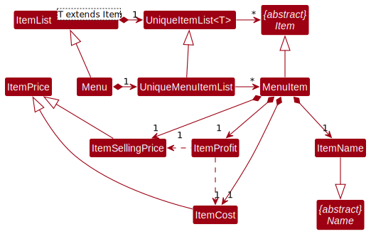
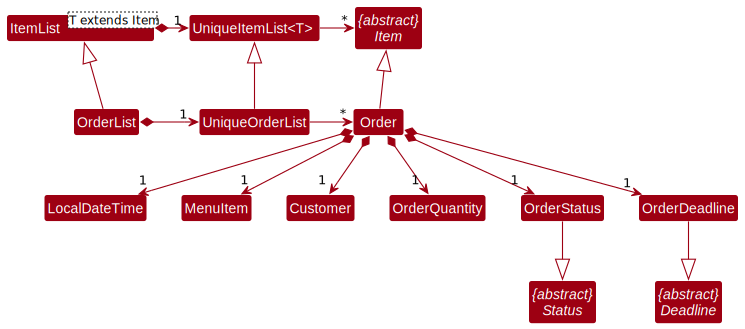
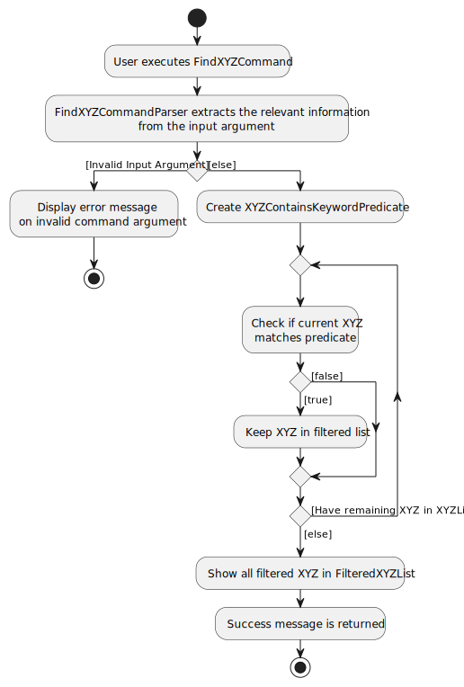

This is a guide for developers looking to contribute to the codebase. There are explanations as to how the project is setup and how each command works.

You can click on the respective links below to read up on the relevant sections.

**Table of Contents**

<!-- TOC -->
  * [**Introduction**](#introduction)
  * [**Setting up, getting started**](#setting-up-getting-started)
  * [**Design**](#design)
    * [Architecture](#architecture)
    * [UI component](#ui-component)
    * [Logic component](#logic-component)
    * [Model component](#model-component)
    * [Storage component](#storage-component)
    * [Common classes](#common-classes)
  * [**Implementation**](#implementation)
    * [AddXYZCommand](#addxyzcommand)
    * [DeleteXYZCommand](#deletexyzcommand)
    * [Edit feature](#edit-feature)
    * [FindXYZCommand](#findxyzcommand)
    * [ListXYZCommand](#listxyzcommand)
    * [\[Proposed\] Undo/redo feature](#proposed-undoredo-feature)
      * [Proposed Implementation](#proposed-implementation)
      * [Design considerations:](#design-considerations)
    * [\[Proposed\] Data archiving](#proposed-data-archiving)
  * [**Documentation, logging, testing, configuration, dev-ops**](#documentation-logging-testing-configuration-dev-ops)
  * [**Appendix: Requirements**](#appendix-requirements)
    * [Product scope](#product-scope)
    * [User stories](#user-stories)
    * [Use cases](#use-cases)
    * [Non-Functional Requirements](#non-functional-requirements)
    * [Glossary](#glossary)
  * [**Appendix: Instructions for manual testing**](#appendix-instructions-for-manual-testing)
    * [Launch and shutdown](#launch-and-shutdown)
    * [Deleting a person](#deleting-a-person)
    * [Saving data](#saving-data)
<!-- TOC -->

--------------------------------------------------------------------------------------------------------------------

## **Introduction**

Trackr is a desktop application catered towards small businesses to trackr their suppliers, customers and orders. It is for users who are quick typers to accomplish their tasks through the Command Line Interface (CLI) while reaping the benefits of a Graphical User Interface (GUI).

**Acknowledgements**

* This project is based on the AddressBook-Level3 project created by the [SE-EDU initiative](https://se-education.org).
* If you would like to contribute code to the parent project (AddressBook-Level3), see [se-education.org](https://se-education.org#https://se-education.org/#contributing) for more info.

--------------------------------------------------------------------------------------------------------------------

## **Setting up, getting started**

Refer to the guide [_Setting up and getting started_](SettingUp.md).

--------------------------------------------------------------------------------------------------------------------

## **Design**

:bulb: **Tip:** The `.puml` files used to create diagrams in this document can be found in the [diagrams](https://github.com/AY2223S2-CS2103T-W15-2/tp/tree/master/docs/diagrams) folder. Refer to the [_PlantUML Tutorial_ at se-edu/guides](https://se-education.org/guides/tutorials/plantUml.html) to learn how to create and edit diagrams.

### Architecture

  

The ***Architecture Diagram*** given above explains the high-level design of the App.

Given below is a quick overview of main components and how they interact with each other.

**Main components of the architecture**

**`Main`** has two classes called [`Main`](https://github.com/se-edu/addressbook-level3/tree/master/src/main/java/seedu/address/Main.java) and [`MainApp`](https://github.com/se-edu/addressbook-level3/tree/master/src/main/java/seedu/address/MainApp.java). It is responsible for,

* At app launch: Initializes the components in the correct sequence, and connects them up with each other.
* At shut down: Shuts down the components and invokes cleanup methods where necessary.

[**`Commons`**](#common-classes) represents a collection of classes used by multiple other components.

The rest of the App consists of four components.

* [**`UI`**](#ui-component): The UI of the App.
* [**`Logic`**](#logic-component): The command executor.
* [**`Model`**](#model-component): Holds the data of the App in memory.
* [**`Storage`**](#storage-component): Reads data from, and writes data to, the hard disk.

**How the architecture components interact with each other**

The *Sequence Diagram* below shows how the components interact with each other for the scenario where the user issues the command `delete_supplier 1`.

  
   Figure 2: Sequence Diagram (Deleting Person)

Each of the four main components (also shown in the diagram above),

* defines its *API* in an `interface` with the same name as the Component.
* implements its functionality using a concrete `{Component Name}Manager` class (which follows the corresponding API `interface` mentioned in the previous point.

For example, the `Logic` component defines its API in the `Logic.java` interface and implements its functionality using the `LogicManager.java` class which follows the `Logic` interface. Other components interact with a given component through its interface rather than the concrete class (reason: to prevent outside component's being coupled to the implementation of a component), as illustrated in the (partial) class diagram below.

  
   Figure 3: Logic Class Diagram

The sections below give more details of each component.

### UI component

The **API** of this component is specified in [`Ui.java`](https://github.com/AY2223S2-CS2103T-W15-2/tp/blob/master/src/main/java/trackr/ui/Ui.java)

  
   Figure 4: UI Class Diagram

The UI consists of a `MainWindow` that is made up of parts e.g.`CommandBox`, `ResultDisplay`, `TabPanel`, `StatusBarFooter` etc. All these, including the `MainWindow`, inherit from the abstract `UiPart` class which captures the commonalities between classes that represent parts of the visible GUI.

The `UI` component uses the JavaFX UI framework. The layout of these UI parts are defined in matching `.fxml` files that are in the `src/main/resources/view` folder. For example, the layout of the [`MainWindow`](https://github.com/AY2223S2-CS2103T-W15-2/tp/blob/master/src/main/java/trackr/ui/MainWindow.java) is specified in [`MainWindow.fxml`](https://github.com/AY2223S2-CS2103T-W15-2/tp/blob/master/src/main/resources/view/MainWindow.fxml)

The `UI` component,

* executes user commands using the `Logic` component.
* listens for changes to `Model` data so that the UI can be updated with the modified data.
* keeps a reference to the `Logic` component, because the `UI` relies on the `Logic` to execute commands.
* depends on some classes in the `Model` component, as it displays `Order`, `Task` or `Menu` object residing in the `Model`.

### Logic component

**API** : [`Logic.java`](https://github.com/se-edu/addressbook-level3/tree/master/src/main/java/seedu/address/logic/Logic.java)

Here's a (partial) class diagram of the `Logic` component:

  
   Figure 5: Logic Class Diagram

How the `Logic` component works:
1. When `Logic` is called upon to execute a command, it uses the `TrackrParser` class to parse the user command.
1. This results in a `Command` object, which is actually an object of one of its subclasses, for example `AddItemCommand`, which is actually also an object of one of its subclasses, for example `AddOrderCommand`. This specific command will then be executed by the `LogicManager`.
1. The command can communicate with the `Model` when it is executed (e.g. to add an order).
1. The result of the command execution is encapsulated as a `CommandResult` object which is returned back from `Logic`.

The Sequence Diagram below illustrates the interactions within the `Logic` component for the `execute("delete_order 1")` API call.

:information_source: **Note:** The lifeline for `DeleteOrderCommandParser` should end at the destroy marker (X) but due to a limitation of PlantUML, the lifeline reaches the end of diagram.

Here are the other classes in `Logic` (omitted from the class diagram above) that are used for parsing a user command:

  
   Figure 6: Sequence Diagram (Deleting Order)

How the parsing works:

* When called upon to parse a user command, the `TrackrParser` class creates an `XYZCommandParser` (`XYZ` is a placeholder for the specific command name e.g., `AddOrderCommandParser`) which uses the other classes shown above to parse the user command and create a `XYZCommand` object (e.g., `AddOrderCommand`) which the `TrackrParser` returns back as a `Command` object.
* All `XYZCommandParser` classes (e.g., `AddOrderCommandParser`, `DeleteOrderCommandParser`, ...) inherit from the `Parser` interface so that they can be treated similarly where possible e.g, during testing.

### Model component

**API** : [`Model.java`](https://github.com/AY2223S2-CS2103T-W15-2/tp/blob/master/src/main/java/trackr/model/Model.java)

  
   Figure 7: Model Class Diagram

The `Model` component,

* `XYZ` is a placeholder for the specific object (e.g., `Supplier`, `Task`), which are all `Item` objects.
* stores trackr data i.e., all `XYZ` objects (contained in respective `UniqueXYZList` object).
* stores currently 'selected' `XYZ` objects (e.g., results of search query) as a separate _filtered_ list which is exposed to outsiders as an unmodifiable `ObservableList<XYZ>` that can be viewed (e.g. UI bound to this list so that the UI automatically updates when the data in the list changes).
* stores a `UserPref` object that represents the user’s preferences. This is exposed to the outside as a `ReadOnlyUserPref` objects.
* does not depend on any of the other three components (as the `Model` represents data entities of the domain, they should make sense on their own without depending on other components).

Here is the `Item` class that is what all model objects depend on.

  
   Figure 8: Item Class Diagram

Each `ItemList` contains a `UniqueItemList` that stores a list of unique `Items`, which are defined by a model definiton (e.g., `Supplier` or `Task` from `ModelEnum`).

This is the class representation for the `Supplier` and `Customer` class.

  
   Figure 9: Person Class Diagram

Here is how `Supplier` and `Customer` works:

* `Supplier` and `Customer` inherit off `Person` class, which depends on the `Item` class.
* Each `Person` contains their name, phone number, deadline, email and tags. (e.g., `PersonAddress` represents the address)
* The `Supplier` and `Customer` object have their corresponding `List` and `UniqueList` that stores their information.

This is the class representation for the `Task` class.

  
   Figure 10: Task Class Diagram

Here is how `Task` works:

* Each `Task` contains their description, deadline and status (e.g., `TaskName` for task name).
* Each of the attributes inherits off the corresponding `common` classes (e.g., `TaskName` inherit off `Name`).
* The `Task` object have its `List` and `UniqueList`.

This is the class representation for the `Menu` class.

  
   Figure 11: Menu Class Diagram

Here is how `Menu` works:

* Each `Menu` contains non-negative number of `MenuItem`.
* Each `MenuItem` contains their description, selling price, cost and profit (e.g., `ItemName` for menu's item name).
* The `MenuItem`'s `ItemName` attribute inherit off the corresponding `common` classes (e.g., `ItemName` inherit off `Name`).
* The`ItemProfit` is obtained using `ItemSellingPrice` and `ItemCost`(i.e. `ItemProfit` depends on `ItemSellingPrice` and `ItemCost`).
* `ItemSellingPrice` and `ItemCost` inherits off the `ItemPrice`.
* The `MenuItem` object have its `List` called `Menu` and `UniqueList`.
* The `MenuItem` is an attribute of `Order`

**Aspect: Choice to provide a menu package:**

* **Option 1 (our choice):** Separating it into a separate `menu` package.
    * Advantage 1: Ensure that the Order name added is a valid item on the menu, which prevents users from accidentally keying in a wrong order name.
    * Advantage 2: Allows user to see more details of the menu item in a separate tab (e.g. users can see a selling price, cost price and profit for each item)
    * Disadvantage: More time required to implement.

* **Option 2:** Add item name as an attribute in the `Order` class.
    * Advantage: Convenient to implement.
    * Disadvantage: Higher chance of conflicts with another developer working on `Order` class.

This is the class representation for the `Order` class.

  
   Figure 12: Order Class Diagram

Here is how `Order` works:

* Each `OrderList` contains non-negative number of `Order`.
* Each `Order` contains a menu item(from a locally stored menu), customer, quantity, status and deadline (e.g., `OrderStatus` for order's status).
* The menu item and customer each contains attributes as mentioned in their respective section above on how `Menu` and `Customer` works.
* The `Order`'s `OrderDeadline` and `OrderStatus` attribute inherit off the corresponding `common` classes (e.g., `OrderDeadline` inherit off `Deadline`).
* The `Order` object have its `List` called `OrderList` and `UniqueList`.

### Storage component

**API** : [`Storage.java`](https://github.com/AY2223S2-CS2103T-W15-2/tp/blob/master/src/main/java/trackr/storage/Storage.java)

  
   Figure 13: Storage Class Diagram

The `Storage` component,

* can save both trackr data and user preference data in json format, and read them back into corresponding objects.
* inherits from both `TrackrStorage` and `UserPrefStorage`, which means it can be treated as either one (if only the functionality of only one is needed).
* depends on some classes in the `Model` component (because the `Storage` component's job is to save/retrieve objects that belong to the `Model`)

### Common classes

Classes used by multiple components are in the `trackr.commons` package.

--------------------------------------------------------------------------------------------------------------------

## **Implementation**

This section describes the details on how the common commands are implemented.

The commands would be in the format `<action>XYZCommand`, where `XYZ` represents suppliers, customers, orders, menu items and tasks while `action` represents the action of the command.

### AddXYZCommand

The `add` command creates and add object `XYZ` into `XYZList` and `FilteredXYZList`.It also saves into the internal `XYZList`, which stores all the `XYZ` objects, that matches the provided keywords.

The keywords that can be provided are the attributes as seen in the corresponding `XYZ`'s class diagram.
For example, `n/` would be followed by a task name for `AddTaskCommand` and order name for `AddSupplierCommand`.

The parser for the `add` command would extract out the arguments corresponding to each particular field.

The following activity diagram summarizes what happens when the user executes the `add` command.

  
   Figure 14: Add Command Activity Diagram

#### Why is it implemented this way

The `AddXYZCommand` is an improved version of the original AB3 `AddCommand` by implementing into a abstract class -`AddItemCommand`.
This reduces repeated lines of code and improves ease of implementation for future commands that require adding an item to a list.

### DeleteXYZCommand

The `delete` command removes an `XYZ` from internal `FilteredXYZList`.

The command only accepts 1 argument without any prefixes. The argument corresponds to the index of `XYZ` in the `FilteredXYZList` that the user wishes to delete using a one-based index.

The parser for `delete` command extracts the index found in the arguments. If the argument is valid, then zero-based index is used to remove `XYZ` from the `XYZList`.

The following activity diagram summarizes what happens when the user executes the `delete` command.

  
   Figure 15: Delete Command Activity Diagram

#### Why is it implemented this way

The `DeleteXYZCommand` is an improved version of the original AB3 `DeleteCommand` by implementing into a abstract class -`DeleteItemCommand`.
This reduces repeated lines of code and improves ease of implementation for future commands that require removing an item from a list.

### Edit feature

The `edit` command edits item `XYZ` from the internal `XYZList`.

This command requires user to key in the index of the item they wish to edit.

Edit supplier, edit order and edit task features are implemented using the same edit mechanism as described in this section.

The `EditXYZCommandParser#parse()` is used to parse the given command.

If the given command is valid, an `EditXYZCommand` will be returned and `EditXYZCommand#execute()` will then be called.

`EditXYZCommand#execute()` will first retrieve that latest filtered XYZ list from the model and check if the index given is valid.

If the given index is valid, item at given index will be retrieved. A copy of the item retrieved will be made and edited accordingly.

If changes to the original item is made and edited item is not the same as another existing item in the list,
the edited item is saved to the filtered list and `EditXYZCommand#execute()` will return the `CommandResult`

Lastly, Changes made are saved to local data and success message will be shown.

  
   Figure 16: Edit Command Activity Diagram

#### Why is it implemented this way

The `EditXYZCommand` is an improved version of the original AB3 `EditCommand` by implementing into a abstract class -`EditItemCommand`.
This reduces repeated lines of code and improves ease of implementation for future commands that require editing an item in a list.

### FindXYZCommand

The `find` command finds objects `XYZ` from the internal `XYZList`, which stores all the `XYZ` objects, that matches the provided keywords.

The keywords that can be provided are the same as those provided during the `add` and `edit` command.
For example, `n/` would represent a task name for `FindTaskCommand` and order name for `FindSupplierCommand`.

The parser for the `find` command would extract out the arguments corresponding to each particular field.

A `XYZContainsKeywordPredicate` is built upon these fields, which is used to test each `XYZ` object in the `XYZList` on whether they match the keywords provided.

The following activity diagram summarizes what happens when the user executes the `find` command.

  
   Figure 17: Find Command Activity Diagram

#### Why is it implemented this way

The `FindXYZCommand` is an improved version of the original AB3 `FindCommand` by implementing into a abstract class -`FindItemCommand`.
This reduces repeated lines of code and improves ease of implementation for future commands that require finding an item in a list.
The abstract class `ItemDescriptor` stores the details of an item. It provides easier implementation for `XYZContainsKeywordPredicate` classes.

### ListXYZCommand

The `list` command lists all the `XYZ` objects in the internal `FilteredXYZList`.

The command retrieves all the `XYZ` objects from the `XYZList` and places them in the `FilteredXYZList`.

The `FilteredXYZList` is then updated to have all `XYZ` objects, it will then to shown to the user.

The following activity diagram summarizes what happens when the user executes the `list` command.

  
   Figure 18: List Command Activity Diagram

--------------------------------------------------------------------------------------------------------------------

## **Documentation, logging, testing, configuration, dev-ops**

* [Documentation guide](Documentation.md)
* [Testing guide](Testing.md)
* [Logging guide](Logging.md)
* [Configuration guide](Configuration.md)
* [DevOps guide](DevOps.md)

--------------------------------------------------------------------------------------------------------------------

## **Appendix: Requirements**

### Product scope

**Target user profile**:

* Tech-savvy small businesses owners who:
    * lists their products online or on their own website
    * perform transactions manually without a Point-of-Sale (POS) system
    * Lack manpower/ time to track orders and contacts manually
    * Has a need to manage a significant number of contacts
* Prefer desktop apps over other types
* Can type fast
* Prefers typing to mouse interactions
* Is reasonably comfortable using _CLI_ apps

**Value proposition**:

Our application:
* allows for consolidation of orders, contacts & tasks information which makes it easier to manage them. (no real-time automation)
* serves as a user-friendly alternative to free applications such as Microsoft Excel which may not be catered to their needs and requires tedious formatting. (no support for custom format of interface)
* enables faster contact management compared to a typical mouse/_GUI_ driven app

### User stories

**High Priority (Must Have)**

| As a / an …​ | I want to …​                               | So that I can…​                                              |
|--------------|--------------------------------------------|--------------------------------------------------------------|
| user         | add new orders                             | have a consolidated place to keep track of my orders         |
| user         | view all my orders                         | track my progress in deadling with the orders                |
| user         | edit my orders                             | update my order status                                       |
| user         | find my orders by keywords                 | get a specific order without manually searching for it       |
| user         | delete my orders                           | remove unwanted old orders                                   |
| user         | add new customers (suppliers or customers) | easily find them from a consolidated location                |
| user         | find contacts by keywords                  | get the relevant contact information from a specific contact |
| user         | edit my contacts                           | update past contacts with current information                |
| user         | delete my contacts                         | remove contacts not used anymore                             |
| user         | add new tasks                              | keep track of business tasks from the same application       |
| user         | find tasks by keywords                     | get all relevant tasks that are related to plan my schedule  |
| user         | edit my tasks                              | update my progress on the task                               |
| user         | delete my tasks                            | remove old completed tasks                                   |
| new user     | have an instruction guide                  | understand how to use the application                        |

**Medium Priority (Nice to Have)**

| As a / an …​   | I want to …​                | So that I can…​                                           |
|----------------|-----------------------------|-----------------------------------------------------------|
| business owner | add my menu items           | add orders based on my menu items                         |
| business owner | edit my menu items          | update my price and cost based on current rates           |
| business owner | delete menu items           | remove unpopular items that are not sold anymore          |
| user           | have my orders sorted       | view my upcoming orders that are not done yet             |
| user           | have my tasks sorted        | view the most pressing tasks at first glance              |
| new user       | be able to import past data | use the application easily when transferring data         |
| user           | be able to export data      | keep track of past orders without lagging the application |

### Use cases

(For all use cases below, the **System** is the `Trackr` and the **Actor** is the `Small Business Owner`)

**Use case: UC01 - Add a new supplier**

MSS

1. Actor requests to add a new supplier.
2. Actor enters a command to add a supplier with the required information.
3. Trackr saves the new supplier to the system.
4. Trackr shows the new supplier added to the list.

   Use case ends.

**Extensions**

* 2a. The Actor does not enter all required information.

    * 2a1. Trackr shows an error message.

      Use case resumes at step 1.

* 2b. The Actor adds a supplier that already exists in the list.

    * 2b1. Trackr shows an error message.

      Use case resumes at step 1.

**Use case: UC11 - Add a new customer**

(Similar to UC01)

**Use case: UC21 - Add a new task**

(Similar to UC01)

**Use case: UC31 - Add a new order**

(Similar to UC01)

**Use case: UC41 - Add a new menu item**

(Similar to UC01)

**Use case: UC02 - Delete a contact**

**MSS**

1. Actor requests to list contacts.
2. Trackr shows a list of contacts.
3. Actor requests to delete a specific contact from the list.
4. Trackr deletes the contact.

   Use case ends.

**Extensions**

* 2a. The list is empty.

  Use case ends.

* 3a. The given index is invalid.

    * 3a1. Trackr shows an error message.

      Use case resumes at step 3.

**Use case: UC22 - Delete a task**

(Similar to UC02)

**Use case: UC32 - Delete an order**

(Similar to UC02)

**Use case: UC42 - Delete a menu item**

(Similar to UC02)

**Use case: UC03 - Edit a contact**

MSS

1. Actor requests to list contacts.
2. Trackr shows a list of contacts.
3. Actor enters an edit contact command for a specific contact and the updated information.
4. Trackr updates the contact details with the new information.

    Use case ends.

**Extensions**

* 2a. The list is empty.

  Use case ends.

* 3a. The Actor enters an invalid index.

    * 3a1. Trackr displays an error message.

      Use case resumes at step 3.

* 3b. The Actor enters invalid information.

    * 3b1. Trackr displays an error message.

      Use case resumes at step 3.

**Use case: UC23 - Edit a task**

(Similar to UC03)

**Use case: UC33 - Edit an order**

(Similar to UC03)

**Use case: UC43 - Edit a menu item**

(Similar to UC03)

**Use case: UC04 - Finding a supplier**

MSS

1. Actor requests to find a supplier.
2. Actor enters the command with the desired search criteria.
3. Trackr searches for suppliers that match the given criteria.
4. Trackr displays a list of suppliers that match the criteria.

   Use case ends.

**Extensions**

* 2a. The Actor does not enter any search criteria.

    * 2a1. Trackr displays an error message.

    * Use case resumes at step 2.

* 4a. No supplier matches the given search criteria.

  Use case ends.

**Use case: UC14 - Find a customer**

(Similar to UC04)

**Use case: UC24 - Find a task**

(Similar to UC04)

**Use case: UC34 - Find an order**

(Similar to UC04)

**Use case: UC44 - Find a menu item**

(Similar to UC04)

**Use case: UC50 - Switch to another tab**

MSS

1. Actor requests to switch to another tab.
2. Actor interacts with the tab menu.
3. Trackr switches to the target tab.

   Use case ends.

### Non-Functional Requirements

1. Should work on any _mainstream OS_ as long as it has Java `11` or above installed.
1. Should be able to hold up to 200 supplier and customer contacts without a noticeable sluggishness in performance for
   typical usage.
1. Should be able to hold up to 1000 order details without a noticeable sluggishness in performance for typical usage.
1. Should be able to hold up to 200 tasks without a noticeable sluggishness in performance for typical usage.
1. A user with above average typing speed for regular English text (i.e. not code, not system admin commands) should be
   able to accomplish most of the tasks faster using commands than using the mouse.
1. Should store data locally only.

### Glossary

* **Mainstream OS**: Windows, Linux, Unix, OS-X
* **CLI**: Command-Line Interface
* **GUI**: Graphical User Interface
* **Supplier**: Supplier refers to someone whom the user seasonally or frequently orders goods from
* **Customer**: Customer refers to someone whom the user receives an order from
* **Order**: Order refers to the customers' orders the user accepts
* **Task**: Task refers to any to-dos the user may have, it need not be related to suppliers or orders (For instance, it can be about tidying inventory)
* **Menu Item**: Menu Item refers to any inventory/ stock that the user is selling to customers.
* **Tag**: Tags are associated with suppliers, users can tag the supplier with any keyword they want, number of tags are not restricted
* **Status**: Statuses are associated with tasks and orders, one entry of task/order can only have one status and the type of status that can be added is restricted

--------------------------------------------------------------------------------------------------------------------

## **Appendix: Instructions for manual testing**

Given below are instructions to test the app manually.

:information_source: **Note:** These instructions only provide a starting point for testers to work on;
testers are expected to do more *exploratory* testing.

### Launch and shutdown

1. Initial launch

   1. Download the jar file and copy into an empty folder

   1. Double-click the jar file Expected: Shows the GUI with a set of sample contacts. The window size may not be optimum.

1. Saving window preferences

  1. Resize the window to an optimum size. Move the window to a different location. Close the window.

  1. Re-launch the app by double-clicking the jar file. 
     Expected: The most recent window size and location is retained.

1. _{ more test cases …​ }_

### Deleting a person

1. Deleting a person while all persons are being shown

  1. Prerequisites: List all persons using the `list` command. Multiple persons in the list.

  1. Test case: `delete 1` 
     Expected: First contact is deleted from the list. Details of the deleted contact shown in the status message. Timestamp in the status bar is updated.

  1. Test case: `delete 0` 
     Expected: No person is deleted. Error details shown in the status message. Status bar remains the same.

  1. Other incorrect delete commands to try: `delete`, `delete x`, `...` (where x is larger than the list size) 
     Expected: Similar to previous.

1. _{ more test cases …​ }_

### Saving data

1. Dealing with missing/corrupted data files

  1. _{explain how to simulate a missing/corrupted file, and the expected behavior}_

1. _{ more test cases …​ }_
