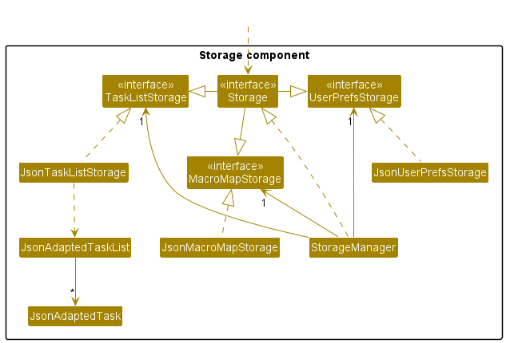
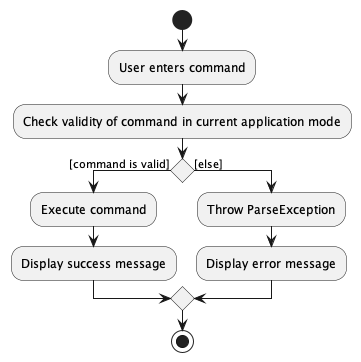
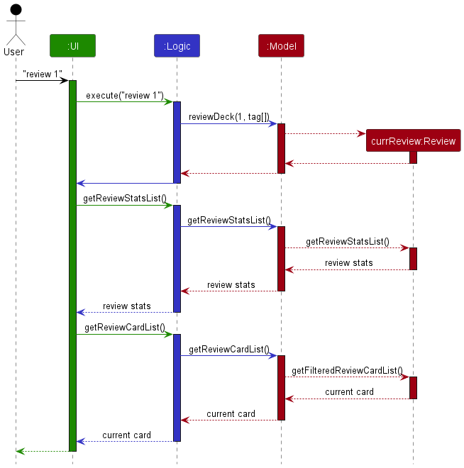
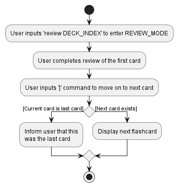
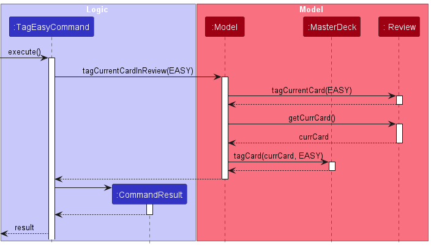

* Table of Contents
{:toc}

--------------------------------------------------------------------------------------------------------------------

## **Acknowledgements**

* Our application is based on the [AB3](https://se-education.org/addressbook-level3/) project created by the [SE-EDU initiative](https://se-education.org/)
* Our application makes use of [JavaFX](https://openjfx.io/) as the UI framework.
* Our application's white and blue color scheme takes inspiration from the color scheme of Apple's iMessage.
* Our application's three modes design: `MAIN_UNSELECTED_MODE`, `MAIN_SELECTED_MODE`, `REVIEW_MODE` was inspired by a similar design of the past project [FlashNotes](https://ay2021s1-cs2103t-t15-2.github.io/tp/) ([UG](https://ay2021s1-cs2103t-t15-2.github.io/tp/UserGuide.html), [DG](https://ay2021s1-cs2103t-t15-2.github.io/tp/DeveloperGuide.html)), although our implementation is entirely new. 

--------------------------------------------------------------------------------------------------------------------

## **Setting up, getting started**

Refer to the guide [_Setting up and getting started_](SettingUp.md).

--------------------------------------------------------------------------------------------------------------------

## **Design**

:bulb: **Tip:** The `.puml` files used to create diagrams in this document can be found in the [diagrams](https://github.com/AY2223S2-CS2103T-W11-3/tp/tree/master/docs/diagrams) folder. Refer to the [_PlantUML Tutorial_ at se-edu/guides](https://se-education.org/guides/tutorials/plantUml.html) to learn how to create and edit diagrams.

### Architecture

The ***Architecture Diagram*** given above explains the high-level design of the App.

Given below is a quick overview of main components and how they interact with each other.

**Main components of the architecture**

**`Main`** has two classes called [`Main`](https://github.com/AY2223S2-CS2103T-W11-3/tp/blob/master/src/main/java/seedu/address/Main.java) and [`MainApp`](https://github.com/AY2223S2-CS2103T-W11-3/tp/blob/master/src/main/java/seedu/address/MainApp.java). It is responsible for,
* At app launch: Initializes the components in the correct sequence, and connects them up with each other.
* At shut down: Shuts down the components and invokes cleanup methods where necessary.

[**`Commons`**](#common-classes) represents a collection of classes used by multiple other components.

The rest of the App consists of four components.

* [**`UI`**](#ui-component): The UI of the App.
* [**`Logic`**](#logic-component): The command executor.
* [**`Model`**](#model-component): Holds the data of the App in memory.
* [**`Storage`**](#storage-component): Reads data from, and writes data to, the hard disk.

**How the architecture components interact with each other**

The *Sequence Diagram* below shows how the components interact with each other for the scenario where the user issues the command `deleteCard 1`.

Each of the four main components (also shown in the diagram above),

* defines its *API* in an `interface` with the same name as the Component.
* implements its functionality using a concrete `{Component Name}Manager` class (which follows the corresponding API `interface` mentioned in the previous point.

For example, the `Logic` component defines its API in the `Logic.java` interface and implements its functionality using the `LogicManager.java` class which follows the `Logic` interface. Other components interact with a given component through its interface rather than the concrete class (reason: to prevent outside component's being coupled to the implementation of a component), as illustrated in the (partial) class diagram below.

The sections below give more details of each component.

### UI component

The **API** of this component is specified in [`Ui.java`](https://github.com/AY2223S2-CS2103T-W11-3/tp/blob/master/src/main/java/seedu/address/ui/Ui.java)

The UI consists of a `MainWindow` that can be summarised into 4 parts, `Card`, `Deck`, `ReviewStats` and `Utility` components.`Card` displays all card related information, `Deck` components displays  all deck related information, `ReviewStats` displays the stats recorded during a Review session, and `Utility` are UI components that display other important non PowerCards related information. Components with suffix `Panel`  act as containers for `element` classes that act as individual objects created by `Model`. 

Some components are mutually exclusive. During a review session, only the `ReviewStats` components will be displayed and `Deck` components hidden. During the review, only one of `FlippedReviewElement` or `UnflippedReviewElement` will be displayed at a time.

All these, including the `MainWindow`, inherit from the abstract `UiPart` class which captures the commonalities between classes that represent parts of the visible GUI. Due to the large number of components, we have left out the UiPart section as it is redundant to link them all to it.

The `UI` component uses the JavaFx UI framework. The layout of these UI parts are defined in matching `.fxml` files that are in the `src/main/resources/view` folder. For example, the layout of the [`MainWindow`](https://github.com/se-edu/addressbook-level3/tree/master/src/main/java/seedu/address/ui/MainWindow.java) is specified in [`MainWindow.fxml`](https://github.com/se-edu/addressbook-level3/tree/master/src/main/resources/view/MainWindow.fxml)

* executes user commands using the `Logic` component.
* listens for changes to `Model` data so that the UI can be updated with the modified data.
* keeps a reference to the `Logic` component, because the `UI` relies on the `Logic` to execute commands.
* depends on some classes in the `Model` component, as it displays `Card` object residing in the `Model`.

### Logic component

**API** : [`Logic.java`](https://github.com/AY2223S2-CS2103T-W11-3/tp/blob/master/src/main/java/seedu/address/logic/Logic.java)

Here's a (partial) class diagram of the `Logic` component:

How the `Logic` component works:
1. When `Logic` is called upon to execute a  command, it checks the current mode of the application (`MAIN_UNSELECTED`, `MAIN_SELECTED`, `REVIEW`) to determine which method within `MasterDeckParser` to call next.   
2. It then calls the appropriate parsing method within the `MasterDeckParser` class to parse the user command.
3. This results in a `Command` object (more precisely, an object of one of its subclasses e.g., `AddCardCommand`) which is executed by the `LogicManager`.
4. The command can communicate with the `Model` when it is executed (e.g. to add a card).
5. The result of the command execution is encapsulated as a `CommandResult` object which is returned back from `Logic`.

The Sequence Diagram below illustrates the interactions within the `Logic` component for the `execute("deleteCard 1")` API call.

:information_source: **Note:** The lifeline for `DeleteCardCommandParser` should end at the destroy marker (X) but due to a limitation of PlantUML, the lifeline reaches the end of diagram.

Here are the other classes in `Logic` (omitted from the class diagram above) that are used for parsing a user command:

How the parsing works:
* When called upon to parse a user command, the `MasterDeckParser` class parse the command differently based on the current mode (`MAIN_UNSELECTED`, `MAIN_SELECTED`, `REVIEW`) of the application and creates an `XYZCommandParser` (`XYZ` is a placeholder for the specific command name e.g., `AddCardCommandParser`) which uses the other classes shown above to parse the user command and create a `XYZCommand` object (e.g., `AddCardCommand`) which the `MasterDeckParser` returns back as a `Command` object.
* All `XYZCommandParser` classes (e.g., `AddCardCommandParser`, `DeleteCardCommandParser`, ...) inherit from the `Parser` interface so that they can be treated similarly where possible e.g, during testing.

### Model component

**API** : [`Model.java`](https://github.com/se-edu/addressbook-level3/tree/master/src/main/java/seedu/address/model/Model.java)

The `Model` component,

* stores the MasterDeck data i.e., all `Card` objects (which are contained in a `UniqueCardList` object) and all `Deck` objects (which are contained in a `UniqueDeckList` object).
* stores the currently 'selected' `Card` objects (e.g., results of selecting a deck) as a separate _filtered_ list which is exposed to outsiders as an unmodifiable `ObservableList<Card>` that can be 'observed' e.g. the UI can be bound to this list so that the UI automatically updates when the data in the list change.
* stores the currently 'selected' `Deck` objects (e.g., results of a deck search query) as a separate _filtered_ list which is exposed to outsiders as an unmodifiable `ObservableList<Deck>` that can be 'observed' e.g. the UI can be bound to this list so that the UI automatically updates when the data in the list change.
* stores a `UserPref` object that represents the user’s preferences. This is exposed to the outside as a `ReadOnlyUserPref` objects.
* stores an optional `Review` object, which handles the cards being reviewed by the user. Refer [below](#review) for more details. 
* does not depend on any of the other three components (as the `Model` represents data entities of the domain, they should make sense on their own without depending on other components)

Each `Card` object,
* stores one `Question`, one `Answer`, one `Deck` which the `Card` object references from the `Deck` list, and one TagName `Tag` (cards initialized without tags will have an untagged tag).
* belongs to the `Deck` it references.

##### Review 

The `Review`
* stores a `Deck` currently being reviewed.
* stores a `UniqueCardList` instance which stores all the `Card` instances belonging to the `Deck` being reviewed.
* stores the 'current' `Card` object (the current card being displayed in the review) in a separate filtered list which is exposed to outsiders as an unmodifiable `ObservableList<Card>` that can be ‘observed’.
  * The UI can be bound to this list so that the UI automatically updates when the `Card` in the list changes.
  * The list is always filtered to contain one `Card` at any time.

### Storage component

**API** : [`Storage.java`](https://github.com/AY2223S2-CS2103T-W11-3/tp/blob/master/src/main/java/seedu/address/storage/Storage.java)

The `Storage` component,
* can save both MasterDeck data and user preference data in json format, and read them back into corresponding objects.
* inherits from both `MasterDeckStorage` and `UserPrefStorage`, which means it can be treated as either one (if only the functionality of only one is needed).
* depends on some classes in the `Model` component (because the `Storage` component's job is to save/retrieve objects that belong to the `Model`)

### Common classes

Classes used by multiple components are in the `seedu.powercards.commons` package.

--------------------------------------------------------------------------------------------------------------------

## **Implementation**

This section describes some noteworthy details on how certain features are implemented.

### Implementation of MasterDeck

The `MasterDeck` class stores all the `Deck` and `Card` data the users will interact with.
Below are the current implementation we chose for `MasterDeck` and the possible alternative designs that we will explore in the future.

#### Current Implementation

MasterDeck stores 2 independent lists, a `UniqueCardList` storing all existing unique cards and a `UniqueDeckList` storing all existing unique decks.

Each `Card` instance references an existing instance of `Deck`. This reference denotes that the card belongs to a specific deck.

Why we chose this design:
- Ease of implementation: The deck behaves similarly to a tag whose purpose is to group the cards together. This allows us to take reference from the source code of the `Tag` class from the AddressBook3 (AB3).
- Single Responsibility Principle: The `UniqueDeckList` class's sole responsibility is to store and modify the user-created decks. If we store a `UniqueCardList` inside each deck (similar to the alternative design below), the `UniqueDeckList` has to be responsible for managing the cards inside each deck as well. This can potentially violate Single Responsibility Principle (SRP).

Limitation:
- Worse time complexity: Some commands (e.g., `selectDeck`) require the whole card list to be filtered to show only the cards in a specific deck. This incurs a worse runtime complexity, as performance degrades when the size of the card list grows.

#### Alternative Designs

A more intuitive design for `MasterDeck` is given below.

- The `MasterDeck` has a `UniqueDeckList` which stores unique instances of decks.
- Each deck in turn stores a reference to a `UniqueCardList`.
- Each `UniqueCardList` stores a list of unique instances of cards inside a specific deck.

Pros:
- This design follows Object-Oriented Programming (OOP) more closely, as a deck is supposed to contain a list of cards in the real world.
- Time complexity is improved for some commands (e.g., `selectDeck` retrieves cards from a deck much faster, as it does not require filtering every single existing card like our current implementation).

Cons:
- Requires a complete overhaul of the code base and test cases, which may not be practical considering our limited development time.

While the alternative design seems more appropriate than our current design, we deem it less feasible to implement due to our project's time constraint. 
Furthermore, the performance difference is negligible as our average user does not have enough cards to cause noticeable performance degradation. Nevertheless, we intend to prioritize the implementation of the alternative design in future iterations, as time and resources permit.

### Command Validity Based on Application Mode
The activity diagram below illustrates what happens when a user enters a command.

:information_source: **Note:** It's important to note that the validity of a user's command is not solely determined by the user's input, but also by the **current mode of the application**.

Our application has three modes: `MAIN_UNSELECTED_MODE`, `MAIN_SELECTED_MODE`, and `REVIEW_MODE`, each with its own set of exclusive commands. 
To enforce this, the `LogicManager` class checks the current mode of the user and **enables/disables** certain commands as necessary.

- #### When the user is in `MAIN_UNSELECTED_MODE`:
    - This mode primarily handles **deck-related** commands, such as `AddDeckCommand` and `FindDecksCommand`.
    - No deck is selected in this mode, so card-related and review-related commands are disabled.
- #### When the user is in `MAIN_SELECTED_MODE`:
    - This mode primarily handles **card-related** commands, such as `AddCardCommand` and `FindCardsCommand`.
    - A deck is selected in this mode, so deck-related commands are disabled.
    - Review-related commands are also disabled, as there is no ongoing review.
- #### When the user is in `REVIEW_MODE`:
    - This mode primarily handles **review-related** commands, such as `FlipCardCommand` and `NextCardCommand`.
    - A review is ongoing in this mode, so deck-related and card-related commands are disabled.

### Implementation of `MAIN_UNSELECTED_MODE` Features

`MAIN_UNSELECT_MODE` is the mode of the application when the users have **not** selected a deck, and they are not reviewing any decks.

Most commands in the `MAIN_UNSELECTED_MODE` behaves similarly as the example of `addDeck` command below:

#### addDeck Feature

Given below is an example usage scenario and how the `addDeck()` mechanism behaves at each step.

Step 1. The user executes `addDeck Math` command to add a new deck. The `addDeck` command calls `Model#addDeck()`, which executes adding a new deck feature.

Step 2. A new deck is now added on the list and able to execute further functionalities.

:information_source: **Note:**  

- In case of a duplicate deck name, an exception will be thrown and the newly created deck will not be saved in the `MasterDeck`. 
- However, note that deck names are case-sensitive. For example, user cannot create two "Math" decks, but are allowed to create a "Math" deck and a "math" deck. 

The following activity diagram summarizes what happens when a user executes addDeck command:

The following sequence diagram shows how the addDeck operation works:

### Implementation of `MAIN_SELECTED_MODE` Features

'MAIN_SELECTED_MODE' is the mode of the application when the users have selected a deck, and they are not reviewing any decks.

Commands in the `MAIN_SELECTED_MODE` behave similarly as the example of `deleteCard` below:

:information_source: **Note:** 
The primary distinction between the features found in MAIN_SELECTED_MODE and MAIN_UNSELECTED_MODE is that the former requires the selection of a deck.

#### deleteCard Feature

The `deleteCard INDEX` feature allows users to delete specific card from their selected deck.
Given below is an example usage scenario and how the `deleteCard()` mechanism behaves at each step.

Step 1. The user has a **deck selected** and keys in `deleteCard INDEX` to delete card at the specified index. If the index is invalid, an error will be thrown.

Step 2. The card is now deleted from the deck.

The following activity diagram summarizes the action taken when `deleteCard` is executed:

### Implementation of `REVIEW_MODE` Features
A user can enter into the `REVIEW_MODE` to test their knowledge on a deck of cards and optionally filter that deck by the tags of the cards.

The following activity diagram is a summary of the typical review workflow a user might carry out:

:information_source: **Note:** 
A user does not need to follow these steps exactly (e.g. the user does not necessarily need to keep going forward to the next card, they can go back to the previous question.)

### `REVIEW_MODE` Implementation Details

A `Review` object is stored within the `Model` and represents the current review. 
- If the current review object is `null`, it indicates that there is currently no ongoing review, thus the application is in the `MAIN_MODE`.
- To construct a `Review` object, the `Model` will pass in:
  - a list of cards to be reviewed (as filtered by `CardInDeckPredicate` and `CardHasTagPredicate`), 
  - the `Deck` to be reviewed and 
  - an integer representing the review limit set by user (-1 if no limit set). 

Within the `Review` object, the list of cards to be reviewed are stored in a `UniqueCardList`.
- Note that this list of cards are not the same card objects as those in the `MasterDeck` and hence any changes to be made on a card during review will need to be made on the equivalent cards in both the `MasterDeck` and the current review's `UniqueCardList`. 
- The `UniqueCardList` is used to construct the `ObservableList` and `FilteredList` of cards which is passed upwards to the UI to display the current card under review. 

Each time a `Review` object is constructed, a list of integers representing a shuffled order of indices of the cards is created.
- A pointer representing the current card index is used to iterate across this list of shuffled indices to get the current `Card` under review from the `UniqueCardList`.
- The pointer is incremented when the user moves on to the next card and decremented when the user moves back to the previous card

Within the `Review` object, there is an `ObservableList` of a `Pair` of strings representing the following statistics of the current review: deck name, current card number, current tag count for each difficulty and the navigation guide. 
- The statistics are displayed on the left panel during the review mode.
- In a `Pair` of strings, the first string represents the title of the statistic while the second contains information about that respective statistic. (e.g. String 1: "Deck Name", String 2: "Chemistry")
- These statistics are constantly updated whenever a command executed (e.g. tag current card with new difficulty) changes any of the above statistics of the review.

The following is a sequence diagram shows a review is started:

Notice that the UI calls the methods `getReviewStatsList()` and `getReviewCardList()` in `Logic` to return an `ObservableList` of the review statistics and current card respectively. 
Any changes made to these `ObservableLists` during the review will be listened to and updated visually on the UI.

#### nextCard Feature
`Review#goToNextCard()` is the operation that allows the user to move to the next card during a review.

This operation is exposed in the Model interface as `Model#goToNextCard()`.

Given below is an example usage scenario and how the `goToNextCard()` mechanism behaves at each step.

Step 1. The user starts a review. A `Review` object is created within the `Model` class. The current mode of the application is changed to `REVIEW_MODE`.

Step 2. The user reviews the first card by testing their knowledge on the question, flipping the card to see the answer, then tagging the appropriate difficulty of the card.

Step 3. The user moves on to the next card by executing `]` in the command line interface. `]` is the command word for the `NextCardCommand`.

The following activity diagram summarizes what happens when a user executes `NextCard` command:

### Tag Cards During The Review Feature

Users are allowed to tag the cards in the review session with 3 different difficulty tags (e.g., Easy, Medium and Hard).
The tags will be saved and displayed on each card even after they end the review.

There are three commands that allow a card to be tagged during a review. They are `TagEasyCommand`, `TagMediumCommand` and `TagHardCommand`.

Below is the sequence diagram that shows how `TagEasyCommand` behaves when it is executed. The remaining two commands behave similarly.

Take note:
- The `Review` holds a separate `UniqueCardList` storing all the cards in the review. These cards are independent of the cards stored in the `UniqueCardList` inside `MasterDeck`.
- Hence, tagging the card in one list will not modify the same card in the other list.
- Consequently, both cards must be tagged independently in `MasterDeck` and `Review`.
- Tagging the card in `Review` is sufficient for changes to appear in UI. 

### Implementation of UI

The UI consists of the `DeckPanel` on the left and the `CardPanel` on the right, along with `CommandBox` and `ResultDisplay`on the bottom. `CommandBox` and `ResultDisplay` are in fixed positions and do not get shifted around or removed in any use case. 

`DeckPanel` and `CardPanel` display modifiable `DeckElement` and `CardElement` objects that are stored as `Javafx ObservableList<>` elements. When these objects are added, deleted, or edited by the user, the changes are reflected immediately in the UI.

Initially, when the user launches Powercards, `DeckPanel` will display all `DeckElement` objects and `CardPanel` displays all `CardElement` objects. They can be modified through commands such as `findDecks`,`findCards`, `editCard`, etc.

When the user starts a review, the left `DeckPanel` is replaced with a `ReviewStatsPanel` to display the relevant information generated during the review. The `CardElement` objects on the right `CardPanel` are replaced with a single `CardElement` object from the selected deck to review. 

The flip command (`p`) will toggle between the corresponding `FlippedReviewElement` and `UnflippedReviewElement` of the single displayed `CardElement`.

--------------------------------------------------------------------------------------------------------------------

## **Documentation, logging, testing, configuration, dev-ops**

* [Documentation guide](Documentation.md)
* [Testing guide](Testing.md)
* [Logging guide](Logging.md)
* [Configuration guide](Configuration.md)
* [DevOps guide](DevOps.md)

--------------------------------------------------------------------------------------------------------------------

## **Appendix: Requirements**

### Product scope

**Target user profile**:

* Needs to study a group of terms and definitions efficiently
* prefer desktop apps over other types
* can type fast
* prefers typing to mouse interactions
* is reasonably comfortable using CLI apps

**Value proposition**: study various topics using cards on the computer

### User stories

Priorities: High (must have) - `* * *`, Medium (nice to have) - `* *`, Low (unlikely to have) - `*`

| Priority | As a …​  | I want to …​                                                          | So that I can…​                                        |
|----------|----------|-----------------------------------------------------------------------|--------------------------------------------------------|
| `* * *`  | new user | see usage instructions                                                | refer to instructions when I forget how to use the App |
| `Epic`   | user     | **manage cards**                                                      ||
| `* * *`  | user     | create a new card with a question and answer pair                     ||
| `* *`    | user     | search for cards using keywords in the questions                      ||
| `* *`    | user     | rewrite the question or the answer in the card                        ||
| `Epic`   | user     | **group cards into decks of the same topic**                          ||
| `* * *`  | user     | set the name of a deck                                                ||
| `* * *`  | user     | list all decks I have created                                         ||
| `* * *`  | user     | list all the cards in a deck                                          ||
| `* * *`  | user     | add cards in a deck                                                   ||
| `* * *`  | user     | remove cards in a deck                                                ||
| `* *`    | user     | rename a deck                                                         ||
| `* *`    | user     | delete a deck                                                         ||
| `* *`    | user     | add the description of each deck                                      | I can check later what this deck is about.             |
| `Epic`   | user     | **review decks of cards**                                             ||
| `* * *`  | user     | review a single deck of cards                                         | I can test my knowledge of the topic                   |
| `* * *`  | user     | mark a card to be correct / wrong during review                       ||
| `* *`    | user     | see how many cards I have left to review in one deck                  ||
| `Epic`   | user     | **keep track of how effective my learning has been**                  ||
| `* *`    | user     | see which are the cards I struggle with / succeed at                  ||
| `*`      | user     | see which topics (decks) I am stronger / weaker in                    ||
| `*`      | user     | revise cards that I got wrong for                                     | I can see what I’m weak at                             |
| `* *`    | user     | reset the statistics                                                  ||
| `Epic`   | user     | **share and receive decks from my friends**                           ||
| `* * *`  | user     | import decks from other users.                                        ||
| `* * *`  | user     | export decks for other users.                                         ||
| `Epic`   | user     | **undo and redo changes I make**                                      ||
| `*`      | user     | retrieve a deck or card should I accidentally delete it               ||
| `*`      | user     | redo changes that I had undone.                                       ||
| `Epic`   | user     | **adjust the frequency of certain cards appearing based on my input** ||
| `* *`    | user     | tag cards that are hard                                               | they will appear more frequently                       |
| `* *`    | user     | tag cards that are easy                                               | they will appear less frequently                       |

### Use cases

For all use cases below, the **System** is the `Powercards` application and the **Actor** is the `user`, unless specified otherwise.

#### Use case: UC1 - Add a deck

**MSS:**

1. User requests to create a new deck with a specified name.
2. System creates a new deck with the given name.   

   Use case ends.

#### Use case: UC2 - Delete a deck

**MSS:**

1. User requests to delete an existing deck with a specified name.
2. System deletes the existing deck with the given name.

   Use case ends.

#### Use case: UC3 - Edit a deck name

**MSS:**

1. User requests to edit an existing deck to have a new name.
2. System edits the existing deck to have the new name.

   Use case ends.

#### Use case: UC4 - Select a deck

**MSS:**
1. User selects a deck manage cards within.
2. System enters the chosen deck and shows cards in that deck.

   Use case ends.

#### Use case: UC5 - Find deck(s) with keyword(s)

**MSS:**
1. User requests to find decks with names containing keyword(s).
2. System shows deck(s) containing any of the given keyword(s).

   Use case ends.

#### Use case: UC6 - Show all decks

**MSS:**
1. User requests to see all decks after running `findDecks` command.
2. System shows all decks.

   Use case ends.

#### Use case: UC7 - Add a card

**MSS:**
1. User <u>selects a deck (UC2)</u> to add card to.
2. User enters the question and answer details for the card.
3. System adds the card to the chosen deck.

   Steps 3-4 are repeated for as many times as required until the User finishes adding more cards to the deck.
   
   Use case ends.

#### Use case: UC8 - Delete a card

**MSS:**

1. User <u>selects a deck (UC2)</u> to delete card from.
2. User requests to delete a specific card in the deck.
3. System deletes the card.  

  Use case ends.

#### Use case: UC9 - Edit a card

**MSS:**
1. User <u>selects a deck (UC2)</u> to edit a card within.
2. User enters the card field(s) they wish to edit - question, answer or tag details.
3. System updates the card with the new given fields.

   Steps 3-4 are repeated for as many times as required until the User finishes editing more cards to the deck.

   Use case ends.

#### Use case: UC10 - Find card(s) by keyword(s)

**MSS:**
1. User requests to find cards with questions containing keyword(s).
2. System shows card(s) containing any of the given keyword(s).

   Use case ends.

#### Use case: UC11 - Show all cards

**MSS:**
1. User requests to see all cards in selected deck after running `findCards` command.
2. System shows all cards in selected deck.

   Use case ends.

#### Use case: UC12 - Review a deck

**MSS:**

2. User enters review mode for a particular deck. 
3. Application shows the question of the first card under review.
4. User attempts to answer the question in the card.
5. User flips the card to reveal the answer.
6. User self-grades question as easy/medium/difficult.  
7. User proceeds on to the next card.

   Repeat step 2-6 until all cards in deck have been exhausted.

   Use case ends.

**Extensions:**

* *a. User decides to end the review early.  
  * *a1. User requests to end the review session.  
  * *a2. PowerCards ends the session and brings the user back to the Main mode before the review started.  
    Use case ends.

### Non-Functional Requirements

1. Should work on any _mainstream OS_ as long as it has Java `11` or above installed.
2. Should be able to hold up to 1000 cards without a noticeable sluggishness in performance for typical usage.
3. A card should load when prompted without any noticeable lag
4. Every command should provide a response within 2 seconds
5. The PowerCards program is not expected to determine the correctness of the user’s response
6. A card should be easily added/deleted within 3 commands after opening the program
7. The data stored by PowerCards should be forward compatible such that old data can still be loaded in newer versions of the program

### Glossary

* **Mainstream OS**: Windows, Linux, Unix, OS-X
* **Deck**: A group of flashcards (cards) of a specific topic
   

--------------------------------------------------------------------------------------------------------------------

## **Appendix: Instructions for manual testing**

Given below are instructions to test the app manually.

:information_source: **Note:** These instructions only provide a starting point for testers to work on;
testers are expected to do more *exploratory* testing.

### Launch and shutdown

1. Initial launch

   1. Download the jar file and copy into an empty folder

   2. Double-click the jar file. 
   
      Expected: Shows the GUI with a set of sample contacts. The window size may not be optimum.

2. Saving window preferences

   1. Resize the window to an optimum size. Move the window to a different location. Close the window.

   2. Re-launch the app by double-clicking the jar file. 
       Expected: The most recent window size and location is retained.

### Testing Commands for `MAIN_UNSELECTED_MODE`

#### Selecting a deck

1. Selecting a deck on the deck list

    1. Prerequisites: User is in the Main Mode and a deck is not selected. MasterDeck is not empty.
   
    2. Test case: `selectDeck 1`  
       Expected: First deck on the list is selected and cards in the deck are displayed.
   
    3. Test case: `selectDeck 0`  
       Expected: No deck is selected. Error details shown in the status message.
   
    4. Other incorrect `selectDeck` commands to try: `selectDeck`, `selectDeck x`, `...` (where x is larger than the list size)  
       Expected: Similar to previous.

#### Adding a deck

1. Adding a new deck of unique name to the MasterDeck

   1. Prerequisites : User is in the Main Mode and a deck is not selected. 
   
   2. Test case: `addDeck Math` 
      Expected: A new deck `Math` is created and displayed on the list of decks. If there is already a deck called `Math` (case-sensitive) in the MasterDeck, 
                it throws an error message and does not add the deck into the list.
   
   3. Test case: `addDeck ` 
      Expected: No new deck is added to MasterDeck. Error details shown in the status message states that deck name cannot be blank.
   
#### Editing a deck

1. Editing the name of an existing deck

    1. Prerequisites: User is in the Main Mode and a deck is not selected. MasterDeck is not empty.
   
    2. Test case: `editDeck 1 Chemistry` 
       Expected: Edits the name of the deck at the index of 1 on the deck list to be `Chemistry`. If there is already a deck called `Chemistry` (case-sensitive) in the MasterDeck, it throws an error message and does not edit the deck.

    3. Test case: `editDeck 0 Chemistry` 
       Expected: No deck name is edited. Error details shown in the status message.
   
    4. Other incorrect `editDeck` commands to try: `editDeck`, `editDeck x`, `...` (where x is larger than the list size) 
       Expected: Similar to previous.

#### Deleting a deck

1. Deleting a deck on MasterDeck

    1. Prerequisites: User is in the Main Mode and a deck is not selected. MasterDeck is not empty.
   
    2. Test case: `deleteDeck 1`  
       Expected: First deck is deleted from the list. Details of the deleted deck shown in the status message.
   
    3. Test case: `deleteDeck 0`  
       Expected: No deck is deleted. Error details shown in the status message.
   
    4. Other incorrect delete commands to try: `deleteDeck`, `deleteDeck x`, `...` (where x is larger than the number of decks) 
       Expected: Similar to previous.

#### Finding a deck

1. Finding a deck in MasterDeck

    1. Prerequisites: User is in the Main Mode and a deck is not selected.
   
    2. Test case: `findDecks science`  
       Expected: Decks with names that include `science` are shown (case-insensitive).
       
    3. Test case: `findDecks science programming`  
       Expected: Decks with names that include `science` or `programming` are shown (case-insenstive).

    4. Test case: `findDecks `  
       Expected: Does not show any specific decks. Error details shown in the status message.

#### Showing all decks

1. Showing all decks in MasterDeck

    1. Prerequisites: User is in the Main Mode and a deck is not selected.
   
    2. Test case: `showDecks`  
       Expected: All existing decks in MasterDeck are shown.

### Testing Commands for `MAIN_SELECTED_MODE`

#### Unselecting a Deck

1. Unselecting a deck when a deck is selected
   1. Prerequisites: User is in the Main Mode and a deck is selected.
   
   2. Test case: `unselectDeck`  
      Expected: Current deck is unselected.

#### Adding a card

1. Adding a card to the selected deck

   1. Prerequisites: User is in the Main Mode and a deck is selected.
   
   2. Test case: `addCard q\What is gravity? a\A force of attraction between objects due to their mass t\Easy`  
      Expected: Adds a card to the deck with question `What is gravity?`, answer `A force of attraction between objects due to their mass`, and tag `Easy`. Details of added card shown in the status message.

   3. Test case: `addCard q\What is gravity?` 
      Expected: No card added to the deck. Error details shown in the status message.
   
   4. Test case: `addCard q\What is gravity? a\A force of attraction between objects due to their mass t\Doable`  
      Expected: No card added to the deck. Error details shown in the status message.
   
   5. Other incorrect `addCard` commands to try: `addCard q\ a\A force of attraction between objects due to their mass`, `...`
      (where either question or answer is blank or missing in the command)

#### Deleting a card

1. Deleting a card at the given index in the selected deck

   1. Prerequisites: User is in the Main Mode and a deck is selected. The deck is not empty.
   
   2. Test case: `deleteCard 1` 
      Expected: First card is deleted from the deck. Details of the deleted card shown in the status message.
   
   3. Test case: `deleteCard 0` 
      Expected: No card is deleted. Error details shown in the status message.
   
   4. Other incorrect `deleteCard` commands to try: `deleteCard`, `deleteCard x`, `...` (where x is larger than the number of cards) 
      Expected: Similar to previous.

#### Editing a card

1. Editing a card at the given index in the selected deck

    1. Prerequisites: User is in the Main Mode and a deck is selected. The deck is not empty.
   
    2. Test case: `editCard 1 q\What is photosynthesis?`  
       Expected: Edits the question of the first card in the deck. Details of the edited card shown in the status message.
   
    3. Test case: `editCard 0 q\What is photosynthesis?`  
       Expected: No card is edited. Error details shown in the status message.
   
    4. Other incorrect `editCard` commands to try: `editCard`, `editCard x`, `...` (where x is larger than the number of cards)

#### Finding a card

1. Finding cards in the selected deck with keywords

   1. Prerequisites: User is in the Main Mode and a deck is selected. 
   
   2. Test case: `findCards recursion`  
      Expected: Cards with questions that include `recursion` are shown (case-insensitive) 
      
   3. Test case: `findCards recursion loop`  
      Expected: Cards with questions that include `recursion` and `loop` are shown (case-insensitive)

   4. Test case: `findCards`  
      Expected: No card is shown. Error details shown in the status message.

#### Showing all cards in the deck

1. Showing all cards in the selected deck

   1. Prerequisites: User is in the Main Mode and a deck is selected.
   
   2. Test case: `showCards`  
      Expected: Cards in the deck are shown.

### Testing Commands for `REVIEW_MODE`

#### Ending a Review

1. Ending the current review

    1. Prerequisites: User is in Review Mode.

    2. Test case: `endReview` 
       Expected: User returns to Main Mode with a deck selected/unselected depending on what the state of the application was before entering Review Mode.

#### Flipping a Card

1. Flipping the current card in review

    1. Prerequisites: User is in Review Mode.

    2. Test case: `p` (`P` is also a valid command) 
       Expected: The card either reveals or hide the answer.

#### Going to previous card
1. Go to previous card in review
    1. Prerequisites: User is in Review Mode.

    2. Test case: `[` 
       Expected: Right panel displays the previous card. If  the current card is the first card in the review deck (i.e. no previous card exists), error details shown in the status message.

#### Going to next card
1. Go to next card in review
    1. Prerequisites: User is in Review Mode.

    2. Test case: `]` 
       Expected: Right panel displays the next card. If  the current card is the last card in the review deck (i.e. no next card exists), error details shown in the status message.

#### Tagging a card as easy
1. Tag a card as easy during review

    1. Prerequisites: User is in Review Mode.

    2. Test case: `l` (`L` is also a valid command) 
       Expected: Current card is tagged as easy. 

#### Tagging a card as medium
1. Tag a card as medium during review

    1. Prerequisites: User is in Review Mode.

    2. Test case: `;` 
       Expected: Current card is tagged as medium.

#### Tagging a card as hard
1. Tag a card as hard during review

    1. Prerequisites: User is in Review Mode.

    2. Test case: `'` 
       Expected: Current card is tagged as hard.

### Other Testing Commands

#### Starting review

1. Starting review on a deck

    1. Prerequisites: User is in the Main Mode. MasterDeck is not empty.
   
    2. Test case: `review 1`  
       Expected: Starts a review on the deck at the index of 1 on the deck list. If there is no cards in that deck, it throws an error message and does not start a review.

    3. Test case: `review 0`  
       Expected: Review Mode is not started. Error details shown in the status message.
   
    4. Other incorrect `review` commands to try: `review`, `review x`, `...` (where x is larger than the number of decks)  
       Expected: Similar to previous.
    
#### Setting the limit of cards

1. Setting the limit of cards per review

    1. Prerequisites: User is in the Main Mode. MasterDeck is not empty.
   
    2. Test case: `setLimit 10`  
       Expected: Sets the limit per review of 10 cards.
   
    3. Test case: `setLimit none`  
       Expected: Resets the limit per review.
   
    4. Test case: `setLimit 0`  
       Expected: Does not set the limit per review. Error details shown in the status message.

    5. Other incorrect `setLimit` commands to try: `setLimit`, `setLimit x`, `...` (where x is larger than 2147483647)  
       Expected: Similar to previous.

#### Opening help window

1. Opening the help window to display the UG link

    1. Test case: `help`  
       Expected: A pop-up window is containing a link to UG with a copy button is shown.

#### Exiting the program

1. Exiting the program

    1. Test case: `exit`  
       Expected: Exits the program. Window is closed.

--------------------------------------------------------------------------------------------------------------------

## **Appendix: Effort**
### Challenges
#### User-friendly UI
The original AB3 program's list view of persons is not practical for a flashcard application where users need to manage/review decks and cards. In addition, our PowerCards application requires two interfaces for the user: one for managing cards and decks and another for review sessions.
To address these issues, we implemented a dual panel layout that allows users to view useful information side by side, helping them keep track of their progress and execute commands efficiently. In main mode (deck selected or unselected), the left panel is dedicated to decks while the right panel is dedicated to cards, enabling users to manage both easily.
During review mode, the left panel displays review statistics while the right panel shows the current card being reviewed.
Regarding the color scheme, we felt that AB3's dark theme was uninspiring, so we designed and implemented our own light theme. This new theme gives the app a warm, welcoming feel that enhances the user's experience.

#### Extensive testing
Our application has a total of 26 unique commands, as compared to 8 unique commands in AB3. With the increased number of commands, along with the increased number of classes to support these commands, means that code coverage is likely to decrease and more testing had to be done.
* `MAIN_SELECTED_MODE` has a total of 11 accessible commands. 
* `MAIN_UNSELECTED_MODE` has a total of 11 accessible commands.
* `REVIEW_MODE` has a total of 9 accessible commands.

As such, we saw this as a valuable opportunity to conduct extensive testing of our application. We achieved this by writing unit and integration tests for our commands, parsers, and model objects. Through this process, we were able to maintain a coverage level of **~70%**, only slightly less than the original **~72%** coverage in AB3. Additionally, we increased the number of test cases from **248** in AB3 to **356** in PowerCards.

### Achievements
- Successfully built a simple and efficient CLI flashcard application.
- Improved a lot from AB3 with a number of new features and a better UI.
- Drew clear and correct different styles of diagram for DG.
- Made a concrete OOP structure through discussions. 

--------------------------------------------------------------------------------------------------------------------

## **Appendix: Planned Enhancement**

In order to counter known feature flaws from testing, the following are enhancements to be implemented in the future.

**1. Making the command box scrollable**
- Currently, the command box is not scrollable - when the user types into the command box, the content does not wrap.
- Users are likely to type long questions and answers hence it would be more convenient if the command box was scrollable.
- We plan to make content in the command box wrap and the command box itself scrollable.

Current: Non-Scrollable Command Box

Planned Enhancement: Scrollable Command Box

**2. Review by untagged cards**
- Currently, a user can only review all cards or cards that are specifically tagged with a difficulty.
- However, a user may want to review only untagged cards (which they have yet to review).
- Hence, the `review` command should support a flag `-u` where untagged cards will be reviewed.

**3. Enable removing of tags**
- Currently, if a user intends to remove a tag from a card, they need to delete the card and create a new card without a tag.
- Hence, it would be more convenient if the user is able to untag a card directly from the edit command.
- Example: `editCard 2 t\` would untag card with displayed index 2.
- Additionally, a user may want to clear all tags of a deck before sharing with others.
- Hence, it would be more convenient if there is a `clearTags` command to untag all cards in a deck
- Example: `clearTags`

**4. Setting minimum width for components**
- Currently, the size of the GUI panels can be shrunk by the user to a large extent as seen in figure 4 below such that the app is messy and essentially unusable.
- Hence, we intend to fix it by setting a minimum width for each component.

Current: Unusable GUI when shrunk by a large extent
- 

Planned Enhancement: GUI with minimum width
- 

**5. Support finding keywords in deck name or card question even if there is punctuation or symbol appended**
- Currently, the `findDecks` and `findCards` commands are not able to find keywords in a deck or card if the word has no whitespace separating it from a punctuation. For example, `findCards loop` does not return a card with question `what is a loop?`.
- The find commands should support this feature as the punctuation does not change the existence of the keyword.
- Hence, we intend to support this feature in the future.
