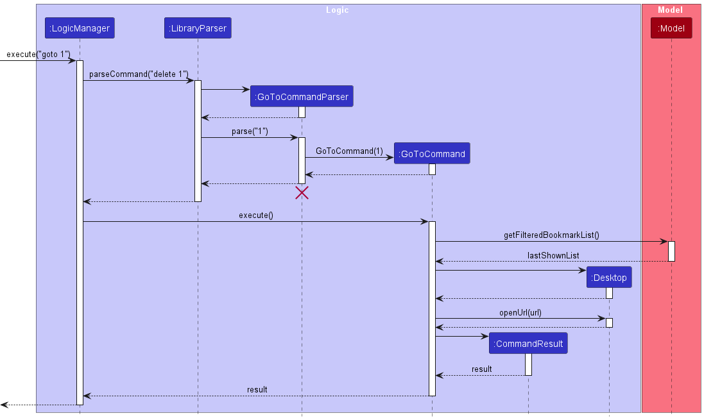

* Table of Contents
{:toc}

--------------------------------------------------------------------------------------------------------------------

## **Software Overview**

* MyLib is a desktop application originally built to serve as a single platform for organising and tracking all the online webnovels and comics that you may be reading. However, it is more than capable of doing so for any other reading material you might be interested in, such as blogs, articles, research papers and basically anything you can read. MyLib is optimized for use via a Command Line Interface (CLI) while still having the benefits of a Graphical User Interface (GUI). This means that most of MyLib’s features are meant to be accessed through typed commands rather than mouse clicks.

--------------------------------------------------------------------------------------------------------------------

## **Intended Audience**

This guide is intended primarily for developers who want to work on the MyLib code base at https://github.com/AY2223S2-CS2103T-T13-4/tp.

--------------------------------------------------------------------------------------------------------------------

## **Using the Guide**

This guide contains certain visuals to aid in conveying information more effectively

Visual: :bulb: GMFD: `:bulb:` Meaning: Useful supplementary information for the developer

--------------------------------------------------------------------------------------------------------------------
## **About Us**
Please refer to the [About Us](AboutUs.md) page for information about the developers.

--------------------------------------------------------------------------------------------------------------------
## **Acknowledgements**

* This project is based on the [AddressBook Level 3 (AB3)](https://se-education.org/addressbook-level3/) project created by the [SE-EDU initiative](https://se-education.org/).
* Libraries used: [JavaFX](https://openjfx.io/), [JUnit5](https://github.com/junit-team/junit5)

--------------------------------------------------------------------------------------------------------------------
## **About MyLib**
This Developer Guide provides in-depth documentation on how MyLib is designed and implemented. It covers the architecture of MyLib, detailed specifications on smaller pieces of the design, and an outline of all parts of the software and how they will work.

You can use this guide to maintain and evolve MyLib.

## **Design**

This section gives you a high-level overview of how the application is structured and what the key components of MyLib are.

:bulb: **Tip:** The `.puml` files used to create diagrams in this document can be found in the [diagrams](https://github.com/se-edu/addressbook-level3/tree/master/docs/diagrams/) folder. Refer to the [_PlantUML Tutorial_ at se-edu/guides](https://se-education.org/guides/tutorials/plantUml.html) to learn how to create and edit diagrams.

### Architecture

The ***Architecture Diagram*** given above explains the high-level design of the App.

Given below is a quick overview of main components and how they interact with each other.

**Main components of the architecture**

**`Main`** has two classes called [`Main`](https://github.com/AY2223S2-CS2103T-T13-4/tp/blob/master/src/main/java/seedu/library/Main.java) and [`MainApp`](https://github.com/AY2223S2-CS2103T-T13-4/tp/blob/master/src/main/java/seedu/library/MainApp.java). It is responsible for:
* Initializing the components in the correct sequence
* Connecting components with each other during app launch
* Shutting down the components
* Invoking cleanup methods where necessary when app shuts down

[**`Commons`**](#common-classes) represents a collection of classes used by multiple other components.

The rest of the App consists of four components.

* [**`UI`**](#ui-component): The UI of the App.
* [**`Logic`**](#logic-component): The command executor.
* [**`Model`**](#model-component): Holds the data of the App in memory.
* [**`Storage`**](#storage-component): Reads data from, and writes data to, the hard disk.

**How the architecture components interact with each other**

The *Sequence Diagram* below shows how the components interact with each other for the scenario where the user issues the command `delete 1`.

Each of the four main components (also shown in the diagram above),

* defines its *API* in an `interface` with the same name as the Component.
* implements its functionality using a concrete `{Component Name}Manager` class (which follows the corresponding API `interface` mentioned in the previous point.

For example, the `Logic` component defines its API in the `Logic.java` interface and implements its functionality using the `LogicManager.java` class which follows the `Logic` interface. Other components interact with a given component through its interface rather than the concrete class (reason: to prevent outside component's being coupled to the implementation of a component), as illustrated in the (partial) class diagram below.

The sections below give more details of each component.

### UI component

The UI component handles the user-interface portion of the application.
The **API** of this component is specified in [`Ui.java`](https://github.com/AY2223S2-CS2103T-T13-4/tp/blob/master/src/main/java/seedu/library/ui/Ui.java)

The UI consists of a `MainWindow` that is made up of parts e.g.`CommandBox`, `ResultDisplay`, `BookmarkListPanel`, `StatusBarFooter`, `ZoomView`  etc. All these, including the `MainWindow`, inherit from the abstract `UiPart` class which captures the commonalities between classes that represent parts of the visible GUI.

The `UI` component uses the JavaFx UI framework. The layout of these UI parts are defined in matching `.fxml` files that are in the `src/main/resources/view` folder. For example, the layout of the [`MainWindow`](https://github.com/AY2223S2-CS2103T-T13-4/tp/blob/master/src/main/java/seedu/library/ui/MainWindow.java) is specified in [`MainWindow.fxml`](https://github.com/AY2223S2-CS2103T-T13-4/tp/blob/master/src/main/resources/view/MainWindow.fxml)

The `UI` component,

* executes user commands using the `Logic` component.
* listens for changes to `Model` data so that the UI can be updated with the modified data.
* keeps a reference to the `Logic` component, because the `UI` relies on the `Logic` to execute commands.
* depends on some classes in the `Model` component, as it displays `Bookmark` object residing in the `Model`.

### Logic component

The Logic Component handles the execution of commands
**API** : [`Logic.java`](https://github.com/AY2223S2-CS2103T-T13-4/tp/blob/master/src/main/java/seedu/library/logic/Logic.java)

Here's a (partial) class diagram of the `Logic` component:

How the `Logic` component works:
1. When `Logic` is called upon to execute a command, it uses the `LibraryParser` class to parse the user command.
1. This results in a `Command` object (more precisely, an object of one of its subclasses e.g., `AddCommand`) which is executed by the `LogicManager`.
1. The command can communicate with the `Model` when it is executed (e.g. to add a bookmark).
1. The result of the command execution is encapsulated as a `CommandResult` object which is returned back from `Logic`.

The Sequence Diagram below illustrates the interactions within the `Logic` component for the `execute("delete 1")` API call.

:information_source: **Note:** The lifeline for `DeleteCommandParser` should end at the destroy marker (X) but due to a limitation of PlantUML, the lifeline reaches the end of diagram.

Here are the other classes in `Logic` (omitted from the class diagram above) that are used for parsing a user command:

How the parsing works:
* When called upon to parse a user command, the `LibraryParser` class creates an `XYZCommandParser` (`XYZ` is a placeholder for the specific command name e.g., `AddCommandParser`) which uses the other classes shown above to parse the user command and create a `XYZCommand` object (e.g., `AddCommand`) which the `LibraryParser` returns back as a `Command` object.
* All `XYZCommandParser` classes (e.g., `AddCommandParser`, `DeleteCommandParser`, ...) inherit from the `Parser` interface so that they can be treated similarly where possible e.g, during testing.

### Model component

The Model component holds the data of the app in memory.
**API** : [`Model.java`](https://github.com/AY2223S2-CS2103T-T13-4/tp/blob/master/src/main/java/seedu/library/model/Model.java)

The `Model` component,
* stores the Library data i.e., all `Bookmark` objects (which are contained in a `UniqueBookmarkList` object).
* stores the currently 'selected' `Bookmark` objects (e.g., results of a search query) as a separate _filtered_ list which is exposed to outsiders as an unmodifiable `ObservableList<Bookmark>` that can be 'observed' e.g. the UI can be bound to this list so that the UI automatically updates when the data in the list change.
* stores a `UserPref` object that represents the user’s preferences. This is exposed to the outside as a `ReadOnlyUserPref` objects.
* does not depend on any of the other three components (as the `Model` represents data entities of the domain, they should make sense on their own without depending on other components)

:information_source: **Note:** An alternative (arguably, a more OOP) model is given below. It has a `Tag` list in the `Library`, which `Bookmark` references. This allows `Library` to only require one `Tag` object per unique tag, instead of each `Bookmark` needing their own `Tag` objects. 

### Storage component

The Storage Component reads data from, and writes data to, the hard disk.
**API** : [`Storage.java`](https://github.com/AY2223S2-CS2103T-T13-4/tp/blob/master/src/main/java/seedu/library/storage/Storage.java)

The `Storage` component,
* can save both Library data and user preference data in json format, and read them back into corresponding objects.
* inherits from both `LibraryStorage` and `UserPrefStorage`, which means it can be treated as either one (if only the functionality of only one is needed).
* depends on some classes in the `Model` component (because the `Storage` component's job is to save/retrieve objects that belong to the `Model`)

### Common classes

Classes used by multiple components are in the `seedu.library.commons` package.

--------------------------------------------------------------------------------------------------------------------

## **Implementation**

This section describes some noteworthy details on how certain features are implemented.

### Add Feature

#### Implementation

The `add` command creates a new bookmark in the library. This allows users to keep easily keep track of their readings.

A bookmark in MyLib contains:
* Title - the title of the content that is being tracked by this bookmark
* Author - the author of the content that is being tracked by this bookmark
* Progress - consists of volume, chapter and page, and is used to track your progress with the content being tracked by this bookmark.
* Genre - the genre your content falls under.
* Rating - to indicate how much you enjoyed the content being tracked by this bookmark.
* Tags - a custom labels attached to a bookmark for custom categorization purposes.
* URL - to hold the URL of the website that the content being tracked by this bookmark is hosted at.

For a bookmark in MyLib, everything except for title and genre is optional.

Steps involved and interactions between components when a valid add bookmark command is received
1. Upon receiving a valid `add` command from the UI component, the `execute()` command for the `LogicManager` is called with the command inputs.
2. `LibraryParser` parses the input to determine the command type, in this case it is a `add` command, thus an `AddCommandParser` is created.
3. The `AddCommandParser` then parses the input and constructs a new `Bookmark` with the input fields based on their tags.
4. The newBookmark is then used to create an `AddCommand` to be returned to the `LogicManager`.
5. `execute()` method of `AddCommand` is then called by the `LogicManager` 
   1. This adds the newBookmark to the library
   2. And returns a `CommandResult` object to the `LogidManager`.

The following sequence diagram shows the interaction between the objects when a user executes the Add command.

### GoTo Feature

#### Implementation

The `Bookmark` class will have an attribute `url` of type `URL` which represents site which the bookmark is hyperlinked to.
The `GoToCommand` will then open the site in the default browser of the user. Before the `GoToCommand` object is created.

* The `GoToCommandParser` will checks if the command is of the correct format and argument index is valid
* Then the `GoToCommand` will execute these steps in order
  1. Get the current bookmarklist displayed
  2. Get bookmark of specified index from the bookmarklist and get its `url`
  3. Open the url in the default browser.

The following Activity diagram depicts what happens when the `GoToCommand` is executed.

The following sequence diagram shows the interaction between the objects when a user executes the GoTo command.

#### Design Considerations:

**Aspect: What data type to use?:**

Currently, the url value is a `String` object that is parsed into Url object in `Bookmark` class and
is then created into a URI object when `GoToCommand` is executed

The benefits of using `String` is that it is easy to saved and retrieve from Json Storage File.

* **Alternative 1 (current choice):** url stored as string and URI object to open site only created in `GoToCommand`.
    * Pros: Easy to implement, easier storage
    * Cons: May have security due to parsing or encoding errors

* **Alternative 2:** url stored as a URI object in Bookmark
    * Pros: Will use be safer as errors are caught before object is created
    * Cons: Difficulty in implementing as harder to parse for user input due to format of URI

### View Feature

#### Implementation

The `ViewCommand` allows user to view the bookmark's labelled details in the right panel/ Zoomview panel on the bottom right of GUI.

The user can use the `view` command followed by a postive index/integer. The value of this index corresponds to the 
index beside the bookmark the user wishes to view in the bookmarkList panel of the GUI. Therefore its value has to lie
between the 1 and the length of current displayed bookmarklist inclusive.

:information_source: **Note:** This `view` command can only be executed 
if a bookmark exists in the bookmarkList Panel

#### Design considerations:

**Aspect: How to pick bookmark to view?:**

* **Alternative 1(current choice):** Pick by index given to bookmark when `bookmarkCard` object is created.
     * Pros: Simple to implement and  intuitive for user to pick desired bookmark based on the order in bookmarklist
     * Cons: An extra field to be stored which might be unnecessary.
* **Alternative 2:** Pick based on the title of the bookmark.
    * Pros: No need extra overhead or space required to store an extra field
    * Cons: Some titles may have similar titles so user may have to type out entire title which may be quite long or
      have some sort of combination of Title and author to identify the unique bookmark.

### Find Feature

#### Implementation

The `FindCommand` allows user to find an existing bookmark by searching for a specific `Title`, `Genre`, `Tag`, and/or
`Author`.

User can use the `find` command followed by optional prefixes of the field they want to search by and the word they
want to search for. The prefixes are `n/` for `Title`, `g/` for `Genre`, `t/` for `Tag`, and `a/` for `Author`.
An example of a user input would be: `find g/ Fantasy`. User inputs are parsed in `FindCommandParser` which will
split the input based on the prefixes.

Some limitations of the user input includes:
1. There must be at least 1 prefix provided
   * User cannot use `find` without specifying a field that they want to search for
2. The `genre` and `tag` provided must be valid
   * User can only search for `genre` and `tags` that already exist in the list of `Genre` and `Tag`
   * Searching for invalid `genre`/`tag` would give an error message informing the user that the `genre`/`tag` does not
     exist

#### Design considerations:

**Aspect: Which fields of bookmark can `find` searched for?:**

Currently, `find` allows user to search by `title`, `genre`, `tag` and `author`.

The main reason is that it is intuitive to use these fields to identify one bookmark from another.

A considered field to be included in `find` is the `progress` field. However, it seems counter-intuitive to search a
bookmark by the `progress` field as it is not common for people to remember how far they have read a book, so users are
unlikely to search for a bookmark using `progress`.

### Tags Feature

#### Implementation
The `ListTagsCommand` lists all tags in the tag list. The `AddTagCommand` allows you to add tags to the tag list.
The `DeleteTagCommand` allows you to delete tags from the tag list.

For listing the tags, you can use the `tags` command. For adding a tag to the tag list,
you can use the `addtag` command followed by the tag prefix, `t/`. An example of a user input
would be `addtag t/MaleProtagonist`. For deleting a tag from the tag list, you can use the
`dtag` command followed by the name of the tag name. An example of user input would be
`dtag MaleProtagnoist`.

Some limitations of the user inputs include:
1. For deleting tags, only one tag name can be specified
    * You cannot delete more than one tag name in a single command

#### Design considerations:

**Aspect: How to store the tag list?:**
The tag list is stored as a JSON file which will be saved to the user's local device.

The main reason for this is due to the need for the user's tag list to be saved even after the user exist
the application. When the user starts the application in the future, the tag list must be how the user left it.

### Rating Field
#### Implementation
The `Rating` field of a bookmark allows user to rate books in the Library. This is stored as the attribute `Rating`
in the `Bookmark` class.

`Rating` is an optional field to be added to a bookmark. It was represented as an integer as that allows it to be
easily displayed as stars on the user interface and thus easy to understand for the user. When no `Rating` is provided,
no star logos would be displayed. The sort command also sorts the bookmarks based on the rating provided.

#### Design considerations:

**Aspect: How should `Rating` be stored?**
The `Rating` field is represented by integer values from 0 to 5. This allows for a simple and intuitive way to rate
books in the `Library`.

- **Alternative 1(current choice):** Representing it as an integer from 0 to 5 inclusive.
  - Pros: Simple to keep track of and store, easily map rating to star icons in UI.
  - Cons: Might not be granular enough to represent all possible values.
- **Alternative 2:** Representing it a decimal value from 0 to 5.
  - Pros: Higher level of granularity
  - Cons: Difficult to represent with visual symbols in the UI to accurately reflect difference in ratings.

**Aspect: How should `Rating` be displayed to users?**
- Alternative 1: Represented as a number for example "Rating: 4".
  - Pros: Easy to implement in the UI
  - Cons: Lots of textual information already present in the UI, adding more text makes it less visually appealing
- Alternative 2(current choice): Representing it with 5 star icons in the BookmarkList Panel
  - Pros: User can view ratings of books without having to click on the Bookmark Card
  - Cons: Harder to implement in the UI

### Progress Field

#### Implementation

The `Progress` field of a `Bookmark` is used to track the latest read portion of the associated book. This could be many
things including the latest read volume of a series, or the chapter or page of a single book. It is mainly for a user to
remember where he last left off when they revisit the book.

Currently, `Progress` contains 3 public attributes: `volume`, `chapter` and `page`, all of which are implemented as
separate `String` objects. While these attributes can be empty, at least one of them must not be empty.

:information_source: **Note:** For a case where all 3 attributes are empty
, this should be reflected by a `Bookmark` with `Progress = null`.

The valid range of values for the 3 attributes are as follows:
1. Each of the 3 attributes can only be `~` or an unsigned integer in the form of a `String`
    * `~` represents an empty value.
    * If it is an unsigned integer, it may not start with `0`.
2. At least one of the 3 attributes must be an unsigned integer
    * They cannot all be `~`. i.e. Cannot have an empty `Progress`

The format for user input is: `p/VOLUME CHAPTER PAGE`.

The valid range of values for `VOLUME`, `CHAPTER` and `PAGE` are identical to that of the `volume`, `chapter` and `page`
attributes. Similarly, the value of the 3 attributes is identical to the value stored in JSON when the `Bookmark` is
saved. For example, if `page` has the value `~`, that exact value is saved into the JSON file.

#### Design considerations:

**Aspect: What data should `Progress` contain?:**

Currently, Progress stores information about the volume, chapter and page of the book being tracked.

This is believed to be sufficient for tracking basically any book since most, if not all books (online or physical)
organise themselves with the 3 attributes.

Other possible attributes that were considered include: line number and word number. However, if we consider a user revisiting a book and wanting to continue where they last left off,
it is very unlikely that they will continue from the word or line that they stopped at.

**Aspect: What data type to use?:**

Currently, `volume`, `chapter` and `page` are all stored as separate `String` objects.

This makes it easy to parse user input (which is a `String`) into a `Progress` object, and easy for a `Progress`
object to be converted into a set of `String` objects to be saved into a JSON file for storage.

A considered alternative is to use 3 `Integer` objects instead. The benefit of this would be allowing integer
arithmetic while requiring slightly less memory. However, there are no plans for allowing a user to update `Progress`
in a way that would require integer arithmetic and the difference in memory cost is negligible. Furthermore, like other
`Bookmark` fields, `Progress` is designed to be immutable.

**Aspect: How to represent a value that does not exist?:**

Currently, `~` is used to represent absence of a value.

The main reason is to simplify the logic for parsing user input.

A considered alternative is to simply leave empty fields as an empty string `""`. However, a possible user input would
then look like `"1 50"` and it becomes impossible to differentiate between the 3 attributes. It is possible to use a
prefixes to differentiate them, but parsing becomes more complex.

### \[Proposed\] Undo/redo feature

#### Proposed Implementation

The proposed undo/redo mechanism is facilitated by `VersionedLibrary`. It extends `Library` with an undo/redo history, stored internally as an `libraryStateList` and `currentStatePointer`. Additionally, it implements the following operations:

* `VersionedLibrary#commit()` — Saves the current Library state in its history.
* `VersionedLibrary#undo()` — Restores the previous Library state from its history.
* `VersionedLibrary#redo()` — Restores a previously undone Library state from its history.

These operations are exposed in the `Model` interface as `Model#commitLibrary()`, `Model#undoLibrary()` and `Model#redoLibrary()` respectively.

Given below is an example usage scenario and how the undo/redo mechanism behaves at each step.

Step 1. The user launches the application for the first time. The `VersionedLibrary` will be initialized with the initial library state, and the `currentStatePointer` pointing to that single Library state.

Step 2. The user executes `delete 5` command to delete the 5th bookmark in the library. The `delete` command calls `Model#commitLibrary()`, causing the modified state of the Library after the `delete 5` command executes to be saved in the `libraryStateList`, and the `currentStatePointer` is shifted to the newly inserted Library state.

Step 3. The user executes `add n/Hobbit …​` to add a new bookmark. The `add` command also calls `Model#commitLibrary()`, causing another modified library state to be saved into the `libaryStateList`.

:information_source: **Note:** If a command fails its execution, it will not call `Model#commitLibrary()`, so the library state will not be saved into the `libraryStateList`.

Step 4. The user now decides that adding the bookmark was a mistake, and decides to undo that action by executing the `undo` command. The `undo` command will call `Model#undoLibraryk()`, which will shift the `currentStatePointer` once to the left, pointing it to the previous library state, and restores the library to that state.

:information_source: **Note:** If the `currentStatePointer` is at index 0, pointing to the initial Library state, then there are no previous Library states to restore. The `undo` command uses `Model#canUndoLibrary()` to check if this is the case. If so, it will return an error to the user rather
than attempting to perform the undo.

The following sequence diagram shows how the undo operation works:

:information_source: **Note:** The lifeline for `UndoCommand` should end at the destroy marker (X) but due to a limitation of PlantUML, the lifeline reaches the end of diagram.

The `redo` command does the opposite — it calls `Model#redoLibrary()`, which shifts the `currentStatePointer` once to the right, pointing to the previously undone state, and restores the Library to that state.

:information_source: **Note:** If the `currentStatePointer` is at index `libraryStateList.size() - 1`, pointing to the latest Library state, then there are no undone Library states to restore. The `redo` command uses `Model#canRedoLibrary()` to check if this is the case. If so, it will return an error to the user rather than attempting to perform the redo.

Step 5. The user then decides to execute the command `list`. Commands that do not modify the Library, such as `list`, will usually not call `Model#commitLibrary()`, `Model#undoLibrary()` or `Model#redoLibrary()`. Thus, the `libraryStateList` remains unchanged.

Step 6. The user executes `clear`, which calls `Model#commitLibrary()`. Since the `currentStatePointer` is not pointing at the end of the `libraryStateList`, all Library states after the `currentStatePointer` will be purged. Reason: It no longer makes sense to redo the `add n/David …​` command. This is the behavior that most modern desktop applications follow.

The following activity diagram summarizes what happens when a user executes a new command:

#### Design considerations:

**Aspect: How undo & redo executes:**

* **Alternative 1 (current choice):** Saves the entire Library.
    * Pros: Easy to implement.
    * Cons: May have performance issues in terms of memory usage.

* **Alternative 2:** Individual command knows how to undo/redo by
  itself.
    * Pros: Will use less memory (e.g. for `delete`, just save the bookmark being deleted).
    * Cons: We must ensure that the implementation of each individual command are correct.

_{more aspects and alternatives to be added}_

--------------------------------------------------------------------------------------------------------------------

## **Documentation, logging, testing, configuration, dev-ops**

* [Documentation guide](Documentation.md)
* [Testing guide](Testing.md)
* [Logging guide](Logging.md)
* [Configuration guide](Configuration.md)
* [DevOps guide](DevOps.md)

--------------------------------------------------------------------------------------------------------------------
## **Appendix: Requirements**

### Product scope

**Target user profile**:

* Consumer of comics and web novels
* Has a need to manage the large number of books he consumes
* Prefer desktop apps over other types
* Can type fast
* Prefers typing to mouse interactions
* Is reasonably comfortable using CLI apps

**Value proposition**:
* Manage books for the user.
* Keeps track of books they have not started, is currently reading, has finished reading.
* Manage books faster than a typical mouse/GUI driven app

### User stories

Priorities: High (must have) - `* * *`, Medium (nice to have) - `* *`, Low (unlikely to have) - `*`

| Priority | As a …​                                | I want to …​                                   | So that I can…​                                                    |
|----------|----------------------------------------|------------------------------------------------|--------------------------------------------------------------------|
| `* * *`  | new user                               | see usage instructions                         | refer to instructions when I forget how to use the App             |
| `* * *`  | user                                   | add a new bookmark                             | start tracking a book                                              |
| `* * *`  | user                                   | delete a bookmark                              | remove entries that I no longer need                               |
| `* * *`  | user                                   | edit a bookmark                                | update the information in my bookmark                              |
| `* *`    | user                                   | view the details of a single bookmark          | see information about a particular book I am tracking              |
| `* *`    | user with mostly unnecessary bookmarks | clear all bookmarks                            | not delete each bookmark one by one                                |
| `* *`    | user with many bookmarks               | find bookmarks by book type                    | view bookmarks of only a certain type                              |
| `* *`    | user with many bookmarks               | find bookmarks by book genre                   | view bookmarks of only a certain genre                             |
| `* *`    | user                                   | rate a book through its bookmark               | remember how much I enjoyed the book                               |
| `* *`    | user with many bookmarks               | sort bookmarks by book title                   | locate a bookmark easily                                           |
| `* *`    | user with many bookmarks               | sort bookmarks by rating                       | locate bookmarks of books I enjoyed easily                         |
| `* *`    | user who likes detail                  | add tags to bookmark                           | give additional labels to a bookmark                               |
| `* *`    | user with many bookmarks               | find bookmarks by their tags                   | view only bookmarks who have certain tags                          |
| `* *`    | user with many bookmarks               | find bookmarks by book author                  | view bookmarks of books written by a specific author               |
| `* *`    | user                                   | add hyperlinks to bookmarks                    | link the website where I am reading the book's chapters from       |
| `* *`    | user                                   | goto url of bookmarks                          | easily go to site of bookmark                                      |
| `*`      | user                                   | add book characters to a bookmark              | store noteworthy characters which I remember the book by           |
| `*`      | user                                   | find bookmarks using name of characters        | locate books with certain characters easily                        |
| `* *`    | user with many bookmarks               | sort bookmarks by their rating                 | view bookmarks in order of their rating                            |
| `* *`    | user with many bookmarks               | find bookmarks by last modified date           | view bookmarks in order of most recently updated                   |
| `* *`    | user                                   | add the current reading progress to a bookmark | know where I last left off with a certain book                     |
| `* *`    | user                                   | find bookmarks based on their progress         | view only bookmarks of a certain progress easily                   |
| `* *`    | user                                   | add tags to an approved tag list               | standardize the tags used and make finding bookmark by tags easily |
| `* *`    | user                                   | delete a tag from the approved tag list        | remove tags that I no longer need                                  |
| `* *`    | user                                   | view tags in the approved tag list             | see that tags have been added and available for use                |
| `* *`    | user                                   | view the list of valid genres                  | see what are genres that can be added to a bookmark                |

### Use cases

(For all use cases below, the **System** is the `MyLib` and the **Actor** is the `user`, unless specified otherwise)

**Use case: Delete a bookmark**

**MSS**

1.  User requests to list bookmarks
2.  MyLib shows a list of bookmarks
3.  User requests to delete a specific bookmark in the list
4.  MyLib deletes the bookmark

    Use case ends.

**Extensions**

* 2a. The list is empty.

  Use case ends.

* 3a. The given index is invalid.

    * 3a1. MyLib shows an error message.

      Use case resumes at step 2.

**Use case: Edit a bookmark**

**MSS**

1.  User requests to list bookmarks
2.  MyLib shows a list of bookmarks
3.  User requests to edit a specific bookmark in the list
4.  MyLib edits the bookmark

    Use case ends.

**Extensions**

* 2a. The list is empty.

  Use case ends.

* 3a. The given index is invalid.

    * 3a1. MyLib shows an error message.

      Use case resumes at step 2.

* 3b. Less than one field to edit provided.

    * 3b1. MyLib shows an error message.

      Use case resumes at step 2

* 3c. New value is invalid for any field.

    * 3c1. MyLib shows an error message.

      Use case resumes at step 2.

**Use case: Add a bookmark**

**MSS**

1.  User requests to add a bookmark
2.  MyLib adds a bookmark

    Use case ends.

**Extensions**

* 1a. The given index is invalid.

    * 1a1. MyLib shows an error message.

      Use case resumes at step 2.

* 1b. Not all compulsory fields provided.

    * 1b1. MyLib shows an error message.

      Use case resumes at step 2

* 1c. Value is invalid for any field.

    * 1c1. MyLib shows an error message.

      Use case resumes at step 2.

**Use case: View a bookmark**

**MSS**

1.  User requests to list bookmarks
2.  MyLib shows a list of bookmarks
3.  User requests to view a specific bookmark in the list
4.  MyLib views the bookmark in right panel of UI

    Use case ends.

**Extensions**

* 2a. The list is empty.

  Use case ends.

* 3a. The given index is invalid.

    * 3a1. MyLib shows an error message.

      Use case resumes at step 2.

**Use case: Goto bookmark's Url**

**MSS**

1.  User requests to list bookmarks
2.  MyLib shows a list of bookmarks
3.  User requests to goto a specific bookmark's Url in the list
4.  MyLib opens url in user's default browser

    Use case ends.

**Extensions**

* 2a. The list is empty.

  Use case ends.

* 3a. The given index is invalid.

    * 3a1. MyLib shows an error message.

      Use case resumes at step 2.

### Non-Functional Requirements

1.  Should work on any _mainstream OS_ as long as it has Java `11` or above installed.
2.  Should be able to hold up to 1000 bookmark without a noticeable sluggishness in performance for typical usage.
3.  A user with above average typing speed for regular English text (i.e. not code, not system admin commands) should be able to accomplish most of the tasks faster using commands than using the mouse.
4.  Saved data should be stored locally and in a human editable text file to allow advanced users to manipulate the data by editing the file.
5.  The software should work without requiring an installer.
6.  The Product JAR/ZIP file should not exceed 100MB.
7.  Documents (i.e. PDF files) should not exceed 15MB per file.

*{More to be added}*

### Glossary

* **Mainstream OS**: Windows, Linux, Unix, OS-X
* **Bookmark**: Tracker for a book that contains information about the book and a user's reading progress

--------------------------------------------------------------------------------------------------------------------

## **Appendix A: Instructions for Manual Testing**

Given below are instructions and test cases to test MyLib manually.

:information_source: **Note:** These instructions only provide a starting point for testers to work on.
Testers are expected to do more *exploratory* testing. Also, each test case is independent of the other test cases.

### Launch and Shutdown

1. **Initial launch**

    1. Download the [MyLib jar file](https://github.com/AY2223S2-CS2103T-T13-4/tp/releases) and copy into an empty folder.

    2. Double-click the jar file.

   **Expected**: Shows the GUI with a set of sample bookmarks. The window size may not be optimal.

2. **Saving window preferences**

    1. Resize the window to an optimum size. Move the window to a different location. Close the window.

    2. Re-launch the app by double-clicking the jar file. 

   **Expected**: The most recent window size and location is retained.

### Listing all Bookmarks

1. `list`

   **Expected**: All bookmark entries are listed out and displayed in the List Panel.

2. `list hello`

   **Expected**: All bookmark entries are listed out and displayed in the List Panel.

### Adding a Bookmark

1. `add n/The Odyssey a/Homer p/1 1 1 g/Fantasy r/4 u/http://classics.mit.edu/Homer/odyssey.html t/Literature`

   **Expected**: A new bookmark entry is successfully added. The bookmark will have Title `The Odyssey`, author `Homer`, progress `Vol 1 Chapter 1 Page 1`, genre `Fantasy`, rating `4`, URL `http://classics.mit.edu/Homer/odyssey.html` and tag `Literature`. The View Panel displays all these information except URL, and a success message is displayed in the Result Display.

2. `add n/Hobbit a/J. R. R. Tolkien p/1 ~ 256 r/4 g/Fantasy`

   **Expected**: A new bookmark entry is successfully added. The new bookmark entry will have Title `Hobbit`, author `J. R. R. Tolkien`, progress `Vol 1 Chapter ~ Page 256`, Rating `4` and genre `Fantasy`. The View Panel displays the information for this new bookmark entry, where tag is will be empty. A success message is displayed in the Result Display.

3. `add n/Chainsaw Man r/5`

   **Expected**: No new bookmark is added. An error message is displayed in the Result Display. This is because the compulsory field Genre is missing.

### Editing a Bookmark
Assumptions: The sample data provided by MyLib is used, where there is a total of 4 bookmark entries.

1. `edit 2 n/Kimetsu No Yaiba`

   **Expected**: The Title of the second bookmark is updated to `Kimetsu No Yaiba`. The View Panel displays the updated details of the second bookmark entry.

2. `edit 2 n/Darwin's Game r/1`

   **Expected**: The Title and Rating of the second bookmark entry are updated to`Darwin's Game` and `1` respectively. The View Panel displays the updated details of the second bookmark entry.

3. `edit 2 t/`

   **Expected**: All previous tags for the second bookmark entry are removed. The View Panel displays the updated details fo the second bookmark
   entry.

4. Unsuccessful editing after finding a bookmark
    1.  `find n/Solo Leveling t/Cheats`
    2.  `edit 3 n/No Game No Life`

   **Expected**: An error message is displayed in the Result Display. This is because in the filtered bookmark list, there is only 1 bookmark entries, so `3` is not a valid value for the
   `INDEX` field.

5. `edit`

   **Expected**: An error message is displayed in the Result Display. This is because a minimum of 1 optional field must be specified.

### Viewing a Bookmark
Assumptions: The sample data provided by MyLib is used, where there is a total of 4 bookmark entries.
1. `view 1`

   **Expected**: The View Panel displays the details for the first Bookmark.

2. Successful viewing after finding

    1. `find n/Solo n/Cheats`
    2. `view 1`

   **Expected**: The View Panel displays the details for the first Bookmark entry in the filtered bookmark list. In this case, it displays the details for the entry whose Title name is `Solo Leveling`.

3. Unsuccessful viewing after finding
    1. `find n/Solo n/Cheats`
    2. `view 2`

   **Expected**: An error message is displayed in the Result Display. This is because in the filtered bookmark list, there is only 1 bookmark entry, implying that `2` is not a valid value for the `INDEX` field.

4. `view -1`

   **Expected**: An error message is displayed in the Result Display. This is because the `INDEX` field must be a positive integer greater than or equal to 1.

### Finding Bookmarks
Assumptions: The sample data provided by MyLib is used, where there is a total of 4 bookmark entries.
1. `find n/Solo`

   **Expected**: The List Panel shows the bookmark entry whose Title matches with`Solo`. A success message is displayed in the Result Display.

2. `find n/Solo n/Defense`

   **Expected**: The List Panel shows the bookmark entries whose Title  matches with `Defense`. This is because if only one field is required, find ignores all fields of the same prefix except the last. A success message is displayed in the Result Display.

3. `find`

   **Expected**: An error message is displayed in the Result Display. This is because a minimum of 1 optional field must be specified.

5. `find t/Weird`

   **Expected**: An error message is displayed in the Result Display. This is because `Weird` is not in the valid tag list.

### Deleting bookmarks
Prerequisites: List all bookmarks using the `list` command. Multiple bookmarks are present in the list.
Assumptions: The sample data provided by MyLib is used, where there is a total of 4 bookmark entries.

1. `delete 1`

   **Expected**: The first bookmark entry in the List Panel is deleted. A success message is displayed in the Result Display.

2. `delete 1 2`

   **Expected**: An error message is displayed in the Result Display. This is because delete only takes in 1 positive index.

3. `delete`

   **Expected**: An error message is displayed in the Result Display. This is because a minimum of 1 index must be specified.

3. Deleting bookmark after finding
    1. `find n/Solo`
    2. `delete 1`

   **Expected**: The first bookmark of title `Solo Leveling` is deleted. A success message is displayed in the Result Display.

### Clear all bookmark

1. `clear`

   **Expected**: All bookmark entries are deleted. 

2. `clear hello`

   **Expected**: All bookmark entries are deleted.

### Listing valid genres
1. `genre`

   **Expected**: A list of valid genres are displayed in Result Display.

### Listing valid tags
1. `tags`

   **Expected**: A list of valid tags are displayed in Result Display.

2. `tags hello`

**Expected**: A list of valid tags are displayed in Result Display.

### Adding tags to the tag list
Assumptions: The default tags provided by MyLib is used.
1. `addtag t/Hero`

   **Expected**: A new tag "Hero" is successfully added to the tag list. A success message is displayed in the Result Display.

2. `addtag t/HighSchool t/Security`

   **Expected**: Two new tags "HighSchool" and "Security" are successfully added to the tag list. A success message is displayed in the Result Display.

3. `addtag t/Novel`

    **Expected**: No new tag added to the tag list. An error message is displayed in the Result Display. This is because the tag "Novel" already exists in the tag list.

### Deleting tags from the tag list
Assumptions: The sample data provided by MyLib is used, where there is a total of 4 bookmark entries. The default tags provided by MyLib is used.

1. `dtag Novel`

    **Expected**: The tag "Novel" is successfully deleted from the tag list. A success message is displayed in the Result Display.

2. `dtag Korean`

   **Expected**: No tag is deleted from the tag list. An error message is displayed in the Result Display. This is because there is no "Korean" tag in the tag list.

3. `dtag MaleProtagonist FemaleProtagonist`

   **Expected**: No tag is deleted from the tag list. An error message is displayed in the Result Display. This is because tags can only be deleted one at a time and each tag can only be one word long with no spaces in between.

### Get Help

1. `help`

   **Expected**: The help window opens.

2. `help hello`

   **Expected**: The help window opens.

### Exit MyLib

1. `exit`

   **Expected**: MyLib closes.

2. `exit hello`

   **Expected**: MyLib closes.

### Save Data

1. Missing Data File

   Prerequisite: There is no file called `library.json` in the `data` subfolder of the folder
   where MyLib is located.

    1. If you have an existing `library.json` file, delete the file.
    2. Double-click MyLib's jar file.

   **Expected**: MyLib launches with the sample bookmark data shown in the List Panel. There
   is a total of 4 bookmark entries.
--------------------------------------------------------------------------------------------------------------------

## **Appendix B: Planned Enhancements**
Currently, there a few feature flaws with the application. These are some proposed fixes to address them and improve functionality for the user:

* `edit 0` as show in Figure 1  and `edit` with any other postitive index in Figure 2 below have differing response/result in the result display box. 

<figcaption style="text-align:center"><em><strong>
   Figure 1
   </strong>
   : After executing edit 0
   </em></figcaption>

<figcaption style="text-align:center"><em><strong>
   Figure 2
   </strong>
   : After executing edit 8
   </em></figcaption>

Currently, there is a discrepancy where `edit 0` with missing prefix causes an error message of invalid command format 
while `edit` with any positive index and missing prefix causes an error message of at least 1 field must be present.

**Potential Enhancement and Suggested Implementation:**
It would be great to streamline this error message by perhaps having a separate error message of "index cannot be less 
than 1 0" since the bookmarklist index starts from 1. And keep the current error message for indexes more than 0

In the `parse` command  of `EditCommandParser` class ,  change the message thrown to "index cannot be less than 1" when 
ParseException is thrown.

