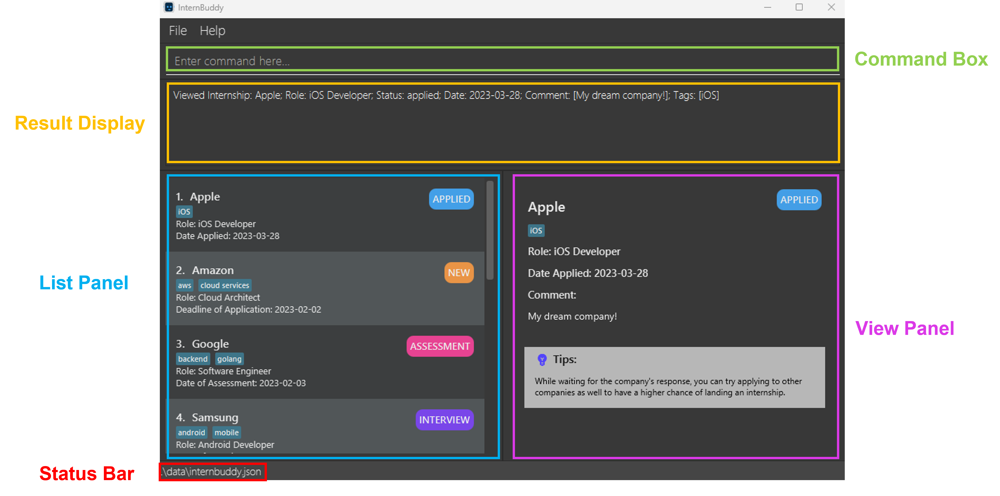

## **Table of Contents**
* Table of Contents
{:toc}

--------------------------------------------------------------------------------------------------------------------
## **Introducing InternBuddy**

InternBuddy is a desktop application for Computing undergraduates to manage their internship applications.
It is optimized for typing where it allows users to complete internship management tasks much more efficiently
via the keyboard as compared to using traditional Graphical User Interface (GUI) applications. InternBuddy runs
using Java 11, and is available on the Windows, macOS and Linux operating systems.

 

  

--------------------------------------------------------------------------------------------------------------------
## **About the Developer Guide**

### Objectives of the Developer Guide
This developer guide aims to provide developers with insights into the implementation details
of InternBuddy and to explain the design considerations behind the different features. It
utilises Unified Modeling Language (UML) diagrams created using [PlantUML](https://plantuml.com/)
for a visual explanation of the implementations.

Apart from shedding light onto InternBuddy's  internal details, this developer guide also provides
information on how one can test the features of InternBuddy, and showcases the user study component
that we went through in the initial development phase for requirements gathering.

Hopefully, interested developers would be able to easily set up the InternBuddy project and
extends its functionality through this developer guide.

### Using the Developer Guide
This developer guide uses a set of formatting standards and syntax to better communicate
information.

**Information Box**

:information_source: **Info:** Provides useful information that supplements the main text

**Tip Box**

:bulb: **Tip:**  Suggestions on how to enhance your experience

**Warning Box**

:warning: **Warning:**  Warns of a dangerous action that you should be aware of and to consider
carefully before committing

**Syntax Highlighting**

Commands, parameters, file paths and class names are highlighted.

`command`, `PARAMETER`, `filepath.json`, `ClassName`

**Keyboard Actions**

Keyboard keys are indicated using rounded buttons.

<button>Ctrl</button> <button>Alt</button> <button>Space</button> <button>Enter</button> <button>&uarr;</button>

--------------------------------------------------------------------------------------------------------------------

## **Setting Up, Getting Started**

Refer to the guide [_Setting up and getting started_](SettingUp.md) for instructions on how to
set up the InternBuddy project in your personal computer.

After setting up and launching InternBuddy, you would see a GUI. Figures 1 and 2 illustrate the main parts
of InternBuddy's GUI, which are referenced throughout this developer guide.

Figure 1: InternBuddy's GUI

 

| Part            | Usage                                                                                        |
|-----------------|----------------------------------------------------------------------------------------------|
| Input Box       | You can type in your commands here to interact with InternBuddy.                             |
| Results Display | This is where the results of your command will be displayed.                                 |
| List Panel      | Displays a list of internship entries.                                                       |
| View Panel      | Displays either the welcome message or detailed information of a specified internship entry. |
| Location Bar    | States where your InternBuddy data file is located on your computer.                         |

Figure 2: Different parts of InternBuddy's GUI

 

--------------------------------------------------------------------------------------------------------------------

## **Design**

:bulb: **Tip:** The `.puml` files used to create diagrams in this document can be found in the [diagrams](https://github.com/AY2223S2-CS2103T-T14-3/tp/tree/master/docs/diagrams) folder. Refer to the [_PlantUML Tutorial_ at se-edu/guides](https://se-education.org/guides/tutorials/plantUml.html) to learn how to create and edit diagrams.

### Architecture
The ***Architecture Diagram*** shown in Figure 3 explains the high-level design of the App.

  

Figure 3: InternBuddy's architecture diagram

Given below is a quick overview of main components and how they interact with each other.

**Main components of the architecture**

**`Main`** has two classes called [`Main`](https://github.com/AY2223S2-CS2103T-T14-3/tp/blob/master/src/main/java/seedu/address/Main.java) and [`MainApp`](https://github.com/AY2223S2-CS2103T-T14-3/tp/blob/master/src/main/java/seedu/address/MainApp.java). It is responsible for,
* At app launch: Initializes the components in the correct sequence, and connects them up with each other.
* At shut down: Shuts down the components and invokes cleanup methods where necessary.

[**`Commons`**](#common-classes) represents a collection of classes used by multiple other components.

The rest of the App consists of four components.

* [**`UI`**](#ui-component): The UI (User Interface) of the App.
* [**`Logic`**](#logic-component): The command executor.
* [**`Model`**](#model-component): Holds the data of the App in memory.
* [**`Storage`**](#storage-component): Reads data from, and writes data to, the hard disk.

**How the architecture components interact with each other**

Figure 4 is a *Sequence Diagram* that shows how the components interact with each other for the scenario where the user
issues the command `delete 1`.

  

Figure 4: Sequence diagram that shows interactions between components 

 

Each of the four main components (also shown in the Figure 4),

* defines its *API* in an `interface` with the same name as the Component.
* implements its functionality using a concrete `{Component Name}Manager` class (which follows the corresponding API `interface` mentioned in the previous point.

For example, the `Logic` component defines its API in the `Logic.java` interface and implements its
functionality using the `LogicManager.java` class which follows the `Logic` interface. Other components
interact with a given component through its interface rather than the concrete class
(reason: to prevent outside component's being coupled to the implementation of a component),
as illustrated in the (partial) class diagram shown in Figure 5.

  

Figure 5: Partial class diagram for the logic, model and storage components 

 

The sections below give more details of each component.

### UI Component

The **API** of this component is specified in [`Ui.java`](https://github.com/AY2223S2-CS2103T-T14-3/tp/blob/master/src/main/java/seedu/address/ui/Ui.java)

  

Figure 6: Class diagram for the UI component 

 

The UI consists of a `MainWindow` that is made up of parts e.g.`CommandBox`, `ResultDisplay`,
`InternshipListPanel`, `StatusBarFooter` etc. All these, including the `MainWindow`,
inherit from the abstract `UiPart` class which captures the commonalities between classes that
represent parts of the visible GUI.

The `UI` component uses the JavaFx UI framework. The layout of these UI parts are defined in matching
`.fxml` files that are in the `src/main/resources/view` folder. For example, the layout of the
[`MainWindow`](https://github.com/AY2223S2-CS2103T-T14-3/tp/blob/master/src/main/java/seedu/address/ui/MainWindow.java)
is specified in [`MainWindow.fxml`](https://github.com/AY2223S2-CS2103T-T14-3/tp/blob/master/src/main/resources/view/MainWindow.fxml)

The `UI` component,

* executes user commands using the `Logic` component.
* listens for changes to `Model` data so that the UI can be updated with the modified data.
* keeps a reference to the `Logic` component, because the `UI` relies on the `Logic` to execute commands.
* depends on some classes in the `Model` component, as it displays `Internship` object residing in the `Model`.

### Logic component

**API** : [`Logic.java`](https://github.com/AY2223S2-CS2103T-T14-3/tp/blob/master/src/main/java/seedu/address/logic/Logic.java)

Figure 7 illustrates a (partial) class diagram of the `Logic` component:

  

Figure 7: Partial class diagram for the logic component 

 

How the `Logic` component works:
1. When `Logic` is called upon to execute a command, it uses the `InternBuddyParser` class to parse the user command.
2. This results in a `Command` object (more precisely, an object of one of its subclasses e.g., `AddCommand`) which is executed by the `LogicManager`.
3. The command can communicate with the `Model` when it is executed (e.g. to add a person).
4. The result of the command execution is encapsulated as a `CommandResult` object which is returned back from `Logic`.

Figure 8 below illustrates the interactions within the `Logic` component for the `execute("delete 1")` API call.

Figure 8: Sequence diagram for the delete command 

 

:information_source: **Info:** The lifeline for
`DeleteCommandParser` and `DeleteCommand` should end at the destroy marker (X) but due to a
limitation of PlantUML, the lifeline reaches the end of diagram.

Figure 9 shows the other classes in `Logic` (omitted from the class diagram above) that are used for parsing a user command:

  

Figure 9: Class diagram for parser classes in the logic component 

 

How the parsing works:
* When called upon to parse a user command, the `InternBuddyParser` class creates an `XYZCommandParser`
(`XYZ` is a placeholder for the specific command name e.g., `AddCommandParser`) which uses the other classes
shown above to parse the user command and create a `XYZCommand` object (e.g., `AddCommand`) which the
`InternBuddyParser` returns back as a `Command` object.
* All `XYZCommandParser` classes (e.g., `AddCommandParser`, `DeleteCommandParser`, ...) inherit from
the `Parser` interface so that they can be treated similarly where possible e.g, during testing.

### Model component
**API** : [`Model.java`](https://github.com/AY2223S2-CS2103T-T14-3/tp/blob/master/src/main/java/seedu/address/model/Model.java)

  

Figure 10: Class diagram for the model component

 

The `Model` component,

* stores the internsip data i.e., all `Internship` objects (which are contained in a `UniqueInternshipList` object).
* stores the currently 'selected' `Internship` objects (e.g., results of a search query) as a separate _filtered_ list
which is exposed to outsiders as an unmodifiable `ObservableList<Internship>` that can be 'observed'
(e.g. the UI can be bound to this list so that the UI automatically updates when the data in the list change.).
* stores a `UserPref` object that represents the user’s preferences. This is exposed to the outside as a `ReadOnlyUserPref` objects.
* does not depend on any of the other three components (as the `Model` represents data entities of the domain, they should make sense on their own without depending on other components)

:information_source: **Info:** An alternative (arguably, a more OOP)
model is given below. It has a `Tag` list in the `InternBuddy`, which `Internship` references. This allows `InternBuddy`
to only require one `Tag` object per unique tag, instead of each `Internship` needing their own `Tag` objects. 

  

Figure 11: Alternative model that is more OOP

 

### Storage component

**API** : [`Storage.java`](https://github.com/AY2223S2-CS2103T-T14-3/tp/blob/master/src/main/java/seedu/address/storage/Storage.java)

  

Figure 12: Class diagram for the storage component

 

The `Storage` component,
* can save both internship data and user preference data in json format, and read them back into corresponding objects.
* inherits from both `InternBuddyStorage` and `UserPrefStorage`, which means it can be treated as either one (if only the functionality of only one is needed).
* depends on some classes in the `Model` component (because the `Storage` component's job is to save/retrieve objects that belong to the `Model`)

### Common classes

Classes used by multiple components are in the `seedu.internship.commons` package.

--------------------------------------------------------------------------------------------------------------------

## **Implementation**

This section describes some noteworthy details on how certain features are implemented.

:information_source: **Info:** Due to a limitation of PlantUML, the lifeline
for objects in sequence diagrams would always reach the end of the diagrams. However, it is worthy to note that for objects
with destroy markers (X), their lifelines would have ended at the markers.

### Add an Internship - `add`

#### Implementation

Figure 13 provides an overview on how the `add` operation works.

Figure 13: Sequence diagram for the add command

 

The following gives a more detailed explanation of the `add` operation.

**Step 1: Validate Input**
1. When the user enters an `add` command, the `AddCommandParser` parses the user's input.
2. It checks for the following:
- `n/` followed by the company's name [Compulsory]
- `r/` followed by the role applied [Compulsory]
- `s/` followed by the status of the internship application [Compulsory]
- `d/` followed by the date associated with the entry [Compulsory]
- `c/` followed by the comment for the entry [Optional]
- `t/` followed by tags for the entry [Optional]
3. If any of the compulsory fields is missing or any of the fields entered by the user
   does not meet the parameter requirements, a `ParserException` will be thrown.
4. An `Internship` will be created from the parsed user's input.

**Step 2: Adding the Internship**
5. A check is done to see if the `Model` component, which stores all the `Internship` entries,
   contains the `Internship` created in Step 4.
6. If a duplicate `Internship` is found, a `CommandException` will be thrown.
7. Else if there is no duplicate `Internship`, the `Internship` created will be added into
   the `Model` component.
8. The currently selected `Internship` in the `Model` component will be updated to become
   this new `Internship` such that the right UI panel displays the information for this new
   `Internship`.

#### Design Considerations

- Whether to make all fields in the `add` command compulsory
1. **Alternative 1 (chosen): Make only essential fields compulsory**
    * Pros: More user-centric as not all users want to enter the optional information,
            which is not exactly critical in tracking internships.
    * Cons: More work is to be done in code implementation. For example, the absence of optional
            fields should not cause a `ParseException`, and there is a need to include a
            default value of `NA` for input without any `Comment`.
2. **Alternative 2: Make all fields compulsory**
    * Pros: Easier to implement as there is no need to differentiate between compulsory
            and optional fields during command parsing, and it is easier to compare between
            different `Internship` since we just require an exact match of all fields.
    * Cons: Less user-centric where users who do not want to include `Comment` and `Tag`
            are forced to input something for the `Add` command to work.

- Whether to update the right UI panel according to the `add` command

1. **Alternative 1 (chosen): Update the right panel whenever a new `Internship` is added**
    * Pros: Better visual indication that the `add` command has been successfully executed.
      if the user has  a lot of `Internship` entries, when a new `Internship` is added,
      the new entry will be placed at the bottom of the left UI panel, which is not visible
      if the user's scroll position is at the top of the left UI panel. Therefore, updating
      the right panel enhances visual indication to the user that the `Internship` has been
      successfully added.
    * Cons: An additional line of code is required in the `execute` method of `AddCommand`
      to update the selected `Internship` in the `Model` component in order to update
      the right panel.

2. **Alternative 2: Do not update the right panel when a new `Internship` is added**
    * Pros: No additional code is required in the `execute` method of `AddCommand`.
    * Cons: When the user has a lot of `Internship` entries, the added entry in the left
      UI panel may not be visible since it is added to the bottom. Without scrolling, users
      have to rely on the Results Display box to determine if the `AddCommand` is successful.

### Edit an Internship - `edit`
### Edit feature

#### Implementation

The following sequence diagram shows how the edit operation works:

The following is a more detailed explanation on how `EditCommand` works.

1. When the user enters an `edit` command, the `EditCommandParser` parses the user's input.
2. If the internship index specified is invalid, a `ParserException` will be thrown and the specified `Internship` will not be edited.
3. If the name, role, status, tag, date or comment fields are missing (at least one must be present) or invalid, a `ParserException` will be thrown and the Internship will not be edited.
4. After the successful parsing of user input into `EditCommandParser`, the `EditCommand` object is created with a new updated `Internship` object (to maintain immutability).
5. Following which, `EditCommand#execute(Model model)` method is called which eventually calls the `Model#setInternship(Internship toEdit, Internship edited)` method, replacing the old `Internship` object with the newly updated one.

#### Design considerations:

**Aspect: How edit executes:**

* **Alternative 1 (current choice):** Edit command will create a new `Internship` to replace the existing `Internship` object.
    * Pros:
        * Maintains immutability of `Internship` class
    * Cons:
        * May be less efficient than alternative 2

* **Alternative 2:** Edit command will directly edit the `internship` by modifying its attributes
    * Pros:
        * Will use less memory (no new `internship` object will be created).
        * Saves time since there is no need to create the new object.
    * Cons:
        * Reduces the defensiveness of the code and class

### View an Internship - `view`

#### Implementation
Figure XX provides an overview on how the `view` operation works.

Figure XX: Sequence diagram for the view command

 

The following gives a more detailed explanation of the `view` operation.

**Step 1: Validate Input**
1. When the user enters a `view` command, the `ViewCommandParser` parses the user's input.
2. It checks for the following:
- The `INDEX` entered by the user must be able to be converted into a numeric index.
3. If the user entered a value of `INDEX` that cannot be converted, a `ParserException` will
   be thrown.
4. An `Index` will be created from the user's input if Step 2 passes.

**Step 2: Viewing the Internship**
5. A check is done to see if the `Index` created in Step 4 is a valid index given the number
   of `Internship` entries in the filtered `Internship` list of the `Model` component.
6. If the `Index` is invalid, a `CommandException` will be thrown.
7. Else if the `Index` is valid, the `Internship` which belongs to that `Index` will be
   retrieved by accessing the filtered `Internship` list.
8. The currently selected `Internship` in the `Model` component will be updated to become
   the `Internship` obtained from Step 7 such that the right UI panel displays the information
   for this selected `Internship`.

#### Design Considerations

- Whether to separate the checking of valid user input into 2 classes
1. **Alternative 1: Allow `ViewCommand` to handle checking of whether user input can be
   parsed into an index, and whether it is a valid index**
    * Pros: No need for a separate `ViewCommandParser` class and any problems with checking of
      user input can be isolated to the `ViewCommand` class.
    * Cons: Breaks the abstraction where parsing of user input should be done by the `Parser`
      classes instead of a `Command` class.

2. **Alternative 2 (chosen): Allow `ViewCommandParser` to handle checking of whether user input
   can be parsed into an index, and `ViewCommand` to handle checking of whether it
   is a valid index**
    * Pros: Maintains the abstraction between the `Parser` and `Command` classes. Also, it
      makes it more maintainable for future extensions in the event that further checks
      to the user input are required.
    * Cons: Have to maintain code in 2 separate classes and in the event that there
      is an issue in processing user input for the `ViewCommand`, there is a need to
      identify and isolate which of the 2 checks does the problem originate from.

### Copy an Internship to Clipboard - `copy`
[TODO by Chuhao]

### Find Internships - `find`
[TODO by Kai Xun]

### Get Upcoming Events and Deadlines - `upcoming`

#### Implementation
The following sequence diagram provides an overview on how the `upcoming` operation works.

The following gives a more detailed explanation of the `upcoming` operation.
1. When the user enters an `upcoming` command, an `UpcomingCommand` object is created.
2. Following which, `FilteredList<Internship>` stored inside the model will be updated by checking each internship entry against a predicate.
3. The predicate checks whether both of the following conditions are met: 
- The `STATUS` of the internship must be one of the following:
  - `NEW`
  - `ASSESSMENT`
  - `INTERVIEW`
  - `OFFERED`
- The `DATE` must be within the upcoming week.

#### Design Considerations

###### Whether to include all possible statuses of internship
1. **Alternative 1 (chosen): The predicate for the `upcoming` command should limit to internships that have the status `NEW/ASSESSMENT/INTERVIEW/OFFERED`**
    * Pros: Makes more sense practically as these statuses have dates that are tied to an event or deadline:
      * `NEW` - Application deadline
      * `ASSESSMENT` - Date of Assessment
      * `INTERVIEW` - Date of Interview
      * `Offered` - Deadline of offer acceptance
    * Cons: If the instructions for using the command are not clearly explained in the user guide, users may have difficulty understanding the output that is generated
2. **Alternative 2: Internships with any status would be accepted, even statuses that are not tied to an upcoming event or deadline**
    * Pros: May be more intuitive for users to understand
    * Cons: This may cause users to forget the intended use case of the application, leading to confusion or misuse.
   
### Delete Internship Entries - `delete-field`
#### Implementation
The following sequence diagram provides an overview on how the `delete-field` operation works.

The following gives a more detailed explanation of the `delete-field` operation.

1. When the user enters a `delete-field` command, the  `DeleteFieldCommandParser` parses the user's input. It attempts to parse the arguments as a set of prefixed
parameters (`[n/COMPANY_NAME] [r/ROLE] [s/STATUS] [d/DATE] [t/TAG]`).
2. A new `InternshipContainsKeywordPredicate` object is created. A `DeleteFieldCommand` object is then created.
3. When the `DeleteFieldCommand` object executes, a list of `Internship` objects is obtained with `model.getFilteredInternshipList()`.
4. For each `Internship` object in the list that matches with **at least one** value for
  **every** parameter type that is specified, it will be deleted using `model.deleteInternship(internshipToDelete)`

### Design Considerations

**Aspect: Whether to use an AND relationship or OR relationship for predicate matching**

* **Alternative 1 (current choice):**  Use an AND relationship
    * Pros:
        * More user-centric as users will be able to have more fine-grained control over what internships they want to delete. For example, they may want to delete all internship entries related to a certain company and role.
    * Cons:
        * In order to delete internships based on an OR relationships, they need to call `clear` multiple times.

* **Alternative 2:** Use an OR relationship
    * Pros:
        * The current `delete` command takes in no arguments.
    * Cons:
        * Less fine-grained control over `delete`.

**Aspect: Whether to add this enhancement to `clear` or `delete` command**

* **Alternative 1 (current choice):** Enhance the `delete` command
    * Pros:
        * Combine all delete features into one keyword.
    * Cons:
        * Delete now has 2 formats, and this may be a source of confusion.

* **Alternative 2:**  Enhance the `clear` command
    * Pros:
        * The current `clear` command takes in no arguments, so it is much easier to implement.
    * Cons:
        * May be confusing to the user, since there is no clear distinction between `delete` and `clear`.

**Aspect: Whether to merge both formats**

* **Alternative 1 (current choice):** Separate both formats
    * Pros:
        * Combine all delete features into one keyword, which may be easier to remember.
    * Cons:
        * Delete now has 2 formats, and this may be a source of confusion for beginners.

* **Alternative 2:**  Combine both formats
    * Pros:
        * Offers extreme fine-grained control over what to delete for expert users.
    * Cons:
        * Very difficult to justify usage. It is unlikely for a user to require such absolute fine-grained control. A more likely use case
      is to mass delete internships that are no longer required.
        * Difficult to define a suitable interpretation of the parameters. For example, in the command `delete 1 2 n/Google`, 
      the command should delete internships with (index 1 OR 2) AND has the name `Google` in it. Maintaining both AND and OR relationships can be confusing for the user.

### \[Proposed\] Undo/Redo Actions - `undo`/`redo`

#### Proposed Implementation

The proposed undo/redo mechanism is facilitated by `VersionedInternBuddy`. It extends `InternBuddy` with an undo/redo history, stored internally as an `internBuddyStateList` and `currentStatePointer`. Additionally, it implements the following operations:

* `VersionedInternBuddy#commit()` — Saves the current InternBuddy state in its history.
* `VersionedInternBuddy#undo()` — Restores the previous InternBuddy state from its history.
* `VersionedInternBuddy#redo()` — Restores a previously undone InternBuddy state from its history.

These operations are exposed in the `Model` interface as `Model#commitInternBuddy()`, `Model#undoInternBuddy()` and `Model#redoInternBuddy()` respectively.

Given below is an example usage scenario and how the undo/redo mechanism behaves at each step.

Step 1. The user launches the application for the first time. The `VersionedInternBuddy` will be initialized with the initial address book state, and the `currentStatePointer` pointing to that single address book state.

  

Figure XX: Step 1 of the undo/redo mechanism

 

Step 2. The user executes `delete 5` command to delete the 5th internship in InternBuddy. The `delete` command calls `Model#commitInternBuddy()`, causing the modified state of InternBuddy after the `delete 5` command executes to be saved in the `internBuddyStateList`, and the `currentStatePointer` is shifted to the newly inserted InternBuddy state.

  

Figure XX: Step 2 of the undo/redo mechanism

 

Step 3. The user executes `add n/Tesla …​` to add a new internship. The `add` command also calls `Model#commitInternBuddy()`, causing another modified InternBuddy state to be saved into the `internBuddyStateList`.

  

Figure XX: Step 3 of the undo/redo mechanism

 

:information_source: **Info:** If a command fails its execution, it will not call `Model#commitInternBuddy()`, so the address book state will not be saved into the `internBuddyStateList`.

Step 4. The user now decides that adding the person was a mistake, and decides to undo that action by executing the `undo` command. The `undo` command will call `Model#undoInternBuddy()`, which will shift the `currentStatePointer` once to the left, pointing it to the previous address book state, and restores the address book to that state.

  

Figure XX: Step 4 of the undo/redo mechanism

 

:information_source: **Info:** If the `currentStatePointer` is at index 0, pointing to the initial InternBuddy state, then there are no previous InternBuddy states to restore. The `undo` command uses `Model#canUndoInternBuddy()` to check if this is the case. If so, it will return an error to the user rather
than attempting to perform the undo.

Figure XX is a sequence diagram that shows how the undo operation works:

  

Figure XX: Sequence diagram for the undo command

 

The `redo` command does the opposite — it calls `Model#redoInternBuddy()`, which shifts the `currentStatePointer` once to the right, pointing to the previously undone state, and restores InternBuddy to that state.

:information_source: **Info:** If the `currentStatePointer` is at index `internBuddyStateList.size() - 1`, pointing to the latest InternBuddy state, then there are no undone InternBuddy states to restore. The `redo` command uses `Model#canRedoInternBuddy()` to check if this is the case. If so, it will return an error to the user rather than attempting to perform the redo.

Step 5. The user then decides to execute the command `list`. Commands that do not modify InternBuddy, such as `list`, will usually not call `Model#commitInternBuddy()`, `Model#undoInternBuddy()` or `Model#redoInternBuddy()`. Thus, the `internBuddyStateList` remains unchanged.

  

Figure XX: Step 5 of the undo/redo mechanism

 

Step 6. The user executes `clear`, which calls `Model#commitInternBuddy()`. Since the `currentStatePointer` is not pointing at the end of the `internBuddyStateList`, all InternBuddy states after the `currentStatePointer` will be purged. Reason: It no longer makes sense to redo the `add n/Tesla …​` command. This is the behavior that most modern desktop applications follow.

  

Figure XX: Step 6 of the undo/redo mechanism

 

Figure XX summarizes what happens when a user executes a new command:

  

Figure XX: Activity diagram for the activity of a user executing a new command

 

#### Design Considerations

**Aspect: How undo & redo executes:**

* **Alternative 1 (current choice):** Saves the entire InternBuddy.
    * Pros: Easy to implement.
    * Cons: May have performance issues in terms of memory usage.

* **Alternative 2:** Individual command knows how to undo/redo by
  itself.
    * Pros: Will use less memory (e.g. for `delete`, just save the person being deleted).
    * Cons: We must ensure that the implementation of each individual command are correct.

### \[Proposed\] Data Archiving

To be explored in v2.0...

### Find feature

#### Implementation

The following sequence diagram shows how the find operation works:

The following is a more detailed explanation on how 'FindCommand' works.

1. If the name, role, status, date or tag fields are missing (at least one must be present) or invalid, a `ParserException` will be thrown and the `FindCommand` will not be executed.
2. After the successful parsing of user input into `FindCommandParser`, an `InternshipContainsKeywordPredicate` object, containing the lists of keywords specified in the user input, is created, which in turn is used to create a `FindCommand` object.
3. Following which, the `FindCommand#execute(Model model)` method is called which eventually calls the `updateFilteredInternshipList(Predicate<Internship> predicate)` method with the `InternshipContainsKeywordPredicate` object, previously created by `FindCommandParser`, as its argument and updates the `FilteredList<Internship>` stored inside the `Model`.

### Design Considerations

**Aspect: How find command uses user input:**

* **Alternative 1 (current choice):** Find internship by exact match of user input and `Internship` object's corresponding attributes
    * Pros:
        * Instructions on how to use the find command will be clear and easily communicated to user
    * Cons:
        * Very restrictive for user (e.g. an internship with the name "Google Ltd" will not turn up for the find command "find n/Google")

* **Alternative 2:** Find internship by match of user input and `Internship` object's attributes' corresponding attributes' substrings
    * Pros:
        * Command is much more flexible (e.g. an internship with the name "Google" will turn up for the find command "find n/goo")
    * Cons:
        * May be confusing for user (e.g. user assumes find command works for matching substrings of individual words and inputs "find n/goo inc" for an `Internship` object named "Google Incorporated")

* **Alternative 3:** Find internship by match of any word of user input and any word of `Internship` object's corresponding attributes
    * Pros:
        * Command is much more flexible
    * Cons:
        * Command becomes too flexible (e.g. a find command like "find n/google ltd" will return `Internship` objects that not just has the word "Google", like "Google Ltd", in their names but "ltd" as well, like "Apple Ltd", "Meta Ltd" and more)

_{more aspects and alternatives to be added}_

--------------------------------------------------------------------------------------------------------------------

## **Documentation, Logging, Testing, Configuration, Dev-ops**

* [Documentation guide](Documentation.md)
* [Testing guide](Testing.md)
* [Logging guide](Logging.md)
* [Configuration guide](Configuration.md)
* [DevOps guide](DevOps.md)

--------------------------------------------------------------------------------------------------------------------

## **Appendix A: Requirements**

### Product scope

**Target user profile:**
Computing Undergraduates

**Characteristics of user profile:**
* Has a need to manage many internship applications

Internships form an integral part of the undergraduate curriculum for Computing Undergraduates. In a technical field
like Computing, it is especially important for undergraduates to practice what they have learnt in classrooms.
However, given the tight competition in the market, many undergraduates source for numerous internship opportunities
before being accepted for one. Therefore, many Computing undergraduates face the need to track many applications
where each could be in a different phase of the application process.

* Prefers typing to mouse interactions, with good typing speed

Computing undergraduates have great exposure to computer usage where coding assignments and projects in school require
extensive typing. This justifies a sufficiently good level of proficiency with regard to typing. In fact, with the
existence of keyboard shortcuts, many programmers prefer typing over using the mouse because of the efficiency gains.

* Reasonably comfortable in using Command Line Interface (CLI) apps

CLI provides a simple way to interact with computers to run programs and manage files.
Computing undergraduates are taught how to use the CLI in their curriculums, and are often required to use it
to run system tasks that cannot be done over the GUI. Hence, this would imply a reasonable level of comfort in using
the CLI interface.

* Prefers desktop applications over other types

**Value proposition**:

InternBuddy aims to provide a 1-stop platform for a computing undergraduate to view and
manage his internship applications. Consolidating internship information, the application provides organisational
capabilities for easy tracking and follow-ups while eliminating the need to handle data across multiple platforms.

### User stories

Priorities: High (must have) - `* * *`, Medium (nice to have) - `* *`, Low (unlikely to have) - `*`

| Priority | As a …​                                                                                  | I want to …​                                                     | So that I can…​                                                                                     |
|----------|------------------------------------------------------------------------------------------|------------------------------------------------------------------|-----------------------------------------------------------------------------------------------------|
| `* * *`  | Computing undergraduate with many internship applications                                | list out all the entries                                         | browse through my list of applications.                                                             |
| `* * *`  | Computing undergraduate applying for many internships                                    | add a new entry                                                  | manage new applications using InternBuddy.                                                          |
| `* * *`  | Computing undergraduate managing many concurrent internship applications                 | add a status to each entry                                       | track the status of each application.                                                               |
| `* * *`  | Computing undergraduate who is planning to track internship applications in the long run | delete entries                                                   | remove outdated or irrelevant entries from InternBuddy.                                             |
| `* * *`  | Computing undergraduate who is planning to track internship applications in the long run | store data                                                       | resume from where I left off in my previous run of InternBuddy.                                     |
| `* * *`  | Computing undergraduate who is a new user of InternBuddy                                 | view the list of supported commands                              | refer to it when I am unsure about the usage of InternBuddy.                                        |
| `* *`    | meticulous Computing undergraduate                                                       | be notified that InternBuddy is exiting                          | be rest assured that InternBuddy has successfully terminated when I exit it.                        |
| `* *`    | careless Computing undergraduate                                                         | modify the details of an entry                                   | correct my typos without having to create a new entry from scratch.                                 |
| `* *`    | careless Computing undergraduate                                                         | be prompted with a confirmation message before I delete an entry | avoid accidental deletes.                                                                           |
| `* *`    | forgetful Computing undergraduate                                                        | rely on auto-saving of data                                      | avoid the problem of forgetting to save my entries when I make changes to them.                     |
| `* *`    | Computing undergraduate applying for technical roles                                     | tag each entry with its associated tech stack                    | identify the technical requirements associated with each application.                               |
| `* *`    | Computing undergraduate applying for technical roles                                     | filter internship entries by tags                                | narrow down the search to internship applications with the tech stack that I would like to work on. |
| `*`      | Computing undergraduate managing many concurrent internship applications                 | filter internship entries by date                                | identify the upcoming tasks or deadlines.                                                           |
| `* *`    | Computing undergraduate with many internship applications                                | search an entry by name                                          | easily and swiftly locate the desired application entry.                                            |
| `* *`    | Computing undergraduate who is not extremely proficient with the command line interface  | have intuitive and simple-to-pick-up commands                    | use InternBuddy without much technical difficulties.                                                |
| `* *`    | detail-oriented Computing undergraduate                                                  | add custom remarks to each entry                                 | have the flexibility of documenting miscellaneous but relevant information.                         |
| `* *`    | Computing undergraduate managing many concurrent internship applications                 | obtain reminders                                                 | avoid forgetting about upcoming tasks or deadlines.                                                 |
| `* *`    | Computing undergraduate using multiple devices                                           | export my internship data into a file                            | view the same data when I am not using the device with InternBuddy installed.                       |
| `*`      | Computing undergraduate who is slow in learning                                          | go through a step-by-step in-app tutorial                        | learn how to use InternBuddy in a guided and self-paced environment.                                |
| `*`      | analytical Computing undergraduate                                                       | have a summary overview of all the entries                       | analyse the composition of the entries, such as what percentage of applications were successful.    |
| `*`      | Computing undergraduate who is planning to track internship applications in the long run | archive old entries                                              | delete them from InternBuddy while maintaining a backup copy of the outdated data.                  |
| `*`      | Computing undergraduate who is experienced in using InternBuddy                          | have shortcuts to existing commands                              | carry out tasks in InternBuddy even more efficiently than previously.                               |

### Use cases

(For all use cases below, the **System** is `InternBuddy` and the **Actor** is the `user`, unless specified otherwise)

**Use case: List all internship applications.**

**Main Success Scenario**

1.  User requests for the list of all internship applications in InternBuddy.
2.  InternBuddy displays a list of all the internship entries.

    Use case ends.

 

**Use case: Add an internship entry**

**Main Success Scenario**

1.  User enters internship entry.
2.  InternBuddy adds an internship entry, updates the View Panel, and displays a success message.

    Use case ends.

**Extensions**

* 1a.  InternBuddy detects that one or more compulsory parameters are missing.
    * 1a1. InternBuddy prompts the user for an `add` command of the correct format.

      Use case resumes from Step 1.

* 1b.  InternBuddy detects one or more parameters are invalid.
    * 1b1. InternBuddy prompts the user for an `add` command of the correct format.

      Use case resumes from Step 1.

 

**Use Case: Edit an internship entry**

**Main Success Story**

1.  User edits an internship entry.
2.  InternBuddy updates that particular internship entry, updates the View Panel, and displays a success message.

    Use case ends.

**Extensions**

* 1a. InternBuddy detects that one or more compulsory parameters are missing.
    * 1a1. InternBuddy prompts the user for an `edit` command of the correct format.

      Use case resumes from Step 1.

* 1b. InternBuddy detects one or more parameters are invalid.
    * 1b1. InternBuddy prompts the user for an `edit` command of the correct format.

      Use case resumes from Step 1.

 

**Use Case: View an internship entry**

**Main Success Scenario**

1.  User views an internship entry.
2.  InternBuddy updates the View Panel with the details of the internship that is being viewed,
    and displays a success message.

    Use case ends.

**Extensions**

* 1a. InternBuddy detects that the required internship index is missing.
    * 1a1. InternBuddy prompts the user for an `view` command of the correct format.

      Use case resumes from Step 1.

* 1b. InternBuddy detects that the internship index entered is invalid.
    * 1b1. InternBuddy prompts the user for a `view` command of the correct format.

      Use case resumes from Step 1.

 

**Use Case: Find internship entries**

**Main Success Scenario**

1.  User finds internship entries based on the parameters given.
2.  InternBuddy lists the internships that match the given parameters and displays a success message indicating
    how many internships were found.

    Use case ends.

**Extensions**

* 1a. InternBuddy detects that no parameter is given.
    * 1a1. InternBuddy prompts the user for a `find` command of the correct format.

      Use case resumes from Step 1.

* 1b. InternBuddy detects that one or more parameters given are invalid.
    * 1b1. InternBuddy prompts the user for a `find` command of the correct format.

      Use case resumes from Step 1.

 

**Use Case: Get internship entries with upcoming events or deadlines**

**Main Success Scenario**

1.  User requests for internship entries with upcoming events or deadlines.
2.  InternBuddy displays a list of internship entries with events or deadlines within the week.

    Use case ends.

 

**Use Case: Delete internship entries**

**Main Success Scenario**

1.  User deletes internship entries based on the parameters given.
2.  InternBuddy displays a success message that indicates how many internships were deleted.

    Use case ends.

**Extensions**

* 1a. InternBuddy detects that no parameter is given.
    * 1a1. InternBuddy prompts the user for a `delete` command of the correct format.

      Use case resumes from Step 1.

* 1b. InternBuddy detects that one or more parameters given are invalid.
    * 1b1. InternBuddy prompts the user for a `delete` command of the correct format.

      Use case resumes from Step 1.

* 2a. InternBuddy detects that the internship whose details are currently displayed in the right UI
  panel has been deleted by this `delete` command.
    * 2a1. InternBuddy resets the View Panel to display the introductory message.

      Use case resumes from Step 2.

 

**Use Case: Clear all internship entries**

**Main Success Scenario**

1.  User requests to clear all internship entries stored in InternBuddy.
2.  InternBuddy deletes all internship entries. It resets the View Panel to display the introductory
    message and shows a success message.

    Use case ends.

 

**Use Case: Get Help**

**Main Success Scenario**

1.  User requests for help in using InternBuddy.
2.  InternBuddy opens up a new window that displays the list of commands supported by InternBuddy and provides
    the link to InternBuddy's user guide.

    Use case ends.

 

**Use case: Exit InternBuddy**

**Main Success Scenario**

1.  User requests to exit InternBuddy.
2.  InternBuddy closes.

    Use case ends.

### Non-Functional Requirements

1. InternBuddy should work on any _mainstream OS_ as long as it has Java `11` or above installed.
2. InternBuddy should be able to hold up to 500 internship entries without a noticeable sluggishness in performance for typical usage.
3. InternBuddy Should be able to respond to user input within 6 seconds.
4. A Computing undergraduate with above average typing speed for regular English text (i.e. not code, not system admin commands) should be able to accomplish most of the tasks faster using commands than using the mouse.
5. Computing undergraduates who have never used command line applications to track internships before should be able to easily pick up InternBuddy.
6. InternBuddy is not required to handle concurrent users.
7. InternBuddy is not required to make data available online.

--------------------------------------------------------------------------------------------------------------------

## **Appendix B: Instructions for manual testing**

Given below are instructions and test cases to test InternBuddy manually.

:information_source: **Note:** These instructions only provide a starting point for testers to work on.
Testers are expected to do more *exploratory* testing. Also, each test case is independent of the other test cases.

### Launch and Shutdown

1. **Initial launch**

    1. Download the [InternBuddy jar file](https://github.com/AY2223S2-CS2103T-T14-3/tp/releases/tag/v1.3.1) and copy into an empty folder.

    2. Double-click the jar file.

   **Expected**: Shows the GUI with a set of sample internships. The window size may not be optimum.

2. **Saving window preferences**

    1. Resize the window to an optimum size. Move the window to a different location. Close the window.

    2. Re-launch the app by double-clicking the jar file. 

   **Expected**: The most recent window size and location is retained.

### List all Internships

1. `list`

   **Expected**: All internship entries are listed out and displayed in the List Panel.

2. `list hello`

   **Expected**: All internship entries are listed out and displayed in the List Panel.

3. `list edit 1 n/Apples`

   **Expected**: All internship entries are listed out and displayed in the List Panel.

### Add an Internship

1. `add n/Visa r/Software Engineer s/New d/2023-03-01 c/Considering to apply t/Payment`

   **Expected**: A new internship entry is successfully added. The new internship entry will have company name
   `Visa`, role `Software Engineer`, status `New`, deadline of application `2023-03-01`, comment `Considering to apply`,
   and tag `Payment`. The View Panel displays the information for this new internship entry, and a success
   message is displayed in the Results Display.

2. `add n/Mastercard r/Software Engineer s/New d/2023-03-01`

   **Expected**: A new internship entry is successfully added. The new internship entry will have company name
   `Mastercard`, role `Software Engineer`, status `New` and deadline of application `2023-03-01`. The right
   UI panel displays the information for this new internship entry, where the comment is shown as `NA`. A success message
   is displayed in the Results Display.

3. `add n/Visa s/New d/2023-03-01`

   **Expected**: No new internship is added. An error message is displayed in the Results Display.
   This is because the compulsory parameter for role is missing.

4. `add n/Vis@ r/Software Engineer s/New d/2023-03-01`

   **Expected**: No new internship is added. An error message  is displayed in the Results Display.
   This is because the parameter for `COMPANY_NAME` must be alphanumeric.

5. `add n/Visa r/Software Engineer s/Applying d/2023-03-01`

   **Expected**: No new internship is added. An error message is displayed in the Results Display.
   This is because `Applying` is not a valid value for the `STATUS` parameter.

6. `add n/Visa r/Software Engineer s/Applied d/1st March 2023`

   **Expected**: No new internship is added. An error message is displayed in the Results Display.
   This is because the parameter for `DATE` must be in the format of `YYYY-MM-DD`.

7. `add n/Visa r/Software Engineer s/Applied d/2023-02-32`

   **Expected**: No new internship is added. An error message is displayed in the Results Display.
   This is because `2023-02-32` is not a valid date (i.e. March does not have 32 days).

8. `add n/Visa r/Software Engineer s/Applied d/2023-02-15 c/`

   **Expected**: No new internship is added. An error message is displayed in the Results Display.
   This is because the `COMMENT` parameter cannot be left blank.

### Edit an Internship
Assumptions: The sample data provided by InternBuddy is used, where there is a total of 7 internship entries.

1. `edit 2 n/Amazon Technologies`

   **Expected**: The company name of the second internship entry is updated to `Amazon Technologies`.
   The View Panel displays the updated details of the second internship entry.

2. `edit 2 n/Amazon Technologies s/Applied`

   **Expected**: The company name and status of the second internship entry are updated to
   `Amazon Technologies` and `Applied` respectively. The View Panel displays the updated details
   of the second internship entry.

3. `edit 2 t/front-end`

   **Expected**: All previous tags for the second internship entry are removed, and a new tag
   `front-end` is added. The View Panel displays the updated details fo the second internship
   entry.

4. `edit 2 c/`

   **Expected**: The comment of the second internship entry is updated to `NA`. The View Panel
   displays the updated details of the second internship entry.

5. Successful editing through the filtered internship list
    1. `find n/Apple n/Google`
    2.  `edit 2 n/Google Technologies`

   **Expected**: The company name of the internship entry whose original company name is `Google` is updated
   to become `Google Technologies`. The View Panel displays the updated details for this internship entry.

6. Unsuccessful editing through the filtered internship list
    1. `find n/Apple n/Google`
    2.  `edit 3 n/Google Technologies`

   **Expected**: An error message is displayed in the Results Display. This is because in the filtered
   internship list, there are only 2 internship entries, implying that`3` is not a valid value for the
   `INDEX` parameter.

7. `edit 2 n/Amazon Technologies s/Applying`

   **Expected**: The second internship entry is not edited. An error message is displayed in the right
   UI panel. This is because while `Amazon Technologies` is a valid company name, `Applying` is an invalid
   status.

8. `edit`

   **Expected**: An error message is displayed in the Results Display. This is because a minimum of 1
   optional parameter must be specified.

9. `edit -2 n/Amazon Technologies`

   **Expected**: An error message is displayed in the Results Display. This is because the `INDEX`
   parameter must be a positive integer greater than or equal to 1.

10. `edit 12 n/Amazon Technologies`

    **Expected**: An error message is displayed in the Results Display. This is because there are only
    7 internship entries in the sample data. Index 12 is out of range.

### View an Internship
Assumptions: The sample data provided by InternBuddy is used, where there is a total of 7 internship entries.
1. `view 2`

   **Expected**: The View Panel displays the details for the second internship entry.

2. Successful viewing through the filtered internship list

    1. `find n/Apple n/Google`
    2. `view 2`

   **Expected**: The View Panel displays the details for the second internship entry in the
   filtered internship list. In this case, it displays the details for the entry whose company
   name is `Google`.

3. Unsuccessful viewing through the filtered internship list
    1. `find n/Apple n/Google`
    2.  `view 3`

   **Expected**: An error message is displayed in the Results Display. This is because in the filtered
   internship list, there are only 2 internship entries, implying that`3` is not a valid value for the
   `INDEX` parameter.

2. `view -1`

   **Expected**: An error message is displayed in the Results Display. This is because the `INDEX`
   parameter must be a positive integer greater than or equal to 1.

3. `view 1 2`

   **Expected**: An error message is displayed in the Results Display. This is because the `view`
   command does not support viewing of more than 1 internship entry simultaneously.

4. `view 12`

   **Expected**: An error message is displayed in the Results Display. This is because there are only
   7 internship entries in the sample data. Index 12 is out of range.

5. `view`

   **Expected**: An error message is displayed in the Results Display. This is because the compulsory
   `INDEX` parameter is missing.

### Copy an Internship to Clipboard
[More test cases for `copy` will be added...]

### Find Internship Entries

1. `find n/Amazon`

   **Expected**: The List Panel shows the internship entry whose company name exactly matches with
   `Amazon`. A success message is displayed in the Results Display.

2. `find n/Amazon n/Google`

   **Expected**: The List Panel shows the internship entries whose company name exactly matches with
   `Amazon` or `Google`. A success message is displayed in the Results Display.

3. Finding through the filtered internship list
    1. `find n/Apple n/Google`
    2. `find n/Amazon`

   **Expected**: The List Panel shows the internship entry whose company name exactly matches with
   `Amazon`. This means that for the `find` command, the search is always done in the unfiltered list
   even if the List Panel was showing a filtered list.

4. `find`

   **Expected**: An error message is displayed in the Results Display. This is because a minimum of 1
   optional parameter must be specified.

5. `find s/Applied s/Interviewing`

   **Expected**: An error message is displayed in the Results Display. This is because `Interviewing`
   is not a valid value for the `STATUS` parameter.

6. `find n/Google n/Meta s/new s/applied`

   **Expected**: The List Panel shows the internship entries whose company name exactly matches at least one of the company name fields ('Google' or 'Meta') and status matches at least one of the status fields ('new' or 'applied').
   This means that for the `find` command, whenever there are multiple instances of different fields, the internship entries filtered out must match at least one input from every different field.

7. `find s/assessment s/interview r/frontend r/backend t/python t/java`

   **Expected**: The List Panel shows the internship entries status matches at least one of the status fields ('assessment' or 'interview'), role matches at least one of the role fields ('frontend' or 'backend') and tag matches at least one of the tag fields ('python' or 'java').

[More test cases will be added for combination of parameters...]

### Get Upcoming Events and Deadlines

1. `upcoming`

   **Expected**: All internship entries with events or deadlines in the upcoming week are
   listed out and displayed in the List Panel.

2. `upcoming hello`

   **Expected**: All internship entries with events or deadlines in the upcoming week are
   listed out and displayed in the List Panel.

3. `upcoming edit 1 n/Apples`

   **Expected**: All internship entries with events or deadlines in the upcoming week are
   listed out and displayed in the List Panel.

### Delete Internships
Prerequisites: List all internships using the `list` command. Multiple internships are present in the list.

1. `delete 1`

   **Expected**: The first internship entry in the List Panel is deleted. If the right
   UI panel was displaying the details of the deleted internship entry, it defaults to displaying
   the welcome message.

2. `delete 1 2`

   **Expected**: The first and second internship entry in the List Panel are deleted. If the right
   UI panel was displaying the details of either deleted internship entries, it defaults to displaying
   the welcome message.

3. `delete s/New`

   **Expected**: All internship entries with the status `New` are deleted. If the View Panel was
   displaying the details of one of these deleted internship entries, it defaults to displaying the
   welcome message.

4. `delete`

**Expected**: An error message is displayed in the Results Display. This is because a minimum of 1
optional parameter must be specified.

[More test cases will be added for mixing of parameters and for filtered internship list... ]

### Clear all Internships

1. `clear`

   **Expected**: All internship entries are deleted. The View Panel displays the welcome message.

2. `clear hello`

   **Expected**: All internship entries are deleted. The View Panel displays the welcome message.

3. `clear edit 1 n/Apples`

   **Expected**: All internship entries are deleted. The View Panel displays the welcome message.

### Get Help

1. `help`

   **Expected**: The help window opens.

2. `help hello`

   **Expected**: The help window opens.

3. `help edit 1 n/Apples`

   **Expected**: The help window opens.

### Exit InternBuddy

1. `exit`

   **Expected**: InternBuddy closes.

2. `exit hello`

   **Expected**: InternBuddy closes.

3. `exit edit 1 n/Apples`

   **Expected**: InternBuddy closes.

### Save Data

1. Missing Data File

   Prerequisite: There is no file called `internbuddy.json` in the folder where InternBuddy is located.

    1. If you have an existing `internbuddy.json` file, delete the file.
    2. Double-click InternBuddy's jar file.

   **Expected**: InternBuddy launches with the sample internship data shown in the List Panel. There
   is a total of 7 internship entries.

2. Corrupted Data File

   Prerequisite: There is a file called `internbuddy.json` in the folder where InternBuddy is located.
   You should have made some changes to the data (e.g. editing the company name of an entry via the `edit`
   command or add a new internship entry) such the data differs from the sample data.

    1. Ensure that InternBuddy is not running. If it is running, close it.
    2. Open the file `internbuddy.json`. If prompted to select an application to open it, choose `Notepad`
       (Windows)/[Insert for Mac]/[Insert for Linux].
    3. In `internbuddy.json`, locate any line that contains the word `CompanyName`.
    4. Highlight the line located in Step 4 and delete the entire line.
    5. Save the `internbuddy.json` file and close it.
    6. Launch InternBuddy.

   **Expected**: Your previous changes to the sample data are no longer present. InternBuddy launches
   with the sample internship data shown in the List Panel. There is a total of 7 internship entries.

--------------------------------------------------------------------------------------------------------------------
## **Glossary**

| Term                           | Definition                                                                                                                                                                                                              |
|--------------------------------|-------------------------------------------------------------------------------------------------------------------------------------------------------------------------------------------------------------------------|
| Command                        | An instruction for InternBuddy to perform an action.                                                                                                                                                                    |
| Command Line Interface (CLI)   | A CLI is the text-based interface that you can use to provide instructions to your computer. Examples of instructions include opening files and running programs.                                                       |
| Computing undergraduate        | A university undergraduate pursuing a Computing degree.                                                                                                                                                                 |
| Graphical User Interface (GUI) | A GUI is the visual interface that you see when an application launches, allowing you to interact with it by clicking on its various buttons and components.                                                            |
| Mainstream OS                  | Includes Windows, macOS, Linux and Unix.                                                                                                                                                                                |
| Parameter                      | A part of the command where you have to supply a value for the command to be valid.                                                                                                                                     |
| Prefix                         | A short form for the name of a parameter. It indicates which parameter does a value belongs to. For example, in `n/Apple`, the value `Apple` is supplied to the parameter `COMPANY_NAME` since the `n/` prefix is used. |
| Tech Stack                     | A set of technologies that an individual or company uses to create and/or maintain a software system or product.                                                                                                        |

--------------------------------------------------------------------------------------------------------------------
## **Acknowledgements**

* InternBuddy is written in **Java 11**.
* It is adapted from the [AddressBook Level 3](https://github.com/se-edu/addressbook-level3) project created by
  the [SE-EDU initiative](https://se-education.org).
* Libraries and frameworks used: [JavaFX](https://openjfx.io/), [Jackson](https://github.com/FasterXML/jackson),
  [JUnit5](https://github.com/junit-team/junit5) and [TestFX](https://github.com/TestFX/TestFX).
* Other references: [AddressBook Level 4](https://github.com/se-edu/addressbook-level4)
  and [Please Hire Us](https://github.com/AY2223S1-CS2103T-W17-4/tp) (Primarily for the purpose of GUI testing).
