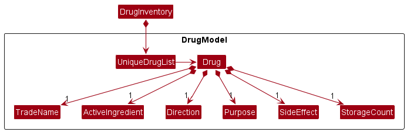
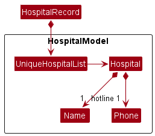
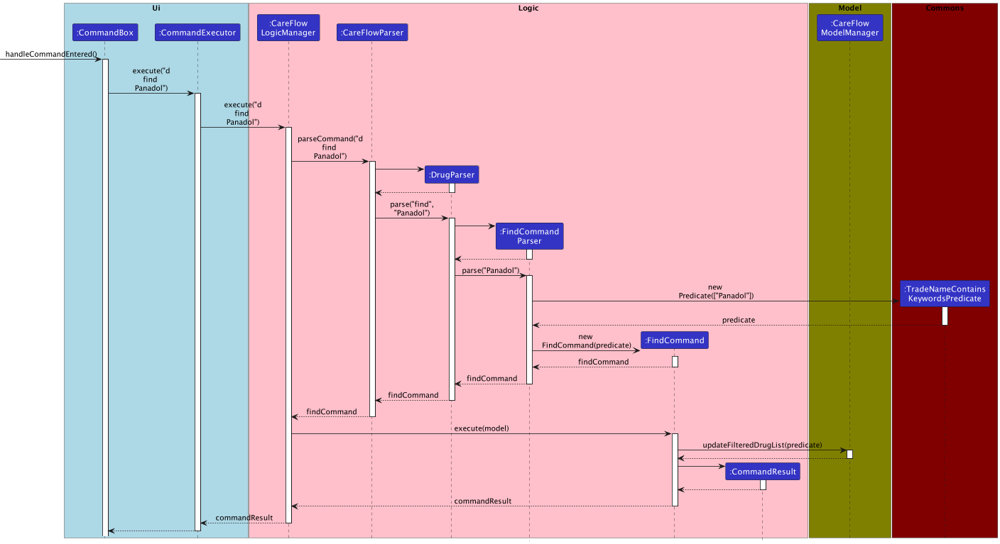

* Table of Contents
{:toc}

--------------------------------------------------------------------------------------------------------------------

## **Acknowledgements**

* {list here sources of all reused/adapted ideas, code, documentation, and third-party libraries -- include links to the original source as well}

--------------------------------------------------------------------------------------------------------------------

## **Setting up, getting started**

Refer to the guide [_Setting up and getting started_](SettingUp.md).

--------------------------------------------------------------------------------------------------------------------

## **Design**

:bulb: **Tip:** The `.puml` files used to create diagrams in this document can be found in the [diagrams](https://github.com/se-edu/addressbook-level3/tree/master/docs/diagrams/) folder. Refer to the [_PlantUML Tutorial_ at se-edu/guides](https://se-education.org/guides/tutorials/plantUml.html) to learn how to create and edit diagrams.

### Architecture

The ***Architecture Diagram*** given above explains the high-level design of the App.

Given below is a quick overview of main components and how they interact with each other.

**Main components of the architecture**

**`Main`** has two classes called [`Main`](https://github.com/se-edu/addressbook-level3/tree/master/src/main/java/seedu/address/Main.java) and [`MainApp`](https://github.com/se-edu/addressbook-level3/tree/master/src/main/java/seedu/address/MainApp.java). It is responsible for,
* At app launch: Initializes the components in the correct sequence, and connects them up with each other.
* At shut down: Shuts down the components and invokes cleanup methods where necessary.

[**`Commons`**](#common-classes) represents a collection of classes used by multiple other components.

The rest of the App consists of four components.

* [**`UI`**](#ui-component): The UI of the App.
* [**`CareFlowLogic`**](#logic-component): The command executor.
* [**`CareFlowModel`**](#model-component): Holds the data of the App in memory.
* [**`CareFlowStorage`**](#storage-component): Reads data from, and writes data to, the hard disk.

**How the architecture components interact with each other**

The *Sequence Diagram* below shows how the components interact with each other for the scenario where the user issues the command `p delete -i 1`.

Each of the four main components (also shown in the diagram above),

* defines its *API* in an `interface` with the same name as the Component.
* implements its functionality using a concrete `{Component Name}Manager` class (which follows the corresponding API `interface` mentioned in the previous point.

For example, the `CareFLowLogic` component defines its API in the `CareFlowLogic.java` interface and implements its functionality using the `CareFlowLogicManager.java` class which follows the `CareFlowLogic` interface. Other components interact with a given component through its interface rather than the concrete class (reason: to prevent outside component's being coupled to the implementation of a component), as illustrated in the (partial) class diagram below.

The sections below give more details of each component.

### UI component

The **API** of this component is specified in [`Ui.java`](https://github.com/AY2223S2-CS2103T-W09-3/tp/blob/master/src/main/java/seedu/careflow/ui/Ui.java)

The UI consists of a `MainWindow` that is made up of parts e.g.`CommandBox`, `ResultDisplay`, `PaientListPanel`, `StatusBarFooter` etc. All these, including the `MainWindow`, inherit from the abstract `UiPart` class which captures the commonalities between classes that represent parts of the visible GUI.

The `UI` component uses the JavaFx UI framework. The layout of these UI parts are defined in matching `.fxml` files that are in the `src/main/resources/view` folder. For example, the layout of the [`MainWindow`](https://github.com/AY2223S2-CS2103T-W09-3/tp/blob/master/src/main/java/seedu/careflow/ui/MainWindow.java) is specified in [`MainWindow.fxml`](https://github.com/AY2223S2-CS2103T-W09-3/tp/blob/master/src/main/resources/view/MainWindow.fxml)

The `UI` component,

* executes user commands using the `CareFlowLogic` component.
* listens for changes to `CareFlowModel` data so that the UI can be updated with the modified data.
* keeps a reference to the `CareFlowLogic` component, because the `UI` relies on the `CareFlowLogic` to execute commands.
* depends on some classes in the `CareFlowModel` component, as it displays `Patient` object residing in the `CareFlowModel`.

### Logic component

**API** : [`CareFlowLogic.java`](https://github.com/AY2223S2-CS2103T-W09-3/tp/blob/master/src/main/java/seedu/careflow/logic/CareFlowLogic.java)

Here's a (partial) class diagram of the `CareFlowLogic` component:

How the `CareFlowLogic` component works:
1. When `CareFlowLogic` is called upon to execute a command, it uses the `CareFlowParser` class to parse the user command.
1. This results in a `Command` object (more precisely, an object of one of its subclasses e.g., `AddCommand`) which is executed by the `CareFlowLogicManager`.
1. The command can communicate with the `CareFlowModel` when it is executed (e.g. to add a patient).
1. The result of the command execution is encapsulated as a `CommandResult` object which is returned from `CareFlowLogic`.

The Sequence Diagram below illustrates the interactions within the `CareFlowLogic` component for the `execute("p delete 1")` API call.

:information_source: **Note:** The lifeline for `DeleteCommandParser` should end at the destroy marker (X) but due to a limitation of PlantUML, the lifeline reaches the end of diagram.

Here are the other classes in `CareFlowLogic` (omitted from the class diagram above) that are used for parsing a user command:

How the parsing works:
* When called upon to parse a user command, the `CareFlowParser` class creates an `XYZCommandParser` (`XYZ` is a placeholder for the specific command name e.g., `AddCommandParser`) which uses the other classes shown above to parse the user command and create a `XYZCommand` object (e.g., `AddCommand`) which the `CareFlowParser` returns as a `Command` object.
* All `XYZCommandParser` classes (e.g., `AddCommandParser`, `DeleteCommandParser`, ...) inherit from the `Parser` interface so that they can be treated similarly where possible e.g, during testing.

### Model component
**API** : [`Model.java`](https://github.com/AY2223S2-CS2103T-W09-3/tp/blob/master/src/main/java/seedu/careflow/model/CareFlowModel.java)

The `Model` component,
* stores a `UserPref` object that represents the user's preferences.
* stores a `PatientRecord` that represents a list of patients.
* stores a `DrugInventory` that represents a list of drugs.
* stores a `HospitalRecord` that represents a list of hospitals.
* does not depend on any of the other three components (as the `CareFlowModel` represents data entities of the domain, they should make sense on their own without depending on other components)

The `PatientRecord` stores a list of `Patient` objects, which each:
* stores details of a patient: `Name`, `Phone`, `Email`, `Address`, `DateOfBirth`, `Gender` and `Ic` .
* `DrugAllergy` might left blank if the patient does not have drug allergy.
* Each patient may have two associated phone numbers: a required phone number, which is the patient's own phone number, and an optional phone number, which is the phone number of the patient's emergency contact.

The `DrugInventory` stores a list of `Patient` objects, which each:
* stores details of a drug: `TradeName`, `ActiveIngredient`, `Direction`, `Purpose`, `SideEffect` and `StorageCount`.

The `HospitalRecord` stores a list of `Hospital` objects, which each:
* stores the Hospital information: `Name` and `Phone` which is the hotline of the hospital.

:information_source: **Note:**The hospital data is predefined and not editable by users, as it is hard-coded in our system 

### Storage component

**API** : [`Storage.java`](https://github.com/AY2223S2-CS2103T-W09-3/tp/blob/master/src/main/java/seedu/careflow/storage/CareFlowStorage.java)

The `Storage` component,
* can save both patient and drug data and user preference data in json format, and read them back into corresponding objects.
  * inherits from both `PatientRecordStorage`, `DrugInventoryStorage` and `UserPrefStorage`, which means it can be treated as any one of the three(if only the functionality of only one is needed).
* depends on some classes in the `Model` component (because the `Storage` component's job is to save/retrieve objects that belong to the `Model`)

### Common classes

Classes used by multiple components are in the `seedu.careflow.commons` package.

--------------------------------------------------------------------------------------------------------------------

## **Implementation**

This section describes some noteworthy details on how certain features are implemented.

### Pie chart drug storage analysis feature

The pie chart displayed as part of the user interface relies on drug inventory data from `CareFlowLogic`, passed to the `DrugPieChartPanel` constructor as an `ObservableList`

This is the sequence of component interactions that sets up data for the pie chart upon program initialisation.

Given below is an example usage sequence of steps taken by the user that triggers visual updates to the drug storage analysis pie chart, displaying the latest storage percentage calculations:

**Step 1.** The user launches CareFlow for the first time. Since no Drugs are stored yet, dummy Drug inventory data will be loaded.

**Step 2.** The user adds a new Drug by executing the command `d add`.

**Step 3.** The user updates the quantity of the added Drug by executing the command `d update`.

**Step 4.** The user deletes the previously added Drug by executing the command `d delete`.

### Find drug by trade name feature

Users may use the `d find TRADENAME` command to retrieve information about a drug.

This is the sequence diagram illustrating how different components interact to execute a `find` command from the user.

**Step 1.** The user enters the `"d find Panadol"` command. This causes the listener attached to the command box to fire, and the event handler function `handleCommandEntered()` is triggered.

**Step 2.** The `handleCommandEntered()` function invokes the `CommandExecutor#execute` method, which in turn calls the   `CareFlowLogicManager#execute` method, delegating command execution to the `Logic` component.

**Step 3.** The `CareFlowLogicManager#execute` method promotes `CareFlowParser` to parse the command, which then recursively calls the `parse` method of `DrugParser` and `FindCommandParser` to parse the command step by step.

**Step 4.** The `FindCommandParser` creates a new `TradeNameContainsKeywordsPredicate` instance using the keyword `"Panadol"` and passes this instance, `predicate` to the `FindCommand` constructor. It then returns the `findCommand` instance back to `DrugParser` and `CareFlowParser`, eventually reaching `CareFlowLogicManager`.

**Step 5.** Upon receiving this `findCommand` instance, `CareFlowLogicManager` goes on to invokes its `FindCommand#execute` method, passing the `CareFlowModelManager` instance as the method argument

**Step 6.** The `FindCommand#execute` method uses `CareFlowModelManager#updateFilteredDrugList` to filter the current list of drugs using the `predicate` set earlier.

**Step 7.** The `FilteredDrugList` now only contains drugs whose trade name contains the keyword `"Panadol"`.

**Step 8.** Upon completion of command execution, a message feedback is packaged in the `commandResult` instance and passed to the `CommandExecutor`.

**Step 9.** The `CommandExecutor` then displays the message feedback and update UI to display the filtered list of drugs.

--------------------------------------------------------------------------------------------------------------------

## **Documentation, logging, testing, configuration, dev-ops**

* [Documentation guide](Documentation.md)
* [Testing guide](Testing.md)
* [Logging guide](Logging.md)
* [Configuration guide](Configuration.md)
* [DevOps guide](DevOps.md)

--------------------------------------------------------------------------------------------------------------------

## **Appendix: Requirements**

### Product scope

**Target user profile**:

* Receptionists, specifically targeting General Practitioner clinics, usually with fewer and regular patients.
* Mostly desk-bound. Computers are accessible tools.
* Able to pick up typing skills quickly and able to type fast.
* is reasonably comfortable using CLI apps
* has a need to manage a significant number of contacts

**Value proposition**:

* Better communication between healthcare providers and patients
* Increased efficiency in tracking patient’s health records and patiental information
* Addresses the needs and pain points of GPs who do not have a centralized system for tracking patients and drugs/inventory
* Increased availability of service as CareFlow is not dependent on any internet access
* No hidden costs or subscriptions required
* Potential to serve as a backup system if clinic systems are temporarily unable to access the internet
* Live percentage analysis of drug inventory
* Simple to use with no lengthy onboarding process required
### User stories

Priorities: High (must have) - `* * *`, Medium (nice to have) - `* *`, Low (unlikely to have) - `*`

| Priority | As a …​                         | I want to …​                                                                                                                           | So that I can…​                                                                                                                                                              |
| -------- | ------------------------------- | -------------------------------------------------------------------------------------------------------------------------------------- | ---------------------------------------------------------------------------------------------------------------------------------------------------------------------------- |
| `* * *`  | A receptionist at the GP clinic | Add new patients profiles                                                                                                              | use the system to track their patiental information and health records                                                                                                       |
| `* * *`  | A receptionist at the GP clinic | Add new drug record                                                                                                                    | use the system to store drug information and track storage                                                                                                                   |
| `* * *`  | A receptionist at the GP clinic | delete a patient                                                                                                                       | remove patient data that I no longer need                                                                                                                                    |
| `* * *`  | A receptionist at the GP clinic | delete a drug by index                                                                                                                 | remove data of drugs that my clinic no longer offers                                                                                                                         |
| `* * *`  | A receptionist at the GP clinic | delete a drug by trade name                                                                                                            | remove data of drugs that my clinic no longer offers                                                                                                                         |
| `* * *`  | A receptionist at the GP clinic | list all drugs                                                                                                                         | have an overview of the inventory                                                                                                                                            |
| `* * *`  | A receptionist at the GP clinic | list all patients                                                                                                                      | have an overview of all patient records                                                                                                                                      |
| `* * *`  | A receptionist at the GP clinic | find a patient by name                                                                                                                 | locate details of patients without having to go through the entire list                                                                                                      |
| `* * *`  | A receptionist at the GP clinic | find a drug by trade name                                                                                                              | retrieve details of the drug to facilitate prescription                                                                                                                      |
| `* * * ` | A receptionist at the GP clinic | Retrieve patients’ contact number                                                                                                      | remind patients of their upcoming appointments                                                                                                                               |
| `* * *`  | A receptionist at the GP clinic | update patient profiles                                                                                                                | have access to the most updated version of their patiental information in terms of their contact number, address etc to facilitate our internal patient management procedure |
| `* * *`  | A receptionist at the GP clinic | increase a drug's storage count                                                                                                        | update inventory whenever new batches of drug arrives                                                                                                                        |
| `* * *`  | A receptionist at the GP clinic | decrease a drug's storage count                                                                                                        | update inventory whenever a drug is prescribed                                                                                                                               |
| `* * *`  | A receptionist at the GP clinic | clear all drug                                                                                                                         | to prevent data leakage in case the clinic goes out of business                                                                                                              |
| `* * *`  | A receptionist at the GP clinic | clear all patients                                                                                                                     | to prevent data leakage in case the clinic goes out of business                                                                                                              |
| `* * `   | A receptionist at the GP clinic | sort patients by name                                                                                                                  | locate a patient easily                                                                                                                                                      |
| `* * `   | A receptionist at the GP clinic | archive a patient profile if the patient has not visited for a long time                                                               | searching in a smaller dataset and when I distribute health information, I can omit patients in the archive to reduce spamming                                               |
| `* * `   | A receptionist at the GP clinic | Refer the patient to hospitals                                                                                                         | easily forward their patiental information, health record and health condition to hospitals if the patient needs more professional treatment                                 |
| `* * `   | A receptionist at the GP clinic | Check if a patient has any drug allergy                                                                                                | Inform the doctor of the patient’s drug allergy and ensure the safety of the patients by avoiding prescribing them with drugs that they are allergic to                      |
| `* * `   | A receptionist at the GP clinic | Update patients on crowd conditions                                                                                                    | They can avoid visiting during peak clinic capacities                                                                                                                        |
| `* * `   | A receptionist at the GP clinic | Access all hotlines to major SG hospitals                                                                                              | easily contact them for emergency cases                                                                                                                                      |
| `* * `   | A receptionist at the GP clinic | Add appointment dates for a patient                                                                                                    | easily tell who has upcoming appointments and sms/email them to remind them                                                                                                  |
| `* * `   | A receptionist at the GP clinic | Use the system to send notifications to patients who have upcoming appointments                                                        | send out mass notifications with one simple click without having to text each patient individually                                                                           |
| `* * `   | A receptionist at the GP clinic | Check a patient’s past appointment records at the clinic                                                                               | get information about their past visits (doctor, visit frequency, drugs prescribed etc.)                                                                                     |
| `* * `   | A receptionist at the GP clinic | Detect patients who have missed their appointment                                                                                      | send them reminders to make another appointment                                                                                                                              |
| `* * `   | A receptionist at the GP clinic | Update patients on the crowding condition upon request                                                                                 | provide a more flexible experience at the clinic since they can decide whether or when to visit the clinic based on the crowding condition that can be easily retrieved      |
| `* * `   | A receptionist at the GP clinic | Append patient to the queue                                                                                                            | Ensure that the patients are served on a first-come-first-served basis and new patients will be lined at the end of the queue.                                               |
| `* * `   | A receptionist at the GP clinic | Check number of patients in the queue for doctor consultation                                                                          | Know the number of patients already in the queue and inform new patients about the rough waiting hours before their consultation.                                            |
| `* * `   | A receptionist at the GP clinic | Dequeue patients once they enter consultation room                                                                                     | ensure that the patient who is consulting is no longer in the queue and other patients in the queue can get to see the doctor                                                |
| `* * `   | A receptionist at the GP clinic | Take down special request from patient: male doctor/ female doctor/ specific doctor                                                    | Ensure that the patient is assigned to a doctor that they wish to visit and are comfortable with                                                                             |
| `* * `   | A receptionist at the GP clinic | Edit a calendar of patient appointments                                                                                                | make amendment to the patient appoitment if there is a need to delete or change the date of patient appointment                                                              |
| `* * `   | A receptionist at the GP clinic | View calendar of patient appointments                                                                                                  | be informed about the upcoming appointments in the day                                                                                                                       |
| `* * `   | A receptionist at the GP clinic | Distribute health information / news to patients (SMS / whatsapp)                                                                      | let patients know their patiental health info                                                                                                                                |
| `* * `   | A receptionist at the GP clinic | Record down the visitor who has entered the clinic                                                                                     | Eliminate paper sign-in system                                                                                                                                               |
| `* * `   | A receptionist at the GP clinic | Track patient’s observation time at the clinic after vaccination/treatment                                                             | easily track and tell when they can leave                                                                                                                                    |
| `* * `   | A receptionist at the GP clinic | Check if a drug is still available and if it needs more supply                                                                         | ensuer that the dispensary does not run out of supply of drugs                                                                                                               |
| `* * `   | A receptionist at the GP clinic | Generate pdf receipts for consultation, procedures and medication prescribed                                                           | have the choice to print out upon patient requests or email it to them (go green and paperless)                                                                              |
| `* * `   | A receptionist at the GP clinic | Check if a doctor has an appointment during a period of time.                                                                          | Ensure that appointments will not clash                                                                                                                                      |
| `* * `   | A receptionist at the GP clinic | notify patients to enter the consultation room by using the system to send push notifications / SMS, or any external broadcast devices | choose not to call out their names                                                                                                                                           |
| `* * `   | A receptionist at the GP clinic | retrieve the patient's past vaccination records                                                                                        | Inform the doctor and allow him or her to decide on whether to provide additional vaccines                                                                                   |
| `* * `   | A receptionist at the GP clinic | Retrieve patients’ emergency contact                                                                                                   | Inform the patients’ loved ones or guardian during unexpected situations                                                                                                     |

### Use cases

(For all use cases below, the **System** is the `Careflow` and the **Actor** is the `GP receptionist`, unless specified otherwise)

**Use case: UC01 - Add a patient**

**Precondition: The GP receptionist is logged into the system**

**Guarantee: A new user account is created on the system with at least a name, NRIC, phone, email, address, date of birth, gender and IC**

**MSS**

1. User requests to add a new patient to the system.
2. User enters patient details.
   1. The following are required information:
         - Patient name
         - Phone Number
         - Email
         - Address
         - Date of Birth
         - Gender
         - IC
   2. The following are non-required information:
         - Drug Allergy
         - Emergency contact
3. The system creates the new user account.
4. The system show the new created user in the patient list.

    Use case ends.

**Extensions**
* 2a. If any of the required fields are not completed

    * 2a1. the user is informed of this and show the correct format for the command

      Use case resume at step 2.

* 2b. If the patient name is already in use

    * 2b1. the user is informed that he or she must choose a different name

      Use case resume at step 2.

* 2c. If the input field is invalid

    * 2c1. the user is informed of this, and correct format for the command is displayed.

      Use case resume at step 2.

**Use case: UC02 - Delete a patient**

**Precondition: The GP receptionist is logged into the system**

**MSS**

1.  User <ins>list all patients(UC03).</ins>
3.  User enters NRIC or index to delete a specific patient in the list.
4.  System deletes the patient from the system.
5.  System show the upddated patient list.

    Use case ends.

**Extensions**

* 1a. The list is empty.

  Use case ends.

* 2a. The given NRIC is invalid.

    * 2a1. System shows an error message.

      Use case resumes at step 2.

* 2b. The given index is invalid.

    * 2b1. System shows an error message.

      Use case resumes at step 2.

**Use case:  UC03 - List all patients**

**Precondition: The GP receptionist is logged into the system**

**MSS**

1.  User requests to list all patients.
2.  System shows a list of patients.

    Use case ends.

**Use case:  UC04 - Find the patients**

**Precondition: The GP receptionist is logged into the system**

**MSS**

1.  User requests to find patients.
2.  User enter keyword that they want search for.
2.  System return the list of patient that contain the keyword given by the user.

    Use case ends.

**Use case:  UC05 - Add a drug**

**Precondition: The GP receptionist is logged into the system**

**Guarantee: A new drug entry is created on the system with**

**MSS**

1. User requests to add a new drug to the system.
2. The user enters drug details.
   1. The following are the required information:
         - Trade name
         - Active ingredients
         - Direction
         - Purpose
         - Side effect
         - Storage count
3. The system creates the new drug entry.
4. The system show the new created drug in the drug list and the drug inventory analysis pie chart displays the updated percentages of each drug within storage.

    Use case ends.

**Extensions**
* 2a. If any of the required fields are not completed

    * 2a1. the user is informed of this and show the correct format for the command.

     Use case resume at step 2.

* 2b. If the trade name is already in use

    * 2b1. the user is informed that he or she must choose a different trade name.

      Use case resume at step 2.

* 2c. If the input field is invalid

    * 2c1. the user is informed of this, and correct format for the command is displayed.

      Use case resume at step 2.

**Use case:  UC06 - Delete a drug**

* Similar to UC02 except user enters trade name or index to delete the drug

**Use case:  UC07 - List all drugs**

* Similar to UC03

**Use case:  UC08 - Find the drugs**

* Similar to UC04

### Non-Functional Requirements

1.  Should work on any _mainstream OS_ as long as it has Java `11` or above installed.
2.  Should be able to hold up to 1000 patients without a noticeable sluggishness in performance for typical usage.
3.  A user with above average typing speed for regular English text (i.e. not code, not system admin commands) should be able to accomplish most of the tasks faster using commands than using the mouse.
4.  Should be easy to use and navigate for the clinic receptionist. It should have a simple and intuitive interface that is easy to learn and use
5.  Should be secure and protect patient data from unauthorized access or disclosure.
6.  Should be able to accommodate growth and expansion. It should be easy to add new features and functionalities as needed.
7.  Should be easy to maintain and update through a clear and well-documented architecture, and it should be easy to troubleshoot and fix problems should they arise.

### Glossary

* **Mainstream OS**: Windows, Linux, Unix, OS-X
* **Private contact detail**: A contact detail that is not meant to be shared with others
* **GP receptionist**: General practitioners receptionist

--------------------------------------------------------------------------------------------------------------------

## **Appendix: Instructions for manual testing**

Given below are instructions to test the app manually.

:information_source: **Note:** These instructions only provide a starting point for testers to work on;
testers are expected to do more *exploratory* testing.

### Launch and shutdown

1. Initial launch

   1. Download the jar file and copy into an empty folder

   1. Double-click the jar file Expected: Shows the GUI with a set of sample contacts. The window size may not be optimum.

1. Saving window preferences

   1. Resize the window to an optimum size. Move the window to a different location. Close the window.

   1. Re-launch the app by double-clicking the jar file. 
       Expected: The most recent window size and location is retained.

1. _{ more test cases …​ }_

### Deleting a patient record

1. Deleting a patient record while all patients are being shown

   1. Prerequisites: List all patients using the `p list` command. Multiple patients in the list.

   1. Test case: `p delete 1` 
      Expected: First patient record is deleted from the list. Details of the deleted patient shown in the status message.

   1. Test case: `p delete 0` 
      Expected: No patient is deleted. Error details shown in the status box.

   1. Other incorrect delete commands to try: `delete`, `delete x`, `...` (where x is larger than the list size) 
      Expected: Similar to previous.

1. _{ more test cases …​ }_

### Saving data

1. Dealing with missing/corrupted data files

   1. _{explain how to simulate a missing/corrupted file, and the expected behavior}_

1. _{ more test cases …​ }_

### Planned Enhancements

1. 'h view' command for viewing hospital hotline

   1.  Currently the only way for the user to view the hospital detail is by clicking on the hospital tab using a mouse.
       We recognize that we have overlooked the need for a keyboard-only command to view hospital details, and we will
       make sure to include a h view command as an essential feature in our upcoming implementation.

2. Command to switch from patient records to drug inventory or hospital hotlines and vice versa.

   1.  We considered this as a good-to-have feature because we already have a `p view` and `d view` command for user
       to look at patient and drug record respectively, so user still able to view patient and drug record without
       having a mouse.

3. Allow more than one patient to have same name

   1.  Currently our system don't allow patient to have the same name. In future implementation we might consider
       to allow patient to have duplicate name and identify them using NRIC or FIN.

4. Detecting unusual user input value for phone number

   1.  Need to work on phone number validation, i.e: when user input only special character for phone data field,
       ex: ()+-, then the system wouldn't able to detect this. In future implementation, we consider to restrict
       user to input telephone numbers only for this data field.
