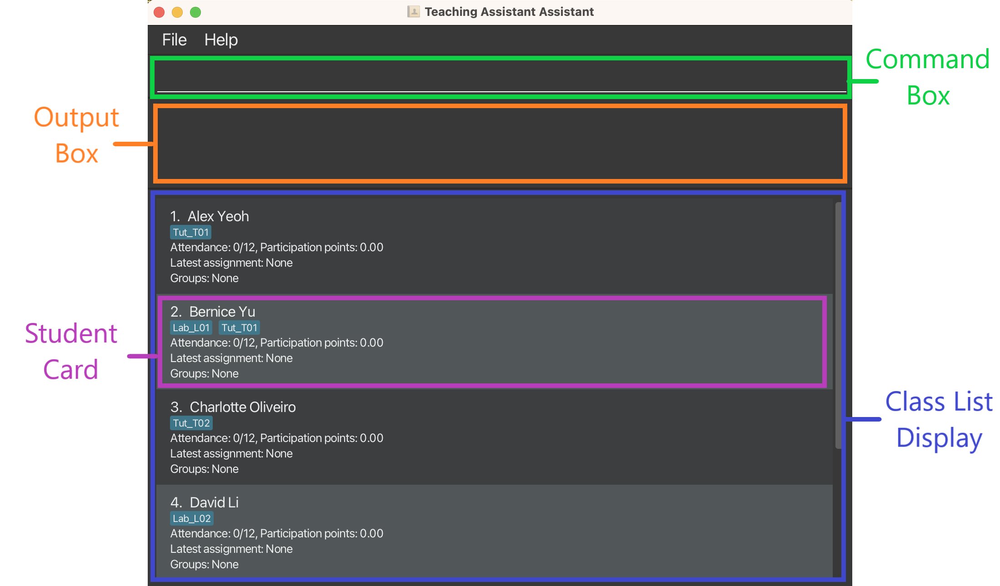

* Table of Contents
{:toc}

--------------------------------------------------------------------------------------------------------------------
## **Introduction**
### About this application
Teaching Assistant Assistant (TAA) is a desktop app for managing teaching assistant activities,
optimized for use via a Command Line Interface (CLI) while still retaining the benefits of a Graphical User Interface (GUI).

TAA provides a one-stop solution that meets the following teaching needs of a TA in just one single application:
1. You can easily track student attendance and grades using just a keyboard, eliminating the need for multiple clicks.
2. You can even view grade statistics without the use of a dedicated data analysis application!
3. You can schedule alarms that help you manage your time during class. Gone are the days of you unknowingly spending
   too much time on a single question during tutorial or forgetting to mark students' attendance at the end of class.
4. You can save the troubles of manually importing and exporting data into and out of the TAA application, thanks to our
   CSV parser!


Say goodbye to the hassle of managing teaching assistant tasks and hello to increased efficiency with TAA!

### Objectives of this guide
This guide is written to provide comprehensive technical guidance for developers to develop and maintain TAA effectively and efficiently.

This guide includes descriptions and explanations on the architecture and design of the TAA application, complemented with UML diagrams where necessary.

With this guide, any developers who wish to extend on, or modify this project to their liking should be able to do so with ease and confidence.


### Using the guide
#### Navigation
To use the guide, you may wish to take a look at the table of contents at the start of the page.
You can click on the relevant sections you wish to visit, and the hyperlink will bring you straight to the relevant section.

Alternatively, you may wish to use the built-in search function in your browser (<Button>Ctrl</Button> + <Button>F</Button>) to look for specific keywords relevant to your query.

#### Formatting
Aside from the usual text format, this guide includes certain special formats that are used for different purposes.

##### Callouts

Callouts are identified by a coloured box containing some text.

**Note**
<div markdown="span" class="alert alert-warning">
:page_with_curl: **Note:** Contains important information on how the application is designed to be used.
</div>

**Information**
<div markdown="span" class="alert alert-primary">
:information_source: **Info:** Provides information that is not essential, but may be useful in certain edge cases.
</div>

**Tip**
<div markdown="span" class="alert alert-success">
:bulb: **Tip:** Provides recommendations on how you can modify/extend the app more effectively.
</div>

**Warning**
<div markdown="span" class="alert alert-danger">
:warning: **Warning:** Describes actions that may cause the application to function unexpectedly.
</div>

##### Syntax highlighting
Text contained within a `grey background` are used to denote either of the following:
- commands that can be entered into the command bar
- file names
- command line commands, to be run in the [terminal](#glossary) of the host machine

##### Keys
Keys such as <Button>A</Button> <Button>B</Button> <Button>C</Button> are used to denote keys on the keyboard that can be pressed to perform certain things.

They can also be used to denote keys that should be held together, at the same time. For example, <Button>Ctrl</Button> + <Button>F</Button> indicates that the user can press both the Ctrl and F keys together to perform a given action.

--------------------------------------------------------------------------------------------------------------------

## **Setting up, getting started**

Refer to the guide [_Setting up and getting started_](SettingUp.md) to get the project set up in your local machine.

Figure 1 below gives an overview of the major components in the application's graphical user interface (GUI).


<figcaption style="text-align:center"><em><strong>
Figure 1
</strong>:
Labelled components of the TAA GUI
</em></figcaption>

<br />
<div markdown="span" class="alert alert-primary">
:information_source: **Info:** Each Class List consists of 0 or more Student Cards.
</div>

The purposes of each component are described in Table 1 below.
<br />

<div style="text-align:center"><strong>
Table 1
</strong>:
Purposes of each GUI component
</div>

|     Component      |                                      Purpose                                       |
|:------------------:|:----------------------------------------------------------------------------------:|
|    Command Box     |                         To accept commands from the user.                          |
|     Output Box     |             To display the result of the commands issued by the user.              |
| Class List Display |        To display the list of students in the currently active class list.         |
|    Student Card    | To display the relevant information for a single Student in the active class list. |

<div markdown="span" class="alert alert-primary">
:information_source: **Info:** Many operations were designed to interact with the students that are currently visible in the active class list.
This is intended to make it easier for users to use the application, as it is unlikely for the user to refer to something that they cannot see.
</div>

--------------------------------------------------------------------------------------------------------------------

## **Design**
The following sections are mostly filled with UML diagrams to give a high-level overview of how each section is designed.

After reading this section, you should have a clearer understanding of the major components in the application, along with how they interact with each other.

<div markdown="span" class="alert alert-success">
:bulb: **Tip:** The `.puml` files used to create diagrams in this document can be found in the [diagrams](https://github.com/AY2223S2-CS2103T-T14-4/tp/tree/master/docs/diagrams/) folder. Refer to the [_PlantUML Tutorial_ at se-edu/guides](https://se-education.org/guides/tutorials/plantUml.html) to learn how to create and edit diagrams.
</div>

### Architecture


<figcaption style="text-align:center"><em><strong>
Figure 2
</strong>:
Architecture Diagram of TAA
</em></figcaption>

The ***Architecture Diagram*** given above explains the high-level design of the App.

Given below is a quick overview of main components and how they interact with each other.

**Main components of the architecture**

**`Main`** has two classes called [`Main`](https://github.com/AY2223S2-CS2103T-T14-4/tp/blob/master/src/main/java/taa/Main.java) and [`MainApp`](https://github.com/AY2223S2-CS2103T-T14-4/tp/blob/master/src/main/java/taa/MainApp.java). It is responsible for,
* At app launch: Initializes the components in the correct sequence, and connects them up with each other.
* At shut down: Shuts down the components and invokes cleanup methods where necessary.

[**`Commons`**](#common-classes) represents a collection of classes used by multiple other components.

The rest of the App consists of four components.

* [**`UI`**](#ui-component): The UI of the App.
* [**`Logic`**](#logic-component): The command executor.
* [**`Model`**](#model-component): Holds the data of the App in memory.
* [**`Storage`**](#storage-component): Reads data from, and writes data to, the hard disk.


**How the architecture components interact with each other**

The *Sequence Diagram* below shows how the components interact with each other for the scenario where the user issues the command `delete_student 1`.


<figcaption style="text-align:center"><em><strong>
Figure 3
</strong>:
Architecture Sequence Diagram of TAA
</em></figcaption>

Each of the four main components (also shown in the diagram above),

* defines its *API* in an `interface` with the same name as the Component.
* implements its functionality using a concrete `{Component Name}Manager` class (which follows the corresponding API `interface` mentioned in the previous point.

For example, the `Logic` component defines its API in the `Logic.java` interface and implements its functionality using the `LogicManager.java` class which follows the `Logic` interface. Other components interact with a given component through its interface rather than the concrete class (reason: to prevent outside component's being coupled to the implementation of a component), as illustrated in the (partial) class diagram below.


<figcaption style="text-align:center"><em><strong>
Figure 4
</strong>:
Sequence Diagram of the Component Managers in TAA
</em></figcaption>

The sections below give more details of each component.

### UI component

The **API** of this component is specified in [`Ui.java`](https://github.com/AY2223S2-CS2103T-T14-4/tp/blob/master/src/main/java/taa/ui/Ui.java)


<figcaption style="text-align:center"><em><strong>
Figure 5
</strong>:
Structure of the UI component
</em></figcaption>

The UI consists of a `MainWindow` that is made up of parts e.g.`CommandBox`, `ResultDisplay`, `PersonListPanel`, `StatusBarFooter` etc. All these, including the `MainWindow`, inherit from the abstract `UiPart` class which captures the commonalities between classes that represent parts of the visible GUI.

The `UI` component uses the JavaFx UI framework. The layout of these UI parts are defined in matching `.fxml` files that are in the `src/main/resources/view` folder. For example, the layout of the [`MainWindow`](https://github.com/se-edu/addressbook-level3/tree/master/src/main/java/seedu/address/ui/MainWindow.java) is specified in [`MainWindow.fxml`](https://github.com/se-edu/addressbook-level3/tree/master/src/main/resources/view/MainWindow.fxml)

The `UI` component,

* executes user commands using the `Logic` component.
* listens for changes to `Model` data so that the UI can be updated with the modified data.
* keeps a reference to the `Logic` component, because the `UI` relies on the `Logic` to execute commands.
* depends on some classes in the `Model` component, as it displays `Student` object residing in the `Model`.

### Logic component

**API** : [`Logic.java`](https://github.com/AY2223S2-CS2103T-T14-4/tp/blob/master/src/main/java/taa/logic/Logic.java)

Here's a (partial) class diagram of the `Logic` component:


<figcaption style="text-align:center"><em><strong>
Figure 6
</strong>:
Class Diagram of the Logic Component in TAA
</em></figcaption>

How the `Logic` component works:
1. When `Logic` is called upon to execute a command, it uses the `TaaParser` class to parse the user command.
1. This results in a `Command` object (more precisely, an object of one of its subclasses e.g., `AddCommand`) which is executed by the `LogicManager`.
1. The command can communicate with the `Model` when it is executed (e.g. to add a person).
1. The result of the command execution is encapsulated as a `CommandResult` object which is returned back from `Logic`.

The Sequence Diagram below illustrates the interactions within the `Logic` component for the `execute("delete 1")` API call.


<figcaption style="text-align:center"><em><strong>
Figure 7
</strong>:
Interactions Inside the Logic Component for the `delete 1` Command
</em></figcaption>

<div markdown="span" class="alert alert-warning">
:page_with_curl: **Note:** The lifeline for `DeleteStudentCommandParser` should end at the destroy marker (X) but due to a limitation of PlantUML, the lifeline reaches the end of diagram.
</div>

Here are the other classes in `Logic` (omitted from the class diagram above) that are used for parsing a user command:


<figcaption style="text-align:center"><em><strong>
Figure 8
</strong>:
Sequence Diagram of the Parser Classes in TAA
</em></figcaption>

How the parsing works:
* When called upon to parse a user command, the `TaaParser` class creates an `XYZCommandParser` (`XYZ` is a placeholder for the specific command name e.g., `AddStudentCommandParser`) which uses the other classes shown above to parse the user command and create a `XYZCommand` object (e.g., `AddStudentCommand`) which the `TaaParser` returns back as a `Command` object.
* All `XYZCommandParser` classes (e.g., `AddStudentCommandParser`, `DeleteStudentCommandParser`, ...) inherit from the `Parser` interface so that they can be treated similarly where possible e.g, during testing.

### Model component
**API** : [`Model.java`](https://github.com/AY2223S2-CS2103T-T14-4/tp/blob/master/src/main/java/taa/model/Model.java)

<figcaption style="text-align:center"><em><strong>
Figure 9
</strong>:
Class Diagram of the Model Component in TAA
</em></figcaption>


The `Model` component,

* stores the student data i.e., all `Student` objects (which are contained in a `UniqueStudentList` object).
* stores the currently 'selected' `Student` objects (e.g., results of a search query) as a separate _filtered_ list which is exposed to outsiders as an unmodifiable `ObservableList<Student>` that can be 'observed' e.g. the UI can be bound to this list so that the UI automatically updates when the data in the list change.
* stores a `UserPref` object that represents the user’s preferences. This is exposed to the outside as a `ReadOnlyUserPref` objects.
* does not depend on any of the other three components (as the `Model` represents data entities of the domain, they should make sense on their own without depending on other components)


### Storage component

**API** : [`Storage.java`](https://github.com/AY2223S2-CS2103T-T14-4/tp/blob/master/src/main/java/taa/storage/Storage.java)


<figcaption style="text-align:center"><em><strong>
Figure 10
</strong>:
Class Diagram of the Storage Component in TAA
</em></figcaption>

The `Storage` component,
* can save both student data and user preference data in json format, and read them back into corresponding objects.
* inherits from both `TaaStorage` and `UserPrefStorage`, which means it can be treated as either one (if only the functionality of only one is needed).
* depends on some classes in the `Model` component (because the `Storage` component's job is to save/retrieve objects that belong to the `Model`)

Reading data from JSON:
* MainApp.initModelManager()
  * JsonTaaStorage.readTaaData()
    * JsonUtil.readJsonFile()
    * JsonSerializableTaaData.toModelType()

Saving data to JSON:
* LogicManager.execute()
  * ModelManager.getTaaData()
  * JsonTaaStorage.saveTaaData())
    * JsonUtil.saveJsonFile()
    * JsonSerializableTaaData.new()

### Common classes

Classes used by multiple components are in the `taa.commons` package.

--------------------------------------------------------------------------------------------------------------------

## **Implementation**

This section describes some noteworthy details on how certain features are implemented.

### Add Student Feature
#### Implementation
The ability to add students is one of the core features of the application. 
This feature allows users to add students to their defined classes/class lists, which will be essential for other features to work in tandem.

This feature is facilitated through the command `add_student`, with a mandatory `STUDENT_NAME` and one or more `CLASS_NAME`s.
After the application creates a new Student object with the specified `STUDENT_NAME`, it will proceed to add this student under all the `CLASS_NAME`s provided.

<div markdown="span" class="alert alert-warning">
:page_with_curl: **Note:** After creating the Student, if a class list with the specified `CLASS_NAME` does not exist, the new class list will be created along with the student.
</div>

The sequence diagram shown in Figure 11 below gives an overview of the methods called during command execution.


<figcaption style="text-align:center"><em><strong>
Figure 11
</strong>:
Sequence Diagram for adding a Student
</em></figcaption>
<br />

Alternatively, you may wish to refer to the activity diagram in Figure 12 below which captures some subtleties regarding the note above which are missed by the sequence diagram above.


<image style="display:flex; margin-left:auto; margin-right:auto" src="images/AddStudentActivityDiagram.png" />
<figcaption style="text-align:center"><em><strong>
Figure 12
</strong>:
Activity Diagram for adding a Student
</em></figcaption>
<br />

#### Design Considerations
**Dealing with non-existent Class Lists**

One issue with the behaviour of this command stems from the undecided behaviour when a specified `CLASS_NAME` does not exist as a Class List yet.

Among the two options described below, our team decided to choose the former as we felt that it would be pointlessly troublesome for a user to deliberately create a Class List just to add a new student.

1. **Alternative 1 (current choice):** Create the Class List automatically
    - Pros: Convenient for users as they do not have to manually create the Class Lists before using this command.
    - Cons: Users may accidentally add a Student into a stray Class List as a result of a typo.
2. **Alternative 2:** Reject the operation and prompt user to create the specified Class List before proceeding
    - Pros: Users will be assured that the Students they are adding will be added to a Class List that they have manually created before.
    - Cons: Can be tiring when the user has to manually create multiple class lists just to add Students.

--------------------------------------------------------------------------------------------------------------------

## **Documentation, logging, testing, configuration, dev-ops**

* [Documentation guide](Documentation.md)
* [Testing guide](Testing.md)
* [Logging guide](Logging.md)
* [Configuration guide](Configuration.md)
* [DevOps guide](DevOps.md)

--------------------------------------------------------------------------------------------------------------------

## **Appendix A: Requirements**

### Product scope

**Target user profile**:

* has a need to manage many students, groups and classes
* relatively more tech-savvy than the average population, able to perform complex tasks on digital platforms
* prefers typing to mouse interactions
* need to be able to easily aggregate and analyze students' statistics
* need to keep track of tasks needed to do during each lesson and time allocation for each
* is reasonably comfortable using CLI apps
* can type fast

**Value proposition**:

* Get teaching assistant tasks done more conveniently and quickly as compared to traditional GUI apps
* Features are fully customized for teaching assistants in NUS to ensure user-friendliness for this particular group

### User stories

Priorities: High (must have) - `* * *`, Medium (nice to have) - `* *`, Low (unlikely to have) - `*`

| Priority | As a …         | I want to …                                                              | So that I can…                                                                                               |
|----------|----------------|--------------------------------------------------------------------------|--------------------------------------------------------------------------------------------------------------|
| `* * *`  | TA             | group students by class                                                  | track participation/assignment statuses by students' own classes                                             |
| `* * *`  | TA             | add students to a class list                                             | expand the class list if needed (e.g. new student joins)                                                     |
| `* * *`  | TA             | delete students from a class list                                        | remove students who are no longer part of the class (e.g. dropped class)                                     |
| `* * *`  | TA             | allocate assignments to students by class                                | track the statuses of assignments assigned to each class                                                     |
| `* * *`  | careless TA    | remove assignments allocated to a class                                  | remove incorrect assignment entries                                                                          |
| `* * *`  | responsible TA | track students' participation statuses                                   | award participation marks to students fairly and accurately                                                  |
| `* * *`  | forgetful TA   | track student assignment submissions/scores                              | grade assignments easily                                                                                     |
| `* * *`  | stressed TA    | have an alarm to manage time for different tasks during class conducting | complete all tasks during each lesson on time                                                                |
| `* * *`  | user           | have CSV files storing my data                                           | make backups to guard against data loss                                                                      |
| `* * *`  | user           | load in CSV files to restore data                                        | avoid having to do manual data entry when using the app from scratch                                         |
| `* * *`  | user           | exit the app gracefully                                                  | avoid data corruption                                                                                        |
| `* *`  | forgetful TA   | track valid reasons for a student's absence                              | record attendance for those with valid reasons                                                               |
| `* *`    | TA             | assign individual assignment grades to students                          | track the specific grade each student has obtained for each assignment                                       |
| `* *`    | forgetful TA   | track questions asked by students                                        | answer them on time                                                                                          |
| `* *`    | forgetful TA   | keep a timeline/lesson plan for each lesson                              | complete the lessons on time without missing out on any content                                              |
| `* *`    | forgetful TA   | be reminded to take attendance before class ends                         | award attendance marks correctly                                                                             |
| `* *`    | TA             | group students quickly and fairly                                        | reduce time wasted due to group formation                                                                    |
| `* *`    | TA             | search students by keywords                                              | lessen the mental load required to find a student                                                            |
| `* *`    | TA             | list all students in a class                                             | see an overview of the students in a class at a glance                                                       |
| `*`      | head TA        | manage all other TAs                                                     | track whether each TA has done their job correctly                                                           |

*{More to be added}*

### Use cases

(For all use cases below, the **System** is the `TAA` and the **Actor** is the `user`, unless specified otherwise)

#### Attendance-related Commands

##### Mark Attendance

Below is the main success scenario of marking a student's attendance.

**MSS**

1. User requests to mark attendance of a specific student for a specified week
2. TAA marks attendance

   Use case ends.

**Extensions**

* 1a. The given student index/week is invalid.

    * 1a1. TAA shows an error message.

      Use case ends.
* 3b. The given week's attendance is already marked

    * 3a1. TAA shows message that attendance for that week is already marked.

      Use case ends.


Below is the sequence diagram for Marking attendance of a student


##### Unmark Attendance

Below is the main success scenario of Unmark

**MSS**

1. User requests to unmark attendance of a specific student for a specified week
2. TAA unmarks attendance

   Use case ends.

**Extensions**

* 1a. The given student index/week is invalid.

    * 1a1. TAA shows an error message.

      Use case ends.


Below is the sequence diagram for Unmarking attendance of a student


##### Insert Participation

Below is the main success scenario of Insert Participation


**MSS**


1. User requests to insert participation points for a specific student for a specified week
2. TAA inserts participation points

   Use case ends.

**Extensions**

* 1a. The given index/week/participation points is invalid.

    * 1a1. TAA shows an error message.

      Use case ends.
* 1b. The given week's attendance is not marked

    * 1bTAA shows message that attendance must be marked first before adding participation points.

      Use case ends.

Below is the sequence diagram for inserting participation points


#### Assignment-related Commands

##### Add Assignment

Below is the main success scenario of adding an Assignment

**MSS**

1. User requests to add an assignment of a specific name and optionally, total marks.
2. TAA creates the assignment, with total marks having a default value of 100 if it is not specified above.

   Use case ends.

**Extensions**

* 1a. There are no assignments with that particular name, .

  Use case resumes from step 2.

* 1b. There is already an assignment with that particular name.

    * 1b1. TAA shows an error message

* 1c. Total marks given is negative.

    * 1c1. TAA shows an error message


AddAssignment command is facilitated by `AddAssignmentCommandParser`, `AddAssignmentCommand` and `Model`

* `AddAssignmentCommandParser`-- Parse the input of users
* `AddAssignmentCommand` -- Execute the command given the parsed user input
* `Model` -- Updates the assignment list.

Below is the sequence diagram for adding an assignment.


#### Student-related Commands

Below is the main success scenario of student-related commands.

##### Adding a student

1. User requests to add a user with a specific name into one or more classes.
2. TAA adds the student into the specified classes.

   Use case ends.

**Extensions**

* 1a. The given student/class name is invalid.
    * 1a1. TAA shows an error message.

      Use case resumes from step 1.

* 1b. The given class(es) does not exist.
  * 1b1. TAA creates a new class for each class that does not exist yet.

    Use case resumes from step 2.


##### List students
1. User requests to list all students in a class.
2. TAA shows a list of students and number of students listed.

    Use case ends.

##### Search student
1.  User requests to search for a particular student
2.  TAA shows the information of the student searched

    Use case ends.

**Extensions**

* 2a. No student is found for the keyword.

  Use case ends.

##### Add Class List
1.  User requests to add a new class list with a specific name.
2.  TAA adds the new class list with the name specified.
    Use case ends.

**Extensions**

* 2a. Class list with the same name already exists.
  * 2a1. TAA shows an error message.
    Use case ends.

#### Alarm-Related Commands

Below is the main success scenarios of adding, deleting and listing alarms.

##### Add Alarm
1.  User requests to add an alarm with specified time and comment.
2.  TAA adds the new alarm with the time and comment specified.
    Use case ends.

**Extensions**

* 2a. User does not provide sufficient arguments
    * 2a1. TAA shows an error message.
      Use case ends.

Below is the sequence diagram for adding an alarm.


##### Delete alarm
1.  User requests to delete a scheduled alarm with specified index.
2.  TAA deletes the alarm with the specified index, the alarm will no longer ring.
    Use case ends.

**Extensions**
* 2a. User does not provide sufficient arguments
    * 2a1. TAA shows an error message.
      Use case ends.
* 2b. User does not provide a valid index
    * 2a1. TAA shows an error message.
      Use case ends.

Below is the sequence diagram for deleting an alarm.


##### List alarms
1.  User requests to list all scheduled alarms.
2. TAA shows all scheduled alarms on the command window.

**Extensions**
* 2a. There is no alarms scheduled.
    * 2a1. TAA shows an error message.
      Use case ends.

Below is the sequence diagram for listing the alarms.


### Non-functional requirements

* All aspects of the system should work on any [mainstream operating system](#glossary) that has a proper installation of Java 11.
* The system should be able to hold up to 500 students without noticeable sluggishness in performance for typical usage.
* The system should respond within 3 seconds.
* A person who can type fast (>70 wpm) should be able to accomplish most of the tasks faster using keyboard commands instead of using mouse interactions.
* The system should not crash or corrupt files under any input text.
* The system should not crash when given a corrupted input file.
* The system should be fully offline (i.e. does not access the Internet at all).

--------------------------------------------------------------------------------------------------------------------

## **Appendix B: Instructions for manual testing**

Given below are instructions to test the app manually.

<div markdown="span" class="alert alert-info">:information_source: **Note:** These instructions only provide a starting point for testers to work on;
testers are expected to do more *exploratory* testing.

</div>

### Launch and shutdown

1. Initial launch

    1. Download the jar file and copy into an empty folder

    1. Double-click the jar file Expected: Shows the GUI with a set of sample contacts. The window size may not be
       optimum.

1. Saving window preferences

    1. Resize the window to an optimum size. Move the window to a different location. Close the window.

    1. Re-launch the app by double-clicking the jar file.<br>
       Expected: The most recent window size and location is retained.

1. _{ more test cases … }_

### Deleting a student

1. Deleting a student while all students are being shown

    1. Prerequisites: List all students in the class using the `classlist Tutorial_T01` command. Multiple students in the list.

    1. Test case: `delete_student 1`<br>
       Expected: First contact is deleted from the list. Details of the deleted contact shown in the status message.
       Timestamp in the status bar is updated.

    1. Test case: `delete_student 0`<br>
       Expected: No student is deleted. Error details shown in the status message. Status bar remains the same.

    1. Other incorrect delete commands to try: `delete_student`, `delete_student x`, `...` (where x is larger than the list size)<br>
       Expected: Similar to previous.

1. _{ more test cases … }_

### Loading/Saving data in CSV format

Our CSV files follow the following format:

1. All CSV files are header-less. Student data has exactly 2 columns: name, tags.
2. If a student has no tags, a comma representing the tags column is still required
   because [if a column is defined as optional, it means that the column is required to exist, but the value can be blank.](https://www.ibm.com/docs/en/atlas-policy-suite/6.0.3?topic=files-rules-creating-populating-csv)

Acceptable CSV format example:

```
Technoblade, Minecrafter Pig Anarchist
Meggy Spletzer,Inkling
John von Neumann,
```

1. Dealing with file access denial:
    * How to simulate: _TODO_
    * Expected behavior: Doesn't change anything and show message to user:
   ```
   Access to the specified file is denied by system.
   ```
1. Dealing with file not exists:
    * How to simulate: use any string that is not a directory of any real file.
    * Expected behavior: Doesn't change anything and show message to user:
   ```
   The specified file does not exist.
   ```
1. Dealing with file being a directory:
    * How to simulate: use a directory path.
    * Expected behavior: Doesn't change anything and show message to user:
   ```
   The specified file path is a directory.
   ```
1. Dealing with FileReader throwing FileNotFoundException:
    * How to simulate: _TODO_
    * Expected behavior: Doesn't change anything and show message to user:
   ```
   The specified file cannot be opened for reading.
   ```
1. Dealing with CSVParser throwing IOException:
    * How to simulate: _TODO_
    * Expected behavior: Doesn't change anything and show message to user:
   ```
   An IOException occurred while reading specified file.
   ```
1. Dealing with ill-formatted CSV entry:
    * How to simulate: use csv files that contains inconsistent entries, unmapped columns, or fields violating their
      constraints.
    * Expected behavior: Doesn't change anything and show message indicating detailed entry that caused the error to
      user:

1. Dealing with at least 2 students in CSV file having same name:
    * How to simulate: use csv files that contains at least students with same name.
    * Expected behavior: doesn't change anything and show message indicating the specific student existing twice in
      file.
1. Dealing with adding student whose name already existed in list:
    * How to simulate: use csv files that contains student whose name already existed in list.
    * Expected behavior: If -force is used, replace the student in list. <p>
      Otherwise, doesn't change anything and show message indicating the specific student already existed in list to
      user.

--------------------------------------------------------------------------------------------------------------------
## **Appendix C: Planned Enhancements**

### 1. Allow multiple students with the same name to be added
Currently, users are unable to add a student with the same name as another student that already exists in TAA.
This could be troubling for tutors who have two students with the exact same name in the same class.

However, the current state of TAA is unable to provide sufficient information about students to distinguish between two students with the same name.
This should be doable only after TAA also has the ability to store student photos for each student (slated for future release), which would enable users to identify students using their names and portraits.
Therefore, we plan to implement this enhancement when TAA matures further to allow users to identify students with the same name correctly.

This would be done by allowing the commands `add_student` and `edit_student` to succeed when using an existing student name, albeit with a warning "Note: A student with the same name already exists. If this is not what you intended, please undo this operation.".

### 2. Enhance input validation for the student name field
Currently, students with the same name, but with different capitalisations and whitespace positions are treated as different entities by TAA.
However, in the real world, this is unlikely the case. Such entities are likely to represent the same student, which can lead to confusion when users accidentally create multiple student entities for the same student as a result of a typo.

Therefore, we plan to further extend the checks performed on the student name provided to the commands `add_student` and `edit_student` that treats students with the same name, but different capitalisation and/or whitespace positions to be the same student.
Consequently, such operations will not be allowed to execute, and an error message "A student with a similar name already exists! Did you mean [student name]?" will be shown to the user instead.

--------------------------------------------------------------------------------------------------------------------

## **Acknowledgements**
This project is based on the AddressBook-Level3 project created by the [SE-EDU initiative](https://se-education.org/).

## **Glossary**

|      Term      |         Explanation         |
|:--------------:|:---------------------------:|
| Mainstream OS  | Windows, Linux, Unix, OS-X  |

