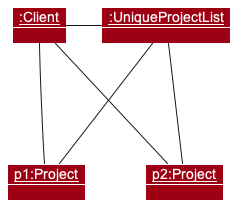
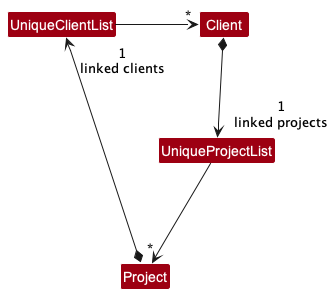

* Table of Contents
{:toc}

--------------------------------------------------------------------------------------------------------------------

## **Acknowledgements**

* This project is based on the AddressBook-Level3 project created by the [SE-EDU initiative](https://se-education.org).
* This project utilises the [PrettyTime](https://www.ocpsoft.org/prettytime/nlp/) library.

--------------------------------------------------------------------------------------------------------------------

## **Setting up, getting started**

Refer to the guide [_Setting up and getting started_](SettingUp.md).

--------------------------------------------------------------------------------------------------------------------

## **Design**

:bulb: **Tip:** The `.puml` files used to create diagrams in this document can be found in the [diagrams](https://github.com/AY2223S2-CS2103T-T14-1/tp/tree/master/docs/diagrams/) folder. Refer to the [_PlantUML Tutorial_ at se-edu/guides](https://se-education.org/guides/tutorials/plantUml.html) to learn how to create and edit diagrams.

### Architecture

The ***Architecture Diagram*** given above explains the high-level design of the App.

Given below is a quick overview of main components and how they interact with each other.

**Main components of the architecture**

**`Main`** has two classes called [`Main`](https://github.com/AY2223S2-CS2103T-T14-1/tp/tree/master/src/main/java/arb/Main.java) and [`MainApp`](https://github.com/AY2223S2-CS2103T-T14-1/tp/tree/master/src/main/java/arb/MainApp.java). It is responsible for,
* At app launch: Initializes the components in the correct sequence, and connects them up with each other.
* At shut down: Shuts down the components and invokes cleanup methods where necessary.

[**`Commons`**](#common-classes) represents a collection of classes used by multiple other components.

The rest of the App consists of four components.

* [**`UI`**](#ui-component): The UI of the App.
* [**`Logic`**](#logic-component): The command executor.
* [**`Model`**](#model-component): Holds the data of the App in memory.
* [**`Storage`**](#storage-component): Reads data from, and writes data to, the hard disk.

**How the architecture components interact with each other**

The *Sequence Diagram* below shows how the components interact with each other for the scenario where the user issues the command `delete-client 1`.

Each of the four main components (also shown in the diagram above),

* defines its *API* in an `interface` with the same name as the Component.
* implements its functionality using a concrete `{Component Name}Manager` class (which follows the corresponding API `interface` mentioned in the previous point).

For example, the `Logic` component defines its API in the `Logic.java` interface and implements its functionality using the `LogicManager.java` class which follows the `Logic` interface. Other components interact with a given component through its interface rather than the concrete class (reason: to prevent outside component's being coupled to the implementation of a component), as illustrated in the (partial) class diagram below.

The sections below give more details of each component.

### UI component

The **API** of this component is specified in [`Ui.java`](https://github.com/AY2223S2-CS2103T-T14-1/tp/tree/master/src/main/java/arb/ui/Ui.java)

The UI consists of a `MainWindow` that is made up of parts e.g.`CommandBox`, `ResultDisplay`, `StatusBarFooter` etc. All these, including the `MainWindow`, inherit from the abstract `UiPart` class which captures the commonalities between classes that represent parts of the visible GUI.

The `UI` component uses the JavaFx UI framework. The layout of these UI parts are defined in matching `.fxml` files that are in the `src/main/resources/view` folder. For example, the layout of the [`MainWindow`](https://github.com/AY2223S2-CS2103T-T14-1/tp/tree/master/src/main/java/arb/ui/MainWindow.java) is specified in [`MainWindow.fxml`](https://github.com/AY2223S2-CS2103T-T14-1/tp/tree/master/src/main/resources/view/MainWindow.fxml)

The `UI` component,

* executes user commands using the `Logic` component.
* listens for changes to `Model` data so that the UI can be updated with the modified data.
* keeps a reference to the `Logic` component, because the `UI` relies on the `Logic` to execute commands.
* depends on some classes in the `Model` component, as it displays `Client`, `Project` and `TagMapping` objects residing in the `Model`.

### Logic component

**API** : [`Logic.java`](https://github.com/AY2223S2-CS2103T-T14-1/tp/tree/master/src/main/java/arb/logic/Logic.java)

Here's a (partial) class diagram of the `Logic` component:

How the `Logic` component works:
1. When `Logic` is called upon to execute a command, it uses the `AddressBookParser` class to parse the user command.
1. This results in a `Command` object (more precisely, an object of one of its subclasses e.g., `AddCommand`) which is executed by the `LogicManager`.
1. The command can communicate with the `Model` when it is executed (e.g. to add a client).
1. The result of the command execution is encapsulated as a `CommandResult` object which is returned back from `Logic`.

The Sequence Diagram below illustrates the interactions within the `Logic` component for the `execute("delete-client 1")` API call.

:information_source: **Note:** The lifeline for `DeleteClientCommandParser` should end at the destroy marker (X) but due to a limitation of PlantUML, the lifeline reaches the end of diagram.

Here are the other classes in `Logic` (omitted from the class diagram above) that are used for parsing a user command:

How the parsing works:
* When called upon to parse an user input, the `AddressBookParser` class creates an `XYZCommandParser` (`XYZ` is a placeholder for the specific command name e.g., `AddClientCommandParser`) which uses the other classes shown above to parse the user command and create a `XYZCommand` object (e.g., `AddClientCommand`) which the `AddressBookParser` returns back as a `Command` object.
* All `XYZCommandParser` classes (e.g., `AddClientCommandParser`, `DeleteClientCommandParser`, ...) inherit from the `Parser` interface so that they can be treated similarly where possible e.g, during testing.

### Model component
**API** : [`Model.java`](https://github.com/AY2223S2-CS2103T-T14-1/tp/tree/master/src/main/java/arb/model/Model.java)

The `Client` object stores a few pieces of data as separate objects, some of which are optional, as shown in the diagram below. (These details were omitted from the model class diagram.)

The `Project` object stores a few pieces of data as separate objects, some of which are optional, as shown in the diagram below. (These details were omitted from the model class diagram.)

The `TagMapping` objects stores a `Tag` object and how many `Client` and `Project` objects it belongs to, as shown in the diagram below. (These details were omitted from the model class diagram.) 

The `Model` component,

* stores the address book data: all `Client` objects (which are contained in a `UniqueClientList` object), all `Project` objects (which are contained in a `UniqueProjectList` object), and all `TagMapping` objects (which are contained in a `UniqueTagMappingList` object).
* stores the currently 'selected' `Client` objects (e.g., results of a search query) as a separate _filtered_ list, and stores the currently 'sorted' `Client` objects (e.g., results of a sort query) as a separate _sorted_ list. Both lists are exposed to outsiders as an unmodifiable `ObservableList<Client>` that can be 'observed' e.g. the UI can be bound to this list so that the UI automatically updates when the data in the list change.
* stores the currently 'selected' `Project` objects (e.g., results of a search query) as a separate _filtered_ list, and stores the currently 'sorted' `Project` objects (e.g., results of a sort query) as a separate _sorted_ list. Both lists are exposed to outsiders as an unmodifiable `ObservableList<Project>` that can be 'observed' e.g. the UI can be bound to this list so that the UI automatically updates when the data in the list change.
* stores a `UserPref` object that represents the user’s preferences. This is exposed to the outside as a `ReadOnlyUserPref` objects.
* does not depend on any of the other three components (as the `Model` represents data entities of the domain, they should make sense on their own without depending on other components)

### Storage component

**API** : [`Storage.java`](https://github.com/AY2223S2-CS2103T-T14-1/tp/tree/master/src/main/java/arb/storage/Storage.java)

The `Storage` component,
* can save both address book data and user preference data in json format, and read them back into corresponding objects.
* inherits from both `AddressBookStorage` and `UserPrefStorage`, which means it can be treated as either one (if only the functionality of only one is needed).
* depends on some classes in the `Model` component (because the `Storage` component's job is to save/retrieve objects that belong to the `Model`)

### Common classes

Classes used by multiple components are in the `arb.commons` package.

--------------------------------------------------------------------------------------------------------------------

## **Implementation**

This section describes some noteworthy details on how certain features are implemented.

### Projects

#### Implementation
There is a new type of data that can be stored in the application: Projects. These are implemented as a model class, similar to `Client`. They contain information about the project's `Title`, `Status`, `Deadline` (optional), and `Price`(optional), each of which are implemented as separate classes.

A new project can be created using the `add-project`/`ap` command by providing necessary and, optionally, optional details of the project. The project can also be edited for any fields, which will create a new project with the updated details to replace the current one. This also means that project details are guaranteed to be immutable.

Each of the project detail classes have their own validation check that is run upon construction of the object, which is done in the parser (specifically, the `arb.logic.parser.project.AddProjectCommandParser`).

### Sorting

Users have the option to sort visible clients and projects.

#### Implementation
This is facilitated by [JavaFX's `SortedList`](https://docs.oracle.com/javase/8/javafx/api/javafx/collections/transformation/SortedList.html), which sorts its contents based on the supplied `Comparator`. As mentioned in the [model](#model-component) section of the architecture overview, the sorted list is exposed to the UI in the form of an unmodifiable `ObservableList`, such that any updates to the sorted list is propagated to the UI.

There are a set of Comparators defined inside the `ModelManager` class, that are supplied to the sorted list depending on how the user wants to sort clients or projects. Example Comparators include comparing names of `Client` objects.

Whenever the user executes a sort command, the model updates the sorted list with the corresponding `Comparator`. The below diagram shows what occurs when a user executes a `sort-client` command, which sorts the client list by name.

As the contents of the sorted list is the already filtered list, executing sorting will only sort clients/projects that are currently visible. Clients/projects that are hidden due to a previous `find command` will remain hidden.

#### Alternatives
An alternative would be for sorting to sort all clients/projects instead of only those that are visible, causing sorting commands to show all clients/projects but sorted. We did not go with this implementation as we wanted users to be able to combine the effects of filtering and sorting for better data organisation.

### Linking Projects to Clients

Users have the ability to link projects to clients.

#### Implementation

When parsing the command to add or edit a project, the parser checks for the existence of client name keywords in the command. If it does, then ArB displays a client list filtered with the provided client name keywords, sets the project to be linked and enters link mode, as shown in the sequence diagram below.

In link mode, the user can input an index to link the added/edited project to the specified client, as shown in the sequence diagram below. ArB will then exit link mode and return to normal operations.

Internally, a project can be linked to one client while a client can have multiple linked projects. A client's linked projects are stored in a `UniqueProjectList` object that each `Client` object has. This implementation is shown in the class diagram below.

For example, the below is an object diagram representing the situation where we have two projects `P1` and `P2` that are both linked to the same `Client` object.

#### Future improvements
Currently, projects are only allowed to be linked to a single client. This was done to avoid introducing too much complexity such that it was feasible to complete this feature before the deadline.

In future, projects could be linked to multiple clients. This could be implemented by storing a list of `Client` objects, perhaps using a `UniqueClientList`. The below class diagram showcases this  implementation.

### Better filtering

Users now have the ability to find clients and projects using a greater number of parameters, such as tags and deadlines.

#### Implementation

### Done Status

#### Implementation

The displaying of the "DONE" status is facilitated by the `markAsDone()`
method in the Project class.

The Done status is highlighted in the UI when the project is done.
The ProjectCard class has been updated to run the aforementioned `markAsDone()`
method for any project before setting its status to OVERDUE, DONE, or NOT DONE.

### Not Done Status

#### Implementation

The displaying of the "NOT DONE" status is facilitated by the `markAsUndone()`
method in the Project class.

The Not Done status is highlighted in the UI when the project is not done and not overdue.
The ProjectCard class has been updated to run the aforementioned `markAsUndone()`
method for any project before setting its status to OVERDUE, DONE, or NOT DONE.

### Overdue Status

#### Implementation
The displaying of the "OVERDUE" status is facilitated by the isOverdue method
in the Project class. The isOverdue method returns a boolean after using the
compareTo method in the Deadline class which checks the current date
against the deadline date of the project, i.e. check if a project's deadline
is past the current date.

The Overdue status is highlighted in the UI when any project is past its deadline.
The ProjectCard class has been updated to run the aforementioned isOverdue
method for any project before setting its status to OVERDUE, DONE, or NOT DONE.
The OVERDUE status is shown for existing projects in the list that are overdue, and
if a user adds a project with a deadline with a data that has already past.

### Marking projects

Users have the ability to mark a certain project as DONE.

#### Implementation

### Unmarking projects

Users have the ability to mark a certain project as NOT DONE/OVERDUE.

#### Implementation

### Listing Clients

Users have the ability to list all their clients.

#### Implementation

### Listing Projects

Users have the ability to list all their projects. A summary of how many overdue, done, and not done projects is also displayed.

#### Implementation

--------------------------------------------------------------------------------------------------------------------

## **Documentation, logging, testing, configuration, dev-ops**

* [Documentation guide](Documentation.md)
* [Testing guide](Testing.md)
* [Logging guide](Logging.md)
* [Configuration guide](Configuration.md)
* [DevOps guide](DevOps.md)

--------------------------------------------------------------------------------------------------------------------

## **Appendix: Requirements**

### Product scope

**Target user profile**:

* has a need to manage a significant number of commision clients
* has a need to manage a significant number of projects
* prefer desktop apps over other types
* can type fast
* prefers typing to mouse interactions
* is reasonably comfortable using CLI apps

**Value proposition**: manage clients and ongoing projects faster than a typical mouse/GUI driven app

### User stories

Priorities: High (must have) - `* * *`, Medium (nice to have) - `* *`, Low (unlikely to have) - `*`

| Priority | As a …​                                    | I want to …​                     | So that I can…​                                                        |
| -------- | ------------------------------------------ | ------------------------------ | ---------------------------------------------------------------------- |
| `* *` | artist with many ongoing commissioned projects to keep track of | view my current commissioned projects in order of deadline recency | not miss any deadlines |
| `*` | artist inexperienced in command line commands | use commands that are closer to natural language | better understand and more effectively use commands |
| `* * *` | artist | add a deadline to a project | record when a project needs to be done |
| `*` | artist working with commissions | import a list of clients from a CSV file | use an editable format |
| `* *` | first-time user of the application | view a guide on how to use the app | learn how to use the app |
| `*` | artist who wants to increase my earnings | add a large number of commissioned projects at any time | increase my income |
| `*` | expert in using the application | setup shortcuts for commands I often use | execute them quickly |
| `* *` | artist who does not want to be overwhelmed by too many ongoing commission projects | quickly see how many ongoing projects I have | deliver for my clients |
| `* *` | artist | tag clients in the list | filter by the tags if necessary |
| `* *` | artist | tag projects in the list | filter by the tags if necessary |
| `*` | inexperienced user | undo commands | remedy mistakes |
| `* *` | first-time user of the application | see sample data in the application | understand what the application can do |
| `* * *` | artist | add clients to the application | keep track of all of my clients |
| `* * *` | artist | remove clients from my list | keep the list accurate |
| `* *` | artist | edit client info | keep client info up to date in case of changes |
| `* *` | artist | edit project info | keep project info up to date in case of changes |
| `* *` | artist who wants to know which of my ongoing projects are most lucrative | quickly sort my ongoing projects based on commission size | prioritize higher commissioned projects |
| `* *` | artist | add to a project how much money it will make me | know the profit of my projects |
| `* *` | artist | search for clients using keywords | find specific clients quickly |
| `* *` | artist ready to start using the application | purge any sample data on the application | start entering my own data onto the application |
| `*` | artist | quickly see how many times a specific client has commissioned me for a project before | know if clients are returning |
| `* *` | artist | see how much profit a client has made me so far | know which client is making me the most profit |
| `* *` | artist | sort clients by how much profit they have made me so far | know which clients are making me the most profit |
| `* *` | artist | sort clients by the number of times they have commissioned me before | know if a given client and I have a long-standing relationship |
| `* * *`| artist | add contact info to clients | know how to reach them if needed |
| `*` | artist | blacklist certain clients | know who to avoid |
| `* *` | artist | link projects to clients | know what projects are for what clients |
| `* *` | artist | get asked if I am sure I want to delete an ongoing project | be prevented from accidentally deleting an ongoing project |
| `* * *`| artist | mark a certain project as done | know it is no longer ongoing |
| `*` | user | easily generate text to share client information | send it to someone else if required |
| `* * *` | artist | unmark a project as done | ensure my list is accurate in case I accidentally marked a project as done |
| `*` | artist | add dates in different formats without being asked to give it in a certain format | not have to memorize providing dates in a certain format |
| `* *`| artist | see all projects due within a specific time period | know what is due at different times and plan my work |
| `*` | artist | have the application convert different time zones to my local one and state which country the client is from | add times for clients from various countries and not have to do the conversion myself |
| `* *` | artist | see all tags I have used | know what tags to use to find clients/projects |
| `*` | experienced user | directly edit the data file | change stored information without having to open the app |
| `* *` | artist | find specific clients | see their information |
| `* *`| artist | find specific projects | see their information |
| `* *` | artist | search for projects using keywords | find specific projects quickly |
| `* *` | busy artist | see what projects are due in a certain timeframe | better plan my schedule |

### Use cases

(For all use cases below, the **System** is the `ArB` and the **Actor** is the `user`, unless specified otherwise)

**Use case: Delete a person**

**MSS**

1.  User requests to list persons
2.  AddressBook shows a list of persons
3.  User requests to delete a specific person in the list
4.  AddressBook deletes the person

    Use case ends.

**Extensions**

* 2a. The list is empty.

  Use case ends.

* 3a. The given index is invalid.

    * 3a1. AddressBook shows an error message.

      Use case resumes at step 2.

**Use case: Delete Project**

**MSS**:
1. User enters command for deleting project of certain client.
2. ArB deletes project for client.

    Use case ends.

**Extension**:
1a. User wants to remove a project of a client that is not found in the list.

2a1. ARB tells user that the project of the client does not exist.

Use case ends.

**Use case: Edit Project**

**MSS**:
1. User enters command to editing project, including project ID and details to edit
2. ArB edits project to use new details
3. Use case ends.

**Extension**:

1a. ArB detects that the command is inaccurate/incomplete

1a1. ArB tells user that the command is incorrect and displays the correct format

Use case ends.

1b. ArB detects that the project does not exist

1b1. ArB tells user that the project does not exist

Use case ends.

**Use case: Find Project**

**MSS**:
1. User enters command to find projects, including parameters such as name, deadline, tags or linked clients.
2. ArB lists all projects that match the provided parameters. 
   Use case ends.

**Extension**:

* 1a. ArB detects that none of the parameters provided are valid.
  * 1a1. ArB informs user that no valid parameters were provided. 
  Use case ends.

**Use case: Find Client**

**MSS**:
1. User enters command to find clients, including parameters such as name or tags.
2. ArB lists all clients that match the provided parameters. 
   Use case ends.

**Extension**:
* 1a. ArB detects that none of the parameters provided are valid.
  * 1a1. ArB informs user that no valid parameters were provided. 
  Use case ends.

**Use case: Link Project To Client**

**MSS**:
1. User indicates that they want to link a specific project to a client, providing ArB with client name keywords.
2. ArB lists all clients that match the provided client name keywords.
3. User selects the client they want to link the project to.
4. ArB links the project to the selected client. 
   Use case ends.

**Extension**:
* 3a. User chooses to cancel the linking. 
  Use case ends.
* 3b. User makes an invalid selection.
  * 3b1. ArB shows an error message. 
    Use case resumes at step 3.

### Non-Functional Requirements

1.  Should work on any _mainstream OS_ as long as it has Java `11` or above installed.
2.  Should be able to hold up to 1000 persons without a noticeable sluggishness in performance for typical usage.
3.  A user with above average typing speed for regular English text (i.e. not code, not system admin commands) should be able to accomplish most of the tasks faster using commands than using the mouse.
4. The final product should be a result of evolving/enhancing/morphing the given code base.
5. The product should be targeting users who can type fast and prefer typing over other means of input.
6. The product should be for a single user i.e. (not a multi-user product).
7. The product needs to be developed in a breadth-first incremental manner over the project duration.
8. The data should be stored locally and should be in a human-editable text file.
9. Do not use a DBMS to store data.
10. The software should follow the Object-oriented paradigm primarily
11. The software should work on the Windows, Linux, and OS-X platforms.
12. The software should work on a computer that has version 11 of Java
13. The software should work without requiring an installer.
14. The software should not depend on your own remote server.
15. The use of third-party frameworks/libraries/services is allowed but only if they are free, open-source (this doesn't apply to services), have permissive license terms, do not require any installation by the user of your software and do not violate other constraints.
16. The GUI should work well (i.e., should not cause any resolution-related inconveniences to the user) for standard screen resolutions 1920x1080 and higher, and for screen scales 100% and 125%
17. GUI should be usable (i.e., all functions can be used even if the user experience is not optimal) for resolutions 1280x720 and higher, and for screen scales 150%.
18. Everything needs to be packaged into a single JAR file.
19. The file sizes of the product should be reasonable and not exceed the limit of 100MB
20. The DG and UG should be PDF-friendly. Don't use expandable panels, embedded videos, animated GIFs etc.
22. The product should be testable

### Glossary

* **Mainstream OS**: Windows, Linux, Unix, OS-X
* **Private contact detail**: A contact detail that is not meant to be shared with others
* **Clients**: A person who has commissioned the user
* **Project**: A piece of (art)work to be completed
* **Contact info**: Email, Phone Number
* **Project status**: How close to completion a project is

--------------------------------------------------------------------------------------------------------------------

## **Appendix: Instructions for manual testing**

Given below are instructions to test the app manually.

:information_source: **Note:** These instructions only provide a starting point for testers to work on;
testers are expected to do more *exploratory* testing.

### Launch and shutdown

1. Initial launch

   1. [Download the jar file](https://github.com/AY2223S2-CS2103T-T14-1/tp/releases) and copy into an empty folder.

   1. Double-click the jar file. 
      Expected: Shows the GUI with a set of sample clients and projects. The window size may not be optimum.

1. Saving window preferences

   1. Resize the window to an optimum size. Move the window to a different location. Close the window.

   1. Re-launch the app by double-clicking the jar file. 
       Expected: The most recent window size and location is retained.

1. Saving data

   1. Delete a client from the client list. Close the window.

   1. Re-launch the app by double-clicking the jar file. 
      Expected: The client should remain deleted. 

### Listing all clients

1. Listing all clients while some clients are hidden

   1. Filter the client list using the `find-client` command such that only some clients are visible.

   1. Enter the command: `list-client` 
      Expected: All clients shown. Success message shown.

1. Listing all clients while viewing another list

   1. Show a list other than the client list using either the `list-project` or `list-tag` commands.

   1. Enter the command: `list-client` 
      Expected: All clients shown. Success message shown.

### Listing all projects

1. Listing all projects while some projects are hidden

   1. Filter the project list using the `find-project` command such that only some projects are visible.

   1. Enter the command: `list-project` 
      Expected: All projects shown. Success message shown.

1. Listing all projects while viewing another list

   1. Show a list other than the project list using either the `list-client` or `list-tag` commands.

   1. Enter the command: `list-project` 
      Expected: All projects shown. Success message shown.

### Listing all tags

1. Listing all tags while viewing another list

   1. Show a list other than the tag list using either the `list-client` or `list-project` commands.

   1. Enter the command: `list-tag` 
      Expected: All tags shown. Success message shown.

### Adding a client

1. Specifying all details

   1. Enter the command: `add-client name/John Doe phone/12345678 email/john@example.com tag/friends` 
      Expected: A client with the specified details added. Details of added client shown in status message.

1. Specifying only compulsory details

   1. Enter the command: `add-client name/David Leong` 
      Expected: Same as previous.

1. Adding a duplicate client

   1. Add a client by the name `John Doe` to the client list.

   1. Enter the command: `add-client name/John Doe` 
      Expected: Client is not added. Error message shown.

### Adding a project

1. Specifying all details

   1. Enter the command: `add-project name/Oil Painting deadline/tomorrow price/500 tag/friends` 
      Expected: A project with the specified details added. Details of added project shown in status message.

1. Specifying only compulsory details

   1. Enter the command: `add-project name/Sky Painting` 
      Expected: Same as previous.

1. Adding a duplicate project

   1. Add a project by the name `Oil Painting` to the project list.

   1. Enter the command: `add-project name/Oil Painting` 
      Expected: Project is not added. Error message shown.

1. Linking added project to client

   1. Prerequisites: Add a client by the name `Alice Leong` to the client list. Enter the command: `add-project name/Self Portrait client/alice` 
      Expected: Details of added project shown in status message. Filtered client list shown.

   1. Test case: `1` 
      Expected: Success message shown. Added project linked to first client in filtered client list.

   1. Test case: `0` 
      Expected: Cancel message shown. Added project not linked to any client.

   1. Test case: `x` where x is larger than the length of the filtered client list 
      Expected: Error message shown.

### Editing a client

1. Editing a client while all clients are being shown

   1. Prerequisites: List all clients using the `list-client` command. There should be multiple clients in the list.

   1. Test case: `edit-client 1 name/John Doe phone/12345678 email/john@example.com tag/friends` 
      Expected: First client's details are edited. Details of edited client shown in status message.

   1. Test case: `edit-client 0 name/John Doe` 
      Expected: No client is edited. Error details shown in the status message. 

   1. Other incorrect edit commands to try: `edit-client`, `edit-client x name/John`, `...` (where x is larger than the list size) 
      Expected: Similar to previous.

1. Editing a client while only some clients are shown

   1. Prerequisites: Filter the client list using the `find-client` command such that only some clients are visible.

   1. Test case: `edit-client 1 name/John Doe phone/12345678 email/john@example.com tag/friends` 
      Expected: First client's details are edited. Details of edited client shown in status message.

   1. Test case: `edit-client 0 name/John Doe` 
      Expected: No client is edited. Error details shown in the status message.

   1. Test case: `edit-client x name/John` where x is smaller than the entire client list size but is larger than the visible list size 
      Expected: Similar to previous.

   1. Other incorrect edit commands to try: `edit-client` 
      Expected: Similar to previous.

1. Editing a client while the client list is not being shown

   1. Prerequisites: Show a list other than the client list using either the `list-project` or `list-tag` commands. There should be multiple clients in the client list.

   1. Test case: `edit-client 1 name/John` 
      Expected: No client is edited. Error details shown in the status message.

### Editing a project

1. Editing a project while all projects are being shown

   1. Prerequisites: List all projects using the `list-project` command. There should be multiple projects in the list.

   1. Test case: `edit-project 1 name/Sky Painting deadline/next week price/50 tag/friends` 
      Expected: First project's details are edited. Details of edited project shown in status message.

   1. Test case: `edit-project 0 name/Sky Painting` 
      Expected: No project is edited. Error details shown in the status message. 

   1. Other incorrect edit commands to try: `edit-project`, `edit-project x name/Sky Painting`, `...` (where x is larger than the list size) 
      Expected: Similar to previous.

1. Editing a project while only some projects are shown

   1. Prerequisites: Filter the project list using the `find-project` command such that only some projects are visible.

   1. Test case: `edit-project 1 name/Sky Painting deadline/next week price/50 tag/friends` 
      Expected: First project's details are edited. Details of edited project shown in status message.

   1. Test case: `edit-project 0 name/Sky Painting` 
      Expected: No project is edited. Error details shown in the status message.

   1. Test case: `edit-project x name/Sky Painting` where x is smaller than the entire project list size but is larger than the visible list size 
      Expected: Similar to previous.

   1. Other incorrect edit commands to try: `edit-project` 
      Expected: Similar to previous.

1. Editing a project while the project list is not being shown

   1. Prerequisites: Show a list other than the project list using either the `list-client` or `list-tag` commands. There should be multiple projects in the project list.

   1. Test case: `edit-project 1 name/Sky Painting` 
      Expected: No project is edited. Error details shown in the status message.

1. Linking edited project to client

   1. Prerequisites: Add a client by the name `Alice Leong` to the client list. Display the project list with `list-project`. Enter the command: `edit-project 1 client/alice` 
      Expected: Details of edited project shown in status message. Filtered client list shown.

   1. Test case: `1` 
      Expected: Success message shown. Edited project linked to first client in filtered client list.

   1. Test case: `0` 
      Expected: Cancel message shown. Edited project not linked to any client.

   1. Test case: `x` where x is larger than the length of the filtered client list 
      Expected: Error message shown.

### Deleting a client

1. Deleting a client while all clients are being shown

   1. Prerequisites: List all clients using the `list-client` command. There should be multiple clients in the list.

   1. Test case: `delete-client 1` 
      Expected: First client is deleted from the client list. Details of the deleted client shown in the status message.

   1. Test case: `delete-client 0` 
      Expected: No client is deleted. Error details shown in the status message.

   1. Other incorrect delete commands to try: `delete-client`, `delete-client x`, `...` (where x is larger than the list size) 
      Expected: Similar to previous.

1. Deleting a client while only some clients are shown

   1. Prerequisites: Filter the client list using the `find-client` command such that only some clients are visible.

   1. Test case: `delete-client 1` 
      Expected: First client is deleted from the client list. Details of the deleted client shown in the status message.

   1. Test case: `delete-client 0` 
      Expected: No client is deleted. Error details shown in the status message.

   1. Test case: `delete-client x` where x is smaller than the entire client list size but is larger than the visible list size 
      Expected: Similar to previous.

   1. Other incorrect delete commands to try: `delete-client` 
      Expected: Similar to previous.

1. Deleting a client while the client list is not being shown

   1. Prerequisites: Show a list other than the client list using either the `list-project` or `list-tag` commands. There should be multiple clients in the client list.

   1. Test case: `delete-client 1` 
      Expected: No client is deleted. Error details shown in the status message. Status bar remains the same.

### Deleting a project

1. Deleting a project while all projects are being shown

   1. Prerequisites: List all projects using the `list-project` command. There should be multiple projects in the list.

   1. Test case: `delete-project 1` 
      Expected: First project is deleted from the project list. Details of the deleted project shown in the status message. Timestamp in the status bar is updated.

   1. Test case: `delete-project 0` 
      Expected: No project is deleted. Error details shown in the status message. Status bar remains the same.

   1. Other incorrect delete commands to try: `delete-project`, `delete-project x`, `...` (where x is larger than the list size) 
      Expected: Similar to previous.

1. Deleting a project while only some projects are shown

   1. Prerequisites: Filter the project list using the `find-project` command such that only some projects are visible.

   1. Test case: `delete-project 1` 
      Expected: First project is deleted from the project list. Details of the deleted project shown in the status message. Timestamp in the status bar is updated.

   1. Test case: `delete-project 0` 
      Expected: No project is deleted. Error details shown in the status message. Status bar remains the same.

   1. Test case: `delete-project x` where x is smaller than the entire project list size but is larger than the visible list size 
      Expected: Similar to previous.

   1. Other incorrect delete commands to try: `delete-project` 
      Expected: Similar to previous.

1. Deleting a project while the project list is not being shown

   1. Prerequisites: Show a list other than the project list using either the `list-client` or `list-tag` commands. There should be multiple projects in the project list.

   1. Test case: `delete-project 1` 
      Expected: No project is deleted. Error details shown in the status message. Status bar remains the same.

### Finding clients

1. Finding clients

   1. Prerequisites: Add a client by the name of `Alice Lim` to the client list.

   1. Test case: `find-client name/Alice` 
      Expected: Client list with one client is shown. Status message states that one client was found.
   
   1. Test case: `find-client` 
      Expected: Error message is shown.

### Finding projects

1. Finding projects

   1. Prerequisites: Add a project by the name of `Self Portrait` to the project list.

   1. Test case: `find-project name/self` 
      Expected: Project list with one project is shown. Status message states that one project was found.
   
   1. Test case: `find-project` 
      Expected: Error message is shown.

### Sorting clients

1. Sorting clients when entire client list is shown

   1. Prerequisites: Client list should have multiple clients.

   1. Test case: `sort-client` 
      Expected: Client list is sorted by name. Status message states that client list was sorted.

1. Sorting clients when some clients are hidden

   1. Prerequisites: Filter the client list with the `find-client` command. Client list should have multiple clients.

   1. Test case: `sort-client` 
      Expected: Visible clients are sorted by name. Status message states that client list was sorted.

### Sorting projects

1. Sorting projects when entire project list is shown

   1. Prerequisites: Project list should have multiple projects.

   1. Test case: `sort-project option/name` 
      Expected: Project list is sorted by name. Status message states that project list was sorted.

1. Sorting projects when some projects are hidden

   1. Prerequisites: Filter the project list with the `find-project` command. Project list should have multiple projects.

   1. Test case: `sort-project option/name` 
      Expected: Visible projects are sorted by name. Status message states that project list was sorted.

### Editing the data file

1. Dealing with missing/corrupted data files

   1. Test case: delete the data file 
      Delete the JSON file in the `data` folder that is found in the same folder the jar file before launching the app. 
      Expected: Status message should state that a data file could not be found. The app should be filled with sample data.
   
   1. Test case: corrupt the data file 
      Open the JSON file and delete the `name` attribute of a client before launching the app. 
      Expected: Status message should state that the data file was not in the correct format. The app should start with no data.

1. Correctly editing the data file

   1. Test case: Change the name attribute of a client to another valid value such as `David` before launching the app 
      Expected: Status message should state that the data file was found, and the app should reflect the edited data.

   1. Other edits to try: Editing other attributes such as phone number 
      Expected: Similar to previous.
      
--------------------------------------------------------------------------------------------------------------------

## **Appendix: Effort**

### Difficulty Level

### Challenges Faced

### Effort Required

### Achievements

--------------------------------------------------------------------------------------------------------------------

## **Appendix: Planned Enhancements**

1. {_some feature flaw and how we plan to fix it in future_}
