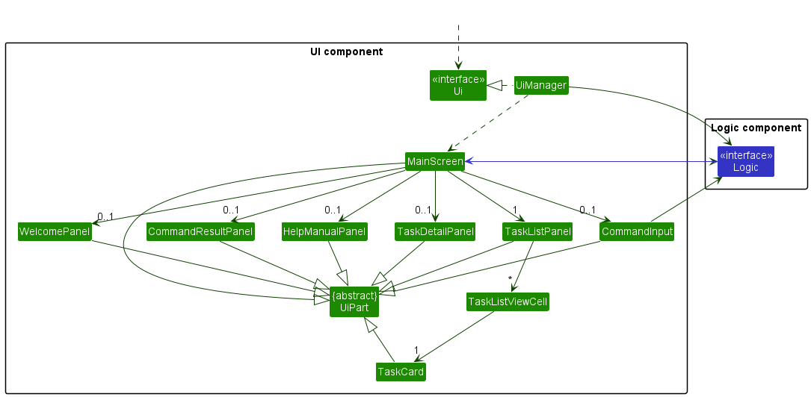

<h2 id="table-of-contents">Table of Contents</h2>
1. [Introduction](#introduction)
    * [Acknowledgements](#acknowledgements)
    * [Setting Up, Getting Started](#setting-up-getting-started)
2. [Design](#design)
    * [Architecture](#architecture) 
    * [How the Architecture Components Interact With Each Other](#interacting-components)
    * [UI Component](#ui-component)
    * [Logic Component](#logic-component)
    * [Model Component](#model-component)
    * [Storage Component](#storage-component)
    * [Common Classes](#common-classes)
3. [Implementation](#implementation)
    * [Add Command](#add-commnand)
    * [Recur Command](#recur-command)
    * [Edit Command](#edit-command)
    * [Delete Command](#delete-command)
    * [Find Command](#find-command)
    * [Next Command](#next-command)
    * [Undo Command](#undo-command)
    * [List Command](#list-command)
    * [Help Command](#help-command)
    * [Exit Command](#exit-command)
4. [Documentation, Logging, Testing, Configuration, Dev-Ops](#documentation)
5. [Appendix](#appendix)
    * [Planned Enhancements](#planned-enhancements)
    * [Project Requirements](#project-requirements)
      * [Product Scope](#product-scope)
      * [User Stories](#user-stories)
      * [Use Cases](#use-cases)
      * [Non-Functional Requirements](#nfr)
    * [Instructions for Manual Testing](#manual-testing)
      * [Launch and Shutdown](#launch-and-shutdown-test)
      * [Adding an Event](#adding-test)
      * [Recurring an Event](#recur-test)
      * [Editing an Event](#edit-test)
      * [Deleting Events](#delete-test)
      * [Finding Events](#find-test)
      * [Show Next Events](#next-test)
      * [Undo a Command](#undo-test)
    * [Glossary](#glossary)

<h2 id="introduction">Introduction</h2>
--------------------------------------------------------------------------------------------------------------------
_Ez-Schedule_ is a **desktop application for managing and scheduling of events, optimized for use via a Command Line
Interface** (CLI) while still providing an easy way to visualize all events through a Graphical User Interface (GUI).

_Ez-Schedule_ will benefit a fast typist who needs to plan and track upcoming events.

<h2 id="acknowledgements">Acknowledgements</h2>

* This project is based on the AddressBook Level 3 (AB3) project created by the SE-EDU initiative.
* Libraries used: JavaFX, JUnit5

<h2 id="setting-up-getting-started">Setting Up, Getting Started</h2>

Refer to the guide [_Setting Up and Getting Started_](SettingUp.md).

<h2 id="design">Design</h2>
--------------------------------------------------------------------------------------------------------------------

:bulb: **Tip:** 
The `.puml` files used to create diagrams in this document can be found in the 
[diagrams](https://github.com/AY2223S2-CS2103-W17-3/tp/blob/master/docs/diagrams/) folder. 
Refer to the [_PlantUML Tutorial_ at se-edu/guides](https://se-education.org/guides/tutorials/plantUml.html) 
to learn how to create and edit diagrams.

<h2 id="architecture">Architecture</h2>

The ***Architecture Diagram*** given above explains the high-level design of the App.

Given below is a quick overview of main components and how they interact with each other.

**Main components of the architecture**

**`Main`** has two classes called
[`Main`](https://github.com/AY2223S2-CS2103-W17-3/tp/blob/master/src/main/java/ezschedule/Main.java)
and [`MainApp`](https://github.com/AY2223S2-CS2103-W17-3/tp/blob/master/src/main/java/ezschedule/MainApp.java).
It is responsible for,
* At app launch: Initializes the components in the correct sequence, and connects them up with each other.
* At shut down: Shuts down the components and invokes cleanup methods where necessary.

[**`Commons`**](#common-classes) represents a collection of classes used by multiple other components.

The rest of the App consists of four components.

* [**`UI`**](#ui-component): The UI of the App.
* [**`Logic`**](#logic-component): The command executor.
* [**`Model`**](#model-component): Holds the data of the App in memory.
* [**`Storage`**](#storage-component): Reads data from, and writes data to, the hard disk.

<h2 id="interacting-components">How the Architecture Components Interact With Each</h2>

The *Sequence Diagram* below shows how the components interact with each other for the scenario where the user issues 
the command `delete 1`.

Each of the four main components (also shown in the diagram above),

* defines its *API* in an `interface` with the same name as the Component.
* implements its functionality using a concrete `{Component Name}Manager` class (which follows the corresponding 
  API `interface` mentioned in the previous point.

For example, the `Logic` component defines its API in the `Logic.java` interface and implements its functionality using 
the `LogicManager.java` class which follows the `Logic` interface. Other components interact with a given component 
through its interface rather than the concrete class(reason: to prevent outside component's being coupled to the 
implementation of a component), as illustrated in the (partial) class diagram below.

<h2 id="ui-component">UI Component</h2>

The **API** of this component is specified in 
[`Ui.java`](https://github.com/AY2223S2-CS2103-W17-3/tp/blob/master/src/main/java/ezschedule/ui/Ui.java)

The UI consists of a `MainWindow` that is made up of parts e.g.`CommandBox`, `ResultDisplay`, `EventListPanel`, 
`StatusBarFooter` etc. All these, including the `MainWindow`, inherit from the abstract `UiPart` class which captures 
the commonalities between classes that represent parts of the visible GUI.

The `UI` component uses the JavaFx UI framework. 
The layout of these UI parts are defined in matching `.fxml` files that are in the `src/main/resources/view` folder. 
For example, the layout of the [`MainWindow`](https://github.com/AY2223S2-CS2103-W17-3/tp/blob/master/src/main/java/ezschedule/ui/MainWindow.java) 
is specified in [`MainWindow.fxml`](https://github.com/AY2223S2-CS2103-W17-3/tp/blob/master/src/main/resources/view/MainWindow.fxml)

The `UI` component,

* executes user commands using the `Logic` component.
* listens for changes to `Model` data so that the UI can be updated with the modified data.
* keeps a reference to the `Logic` component, because the `UI` relies on the `Logic` to execute commands.
* depends on some classes in the `Model` component, as it displays `Event` object residing in the `Model`.

<h2 id="logic-component">Logic Component</h2>

**API** : [`Logic.java`](https://github.com/AY2223S2-CS2103-W17-3/tp/blob/master/src/main/java/ezschedule/logic/Logic.java)

Here's a (partial) class diagram of the `Logic` component:

How the `Logic` component works:
1. When `Logic` is called upon to execute a command, it uses the `SchedulerParser` class to parse the user command.
1. This results in a `Command` object (more precisely, an object of one of its subclasses e.g., `AddCommand`) which is executed by the `LogicManager`.
1. The command can communicate with the `Model` when it is executed (e.g. to add a event).
1. The result of the command execution is encapsulated as a `CommandResult` object which is returned back from `Logic`.

The Sequence Diagram below illustrates the interactions within the `Logic` component for the `execute("delete 1")` API call.

:information_source: **Note:** The lifeline for `DeleteCommandParser` should end at the destroy marker (X) but due to a limitation of PlantUML, the lifeline reaches the end of diagram.

Here are the other classes in `Logic` (omitted from the class diagram above) that are used for parsing a user command:

How the parsing works:
* When called upon to parse a user command, the `SchedulerParser` class creates an `XYZCommandParser` (`XYZ` is a placeholder for the specific command name e.g., `AddCommandParser`) which uses the other classes shown above to parse the user command and create a `XYZCommand` object (e.g., `AddCommand`) which the `AddressBookParser` returns back as a `Command` object.
* All `XYZCommandParser` classes (e.g., `AddCommandParser`, `DeleteCommandParser`, ...) inherit from the `Parser` interface so that they can be treated similarly where possible e.g, during testing.

<h2 id="model-component">Model Component</h2>

**API** : [`Model.java`](https://github.com/AY2223S2-CS2103-W17-3/tp/blob/master/src/main/java/seedu/address/model/Model.java)

The `Model` component,

* stores the scheduler data i.e., all `Event` objects (which are contained in a `uniqueEventList` object).
* stores the currently 'selected' `Event` objects (e.g., results of a search query) as a separate _filtered_ list 
  which is exposed to outsiders as an unmodifiable `ObservableList<Event>` that can be 'observed' e.g. the UI can be 
  bound to this list so that the UI automatically updates when the data in the list change.
* stores a `UserPref` object that represents the user’s preferences. 
  This is exposed to the outside as a `ReadOnlyUserPref` objects.
* does not depend on any of the other three components (as the `Model` represents data entities of the domain, 
  they should make sense on their own without depending on other components)

<h2 id="storage-component">Storage Component</h2>

**API** : [`Storage.java`](https://github.com/AY2223S2-CS2103-W17-3/tp/blob/master/src/main/java/seedu/address/storage/Storage.java)

The `Storage` component,
* can save both scheduler data and user preference data in json format, and read them back into corresponding objects.
* inherits from both `SchedulerStorage` and `UserPrefStorage`, which means it can be treated as either one (if only the 
  functionality of only one is needed).
* depends on some classes in the `Model` component (because the `Storage` component's job is to save/retrieve objects that belong to the `Model`)

<h2 id="common-classes">Common Classes</h2>

Classes used by multiple components are in the `ezschedule.commons` package.

<h2 id="implementation">Implementation</h2>
--------------------------------------------------------------------------------------------------------------------
This section describes some noteworthy details on how certain features are implemented.

<h2 id="add-command">Add Command</h2>

<h2 id="recur-command">Recur Command</h2>

<h2 id="edit-command">Edit Command</h2>

<h2 id="delete-command">Delete Command</h2>

<h2 id="find-command">Find Command</h2>

<h2 id="next-command">Next Command</h2>

<h2 id="undo-command">Undo Command</h2>

<h2 id="list-command">List Command</h2>

<h2 id="help-command">Help Command</h2>

<h2 id="exit-command">Exit Command</h2>

<h2 id="documentation">Documentation, Logging, Testing, Configuration, Dev-Ops</h2>
--------------------------------------------------------------------------------------------------------------------
* [Documentation guide](Documentation.md)
* [Testing guide](Testing.md)
* [Logging guide](Logging.md)
* [Configuration guide](Configuration.md)
* [DevOps guide](DevOps.md)

<h2 id="appendix">Appendix</h2>
--------------------------------------------------------------------------------------------------------------------
<h2 id="planned-enhancements">Planned Enhancements</h2>

<h2 id="project-requirements">Project Requirements</h2>

<h3 id="product-scope">Product Scope</h3>

**Target user profile**:

* has a need to manage a significant number of events
* prefer desktop apps over other types
* prefers visual representation of output
* is reasonably comfortable using CLI apps
* can type fast

**Value proposition**: manage events at high-level, provides faster event analysis with graphical outputs.

<h3 id="user-stories">User Stories</h3>

Priorities: High (must have) - `* * *`, Medium (nice to have) - `* *`, Low (unlikely to have) - `*`

| Priority | As a …​          | I want to …​                               | So that I can…​                                                         |
|----------|------------------|--------------------------------------------|-------------------------------------------------------------------------|
| `* * *`  | new user         | see usage instructions                     | refer to instructions when I forget how to use the App                  |
| `* * *`  | user             | easily save events after closing the app   | generate it again when I start the app                                  |
| `* * *`  | user             | add a event's schedule into the app       | see their schedules                                                     |
| `* * *`  | user             | delete an event from the app               | remove events that are no longer scheduled                              |
| `* *`    | forgetful user   | find my next event                         | see the upcoming event without having to check every events myself      |
| `* *`    | user             | undo accidental deletions                  | easily restore accidents in scheduling                                  |
| `* *`    | teacher          | find a free timeslot in my schedule        | schedule a timeslot for student consultations                           |
| `* *`    | user             | find an event by name                      | locate details of events without having to go through the entire list   |
| `* *`    | user             | edit my schedule                           | make last minute changes to events                                      |
| `* *`    | user             | be able to schedule many events            | schedule as many events as I want                                       |
| `* *`    | user             | be able to have more than one scheduler    | generate different schedules for differnt events                        |
| `*`      | unmotivated user | have motivational quotes                   | feel motivated in my day                                                |

*{More to be added}*

<h3 id="use-cases">Use Cases</h3>

(For all use cases below, the **System** is the `EZ-Schedule` and the **Actor** is the `user`, unless specified otherwise)

**Use case: Add an event**

**MSS**

1. User requests to add an event
2. System adds the event

    Use case ends.

**Extensions**

* 1a. The event already exist.

    * 1a1. System shows an error message.

      Use case ends.

* 2a. The given event format invalid.

    * 2a1. System shows an error message.

      Use case ends.

**Use case: Delete an event**

**MSS**

1.  User requests to list events
2.  System shows a list of events
3.  User requests to delete a specific event in the list
4.  System deletes the event

    Use case ends.

**Extensions**

* 1a. The list is empty.

  Use case ends.

* 2a. The given index is invalid.

    * 2a1. System shows an error message.

      Use case resumes at step 2.

**Use case: Undo a delete**

**MSS**

1. User requests to undo the recent delete
2. System restores the most recent delete

    Use case ends.

**Extensions**

* 1a. New event added duplicate of recent deleted event.

    * 1a1. System shows an error message.

      Use case ends.

* 2a. The list is empty.

  Use case ends.

**Use case: Find event by name**

**MSS**

1. User requests to find an event by name
2. System shows a list of events matching the name

   Use case ends.

**Extensions**

* 1a. The list is empty.

  Use case ends.

**Use case: Find next event**

**MSS**

1. User requests for next upcoming event
2. System shows the next upcoming event

   Use case ends.

**Extensions**

* 1a. The list is empty.

  Use case ends.

*{More to be added}*

<h3 id="nfr">Non-Functional Requirements</h3>

1. Should work on any _mainstream OS_ as long as it has Java `11` or above installed.
2. Should be able to hold up to 1000 events without a noticeable sluggishness in performance for typical usage.
3. A user with above average typing speed for regular English text (i.e. not code, not system admin commands) should be able to accomplish most of the tasks faster using commands than using the mouse.
4. A user with colour blindness may require a high-contrast setting for graphical outputs.

*{More to be added}*

<h2 id="manual-testing">Instructions for Manual Testing</h2>

Given below are instructions to test the app manually.

:information_source: **Note:** These instructions only provide a starting point for testers to work on;
testers are expected to do more *exploratory* testing.

<h3 id="launch-and-shutdown-test">Launch and Shutdown</h3>

1. Initial launch

   1. Download the jar file and copy into an empty folder

   1. Double-click the jar file Expected: Shows the GUI with 3 components (The window size may not be
      optimum):
      1. A calendar of the month of present time 
      2. An input bar for user commands
      3. A container showing the next upcoming event.

2. Saving window preferences

   1. Resize the window to an optimum size. Move the window to a different location. Close the window.

   1. Re-launch the app by double-clicking the jar file. 
       Expected: The most recent window size and location is retained.

1. _{ more test cases …​ }_

<h3 id="adding-test">Adding an Event</h3>

<h3 id="recur-test">Recurring an Event</h3>

<h3 id="edit-test">Editing an Event</h3>

<h3 id="delete-test">Deleting Events</h3>

1. Deleting a event while all events are shown

   1. Prerequisites: List all events using the `list` command. Multiple events in the list.

   1. Test case: `delete 1` 
      Expected: First event is deleted from the list. Details of the deleted event shown in the status message. 
      Timestamp in the status bar is updated.

   1. Test case: `delete 0` 
      Expected: No event is deleted. Error details shown in the status message. Status bar remains the same.

   1. Other incorrect delete commands to try: `delete`, `delete x`, `...` (where x is larger than the list size) 
      Expected: Similar to previous.

2. _{ more test cases …​ }_

<h3 id="find-test">Finding Events</h3>

<h3 id="next-test">Show Next Events</h3>

<h3 id="undo-test">Undo a Command</h3>

<h2 id="glossary">Glossary</h2>

### Glossary

* **Mainstream OS**: Windows, Linux, Unix, OS-X
* **Private contact detail**: A contact detail that is not meant to be shared with others
* **Event**: A task with a starting time and an ending time
