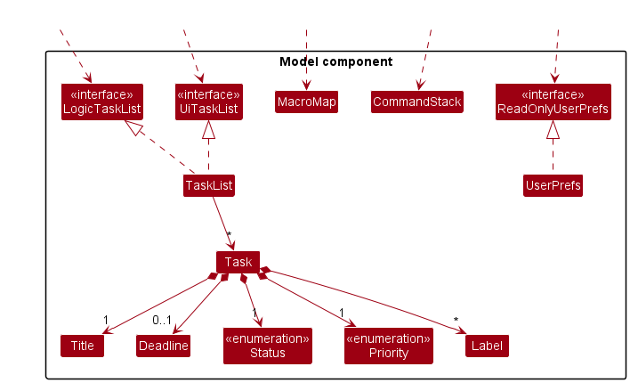
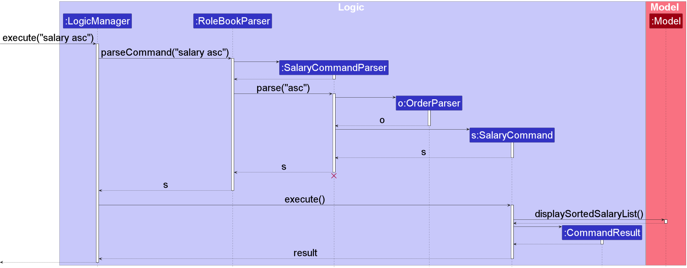
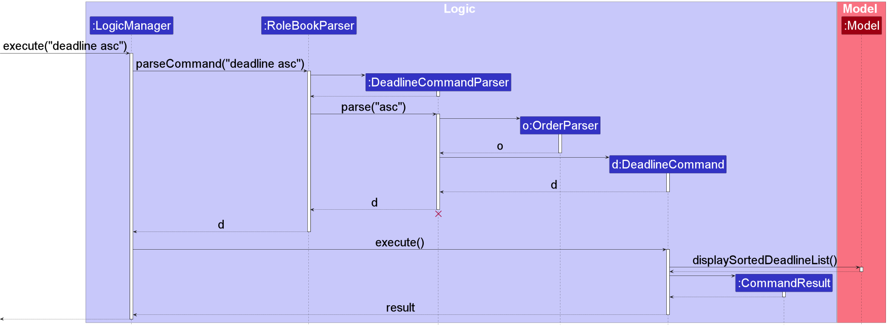
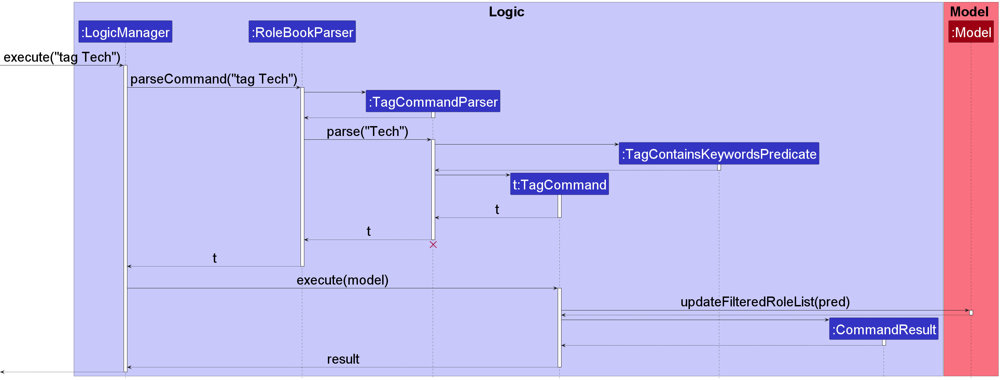
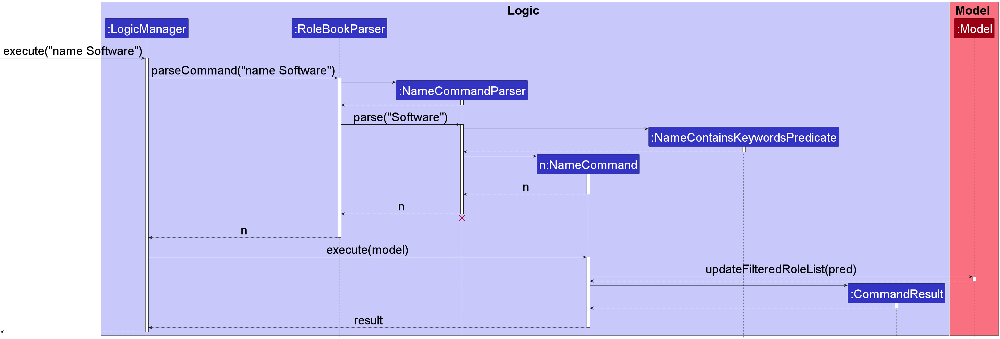

* Table of Contents 
{:toc}

--------------------------------------------------------------------------------------------------------------------
## **Introduction**

{{ site.data.techtrack.about.summary }}

### Technologies

The TechTrack software application is developed using Java 11 and employs JavaFX for constructing its graphical user
interface.
Gradle serves as the project management and build tool. JUnit is utilized for conducting software testing.

--------------------------------------------------------------------------------------------------------------------

## **Acknowledgements**

This project is based on the AddressBook-Level3 project created by the [SE-EDU initiative](https://se-education.org).

Third-party software used in this project:

* [Gradle](https://gradle.org/)
* [CheckStyle](https://checkstyle.sourceforge.io/)
* [Codecov](https://codecov.io/)
* [JavaFx](https://openjfx.io/)
* [JUnit](https://junit.org/)
* [PlantUML](https://plantuml.com/)

Images used:
* Application icon from [PNGEgg](https://www.pngegg.com/en/png-ewtjs)
* Contact icon for `view` command from [icons8](https://icons8.com/icon/104074/contact-us)
* Details icon for `view` command from [icons8](https://icons8.com/icon/set/details/color)

--------------------------------------------------------------------------------------------------------------------

## **Setting up, getting started**

Refer to the guide [_Setting up and getting started_](SettingUp.md).

--------------------------------------------------------------------------------------------------------------------

## **Design**

:bulb: **Tip:** The `.puml` files used to create diagrams in this document can be found in
the [diagrams](https://github.com/AY2223S2-CS2103-W16-2/tp/tree/master/docs/diagrams/) folder. Refer to the [_PlantUML
Tutorial_ at se-edu/guides](https://se-education.org/guides/tutorials/plantUml.html) to learn how to create and edit
diagrams.

### Architecture

The ***Architecture Diagram*** given above explains the high-level design of the App.

Given below is a quick overview of main components and how they interact with each other.

**Main components of the architecture**

**`Main`** has two classes
called [`Main`](https://github.com/AY2223S2-CS2103-W16-2/tp/tree/master/src/main/java/seedu/techtrack/Main.java)
and [`MainApp`](https://github.com/AY2223S2-CS2103-W16-2/tp/tree/master/src/main/java/seedu/techtrack/MainApp.java). It
is responsible for,

* At app launch: Initializes the components in the correct sequence, and connects them up with each other.
* At shut down: Shuts down the components and invokes cleanup methods where necessary.

[**`Commons`**](#common-classes) represents a collection of classes used by multiple other components.

The rest of the App consists of four components.

* [**`UI`**](#ui-component): The UI of the App.
* [**`Logic`**](#logic-component): The command executor.
* [**`Model`**](#model-component): Holds the data of the App in memory.
* [**`Storage`**](#storage-component): Reads data from, and writes data to, the hard disk.

**How the architecture components interact with each other**

The *Sequence Diagram* below shows how the components interact with each other for the scenario where the user issues
the command `delete 1`.

Each of the four main components (also shown in the diagram above),

* defines its *API* in an `interface` with the same name as the Component.
* implements its functionality using a concrete `{Component Name}Manager` class (which follows the corresponding
  API `interface` mentioned in the previous point.

For example, the `Logic` component defines its API in the `Logic.java` interface and implements its functionality using
the `LogicManager.java` class which follows the `Logic` interface. Other components interact with a given component
through its interface rather than the concrete class (reason: to prevent outside component's being coupled to the
implementation of a component), as illustrated in the (partial) class diagram below.

The sections below give more details of each component.

### UI component

The **API** of this component is specified
in [`Ui.java`](https://github.com/AY2223S2-CS2103-W16-2/tp/tree/master/src/main/java/seedu/techtrack/ui/Ui.java)

The UI consists of a `MainWindow` that is made up of parts e.g.`CommandBox`, `ResultDisplay`, `RoleListPanel`
, `StatusBarFooter` etc. All these, including the `MainWindow`, inherit from the abstract `UiPart` class which captures
the commonalities between classes that represent parts of the visible GUI.

The `UI` component uses the JavaFx UI framework. The layout of these UI parts are defined in matching `.fxml` files that
are in the `src/main/resources/view` folder. For example, the layout of
the [`MainWindow`](https://github.com/AY2223S2-CS2103-W16-2/tp/tree/master/src/main/java/seedu/techtrack/ui/MainWindow.java)
is specified
in [`MainWindow.fxml`](https://github.com/AY2223S2-CS2103-W16-2/tp/tree/master/src/main/resources/view/MainWindow.fxml)

The `UI` component,

* executes user commands using the `Logic` component.
* listens for changes to `Model` data so that the UI can be updated with the modified data.
* keeps a reference to the `Logic` component, because the `UI` relies on the `Logic` to execute commands.
* depends on some classes in the `Model` component, as it displays `Role` object residing in the `Model`.

### Logic component

**API** : [`Logic.java`](https://github.com/AY2223S2-CS2103-W16-2/tp/tree/master/src/main/java/seedu/techtrack/logic/Logic.java)

Here's a (partial) class diagram of the `Logic` component:

How the `Logic` component works:

1. When `Logic` is called upon to execute a command, it uses the `RoleBookParser` class to parse the user command.
1. This results in a `Command` object (more precisely, an object of one of its subclasses e.g., `AddCommand`) which is
   executed by the `LogicManager`.
1. The command can communicate with the `Model` when it is executed (e.g. to add a role).
1. The result of the command execution is encapsulated as a `CommandResult` object which is returned from `Logic`.

The Sequence Diagram below illustrates the interactions within the `Logic` component for the `execute("delete 1")` API
call.

:information_source: **Note:** The lifeline for `DeleteCommandParser` should end at the destroy marker (X) but due to a limitation of PlantUML, the lifeline reaches the end of diagram.

Here are the other classes in `Logic` (omitted from the class diagram above) that are used for parsing a user command:

How the parsing works:

* When called upon to parse a user command, the `RoleBookParser` class creates an `XYZCommandParser` (`XYZ` is a
  placeholder for the specific command name e.g., `AddCommandParser`) which uses the other classes shown above to parse
  the user command and create a `XYZCommand` object (e.g., `AddCommand`) which the `RoleBookParser` returns back as
  a `Command` object.
* All `XYZCommandParser` classes (e.g., `AddCommandParser`, `DeleteCommandParser`, ...) inherit from the `Parser`
  interface so that they can be treated similarly where possible e.g, during testing.

### Model component

**API** : [`Model.java`](https://github.com/AY2223S2-CS2103-W16-2/tp/tree/master/src/main/java/seedu/techtrack/model/Model.java)

The `Model` component,

* stores the role book data i.e., all `Role` objects (which are contained in a `UniqueRoleList` object).
* stores the currently 'selected' `Role` objects (e.g., results of a search query) as a separate _filtered_ list which
  is exposed to outsiders as an unmodifiable `ObservableList<Role>` that can be 'observed' e.g. the UI can be bound to
  this list so that the UI automatically updates when the data in the list change.
* stores a `UserPref` object that represents the user’s preferences. This is exposed to the outside as
  a `ReadOnlyUserPref` objects.
* does not depend on any of the other three components (as the `Model` represents data entities of the domain, they
  should make sense on their own without depending on other components)

:information_source: **Note:** An alternative (arguably, a more OOP) model 
is given below. It has a `Tag` list in the `RoleBook`, which `Role` references. This allows `RoleBook` to only require one 
`Tag` object per unique tag, instead of each `Role` needing their own `Tag` objects. 

### Storage component

**API** : [`Storage.java`](https://github.com/AY2223S2-CS2103-W16-2/tp/tree/master/src/main/java/seedu/techtrack/storage/Storage.java)

The `Storage` component,

* can save both role book data and user preference data in json format, and read them back into corresponding
  objects.
* inherits from both `RoleBookStorage` and `UserPrefStorage`, which means it can be treated as either one (if only
  the functionality of only one is needed).
* depends on some classes in the `Model` component (because the `Storage` component's job is to save/retrieve objects
  that belong to the `Model`)

### Common classes

Classes used by multiple components are in the `seedu.RoleBook.commons` package.

--------------------------------------------------------------------------------------------------------------------

## **Implementation**

This section describes some noteworthy details on how certain features are implemented.

### Add Command

The `add` command is used to create a new role in TechTrack and set the necessary fields for that role,
namely they are the: `Name`, `Contact`, `Email`, `Company`, `Job Description`, `Tag`, `Website`, `Salary`, `Deadline`,
`Experience` fields. Note that the `Tag` field is not necessary, while the rest of the fields are necessary for the
command to work.

The format for the `add` command can be
seen [here](https://ay2223s2-cs2103-w16-2.github.io/tp/UserGuide.html#adding-a-role-add).

When `add ...` string is inputted, the UI calls the `LogicManager`. `LogicManager` then calls the `RoleBookParser` to
parse the
input. An instance of the `AddCommandParser` to parse the `args` is created through the respective static
`ParserUtil` functions. In addition, if duplicate parameters are inputted (e.g. `add n/SWE n/Data Analyst`), only the last
instance is taken,
similar to how [`edit`](#edit-command) is executed.

The `AddCommandParser` will then create the corresponding `Role` object, parsing to a `AddCommand` object it
creates and returns. The `LogicManager` then executes the `AddCommand`, which adds the `Role` to the model.

The following sequence diagram shows how the `add` command works:

In this diagram,
* `userInput` represents a valid text representation of an `add` command.
* `toAdd` represents the newly created `Role` object that will be added into the model.

 

The following sequence diagram shows how the argument parsing for the `add` command works:

### Edit Command

The `edit` command is used to change the information of an existing role in TechTrack. The fields supported are:
`Name`, `Contact`, `Email`, `Company`, `JobDescription`,`Tag`, `Website`, `Salary`,
`Deadline` and `Experience`. Note that the `Tag` field can be inputted with multiple tags (`t/java t/python`) while the
rest does not.

The format for the `edit` command can be
seen [here](https://ay2223s2-cs2103-w16-2.github.io/tp/UserGuide.html#editing-a-role-edit).

When `edit INDEX ...` string is inputted, the UI calls the `LogicManager`. `LogicManager` then calls
the `RoleBookParser` to parse the
input. An instance of the `EditCommandParser` to parse the `INDEX` and `args` is created through the respective static
`ParserUtil` functions. In addition, if duplicate parameters are inputted (e.g. `add n/John n/Tom`), only the last
instance is taken,
similar to how [`add`](#add-command) are executed.

The `EditCommandParser` will then create the corresponding `EditRoleDescriptor` object, parsing it to a
`EditCommand` object it creates and returns. The `LogicManager` then executes the `EditCommand`, which creates a
`Role` from the `EditRoleDescriptor` provided and updates the model with this new `Role`.

The following sequence diagram shows how the `edit` command works:

The following sequence diagram shows how the argument parsing for the `edit` command works:

### Delete Command

The `delete` command is used to delete the information of an existing role in TechTrack. The command takes in
an `INDEX` as argument, which corresponds to the role to be deleted. Note that `delete` command uses the
`FilteredRoleList` for deletion, we can therefore delete roles by their index after invoking other commands such as sorting and filtering.

The format for the `delete` command can be
seen [here](https://ay2223s2-cs2103-w16-2.github.io/tp/UserGuide.html#deleting-a-role-edit).

When `delete INDEX` string is inputted, the UI calls the `LogicManager`. `LogicManager` then calls
the `RoleBookParser` to parse the
input. An instance of the `DeleteCommandParser` to parse the `INDEX` is created through the `parseIndex` static
method in `ParserUtil`.

The `RoleBookParser` will instantiate the `DeleteCommandParser` object and call the parse method with `INDEX` as arguments.
The parse method will create and return a new `DeleteCommand`. The `LogicManager` then executes the `DeleteCommand`, which deletes and updates
the `Role` from the `Model` based on the `INDEX`.

The following sequence diagram shows how the `delete` command works:

### Salary and Deadline Command Feature

The `salary` command feature is designed to enable the user to sort roles in TechTrack based on their 
salaries, in either ascending or descending order.

The salary command accepts input in the format `salary ORDER`, where `ORDER` is a string that must be either `asc` or `desc`. 
The purpose of the `ORDER` parameter is to specify whether the sorting of roles based on salary should be in ascending 
or descending order.

When a user enters the command `salary ORDER` in the UI, the `LogicManager` handles the input by calling the `RoleBookParser` 
to parse it. The `RoleBookParser` then creates an instance of the `SalaryCommandParser`, which is responsible for parsing the 
`ORDER` of the command using ParserUtil's `parseOrder` method. If the input format is invalid, a ParseException is thrown.

The `SalaryCommandParser` creates a `SalaryCommand`, which implements the `Command` interface and uses the `Model` 
interface to sort the roles based on salary. Specifically, the `displaySortedSalaryList()` method of the Model interface 
is used to perform the sorting.

The implementation of the deadline command is similar to that of the salary command, except that the command 
keyword is replaced with `deadline`, and the method of the `Model` interface used is `displaySortedDeadlineList()`.
This allows for the sorting of roles based on deadline instead of salary.

The following sequence diagram shows how the `salary` command works:

The following sequence diagram shows how the `deadline` command works:

#### Design considerations:

**Aspect: How `salary` and `deadline` command executes:**

* **Alternative 1 (current choice):** Each attribute of a `Role` has its own specific sorting command (for instance, 
we have both `salary` and `deadline` commands)
    * Pros: Easy to implement.
    * Cons: 
      * More commands would have to be implemented. 
      * The user can only sort roles by one attribute at a time.

* **Alternative 2:** One sort command with the given attribute (for instance, `sort d/ORDER $/ORDER` to sort the
roles in TechTrack by deadline first, then salary with `sort` as the command keyword)
    * Pros: 
      * Only one command, which potentially is easier for the user to use.
      * User is free to customize the sorting of roles in TechTrack. 
    * Cons: Implementation would be more complex.

#### Limitations:

The current implementation of sorting commands would sort the entire `roleList` in the model. This means that if the user
used a filtering command like `name` followed by executing `deadline`, it would appear as if only the filtered `roleList`
is sorted. However, in fact, the entire `roleList` is sorted.

### Company Command Feature

The proposed Company Command feature allows the user to filter companies based on a given keyword. This enables the
user to filter the role list by company which shows all roles pertaining to a certain company.

Given below is an example usage of how CompanyCommand and its dependencies is being used in the following steps.

1. The user launches TechTrack, and initializes its role book from preexisting data files.

2. The user can choose to use the `Company Command` to filter companies.
    - The user executes `company {keyword}` command to filter roles with the given company name in the form of `keyword`.

3. When `company {keyword}` is inputted, the UI calls the `LogicManager` which then calls the `RoleBookParser` to parse the
   input. This then creates an instance of the `CompanyCommandParser` to parse the keyword.

4. Invoking the parse method
   of `CompanyCommandParser` creates a `CompanyContainsKeywordsPredicate` object that implements the `predicate<Role>` interface.
   `CompanyContainsKeywordsPredicate` is used to check if any of the company field of the rolelist contains the keyword.
   If any of the inputs formats are invalid, a `ParseException` will be thrown.

4. The `CompanyCommandParser` then creates a `CompanyCommand` which uses `Model` interface's `Model#updateFilteredRoleList()`
   to filter the roles based on the `predicate`, which in this case is the keyword.

5. `LogicManager` executes the returned `CompanyCommand` and updates the filtered role list in `Model`. Subsequently, the `CommandResult`
   is returned.

The following sequence diagram shows how the `company` command works:

#### Design considerations:

**Aspect: How Company Command executes:**

* **Alternative 1 (current choice):** Filter roles that contain the keyword in the company field.
    * Pros: Easy to implement.
    * Cons: More CLI arguments need to be added if more attributes are needed to filter the list.

* **Alternative 2 (alternative choice):** Filter roles by extending a generic find command.
    * Pros: Less confusing for the user, as all filtering will be done using a single command. e.g. find c/Google
    * Cons: Harder to implement, and the addition of multiple parameters may be confusing too.

#### Limitations:

The `keyword` used to filter the roles in the Company Command must contain at least one non-space character and filtering
is not case-sensitive.

E.g.: `company Google` is equivalent to `company google`

### Tag Command Feature

The TagCommand feature allows the user to filter tags based on a given keyword. The idea is that the
user can filter the role list by tag which shows all roles pertaining to a certain tag.

The TagCommand follows a similar structure as [`CompanyCommand`](#company-command-feature). Replace `company` with `tag`
in [`CompanyCommand`](#company-command-feature) for how TagCommand functions.

The following sequence diagram shows how the `tag` command works:

#### Design considerations:

**Aspect: How Tag Command executes:**

* **Alternative 1 (current choice):** Filter roles that contain the keyword in the tag field.
    * Pros: Easy to implement.
    * Cons: More CLI needs to be added if more attributes are needed to sort.

### Name Command Feature

The proposed NameCommand feature allows the user to filter names based on a given keyword. The idea is that the
user can filter the role list by name which shows all roles pertaining to a certain name.

The feature uses operations in the `Model` interface as `Model#updateFilteredRoleList()`.

The NameCommand follows a similar structure as [`CompanyCommand`](#company-command-feature). Replace `company` with `name`
in [`CompanyCommand`](#company-command-feature) for how NameCommand functions.

The following sequence diagram shows how the `name` command works:

#### Design considerations:

**Aspect: How Name Command executes:**

* **Alternative 1 (current choice):** Filter roles that contain the keyword in the name field.
    * Pros: Easy to implement.
    * Cons: More CLI needs to be added if more attributes are needed to sort.

### View Command Feature

The `view` command allows the user to view more details about a specific role. We decided to hide
less important details regarding a role, and only show certain important details like Name, Company, Salary, Deadline,
and experience in the list of role cards on the UI. The user can then use the `view` command to view all details of
a role.

The view command does not affect the role book in any way. In other words, it does not add/edit/delete
any roles in the role book.

An example usage of the `View` command is given below:

1. The user launches the application for the first time. The RoleBook will be initialized with the current role book.
2. The user can use the `view` command to show more details pertaining to a role.
    - The user executes `view 1` to view details regarding the first role.

The following sequence diagram shows how the `view` command works:

#### Design considerations:

**Aspect: How the `view` command executes:**

Use `ResultDisplay` as a placeholder, changing the children node of `ResultDisplay`based on the `CommandResult` given 
(in this case, the `view` command should make `ResultDisplay` render a custom display). To do so, we can change
[`CommandResult.java`](https://github.com/AY2223S2-CS2103-W16-2/tp/blob/master/src/main/java/seedu/techtrack/logic/commands/CommandResult.java)
to be a generic class that stores an object `T`. Then, we can modify the `executeCommand` method
in [`MainWindow.java`](https://github.com/AY2223S2-CS2103-W16-2/tp/blob/master/src/main/java/seedu/techtrack/ui/MainWindow.java)
to show different displays based on the object `T`. For instance, if the object `T` is a `String`, we render the
output as per normal. However, if the object `T` is a `Role`, we can render a custom display instead.
* Pros: Provides an easy and extendable way to create custom views
* Cons: Need to refactor some UI code and `CommandResult.java` class

### UI Enhancement

TechTrack's UI components are highlighted below:

The main window comprises three key components: namely the Command Input Box located at the bottom half,
the Role List Box on the left half, and the Result Display Box on the right half. The Command Input Box provides users
with a text field to input their commands, and it remains unchanged every time it is rendered. The Role List Box displays
a list of roles, which may differ in number, but it is rendered using JavaFX's `ListView` component. Thus, executing a
command allows for straightforward updates to these two components.

This is not the case for Result Display Box, as we might potentially need to render different types of displays
based on the command given. Hence, the original Result Display box, which was simply a `TextArea` JavaFX object,
was refactored to support custom displays.

#### What was refactored

The [`ResultDisplay`](https://github.com/AY2223S2-CS2103-W16-2/tp/blob/master/src/main/java/seedu/techtrack/ui/ResultDisplay.java)
component was changed from a `TextArea` object to a `VBox` object. Both of these are JavaFX `Node` objects. A method
named `place` was created, which takes in a JavaFX `node` object, clears all children nodes in the `ResultDisplay` and
places the new `node` in the `VBox`. This allows us to update the `ResultDisplay` to support custom displays based on
the command provided.

As mentioned above in the [View Command Section](#view-command-feature), the `CommandResult` class was also updated to be generic.
This allows `MainWindow.java` to get different types of output based on the object `T` of `CommandResult`. This diagram
illustrates how the `MainWindow.java` file determines the type of display rendered:

#### Types of Displays

| Class Name                                                                                                                                   | Description      | Commands Using This View   |
|----------------------------------------------------------------------------------------------------------------------------------------------|------------------|----------------------------|
| [`StringDisplay.java`](https://github.com/AY2223S2-CS2103-W16-2/tp/blob/master/src/main/java/seedu/techtrack/ui/displays/StringDisplay.java) | Renders a String | All commands except `view` |
| [`RoleDisplay.java`](https://github.com/AY2223S2-CS2103-W16-2/tp/blob/master/src/main/java/seedu/techtrack/ui/displays/RoleDisplay.java)     | Renders a Role   | Only the `view` command    |

#### Possible Future Enhancements

1. The render logic to determine which display to render is written in the `execute` method of `MainWindow.java`.
It could be abstracted out to a new class, named `DisplayManager` for instance, which handles which display to place
under `ResultDisplay`.
2. The current way of determining which display to render is not very extendible, since we're using the type `T` from `CommandResult`
to determine that through consecutive `instanceof` statements. One enhancement we could make is (in addition to point 1),
using a common interface to implement the required operations through dynamic binding. One possible way to do
this is shown below in the form of a class diagram:

--------------------------------------------------------------------------------------------------------------------

## **Documentation, logging, testing, configuration, dev-ops**

* [Documentation guide](Documentation.md)
* [Testing guide](Testing.md)
* [Logging guide](Logging.md)
* [Configuration guide](Configuration.md)
* [DevOps guide](DevOps.md)

--------------------------------------------------------------------------------------------------------------------

## **Requirements**

### Product Scope

**Target user profile**:

* The user needs to keep track of multiple job/internship applications from various job sites
* Prefers desktop applications
* Is familiar with CLI and can type fast
* Prefers typing rather than using the mouse

**Value Proposition**: TechTrack offers a centralized platform that enables users to efficiently manage (add, delete, edit) 
and search for their desired jobs and internships through both a command line interface with a graphical user interface (GUI). 
This platform serves as a one-stop-shop for all aspects of the job search process, allowing users to keep track of their 
job applications, deadlines, and status updates in one convenient location.

### User stories

Priorities: High (must have) - `* * *`, Medium (nice to have) - `* *`, Low (unlikely to have) - `*`

| Priority | As a… | I want to…                           | So that I can…                                                        |
|----------|-------|--------------------------------------|-----------------------------------------------------------------------|
| ***      | user  | add contacts for roles               | save these contacts to the corresponding role and send my application |
| ***      | user  | add salary for roles                 | compare the salaries of my roles                                      |
| ***      | user  | add website for roles                | visit the websites of the companies for more information              |
| ***      | user  | add deadline for roles               | understand when I need to apply the roles                             |
| ***      | user  | add job description for roles        | find out more about the role before applying for the role             |
| ***      | user  | add experience                       | convince my employer about my merits                                  |
| ***      | user  | add a role to the program            | save all roles that I'm interested in applying for                    |
| ***      | user  | view all the roles that I have added | view all the roles that I'm interested in                             |
| ***      | user  | delete company role                  | remove roles that might not interest me anymore                       |
| ***      | user  | save data                            | view my roles opportunities even after the application is closed      |
| **       | user  | find by tags                         | filter by certain skills or notes of the role                         |
| **       | user  | find by roles                        | find relevant companies and their respective roles                    |
| **       | user  | sort by salary                       | know which roles have a higher starting salary                        |
| **       | user  | sort by deadline                     | know which roles have the most urgent deadlines                       |
| **       | user  | use the UI with ease                 | perform operations easier                                             |

### Use cases

(For all use cases below, the System is the TechTrack and the Actor is the user, unless specified otherwise)

**Use case: UC1 - Running TechTrack  **
**Actor: User  **
**MSS:**

1. User opens the program
2. TechTrack shows the list of roles and the list of available commands. 
   Step 2 is repeated until another command is entered.
   Use case ends.

**Extensions**

* 1a. Invalid data detected in the json file.
    * 1a1. TechTrack clears that role.

      Use case resumes at step 2.

**Use case: UC2 - Add a role  **
**Actor: User  **
**MSS:**

1. TechTrack is running (UC1).
2. User enters "add" with the required parameters to add a role.
3. TechTrack displays success message and the resulting list of roles. 
   Use case ends.

**Extensions**

* 2a. Duplicate role detected.
    * 2a1. TechTrack outputs error message for duplicate roles.

      Use case ends.
* 2b. Invalid data detected.
    * 2b1. TechTrack outputs error message for invalid data.

      Use case ends.

**Use case: UC3 - Edit a role  **
**Actor: User  **
**Preconditions: At least 1 role is added in TechTrack  **
**MSS:**

1. TechTrack is running (UC1).
2. User enters "edit" followed by an index to edit the role.
3. TechTrack updates the corresponding role and displays the new role list. 
   Use case ends.

**Extensions**

* 2a. Index does not exist.
    * 2a1. TechTrack outputs an error message for invalid index.

      Use case ends.

* 2b. Invalid data detected.
    * 2b1. TechTrack outputs an error message for invalid data.

      Use case ends.

**Use case: UC4 - View a role **
**Actor: User  **
**Preconditions: At least 1 role is added in TechTrack  **
**MSS:**

1. TechTrack is running (UC1).
2. User enters the “view {index}” command.
3. UI displays more specific details on the roles saved based on the index. 
   Use case ends.

**Extensions:**

* 2a. Index entered is invalid.
    * 2a1. TechTrack outputs error message.

      Use case ends.

**Use case: UC5 - Delete a role **
**Actor: User  **
**Preconditions: At least 1 role is added in TechTrack  **
**MSS:**

1. TechTrack is running (UC1).
2. User enters the “delete {role ID}” to delete the roles.
3. UI will respond with the selected roles being deleted. 
   Use case ends.

**Extensions**

* 2a. The given index is invalid.
    * 2a1. TechTrack shows an error message.

      Use case ends.

**Use case: UC6 - Sorting a role by salary **
**Actor: User  **
**Preconditions: At least 1 role is added in TechTrack  **
**MSS:**

1. TechTrack is running (UC1)
2. User enters the “salary {asc/desc}"
3. UI display the list of roles sorted by salaries in either ascending or descending order. 
   Use case ends.

**Extensions**
* 3a. The given second command is invalid e.g "ascending".
    * 3a1. TechTrack shows an error message.

      Use case ends.

**Use case: UC7 - Sorting a role by deadline **
**Actor: User  **
**Preconditions: At least 1 role is added in TechTrack  **
**MSS:**

* MSS is similar to sorting salaries. Replace `salary` in the previous MSS with `deadline` for the MSS of the deadline
  command.

**Use case: UC8 - Finding a role by Company name **
**Actor: User  **
**Preconditions: At least 1 role is added in TechTrack  **
**MSS:**

1. TechTrack is running (UC1).
2. User enters the "company {keyword}" command.
3. UI display the list of roles with companies that contains the keyword. 
   Use case ends.

**Extensions**
* 2a. the keyword entered is empty.
    * 2a1. TechTrack shows an error message. 
      Use case ends.

**Use case: UC9 - Finding a role by Tags **
**Actor: User  **
**Preconditions: At least 1 role is added in TechTrack  **
**MSS:**
* MSS is similar to the company command. Replace `company` in the previous MSS with `tag` for the MSS of the tag
  command.

### Non-Functional Requirements

1. Should work on any mainstream OS as long as it has Java 11 or above installed.
2. Should be able to hold up to 1000 roles without a noticeable sluggishness in performance for typical usage.
3. A user with above average typing speed for regular English text (i.e. not code, not system admin commands) should be
   able to accomplish most of the tasks faster using commands than using the mouse.
4. The CLI should be easy to use, with intuitive commands and clear error messages.
5. The CLI should be reliable and stable, with no crashes or data corruption unless a user corrupts the data file.
6. The Program and Data stored should be functional to users with other OSes and versions of the application.
7. The application should load up within 3-5 seconds.
8. Users must be able to access the application without an internet connection.
9. A user should be able to use the app after reading the help instructions.
10. A user must be able to view at least 3 roles with minimal scrolling.

--------------------------------------------------------------------------------------------------------------------

## **Instructions for manual testing**

Given below are instructions to test the app manually.

:information_source: **Note:** These instructions only provide a starting point for testers to work on;
testers are expected to do more *exploratory* testing.

Ui components for reference:

### Launch and shutdown

Initial launch on a fresh installation

1. Download the jar file and copy into an empty folder

2. Double-click the jar file Expected: Shows the GUI with a set of sample contacts.

3. Move the application window to a different location. Close the window.

5. Re-launch the app by double-clicking the jar file. 
   Expected: The most recent window location is retained.

### Adding a Role

1. Test case (adding a role): `add n/Software Engineer c/98765432 e/google@example.com coy/Google t/Java t/Golang w/www.google.com jd/Data Engineering team - penultimate students preferred $/4000 d/2023-10-20 x/Javascript - 1 Year`

Expected Output in the Result Display Box: Details of the role added will be displayed.

Expected Output in the Role List Box: Role is added to the bottom of the Role List Box. Name, company, tags, salary, deadline, experience required are shown.
The rest of roles in the list remains unchanged.

2. Test case (missing parameter): `add n/Software Engineer e/google@example.com coy/Google t/Java t/Golang w/www.google.com jd/Data Engineering team - penultimate students preferred $/4000 d/2023-10-20 x/Javascript - 1 Year`

Expected Output in the Result Display Box: Error message displayed. Details on how to properly use the `add` command is included.

Expected Output in the Role List Box: No changes to the role list.

3. Test case (missing optional `tag`): `add n/Software Engineer c/98765432 e/google@example.com coy/Google w/www.google.com jd/Data Engineering team - penultimate students preferred $/4000 d/2023-10-20 x/Javascript - 1 Year`

Expected Output in the Result Display Box: Same as test 1.

Expected Output in the Role List Box: Same as test 1.

4. Other incorrect delete commands to try: `add`, `add 1`, `...` 

Expected Output in the Result Display Box: Same as test 2.

Expected Output in the Role List Box: Same as test 2.
   

### Editing a Role

**Prerequisites:** There is at least 1 role in the Role List Box.

1. Test case: `edit 1` 

Expected Output in the Result Display Box: Updated details of the role added will be displayed.

Expected Output in the Role List Box: Name of the first role on the list changes to `Software Developer`.

2. Test case: `edit 0` 

Expected Output in the Result Display Box: Error message displayed. Details on how to properly use the `edit` command is included.

Expected Output in the Role List Box: No changes.

3. Test case: `edit 1` 

Expected Output in the Result Display Box: Same as test 2.

Expected Output in the Role List Box: Same as test 2.
   
4. Other incorrect delete commands to try: `edit n/`, `edit -1`, `...` 

Expected Output in the Result Display Box: Same as test 2.

Expected Output in the Role List Box: Same as test 2.

### Deleting a Role

**Prerequisites:** There is at least 1 role in the Role List Box.

1. Test case: `delete 1` 

Expected Output in the Result Display Box: Details of the deleted role will be displayed.

Expected Output in the Role List Box: First role is deleted from the list.

2. Test case: `delete 0` 

Expected Output in the Result Display Box: Error message displayed. Details on how to properly use the `delete` command is included.

Expected Output in the Role List Box: No changes.

3. Other incorrect delete commands to try: `delete`, `delete x`, `...` (where x is larger than the list size) 

Expected Output in the Result Display Box: Same as test 2.

Expected Output in the Role List Box: Same as test 2.

### Finding by Name

**Prerequisites:** There are at least 2 roles in the Role List Box - one must have its name as `Software Developer`, 
and the other must have its name as `Data Analyst`.

2. Test case: `name analyst software` 

Expected Output in the Result Display Box: Display the number of roles found.

Expected Output in the Role List Box: Only display roles that has either `analyst` or `software` in its name.

3. Test case: `name software` 

Expected Output in the Result Display Box: Display the number of roles found.

Expected Output in the Role List Box: Only display roles that has `software` in its name.

5. Test case: `name` 

Expected Output in the Result Display Box: Error message displayed. Details on how to properly use the `name` command is included.

Expected Output in the Role List Box: No changes.

### Finding by Company

**Prerequisites:** There are at least 2 roles in the Role List Box - one must have its company as `Tampines Street`,
and the other must have its company as `Mega Soft`.

2. Test case: `company tampines soft` 

Expected Output in the Result Display Box: Display the number of roles found.

Expected Output in the Role List Box: Only display roles that has either `tampines` or `soft` in its company.

3. Test case: `company tampines` 

Expected Output in the Result Display Box: Display the number of roles found.

Expected Output in the Role List Box: Only display roles that has `tampines` in its company.

5. Test case: `company` 

Expected Output in the Result Display Box: Error message displayed. Details on how to properly use the `company` command is included.

Expected Output in the Role List Box: No changes.

### Finding by tags

**Prerequisites:** There are at least 2 roles in the Role List Box - one must have one of its tags as `Applied`,
and the other must have one of its tags as `Offered`.

2. Test case: `tag applied offered` 

Expected Output in the Result Display Box: Display the number of roles found.

Expected Output in the Role List Box: Only display roles that has either `applied` or `offered` in its company.

3. Test case: `tag applied` 

Expected Output in the Result Display Box: Display the number of roles found.

Expected Output in the Role List Box: Only display roles that has `applied` in its company.

5. Test case: `tag` 

Expected Output in the Result Display Box: Error message displayed. Details on how to properly use the `tag` command is included.

Expected Output in the Role List Box: No changes.

### Sort roles by salary

**Prerequisite:** There is more than 1 role stored in TechTrack with different salaries.

1. Test case: `salary asc`  

Expected Output in the Result Display Box: Displays a success message.

Expected Output in the Role List Box: Roles are now sorted according to their salary, in ascending order.

2. Test case: `salary desc`  

3. Expected Output in the Result Display Box: Displays a success message.

Expected Output in the Role List Box: Roles are now sorted according to their salary, in descending order.

### Sort roles by deadline

Similar to the manual testing of [sort roles by salary section](#sort-roles-by-salary). Replace `salary` with `deadline`
in the given commands. The roles in the Role List Box would then be sorted according to `salary` instead.

### View the information of a Role

**Prerequisite:** There is at least 1 role in the Role List Box.

1. Test Case: `view 1`  

Expected Output in the Result Display Box: Display information regarding the first role, including: name, company, 
salary, deadline, experience, job description, email, contact and website.

Expected Output in the Role List Box: No changes.

2. Test Case: `view 0`  

Expected Output in the Result Display Box: Error message displayed. Details on how to properly use the `view` command is included.

Expected Output in the Role List Box: No changes.

### Clear

1. Test Case: `clear`

Expected Output in the Result Display Box: Success message for the `clear` command is displayed.

Expected Output in the Role List Box: All roles are deleted.

### List

1. Test Case: `list`

Expected Output in the Result Display Box: Success message for the `list` command is displayed.

Expected Output in the Role List Box: All current existing roles of TechTrack are displayed.

### Help

1. Test Case: `help`

Expected Output: Help window pops out.

Expected Output in the Result Display Box: Success message for the `help` command is displayed.

2. Test Case: `help 123`

Expected Output: Help window pops out.

Expected Output in the Result Display Box: Success message for the `help` command is displayed.

### Exit

1. Test Case: `exit`

Expected Output: TechTrack closes.

--------------------------------------------------------------------------------------------------------------------

## **Planned enhancements for Feature Flaws**

The team is unable to add the following features due to the v1.4 feature freeze. Therefore, these issues are labelled as
feature flaws, therefore the team will not be addressing these flaws for now.

### Implementing support for more websites

1. Currently, only websites of the format www.hostname.com are supported. Thus, users are not able to fill in websites
   that do not end with .com like www.who.int which is not ideal. More domains should be added in order to support more
   websites.
   We have thought of one approach to this fix:
   * Letting the website format be `[any char].[any char]`
       * Pros: Can cover a wide variety of domain types like `nus.edu.sg`, `iras.gov.sg`
       * Cons: Could let the user input invalid websites like `hello.world`, `dasdasda.dsadasda`

### Changing command parameter for salary

1. Unnecessarily complicated (or hard-to-type) command formats can be considered a `type.FeatureFlaw` as it is expected
that the input formats will be optimized to get things done fast. Some examples include: using hard-to-type special
characters such as `$/` in the format when it is possible to avoid them.
Changing the prefix of our `salary` attribute from `$/` to `s/` would be more ideal for the user.

### Displaying very long description and numbers

1. Refer to Issue #200. The numbers and description are appended with "..." at the end if they are longer than the
screen size. We believe that the `view` command is a way for users to view truncated texts for now. In the future, we
would either implement character limits to the attributes of a `role` or text wrapping in the `RoleCard` of the UI.
2. This also affects the `view` command, as 
[`RoleDisplay.java`](https://github.com/AY2223S2-CS2103-W16-2/tp/blob/master/src/main/java/seedu/techtrack/ui/displays/RoleDisplay.java)
is not written to handle extremely long texts. Although the attributes of each role would be visible, it is not ideal
for the user. This can be fixed through proper encapsulation of the `Name` and `Company` properties in a `HBox`
object, and setting proper widths for each property.

### Display error messages when storage data is incorrectly modified

1. Refer to Issue #216. Whenever the storage data is incorrectly modified, there is no error messages displayed.
Instead, all existing data is deleted and there is no roles listed. Error messages should be displayed when storage
data is incorrectly modified. This could be done through editing the `initModelManager` function in the
[`MainApp.java`](https://github.com/AY2223S2-CS2103-W16-2/tp/blob/master/src/main/java/seedu/techtrack/MainApp.java)
file. Then, we add a variable to `MainApp.java` to keep track of the message. This could then be passed to the
[`UiManager.java`](https://github.com/AY2223S2-CS2103-W16-2/tp/blob/master/src/main/java/seedu/techtrack/ui/UiManager.java)
class and subsequently, the
[`MainWindow.java`](https://github.com/AY2223S2-CS2103-W16-2/tp/blob/master/src/main/java/seedu/techtrack/ui/MainWindow.java)
class to render the message on startup.

--------------------------------------------------------------------------------------------------------------------

## **Won't Fix / Out of Scope**

### Issue #205 Sort Command not recognised

1. Unable to replicate issue due to lack of information from the bug report.

### Issue #179 salary asc command does nothing

1. Unable to replicate issue due to lack of information from the bug report.

--------------------------------------------------------------------------------------------------------------------

## **Effort**

### Refactoring

* Having to understand the large codebase of AB3.

* Revamping the `Person` model into the `Role` model to better suit the business logic of TechTrack, 
while adding various fields like:
  * `company` (refactored from `address`)
  * `contact` (refactored from `phone`)
  * `website`
  * `deadline`
  * `job description`
  * `salary`
  * `experience`

### Implementation
We added various new commands like:
* Sorting:
  * `salary`
  * `deadline`
* Filtering/finding/searching:
  * `name` (refactored from `find`)
  * `company`
  * `tag`

### Revamping of UI

| Old UI                                                                       | New UI                                                          |  
|------------------------------------------------------------------------------|-----------------------------------------------------------------|
|  |  |

* Edited `HelpWindow` to include a list of all commands, and updated links to point to this user guide.

--------------------------------------------------------------------------------------------------------------------

## **Glossary**

* **Mainstream OS**: Windows, Linux, Unix, OS-X
* **Role**: Refers to internships or full-time jobs
* **Attribute**: Refers to the parameters a role can have
