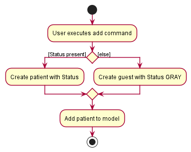
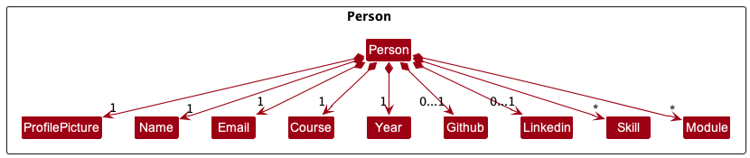
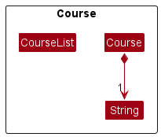
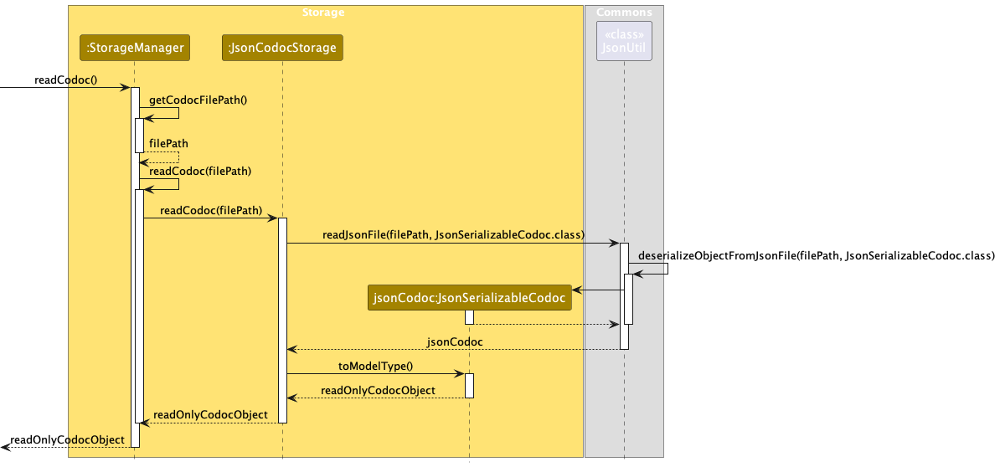

## Table of Contents
- [Acknowledgements](#acknowledgements)
- [Introduction](#introduction)
  - [Intended Audience](#intended-audience)
  - [Target Audience](#target-audience)
  - [Navigating the Developer Guide](#navigating-the-developer-guide)
  - [Glossary](#glossary)
- [Setting up](#setting-up-getting-started)
- [Design Architecture](#design-architecture)
  - [Common Component](#commons-component)
  - [UI Component](#ui-component)
  - [Logic Component](#logic-component)
  - [Model Component](#model-component)
  - [Storage Component](#storage-component)
- [Implementation](#implementation)
  - [UI](#ui-implementation)
    - [Main Section](#main-section)
    - [Info Panel](#info-panel)
    - [Theme](#theme)
  - [Logic](#logic-implementation)
    - [Add Command](#add-command)
    - [Edit Command](#edit-command)
    - [Find Command](#find-command)
  - [Model](#model-implementation)
    - [Person Class](#person-class)
    - [Module Class](#module-class)
    - [Course and CourseList Class](#course-and-courselist-class)
  - [Storage](#storage-implementation)
    - [Saving Data](#saving-data)
    - [Retrieving Data](#retrieving-data)
- [Viable Enhancement](#viable-enhancement)
  - [Undo and Redo Feature](#proposed-undo-and-redo-feature)
  - [Data Archiving](#proposed-data-archiving)
- [Documentation, logging, testing, configuration, dev-ops](#documentation-logging-testing-configuration-dev-ops)
- [Appendix: Planned Enhancements](#appendix-planned-enhancements)
- [Appendix: Requirements](#appendix-requirements)
  - [Product Scope](#product-scope-)
  - [User Stories](#user-stories-)
  - [Use Cases](#use-cases)
  - [Non-functional Requirements](#non-functional-requirements)
- [Appendix: Instructions for Manual Testing](#appendix-instructions-for-manual-testing)

--------------------------------------------------------------------------------------------------------------------
## **Acknowledgements**

* {list here sources of all reused/adapted ideas, code, documentation, and third-party libraries -- include links to the original source as well}

[Scroll back to top](#table-of-contents)

--------------------------------------------------------------------------------------------------------------------

## **Introduction**

### Intended Audience
The goal of this Developer Guide is to document and illustrate the underlying architecture of CoDoc, and provide
insights on how our product is designed, implemented and tested as well as the design considerations that were involved
in the deciding the implementation of various features offered by CoDoc.

You are recommended to read the [Navigating the Developer Guide](#navigating-the-developer-guide) and [Glossary](#glossary)
sections, which will provide the necessary information to allow you to familiarise yourself with the structure of this
Developer Guide and help you navigate it with ease.

[Scroll back to top](#table-of-contents)

### Target Audience
CoDoc is **designed for NUS students** by providing a centralised platform for them to keep track
of their friends' contact information, modules and skills. CoDoc is **optimised for use via a Command Line Interface** (CLI)
while still having the benefits of a **Graphical User Interface** (GUI).

For students who are fast typers, CoDoc is an excellent platform for you to find and identify your friends with certain capabilities and experience,
so you can spend less time searching through chats, and spend more time making
meaningful connections and engaging in productive work.

[Scroll back to top](#table-of-contents)

### Navigating the Developer Guide

The Developer Guide is divided into the following sections :
- [Design Architecture](#design-architecture)
- [Implementation](#implementation)
- [Documentation, logging, testing, configuration, dev-ops](#documentation-logging-testing-configuration-dev-ops)
- [Appendix: Requirements](#appendix-requirements)
- [Appendix: Instructions for Manual Testing](#appendix-instructions-for-manual-testing)

The [Design Architecture](#design-architecture) section gives an overview of the architecture of CoDoc.
In this section, you will be provided with:

1. The API (Application Programming Interface) of the major components of CoDoc.
2. A Class Diagram to illustrate the internals of each component.
3. An explanation of how each component works.
4. A Sequence Diagram to give an example of the flow of events within the component where applicable.

The [Implementation](#implementation) section outlines how the features offered by CoDoc are
implemented. In this section, you will be provided with:

1. A description of the feature.
2. Some example commands to execute to use the feature.
3. A Class Diagram or screenshot to illustrate and explain the implementation of each feature where applicable.
4. A Sequence Diagram to give an example of the implementation flow of the feature where applicable.
5. An Activity Diagram to show all possible behaviours of the feature where applicable.
6. An Object Diagram to model relationships between objects of the same components where applicable.
7. Design considerations and alternatives taken into consideration that justifies our implementation of the feature.

The [Documentation, logging, testing, configuration, dev-ops](#documentation-logging-testing-configuration-dev-ops) section
provides the links to the aforementioned documents. In this section, you will be provided with the links to:

1. Documentation guide.
2. Testing guide.
3. Logging guide.
4. Configuration guide.
5. DevOps guide.

The [Appendix: Requirements](#appendix-requirements) section provides details on the motivation behind creating CoDoc
and how we intend for users to use CoDoc.
In this section, you will be provided with
1. Product Scope.
2. User Stories.
3. Use Cases.
4. Non-functional requirements.

The [Appendix: Instructions for Manual Testing](#appendix-instructions-for-manual-testing) section gives detailed instructions
on how you can perform testing on the features in CoDoc. In this section, you will be provided with:
1. An overview of the command to execute to test the feature.
2. Sample test cases to be executed.
3. The expected behaviour of the test command.

You can jump into the various sections from the Table of Contents to view different sections of the Developer Guide, and
click on [Scroll back to top](#table-of-contents), which can be found at the end of every section, to access the Table
of Contents to quickly jump to another section.

We would recommend you to read the [Glossary](#glossary) section next.

[Scroll back to top](#table-of-contents)

### Glossary

The glossary illustrated in the table below will help you understand the terminologies used in this
Developer Guide.

<table>
  <tr>
    <th><strong>Terminology</strong></th>
    <th><strong>Meaning / Purpose</strong></th>
  </tr>
  <tr>
    <td><strong>Command Line Interface (CLI)</strong></td>
    <td>
      A text-based interface that is used to operate software (such as CoDoc) and operating systems. CLI
      allows a user to perform tasks by entering commands.  
      Users enter the specific command, press “Enter”, and then wait for a response.
      After receiving the command, the CLI processes it accordingly and shows the output/result on the screen.
    </td>
  </tr>
  <tr>
    <td><strong>Graphical User Interface (GUI)</strong></td>
    <td>
      A system of interactive visual components for computer software. A GUI displays objects that convey information,
      and represent actions that can be taken by the user. The objects change color, size, or visibility when the user
      interacts with them.
    </td>
  </tr>
  <tr>
    <td><strong>Application Programming Interface (API)</strong></td>
    <td>
      A set of definitions and protocols for building and integrating application software and simplifies how
      developers integrate new application components into an existing architecture.
    </td>
  </tr>
  <tr>
    <td><strong>Mainstream OS</strong></td>
    <td>
      Windows, Linux, Unix, OS-X.
    </td>
  </tr>
  <tr>
    <td><strong>Architecture</strong></td>
    <td>
      Shows the overall organization of the system and can be viewed as a very high-level design.
      Consists of a set of interacting components that fit together to achieve the required functionality . It is a
      simple and technically viable structure that is well-understood and agreed-upon by everyone in the development
      team, and it forms the basis for the implementation..
    </td>
  </tr>
  <tr>
    <td><strong>Class Diagram</strong></td>
    <td>
      Describe the structure but not the behavior of an Object-Oriented Programming (OOP) solution.
    </td>
  </tr>
  <tr>
    <td><strong>Object-Oriented Programming (OOP)</strong></td>
    <td>
      A computer programming model that organizes software design around data, or objects, rather than functions and logic.
      An object can be defined as a data field that has unique attributes and behavior.
    </td>
  </tr>
  <tr>
    <td><strong>Sequence Diagram</strong></td>
    <td>
      Captures the interactions between multiple objects for a given scenario.
    </td>
  </tr>
  <tr>
    <td><strong>Activity Diagram</strong></td>
    <td>
      Models workflows, which define the flow in which a process or a set of tasks is executed.
    </td>
  </tr>
  <tr>
    <td><strong>Object Diagram</strong></td>
    <td>
      Used to complement class diagrams. Object diagrams can be used to model different object
      structures that can result from a design represented by a given class diagram.
    </td>
  </tr>
  <tr>
    <td><strong>User Stories</strong></td>
    <td>
       Short, simple descriptions of a feature told from the perspective of the person who desires the new capability,
       usually a user or customer of the system.
    </td>
  </tr>
  <tr>
    <td><strong>Use Case</strong></td>
    <td>
      Describes an interaction between the user and the system for a specific functionality of the system.
    </td>
  </tr>
</table>

[Scroll back to top](#table-of-contents)

--------------------------------------------------------------------------------------------------------------------

## **Setting up, getting started**

Refer to the guide [_Setting up and getting started_](SettingUp.md).
 
 

[Scroll back to top](#table-of-contents)

--------------------------------------------------------------------------------------------------------------------

## **Design Architecture**

:bulb: **Tip:** The `.puml` files used to create diagrams in this document can be found in the [diagrams](https://github.com/AY2223S2-CS2103T-F12-2/tp/tree/master/docs/diagrams/) folder. Refer to the [_PlantUML Tutorial_ at se-edu/guides](https://se-education.org/guides/tutorials/plantUml.html) to learn how to create and edit diagrams.

The ***Architecture Diagram*** given above explains the high-level design of the App.

Given below is a quick overview of each component and how they interact with each other.

**Components of the architecture**

* **`Main`**: has two classes called `Main` and `MainApp` which are responsible for,
  * At app launch: Initializes the components in the correct sequence, and connects them up with each other.
  * At shut down: Shuts down the components and invokes cleanup methods where necessary.
* [**`Commons`**](#commons-component): represents a collection of classes used by multiple other components.
* [**`UI`**](#ui-component): The UI of the App.
* [**`Logic`**](#logic-component): The command executor.
* [**`Model`**](#model-component): Holds the data of the App in memory.
* [**`Storage`**](#storage-component): Reads data from, and writes data to, the hard disk.

**How the core architecture components interact with each other**

The *Sequence Diagram* below shows how the core components interact with each other for the scenario where the user issues the command `delete 1`.

Each of the four core components (also shown in the diagram above),

* defines its *API* in an `interface` with the same name as the Component.
* implements its functionality using a concrete `{Component Name}Manager` class (which follows the corresponding API `interface` mentioned in the previous point.

For example, the `Logic` component defines its API in the `Logic.java` interface and implements its functionality using the `LogicManager.java` class which follows the `Logic` interface. Other components interact with a given component through its interface rather than the concrete class, as illustrated in the (partial) class diagram below.

:information_source: **Note:** Implementing the core component's API through an interface prevents outside component from being coupled to it.

The sections below give more details of each component.

[Scroll back to top](#table-of-contents)

### Commons Component

A collection of classes used by multiple other components located in the `codoc.commons` package.

[Scroll back to top](#table-of-contents)

### UI Component

The **API** of this component is specified in [`Ui.java`](https://github.com/AY2223S2-CS2103T-F12-2/tp/blob/master/src/main/java/codoc/ui/Ui.java)

The UI consists of a `MainWindow` that is made up of parts such as `InfoTab`, `CommandBox`, `ResultDisplay`, `PersonListPanel`, `CourseListPanel`, `StatusBarFooter`, etc. All these, including the `MainWindow`, inherit from the abstract `UiPart` class which captures the commonalities between classes that represent parts of the visible GUI.

The `UI` component uses the JavaFx UI framework. The layout of these UI parts are defined in matching `.fxml` files that are in the `src/main/resources/view` folder. For example, the layout of the [`MainWindow`](https://github.com/AY2223S2-CS2103T-F12-2/tp/tree/master/src/main/java/seedu/address/ui/MainWindow.java) is specified in [`MainWindow.fxml`](https://github.com/AY2223S2-CS2103T-F12-2/tp/tree/master/src/main/resources/view/MainWindow.fxml)

**The `UI` component:**

* executes user commands using the `Logic` component.
* listens for changes to `Model` data so that the UI can be updated with the modified data.
* keeps a reference to the `Logic` component, because the `UI` relies on the `Logic` to execute commands.
* depends on some classes in the `Model` component, as it displays `Person` object residing in the `Model`.

[Scroll back to top](#table-of-contents)

### Logic Component

The **API** of this component is specified in [`Logic.java`](https://github.com/AY2223S2-CS2103T-F12-2/tp/blob/master/src/main/java/codoc/logic/Logic.java)

Here's a (partial) class diagram of the `Logic` component:

**How the `Logic` component works:**
1. When `Logic` is called upon to execute a command, it uses the `CodocParser` class to parse the user command.
2. This results in a `Command` object (more precisely, an object of one of its subclasses e.g., `AddCommand`) which is executed by the `LogicManager`.
3. The command can communicate with the `Model` when it is executed (e.g. to add a person).
4. The result of the command execution is encapsulated as a `CommandResult` object which is returned back from `Logic`.

The Sequence Diagram below illustrates the interactions within the `Logic` component for the `execute("delete 1")` API call.

:information_source: **Note:** The lifeline for `DeleteCommandParser` should end at the destroy marker (X) but due to a limitation of PlantUML, the lifeline reaches the end of diagram.

Here are the other classes in `Logic` (omitted from the class diagram above) that are used for parsing a user command:

**How the parsing works:**
* when called upon to parse a user command, the `CodocParser` class creates an `XYZCommandParser` (`XYZ` is a placeholder for the specific command name e.g., `AddCommandParser`) which uses the other classes shown above to parse the user command and create a `XYZCommand` object (e.g., `AddCommand`) which the `CodocParser` returns back as a `Command` object.
* all `XYZCommandParser` classes (e.g., `AddCommandParser`, `DeleteCommandParser`, ...) inherit from the `Parser` interface so that they can be treated similarly where possible e.g, during testing.

[Scroll back to top](#table-of-contents)

### Model Component
The **API** of this component is specified in [`Model.java`](https://github.com/AY2223S2-CS2103T-F12-2/tp/blob/master/src/main/java/codoc/model/Model.java)

**The `Model` component:**

* stores CoDoc data i.e., all `Person` objects (which are contained in a `UniquePersonList` object).
* stores the currently 'selected' `Person` objects (e.g., results of a search query) as a separate _filtered_ list which is exposed to outsiders as an unmodifiable `ObservableList<Person>` that can be 'observed' e.g. the UI can be bound to this list so that the UI automatically updates when the data in the list change.
* stores a `UserPref` object that represents the user’s preferences. This is exposed to the outside as a `ReadOnlyUserPref` objects.
* does not depend on any of the other three components (as the `Model` represents data entities of the domain, they should make sense on their own without depending on other components)

:information_source: **Note:** An alternative (arguably, a more OOP) model is given below. It has a `Skill` list in the `Codoc`, which `Person` references. This allows `Codoc` to only require one `Skill` object per unique skill, instead of each `Person` needing their own `Skill` objects. 

[Scroll back to top](#table-of-contents)

### Storage Component

The **API** of this component is specified in [`Storage.java`](https://github.com/AY2223S2-CS2103T-F12-2/tp/blob/master/src/main/java/codoc/storage/Storage.java)

 

**The `Storage` component:** 
* can save both CoDoc data and user preference in `json` format, and read them back to corresponding objects.
* inherits from both `CodocStorage` and `UserPrefStorage`, which means it can be treated as either one (if only the functionality of only one is needed).
* depends on some classes in the `Model` component (because the `Storage` component's job is to save/retrieve objects that belong to the `Model`) the notable being:
  * `model.ReadOnlyUserPrefs`: for gui settings and data file path
  * `model.ReadOnlyReadOnlyCodoc`: an unmodifiable list of all person added
  * `model.person.Person`: information of a person
  * `model.module.Module`: a module object 
  * `model.skill.Skill` : a skill object

:information_source: **Note:** The location in which both files are saved are specified in `commons.core.config`.

 

[Scroll back to top](#table-of-contents)

--------------------------------------------------------------------------------------------------------------------

## **Implementation**

This section describes some noteworthy details on how certain features are implemented.
 

### **UI Implementation**

This section describes implementation of features within `ui` package.

On program initialization, `UiManager` creates `MainWindow` as a primary stage which is mainly divided into two
sides, the left side [Main Section](#main-section) which handles user input and executes command, the right side
[Info Panel](#info-panel) which shows more details about a specific person.

Visual design of this section are implemented using the CSS file under resources. Details of such implementation are
explained under [Theme](#theme) section.

 

Refer to [UI Component](#ui-component) for more information about this package.

#### **Main section**

Main section consists of the following components:

* [CommandBox](#commandbox)
* [ResultDisplay](#resultdisplay)
* [PersonListPanel](#personlistpanel)
* [StatusBarFooter](#statusbarfooter)

#### **CommandBox**

**Main input for the UI.**

`CommandBox`'s constructor takes in a `CommandExecutor` that is passed by the `MainWindow`. This creates a single, 
bidirectional association between the two, removing the need for the `CommandBox` to interact with the `Model` directly.

Users are able to write their commands into its text field and execute it by pressing `Enter` key.

 

##### Design considerations

Commands may execute successfully or fail throwing exceptions. To increase usability of the `CommandBox`, following are
implemented:
* On succesful execution: text field is reset to be empty, ready to take in more commands.
* On failed execution: command in text field is kept but shown in different color to indicate error, so that users can 
modify the command without having to rewrite the whole command.

 

#### **ResultDisplay**

**Main output for the UI.**

Even though the program supports GUI, main interaction between the user and the program happens through the CLI. This
leads to a need for showing results of command as Strings which the users can refer to, gaining more understanding about
execution of commands.

 

##### Design considerations

Since the execution of command is handled by the `Logic` component, all it needs to have is an uneditable text field
that is updated by the `MainWindow` after execution. Respective commands executed are responsible for the content of
this update, adhering to the segregation of concerns principle.

 

#### **PersonListPanel**

Part of the main section that displays a list of person registered to the CoDoc database.

The list is created as a ListView. More information about ListView
[here](https://docs.oracle.com/javase/8/javafx/api/javafx/scene/control/ListView.html).

 

##### Design considerations

Since the list is updated constantly as program executes, ListView was chosen as the way to display the list since it
is able to observe changes in its content (as long as it is an 
[ObservableList](https://docs.oracle.com/javase/8/javafx/api/javafx/collections/ObservableList.html)) and reflect the
change during execution without having the user to update what is shown on the program separately.

To allow cells within the ListView to show relevant information about a person, `PersonListPanel` also has a custom
class `PersonListViewCell` that acts as a factory to create the cells through `PersonCard` class. Developers interested
in changing how the cells within the ListView look should look into `PersonCard` and its `.fxml` file for modification.

 

#### **StatusBarFooter**

Small section at the bottom of the program to show information about the status of the program.

Currently, it shows the path for CoDoc's database. Developers who are looking to show any other status to the user
(such as internet connection availability, if required in future implementation) may use this to display such
information.

 

### **Info Panel**

Info Panel is controlled by classes under `infopanel` package. It is initialized by the primary component `InfoTab`
which shows more information about a person on the top half, and loads up `DetailedInfo` on the bottom part.

Info Panel consists of the following components:

* [InfoTab](#infotab)
* [DetailedInfo](#detailedinfo)
  * [DetailedContact](#detailedcontact)
  * [DetailedModule](#detailedmodule)
  * [DetailedSkill](#detailedskill)

| InfoTab with DetailedContact                                           | InfoTab with DetailedModule                                          | InfoTab with DetailedSkill                                         |
|------------------------------------------------------------------------|----------------------------------------------------------------------|--------------------------------------------------------------------|
|  |  |  |

#### **InfoTab**

Similar to how `MainWindow` is the main controller for the primary stage, `InfoTab` is the class that acts as the 
**main controller** for the right section, Info Panel.

 

##### Design considerations

The Info Panel is implemented to show details of a person as [PersonListPanel](#personlistpanel) is unable to show all
information about a person given limited space within each cell. This "staged" person is called internally code-wise as
`protagonist` and shall be referred to as that.

However, even by having a separate panel dedicated for showing such information, the set of modules or skills a person
has may grow so large to show all of them in one section. Furthermore, user do not need to see all of them at once as
for the moment there are no direct links between contacts, modules and skills information of a person.

This led to the design which top part of `InfoTab` shows basic information about the `protagonist` (name, year, course
of study) and bottom part shows whatever [DetailedInfo](#detailedinfo) user wish to display. Since the name or course of
study could become very long, the containing `VBox` has been allowed to grow and the information containing `label` are
set to wrap its text.

Note that there are no listeners that observes the changes made to the staged `progatonist`. This is to prevent
over-coupling of components which makes maintenance of code much harder. Instead, `MainWindow`'s `executeCommand`
creates a new `InfoTab` at the end of every execution by referring to the `protagonist` at given state.

 

#### **DetailedInfo**

Parent class of the three different types of `DetailedInfo`, which are `DetailedContact`, `DetailedModule` and
`DetailedSkill`.

 

##### Design considerations

`InfoTab` may create either of the children classes, depending on what the user has specified using the
[ViewCommand](#view-command). This parent class utilizes Java's polymorphism so that `InfoTab` can just display
generated `DetailedInfo` that gets loaded into the bottom `detailedInfoPlaceholder` StackPane within the `InfoTab`.

 

#### **DetailedContact**

Controller class for Info Panel which holds detailed contact information about a person. Shows contact information such
as GitHub user ID, email address and LinkedIn profile URL.

 

#### **DetailedModule**

Controller class for Info Panel which holds detailed module information about a person. Shows a list of modules taken
by a person that is created as a ListView, similar to the [PersonListPanel](#personlistpanel).

 

#### **DetailedSkill**

Controller class for Info Panel which holds detailed skill information about a person. Shows a list of skills possessed
by a person that is created as a ListView.

The implementation are very similar to its counterpart, hence refer to the [DetailedModule](#detailedmodule) for more
information.

 

### **Theme**

Most of the Java FXML components follow the style specified by the CSS file `CodocTheme.css`. Refer to this file under
the `view` package within the `resources` folder when visual design changes are to be made.

CSS file also contains colors shown in the program in RGB color codes, developers may refer to
[this page](https://www.rapidtables.com/web/color/RGB_Color.html) to decipher them.

Commonly used colors are:
1. **#bfbfbf**: Dark gray color for borders.
2. **#808080**: Even darker gray for most of the texts shown on the program.
3. **#ffffff**: White color used for most of the backgrounds existing.

Fonts used in this program but not part of system fonts are stored in the `resources` folder as well, under the `font`
package. These are loaded by the `MainApp` class upon initialization of the program. Mainly used fonts are:
1. **Roboto Mono Regular**: contents requiring mono-spacing for better alignment (such as list of skills/modules).
2. **Roboto Bold and Regular**: most of the texts displayed on the program.
3. **Segeo UI**: for system-related texts (such as [CommandBox](#commandbox), [ResultDisplay](#resultdisplay) or
[StatusBarFooter](#statusbarfooter)).

 

{More to be added}

[Scroll back to UI Implementation](#ui-implementation)

--------------------------------------------------------------------------------------------------------------------

### **Logic Implementation**

This section describes implementation of features within `logic` package. Refer to [Logic component](#logic-component)
for more information about this package.

 

#### **Add Command**

Adding a person is implemented such that the user must specify the person's `name`, `year`, `course` and `email`. 
An error will be shown if the user failed to specify these compulsory parameters.
The optional parameters are `GitHub`, `LinkedIn`, `Skills` and `Modules`. These will be instantiated as `null` if the user did not specify.

`Add` has the prefixes as follows:
* `n/` for name
* `e/` for email
* `y/` for year
* `c/` for course
* `g/` for GitHub
* `l/` for LinkedIn
* `m/` for updating the current module list
* `s/` for updating the current skill list

##### Implementation Flow

Given below is a sequence diagram to illustrate how the person list is updated after the user attempts to add a new
person.

Given below is an activity diagram to illustrate the behaviour of adding Person within `Logic`.

##### Design Considerations

To add more skills and modules, the user will have to specify the prefix. E.g. to add python and java as a skill, the user will need to input `s/python` and `s/java` instead of `s/python java`.
This is because some skills such as `Microsoft Office` or `React Native` have more than 1 word and will create a conflict with `s/React Native` and `s/python java`. Hence, separating 2 skills with spaces cannot work.

Another consideration is the implementation of the `course` parameter. We wanted to prevent users from entering different interpretations of the same course.
E.g. `Computer Science` could be represented by `comp sci` or `cs` etc. Hence, to standardize our `Storage` and `Ui` for every person, we implemented a `Courselist` that users can select the respective `course` using the `index`.
More details about the `Course` class can be found [here](#course-and-courselist-class)

Lastly, if the application has an empty contact list, the [Info Panel](#info-panel) will display the newly added person once the execution of the `add command` is completed. 
However, when the person list is not empty, the [Info Panel](#info-panel) will not display the newly added person as we did not to change the state of other panels within the application with the execution of this `add command`.

[Scroll back to top](#table-of-contents)

#### **Edit Command**

Editing a person's attributes is implemented such that the user can only edit the person in the right view panel.
For `name`, `year`, `course`, `email`, `GitHub`, `LinkedIn`, the command will replace the old data with the new input.

For `Skills` and `Modules`, the command is capable of adding, deleting and updating existing data.

`Edit` has the prefixes as follows:
* `n/` for name
* `e/` for email
* `y/` for year
* `c/` for course
* `g/` for GitHub
* `l/` for LinkedIn
* `m/` for updating the current module list
* `m+/` for adding a new module
* `m-/` for deleting an existing module
* `s/` for updating the current skill list
* `s+/` for adding a new skill
* `s-/` for deleting an existing skill

##### Implementation Flow

Given below is a sequence diagram to illustrate how the person list is updated after the user attempts to edit the
person.

Given below is an activity diagram to illustrate the behaviour of editing Person within `Logic`.

##### Design Considerations

We initially created 2 additional prefixes to updating the `Skills` and `Modules` using old and new prefixes.
However, we realised the behaviour is similar to simply deleting and adding new modules and skills.
Hence, we removed the implementation of the old and new prefixes.

[Scroll back to top](#table-of-contents)

#### **Find Command**

Finding i.e. filtering a person by their attributes is implemented such that the user can find people by their `name`, `year`, `course`, `modules` and/or `skills`, such that he/she is able to reach out to them for collaboration more quickly.

- `FilteredList` contains people that must satisfy **all** attribute predicates corresponding to the prefixes specified by user.
- **Predicates will continue to stack** until a successful execution of `add`, `edit` or `list` which will clear all predicates that the user input thereby showing the full list.

:information_source: **Note:** Logical AND not logical OR.

- **Can check for multiple predicates within each prefix** i.e. `find s/python java` finds people that have both `python` and `java` skills.
- Checks if the attributes of the person **contain** the keywords specified by the user.

:information_source: **Note:** Uses contain, not containWord.

- Case-insensitive.
- If the user types duplicate prefixes in the query i.e. `find s/java python s/javascript s/c sql`, only the last occurrence of the prefix will be taken i.e. `find s/c sql` will be taken.

`find` has the prefixes corresponding to attributes as follows:
* `n/` for `Name`
* `y/` for `Year`
* `c/` for `Course`
* `m/` for `Module`
* `s/` for `Skill`

**Implementation Flow**

The following sequence diagram summarizes what happens when the user executes a `find` command:

`ModelManager`, which implements the `Model` interface, stores an attribute `filteredPersons`, which is a `FilteredList` of `Person`s that is shown in the `MainWindow` class as a `PersonListPanel`. When a `find` command is called by the user, `ModelManager` updates its `filteredPersons` to only contain `Person`s that satisfy all the `predicate`s corresponding to the attibrutes specified by the user. The `PersonListPanel` in the `MainWindow` UI is then updated accordingly.

Given below is the activity diagram to illustrate what happens when the user calls the `find` command:

##### Design Considerations

We made our `find` command able to **find by multiple attributes** i.e. `find n/david y/2` instead of `findn david` and `findy 2`. This way, our find command becomes powerful whereby the user can find by not just one attribute, but rather a combination of attributes. The user just needs to specify the prefixes corresponding to the attributes they want to find by. No need to remember many variants of the find command like `findy`, `findc`, `findm` and `finds`.

Our find command can **take in multiple keywords for each attribute prefix** i.e. `find m/cs2109s cs2103t` finds people that are taking have taken both CS2109S and CS2103T. We made it this way instead of `find m/cs2109s m/cs2103t` to increase the speed of the search i.e. user requires less key presses.

We also chose to make our find command case-insensitive to increase the speed of the search i.e. user does not need to press the Caps Lock key.

**Aspect 1: `find` by logical AND vs `find` by logical OR:**

- Alternative 1 (current choice): `find` by logical AND
  - Pros: User can find people that have multiple attributes (includes attributes within a single prefix), i.e. `find m/cs2109s cs2103t s/python` finds people that are proficient in python and are taking/have taken both CS2109S and CS2103T.
  - Cons: More restrictive on the filtered people, people must have **all** the attributes specified by the user to be in the `FilteredList`.
- Alternative 2: `find` by logical OR
  - Pros: Less restrictive - as long as the person have at least 1 attribute specified by the user, it will be in the `FilteredList` i.e. `find y/2 c/com` finds people that are either year 2, taking courses that contains 'com', or both.
  - Cons:
    User cannot find people that have multiple attributes.
- Decision: We chose Alternative 1 as it provides an option that Alternative 2 does not, whereas if the user want to find people that have either of the attributes, they can still do so with Alternative 1, but they would have to call multiple `find` commands i.e. if the user wants to find people that are either y/2 or proficient in python, he/she has to call `find y/2`, followed by `find s/python`, or vice versa. Most websites use find by logical AND such as GitHub, YouTube and Shopee.

**Aspect 2: `find` by contains vs containsWord:**

- Alternative 1 (current choice): `find` by contains
  - Pros: User can find people that have attributes containing the keywords specified by the user, i.e. `find c/com` finds people that enrolled in courses containing 'com', `find n/d` finds people that have 'd' in their name, makes it less restrictive when searching.
  - Cons: Harder for user to find people that match the exact keyword i.e. `find n/sam` will also match people named Samantha, Sammy, Samuel, etc., will have more search results making it harder for the user if he/she just wants to find people named Sam.
- Alternative 2: `find` by containsWord (not a built-in method but can be created)
  - Pros: Resolves the cons in Alternative 1.
  - Cons:
    Harder for people to show up in the `FilteredList`, might lead to the user missing out on information that might be useful, i.e. find m/cs1101 will only find people that are taking/have taken CS1101 but it will not show people taking/have taken other variants of CS1101 such as CS1101S and CS1101R. In such cases, the user might want to find these people but are unaware that these variants even exist, and even if he/she know, he/she would have to query multiple commands like `find m/CS1101S` and `find m/CS1101R`, which makes it more time-consuming.
- Decision: We chose Alternative 1 as it is more conventional; our normal Ctrl-F or Cmd-F searches by contains instead of containsWord. This option enables the user to search faster, have more search results and can inform users about information that could be useful to them.

**Aspect 3: single use vs consecutive uses of `find`:**

- Alternative 1 (current choice): `find` can be used consecutively with `list` to clear filters
  - Pros: User can narrow down their search results by calling the `find` command consecutively, i.e. `find y/1` followed by `find s/python` finds people that are both year 1 and have python skills. This is useful especially if the user wants to apply additional filters to the search results. 
  - Cons: Harder for user to execute separate `find` commands, i.e. if a user wants to find people that are y/1 or have python skills he/she would have to call `find y/1` followed by `list`, and then `find s/python`, needing to call `list` every time to clear applied filters. User might forget to do so, leading to search results being smaller than expected. 
- Alternative 2: `find` can only be used maximum once effectively
  - Pros: Clears applied filters automatically before finding every time `find` is called. No need for user to call `list` between each `find` command.
  - Cons:
    User must retype `find` command with the applied filters if he/she wants to find by an additional filter, i.e. if user entered `find y/1` and realised that he/she wants to find people that are year 1 and have python skills, he/she would have to call `find y/1 s/python` instead of just `find s/python` as proposed in Alternative 1. The more the applied filters, the more time-consuming it is for the user to retype them when adding a filter.
- Decision: We chose Alternative 1 as it is commonly used. Websites like Shopee and GitHub remember existing filters and allow users to add more filters if they want to. They also have a reset/clear filters feature/button to clear filters. To inform users of what filters they have applied, we display them in the `ResultDisplay` UI, with the latest filter at the top denoted after `>`. 

[Scroll back to top](#table-of-contents)

[Scroll back to top](#table-of-contents)

--------------------------------------------------------------------------------------------------------------------
### **Model Implementation**

This section describes implementation of features within `model` package. Refer to [Model component](#model-component) for more
information about this package.

#### **Person Class**
Each `Person` in CoDoc is implemented in the following way:

All `Person` must have a `Name`, `Email`, `Course` and `Year`.

`Person` can have a `Github` and `Linkedin` URL added to their profile, and as many `Skills` and `Modules` as desired.

##### Handling Duplicates
For duplicate persons, instead of checking whether they had the same `Name`, we decided to check if they had the same `Email`, since students can have the same name but their emails are always different.

:information_source: **Note:** CoDoc is design in such a way where no two person can have the same email.

##### Profile Picture Attribute
`ProfilePicture` of a `Person` is randomly picked from a pool of 50 avatar icons whenever the `Person` is added. Not only does this improve the aesthetics of CoDoc, but it can also help users identify contacts by their `ProfilePicture`. Allowing users to add their own preferred profile picture has been considered but as of right now, this just serves as a default placeholder picture for each `Person`. `ProfilePicture` is part of the `Person` model and is saved like the other attributes.

##### Skills Attribute
We included the `Skills` attribute to remind the user to add in the person's skills (java, python, sql, etc.), which can be useful in cases where the user wants to scout for project members with specific skills.

##### Design Consideration

**How to implement the `GitHub` and `Linkedin` attributes:**

- Alternative 1 (current choice): Make them optional i.e. each person does not need to have a GitHub username or LinkedIn profile URL
  - Pros: Faster to add a new person as the user can leave out these attributes when typing. More flexible as the user does not need to know the person's attribute to be able to add him/her.
  - Cons: Lack of details, user may want to check out the person's GitHub profile/projects or connect with them through LinkedIn instead of email.
- Alternative 2: Make them compulsory
  - Pros: Can remind users to ask the person that they are adding for their socials such that they can look them up if they want to.
  - Cons:
    Slower and more inconvenient, need to add these attributes when adding a person.
- Decision: We chose Alternative 1 as speed is important. The LinkedIn profile URL can be very lengthy as well. Since users can already connect with the added persons through their email, which is a compulsory attribute, we decided to make these socials optional.

[Scroll back to top](#table-of-contents)

#### **Module Class**
Each module in CoDoc have a string representing its module.
##### Regex and validation
All module string should satisfy the following regex pattern,

`^AY[0-9]{4}S[12] [A-Z]+[0-9]+[A-Z]*`

For example, a valid Module string is "AY2223S1 CS1101S"

Additionally, a final validation is required to ensure that the 4 digit after
the "AY" is valid.

The following are **valid** 4 digit sequence (last 2 digits are increments of first 2 digits)
- 2223
- 9900
- 0102

The following are **invalid** (the last 2 digit number is not an increment of the first)
- 2224
- 1111
- 2019

[Scroll back to top](#table-of-contents)

#### **Course and CourseList Class**
Each `Course` in CoDoc is implemented in the following way:

All `Course` hava a `String` representing the name of the course.

##### Design Considerations
The `Course` constructor accepts a `String` input that represents the index of the course name
residing in `COURSE_LIST` found in the `CourseList.java`. This `COURSE_LIST` is displayed in the left panel
of the GUI, along with the corresponding index of the course name.

Instead of parsing the name of the course directly into
the `Course` constructor, we wanted to standardize the names of courses without allowing users to
input their own course names. This prevents 1 course from having multiple `String` representations
in our `Storage` as well as the courses displayed in the application.

[Scroll back to top](#table-of-contents)

--------------------------------------------------------------------------------------------------------------------

### **Storage Implementation**
This section describes implementation of features within `storage` package. Refer to [Storage Component](#storage-component)
for more information about this package.

#### Saving Data

 
 

#### Retrieving Data

 
 

:information_source: **Note:** User preference data are saved and retrieved in a similar fashion.

[Scroll back to top](#table-of-contents)

--------------------------------------------------------------------------------------------------------------------
### **Viable Enhancement**

#### \[Proposed\] Undo and Redo Feature

##### Proposed Implementation

The proposed undo/redo mechanism is facilitated by `VersionedCodoc`. It extends `Codoc` with an undo/redo history, stored internally as an `codocStateList` and `currentStatePointer`. Additionally, it implements the following operations:

* `VersionedCodoc#commit()` — Saves the current CoDoc state in its history.
* `VersionedCodoc#undo()` — Restores the previous CoDoc state from its history.
* `VersionedCodoc#redo()` — Restores a previously undone CoDoc state from its history.

These operations are exposed in the `Model` interface as `Model#commitCodoc()`, `Model#undoCodoc()` and `Model#redoCodoc()` respectively.

Given below is an example usage scenario and how the undo/redo mechanism behaves at each step.

Step 1. The user launches the application for the first time. The `VersionedCodoc` will be initialized with the initial CoDoc state, and the `currentStatePointer` pointing to that single CoDoc state.

Step 2. The user executes `delete 5` command to delete the 5th person in CoDoc. The `delete` command calls `Model#commitCodoc()`, causing the modified state of CoDoc after the `delete 5` command executes to be saved in the `codocStateList`, and the `currentStatePointer` is shifted to the newly inserted CoDoc state.

Step 3. The user executes `add n/David …​` to add a new person. The `add` command also calls `Model#commitCodoc()`, causing another modified CoDoc state to be saved into the `codocStateList`.

:information_source: **Note:** If a command fails its execution, it will not call `Model#commitCodoc()`, so CoDoc state will not be saved into the `codocStateList`.

Step 4. The user now decides that adding the person was a mistake, and decides to undo that action by executing the `undo` command. The `undo` command will call `Model#undoCodoc()`, which will shift the `currentStatePointer` once to the left, pointing it to the previous CoDoc state, and restores CoDoc to that state.

:information_source: **Note:** If the `currentStatePointer` is at index 0, pointing to the initial Codoc state, then there are no previous Codoc states to restore. The `undo` command uses `Model#canUndoCodoc()` to check if this is the case. If so, it will return an error to the user rather
than attempting to perform the undo.

The following sequence diagram shows how the undo operation works:

:information_source: **Note:** The lifeline for `UndoCommand` should end at the destroy marker (X) but due to a limitation of PlantUML, the lifeline reaches the end of diagram.

The `redo` command does the opposite — it calls `Model#redoCodoc()`, which shifts the `currentStatePointer` once to the right, pointing to the previously undone state, and restores CoDoc to that state.

:information_source: **Note:** If the `currentStatePointer` is at index `codocStateList.size() - 1`, pointing to the latest CoDoc state, then there are no undone Codoc states to restore. The `redo` command uses `Model#canRedoCodoc()` to check if this is the case. If so, it will return an error to the user rather than attempting to perform the redo.

Step 5. The user then decides to execute the command `list`. Commands that do not modify CoDoc, such as `list`, will usually not call `Model#commitCodoc()`, `Model#undoCodoc()` or `Model#redoCodoc()`. Thus, the `codocStateList` remains unchanged.

Step 6. The user executes `clear`, which calls `Model#commitCodoc()`. Since the `currentStatePointer` is not pointing at the end of the `codocStateList`, all CoDoc states after the `currentStatePointer` will be purged. Reason: It no longer makes sense to redo the `add n/David …​` command. This is the behavior that most modern desktop applications follow.

The following activity diagram summarizes what happens when a user executes a new command:

[Scroll back to top](#table-of-contents)

##### Design considerations:

**Aspect: How undo & redo executes:**

* **Alternative 1 (current choice):** Saves the entire CoDoc.
  * Pros: Easy to implement.
  * Cons: May have performance issues in terms of memory usage.

* **Alternative 2:** Individual command knows how to undo/redo by
  itself.
  * Pros: Will use less memory (e.g. for `delete`, just save the person being deleted).
  * Cons: We must ensure that the implementation of each individual command are correct.

_{more aspects and alternatives to be added}_

[Scroll back to top](#table-of-contents)

#### \[Proposed\] Data archiving

_{Explain here how the data archiving feature will be implemented}_

[Scroll back to top](#table-of-contents)

--------------------------------------------------------------------------------------------------------------------

## **Documentation, logging, testing, configuration, dev-ops**

* [Documentation guide](Documentation.md)
* [Testing guide](Testing.md)
* [Logging guide](Logging.md)
* [Configuration guide](Configuration.md)
* [DevOps guide](DevOps.md)

[Scroll back to top](#table-of-contents)

--------------------------------------------------------------------------------------------------------------------
## **Appendix: Planned Enhancements**

1. CoDoc does not check for duplicate `GitHub` usernames or `LinkedIn` profile URLs, so the user can add 2 or more contacts with the same `GitHub` usernames and/or `LinkedIn` profile URLs. We plan to make it such that CoDoc checks for this, on top of email, so each person can be uniquely identified by their `GitHub` username and `LinkedIn` profile URL as well. 
2. CoDoc's usage messages might display attributes in orders that are not consistent, e.g. `add` command uses "...n/NAME e/EMAIL c/COURSE y/YEAR [g/GITHUB] [l/LINKEDIN] [s/SKILL] [m/MOD]..." but `edit` command uses "...[n/NAME] [g/GITHUB] [e/EMAIL] [c/COURSE] [y/YEAR] [l/LINKEDIN]
   [s+/SKILL] [s-/SKILL] [m+/MOD] [m-/MOD]...". We plan to standardize these inconsistencies by making all usage messages to follow this order: _Name_, _Email_, _Year_, _Course_, _GitHub_, _LinkedIn_, _Modules_, _Skills_. This should ensure consistency between commands and with the User Guide.
3. There can be cases where a person's name contains a `.` or a `/`, especially some Western or Malay names. However, as these are extreme features, we left them out as they do not hinder the original usage of the function. Hence, it is a nice-to-have feature that we will fix in the future by altering the regex for `Name`. Users can, in the meantime, work around this by entering an alternative name instead.
4. When using the copy buttons to copy `GitHub` username or `LinkedIn` profile URL, it would be good to implement a message that appears in the result display, informing the user that an empty `String` was copied or that nothing was copied. This will be added in the future as it is not a bug and does not affect usage of the copy button.
5. `find c/-1` will generate an empty list with no contacts. However, it will good to include a validity check as `-1` is an invalid input for `course` and should be showing an error message instead. We will implement this validity check in the future as it does not return a wrong list of filtered people.

[Scroll back to top](#table-of-contents)

## **Appendix: Requirements**

### Product scope 🔍️

**Target user profile** 🧑:

There is no platform for students of NUS to easily identify people of similar interest and skills to aid them in
their study and career. The product aims to help students organize and easily identify potential study/project/career
partners that they have encountered over the course of their study and provide necessary contact information for
networking opportunities.

Following are characteristics of people who can benefit from our product:

* has difficulties tracking peers met over the course of study
* has a need to manage a significant number of contacts
* wants to find project partners of similar background
* prefers a full desktop application over other data management tools
* able to type fast
* comfortable with CLI (command-line interface)

**Value proposition** 🔥:

CoDoc is not only able to help users manage large contact database fast through CLI, it is also able to display
relevant contact information through a comprehensive UI. Furthermore, users can utilize the powerful filtering system
to effectively sort/filter contacts to easily identify people of interest, such as study or project partners.

[Scroll back to top](#table-of-contents)

### User stories 📝

Priorities: High (must have) - `* * *`, Medium (nice to have) - `* *`, Low (unlikely to have) - `*`

| Priority | As a …​                                                                   | I want to …​                                               | So that I can…​                                                                  |
|----------|---------------------------------------------------------------------------|------------------------------------------------------------|----------------------------------------------------------------------------------|
| `* * *`  | user                                                                      | add/remove contacts of peers                               | save/manage them                                                                 |
| `* * *`  | user                                                                      | edit the details of the contacts                           | update my contacts to be accurate and relevant                                   |
| `* * *`  | user                                                                      | find a person by name                                      | locate a particular person without scrolling the entire list of contacts         |
| `* * *`  | user                                                                      | find a person by course                                    | locate contacts in a particular course                                           |
| `* * *`  | student who is interested in joining various coding or programming events | search contacts by skill sets                              | identify potential team members for projects                                     |
| `* * *`  | student                                                                   | find people who **have taken** a specific module           | I can ask for help related to the module such as upcoming topics to study for    |
| `* * *`  | student                                                                   | find people who **are currently taking** the same module   | work together (discuss questions, find project members, teach each other)        |
| `* * `   | student                                                                   | view the LinkedIn profile of my contacts                   | check out their past work experience, portfolio and any other additional details |
| `* * `   | Computing student                                                         | view the GitHub username of my contacts                    | view and learn about the projects that other Computing students have undertaken  |
| `* * `   | user                                                                      | view the history of my filters applied on the contact list | remember what parameters I use to filter my contact list                         |
| `*   `   | user                                                                      | load the previous command into the text box                | enter the command again without retyping                                         |
| `*   `   | user                                                                      | undo my previous command                                   | undo any new changes that might have been wrong                                  |

*{More to be added}*

[Scroll back to top](#table-of-contents)

### Use cases

(For all use cases below, the **System** is the `CoDoc` and the **Actor** is the `user`, unless specified otherwise)

**Use case: Add a new person**

**MSS**

1. User requests to add a specific person to the list
2. CoDoc displays the list of people with the newly added person and a success message

   Use case ends.

**Extensions**

* 1a. The compulsory prefixes are missing.
    * 1a1. CoDoc shows an error message.

      Use case ends.

**Use case: Edit a person's information**

**MSS**

1. User requests to list persons
2. CoDoc shows a list of all people
3. User requests to view a specific person in the list
4. CoDoc displays the information of that person in the right panel
5. User requests to view a specific attribute of the person in the right panel
6. CoDoc displays the information of that attribute in the right panel
7. User requests to edit a specific attribute of the information
8. CoDoc displays the changes and displays a success message

   Use case ends.

**Extensions**

* 2a. The list is empty.

  Use case ends.

* 3a. The given index is invalid.

    * 3a1. CoDoc shows an error message.

      Use case resumes at step 2.

* 5a. The given prefix is invalid.
    * 5a1. CoDoc shows an error message.

      Use case resumes at step 4.

* 7a. The given prefix is invalid.
    * 7a1. CoDoc shows an error message.

      Use case resumes at step 4.
  
* 7b. Valid `prefixes/ATTRIBUTES` include:
  * `c/COURSE`
  * `n/NAME`
  * `e/EMAIL`
  * `l/LINKEDIN`
  * `g/GITHUB`
  * `m/YEAR MODULECODE`
  * `m+/YEAR MODULECODE`
  * `m-/YEAR MODULECODE`
  * `s/SKILLSETS`
  * `s+/SKILLSETS`
  * `s-/SKILLSETS`

* 7c. The given prefix is `m+/`, indicating an addition to the list of modules.

  Use case resumes at step 8.
* 7d. The given prefix is `m-/`, indicating a deletion of a module from the list of modules.

  Use case resumes at step 8.
* 7e. The given prefix is `m/`, indicating updating the list of modules.

  Use case resumes at step 8.
* 7f. The given prefix is `c/`, indicating an edit to the course.

  Use case resumes at step 8.
* 7g. Editing the skills follows the implementation of the modules.

  Use case resumes at step 8.
* 7h. Editing the name, year, email, github and linkedin follows the implementation of the course

  Use case resumes at step 8.

**Use case: Find a person by attribute**

**MSS**

1. User requests to list persons
2. CoDoc shows a list of persons
3. User requests to find people in the list based on a given attribute
4. CoDoc displays the list of filtered people

   Use case ends.

**Extensions**

* 2a. The list is empty.

  Use case ends.

* 3a. Valid `prefixes/ATTRIBUTES` include:
    * `c/COURSE`
    * `n/NAME`
    * `e/EMAIL`
    * `l/LINKEDIN`
    * `g/GITHUB`
    * `m/YEAR MODULECODE`
    * `m+/YEAR MODULECODE`
    * `m-/YEAR MODULECODE`
    * `s/SKILLSETS`
    * `s+/SKILLSETS`
    * `s-/SKILLSETS`

* 3b. The given prefix is invalid.

    * 3b1. CoDoc shows an error message.

      Use case resumes at step 2.
* 4a. There are no matches found based on the input
    * 4a1. CoDoc shows an empty list.

      Use case ends.

**Use case: Delete a person**

**MSS**

1. User requests to list persons
2. CoDoc shows a list of persons
3. User requests to delete a specific person in the list
4. CoDoc deletes the person

   Use case ends.

**Extensions**

* 2a. The list is empty.

  Use case ends.

* 3a. The given index is invalid.

    * 3a1. CoDoc shows an error message.

    * Use case resumes at step 2.

*{More to be added}*

[Scroll back to top](#table-of-contents)

### Non-Functional Requirements

1.  Should work on any _mainstream OS_ as long as it has Java `11` or above installed.
2.  Should be able to hold up to 1000 persons without a noticeable sluggishness in performance for typical usage.
3.  A user with above average typing speed for regular English text (i.e. not code, not system admin commands) should be able to accomplish most of the tasks faster using commands than using the mouse.
4. The interface should adhere to the figma diagrams.

*{More to be added}*

[Scroll back to top](#table-of-contents)

--------------------------------------------------------------------------------------------------------------------

## **Appendix: Instructions for manual testing**

Given below are instructions to test the app manually.

:information_source: **Note:** These instructions only provide a starting point for testers to work on;
testers are expected to do more *exploratory* testing.

### Launch and shutdown

1. Initial launch

    1.1. Download the jar file and copy into an empty folder

    1.2. Double-click the jar file Expected: Shows the GUI with a set of sample contacts. The window size may not be optimum.

2. Saving window preferences

    2.1. Resize the window to an optimum size. Move the window to a different location. Close the window.

    2.2. Re-launch the app by double-clicking the jar file. 
       Expected: The most recent window size and location is retained.

3. _{ more test cases …​ }_

[Scroll back to top](#table-of-contents)

### Deleting a person

1. Deleting a person while all persons are being shown

    1.1. Prerequisites: List all persons using the `list` command. Multiple persons in the list.

    1.2. Test case: `delete 1` 
       Expected: First contact is deleted from the list. Details of the deleted contact shown in the status message. Timestamp in the status bar is updated.

    1.3. Test case: `delete 0` 
       Expected: No person is deleted. Error details shown in the status message. Status bar remains the same.

    1.4. Other incorrect delete commands to try: `delete`, `delete x`, `...` (where x is larger than the list size) 
       Expected: Similar to previous.

2. Deleting a person while no person being displayed.

    2.1. Prerequisites: Clear all persons using the `clear` command. Multiple persons in the list.

    2.2. Test case: `delete 1` 
     Expected: No person is deleted. Error details shown in the status message. Status bar remains the same.

[Scroll back to top](#table-of-contents)

### Saving data

1. Dealing with missing/corrupted data files

   1.1. _{explain how to simulate a missing/corrupted file, and the expected behavior}_

2. _{ more test cases …​ }_

[Scroll back to top](#table-of-contents)

