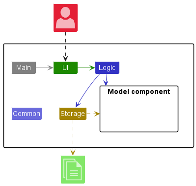
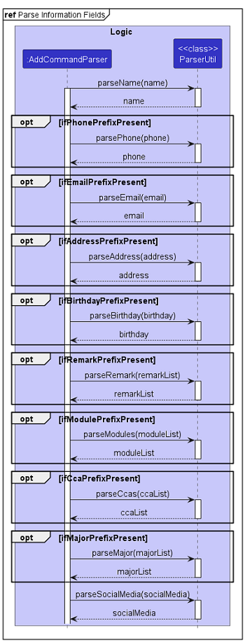

* Table of Contents
{:toc}

--------------------------------------------------------------------------------------------------------------------

## **Acknowledgements**

- This project is based on the AddressBook-Level3 project created by the [SE-EDU initiative](https://se-education.org).
- This project is a **part of the se-education.org** initiative. If you would like to contribute code to this project, see [se-education.org](https://se-education.org#https://se-education.org/#contributing) for more info.

- Libraries used in this project: [Jackson](https://github.com/FasterXML/jackson) for Storage, [JavaFX](https://openjfx.io/) for UI,  [JUnit5](https://github.com/junit-team/junit5) for Testing.

--------------------------------------------------------------------------------------------------------------------

## **Setting up, getting started**

Refer to the guide [_Setting up and getting started_](SettingUp.md).

--------------------------------------------------------------------------------------------------------------------

## **Design**

:bulb: **Tip:** The `.puml` files used to create diagrams in this document can be found in the [diagrams](https://github.com/AY2223S2-CS2103T-W15-1/tp/tree/master/docs/diagrams) folder. Refer to the [_PlantUML Tutorial_ at se-edu/guides](https://se-education.org/guides/tutorials/plantUml.html) to learn how to create and edit diagrams.

### Architecture

The ***Architecture Diagram*** given above explains the high-level design of the App.

Given below is a quick overview of main components and how they interact with each other.

**Main components of the architecture**

**`Main`** has two classes called [`Main`](https://github.com/AY2223S2-CS2103T-W15-1/tp/blob/master/src/main/java/seedu/address/Main.java) and [`MainApp`](https://github.com/AY2223S2-CS2103T-W15-1/tp/blob/master/src/main/java/seedu/address/MainApp.java). It is responsible for:
* At app launch: Initializes the components in the correct sequence, and connects them up with each other.
* At shut down: Shuts down the components and invokes cleanup methods where necessary.

[**`Commons`**](#common-classes) represents a collection of classes used by multiple other components.

The rest of the App consists of four components.

* [**`UI`**](#ui-component): The UI of the App.
* [**`Logic`**](#logic-component): The command executor.
* [**`Model`**](#model-component): Holds the data of the App in memory.
* [**`Storage`**](#storage-component): Reads data from, and writes data to, the hard disk.

**How the architecture components interact with each other**

The *Sequence Diagram* below shows how the components interact with each other for the scenario where the user issues the command `delete 1`.

Each of the four main components (also shown in the diagram above):

* defines its *API* in an `interface` with the same name as the Component.
* implements its functionality using a concrete `{Component Name}Manager` class (which follows the corresponding API `interface` mentioned in the previous point.

For example, the `Logic` component defines its API in the `Logic.java` interface and implements its functionality using the `LogicManager.java` class which follows the `Logic` interface. Other components interact with a given component through its interface rather than the concrete class (reason: to prevent outside component's being coupled to the implementation of a component), as illustrated in the (partial) class diagram below.

The sections below give more details of each component.

### UI component

The **API** of this component is specified in [`Ui.java`](https://github.com/AY2223S2-CS2103T-W15-1/tp/blob/master/src/main/java/seedu/address/ui/Ui.java)

The UI consists of a `MainWindow` that is made up of parts e.g.`CommandBox`, `ResultDisplay`, `PersonListPanel`, `StatusBarFooter` etc. All these, including the `MainWindow`, inherit from the abstract `UiPart` class which captures the commonalities between classes that represent parts of the visible GUI.

The `UI` component uses the JavaFx UI framework. The layout of these UI parts are defined in matching `.fxml` files that are in the `src/main/resources/view` folder. For example, the layout of the [`MainWindow`](https://github.com/AY2223S2-CS2103T-W15-1/tp/blob/master/src/main/java/seedu/address/ui/MainWindow.java) is specified in [`MainWindow.fxml`](https://github.com/AY2223S2-CS2103T-W15-1/tp/blob/master/src/main/resources/view/MainWindow.fxml)

The `UI` component,

* executes user commands using the `Logic` component.
* listens for changes to `Model` data so that the UI can be updated with the modified data.
* keeps a reference to the `Logic` component, because the `UI` relies on the `Logic` to execute commands.
* depends on some classes in the `Model` component, as it displays `Person` object residing in the `Model`.

### Logic component

**API** : [`Logic.java`](https://github.com/AY2223S2-CS2103T-W15-1/tp/blob/master/src/main/java/seedu/address/logic/Logic.java)

Here's a (partial) class diagram of the `Logic` component:

How the `Logic` component works:
1. When `Logic` is called upon to execute a command, it uses the `ConnectUsParser` class to parse the user command.
1. This results in a `Command` object (more precisely, an object of one of its subclasses e.g., `AddCommand`) which is executed by the `LogicManager`.
1. The command can communicate with the `Model` when it is executed (e.g. to add a person).
1. The result of the command execution is encapsulated as a `CommandResult` object which is returned back from `Logic`.

The Sequence Diagram below illustrates the interactions within the `Logic` component for the `execute("delete 1")` API call.

:information_source: **Note:** The lifeline for `DeleteCommandParser` should end at the destroy marker (X) but due to a limitation of PlantUML, the lifeline reaches the end of diagram.

Here are the other classes in `Logic` (omitted from the class diagram above) that are used for parsing a user command:

How the parsing works:
* When called upon to parse a user command, the `ConnectUsParser` class creates an `XYZCommandParser` (`XYZ` is a placeholder for the specific command name e.g., `AddCommandParser`) which uses the other classes shown above to parse the user command and create a `XYZCommand` object (e.g., `AddCommand`) which the `ConnectUsParser` returns back as a `Command` object.
* All `XYZCommandParser` classes (e.g., `AddCommandParser`, `DeleteCommandParser`, ...) inherit from the `Parser` interface so that they can be treated similarly where possible e.g, during testing.

### Model component
**API** : [`Model.java`](https://github.com/AY2223S2-CS2103T-W15-1/tp/blob/master/src/main/java/seedu/address/model/Model.java)

The `Model` component,

* stores the address book data i.e., all `Person` objects (which are contained in a `UniquePersonList` object).
* stores the currently 'selected' `Person` objects (e.g., results of a search query) as a separate _filtered_ list which is exposed to outsiders as an unmodifiable `ObservableList<Person>` that can be 'observed' e.g. the UI can be bound to this list so that the UI automatically updates when the data in the list change.
* stores a `UserPref` object that represents the user’s preferences. This is exposed to the outside as a `ReadOnlyUserPref` objects.
* does not depend on any of the other three components (as the `Model` represents data entities of the domain, they should make sense on their own without depending on other components)

:information_source: **Note:** An alternative (arguably, a more OOP) model is given below. It has a `Tag` list in `ConnectUS`, which `Person` references. This allows `ConnectUS` to only require one `Tag` object per unique tag, instead of each `Person` needing their own `Tag` objects. 

### Storage component

**API** : [`Storage.java`](https://github.com/gremmyz/tp/blob/branch-dont-break/src/main/java/seedu/connectus/storage/Storage.java)

The `Storage` component,
* can save both address book data and user preference data in json format, and read them back into corresponding objects.
* inherits from both `ConnectUsStorage` and `UserPrefStorage`, which means it can be treated as either one (if only the functionality of only one is needed).
* depends on some classes in the `Model` component (because the `Storage` component's job is to save/retrieve objects that belong to the `Model`)

### Common classes

Classes used by multiple components are in the `seedu.connectus.commons` package.

--------------------------------------------------------------------------------------------------------------------

## **Implementation**

This section describes some noteworthy details on how certain features are implemented.

### Add Command
The `add` command is used to create a new contact in ConnectUS with information fields specified by the user, namely the `Name`, `Phone`, `Email`, `Address`, `Birthday`, `Social Media` (i.e. Telegram, Instagram, WhatsApp), `Birthday`, `Modules`, and `Tags` fields.

The format for the `add` command can be found [here](https://ay2223s2-cs2103t-w15-1.github.io/tp/UserGuide.html#adding-a-person-add).

The sequence of the `add` command is as follows:

1. The command `add INPUT` is entered by the user (e.g. `add n/Jason`).
2. `Logic Manger` calls the `ConnectUsParser#parseCommand` with the `INPUT`.
3. `ConnectUsParser` parses the command word, creating an instance of `AddCommandParser` to `parse` the `informationFields` via the respective `ParserUtil` functions.
4. `AddCommandParser` creates the corresponding `Person` object. This `Person` object is taken as the input of a new `AddCommand` object created by `AddCommandParser`.
5. `Logic Manager` executes `AddCommand#execute`, adding the `Person` to the model through `AddCommand` calling `Model#addPerson`.
6. A `Command Result` is returned with the result of the execution.

If duplicate parameters are entered (e.g. `add n/Jason p/91234567 p/12345678`, where the phone parameter is entered twice), only the last instance, `p/12345678` will be taken.

The `AddCommandParser` creates the corresponding `Person` object, which is then taken as an input by the `AddCommand` object that it creates and returns. `Logic Manager` then runs `AddCommand`, which then adds the `Person` to the model.

The following sequence diagram shows how `add` works:

The following sequence diagram shows how the `informationFields` are parsed by `ParserUtil`:

### Edit Command
The `edit` command is used to change the information of an existing contact in ConnectUS with the information fields specified by the user, namely the `Name`, `Phone`, `Email`, `Address`, `Birthday`, `Social Media` (i.e. Telegram, Instagram, WhatsApp), `Birthday`, `Modules`, and `Tags` fields.

The format for the `edit` command can be found [here](https://ay2223s2-cs2103t-w15-1.github.io/tp/UserGuide.html#editing-a-person--edit).

The sequence of the `edit` command is as follows:

1. The command `edit INPUT` is entered by the user, where the `INPUT` is an integer index followed by fields to edit (e.g. `edit 1 n/John Doe`).
2. `Logic Manager` calls the `ConnectUsParser#parseCommand` with the given `INPUT`
3. `ConnectUsParser` parses the command word. creating an instance of `EditCommandParser` to `parse` the `informationFields` via the respective `ParserUtil` functions.
4. `EditCommandParser` creates the corresponding `EditPersonDescriptor` object. This `EditPersonDescriptor` object is taken as the input of a new `EditCommand` object created by `EditCommandParser`.
5. `Logic Manager` executes `EditPerson#execute`, creating a `Person` from the aforementioned`EditPersonDescriptor` object and adding this `Person` to the model through `Model#setPerson`.
6. `Model#updateFilteredPersonList` is called to update the list of `Person` objects.
7. A `Command Result` is returned with the result of the execution.

The following sequence diagram shows how `edit` works:

The following sequence diagram shows how the `informationFields` are parsed by `ParserUtil`:

### [To Add] Delete Command

### [To Add] Help Command

### [To Add] Adding Additional Tags

### [To Add] Deleting Individual Tags

--------------------------------------------------------------------------------------------------------------------

## **Documentation, logging, testing, configuration, dev-ops**

* [Documentation guide](Documentation.md)
* [Testing guide](Testing.md)
* [Logging guide](Logging.md)
* [Configuration guide](Configuration.md)
* [DevOps guide](DevOps.md)

--------------------------------------------------------------------------------------------------------------------

## **Appendix: Requirements**

### Product scope

**Target user profile**:

* NUS School of Computing (SoC) students
* especially those with many CCAs, modules or Team Projects
* has a need to manage a significant number of contacts
* prefer desktop apps over other types
* can type fast
* prefers typing to mouse interactions
* is reasonably comfortable using CLI apps

**Value proposition**: As students, we meet people everywhere, in CCAs, modules, events etc, and we may lose track of important information of people we network with. ConnectUS provides a platform for Computing students to easily manage their friends information, saving time and effort as users can access this information at their fingertips.

### User stories

Priorities: High (must have) - `* * *`, Medium (nice to have) - `* *`, Low (unlikely to have) - `*`

| Priority | As a …​                                      | I want to …​                                                            | So that I can…​                                                                           |
|----------|----------------------------------------------|-------------------------------------------------------------------------|-------------------------------------------------------------------------------------------|
| `* * *`  | new user                                     | see usage instructions                                                  | refer to instructions when I forget how to use the App                                    |
| `* * *`  | user                                         | add a new person                                                        |                                                                                           |
| `* * *`  | user                                         | delete a person                                                         | remove entries that I no longer need                                                      |
| `* * *`  | user                                         | find a person by name                                                   | locate details of persons without having to go through the entire list                    |
| `* * *`  | user with many different modules             | add module tags to a person                                             | remember which module I met them from                                                     |
| `* * *`  | user with many different CCAs                | add CCA tags to a person                                                | remember which CCA I met them from                                                        |
| `* * *`  | user with many different CCAs                | add CCA post tags to a person                                           | remember which post they hold in the CCA                                                  |
| `* * *`  | user                                         | add a new contact without adding their email                            | add people when I don't know their email id                                               |
| `* * *`  | user                                         | add a new contact without adding their phone number                     | add people when I don't know their phone number                                           |
| `* * *`  | user                                         | add a new contact without adding their telegram                         | add people when I don't know their telegram                                               |
| `* * *`  | user                                         | add a new contact without adding any tags                               | add people who don't have a common CCA or module with me                                  |
| `* * *`  | student                                      | easily add my friends' telegram information to the app                  | quickly connect with them on the platform                                                 |
| `* * *`  | user                                         | add a birthday for my contacts                                          | remember them                                                                             |
| `* *`    | user                                         | hide private contact details                                            | minimize chance of someone else seeing them by accident                                   |
| `* *`    | user                                         | open whatsapp directly from the CLI                                     | message someone without having to find them on whatsapp                                   |
| `* *`    | user                                         | open telegram directly from the CLI                                     | message someone without having to find them on telegram                                   |
| `* *`    | student with many CCAs                       | find the exco of a specific CCA                                         | submit a proposal for an event to them                                                    |
| `* *`    | student with many CCAs                       | find the friends of a specific CCA                                      | find their contact easily                                                                 |
| `* *`    | exco of a CCA who is also part of other CCAs | find the contacts of the CCA members (of which I am an exco of)         | find their contact easily to contact them regarding CCA events/other needs                |
| `* *`    | exco of a CCA                                | find the exco of my CCA                                                 | contact them to plan an event for the members of the CCA                                  |
| `* *`    | student with new friends                     | find their contact details                                              | easily ask them out to lunch to get to know them                                          |
| `* *`    | student taking many modules                  | find other friends who are taking the same modules as me                | study together with them                                                                  |
| `* *`    | student taking many modules                  | find other friends who are taking the same modules as me                | easily form groups with them prior to the start of the module                             |
| `* *`    | student TA                                   | find the contact details of the students I am TA-ing                    | so that I can easily inform them about important information related to the module/class  |
| `* *`    | student                                      | receive notifications when my friends change their telegram information | stay up to date with their latest details                                                 |
| `* *`    | student                                      | search for my friends' telegram information within the app              | don't have to manually go through my contacts list every time I want to reach out to them |
| `* *`    | user                                         | receive notifications for my friends' birthday                          | prepare for it and wish them                                                              |
| `* *`    | user                                         | view a list of upcoming birthdays for my contacts                       | plan ahead for their birthday                                                             |
| `*`      | user with friends from different years       | add year tags to a person                                               | remember which year they are in                                                           |
| `*`      | user with many persons saved in the app      | sort persons by name                                                    | locate a person easily                                                                    |
| `*`      | user                                         | send short messages on telegram directly from the app                   | message someone without having to juggle between apps                                     |
| `*`      | user                                         | send short messages on whatsapp directly from the app                   | message someone without having to juggle between apps                                     |
| `*`      | user with friends from other schools         | add school tags to a person                                             | remember which school they are from                                                       |
| `*`      | user with friends from companies             | add company tags to a person                                            | remember which company they are from                                                      |

### Use cases

(For all use cases below, the **System** is `ConnectUS` and the **Actor** is the `user`, unless specified otherwise)

**Use case: Add a contact**

**MSS**

1. User requests to add a contact by giving name and some contact information.
2. ConnectUS adds a new contact with given information.
3. ConnectUS displays confirmation message.
4. The new contact is visible in the contacts list.

   Use case ends.

**Extensions**

* 1a. There is an error in the given information.
    * 1a1. ConnectUS shows an error message.

  Use case ends.

* 4a. User requests to add more information to the contact.
  * 4a1. ConnectUS adds the given information to the contact.
  * 4a2. ConnectUS displays confirmation message
  * 4a3. Updated contact is visible in the contacts list

  Use case ends.

**Use case: Delete a contact**

**MSS**

1.  User requests to list persons.
2.  ConnectUS shows a list of persons.
3.  User requests to delete a specific person in the list
4.  ConnectUS deletes the person.

    Use case ends.

**Extensions**

* 2a. The list is empty.

  Use case ends.

* 3a. The given index is invalid.
    * 3a1. ConnectUS shows an error message.
      Use case resumes at step 2.

**Use case: Edit a contact**

**MSS**

1. User requests to list persons.
2. ConnectUS shows a list of persons.
3. User requests to edit a specific person's information from the list by giving the type of information to be updated, and the updated information.
4. ConnectUS edits the person's information.

   Use case ends.

**Extensions**

* 2a. The list is empty.
  Use case ends.

* 3a. The given index is invalid.
    * 3a1. ConnectUS shows an error message.
      Use case resumes at step 2.

* 3b. There is an error in the given information.
    * 3b1. ConnectUS shows an error message.
      Use case resumes at step 2.

**Use case: Find a contact**

**MSS**

1. User requests to find a contact by keywords
2. ConnectUS displays confirmation message
3. ConnectUS displays all contacts with keywords in name

   Use case ends

**Extensions**

* 1a. No keywords are provided
    * 1a1. ConnectUS displays error message
    Use case ends

* 1b. User requests to find a contact by tag
  * 1b1. ConnectUS displays confirmation message
  * 1b2. ConnectUS displays all contacts with given tag
  Use case ends

* 1c. User requests to find a contact by contact information
  * 1c1. ConnectUS displays confirmation message
  * 1c2. ConnectUS displays all contacts with given confirmation message
  Use case ends

**Use case: List all contacts**

**MSS**

1. User requests to list all contacts
2. ConnectUS displays confirmation message
3. ConnectUS displays all contacts

   Use case ends

**Extensions**

* 1a. There is an error in the request
  * 1a1. ConnectUS displays error message
  Use case ends

*{More to be added}*

### Non-Functional Requirements

1. Should work on any _mainstream OS_ as long as it has Java `11` or above installed.
2. Should be able to hold up to 1000 contacts without a noticeable sluggishness in performance for typical usage.
3. A user with above average typing speed for regular English text (i.e. not code, not system admin commands) should be able to accomplish most of the tasks faster using commands than using the mouse.
4. Should be for a single user i.e. (not a multi-user product).
5. Should have its data stored locally.
6. Should have its data be in a human editable text file.
7. Should not use a Database Management System (DBMS) to store data.
8. Should not depend on a remote server.
9. Should not cause have its GUI cause any resolution-related inconveniences to the user for standard screen resolutions (1920x1080 and higher), and resolutions of 1280x720 and higher.
10. Should be packaged into a single JAR file not exceeding 100MB.
11. Should not have any hard-to-test features or features that make it hard-to-test.

### Glossary

* **Mainstream OS**: Windows, Linux, Unix, OS-X
* **CLI**: A command line interface (CLI) is a text-based user interface (UI) used to run programs, manage computer files and interact with the computer.
* **GUI**: A graphical user interface (GUI) is a form of user interface that allows users to interact with programs through graphical icons and audio indicators.
* **JavaFX**: A Java library used for creating and delivering desktop applications.
* **NUS**: National University of Singapore.
* **SoC**: School of Computing, a computing school in NUS.
* **CS2103T**: The module code for a Software Engineering module in NUS.
* **CCA**: Co-curricular activities that students participate in.
* **Private contact detail**: A contact detail that is not meant to be shared with others

--------------------------------------------------------------------------------------------------------------------

## **Appendix: Instructions for manual testing**

Given below are instructions to test the app manually.

:information_source: **Note:** These instructions only provide a starting point for testers to work on;
testers are expected to do more *exploratory* testing.

### Launch and shutdown

1. Initial launch

   1. Download the jar file and copy into an empty folder

   1. Double-click the jar file Expected: Shows the GUI with a set of sample contacts. The window size may not be optimum.

1. Saving window preferences

   1. Resize the window to an optimum size. Move the window to a different location. Close the window.

   1. Re-launch the app by double-clicking the jar file. 
       Expected: The most recent window size and location is retained.

1. _{ more test cases …​ }_

### Adding a contact:
1. Adding a contact with just name and email
    1. Prerequisites: None
   2. Test case: `add n/JohnDoe e/email@example.com` 
   Expected: a new contact named JohnDoe with given email is  created. Details of the new contact shown in the status message. Contact is visible in contact list.
   3. Test case: `add n/ e/email@example.com` 
   Expected: No contact is created. Error details shown in status message.
   4. _{ more test cases …​ }_

### Deleting a contact

1. Deleting a contact while all persons are being shown

   1. Prerequisites: List all contact using the `list` command. Multiple contacts in the list.

   1. Test case: `delete 1` 
      Expected: First contact is deleted from the list. Details of the deleted contact shown in the status message. Timestamp in the status bar is updated.

   1. Test case: `delete 0` 
      Expected: No person is deleted. Error details shown in the status message. Status bar remains the same.

   1. Other incorrect delete commands to try: `delete`, `delete x`, `...` (where x is larger than the list size) 
      Expected: Similar to previous.

1. _{ more test cases …​ }_

### Saving data

1. Dealing with missing/corrupted data files

   1. _{explain how to simulate a missing/corrupted file, and the expected behavior}_

1. _{ more test cases …​ }_
