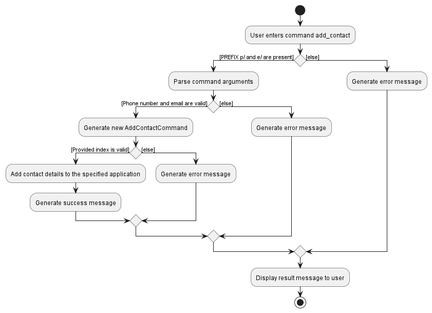
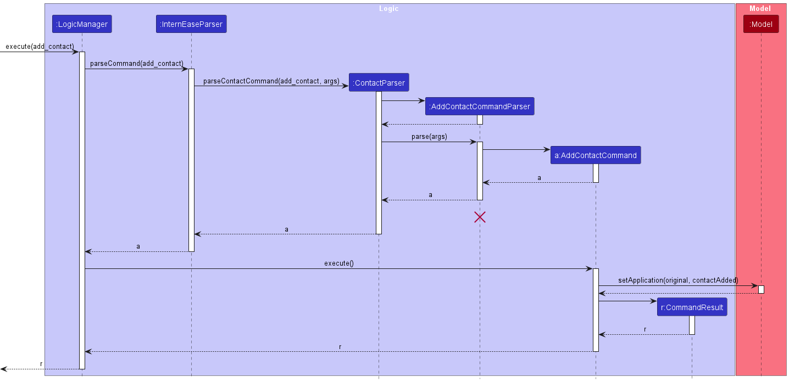
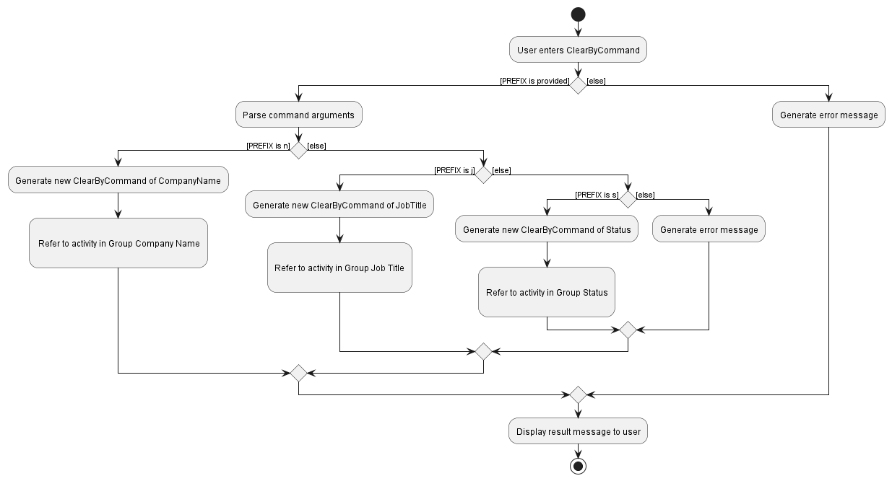
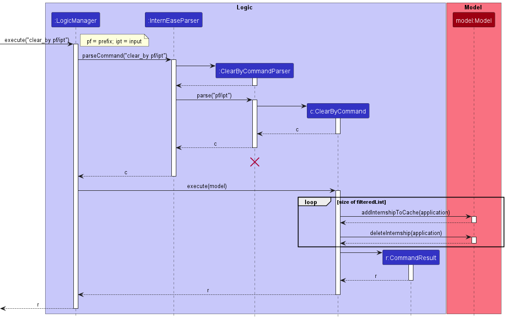

* Table of Contents
  {:toc}

--------------------------------------------------------------------------------------------------------------------

## **Acknowledgements**

* This project is based on the AddressBook-Level3 project created by the [SE-EDU initiative](https://se-education.org).

--------------------------------------------------------------------------------------------------------------------

## **Setting up, getting started**

Refer to the guide [_Setting up and getting started_](SettingUp.md).

--------------------------------------------------------------------------------------------------------------------

## **Design**

:bulb: **Tip:** The `.puml` files used to create diagrams in this document can be found in the [diagrams](https://github.com/se-edu/addressbook-level3/tree/master/docs/diagrams/) folder. Refer to the [_PlantUML Tutorial_ at se-edu/guides](https://se-education.org/guides/tutorials/plantUml.html) to learn how to create and edit diagrams.

### Architecture

The ***Architecture Diagram*** given above explains the high-level design of the App.

Given below is a quick overview of main components and how they interact with each other.

**Main components of the architecture**

**`Main`** has two classes called [`Main`](https://github.com/se-edu/addressbook-level3/tree/master/src/main/java/seedu/address/Main.java) and [`MainApp`](https://github.com/se-edu/addressbook-level3/tree/master/src/main/java/seedu/address/MainApp.java). It is responsible for,
* At app launch: Initializes the components in the correct sequence, and connects them up with each other.
* At shut down: Shuts down the components and invokes cleanup methods where necessary.

[**`Commons`**](#common-classes) represents a collection of classes used by multiple other components.

The rest of the App consists of four components.

* [**`UI`**](#ui-component): The UI of the App.
* [**`Logic`**](#logic-component): The command executor.
* [**`Model`**](#model-component): Holds the data of the App in memory.
* [**`Storage`**](#storage-component): Reads data from, and writes data to, the hard disk.

**How the architecture components interact with each other**

The *Sequence Diagram* below shows how the components interact with each other for the scenario where the user issues the command `delete 1`.

Each of the four main components (also shown in the diagram above),

* defines its *API* in an `interface` with the same name as the Component.
* implements its functionality using a concrete `{Component Name}Manager` class (which follows the corresponding API `interface` mentioned in the previous point.

For example, the `Logic` component defines its API in the `Logic.java` interface and implements its functionality using the `LogicManager.java` class which follows the `Logic` interface. Other components interact with a given component through its interface rather than the concrete class (reason: to prevent outside component's being coupled to the implementation of a component), as illustrated in the (partial) class diagram below.

The sections below give more details of each component.

### UI component

The **API** of this component is specified in [`Ui.java`](https://github.com/se-edu/addressbook-level3/tree/master/src/main/java/seedu/address/ui/Ui.java)

The UI consists of a `MainWindow` that is made up of parts e.g.`CommandBox`, `MixedPanel`, `NoteListPanel`, `TodoListPanel` etc. All these, including the `MainWindow`, inherit from the abstract `UiPart` class which captures the commonalities between classes that represent parts of the visible GUI.

The `UI` component uses the JavaFx UI framework. The layout of these UI parts are defined in matching `.fxml` files that are in the `src/main/resources/view` folder. For example, the layout of the [`MainWindow`](https://github.com/AY2223S2-CS2103T-W15-4/tp/blob/master/src/main/java/seedu/address/ui/MainWindow.java) is specified in [`MainWindow.fxml`](https://github.com/AY2223S2-CS2103T-W15-4/tp/blob/master/src/main/resources/view/MainWindow.fxml)

The `UI` component,

* executes user commands using the `Logic` component.
* listens for changes to `Model` data so that the UI can be updated with the modified data.
* keeps a reference to the `Logic` component, because the `UI` relies on the `Logic` to execute commands.
* depends on some classes in the `Model` component, as it displays `InternshipApplication` object residing in the `Model`.
* listens on each other in the `Ui` component, as `CommandBox` calls functions in `MainWindow` to `execute()` `Logic`.
* keeps a reference to other `Ui` component, as `MainWindow` keeps references of `NoteListPanel`, `InternshipListPanel` and `NoteListPanel` to implement the switching between each panel.

### Logic component

**API** : [`Logic.java`](https://github.com/se-edu/addressbook-level3/tree/master/src/main/java/seedu/address/logic/Logic.java)

Here's a (partial) class diagram of the `Logic` component:

How the `Logic` component works:
1. When `Logic` is called upon to execute a command, it uses the `AddressBookParser` class to parse the user command.
1. This results in a `Command` object (more precisely, an object of one of its subclasses e.g., `AddCommand`) which is executed by the `LogicManager`.
1. The command can communicate with the `Model` when it is executed (e.g. to add a person).
1. The result of the command execution is encapsulated as a `CommandResult` object which is returned back from `Logic`.

The Sequence Diagram below illustrates the interactions within the `Logic` component for the `execute("delete 1")` API call.

:information_source: **Note:** The lifeline for `DeleteCommandParser` should end at the destroy marker (X) but due to a limitation of PlantUML, the lifeline reaches the end of diagram.

Here are the other classes in `Logic` (omitted from the class diagram above) that are used for parsing a user command:

How the parsing works:
* When called upon to parse a user command, the `AddressBookParser` class creates an `XYZCommandParser` (`XYZ` is a placeholder for the specific command name e.g., `AddCommandParser`) which uses the other classes shown above to parse the user command and create a `XYZCommand` object (e.g., `AddCommand`) which the `AddressBookParser` returns back as a `Command` object.
* All `XYZCommandParser` classes (e.g., `AddCommandParser`, `DeleteCommandParser`, ...) inherit from the `Parser` interface so that they can be treated similarly where possible e.g, during testing.

### Model component
**API** : [`Model.java`](https://github.com/se-edu/addressbook-level3/tree/master/src/main/java/seedu/address/model/Model.java)

The `Model` component,

* stores the address book data i.e., all `Person` objects (which are contained in a `UniquePersonList` object).
* stores the currently 'selected' `Person` objects (e.g., results of a search query) as a separate _filtered_ list which is exposed to outsiders as an unmodifiable `ObservableList<Person>` that can be 'observed' e.g. the UI can be bound to this list so that the UI automatically updates when the data in the list change.
* stores a `UserPref` object that represents the user’s preferences. This is exposed to the outside as a `ReadOnlyUserPref` objects.
* does not depend on any of the other three components (as the `Model` represents data entities of the domain, they should make sense on their own without depending on other components)

:information_source: **Note:** An alternative (arguably, a more OOP) model is given below. It has a `Tag` list in the `AddressBook`, which `Person` references. This allows `AddressBook` to only require one `Tag` object per unique tag, instead of each `Person` needing their own `Tag` objects. 

### Storage component

**API** : [`Storage.java`](https://github.com/se-edu/addressbook-level3/tree/master/src/main/java/seedu/address/storage/Storage.java)

The `Storage` component,
* can save both address book data and user preference data in json format, and read them back into corresponding objects.
* inherits from both `AddressBookStorage` and `UserPrefStorage`, which means it can be treated as either one (if only the functionality of only one is needed).
* depends on some classes in the `Model` component (because the `Storage` component's job is to save/retrieve objects that belong to the `Model`)

### Common classes

Classes used by multiple components are in the `seedu.addressbook.commons` package.

--------------------------------------------------------------------------------------------------------------------

## **Implementation**

This section describes some noteworthy details on how certain features are implemented.

### Add feature

### How add feature is implemented

The `add` command allows users to add an internship application to the tracker. The add mechanism is facilitated by `AddCommand` class. It extends `Command`but overrides the `Command#execute` to add an internship application to the tracker.

The sequence diagram below shows how the `AddCommand` object is created:

Step 1. Parsing

The `AddCommandParser` checks that the user input is in the expected format, if not an exception will be thrown.

Step 2. Execution

The `AddCommand#execute` calls `Model#addApplication`, causing an update to the internship list.

Step 3. Result

The updated model is then saved. A `CommandResult` object with a message containing the execution result of the command is created and returned to `MainWindow#execute`.

### Add contact feature

#### How is the feature implemented

The `add_contact` command allows users to add the contact of a company to an internship application. The implementation of the `add_contact` command is facilitated by the `AddContactCommand` class which is derived from the `Command` superclass, and overrides the `Command#execute` method. 
The parsing process meanwhile involves the `AddressBookParser#parse#` and the `AddContactCommandParser#parse` methods.

The activity diagram below shows the workflow of the `add_contact` command during its execution.

The constructor of the class `AddContactCommand` requires 2 arguments, a valid positive `Integer` index and a `Contact` object, both of which are obtained after the parsing process mentioned above.

The relevant operations from the `Model` interface are `Model#getFilteredInternshipList`, `Model#setApplication` and `Model#updateFilteredInternshipList`.

A sequence diagram is shown here to illustrate the execution process of the `add_contact` command.

Given below is an explanation on the `add_contact` command's behaviours.

Step 1. Parsing

The `CommandBox#execute` method is invoked when the user's input in `CommandBox` is parsed, which results in the command word being parsed in the method `InternEaseParser#parser`.
The method `AddContactCommandParser#parse` is invoked only if the command word matches `AddContactCommand.COMMAND_WORD`.

Step 2. Execution

The `AddContactCommand#execute` method is invoked and calls are made to the `model` instance. The last shown list of internships are obtained by calling the method `Model#getFilteredInternshipList`.
The internship application where the contact is to be added is then obtained by calling the `UniqueApplicationList#get` method with the specified index. As the InternshipApplication object is
immutable, a new `InternshipApplication` object is created with the contact details. The `Model#setApplication` method is then invoked to update the specified application in the list.

Step 3. Result

The updated model is then saved. A `CommandResult` object with a message containing the execution result of the command is created and returned to `MainWindow#execute`. 
The `InternshipListPanel` is refreshed with a `ResultDialog` displaying the returned message for 2.5 seconds. 

>**NOTE:**
> Error handling: Any error message returned in the midst of execution will be displayed as a `ResultDialog` and the current command executed terminates immediately.

#### Why is it implemented this way

The `AddContactCommand` provides enhancement to the existing `AddCommand` by separating the process of adding contact details of the company from the initial process of
adding a new internship application. This prevents the `AddCommand` from getting cluttered with large amount of arguments that may become difficult for the user to remember. 

**Aspect: Where to save the contact details:**

* **Alternative 1 (current choice):** Separating it into a separate `Contact` class.
    * Pros: Flexibility to add more details to the contact if needed in the future.
    * Cons: More time required to implement.

* **Alternative 2:** Adding contact details as attributes in the `InternshipApplication` class.
    * Pros: Easier than implement.
    * Cons: More conflicts will occur if someone else is working on the `InternshipApplication` class at the same time.

### Find feature

The `find` command allows user to find all `InternshipApplication` whose 
1. `CompanyName` and `JobTitle` contain the specified keyword, or
2. `Internship status` contain the specified status, or
3. `InterviewDate` is before, after, or between specified date(s).

>**NOTE:**
> The matching of keyword in `CompanyName` and `JobTitle` is case-insensitive. As long as one word within CompanyName` 
> and `JobTitle` matches any of the KEYWORDS, it will be shown in result.

#### How is the feature implemented

The sequence diagram below describes the interaction between classes when find command entered.

Step 1. Parsing

If the command word matches the word "find", `FindCommandParser#parse()` will be called to parse 
the argument of find. The parsing logic is further divided into three cases below:
- Case 1: If the prefix `s/` is specified, the argument that follows the prefix immediately is 
deemed as `InternshipStatus`. A `FindStatusCommand` with `StatusPredicate` is created to be executed. 
- Case 2: If one of the following prefixes `before/`, `after/`, OR `from/` and `to/` is specified, the argument
that follows immediately is deemed as `InterviewDate`. A `FindDateCommand` with appropriate subclasses of
`DatePredicate` is created to be executed. 
- Case 3: If none of the prefix among `s/`, `before/`, `after/`, `from/`, `to/` is specified 
in the argument. `FindCommandParser` constructs a `FindCommand` object and treat all arguments that follow as `KEYWORD`

Step 2. Execution

The corresponding command is then invoked. Within each command's `execute` method, 
`Model#updateFilteredInternshipList()` is invoked by passing in the predicate. For Cases 1 and 2, 
only those `InternshipApplication`'s with matching `ApplicationStatus` or `InterviewDate` are added to the Model's
`filteredInternships` whereas for Case 3, if any word within the `CompanyName` or `JobTitle` matches one of the 
`KEYWORD`(s), then that application is added to the Model's `filteredInternships`.

Step 3. Result

The updated model is then saved. A `CommandResult` object with a message containing the execution result of the command 
is created and returned to `MainWindow#execute`. The `InternshipListPanel` is refreshed with a `ResultDialog` 
displaying the returned message for 2.5 seconds.

#### Why is it implemented this way

The class diagram below shows current structure of classes related to `find` command.

It is designed and implemented in this way to make the find command more extensible to further enhancement to be made.
For example, developer may want to enable more prefixes that be searched using the search command. By the 
use of inheritance, one can easily modify the behaviour of `find` command through overrding of the `execute` command
and rely on polymorphism.

#### Alternatives considered

**Syntax of `find` command**

* **Alternative 1 (current choice):** Now to find attribute in `InternshipApplication`, the command syntax used is
by using its prefix, i.e. in this form `find s/PENDING`. 
  * Pros: shorter command
  * Cons: Parser logic is harder to maintain as compared to Alternative 2

* **Alternative 2:** We can also make it in such format find_<Attribute>, e.g. find_status. 
  * Pros: Easy parser to implement
  * Cons: Longer command which takes longer time to type

### Clear_by feature
This section elaborated the `clear_by` feature by its functionality and the path of execution together with the `ClearByCommand` implementation. Uml diagrams are used to aid this description.

#### How CLEAR_BY Feature is implemented

The `clear_by` feature enables user to clear the internship applications in batch with the specific attribute and the specific keyword. There are 3 cases (attributes) available in this feature.
In `Logic` interface, `ClearByCommand` extends `Command` with a `ClearByCommand#execute` functionality. The parsing process is facilitated by both the `InternEaseParser#parse` and `ClearByCommandParser#parse`.

The workflow of a `clear_by` command during its execution is shown by the activity diagram below:

There are 3 constructors `ClearByCommand::new` provided for 3 different cases stated below : 

* Case 1 : clear_by `COMPANY_NAME`
  * `PREFIX` should be set to `n`
  * Allows user to remove all internship applications with `ParamType=COMPANYNAME` fully match with the provided keyword.
  
* Case 2 : clear_by `JOB_TITLE`
  * `PREFIX` should be set to `j`
  * Allows user to remove all internship applications with `ParamType=JOBTITLE` fully match with the provided keyword.
  
* Case 3 : clear_by `STATUS`
  * `PREFIX` should be set to `s`, the keywords accepted include `NA, PENDING, RECEIVED, REJECTED, NO`.
  * Allows user to remove all internship applications with `ParamType=STATUS` fully match with the correct provided keyword.

>**Note:** 
> The assignation of cases will be done by `ClearByCommandParser#parse`, each unavailable fields will be set to null.

These operations are involved in the `Model` interface as `Model#getFilteredInternshipList`, `Model#addInternshipToCache` and `Model#deleteInternship`

The execution process of `Clear_by` is demonstrated by the sequence diagram below.

Given below is a step-wise explanation on `clear_by` mechanism's behaviour.

Step 1. Parsing
    The user input in the `CommandBox` will trigger `CommandBox#execute`, will result in the command word processing in `InternEaseParser#parse`. If the `COMMAND.WORD` matches `clear_by`, it will then be passed to `ClearByCommandParser#parse`.
    The `PREFIX` in the argument will then be investigated. Different constructor of `ClearByCommand` object will be using based on the `PREFIX`.

Step 2. Execution
    `ClearByCommand#execute` is called with `model` instance. It attempts to get full list of `Internship Applications` by `Model#getFilteredInternshipList`. Then, the list is filtered by `ClearByCommand#getFilteredList` to filter out the applications to be cleared.
    The size of the list-to-clear is checked before an iteration to `Model#deleteInternship` and `Model#addInternshipToCache`. The cleared items are stored in the cache list to support `RevertCommand` in current InternEase session.
    
Step 3. Result
    The result model is saved. A `CommandResult` with execution result message is returned until the `MainWindow#execute`. The `InternshipListPanel` is refreshed with a `ResultDialog` displaying the execution message for 2.5 seconds.

>**NOTE:** 
> Error handling: Any error message resulted in the midst of execution will be displayed as a `ResultDialog` and current execution terminates immediately.

#### Why is it implemented this way

The `ClearByCommand` is an enhanced feature for both `DeleteCommand` and `ClearCommand`. It resolves user's request to perform customized batch deletion of internship applications.
Based on utility, the 3 fixed fields in an internship application are taken as the key attributes for this `clear_by` feature. The `PREFIX` for specifying the `clear_by` attribute is also the same as InternEase convention.
For the ease of implementation and avoid ambiguity, constructor `ClearByCommand::new` is overloaded, taking different fields. The usage of enum `ParamType` to specify the operating attribute type generalized the `ClearByCommand#execute`.
The other implementation aspects of `clear_by` feature follow the convention of `InternEase`.
_{more aspects and alternatives to be added}_

### Add Interview Date feature 

#### How is the feature implemented

The `add_date` command allows users to add an interview date to an internship application. The implementation of the `add_date` command is facilitated by the `AddInterviewDateCommand` class which is derived from the `Command` superclass, and overrides the `Command#execute` method.
The parsing process meanwhile involves the `AddressBookParser#parse#` and the `AddInterviewDateCommandParser#parse` methods.

The constructor of the class `AddInterviewDateCommand` requires 2 arguments, a valid positive `Integer` index and a `InterviewDate` object, both of which are obtained after the parsing process mentioned above.

The relevant operations from the `Model` interface are `Model#getFilteredInternshipList`, `Model#setApplication` and `Model#updateFilteredInternshipList`.

Given below is an explanation on the `add_contact` command's behaviours.

Step 1. Parsing

The `CommandBox#execute` method is invoked when the user's input in `CommandBox` is parsed, which results in the command word being parsed in the method `InternEaseParser#parser`.
The method `AddInterviewDateCommandParser#parse` is invoked only if the command word matches `AddInterviewDateCommand.COMMAND_WORD`.

Step 2. Execution

The `AddInterviewDateCommand#execute` method is invoked and calls are made to the `model` instance. The last shown list of internships are obtained by calling the method `Model#getFilteredInternshipList`.
The internship application where the interview date is to be added is then obtained by calling the `UniqueApplicationList#get` method with the specified index. As the InternshipApplication object is
immutable, a new `InternshipApplication` object is created with the interview date. The `Model#setApplication` method is then invoked to update the specified application in the list.

Step 3. Result

The updated model is then saved. A `CommandResult` object with a message containing the execution result of the command is created and returned to `MainWindow#execute`.
The `InternshipListPanel` is refreshed with a `ResultDialog` displaying the returned message for 2.5 seconds.

>**NOTE:**
> Error handling: Any error message returned in the midst of execution will be displayed as a `ResultDialog` and the current command executed terminates immediately.

#### Why is it implemented this way

The `AddInterviewDateCommand` provides enhancement to the existing `AddCommand` by separating the process of adding the interview date for an application from the initial process of
adding a new internship application. This prevents the `AddCommand` from getting cluttered with large amount of arguments that may become difficult for the user to remember.

**Aspect: Where to save the contact details:**

* **Alternative 1 (current choice):** Separating it into a separate `InterviewDate` class.
    * Pros: Flexibility to add more details to the contact if needed in the future.
    * Cons: More time required to implement.

* **Alternative 2:** Adding interview date as an attribute in the `InternshipApplication` class.
    * Pros: Easier than implement.
    * Cons: More conflicts will occur if someone else is working on the `InternshipApplication` class at the same time.
  
### \[Proposed\] Data archiving

_{Explain here how the data archiving feature will be implemented}_

### \[Proposed\] Upcoming Interview reminder 

_{Explain here how the data archiving feature will be implemented}_

--------------------------------------------------------------------------------------------------------------------

## **Documentation, logging, testing, configuration, dev-ops**

* [Documentation guide](Documentation.md)
* [Testing guide](Testing.md)
* [Logging guide](Logging.md)
* [Configuration guide](Configuration.md)
* [DevOps guide](DevOps.md)

--------------------------------------------------------------------------------------------------------------------

## **Appendix: Requirements**

### Product scope

**Target user profile**:

* Computer Science undergraduate
* has a need to manage a number of internship applications
* prefer desktop apps over other types
* able to type fast
* prefers typing to mouse interactions
* is reasonably comfortable using CLI apps

**Value proposition**: manage internship applications faster and more efficiently than a typical mouse/GUI driven app

### User stories

Priorities: High (must have) - `* * *`, Medium (nice to have) - `* *`, Low (unlikely to have) - `*`

| Priority | As a …​                                    | I want to …​                                                  | So that I can…​                                                        |
| -------- |--------------------------------------------|---------------------------------------------------------------|------------------------------------------------------------------------|
| `* * *`  | new user                                   | see usage instructions                                        | refer to instructions when I forget how to use the App                 |
| `* * *`  | user                                       | add a new internship application entry                        |                                                                        |
| `* * *`  | internship applicant                       | note down the contact details of the company I am applying to | conveninently contact the company for queries or setting up interviews |
| `* * *`  | internship applicant                       | delete my submission                                          | remove wrong entries or application that I no longer need              |
| `* * *`  | internship applicant                       | view a list of my internship applications submitted           | prevent repeated applications to the same company                      |
| `* *`    | internship applicant                       | delete all my applications                                    | start fresh                                                            |
| `* * *` | internship applicant                       | note down the status of my application                        | identify which stage of the application I am in                        |

*{More to be added}*

### Use cases

(For all use cases below, the **System** is `InternEase` and the **Actor** is the `user`, unless specified otherwise)

**Use case: UC01 Add an internship application entry**

**MSS**

1.  User requests to add an internship applications.
2.  InternEase adds the internship application and displays a success message.

    Use case ends.

**Extensions**

* 1a. The command format is invalid.
    * 1a1. InternEase shows an error message and gives a specific suggestion on the correct command format.

      Use case ends.

**Use case: UC02 Add contact details of a company to an internship application**

**MSS**

1.  User requests to view the list of internship applications.
2.  InternEase shows the internship application list with their indexes specified.
3.  User requests to add the contact details of a company to a specific internship application in the list by specifying its respective index.
4.  InternEase adds the contact details of the company to the internship application and displays a success message.

    Use case ends.

**Extensions**

* 2a. The list is empty.
    * 2a1. InternEase shows an alert message that there is no internship application in the list.

      Use case ends.

* 3a. The provided index is invalid.

    * 3a1. InternEase shows an error message and gives a specific suggestion on the index's range.
    * 3a2. User enters a new internship application index.

      Steps 3a1 to 3a2 are repeated until a valid index is provided. Use case resumes at step 4.

* 3b. The command format is invalid.
    * 3b1. InternEase shows an error message and gives a specific suggestion on the correct command format.
    * 3b2. User enters a new command.

      Steps 3b1 to 3b2 are repeated until a valid command is entered. Use case resumes at step 4.

**Use case: UC05 Delete an internship application entry**

**MSS**

1. User requests to view the list internship applications.
2. InternEase shows the internship applications list with their indexes specified.
3. User requests to delete a specific internship application in the list by specifying its respective index.
4. InterEase deletes the internship application from the list and displays a success message.

   Use case ends.

**Extensions**

* 2a. The list is empty.
    * 2a1. InternEase shows an alert message that there is no internship application in the list.

      Use case ends.

* 3a. The given index is invalid.
    * 3a1. InternEase shows an error message and gives specific suggestion on the index's range.

    * 3a2. User enters new internship application index.

      Steps 3a1 to 3a2 are repeated until a valid index is provided.
      Use case resumes at step 4.

* 3b. The command format is incorrect.

    * 3b1. InternEase shows an error message and gives specific suggestion on the command format.

    * 3b2. User enters new command.

      Steps 3b1 to 3b2 are repeated until a valid command is provided.
      Use case resumes at step 4.

**Use case: UC06 Find an application by its field**

**MSS**

1.  User enters keyword of field for the application.
2.  InternEase shows a list of application whose company name or description fulfill the matching keyword.
    Use case ends.

**Extensions**

* 1a. The list is empty.
    * 1a1. InternEase shows an alert message that there is no internship application in the list.

      Use case ends.

**Use case: UC07 Clear all internship application entries**

**MSS**

1. User requests to clear all the data in the application.
2. InternEase clears all the internship application entries, shows an empty list of internship application data and displays a success message.

   Use case ends.

**Use case: UC08 Edit the status of an internship application**

**MSS**

1.  User requests to view the list of internship applications.
2.  InternEase shows the internship application list with their indexes specified.
3.  User requests to edit the application status of a specific internship application in the list by specifying its respective index.
4.  InternEase updates the application status of the internship application and displays a success message.

    Use case ends.

**Extensions**

* 2a. The list is empty.

    * 2a1. InternEase shows an alert message that there is no internship application in the list.

      Use case ends.

* 3a. The provided index is invalid.

    * 3a1. InternEase shows an error message and gives a specific suggestion on the index's range.
    * 3a2. User enters a new internship application index.

      Steps 3a1 to 3a2 are repeated until a valid index is provided. Use case resumes at step 4.

* 3b. The command format is invalid.
    * 3b1. InternEase shows an error message and gives a specific suggestion on the correct command format.
    * 3b2. User enters a new command.

      Steps 3b1 to 3b2 are repeated until a valid command is entered. Use case resumes at step 4.
      
**Use case: UC09 Help**

**MSS**

1. User requests for help.
2. InternEase shows a list of available commands to the user.

**Use case: UC10 List**

**MSS**

1.  User requests to view the list of internship applications.
2.  InternEase shows all the internship applications as a list with their indexes specified.

    Use case ends.

**Extensions**
* 1a. The list is empty.
    * 1a1. InternEase shows an alert message that there is no internship application in the list.

      Use case ends.

**Use case: UC11 Clear relevant internship application entries by keyword**

**MSS**

1. User requests to view the list of internship applications.
2. InternEase shows the internship application list with their attributes specified.
3. User requests to clear all the relevant entries with specific keyword and its attribute.
4. InternEase requests confirmation from user.
5. InternEase updates the application status of the internship application and displays a success message.

   Use case ends.

**Extensions**
* 1a. The list is empty.
    * 1a1. InternEase shows an alert message that there is no internship application in the list.

      Use case ends.

* 2a. The provided attribute is invalid.
    * 2a1. InternEase shows an error message and gives a specific suggestion on the correct command format.
    * 2a2. User enters a new command.

      Steps 2a1 to 2a2 are repeated until a valid attribute is provided. Use case resumes at step 4.

**Use case: UC12 Add a todo task entry**

**MSS**

Similar to `UC01 Add an internship application entry` except todo task is added instead of an internship application.

**Use case: UC13 List todo**

**MSS**

Similar to `UC10 List`except todo tasks are listed instead of internship applications.

**Use case: UC14 Edit the note content of a todo task**

**MSS**

Similar to `UC08 Edit the status of an internship application`except the note content of a todo task is edited.

**Use case: UC15 Edit the deadline of a todo task**

**MSS**
Similar to `UC14 Edit the note content of a todo task` except the deadline is edited.

**Use case: UC16 Delete a todo task entry**

**MSS**

Similar to `UC05 Delete an internship application entry` except the specified todo task is deleted.

**Use case: UC17 Clear all todo task entries**

**MSS**

Similar to `UC07 Clear all internship application entries` except all the todo task entries are cleared instead of all the internship application entries.

**Use case: UC18 Add a note**

**MSS**

Similar to `UC01 Add an internship application entry` except a note entry is added instead of an internship application.

**Use case: UC19 List note**

**MSS**

Similar to `UC10 List`except note entries are listed instead of internship applications.

**Use case: UC20 Delete a note entry**

**MSS**

Similar to `UC05 Delete an internship application entry` except the specified note entry is deleted.

**Use case: UC21 Clear all note entries**

**MSS**

Similar to `UC07 Clear all internship application entries` except all the notes entries are cleared instead of all the internship application entries.

**Use case: UC22 List task**

**MSS**

Similar to `UC10 List`except todo task entries and note entries are listed instead of internship applications.

**Use case: UC23 Find a task by its field**

**MSS**

Similar to `UC06 Find an application by its field`except todo task entries and note entries which match the specified keyword are filtered out and listed.

### Non-Functional Requirements

1. Should work on any _mainstream OS_ as long as it has Java `11` or above installed.
2. Should be able to hold up to 1000 persons without a noticeable increase in sluggishness in performance for typical usage.
3. A user with above average typing speed for regular English text (i.e. not code, not system admin commands) should be able to accomplish most of the tasks faster typing commands than using the mouse.
4. InternEase doesn't support resume storing function. User can only include links to their resume used for a particular application.
5. InternEase is unable to remind user through platform outside of the application.

*{More to be added}*

### Glossary

* **CLI**: Command line interface
* **GUI**: Graphical User interface
* **Mainstream OS**: Windows, Linux, Unix, OS-X

--------------------------------------------------------------------------------------------------------------------

## **Appendix: Instructions for manual testing**

Given below are instructions to test the app manually.

:information_source: **Note:** These instructions only provide a starting point for testers to work on;
testers are expected to do more *exploratory* testing.

### Launch and shutdown

1. Initial launch of InternEase

    1. Download the jar file and copy into an empty folder
    2. Launch the application by:
        1. Double-click the jar file. 
           or
        2. Open a command terminal, `cd` into the folder you put the jar file in, and use the `java -jar InternEase.jar` command to run the program. 
           Expected: Shows the GUI with a set of sample internship applications. The window size may not be optimal.

2. Saving window preferences

    1. Resize the window to an optimal size. Move the window to a different location. Close the window.

    2. Re-launch the app by double-clicking the jar file. 
       Expected: The most recent window size and location is retained.

3. Shutting down InternEase
    1. Shut down InternEase
        1. Using `exit` command. 
           or
        2. Close the window using the 'X' button on top-right of the window frame.
    2. All prior activities will be saved.
    3. Re-launch InternEase by [Step 1(ii)](#Launch-and-shutdown). Expected: All the saved data will be loaded and displayed.

*{More to be added}*
