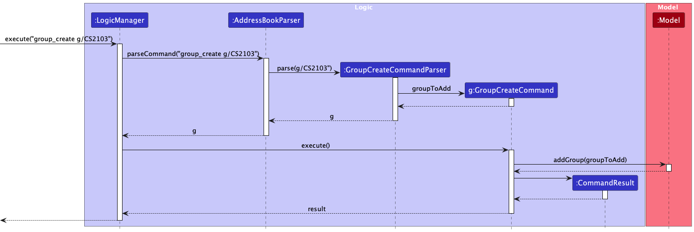
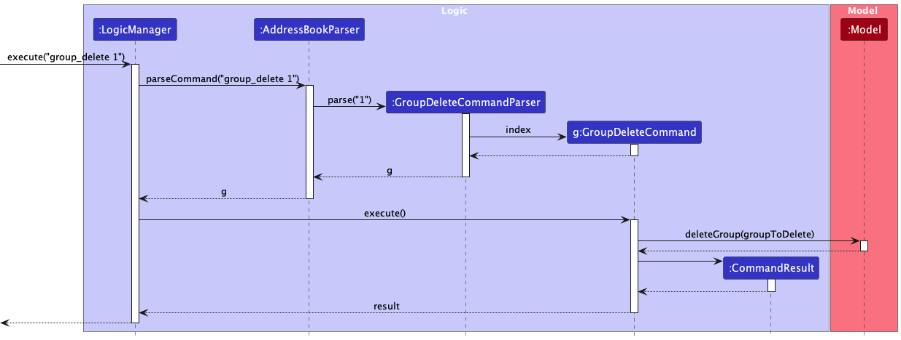
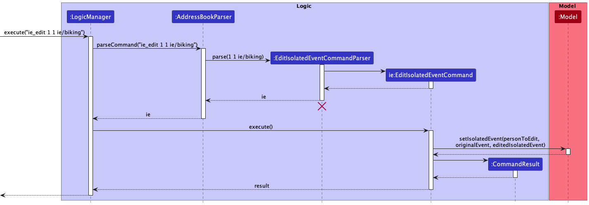
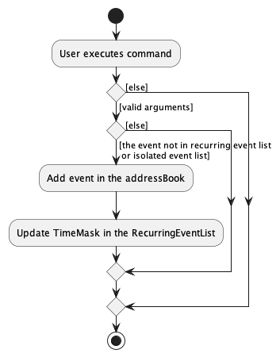

* Table of Contents
{:toc}

--------------------------------------------------------------------------------------------------------------------

## **Acknowledgements**

* {list here sources of all reused/adapted ideas, code, documentation, and third-party libraries -- include links to the original source as well}

--------------------------------------------------------------------------------------------------------------------

## **Setting up, getting started**

Refer to the guide [_Setting up and getting started_](SettingUp.md).

--------------------------------------------------------------------------------------------------------------------

## **Design**

:bulb: **Tip:** The `.puml` files used to create diagrams in this document can be found in the [diagrams](https://github.com/se-edu/addressbook-level3/tree/master/docs/diagrams/) folder. Refer to the [_PlantUML Tutorial_ at se-edu/guides](https://se-education.org/guides/tutorials/plantUml.html) to learn how to create and edit diagrams.

### Architecture

The ***Architecture Diagram*** given above explains the high-level design of the App.

Given below is a quick overview of main components and how they interact with each other.

**Main components of the architecture**

**`Main`** has two classes called [`Main`](https://github.com/se-edu/addressbook-level3/tree/master/src/main/java/seedu/address/Main.java) and [`MainApp`](https://github.com/se-edu/addressbook-level3/tree/master/src/main/java/seedu/address/MainApp.java). It is responsible for,
* At app launch: Initializes the components in the correct sequence, and connects them up with each other.
* At shut down: Shuts down the components and invokes cleanup methods where necessary.

[**`Commons`**](#common-classes) represents a collection of classes used by multiple other components.

The rest of the App consists of four components.

* [**`UI`**](#ui-component): The UI of the App.
* [**`Logic`**](#logic-component): The command executor.
* [**`Model`**](#model-component): Holds the data of the App in memory.
* [**`Storage`**](#storage-component): Reads data from, and writes data to, the hard disk.

**How the architecture components interact with each other**

The *Sequence Diagram* below shows how the components interact with each other for the scenario where the user issues the command `delete 1`.

Each of the four main components (also shown in the diagram above),

* defines its *API* in an `interface` with the same name as the Component.
* implements its functionality using a concrete `{Component Name}Manager` class (which follows the corresponding API `interface` mentioned in the previous point).

For example, the `Logic` component defines its API in the `Logic.java` interface and implements its functionality using the `LogicManager.java` class which follows the `Logic` interface. Other components interact with a given component through its interface rather than the concrete class (reason: to prevent outside component's being coupled to the implementation of a component), as illustrated in the (partial) class diagram below.

The sections below give more details of each component.

### UI component

The **API** of this component is specified in [`Ui.java`](https://github.com/se-edu/addressbook-level3/tree/master/src/main/java/seedu/address/ui/Ui.java)

The UI consists of a `MainWindow` that is made up of parts e.g.`CommandBox`, `ResultDisplay`, `PersonListPanel`, `StatusBarFooter` etc. All these, including the `MainWindow`, inherit from the abstract `UiPart` class which captures the commonalities between classes that represent parts of the visible GUI.

The `UI` component uses the JavaFx UI framework. The layout of these UI parts are defined in matching `.fxml` files that are in the `src/main/resources/view` folder. For example, the layout of the [`MainWindow`](https://github.com/se-edu/addressbook-level3/tree/master/src/main/java/seedu/address/ui/MainWindow.java) is specified in [`MainWindow.fxml`](https://github.com/se-edu/addressbook-level3/tree/master/src/main/resources/view/MainWindow.fxml)

The `UI` component,

* executes user commands using the `Logic` component.
* listens for changes to `Model` data so that the UI can be updated with the modified data.
* keeps a reference to the `Logic` component, because the `UI` relies on the `Logic` to execute commands.
* depends on some classes in the `Model` component, as it displays `Person` object residing in the `Model`.

### Logic component

**API** : [`Logic.java`](https://github.com/se-edu/addressbook-level3/tree/master/src/main/java/seedu/address/logic/Logic.java)

Here's a (partial) class diagram of the `Logic` component:

How the `Logic` component works:
1. When `Logic` is called upon to execute a command, it uses the `AddressBookParser` class to parse the user command.
1. This results in a `Command` object (more precisely, an object of one of its subclasses e.g., `AddCommand`) which is executed by the `LogicManager`.
1. The command can communicate with the `Model` when it is executed (e.g. to add a person).
1. The result of the command execution is encapsulated as a `CommandResult` object which is returned back from `Logic`.

The Sequence Diagram below illustrates the interactions within the `Logic` component for the `execute("delete 1")` API call.

:information_source: **Note:** The lifeline for `DeleteCommandParser` should end at the destroy marker (X) but due to a limitation of PlantUML, the lifeline reaches the end of diagram.

Here are the other classes in `Logic` (omitted from the class diagram above) that are used for parsing a user command:

How the parsing works:
* When called upon to parse a user command, the `AddressBookParser` class creates an `XYZCommandParser` (`XYZ` is a placeholder for the specific command name e.g., `AddCommandParser`) which uses the other classes shown above to parse the user command and create a `XYZCommand` object (e.g., `AddCommand`) which the `AddressBookParser` returns back as a `Command` object.
* All `XYZCommandParser` classes (e.g., `AddCommandParser`, `DeleteCommandParser`, ...) inherit from the `Parser` interface so that they can be treated similarly where possible e.g, during testing.

### Model component
**API** : [`Model.java`](https://github.com/se-edu/addressbook-level3/tree/master/src/main/java/seedu/address/model/Model.java)

The `Model` component,

* stores the address book data i.e., all `Person` objects (which are contained in a `UniquePersonList` object).
* stores the currently 'selected' `Person` objects (e.g., results of a search query) as a separate _filtered_ list which is exposed to outsiders as an unmodifiable `ObservableList<Person>` that can be 'observed' e.g. the UI can be bound to this list so that the UI automatically updates when the data in the list change.
* stores a `UserPref` object that represents the user’s preferences. This is exposed to the outside as a `ReadOnlyUserPref` objects.
* does not depend on any of the other three components (as the `Model` represents data entities of the domain, they should make sense on their own without depending on other components)

:information_source: **Note:** An alternative (arguably, a more OOP) model is given below. It has a `Tag` list in the `AddressBook`, which `Person` references. This allows `AddressBook` to only require one `Tag` object per unique tag, instead of each `Person` needing their own `Tag` objects. 

### Storage component

**API** : [`Storage.java`](https://github.com/se-edu/addressbook-level3/tree/master/src/main/java/seedu/address/storage/Storage.java)

The `Storage` component,
* can save both address book data and user preference data in json format, and read them back into corresponding objects.
* inherits from both `AddressBookStorage` and `UserPrefStorage`, which means it can be treated as either one (if only the functionality of only one is needed).
* depends on some classes in the `Model` component (because the `Storage` component's job is to save/retrieve objects that belong to the `Model`)

### Common classes

Classes used by multiple components are in the `seedu.addressbook.commons` package.

--------------------------------------------------------------------------------------------------------------------

## **Implementation**

This section describes some noteworthy details on how certain features are implemented.
### \[Developed\] Group create

The group create feature allows users to create group. Only one group can be created at a time.
This is implemented using the `GroupCreateCommand`, `GroupCreateCommandParser` and
`UniqueGroupList` classes.

The `GroupCreateCommand` receives a `Group` to be added into `UniqueGroupList`.

#### Activity diagram

The following activity diagram summarises what happens when a user executes a group create command:

#### Sequence Diagram

The Sequence Diagram below illustrates the interactions within the Logic component for the execute API call.

1. When `LogicManager` is called upon to execute the user's command, it calls the `AddressBookParser` class to
   parse the user command.
2. If the user command has the group create `COMMAND_WORD`, the `AddressBookParser` creates a `GroupCreateCommandParser`
to parse the user input.
3. If `GroupCreateCommandParser` parse the command successfully, it creates a `GroupCreateCommand` and initialise it
with a `Group`.
4. The `GroupCreateCommand` instance is then returned to the `LogicManager`
5. The `LogicManager` then executes the `GroupCreateCommand` instance which adds the `Group` into the
   `UniqueGroupList` (If group does not exist).
6. Execution of `GroupCreateCommand` results in a `CommandResult` created and returned back to the `LogicManager`.

#### Design consideration

**Aspect: Creating multiple groups**
* **Alternative 1:** Create multiple `Group` in one user command.
    * Pros:
      * Users can create multiple groups at once instead of creating each group one at a time.
    * Cons:
      * More bug-prone due to duplicate groups.

* **[Current implementation] Alternative 2:** Only allow one group to be added in one user command.
    * Note: If user input more than one group, only the last group will be added.
    * Pros:
      * Easy to implement.
      * Less bug-prone as only one group has to be checked for validity.
    * Cons:
      * Users have to key in the `group_create` command multiple times if they want to create multiple groups.

* **Justification**
    * As the other parameters such as phone and number only take the last occurrence of an input, it is best to
      standardise the same for groups as well.
    * Reduces the length of command input for users as they are prone to input duplicate groups in one command.

**Aspect: Creating new group through add command**
* **Alternative 1:** Create a new `Group` using the existing add command.
    * Pros:
      * Lesser commands for users to use
      * Easier to implement
    * Cons:
      * More bug-prone due to having multiple parameters to check including group

* **[Current implementation] Alternative 2:** Create a new `Group` using a new command 'group_create'.
    * Pros:
      * Dedicated command for creating a group
      * Less bug-prone as the only input is one group instead of having multiple information such as name, email etc.
    * Cons:
      * Users need to create a group first before adding a person to it.

* **Justification**
    * As the add command is relatively lengthy, having more input parameters would result in users creating a wrong group.
    * Having a dedicated command for creating groups is less bug-prone as it only has to check for the validity of one group

### \[Developed\] Group delete

The group delete feature allows users to delete a group and remove persons from that group.
Only one group can be deleted at a time.

This is implemented using the `GroupDeleteCommand`, `GroupDeleteCommandParser` and
`UniqueGroupList` classes.

The `GroupDeleteCommand` receives an `Index` of a `Group` to be deleted from the `UniqueGroupList`.

#### Activity diagram

The following activity diagram summarises what happens when a user executes a group delete command:

#### Sequence Diagram

The Sequence Diagram below illustrates the interactions within the Logic component for the execute API call.

1. When `LogicManager` is called upon to execute the user's command, it calls the `AddressBookParser` class to
   parse the user command.
2. If the user command has the group delete `COMMAND_WORD`, the `AddressBookParser` creates a `GroupDeleteCommandParser`
to parse the user input.
3. If `GroupDeleteCommandParser` parse the command successfully, it creates a `GroupDeleteCommand` and initialise it
with an `Index`.
4. The `GroupDeleteCommand` instance is then returned to the `LogicManager`
5. The `LogicManager` then executes the `GroupDeleteCommand` instance which deletes the `Group` from the
   `UniqueGroupList` (If the group exist).
6. Execution of `GroupDeleteCommand` results in a `CommandResult` created and returned back to the `LogicManager`.

#### Design consideration

**Aspect: Deleting multiple groups**
* **Alternative 1:** Delete multiple `Group` in one user command.
    * Pros:
      * Users can delete multiple groups at once instead of deleting each group one at a time.
    * Cons:
      * More bug-prone due to multiple index given by user
      * Once a group is deleted, the index will shift, this will cause errors.

* **[Current implementation] Alternative 2:** Only allow one group to be deleted in one user command.
    * Pros:
      * Easy to implement.
      * Less bug-prone as only one index has to be checked for validity
    * Cons:
      * Users have to key in the `group_delete` command multiple times if they want to create multiple groups.

* **Justification**
    * When a group is deleted, the index of the groups will shift. Continuing to delete the remaining groups
  based on index would result in the wrong group deleted.
    * Handling the offset of the index due to a group deleted is challenging as users may not key in the index in
  numerical order.
    
### \[Developed\] Find group(s)

The find group feature allows users to find group(s) and persons who are in those group(s).

This is implemented using the `GroupFindCommand`, `GroupFindCommandParser`, `UniqueGroupList` and `UniquePersonList`
classes.

The `GroupFindCommand` receives a group and member predicate,

#### Activity diagram

The following activity diagram summarises what happens when a user executes a group find command:

#### Sequence Diagram

The Sequence Diagram below illustrates the interactions within the Logic component for the execute API call.

1. When `LogicManager` is called upon to execute the user's command, it calls the `AddressBookParser` class to
   parse the user command.
2. If the user command has the group find `COMMAND_WORD`, the `AddressBookParser` creates a `GroupFindCommandParser`
   to parse the user input.
3. If `GroupFindCommandParser` parse the command successfully, it creates`GroupFindCommand` and initialise it with
`GroupNameContainsKeywordsPredicate` and `MemberOfGroupPredicate`.
4. The `GroupFindCommand` instance is then returned to the `LogicManager`
5. The `LogicManager` then executes the `GroupFindCommand` instance which filters the `UniqueGroupList` and
`UniquePersonList` based on the group and member predicate
6. Execution of `GroupFindCommand` results in a `CommandResult` created and returned back to the `LogicManager`.

### \[Developed\] Editing a person

Users can edit a person's `Name`, `Phone`, `Email`, `Address`, `Group` and `Tag`.

**Note:** Editing a person's event uses another command. Explanation is given at the end.

This is implemented using the `EditCommand`, `EditPersonDescriptor` and `EditCommandParser` classes.

The `EditCommand` receives an index of the person to be edited and an editable `EditPersonDescriptor` class which
consists of the updated fields of the person.

#### Activity diagram

The following activity diagram summarises what happens when a user executes an edit command:

#### Sequence Diagram

The Sequence Diagram below illustrates the interactions within the Logic component for the execute API call.

1. When `LogicManager` is called upon to execute the user's command, it calls the `AddressBookParser` class to
   parse the user command.
2. If the user command has the edit `COMMAND_WORD`, the `AddressBookParser`  creates an `EditCommandParser`
to parse the user input.
3. If `EditCommandParser` parse the command successfully, it creates a `EditCommand` and initialise it with
`EditPersonDescriptor`, `Index` and a boolean (shouldMerge).
4. The `EditCommand` instance is then returned to the `LogicManager`
5. The `LogicManager` then executes the `EditCommand` instance which edits the `Person` in the `UniquePersonList`.
If shouldMerge is true, it adds on groups and tags (if specified), otherwise it overwrites existing tags/groups.
6. Execution of `EditCommand` results in a `CommandResult` created and returned back to the `LogicManager`.

#### Design consideration

**Aspect: Overwriting or merging**
* **Alternative 1:** Only allows group and tag to be overwritten.
  * Pros:
    * Easy implementation and reduces editing errors.
  * Cons:
    * Users had to retype every existing group/tag in addition to the new group/tag they want to include in.

* **[Current implementation] Alternative 2:** Allows group and tag to be added on instead of overwritten.
   * Pros:
     * Users can just add on one or more group/tag instead of retyping existing group/tag.
   * Cons:
     * More bug-prone due to duplicate group/tag and adding to non-existing group.

* **Justification**
  * Users had to retype existing groups/tags plus additional groups/tags they want to add on to a person.
  * Reduces the length of command input for users by allowing them to add/merge without overwriting current groups/tags.

**Aspect: User command for GroupCommand**
* **Alternative 1:** Edit the group attribute of a person with a separate command.
   * Pros:
     * Reduce coupling.
   * Cons:
     * More commands for user to work with.

* **[Current implementation] Alternative 2:** Edit the group attribute of a person using the existing edit command.
   * Pros:
     * Easy to implement
     * lesser commands for user to remember.
   * Cons:
     * Easy for user to make an erroneous command.

* **Justification**
  * As editing a group requires the same index as the existing `EditCommand`, it would be better to reuse the same
    command.
  * Lesser commands for users to remember.

#### Differences between editing a person and a person's event(s)
* As editing for events require two index, `[INDEX_OF_PERSON]` and `[INDEX_OF_EVENT]`, it is different from the
existing command.
* This significantly increases the chances of users inputting a wrong command
* Hence, editing events using a separate command from the existing `EditCommand` is more convenient and appropriate.

### \[Developed\] Adding Isolated Event

Users can add an isolated/non-recurring event. This is implemented using `AddIsolatedEventCommand`,
`AddIsolatedEventCommandParser` and `IsolatedEventList` classes.

The `AddIsolatedEventCommand` receives an isolated event to be added into the person's `IsolatedEventList`.

#### Activity diagram
The following activity diagram summarises what happens when a user executes an `event_create` command:

### Sequence diagram
The following sequence diagram illustrates the interaction within the Logic component for the execute
API call.

Given below is an example usage scenario and how the command mechanism behaves at each step.
1. When `LogicManager` is called upon to execute the user's command
`event_create 1 ie/biking f/26/03/2023 14:00 t/26/03/2023 15:00`, it calls the `AddressBookParser` class to parse the
user command.
2. Since the user command has the `event_create` command word, it is a valid command. The `AddressBookParser` creates an
   `AddIsolatedEventCommandParser` to parse the user input.
3. The `AddIsolatedEventCommandParser` will checks if the command is valid through the `parse()` method.
If it parses the command successfully, `AddIsolatedEventCommand` is created.
4. The `AddIsolatedEventCommand` instance is then returned to the `LogicManager`.
5. The `LogicManager` then executes the `AddIsolatedEventCommand` instance which add the isolated event to the requested
person's IsolatedEventList.
6. Execution of `AddIsolatedEventCommand` results in a CommandResult created and returned to the LogicManager.

#### Design consideration

**Aspect: Concern while adding a new command**
- Workflow must be consistent with other commands.

**Aspect: Should we allow isolated event's duration to span over multiple days**

* **Alternative 1:** Only allows isolated event to start and end on the same day.
    * Pros:
        * Easy implementation and will be easier to implement find free time slots.
    * Cons:
        * There will be instances when users will have event that span over multiple days such as travelling. Hence,
      it will reduce the user-friendliness if we restrict isolated events to be only one day long.

* **[Current implementation] Alternative 2:** Allows isolated events' duration to span over two or more days.
    * Pros:
        * Users can just add one isolated event instead of adding the isolated event multiple times.
    * Cons:
        * Harder to implement finding free time slots.

### \[Developed\] Editing Isolated Event
This feature allows the user to edit a specific isolated event in the person's isolated event list.

### Activity Diagram
The following activity diagram summarises what happens when a user executes an `ie_edit` command:

### Sequence diagram
The following sequence diagram illustrates the interaction within the Logic component for the execute
API call.

Given below is an example usage scenario and how the command mechanism behaves at each step.
1. When `LogicManager` is called upon to execute the user's command
   `ie_edit 1 1 ie/biking`, it calls the `AddressBookParser` class to parse the
   user command.
2. Since the user command has the `ie_edit` command word, it is a valid command. The `AddressBookParser` creates an
   `EditIsolatedEventCommandParser` to parse the user input.
3. The `EditIsolatedEventCommandParser` will checks if the command is valid through the `parse()` method.
   If it parses the command successfully, `EditIsolatedEventCommand` is created.
4. The `EditIsolatedEventCommand` instance is then returned to the `LogicManager`.
5. The `LogicManager` then executes the `EditIsolatedEventCommand` instance which edit the isolated event to the
respective field requested.
6. Execution of `EditIsolatedEventCommand` results in a CommandResult created and returned to the LogicManager.

#### Design consideration

**Aspect: Concern while adding a new command**
- Workflow must be consistent with other commands.

**Aspect: Should we edit isolated event using the existing EditCommand**

* **Alternative 1:** Use existing EditCommand for users' to edit isolated event.
    * Pros:
        * Fewer things to implement and reduce the instances of duplicating code.
    * Cons:
        * More prone to bugs.

* **[Current implementation] Alternative 2:** Create a separate command to edit isolated event.
    * Pros:
        * Easier to debug.
    * Cons:
        * Some part of the code is the same as EditCommand.

### \[Developed\] Adding Recurring Event
User can add recurring events. Adding a recurring event is almost similar to the adding isolated event except that it is implemented using `AddRecurringEventCommand`,
`AddRecurringEventCommandParser` and `RecurringEventList`, `TimeMaksk`  classes.

The `AddRecurringEventCommand` receives a recurring event to be added into the person's `RecurringEventList` and updates the `TimeMask` in the perons's `RecurringEventList`.

#### Activity diagram
The following activity diagram summarises what happens when a user executes an `event_create_recur` command:

The recurring event list is fix to span over 7 days from Monday to Sunday, while the isolated events in the list may span over an infinite amount of days.
Since there is only 7 days in the recurring event list, it would be guaranteed that the TimeMask will only have a maximum of 7 days. Therefore, updating the 
TimeMask while adding a recurring event is possible and convenient for finding free time slots.

### Sequence diagram
The following sequence diagram illustrates the interaction within the Logic component for the execute
API call.

Given below is an example usage scenario and how the command mechanism behaves at each step.
1. When `LogicManager` is called upon to execute the user's command
   `event_create_recur 1 ie/biking d/Monday 14:00 t/15:00`, it calls the `AddressBookParser` class to parse the
   user command.
2. Since the user command has the `event_create_recur` command word, it is a valid command. The `AddressBookParser` creates an
   `AddRecurringEventCommandParser` to parse the user input.
3. The `AddRecurringEventCommandParser` will checks if the command is valid through the `parse()` method.
   If it parses the command successfully, `AddRecurringEventCommand` is created.
4. The `AddRecurringEventCommand` instance is then returned to the `LogicManager`.
5. The `LogicManager` then executes the `AddRecurringEventCommand` instance which add the recurring event to the requested
   person's `RecurringEventList` and updates the `TimeMask` in the person's `RecurringEventList`.
6. Execution of `AddRecurringEventCommand` results in a CommandResult created and returned to the LogicManager.

#### Design consideration
**Aspect: Concern while adding a new command**
- Workflow must be consistent with other commands.

**Aspect: Should we allow recurring event's duration to span over multiple days**

* **Alternative 1:** Allows recurring events' duration to span over two or more days.
    * Pros:
        * Users can just add one recurring event instead of adding the recurring event multiple times.
    * Cons:
        * Harder to implement finding free time slots.
      

* **[Current implementation] Alternative 2:** Only allows recurring event to start and end on the same day.
    * Pros:
        * Easy implementation and will be easier to implement find free time slots.
        * Having an event be fixed to one day is less prone to bugs
    * Cons:
        * There will be instances when users will have event that span over multiple days such as studying overnight 
          from 23:00 to 01:00. Hence, it will reduce the user-friendliness if we restrict isolated events to be only one day long.

### \[Developed\] Export

The export feature allows users to export a person's details to a json file. Groups and tags are not exported.

This is implemented using the `ExportCommand`, `ExportCommandParser` and
`UniquePersonList` and `Storage` classes.

The `ExportCommand` receives an `Index` of a `Person` to be exported from the `UniquePersonList`.

#### Activity diagram

The following activity diagram summarises what happens when a user executes an export command:

#### Sequence Diagram

The Sequence Diagram below illustrates the interactions within the Logic component for the execute API call.

1. When `LogicManager` is called upon to execute the user's command, it calls the `AddressBookParser` class to
   parse the user command.
2. If the user command has the export `COMMAND_WORD`, the `AddressBookParser` creates a `ExportCommandParser`
   to parse the user input.
3. If `ExportCommandParser` parse the command successfully, it creates a `ExportCommand` and initialise it
   with an `Index`.
4. The `ExportCommand` instance is then returned to the `LogicManager`
5. The `LogicManager` then executes the `ExportCommand` instance which obtains the person from the 
   `UniquePersonList`.
6. Execution of `ExportCommand` results in a `CommandResult` created and returned back to the `LogicManager`.
7. `LogicManager` then passes the person obtained from `ExportCommand` to the method `exportPerson()` of `Storage`
8. `Storage` then creates a json file of the person to be exported in data/export.json

#### Design consideration

**Aspect: Exporting multiple persons**
* **Alternative 1:** Export multiple `Person` in one user command.
    * Pros:
        * Users can export multiple persons at once instead of exporting each person one at a time.
    * Cons:
        * More bug-prone due to multiple index given by user

* **[Current implementation] Alternative 2:** Only allow one person to be exported in one user command.
    * Pros:
        * Easy to implement.
        * Less bug-prone as only one index has to be checked for validity
    * Cons:
        * Users have to export one person at a time.

* **Justification**
    * Purpose of exporting is to export one's details and send to their friends instead of exporting multiple persons' details 
    * Exporting multiple persons' details increase the length of the command which leads to more error 

**Aspect: Exporting all details**
* **Alternative 1:** Export all details of a `Person`.
    * Pros:
        * Users can export all details of a `Person` including `Groups` and `Tags`
        * Easier to implement
    * Cons:
        * Exporting groups and tags is not used in import

* **[Current implementation] Alternative 2:** Export all details of a `Person` except `Group` and `Tag`
    * Pros:
        * Less bug prone as lesser details are exported.
        * Do not have to recreate a new UniqueGroupList for exported `Person`.
    * Cons:
        * Harder to implement

* **Justification**
    * As import does not import `Group` and `Tag`. Exporting all details of a `Person` is not required.
    * Different users may have different `Tag` or `Group` for their contact. Hence `Group` and `Tag` is not exported/imported.

### \[Proposed\] Undo/redo feature

#### Proposed Implementation

The proposed undo/redo mechanism is facilitated by `VersionedAddressBook`. It extends `AddressBook` with an undo/redo history, stored internally as an `addressBookStateList` and `currentStatePointer`. Additionally, it implements the following operations:

* `VersionedAddressBook#commit()` — Saves the current address book state in its history.
* `VersionedAddressBook#undo()` — Restores the previous address book state from its history.
* `VersionedAddressBook#redo()` — Restores a previously undone address book state from its history.

These operations are exposed in the `Model` interface as `Model#commitAddressBook()`, `Model#undoAddressBook()` and `Model#redoAddressBook()` respectively.

Given below is an example usage scenario and how the undo/redo mechanism behaves at each step.

Step 1. The user launches the application for the first time. The `VersionedAddressBook` will be initialized with the initial address book state, and the `currentStatePointer` pointing to that single address book state.

Step 2. The user executes `delete 5` command to delete the 5th person in the address book. The `delete` command calls `Model#commitAddressBook()`, causing the modified state of the address book after the `delete 5` command executes to be saved in the `addressBookStateList`, and the `currentStatePointer` is shifted to the newly inserted address book state.

Step 3. The user executes `add n/David …​` to add a new person. The `add` command also calls `Model#commitAddressBook()`, causing another modified address book state to be saved into the `addressBookStateList`.

:information_source: **Note:** If a command fails its execution, it will not call `Model#commitAddressBook()`, so the address book state will not be saved into the `addressBookStateList`.

Step 4. The user now decides that adding the person was a mistake, and decides to undo that action by executing the `undo` command. The `undo` command will call `Model#undoAddressBook()`, which will shift the `currentStatePointer` once to the left, pointing it to the previous address book state, and restores the address book to that state.

:information_source: **Note:** If the `currentStatePointer` is at index 0, pointing to the initial AddressBook state, then there are no previous AddressBook states to restore. The `undo` command uses `Model#canUndoAddressBook()` to check if this is the case. If so, it will return an error to the user rather
than attempting to perform the undo.

The following sequence diagram shows how the undo operation works:

:information_source: **Note:** The lifeline for `UndoCommand` should end at the destroy marker (X) but due to a limitation of PlantUML, the lifeline reaches the end of diagram.

The `redo` command does the opposite — it calls `Model#redoAddressBook()`, which shifts the `currentStatePointer` once to the right, pointing to the previously undone state, and restores the address book to that state.

:information_source: **Note:** If the `currentStatePointer` is at index `addressBookStateList.size() - 1`, pointing to the latest address book state, then there are no undone AddressBook states to restore. The `redo` command uses `Model#canRedoAddressBook()` to check if this is the case. If so, it will return an error to the user rather than attempting to perform the redo.

Step 5. The user then decides to execute the command `list`. Commands that do not modify the address book, such as `list`, will usually not call `Model#commitAddressBook()`, `Model#undoAddressBook()` or `Model#redoAddressBook()`. Thus, the `addressBookStateList` remains unchanged.

Step 6. The user executes `clear`, which calls `Model#commitAddressBook()`. Since the `currentStatePointer` is not pointing at the end of the `addressBookStateList`, all address book states after the `currentStatePointer` will be purged. Reason: It no longer makes sense to redo the `add n/David …​` command. This is the behavior that most modern desktop applications follow.

The following activity diagram summarizes what happens when a user executes a new command:

#### Design considerations:

**Aspect: How undo & redo executes:**

* **Alternative 1 (current choice):** Saves the entire address book.
  * Pros: Easy to implement.
  * Cons: May have performance issues in terms of memory usage.

* **Alternative 2:** Individual command knows how to undo/redo by
  itself.
  * Pros: Will use less memory (e.g. for `delete`, just save the person being deleted).
  * Cons: We must ensure that the implementation of each individual command are correct.

_{more aspects and alternatives to be added}_

### \[Proposed\] Data archiving

_{Explain here how the data archiving feature will be implemented}_

--------------------------------------------------------------------------------------------------------------------

## **Documentation, logging, testing, configuration, dev-ops**

* [Documentation guide](Documentation.md)
* [Testing guide](Testing.md)
* [Logging guide](Logging.md)
* [Configuration guide](Configuration.md)
* [DevOps guide](DevOps.md)

--------------------------------------------------------------------------------------------------------------------

## **Appendix: Requirements**

### Product scope

**Target user profile**:

* has a need to manage a significant number of contacts
* prefer desktop apps over other types
* can type fast
* prefers typing to mouse interactions
* is reasonably comfortable using CLI apps
* has a need to keep track of events happening in their life
* has to manage different projects
* needs a way view their friend's free time
* wants to organise their contacts into groups
* needs a method which is able to compile every group member's FTS

**Value proposition**:

* Helps users to keep track of personal and friends timetable
* Students find it hard to find FTS within their group of friends in NUS as they have to compare their
timetables one by one. WGT then helps students to easily find FTS within their friend groups
* Students can keep track of group meetings across all modules

### User stories

Priorities: High (must have) - `* * *`, Medium (nice to have) - `* *`, Low (unlikely to have) - `*`

| Priority | As a …​                        | I can …​                                                       | So that I can…​                                                       |
|----------|--------------------------------|----------------------------------------------------------------|-----------------------------------------------------------------------|
| `* * *`  | new user                       | see usage instructions                                         | refer to instructions when I forget how to use the App                |
| `* * *`  | user                           | add a new friend                                               | store their events                                                    |
| `* * *`  | user                           | delete a friend                                                | remove entries that I no longer need                                  |
| `* * `   | user                           | find a person by name                                          | locate details of friend without having to go through the entire list |
| `* * *`  | user                           | store my timetable                                             | keep track of my timetable                                            |
| `* * *`  | user                           | store my friends' timetable                                    | keep track of my friends' timetable                                   |
| `* * *`  | student                        | find a FTS within my group of friends                          | know when my friends are free                                         |
| `* *`    | student with many friends      | be able to have multiple groups                                | manage my groups better                                               |
| `* *`    | forgetful student              | be notified about upcoming meetings i have with my friends     | make sure I wouldn't miss a meeting                                   |
| `* *`    | user                           | be able to categorize my contact lists                         | easily find someone                                                   |
| `*`      | student with a lot of projects | be able to set recurring tasks such as weekly project meetings | remember my tasks                                                     |
| `*`      | user                           | easily find out the venue and time of my upcoming lessons      | make my life more convenient                                          |
| `* * *`  | student                        | find a FTS within my group of friends                          | know when my friends are free                                         |
| `* *`    | student with many friends      | be able to have multiple groups                                | manage my groups better                                               |

### Use cases

(For all use cases below, the **System** is the `Where Got Time` and the **Actor** is the `user`, unless specified otherwise)

**Use case: UC01 - Delete a person**

**MSS**

1.  User requests to list persons
2.  AddressBook shows a list of persons
3.  User requests to delete a specific person in the list
4.  AddressBook deletes the person

    Use case ends.

**Extensions**

* 2a. The Person list is empty.

  Use case ends.

* 3a. The given index is invalid.

    * 3a1. AddressBook shows an error message.

      Use case resumes at step 2.

**Use Case: UC02 - Add an isolated event**

**MSS**

1. User requests to list persons
2. WGT shows a list of persons
3. User requests to add an event to a specific person in the list
4. WGT adds event to the person

    Use case ends.

**Extensions**

* 2a. The Person list is empty.

    Use case ends.
  
* 3a. The given index of the person is invalid
  * 3a1. WGT shows an error message.
  
    Use case resumes at step 2.
* 3b. User enters the wrong name or date format
  * 3b1. WGT shows an error message.

    Use case resumes at step 2.

* 3c. The starting time is later than the ending time of the isolated event
    * 3c1. WGT shows an error message.

      Use case resumes at step 2.
  
* 3d. The Isolated event period clashes with an existing isolated event or a recurring event
  * 3d1. WGT shows an error message.

    Use case resumes at step 2.
  
**Use Case: UC03 - Add a recurring event**

Similar to UC02

**Use Case: UC04 - Editing isolated event**

**MSS**

1. User requests to list persons
2. WGT shows a list of persons
3. User requests to edit an event to a specific isolated event that belong to the person in the list
4. WGT edits the specified isolated event belonging to the person

    Use case ends.

**Extensions**
* 2a. The Person list is empty.

    Use case ends.

* 3a. The given index of the person is invalid

  * 3a1. WGT shows an error message.

    Use case resumes at step 2.
  
* 3b. The given index of the isolated event is invalid

  * 3b1. WGT shows an error message.
    
    Use case resumes at step 2.
* 3c. User enters the wrong name or date format 
  * 3c1. WGT shows an error message.
  
      Use case resumes at step 2.
* 3d. User newly edited isolated event clashes with an existing Isolated or Recurring events
  * 3d1. WGT shows an error message.

    Use case resumes at step 2.

**Use Case: UC04 - Editing recurring event**

Similar to UC03

**Use Case: UC05 - Find FTS**

**MSS**

1. User requests to list persons
2. WGT shows a list of persons
3. User requests to find FTS with a specific person in the list
4. WGT lists the common FTS

    Use case ends.

**Extensions**

* 2a. The Person list is empty.

  Use case ends.

* 3a. The given index is invalid

    * 3a1. WGT shows an error message.

      Use case resumes at step 2.

**Use Case: UC06 - Make Group**

**MSS**

1. User requests to list persons
2. WGT shows a list of persons
3. User creates group with several specific people in the list
    Use case ends

**Extensions**

* 2a. The Person list is empty.

  Use case ends.

* 3a. One of the given indices is invalid

    * 3a1. WGT shows an error message.

      Use case resumes at step 2.

* 3b. Group name given is not unique

    * 3b1.  WGT shows an error message.

      Use case resumes at step 2.

### Non-Functional Requirements

1.  Compatibility: The system should be compatible for any _mainstream operating systems_ with Java `11` or above installed
2.  Capacity: The system should be able to hold up to 1000 persons without a noticeable sluggishness in performance for typical usage.
3.  Domain rules: The system should ideally be an NUS student.
4.  Efficiency: A user with above average typing speed for regular English text (i.e. not code, not system admin commands) should be able to accomplish most of the tasks faster using commands than using the mouse.
5.  Performance: The system should respond to user commands within 2 seconds.
6.  Maintainability: The system shall be designed to allow for easy maintenance and updates.
7.  Domain rules: The system should ideally be an NUS student.
8.  Notes about project scope: The product is not required to handle people with the same full name

### Glossary

* **Mainstream OS**: Windows, Linux, Unix, OS-X
* **CLI**: Command Line Interface
* **FTS**: Free Time Slot
* **GUI**: Graphical User Interface
* **MSS**: Main Success Scenario
* **API**: Application Programming Interface
--------------------------------------------------------------------------------------------------------------------

## **Appendix: Instructions for manual testing**

Given below are instructions to test the app manually.

:information_source: **Note:** These instructions only provide a starting point for testers to work on;
testers are expected to do more *exploratory* testing.

### Launch and shutdown

1. Initial launch

   1. Download the jar file and copy into an empty folder

   1. Double-click the jar file  
    Expected: Shows the GUI with a set of sample contacts. The window size may not be optimum.

1. Saving window preferences

   1. Resize the window to an optimum size. Move the window to a different location. Close the window.

   1. Re-launch the app by double-clicking the jar file. 
       Expected: The most recent window size and location is retained.
       

### Editing a person

1. Editing a person while all persons are being shown

   1. Prerequisites: List all persons using the `list` command. Multiple persons in the list. 

   2. Test case: `edit 1 n/Bob`
      Expected: First contact is edited from the visible list. List is updated to show edited contact with new name.

   3. Test case: `edit 1 p/98765432`
      Expected: First contact is edited from the visible list. List is updated to show edited contact with new phone number.

   4. Test case: `edit 1 n/Tom p/92223333`
   Expected: First contact is edited from the visible list. List is updated to show edited contact with new name and phone number.

   5. Test case: `edit 1 g/`
      Expected: First contact is edited from the visible list. List is updated to show edited contact with no groups.
   
   6. Test case: `edit 1 g/CS103`
      Expected: First contact is edited from the visible list. List is updated to show edited contact with new group.
   
   7. Test case: `edit ``m/ g/CS2101`
      Expected: First contact is edited from the visible list. List is updated to show edited contact with new group and existing group.
   
   8. Test case: `edit 1 t/`
      Expected: First contact is edited from the visible list. List is updated to show edited contact with no tags.
   
   9. Test case: `edit 1 t/Borrowed my pen`
      Expected: First contact is edited from the visible list. List is updated to show edited contact with new tag.
   
   10. Test case: `edit 1 m/ t/Saw at school today`
      Expected: First contact is edited from the visible list. List is updated to show edited contact with new tag and existing tag.
   
   11. Test case: `edit 1 g/Somegroup`
      Expected: No contact is edited. Error details shown in the status message. The group(s) provided does not exist
   
   12. Test case: `edit 0 n/Bob`
      Expected: No contact is edited. Error details shown in the status message.

   13. Test case : `edit 1`
      Expected: No contact is edited. Error details shown in the status message. At least one field to edit must be provided.
      

### Deleting a person

1. Deleting a person while all persons are being shown

   1. Prerequisites: List all persons using the `list` command. Multiple persons in the list.

   1. Test case: `delete 1` 
      Expected: First contact is deleted from the list. Details of the deleted contact shown in the status message. Timestamp in the status bar is updated.

   1. Test case: `delete 0` 
      Expected: No person is deleted. Error details shown in the status message. Status bar remains the same.

   1. Other incorrect delete commands to try: `delete`, `delete x`, `...` (where x is larger than the list size) 
      Expected: Similar to previous.

### Creating a group

1. Prerequisities: The preloaded data for groups are not modified. (No groups are removed or added)

2. Test case: `group_create g/CS2100`
   Expected: Group created with name 'CS2100'.

3. Test case: `group_create g/Best friends`
   Expected: Group not created. Status message indicates that group name can only be alphanumeric

4. Test case: `group_create g/CS2103`
   Expected: Group not created. Status message indicates that group already exists.
      
### Deleting a group

1. Deleting a group while all groups are being shown

   1. Prerequisities: List all groups using `group_list` command. The preloaded data for groups are not modified. (No groups are removed or added)

   2. Test case: `group_delete 1`
      Expected: Group named CS2103 deleted and all persons removed from that group
   
   3. Test case: `group_create g/Best friends`
      Expected: Group not deleted. Status message indicates invalid command format

### Finding a group

1. Prerequisities: The preloaded data for groups are not modified. (No groups are removed or added)

2. Test case: `group_find CS2103`
   Expected: GroupList will list out 1 group with name 'CS2103' and personList will list out all person in group 'CS2103'. 1 group listed shown in status message.

3. Test case: `group_find Bestfriends`
   Expected: Group and person list will not display anytrhing
   
   
### Export a person

1. Export a person while all persons are being shown
   1. Prerequisities: List all persons using the `list` command. The preloaded data for groups are not modified. (No groups are removed or added)
   
   2. Test case: `export 1`
      Expected: First person in the personList is exported and details of the person are shown in the status message
   
   3. Test case: `export 2`
      Expected: Second person in the personList is exported and details of the person are shown in the status message
   
   4. Test case: `export 99`
      Expected: No person is exported. Status message indicated person index provided is invalid

2. Export a person while person list is filtered

   1. Prerequisities: List one person using the `find` command (e.g `find Bernice`). The preloaded data for groups are not modified. (No groups are removed or added)
   
   2. Test case: `export 1`
      Expected: First person in the personList is exported and details of the person are shown in the status message
   
   3. Test case: `export 2`
      Expected: No person is exported. Status message indicated person index provided is invalid

### Saving data

1. Dealing with missing/corrupted data files

   1. _{explain how to simulate a missing/corrupted file, and the expected behavior}_

## **Appendix: Planned Enhancements**

### 1. Group name case-sensitive
* Feature flaw: Users can add groups containing the same letters/numbers but different capitalisation. For example 'CS2103' and 'cs2103' are two different groups
* Future plan: As we are planning to integrate with NUSMODS in the future. All groups would follow the same naming convention as NUS modules where they are capitalised. So we plan to make all group names capitalised in the future.

### 2. Data file editable
* Feature flaw: Users are able to edit the addressbook.json in the data folder. This can cause unwanted errors. We have handled json files with invalid parameters but it wipes out all existing content in the file if its invalid.
* Future plan: We plan to encrypt the json file using methods such as XOR encryption which makes the json file non-human readable. This prevents users from intentionally editing certain parameters.

### 3. Event names
* Feature flaw: Exporting a person includes the exact names for all events. This is undesirable for users as they may only want to share which date and time they are unavaliable and not share what event they have.
* Future plan: We plan to only export date and time of an event while the event name would be a fixed name. (e.g Events).
