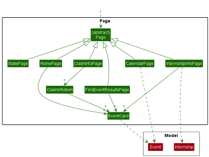

* Table of Contents
{:toc}

--------------------------------------------------------------------------------------------------------------------

## **Acknowledgements**

* Our in-app calendar display makes use JavaFX controls from the [CalendarFX](https://github.com/dlsc-software-consulting-gmbh/CalendarFX) library, an open source calendar framework for JavaFX 8. 

--------------------------------------------------------------------------------------------------------------------

## **Setting up, getting started**

Refer to the guide [_Setting up and getting started_](SettingUp.md).

--------------------------------------------------------------------------------------------------------------------

## **Design**

 :bulb: **Tip:** The `.puml` files used to create diagrams in this document can be found in the [diagrams](https://github.com/AY2223S2-CS2103T-W11-2/tp/blob/master/docs/diagrams/) folder. Refer to the [_PlantUML Tutorial_ at se-edu/guides](https://se-education.org/guides/tutorials/plantUml.html) to learn how to create and edit diagrams.
 

### Architecture

 
 
 
The ***Architecture Diagram*** given above explains the high-level design of the App.

Given below is a quick overview of main components and how they interact with each other.

**Main components of the architecture**

At the highest level, the App has two classes called [`Main`](https://github.com/ShanHng/tp/blob/master/src/main/java/seedu/internship/Main.java) and [`MainApp`](https://github.com/ShanHng/tp/blob/master/src/main/java/seedu/internship/MainApp.java). They are responsible for,
* At app launch: Initializes the components in the correct sequence, and connects them up with each other.
* At shut down: Shuts down the components and invokes cleanup methods where necessary.

[**`Commons`**](#common-classes) represents a collection of classes used by multiple other components.

The rest of the App consists of four components.

* [**`UI`**](#ui-component): The UI of the App.
* [**`Logic`**](#logic-component): The command executor.
* [**`Model`**](#model-component): Holds the data of the App in memory.
* [**`Storage`**](#storage-component): Reads data from, and writes data to, the hard disk.

**How the architecture components interact with each other**

The *Sequence Diagram* below shows how the components interact with each other for the scenario where the user issues the command `delete 1`.

 
 
 
Each of the four main components (also shown in the diagram above),

* defines its *API* in an `interface` with the same name as the Component.
* implements its functionality using a concrete `{Component Name}Manager` class (which follows the corresponding API `interface` mentioned in the previous point (`{Component Name}` is a placeholder for the four main components).

For example, the `Logic` component defines its API in the `Logic.java` interface and implements its functionality using the `LogicManager.java` class which follows the `Logic` interface. Other components interact with a given component through its interface rather than the concrete class (reason: to prevent outside component's being coupled to the implementation of a component), as illustrated in the partial *Class Diagram* below.

 
 
The following sections give more details of each component.

### UI component

The **API** of this component is specified in [`Ui.java`](https://github.com/AY2223S2-CS2103T-W11-2/tp/blob/master/src/main/java/seedu/internship/ui/Ui.java). The partial *Class Diagram* below showcases the main classes that reside in UI.

 

 
The UI consists of a `MainWindow` that is made up of parts, e.g. the `CommandBox`, `ResultDisplay`, `InternshipListPanel`, `StatusBarFooter`, `InfoPanel` etc. All these, including the `MainWindow`, inherit from the abstract `UiPart` class which captures the commonalities between classes that represent parts of the visible GUI.

The `UI` component uses the JavaFX UI framework. The layout of these UI parts are defined in matching `.fxml` files that are in the `src/main/resources/view` folder. For example, the layout of the [`MainWindow`](https://github.com/AY2223S2-CS2103T-W11-2/tp/blob/master/src/main/java/seedu/internship/ui/MainWindow.java) is specified in [`MainWindow.fxml`](https://github.com/AY2223S2-CS2103T-W11-2/tp/blob/master/src/main/resources/view/MainWindow.fxml)

The `UI` component,

* executes user commands using the `Logic` component.
* listens for changes to `Model` data so that the UI can be updated with the modified data.
* keeps a reference to the `Logic` component, because the `UI` relies on the `Logic` to execute commands.
* depends on some classes in the `Model` component, as it displays `Internship` object residing in the `Model`.

The abstract `Page` class represents the part of the GUI that displays information requested by the user. This may include details of an internship, existing clashes and etc. Note that a `Page` differs from `ResultDisplay`, which outputs the outcome of a command (e.g. success or failure) keyed in by the user.

Different types of information are rendered by different components, each of which is represented by their own concrete `Page` subclasses, such as `InternshipInfoPage`, `ClashesInfoPage` and etc. 

The *Class Diagram* below outlines the different concrete subclasses of `Page` and the subcomponents they depend on. 

 

**How a `Page` is generated** 

When the user executes a command, `Page` factory method `of` will be called and the result returned will be either of its concrete subclasses. The *Sequence Diagram* below illustrates the chain of method calls whenever a new `Page` is constructed to be displayed in the UI.

 

 

 

### Logic component

**API** : [`Logic.java`](https://github.com/AY2223S2-CS2103T-W11-2/tp/blob/master/src/main/java/seedu/internship/logic/Logic.java)

Here's a (partial) *Class Diagram* of the `Logic` component:

 

 
How the `Logic` component works:
1. When `Logic` is called upon to execute a command, it uses the `InternshipCatalogueParser` class to parse the user command.
1. This results in a `Command` object (more precisely, an object of one of its subclasses e.g., `AddCommand`) which is executed by the `LogicManager`.
1. The command can communicate with the `Model` when it is executed (e.g. to add an Internship).
1. The result of the command execution is encapsulated as a `CommandResult` object which is returned back from `Logic`.

The *Sequence Diagram* below illustrates the interactions within the `Logic` component for the `execute("delete 1")` API call.

 

:information_source: **Note:** The lifeline for `DeleteCommandParser` should end at the destroy marker (X) but due to a limitation of PlantUML, the lifeline reaches the end of diagram.

The *Class Diagram* below outlines classes in `Logic` used for parsing a user command:

 

 
How the parsing works:
* When called upon to parse a user command, the `InternshipCatalogueParser` class creates an `XYZCommandParser` (`XYZ` is a placeholder for the specific command name e.g., `AddCommandParser`) which uses the other classes shown above to parse the user command and create a `XYZCommand` object (e.g., `AddCommand`) which the `InternshipCatalogueParser` returns back as a `Command` object.
* All `XYZCommandParser` classes (e.g., `AddCommandParser`, `DeleteCommandParser`, ...) inherit from the `Parser` interface so that they can be treated similarly where possible e.g, during testing.

 

### Model component
**API** : [`Model.java`](https://github.com/AY2223S2-CS2103T-W11-2/tp/blob/master/src/main/java/seedu/internship/model/Model.java)

 

The `Model` component,

* Stores independent instances of `Internship` and `Event` which represents data stored by TinS.
  * The `Model` contains a catalogue for each of the two `{Entity}`  (`{Entity}` is a placeholder for `Internship` and `Event`). An `{Entity}Catalogue` stores the instances of `{Entity}` in a `Unique{Entity}List` object.
* Stores currently 'selected' `Internship` that results from a `select` command 
* Stores (e.g. results of a find query) as a separate _filtered_ list which is exposed to outsiders as an unmodifiable `ObservableList{Entity}` that can be 'observed' e.g. the UI can be bound to this list so that the UI automatically updates when the data in the list change.
* Stores a `UserPref` object that represents the user’s preferences. This is exposed to the outside as a `ReadOnlyUserPref` objects.

**Relationship Between `Internship` and `Event` entities**
Events cannot exist without its corresponding internship, thus there exists a composite relationship between the two.
Also, to make insertions and deletions of events easier, each event instance stores the internship instance it is
associated with. Due to this, extra precautions are taken during internship deletions, making sure the corresponding
events are deleted as well.

 

 
  

### Storage component

**API** : [`Storage.java`](https://github.com/AY2223S2-CS2103T-W11-2/tp/blob/master/src/main/java/seedu/address/storage/Storage.java)

The `Storage` component,
* can save internship catalogue data, event catalogue data and user preference data in json format, and read them back
into corresponding objects.
* inherits from both `InternshipCatalogueStorage`, `EventCatalogueStorage` and `UserPrefStorage`, which means it can be
treated as either one (if only the functionality of only one is needed).
* depends on some classes in the `Model` component (because the `Storage` component's job is to save/retrieve objects
that belong to the `Model`)

### Common classes

Classes used by multiple components are in the [`seedu.internship.commons`](https://github.com/AY2223S2-CS2103T-W11-2/tp/tree/master/src/main/java/seedu/internship/commons) package.

--------------------------------------------------------------------------------------------------------------------
 

## **Implementation**
 
This section describes some noteworthy details on how certain features are implemented.

### Selecting an `Internship`: `select` command

#### Implementation

The `select` command is a standard command that extends `Command` and returns a `CommandResult` in the `execute()` method, which does the following:

* Update `currentInternship` field in `InternshipCatalogue` which stores the current selected `Internship` for use in other commands.
* Obtains a list of all the `Event` belonging to that `Internship`.
* Returns a `CommandResult` containing the `Internship` and its list of `Event`, to be passed to the UI for display.

Given below is an example usage scenario and how the select command behaves at each step.

Step 1. The user enters the `select` command into the CLI: `select 2`.

Step 2. `InternshipCatalogueParser` parses the input and extracts the command `select`, creating a `SelectCommandParser` and passing it `"2"` by calling its `parser()` method.

Step 3. `SelectCommandParser` parses the index `2` of the selected internship and creates a `SelectCommand` instance with that index and returns it up to `LogicManager`.

Step 4. `LogicManager` calls the `execute()` method of the `SelectCommand` instance, which invokes `getFilteredInternshipList()` on `Model` to get a list of internships, and obtains the internship at index `2`.

Step 5. `SelectCommand` then passes that `Internship` instance through `updateSelectedInternship()` on `Model` which invokes `updateCurrent()` on `InternshipCatalogue` which updates its `currentInternship` field to that instance of `Internship`.

Step 6. `SelectCommand` also invokes `updateFilteredEventList()` and `getFilteredEventList()` on `Model` to obtain the list of `Event` belonging to that instance of `Internship` as `ObservableList<Event>`.

Step 7. Finally, a `CommandResult` is created containing that `Internship` and its `ObservableList<Event>` and it is returned to `LogicManager` for use in the UI.

The following *Sequence Diagram* shows how the `select` command works:

 
Note: The lifeline for `SelectCommand` should end at the destroy marker(X) but due to a limitation of PlantUML, the
lifeline reaches the end of diagram.

### Adding `Event` to an `Internship`: `event add` command

The `event add` command allows users to add instances of `Event` to a selected `Internship`.

#### Implementation

Below is an example usage. 

Step 1. User selects the `Internship` they want to add the event to by executing `select <id>`, where `<id>` refers to the index of the `Internship` on the list.

Step 2. User executes `event add na/<event name> st/<event start datetime> en/<event end datetime> de/<event description>` if they want to add an `Event` to the selected `Internship`.

  * User executes ` event add na/<event name> en/<event end datetime> de/<event description>` instead if they want to add a deadline to their selected internship. A deadline is simply an `Event` with only the end date.

The *Activity Diagram* for the above logic flow is below: 

  

  

  

Step 3. UI sends the Command to `Logic#InternshipCatalogueParser` , which uses the keyword `event` to identify this as an event command and sends the remainder of the command ` add na/... ` to `Logic#EventCatalogueParser`

Step 4. `EventCatalogueParser` identifies the add event command using the keyword `add`, then calls the `EventAddCommandParser` passing the arguments (everything except the keyword `and`) to be parsed.

Step 5. `EventAddCommandParser` tokenizes the arguments and creates an `Event` Object , which is then passed into a ` new EventAddCommand(event)` instance and the instance is returned by `EventAddCommandParser`.

Step 6. Then `LogicManager` passes the current `model` instance to `execute` method of  `EventAddCommand` instance.

Step 7. `EventAddCommand` instance uses the model object to find the `seletedInternship` and passes it to the `Event` object to initialise the `internship` variable inside the `Event` object.

Step 8. `Event` object is then added to the `UniqueEventList` using the `addEvent` method of `model`.

The *Sequence Diagram* for the adding the `Event` is below: 

 

### Viewing all `Event` on a calendar: `calendar` command

The `calendar` command displays all Events under existing Internships in a calendar rendered by third-party JavaFX library CalendarFX.

#### Implementation

Given below is an example usage, and what happens at every step of the execution of the `calendar` command.

Step 1. The user enters `calendar` command into the CommandBox.

Step 2. `MainWindow` receives the input and calls `execute('calendar')`. `execute(String)` is a method declared in LogicManager.

Step 3. `InternshipCatalogueParser` parses the input and extracts the command String `calendar`. A `CalendarCommand` is then created.

Step 4. `LogicManager` calls `execute(Model)` method of the `CalendarCommand`. The argument is a `Model` instance stored in `LogicManager`.

Step 5. In the method `execute`, `updateFilteredEventList(Predicate)` of the `Model` instance is called. `PREDICATE_SHOW_ALL_EVENTS`, which is a `Predicate` that evaluates to `true` for all `Event` is passed as argument. As a result, the `Model` now maintains an `ObservableList` of all `Event` instances from all existing `Internship`.

Step 6. The `execute` method creates a `CommandResult` that encapsulates the `ObservableList` of all `Event`s. The `CommandResult` is passed to `LogicManager` and subsequently back to `MainWindow` for the GUI to display. 

Step 7. In `MainWindow`'s `executeCommand` method, `Page.of(CommandResult)` is called to create a `Page` to show on the UI.

Step 8. `Page.of(CommandResult)` recognizes that `ResultType` of the `CommandResult` is `CALENDAR`, and creates a `CalendarPage` to be shown by calling its constructor. THe `ObservableList` of `Event` is passed to the constructor.

Step 9. Within constructor of the `CalendarPage`, here is an outline of what happens under the hood:
* A `MonthPage` is created. It is a composite CalendarFX control responsible for displaying all `Event` in a month in grids.
* The `MonthPage` is initialized with the current time and set up such that it updates its timing accordingly.
* A `Calendar` is created. It is a CalendarFX class that stores our `Event` in the form of `Entry` (another CalendarFX class you will see again in a later step)
* The `MonthPage` is connected to the `Calendar` through a wrapper class called `CalendarSource`. This is to allow the `MonthPage` to show the events in `Calendar`.

Step 10. Now, we will add each `Event` in the `ObservableList` of `Event` received by the `CalendarPage` constructor earlier to `Calendar`, each as an `Entry`. 
* `Entry` is a CalendarFX class that represents an event in the `Calendar`. If the `Event` is a deadline, then the `Entry` will be set as a full-day `Entry` with `setFullDay(true)`.

Step 11. The `CalendarPage` is constructed and now returned to the `MainWindow`, where it will be added as a children of `pagePlaceholder` for display on the GUI.

Step 8 till Step 11 are depicted in the *Sequence Diagram* below.

To learn more about CalendarFX, you may visit its Developer Guide [here](https://dlsc-software-consulting-gmbh.github.io/CalendarFX/).

### View useful `Statistics`: `stats` command

The `stats` command displays useful statistics based on `Internship` and `Event` data.

**Implementation**

The `stats` command is a standard command that extends `Comand` and returns a `CommandResult` in the `execute()` methods, which does the following:

* Obtains a `ObservableList<Event>` and `ObservableList<Internship>` from `Model`, which are lists containing all `Events` and `Internships`.
* Creates a `Statistics` object from those 2 lists.
* Returns a `CommandResult` of `ResultType.STATS` containing the `Statistcs` object, to be passed to the UI for displaying.

Given below is an example usage scenario and how the stats command behaves at each step.

Step 1. The user enters the `stats` command into the CLI: `stats`.

Step 2. `InternshipCatalogueParser` parses the input and extracts the command `select`, creating a `StatsCommand` and passes it to `LogicManager`

Step 3. `LogicManager` calls the `execute()` method of the `StatSCommand` instance, which invokes `getFilteredInternshipList()` and `getFilteredEventList()` on `Model` to get a list of internships and events.

Step 4. A `Statistics` object is created from the 2 lists. Which parses the list of `Internship` and `Event` to instantiate the appropriate `Datapoint` fields.

Step 5. Finally, a `CommandResult` is created containing that `Statistics` instance, which is then returned to `LogicManager` for use in the UI.

The following sequence diagram shows how the `stats` command works:

#### Design considerations:

**Aspect: How statistics are generated and used:**

* **Alternative 1 (current choice):** Separate `Statistics` class. `Statistics` parses lists of `Internship` and `Event` to create specified `Datapoint` fields.
  The `Statistics` is then passed into the `CommandResult`.
    * Pros: Allows for easy expansion for more kinds of statistics to be shown by adding more `Datapoint` fields in `Statistics`.
    * Cons: Difficult to implement.

* **Alternative 2:** `StatsCommand` parses the lists of `Internship` and `Event` to create list of `Datapoint`.
  The list of `Datapoint` is then passed into `CommandResult`.
    * Pros: Easy to implement.
    * Cons: Difficult to expand to add more kinds of statistics.

### View all clashing `Event`: `clash` command

#### Purpose of `clash` Function

The purpose of the `clash` command is for users to find events with clashing timings, enabling them to reschedule
clashing events. 

In TinS, there are two kinds of events: **Interviews** and **Deadlines**. Having multiple Deadlines with the same timing
does not result in a clash. However, having multiple Interviews with overlapping timings would result in a clash in
timing. Therefore, Interviews with overlapping timing would need to be picked up by the `clash` function.

#### Design Considerations

There were two possible ways of implementing the `clash` function:

1. Organising clash timing by Events: For each Event, event, stored in TinS, TinS will compare that particular Event will
   all other Events, otherEvents. If there is a clash found, the otherEvent will be placed in a list. After comparison
   with all other Events, the event and its corresponding list will be added to a hash map. This is repeated for all
   Events in TinS. 

   Advantage:
   - Implementation is easy.
  
   Disadvantage:
   - Duplicated records of clashes. For example, if event 1 clashes in timing with event 2, event 2 will be recorded in
     the list corresponding to event 1, and event 1 will be recorded in the list corresponding to event 2. This results
     in two records of the same clash.

2. Organising clash timings by Date: For each day, list out all the Events with clashes in timing on that day.

   Advantage:
   - No duplicated records of clashes.
   - Neater display of clashes.

   Disadvantage:
   - User will not be able to see exactly which two events have clashing timings on a day, but rather a collated list of
     all events that clash in timing.

The team has decided to proceed with the second implementation. This is because the team rationalized that organising
the clash events by date will make the application more easy to understand, as there will be no confusion caused by
duplicated records.

#### Implementation

The `clash` command feature is standard command that extends `Command` and returns a `CommandResult` in the
`execute()` method. The `CommandResult` returns a `HashMap`, which contains mapping from a `LocalDate` to `List<Event>`.
The `List<Event>` is the list of event with clashes on that particular date.

Given below is an example usage scenario and how the select command behaves at each step.

Step 1. The user enters the `clash` command into the CLI.

Step 2. `InternshipCatalogueParser` parses the input and extracts the command `clash`, and creates a new `ClashCommand`.

Step 3. `LogicManager` calls the `execute()` method of the `ClashCommand` instance, which invokes `getEventCatalogue()`
on `Model` to get the current Event Catalogue of TinS.

Step 4. The `findClashEvents()` is then called on `eventCatalogue` field in `EventCatalogue`. To avoid breaking the
abstraction barrier, `getEventClashHash()` is called on `events` field in `UniqueEventList`.

Step 5. The `getEventClashHash()` methods creates a list of Interview events from the current list of events in 
`internalList`, by filtering out Deadline events. 

Step 6. For each event in the list of Interview events, `getEventClashHash()` compares the event with all other events
in the list. If there is a clash in the two events, `clashingTimings(Event)` is invoked on the event to find all the
dates on which the events clash. These dates are added to the `HashMap`, and the clashing events are appended to
the list of events corresponding to those dates.

--------------------------------------------------------------------------------------------------------------------

## **Documentation, logging, testing, configuration, dev-ops**

* [Documentation guide](Documentation.md)
* [Testing guide](Testing.md)
* [Logging guide](Logging.md)
* [Configuration guide](Configuration.md)
* [DevOps guide](DevOps.md)

--------------------------------------------------------------------------------------------------------------------
 

## **Appendix: Requirements**

### Product scope

**Target user profile**:

* has a need to manage a significant number of internships applications from different hiring websites
* prefer desktop apps over other types
* can type fast
* prefers typing to mouse interactions
* is reasonably comfortable using CLI apps

**Value proposition**: manage internship applications faster than a typical mouse/GUI driven app.

### User stories

Priorities: High (must have) - `* * *`, Medium (nice to have) - `* *`, Low (unlikely to have) - `*`

| Priority | As a …​                                    | I want to …​                                                                                            | So that I can…​                                                     |
|----------|--------------------------------------------|---------------------------------------------------------------------------------------------------------|---------------------------------------------------------------------|
| `* * *`  | new user                                   | see usage instructions                                                                                  | refer to instructions when I forget how to use the App              |
| `* * *`  | Beginner user                              | add a new internship listing                                                                            | record details of my internship application                         |
| `* * *`  | Beginner user                              | delete a previously added internship listing                                                            | rid of dummy data or unwanted internship application                |
| `* *`    | user                                       | hide private internship description                                                                     | minimize chance of someone else seeing them by accident             |
| `* *`    | novice user                                | edit existing internship applications                                                                   | update outdated information or add new details                      |
| `*`      | intermediate user                          | quickly update the status of an internship                                                              | keep the status of my applications up to date                       |
| `* *`    | expert user                                | see all internship events that have clashes in dates                                                    | try to reschedule some of those events                              |
| `* * *`  | novice user                                | list all my intership applications easily                                                               | can confirm that my internship listing has been created             
| `* *`    | intermediate user                          | list all internship events that have deadlines on a particular date	                                    | avoid scheduling an interview on that day                           |
| `* * *`  | intermediate user                          | view my list of internships sorted by my desired criteria/field (e.g. status, deadline, interview date) | Easily look up internships that I am concerned about                |
| `* *`    | expert user                                | see all internships that have not received updates in a long time                                       | know which internships I need to follow up on                       |

### Use cases

(For all use cases below, the **System** is `TinS` and the **Actor** is the `user`, unless specified otherwise)

**Use case: Edit eventDescription of an Internship Application**

**MSS**

1. User requests to list all internship applications.
2. System shows a list of all internship applications
3. User specifies the ID of the internship application he wishes to edit.
4. System shows current eventDescription of the internship application and prompts user to input a new eventDescription to edit it.
5. User inputs the new eventDescription of the internship application.
6. System updates the internship application with the new details.

Use Case ends.

**Extensions**

* 3a. The specified ID is invalid.

    * 3a1. System shows an error message.

* 5a. User cancels the operation midway.

    * 5a1. System retains the original eventDescription and does not edit the internship application.

      Use case ends.

* 5b. User inputs invalid eventDescription.

    * 5b1. System shows an error message.
    * 5b2. System retains the original eventDescription and does not edit the internship application.

      Use case resumes at step 4.

**Use Case: Add an Internship Listing**

**MSS**

1. User requests to Add Internship followed by Internship Position, Company Name, Application Status, Description and Tag
2. System adds the internship listing

Use Case ends.

**Extensions**
* 1aUser inputs invalid Position.

    * 5a1. System shows an error message.
    

**Use case: List all internship applications**

**MSS**

1.  User requests to list all internship applications saved on System.
2.  System displays a list of internships.
    Use case ends.

**Extensions**

* 2a. The list is empty.
  * 2a1. 
  

**Use Case: Delete Internship Listing**

**MSS**

1. User requests to list internships inputted
2. System shows a list all the inputted internships
3. User requests to delete an internship listing
4. System deletes the internship listing

Use case ends.

**Extensions**

* 4a. User enters an invalid ID
    * System will show an error message and not delete any listing.

Use Case Ends.

**Use case: List all internship events with a deadline on a particular date**

**MSS**

1. User requests to list all internship events with an upcoming deadline on a particular date.
2. System displays the list of events.
 
Use case ends.

**Extensions**

* 3a. The date given by user is invalid (i.e. not formatted correctly).

  * 3a1. System displays an error message to inform the user that the input date is not valid.

* 4a. The list is empty.

* 4b. There are no internship applications with the upcoming deadline.

**Use case: List internships by desired criteria**

**MSS**

1. User requests to list internships by desired criteria
2. System prompts user to choose a criteria to list internship by
3. User inputs desired criteria
4. System displays list of all internships sorted in order based on chosen
   criteria

**Extensions**

* 1a. The list is empty.

  Use case ends.

* 3a. The given criteria is invalid.

    * 3a1. TinS shows an error message.

  Use case ends.

**Use case: View all clashes of internship Events.**

**MSS**

1.  User requests to view all clashes of internship Event dates.
2.  AddressBook shows a list of dates that have clashes and the Events that clashed.

    Use case ends.

**Extensions**

* 2a. There are no Event clashes.

  Use case ends.

### Non-Functional Requirements

1. Should work on any _mainstream OS_ as long as it has Java `11` or above installed.
2. Should be able to hold up to 1000 internships without a noticeable sluggishness in performance for typical usage.
3. A user with above average typing speed for regular English text (i.e. not code, not system admin commands) should be able to accomplish most of the tasks faster using commands than using the mouse.
4. A user should be able to navigate the application solely using the keyboard (i.e. input new internships, scroll through
   internship listing via keyboard).

*{More to be added}*

### Glossary

* **CLI**: A command-line interface (CLI) is a text based user interface to run programs.
* **ID**: This is a key to uniquely identify each internship. It is auto-generated by TinS based on position and company name.
* **Status**: This refers to the status of application.
* **Position**: The name of the internship position/role.

--------------------------------------------------------------------------------------------------------------------

## **Appendix: Instructions for manual testing**

Given below are instructions to test the app manually.

Note: These instructions only provide a starting point for testers to work on;
testers are expected to do more <b>exploratory</b> testing.

### Launch and shutdown

1. Initial launch

   1. Download the jar file and copy into an empty folder

   1. Double-click the jar file Expected: Shows the GUI with a set of sample contacts. The window size may not be optimum.

1. Saving window preferences

   1. Resize the window to an optimum size. Move the window to a different location. Close the window.

   1. Re-launch the app by double-clicking the jar file. 
       Expected: The most recent window size and location is retained.

1. _{ more test cases …​ }_

### Deleting an Internship

1. Deleting an internship while all internships are being shown

   1. Prerequisites: List all internships using the `list` command. Multiple internships in the list.

   1. Test case: `delete 1` 
      Expected: First internship is deleted from the list. Details of the deleted internship shown in the status message.

   1. Test case: `delete 0` 
      Expected: No internship is deleted. Error details shown in the status message. Status bar remains the same.

   1. Other incorrect delete commands to try: `delete`, `delete x`, `...` (where x is larger than the list size) 
      Expected: Similar to previous.

1. _{ more test cases …​ }_

### Saving data

1. Dealing with missing/corrupted data files

   1. _{explain how to simulate a missing/corrupted file, and the expected behavior}_

1. _{ more test cases …​ }_

