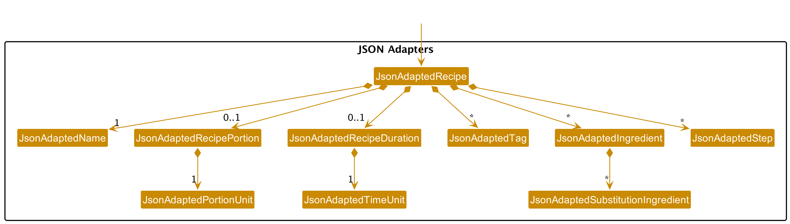

* Table of Contents
{:toc}

--------------------------------------------------------------------------------------------------------------------

## **Introduction**

### Purpose

RIZZipe is a command-based recipe database that was designed with versatile tagging and searching features in mind so 
you can always find the recipe you need! Make use of RIZZipe’s many features to achieve your culinary rizz.

This developer guide aims to detail the architecture and software design decisions behind RIZZipe, and is intended for
developers, designers, and software testers of RIZZipe. As RIZZipe is built on Java 8 and JavaFX 11, some 
technical knowledge of Java and JavaFX is recommended when reading this developer guide. 

### How to Use
This developer guide is broken down into 4 main sections:
1. **[Design](#design)**, which aims to detail the overall design and architecture of RIZZipe,
2. **[Feature Implementation](#feature-implementation)**, which aims to detail the implementation of some
notable features of RIZZipe,
3. **[Requirements](#appendix-requirements)**, which aims to detail the software requirements of RIZZipe, and
4. **[Instructions for manual testing](#appendix-instructions-for-manual-testing)**, which aims to detail steps that
software testers can take in order to test RIZZipe.

Any unfamiliar RIZZipe-specific terms can be found in the [glossary](#glossary) below.

### Acknowledgements
* This project is based on the [AddressBook Level 3 (AB3)](https://se-education.org/addressbook-level3/) project created by the [SE-EDU initiative](https://se-education.org/).
* Libraries used: [JavaFX](https://openjfx.io/), [JUnit5](https://github.com/junit-team/junit5), [Jackson](https://github.com/FasterXML/jackson)

--------------------------------------------------------------------------------------------------------------------

## **Design**

:bulb: **Tip:** The `.puml` files used to create diagrams in this document can be found in the [diagrams](https://github.com/se-edu/addressbook-level3/tree/master/docs/diagrams/) folder. Refer to the [_PlantUML Tutorial_ at se-edu/guides](https://se-education.org/guides/tutorials/plantUml.html) to learn how to create and edit diagrams.

### Architecture

The above _**Architecture Diagram**_ explains the high-level design of the App.

Given below is a quick overview of the main components of the app, and how they interact with each other.

#### Main components of the architecture

`Main` has 2 classes called `Main` and `MainApp`. Its responsibilities are:

* On startup: Initializes all components in the appropriate sequence (storage, model, logic, UI) 
  and connects them with each other.

* On shutdown: Shuts down all the components and invokes cleanup methods wherever necessary.

`Commons` represents a collection of classes used by multiple other components, and it stores information 
like GUI settings and user-visible error messages.

The rest of the App consists of four components.

* `UI`: The user interface of the app.
* `Logic`: The command executor.
* `Model`: Holds the data of the App in memory.
* `Storage`: Reads data from, and writes data to, the hard disk.

#### How the architecture components interact with each other

The following _Sequence Diagram_ shows how the different components interact with each other for the 
scenario where the user issues the command `delete 1`.

Each of the four main components as shown in the diagram above,
* defines its API in an `interface` with the same name as the Component.
* implements its functionality using a concrete `{Component name}Manager` class 
  (which follows the corresponding API `interface` mentioned above).

For instance, the `Logic` component defines its APi in the `Logic.java` interface and implements its functionality using the `LogicManager.java` class which follows the `Logic` interface.
Other components interact with a given component through its interface rather than the concrete class (in order to prevent external components being coupled to the implementation of a component) as illustrated in the (partial) class diagram below.

The following sections will give more details on each component.

### UI component

The **API** of this component is specified in [`Ui.java`](https://github.com/AY2223S2-CS2103T-T13-2/tp/tree/master/src/main/java/seedu/recipe/ui/Ui.java)

The UI consists of a `MainWindow` that is made up of parts e.g.`CommandBox`, `ResultDisplay`, `RecipeListPanel`, `StatusBarFooter` etc. All these, including the `MainWindow`, inherit from the abstract `UiPart` class which captures the commonalities between classes that represent parts of the visible GUI.

The `UI` component uses the JavaFx UI framework. The layout of these UI parts are defined in matching `.fxml` files that are in the `src/main/resources/view` folder. For example, the layout of the [`MainWindow`](https://github.com/AY2223S2-CS2103T-T13-2/tp/tree/master/src/main/java/seedu/recipe/ui/MainWindow.java) is specified in [`MainWindow.fxml`](https://github.com/AY2223S2-CS2103T-T13-2/tp/tree/master/src/main/resources/view/MainWindow.fxml)

The `UI` component,

* executes user commands using the `Logic` component.
* listens for changes to `Model` data so that the UI can be updated with the modified data.
* keeps a reference to the `Logic` component, because the `UI` relies on the `Logic` to execute commands.
* depends on some classes in the `Model` component, as it displays `Recipe` object residing in the `Model`.

### Logic component
The **API** of this component is specified in [`Logic.java`](https://github.com/AY2223S2-CS2103T-T13-2/tp/blob/master/src/main/java/seedu/recipe/logic/Logic.java)

Here's a (partial) class diagram of the `Logic` component:

How the `Logic` component works:

1. When `Logic` is called upon to execute a command, it uses the RecipeBookParser class to parse the user command.

2. This results in a `Command` object (more precisely, an object of one of its subclasses e.g., `AddCommand`) which
   is executed by the `LogicManager`.

3. The command can communicate with the `Model` when it is executed (e.g. to add a recipe).

4. The result of the command execution is encapsulated as a `CommandResult` object which is returned back from `Logic`.

The Sequence Diagram below illustrates the interactions within the `Logic` component for the
`("add n/Aglio Olio i/pasta i/pepper")` API call.

:information_source: **Note:** The lifeline for `AddCommandParser` should 
end at the destroy marker (X) but due to a limitation of PlantUML, the lifeline reaches the end of diagram.

Here are the other classes in `Logic` (omitted from the class diagram above) that are used for parsing a user command:

How the parsing works:
* When called upon to parse a user command, the `RecipeBookParser` class creates an `XYZCommandParser` (`XYZ` is a
  placeholder for the specific command name e.g., `AddCommandParser`) which uses the other classes shown above to parse
  the user command and create a `XYZCommand` object (e.g., `AddCommand`) which the `RecipeBookParser` returns back as a
  `Command` object.
* All `XYZCommandParser` classes (e.g., `AddCommandParser`, `DeleteCommandParser`, ...) inherit from the `Parser`
  interface so that they can be treated similarly where possible e.g, during testing.

### Model component

The **API** of this component is specified in [`Model.java`](https://github.com/AY2223S2-CS2103T-T13-2/tp/blob/master/src/main/java/seedu/recipe/model/Model.java)

The `Model` component,

* stores the recipe book data i.e., all `Recipe` objects (which are contained in a `UniqueRecipeBook` object).
* stores the currently 'selected' `Recipe` objects (e.g., results of a search query such as `find` or `list`) as a
  separate _filtered_ list which is exposed to outsiders as an unmodifiable `ObservableList<Recipe>` instance that
  can be 'observed' e.g. the UI can be bound to this list so that the UI automatically updates when the data in the
  list changes.
* stores a `UserPref` object that represents the user’s preferences. This is exposed to the outside as a
  `ReadOnlyUserPref` object.
* does not depend on any of the other three components (as the `Model` represents data entities of the domain, they
  should make sense on their own without depending on other components).

It is worth noting that to populate their `Recipe` objects with `Ingredient` instances, clients need only 
pass valid `IngredientBuilder` instances to `Recipe` objects.
The `Recipe` class will then populate its own `Ingredient` and `IngredientQuantifier` fields, via the given `IngredientBuilder`
and its use of `IngredientParser`.

:information_source: **Note:** An alternative (arguably, a more OOP) model is given below. It has a `Tag` list and
an `Ingredient` list in the `RecipeBook`, which `Recipe` references. This allows `RecipeBook` to only require
one `Tag` object per unique **tag**, and one `Ingredient` object per unique **ingredient**, instead of each `Recipe`
needing their own `Tag` or `Ingredient` objects.  
This, however is highly complex and adds additional dependencies,
which may in turn introduce more vulnerabilities or points of failure. As such, its implementation is a proposed
extension feature to this project.  

### Storage component

The **API** of this component is specified
in [`Storage.java`](https://github.com/AY2223S2-CS2103T-T13-2/tp/tree/master/src/main/java/seedu/recipe/storage/Storage.java)

**Structure:**

**The `Storage` component:**

* saves both recipe data and user preferences data in JSON format.
* reads saved JSON recipe data and user preferences data into their respective objects.
* inherits from both the `RecipeBookStorage` and `UserPrefStorage` interfaces, which means it can be treated as either
  one (if the functionality of only one is needed).
* depends on some classes in the Model component (because the Storage component’s job is to save/retrieve objects that
  belong to the Model).

**Implementation:**

Serialization and deserialization of recipe book objects is done using [Jackson](https://github.com/FasterXML/jackson).
To serialize a recipe, we must necessarily serialize its component fields too: its `Name`, `RecipePortion`,
`RecipeDuration`, `Tag` set, `Ingredient` list, and `Step` list.

The default JSON representation for each component is to express the fields of each component as key-value pairs.
However, this representation is too verbose and space-inefficient. Hence, we opted to write custom JSON adapters for
each component clas, which can be found in the [`seedu.recipe.storage.jsonadapters`](https://github.com/AY2223S2-CS2103T-T13-2/tp/tree/master/src/main/java/seedu/recipe/storage/jsonadapters) 
package. These JSON adapters allow us to express how each class should be serialized.

### Common classes
Classes used by multiple components are in the `seedu.recipe.commons` package.

--------------------------------------------------------------------------------------------------------------------

## **Feature Implementation**

This section describes some noteworthy details on how certain features are implemented.

### Feature: "Edit" Form UI

#### Implementation

The `RecipeForm` class extends the `UiPart<Region>` class and initializes various UI components, such as `TextFields` and `Buttons`, 
that are used for displaying and editing recipe details. The class has a constructor that takes a `Recipe` object and an `int` representing the displayed index. 
The fields of the form are pre-populated with the existing recipe's data if a non-null recipe is provided.

In addition, it implements the following operations:
* `RecipeForm#saveInitialValues()` —  Stores the initial values of the form fields in a HashMap.
* `RecipeForm#populateFields()` —  Prepopulates the form fields with values of current recipe.
* `RecipeForm#saveRecipe()` —  Saves the current recipe to the database by calling `EditRecipeEvent`.
* `RecipeForm#display` —  Displays the prepopulated form with corresponding UI components such as `Save Changes` button and `TextField` rows.
* `RecipeForm#closeForm()` —  Closes the form without saving any changes.

Given below is an example usage scenario and how the undo/redo mechanism behaves at each step.

#### Example Usage Scenario

Step 1. The user selects a recipe and presses the F key on the keyboard, triggering the `RecipeForm` to appear with the selected recipe's details pre-populated in the form fields.

Step 2. The user modifies the recipe's details in the form fields, such as changing the name, duration, portions, ingredients, steps, or tags.

Step 3. The user clicks on the "Save" button, causing the `RecipeForm#saveRecipe()` method to be called. This method checks which fields have been changed by comparing their current values with the initial values stored in the `initialValues` HashMap. Changed values are stored in a new `changedValues` HashMap.

Step 4. The `changedValues` HashMap, along with the `displayedIndex` of the recipe, is passed to an `EditRecipeEvent` object, which is then fired to update the model and subsequently the UI with the edited recipe details.

Step 5. The form is closed upon successful saving of the edited recipe.

_EditFormSequenceDiagram

Activity Diagram

The following activity diagram summarizes the process when a user edits a recipe using the RecipeForm:

_EditFormActivityDiagram

:information_source: Note:
If the user clicks the "Cancel" button or presses the ESC key, the form will be closed without saving any changes.
The form's window title will be "Edit Recipe" when editing an existing recipe, and "Add Recipe" when adding a new recipe.

### Feature: Find-by-property

#### Overview

The `find` command allows the user to filter recipes by their properties: 
e.g. their name, tags, or ingredients.
The following sequence diagram illustrates how the different components interact with each other
in the execution of a `find tag italian indian` command.

#### Implementation
As with all commands, the find command goes through the standard command execution pipeline.

In `FindCommandParser`, we determine which is the target property. 
Keyword validation and predicate creation is then done depending on the target property.

To determine whether a recipe's target property matches the given keywords, 2 predicate types are used:
* `PropertyNameContainsKeywordPredicate<T>`: checks whether some string representation of a property T 
matches any of the keywords.
  * e.g. if the property is `Name`, and we have a recipe named "Cacio e Pepe" and we are 
  finding recipes whose name match the keywords ["Pepe", "Cereal"], then this recipe would match.
* `PropertyCollectionContainsKeywordPredicate<T>`: checks whether a string representation of any property T 
in a collection of property T matches any of the keywords.
  * e.g. if the property is `Tag`, and we have a recipe with tags ["Italian", "Breakfast"] and we are
  finding recipes whose tags match the keywords ["Italian", "Indian"], then this recipe would match.

The use of generic types in the above predicates allows it to be implemented independent of the actual type
of the property, as long as the relevant getters are supplied.

### Feature: Ingredient Substitutions

#### Overview
The `sub` command allows the user to search for commonly used substitutions for ingredients.

#### Implementation
The sub command likewise goes through the standard command execution pipeline.

In `SubCommandParser`, we determine whether the ingredient defined by the user to be searched up for substitutes 
is valid using the regex for ingredient names that was previously defined.

In the execution of the sub command, the (valid) ingredient is queried first in a preloaded list of substitutions. 
This preloaded list is stored within SubstitutionsUtil and accessed through a getter from the recipe book.
Subsequently, the same ingredient is then queried in every recipe within the recipe book. 

Should the ingredient be found in the preloaded list, the corresponding substitutions will be added to the list of
substitutes to be returned to user. Otherwise, should the ingredient be found in any recipe in the recipe book, should 
any substitutes for that ingredient be stored, it will likewise be added to the list.

This list is created in the form of a `HashSet` such that any duplicates will not be displayed more than once.

The display of the results will be in the command result box which is different from the other commands, since the 
results of the `sub` command return ingredients instead of recipes. 

### Feature: Import RecipeBook

#### Overview
The `import` command allows the user to select a file in JSON format. If the file parses correctly into a RecipeBook,
the recipes in the JSON file are successfully imported while ignoring duplicates. If the file does not parse correctly,
the import will fail and be cancelled.

#### Implementation
The `import` command goes through the standard command execution pipeline, skipping the parser phase. 

During the execution of the import command, we will call `execute()` on `ImportManager` class which is a part of 
the `Storage` package which allows the user to select a JSON file that parses correctly into a RecipeBook. The parsing
is done by the parse methods in `JsonUtil` class.
Afterwards, we will check with our own RecipeBook to filter out duplicates and add the remaining non-duplicate recipes.

:information_source: Note: If the user clicks the "Cancel" button or closes the file explorer when selecting the JSON
file, the RecipeBook will remain unchanged.

### Feature: Export RecipeBook

#### Overview
The `export` command allows the user to select a file path to export the current Recipe Book in JSON format, similar to
how we would normally save the recipes in a JSON file. 

#### Implementation
The `export` command goes through the standard command execution pipeline, skipping the parser phase.

During the execution of the export command, we will call `execute()` on `ExportManager` class which is a part of
the `Storage` package which allows the user to select an existing file path for the export operation. 
The export is done by copying the current saved RecipeBook JSON file and exporting the copy of it. If the RecipeBook
Json file is not found, parsing of the current recipes will be done and exported as a JSON file.
The parsing is done by the parse methods in `JsonUtil` class.

:information_source: Note: If the user clicks the "Cancel" button or closes the file explorer when selecting the file
path, nothing will be exported.

--------------------------------------------------------------------------------------------------------------------

## **Appendix: Requirements**

### Product scope
**Target user profile:**
* has a need to manage a large number of recipes and their relevant information
* prefers desktop applications to mobile applications
* types fast
* prefers typing to mouse interactions

**Value proposition:** manage recipes more conveniently and quickly as opposed to a typical mouse app

### User stories

Priorities: High (must have) - `* * *`, Medium (nice to have) - `* *`, Low (unlikely to have) - `*`

| Priority | As a …​  | I want to …​                                                   | So that I can…​                                             |
|----------|----------|----------------------------------------------------------------|-------------------------------------------------------------|
| `* * *`  | new user | see usage instructions                                         | refer to instructions when I forget how to use the app      |
| `* * *`  | user     | add a new recipe                                               | reference it in the future                                  |
| `* * *`  | user     | list all my existing recipes                                   | get an overview of my whole cook book                       |
| `* * *`  | user     | view an existing recipe                                        | recall details of what I have previously added              |
| `* * *`  | user     | search for a recipe by name                                    | refer to a recipe I am thinking about                       |
| `* *`    | user     | search for recipes by its associated tags                      | refer to a certain type of recipe conveniently              |
| `* * *`  | chef     | search for ingredient substitutions for my missing ingredients | get an idea of possible replacements for ingredients I lack |
| `* * *`  | user     | delete an existing recipe                                      | remove recipes I no longer like                             |
| `* *  `  | user     | clear my recipe book                                           | start afresh and save a new set of recipes                  |
| `* * *`  | user     | share my recipe book with my friends                           | share my exciting and innovative recipes                    |
| `* * *`  | user     | import my friends' recipes                                     | have more recipes to refer to in my own recipe book         |

### Use cases

(For all use cases below, the **Book** is `RIZZipe` and the **Chef** is the `user`, unless specified otherwise)

#### **Use case: Ask for help**

**MSS (Main Success Scenario)**

1. Chef requests for help
2. Book shows URL to User Guide of recipe book

    Use case ends.

#### **Use case: List all recipes**

**MSS**

1.  Chef requests to list recipes
2.  Book shows a list of ***all*** recipes

    Use case ends.

**Extensions**

* 2a. The list is empty.

  Use case ends.

* 2b. The storage file is invalid.

    * 2b1. Book shows an error message, with a button that displays "file fixed" to check again if the file is valid.
    * 2b2. Chef rectifies/fixes error with the file.
    * 2b3. Chef clicks the "file fixed" button

      Use case resumes from step 2.

#### **Use case: Add a recipe**

**MSS**

1.  Chef requests to add a recipe
2.  Book prompts the user for the name, duration, portion, tags, ingredients and steps for the recipe
3.  Chef keys in details for each section in a single input, following the specified format
4.  Book adds the recipe to a database

**Extensions**

* 3a. The name inputted by chef is missing
    * 3a1. Book shows an error message.
    * 3a2. Book requests for the name of the recipe to be keyed in

      Use case resumes from step 3.

* 3b. The fields inputted by chef is in the wrong format
    * 3b1. Book shows an error message.
    * 3b2. Book requests for the fields to be input in an appropriate format
  
      Use case resumes from step 3.

* 4a. The given recipe is a duplicate. The name, duration, portion, tags, ingredients and steps coincide with another recipe
    * 4a1. Book shows a message that states there already exist such recipe.
    * 4a2. The recipe keyed is not added.

      Use case ends.

#### **Use case: View a recipe**

**MSS**

1. Chef requests to view a specific recipe in the list
2. Book return the specified recipe
   Use case ends.

**Extensions**

* 1a. The current list is empty

  Use case ends.

* 3a. The given index is invalid.
    * 3a1. Book shows an error message.

      Use case resumes from step 2.

#### **Use case: Delete a recipe**

**MSS**

1. Chef requests to list recipes
2. Book shows a list of ***all*** recipes
3. Chef requests to delete a specific recipe in the list
4. Book deletes the recipe

   Use case ends.

**Extensions**

* 2a. The list is empty.

  Use case ends.

* 3a. The given index is invalid.
    * 3a1. Book shows an error message.

      Use case resumes from step 2.

#### **Use case: Find a recipe by name**

**MSS**

1. Chef requests to search for all recipes which name matches a keyword
2. Book shows a list of such recipes

    Use case ends.

**Extensions**
* 1a. The keyword input is invalid
    * 1a1. Book shows an error message.
    
    Use case resumes from step 1.

* 2a. The list is empty.

    Use case ends.

#### **Use case: Find a recipe by tag**

**MSS**

1. Chef requests to search for all recipes which contain a specific tag
2. Book shows a list of such recipes

**Extensions**
* 1a. The tag input is invalid
    * 1a1. Book shows an error message.

  Use case resumes from step 1.

* 2a. The list is empty.

  Use case ends.

#### **Use case: Find an ingredient substitute**

**MSS**

1. Chef requests to find all substitutes for an ingredient
2. Book shows a list of such substitutes

    Use case ends.

**Extensions**
* 1a. The ingredient input is invalid
    * 1a1. Book shows an error message.

  Use case resumes from step 1.

* 2a. The list is empty.
    * 2a1. Book shows a message that states that no substitutes exist for this ingredient

  Use case ends.

#### **Use case: Clear recipe book**  

**MSS**

1. Chef requests to clear recipe book
2. Book clears itself of all recipes

   Use case ends.

### Non-Functional Requirements

1.  The app should be able to operate on any _mainstream OS_ as long as it has Java `11` or above installed.
2.  The app should be able to hold up to 1000 recipes without a noticeable sluggishness in performance for typical usage.
3.  A user with above average typing speed for regular English text (i.e. not code, not system admin commands) should be
    able to accomplish most of the tasks faster using commands than using the mouse.
4. The app should have a high level of test coverage to ensure quality.
5. The app should have automated testing and deployment processes to facilitate maintenance.
6. The app should have clean and well-documented code that is easy to maintain and update.
7. The app should be able to tolerate system failures, and save data to the storage file with backups.
8. The app should have clear and comprehensive documentation, including user manuals and technical documentation.
9. The app should be easily extensible to support new features and functionality.
10. The documentation should be up-to-date and accurate.
11. The documentation should be accessible to all users.

### Glossary

* **Mainstream OS**: Windows, Linux, Unix, OS-X
* **Main Success Scenario (MSS)**: The main or optimal flow of a use case, representing the successful completion of the user's goal.
* **Use Case**: A description of a specific user goal or task and the steps required to achieve it.
* **Chef**: The user or operator of the application.
* **Recipe**: A set of instructions to prepare and cook a specific dish. Includes dish name, ingredients, serving size, preparation time and any dietary labels.
* **Book**: Refers to the application or system that manages the storage and retrieval of recipe data.
* **Storage file**: The file used by the application to store and retrieve recipe data.
* **Index**: Refers to the position of a specific recipe within a list of recipes, represented by a numerical value.

--------------------------------------------------------------------------------------------------------------------

## **Appendix: Instructions for manual testing**

Given below are instructions to test the app manually.

:information_source: **Note:** These instructions only provide a starting point for testers to work on;
testers are expected to do more *exploratory* testing.

### Launch and shutdown

1. **Initial launch**
    1. Download the jar file and copy into an empty folder.
    2. Double-click the jar file.
       **Expected:** Shows the GUI with a set of sample recipes. The window size may not be optimum.

2. **Saving window preferences**
    1. Resize the window to an optimum size. Move the window to a different location. Close the window.
    2. Re-launch the app by double-clicking the jar file.
       **Expected:** The most recent window size and location is retained.
   
3. **Shutdown**
   1. When the app is open, type `exit` into the command bar and press the "enter" key.
       **Expected:** The app closes.

### Navigation
1. **Viewing recipes**   _(Preconditions: User is on the default MainWindow page.)_
   1. Click on a Recipe Card once.
   2. Press the "P" key.
     **Expected:** A modal showing containing the name, duration, portion, ingredients, steps, and tags fields of the recipe appears.  

2. **Edit form**   _(Preconditions: User is on the default Main Window page.)_
    1. Click on a recipe card to select it.
    2. Press the "F" key.
        **Expected:** A form modal appears, containing text input fields for name, duration, portion, ingredients, steps, and tags, prepopulated accurate to the recipe data, as well as a `Cancel` and `Save` button on the bottom right.
    3. Edit any of the fields in the form, using the format provided in the user guide as reference.
    4. Click `Save` at the bottom of the form to save and exit the form.
    5. Scroll to the bottom of the recipe list and click on the edited recipe.
    6. Press the "P" key to view its details.
        **Expected:** The recipe has been edited, with the new recipe details reflecting the edits made for each field.

### Commands
1. **Add form**   _(Preconditions: User is on the default Main Window page.)_
   1. Type `addf` in the command box and enter.
     **Expected:** A form modal appears, containing empty text input fields for name, duration, portion, ingredients, steps, and tags, as well as a `Cancel` and `Save` button on the bottom right.
   2. Fill up the form with a sample recipe given in the user guide.
   3. Click `Save` at the bottom of the form to save and exit the form.
   4. Scroll to the bottom of the recipe list and click on the newly added recipe.
   5. Press the "P" key to view its details.
     **Expected:** The newly-added recipe is present at the bottom of the recipe list, and contains exactly the fields entered in the form.  

### Importing and exporting data
1. **Importing data**   _(Preconditions: User is on the default Main Window page.)_
   1. Press "F3", or click `File > Import`.
       **Expected:** A file picker window appears, allowing the user to only select JSON files.
   2. Within the file picker window, navigate to a valid RIZZipe data file, select it, and press `Open`.
       **Expected:** The file picker window closes, and all the recipes in the data file have been added to the recipe list.

2. **Exporting data**   _(Preconditions: User is on the default Main Window page.)_
   1. Press "F4", or click `File > Export`.
       **Expected:** A file picker window appears, allowing the user to only save as JSON files.
   2. Within the file picker window, navigate to a valid folder and enter a valid file name.
   3. Press `Save`.
       **Expected:** The file picker window closes, and a file with the given filename is created in the given folder.
