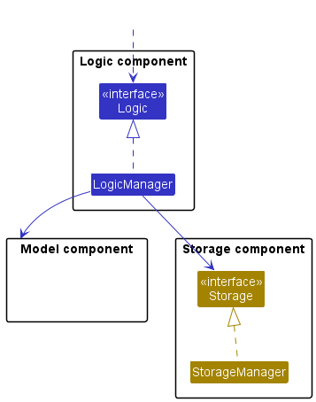

* Table of Contents
{:toc}

--------------------------------------------------------------------------------------------------------------------

## **Acknowledgements**

* Undo/redo feature implementation concept from original [_AddressBook 3 Developer Guide_](https://nus-cs2103-ay2223s2.github.io/tp/DeveloperGuide.html).
* Calendar feature implementation adapted from this [_JavaFX guide_](http://www.java2s.com/ref/java/javafx-gridpane-layout-calendar.html).

--------------------------------------------------------------------------------------------------------------------

## **Setting up, getting started**

Refer to the guide [_Setting up and getting started_](SettingUp.md).

--------------------------------------------------------------------------------------------------------------------

## **Design**

:bulb: **Tip:** The `.puml` files used to create diagrams in this document can be found in the [diagrams](https://github.com/AY2223S2-CS2103T-W13-2/tp/tree/master/docs/diagrams) folder. Refer to the [_PlantUML Tutorial_ at se-edu/guides](https://se-education.org/guides/tutorials/plantUml.html) to learn how to create and edit diagrams.

### Architecture

The ***Architecture Diagram*** given above explains the high-level design of the App.

Given below is a quick overview of main components and how they interact with each other.

**Main components of the architecture**

**`Main`** has two classes called [`Main`](https://github.com/AY2223S2-CS2103T-W13-2/tp/blob/master/src/main/java/seedu/address/Main.java) and [`MainApp`](https://github.com/AY2223S2-CS2103T-W13-2/tp/blob/master/src/main/java/seedu/address/MainApp.java). It is responsible for,
* At app launch: Initializes the components in the correct sequence, and connects them up with each other.
* At shut down: Shuts down the components and invokes cleanup methods where necessary.

[**`Commons`**](#common-classes) represents a collection of classes used by multiple other components.

The rest of the App consists of four components.

* [**`UI`**](#ui-component): The UI of the App.
* [**`Logic`**](#logic-component): The command executor.
* [**`Model`**](#model-component): Holds the data of the App in memory.
* [**`Storage`**](#storage-component): Reads data from, and writes data to, the hard disk.

**How the architecture components interact with each other**

The *Sequence Diagram* below shows how the components interact with each other for the scenario where the Coach issues the command `delete 1`.

Each of the four main components (also shown in the diagram above),

* defines its *API* in an `interface` with the same name as the Component.
* implements its functionality using a concrete `{Component Name}Manager` class (which follows the corresponding API `interface` mentioned in the previous point.)

For example, the `Logic` component defines its API in the `Logic.java` interface and implements its functionality using the `LogicManager.java` class which follows the `Logic` interface. Other components interact with a given component through its interface rather than the concrete class (reason: to prevent outside component's being coupled to the implementation of a component), as illustrated in the (partial) class diagram below.

The sections below give more details of each component.

### UI component

The **API** of this component is specified in [`Ui.java`](https://github.com/AY2223S2-CS2103T-W13-2/tp/blob/master/src/main/java/seedu/address/ui/Ui.java)

The UI consists of a `MainWindow` that is made up of parts e.g.`CommandBox`, `ResultDisplay`, `personListPanel`, `StatusBarFooter` etc. All these, including the `MainWindow`, inherit from the abstract `UiPart` class which captures the commonalities between classes that represent parts of the visible GUI.

The `UI` component uses the JavaFx UI framework. The layout of these UI parts are defined in matching `.fxml` files that are in the `src/main/resources/view` folder. For example, the layout of the [`MainWindow`](https://github.com/AY2223S2-CS2103T-W13-2/tp/blob/master/src/main/java/seedu/address/ui/MainWindow.java) is specified in [`MainWindow.fxml`](https://github.com/AY2223S2-CS2103T-W13-2/tp/blob/master/src/main/resources/view/MainWindow.fxml)

The `UI` component,

* executes Coach commands using the `Logic` component.
* listens for changes to `Model` data so that the UI can be updated with the modified data.
* keeps a reference to the `Logic` component, because the `UI` relies on the `Logic` to execute commands.
* depends on some classes in the `Model` component, as it displays `athlete` object residing in the `Model`.

### Logic component

**API** : [`Logic.java`](https://github.com/AY2223S2-CS2103T-W13-2/tp/blob/master/src/main/java/seedu/address/logic/Logic.java)

Here's a (partial) class diagram of the `Logic` component:

How the `Logic` component works:
1. When `Logic` is called upon to execute a command, it uses the `AddressBookParser` class to parse the Coach command.
1. This results in a `Command` object (more precisely, an object of one of its subclasses e.g., `AddCommand`) which is executed by the `LogicManager`.
1. The command can communicate with the `Model` when it is executed (e.g. to add an athlete).
1. The result of the command execution is encapsulated as a `CommandResult` object which is returned from `Logic`.

The Sequence Diagram below illustrates the interactions within the `Logic` component for the `execute("delete 1")` API call.

:information_source: **Note:** The lifeline for `DeleteCommandParser` should end at the 'destroy' marker (X) but due to a limitation of PlantUML, the lifeline reaches the end of diagram.

Here are the other classes in `Logic` (omitted from the class diagram above) that are used for parsing a Coach command:

How the parsing works:
* When called upon to parse a Coach command, the `AddressBookParser` class creates an `XYZCommandParser` (`XYZ` is a placeholder for the specific command name e.g., `AddCommandParser`) which uses the other classes shown above to parse the Coach command and create a `XYZCommand` object (e.g., `AddCommand`) which the `AddressBookParser` returns back as a `Command` object.
* All `XYZCommandParser` classes (e.g., `AddCommandParser`, `DeleteCommandParser`, ...) inherit from the `Parser` interface so that they can be treated similarly where possible e.g, during testing.

### Model component
**API** : [`Model.java`](https://github.com/AY2223S2-CS2103T-W13-2/tp/blob/master/src/main/java/seedu/address/model/Model.java)

The `Model` component,

* stores the AddressBook data i.e., all `Person` objects (which are contained in a `UniquePersonList` object).
* stores the currently 'selected' `Person` objects (e.g., results of a search query) as a separate _filtered_ list which is exposed to outsiders as an unmodifiable `ObservableList<Person>` that can be 'observed' e.g. the UI can be bound to this list so that the UI automatically updates when the data in the list change.
* stores a `UserPref` object that represents the Coach’s preferences. This is exposed to the outside as a `ReadOnlyUserPref` objects.
* does not depend on any of the other three components (as the `Model` represents data entities of the domain, they should make sense on their own without depending on other components)

:information_source: **Note:** An alternative (arguably, a more OOP) model is given below. It has a `Tag` list in the `AddressBook`, which `Person` references. This allows `AddressBook` to only require one `Tag` object per unique tag, instead of each `Person` needing their own `Tag` objects. 

### Storage component

**API** : [`Storage.java`](https://github.com/AY2223S2-CS2103T-W13-2/tp/blob/master/src/main/java/seedu/address/storage/Storage.java)

The `Storage` component,
* can save both AddressBook data and Coach preference data in json format, and read them back into corresponding objects.
* inherits from both `AddressBookStorage` and `UserPrefStorage`, which means it can be treated as either one (if only the functionality of only one is needed).
* depends on some classes in the `Model` component (because the `Storage` component's job is to save/retrieve objects that belong to the `Model`)

### Common classes

Classes used by multiple components are in the `seedu.AddressBook.commons` package.

--------------------------------------------------------------------------------------------------------------------

## **Implementation**

This section describes some noteworthy details on how certain features are implemented.

### Sort feature

#### Implementation

The proposed sort mechanism is facilitated by `UniquePersonList`.

Step 1. The Coach launches the application for the first time. The AddressBook is initialised.

Step 2. The Coach keys in some athletes and their details with the `add` method.

Step 3. After adding his athletes, the Coach wants to view his athletes in alphabetical order, so he wants to sort them by name in ascending order.

Step 4. The Coach then decides to execute the command `sort 1`.

#### Design considerations:

Restricting attribute and order to an integer value allows for the input to be easily anticipated and controlled.

* **Alternative 1 (current choice):** Allow Coaches to specify how to sort their list.
    * Pros: More flexible and customisable to the needs of the Coach.
    * Cons: More troublesome as Coach needs to check the User Guide to learn what integers to use.

### Undo/redo feature

#### Implementation

The proposed undo/redo mechanism is facilitated by `VersionedAddressBook`. It extends `AddressBook` with an undo/redo history, stored internally as an `addressBookStateList` and `currentStatePointer`. Additionally, it implements the following operations:

* `VersionedAddressBook#commit()` — Saves the current AddressBook state in its history.
* `VersionedAddressBook#undo()` — Restores the previous AddressBook state from its history.
* `VersionedAddressBook#redo()` — Restores a previously undone AddressBook state from its history.

These operations are exposed in the `Model` interface as `Model#commitAddressBook()`, `Model#undoAddressBook()` and `Model#redoAddressBook()` respectively.

Given below is an example usage scenario and how the undo/redo mechanism behaves at each step.

Step 1. The Coach launches the application for the first time. The `VersionedAddressBook` will be initialized with the initial AddressBook state, and the `currentStatePointer` pointing to that single AddressBook state.

Step 2. The Coach executes `delete 5` command to delete the 5th athlete in the AddressBook. The `delete` command calls `Model#commitAddressBook()`, causing the modified state of the AddressBook after the `delete 5` command executes to be saved in the `AddressBookStateList`, and the `currentStatePointer` is shifted to the newly inserted AddressBook state.

Step 3. The Coach executes `add n/David …​` to add a new athlete. The `add` command also calls `Model#commitAddressBook()`, causing another modified AddressBook state to be saved into the `AddressBookStateList`.

:information_source: **Note:** If a command fails its execution, it will not call `Model#commitAddressBook()`, so the AddressBook state will not be saved into the `AddressBookStateList`.

Step 4. The Coach now decides that adding the athlete was a mistake, and decides to undo that action by executing the `undo` command. The `undo` command will call `Model#undoAddressBook()`, which will shift the `currentStatePointer` once to the left, pointing it to the previous AddressBook state, and restores the AddressBook to that state.

:information_source: **Note:** If the `currentStatePointer` is at index 0, pointing to the initial AddressBook state, then there are no previous AddressBook states to restore. The `undo` command uses `VersionedAddressBook#canUndo()` to check if this is the case. If so, it will return an error to the Coach rather
than attempting to perform the undo operation.

The following sequence diagram shows how the undo operation works:

:information_source: **Note:** The lifeline for `UndoCommand` should end at the 'destroy' marker (X) but due to a limitation of PlantUML, the lifeline reaches the end of diagram.

The `redo` command does the opposite — it calls `Model#redoAddressBook()`, which shifts the `currentStatePointer` once to the right, pointing to the previously undone state, and restores the AddressBook to that state.

:information_source: **Note:** If the `currentStatePointer` is at index `AddressBookStateList.size() - 1`, pointing to the latest AddressBook state, then there are no undone AddressBook states to restore. The `redo` command uses `VersionedAddressBook#canRedo()` to check if this is the case. If so, it will return an error to the Coach rather than attempting to perform the redo.

Step 5. The Coach then decides to execute the command `list`. Commands that do not modify the AddressBook, such as `list`, will usually not call `Model#commitAddressBook()`, `Model#undoAddressBook()` or `Model#redoAddressBook()`. Thus, the `AddressBookStateList` remains unchanged.

Step 6. The Coach executes `clear`, which calls `Model#commitAddressBook()`. Since the `currentStatePointer` is not pointing at the end of the `AddressBookStateList`, all AddressBook states after the `currentStatePointer` will be purged. Reason: It no longer makes sense to redo the `add n/David …​` command. This is the behavior that most modern desktop applications follow.

The following activity diagram summarizes what happens when a Coach executes a new command:

#### Design considerations:

**Aspect: How undo & redo executes:**

* **Alternative 1 (current choice):** Saves the entire AddressBook.
  * Pros: Easy to implement.
  * Cons: May eventually have performance issues in terms of memory usage.

* **Alternative 2:** Individual command knows how to undo/redo by
  itself.
  * Pros: Will use less memory (e.g. for `delete`, just save the `Person` being deleted).
  * Cons: We must ensure that the implementation of each individual command are correct.

--------------------------------------------------------------------------------------------------------------------

## **Documentation, logging, testing, configuration, dev-ops**

* [Documentation guide](Documentation.md)
* [Testing guide](Testing.md)
* [Logging guide](Logging.md)
* [Configuration guide](Configuration.md)
* [DevOps guide](DevOps.md)

--------------------------------------------------------------------------------------------------------------------

## **Appendix: Planned Enhancements**

1. **The names of the individual tag and session-related commands are inconsistent.** 
   For example, creating a new athlete uses `add`, while a new session uses `create-session`, and adding an athlete to a session uses `student-add`. 
   We plan on standardising the names to `add`, `add-session`, and `add-athlete` to avoid confusion.

2. **Displayed messages cannot be seen entirely in the output box without scrolling.** 
   This is especially the case when the message is long (i.e. an error message). 
   We plan on adjusting the app UI such that the features scale according to the size of the window, including the output box which will display its entire contents without needing to scroll through it.

3. **The app cannot be navigated solely through keyboard input alone.** 
   Mouse clicks are still required to select an athlete/session even after using keyboard shortcuts to switch tabs.
   This may make it inconvenient for those who may prefer CLI apps. 
   We plan on making the app completely navigable through keyboard input while also allowing one to click parts of the GUI.

--------------------------------------------------------------------------------------------------------------------

## **Appendix: Requirements**

### Product scope

**Target Coach profile**: Sports Coaches

* has a need to manage a significant number of athletes.
* prefer desktop apps over other types.
* can type fast.
* prefers typing rather than mouse interaction.
* is reasonably comfortable using CLI (Command Line Interface) apps.
* requires to organise their Coaching schedule on a frequent basis.

**Value proposition**:
* manage contacts faster than a typical mouse/GUI-driven app.
* features are geared towards managing athletes.
* makes scheduling of training sessions more convenient than a regular calendar app.

### Coach stories

Priorities: High (must have) - `* * *` Medium (nice to have) - `* *` Low (unlikely to have) - `*`

| Priority | As a …​                           | I want to …​                              | So that I can…​                                                           |
|----------|-----------------------------------|-------------------------------------------|---------------------------------------------------------------------------|
| `* * *`  | new Coach                         | see usage instructions                    | refer to instructions when I forget how to use the app                    |
| `* * *`  | Coach                             | add a new athlete                         | record their profile                                                      |
| `* * *`  | Coach                             | delete an athlete                         | remove athletes that I no longer train                                    |
| `* * *`  | Coach                             | edit an athlete's details                 | refer to accurate information regarding that athlete                      |
| `* *`    | Coach                             | find an athlete by name                   | locate details of an athlete without having to go through the entire list |
| `* *`    | Coach                             | hide an athlete's private contact details | minimize chance of someone else seeing them by accident                   |
| `* *`    | Coach                             | organise athletes by groups               | facilitate better contact management                                      |
| `*`      | Coach with many athletes          | sort athletes by name                     | locate an athlete easily                                                  |
| `*`      | Coach with many training sessions | view my upcoming schedule as a calendar   | better plan my week.                                                      |

### Use cases

#### Use case UC01 - Ask for help

**MSS**

1. Coach requests for help.
2. SportSync displays a window containing a link to the SportSync User Guide.

    Use case ends.

#### Use case UC02 - Add an athlete to the contact list
**Guarantee:** A new athlete with specified name, phone number, pay rate, address and at least 
one tag is created and added to the contact list.

**MSS**

1. Coach requests to add a new athlete in the contact list.
2. Coach adds in the following details:
   * Name
   * Phone Number
   * Pay rate
   * Address
   * Tag (optional, can be more than one)
3. SportSync adds the athlete.

   Use case ends.

**Extensions**

* 2a. Not enough details of the athlete were given.
    * 2a1. SportSync shows an error message with the correct command format. 
      Use case resumes at step 1.

* 2b. An athlete with the same name already exists within the contact list.
    * 2b1. SportSync shows an error message telling the Coach that the athlete already exists. 
      Use case resumes at step 1.

* 2c. At least one of the details specified is of invalid format.
    * 2c1. SportSync shows an error message specifying how the detail is of the wrong format. 
      Use case resumes at step 1.

#### Use case UC03 - Delete an athlete from the contact list

**MSS**

1. Coach requests to delete a specific athlete by providing their index in the contact list.
2. SportSync deletes the athlete.

    Use case ends.

**Extensions**

* 1a. The given index is not a positive integer.
    * 1a1. SportSync shows an error message with the correct command format. 
      Use case resumes at step 1.

* 2a. The index given is out of bounds with respect to the size of the contact list.
    * 2a1. SportSync shows an error message stating the index is out of bounds. 
      Use case resumes at step 1.

#### Use case UC04 - Edit an athlete's details

**MSS**

1. Coach requests to edit a specific athlete's details by providing their index in the contact list.
2. Coach provides at least one of the following fields to edit:
    * Name
    * Phone Number
    * Pay rate
    * Address
    * Tag
3. SportSync edits the specified fields.

    Use case ends.

**Extensions**

* 1a. The given index is not a positive integer.
    * 1a1. SportSync shows an error message with the correct command format. 
      Use case resumes at step 1.

* 1b. The index given is out of bounds with respect to the size of the contact list.
    * 1b1. SportSync shows an error message stating the index is out of bounds. 
      Use case resumes at step 1.

* 2a. At least one of the edited fields is of invalid format.
    * 2a1. SportSync shows an error message specifying how the field is of the wrong format. 
      Use case resumes at step 1.

#### Use case UC05 - Find an athlete in the contact list

**MSS**

1. Coach requests to find athletes in the contact list, by name, by providing a keyword.
2. SportSync displays the search results.

    Use case ends.

**Extensions**

* 1a. The given keyword does not correspond to any athlete's name within the contact list.
    * 1a1. SportSync shows no athletes listed in the results. 
      Use case resumes at step 1.

#### Use case UC06 - List all athletes in the contact list
**Guarantee:** All athletes in the contact list will be shown.

**MSS**

1. Coach requests to list out all athletes in the contact list.
2. SportSync displays all athletes in the contact list.

    Use case ends.

#### Use case UC07 - Clear the contact and session lists

**MSS**

1.  Coach requests to clear all athletes from the contact list, and sessions from the session list.
2.  SportSync clears all athletes from the contact list, and sessions from the session list.

    Use case ends.

#### Use case UC08 - Sort the contact list by a specified attribute, in ascending order.

**MSS**

1. Coach requests to sort all athletes in the contact list by a specified attribute, in ascending order.
2. Coach provides one of the following integers to signify the attribute to sort by:
    1. Name
    2. Pay rate
3. SportSync sorts all athletes in the contact list by the specified attribute, in ascending order.

    Use case ends.

**Extensions**

* 2a. The given integer is not 1 or 2.
    * 2a1. SportSync does not sort the contact list. 
      Use case resumes at step 1.

#### Use case UC09 - Show all athletes belonging to one or more tags.

**MSS**

1. Coach requests to show all athletes belonging to specified tag(s) by name.
2. Coach provides one or more tags.
3. SportSync shows all athletes by name, belonging to one or more of the specified tag(s).

   Use case ends.

**Extensions**

* 2a. No tags are given.
    * 2a1. SportSync shows an error message with the correct command format. 
      Use case resumes at step 1.

* 2b. One of the tags given do not exist.
    * 2b1. SportSync shows an error message stating that the tag does not exist. 
      Use case resumes at step 1.

#### Use case UC10 - Undo a command

**MSS**

1. Coach requests to undo a mistakenly entered command.
2. SportSync undoes the mistakenly entered command.

   Use case ends.

**Extensions**

* 1a. An undo operation is not possible as there is nothing left to undo.
    * 1a1. SportSync shows an error message stating that there is nothing left to undo. 
      Use case resumes at step 1.

#### Use case UC11 - Redo a command

* Similar to UC10 but executes a redo operation instead.

#### Use case UC12 - Add tags to an athlete

**MSS**

1. Coach requests to add one or more tags to an athlete in the contact list by providing their index.
2. Coach provides one or more tags to add to the specified athlete.
3. SportSync adds the tag(s) to the athlete.

   Use case ends.

**Extensions**

* 1a. The given index is not valid.
    * 1a1. SportSync shows an error message with the correct command format. 
      Use case resumes at step 1.

* 2a. The athlete already has at least one of the specified tags.
    * 2a1. SportSync shows an error message stating that the athlete already has one of the tags. 
      Use case resumes at step 1.

#### Use case UC13 - Remove tags from an athlete

**MSS**

1. Coach requests to remove one or more tags to an athlete in the contact list by providing their index.
2. Coach provides one or more tags to remove from the specified athlete.
3. SportSync removes the tag(s) from the athlete.

   Use case ends.

**Extensions**

* 1a. The given index is not valid.
    * 1a1. SportSync shows an error message with the correct command format. 
      Use case resumes at step 1.

* 2a. One or more of the specified tags do not already belong to the athlete.
    * 2a1. SportSync shows an error message stating that the athlete does not have one of the tags. 
      Use case resumes at step 1.

#### Use case UC14 - Add a session to the session list

* Similar to UC02, but the Coach enters the session name, datetime and location to create a session.

#### Use case UC15 - Delete a session from the session list

* Similar to UC03 but deletes a session from the session list instead.

#### Use case UC16 - Edit a session's details

* Similar to UC04 but edits the details of a session instead.

#### Use case UC17 - Mark an athlete as present for a session

**MSS**

1. Coach requests to mark an athlete as present for a session specified by its index.
2. Coach provides the athlete's name to mark as present.
3. SportSync marks the athlete as present in the specified session.

   Use case ends.

**Extensions**

* 1a. The given index is not a positive integer.
    * 1a1. SportSync shows an error message with the correct command format. 
      Use case resumes at step 1.

* 1b. The index given is out of bounds with respect to the size of the session list.
    * 1b1. SportSync shows an error message stating the index is invalid. 
      Use case resumes at step 1.

* 2a. The specified athlete does not belong to the session.
    * 2a1. SportSync shows an error message stating that the athlete does not exist in the specified session. 
      Use case resumes at step 1.

#### Use case UC17 - Mark an athlete as absent for a session

* Similar to UC16 but marks the athlete as absent instead.

#### Use case UC18 - Add an athlete to a session

**MSS**

1. Coach requests to add an athlete to a session.
2. Coach provides the athlete's index in the contact list.
3. Coach provides the session's name in the session list.
4. SportSync adds the specified athlete to the specified session.

   Use case ends.

**Extensions**

* 2a. The given index is not a positive integer.
    * 2a1. SportSync shows an error message with the correct command format. 
      Use case resumes at step 1.

* 2b. The index given is out of bounds with respect to the size of the contact list.
    * 2b1. SportSync shows an error message stating the index is invalid. 
      Use case resumes at step 1.

* 3a. The session name given does not exist in the session list.
    * 3a1. SportSync shows an error message stating the session does not exist, and shows a list of available sessions. 
      Use case resumes at step 1.

* 3b. The specified athlete already belongs to the specified session
    * 3b1. SportSync shows an error message stating the specified athlete already belongs to the specified session. 
      Use case resumes at step 1.

#### Use case UC19 - Remove an athlete from a session

**MSS**

1. Coach requests to remove an athlete from a session.
2. Coach provides the athlete's index in the contact list.
3. Coach provides the session's name in the session list.
4. SportSync removes the specified athlete from the specified session.

   Use case ends.

**Extensions**

* 2a. The given index is not a positive integer.
    * 2a1. SportSync shows an error message with the correct command format. 
      Use case resumes at step 1.

* 2b. The index given is out of bounds with respect to the size of the contact list.
    * 2b1. SportSync shows an error message stating the index is invalid. 
      Use case resumes at step 1.

* 3a. The session name given does not exist in the session list.
    * 3a1. SportSync shows an error message stating the session does not exist, and shows a list of available sessions. 
      Use case resumes at step 1.

* 3b. The specified athlete does not already belong to the specified session
    * 3b1. SportSync shows an error message stating the specified athlete does not already belong to the specified session. 
      Use case resumes at step 1.

#### Use case UC20 - View calendar events

**MSS**

1. Coach requests to view the calendar events.
2. SportSync displays the calendar events on the interface.
3. Coach interacts with the calendar events as desired.

    Use case ends.

### Non-Functional Requirements

1.  Should work on any _mainstream OS_ as long as it has Java `11` or above installed.
2.  Should be able to hold up to 1000 athletes without a noticeable sluggishness in performance for typical usage.
3.  A Coach with above average typing speed for regular English text (i.e. not code, not system admin commands) should be able to accomplish most of the tasks faster using commands than using the mouse.

### Glossary

* **Mainstream OS**: Windows, Linux, Unix, OS-X.
* **Private contact detail**: A contact detail that is not meant to be shared with others.
* **Pay rate**: The amount of fees paid by the athlete per session.
* **Session**: A training period for athletes, conducted by a coach.
* **Session List**: A list of training sessions.
* **Athlete**: A person being trained by a coach.
* **Contact List**: A list of athletes and their contact details.
* **Coach**: A person who trains and directs athletes or a team.
* **Tag**: A label attached to an athlete in SportSync, used to group them together for easier management.

--------------------------------------------------------------------------------------------------------------------

## **Appendix: Instructions for manual testing**

Given below are some instructions to test some parts of the app manually. 
They do not represent the entirety of SportSync's available functionality, and testers are encouraged to come up with their own tests.

:information_source: **Note:** These instructions only provide a starting point for testers to work on;
testers are expected to do more *exploratory* testing.

### Launch and shutdown

1. **Initial launch**

   1. Download the jar file and copy into an empty folder

   2. Double-click the jar file. 
       Expected: Shows the GUI with a set of sample contacts. The window size may not be optimum.

2. **Saving window preferences**

   1. Resize the window to an optimum size. Move the window to a different location. Close the window.

   1. Re-launch the app by double-clicking the jar file. 
       Expected: The most recent window size and location is retained.

3. **Saving contact and session lists**

    1. Enter `add n/John Doe p/98765432 a/311, Clementi Ave 2, r/35 t/friends t/owesMoney` to add `John Doe` to your contact list.

    2. Close the window, then re-launch the app by double-clicking the jar file. 
        Expected: `John Doe` remains in the contact list, signifying a successful save.
   
    3. Repeat steps 1-2 with `create-session n/Hall s/10-03-2022 10:00 to 10-03-2022 11:00 l/MPSH2` to add `Hall` to your session list. 
       Expected: `Hall` remains in the session list, signifying a successful save.

### Deleting an athlete

1. **Deleting an athlete while all athletes are being shown**

   1. Prerequisites: List all athletes using the `list` command. Multiple athletes in the list.

   1. Test case: `delete 1` 
      Expected: First contact is deleted from the list. Details of the deleted contact shown in the status message. Timestamp in the status bar is updated.

   1. Test case: `delete 0` 
      Expected: No athlete is deleted. Error details shown in the status message. Status bar remains the same.

   1. Other incorrect delete commands to try: `delete`, `delete x`, `...` (where x is larger than the list size) 
      Expected: Similar to previous.
   
### Saving data

1. **Dealing with missing/corrupted data files**

   1. Prerequisites: Start up SportSync and perform a few commands to ensure `data` folder is present in the same directory as `sportsync.jar`

   2. Open `data` folder. Then, open `sportsync.json` with any text editor.

   3. Delete any row of the code so that the format is no longer consistent. Save the `sportsync.json` file.

   4. Start up SportSync again. 
       Expected: SportSync should have an empty session list and contact list.

   5. Add new athletes/sessions and continue using SportSync as per normal.
   

