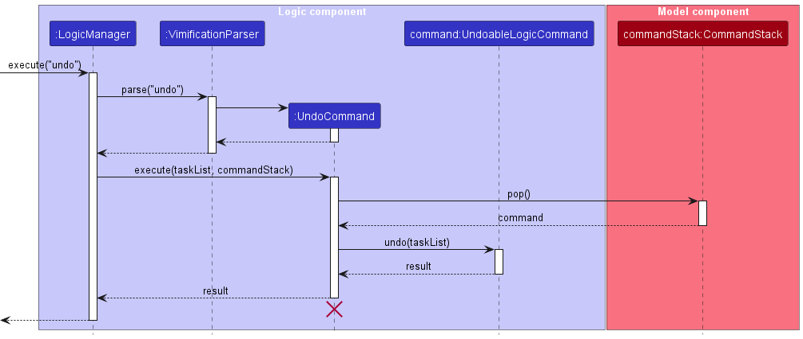

* Table of Contents
{:toc}

--------------------------------------------------------------------------------------------------------------------
## **Teaching Assistant Assistant**
Teaching Assistant Assistant (TAA) is a desktop app for managing teaching assistant activities, optimized for use via a Command Line Interface (CLI) while still having the benefits of a Graphical User Interface (GUI). If you can type fast, TAA can get your teaching assistant tasks done faster than traditional GUI apps.


--------------------------------------------------------------------------------------------------------------------

## **Acknowledgements**
This project is based on the AddressBook-Level3 project created by the [SE-EDU initiative](https://se-education.org/).

--------------------------------------------------------------------------------------------------------------------

## **Setting up, getting started**

Refer to the guide [_Setting up and getting started_](SettingUp.md).

--------------------------------------------------------------------------------------------------------------------

## **Design**

<div markdown="span" class="alert alert-primary">

:bulb: **Tip:** The `.puml` files used to create diagrams in this document can be found in the [diagrams](https://github.com/se-edu/addressbook-level3/tree/master/docs/diagrams/) folder. Refer to the [_PlantUML Tutorial_ at se-edu/guides](https://se-education.org/guides/tutorials/plantUml.html) to learn how to create and edit diagrams.
</div>

### Architecture


The ***Architecture Diagram*** given above explains the high-level design of the App.

Given below is a quick overview of main components and how they interact with each other.

**Main components of the architecture**

**`Main`** has two classes called [`Main`](https://github.com/AY2223S2-CS2103T-T14-4/tp/blob/master/src/main/java/taa/Main.java) and [`MainApp`](https://github.com/AY2223S2-CS2103T-T14-4/tp/blob/master/src/main/java/taa/MainApp.java). It is responsible for,
* At app launch: Initializes the components in the correct sequence, and connects them up with each other.
* At shut down: Shuts down the components and invokes cleanup methods where necessary.

[**`Commons`**](#common-classes) represents a collection of classes used by multiple other components.

The rest of the App consists of four components.

* [**`UI`**](#ui-component): The UI of the App.
* [**`Logic`**](#logic-component): The command executor.
* [**`Model`**](#model-component): Holds the data of the App in memory.
* [**`Storage`**](#storage-component): Reads data from, and writes data to, the hard disk.


**How the architecture components interact with each other**

The *Sequence Diagram* below shows how the components interact with each other for the scenario where the user issues the command `delete_student 1`.


Each of the four main components (also shown in the diagram above),

* defines its *API* in an `interface` with the same name as the Component.
* implements its functionality using a concrete `{Component Name}Manager` class (which follows the corresponding API `interface` mentioned in the previous point.

For example, the `Logic` component defines its API in the `Logic.java` interface and implements its functionality using the `LogicManager.java` class which follows the `Logic` interface. Other components interact with a given component through its interface rather than the concrete class (reason: to prevent outside component's being coupled to the implementation of a component), as illustrated in the (partial) class diagram below.


The sections below give more details of each component.

### UI component

The **API** of this component is specified in [`Ui.java`](https://github.com/AY2223S2-CS2103T-T14-4/tp/blob/master/src/main/java/taa/ui/Ui.java)


The UI consists of a `MainWindow` that is made up of parts e.g.`CommandBox`, `ResultDisplay`, `PersonListPanel`, `StatusBarFooter` etc. All these, including the `MainWindow`, inherit from the abstract `UiPart` class which captures the commonalities between classes that represent parts of the visible GUI.

The `UI` component uses the JavaFx UI framework. The layout of these UI parts are defined in matching `.fxml` files that are in the `src/main/resources/view` folder. For example, the layout of the [`MainWindow`](https://github.com/se-edu/addressbook-level3/tree/master/src/main/java/seedu/address/ui/MainWindow.java) is specified in [`MainWindow.fxml`](https://github.com/se-edu/addressbook-level3/tree/master/src/main/resources/view/MainWindow.fxml)

The `UI` component,

* executes user commands using the `Logic` component.
* listens for changes to `Model` data so that the UI can be updated with the modified data.
* keeps a reference to the `Logic` component, because the `UI` relies on the `Logic` to execute commands.
* depends on some classes in the `Model` component, as it displays `Person` object residing in the `Model`.

### Logic component

**API** : [`Logic.java`](https://github.com/AY2223S2-CS2103T-T14-4/tp/blob/master/src/main/java/taa/logic/Logic.java)

Here's a (partial) class diagram of the `Logic` component:


How the `Logic` component works:
1. When `Logic` is called upon to execute a command, it uses the `TaaParser` class to parse the user command.
1. This results in a `Command` object (more precisely, an object of one of its subclasses e.g., `AddCommand`) which is executed by the `LogicManager`.
1. The command can communicate with the `Model` when it is executed (e.g. to add a person).
1. The result of the command execution is encapsulated as a `CommandResult` object which is returned back from `Logic`.

The Sequence Diagram below illustrates the interactions within the `Logic` component for the `execute("delete 1")` API call.


<div markdown="span" class="alert alert-info">:information_source: **Note:** The lifeline for `DeleteStudentCommandParser` should end at the destroy marker (X) but due to a limitation of PlantUML, the lifeline reaches the end of diagram.
</div>

Here are the other classes in `Logic` (omitted from the class diagram above) that are used for parsing a user command:


How the parsing works:
* When called upon to parse a user command, the `TaaParser` class creates an `XYZCommandParser` (`XYZ` is a placeholder for the specific command name e.g., `AddCommandParser`) which uses the other classes shown above to parse the user command and create a `XYZCommand` object (e.g., `AddCommand`) which the `AddressBookParser` returns back as a `Command` object.
* All `XYZCommandParser` classes (e.g., `AddCommandParser`, `DeleteCommandParser`, ...) inherit from the `Parser` interface so that they can be treated similarly where possible e.g, during testing.

### Model component
**API** : [`Model.java`](https://github.com/AY2223S2-CS2103T-T14-4/tp/blob/master/src/main/java/taa/model/Model.java)


The `Model` component,

* stores the student data i.e., all `Student` objects (which are contained in a `UniqueStudentList` object).
* stores the currently 'selected' `Student` objects (e.g., results of a search query) as a separate _filtered_ list which is exposed to outsiders as an unmodifiable `ObservableList<Student>` that can be 'observed' e.g. the UI can be bound to this list so that the UI automatically updates when the data in the list change.
* stores a `UserPref` object that represents the user’s preferences. This is exposed to the outside as a `ReadOnlyUserPref` objects.
* does not depend on any of the other three components (as the `Model` represents data entities of the domain, they should make sense on their own without depending on other components)


### Storage component

**API** : [`Storage.java`](https://github.com/AY2223S2-CS2103T-T14-4/tp/blob/master/src/main/java/taa/storage/Storage.java)


The `Storage` component,
* can save both student data and user preference data in json format, and read them back into corresponding objects.
* inherits from both `AddressBookStorage` and `UserPrefStorage`, which means it can be treated as either one (if only the functionality of only one is needed).
* depends on some classes in the `Model` component (because the `Storage` component's job is to save/retrieve objects that belong to the `Model`)

Reading data from JSON:
* MainApp.initModelManager()
  * JsonTaaStorage.readTaaData()
    * JsonUtil.readJsonFile()
    * JsonSerializableTaaData.toModelType()

Saving data to JSON:
* LogicManager.execute()
  * ModelManager.getTaaData()
  * JsonTaaStorage.saveTaaData())
    * JsonUtil.saveJsonFile()
    * JsonSerializableTaaData.new()

### Common classes

Classes used by multiple components are in the `taa.commons` package.

--------------------------------------------------------------------------------------------------------------------

## **Implementation**

This section describes some noteworthy details on how certain features are implemented.

### \[Proposed\] Undo/redo feature

#### Proposed Implementation

The proposed undo/redo mechanism is facilitated by `VersionedAddressBook`. It extends `AddressBook` with an undo/redo history, stored internally as an `addressBookStateList` and `currentStatePointer`. Additionally, it implements the following operations:

* `VersionedAddressBook#commit()` — Saves the current address book state in its history.
* `VersionedAddressBook#undo()` — Restores the previous address book state from its history.
* `VersionedAddressBook#redo()` — Restores a previously undone address book state from its history.

These operations are exposed in the `Model` interface as `Model#commitAddressBook()`, `Model#undoAddressBook()` and `Model#redoAddressBook()` respectively.

Given below is an example usage scenario and how the undo/redo mechanism behaves at each step.

Step 1. The user launches the application for the first time. The `VersionedAddressBook` will be initialized with the initial address book state, and the `currentStatePointer` pointing to that single address book state.


Step 2. The user executes `delete 5` command to delete the 5th person in the address book. The `delete` command calls `Model#commitAddressBook()`, causing the modified state of the address book after the `delete 5` command executes to be saved in the `addressBookStateList`, and the `currentStatePointer` is shifted to the newly inserted address book state.


Step 3. The user executes `add n/David …​` to add a new person. The `add` command also calls `Model#commitAddressBook()`, causing another modified address book state to be saved into the `addressBookStateList`.


<div markdown="span" class="alert alert-info">:information_source: **Note:** If a command fails its execution, it will not call `Model#commitAddressBook()`, so the address book state will not be saved into the `addressBookStateList`.

</div>

Step 4. The user now decides that adding the person was a mistake, and decides to undo that action by executing the `undo` command. The `undo` command will call `Model#undoAddressBook()`, which will shift the `currentStatePointer` once to the left, pointing it to the previous address book state, and restores the address book to that state.


<div markdown="span" class="alert alert-info">:information_source: **Note:** If the `currentStatePointer` is at index 0, pointing to the initial AddressBook state, then there are no previous AddressBook states to restore. The `undo` command uses `Model#canUndoAddressBook()` to check if this is the case. If so, it will return an error to the user rather
than attempting to perform the undo.

</div>

The following sequence diagram shows how the undo operation works:



<div markdown="span" class="alert alert-info">:information_source: **Note:** The lifeline for `UndoCommand` should end at the destroy marker (X) but due to a limitation of PlantUML, the lifeline reaches the end of diagram.

</div>

The `redo` command does the opposite — it calls `Model#redoAddressBook()`, which shifts the `currentStatePointer` once to the right, pointing to the previously undone state, and restores the address book to that state.

<div markdown="span" class="alert alert-info">:information_source: **Note:** If the `currentStatePointer` is at index `addressBookStateList.size() - 1`, pointing to the latest address book state, then there are no undone AddressBook states to restore. The `redo` command uses `Model#canRedoAddressBook()` to check if this is the case. If so, it will return an error to the user rather than attempting to perform the redo.

</div>

Step 5. The user then decides to execute the command `list`. Commands that do not modify the address book, such as `list`, will usually not call `Model#commitAddressBook()`, `Model#undoAddressBook()` or `Model#redoAddressBook()`. Thus, the `addressBookStateList` remains unchanged.


Step 6. The user executes `clear`, which calls `Model#commitAddressBook()`. Since the `currentStatePointer` is not pointing at the end of the `addressBookStateList`, all address book states after the `currentStatePointer` will be purged. Reason: It no longer makes sense to redo the `add n/David …​` command. This is the behavior that most modern desktop applications follow.


The following activity diagram summarizes what happens when a user executes a new command:


#### Design considerations:

**Aspect: How undo & redo executes:**

* **Alternative 1 (current choice):** Saves the entire address book.
    * Pros: Easy to implement.
    * Cons: May have performance issues in terms of memory usage.

* **Alternative 2:** Individual command knows how to undo/redo by
  itself.
    * Pros: Will use less memory (e.g. for `delete`, just save the person being deleted).
    * Cons: We must ensure that the implementation of each individual command are correct.

_{more aspects and alternatives to be added}_

### \[Proposed\] Data archiving

_{Explain here how the data archiving feature will be implemented}_


--------------------------------------------------------------------------------------------------------------------

## **Documentation, logging, testing, configuration, dev-ops**

* [Documentation guide](Documentation.md)
* [Testing guide](Testing.md)
* [Logging guide](Logging.md)
* [Configuration guide](Configuration.md)
* [DevOps guide](DevOps.md)

--------------------------------------------------------------------------------------------------------------------

## **Appendix: Requirements**

### Product scope

**Target user profile**:

* has a need to manage many students, groups and classes
* relatively more tech-savvy than the average population, able to perform complex tasks on digital platforms
* prefers typing to mouse interactions
* need to be able to easily aggregate and analyze students' statistics
* need to keep track of tasks needed to do during each lesson and time allocation for each
* is reasonably comfortable using CLI apps
* can type fast

**Value proposition**:

* Get teaching assistant tasks done more conveniently and quickly as compared to traditional GUI apps
* Features are fully customized for teaching assistants in NUS to ensure user-friendliness for this particular group

### User stories

Priorities: High (must have) - `* * *`, Medium (nice to have) - `* *`, Low (unlikely to have) - `*`

| Priority | As a …         | I want to …                                             | So that I can…                                                                                               |
|----------|----------------|---------------------------------------------------------|--------------------------------------------------------------------------------------------------------------|
| `* * *`  | TA             | manage my classes in a separate, distinct system        | avoid being confused with the various command names that may overlap with that of non-class-related commands |
| `* * *`  | TA             | group students by class                                 | track participation/assignment statuses by students' own classes                                             |
| `* * *`  | TA             | add students to a class list                            | expand the class list if needed (e.g. new student joins)                                                     |
| `* * *`  | TA             | delete students from a class list                       | remove students who are no longer part of the class (e.g. dropped class)                                     |
| `* * *`  | TA             | allocate assignments to students by class               | track the statuses of assignments assigned to each class                                                     |
| `* * *`  | careless TA    | remove assignments allocated to a class                 | remove incorrect assignment entries                                                                          |
| `* * *`  | responsible TA | track students' participation statuses                  | award participation marks to students fairly and accurately                                                  |
| `* * *`  | forgetful TA   | track valid reasons for a student's absence             | record attendance for those with valid reasons                                                               |
| `* * *`  | forgetful TA   | track student assignment submissions/scores/deadlines   | grade assignments easily                                                                                     |
| `* * *`  | stressed TA    | manage time for different tasks during class conducting | complete all tasks during each lesson on time                                                                |
| `* * *`  | user           | have CSV files storing my data                          | make backups to guard against data loss                                                                      |
| `* * *`  | user           | load in CSV files to restore data                       | avoid having to do manual data entry when using the app from scratch                                         |
| `* * *`  | user           | exit the app gracefully                                 | avoid data corruption                                                                                        |
| `* *`    | TA             | assign individual assignment grades to students         | track the specific grade each student has obtained for each assignment                                       |
| `* *`    | forgetful TA   | track questions asked by students                       | answer them on time                                                                                          |
| `* *`    | forgetful TA   | keep a timeline/lesson plan for each lesson             | complete the lessons on time without missing out on any content                                              |
| `* *`    | forgetful TA   | be reminded to take attendance before class ends        | award attendance marks correctly                                                                             |
| `* *`    | TA             | group students quickly and fairly                       | reduce time wasted due to group formation                                                                    |
| `* *`    | TA             | search students by keywords                             | lessen the mental load required to find a student                                                            |
| `* *`    | TA             | list all students in a class                            | see an overview of the students in a class at a glance                                                       |
| `*`      | head TA        | manage all other TAs                                    | track whether each TA has done their job correctly                                                           |

*{More to be added}*

### Use cases

(For all use cases below, the **System** is the `TAA` and the **Actor** is the `user`, unless specified otherwise)

**use case: mark attendance of a student**

**use case: unmark attendance of a student**

**use case: insert participation points of a student**

**Use case: delete a student**

**Use case: Add Assignment**
asgn_add

**Use case: Delete Assignment**
asgn_delete

**Use case: Grade Student Submission of an Assignment**
grade

**Use case: Ungrade Student Submission of an Assignment**
ungrade


**Use case: Add Class List** classlist

**User case: List Student** list

**User case: SearchStudent** search

## **Mark/Unmark Attendance**

Mark and Unmark is very similar in nature and their implementation. <br>

Below is the main success scenario of Mark (Unmark is not given but very similar to Mark)


**MSS**

1. User requests to mark attendance of a specific student in the list for a specified week
2. TAA marks attendance

   Use case ends.

**Extensions**

* 1a. The given index/week is invalid.

    * 1a1. TAA shows an error message.

      Use case ends.
* 3b. The given week's attendance is already marked

    * 3a1. TAA shows message that attendance for that week is already marked.

      Use case ends.

The Mark/Unmark commands are similar, and explanation will be done for Mark command

Below is the sequence diagram for Marking attendane of a student


## **Insert Participation**

Below is the main success scenario of Insert Participation


**MSS**


1. User requests to insert participation points for a specific student for a specified week
2. TAA inserts participation points

   Use case ends.

**Extensions**

* 1a. The given index/week/participation points is invalid.

    * 1a1. TAA shows an error message.

      Use case ends.
* 1b. The given week's attendance is not marked

    * 1bTAA shows message that attendance must be marked first before adding participation points.

      Use case ends.

Below is the sequence diagram for inserting participation points


## **Add Assignment**

Below is the main success scenario of adding an Assignment

**MSS**

1. User requests to add an assignment of a specific name and optionally, total marks.
2. TAA creates the assignment, with total marks having a default value of 100 if it is not specified above.

   Use case ends.

**Extensions**

* 1a. There are no assignments with that particular name, .

  Use case resumes from step 2.

* 1b. There is already an assignment with that particular name.

    * 1b1. TAA shows an error message

* 1c. Total marks given is negative.

    * 1c1. TAA shows an error message


AddAssignment command is facilitated by `AddAssignmentCommandParser`, `AddAssignmentCommand` and `Model`

* `AddAssignmentCommandParser`-- Parse the input of users
* `AddAssignmentCommand` -- Execute the command given the parsed user input
* `Model` -- Updates the assignment list.

Below is the sequence diagram for adding an assignment.


## **Students-Related Commands**

Below is the main success scenario of students-related commands.

**Adding a student**

1. User requests to add a user with a specific name into one or more classes.
2. TAA adds the student into the specified classes.

   Use case ends.

**Extensions**

* 1a. The given student/class name is invalid.
    * 1a1. TAA shows an error message.

      Use case resumes from step 1.

* 1b. The given class(es) does not exist.
  * 1b1. TAA creates a new class for each class that does not exist yet.

    Use case resumes from step 2.


**list student**
1. User requests to list all students in a class.
2. TAA shows a list of students and number of students listed.

    Use case ends.

**search student**
1.  User requests to search for a particular student
2.  TAA shows the information of the student searched

    Use case ends.

**Extensions**

* 2a. No student is found for the keyword.

  Use case ends.

**add classlist**
1.  User requests to add a new class list with a specific name.
2.  TAA adds the new class list with the name specified.
    Use case ends.

**Extensions**

* 2a. Class list with the same name already exists.
  * 2a1. TAA shows an error message.
    Use case ends.

## **Alarm-Related Commands**

Below is the main success scenarios of adding, deleting and listing alarms.

**add alarm**
1.  User requests to add an alarm with specified time and comment.
2.  TAA adds the new alarm with the time and comment specified.
    Use case ends.

**Extensions**

* 2a. User does not provide sufficient arguments
    * 2a1. TAA shows an error message.
      Use case ends.

Below is the sequence diagram for adding an alarm.


**delete alarm**
1.  User requests to delete a scheduled alarm with specified index.
2.  TAA deletes the alarm with the specified index, the alarm will no longer ring.
    Use case ends.

**Extensions**
* 2a. User does not provide sufficient arguments
    * 2a1. TAA shows an error message.
      Use case ends.
* 2b. User does not provide a valid index
    * 2a1. TAA shows an error message.
      Use case ends.

Below is the sequence diagram for deleting an alarm.


**list alarm**
1.  User requests to list all scheduled alarms.
2. TAA shows all scheduled alarms on the command window.

**Extensions**
* 2a. There is no alarms scheduled.
    * 2a1. TAA shows an error message.
      Use case ends.

Below is the sequence diagram for listing the alarms.


### Non-functional requirements

* All aspects of the system should work on Mac, Windows, and Linux operating systems.
* The system should be easy to use by anyone who can type fast.
* The system should not crash or corrupt files under any input text.
* The system should respond within 1 second.

### Glossary

* **Mainstream OS**: Windows, Linux, Unix, OS-X
* **Private contact detail**: A contact detail that is not meant to be shared with others

--------------------------------------------------------------------------------------------------------------------

## **Appendix: Instructions for manual testing**

Given below are instructions to test the app manually.

<div markdown="span" class="alert alert-info">:information_source: **Note:** These instructions only provide a starting point for testers to work on;
testers are expected to do more *exploratory* testing.

</div>

### Launch and shutdown

1. Initial launch

    1. Download the jar file and copy into an empty folder

    1. Double-click the jar file Expected: Shows the GUI with a set of sample contacts. The window size may not be
       optimum.

1. Saving window preferences

    1. Resize the window to an optimum size. Move the window to a different location. Close the window.

    1. Re-launch the app by double-clicking the jar file.<br>
       Expected: The most recent window size and location is retained.

1. _{ more test cases … }_

### Deleting a student

1. Deleting a student while all students are being shown

    1. Prerequisites: List all students in the class using the `classlist Tutorial_T01` command. Multiple students in the list.

    1. Test case: `delete_student 1`<br>
       Expected: First contact is deleted from the list. Details of the deleted contact shown in the status message.
       Timestamp in the status bar is updated.

    1. Test case: `delete_student 0`<br>
       Expected: No student is deleted. Error details shown in the status message. Status bar remains the same.

    1. Other incorrect delete commands to try: `delete_student`, `delete_student x`, `...` (where x is larger than the list size)<br>
       Expected: Similar to previous.

1. _{ more test cases … }_

### Loading/Saving data in CSV format

Our CSV files follow the following format:

1. All CSV files are header-less. Student data has exactly 2 columns: name, tags.
2. If a student has no tags, a comma representing the tags column is still required
   because [if a column is defined as optional, it means that the column is required to exist, but the value can be blank.](https://www.ibm.com/docs/en/atlas-policy-suite/6.0.3?topic=files-rules-creating-populating-csv)

Acceptable CSV format example:

```
Technoblade, Minecrafter Pig Anarchist
Meggy Spletzer,Inkling
John von Neumann,
```

1. Dealing with file access denial:
    * How to simulate: _TODO_
    * Expected behavior: Doesn't change anything and show message to user:
   ```
   Access to the specified file is denied by system.
   ```
1. Dealing with file not exists:
    * How to simulate: use any string that is not a directory of any real file.
    * Expected behavior: Doesn't change anything and show message to user:
   ```
   The specified file does not exist.
   ```
1. Dealing with file being a directory:
    * How to simulate: use a directory path.
    * Expected behavior: Doesn't change anything and show message to user:
   ```
   The specified file path is a directory.
   ```
1. Dealing with FileReader throwing FileNotFoundException:
    * How to simulate: _TODO_
    * Expected behavior: Doesn't change anything and show message to user:
   ```
   The specified file cannot be opened for reading.
   ```
1. Dealing with CSVParser throwing IOException:
    * How to simulate: _TODO_
    * Expected behavior: Doesn't change anything and show message to user:
   ```
   An IOException occurred while reading specified file.
   ```
1. Dealing with ill-formatted CSV entry:
    * How to simulate: use csv files that contains inconsistent entries, unmapped columns, or fields violating their
      constraints.
    * Expected behavior: Doesn't change anything and show message indicating detailed entry that caused the error to
      user:

1. Dealing with at least 2 students in CSV file having same name:
    * How to simulate: use csv files that contains at least students with same name.
    * Expected behavior: doesn't change anything and show message indicating the specific student existing twice in
      file.
1. Dealing with adding student whose name already existed in list:
    * How to simulate: use csv files that contains student whose name already existed in list.
    * Expected behavior: If -force is used, replace the student in list. <p>
      Otherwise, doesn't change anything and show message indicating the specific student already existed in list to
      user.
