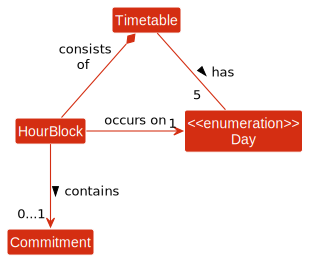
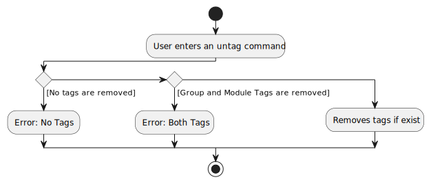
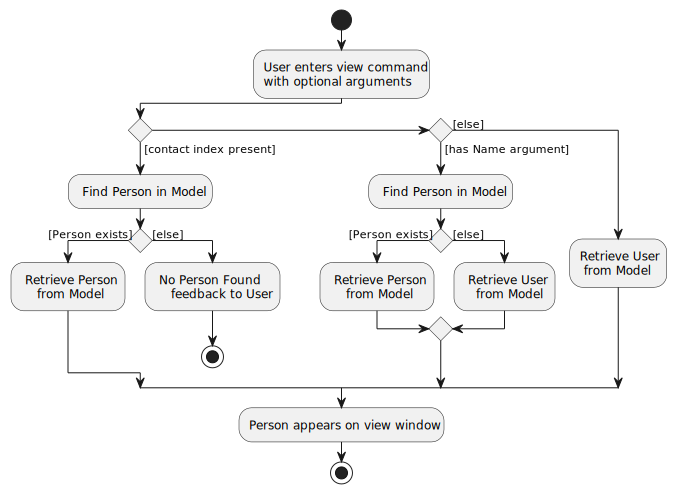
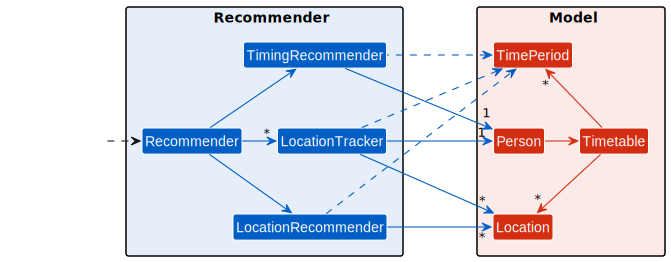
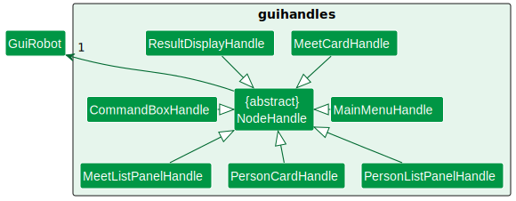
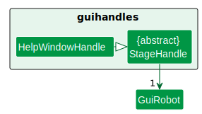

# **Table of Contents**
1. [Introduction](#1-introduction)
   * [Software Overview](#software-overview)
   * [Intended Audience](#intended-audience)
   * [Using the Guide](#using-the-guide)
   * [Content Overview](#content-overview)
   * [About Us](#about-us)
   * [Getting Help](#getting-help)
   * [Core Technologies](#core-technologies)
   * [Acknowledgements](#acknowledgements)
   * [Version Control](#version-control)
   * [Issue Tracker](#issue-tracker)
2. [Development Environment](#2-development-environment)
3. [Tips](#3-tips)
   * [Sample Data](#sample-data)
4. [Design](#4-design)
   * [Architecture](#architecture)
     * [Main Components of the Architecture](#main-components-of-the-architecture)
     * [How the Architecture Components Interact with Each Other](#how-the-architecture-components-interact-with-each-other)
   * [UI Component](#ui-component)
   * [Key Mapping](#key-mapping)
   * [Model Component](#model-component)
     * [Person](#person)
         * [Name](#name)
         * [Station](#station)
         * [Phone](#phone)
         * [Email](#email)
         * [Telegram Handle](#telegram-handle)
         * [Group Tag Set](#group-tag-set)
         * [Module Tag Set](#module-tag-set)
     * [Tag](#tag)
         * [Group Tag](#group-tag)
         * [Module Tag](#module-tag)
     * [Time](#time)
       * [Day](#day)
       * [HourBlock](#hourblock)
       * [TimeBlock](#timeblock)
       * [TimePeriod](#timeperiod)
     * [Location](#location)
       * [DistanceUtil](#distance-util)
       * [LocationDataUtil](#location-data-util)
     * [Commitment](#commitment)
       * [Lesson](#lesson)
     * [Timetable](#timetable)
     * [Utils](#utils)
       * [Sample Data Util](#sample-data-util)
   * [Logic Component](#logic-component)
     * [Commands](#commands)
         * [Add Command](#add-command)
         * [Edit Command](#edit-command)
         * [Delete Command](#delete-command)
         * [Tag Command](#tag-command)
         * [Untag Command](#untag-command)
         * [View Command](#view-command)
         * [Find Command](#find-command)
         * [Sort Command](#sort-command)
         * [List Command](#list-command)
         * [Exit Command](#exit-command)
         * [Save Command](#save-command)
         * [Load Command](#load-command)
         * [Meet Command](#meet-command)
         * [Organise Command](#organise-command)
         * [Sample Command](#sample-command)
     * [Parsers](#parsers)
       * [Argument Multimap](#argument-multimap)
       * [Prefix](#prefix)
     * [Recommenders](#recommenders)
       * [Timing Recommender](#timing-recommender)
       * [Location Recommender](#location-recommender)
       * [Location Tracker](#location-tracker)
   * [Storage Component](#storage-component)
   * [Commons Classes](#common-classes)
     * [MathUtil](#mathutil)
5. [Testing](#5-testing)
   * [Testing Types](#testing-types)
     * [Developer Testing](#developer-testing)
     * [Regression Testing](#regression-testing)
     * [Unit Tests](#unit-tests)
     * [Stubs](#stubs)
     * [Integration Testing](#integration-testing)
     * [Dogfooding](#dogfooding)
   * [Model](#model)
   * [Testing Commands](#testing-commands)
   * [Testing Parsers](#testing-parsers)
   * [GUI Tests](#gui-tests)
     * [Setting up automated GUI Tests in Github Actions](#setting-up-automated-gui-tests-in-github-actions)
     * [Understanding GUI Tests](#understanding-gui-tests)
   * [Measuring Coverage of Integration Tests](#measuring-coverage-of-integration-tests)
   * [Create Code Coverage Report](#create-code-coverage-report)
   * [Read Code Coverage Report](#read-code-coverage-report)
6. [Documentation](#6-documentation)
   * [Using PlantUML](#using-plantuml)
7. [Appendix](#7-appendix)
   * [Planned Enhancements](#planned-enhancements)
   * [Project Requirements](#project-requirements)
   * [Product Scope](#product-scope)
     * [Target User Profile](#target-user-profile)
     * [Value Proposition](#value-proposition)
     * [User Stories](#user-stories)
   * [Use Cases](#use-cases)
   * [Non-Functional Requirements](#non-functional-requirements)
   * [Instructions for Manual Testing](#instructions-for-manual-testing)
     * [Launch and shutdown](#launch-and-shutdown)
     * [Add a new person](#add-a-new-person)
     * [View a person](#view-a-person)
     * [Edit a person](#edit-a-person)
     * [Delete a person](#delete-a-person)
     * [Add a tag to a person](#add-a-tag-to-a-person)
     * [Remove a tag from a person](#remove-a-tag-from-a-person)
     * [Filter persons by keywords](#filter-persons-by-keywords)
     * [Arrange persons by criteria](#arrange-persons-by-criteria)
     * [Generate a sample EduMate](#generate-a-sample-edumate)
     * [Suggest meetup locations and times](#suggest-meetup-locations-and-times)
     * [Organise and confirm meetings](#organise-and-confirm-meetings)
     * [Cancel scheduled meetings](#cancel-scheduled-meetings)
   * [Glossary](#glossary)
   * [Documentation, logging, testing, configuration, dev-ops](#documentation-logging-testing-configuration-dev-ops)

# **1. Introduction**

---

## **Software Overview**
EduMate is a desktop app designed for NUS students to manage their academic and social lives. It is optimised for use through a Command Line Interface (CLI) while still providing the benefits of a Graphical User Interface (GUI). If you type quickly, EduMate can complete contact and module management tasks faster than traditional GUI apps.

---

## **Intended Audience**
This guide is intended primarily for developers who want to work on the **EduMate** Software code base at [https://github.com/AY2223S2-CS2103T-W14-2/tp](https://github.com/AY2223S2-CS2103T-W14-2/tp).

<div markdown="span" class="alert alert-info">

:information_source: **Getting started:** To get started, you'll want to set up your [Development Environment](#2-development-environment) and make sure you understand the branching strategy described in the [Version Control](#version-control) section and how to make a pull request. Thorough [testing](#5-testing) is expected for all pull requests, such that all testable methods are amply tested.

</div>

---

## **Using the Guide**
### **What Do the Emojis Mean**

| Emoji                | GFMD form              | What does it mean                                                   |
|----------------------|------------------------|---------------------------------------------------------------------|
| :construction:       | `:construction:`       | Feature under construction                                          |
| :question:           | `:question:`           | Frequently asked question (FAQ)                                     |
| :heavy_check_mark:   | `:heavy_check_mark:`   | What the developer should do                                        |
| :warning:            | `:warning:`            | Warning to the developer, number of warning signs show the severity |
| :bulb:               | `:bulb:`               | Tip for the developer                                               |
| :information_source: | `:information_source:` | Information for the developer                                       |

---

## **Content Overview**
Here is a brief overview of the guide's content, so that it is easier for you to understand the software and our development workflow:

* [**Development Environment**](#2-development-environment) - what you need to do before you can start writing code
* [**Tips**](#3-tips) - useful tips that make the developmental process easier
* [**Design**](#4-design) - how **EduMate** is currently implemented
* [**Testing**](#5-testing) - expectations and workflow for the testing process
* [**Documentation**](#6-documentation) - expectations and workflow for the documentation process
* [**Appendix**](#7-appendix) - additional information you may find useful

---

## **About Us**
Please refer to the [About Us](AboutUs.md) page for information about the developers.

---

## **Getting Help**
Should you require assistance in any form with regards to EduMate, please head over to our
[Github](https://github.com/AY2223S2-CS2103T-W14-2/tp) page and file an issue with a tag *developer-assistance-required*.
A member of our core team will attend to you as soon as possible.

---

## **Core Technologies**
* Libraries used: [JavaFX](https://openjfx.io/), [Jackson](https://github.com/FasterXML/jackson), [JUnit5](https://github.com/junit-team/junit5), [Joda-Time](https://www.joda.org/joda-time/index.html), [TestFX](https://github.com/TestFX/TestFX).

---

## **Acknowledgements**
* This project is based on the [AddressBook Level 3 (AB3)](https://se-education.org/addressbook-level3/) project created by the [SE-EDU initiative](https://se-education.org/).
* This project utilised GUI tests from the [AddressBook Level 4 (AB4)](https://github.com/se-edu/addressbook-level4) project created by the [SE-EDU initiative](https://se-education.org) as well.
* Some icons and graphics used were sourced from [upklyak](https://www.freepik.com/free-vector/pensive-people-think-about-question-problem-vector-flat-set-curious-doubt-confused-puzzled-women-men-with-hand-head-chin-expression-people-making-decision-choice_23639641.htm) and [flaticon](https://www.flaticon.com/).
* Libraries used: [JavaFX](https://openjfx.io/), [Jackson](https://github.com/FasterXML/jackson), [JUnit5](https://github.com/junit-team/junit5), [Joda-Time](https://www.joda.org/joda-time/index.html), [TestFX](https://github.com/TestFX/TestFX).


---

## **Version Control**
### **The `master` Branch**

The `master` branch represents stable released versions of the **EduMate** software. It is expected that this version always works as expected.

<div markdown="span" class="alert alert-danger">

:warning::warning: You must not merge a PR into the branch if it fails some tests.

</div>

<div markdown="span" class="alert alert-success">

:heavy_check_mark: Instead, you should fork from this master branch into your own repo and work on new features on a branch off your own repo. Your `master` branch should always be synced with the upstream `master` branch.

</div>

### **How to Make a Pull Request**

Once you've made changes to your branch, create a Pull Request (PR) on the upstream `master` branch and link the PR with any relevant issues and milestones.

<div markdown="span" class="alert alert-danger">

:warning::warning: You must not review and merge your own PR. Instead, wait for somebody else to review it for you. In this way, we can cross-check each others' code, leading to fewer errors.

</div>

---

## **Issue Tracker**

We use GitHub Issues as our issue tracker, and here is how to use the issue labels:

| Issue Label Name               | Description                                                             |
|--------------------------------|-------------------------------------------------------------------------|
| `deliverables.Individual`      | Individual submission requirements (for the module)                     |
| `deliverables.Team`            | Team submission requirements (for the module)                           |
| `documentation.DeveloperGuide` | Improvements or additions to the Developer Guide                        |
| `documentation.UserGuide`      | Improvements or additions to the User Guide                             |
| `modify`                       | Existing feature needs to be modified                                   |
| `new`                          | New feature needs to be implemented                                     |
| `priority.High`                | The task needs to be completed immediately                              |
| `priority.Medium`              | The task needs to be completed in the near future                       |
| `priority.Low`                 | The task can be postponed                                               |
| `severity.High`                | The bug needs to be fixed immediately                                   |
| `severity.Medium`              | The bug needs to be fixed in the near future                            |
| `severity.Low`                 | The bug can be fixed later                                              |
| `type.Bug`                     | Something is not working and needs to be fixed                          |
| `type.Discuss`                 | Something needs to be discussed with the rest of the team               |
| `type.Investigate`             | Something needs to be investigated, but is not a bug                    |
| `type.Task`                    | Something needs to be done                                              |
| `type.Story`                   | A feature which addresses a user story                                  |
| `type.Epic`                    | A big feature which can be broken down into smaller stories e.g. search |
| `type.Testing`                 | Test cases need to be written                                           |

# **2. Development Environment**

<div markdown="span" class="alert alert-info">

:information_source: **Info:** Refer to the guide [_Setting up and getting started_](SettingUp.md) to know what you need to do before you can start writing code.

</div>

# **3. Tips**

---

## **Sample Data**

Sample data for **EduMate** can be found [here](https://github.com/AY2223S2-CS2103T-W14-2/tp/blob/master/src/main/java/seedu/address/model/util/sampleData.txt). It is a set of 100 persons with procedurally-generated fields.

<div markdown="span" class="alert alert-info">

:information_source: **Info:** Each row represents a person's information, with the `|` separating the different fields.

In order, they are: `name|phone|email|address|telegram|groups|modules`. Note that groups and modules are separated by a space.

</div>

For example, `Bee Shan|81121128|beeshan@gmail.com|Bishan|@beeshan|NS CCA|CS3242 BT3101 CS1010E CS3219 CE3165` provides information for a person with the following details:

| Field           | Value                                   |
|-----------------|-----------------------------------------|
| Name            | Bee Shan                                |
| Phone           | 81121128                                |
| Email           | beeshan@gmail.com                       |
 | Station         | Bishan                                  |
 | Telegram Handle | @beeshan                                |
 | Groups          | NS, CCA                                 |
 | Modules         | CS3242, BT3101, CS1010E, CS3219, CE3165 |

<div markdown="span" class="alert alert-info">

:information_source: **Info:** These names were chosen so that we can easily extract more information such as Location (as coordinates) for use in future features.

</div>

<div markdown="span" class="alert alert-warning">

:warning: Try not to alter this data too much, as some persons (like Albert Park) are used in testing.

</div>

# **4. Design**

---

## **Architecture**


<div style="width:80%;margin:0 10%;text-align:center">
    <b>Figure 4.1.1</b> Architecture Diagram for the high-level design of the App
</div>
<br>

Given below is a quick overview of main components and how they interact with each other.

### **Main components of the architecture**

**`Main`** has two classes called [`Main`](https://github.com/AY2223S2-CS2103T-W14-2/tp/blob/master/src/main/java/seedu/address/Main.java) and [`MainApp`](https://github.com/AY2223S2-CS2103T-W14-2/tp/blob/master/src/main/java/seedu/address/MainApp.java). It is responsible for,
* At app launch: Initialises the components in the correct sequence, and connects them up with each other.
* At shut down: Shuts down the components and invokes cleanup methods where necessary.

[**`Commons`**](#common-classes) represents a collection of classes used by multiple other components.

The rest of the App consists of four components.

* [**`UI`**](#ui-component): The UI of the App.
* [**`Logic`**](#logic-component): The command executor.
* [**`Model`**](#model-component): Holds the data of the App in memory.
* [**`Storage`**](#storage-component): Reads data from, and writes data to, the hard disk.


### **How the architecture components interact with each other**

The *Sequence Diagram* below shows how the components interact with each other for the scenario where the user issues the command `delete 1`.


<div style="width:80%;margin:0 10%;text-align:center">
    <b>Figure 4.1.2</b> Sequence Diagram for the command <code>delete 1</code>
</div>
<br>

Each of the four main components (also shown in the diagram above),

* defines its *API* in an `interface` with the same name as the Component.
* implements its functionality using a concrete `{Component Name}Manager` class (which follows the corresponding API `interface` mentioned in the previous point.

For example, the `Logic` component defines its API in the `Logic.java` interface and implements its functionality using the `LogicManager.java` class which follows the `Logic` interface. Other components interact with a given component through its interface rather than the concrete class (reason: to prevent outside component's being coupled to the implementation of a component), as illustrated in the (partial) class diagram below.


<div style="width:80%;margin:0 10%;text-align:center">
    <b>Figure 4.1.3</b> Class Diagram for Component Managers
</div>
<br>

The sections below give more details of each component.

---

## **UI Component**

The **API** of this component is specified in [`Ui.java`](https://github.com/AY2223S2-CS2103T-W14-2/tp/blob/master/src/main/java/seedu/address/ui/Ui.java)


<div style="width:80%;margin:0 10%;text-align:center">
    <b>Figure 4.2.1</b> Class Diagram for UI Controllers
</div>
<br>


<div style="width:80%;margin:0 10%;text-align:center">
    <b>Figure 4.2.2</b> Class Diagram for UI Components
</div>
<br>

The UI consists of a `MainWindow` that is made up of parts e.g.`CommandBox`, `ResultDisplay`, `PersonListPanel`, `UserProfilePanel` etc. All these, including the `MainWindow`, inherit from the abstract `UiPart` class which captures the commonalities between classes that represent parts of the visible GUI.

The `UI` component uses the JavaFX UI framework.

To start making changes to the UI:

- The layout of these UI parts can be found in matching `.fxml` files in the [`src/main/resources/view`](https://github.com/AY2223S2-CS2103T-W14-2/tp/blob/master/src/main/resources/view) folder.
- The controller classes of these UI parts can be found in matching `.java` files in the [`src/main/java/seedu/address/ui`](https://github.com/AY2223S2-CS2103T-W14-2/tp/blob/master/src/main/java/seedu/address/ui) folder.
- The stylesheets for these UI parts can be found in `Extensions.css` and `MainWindow.css`, except `UserProfilePanel` and `HelpWindow` with separate CSS files in matching `.css` files in the [`src/main/resources/view`](https://github.com/AY2223S2-CS2103T-W14-2/tp/blob/master/src/main/resources/view) folder.
- For example, the layout of `UserProfilePanel` is specified in [`UserProfilePanel.fxml`](https://github.com/AY2223S2-CS2103T-W14-2/tp/blob/master/src/main/resources/view/UserProfilePanel.fxml), with controller class at [`UserProfilePanel.java`](https://github.com/AY2223S2-CS2103T-W14-2/tp/blob/master/src/main/java/seedu/address/ui/UserProfilePanel.java) and stylesheet at [`UserProfilePanel.css`](https://github.com/AY2223S2-CS2103T-W14-2/tp/blob/master/src/main/resources/view/UserProfilePanel.css).


The `UI` component,

* executes user commands using the `Logic` component.
* listens for changes to `Model` data so that the UI can be updated with the modified data.
* keeps a reference to the `Logic` component, because the `UI` relies on the `Logic` to execute commands.

---

## **Key Mapping**


<div style="width:80%;margin:0 10%;text-align:center">
    <b>Figure 4.3.1</b> Activity Diagram for UP and DOWN keys
</div>

<br>
The UP and DOWN keys have been mapped to return previously typed commands by the user.<br> <br>
The above activity diagram does not include the mapping of the UP and DOWN keys to return previously typed commands by the user in order to avoid excessive complexity and maintain clarity. It is important to note that when the user has pre-existing text in the input field or has made edits to previous commands, the UP and DOWN keys will function as expected to prevent accidental deletion of user input.

---

## **Model Component**

**API** : [`Model.java`](https://github.com/AY2223S2-CS2103T-W14-2/tp/blob/master/src/main/java/seedu/address/model/Model.java)


<div style="width:80%;margin:0 10%;text-align:center">
    <b>Figure 4.4.1</b> Class Diagram for Model Components
</div>
<br>

The `Model` component,

* stores the information of the user's contacts i.e., all `Person` objects (which are contained in a `UniquePersonList` object).
* stores the command history i.e., all command strings (which are contained in a `ArrayList<String>` object).
* maintains a _filtered_ and _sorted_ list of currently selected persons, which can be accessed as an unmodifiable `ObservableList<Person>`. This list is observable, allowing for easy UI integration with automatic updates when data changes.
* stores a `UserPref` object that represents the user’s preferences. This is exposed to the outside as a `ReadOnlyUserPref` object.
* does not depend on any of the other three components. This means that it can function independently and make sense on its own, without relying on other components.

### **Person**

**API** : [`Person.java`](https://github.com/AY2223S2-CS2103T-W14-2/tp/blob/master/src/main/java/seedu/address/model/person/Person.java)


<div style="width:80%;margin:0 10%;text-align:center">
    <b>Figure 4.4.2</b> Class Diagram for Person Components
</div>

#### **Name**

Represents the name of the user or the contact in EduMate.

#### **Station**

Represents the nearest MRT station to the user or contact's home.

#### **Phone**

Represents the contact number of the user or the contact.

#### **Email**

Represents the Email Address of the user or contact.

#### **Telegram Handle**

Represents the Telegram Handle of the user or contact.

#### **Group Tag Set**

Represents a collection of **unique** groups that the user or contact belong to. This class was created to support easy sorting by the group field.

#### **Module Tag Set**

Represents a collection of **unique** modules that the user or contact is enrolled into. It contains the lessons that the person has, as well as the modules shared with the user. This class was created to support easy sorting by the module field.

### **Tag**

The following tags are used for adding important pieces of information to the person.

#### **Group Tag**

A group tag represents the relationship between the user and the person. For example, the person may be tagged with the "CCA" tag to indicate that the user and the person are CCA mates.

#### **Module Tag**

A module tag represents a module that the person is currently taking. There are two options for creating a module tag:

* The user can tag a person with just the module code (`CFG1002`). This is typically used for modules that don't have lessons. In other words, this format simply informs EduMate that the person is taking the module, so that the `sort` and `find` commands can use this information.
* The user can tag a person with the module code and a lesson information (`CS2103T MON 8 10`). This will create a lesson on Monday from 8AM to 10AM, and informs EduMate that the person is busy during this time period. This is used by the `meet` command to recommend meet up timings.

### **Time**

We use `org.joda.time.LocalTime` as the very basis of how we construct our time-related
objects which is then used elsewhere in the codebase.


<div style="width:80%;margin:0 10%;text-align:center">
    <b>Figure 4.4.3</b> Class Diagram for classes in Time Package.
</div>

#### **Day**

`Day` is an enumeration class in Java and it only contains the 5 weekdays: `MONDAY`,
`TUESDAY`, `WEDNESDAY`, `THURSDAY`, `FRIDAY`.

#### **HourBlock**

`HourBlock` is an object which represents an hour of time.

#### **TimeBlock**
`TimeBlock` is an object which can represent any (non-negative) hour of time.

#### **TimePeriod**
`TimePeriod` is the parent class of both `HourBlock` and `TimeBlock`. Hence, we often use `TimePeriod` when passing arguments around.

<div markdown="block" class="alert alert-primary">

:bulb: **Tip:** Notice that `TimePeriod` is an abstract class and hence cannot be instantiated. Instead, we create a new `TimeBlock`, since it achieves the same functionality as the `TimePeriod`.

</div>

<div markdown="block" class="alert alert-info">

:information_source: **Info:** The time period is prefixed using `T/` (rather than `t/` which is used by the telegram handle). It follows the format `T/START_TIME END_TIME`, and along with the day, it creates a new time period.

</div>

### **Location**

A `Location` represents a point in Singapore. We use them to recommend places for the user to meet up with friends. It consists of a latitude (how far north it is), and a longitude (how far east it is).

<div markdown="block" class="alert alert-info">

:information_source: **Restrictions on location attributes:**<br>

* Latitude: must be between *1.23776* and *1.47066*
* Longitude: must be between *103.61751* and *104.04360*

This is to ensure that the location falls within the bounds of Singapore.

</div>

<div markdown="block" class="alert alert-success">

:heavy_check_mark: **The location can be *named* or *unnamed*:**<br>

* *Named locations* are meant for actual locations in Singapore. For example, we may have "Bishan", "NUS", and "Suntec City".
* *Unnamed locations* are reserved for computational purposes. For example, a location in between "Bishan" and "Ang Mo Kio" may be used to recommend suitable meet up locations.

</div>

There are also two other classes within the `location` package that help to process this data.

#### Distance Util

The `DistanceUtil` class deals with computing the distances between locations. It is used by the following classes:

* It is used by the [Recommenders](#recommenders) to suggest ideal and central locations for people to meet.
* It is used by the [LocationTrackers](#location-tracker) to give us approximate locations for a person.

#### Location Data Util

The `LocationDataUtil` class deals with reading and parsing location data from files. For example, the set of destinations to eat and study are stored in the [resources/data](https://github.com/AY2223S2-CS2103T-W14-2/tp/tree/master/src/main/resources/data) folder and are saved within this class. We also store the locations of MRT stations, which allow us to convert user-inputted strings into named locations.

<div markdown="block" class="alert alert-primary">

:bulb: **Tips for using Locations:** Notice that locations are immutable. This allows us to pass around locations as references, thereby reducing the amount of data we need to store.

</div>

### **Commitment**

A `Commitment` is something that a person needs to do at a certain time and place. Notice that we can only create `Lesson`s at the moment. Having this as a separate class can allow us to easily extend this application to fit more kinds of commitments.


<div style="width:80%;margin:0 10%;text-align:center">
    <b>Figure 4.4.4</b> Class Diagram for Commitment Components
</div>
<br>

<div markdown="block" class="alert alert-info">

:information_source: **What are commitments used for:** <br>

* They tell us when the person is unavailable, so that we do not recommend inappropriate timings.
* They tell us where the person is expected to be at a particular time, so that we can recommend better locations to meet up.

</div>

#### **Lesson**

`Lesson` is inherited from `Commitment`, and represents a time and location that a person is attending a class. In addition, `Lesson` stores the module code for the lesson. For example, a person takes CS2040S on Monday at 9AM for 2 hours.

<div markdown="span" class="alert alert-dark">

:construction: **Potential extensions:**<br>
Currently, all `Lessons` are in NUS, but this can be improved upon in the future, by adding additional arguments to the `tag` command.

</div>

### **Timetable**

The `Timetable` represents the daily schedule of the user or contact.


<div style="width:80%;margin:0 10%;text-align:center">
    <b>Figure 4.4.5</b> Class Diagram for Timetable and related classes.
</div>

<br>
For each `Day` in the `Timetable`, there are 15 `HourBlock` objects each representing an hour starting from 8 AM - 9 AM and ending at 10 PM - 11 PM.

### **Utils**

#### **Sample Data Util**

The `SampleDataUtil` class deals with reading and parsing persons data from a file. In particular, these are the people that will appear upon first load of EduMate, as well as during the execution of `SampleCommand`. The sample data is stored within [this file](https://github.com/AY2223S2-CS2103T-W14-2/tp/blob/master/src/main/resources/data/sampleData.txt).

<div markdown="block" class="alert alert-primary">

:bulb: **Tips for reading the sample data:**<br>

* Each row of data corresponds to a single person, and their fields are separated by the `|`, also known as the "pipe" character.
* The attributes are: `NAME|PHONE|EMAIL|ADDRESS|TELEGRAM_HANDLE|GROUP_TAGS|MODULE_TAGS`.
* Notice that the `MODULE_TAGS` are separated by a comma `,` instead, as its parser uses spaces to separate out the arguments.

</div>

---

## **Logic Component**

**API** : [`Logic.java`](https://github.com/AY2223S2-CS2103T-W14-2/tp/blob/master/src/main/java/seedu/address/logic/Logic.java)

Here's a (partial) class diagram of the `Logic` component:


<div style="width:80%;margin:0 10%;text-align:center">
    <b>Figure 4.5.1</b> Class Diagram for Logic Components
</div>
<br>

How the `Logic` component works:
1. When `Logic` is called upon to execute a command, it uses the `EduMateParser` class to parse the user command.
2. If needed, a command-specific parser (like `AddCommandParser`) will be called to parse the arguments of the user input.
3. This results in a `Command` object (more precisely, an object of one of its subclasses e.g., `AddCommand`) which is executed by the `LogicManager`.
4. The command can communicate with the `Model` when it is executed (e.g. to add a person).
5. The result of the command execution is encapsulated as a `CommandResult` object which is returned back from `Logic`.

### **Commands**

#### **Add Command**

Links: [Command](https://github.com/AY2223S2-CS2103T-W14-2/tp/blob/master/src/main/java/seedu/address/logic/commands/AddCommand.java), [Parser](https://github.com/AY2223S2-CS2103T-W14-2/tp/blob/master/src/main/java/seedu/address/logic/parser/AddCommandParser.java)

The `add` command allows users to create a new person and insert them into the application.

**Parsing the inputs** - When the user types an input, the parser will extract out the relevant arguments and [check whether they are valid](#model-component).

<div markdown="block" class="alert alert-info">

:information_source: **Command Format:** <br>

* `add n/NAME [p/PHONE] [s/STATION] [e/EMAIL] [t/TELEGRAM] [g/GROUP]... [m/MODULE]...`: Adds a contact to EduMate.

</div>

<div markdown="span" class="alert alert-primary">

:bulb: **Tip:** The arguments for `AddCommand` are unordered, so the user can type them in any order. They are all handled in [Argument Multimap](#argument-multimap).

</div>

**Computing the common modules** - One of our sort keys is to use the *number of common modules* that the person has with the user. As such, we cache these modules to optimise performance.

**Assigning a Contact Index** - After the inputs have been parsed and extracted, EduMate will look to fill the *first* gap in contact index. i.e. it will find the **lowest positive integer** that isn't already the contact index of a person. Refer to the example given below:

| Current state of EduMate           | New Contact Index | Explanation                                                 |
|:-----------------------------------|:-----------------:|-------------------------------------------------------------|
| 1. Gwon Se Rang<br/>2. Lao Ming Da |         3         | 3 is the next number in the sequence.                       |
| 1. Gwon Se Rang<br/>3. Lao Ming Da |         2         | 2 is the lowest number that is not already a contact index. |

<div markdown="span" class="alert alert-info">

:information_source: **Info:** The User has the default `ContactIndex` of 0.
</div>

In summary, the activity diagram is as such:


<div style="width:60%;margin:0 20%;text-align:center">
    <b>Figure 4.5.2</b> Activity Diagram for a typical <code>add</code> command
</div>

#### **Edit Command**

Links: [Command](https://github.com/AY2223S2-CS2103T-W14-2/tp/blob/master/src/main/java/seedu/address/logic/commands/EditCommand.java), [Parser](https://github.com/AY2223S2-CS2103T-W14-2/tp/blob/master/src/main/java/seedu/address/logic/parser/EditCommandParser.java)

The `edit` command allows the user to edit an existing contact in EduMate.

**Parsing the inputs** - When the user types an input, the parser will extract out the relevant arguments and [check whether they are valid](#model-component).

<div markdown="block" class="alert alert-info">

:information_source: **Command Formats:** <br>

* `edit z/FIELD`: Edits the user details.

* `edit INDEX z/FIELD`: Edits the details of the contact at the specified `INDEX`.

</div>

**Distinguishing between contact and user** - As specified in the command formats, if the user wants to edit their own details, they can just leave out the index. On our end, the `ArgumentMultimap` has been modified to accept null as a valid index, which will handle such a use case.

<div markdown="span" class="alert alert-primary">

:bulb: **Tip:** Similar to [`AddCommand`](#add-command), the arguments for `EditCommand` are unordered.

</div>

**Computing the common modules** - One of our sort keys is to use the *number of common modules* that the person has with the user. As such, we cache these modules to optimise performance.

<div markdown="span" class="alert alert-info">

:information_source: **Info:** When editing a contact, we only need to update the common modules for **that person**. However, when editing the user, we need to update common modules for **every person** in EduMate.

</div>

**Creating a person descriptor** - When we are editing a person, we need two things:

* The edited details: These are specified by the user as arguments in the `edit` command.
* The person's original details: If the user does not specify to edit a particular field, we take the *current* data stored in the field.

From these two sources of information, we can create a `descriptor` that keeps track of what the new person *should* be, which gives us lines such as:

* `editPersonDescriptor.getName().orElse(userToEdit.getName())`.


In summary, the activity diagram is as such:


<div style="width:60%;margin:0 20%;text-align:center">
    <b>Figure 4.5.3</b> Activity Diagram for a typical <code>edit</code> command
</div>

#### **Delete Command**

The Sequence Diagram below illustrates the interactions within the `Logic` component for the `execute("delete 1")` API call.


<div style="width:80%;margin:0 10%;text-align:center">
    <b>Figure 4.5.4</b> Sequence Diagram for a typical <code>delete</code> command
</div>
<br>

<div markdown="span" class="alert alert-info">

:information_source: **Note:** The lifeline for `DeleteCommandParser` should end at the destroy marker (X) but due to a limitation of PlantUML, the lifeline reaches the end of diagram.

</div>

#### **Tag Command**

Links: [Command](https://github.com/AY2223S2-CS2103T-W14-2/tp/blob/master/src/main/java/seedu/address/logic/commands/TagCommand.java), [Parser](https://github.com/AY2223S2-CS2103T-W14-2/tp/blob/master/src/main/java/seedu/address/logic/parser/TagCommandParser.java)

The `tag` command allows user to add `ModuleTag`s or `GroupTag`s to an existing contact in EduMate.

**Parsing the inputs** - When the user types in an input, the parser will extract out the relevant arguments.

<div markdown="block" class="alert alert-info">

:information_source: **Command Formats:** <br>

* `tag m/MODULE...`: Tags modules to the user.

* `tag INDEX m/MODULE...`: Tags modules to the contact at the specified index.

* `tag m/MODULE DAY START END...`: Tags lessons to the user with the specified parameters, and tags the module if not already done so.

* `tag g/GROUP...`: Tags groups to the user.

* `tag INDEX g/GROUP...`: Tags groups to the contact at the specified index.

</div>

**Distinguishing between contact and user** - As specified in the command formats, if the user wants to edit their own details, they can just leave out the index. On our end, the `ArgumentMultimap` has been modified to accept null as a valid index, which will handle such a use case.


<div style="width:60%;margin:0 20%;text-align:center">
    <b>Figure 4.5.5</b> Sequence Diagram for a typical <code>TagCommand</code> execution
</div>
<br>

#### **Untag Command**

Links: [Command](https://github.com/AY2223S2-CS2103T-W14-2/tp/blob/master/src/main/java/seedu/address/logic/commands/UntagCommand.java), [Parser](https://github.com/AY2223S2-CS2103T-W14-2/tp/blob/master/src/main/java/seedu/address/logic/parser/UntagCommandParser.java)

Similar to the `tag` command, the `untag` command allows user to remove `ModuleTag`s and `GroupTag`s from an existing contact in EduMate.

**Parsing the inputs** - When the user types in an input, the parser will extract out the relevant arguments.

<div markdown="block" class="alert alert-info">

:information_source: **Command Formats:** <br>

* `untag m/MODULE...`: Untags modules from the user.

* `untag INDEX m/MODULE...`: Untags modules from the contact at the specified index.

* `untag m/MODULE DAY START END...`: Untags lessons from the user with the specified parameters, and untags the module if it is empty.

* `untag g/GROUP...`: Untags groups from the user.

* `untag INDEX g/GROUP...`: Untags groups from the contact at the specified index.

</div>


<div style="width:60%;margin:0 20%;text-align:center">
    <b>Figure 4.5.6</b> Sequence Diagram for a typical <code>UntagCommand</code> execution
</div>
<br>

#### **View Command**

Links: [Command](https://github.com/AY2223S2-CS2103T-W14-2/tp/blob/master/src/main/java/seedu/address/logic/commands/ViewCommand.java), [Parser](https://github.com/AY2223S2-CS2103T-W14-2/tp/blob/master/src/main/java/seedu/address/logic/parser/ViewCommandParser.java)

The view command allows users to view their information or their contact's information on the profile panel on the lower right side of the application, above the command box. A single `view` command defaults to displaying the profile of the user. On the other hand, we can display
a contact's information appending their assigned `ContactIndex` or by adding `n/NAME` behind the `view` command.

<div markdown="span" class="alert alert-info">

:information_source: **Info:** The last viewed profile will remain displayed on the profile panel should there be any exceptions thrown during the parsing process.

</div>

<div markdown="block" class="alert alert-info">

:information_source: **Command Formats:** <br>

* `view` : Displays user's profile on the display panel.

* `view n/XYZ` : Display XYZ's profile on the display panel.

* `view INDEX` : Display the contact's whose `ContactIndex` is `INDEX` on the display panel.

</div>

**Parsing the inputs** - When the user enters the input, the `ViewCommandParser` will first check if the arguments are empty.
- If it is not empty, then `ViewCommandParser` will try to extract tokens that were prefixed `n/` (for the name).
- If a name is not present in the arguments, it will search for an index (of `int` type) instead in the preamble. <br>

    The parser, using the arguments (if they exist), creates the `ViewCommand` to be executed.

Below is a Sequence Diagram which summarises the behaviour of `ViewCommandParser`.


<div style="width:60%;margin:0 20%;text-align:center">
    <b>Figure 4.5.7</b> Sequence Diagram for a typical <code>ViewCommandParser</code>
</div>
<br>
Below is an Activity Diagram for the execution of the `ViewCommand`.

<div style="width:60%;margin:0 20%;text-align:center">
    <b>Figure 4.5.8</b> Sequence Diagram for a typical <code>ViewCommand</code> execution
</div>

#### **Find Command**

Links: [Command](https://github.com/AY2223S2-CS2103T-W14-2/tp/blob/master/src/main/java/seedu/address/logic/commands/FindCommand.java), [Parser](https://github.com/AY2223S2-CS2103T-W14-2/tp/blob/master/src/main/java/seedu/address/logic/parser/FindCommandParser.java)

The `find` command allows users to search for their contacts with partial information.

For example, if the user wants to search for a person but does not know the full name, they can simply search the name and get a list of people matching the name. This applies to all information a Person contains. Additionally, it can accept multiple keywords for the search but is limited to the same type of information.

**Parsing the inputs** - When the user types an input, the parser will extract out the relevant arguments and check if there is only one type of information.

<div markdown="block" class="alert alert-info">

:information_source: **Command Formats:** <br>

* `find [z/FIELD MORE_FIELD]`: Finds the contacts matching the field found in the 'z' field.

</div>

<div markdown="block" class="alert alert-primary">

:bulb: **Tip:**<br>

* This command can be used before the other commands to return a list of contacts the user wants to work with.

* The `find` command returns a filtered list, so command operations only work on persons present in the filtered list.<br>
  e.g. If the filtered list does not contain any person with contact index 2, any operation relating to contact index 2 will throw error.

</div>

**Describing the find** - `ContainsKeywordPredicate` class which extends from `Predicate` handles storing the `Prefix` and `keywords` to pass into the `ModelManager` class. It then uses the Java `FilteredList` Library to handle the `Predicate` to return a list of people the user requested.

In summary, the activity diagram is as such:


<div style="width:60%;margin:0 20%;text-align:center">
    <b>Figure 4.5.9</b> Activity Diagram for a typical <code>find</code> command
</div>


#### **Sort Command**

Links: [Command](https://github.com/AY2223S2-CS2103T-W14-2/tp/blob/master/src/main/java/seedu/address/logic/commands/SortCommand.java), [Parser](https://github.com/AY2223S2-CS2103T-W14-2/tp/blob/master/src/main/java/seedu/address/logic/parser/SortCommandParser.java)

The `sort` command allows users to arrange their contacts in the order they desire. To be more robust in their arrangement, users are allowed to chain comparators together to break ties.

For example, if the user wants to sort by groups, and break ties with name, they can simply type `sort g/ n/`.

**Parsing the inputs** - When the user types an input, the parser will *scan* through the arguments. Then, it checks whether the field needs to be sorted in **ascending** or **descending** order. Finally, it combines all the comparators together so that we get a single comparator.

<div markdown="block" class="alert alert-info">

:information_source: **Command Formats:** <br>

* `sort`: Sorts the contacts by their `ContactIndex`.

* `sort [z/a]...`: Sorts the contacts by the `z` field in **ascending** order.

* `sort [z/d]...`: Sorts the contacts by the `z` field in **descending** order.

* `sort [z/]...`: Sorts the contacts by the `z` field in their **default** order.

</div>

<div markdown="span" class="alert alert-primary">

:bulb: **Tip:** Unlike the other commands, the ordering of the arguments **does matter**. For example, `sort g/d n/a` is different from `sort n/a g/d`.

</div>

**Describing the sort** - The `Comparator` class in Java does not have a `toString()` method. As such, we have to pass a descriptor when we are creating our `SortCommand`. Additionally, we needed a mapping from the prefixes (`n/`) to their descriptors (`Name`). As such, we transformed the `Prefix` class to an `Enum` to easily get the descriptors.

<div markdown="span" class="alert alert-primary">

:bulb: **Tip**: JavaFX works with `ObservableList` to populate the UI components. However, we can wrap this `ObservableList` inside a `SortedList` which accepts a `Comparator` as an argument. In this way, we only need to set this argument if we want to sort something in the UI.

</div>

#### **List Command**

Links: [Command](https://github.com/AY2223S2-CS2103T-W14-2/tp/blob/master/src/main/java/seedu/address/logic/commands/ListCommand.java)

The `list` command will allow users to view all the contacts saved in EduMate.

<div markdown="block" class="alert alert-info">

:information_source: **Command Format:** <br>

* `list`: lists all contacts in the EduMate Application.

</div>

#### **Exit Command**

Links: [Command](https://github.com/AY2223S2-CS2103T-W14-2/tp/blob/master/src/main/java/seedu/address/logic/commands/ExitCommand.java)

The `exit` command allows users to exit the EduMate Application via the command line.

<div markdown="block" class="alert alert-info">

:information_source: **Command Format:** <br>

* `exit`: Exits the EduMate Application.

</div>

<div markdown="span" class="alert alert-info">

:information_source: **Info:** Sets the `isExit` boolean in the `ExitCommandResult` class to `true` which is passed through multiple classes to the `MainWindow` class to handle the exit.

</div>

#### **Save Command**
Links: [Command](https://github.com/AY2223S2-CS2103T-W14-2/tp/blob/master/src/main/java/seedu/address/logic/commands/SaveCommand.java), [Parser](https://github.com/AY2223S2-CS2103T-W14-2/tp/blob/master/src/main/java/seedu/address/logic/parser/SaveCommandParser.java)

The `save` command allows users to save a copy of EduMate. This information is stored within the `data` folder, the same place as where `edumate.json` is kept.

<div markdown="span" class="alert alert-info">

:information_source: **Saving the Json file:**<br>
We cannot save the json file directly from the command, because the command only has access to the model. Instead, we pass the file path through a `SaveCommandResult`, which will inform the `LogicManager` to save the information in a particular file.

</div>


<div style="width:60%;margin:0 20%;text-align:center">
    <b>Figure 4.5.10</b> Sequence Diagram for a typical <code>save</code> command.
</div>

#### **Load Command**
Links: [Command](https://github.com/AY2223S2-CS2103T-W14-2/tp/blob/master/src/main/java/seedu/address/logic/commands/LoadCommand.java), [Parser](https://github.com/AY2223S2-CS2103T-W14-2/tp/blob/master/src/main/java/seedu/address/logic/parser/LoadCommandParser.java)

The `save` command allows users to load a previously saved copy of EduMate. This information is retrieved from the `data` folder, the same place as where `edumate.json` is kept.

<div markdown="span" class="alert alert-info">

:information_source: **Loading the Json file:**<br>
Similar to the Save Command, we pass the file path through a `LoadCommandResult`, which will inform the `LogicManager` to load the information from a particular file.

</div>


<div style="width:60%;margin:0 20%;text-align:center">
    <b>Figure 4.5.11</b> Sequence Diagram for a typical <code>load</code> command.
</div>

#### **Meet Command**

Links: [Command](https://github.com/AY2223S2-CS2103T-W14-2/tp/blob/master/src/main/java/seedu/address/logic/commands/MeetCommand.java), [Parser](https://github.com/AY2223S2-CS2103T-W14-2/tp/blob/master/src/main/java/seedu/address/logic/parser/MeetCommandParser.java)

The `meet` command allows users to get recommendations of optimal meeting timings and locations with their contacts.

<div markdown="span" class="alert alert-info">

:information_source: **Sub-Commands:** <br>
The `meet` command has 2 different sub-commands : `eat`, `study`.
However, we will be referring to all 3 commands generally as `meet`.
</div>

All 3 commands (`meet`, `study` and `eat`) only differ in the location
recommendations as certain locations are only appropriate for certain activities.

Running `meet` will recommend studying, eating locations and other general locations together with their recommended timings.

This feature is utilises the [`Recommender`](#recommenders).

<div markdown="block" class="alert alert-info">

:information_source: **Command Formats:** <br>

* `meet CONTACT_INDEX...`: Recommends a meeting time and location for all the participants with the given contact indices (including the user).

* `eat CONTACT_INDEX...` : Recommends a time and eating place where all participants with the given contact indices (including the user) can have a meal together.

* `study CONTACT_INDEX...` : Recommends a time and study spot where all participants with the given contact indices (including the user) can study together.

</div>


#### **Organise Command**
Links: [Command](https://github.com/AY2223S2-CS2103T-W14-2/tp/blob/master/src/main/java/seedu/address/logic/commands/OrganiseCommand.java), [Parser](https://github.com/AY2223S2-CS2103T-W14-2/tp/blob/master/src/main/java/seedu/address/logic/parser/OrganiseCommandParser.java)

The `organise` command will set a meet up with the time and place for all participants and the user himself/herself. Note that the user's information is automatically added to the list of participants as it is assumed that they will be taking part in the meet up.

<div markdown="block" class="alert alert-info">

:information_source: **Command Formats:** <br>

* `organise RECOMMENDATION_INDEX` : Takes the recommendation at the specified index and saves it.
* `organise CONTACT_INDEX... d/DAY T/START_TIME END_TIME l/LOCATION` : Creates a new meet up for participants with the given contact indices. Note that this list of contact indices should not include that of the user (0).

</div>

On the other hand, the `unorganise` command will remove the meet up at the specified index.

<div markdown="block" class="alert alert-info">

:information_source: **Command Format:**<br>

* `unorganise MEET_UP_INDEX`: Removes the scheduled meet up with the specified index.

</div>

The [`TimingRecommender`](#timing-recommender) will check if the timing is a suitable for every participant to meet.

#### **Sample Command**
Links: [Command](https://github.com/AY2223S2-CS2103T-W14-2/tp/blob/master/src/main/java/seedu/address/logic/commands/SampleCommand.java), [Parser](https://github.com/AY2223S2-CS2103T-W14-2/tp/blob/master/src/main/java/seedu/address/logic/parser/SampleCommandParser.java)

The `sample` command repopulates the EduMate with a fresh set of contacts. Note that this calls the same function as that called in [Sample Data Util](#sample-data-util).

<div markdown="block" class="alert alert-info">

:information_source: **Command Format:**<br>

* `sample NUMBER` : Replaces the EduMate with the specified `NUMBER` of sample persons.

</div>

## **Parsers**

Here are the other classes in `Logic` (omitted from the class diagram above) that are used for parsing a user command:


<div style="width:80%;margin:0 10%;text-align:center">
    <b>Figure 4.5.12</b> Class Diagram for Parser Components
</div>
<br>

How the parsing works:
* When called upon to parse a user command, the `EduMateParser` class creates an `XYZCommandParser` (`XYZ` is a placeholder for the specific command name e.g., `AddCommandParser`) which uses the other classes shown above to parse the user command and create a `XYZCommand` object (e.g., `AddCommand`) which the `EduMateParser` returns back as a `Command` object.
* All `XYZCommandParser` classes (e.g., `AddCommandParser`, `DeleteCommandParser`, ...) inherit from the `Parser` interface so that they can be treated similarly where possible e.g, during testing.

#### **Argument Multimap**

The `ArgumentMultimap` utilises a `HashMap` to store an `ArrayList<String>` of arguments from the user, mapped to the `Prefix` that precedes the arguments.

#### **Prefix**

The `Prefix` is an `enum` consisting of `n/` ,`s/`, `p/`, `t/`, `e/`, `g/`, `m/`, `d/`, `T/`, `l/` and a blank `Prefix` which is an empty String. The Prefixes listed previously correspond to [Name](#name), [Station](#station), [Phone](#phone), [Telegram Handle](#telegram-handle), [Email](#email), [Group Tags](#group-tag), [Module Tags](#module-tag), [Day](#day), [Time Period](#timeperiod) and [Location](#location).

## **Recommenders**

**API** : `Recommender.java`


<div style="width:80%;margin:0 10%;text-align:center">
    <b>Figure 4.5.13</b> Class Diagram for Recommender Module
</div>
<br>

The `Recommender` component,
* consists of 2 sub-components (modules) : `LocationRecommender` and `TimingRecommender`
* recommends timing and location of meetups for relevant participants and the user.

How the `Recommender` Component works:
1. User enters a `meet/eat/study` command.
2. The `TimingRecommender` is initialised with a set of participants.
3. The `LocationRecommender` is initialised with a set of destinations.
4. New `LocationTracker`s are created to give approximate locations of each person.
5. The `TimingRecommender` recommends common available timings amongst users and participants.
6. Based on the timings provided, the `LocationTracker`s return each person's approximate locations.
7. The `LocationRecommender` recommends optimal meeting points based on the locations provided by the `LocationTracker`s.
8. Feedbacks to user the recommended meetup locations and timings.


<div style="width:80%;margin:0 10%;text-align:center">
    <b>Figure 4.5.14</b> Sequence Diagram for Recommender Module
</div>
<br>

#### Timing Recommender
The `TimingRecommender`'s role is to recommend timings in which the user and all participants are available.
The `TimingRecommender` uses the participants' schedule to find common time periods that everyone
will be free so that a meetup could be scheduled.


<div style="width:60%;margin:0 20%;text-align:center">
    <b>Figure 4.5.15</b> Activity Diagram for <code>TimingRecommender</code>
</div>
<br>

<div markdown="span" class="alert alert-info">


:information_source: **Very important re-emphasis:** The `TimingRecommender` will always recommend timeslots and **ranks them in descending time** duration that
the participants could meet up.
</div>

#### Location Recommender

The `LocationRecommender`'s role is to recommend a **central location** where persons can meet. It accepts two sets of locations:
1. A set of `destinations` to be suggested. They could be places to study, eat or both.
2. A set of `sources` representing the participants' locations given a particular time.

The midpoint of these `sources` is calculated, and then we compare the `destinations` based on how close they are to this midpoint. In this way, we recommend the locations that are the closest for everybody.

<div markdown="span" class="alert alert-info">

:information_source: **Info:** As part of abstraction, most of the logic is handled by the `DistanceUtil` class, which calculates distances and finds the nearest destinations.

</div>

#### Location Tracker

The `LocationTracker`'s role is to give an approximate location of a person given a certain timing. These approximations are then fed into the `LocationRecommender` to give more accurate recommendations.

<div markdown="span" class="alert alert-info">

:information_source: **How we approximate a location:** A person is assumed to be travelling gradually between known locations. For example, if the person is in NUS at 9AM and at home at 11AM, they are assumed to be somewhere in the middle at 10AM.

</div>

The process of getting a recommendation is as follows:
1. From the person's timetable, we gather their set of **known locations**. For example, if the person has a lesson at NUS on Monday 8AM to 9AM, we know their location at that time period.
2. Next, between any two **consecutive known locations**, we calculate the number of unknown locations between them.
3. Based on this calculation, the `DistanceUtil` will return a list of approximations that achieve what was mentioned earlier.
4. Finally, these locations are put in their respective places in the `LocationTracker`.

---

## **Storage Component**

**API** : [`Storage.java`](https://github.com/AY2223S2-CS2103T-W14-2/tp/blob/master/src/main/java/seedu/address/storage/Storage.java)


<div style="width:80%;margin:0 10%;text-align:center">
    <b>Figure 4.6.1</b> Class Diagram for Storage Components
</div>
<br>

The `Storage` component,
* can save both address book data and user preference data in json format, command history in text format, and read them back into corresponding objects.
* inherits from both `EduMateStorage` and `UserPrefStorage`, which means it can be treated as either one (if only the functionality of only one is needed).
* depends on some classes in the `Model` component (because the `Storage` component's job is to save/retrieve objects that belong to the `Model`)

---

## **Common Classes**

Classes used by multiple components are in the `seedu.address.commons` package.

### **MathUtil**

The `MathUtil` class contains generic functions for mathematical operations such as Cartesian Product and indexing.

# **5. Testing**

---

## **Testing Types**

Types of tests used:
* Developer Testing
* Regression Testing
* Unit Tests
* Stubs
* Integration testing
* Dogfooding

Our organisation made use of different testing types in order to cover multiple grounds. Types of testings also changed 
with the progress of the product.

### **Developer Testing**

Our organisation opted to use developer testing right from the start with every increment of the product, instead of 
waiting for the whole product to be ready before conducting more tests.

This type of testing involved the developers trying out the product with the various commands implemented, to 
discover possible bugs early, and avoid major reworks in future increments and iterations.

### **Regression Testing**

Our organisation continued with regression testing as increments came in, to ensure that previous features were not 
broken with changes and modifications. This is due to the interconnectedness of certain features implemented, such as 
commands and the model. Our project followed a breadth-first iterative model, and hence it was crucial for us to carry 
out regression testing as the project evolved and morphed. 

Our organisation did this both with automated unit tests and manual testing. 
We put a greater emphasis on unit tests due to the expensive cost of manual testing, especially at stages of the product 
where it is not complete in its entirety.

### **Unit Tests**

Our organisation primarily utilised `JUnit5` for conducting unit tests. `JUnit5` is a popular testing framework in the Java programming language that enables developers to write and run unit tests for their code.

Each individual unit of the program is tested to ensure each piece works correctly and stubs are commonly used to test the units in isolation.

Unit tests were implemented as new features were added in, to ensure that any new changes will have tests to ensure 
older features are working as intended. Unit tests were also changed and added on as the product progressed, to ensure
that the features were tested more thoroughly as the team learned new testing types and techniques.


### **Stubs**

Stubs were used to test features and classes in isolation, so that any bugs in dependencies will not affect the tests
that are in place. Use of stubs were most common in testing model, commands and parsers, as they have a lot of dependencies
that make it difficult to test the entire logic in total. Stubs help to isolate dependencies so that each component's logic
are tested without being affected by other components.

### **Integration Testing**

Integration testing was used extensively in the testing of the GUI, as part of CI. Integration testing were also 
included in unit tests to ensure that our features work well with each other. It was also covered manually via developer
testing and dogfooding.


### **Dogfooding**

Towards the completion of our product, our developers used the product on a regular basis in an attempt to simulate how 
a normal user might use the product. This helped ensure that our product would be relatively bug-free for a regular use
case.

## **Model**

Our organisation created dummy values for a model of a simulated list of persons that our product might, and used that
to carry out testing on. When changes were made to the model in the product, any changes required were reflected in 
this testing model as well, to ensure that unit tests are testing on a correct simulation of the program.

## **Testing Commands**

Our organisation tested commands by creating commands with the correct parameters, bypassing the parser, and executed 
them. Assertions were used to ensure that commands created, when executed, performed the correct operations on the model
created specifically for tests, as well as to ensure that correct exceptions are thrown as and when needed, especially for
invalid inputs.

Our organisation made use of equivalence partitions to tests for the types of commands that can be executed. The rationale
is that since we have a relatively large number of variants for each command, we needed to test all possible inputs and 
partitions.

## **Testing Parsers**

Our organisation opted to use stubs in order to test the parsers, to isolate that the parser is firstly parsing the 
correct text, and returning the correct corresponding command. 

Negative and positive test cases were used to ensure that invalid inputs throws the correct exceptions, and that valid 
inputs creates and returns the correct command with correct parameters. This testing ensures that our definitions for 
equivalent commands were well-defined.

## **GUI Tests**
Our organisation utilised `TestFX` for conducting GUI tests. `TestFX` is a popular testing framework for `JavaFX` applications as it provides a set of tools and utilities for writing tests that interact with `JavaFX` UI components, simulate user interactions, and perform assertions on the state of the UI.

We referenced from [Addressbook Level 4 (AB4)](https://github.com/se-edu/addressbook-level4) on automated GUI testing. 
* What's different from AB4:
  * We used the Github Actions Workflow located in `.github/workflows/gradle.yml` rather than setting up `Travis CI` as per `TestFX` [documentation](https://github.com/TestFX/TestFX#continuous-integration-ci).
  * `build.gradle` runs both unit tests and GUI tests in the same task, which is also used by `Github Actions workflow`.
  * `TestFX` version is upgraded to `4.0.16-alpha` while `openjfx-monocle` version is upgraded to `jdk-12.0.1+2`.

### **Setting up automated GUI Tests in Github Actions**
Due to the Github Actions environment, there is a need to test in a headless environment. To test in a headless environment, you must add `Monocle` as a test dependency as per [TestFX documentation](https://github.com/TestFX/TestFX#continuous-integration-ci).

The current [build.gradle](https://github.com/AY2223S2-CS2103T-W14-2/tp/blob/master/build.gradle) sets the GUI tests to run in a headless environment by default. To remove that or set it to run with visual output on your local computer, find the code block below and set the `jvmArgs` and `systemProperties` according to your needs.
```groovy
test {
    useJUnitPlatform()
    finalizedBy jacocoTestReport
    jvmArgs "-Dheadless=${project.hasProperty('headless') ? project.headless : false}"
    systemProperties = [
            'testfx.robot': 'glass',
            'testfx.headless': 'true',
            'prism.order': 'sw',
            'prism.text': 't2k',
    ]
}
```

### **Understanding GUI Tests**
We utilised GUI tests from [AB4](https://github.com/se-edu/addressbook-level4/tree/master/src/test/java) and here is a summary of it.


<div style="width:80%;margin:0 10%;text-align:center">
    <b>Figure 5.5.1</b> Class Diagram for UI Tests
</div>
<br>

Note that `AllUITests` above refers to all UI Tests in `seedu.address.ui` except for `TestFxmlObject`. The handles used in the corresponding test cases can be easily seen from their names. For example, `CommandBoxTest` contains `CommandBoxHandle`.
<br>


<div style="width:80%;margin:0 10%;text-align:center">
    <b>Figure 5.5.2</b> Class Diagram for Node Handle
</div>
<br>


<div style="width:80%;margin:0 10%;text-align:center">
    <b>Figure 5.5.3</b> Class Diagram for Stage Handle
</div>
<br>

All UI tests using `TestFX` extend from `GuiUnitTest` and handles are created for the corresponding UI test, which extends from either `StageHandle` or `NodeHandle` depending on the type used for `UiPart` in the actual class to be tested.


---

## **Measuring Coverage of Integration Tests**
We have used `Jacoco` and `Codecev` to monitor the code coverage of integration tests.

### **Create Code Coverage Report**
Refer to the [documentation](https://docs.codecov.com/docs) on setting up `Codecev` for setting up on CI/CD.

### **Read Code Coverage Report**
For more information, check [this](https://github.com/apps/codecov). The above [link](https://docs.codecov.com/docs) also contains information on this.

---

# **6. Documentation**

---

## **Useful Text Boxes**

<div markdown="span" class="alert alert-primary">

:bulb: Use `alert-primary` to show tips for the developer

</div>

<div markdown="span" class="alert alert-success">

:heavy_check_mark: Use `alert-success` to tell the developer what should be done

</div>

<div markdown="span" class="alert alert-info">

:information_source: Use `alert-info` to show information for the developer

</div>

<div markdown="span" class="alert alert-warning">

:warning: Use `alert-warning` to warn the user about performing a certain action

</div>

<div markdown="span" class="alert alert-danger">

:warning::warning:  Use `alert-danger` to _**strongly**_ warn the user about performing a certain action

</div>

<div markdown="span" class="alert alert-dark">

:construction: Use `alert-dark` to indicate a feature under development

</div>

---

## **Using PlantUML**

<div markdown="span" class="alert alert-primary">

:bulb: **Tip:** The `.puml` files used to create diagrams in this document can be found in the [diagrams](https://github.com/se-edu/addressbook-level3/tree/master/docs/diagrams/) folder. Refer to the [_PlantUML Tutorial_ at se-edu/guides](https://se-education.org/guides/tutorials/plantUml.html) to learn how to create and edit diagrams.

</div>

# **7. Appendix**

---

## **Planned Enhancements**

1. Apart from lessons, people may have commitments outside of NUS. To handle these cases, we propose to modify the `tag` command to take in a time and location to indicate that a person will be at the location at that time. This is currently not implemented as it is considered a new feature.<br>


2. To better create automated fields, we propose the use of `Optional` in our person fields. They would show "Unknown" if the field is not there, making it clearer that the fields have not been populated yet. This is currently not implemented as it would require major changes to the commands, as well as storage.<br>


3. The profile panel currently overspills when there are too many modules and groups. This can be solved in the future by converting the profile panel into a scroll pane, thereby allowing longer panels to be shown. This, however, requires us to refactor our UI components, which is not allowed at this phase.<br>


4. Despite us not allowing it, the application still can enter full screen mode due to the settings on certain devices. This is unintended behaviour, as we intended EduMate to remain at a fixed size. One possible solution would be to re-enable the resizing of the application. However, this would require major changes to the UI, making it more responsive to such resizing events.

## **Project Requirements**

### **Product Scope**

#### **Target user profile**

* has a need to manage a significant number of contacts
* frustrated in the struggle to find suitable meetup venues and timings
* prefer desktop apps over other types
* can type fast
* prefers typing to mouse interactions
* is reasonably comfortable using CLI apps
* is an NUS student

#### **Value proposition**

Help NUS students maintain both their social and academic life by lowering the barriers to meet up and make new friends within modules.

### **User Stories**

| As a ...  | I want to ...                                                      | So that I can...                                                                 |
|-----------|--------------------------------------------------------------------|----------------------------------------------------------------------------------|
| student   | store my friends' contact information                              | easily keep track of their availability for study sessions.                      |
| student   | store my tutors' contact information                               | easily ask them for consultation sessions when they are available.               |
| student   | update my profile                                                  | keep my information up to date.                                                  |
| student   | update the profile of a contact                                    | keep their information up to date.                                               |
| student   | keep track of what modules I share with my contacts                | quickly find study partners.                                                     |
| student   | keep track of what groups I share with my contacts                 | quickly find contacts within the same friend group.                              |
| student   | assign lessons to my contacts                                      | see when they are available for study sessions.                                  |
| student   | see the availability of my contacts                                | plan my study sessions accordingly.                                              |
| student   | view the profiles of my contacts                                   | see their availability and contact information.                                  |
| student   | remove a contact                                                   | free up space for adding other contacts.                                         |
| student   | find contacts who share the most number of modules with me         | easily form study groups.                                                        |
| student   | search for contacts based on specific criteria                     | find contacts with shared modules or tags.                                       |
| student   | search for contacts who live near me                               | meet up with them at a place closer to home.                                     |
| student   | find the contacts who share the most modules with me this semester | know who are likely to be my close friends this semester.                        |
| student   | sort my contacts by name                                           | quickly find a specific person in my contact list.                               |
| student   | get suggestions for where to meet my friends                       | narrow down the search window for meet up locations.                             |
| student   | get suggestions for when to meet my friends                        | narrow down the search window for meet up timings.                               |
| student   | get suggestions for where to eat with my friends                   | easily find a place to grab a meal.                                              |
| student   | get suggestions for when to eat with my friends                    | easily find a time to grab a meal.                                               |
| student   | get suggestions for where to study with my friends                 | work on assignments with my friends.                                             |
| student   | get suggestions for when to study with my friends                  | work on assignments with my friends.                                             |
| student   | see a list view of suggested meet up locations and timings         | compare them easily.                                                             |
| student   | schedule meetings with my contacts                                 | meet up with my contacts without having to manually coordinate with each person. |
| student   | backup and restore my data                                         | save my contact information and avoid losing them.                               |
| student   | keep track of my meet ups                                          | remember who I am supposed to meet.                                              |
| student   | view the contact details of my tutors and lecturers                | get in touch with them when needed.                                              |
| student   | run the application on my own operating system                     | safely transfer my data over when using a new device.                            |
| student   | use a simple interface                                             | use the application without much hassle.                                         |


### **Use Cases**

(For all use cases below, the **System** is EduMate and the **Actor** is the `user`, unless specified otherwise)

**Use case: UC01 - View the list of all contacts**

**MSS**

1. User requests to list contacts.
2. EduMate shows a list of all contacts.

   Use case ends.

**Extensions**

* 2a. The list is empty.

  Use case ends.
* 2b. The list has already been filtered or sorted.
    * 2b1. EduMate resets the filters and sorts.

  Use case resumes from step 2.

**Use case: UC02 - Get a help message using a command**

**MSS**

1. User requests for help.
2. EduMate shows a help message containing usages for commands.

   Use case ends.

**Use case: UC03 - Get a help message using a button**

**MSS**

1. User clicks the help button.
2. EduMate shows a help message containing usages for commands.

   Use case ends.

**Use case: UC04 - Clear the list of contacts**

**MSS**

1. User requests to clear the list of contacts.
2. EduMate shows an empty state.

   Use case ends.

**Use case: UC05 - Create a sample EduMate**

1. User requests to create a sample EduMate.
2. EduMate resets the person list.
3. EduMate selects random contacts and adds them to the person list.

   Use case ends.

**Extensions**

* 1a. The given number of samples is invalid.
    * 1a1. EduMate shows an error message.

**Use case: UC06 - Add a contact**

**MSS**

1. User requests to add a person to the contact list with their details.
2. EduMate creates a new person and assigns an index to them.
3. EduMate shows the list of contacts with the newly added person.
4. EduMate shows the added person's information in the profile panel.

   Use case ends.

**Extensions**

* 1a. The given name is invalid.
    * 1a1. EduMate shows an error message.

* 1b. The person with the given name already exists in the contact list.
    * 1b1. EduMate shows an error message.

* 1c. The given station name does not match our data.
    * 1c1. EduMate shows an error message.

* 1d. The given phone number does not match our specifications.
    * 1d1. EduMate shows an error message.

* 1e. The given telegram handle does not match our specifications.
    * 1e1. EduMate shows an error message.

* 1f. The given email address does not match our specification.
    * 1f1. EduMate shows an error message.

* 1g. No group tags are given.

  Use case resumes from step 1.
* 1h. No module tags are given.

  Use case resumes from step 1.

**Use case: UC07 - Add a contact with missing fields**

**MSS**

1. User requests to add a person to the contact list with missing fields.
2. EduMate creates a new person with default values and assigns an index to them.
3. EduMate shows the list of contacts with the newly added person.
4. EduMate shows the added person's information in the profile panel.

   Use case ends.

**Extensions**

* 1a. The name is invalid or missing.
    * 1a1. EduMate shows an error message.

* 1f. The person with the given name already exists in the contact list.
    * 1f1. EduMate shows an error message.

* 2a. The email field is missing.
    * 2a1. EduMate assigns an email based on the name.

  Use case resumes from step 2.
* 2b. The telegram handle field is missing.
    * 2b1. EduMate assigns a telegram handle based on the name.

  Use case resumes from step 2.
* 2c. The station field is missing.
    * 2c1. EduMate assigns a default station "Kent Ridge" to the person.

  Use case resumes from step 2.
* 2d. The phone field is missing.
    * 2d1. EduMate assigns a default phone number "00000000" to the person.

  Use case resumes from step 2.

**Use case: UC08 - View user information**

**MSS**

1. User requests to view a profile without an index.
2. EduMate shows the user's profile in the profile panel.

   Use case ends.

**Use case: UC09 - View a contact's information by name**

**MSS**

1. User requests to view a profile using the contact's full name.
2. EduMate shows the contact's profile in the profile panel.

   Use case ends.

**Extensions**

* 1a. The given full name is not found.
    * 1a1. EduMate shows an error message.

**Use case: UC10 - View a contact's information by index**

**MSS**

1. User requests to view a profile using the contact's index.
2. EduMate shows the contact's profile in the profile panel.

   Use case ends.

**Extensions**

* 1a. The given index is invalid.
    * 1a1. EduMate shows an error message.

**Use case: UC11 - Edit a contact**

**MSS**

1. User requests to <u>view a contact's information by name (UC09)</u>.
2. User requests to edit a person's details with new information.
3. EduMate edits the person's information.
4. EduMate shows the edited person's information in the profile panel.

   Use case ends.

**Extensions**

* 2a. The given index is invalid.
    * 2a1. EduMate shows an error message.

* 2b. The given details are invalid.
    * 2b1. EduMate shows an error message.

* 2c. The edited name is already found in the EduMate.
    * 2c1. EduMate shows an error message.

**Use case: UC12 - Delete a contact**

**MSS**

1. User requests to <u>view a contact's information by name (UC09)</u>. 
2. User requests to delete a person from the contact list. 
3. EduMate deletes the person from the contact list.
4. EduMate shows the user's information in the profile panel.

   Use case ends.

**Extensions**

* 2a. The given index is invalid.
    * 2a1. EduMate shows an error message.

**Use case: UC13 - Tag a basic module to a contact**

**MSS**

1. User requests to <u>view a contact's information by name (UC09)</u>. 
2. User requests to add a basic module tag to a contact. 
3. EduMate tags the module to the contact. 
4. EduMate displays a list of successfully added modules.
5. EduMate displays the tagged person's information in the profile panel.

   Use case ends.

**Extensions**

* 2a. The given index is invalid.
    * 2a1. EduMate shows an error message.

* 2b. The given module code is invalid.
    * 2b1. EduMate shows an error message.

* 3a. The module code exists in the person's contact.
    * 3a1. EduMate does not add any tags.
    * 3b2. EduMate does not show the module in the feedback message.

  Use case resumes at step 5.

**Use case: UC14 - Tag a non-basic module to a contact**

**MSS**

1. User requests to <u>view a contact's information by name (UC09)</u>. 
2. User requests to add a non-basic module tag to a contact. 
3. EduMate assigns lessons to the contact. 
4. EduMate tags the module to the contact. 
5. EduMate displays a list of successfully added modules.
6. EduMate displays the tagged person's information in the profile panel.

**Extensions**

* 2a. The given index is invalid.
    * 2a1. EduMate shows an error message.

* 2b. The given module information is invalid.
    * 2b1. EduMate shows an error message.

* 3a. The lesson clashes with the contact's timetable.
    * 3a1. EduMate shows an error message with details of clashes.

* 3b. The added lessons clash with each other.
    * 3b1. EduMate shows an error message.

* 4a. The module does not exist in the contact's module set.
    * 4a1. EduMate adds the module and lesson to the contact's module set.
    * 4a2. EduMate displays the added lesson in the feedback message.

  Use case resumes at step 6.
* 4b. The module exists in the contact's module set but the lesson does not.
    * 4b1. EduMate adds the module and lesson to the contact's module set.
    * 4b2. EduMate displays the added lesson in the feedback message.

  Use case resumes at step 6.
* 4c. The module and lesson exist in the contact's module set.
    * 4c1. EduMate throws an error message.

**Use case: UC15 - Untag a module from a contact**

**MSS**

1. User requests to <u>view a contact's information by name (UC09)</u>. 
2. User requests to remove a module tag from a contact. 
3. EduMate untags the module from the contact. 
4. EduMate removes the associated lessons from the contact. 
5. EduMate displays a list of successfully removed module tags.
6. EduMate displays the untagged person's information in the profile panel.

   Use case ends.

**Extensions**

* 2a. The given index is invalid.
    * 2a1. EduMate shows an error message.

* 2b. The given details are invalid.
    * 2b1. EduMate shows an error message.

* 3a. The module does not exist in the contact's module set.
    * 3a1. EduMate does not remove any module.

  Use case resumes at step 6.
* 3b. The module and lesson exists in EduMate.
    * 3b1. EduMate removes that lesson.
    * 3b2. EduMate removes the module from the module set if there are no more lessons.

  Use case resumes at step 5.
* 3c. The module exists in EduMate, but the lesson does not.
    * 3c1. EduMate does not remove the module.
    * 3c2. EduMate does not display the module and lesson in the feedback message.

  Use case resumes at step 6.
* 3d. The module does not come with a lesson.
    * 3d1. EduMate removes the entire module from that person's module set.

  Use case resumes at step 6.

**Use case: UC16 - Tag a group to a contact**

**MSS**

1. User requests to <u>view a contact's information by name (UC09)</u>. 
2. User requests to add a group tag to a contact. 
3. EduMate tags the group to the contact. 
4. EduMate displays a list of successfully added groups.
5. EduMate displays the tagged person's information in the profile panel.

   Use case ends.

**Extensions**

* 2a. The given index is invalid.
    * 2a1. EduMate shows an error message.

* 2b. The given details are invalid.
    * 2b1. EduMate shows an error message.

* 3a. The group already exists in the group set.
    * 3a1. EduMate does not display the group in the feedback message.

  Use case resumes at step 5.

**Use case: UC17 - Untag a group from a contact**

**MSS**

1. User requests to <u>view a contact's information by name (UC09)</u>. 
2. User requests to remove a group tag from a contact. 
3. EduMate untags the group from the contact. 
4. EduMate displays a list of successfully removed groups.
5. EduMate displays the untagged person's information in the profile panel.

   Use case ends.

**Extensions**

* 2a. The given index is invalid.
    * 2a1. EduMate shows an error message.

* 2b. The given details are invalid.
    * 2b1. EduMate shows an error message.

* 3a. The group does not exist in the group set.
    * 3a1. EduMate does not display the group in the feedback message.

  Use case resumes at step 5.

**Use case: UC18 - Find contacts based on search criteria**

**MSS**

1. User requests to <u>view the list of contacts (UC01)</u>.
2. User requests to find contacts based on search criteria.
3. EduMate shows a list of contacts satisfying the search criteria.

   Use case ends.

**Extensions**

* 2a. The given details are invalid.
    * 2a1. EduMate shows an error message.

* 3a. No contacts satisfy the criteria.
    * 3a1. EduMate shows no contacts.
  Use case ends.

**Use case: UC19 - Sort contacts based on index**

**MSS**

1. User requests to <u>view the list of contacts (UC01)</u>.
2. User requests to sort contacts without using any prefix.
3. EduMate shows a list of contacts sorted by their index.

   Use case ends.

**Extensions**

* 2a. The given details are invalid.
    * 2a1. EduMate shows an error message.

* 3a. The sorted list is empty.

  Use case ends.

**Use case: UC20 - Sort contacts based on matching modules**

**MSS**

1. User requests to <u>view the list of contacts (UC01)</u>.
2. User requests to sort contacts based on number of common modules.
3. EduMate shows a list of contacts sorted by their number of shared modules, followed by their index.

   Use case ends.

**Extensions**

* 2a. The given details are invalid.
    * 2a1. EduMate shows an error message.

* 3a. The sorted list is empty.

  Use case ends.

**Use case: UC21 - Sort contacts based on multiple search criteria**

**MSS**

1. User requests to <u>view the list of contacts (UC01)</u>.
2. User requests to sort contacts based on multiple search criteria.
3. EduMate shows a list of contacts sorted by the criteria, followed by their index.

   Use case ends.

**Extensions**

* 2a. The given details are invalid.
    * 2a1. EduMate shows an error message.

* 3a. The sorted list is empty.

  Use case ends.

**Use case: UC22 - Recommend meet up locations and timings**

**MSS**

1. User requests to <u>view the list of contacts (UC01)</u>.
2. User requests to meet with a set of contacts.
3. EduMate shows a list of recommendations of where and when to meet.

   Use case ends.

**Extensions**

* 2a. The set of contacts is empty.
    * 2a1. EduMate shows an error message.

* 2b. Some indices are invalid.
    * 2b1. EduMate shows an error message.

* 3a. There are no available timings to meet up.
    * 3a1. EduMate shows an empty list.

  Use case ends.

**Use case: UC23 - Recommend places and times to eat**

**MSS**

1. User requests to <u>view the list of contacts (UC01)</u>.
2. User requests to eat with a set of contacts.
3. EduMate shows a list of recommendations of where and when to eat with contacts.

   Use case ends.

**Extensions**

* 2a. The set of contacts is empty.
    * 2a1. EduMate shows an error message.

* 2b. Some indices are invalid.
    * 2b1. EduMate shows an error message.

* 3a. There are no available timings to eat.
    * 3a1. EduMate shows an empty list.

  Use case ends.

**Use case: UC24 - Recommend study locations and timings**

**MSS**

1. User requests to <u>view the list of contacts (UC01)</u>.
2. User requests to study with a set of contacts.
3. EduMate shows a list of recommendations of where and when to study.

   Use case ends.

**Extensions**

* 2a. The set of contacts is empty.
    * 2a1. EduMate shows an error message.

* 2b. Some indices are invalid.
    * 2b1. EduMate shows an error message.

* 3a. There are no available timings to study.
    * 3a1. EduMate shows an empty list.

  Use case ends.

**Use case: UC25 - Organise a meet up using recommendation**

**MSS**

1. User requests to <u>view the list of contacts (UC01)</u>.
2. User requests to organise a meet up with contacts using a recommendation index.
3. EduMate creates a meet up and displays it in the meet up panel.

   Use case ends.

**Extensions**

* 2a. The recommendation index is invalid.
    * 2a1. EduMate shows an error message.

* 2b. Some contact indices are invalid.
    * 2b1. EduMate shows an error message.

**Use case: UC26 - Organise a meet up manually**

**MSS**

1. User requests to <u>view the list of contacts (UC01)</u>.
2. User requests to organise a meet up with contacts by typing the day, time and location.
3. EduMate creates a meet up and displays it in the meet up panel.

   Use case ends.

**Extensions**

* 2a. Recommendation index is invalid.
    * 2a1. EduMate shows an error message.

* 2b. Some contact indices are invalid.
    * 2b1. EduMate shows an error message.

* 2c. The details provided are invalid.
    * 2c1. EduMate shows an error message.

**Use case: UC27 - Unorganise a meet up**

**MSS**

1. User requests to unorganise a meet up by index.
2. EduMate removes the organised meet up from the meet up panel.

   Use case ends.

**Extensions**

* 1a. The given index is invalid.
    * 1a1. EduMate shows an error message.

* 2a. The given index does not exist.
    * 2a1. EduMate shows an error message.

**Use case: UC28 - Save to a backup file**

**MSS**

1. User requests to save EduMate into a backup file.
2. EduMate saves the file in the "data" folder.

   Use case ends.

**Extensions**

* 1a. The given file name is invalid.
    * 1a1. EduMate shows an error message.

* 2a. A file with the name already exists within the folder.
    * 2a1. EduMate replaces the file in the folder.

  Use case ends.

**Use case: UC29 - Load from a backup file**

**MSS**

1. User requests to load EduMate from a backup file.
2. EduMate loads the file in the "data" folder.

   Use case ends.

**Extensions**

* 1a. The given file name is invalid.
    * 1a1. EduMate shows an error message.

* 2a. The given file name does not exist.
    * 2a1. EduMate shows an error message.

**Use case: UC30 - Exit the application using a command**

**MSS**

1. User requests to exit the application.
2. EduMate saves its current state.
3. EduMate closes.

   Use case ends.

**Use case: UC31 - Exit the application using a button**

**MSS**

1. User clicks the exit button.
2. EduMate saves its current state.
3. EduMate closes.

   Use case ends.

**Use case: UC32 - View a previous command**

**MSS**

1. User presses the UP button.
2. EduMate shows a previous command in the command box.

   Use case ends.

**Extensions**

* 2a. The user has already typed in the command box.
    * 2a1. EduMate does not show a previous command.

  Use case ends.
* 2b. There are no more previous commands.
    * 2b1. EduMate does not show a previous command.

  Use case ends.

**Use case: UC33 - View the next command**

**MSS**

1. User presses the DOWN button.
2. EduMate shows a next command in the command box.

   Use case ends.

**Extensions**

* 2a. The user has already typed in the command box.
    * 2a1. EduMate does not show the next command.

  Use case ends.
* 2b. There are no more next commands.
    * 2b1. EduMate does not show the next command.

  Use case ends.

### **Non-Functional Requirements**

1. Should work on any _mainstream OS_ as long as it has Java `11` or above installed.
2. Should be able to hold up to 1000 persons without a noticeable sluggishness in performance for typical usage.
3. A user with above average typing speed for regular English text (i.e. not code, not system admin commands) should be able to accomplish most of the tasks faster using commands than using the mouse.
4. Any user action should be parsed and executed within 1 second.
5. Each person should be able to hold up to 10 group and module tags without a noticeable sluggishness in performance for typical usage.
6. The product does not require internet connection to function.
7. The code should be open source.

---

## **Instructions for Manual Testing**

Given below are instructions to test the app manually.

<div markdown="span" class="alert alert-info">
:information_source: **Note:** These instructions only provide a starting point for testers to work on;
testers are expected to do more *exploratory* testing.

</div>

### **Launch and shutdown**

1. Initial launch

    * 1a. Download the jar file and copy into an empty folder

    * 1b. Double-click the jar file Expected: Shows the GUI with a set of sample contacts. The window size may not be optimum.

### **Add a new person**

#### **_Scenario 1_**

Context: There is no contact named "Thomas" in EduMate.

Command executed: `add n/Thomas s/Bedok p/12345678 e/thomas@gmail.com t/@thomas`

Expected Output in the Person List: New person added to EduMate.

#### **_Scenario 2_**

Context: There is a contact named "Edward" in EduMate

Command executed: `add n/Edward`

Expected Output in the Command Response Box: `This person already exists in the address book`.

### **View a person**

#### **_Scenario 1_**

Context: None needed.

Command executed: `view`

Expected Output in the Profile Panel: The user's profile is shown.

#### **_Scenario 2_**

Context: There exists a `Person` with `ContactIndex 5` in EduMate.

Command executed: `view 5`

Expected Output in the Profile Panel: The `Person` with `ContactIndex 5` is shown.

#### **_Scenario 3_**

Context: Thomas' profile is present in EduMate.

Command executed: `view n/Thomas`

Expected Output in the Profile Panel: Thomas' profile is shown.

### **Edit a person**

#### **_Scenario 1_**

Context: There exists a `Person` with `ContactIndex 3` in EduMate.

Command executed: `edit 3 n/Henry`

Expected Output in the Person List: The Person Card with `ContactIndex 3` contains the name "Henry".

#### **_Scenario 2_**

Context: None needed.

Command executed: `edit n/Gordon`

Expected Output in Profile Panel: The user's name is changed to Gordon.

### **Delete a person**

#### **_Scenario 1_**

Context: There exists a `Person` with `ContactIndex 4` in EduMate.

Command executed: `delete 4`

Expected Output in the Person List: Person Card containing profile of `Person` with `ContactIndex 4` is removed.

#### **_Scenario 2_**

Context: There exists a `Person` with `ContactIndex 1, 2, 3` and `4` in EduMate and there is no other contact with the name "James".

Command executed: `delete 4`, `add n/James e/james@gmail.com t/@james s/Bishan p/87654321`

Expected Output in the Person List: Person Card containing `Person` with `ContactIndex 4` is removed. A new `Person` named James is created and assigned `ContactIndex 4` and appears on Person List.

#### **_Scenario 3_**

Context: None needed.

Command executed: `delete`

Expected Output in the Command Output Box: Invalid command format!
`delete`: Deletes the person identified by the index number used in the displayed person list.

#### **_Scenario 4_**

Context: None needed.

Command executed: `delete 0`

Expected Output in the Command Response Box: Cannot delete your own profile!

### **Add a tag to a person**

The following commands work under the assumption that there are no clashes in the timetable. In the scenario where a
`tag` command results in any `ModuleTag` having a clash, the entire command will be aborted.

#### **_Scenario 1_**

Context: `Person` with `ContactIndex 1` exists and does not have CS1234 `ModuleTag`. `User` has CS1234 as `ModuleTag`.

Command executed: `tag 1 m/CS1234`

Expected Output in the Person List: CS1234 `ModuleTag` will appear for `Person` with `ContactIndex 1`.

#### **_Scenario 2_**

Context: `Person` with `ContactIndex 1` exists and does not have CS1234 `ModuleTag`. `User` does not have CS1234 as `ModuleTag`.

Command executed: `tag 1 m/CS1234`

Expected Output in the Person List: 'Person' with `ContactIndex 1` will still be tagged, but will not appear in Profile Panel.

#### **_Scenario 3_**

Context: `Person` with `ContactIndex 2` exists and does not have CS2345 `ModuleTag`. `User` has CS2345 as `ModuleTag`.

Command executed: `tag 2 m/CS2345 mon 12 13`

Expected Output in the Person List: `Person` with `ContactIndex 2` will have CS2345 `ModuleTag` shown and `Lesson` will be added.

#### **_Scenario 4_**

Context: `Person` with `ContactIndex 2` exists and has CS2345 `ModuleTag`. `User` has CS2345 as `ModuleTag`.

Context executed: `tag 2 m/CS2345 mon 12 13`

Expected Output in the Person List: Lesson added.

#### **_Scenario 5_**

Context: `Person` with `ContactIndex 3` exists and does not have `Friend` as a `GroupTag`.

Command executed: `tag 3 g/Friend`

Expected Output in the Person List: Friend `GroupTag` will appear on the Person Card containing profile of `Person` with `ContactIndex 3`.


### **Remove a tag from a person**

#### **_Scenario 1_**

Context: `Person` with `ContactIndex 1` exists and has `CS1234` as `ModuleTag`. `User` has CS1234 as `ModuleTag` as well.

Command executed: `untag 1 m/CS1234`

Expected Output in the Person List: CS1234 `ModuleTag` disappears from Person Card of `Person` with `ContactIndex 1`.

#### **_Scenario 2_**

Context: `Person` with `ContactIndex 2` exists and has CS2345 as `ModuleTag` with a Monday class from 12PM to 1PM and it is his only `Lesson` of CS2345. `User` has CS2345 as `ModuleTag` as well.

Command executed: `untag 2 m/CS2345 mon 12 13`

Expected Output in the Person List: CS2345 12PM - 1PM `Lesson` on Monday is dropped. Moreover, the CS2345 `ModuleTag` is also removed from the Person Card of `Person` with `ContactIndex 2`.

#### **_Scenario 3_**

Context: `Person` with `ContactIndex 3` exists and has Enemy as `GroupTag`.

Command executed: `untag 3 g/Enemy`

Expected Output in the Person List: `Person` with `ContactIndex 3` will have Enemy `GroupTag` removed from its Person Card.

### **Filter persons by keywords**

#### **_Scenario 1_**

Context: None needed.

Command executed: `find n/Albert`

Expected Output in Person List: All contacts that have the word 'Albert' in their name.

#### **_Scenario 2_**

Context: None needed.

Command executed: `find m/CS2103T`

Expected Output in Person List: All contacts with CS2103T tag under `Module`.

#### **_Scenario 3_**

Context: None needed.

Command executed: `find n/Albert m/CS2103T`

Expected Output in Person List: All contacts that have the word 'Albert' in their name and CS2103T tag under `Module`.

### **Arrange persons by criteria**

#### **_Scenario 1_**

Context: None needed.

Command executed: `sort`

Expected Output in Person List: Contacts are sorted by `ContactIndex` in ascending order.

#### **_Scenario 2_**

Context: None needed.

Command executed: `sort n/a`

Expected Output in Person List: Contacts are sorted by name in ascending order.

#### **_Scenario 3_**

Context: None needed.

Command executed: `sort g/d n/`

Expected Output in Person List: Contacts are sorted by number of groups in descending order, with names as tiebreaks.

### **Generate a sample EduMate**

#### **_Scenario 1_**

Context: None needed.

Command executed: `sample 50`

Expected Output in Person List: A random sample of 50 contacts is generated. Running it multiple times should result in different EduMates.

#### **_Scenario 2_**

Context: None needed.

Command executed: `sample 101`

Expected Output in Command Response Box: Error message for Invalid Size.

### **Suggest meetup locations and times**

#### **_Scenario 1_**

Context: `Person` with `ContactIndex 1, 4` and `5` exists in EduMate.

Command executed: `meet 1 4 5`

Expected Output in Command Response Box: Suggestions on where and when to meet.

#### **_Scenario 2_**

Context: `Person` with `ContactIndex 1, 4` and `5` exists in EduMate.

Command executed: `eat 1 4 5`

Expected Output in Command Response Box: Suggestions on where and when to eat.

#### **_Scenario 3_**

Context: `Person` with `ContactIndex 1, 4` and `5` exists in EduMate.

Command executed: `study 1 4 5`

Expected Output in Command Response Box: Suggestions on where and when to study.

### **Organise and confirm meetings**

#### **_Scenario 1_**

Context: `Recommendation` with index 1 exists in Meet Up Recommendation Panel. Scheduled Meet Up Panel has no clashing meet ups with the `Recommendation` with index 1.

Command executed: `organise 1`

Expected Output in Scheduled Meet Up Panel: `Location`, `TimePeriod` and names of contacts with `ContactIndex 1, 4` and `5` will show.

#### **_Scenario 2_**

Context: `Person` with `ContactIndex 1, 4` and `5` exists in EduMate and they do not have any `Commitment` from 4PM - 6PM on Thursday.

Command executed: `organise 1 4 5 d/THURSDAY T/16 18 l/Starbucks`

Expected Output in Scheduled Meet Up Panel: `Location` of Starbucks, `TimePeriod` of 4PM - 6PM and names of contacts with `ContactIndex 1, 4` and `5` will show.

### **Cancel scheduled meetings**

#### **_Scenario 1_**

Context: There is a scheduled `MeetUp` in the Scheduled Meet Up Panel of index 1, 2 and 3.

Command executed: `unorganise 2`

Expected Output in Scheduled Meet Up Panel: `MeetUp` of index 2 disappears, only left with `MeetUps` of index 1 and 3.

---

## **Glossary**

* **Command Line Interface (CLI)**: A text-based user interface (UI) used to run programs, manage computer files and interact with the computer
* **Graphical User Interface (GUI)**: A form of user interface that allows users to interact with electronic devices through graphical icons
* **Mainstream OS**: Windows, Linux, Unix, OS-X
* **NUS**: National University of Singapore
* **MRT** : Also known as the Mass Rapid Transit, Singapore high-speed railway system.
* **Private contact detail**: A contact detail that is not meant to be shared with others
* **Pull Request (PR)**: An event that takes place in software development when a contributor/developer is ready to begin the process of merging new code changes with the main project repository
* **Repo (Repository)**: A storage location for software packages, mainly residing on GitHub

---

## **Documentation, logging, testing, configuration, dev-ops**

* [Documentation guide](Documentation.md)
* [Testing guide](Testing.md)
* [Logging guide](Logging.md)
* [Configuration guide](Configuration.md)
* [DevOps guide](DevOps.md)

---
