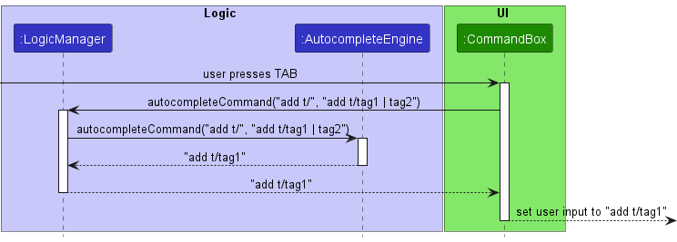
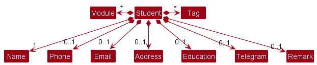
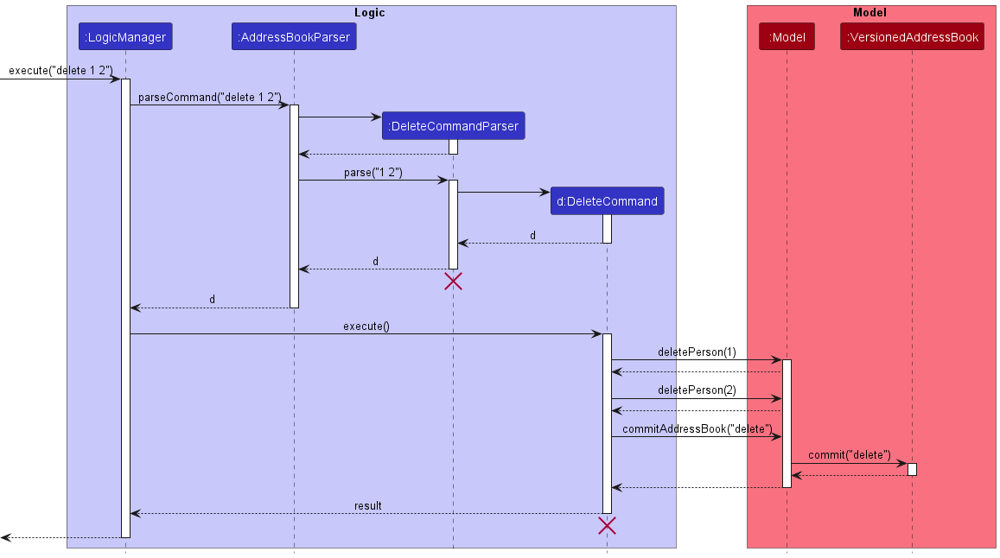

## **About TeachMeSenpai**

TeachMeSenpai **is a student managing application** specially customised for **teaching assistants (TA) in NUS** who have a lot of students to keep track of. TeachMeSenpai is optimised for fast-typists with a **Command Line Interface (CLI)** with the benefits of a **Graphical User Interface (GUI)**.

This Developer Guide provides in-depth documentation on the design and implementation consideration behind TeachMeSenpai. This guide covers everything you need to know from the architecture down to the feature implementation details of TeachMeSenpai.

If you're eager to get started with TeachMeSenpai, head over to [Setting up, getting started](#setting-up-getting-started)! If you'd like to learn more about how TeachMeSenpai was implemented, you can head over to [Implementation](#implementation)! You may use this guide to evolve TeachMeSenpai to suit your needs.

## **Table of Contents**
{:.no_toc}

1. Table of Contents
{:toc}

--------------------------------------------------------------------------------------------------------------------

## **Acknowledgements**

* This project is based on the AddressBook-Level3 project created by the [SE-EDU initiative](https://se-education.org/)
* Libraries used: [JavaFX](https://openjfx.io/), [Jackson](https://github.com/FasterXML/jackson), [JUnit5](https://github.com/junit-team/junit5)
* All icons used are taken from [flaticon](https://www.flaticon.com/)

--------------------------------------------------------------------------------------------------------------------

## **Setting up, getting started**

Refer to the guide [_Setting up and getting started_](SettingUp.md).

--------------------------------------------------------------------------------------------------------------------

## **Design**

<div markdown="span" class="alert alert-success">
:bulb: **Tip:** The `.puml` files used to create diagrams in this document can be found in the [diagrams](https://github.com/AY2223S2-CS2103T-W12-2/tp/tree/master/docs/diagrams/) folder. Refer to the [_PlantUML Tutorial_ at se-edu/guides](https://se-education.org/guides/tutorials/plantUml.html) to learn how to create and edit diagrams.
</div>

### Architecture


The ***Architecture Diagram*** given above explains the high-level design of the App.

Given below is a quick overview of main components and how they interact with each other.

**Main components of the architecture**

**`Main`** has two classes called [`Main`](https://github.com/AY2223S2-CS2103T-W12-2/tp/tree/master/src/main/java/seedu/address/Main.java) and [`MainApp`](https://github.com/AY2223S2-CS2103T-W12-2/tp/tree/master/src/main/java/seedu/address/MainApp.java). It is responsible for,
* At app launch: Initializes the components in the correct sequence, and connects them up with each other.
* At shut down: Shuts down the components and invokes cleanup methods where necessary.

[**`Commons`**](#common-classes) represents a collection of classes used by multiple other components.

The rest of the App consists of four components.

* [**`UI`**](#ui-component): The UI of the App.
* [**`Logic`**](#logic-component): The command executor.
* [**`Model`**](#model-component): Holds the data of the App in memory.
* [**`Storage`**](#storage-component): Reads data from, and writes data to, the hard disk.


**How the architecture components interact with each other**

The *Sequence Diagram* below shows how the components interact with each other for the scenario where the user issues the command `delete 1`.


Each of the four main components (also shown in the diagram above),

* defines its *API* in an `interface` with the same name as the Component.
* implements its functionality using a concrete `{Component Name}Manager` class (which follows the corresponding API `interface` mentioned in the previous point.

For example, the `Logic` component defines its API in the `Logic.java` interface and implements its functionality using the `LogicManager.java` class which follows the `Logic` interface. Other components interact with a given component through its interface rather than the concrete class (reason: to prevent outside component's being coupled to the implementation of a component), as illustrated in the (partial) class diagram below.


The sections below give more details of each component.

### UI component

The **API** of this component is specified in [`Ui.java`](https://github.com/AY2223S2-CS2103T-W12-2/tp/tree/master/src/main/java/seedu/address/ui/Ui.java)


The UI consists of a `MainWindow` that is made up of parts e.g.`CommandBox`, `ResultDisplay`, `PersonListPanel`, `StatusBarFooter` etc. All these, including the `MainWindow`, inherit from the abstract `UiPart` class which captures the commonalities between classes that represent parts of the visible GUI.

The `UI` component uses the JavaFx UI framework. The layout of these UI parts are defined in matching `.fxml` files that are in the `src/main/resources/view` folder. For example, the layout of the [`MainWindow`](https://github.com/AY2223S2-CS2103T-W12-2/tp/tree/master/src/main/java/seedu/address/ui/MainWindow.java) is specified in [`MainWindow.fxml`](https://github.com/AY2223S2-CS2103T-W12-2/tp/tree/master/src/main/resources/view/MainWindow.fxml)

The `UI` component,

* executes user commands using the `Logic` component.
* listens for changes to `Model` data so that the UI can be updated with the modified data.
* keeps a reference to the `Logic` component, because the `UI` relies on the `Logic` to execute commands.
* depends on some classes in the `Model` component, as it displays `Person` object residing in the `Model`.

### Logic component

**API** : [`Logic.java`](https://github.com/AY2223S2-CS2103T-W12-2/tp/tree/master/src/main/java/seedu/address/logic/Logic.java)

Here's a (partial) class diagram of the `Logic` component:


How the `Logic` component works:
1. When `Logic` is called upon to execute a command, it uses the `AddressBookParser` class to parse the user command.
1. This results in a `Command` object (more precisely, an object of one of its subclasses e.g., `AddCommand`) which is executed by the `LogicManager`.
1. The command can communicate with the `Model` when it is executed (e.g. to add a person).
1. The result of the command execution is encapsulated as a `CommandResult` object which is returned back from `Logic`.

The Sequence Diagram below illustrates the interactions within the `Logic` component for the `execute("delete 1")` API call.


<div markdown="span" class="alert alert-info">:information_source: **Note:** The lifeline for `DeleteCommandParser` should end at the destroy marker (X) but due to a limitation of PlantUML, the lifeline reaches the end of diagram.
</div>

Here are the other classes in `Logic` (omitted from the class diagram above) that are used for parsing a user command:


How the parsing works:
* When called upon to parse a user command, the `AddressBookParser` class creates an `XYZCommandParser` _(`XYZ` is a placeholder for the specific command name e.g., `AddCommandParser`)_ which uses the other classes shown above to parse the user command and create a `XYZCommand` object _(e.g., `AddCommand`)_ which the `AddressBookParser` returns back as a `Command` object.
* All `XYZCommandParser` classes _(e.g., `AddCommandParser`, `DeleteCommandParser`, ...)_ inherit from the `Parser` interface so that they can be treated similarly where possible e.g, during testing.

### Model component
**API** : [`Model.java`](https://github.com/AY2223S2-CS2103T-W12-2/tp/tree/master/src/main/java/seedu/address/model/Model.java)


The `Model` component,

* stores the address book data i.e., all `Person` objects (which are contained in a `UniquePersonList` object).
* stores the currently 'selected' `Person` objects (e.g., results of a search query) as a separate _filtered_ list which is exposed to outsiders as an unmodifiable `ObservableList<Person>` that can be 'observed' e.g. the UI can be bound to this list so that the UI automatically updates when the data in the list change.
* stores a `UserPref` object that represents the user’s preferences. This is exposed to the outside as a `ReadOnlyUserPref` objects.
* stores every modified version of the address book in `VersionedAddressBook`.
* does not depend on any of the other three components (as the `Model` represents data entities of the domain, they should make sense on their own without depending on other components)

<div markdown="block" class="alert alert-info">
:information_source: **Note:** An alternative (arguably, a more OOP) model is given below. It has a `Tag` and `Module` list in the `AddressBook`, which `Person` references. This allows `AddressBook` to only require one `Tag` object per unique tag, and one `Module` object per unique module instead of each `Person` needing their own `Tag` and `Module` objects.


</div>


### Storage component

**API** : [`Storage.java`](https://github.com/AY2223S2-CS2103T-W12-2/tp/tree/master/src/main/java/seedu/address/storage/Storage.java)


The `Storage` component,
* can save both address book data and user preference data in json format, and read them back into corresponding objects.
* inherits from both `AddressBookStorage` and `UserPrefStorage`, which means it can be treated as either one (if only the functionality of only one is needed).
* depends on some classes in the `Model` component (because the `Storage` component's job is to save/retrieve objects that belong to the `Model`)

### Common classes

Classes used by multiple components are in the `seedu.addressbook.commons` package.

--------------------------------------------------------------------------------------------------------------------

## **Implementation**

This section describes some noteworthy details on how certain features are implemented.

### Autocomplete feature

#### Implementation

The autocomplete feature is implemented through the `AutocompleteEngine` class, which is aggregated inside the `LogicManager` class. The `LogicManager` class implements the `Logic` interface, which exposes the `AutocompleteEngine` methods. The `LogicManager` initializes the `AutocompleteEngine` with a predefined `Model`, and the `AutocompleteEngine` utilizes methods from the `Model` interface to access existing tag, module, and education values.

The `CommandBox` UI class then integrates the autocomplete feature. It listens for user input and queries the `Logic` interface for suggestions based on the current input.

The public methods of the `AutocompleteEngine` class are:

- `suggestCommand(String userInput)` — Suggests a command _(including it's arguments)_ based on the user input.
- `autocompleteCommand(String userInput, String commandSuggestion)` — Returns the new user input when the user autocompletes the command.

New methods in the `Model` interface for the autocomplete feature include:

- `getExistingTagValues()` — Returns a list of all existing tag values contained in the person list.
- `getExistingModuleValues()` — Returns a list of all existing module values contained in the person list.
- `getExistingEducationValues()` — Returns a list of all existing education values contained in the person list.

Given below is an example usage scenario and how the autocomplete mechanism works at each step:

- **Step 1.** The user launches the application for the first time. The `LogicManager` initializes the `AutocompleteEngine` with the predefined `Model`.

- **Step 2.** The user types the input `add t/`. `CommandBox` detects the change in user input, and calls the `Logic::suggestCommand` method to get suggestions based on the said input.

- **Step 3.** The `LogicManager` in turn calls the `AutocompleteEngine#suggestCommand` method, which in turn queries the `Model` for existing tag, module, and education values. In this example, `Model::getExistingTagValues()` returns the list `["tag1", "tag2"]`.

  <div markdown="span" class="alert alert-info">:information_source: **Note:** For **Step 3**, since the existing module and education values aren't used, they're omitted in this example.
  </div>

- **Step 4.** The `AutocompleteEngine` processes the user input and existing values to generate the suggestion `add n/tag1 | tag2`, and returns it to `CommandBox`, which displays it to the user in a shadow-like autocomplete suggestion.

Here's the suggestion sequence diagram showing the above 4 steps:


<br>

- **Step 5.** The user then presses the `TAB` key, and `CommandBox` component calls the `Logic#autocompleteCommand` method to complete the user input `add t/`, based on the current suggestion `add t/tag1 | tag2`.

- **Step 6.** The `LogicManager` in turn calls the `AutocompleteEngine#autocompleteCommand` method to generate said suggestion, and returns the autocompleted user input `add t/tag1` to `CommandBox`, which sets that as the command box value.

Here's the autocompletion sequence diagram showing the above 2 steps:



<br>

If the user types an invalid command-word or index, `AutocompleteEngine#suggestCommand` will throw a `ParseException`, which causes the text to be displayed in red.

<div markdown="span" class="alert alert-info">:information_source: **Note:** The autocomplete feature does not actually validate whether the argument values are valid or indexes exist. It's merely a simple heuristic check, to help users avoid making obvious syntax mistakes in the commands.
</div>

#### Design considerations

**Aspect: Simple heuristic check vs. full validation of command arguments:**

* **Alternative 1 (current choice):** Simple heuristic check
  * Pros: Less computationally expensive, which avoids lagging the app and hindering fast typists. Easier to implement.
  * Cons: Does not provide full validation of command arguments.
* **Alternative 2:** Full validation of command arguments using each field's is-valid methods _(e.g., `Address::isValidAddress`, `Email::isValidEmail`)_
  * Pros: Provides full validation of command arguments.
  * Cons:
    * More computationally expensive, especially when using regex for validation, which can lag the app and hinder fast typists.
    * Harder to implement
    * Might constantly highlight the text red, which can be annoying for users who haven't finished typing.

We chose Alternative 1 because it aligns with the [project constraint][constraint-typing-preferred] of targeting users who can type fast. Furthermore, it is easier to implement and provides a smoother user experience without constantly highlighting the text red while typing.

[constraint-typing-preferred]: https://nus-cs2103-ay2223s2.github.io/website/admin/tp-constraints.html#constraint-typing-preferred

### Add Feature

#### Implementation Details

The implementation of the `add` command involves creating a new `Person` object and storing it in `AddressBook`.

Given below is a class diagram on the `Person` class and the classes related to its attributes:



The `Person` object is composed of attributes:

* `Name`: The name of the student.
* `Phone`: The phone number of the student.
* `Email`: The email address of the student.
* `Address`: The address of the student.
* `Education`: The education level of the student.
* `Telegram`: The telegram handle of the student.
* `Module`: The modules the TA is teaching the student.
* `Remark`: Remarks/notes the tutor has about the student.
* `Tags`: Qualities a student has.

#### Proposed Implementation

The `add` command has the following fields:

<div markdown="span" class="alert alert-info">:information_source: **Note:** (COMPULSORY) indicates that the field is cannot be omitted when using `add`. Unless stated as (COMPULSORY), the field is optional.
</div>

* Prefix `n/` followed by the name of the student (COMPULSORY).
* Prefix `p/` followed by the phone number of the student.
* Prefix `e/` followed by the student's email.
* Prefix `a/` followed by the student's address.
* Prefix `edu/` followed by the student's education level.
* Prefix `tele/` followed by the student's telegram handle.
* Prefix `m/` followed by the module name.
* Prefix `r/` followed by the remarks/notes on the student.
* Prefix `t/` followed by the tags a student has.

Here is a sequence diagram showing the interactions between components when `add n/Alice edu/Year 1` is run.:


<div markdown="span" class="alert alert-info">:information_source: **Note:** The lifeline for `AddCommandParser` and `AddCommand` should end at the destroy marker (X) but due to a limitation of PlantUML, the lifeline reaches the end of diagram.
</div>

#### Feature details
1. The app will validate the parameters supplied by the user with pre-determined formats for each attribute.
2. If an input fails the validation check, an error message is provided which details the error and prompts the user for a corrected input.
3. If the input passes the validation check, a new `Person` entry is created and stored in the `VersionedAddressBook`.

#### General Design Considerations

The implementation of the attributes of a `Person` is very similar to that of a `Person` in the original AB3 codebase. Hence, resulting in a similar implementation of the `add` feature.

Some additions made were the `Education`, `Module` and `Remark` attributes.
1. `Education` is implemented similar to the other attributes like `Address`, but is modified to fit the logic that a student can only have one education level.
2. `Module` is implemented in a similar way to `Tags` in AB3 but has been modified to accommodate module names that are more than one word long as in real life.
3. Every attribute except `Name` has been made **OPTIONAL** to accomodate circumstances where some student's details are unknown at the time of entry.
    * We utilised the [java.util.Optional<T>](https://docs.oracle.com/en/java/javase/11/docs/api/java.base/java/util/Optional.html "java.util.Optional<T>") class to encapsulate the optional logic of the attributes.
4. Every `add` will commit the previous version of the `VersionedAddressBook` to `versionStateHistory`.

When adding a student entry, these were the alternatives considered.
* **Alternative 1 (current choice):** Only `Name` has to be specified to create a `Person` entry, making the other attributes optional.
    * Pros:
        * Improves user convenience by allowing them to add a `Person` entry even with limited knowledge about their details.
    * Cons:
        * A lot of modification for empty/*null* inputs have to be accounted for when saving the data and testing.
* **Alternative 2:** All parameters have to be filled in
    * Pros:
        * Easier to implement as there is lesser room for errors when dealing with empty/*null* inputs
    * Cons:
        * `add` becomes a lengthy command to execute as unnecessary additional time is needed to enter dummy values to meet the input requirements.
        * Reduces user convenience as "useful" entries that can be made are limited to students whose details are all known.

[↑ Back to top](#table-of-contents)

### Delete feature

#### Implementation Details

The `delete` implementation is similar to the implementation in AB3's codebase. However, we've made some additions to support deletion of multiple (unique) indexes.

Here is a sequence diagram showing the interactions between components when `delete 1 2` is run.:



<div markdown="span" class="alert alert-info">:information_source: **Note:** The lifeline for `DeleteCommandParser` should end at the destroy marker (X) but due to a limitation of PlantUML, the lifeline reaches the end of diagram.
</div>

#### Proposed Implementation

The proposed `delete` implementation supports deleting multiple `Person` entries at once. For example, `delete 1 3 5` will delete the `Person` entries at indexes 1, 3 and 5 in the  `AddressBook` (Assuming indexes 1, 3 and 5 are valid). However, if an invalid index is given `delete 1 2 100`, none of the `Person` entries will be deleted.


#### Design Considerations

Taking into consideration the fact that users may make a typo, the time cost of `undo` or re-adding the deleted valid `Person` entries, we believe that if a single invalid `INDEX` is given, the system should generate an error message.

**Aspect: Handling invalid indexes in delete**

* **Alternative 1: (Current choice)** Do not execute command, give an error message saying that there're invalid indexes.
  * Pros:
    * Invalid indexes might mean the command contain other erroneous indexes.
    * Allows user to edit the erroneous command input _(as the command isn't cleared from the input box)_.
  * Cons:
    * Harder for users to find the invalid index and correct it.
* **Alternative 2:** Delete all valid `Person` entries out of the given indexes.
  * Pros:
    * If command had only minor typos, it might saves the user time editing their command.
  * Cons:
    * Harder to implement as we have to keep track of the valid indexes.
    * If command unintentionally deletes wrong user, it'll costs the user more time to correct the mistake + retype their correct delete command.

**Aspect: Handling duplicate indexes in delete _(`delete 1 1`)_**

* **Alternative 1: (Current choice)** Do not execute command, give an error message saying that there're duplicate indexes.
  * Pros/Cons:
    * Same as **Aspect: Handling invalid indexes in delete** > **Alternative 1**
* **Alternative 2:** Delete all unique `Person` entries out of the given indexes.
  * Pros/Cons:
    * Same as **Aspect: Handling invalid indexes in delete** > **Alternative 2**

[↑ Back to top](#table-of-contents)

### Edit Feature

#### Implementation Details

The implementation of `edit` involves creating a new `Person` object with updated details to replace the previous `Person` object.
This is done with the help of the `EditPersonDescriptor` class, which helps create the new `Person` object.

`edit` has similar fields to the [Add feature](#add-feature) and an additional `INDEX` parameter.

<div markdown="span" class="alert alert-info">:information_source: **Note:** While all the fields are optional, at least 1 needs to be given.
</div>

* `INDEX` which represents the index number of the student to be edited in the list.
* Prefix `n/` followed by the name of the student.
* Prefix `p/` followed by the phone number of the student.
* Prefix `e/` followed by the student's email.
* Prefix `a/` followed by the student's address.
* Prefix `edu/` followed by the student's education level.
* Prefix `m/` followed by the module name.
* Prefix `t/` followed by the tag name.
* Prefix `r/` followed by the remarks/notes on the student.

Here is a sequence diagram showing the interactions between components when `edit 1 n/Bob edu/Year 2` is run.:


<div markdown="span" class="alert alert-info">:information_source: **Note:** The lifeline for `EditCommandParser`, `EditCommand`, and `EditPersonDescriptor` should end at the destroy marker (X) but due to a limitation of PlantUML, the lifeline reaches the end of diagram.
</div>

#### Feature details
1. Similar to `add`, the app will validate the parameters supplied by the user with pre-determined formats for each attribute.
2. If an input fails the validation check, an error message is provided which details the error and prompts the user for a corrected input.
3. If the input passes the validation check, the corresponding `Person` is replaced by a new edited `Person` object and stored in the `VersionedAddressBook`.

#### General Design Considerations
Whether a new `Person` object should be created when editing a student entry.
* **Alternative 1 (Current choice):** `edit` will create a new `Person` object with the help of `EditPersonDescriptor`
    * Pros:
        * Meets the expectations of the immutable `Person` class.
    * Cons:
        * Inefficient as an entire `Person` object is created even if only one field is changed.

* **Alternative 2:** `edit` directly sets the updated values in the existing `Person` object.
    * Pros:
        * More timely option and space efficient.
    * Cons:
        * In order to execute this, `Person` cannot be immutable, this reduces the defensiveness of the program, making it more susceptible to errors.

[↑ Back to top](#table-of-contents)

### Find feature

#### Implementation Details

The proposed `find` feature is implemented using `MultiFieldContainsKeywordsPredicate`.

Both of which implement the `Predicate<Person>` interface where the `test` method checks whether the data in the relevant field of a `Person` contains the specified keyword.
The reason for implementing this feature with `Predicate<Person>` is that it can be easily used to filter the entire list of `Person` collected into java's `FilteredList`.


Here is a sequence diagram showing the interactions between components when `find n/Alice p/12345678` is run.:


<div markdown="span" class="alert alert-info">:information_source: **Note:** The lifeline for `FindCommandParser` and `FindCommand` should end at the destroy marker (X) but due to a limitation of PlantUML, the lifeline reaches the end of diagram.
</div>

#### Feature details

Our implementation extends from the `find` implementation in AB3 by enhancing the current `find KEYWORD`feature to `find PARTIAL_KEYWORD`.

> Take a person's name to be `Michelle Yeoh`.  \\
> An example of finding by `PARTIAL_KEYWORD` is using "Ye" or "miche" while `KEYWORD` would be "Michelle Yeoh".

Furthermore, users are also allowed to specify the field that they want to find in by using the default [prefixes](#Add-feature) given to them.

> The prefixes refer to those that the user input in the `Add` command, eg.
> ```
> add n/Bob p/98712345 edu/P5
> ```
> In the `find` command, users are then allowed to input their prefix of choice, eg.
> ```
> find n/bo
> find p/9871
> find edu/p5
> ```

This allows the user to narrow down their `find` results even more.

#### General Design Considerations
The implementation of `find` is built on top of the original AB3 codebase's `find` command.
We felt that the default `find` feature was too restrictive.

Our implementation has some additions such as:

1. Allowing `PARTIAL_KEYWORD` finds so that we can accommodate for the real-life scenarios where users are not certain of the full `KEYWORD` to input for `find`.
2. `find PREFIX` across the various attributes of a `Person` other than their `Name` _(eg. find in `Education` or `Address` attributes)_

**Aspect: Command format:**
* **Alternative 1 (Current choice):** `find PREFIX KEYWORD/PARTIAL_KEYWORD`
  * Pros:
    * Improves user convenience by giving them flexibility in the completeness of their desired find keyword.
    * Extensible across other attributes.
    * Narrows down the list to be very succinct and specific to the desired keyword.
  * Cons:
    * Adds complexity to the implementation as this implementation introduces a lot of potential errors in parsing the user's input.
    * Might be slightly challenging for new users to enter the `PREFIX`.
* **Alternative 2:** `find KEYWORD/PARTIAL_KEYWORD`
  * Pros:
    * Easier to implement as there is lesser validating done by the app.
    * Provides the user flexibility in searching across all attributes by default.
    * Less syntax to input and learn by the users.
  * Cons:
    * The filtered list may not be what was desired as short partial keywords like `a` is unlikely to result in a succinct list.
    * Users will not be able to search keywords for a particular attribute.
    * The resulting filtered list will span across multiple different fields, where all attributes in all fields containing the specified keyword will be displayed.

[↑ Back to top](#table-of-contents)

### Filter feature

#### Implementation Details

Filter was implemented on top of find to allow users to find students with fewer restrictions. As `find` only returns the students that satisfy all the specified criteria, filter` on the other hand will allow users to find all students that satisfy at least 1 criteria.

This was done to take improve the flexibility of filtering the student list.

Here is a sequence diagram showing the interactions between components when `filter n/Alice p/12345678` is run:


<div markdown="span" class="alert alert-info">:information_source: **Note:** The lifeline for `FindCommandParser` and `FindCommand` should end at the destroy marker (X) but due to a limitation of PlantUML, the lifeline reaches the end of diagram.
</div>

#### Feature details

#### General Design Considerations


[↑ Back to top](#table-of-contents)

### List feature

#### Implementation Details
The `list` implementation is identical to the implementation in AB3's codebase.

Here is a sequence diagram showing the interactions between components when `list` is run.:


<div markdown="span" class="alert alert-info">:information_source: **Note:** The lifeline for `ListCommand` should end at the destroy marker (X) but due to a limitation of PlantUML, the lifeline reaches the end of diagram.
</div>

#### Design Consideration
The `list` command does not accept any arguments in order to make it as convenient for users to view their full list of students after a prior command such as `find` which displays
a filtered list.

### Remark feature

#### Feature Implementation Details
The current implementation provides users with two different methods of entering a remark for a student.
1. `remark INDEX REMARK` where `INDEX` is the `Person` entry in the list, and `REMARK` is the remark to be added.
2. Adding the remark through the [add feature](#Add-feature)

#### Proposed Implementation

The proposed remark mechanism will be facilitated by a pop-up text box. This will allow users to format their remarks however they like, rather than being restricted to a single line in the command line (current implementation).

#### General Design Considerations

In order to make this feature as versatile as possible, the `remark` feature should consider formatted inputs (eg. new lines to separate paragraphs).

Additionally, we opted for a pop-up text window as the command line only provides a restricted view and input option for users, hence it does not support formatted remarks.

**Aspect: Command input format**
* **Alternative 1:** Adding the `remark` through the command line.
  * Pros:
    * Easier to implement
  * Cons:
    * Restricts users to a single line or continuous paragraph of remark.
    * Limits formatting options for remark.
* **Alternative 2: (Current implementation)** Adding remark through a pop-up text window
  * Pros:
    * Provides users flexibility in the format of their remarks.
    * Remarks are not restricted to a single line or continuous paragraph.
  * Cons:
    * More complicated to implement as the format of the remarks have to be saved and loaded into `VersionedAddressBook` without any formatting erros.

**Aspect: Remark display**
* **Alternative 1: (Current implementation)** Preview the first line (truncated) of a student's remarks under all the other attributes
  * Pros:
    * Short remarks are instantly visible to users.
    * Easy to implement.
  * Cons:
    * A short remark which has a length slightly over the character limit for truncation can only be viewed via the [`show`](#show-feature)
* **Alternative 2:** If a remark is present, simply display an indicator in `PersonCard`
  * Pros:
    * Easy to implement.
    * Viewing the remark in `ResultDisplay` is supported by the [`show`](#show-feature) command.
    * Supports formatting of `remark` since it is not restricted to the `PersonCard` view.
  * Cons:
    * An extra step for users may be inconvenient
    * Inconvenient for short remarks compared to alternative 1.
* **Alternative 3:** Show the full remark in `PersonCard` beside all the other attributes
  * Pros:
    * Remark is directly visible from the list.
    * Supports formatting in `remark`.
  * Cons:
    * Remarks are limited to the view of `PersonCard` and size of the window.
    * Remarks that are too long will be cut off and not visible.

[↑ Back to top](#table-of-contents)

### Show feature

#### Implementation Details

The implementation of `show` is similar to the `list` command in the AB3 codebase. The `show` feature was implemented to support the `remark` feature.

Remarks longer than the width of `PersonListCard` in `PersonListPanel` will not be visible. Hence, `show` allows users to view the full remark in the `ResultDisplay` since scrolling is supported.

#### General Design Considerations
**Aspect: Display output**
* **Alternative 1: (Future implementation)** Display the entire `PersonCard` of the student chosen in `PersonListPanel`.
  * Pros:
    * Allows users to view the student details and remarks all at once.
    * Supports the `remark` feature as intended
  * Cons:
    * May reduce user convenience as `show INDEX` will likely always be followed with the `list` command to toggle back to the full list of students.
    * Harder to implement as the size of the `PersonCard` for the `Person` has to be updated everytime `show` is executed.

* **Alternative 2: (Current choice)** Display the entire `PersonCard` of the student chosen in the `ResultDisplay`
  * Pros:
    * Supports the `remark` feature as intended since scrolling is possible.
    * Allows users to view the student details and remarks all at once.
  * Cons:
    * Harder to implement

[↑ Back to top](#table-of-contents)

### Undo/redo feature

#### Proposed Implementation

The proposed undo/redo mechanism is facilitated by `VersionedAddressBook`. It extends `AddressBook` with an undo/redo history, stored internally as an `versionStateHistory` and `currentVersionPointer`. Additionally, it implements the following operations:

* `VersionedAddressBook#commit()` — Saves the current address book state in its history as well as the command that was last executed.
* `VersionedAddressBook#undo()` — Restores the previous address book state from its history.
* `VersionedAddressBook#redo()` — Restores a previously undone address book state from its history.

These operations are exposed in the `Model` interface as `Model#commitAddressBook()`, `Model#undoAddressBook()` and `Model#redoAddressBook()` respectively.

Given below is an example usage scenario and how the undo/redo mechanism behaves at each step.

Step 1. The user launches the application for the first time. The `VersionedAddressBook` will be initialized with the initial address book state, and the `currentVersionPointer` pointing to that single address book state.


Step 2. The user executes `delete 5` command to delete the 5th person in the address book. The `delete` command calls `Model#commitAddressBook()`, causing the modified state of the address book after the `delete 5` command executes to be saved in the `addressBookStateList`, and the `currentVersionPointer` is shifted to the newly inserted address book state.


Step 3. The user executes `add n/David …​` to add a new person. The `add` command also calls `Model#commitAddressBook()`, causing another modified address book state to be saved into the `addressBookStateList`.


<div markdown="span" class="alert alert-info">:information_source: **Note:** If a command fails its execution, it will not call `Model#commitAddressBook()`, so the address book state will not be saved into the `addressBookStateList`.

</div>

Step 4. The user now decides that adding the person was a mistake, and decides to undo that action by executing the `undo` command. The `undo` command will call `Model#undoAddressBook()`, which will shift the `currentVersionPointer` once to the left, pointing it to the previous address book state, and restores the address book to that state.


<div markdown="span" class="alert alert-info">:information_source: **Note:** If the `currentVersionPointer` is at index 0, pointing to the initial AddressBook state, then there are no previous AddressBook states to restore. The `undo` command uses `Model#checkUndoable()` to check if this is the case. If so, it will return an error to the user rather
than attempting to perform the undo.

</div>

The following sequence diagram shows how the undo operation works (assuming `VersionedAddressBook is undoable`):


<div markdown="span" class="alert alert-info">:information_source: **Note:** The lifeline for `UndoCommand` should end at the destroy marker (X) but due to a limitation of PlantUML, the lifeline reaches the end of diagram.

</div>

The `redo` command does the opposite — it calls `Model#redoAddressBook()`, which shifts the `currentVersionPointer` once to the right, pointing to the previously undone state, and restores the address book to that state.

The following sequence diagrama shows how the redo operation works (assuming `VersionedAddressBook` is redoable):


<div markdown="span" class="alert alert-info">:information_source: **Note:** If the `currentVersionPointer` is at index `addressBookStateList.size() - 1`, pointing to the latest address book state, then there are no undone AddressBook states to restore. The `redo` command uses `Model#checkRedoable()` to check if this is the case. If so, it will return an error to the user rather than attempting to perform the redo.

</div>

Step 5. The user then decides to execute the command `list`. Commands that do not modify the address book, such as `list`, will not call `Model#commitAddressBook()`, `Model#undoAddressBook()` or `Model#redoAddressBook()`. Thus, the `addressBookStateList` remains unchanged.


Step 6. The user executes `clear`, which calls `Model#commitAddressBook()`. Since the `currentVersionPointer` is not pointing at the end of the `addressBookStateList`, all address book states after the `currentVersionPointer` will be purged. Reason: It no longer makes sense to redo the `add n/David …​` command. This is the behavior that most modern desktop applications follow.


The following activity diagram summarizes what happens when a user executes a new command:


#### Design considerations:

**Aspect: How undo & redo executes:**

* **Alternative 1 (current choice):** Saves the entire address book.
  * Pros: Easy to implement.
  * Cons: May have performance issues in terms of memory usage.

* **Alternative 2:** Individual command knows how to undo/redo by
  itself.
  * Pros: Will use less memory (e.g. for `delete`, just save the person being deleted).
  * Cons: We must ensure that the implementation of each individual command are correct.

**Aspect: Command History:**

* **Alternative 1 (Current implementation):** Only saves the commands that modify the address book.
  * Pros: Easy to implement.
  * Cons: Reduces user experience as keeping track of all commands will also allow us to improve the error messages by specifying the specific recent command which does not allow `undo` or `redo`

* **Alternative 2 (Future implementation):** Save every command executed regardless of whether it modifies the address book.
  * Pros: 
  * Improves user experience by improving the quality of the error message for `undo` and `redo`
  * Cons: Slightly more complicated to implement as a separate `currentStatePointer` for the command history will have to be added.

[↑ Back to top](#table-of-contents)

### \[Proposed\] Sort feature

#### Proposed Implementation

The proposed `sort` implementation will sort the `UniquePersonList` object, hence it will make use of:

* `sort` in [javafx.collections.FXCollections](https://docs.oracle.com/javase/8/javafx/api/javafx/collections/FXCollections.html) for the main sorting functionality.
  * In order to sort by `Name`, the comparator will be as follows `Comparator<Name>`.
* `comparing` in [java.util.Comparator](https://docs.oracle.com/javase/8/docs/api/java/util/Comparator.html) class to execute `sort` in ascending and descending orders.

An example usage would be `sort ASC` to sort the list in ascending order, and `sort DESC` to sort the list in descending order.

<div markdown="span" class="alert alert-info">
:information_source: **Note:** `ASC` and `DESC` will not be case-sensitive, in other words, `sort ASC` and `sort asc` are both acceptable commands.
</div>

**Exepected execution:**

1. Upon entering the command `sort ASC` in the command line of the application, the list of students will be sorted in alphabetically ascending order of their `Name`.
2. Upon entering the command `sort DESC` in the command line of the application , the list of students will be sorted in alphabetically descending order of their `Name`.

#### Design Considerations:

**Aspect: Command format:**

* **Alternative 1:** `sort`
  * Pros:
    * Simpler command for users to execute
  * Cons:
    * Less flexible as users cannot decide which attribute to sort by.
    * Reduces extensibility of the feature (eg. sort by module tag is more complicated if `sort` doesn't accept inputs)
    * Users cannot choose which order to sort in as it will be defaulted to sorting in ascending order.
* **Alternative 2 (Current choice):** `sort ORDER`
  * Pros:
    * Provides extensibility of sort (eg. future implementation of `sort edu ORDER` to sort by education level)
    * Allows users to choose the order they would like to sort the list by
    * Gives flexibility and convenience to users.
  * Cons:
    * Adds complexity to the implementation as more error checking of the inputs is required.

_{more aspects to be added}_


[↑ Back to top](#table-of-contents)

--------------------------------------------------------------------------------------------------------------------

## **Documentation, logging, testing, configuration, dev-ops**

* [Documentation guide](Documentation.md)
* [Testing guide](Testing.md)
* [Logging guide](Logging.md)
* [Configuration guide](Configuration.md)
* [DevOps guide](DevOps.md)

--------------------------------------------------------------------------------------------------------------------

## **Appendix: Requirements**

### Product scope

**Target user profile**:

* Teaching Assistants (TAs)/tutors who have a class of students to manage and are preferably are proficient typers.

**Value proposition**:

* TeachMeSenpai acts as an optimised app for tutors to manage their students' data, obtain insights on their students' data.

### User stories

**Priorities:**

- **`HIGH`** _(must have)_
- `MED` _(nice to have)_
- _`Low`_ _(unlikely to have)_

|  Priority  | As a …​ | I want to …​                                                                                                   | So that I can…​                                                             |
|:----------:|---------|----------------------------------------------------------------------------------------------------------------|-----------------------------------------------------------------------------|
| **`HIGH`** | tutor   | open the app                                                                                                   | begin using the app                                                         |
| **`HIGH`** | tutor   | close the app                                                                                                  | leave the app                                                               |
| **`HIGH`** | tutor   | add a student's name                                                                                           | track a student's progress by their name                                    |
| **`HIGH`** | tutor   | include student's education level when adding the student (eg. P6)                                             | keep track of a student's education level                                   |
| **`HIGH`** | tutor   | include student's phone number when adding the student (eg. 94206942)                                          | keep track of a student's phone number                                      |
| **`HIGH`** | tutor   | include student's email when adding the student (eg. iloveanimegirls@gmail.com)                                | keep track of a student's email                                             |
| **`HIGH`** | tutor   | include student's address when adding the student (eg. Block 69 S642069)                                       | keep track of a student's address and go to the place easily                |
| **`HIGH`** | tutor   | include the modules I'm teaching a student to their entry (eg. CS2101, CS4243)                                 | keep track of what modules I'm teaching the student                         |
| **`HIGH`** | tutor   | include optional student-specific notes when adding the student (eg. Good in Japanese)                         | store information for a particular student such as notes and remarks        |
| **`HIGH`** | tutor   | include tags on a student about their noteworthy qualities (eg. active)                                        | keep track of a student's qualities.                                        |
| **`HIGH`** | tutor   | delete a student entry from my list (by index)                                                                 | remove all details related to a certain student                             |
| **`HIGH`** | tutor   | have my changes saved automatically                                                                            | be sure that I won't lose my changes if I crash/close the app               |
| **`HIGH`** | tutor   | view my list of students                                                                                       | keep track of who I'm currently teaching                                    |
| **`HIGH`** | tutor   | View the address of a student                                                                                  | know where to go if I need to provide tuition at their house                |
| **`HIGH`** | tutor   | have my data persist between use sessions                                                                      | continue my session where I left off                                        |
| **`HIGH`** | tutor   | find my students by searching their names                                                                      | quickly view that student's details                                         |
| **`HIGH`** | tutor   | edit a student's name                                                                                          | correct a student's name                                                    |
| **`HIGH`** | tutor   | edit the modules I'm teaching a particular student                                                             | update or correct a student's records                                       |
| **`HIGH`** | tutor   | edit a student's education level                                                                               | update or correct a student's records                                       |
| **`HIGH`** | tutor   | receieve an appropriate and user-friendly error message when I enter the wrong inputs/parameters for a command | find out the correct input/parameter format and use the feature as intended |
| **`HIGH`** | tutor   | be able to ask for help                                                                                        | learn how to use the app                                                    |
|   `MED`    | tutor   | filter my students by education level (eg. all P6 students)                                                    | view my students of the same education level                                |
|   `MED`    | tutor   | filter my students by modules                                                                                  | view all the student's I'm teaching a particular module to                  |
|   `MED`    | tutor   | filter my students by address (eg. Ang Mo Kio)                                                                 | view all the students who live in a particular area                         |
|   `MED`    | tutor   | filter my students by email (eg. @gmail)                                                                       | view all the students with similar emails                                   |
|   `MED`    | tutor   | filter my students by tags (eg. active)                                                                        | view all my students with the same qualities                                |
|   `MED`    | tutor   | sort my students by their names                                                                                | view my students in a systematic manner                                     |
|   `MED`    | tutor   | sort my students by their education level                                                                      | view my students according to their education level                         |

[↑ Back to top](#table-of-contents)

### Use cases

For all use cases below, the **System** is the `TeachMeSenpai` app and the **Actor** is the `user`, unless specified otherwise.

#### Use case UC1: Add a student
{:.no_toc}

**MSS**

1.  User request to add a new student's name and particulars.
2.  System adds new student and their particulars as a new entry in the list

    Use case ends

**Extensions**

* 1a. The given name/particulars is invalid
    * 1a1. System shows an error message

      Use case resumes from step 1.

* 1b. The compulsory name field is missing
    * 1a1. System shows an error message

      Use case resumes from step 1.

* 1c. A student entry with the same name exists in the list
    * 1c1. System shows an error message

      Use case resumes from step 1.

* 1d. Some optional particulars are missing
    * 1d1. System adds new student, leaving their particulars blank

      Use case ends


#### Use case UC2: Find a student
{:.no_toc}

**MSS**

1. User requests to find a specific set of students based on a set of criteria
2. System shows a list of students that match the criteria

   Use case ends

**Extensions**

* 1a. The field to search in specified by the user is empty
  * 1a1. System shows an error message

    Use case resumes from step 1.

* 1b. The field to search in is not specified by the user
  * 1b1. System defaults to searching the keyword in the name field
  * 1b2. System shows a list of students whose names match the keyword

    Use case ends

* 1c. The field and keyword are not specified by the user
  * 1c1. System shows an error message

    Use case resumes from step 1

#### Use case UC3: Delete a student
{:.no_toc}

**MSS**

1.  User requests to list students
2.  System shows a list of students
3.  User requests to delete a specific student in the list by their index from the list
4.  System deletes the student

    Use case ends

**Extensions**

* 1a. User requests to find a specific set of students based on a set of criteria
  * 1a1. System shows a list of students which matches the criteria input by the user
  * 1a2. User requests to delete a specific student in the list by their index from the list
  * 1a3. System deletes the student

    Use case ends

* 2a. The list is empty

  Use case ends

* 3a. The given index is invalid
  * 3a1. System shows an error message

    Use case resumes at step 2

#### Use case UC4: List student(s)
{:.no_toc}

**MSS**

1.  User requests to list all the students.
2.  System shows the list of all students.

    Use case ends.

**Extensions**

* 1a. Additional parameters are added behind `list`.
  * 1a1. System shows an error message.

    Use case ends.

#### Use case UC5: Update remarks
{:.no_toc}

**MSS**

1. User requests to list students
2. System shows a list of students
3. User requests to edit a student's remarks of a specific student in the list by their index from the list
4. Program allows multi-line input of remarks
5. User enters remarks
6. User can exit writing the remarks at any time
7. System saves the remarks

   Use case ends

**Extensions**

* 2a. The list is empty

  Use case ends

* 3a. The given index is invalid
  * 3a1. System shows an error message

    Use case resumes at step 2

#### Use case UC6: Edit particulars
{:.no_toc}

**MSS**

1. User requests to edit a student's particulars based on the list displayed
2. System replaces the specified fields with the new details

   Use case ends

**Extensions**

* 1a. The field to edit is not specified
  * 1a1. System shows an error message

    Use case resumes from step 1

* 1b. The index is given is invalid
  * 1b1. System shows an error message

    Use case resumes from step 1

* 1c. The field is specified but the details are empty
  * 1c1. System deletes the information in the specified field

    Use case ends

#### Use case UC7: Exiting the application
{:.no_toc}

**MSS**

1. User requests to exit the application
2. System saves all data into a local file
3. System exits from the application

   Use case ends

[↑ Back to top](#table-of-contents)

### Non-Functional Requirements

1. A user that is completely new to the application should be able to be familiar with the functionalities within 1 hour.
2. System should respond within 0.1 second of the user providing an input.
3. All systems must be able to access the _save file_ ie. Save file should be independent of the OS.
4. Any information displayed should be concise and structured in a logical manner such that it is easily understandable.
5. Should work on any _mainstream OS_ as long as it has Java `11` or above installed.
6. Should be able to hold up to 1000 students without a noticeable sluggishness in performance for typical usage.
7. A user with above average typing speed for regular English text (i.e. not code, not system admin commands) should be able to accomplish most of the tasks faster using commands than using the mouse.

[↑ Back to top](#table-of-contents)

### Glossary

* **Tutors**: (NUS) Teaching Assistants.
* **Mainstream OS**: Windows, Linux, Unix, OS-X
* **Private contact detail**: A contact detail that is not meant to be shared with others
* **Save FIle**: The file containing all the data (ie. Entries of student information) inputted by the user saved locally on the user's own computer.

[↑ Back to top](#table-of-contents)

--------------------------------------------------------------------------------------------------------------------

## **Appendix: Effort**


## **Appendix: Planned enhancements**

The current version of TeachMeSenpai certainly has its flaws and here are some of our plans for future enhancements to improve TeachMeSenpai further for TAs.

### Add/Edit
#### Feature flaw 1
Currently, name fields are case-sensitive so an input like `Shaun` and `shaun` will be considered as unique names. A planned enhancement for the name field is to check for case-insensitivity in `add` and `edit` in order to disallow such duplicate names.

#### Feature flaw 2
Currently, name fields allow alphanumeric characters only. This means that inputs like:

- `Mary 2` is allowed
- `Roy s/o Balakrishnan` is not allowed _(contains `/`)_
- `John D. Smith` is not allowed _(contains `.`)_
- `D'Angelo` is not allowed _(contains `'`)_
- Elon Musk's son's name `X AE A-XII` is not allowed _(contains `-`)_

In order to make the app more inclusive, the name field will be enhanced to allow the characters `.`, `'`, `'`, but not the `/` symbol as in `Roy s/o Balakrishnan`, as in this case it can be parsed as the `s/` prefix and cause other problems.

We still plan to allow numbers in names to allow users to number their student names _(eg. `Shaun 1`, `Shaun 2`)_ in the case where students having same names.

#### Feature flaw 3
Currently, duplicate Telegram handle and phone fields are allowed. This means that entries like `add n/Shaun p/000` and `add n/Shao Hong p/000` as well as `add n/Shaun tele/@sh123` and `add n/Shao Hong tele/@sh123` are valid.
However, in reality phone numbers and telegram handles are unique so our future implementations will check that the student list can only contain unique telegram handles and phone numbers.

#### Feature flaw 4
Currently, the `edit` feature allows editing all fields except for remarks and the only way to edit remarks is by using the `remark` feature which may inconvenience users. We planned to improve the `edit` feature to support `edit INDEX r/`, allowing users to edit their remarks.

### Autocomplete
#### Feature flaw
Currently the autocomplete simply checks that the given prefixes and its parameters are valid, however for the `add` feature, the autcomplete doesn't check for the presence of the compulsory `n/NAME` input which
leads users to believe that their input (without `n/NAME`) is valid. Following the requirements of the `add` feature, we plan to improve autocomplete by ensuring it checks for `n/NAME`.

### Find/Filter
#### Feature flaw
Currently, we don't explicitly handle the case of argument-less `find`/`filter` nor do we disallow it, which results in the behaviour where argument-less `find` shows all users, while `filter` shows none.

Let's say argument-less `find`/`filter` is allowed, the possible behaviours could be:

* to list all persons _(which is the purpose of `list`)_
* to list no person _(which is not useful)_

Both behaviours don't add value to the app. Thus, we plan to disallow argument-less `find`/`filter` commands and give an error message encouraging users to add arguments if they use `find`/`filter` without any arguments.

### Ui
#### Feature flaw
Currently, all the labels except for remarks are truncated. When the texts are too long, they do not wrap, especially for long tags and when the window is resized. To improve user experience, we plan to wrap text for long names, address, email, telegram handle, and the tags component.

### Error handling
#### Feature flaw
Currently, the error message for an invalid telegram handle is "Telegram handle can take any valid telegram handle, and it should not be blank." We plan to replace it with a more helpful error message detailing the requirements for a telegram handle so users can reference the error message and improve their input.

[↑ Back to top](#table-of-contents)

## **Appendix: Instructions for manual testing**

Given below are instructions to test the app manually.

<div markdown="span" class="alert alert-info">:information_source: **Note:** These instructions only provide a starting point for testers to work on;
testers are expected to do more *exploratory* testing.

</div>

### Launch and shutdown

1. Initial launch

   1. Download the jar file and copy into an empty folder
   2. Double-click the jar file Expected: Shows the GUI with a set of sample contacts. The window size may not be optimum.

2. Saving window preferences

   1. Resize the window to an optimum size. Move the window to a different location. Close the window.
   2. Re-launch the app by double-clicking the jar file.  \\
      Expected: The most recent window size and location is retained.

### Deleting a person

1. Deleting a person while all persons are being shown

   1. Prerequisites: List all persons using the `list` command. Multiple persons in the list.

   2. Test case: `delete 1`  \\
      Expected: First contact is deleted from the list. Details of the deleted contact shown in the status message. Timestamp in the status bar is updated.

   3. Test case: `delete 0` \\
      Expected: No person is deleted. Error details shown in the status message. Status bar remains the same.

   4. Other incorrect delete commands to try: `delete`, `delete x`, `...` (where x is larger than the list size) \\
      Expected: Similar to previous.

[↑ Back to top](#table-of-contents)

### Saving data

1. Dealing with missing/corrupted data files

   1. _{explain how to simulate a missing/corrupted file, and the expected behavior}_

[↑ Back to top](#table-of-contents)

