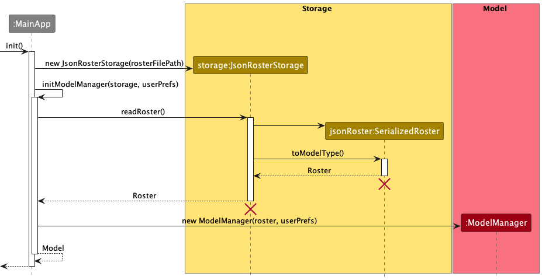

* Table of Contents
{:toc}

--------------------------------------------------------------------------------------------------------------------

## **Acknowledgements**

* {list here sources of all reused/adapted ideas, code, documentation, and third-party libraries -- include links to the original source as well}

--------------------------------------------------------------------------------------------------------------------

## **Setting up, getting started**

Refer to the guide [_Setting up and getting started_](SettingUp.md).

--------------------------------------------------------------------------------------------------------------------

## **Design**

:bulb: **Tip:** The `.puml` files used to create diagrams in this document can be found in the [diagrams](https://github.com/AY2223S2-CS2103T-T15-4/tp/tree/master/docs/diagrams/) folder. Refer to the [_PlantUML Tutorial_ at se-edu/guides](https://se-education.org/guides/tutorials/plantUml.html) to learn how to create and edit diagrams.

### Architecture

The ***Architecture Diagram*** given above explains the high-level design of the App.

Given below is a quick overview of main components and how they interact with each other.

**Main components of the architecture**

**`Main`** has two classes called [`Main`](https://github.com/AY2223S2-CS2103T-T15-4/tp/blob/master/src/main/java/tfifteenfour/clipboard/Main.java) and [`MainApp`](https://github.com/AY2223S2-CS2103T-T15-4/tp/blob/master/src/main/java/tfifteenfour/clipboard/MainApp.java). It is responsible for,
* At app launch: Initializes the components in the correct sequence, and connects them up with each other.
* At shut down: Shuts down the components and invokes cleanup methods where necessary.

[**`Commons`**](#common-classes) represents a collection of classes used by multiple other components.

The rest of the App consists of four components.

* [**`UI`**](#ui-component): The UI of the App.
* [**`Logic`**](#logic-component): The command executor.
* [**`Model`**](#model-component): Holds the data of the App in memory.
* [**`Storage`**](#storage-component): Reads data from, and writes data to, the hard disk.

**How the architecture components interact with each other**

The *Sequence Diagram* below shows how the components interact with each other for the scenario where the user issues the command `delete 1`.

Each of the four main components (also shown in the diagram above),

* defines its *API* in an `interface` with the same name as the Component.
* implements its functionality using a concrete `{Component Name}Manager` class (which follows the corresponding API `interface` mentioned in the previous point.

For example, the `Logic` component defines its API in the `Logic.java` interface and implements its functionality using the `LogicManager.java` class which follows the `Logic` interface. Other components interact with a given component through its interface rather than the concrete class (reason: to prevent outside component's being coupled to the implementation of a component), as illustrated in the (partial) class diagram below.

The sections below give more details of each component.

### UI component

The **API** of this component is specified in [`Ui.java`](https://github.com/AY2223S2-CS2103T-T15-4/tp/blob/master/src/main/java/tfifteenfour/clipboard/ui/Ui.java)

The UI consists of a `MainWindow` that is made up of parts e.g.`CommandBox`, `ResultDisplay`, `StudentListPanel`, `StatusBarFooter` etc. All these, including the `MainWindow`, inherit from the abstract `UiPart` class which captures the commonalities between classes that represent parts of the visible GUI.

The `UI` component uses the JavaFx UI framework. The layout of these UI parts are defined in matching `.fxml` files that are in the `src/main/resources/view` folder. For example, the layout of the [`MainWindow`](https://github.com/AY2223S2-CS2103T-T15-4/tp/blob/master/src/main/java/tfifteenfour/clipboard/ui/MainWindow.java) is specified in [`MainWindow.fxml`](https://github.com/AY2223S2-CS2103T-T15-4/tp/blob/master/src/main/resources/view/MainWindow.fxml)

The `UI` component,

* executes user commands using the `Logic` component.
* listens for changes to `Model` data so that the UI can be updated with the modified data.
* keeps a reference to the `Logic` component, because the `UI` relies on the `Logic` to execute commands.
* depends on some classes in the `Model` component, as it displays `Student` object residing in the `Model`.

### Logic component

**API** : [`Logic.java`](https://github.com/AY2223S2-CS2103T-T15-4/tp/blob/master/src/main/java/tfifteenfour/clipboard/logic/Logic.java)

Here's a (partial) class diagram of the `Logic` component:

How the `Logic` component works:
1. When `Logic` is called upon to execute a command, it uses the `RosterParser` class to parse the user command.
1. This results in a `Command` object (more precisely, an object of one of its subclasses e.g., `AddCommand`) which is executed by the `LogicManager`.
1. The command can communicate with the `Model` when it is executed (e.g. to add a student).
1. The result of the command execution is encapsulated as a `CommandResult` object which is returned back from `Logic`.

The Sequence Diagram below illustrates the interactions within the `Logic` component for the `execute("delete course 1")` API call.

:information_source: **Note:** The lifeline for `DeleteCommandParser` should end at the destroy marker (X) but due to a limitation of PlantUML, the lifeline reaches the end of diagram.

Here are the other classes in `Logic` (omitted from the class diagram above) that are used for parsing a user command:

How the parsing works:
* When called upon to parse a user command, the `RosterParser` class creates an `XYZCommandParser` (`XYZ` is a placeholder for the specific command name e.g., `AddCommandParser`) which uses the other classes shown above to parse the user command and create a `XYZCommand` object (e.g., `AddCommand`) which the `RosterParser` returns back as a `Command` object.
* All `XYZCommandParser` classes (e.g., `AddCommandParser`, `DeleteCommandParser`, ...) inherit from the `Parser` interface so that they can be treated similarly where possible e.g, during testing.

### Model component
**API** : [`Model.java`](https://github.com/AY2223S2-CS2103T-T15-4/tp/blob/master/src/main/java/tfifteenfour/clipboard/model/Model.java)

The `Model` component,

* stores the roster data i.e., all `Course` objects (which can subsequently be traversed to access all stored data)
* stores a `CurrentSelection` object that is a container object for pointing to the various `Course`/`Group`/`Student`/`Session`/`Task` objects that the user has selected.
* stores a `UserPref` object that represents the user’s preferences. This is exposed to the outside as a `ReadOnlyUserPref` objects.
* stores the `Command` object that was last executed, as well as its corresponding command string input, for purposes of accessing previous states (i.e like in the case of `undo` command)
* does not depend on any of the other three components (as the `Model` represents data entities of the domain, they should make sense on their own without depending on other components)

:information_source: **Note:** An alternative (arguably, a more OOP) model is given below. It has a `Course` list in the `CLIpboard`. This allows `CLIpboard` to only require one `Course` object. 

### Storage component

**API** : [`Storage.java`](https://github.com/AY2223S2-CS2103T-T15-4/tp/blob/master/src/main/java/tfifteenfour/clipboard/storage/Storage.java)

The `Storage` component,
* can save both roster data and user preference data in json format, and read them back into corresponding objects.
* inherits from both `RosterStorage` and `UserPrefsStorage`, which means it can be treated as either one (if only the functionality of only one is needed).
* depends on some classes in the `Model` component (because the `Storage` component's job is to save/retrieve objects that belong to the `Model`)

### Common classes

Classes used by multiple components are in the `tfifteenfour.clipboard.commons` package.

--------------------------------------------------------------------------------------------------------------------

## **Implementation**

This section describes some noteworthy details on how certain features are implemented.

### Undo feature
`undo` allows restoring up to 5 previous states, but can be modified to restore more/less states.

:information_source: **Note:**  Allowing more states to be saved, or adding more information to be tied to a state, will deteriorate CLIpboard's performance.

If new commands are to be added, it's interaction with `undo` must be kept in mind:
* For typical commands that do CRUD operations on roster data, `undo` can handle them.
* For navigating and UI related commands, some extra handling may be needed to also restore and refresh the UI to the previous state (e.g `undo` of `select` command has special handling to refresh GUI elements).

:information_source: **Note:** The lifeline for `UndoCommand` should end at the destroy marker (X) but due to a limitation of PlantUML, the lifeline reaches the end of diagram.

#### Design considerations:

**Aspect: How undo executes:**

* **Alternative 1 (current choice):** Saves the entire `Roster`.
  * Pros: Easy to implement.
  * Cons: May have performance issues in terms of memory usage.

* **Alternative 2:** Individual command knows how to undo by
  itself.
  * Pros: Will use less memory (e.g. for `delete`, just save the person being deleted).
  * Cons: We must ensure that the implementation of each individual command are correct.

### Unique list of items
Represented by the `UniqueList<T>` class, where `T` is the type of the item to be contained.

`UniqueList` is an abstract class that was created to accommodate the storing of different types of items which require list operations. This class provides a generalized solution that can be applied to various scenarios where a list of unique items is needed.

While `UniqueList<T>` provides some basic list operations, a child class has to be extended from it to override the more intricate operations that require different types of handling for different types of objects. Only the methods that are `abstract` need to be overriden.

The `UniqueList`'s in CLIpboard are:
1. `UniqueCoursesList`
2. `UniqueGroupsList`
3. `UniqueStudentsList`
4. `UniqueSessionsList`
5. `UniqueTaskslist`

#### Proposed Future Improvement
The extra work of creating child classes of `UniqueList` can be tedious.

A possible improvement would be allowing `UniqueList` to be an instantiable class, and at the same time create an interface `ListableItem` to represent objects to be contained in `UniqueList`.

The `ListableItem` interface would require that its classes also support the handling of list operations that were previously handled by a child class of `UniqueList`. This would then allow `UniqueList` to be generalisable to any `ListableItem` object, without the need of creating child classes of `UniqueList`.

### Serialized Objects for `Storage`
Found in `src/main/storage/serializedclasses`, these classes are for serializing a `Roster` and its containing objects into `json` objects, or vice versa.
This serves to store/load data to/from a plaintext json file.

#### During loading of data
Loading in of data (if a data file exists) is done once during the initialization of the program. The sequence diagram below illustrates how `MainApp` creates a `Model` containing the saved data, through interactions with `Storage`.

#### During saving of data
Saving of data is done every time a command is executed. The sequence diagram below illustrates how a `Roster` is saved into storage.

--------------------------------------------------------------------------------------------------------------------

## **Documentation, logging, testing, configuration, dev-ops**

* [Documentation guide](Documentation.md)
* [Testing guide](Testing.md)
* [Logging guide](Logging.md)
* [Configuration guide](Configuration.md)
* [DevOps guide](DevOps.md)

--------------------------------------------------------------------------------------------------------------------

## Appendix: Effort

### Page Navigation
As CLIpboard has multiple different pages to display different types of objects at a given time. As such, a way of keeping track of the current page, as well as the possible pages to navigate to, was needed.

Additionally, navigating a page also meant traversing the object hierarchy.
There had to be a way to store information about which object had been selected, in order to know which object a user command should manipulate. (e.g If the user is on the "Courses" page and selects a course, this selection needs to be saved. Then, further commands performed by the user will execute on the selected course)

In short, page information as well as pointers to the objects selected by the user needed to be maintained. These were achieved through the `CurrentSelection` class, which is tied to a `ModelManager` instance as a field.

Adding page navigation added further challenges, as more factors had to now be considered. These include restricting certain commands to only be allowed on certain pages, commands executing differently depending on the current page, as well as handling the loading of appropriate GUI elements respective to the page.

### Storage
As compared to AB3, CLIpboard maintains several more types of objects to store. These added types of objects needed their own respective classes to serialize them into `json` objects.

The added types also had a specific hierarchy (e.g `Roster` -> `Course` -> `Group` -> `Student`), as well as a deeper serialization depth than AB3, which required further modification to the storage classes to handle.

On top of creating the respective `json` serializing classes for each different type of object, each type of object would also have slightly different fields to keep track of, which added further complexity to serializing these objects.

## **Appendix: Requirements**

### Product scope

**Target user profile**:

* has a need to manage a significant number of students from different classes
* prefer desktop apps over other types
* can type fast
* prefers typing to mouse interactions
* is reasonably comfortable using CLI apps

**Value proposition**: manage their students’ particulars, grades and class attendance, in one centralised platform.

### User stories

Priorities: High (must have) - `* * *`, Medium (nice to have) - `* *`, Low (unlikely to have) - `*`

| Priority | As a …​     | I want to …​                                                                          | So that I can…​                                                                          |
|----------|----------------|---------------------------------------------------------------------------------------|---------------------------------------------------------------------------------------------------|
| `* * *`  | user           | add new students with their particulars                                               | create a new profile for a student                                                                |
| `* * *`  | user           | remove students from my class                                                         | update my class list if anyone needs to be removed                                                |
| `* * *`  | user           | list out all students in a particular class                                           | retrieve a list with all of my students’ names and their particulars                              |
| `* * *`  | user           | list all students being taught by me in the semester                                  | memorize my students' name                                                                        |
| `* * *`  | user           | view personal information for a particular student                                    | easily locate particulars for a single student                                                    |
| `* * *`  | user           | edit students' information easily                                                     | update the new information easily for viewing                                                     |
| `* * *`  | user           | filter students based on data such as results or class                                | find and compare student data                                                                     |
| `* *`    | user           | remove all students from a class                                                      | save time and don’t have to delete them one by one                                                |
| `* *`    | user           | leave a note under a student's profile                                                | keep track of additional information of students                                                  |
| `* *`    | returning user | familiarise myself with the app‘s UI again with a quick refresher                     | use the app again without needing to re-learn the whole UI                                        |
| `* *`    | forgetful user | see photos of the student associated with their name                                  | remember their names better and refer to the correct student during class                         |
| `* *`    | user           | be able to leave a note under a student's profile                                     | keep track of additional information of students                                                  |
| `* *`    | user           | have a list of all emails of my students from the same class                          | contact my students from that class                                                               |
| `* *`    | user           | Group and view certain students                                                       | keep track of their grades for group project                                                      |
| `* *`    | new user       | see the app populated with sample data                                                | get a sense how the app work when it is in use                                                    |
| `* *`    | new user       | learn more about the available features through tooltips                              | gain proficiency at using the program                                                             |
| `*`      | user           | toggle the app between light and dark mode                                            | change the application environment to suit the current light settings for less strain on the eyes |
| `*`      | user           | have a chart / graph of the assessments grades for every student                      | view students that may require more help                                                          |
| `*`      | user           | keep track of class materials such as slides                                          | share these materials with my students                                                            |
| `*`      | user           | save my most used commands                                                            | save time and don’t have to type them out again                                                   |
| `*`      | user           | see notifications/alert of upcoming events                                            | be reminded of assignments that are due soon                                                      |
| `*`      | expert user    | see a graph with the students’ performances from this semester and previous semesters | compare the overall performance of my students from this semester and last semester               |
| `*`      | expert user    | have an export function that allows me to export data from the app to an excel sheet  | easily transfer student data from the app to excel sheet if my higher ups require it              |

*{More to be added}*

### Use cases

(For all use cases below, the **System** is the `CLIpboard` and the **Actor** is the `user`, unless specified otherwise)

<h3>Use case 1: Add a new course</h3>

**Preconditions: User is on the Course Page**

**MSS**

1.  User requests to add a new course into the list
2.  CLIpboard updates the list with a new course

    Use case ends.

<h3>Use case 2: Edit an existing course</h3>

**Preconditions: User is on the Course Page**

**MSS**

1.  User requests to edit an existing course in the list
2.  CLIpboard updates the course with the new name provided by the user

    Use case ends.

**Extensions**

* 1a. The list is empty

    * 1a1. CLipboard shows an error message.

      Use case ends.

* 1b. The course index does not exist in the list

    * 1b1. CLipboard shows an error message.

      Use case ends.

<h3>Use case 3: Delete en existing course</h3>

**Preconditions: User is on the Course Page**

**MSS**

1.  User requests to delete a course in the list
2.  CLIpboard updates the course list without the course

    Use case ends.

**Extensions**

* Similar to UC2 extension

<h3>Use case 4: Add a new student</h3>

**Preconditions: User is on the Student Page**

**MSS**

1.  User requests to add a new student into the list
2.  CLIpboard adds the particulars of the student into the list

    Use case ends.

**Extensions**

* 1a. The list is empty
  * 1a1. CLIpboard shows an error message.

    Use case ends.

* 1b. A student with the same student ID already exists

    * 1b1.  CLIpboard shows an error message.

      Use case ends.

<h3>Use case 5: Edit an existing student's information</h3>

**Preconditions: User is on the Student Page**

**MSS**

1.  User requests to edit a specific student in the list
2.  CLIpboard updates the particulars of the student

    Use case ends.

**Extensions**

* Similar to UC2 extension, for student index

<h3>Use case 6: Delete a student</h3>

**Preconditions: User is on the Student Page**

**MSS**

1.  User requests to delete a specific student in the list
2.  CLIpboard deletes the student

    Use case ends.

**Extensions**

* Similar to UC2 extension, for student index

<h3>Use case 7: Update a remark under a student's profile</h3>

**Preconditions: User is on the Student Page**

**MSS**

1.  User requests to update a remark under a specific student in the list
2.  CLIpboard updates the particulars of the student to the new remark

    Use case ends.

**Extensions**

* Similar to UC2 extension, for student index

*{More to be added}*

### Non-Functional Requirements

1.  Should work on any _mainstream OS_ as long as it has Java `11` or above installed.
2.  Should be able to hold up to 1000 students without a noticeable sluggishness in performance for typical usage.
3.  A user with above average typing speed for regular English text (i.e. not code, not system admin commands) should be able to accomplish most of the tasks faster using commands than using the mouse.

*{More to be added}*

### Glossary

* **Mainstream OS**: Windows, Linux, Unix, OS-X
* **Personal information**: Student particulars including `name`, `phone number`, `student id`, `email`, and can include `remark`.
* **UCx**: Represents Use Case x, where x is a use case number

--------------------------------------------------------------------------------------------------------------------

## **Appendix: Instructions for manual testing**

Given below are instructions to test the app manually.

:information_source: **Note:** These instructions only provide a starting point for testers to work on;
testers are expected to do more *exploratory* testing.

### Launch and shutdown

1. Initial launch

   1. Download the jar file and copy into an empty folder

   1. Double-click the jar file Expected: Shows the GUI with a set of sample contacts. The window size may not be optimum.

1. Saving window preferences

   1. Resize the window to an optimum size. Move the window to a different location. Close the window.

   1. Re-launch the app by double-clicking the jar file. 
       Expected: The most recent window size and location is retained.

1. _{ more test cases …​ }_

### Deleting a student

1. Deleting a student while all students are being shown from the Student Page.

   1. Test case: `delete student 1` 
      Expected: First student is deleted from the list. Details of the deleted student shown in the status message.

   1. Test case: `delete student 0` 
      Expected: No student is deleted. Error details shown in the status message.

   1. Other incorrect delete commands to try: `delete`, `delete student x`, `...` (where x is larger than the list size) 
      Expected: Similar to previous.

1. _{ more test cases …​ }_

### Saving data

1. Dealing with missing/corrupted data files

   1. _{explain how to simulate a missing/corrupted file, and the expected behavior}_

1. _{ more test cases …​ }_
