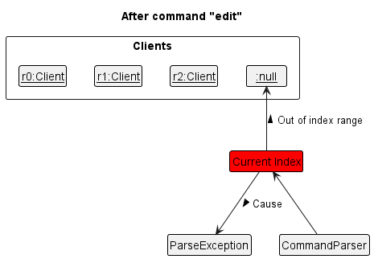
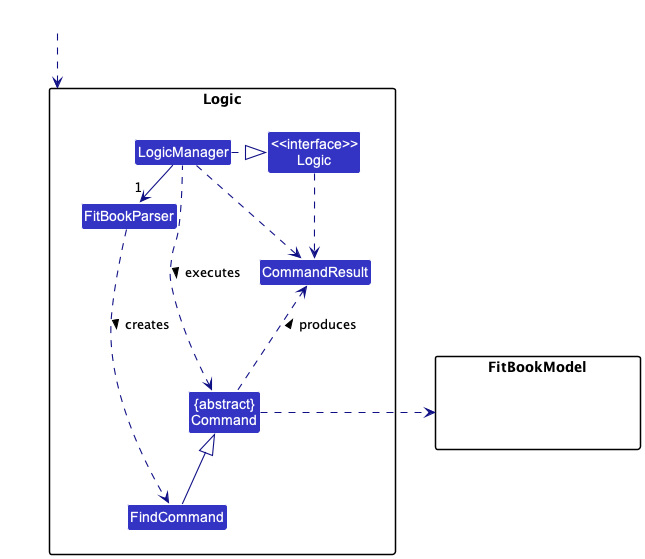
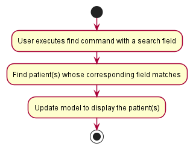

* Table of Contents
{:toc}

---

>## **About FitBook**

FitBook app is a collective project by a group of NUS undergrads (AY2223/CS2103T-T15-2).

This app aims to promote efficiency recording of clients and exercise routines for fitness instructors. It is written in java 11
and uses javafx for its UI. The storage are made up of Json files to store the user's input data.

--------------------------------------------------------------------------------------------------------------------

>## **Acknowledgements**

* Libraries
  * LocalDateTime

--------------------------------------------------------------------------------------------------------------------

>## **Setting up, getting started**

Refer to the guide [_Setting up and getting started_](SettingUp.md).

--------------------------------------------------------------------------------------------------------------------

>## **Design**

:bulb: **Tip:** The `.puml` files used to create diagrams in this document can be found in the [diagrams](https://github.com/se-edu/addressbook-level3/tree/master/docs/diagrams/) folder. Refer to the [_PlantUML Tutorial_ at se-edu/guides](https://se-education.org/guides/tutorials/plantUml.html) to learn how to create and edit diagrams.

### Architecture

The ***Architecture Diagram*** given above explains the high-level design of the FitBook App.

Given below is a quick overview of main components and how they interact with each other.

**Main components of the architecture**

**`Main`** has two classes called [`Main`](https://github.com/AY2223S2-CS2103T-T15-2/tp/blob/master/src/main/java/seedu/fitbook/Main.java) and [`MainApp`](https://github.com/AY2223S2-CS2103T-T15-2/tp/blob/master/src/main/java/seedu/fitbook/MainApp.java). It is responsible for,
* At app launch: Initializes the components in the correct sequence, and connects them up with each other.
* At shut down: Shuts down the components and invokes cleanup methods where necessary.

[**`Commons`**](#common-classes) represents a collection of classes used by multiple other components.

The rest of the App consists of four components.

* [**`UI`**](#ui-component): The UI of the App.
* [**`Logic`**](#logic-component): The command executor.
* [**`FitBookModel`**](#model-component): Holds the data of the App in memory.
* [**`Storage`**](#storage-component): Reads data from, and writes data to, the hard disk.

**How the architecture components interact with each other**

The *Sequence Diagram* below shows how the components interact with each other for the scenario where the user issues the command `delete 1`.

Each of the four main components (also shown in the diagram above),

* defines its *API* in an `interface` with the same name as the Component.
* implements its functionality using a concrete `{Component Name}Manager` class (which follows the corresponding API `interface` mentioned in the previous point.

For example, the `Logic` component defines its API in the `Logic.java` interface and implements its functionality using the `LogicManager.java` class which follows the `Logic` interface. Other components interact with a given component through its interface rather than the concrete class (reason: to prevent outside component's being coupled to the implementation of a component), as illustrated in the (partial) class diagram below.

The sections below give more details of each component.

### UI component

The **API** of this component is specified in [`Ui.java`](https://github.com/AY2223S2-CS2103T-T15-2/tp/blob/master/src/main/java/seedu/fitbook/ui/Ui.java)

The UI consists of a `MainWindow` that is made up of parts e.g.`CommandBox`, `ResultDisplay`, `ClientListPanel`, `ExercisePanel`, `StatusBarFooter` etc. All these, including the `MainWindow`, inherit from the abstract `UiPart` class which captures the commonalities between classes that represent parts of the visible GUI.

The `UI` component uses the JavaFx UI framework. The layout of these UI parts are defined in matching `.fxml` files that are in the `src/main/resources/view` folder. For example, the layout of the [`MainWindow`](https://github.com/AY2223S2-CS2103T-T15-2/tp/blob/master/src/main/java/seedu/fitbook/ui/MainWindow.java) is specified in [`MainWindow.fxml`](https://github.com/AY2223S2-CS2103T-T15-2/tp/blob/master/src/main/resources/view/MainWindow.fxml)

The `UI` component,

* executes user commands using the `Logic` component.
* listens for changes to `FitBookModel` data so that the UI can be updated with the modified data.
* keeps a reference to the `Logic` component, because the `UI` relies on the `Logic` to execute commands.
* depends on some classes in the `FitBookModel` component, as it displays `Client` object residing in the `FitBookModel`.

### Logic component

**API** : [`Logic.java`](https://github.com/AY2223S2-CS2103T-T15-2/tp/blob/master/src/main/java/seedu/fitbook/logic/Logic.java)

Here's a (partial) class diagram of the `Logic` component:

How the `Logic` component works:
1. When `Logic` is called upon to execute a command, it uses the `FitBookParser` class to parse the user command.
2. This results in a `Command` object (more precisely, an object of one of its subclasses e.g., `AddCommand`) which is executed by the `LogicManager`.
3. The command can communicate with the `FitBookModel` when it is executed (e.g. to add a client).
4. The result of the command execution is encapsulated as a `CommandResult` object which is return from `Logic`.

The Sequence Diagram below illustrates the interactions within the `Logic` component for the `execute("delete 1")` API call.

:information_source: **Note:** The lifeline for `DeleteCommandParser` should end at destroy marker (X) but due to a limitation of PlantUML, the lifeline reaches the end of diagram.

Here are the other classes in `Logic` (omitted from the class diagram above) that are used for parsing a user command:

How the parsing works:
* When called upon to parse a user command, the `FitBookParser` class creates an `XYZCommandParser` (`XYZ` is a placeholder for the specific command name e.g., `AddCommandParser`) which uses the other classes shown above to parse the user command and create a `XYZCommand` object (e.g., `AddCommand`) which the `FitBookParser` returns back as a `Command` object.
* All `XYZCommandParser` classes (e.g., `AddCommandParser`, `DeleteCommandParser`, ...) inherit from the `Parser` interface so that they can be treated similarly where possible e.g, during testing.

### FitBookModel component

**API** : [`FitBookModel.java`](https://github.com/AY2223S2-CS2103T-T15-2/tp/blob/master/src/main/java/seedu/fitbook/model/FitBookModel.java)

The `FitBookModel` component,
* stores the FitBook data i.e., all `Client` objects (which are contained in a `UniqueClientList` object).
* stores the FitBookExerciseRoutine data i.e., all `Routine` objects (which are contained in a `UniqueRoutineList` object).
* stores the currently 'selected' `Client` objects (e.g., results of a search query) as a separate _filtered_ list which is exposed to outsiders as an unmodifiable `ObservableList<Client>` that can be 'observed' e.g. the UI can be bound to this list so that the UI automatically updates when the data in the list change.
* stores the currently 'selected' `Routine` objects (e.g., results of a search query) as a separate _filtered_ list which is exposed to outsiders as an unmodifiable `ObservableList<Routine>` that can be 'observed' e.g. the UI can be bound to this list so that the UI automatically updates when the data in the list change.
* stores a `UserPref` object that represents the user’s preferences. This is exposed to the outside as a `ReadOnlyUserPref` objects.
* does not depend on any of the other three components (as the `FitBookModel` represents data entities of the domain, they should make sense on their own without depending on other components)

:information_source: **Note:** An alternative (arguably, a more OOP) model is given below. It has a `Tag` list in the `FitBook`, which `Client` references. This allows `FitBook` to only require one `Tag` object per unique tag, instead of each `Client` needing their own `Tag` objects. Consists of other type of objects like `Appointment` 

:information_source: **Note:** An alternative (arguably, a more OOP) model is given below. It has an `Exercise` list in the `FitBookExerciseRoutine`, which `Routine` references. This allows `FitBookExerciseRoutine` to only require one `Exercise` object per unique exercise, instead of each `Routine` needing their own `Exercise` objects. 

### Storage component

**API** : [`Storage.java`](https://github.com/AY2223S2-CS2103T-T15-2/tp/blob/master/src/main/java/seedu/fitbook/storage/FitBookStorage.java)

The `Storage` component,
* can save all FitBook, FitBookExerciseRoutine data and user preference data in json format, and read them back into corresponding objects.
* inherits from all `FitBookExerciseRoutineStorage`, `FitBookStorage` and `UserPrefStorage`, which means it can be treated as either one (if only the functionality of only one is needed).
* depends on some classes in the `FitBookModel` component (because the `Storage` component's job is to save/retrieve objects that belong to the `FitBookModel`)

### Common classes

Classes used by multiple components are in the `seedu.fitbook.commons` package.

--------------------------------------------------------------------------------------------------------------------

>## **Implementation**

This section describes some noteworthy details on how certain features are implemented.

### Add/Edit Client feature
#### Implementation
The proposed add client mechanism is facilitated by `FitBook`. It extends `FitBook` with a FitBook storage, stored in a `fitbook.json` file. Additionally, it implements the following operations:

* `AddCommand#execute()` — Adds the new client into the FitBook storage of the FitBook.
* `EditCommand#execute()` — Edits the target routine in the FitBook storage of the FitBook.

These operations are exposed in the `Command` interface as `Command:execute()`.

Diagram below shows an example of a client called `c0` after using the `add` command to add `c0`.
The `Client` consists of these objects after adding. Objects that are a `Set` can contain 0 or more objects. Goal object can contain a String `client has not added a goal` to represent that there is no goal. Calorie object can contain `0000` value to represent there is no recommended calorie input.
All objects must contain non-null attributes. All objects must be present after adding/editing the client other than objects in the `Set` objects.

Given below is an example usage scenario and how the add/edit mechanism behaves at each step.

Step 1. The user launches the application for the first time. The `FitBook` will be initialized with the FitBook on start up, and the information from the Storage will be converted into `JsonAdaptedClient` and all the other JsonAdapted classes accordingly.

Step 2. The user executes `add n/John Doe p/32692562 …​` command to add the Client in the FitBook. The `add` command calls `AddCommandParser`, causing the command to be parsed and checked for any errors before executing the command and calling `AddCommand:execute()` to execute the command to add the Client in the FitBook.
* The add command has a similar UML diagram as `Step 1`. The only changes are the addCommand to editCommand, edits the client and add it into storage and edits the client in the model.

Step 3. The user executes `edit 1 w/50.0 …​` to edit the 1st client (target `Client`) in the FitBook. The `edit` command also calls `EditCommandParser`, causing it to check if the command is appropriate and calling `EditCommand:execute()` to execute the command to be edited in the client for FitBook Model.

Step 2.5/3.5. These commands (from Steps 2 and 3) will therefore go through updates for the FitBookModel and also update the FitBook Storages for each command functionality.

:information_source: **Note:** If a command fails its execution, it will not call `AddCommand:execute()` or `EditCommand:execute()`, so the updated client will not be saved in the FitBook.

:information_source: **Note:** If the `edit` command is at index 4, pointing at an invalid `Client`, it will return an error to the user, prompting the user that he/she has used an invalid client index.

The following sequence diagram shows how the add operation works:

:information_source: **Note:** The lifeline for `AddCommand` should end at to destroy marker (X) but due to a limitation of PlantUML, the lifeline reaches the end of diagram.

#### Design considerations:

**Aspect: How add & edit client executes:**

* **Alternative 1 (current choice):** Add or edit the Client that allows multiple attributes and save the entire model into the FitBook.
    * Pros: Easy to implement.
    * Cons: May cause some performance issues in terms of memory usage and speed.

* **Alternative 2:** Individual command knows how to add/edit by
  itself.
    * Pros: Will use less memory (e.g. for `edit`, just allocate an array for any edits of the same client before adding the latest edit of that client only).
    * Cons: Each command implementation must be correct which is hard to maintain.

### Past 30 days weight data graph
#### Implementation
The weight data graph will be displayed in a pop-up window in the Ui component. It contains a LineChart of `Date` date against `Number` weight, and is populated 
with data from XYChart.Series. The data is obtained from the logic component, which provides only past 30 days of weight data in the WeightHistory class.

The following details explain how it works:

* The `WeightHistory` class stores the list of weights and dateTime.
* The GraphPopup.Scene class sets up the LineChart with x-axis as a `Date` representing date, and y-axis as a `Double` representing the weight measurement on that date.
* Ensure the XYChart.Series that populates the graph with data is always updated with the most recent data.
* The `handleStatistics` is called by the MainWindow class to generate the weight data graph in a pop-up window.

Weight over date and time pop-up windows will display the past 30 days graph automatically. It does so by having the MainWindow class call handle statistics 
on startup and after execution of commands.

Sequence Diagram for Graph feature.

Step 1: MainWindow requests for a graph pop-up window.

Step 2: Logic call the WeightHistory class to generate a list of `Date` date mapped to `Double` weight over 30 days. `handleStatistics` method is called to generate 
graph. `updateSeries` method is called to ensure the data populating the graph is up-to-date.

* Example Usage Scenario

  Below is an example usage scenario of how the weight data graph behaves at each step:
    * The user launches the application for the first time.
    * The user executes the  `addWeight` command to add weights and dates. The execution of the `addWeight` command also
      checks whether the date is valid in the date list. If it is, the weight and date are added to the weight and date list. Otherwise, an error is displayed.
    * The user executes the `graph` command to generate weight data graph in the pop-up windows.

* Design Considerations

  One important design consideration is how to display the weight data graph. Our approach is to
  generate each graph in a separate pop-up windows.
    * pros: Users can easily view multiple clients' weight data graphs side-by-side without having to switch between different views.
    * cons: If the user opens multiple pop-up windows to view different weight data graphs, this may clutter the user's desktop and make it difficult to manage.

### Edit appointments feature
#### Implementation
The edit appointments feature allows users to view appointments in the upcoming dates.

This feature is implemented using a panel on the main window with a list of clients names
that is updated with every command that may affect appointment set.

One situation that trigger the edit appointments feature is when a user edits an appointment.

The following details explain how it works:

   *  What it does:
      * When an appointment is edited in the clients list, it is automatically added to the
      list of appointments.
      * The list is automatically sorted in increasing order of the appointment data time.
      
   * Details:
      * When the user enters the edit appointment command, it triggers the creation of an object the *Appointment*
      class.
      * In the *EditCommand* class, the data entered by user is parsed.
      * If there is no error, the Appointment object is created which triggers the getAppointment() function in Model.
      * This function, in turn, calls editCommand() function in FitBook.
      * These functions call isValidDate() and isValidAppointment() functions in Appointment to confirm whether the
      appointment date time are valid.
      * If the appointment date and time are valid, they are added to the appointment list, which is then sorted.
      Otherwise, an error message is returned.

Sequence Diagram for Edit Appointment feature.

   * Example Usage Scenario

     Below is an example usage scenario of how the appointment list mechanism behaves at each step:
       * The user launches the application for the first time.
       * The user executes the `Edit` command to edit an appointment. The execution of the `Edit` command also
       checks whether this appointment is valid in the appointment list. If it is, the appointment is added to the appointment list. Otherwise, an error is displayed.

  * Design Considerations

    One important design consideration is how to handle expired appointment dates and times. The current choice is to
    automatically remove them after switching tabs.
      * pros: This allows users to focus only on upcoming appointment dates and times, which can help them stay organized and avoid confusion.
      * cons: Expired date and time information cannot be removed immediately unless the user switches tabs within the application, which could potentially lead to confusion appointments.

### Find feature

#### Implementation

The proposed find mechanism is facilitated by `FitBook`. It implements the following operations:

* `FitBook#getFilteredClientList()` — Retrieves the client list.
* `FitBook#updateFilteredClientList(Predicate<Client> predicate)` — Filters the client list with the given predicate.

These operations are exposed in the  `FitBookModel` interface as `FitBookModel#getFilteredClientList()`, `FitBookModel#updateFilteredClientList(Predicate<Client> predicate)` respectively.

Given below is an example usage scenario and how the find mechanism behaves at each step.

Step 1. The user launches the application for the first time. The `FitBook` will be initialized with the initial
FitBook state, and the `currentStatePointer` pointing to that single FitBook state.

Step 2. The user executes `find n/alex n/john` command to find all clients with "alex" or "john" in their name in the
FitBook. The `find` command calls `FitBookModel#updateFilteredClientList(Predicate<Client> predicate)`, causing the
modified state of the FitBook after the `find n/alex` command executes to be saved in the `fitBookStateList`, and the
`currentStatePointer` is shifted to the newly inserted FitBook state.

Step 3. The user now decides that he does not need to find the details of the client named "John". The user executes
`find n/alex`, causing another the current FitBook state to be deleted, and a new FitBook state added into the
`fitBookStateList`.

Step 4. The user now needs to view all of his clients' details again. The user executes `listClients` which will shift
the `currentStatePointer` to the first FitBook state, and restores the FitBook to that state.

The following sequence diagram shows how the find operation works:

:information_source: **Note:** The lifeline for `FindCommand` should end at the destroy marker (X) but due to a limitation of PlantUML, the lifeline reaches the end of diagram.

The following activity diagram summarizes what happens when a user executes a new command:

#### Design considerations:

**Aspect: How find executes more than once:**

* **Alternative 1 (current choice):** Finds from the entire FitBook.
    * Pros: Easy to implement.
    * Cons: Lower performance as every command will have to filter the entire FitBook.

* **Alternative 2:** Finds from an already filtered list.
    * Pros: Better performance.
    * Cons: May result in high memory usage as each new state has to be saved.

### Add Exercise feature

#### Implementation

The proposed Add Exercise mechanism is facilitated by `FitBook`. It implements the following operations:

* `FitBook#addExercise()` — Adds an exercise to the specified routine in 'FitBookExerciseRoutine'.

This operation is exposed in the `FitBookModel` interface as `FitBookModel#addExercise()`

Given below is an example usage scenario and how the addExercise mechanism behaves at each step.

Step 1. The user launches the application for the first time. The `FitBookExerciseRoutine()` will be initialized with the FitBook on start up, and the information from the Storage will be converted into `JsonAdaptedRoutine` accordingly

Step 2. The user executes `addExercise 2 ex/push ups...` command to add the exercise `push-up` to the exercise list of the routine specified at index `2`
The `addExercise` command calls `AddExerciseCommandParser`, causing the command to be parsed and checked for any errors before executing the command
which thereafter calls `AddExerciseCommand#execute()` which calls `FitBookModel#addExercise()` to add the exercise to the routine in `FitBookExerciseRoutine`.

:information_source: **Note:** If a command fails its execution, it will not call `AddExerciseCommand:execute()` so the updated Routine will not be saved in the FitBookExerciseRoutine .

The following sequence diagram shows how the add exercise operation works:

:information_source: **Note:** The lifeline for `AddExerciseCommand` should end at the destroy marker (X) but due to a limitation of PlantUML, the lifeline reaches the end of diagram.

The following activity diagram summarizes what happens when a user executes a new command:

#### Design considerations:

* **Alternative 1 (current choice):** Adds the exercise into the specific Routine from the Routine List and save the entire model into FitBookExerciseRoutine.
    * Pros: Easy to implement.
    * Cons: Might cause performance issues in terms of memory usage and speed.

* **Alternative 2:** Keep track of the update list without saving the entire model into FitBookExerciseRoutine after each addExercise command.
    * Pros: Might be faster.
    * Cons: Will be risky as it does not maintain accuracy of data in the model.

### Delete Routine feature

#### Implementation

The proposed Delete Routine mechanism is facilitated by `FitBook`. It implements the following operations:

* `FitBook#deleteRoutine()` — Deletes the routine in the routline list in 'FitBookExerciseRoutine'.

This operation is exposed in the `FitBookModel` interface as `FitBookModel#deleteRoutine()`

Given below is an example usage scenario and how the deleteRoutine mechanism behaves at each step.

Step 1. The user launches the application for the first time. The `FitBookExerciseRoutine()` will be initialized with the FitBook on start up, and the information from the Storage will be converted into `JsonAdaptedRoutine` accordingly

Step 2. The user executes `deleteRoutine 1` command to delete the corresponding index specified in the Routine list of the `FitBookExerciseRoutine`. The `deleteRoutine`
command calls `DeleteRoutineCommandParser`, causing the command to be parsed and checked for any errors before executing the command
which thereafter calls `DeleteRoutineCommand#execute()` which calls `FitBookModel#deleteRoutine()` to delete the routine in `FitBookExerciseRoutine`.

Step 2.5. These commands will therefore go through updates for the FitBookModel and also update the FitBookExerciseRoutineStorages.

:information_source: **Note:** If a command fails its execution, it will not call `DeleteRoutineCommand:execute()` so the updated Routine will not be saved in the FitBookExerciseRoutine .

The following sequence diagram shows how the deleteRoutine operation works:

:information_source: **Note:** The lifeline for `DeleteRoutineCommand` should end at the destroy marker (X) but due to a limitation of PlantUML, the lifeline reaches the end of diagram.

#### Design considerations:

* **Alternative 1 (current choice):** Delete the Routine from the Routine List and save the entire model into FitBookExerciseRoutine.
    * Pros: Easy to implement.
    * Cons: Might cause performance issues in terms of memory usage and speed.

* **Alternative 2:** Keep track of the update list without saving the entire model into FitBookExerciseRoutine after each deleteRoutine command.
    * Pros: Might be faster.
    * Cons: Will be risky as it does not maintain accuracy of data in the model.

### Export client/routine list

#### Implementation
This feature allows the user to extract data efficiently from FitBook to be used for other purposes such as statistical analysis.
`Fitbook` creates a new CSV file and write data to it.

The proposed export mechanism is facilitated by `FitBook`. It implements the following operations:

* `FitBook#getFilteredClientList` — Retrieves the client list.

This operation is exposed in the `FitBookModel` interface as `FitBookModel#getFilteredClientList()`

Given below is an example usage scenario and how the deleteRoutine mechanism behaves at each step.

Step 1. The user launches the application for the first time. The `FitBook` will be initialized with the FitBook on start up, and the information from the Storage will be converted into `JsonAdaptedClients` accordingly

Step 2. The user executes `export` command to export the client list of `FitBook`. The `FitBookParser` calls the `ExportCommand()`
command which calls `ExportCommand#writeToCsvFile(model)`, to write the client details into a csv file with the client list obtained from `model`.
The `ExportCommand#writeToCsvFile(model)` calls `ExportCommand#writeHeaderRow(pw)` and `ExportCommand#writeClientRows(PrintWriter pw, List<Client> clients)` which uses
the input parameter printwriter to write the header row and client rows respectively into the csv file

:information_source: **Note:** If a command fails its execution, it will not call `DeleteRoutineCommand:execute()` so the updated Routine will not be saved in the FitBookExerciseRoutine .

The following sequence diagram shows how the find operation works:

:information_source: **Note:** The lifeline for `FindCommand` should end at the destroy marker (X) but due to a limitation of PlantUML, the lifeline reaches the end of diagram.

The following activity diagram summarizes what happens when a user executes a new command:

#### Design considerations:

**Aspect: How to export the client details :**

* **Alternative 1 (current choice):** Obtains the client list from the model and writes to the csv file which is facilitated by `PrintWriter`
    * Pros: Code is modular, and easy to implement.
    * Cons: this implementation is specific to exporting client details to a CSV file, cannot be adapted to other types of exports and the use of static methods makes it difficult to extend or modify the behavior of the command.

* **Alternative 2:** Allows the user to specify which client to export by providing the index of the client. Use a `CsvUtil` class to handle the file I/O operations and list generation.

    * Pros: The file I/O operations are abstracted away in a separate utility class, which improves modularity and readability.
    * Cons: This implementation may be more complex and harder to understand for someone unfamiliar with the code.

### Add/Edit Routine feature
#### Implementation
The proposed add routine mechanism is facilitated by `FitBook`. It extends `FitBook` with a Routine storage, stored in a `exerciseroutine.json` file. Additionally, it implements the following operations:

* `AddRoutineCommand#execute()` — Adds the new routine into the Exercise Routines of the FitBook.
* `EditRoutineCommand#execute()` — Edits the target routine in the Exercise Routines of the FitBook.

These operations are exposed in the `Command` interface as `Command:execute()`.

Given below is an example usage scenario and how the addRoutine/editRoutine mechanism behaves at each step.

Step 1. The user launches the application for the first time. The `FitBookExerciseRoutine` will be initialized with the FitBook on start up, and the information from the Storage will be converted into `JsonAdaptedRoutine` and `JsonAdaptedExercise` accordingly.

Step 2. The user executes `addRoutine r/Cardio …​` command to add the Routine in the FitBookExerciseRoutine. The `addRoutine` command calls `AddRoutineCommandParser`, causing the command to be parsed and checked for any errors before executing the command and calling `AddRoutineCommand:execute()` to execute the command to add the New Routine in the Exercise Routine.
* The addRoutine command has a similar UML diagram as `Step 1`. The only changes are the AddRoutineCommand to EditRoutineCommand, edits the routine and add it into storage and edits the routine in the model instead.

Step 3. The user executes `editRoutine 1 r/HIIT` to edit the 1st Routine (target Routine) in the Exercise Routine of FitBook. The `editRoutine` command also calls `EditRoutineCommandParser`, causing it to check if the command is appropriate and calling `EditRoutineCommand:execute()` to execute the command to be edited in the Exercise Routine.

Step 4. The user executes `editRoutine 1 exno/3 ex/Push Ups` to edit the 1st Routine (target Routine) in the Exercise Routine of the FitBook. This command works in the same way as step 3 but instead of changing the `RoutineName`, it changes the `Exercise` in the routine.

:information_source: **Note:** editRoutine Command can be used in two different ways. editRoutine for the `RoutineName` or the `Exercise` in the `Routine`. However, it cannot be used together. (eg, `editRoutine 1 r/HIIT exno/2 ex/Pushups` is not allowed as there is a mix for the command.)

Step 5. These commands (Steps 2, 3 and 4) will therefore go through updates for the FitBookModel and also update the FitBookExerciseRoutineStorages for each command functionality.

:information_source: **Note:** If a command fails its execution, it will not call `AddRoutineCommand:execute()` or `EditRoutineCommand:execute()`, so the updated Routine will not be saved in the FitBookExerciseRoutine .

:information_source: **Note:** If the `editRoutine` command is at index 4, pointing at an invalid `Routine`, it will return an error to the user, prompting the user that he/she has used an invalid routine index.

The following sequence diagram shows how the addRoutine operation works:

:information_source: **Note:** The lifeline for `AddRoutineCommand` should end at to destroy marker (X) but due to a limitation of PlantUML, the lifeline reaches the end of diagram.

#### Design considerations:

**Aspect: How add & edit routine executes:**

* **Alternative 1 (current choice):** Add or edit the Routine and save the entire model into the FitBookExerciseRoutine.
    * Pros: Easy to implement.
    * Cons: May cause some performance issues in terms of memory usage and speed.

* **Alternative 2:** Individual command knows how to add/edit by
  itself.
    * Pros: Will use less memory (e.g. for `edit`, just allocate an array for any edits of the same routine before adding the latest edit of that routine only).
    * Cons: Each command implementation must be correct which is hard to maintain.

### \[Proposed\] Undo/redo feature

#### Proposed Implementation

The proposed undo/redo mechanism is facilitated by `VersionedFitBook`. It extends `FitBook` with an undo/redo history, stored internally as an `fitBookStateList` and `currentStatePointer`. Additionally, it implements the following operations:

* `VersionedFitBook#commit()` — Saves the current FitBook state in its history.
* `VersionedFitBook#undo()` — Restores the previous FitBook state from its history.
* `VersionedFitBook#redo()` — Restores a previously undone FitBook state from its history.

These operations are exposed in the `FitBookModel` interface as `FitBookModel#commitFitBook()`, `FitBookModel#undoFitBook()` and `FitBookModel#redoFitBook()` respectively.

Given below is an example usage scenario and how the undo/redo mechanism behaves at each step.

Step 1. The user launches the application for the first time. The `VersionedFitBook` will be initialized with the initial FitBook state, and the `currentStatePointer` pointing to that single FitBook state.

Step 2. The user executes `delete 5` command to delete the 5th client in the FitBook. The `delete` command calls `FitBookModel#commitFitBook()`, causing the modified state of the FitBook after the `delete 5` command executes to be saved in the `fitBookStateList`, and the `currentStatePointer` is shifted to the newly inserted FitBook state.

Step 3. The user executes `add n/David …​` to add a new client. The `add` command also calls `FitBookModel#commitFitBook()`, causing another modified FitBook state to be saved into the `fitBookStateList`.

:information_source: **Note:** If a command fails its execution, it will not call `FitBookModel#commitFitBook()`, so the FitBook state will not be saved into the `fitBookStateList`.

Step 4. The user now decides that adding the client was a mistake, and decides to undo that action by executing the `undo` command. The `undo` command will call `FitBookModel#undoFitBook()`, which will shift the `currentStatePointer` once to the left, pointing it to the previous FitBook state, and restores the FitBook to that state.

:information_source: **Note:** If the `currentStatePointer` is at index 0, pointing to the initial FitBook state, then there are no previous FitBook states to restore. The `undo` command uses `FitBookModel#canUndoFitBook()` to check if this is the case. If so, it will return an error to the user rather
than attempting to perform the undo.

The following sequence diagram shows how the undo operation works:

:information_source: **Note:** The lifeline for `UndoCommand` should end at the destroy marker (X) but due to a limitation of PlantUML, the lifeline reaches the end of diagram.

The `redo` command does the opposite — it calls `FitBookModel#redoFitBook()`, which shifts the `currentStatePointer` once to the right, pointing to the previously undone state, and restores the FitBook to that state.

:information_source: **Note:** If the `currentStatePointer` is at index `fitBookStateList.size() - 1`, pointing to the latest FitBook state, then there are no undone FitBook states to restore. The `redo` command uses `FitBookModel#canRedoFitBook()` to check if this is the case. If so, it will return an error to the user rather than attempting to perform the redo.

Step 5. The user then decides to execute the command `list`. Commands that do not modify the FitBook, such as `list`, will usually not call `FitBookModel#commitFitBook()`, `FitBookModel#undoFitBook()` or `FitBookModel#redoFitBook()`. Thus, the `fitBookStateList` remains unchanged.

Step 6. The user executes `clear`, which calls `FitBookModel#commitFitBook()`. Since the `currentStatePointer` is not pointing at the end of the `fitBookStateList`, all FitBook states after the `currentStatePointer` will be purged. Reason: It no longer makes sense to redo the `add n/David …​` command. This is the behavior that most modern desktop applications follow.

The following activity diagram summarizes what happens when a user executes a new command:

#### Design considerations:

**Aspect: How undo & redo executes:**

* **Alternative 1 (current choice):** Saves the entire FitBook.
  * Pros: Easy to implement.
  * Cons: May have performance issues in terms of memory usage.

* **Alternative 2:** Individual command knows how to undo/redo by
  itself.
  * Pros: Will use less memory (e.g. for `delete`, just save the client being deleted).
  * Cons: We must ensure that the implementation of each individual command are correct.

_{more aspects and alternatives to be added}_

### \[Proposed\] Data archiving

_{Explain here how the data archiving feature will be implemented}_

--------------------------------------------------------------------------------------------------------------------

>## **Documentation, logging, testing, configuration, dev-ops**

* [Documentation guide](Documentation.md)
* [Testing guide](Testing.md)
* [Logging guide](Logging.md)
* [Configuration guide](Configuration.md)
* [DevOps guide](DevOps.md)

--------------------------------------------------------------------------------------------------------------------

>## **Appendix: Requirements**

### Product scope

**Target user profile**:
* has a need to manage a significant number of clients
* has a need to manage details of each client
* has a need to store exercises routines for each client
* has a need to mark done or not done for each exercises
* prefers desktop apps over other types
* can type fast
* prefers typing to mouse interactions
* is reasonably comfortable using CLI apps

**Value proposition**: Fitness trainers tend to write all their clients’ fitness checklist, weight and progress with
targets in a notebook. Keeping track of so many clients’ routines and progress on a notebook can be tough and
inefficient. So, our product aims to help solve this by combining the addressbook with additional features such as
adding fitness routines to each client with checkboxes for easy access and to check if they have completed their
routines during their individual sessions. The trainer can also find the clients’ progress such as weight and their
appointment dates and times they have with their clients.

---

### User stories

Priorities: High (must have) - `* * *`, Medium (nice to have) - `* *`, Low (unlikely to have) - `*`

=======

| Priority     | As a/an …​        | I can …​                                   | So that …​                                                                                     |
|--------------|-------------------|--------------------------------------------|------------------------------------------------------------------------------------------------|
| `* * *`      | new user          | look at the list of clients                | I know who are my clients and their details                                                    |
| `* * *`      | new user          | look at the list of exercises              | I know what exercise routines are there saved in my application                                |
| `* * *`      | new user          | edit my client's routine                   | the client's routine data is accurate                                                          |
| `* * *`      | new user          | edit my client's current routine           | the client's calorie intake is accurate                                                        |
| `* * *`      | new user          | edit my client's information               | I can update my clients with the updated details                                               |
| `* * *`      | new user          | add new clients details                    | I can have my clients saved and view the next time easily                                      |
| `* * *`      | new user          | add new routines and its exercises         | I can view my exercise routines whenever I want                                                |
| `* * *`      | new user          | put my client's current weight             | I can see if they get closer to their targeted weight                                          |
| `* * *`      | new user          | set goal for each of my clients            | I can help my clients to make the most suitable plan                                           |
| `* * *`      | new user          | set recommended calorie intakes            | I can keep track of how much calorie I have recommended to my client                           |
| `* * *`      | new user          | filter persons by name                     | I can locate a person easily                                                                   |
| `* * *`      | new user          | search for clients through their names     | I can find my client's data                                                                    |
| `* * *`      | intermediate user | edit previous data                         | I can change my client's data                                                                  |
| `* * *`      | intermediate user | add time to a client's appointment         | I can easily view my appointments for the week                                                 |
| `*`          | intermediate user | search client's using their information    | I can find my contacts easily                                                                  |
| `*`          | intermediate user | search clients by gender or exercise level | I can find my client easily                                                                    |
| `* *`        | intermediate user | show a graph of my client's weight history | I can see the trend of my client's weight to determine what to improve                         |
| `* *`        | intermediate user | edit after using a find feature            | I can easily edit the client in the filtered list without changing back to the unfiltered list |
| `* *`        | intermediate user | export my clients' details                 | I can view my clients data on a file like excel                                                |
| `* *`        | intermediate user | export my exercise routines' details       | I can view my exercise routines data on a file like excel                                      |
| `* *`        | expert user       | add clients into specific groups (tagging) | it will be easier to track if they are in the same groups                                      |
| `* *`        | expert user       | download data collected in FitBook         | I can show results of my services to new potential clients                                     |
| `* *`        | expert user       | view appointments that are coming          | I know which appointment session is coming first                                               |
| `* * *`      | expert user       | search clients by tags                     | I can view clients by the searched tags                                                        |
| `* * *`      | expert user       | shift the data to another computer         | I can use the same data for the same app on another computer                                   |

=======

---

### Use cases

(For all use cases below, the **System** is the `FitBook` and the **Actor** is the `user`, unless specified otherwise)

> **Use case: UC01 - Delete a client**

**MSS**

1.  User requests to list clients
2.  FitBook shows a list of clients
3.  User requests to delete a specific client in the list
4.  FitBook deletes the client

    Use case ends.

**Extensions**

* 2a. The list is empty.

  Use case ends.

* 3a. The given index is invalid.

    * 3a1. FitBook shows an error message.

      Use case resumes at step 2.

> **Use case: UC02 - Add a client**

**MSS**

1. User requests to add a client
2. FitBook adds the client into the list.
3. FitBook displays that the client has been added.

   Use case ends.

**Extensions**

* 1a. The client added has missing compulsory fields.

    * 1a1. FitBook shows an error message for missing fields.

      Use case ends.

* 1b. The client added has duplicate names.

    * 1b1. FitBook shows an error message for duplicate names.

       Use case ends.

* 1c. The client added has a routine that is not in FitBook.
    
    * 1c1. FitBook shows an error message to use a valid routine.

       Use case ends.

>**Use case: UC03 - List clients**

**MSS**

1. User requests to list clients.
2. FitBook displays a list of clients.

   Use case ends.

**Extensions**

* 1a. Client list is empty use case.

  Use case ends.

> **Use case: UC04 - Edit a client**

**MSS**

1. User requests to edit a client's details.
2. FitBook edits the client's detail into the database.

   Use case ends.

**Extensions**

* 1a. The user enters the command incorrectly.

    * 1a1. FitBook shows an error message.

      Use case ends.

* 1b. The user enters a client that does not exist in the database.

    * 1b1. FitBook shows an error message that the client does not exist.

      Use case ends.

> **Use case: UC05 - Clear all clients**

**MSS**

1. User requests to clear the list of clients.
2. FitBook clears the list and database of clients.
3. FitBook displays that the list is cleared.

   Use case ends.

**Extensions**

* 1a. The list is empty in the database.

  * 1a1. FitBook displays that the list is cleared.

      Use case ends.

> **Use case: UC06 - Exit**

**MSS**

1. User requests to exit the application.
2. FitBook exits the program.

   Use case ends.

> **Use case: UC07 - Find**

**MSS**

1. User requests to find a client.
2. FitBook displays the list of matching clients.

   Use case ends.

**Extensions**

* 1a. The input does not match any client in the database.
    * 1a1. FitBook displays that there are no matches.

      Use case ends.

* 2a. The list is empty in the database.
    * 2a1. FitBook displays that there are no matches.

      Use case ends.

* 3a. The find command has incorrect format.
    * 3a1. FitBook displays an error that the find format is wrong.

      Use case ends.

> **Use case: UC08 - List Routines**

 **MSS**

1. User requests to list routines.
2. FitBook displays a list of routines.

   Use case ends.

**Extensions**

* 1a. Routine list is empty use case.

  Use case ends.

> **Use case: UC09 - Clear Routines**

**MSS**

1. User requests to clear the list of routines.
2. FitBook clears the list and database of routines.
3. FitBook displays that the routine list is cleared.

   Use case ends.

**Extensions**

* 1a. The routine list is empty in the database.

    * 1a1. FitBook displays that the routine list is cleared.

      Use case ends.

> **Use case: UC10 - Delete Routine**

**MSS**

1.  User requests to list routines
2.  FitBook shows a list of routines
3.  User requests to delete a specific routine in the list
4.  FitBook deletes the routine

    Use case ends.

**Extensions**

* 2a. The routine list is empty.

  Use case ends.

* 3a. The given index is invalid.

    * 3a1. FitBook shows an error message.

      Use case resumes at step 2.

> **Use case: UC11 - Delete Exercise**

**MSS**

1.  User requests to list routines
2.  FitBook shows a list of routines
3.  User requests to delete an exercise from a specific routine in the list
4.  FitBook deletes the exercise from the specific routine in the list

    Use case ends.

**Extensions**

* 2a. The routine list is empty.

  Use case ends.

* 3a. The given routine index is invalid.

    * 3a1. FitBook shows an error message.

      Use case resumes at step 2.

  3b. The given exercise index is invalid.

    * 3b1. FitBook shows an error message.

      Use case resumes at step 2.

> **Use case: UC12 - Find Routine**

**MSS**

1. User requests to find a routine by name.
2. FitBook displays the list of matching clients.

   Use case ends.

**Extensions**

* 1a. The list is empty in the database.
    * 1a1. FitBook displays that there are no matches.

      Use case ends.

> **Use case: UC13 - Export Client List**

**MSS**

1. User request to export Client List.
2. FitBook exports the Client List to csv format.

   Use case ends.

**Extensions**

* 1a. The Client csv file is opened in the background
    * 1a1. FitBook shows an error message.

      Use case ends.

> **Use case: UC14 - Export Routine List**

**MSS**

1. User request to export Routine List.
2. FitBook exports the Routine List to csv format.

   Use case ends.

**Extensions**

* 1a. The Routine csv file is opened in the background
    * 1a1. FitBook shows an error message.

      Use case ends.

> **Use case: UC15 - Add routine**

**MSS**

1. User request to add a routine.
2. FitBook adds the routine to its routine list.

   Use case ends.

**Extensions**

* 1a. User request have missing routine name field.
    * 1a1. FitBook shows an error for missing routine name.

      Use case ends.

* 1b. User request have missing exercise field.
  * 1b1. FitBook adds a routine with no exercise. (Only routine itself)

    Use case ends.

* 1c. User request have all missing fields.
  * 1c1. FitBook shows an error for missing fields.

    Use case ends.

> **Use case: UC16 - Edit routine or exercise in routine**

**MSS**

1. User request to edit a routine.
2. User either edit by target routine's name or one of the target routine's exercise.
3. FitBook edits that routine in its routine list.

   Use case ends.

**Extensions**

* 2a. User request have mix fields which is not allowed.
    * 2a1. FitBook shows an error for incorrect command format.

      Use case ends.

* 2b. User request have all missing field.
    * 2b1. FitBook shows an error for missing fields

      Use case ends.

* 2c. User request have only target routine field.
    * 2c1. FitBook shows an error for missing field.

      Use case ends.

* 2d. User request for changing exercise only has one field. (Changing exercise requires two fields)
    * 2d1. FitBook shows an error for incorrect format.

      Use case ends.

> **Use case: UC17 - View selected client's summary information**

**MSS**

1. User requests to view selected client's summary information.
2. FitBook shows selected client's summary information.

   Use case ends.

**Extensions**

* 1a. User request have missing client index number field.
    * 1a1. FitBook shows an error for missing client index number.

      Use case ends.

> **Use case: UC18 - Add weight**

**MSS**

1. User request to add weight to a client.
2. FitBook adds weight to the specified client.

   Use case ends.

**Extensions**

* 1a. The client does not exist in the FitBook.
    * 1a1. FitBook shows an error for invalid client.

      Use case ends.

* 1b. The date specified is not in the correct format.
    * 1b1. FitBook shows an error for invalid date format.

      Use case ends.

* 1c. The user adds a different weight to the same date and time of an existing weight in the database.
    * 1c1. FitBook shows an error for duplicate weight.

      Use case ends.

> **Use case: UC19 - Plot weight history graph**

**MSS**

1. User request to plot weight history graph of a client.
2. FitBook shows weight history graph of the specified client.

   Use case ends.

**Extensions**

* 1a. The client does not exist in the FitBook.
    * 1a1. FitBook shows an error for invalid client.

      Use case ends.

---
### Non-Functional Requirements

1. Should work on any _mainstream OS_ as long as it has Java `11` or above installed.
2. Should be able to hold up to 1000 clients without a noticeable sluggishness in performance for typical usage.
3. A user with above average typing speed for regular English text (i.e. not code, not system admin commands) should be able to accomplish most of the tasks faster using commands than using the mouse.
4. Should be usable by users even if they are not familiar with command lines.
5. Should start up fast when starting the application.
6. Should work on most screen resolutions.
7. Should not consume too much battery or data usage on the user's device.
8. Source code should be _open source_.
9. JAR file should be less than 2GB.

---

### Glossary

* **Mainstream OS**: Windows, Linux, Unix, OS-X
* **Private contact detail**: A contact detail that is not meant to be shared with others
* **Open source**: Programs that people can modify and share because its design is publicly accessible
* **Ui**: User interface of the program where the user interacts with

--------------------------------------------------------------------------------------------------------------------

>## **Appendix: Instructions for manual testing**

Given below are instructions to test the app manually.

:information_source: **Note:** These instructions only provide a starting point for testers to work on;
testers are expected to do more *exploratory* testing.

### Launch and shutdown

1. Initial launch

   A. Download the jar file and copy into an empty folder

   B. Double-click the jar file Expected: Shows the GUI with a set of sample contacts. The window size may not be optimum.

2. Saving window preferences

   A. Resize the window to an optimum size. Move the window to a different location. Close the window.

   B. Re-launch the app by double-clicking the jar file. 
       Expected: The most recent window size and location is retained.

### Deleting a client

1. Deleting a client while all clients are being shown

   A. Prerequisites: List all clients using the `list` command. Multiple clients in the list.

   B. Test case: `delete 1` 
      Expected: First contact is deleted from the list. Details of the deleted contact shown in the status message. Timestamp in the status bar is updated.

   C. Test case: `delete 0` 
      Expected: No client is deleted. Error details shown in the status message. Status bar remains the same.

   D. Other incorrect delete commands to try: `delete`, `delete x`, `...` (where x is larger than the list size) 
      Expected: Similar to previous.

### Deleting an exercise
1. Deleting an exercise while all routines are being shown

   A. Prerequisites: List all routines using the `listRoutines` command. Multiple routines with their respective set of exercises in the list.

   B. Test case: `deleteExercise 1 2` 
       Expected: Second exercise from the first routine is deleted from the list. Details of the deleted exercise shown in the status message.

   C. Test case: `deleteExercise 0 0` 
       Expected: No exercise is deleted. Error details shown in the status message.

   D. Other incorrect delete commands to try: `deleteExercise`, `delete x y`, (where x or y is larger than the list size and exercise list size respectively ) 
       Expected: Similar to previous.

### Adding a Routine
1. Adding a Routine while all routines are being shown

   A. Prerequisites: List all routines using the `listRoutines` command. Multiple routines with their respective set of exercises in the list.

   B. Test case: `addRoutine r/Cardio2 ex/push-ups` 
   Expected: Adds a routine with exercise push-ups to the current list of routines

   C. Test case: `addRoutine r/Cardio3` 
   Expected: Adds a routine with **no** exercises to the current list of routines

### Adding an Exercise
1. Deleting an exercise while all routines are being shown

   A. Prerequisites: List all routines using the `listRoutines` command. Multiple routines with their respective set of exercises in the list.

   B. Test case: `addExercise 1 ex/Swimming` 
   Expected: Adds a `Swimming` exercise to the first routine in the list. Details of the added exercise shown in the status message.

   C. Test case: `addExercise 0 ` 
   Expected: No exercise is added. Error details shown in the status message.

   D. Other incorrect delete commands to try: `addExercise`, `addExercise x `, (where x is larger than the list size) 
   Expected: Similar to previous.

### Finding a Routine
1. Finds a Routine by keywords

   A. Prerequisites: List all routines using the `listRoutines` command. Multiple routines with their respective set of exercises in the list.

   B. Test case: `findRoutine Cardio` 
   Expected: Displays all Routines matching `Cardio`, Routines names that consist of `Cardio` will be matched. (i.e `Cardio1`, `Cardio2` etc...)

   C. Test case: `findRoutine` 
   Expected: Error details shown in the status message.

### Exit

1. Exits from the application

   A. Prerequisites: Launch the application.
   B. Test case: Enter 'exit' command
      Expected: It exits the application.

### Saving data

1. Dealing with missing/corrupted data files

   A. Prerequisites: Delete the "fitbook.json" file from data folder.
   B. Test case: Launch the application
      Expected: Shows the GUI with a quick start page with default data.
   C. Prerequisites: Modify the "fitbook.json" file from data folder which contains invalid data. This could be done by removing the HH:mm in appointment field.
   D. Test case: Launch the application
      Expected: Application launches successfully but has no data.

>## **Appendix: Effort**
 
### Difficulty level

* Programming level: High
* Documentation level: High
* Testing level: Middle
* Design level: High

### Challenges faced

* Setting up of the graph for the client's weight.
  * Require changes to the storage and UI part.
  * AB3 only has fixed attributes for each Person. Storing the Weight History requires modification to the storage to achieve sequential weight and date.
  * AB3 only has one stage which is the `primaryStage`. Implementing graph has some difficulty as it requires new `Stage` to show the updated graph. Found a workaround by creating a new `Stage` as a popup.
* Creating a new Exercise Routine storage to separate Exercise and Client.
  * AB3 only has one storage. Adding a storage requires knowledge of AB3 design through its developer guide.
* Arranging Exercises in order.
  * Since most of the stored collections are used as sets. Saving it to the storage was a problem at the start as Set is unordered. Found a workaround by tweaking the program to accept a list where it is ordered.
* Comparing of Appointment to put the earliest appointment at the top in the schedule.
  * Appointment has to sort accordingly from earliest to latest. Required to use a comparator class to compare the different dates and delete the overdue dates.
* View command for Summary panel.
  * Putting all the different client's attributes into a single card and automatically update. Learn from AB3, use ObservableList to make the changes to automatically update.

### Achievements

* Displaying out all the different tabs and panels for UI
* Creating new storage and improved storage for the FitBook from previous AB3 template.
* Exporting and importing of client and routine details to csv file.
* Excellent design of the UI.
* Refactored all the code and updated User Guide and Developer Guide.
* User Friendly application with excellent User Guide.
* Link between Clients and Exercises are prominent.

>## **Appendix: Planned Enhancements** 

* FitBook lowering the computer's resources.
  * FitBook causes some minor lag after some usage. Future enhancement: Hide the other panels as the other panels are still active (stacking on top of each other) which is probably the main cause of using a lot of ram and gpu.

* FitBook's validating of correct details.
  * FitBook is unable to check the validity of addresses and phone numbers currently. Future enhancement: Check against with the online database (for phone, addresses and email) to validate if it is a valid attribute before adding/changing it for the client.

* FitBook's indexing for negative value and large numbers.
  * FitBook will throw a different error after using a large number (more than Integer.MAX_VALUE) and throw a generic error for negative value. Future enhancement: Deal with this error by using a bigger size class like double and provide a better message for negative value input (even though the current one is correct).
