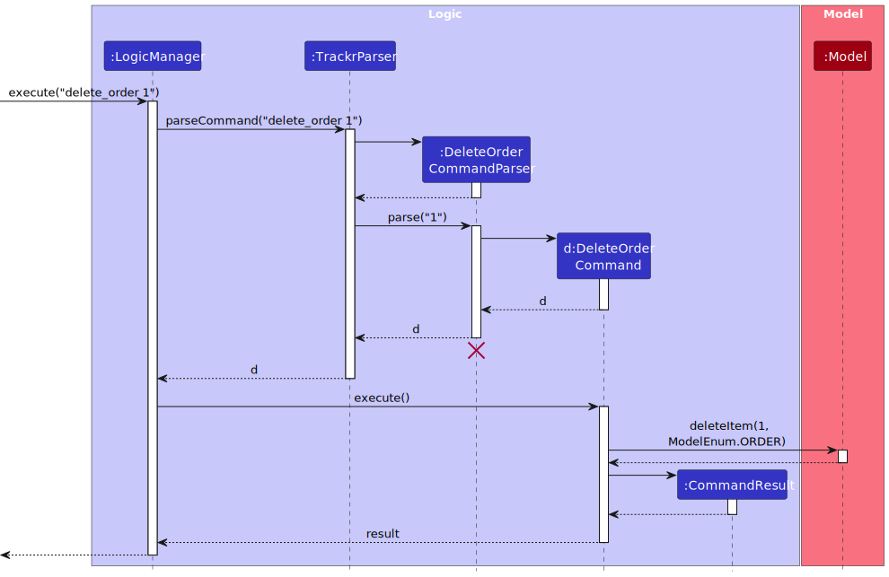
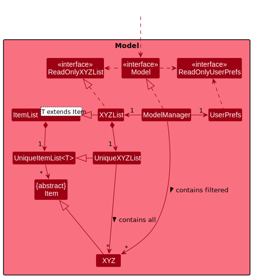
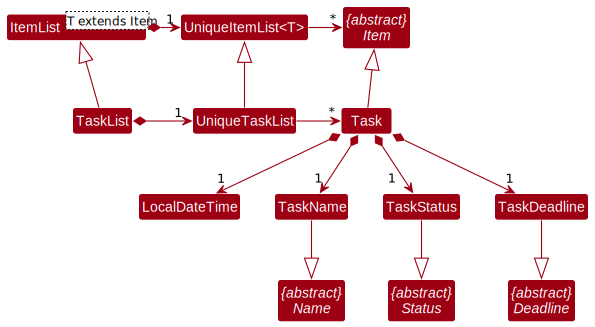
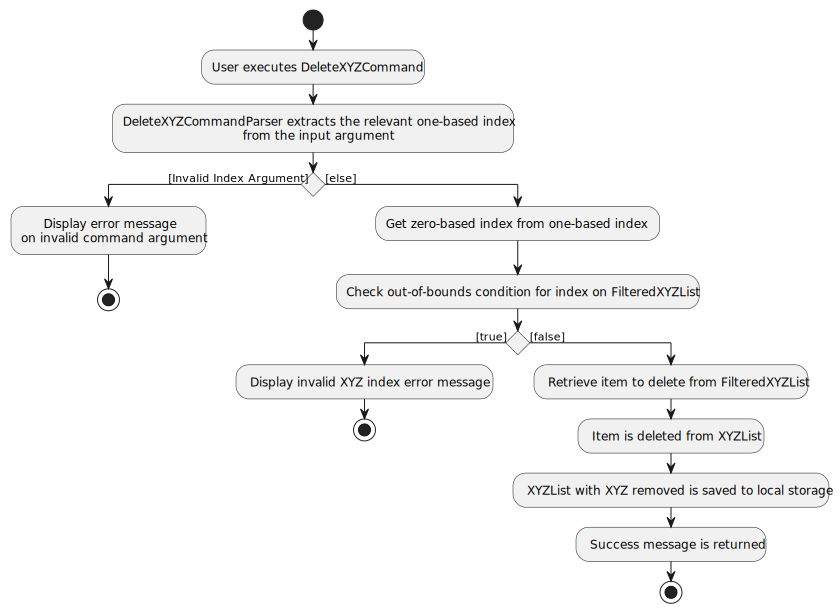
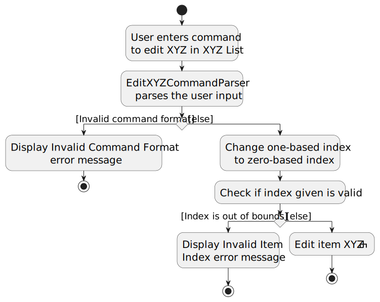
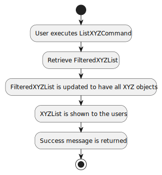

# Overview

Trackr is a desktop application catered towards home businesses to track their _suppliers_, _customers_, _orders_, _menu items_ and _tasks_. It is designed for users who are quick typers to accomplish their tasks through the _Command Line Interface (CLI)_ while reaping the benefits of a _Graphical User Interface (GUI)_.

:bulb: **Tip**

Texts that are in _italics_ are further explained in the [Glossary section](#glossary).

# About This Guide

This guide is intended for developers who want to work on **Trackr** project, where the code base is available [here](https://github.com/AY2223S2-CS2103T-W15-2/tp).

It explains the different components within the project and how they interact with each other.

This is a guide for developers looking to contribute to the codebase. There are explanations as to how the project is setup and how each command works.

You can click on the respective links below to read up on the relevant sections.

# Table of Contents

<!-- TOC -->
* [1 Introduction](#1-introduction)
  * [1.1 Setting up, getting started](#11-setting-up-getting-started)
  * [1.2 About Us](#12-about-us)
  * [1.3 Acknowledgements](#13-acknowledgements)
* [2 Design](#2-design)
  * [2.1 Architecture](#21-architecture)
    * [2.1.1 Main components of the architecture](#211-main-components-of-the-architecture)
    * [2.1.2 How the architecture components interact with each other](#212-how-the-architecture-components-interact-with-each-other)
  * [2.2 UI component](#22-ui-component)
  * [2.3 Logic component](#23-logic-component)
  * [2.4 Model component](#24-model-component)
    * [2.4.1 Item](#241-item)
    * [2.4.2 Supplier & Customer](#242-supplier--customer)
    * [2.4.3 Task](#243-task)
    * [2.4.4 Menu](#244-menu)
    * [2.4.5 Order](#245-order)
  * [2.5 Storage component](#25-storage-component)
  * [2.6 Common classes](#26-common-classes)
* [3 Implementation](#3-implementation)
  * [3.1 AddXYZCommand](#31-addxyzcommand)
  * [3.2 DeleteXYZCommand](#32-deletexyzcommand)
  * [3.3 EditXYZCommand](#33-editxyzcommand)
  * [3.4 FindXYZCommand](#34-findxyzcommand)
  * [3.5 ListXYZCommand](#35-listxyzcommand)
  * [3.6 SortXYZCommand](#36-sortxyzcommand)
  * [3.7 ClearXYZCommand](#37-clearxyzcommand)
  * [3.8 TabCommand](#38-tabcommand)
  * [3.9 HelpCommand](#39-helpcommand)
  * [3.10 ExitCommand](#310-exitcommand)
* [4 Appendix](#4-appendix)
  * [4.1 Documentation, logging, testing, configuration, dev-ops](#41-documentation-logging-testing-configuration-dev-ops)
    * [4.2 Product scope](#42-product-scope)
    * [4.3 User stories](#43-user-stories)
    * [4.4 Use cases](#44-use-cases)
    * [4.5 Non-Functional Requirements](#45-non-functional-requirements)
  * [4.6 Glossary](#46-glossary)
  * [4.7 Instructions for manual testing](#47-instructions-for-manual-testing)
    * [Launch and shutdown](#launch-and-shutdown)
    * [Deleting a person](#deleting-a-person)
    * [Saving data](#saving-data)
<!-- TOC -->

--------------------------------------------------------------------------------------------------------------------

# 1 Introduction

## 1.1 Setting up, getting started

Refer to the guide [here](SettingUp.md) on how to set up your own version of our project.

## 1.2 About Us

For more information about our team, you can refer to this webpage [here](AboutUs.md).

## 1.3 Acknowledgements

* This project is based on the AddressBook-Level3 (AB3) project created by the [SE-EDU initiative](https://se-education.org).
* If you would like to contribute code to the parent project (AddressBook-Level3), see [se-education.org](https://se-education.org#https://se-education.org/#contributing) for more info.  

--------------------------------------------------------------------------------------------------------------------

# 2 Design

This section will show our design methodology on the different components and how they interact with each other.

:bulb: **Tip**

The `.puml` files used to create diagrams in this document can be found in the [diagrams](https://github.com/AY2223S2-CS2103T-W15-2/tp/tree/master/docs/diagrams) folder.

Refer to the [PlantUML Tutorial at se-edu/guides](https://se-education.org/guides/tutorials/plantUml.html) to learn how to create and edit diagrams.

## 2.1 Architecture

  
   Figure 1: Architecture Class Diagram

The ***Architecture Diagram*** given above explains the high-level design of the App.

Given below is a quick overview of main components and how they interact with each other.

### 2.1.1 Main components of the architecture

**`Main`** has two classes called [`Main`](https://github.com/se-edu/addressbook-level3/tree/master/src/main/java/seedu/address/Main.java) and [`MainApp`](https://github.com/se-edu/addressbook-level3/tree/master/src/main/java/seedu/address/MainApp.java). It is responsible for,

* At app launch: Initializing the components in the correct sequence, and connecting them up with each other.
* At shut down: Shutting down the components and invoking cleanup methods where necessary.

[**`Commons`**](#common-classes) represents a collection of classes used by multiple other components.

The rest of the App consists of four components.

* [**`UI`**](#ui-component): The UI of the App.
* [**`Logic`**](#logic-component): The command executor.
* [**`Model`**](#model-component): Holds the data of the App in memory.
* [**`Storage`**](#storage-component): Reads data from, and writes data to, the hard disk.

### 2.1.2 How the architecture components interact with each other

The ***Sequence Diagram*** below shows how the components interact with each other for the scenario where the user issues the command `delete_supplier 1`.

  
   Figure 2: Sequence Diagram (Deleting Person)

Each of the four main components (also shown in the diagram above),

* defines its API in an `interface` with the same name as the Component.
* implements its functionality using a concrete `{Component Name}Manager` class (which follows the corresponding API `interface` mentioned in the previous point).

For example, the `Logic` component defines its API in the `Logic.java` interface and implements its functionality using the `LogicManager.java` class which follows the `Logic` interface. Other components interact with a given component through its interface rather than the concrete class (Reason: to prevent components outside from being coupled to the implementation of a component), as illustrated in the (partial) class diagram below.

  
   Figure 3: Logic Class Diagram

The sections below give more details of each component.  

## 2.2 UI component

The **API** of this component is specified in [`Ui.java`](https://github.com/AY2223S2-CS2103T-W15-2/tp/blob/master/src/main/java/trackr/ui/Ui.java)

  
   Figure 4: UI Class Diagram

The UI consists of a `MainWindow` that is made up of parts e.g.`CommandBox`, `ResultDisplay`, `TabPanel`, `StatusBarFooter` etc. All these, including the `MainWindow`, inherit from the abstract `UiPart` class which captures the commonalities between classes that represent parts of the visible GUI.

The `UI` component uses the JavaFX UI framework. The layout of these UI parts are defined in matching `.fxml` files that are in the `src/main/resources/view` folder. For example, the layout of the [`MainWindow`](https://github.com/AY2223S2-CS2103T-W15-2/tp/blob/master/src/main/java/trackr/ui/MainWindow.java) is specified in [`MainWindow.fxml`](https://github.com/AY2223S2-CS2103T-W15-2/tp/blob/master/src/main/resources/view/MainWindow.fxml)

The `UI` component,

* executes user commands using the `Logic` component.
* listens for changes to `Model` data so that the UI can be updated with the modified data.
* keeps a reference to the `Logic` component, because the `UI` relies on the `Logic` to execute commands.
* depends on some classes in the `Model` component, as it displays `Order`, `Task` or `Menu` object residing in the `Model`.  

## 2.3 Logic component

**API** : [`Logic.java`](https://github.com/AY2223S2-CS2103T-W15-2/tp/blob/master/src/main/java/trackr/logic/Logic.java)

Here's a (partial) class diagram of the `Logic` component:

  
   Figure 5: Logic Class Diagram

How the `Logic` component works:
1. When `Logic` is called upon to execute a command, it uses the `TrackrParser` class to parse the user command.
2. This results in a `Command` object, which is actually an object of one of its subclasses' (e.g. `AddItemCommand`'s) subclasses (e.g. `AddOrderCommand`). This specific command will then be executed by the `LogicManager`.
3. The command can communicate with the `Model` when it is executed (e.g. to add an order).
4. The result of the command execution is encapsulated as a `CommandResult` object which is returned by `Logic`.

The Sequence Diagram below illustrates the interactions within the `Logic` component for the `execute("delete_order 1")` API call.

  
   Figure 6: Delete Sequence Diagram (Deleting Order)

:information_source: **Note:**

The lifeline for `DeleteOrderCommandParser` should end at the destroy marker (X) but due to a limitation of PlantUML, the lifeline reaches the end of diagram.

Here are the other classes in `Logic` (omitted from the class diagram above) that are used for parsing a user command:

  
   Figure 7: Parser Class Diagram

How the parsing works:

* When called upon to parse a user command, the `TrackrParser` class creates an `XYZCommandParser` (`XYZ` is a placeholder for the specific command name e.g., `AddOrderCommandParser`) which uses the other classes shown above to parse the user command and create a `XYZCommand` object (e.g., `AddOrderCommand`) which the `TrackrParser` returns back as a `Command` object.
* All `XYZCommandParser` classes (e.g., `AddOrderCommandParser`, `DeleteOrderCommandParser`, ...) inherit from the `Parser` interface so that they can be treated similarly where possible e.g, during testing.  

## 2.4 Model component

**API** : [`Model.java`](https://github.com/AY2223S2-CS2103T-W15-2/tp/blob/master/src/main/java/trackr/model/Model.java)

  
   Figure 8: Model Class Diagram

The `Model` component,

* `XYZ` is a placeholder for the specific object (e.g., `Supplier`, `Task`), which are all `Item` objects.
* stores trackr data (all `XYZ` objects which are contained in their respective `UniqueXYZList` object).
* stores currently 'selected' `XYZ` objects (e.g., results of search query) as a **separate filtered list** which is exposed to outsiders as an unmodifiable `ObservableList<XYZ>` that can be viewed (e.g. UI is bound to this list so that the UI automatically updates when the data in the list changes).
* stores a `UserPref` object that represents the user’s preferences. This is exposed to the outside as a `ReadOnlyUserPref` objects.
* does not depend on any of the other three components (as the `Model` represents data entities of the domain, they should make sense on their own without depending on other components).

### 2.4.1 Item

Here is the `Item` class that is what all model objects depend on.

  
   Figure 9: Item Class Diagram

Each `ItemList` contains a `UniqueItemList` that stores a list of unique `Items`, which are defined by a model definition (e.g., `Supplier` or `Task` from `ModelEnum`).

### 2.4.2 Supplier & Customer

This is the class representation for the `Supplier` and `Customer` class.

  
   Figure 10: Person Class Diagram

Here is how `Supplier` and `Customer` works:

* `Supplier` and `Customer` inherit off `Person` class, which depends on the `Item` class.
* Each `Person` contains their name, phone number, deadline, email and _tags_. (e.g., `PersonAddress` represents the address)
* The `Supplier` and `Customer` object have their corresponding `List` and `UniqueList` that stores their information.

### 2.4.3 Task

This is the class representation for the `Task` class.

  
   Figure 11: Task Class Diagram

Here is how `Task` works:

* Each `Task` contains their name, deadline, _status_ and time added (e.g., `TaskName` for task name).
* Each of the attributes inherits off the corresponding `common` classes (e.g., `TaskName` inherit off `Name`).
* The `Task` object have its `List` and `UniqueList`.
* The LocalDateTime object represents the time the task was added to the list (which is used when sorting tasks).

### 2.4.4 Menu

This is the class representation for the `Menu` class.

  
   Figure 12: Menu Class Diagram

Here is how `Menu` works:

* Each `MenuItem` contains their name, selling price, cost and profit (e.g., `ItemName` for menu's item name).
* The `MenuItem`'s `ItemName` attribute inherit off the corresponding `common` classes (e.g., `ItemName` inherit off `Name`).
* The`ItemProfit` is obtained using `ItemPrice` and `ItemCost`, meaning that `ItemProfit` depends on `ItemPrice` and `ItemCost`.
* The `MenuItem` object have its `List` called `Menu` and `UniqueList`.
* The `MenuItem` is an attribute of `Order`.

**Aspect: Choice to provide a menu package:**

* **Option 1 (our choice):** Separating it into a separate `menu` package.
    * Advantage 1: Reduce the fuss of keying in the same name of the menu item repetitively when you add an order.
    * Advantage 2: Less repeated code
    * Disadvantage: More time required to implement.

* **Option 2:** Add item name as an attribute in the `Order` class.
    * Advantage: Convenient to implement.
    * Disadvantage: Higher chance of conflicts with another developer working on `Order` class.

### 2.4.5 Order

This is the class representation for the `Order` class.

  
   Figure 13: Order Class Diagram

Here is how `Order` works:

* Each `Order` contains a menu item(from a locally stored menu), customer, quantity, status, deadline and time added (e.g., `OrderStatus` for order's status).
* The menu item and customer each contains attributes as mentioned in their respective section above on how `Menu` and `Customer` works.
* The `Order`'s `OrderDeadline` and `OrderStatus` attribute inherit off the corresponding `common` classes (e.g., `OrderDeadline` inherit off `Deadline`).
* The `Order` object have its `List` called `OrderList` and `UniqueList`.
* The LocalDateTime object represents the time the order was added to the list (which is used when sorting orders).

## 2.5 Storage component

**API** : [`Storage.java`](https://github.com/AY2223S2-CS2103T-W15-2/tp/blob/master/src/main/java/trackr/storage/Storage.java)

  
   Figure 14: Storage Class Diagram

The `Storage` component,

* can save both Trackr data and user preference data in json format, and read them back into corresponding objects.
* inherits from both `TrackrStorage` and `UserPrefStorage`, which means it can be treated as either one (if only the functionality of only one is needed).
* depends on some classes in the `Model` component (because the `Storage` component's job is to save/retrieve objects that belong to the `Model`)

## 2.6 Common classes

Classes used by multiple components are in the `trackr.commons` package.

--------------------------------------------------------------------------------------------------------------------

# 3 Implementation

This section describes the details on how the commands are implemented. After every command, the new state of all of Trackr's data is saved into the data file.

:information_source: **Notes about the command format**

* The commands below are in the format `<action><XYZ>Command`.
* `<action>` represents the action the user can do. 
  e.g. `add`, `edit`and `find`
* `XYZ` represents the type of data the user can input. 
  e.g. `Supplier`, `Order` and `Task`
  * Note: If there are specific instances where `XYZ` represents a limited number of types, it would be stated within the description.

## 3.1 AddXYZCommand

The `add` command creates a `XYZ` object and adds it into `XYZList` and `FilteredXYZList`. It also saves into the internal `XYZList`, which stores all the `XYZ` objects, that matches the provided keywords.

The keywords that can be provided are the attributes as seen in the corresponding `XYZ`'s class diagram.
For example, `n/` would be followed by a task name for `AddTaskCommand` and supplier name for `AddSupplierCommand`.

The parser for the `add` command would extract out the arguments corresponding to each particular field.

The following activity diagram summarizes what happens when the user executes the `add` command.

  
   Figure 15: Add Command Activity Diagram

:information_source: **Information on parameters for add command**

* You can see the specific parameters allowed for [Supplier](UserGuide.md#211-adding-a-supplier-add_supplier), [Order](UserGuide.md#212-adding-an-order-add_order), [Task](UserGuide.md#213-adding-a-task-add_task) and [Menu Item](UserGuide.md#214-adding-a-menu-item-add_item).
* For more information on the specifications of the different attributes, you can look [here](UserGuide.md#61-prefix-summary).

**Why is it implemented this way**

The `AddXYZCommand` is an improved version of the original AB3 `AddCommand` by implementing into an abstract class - `AddItemCommand`.
This reduces repeated lines of code and improves ease of implementation for future commands that require adding an item to a list.

## 3.2 DeleteXYZCommand

The `delete` command removes a `XYZ` object from internal `FilteredXYZList` and `XYZList`.

The command only accepts 1 argument without any prefixes. The argument corresponds to the index of `XYZ` in the `FilteredXYZList` that the user wishes to delete using a one-based index.

The parser for `delete` command extracts the index found in the arguments. If the argument is valid, then zero-based index is used to remove `XYZ` from the `XYZList`.

The following activity diagram summarizes what happens when the user executes the `delete` command.

  
   Figure 16: Delete Command Activity Diagram

**Why is it implemented this way**

The `DeleteXYZCommand` is an improved version of the original _AB3_ `DeleteCommand` by implementing into an abstract class - `DeleteItemCommand`.
This reduces repeated lines of code and improves ease of implementation for future commands that require removing an item from a list.

## 3.3 EditXYZCommand

The `edit` command edits a `XYZ` item from the internal `XYZList`.

This command requires user to key in the index of `XYZ` in the `FilteredXYZList` that the user wishes to edit using a one-based index.

The keywords that can be provided are the attributes as seen in the corresponding `XYZ`'s class diagram.
For example, `n/` would be followed by a task name for `AddTaskCommand` and supplier name for `AddSupplierCommand`.

:information_source: **Information on parameters for edit command**

* You can see the specific parameters allowed for [Supplier](UserGuide.md#221-editing-a-supplier-edit_supplier), [Order](UserGuide.md#222-editing-an-order-edit_order), [Task](UserGuide.md#223-editing-a-task-edit_task) and [Menu Item](UserGuide.md#224-editing-a-menu-item-edit_item).
* For more information on the specifications of the different attributes, you can look [here](UserGuide.md#61-prefix-summary).

The user is required to key in at least one keyword to be edited.

The parser for `edit` command parses and extracts out the arguments corresponding to each particular field.

The following activity diagram summarizes what happens when the user executes the `edit` command.

  
   Figure 17: Edit Command Activity Diagram

 

  
   Figure 18: Edit Item XYZ Activity Diagram

**Why is it implemented this way**

The `EditXYZCommand` is an improved version of the original _AB3_ `EditCommand` by implementing into an abstract class - `EditItemCommand`.
This reduces repeated lines of code and improves ease of implementation for future commands that require editing an item in a list.

## 3.4 FindXYZCommand

The `find` command finds `XYZ` objects from the internal `XYZList` (which stores all the `XYZ` objects) that matches the provided keywords.

The keywords that can be provided varies for each command and can be found in the user guide.

:information_source: **Information on parameters for add command**

* You can see the specific parameters allowed for [Supplier](UserGuide.md#231-finding-a-supplier-find_supplier), [Order](UserGuide.md#232-finding-an-order-find_order), [Task](UserGuide.md#233-finding-a-task-find_task) and [Menu Item](UserGuide.md#234-finding-a-menu-item-find_item).
* For more information on the specifications of the different attributes, you can look [here](UserGuide.md#61-prefix-summary).

The parser for the `find` command would extract out the arguments corresponding to each particular field.

A `XYZContainsKeywordPredicate` is built upon these fields, which is used to test each `XYZ` object in the `XYZList` on whether they match the keywords provided.

The following activity diagram summarizes what happens when the user executes the `find` command.

  
   Figure 19: Find Command Activity Diagram

**Why is it implemented this way**

The `FindXYZCommand` is an improved version of the original _AB3_ `FindCommand` by implementing into an abstract class - `FindItemCommand`.
This reduces repeated lines of code and improves ease of implementation for future commands that require finding an item in a list.

The abstract class `ItemDescriptor` stores the details of an item. It provides easier implementation for `XYZContainsKeywordPredicate` classes.

## 3.5 ListXYZCommand

The `list` command retrieves all the `XYZ` objects from the `XYZList` and lists them all in the internal `FilteredXYZList`.

The `FilteredXYZList` is then updated to have all `XYZ` objects, after which it will then to shown to the user.

The following activity diagram summarizes what happens when the user executes the `list` command.

  
   Figure 20: List Command Activity Diagram

**Why is it implemented this way**

The `ListXYZCommand` is an improved version of the original _AB3_ `ListCommand` by implementing into an abstract class - `ListItemCommand`.
This reduces repeated lines of code and improves ease of implementation for future commands that require listing all item of the same data type.

## 3.6 SortXYZCommand

:information_source: **Information on `XYZ`**

* `XYZ` for `sort` only refers to tasks and orders.

The `sort` command sorts `XYZ` objects in the internal `FilteredXYZList` according to a selected criteria.

The command only accepts 1 argument without the prefix `c/`. This argument is optional, and it corresponds to the criteria the user wishes to sort the list by.

The parser for the `sort` command would extract out the criteria. If no criteria is given, it will be defaulted to `Status and Deadline`.

A `SortXYZComparator` is used to define how two `XYZ` objects should be compared and sorted.

The following activity diagram summarizes what happens when the user executes the `sort` command.

  
   Figure 21: Sort Command Activity Diagram

**Why is it implemented this way**

Unlike the other commands, the `SortXYZCommand` does not implement an abstract class like `SortItemCommand`.
It simply extends Command as there are only two sort commands (one for orders and one for tasks).

Although abstracting out an abstract class would ease implementation for future sort commands, it is not currently planned.
However, this might be changed in the future to follow the syntax of the other commands.

## 3.7 ClearXYZCommand

The `clear` command removes **all** `XYZ` object from internal `FilteredXYZList` and `XYZList`.

The following activity diagram summarizes what happens when the user executes the `delete` command.

  
   Figure 22: Clear Command Activity Diagram

**Why is it implemented this way**

The `ClearXYZCommand` is an improved version of the original _AB3_ `ClearCommand` by implementing into an abstract class - `ClearItemCommand`.
This reduces repeated lines of code and improves ease of implementation for future commands that require clearing all item from the list.

## 3.8 TabCommand

## 3.9 HelpCommand

The `help` command brings up a [HelpWindow](https://github.com/AY2223S2-CS2103T-W15-2/tp/blob/master/src/main/java/trackr/ui/HelpWindow.java), where there is a link to the User Guide of Trackr. The user can also press `F1` or click `Help` the menu bar to bring it up. 

This will allow the users to be able to have a reference to all the commands and explanation within a single webpage.

**Why is it implemented this way**

The `HelpCommand` is the same original command as from _AB3_, just with the link updated to this project.

## 3.10 ExitCommand

The `exit` command allows the users to exit Trackr via the command line.

**Why is it implemented this way**

The `ExitCommand` is the same original command as from _AB3_.

-------------------------------------------------------------------------------------------------------------------- 

# 4 Appendix

## 4.1 Documentation, logging, testing, configuration, dev-ops

Please refer to the respective guides below for other information.

* [Documentation guide](Documentation.md)
* [Testing guide](Testing.md)
* [Logging guide](Logging.md)
* [Configuration guide](Configuration.md)
* [DevOps guide](DevOps.md)

## 4.2 Product scope

**Target user profile**:

* Tech-savvy home businesses owners who:
    * lists their products online or on their own website
    * perform transactions manually without a Point-of-Sale (POS) system
    * Lack manpower/ time to track orders and contacts manually
    * Has a need to manage a significant number of contacts
* Prefer desktop apps over other types
* Can type fast
* Prefers typing to mouse interactions
* Is reasonably comfortable using CLI apps

**Value proposition**:

Our application:
* allows for consolidation of orders, contacts & tasks information which makes it easier to manage them. (but no _real-time automation_)
* serves as a user-friendly alternative to free applications such as Microsoft Excel which may not be catered to their needs and requires tedious formatting. (but no support for custom formatting of interface)
* enables faster contact management compared to a typical mouse/GUI driven app  

## 4.3 User stories

**High Priority (Must Have)**

| As a / an …​ | I want to …​                | So that I can…​                                                        |
|--------------|-----------------------------|------------------------------------------------------------------------|
| new user     | have an instruction guide   | understand how to use the application                                  |
| user         | add new orders              | have a consolidated place to keep track of my orders                   |
| user         | view all my orders          | track my progress in dealing with the orders                           |
| user         | edit my orders              | update my order status                                                 |
| user         | find my orders by keywords  | get a specific order without manually searching for it                 |
| user         | delete my orders            | remove unwanted old orders                                             |
| user         | add new suppliers           | easily find them from a consolidated location                          |
| user         | find suppliers by keywords  | get the relevant supplier information from a specific supplier contact |
| user         | edit my supplier contacts   | update past supplier contacts with current information                 |
| user         | delete my supplier contacts | remove supplier contacts not used anymore                              |
| user         | add new tasks               | keep track of business tasks from the same application                 |
| user         | find tasks by keywords      | get all relevant tasks that are related to plan my schedule            |
| user         | edit my tasks               | update my progress on the task                                         |
| user         | delete my tasks             | remove old completed tasks                                             |

**Medium Priority (Nice to Have)**

| As a / an …​   | I want to …​                | So that I can…​                                           |
|----------------|-----------------------------|-----------------------------------------------------------|
| business owner | add my menu items           | add orders based on my menu items                         |
| business owner | edit my menu items          | update my price and cost based on current rates           |
| business owner | delete menu items           | remove unpopular items that are not sold anymore          |
| user           | have my orders sorted       | view my upcoming orders that are not done yet             |
| user           | have my tasks sorted        | view the most pressing tasks at first glance              |
| expert user    | be able to export data      | keep track of past orders without lagging the application |

**Low Priority (Upcoming)**

| As a / an …​    | I want to …​       | So that I can…​                                           |
|-----------------|-----------------------------|-----------------------------------------------------------|
| expert user     | be able to import past data | use the application easily when transferring data         |

## 4.4 Use cases

(For all use cases below, the **System** is the `Trackr` and the **Actor** is the `Home Business Owner`)

**Use case: UC01 - Add a new supplier**

**MSS**

 1. Actor requests to add a new supplier.
 2. Actor enters a command to add a supplier with the required information.
 3. Trackr saves the new supplier to the system.
 4. Trackr shows the new supplier added to the list.

    Use case ends.

**Extensions**

* 2a. The Actor does not enter all required information.

    * 2a1. Trackr shows an error message.

      Use case resumes at step 1.

* 2b. The Actor adds a supplier that already exists in the list.

    * 2b1. Trackr shows an error message.

      Use case resumes at step 1.

**Use case: UC11 - Add a new task**

(Similar to UC01 except it is for task)

**Use case: UC21 - Add a new order**

(Similar to UC01 except it is for order)

**Use case: UC31 - Add a new menu item**

(Similar to UC01 except it is for menu item)

**Use case: UC02 - Delete a supplier**

**MSS**

1. Actor requests to list contacts.
2. Trackr shows a list of contacts.
3. Actor requests to delete a specific contact from the list.
4. Trackr deletes the contact.

   Use case ends.

**Extensions**

* 2a. The list is empty.

  Use case ends.

* 3a. The given index is invalid.

    * 3a1. Trackr shows an error message.

      Use case resumes at step 3.

**Use case: UC12 - Delete a task**

(Similar to UC02 except it is for task)

**Use case: UC22 - Delete an order**

(Similar to UC02 except it is for order)

**Use case: UC32 - Delete a menu item**

(Similar to UC02 except it is for menu item)

**Use case: UC03 - Edit a supplier**

**MSS**

1. Actor requests to list contacts.
2. Trackr shows a list of contacts.
3. Actor enters an edit contact command for a specific contact and the updated information.
4. Trackr updates the contact details with the new information.

    Use case ends.

**Extensions**

* 2a. The list is empty.

  Use case ends.

* 3a. The Actor enters an invalid index.

    * 3a1. Trackr displays an error message.

      Use case resumes at step 3.

* 3b. The Actor enters invalid information.

    * 3b1. Trackr displays an error message.

      Use case resumes at step 3.

**Use case: UC13 - Edit a task**

(Similar to UC03 except it is for task)

**Use case: UC23 - Edit an order**

(Similar to UC03 except it is for order)

**Use case: UC33 - Edit a menu item**

(Similar to UC03 except it is for menu item)

**Use case: UC04 - Finding a supplier**

**MSS**

1. Actor requests to find a supplier.
2. Actor enters the command with the desired search criteria.
3. Trackr searches for suppliers that match the given criteria.
4. Trackr displays a list of suppliers that match the criteria.

   Use case ends.

**Extensions**

* 2a. The Actor does not enter any search criteria.

    * 2a1. Trackr displays an error message.

    * Use case resumes at step 2.

* 4a. No supplier matches the given search criteria.

  Use case ends.

**Use case: UC14 - Find a task**

(Similar to UC04 except it is for task)

**Use case: UC24 - Find an order**

(Similar to UC04 except it is for order)

**Use case: UC34 - Find a menu item**

(Similar to UC04 except it is for menu item)

**Use case: UC15 - Sort tasks**

**MSS**

1. Actor requests to sort tasks.
2. Actor enters the command with the desired sorting criteria.
3. Trackr sorts tasks according to the criteria.
4. Trackr displays a list of tasks that are sorted.

   Use case ends.

**Extensions**

* 2a. The Actor does not enter any search criteria.

  * 2a1. Trackr uses the default sorting criteria based on status and deadline.

  * Use case resumes at step 3.

**Use case: UC25 - Sort orders**

(Similar to UC15 except it is for order)

**Use case: UC50 - Switch to another tab**

**MSS**

1. Actor requests to switch to another tab.
2. Actor interacts with the tab menu.
3. Trackr switches to the target tab.

   Use case ends.

## 4.5 Non-Functional Requirements

1. Should work on any _mainstream OS_ as long as it has Java `11` or above installed.
2. Should be able to hold up to 200 supplier and customer contacts without a noticeable sluggishness in performance for typical usage.
3. Should be able to hold up to 1000 order details without a noticeable sluggishness in performance for typical usage.
4. Should be able to hold up to 200 tasks without a noticeable sluggishness in performance for typical usage.
5. A user with above average typing speed for regular English text (i.e. not code, not system admin commands) should be able to accomplish most of the tasks faster using commands than using the mouse.
6. Should store data locally only.

--------------------------------------------------------------------------------------------------------------------

## 4.6 Glossary

* **Mainstream OS**: Windows, Linux, Unix, OS-X
* **CLI**: Command-Line Interface
* **GUI**: Graphical User Interface
* **AB3**: AddressBook-Level3 (The parent project this is based off on)
* **Real-time automation**: Automatically update tasks or orders with deadlines that have passed as done or overdue.
* **Supplier**: Supplier refers to someone whom the user seasonally or frequently orders goods from
* **Customer**: Customer refers to someone whom the user receives an order from
* **Order**: Order refers to the customers' orders the user accepts
* **Task**: Task refers to any to-dos the user may have, it need not be related to suppliers or orders (For instance, it can be about tidying inventory)
* **Menu Item**: Menu Item refers to any inventory/ stock that the user is selling to customers
* **Tag**: Tags are associated with suppliers, users can tag the supplier with any keyword they want, number of tags are not restricted
* **Status**: Statuses are associated with tasks and orders, one entry of task/order can only have one status and the type of status that can be added is restricted   

--------------------------------------------------------------------------------------------------------------------

## 4.7 Planned Enhancements

1. Ensure all the commands follow the standard format so that it is easier for the user to remember. 
  Currently, some commands do not follow this format, such as `find_supplier` where it is of the format `find_supplier NAME` instead of `find_supplier n/NAME`. 
  The format is shown below.
  

   &lt;command&gt;
    
   &lt;index&gt;
    
   &lt;prefix/paramater&gt; &lt;prefix/paramater&gt; ...
  

   

2. Provide better error messages for commands. 
  Currently, some commands do not show a comprehensive error message to display what the user has done. 
  For example some command return a success message of `Edited task: task`. We suggest a more comprehensive message such as `Edited task: <TASK DATA>` where `<TASK DATA>` represents the edited data. 
  Specifically, `Edited task: Buy eggs; Deadline:01 January 2023; Status: Not Done`.

--------------------------------------------------------------------------------------------------------------------

## 4.7 Instructions for manual testing

Given below are instructions to test the app manually.

:information_source: **Note**

These instructions only provide a starting point for testers to work on and testers are expected to do more exploratory testing.

### Launch and shutdown

1. Initial launch

   1. Download the jar file and copy into an empty folder

   1. Double-click the jar file Expected: Shows the GUI with a set of sample contacts. The window size may not be optimum.

1. Saving window preferences

  1. Resize the window to an optimum size. Move the window to a different location. Close the window.

  1. Re-launch the app by double-clicking the jar file. 
     Expected: The most recent window size and location is retained.

1. Shutdown

   1. Execute the command `exit` or close the window using GUI by clicking the cross on the top-right hand corner.
      Expected: The window will close and all the data will be saved.  

### Adding a supplier

**Test Case 1**

Context: There is **no** contact with the phone number `11111111` in Trackr.

Action: Execute command `add_supplier n/Ben p/11111111 a/Ben Street e/ben@gmail.com`

Expected Outcome:
* New supplier `Ben` is added into the supplier list.
* Success message shown in command result box. 
  Specifically, `New Supplier added: Ben; Phone: 11111111; Email: ben@gmail.com; Address: Ben Street`

**Test Case 2**

Context: There **is** a contact with the phone number `11111111` in Trackr.

Action: Execute command `add_supplier n/Ben p/11111111 a/Ben Street e/ben@gmail.com`

Expected Outcome:
* Error message shown in command result box. 
  Specifically, `This Supplier already exists in the Supplier list`

### Adding a task

**Test Case 1**

Context: There is **no** task with the name `Buy yeast` and deadline `10/10/2023` in Trackr.

Action: Execute command `add_task n/Buy yeast d/10/10/2023`

Expected Outcome:
* New task `Buy yeast` is added into the task list.
* Success message shown in command result box. 
  Specifically, `New Task added: Buy yeast; Deadline: 10 October 2023; Status: Not Done`

**Test Case 2**

Context: There **is** a task with the name `Buy yeast` and deadline `10/10/2023` in Trackr.

Action: Execute command `add_task n/Buy yeast d/10/10/2023`

Expected Outcome:
* Error message shown in command result box. 
  Specifically, `This Task already exists in the Task list`

### Adding an order

**Test Case 1**

Context: There is **no** order with the same customer, order item, deadline and quantity in Trackr.

Action: Execute command `add_order on/Chocolate Cookies q/10 d/10/10/2023 n/Ben p/11111111 a/Ben Street`

Expected Outcome:
* New order is added into the order list.
* Success message shown in command result box. 
  Specifically, `New Order added: Chocolate Cookies; 10; Deadline: 10 October 2023; Status: Not Delivered; Customer: Ben; Phone: 11111111; Address: Ben Street`

**Test Case 2**

Context: There **is** an order with the same customer, order item, deadline and quantity in Trackr.

Action: Execute command `add_order on/Chocolate Cookies q/10 d/10/10/2023 n/Ben p/11111111 a/Ben Street`

Expected Outcome:
* Error message shown in command result box. 
  Specifically, `This Order already exists in the Chocolate Cookies; 10; Deadline: 10 October 2023; Status: Not Delivered; Customer: Ben; Phone: 11111111; Address: Ben Street list` 
  Note that there is an issue with the error message now and will be fixed in the future update.

### Adding a menu item

**Test Case 1**

Context: There is **no** menu item with the name `Vanilla Cake` in Trackr.

Action: Execute command `add_item n/Vanilla Cake pr/40 c/25`

Expected Outcome:
* New menu item `Vanilla Cake` is added into the menu.
* Success message shown in command result box. 
  Specifically, `New Menu Item added: Vanilla Cake; Selling Price: $40.00; Cost: $25.00; Profit: $15.00`

**Test Case 2**

Context: There **is** a menu item with the name `Vanilla Cake` in Trackr.

Action: Execute command `add_item n/Vanilla Cake pr/40 c/25`

Expected Outcome:
* Error message shown in command result box. 
  Specifically, `This Menu Item already exists in the Menu Item list`

### Editing supplier

**Test Case 1**

Context: There **is** a supplier at index `1` and **no** suppliers with the new phone number `11111111` in Trackr.

Action: Execute command `edit_supplier 1 p/11111111`

Expected Outcome:
* Edited **first** supplier with phone number `11111111`.
* Success message shown in command result box. 
  Specifically, `Edited supplier: supplier`

**Test Case 2**

Context: There **is** a supplier at index `1` and **a** supplier with the new phone number `11111111` in Trackr.

Action: Execute command `edit_supplier 1 p/11111111`

Expected Outcome:
* Error message shown in command result box. 
  Specifically, `This supplier already exists in the supplier list.`

**Test Case 3**

Context: There **is** a no supplier at index `5` in Trackr.

Action: Execute command `edit_supplier 5 p/11111111`

Expected Outcome:
* Error message shown in command result box. 
  Specifically, `The supplier index provided is invalid`

### Editing task

**Test Case 1**

Context: There **is** a task at index `1` and **no** supplier with the new name `Buy eggs` and deadline `10/10/2023` in Trackr.

Action: Execute command `edit_task 1 n/Buy eggs d/10/10/2023`

Expected Outcome:
* Edited **first** task with name `Buy eggs` and deadline `10/10/2023`.
* Success message shown in command result box. 
  Specifically, `Edited task: task`

**Test Case 2**

Context: There **is** a task at index `1` and **a** supplier with the new name `Buy eggs` and deadline `10/10/2023` in Trackr.

Action: Execute command `edit_task 1 n/Buy eggs d/10/10/2023`

Expected Outcome:
* Error message shown in command result box. 
  Specifically, `This task already exists in the task list.`

**Test Case 3**

Context: There **is** a no task at index `5` in Trackr.

Action: Execute command `edit_task 5 n/Buy eggs d/10/10/2023`

Expected Outcome:
* Error message shown in command result box. 
  Specifically, `The task index provided is invalid`

### Editing order

**Test Case 1**

Context: There **is** an order at index `1` and **no** same details as edited order in Trackr.

Action: Execute command `edit_order 1 a/John Street`

Expected Outcome:
* Edited **first** order with customer address `John Street`.
* Success message shown in command result box. 
  Specifically, `Edited order: order`

**Test Case 2**

Context: There **is** an order at index `1` and **an** order with the same details as the edited order in Trackr.

Action: Execute command `edit_order 1 a/John Street`

Expected Outcome:
* Error message shown in command result box. 
  Specifically, `This order already exists in the order list.`

**Test Case 3**

Context: There **is** a no order at index `5` in Trackr.

Action: Execute command `edit_task 5 n/Buy eggs d/10/10/2023`

Expected Outcome:
* Error message shown in command result box. 
  Specifically, `The order index provided is invalid`

### Editing menu item

**Test Case 1**

Context: There **is** a menu item at index `1` and **no** menu items with same name `Chocolate Cookies` in Trackr.

Action: Execute command `edit_item 1 n/Chocolate Cookies`

Expected Outcome:
* Edited **first** menu item with name `Chocolate Cookies`.
* Success message shown in command result box. 
  Specifically, `Edited menu item: menu item`

**Test Case 2**

Context: There **is** a menu item at index `1` and **a** menu item with the same name `Chocolate Cookies` in Trackr.

Action: Execute command `edit_item 1 n/Chocolate Cookies`

Expected Outcome:
* Error message shown in command result box. 
  Specifically, `This menu item already exists in the menu item list.`

**Test Case 3**

Context: There **is** a no menu item at index `5` in Trackr.

Action: Execute command `edit_item 1 n/Chocolate Cookies`

Expected Outcome:
* Error message shown in command result box. 
  Specifically, `The menu item index provided is invalid`

### Saving data

1. Dealing with missing/corrupted data files

   1. (If this is your first time using the product) Run the application and close it so that the data file is generated with sample data. 

   2. Navigate to `data/trackr.json` and remove a line of data / make one of the data invalid (check our [User Guide](https://github.com/AY2223S2-CS2103T-W15-2/tp/blob/master/docs/UserGuide.md) for how we check for valid inputs)
        Example: Change one of the orderDeadline to an invalid date like `00/13/2024`.

    

      
       Figure 21: Corrupted data file
    
 

   3. Run Trackr.
       Expected: Blank `Order List` is displayed.

    

      
       Figure 22: Corrupted Order List
    
 

   4. To resolve this issue, either
   
      1. Locate your corrupted `trackr.json`, delete this file and re-run Trackr. 
      This will allow you to restart with a new data file filled with sample data.

      2. Navigate to your `trackr.json` file and find the missing/corrupted part of the data and change it accordingly.
