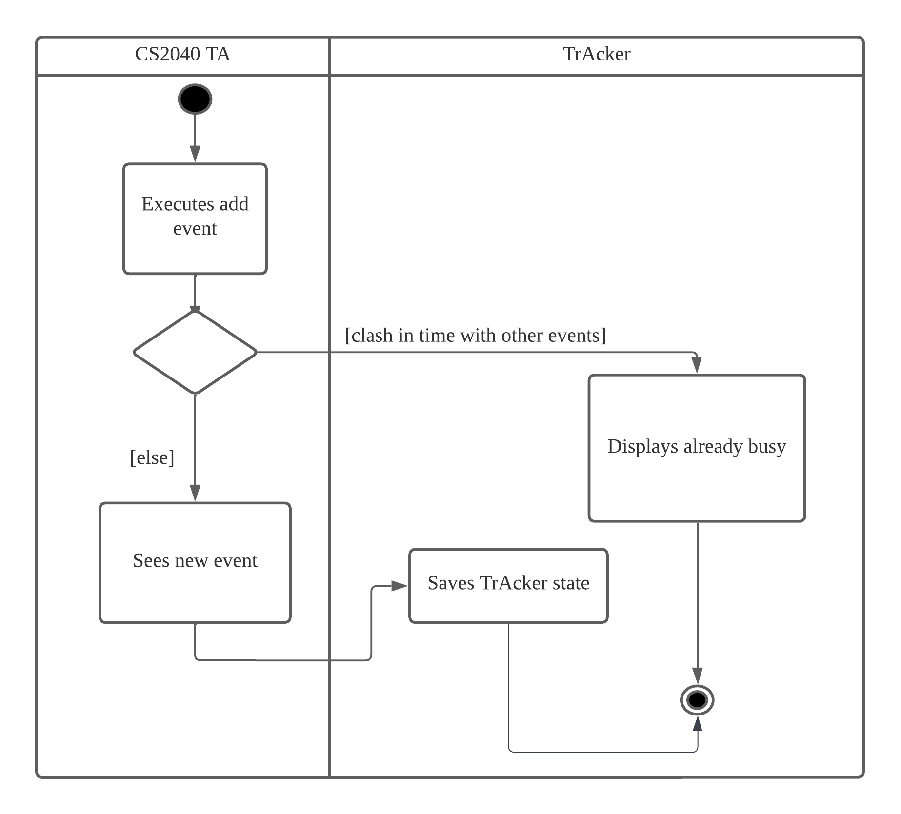
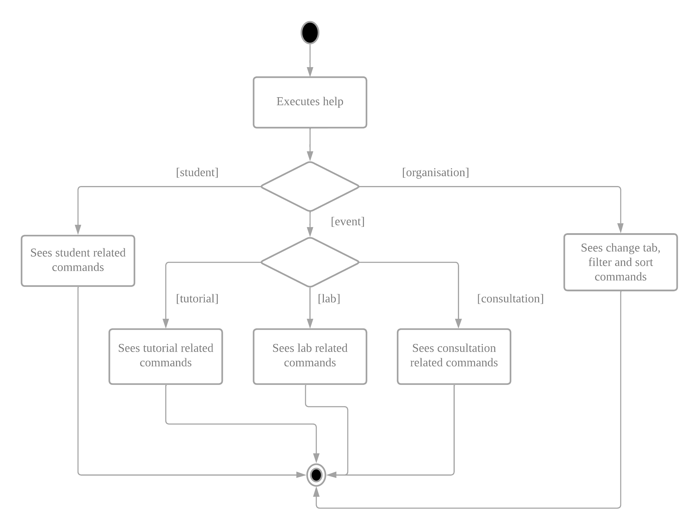
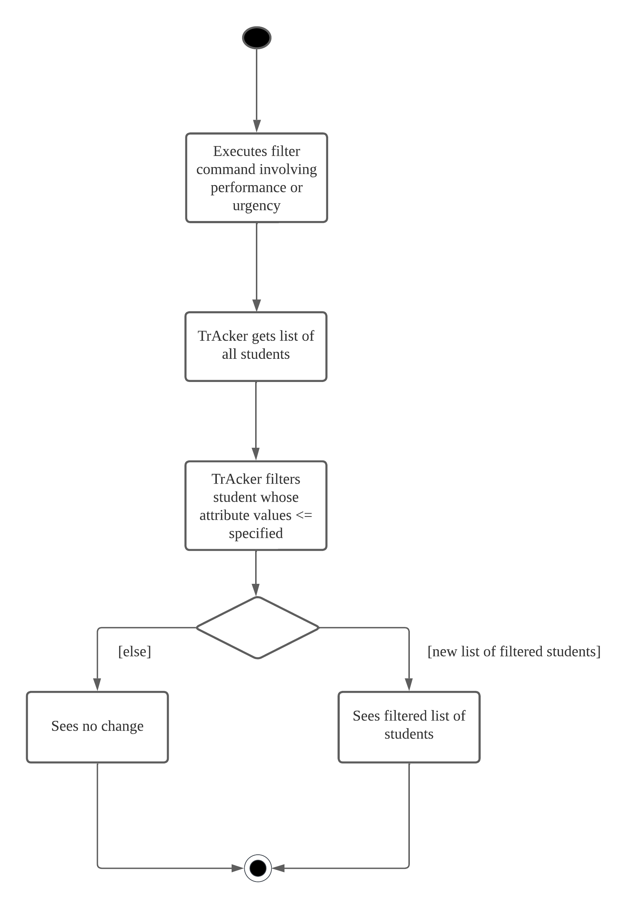

* Table of Contents
  {:toc}

--------------------------------------------------------------------------------------------------------------------

## **Acknowledgements**

* [CS2103/T instructors](https://nus-cs2103-ay2223s2.github.io/website/admin/instructors.html) for helping us answer our queries.
* [AB3](https://github.com/se-edu/addressbook-level3) for providing us with a brownfield project to work on.

--------------------------------------------------------------------------------------------------------------------

## **Setting up, getting started**

Refer to the guide [_Setting up and getting started_](SettingUp.md).

--------------------------------------------------------------------------------------------------------------------

## **Design**

:bulb: **Tip:** The `.puml` files used to create diagrams in this document can be found in the [diagrams](https://github.com/AY2223S2-CS2103-F11-1/tp/tree/master/docs/diagrams/) folder. Refer to the [_PlantUML Tutorial_ at se-edu/guides](https://se-education.org/guides/tutorials/plantUml.html) to learn how to create and edit diagrams.

### Architecture

The ***Architecture Diagram*** given above explains the high-level design of the App.

Given below is a quick overview of main components and how they interact with each other.

**Main components of the architecture**

**`Main`** has two classes called [`Main`](https://github.com/AY2223S2-CS2103-F11-1/tp/tree/master/src/main/java/seedu/address/Main.java) and [`MainApp`](https://github.com/AY2223S2-CS2103-F11-1/tp/tree/master/src/main/java/seedu/address/MainApp.java). It is responsible for,
* At app launch: Initializes the components in the correct sequence, and connects them up with each other.
* At shut down: Shuts down the components and invokes cleanup methods where necessary.

[**`Commons`**](#common-classes) represents a collection of classes used by multiple other components.

The rest of the App consists of four components.

* [**`UI`**](#ui-component): The UI of the App.
* [**`Logic`**](#logic-component): The command executor.
* [**`Model`**](#model-component): Holds the data of the App in memory.
* [**`Storage`**](#storage-component): Reads data from, and writes data to, the hard disk.

**How the architecture components interact with each other**

The *Sequence Diagram* below shows how the components interact with each other for the scenario where the user issues the command `delete 1`.

Each of the four main components (also shown in the diagram above),

* defines its *API* in an `interface` with the same name as the Component.
* implements its functionality using a concrete `{Component Name}Manager` class (which follows the corresponding API `interface` mentioned in the previous point.

For example, the `Logic` component defines its API in the `Logic.java` interface and implements its functionality using the `LogicManager.java` class which follows the `Logic` interface. Other components interact with a given component through its interface rather than the concrete class (reason: to prevent outside component's being coupled to the implementation of a component), as illustrated in the (partial) class diagram below.

The sections below give more details of each component.

### UI component

The **API** of this component is specified in [`Ui.java`](https://github.com/AY2223S2-CS2103-F11-1/tp/tree/master/src/main/java/seedu/address/ui/Ui.java)

The UI consists of a `MainWindow` that is made up of parts e.g.`CommandBox`, `ResultDisplay`, `PersonListPanel`, `StatusBarFooter` etc. All these, including the `MainWindow`, inherit from the abstract `UiPart` class which captures the commonalities between classes that represent parts of the visible GUI.

The `UI` component uses the JavaFx UI framework. The layout of these UI parts are defined in matching `.fxml` files that are in the `src/main/resources/view` folder. For example, the layout of the [`MainWindow`](https://github.com/se-edu/addressbook-level3/tree/master/src/main/java/seedu/address/ui/MainWindow.java) is specified in [`MainWindow.fxml`](https://github.com/se-edu/addressbook-level3/tree/master/src/main/resources/view/MainWindow.fxml)

The `UI` component,

* executes user commands using the `Logic` component.
* listens for changes to `Model` data so that the UI can be updated with the modified data.
* keeps a reference to the `Logic` component, because the `UI` relies on the `Logic` to execute commands.
* depends on some classes in the `Model` component, as it displays `Person` object residing in the `Model`.

### Logic component

**API** : [`Logic.java`](https://github.com/AY2223S2-CS2103-F11-1/tp/tree/master/src/main/java/seedu/address/logic/Logic.java)

Here's a (partial) class diagram of the `Logic` component:

How the `Logic` component works:
1. When `Logic` is called upon to execute a command, it uses the `AddressBookParser` class to parse the user command.
1. This results in a `Command` object (more precisely, an object of one of its subclasses e.g., `AddCommand`) which is executed by the `LogicManager`.
1. The command can communicate with the `Model` when it is executed (e.g. to add a person).
1. The result of the command execution is encapsulated as a `CommandResult` object which is returned back from `Logic`.

The Sequence Diagram below illustrates the interactions within the `Logic` component for the `execute("rm 1")` API call.

:information_source: **Note:** The lifeline for `DeleteCommandParser` should end at the destroy marker (X) but due to a limitation of PlantUML, the lifeline reaches the end of diagram.

Here are the other classes in `Logic` (omitted from the class diagram above) that are used for parsing a user command:

How the parsing works:
* When called upon to parse a user command, the `AddressBookParser` class creates an `XYZCommandParser` (`XYZ` is a placeholder for the specific command name e.g., `AddCommandParser`) which uses the other classes shown above to parse the user command and create a `XYZCommand` object (e.g., `AddCommand`) which the `AddressBookParser` returns back as a `Command` object.
* All `XYZCommandParser` classes (e.g., `AddCommandParser`, `DeleteCommandParser`, ...) inherit from the `Parser` interface so that they can be treated similarly where possible e.g, during testing.

### Model component
**API** : [`Model.java`](https://github.com/AY2223S2-CS2103-F11-1/tp/tree/master/src/main/java/seedu/address/model/Model.java)

The `Model` component,

* stores the address book data i.e., all `Person`, `Consultation`, `Tutorial`, `Lab` objects (which are contained in a `UniquePersonList`, `UniqueConsultationList`, `UniqueTutorialList`, `UniqueLabList` objects respectively).
* stores the currently 'selected' `Person` objects (e.g., results of a search query) as a separate _filtered_ list which is exposed to outsiders as an unmodifiable `ObservableList<Person>` that can be 'observed' e.g. the UI can be bound to this list so that the UI automatically updates when the data in the list change.
* stores the currently 'selected' `Tutorial` objects (e.g., results of a filter / sort query) as a separate _filtered_ list which is exposed to outsiders as an unmodifiable `ObservableList<Tutorial>` that can be 'observed' e.g. the UI can be bound to this list so that the UI automatically updates when the data in the list change.
* stores the currently 'selected' `Consultation` objects (e.g., results of a filter / sort query) as a separate _filtered_ list which is exposed to outsiders as an unmodifiable `ObservableList<Consultation>` that can be 'observed' e.g. the UI can be bound to this list so that the UI automatically updates when the data in the list change.
* stores the currently 'selected' `Lab` objects (e.g., results of a filter / sort query) as a separate _filtered_ list which is exposed to outsiders as an unmodifiable `ObservableList<Lab>` that can be 'observed' e.g. the UI can be bound to this list so that the UI automatically updates when the data in the list change.
* stores a `UserPref` object that represents the user’s preferences. This is exposed to the outside as a `ReadOnlyUserPref` objects.
* does not depend on any of the other three components (as the `Model` represents data entities of the domain, they should make sense on their own without depending on other components)
* It might seem strange at first as to why can Tutorial, Lab and Consultation exist without students. How can a Tutorial or Lab or Consultation be conducted without students in the first place? That is because the purpose of our application is to remind TAs that they are supposed to attend an event. During the event itself, the TA will add students to the event for attendance taking.
* Thereafter, the TA will be able to edit the performance (score) of the student for the event related task.

:information_source: An alternative (arguably, a more OOP) model is given below. It has a `Event` abstract class in the `AddressBook`, which `Tutorial` inherits from. 

The model for lab and consultation is the same as well, except that Tutorial is replaced with Lab and Consultation respectively.

### Storage component

**API** : [`Storage.java`](https://github.com/AY2223S2-CS2103-F11-1/tp/tree/master/src/main/java/seedu/address/storage/Storage.java)

The `Storage` component,
* can save both address book data and user preference data in json format, and read them back into corresponding objects.
* inherits from both `AddressBookStorage` and `UserPrefStorage`, which means it can be treated as either one (if only the functionality of only one is needed).
* depends on some classes in the `Model` component (because the `Storage` component's job is to save/retrieve objects that belong to the `Model`)

### Common classes

Classes used by multiple components are in the `seedu.addressbook.commons` package.

--------------------------------------------------------------------------------------------------------------------

## **Implementation**

This section describes some noteworthy details on how certain features are implemented.
Unless otherwise stated, the actor for the activity diagram is the CS2040 TA.

### Event feature

#### Event feature Implementation

The CRUD (Create, Read, Update and Delete) mechanism for events is facilitated by `Event`, `Tutorial`, `Lab`, `Consultation`. The Teaching Assistant (TA) using the application will be able to:

* Add an event (tutorial, lab, consultation) which will be saved in the current address book state in its history.
* Delete an event (tutorial, lab, consultation) which will be saved in the current address book state in its history.
* Edit an event (tutorial, lab, consultation) which will be saved in the current address book state in its history.

The following activity diagram summarizes what happens when a TA executes an add event.
For simplicity, it is assumed that valid data format is keyed in by the TA.

The activity diagram for edit event is similar to the add event, except that the first action is execute edit event.

The following activity diagram summarizes what happens when a TA executes an delete event.
For simplicity, it is assumed that valid data format is keyed in by the TA.

#### Design considerations:

**Aspect: How CRUD events executes:**

* **Alternative 1 (current choice):** Save Tutorial, Lab and Consultation as separate events.
    * Pros: Easy to implement, better abstraction.
    * Cons: More memory since more code is written.

* **Alternative 2:** Combine all the Tutorial, Lab and Consultations in an event, and check whether it is Tutorial, Lab or Consultation based on the title or command.
  itself.
    * Pros: Will use less memory since less code is written,
    * Cons: Involves checking the content of the event such as the title, which does not obey to Software Principles.

**Aspect: How is overlapping events is checked:**

* **Alternative 1 (current choice):** Store a master list of current time frame that the TA is occupied for.
    * Pros: Easy to implement, easy to check if TA is busy by comparing start time and end time of other events.
    * Cons: Slightly more coupling involved.

* **Alternative 2:** Compare with every events everytime a new event time is added or changed.
    * Pros: Fewer bugs involved since comparison with every event is always done.
    * Cons: Will be too slow if there are too many events to be compared to and the algorithm is not optimized.

### Add Students to Events feature

#### Current Implementation

The current Add Students to Events (addStudent) feature is facilitated by the `Event` subclasses as well as the `ModelManager` and `AddressBook` classes.

The addStudent feature implements the following operations:
* `Event#addStudent(Person student)` Adds the student to the event that the method is called from. Adds the student into the Event's student list, implemented as List<Person>.
* `AddressBook#addStudentToTutorial(Person toAdd, Index index)` Adds toAdd to the Tutorial in `index` of the tutorial list.
* `AddressBook#addStudentToLab(Person toAdd, Index index)` Adds toAdd to the Lab in `index` of the lab list.
* `AddressBook#addStudentToConsultation(Person toAdd, Index index)` Adds toAdd to the Consultation in `index` of the consultation list.
* `Model#addStudentToTutorial(Index toAdd, Index index)` Adds the student at index toAdd in the AddressBook's Person list to the Tutorial in `index` of the tutorial list.
* `Model#addStudenttoLab(Index toAdd, Index index)` Adds the student at index toAdd in the AddressBook's Person list to the Lab in `index` of the lab list.
* `Model#addStudentToConsultation(Index toAdd, Index index)` Adds the student at index toAdd in the AddressBook's Person list to the Consultation in `index` of the consultation list.

These operations are exposed in the `Model` interface and `AddressBook` class. The `Event#addStudent(Person student)` operation is also implemented in all `Event` subclasses.

Given below is an example usage scenario and how the addStudent mechanism behaves at each step.

Step 1. The user launches the application for the first time. The `AddressBook` will be initialised to be empty.

Step 2. The user executes `add n/James Ho telegram/22224444 e/jamesho@example.com a/123, Clementi Rd, 1234665 score/1` to add a student.

Step 3. The user executes `touch Tutorial/tut` to add an Event.

Step 4. The user executes `addStudent 1 Tutorial/1` to add the first student in the Person list into the tutorial at first index of the tutorial list.

The following activity diagram summarizes what happens from Step 4 when a TA executes an add student to event, assuming that the student has not yet been added to the event. Assume valid command format as well.

#### Design considerations:

**Aspect: How the command input is structured**

* **Alternative 1 (current choice):** Chooses the student from a list of students.
    * Pros: Do not have to fill in all student details for every addStudent command.
    * Cons: May be difficult to find student when total student size gets big.

* **Alternative 2:** Enter student details for every addStudent command.
    * Pros: Do not have to maintain a student list (can get messy with lots of students)
    * Cons: More troublesome to key in 1 student to multiple Events compared to Alternative 1.

### Delete Operation for Students within Event

#### Current Implementation

The mechanism is facilitated by the `Event` subclasses as well as the `ModelManager` and `AddressBook` classes.

The deleteStudent feature makes use of the existing operation:
* `Event#removeIndexStudent(int Index)` Deletes the student at `index` of the caller event's student list.

The deleteStudent feature implements/ the following operations:
* `AddressBook#deleteStudentFromEvent(Index toDel, Index eventIndex, String type)` Deletes student at index `toDel` from the student list of the event at index `eventIndex` of the event list with type `type`.
* `Model#deleteStudentFromEvent(Index toDel, Index eventIndex, String eventType)` Calls `AddressBook#deleteStudentFromEvent(Index toDel, Index eventIndex, String type)`.

These operations are exposed in the `Model` interface and `AddressBook` class.

Given below is an example usage scenario and how the mechanism behaves at each step.

Step 1. The user launches the application. The user has already used the application before and has an `Event` established with a non-empty student list.

Step 2. The user executes `deleteStudent 1 Tutorial/1` to delete the student at index 1 (1-based) of the student list of the tutorial at index 1 (1-based) of the `Tutorial` list.

The following activity diagram summarizes what happens when a TA executes delete student from event from step 2. Assume valid command format.

#### Design considerations:

**Aspect: How the command input is structured**

* **Alternative 1 (current choice):** Chooses the student index from a list of students in the event.
    * Pros: Easier for TA to refer to.
    * Cons: More difficult to implement as student index reference needs to be changes.

* **Alternative 2:** Choose the student index from the list of students in the student tab.
    * Pros: Easier to implement since same student index reference can be used.
    * Cons: More troublesome for the TA since changing of tabs needs to be done to find the student index.

### Help feature

#### Implementation

The Help feature expands on the default Help feature available in AB3. Instead of displaying the UserGuide URL
and asking the user to visit the webpage to view the commands only, this new Help feature will display the commands in the
result box. This facilitates the user's usage by providing easy in-app reference instead of having to refer to an
external window. Switch-Case will be used to identify subsequent commands and parse() method will be implemented
for helps with deeper abstractions.

The following activity diagram summarizes what happens when a user executes a help command, assuming valid command format.

As seen from the Activity diagram above, Help is split into 3 categories: Student, Event and Organisation.

#### Usage Example

Command chaining will be used for this feature. Upon entering `help` into the command box, the 3 categories will be displayed.
To choose the desired category, user will have to chain down the command by entering `help event`. Subsequently
`help event lab` to access Lab related helps.

#### Design Considerations

**Aspect: How the command input is structured**

* **Alternative 1 (current choice):** Use command chaining.
    * Pros
        * Seasoned users will be able to pinpoint the help they require in the future in 1 command.
        * Specific syntax will be displayed instead of displaying everything and letting the user find themselves.
        * Helps fresh users by "starting simple" by requiring just single 'help' and allows them to dive deeper if they so desire.
    * Cons: User will have to type quite a bit.

#### Possible Updates

Commands may be abstracted deeper if the displayed syntaxes were deemed too overwhelming. This will definitely require
more typing from the user and deeper abstraction will be carefully considered to see if it is really necessary.

### Filter feature

#### Implementation

After the user types "filter [criteria] [threshold]" (for example, filter performance 40) and clicks "enter", our system will parse the input given
and detect that it is a "filter" command that is being called.

1. Our system iterates through each Person object in the list and creates a new list that only stores
   People objects whose criteria value is below the given threshold.

2. Our system finally displays all the Person objects in the form of a table to the user.

The following activity diagram summarizes what happens when a user executes a new command, assuming valid command format.

#### Design considerations:

**Aspect: How filter executes:**

* **Alternative 1 (current choice):** Iterates through the entire student list and manually filters the desired ones.
    * Pros: Easy to implement.
    * Cons: Takes up extra space.

* **Alternative 2:** Uses the previously implemented 'sort' method and set visibility of people whose criteria
  is lower than threshold to be 0% (hide them from view))
  itself.
    * Pros: Will use less space and uses previously implemented code for abstraction.
    * Cons: May mutate the list unncessarily or introduce bugs if visibility for hidden rows is not reset to 100%.

### Sort feature

#### Implementation

The sort commands works similar to the filter command, except that the user will be able to specify a group. When the user types "sort-student [group] [metric] [sorting-order]" (for example sort-student all performance reverse) and clicks "enter", our system will parse the input given
and detect that it is a "sort-student" command that is being called.

The sort command involves comparators, and the diagram is given below.

So, the SortCommand creates a copy of the FilterList and sorts the respective list depending on the group specified, based on the metric provided. Depending on the metric, it calls the respective Comparator and sorts the entries in the list in the desired order.

#### Design considerations:

**Aspect: How filter executes:**

* **Alternative 1 (current choice):** Abstract out comparators required based on the metric provided, as explained above and as seen the the diagram above.
    * Pros: Better abstraction and adhere to software engineering principles.
    * Cons: Difficult to code and ensure the sort works smoothly without bugs since more abstraction was required.

* **Alternative 2:** Manually search what the sort command is and sort the student list without any comparators.
  itself.
    * Pros: Easier to implement as lesser abstraction.
    * Cons: Does not abide by software engineering principles.

### Note feature

#### Implementation

The CRUD (Create, Read, Update and Delete) mechanism for notes is facilitated by `addNote`, `deleteNote`, and `editNote`. The Teaching Assistant (TA) using the application will be able to:

* Add a new note to an event which will be saved in the corresponding event's current address book state in its history.
* Delete a note for an event which is saved in the corresponding event's current address book state in its history.
* Edit/Update a note for an event which is saved in the corresponding event's current address book state in its history.

The following activity diagram summarizes what happens when a TA executes a note-related command.

#### Usage Example

Notes can be added, edited, or deleted from events through `add-note`, `edit-note`, and `rm-note` commands.
Notes are only associated with events. Whenever an event is deleted, its linked notes are erased as well. And when a new event
is created, empty note list will be created and up to 20 notes can be added to a single event (not counting deleted ones).

#### Design considerations:

**Aspect: How CRUD notes executes:**

* **Alternative 1 (current choice):** Make note an attribute of event objects, and updates to notes are executed at the event level.
    * Pros: Easier to manage a list of notes and design the GUI.
    * Cons: Less flexible with individual note operation such as note merges.

* **Alternative 2:** Make note object parallel with event and reference event from notes.
    * Pros: Harder to manage a list objects and cause additional memory overhead.
    * Cons: Easier to sort notes based on event dates.

--------------------------------------------------------------------------------------------------------------------

## **Documentation, logging, testing, configuration, dev-ops**

* [Documentation guide](Documentation.md)
* [Testing guide](Testing.md)
* [Logging guide](Logging.md)
* [Configuration guide](Configuration.md)
* [DevOps guide](DevOps.md)

--------------------------------------------------------------------------------------------------------------------

## **Requirements**

### Product scope

**Target user profile**:

* CS2040 TAs
* has a need to manage a small number of undergraduate students
* prefer desktop apps over other types
* can type fast
* prefers typing to mouse interactions
* is reasonably comfortable using CLI apps
* prefer using vim commands

**Value proposition**: manage students and practice using vim and terminal like commands

### User stories

Priorities: High (must have) - `* * *`, Medium (nice to have) - `* *`, Low (unlikely to have) - `*`

- Epic: As a CS2040 TA, I can monitor my schedule through the number of events (consultations / labs / tutorials) I have.

| Priority    | As a CS2040 …​ | I want to …​                     | so that I …​                                                      |
|-------------|----------------|----------------------------------|-------------------------------------------------------------------|
| `* * *`     | Lab TA         | create lab events                | can add student's attendance to the lab event.                    |
| `* * *`     | TA             | create consultation events       | can add student's attendance to the consultation event.           |
| `* * *`     | Tutorial TA    | create tutorial events           | can add student's attendance to the tutorial event.               |
| `* * *`     | Lab TA         | edit a lab event                 | will be reminded of the correct lab schedule.                     |
| `* * *`     | Tutorial TA    | edit a tutorial event            | will be reminded of the correct tutorial schedule.                |
| `* * *`     | TA             | edit a consultation event        | will be reminded of the correct consultation schedule.            |
| `* * *`     | Tutorial TA    | delete a tutorial event          | can remove completed or cancelled tutorials.                      |
| `* * *`     | Lab TA         | delete a lab event               | can remove completed or cancelled labs.                           |
| `* * *`     | TA             | delete a consultation event      | can remove completed or cancelled consultations.                  |
| `* * *`     | New TA         | see all upcoming the 2040 events | can effectively pre-plan the schedule for the rest of my modules. |

- Epic: As a CS2040 TA, I can effectively manage and keep track of all my students.

| Priority | As a CS2040 …​| I want to …​                                             | so that I …​                                                                                            |
|----------|------------------|----------------------------------------------------------|---------------------------------------------------------------------------------------------------------|
| `* * *`  | TA               | add students to events                                   | can track students attendance for an event.                                                             |
| `* * *`  | TA               | edit CS2040 student's information                        | can fix erroneously added student information.                                                          |
| `* * *`  | TA               | delete students from a 2040 event                        | can remove students who are no longer in the module.                                                    |
| `* * *`  | TA               | have a filter function to filter for the desired student | do not have to scroll through the namelist when marking attendance or giving class participation marks. |
| `* * *`  | New TA           | see all my students of CS2040                            | can view all my students at a glance.                                                                   |

- Epic: As a CS2040 TA, I can track students progress.

| Priority | As a CS2040 …​   | I want to …​                                                                                                                    | So that I …​                                                                                                              |
|----------|------------------|---------------------------------------------------------------------------------------------------------------------------------|---------------------------------------------------------------------------------------------------------------------------|
| `* * *`  | concerned TA     | view a filtered list of low-performing students at a glance based on score                                                      | can immediately tell who is falling behind and personally offer them help.                                                |
| `* *`    | TA               | be able to see how my students are doing in their examinations                                                                  | have data on their individual performance, which allows me to flag out low performers and help them out.                  |
| `* *`    | TA               | have an an overview of students' progress in tutorials and labs submissions, especially where progress seemed slow or difficult | can identify trends in learning difficulties, ie which specific topics/concepts students seem to generally struggle with. |
| `* *`    | Lab TA           | track my students' progress on weekly lab assignments                                                                           | can make sure everyone submits their assignments on time and offer guidance if they need it.                              |
| `*`      | Tutorial TA      | know my students' progress on their tutorial questions every week (ie. note how many questions they are unsure of)              | can decide how to pace my tutorial.                                                                                       |
| `*`      | Motivational TA  | find out who are the most consistent students                                                                                   | can recommend them for future TA positions.                                                                               |

- Epic: As a CS2040 TA, I want to note down important information during an event.

| Priority | As a CS2040 …​ | I want to …​                                                        | so that I …​                                               |
|----------|----------------|---------------------------------------------------------------------|------------------------------------------------------------|
| `* *`    | hardworking TA | add notes to events (such as tutorials)                             | won’t lose track of past events information.               |
| `* *`    | TA             | edit event notes                                                    | can convenient update them when I have to.                 |
| `* *`    | TA             | delete notes from an event                                          | will not have cluttered notes.                             |
| `*`      | concerned TA   | take down the queries of student                                    | can seek to reply them later.                              |
| `*`      | TA             | note my performances at the end of this semester for the last event | may reflect upon them.                                     |
| `*`      | Lab TA         | note down some common vim commands as a cheatsheet                  | can better navigate to inspect student codes via terminal. |

- Epic: As a CS2040 TA, I want to see a help guide.

| Priority | As a CS2040 …​ | I want to …​                                          | so that I …​                                                               |
|----------|----------------|----------------------------------------------------------|----------------------------------------------------------------------------|
| `* *`    | New TA         | have an instruction to tell me what input format to use  | do not have to trial-and-error to figure out the right format.             |
| `* *`    | New TA         | have the help page functions to be clear and unambiguous | will not be confused and input wrong commands.                             |
| `*`      | New TA         | have an interactive help guide                           | do not have to manually read the user guide and developer guide everytime. |

### Non-Functional Requirements

1. Should work on any _mainstream OS_ as long as it has Java `11` or above installed.
2. Should be able to hold up to 20 students without a noticeable sluggishness in performance for typical usage.
3. A user with above average typing speed for regular English text (i.e. not code, not system admin commands) should be able to accomplish most of the tasks faster using commands than using the mouse.
4. The Help syntax should be easily rendered.
5. Help displayed should be segmented properly.
6. Help displayed should be easy to follow.
7. Syntax help provided should be unambiguous.
8. Each page should load within 5 seconds.
9. The application should run on any operating system.
10. Any sorting should run in a maximum time of O(nlogn).
11. Events should be added in 5 second.
12. Events should be delete in 5 second.
13. There should be maximum 2 seconds keyboard input lag at any time.
14. Displaying a student profile picture should take at most 5 seconds.
15. Data should be saved to local storage after any data change has been made within the application.
16. Event notes should be text-only (no images or videos).

---

## **Use Cases**

#### Students / Events use cases

System: Software System (TrAcker)
 
Use case: UC01 - Add tutorial lessons
 
Person: An undergraduate student in NUS enrolled in CS2040 as a student
 
Actor: CS2040 tutorial Teaching Assistant (TA)
 
Precondition: TA has access to the TrAcker application

**MSS**

1. TA starts TrAcker desktop application.
2. TA enters command to create new tutorial.
3. TA confirms creation of a new tutorial.
4. TrAcker displays the new tutorial event.

Use case ends.

**Extensions**

* 3a. TrAcker detects an error in the entered tutorial data.
    * 3a1. TrAcker requests for the correct tutorial data where there was an error.
    * 3a2. TA enters new tutorial data.

  Steps 3a1 - 3a2 are repeated until the data entered to create a new tutorial are correct.
   
  Use case resumes from Step 4.

* 2a. TA decides not to create a new tutorial.
    * 2a1. TA removes input from TrAcker.

  Use case ends

- UC02 - Add lab lessons is the same as UC01 - Add tutorial lessons with minor differences.
- UC03 - Add consutation lessons is the same as UC01 - Add tutorial lessons with minor differences.
- The only different is that the event types are replaced accordingly. i.e. replace tutorial with lab for UC02 and replace tutorial with consultation for UC03.

System: Software System (TrAcker)
 
Use case: UC04 - Add students to event
 
Person: An undergraduate student in NUS enrolled in CS2040 as a student
 
Actor: CS2040 Teaching Assistant (TA)
 
Preconditions:
- TA has access to the TrAcker application

**MSS**

1.  TA starts TrAcker desktop application.
2.  TA enters command to add student to an event.
3.  TA confirms addition of student to an event.
4.  TrAcker marks the student's attendance as present.
5.  TrAcker displays the new student in the event.

Use case ends.

**Extensions**

* 3a. TrAcker detects that the event does not exist.
    * 3a1. TrAcker requests for the correct event data.
    * 3a2. TA enters new event data that the student should be added to.

  Steps 3a1 - 3a2 are repeated until the event data entered is correct and exists.
   
  Use case resumes from Step 4.

* 3b. TrAcker detects that the student does not exist.
    * 3b1. TrAcker requests for the correct student data.
    * 3b2. TA enters new student data.

  Steps 3b1 - 3b2 are repeated until the student data entered is correct and exists.
   
  Use case resumes from Step 4.

* 3c. TrAcker detects that the data entered is in a wrong format.
    * 3c1. TrAcker requests for the correct data format.
    * 3c2. TA enters new data format.

  Steps 3c1 - 3c2 are repeated until the data format is correct.
   
  Use case resumes from Step 4.

* 2a. TA decides not to add a student to the event.
    * 2a1. TA removes input from TrAcker.

  Use case ends

System: Software System (TrAcker)
 
Use case: UC05 - Delete Event
 
Person: An undergraduate student in NUS enrolled in CS2040 as a student
 
Actor: CS2040 Teaching Assistant (TA)
 
Preconditions:
- TA has access to the TrAcker application

**MSS**

1. TA starts TrAcker desktop application.
2. TA enters command to delete event.
3. TA confirms the deletion of an event.
4. TrAcker removes all student from the event.
5. TrAcker removes event from the event list.
6. TrAcker displays the new event list.

Use case ends.

**Extensions**

* 3a. TrAcker detects that the event does not exist.
    * 3a1. TrAcker requests for the correct event data.
    * 3a2. TA enters new event data that needs to be deleted.

  Steps 3a1 - 3a2 are repeated until the event data entered exists.
   
  Use case resumes from Step 4.

* 3b. TrAcker detects that there is no events at all.
    * 3b1. TrAcker informs the TA that delete event cannot be invoked since no events exist.

      Use case ends.

* 3c. TrAcker detects that the event data to be deleted is entered is in a wrong format.
    * 3c1. TrAcker requests for the correct data format.
    * 3c2. TA enters new data format.

  Steps 3c1 - 3c2 are repeated until the data format is correct.
   
  Use case resumes from Step 4.

* 2a. TA decides not to delete the event.
    * 2a1. TA removes input from TrAcker.

  Use case ends

System: Software System (TrAcker)
 
Use case: UC06 - Remove Student from an Event
 
Person: An undergraduate student in NUS enrolled in CS2040 as a student
 
Actor: CS2040 Teaching Assistant (TA)
 
Preconditions:
- TA has access to the TrAcker application

**MSS**

1.  TA starts TrAcker desktop application.
2.  TA enters command to remove student from an event.
3.  TA confirms the removal of student to an event.
4.  TrAcker removes the student from an event.
5.  TrAcker displays the new event list with the removed student.

Use case ends.

**Extensions**

* 3a. TrAcker detects that the event does not exist.
    * 3a1. TrAcker requests for the correct event data.
    * 3a2. TA enters new event data that needs to be deleted.

  Steps 3a1 - 3a2 are repeated until the event data entered exists.
   
  Use case resumes from Step 4.

* 3b. TrAcker detects that the student does not exist.
    * 3b1. TrAcker requests for the correct student data.
    * 3b2. TA enters new student data.

  Steps 3b1 - 3b2 are repeated until the student data entered matches to an existing student.
   
  Use case resumes from Step 4.

* a. At any time, TA decides not to remove student from the event.
    * a1. TA removes input from TrAcker.

    Use case ends

#### Help Functionality Use Cases

System: Software System (TrAcker)
 
Use case: UC07 - Request for Help
 
Person: An undergraduate student in NUS enrolled in CS2040 as a student
 
Actor: CS2040 Teaching Assistant (TA)
 
Preconditions:
- TA has access to the TrAcker application

**MSS**

1. TA starts TrAcker desktop application.
2. TA enters help command.
3. Help categories (Student, Event and Organisation) displayed.

Use case ends.

**Extensions**

* 2a. TA decides receive help from TrAcker's UserGuide and selects UserGuide.
    * 2a1. TrAcker displays URL to UserGuide.

  User case ends

* 3a. TA enters 'help student' command
    * 3a1. TrAcker displays instructions and syntaxes for all valid student related commands.

  Use case ends.

* 3b. TA enters 'help event' command.
    * 3b1. TrAcker displays event help categories (Tutorial, Lab and Consultation.
        * 3b1-1. TA enters 'help event tutorial'
            * 3b1-1a. TrAcker displays instructions and syntaxes for all valid tutorial related commands.
        * 3b1-2. TA enters 'help event lab'
            * 3b1-2a. TrAcker displays instructions and syntaxes for all valid lab related commands.
        * 3b1-3. TA enters 'help event consultation'
            * 3b1-3a. TrAcker displays instructions and syntaxes for all valid consultation related commands.

  Use case ends.

* 3c. TA enters 'help organisation' command.
    * 3c1. TrAcker displays instructions and syntaxes for all valid organisational related commands.

  Use case ends.

#### Sort / Filter Students Use Cases

System: Software System (TrAcker)
 
Use case: UC08 - Sort Students
 
Person: An undergraduate student in NUS enrolled in CS2040 as a student
 
Actor: CS2040 Teaching Assistant (TA)
 
Preconditions:
- TA has access to the TrAcker application

**MSS**

1. TA starts TrAcker desktop application.
2. TA enters command to sort students.
3. TrAcker requests which group of students the TA wants to sort.
4. TA enters requested details.
5. TrAcker requests for the desired sorting metric to be used and the sorting order.
6. TA enters requested details.
7. TrAcker displays the students in sorted order.

Use case ends.

**Extensions**

* 4a. TrAcker detects error in entered data
    * 4a1. TrAcker requests for the correct details.
    * 4a2. TA enters new details.

  Steps 4a1 - 4a2 are repreated until the data entered is correct.
   
  Use case resumes from Step 5.

* 6a. TrAcker detects error in entered data
    * 6a1. TrAcker requests for the correct details.
    * 6a2. TA enters new details.

  Steps 6a1 - 6a2 are repreated until the data entered is correct.
   
  Use case resumes from Step 7.

* 2a. TA decides not to sort students.
    * 2a1. TA removes input from TrAcker.

  Use case ends

System: Software System (TrAcker)
 
Use case: UC09 - Filter Students
 
Person: An undergraduate student in NUS enrolled in CS2040 as a student
 
Actor: CS2040 Teaching Assistant (TA)
 
Preconditions:
- TA has access to the TrAcker application

**MSS**

1. TA starts TrAcker desktop application.
2. TA enters command to filter students.
3. TrAcker requests which group of students the TA wants to filter.
4. TA enters requested details.
5. TrAcker requests for the desired filter threshold value.
6. TA enters requested details.
7. TrAcker displays the students after filtering.

Use case ends.

**Extensions**

* 4a. TrAcker detects error in entered data
    * 4a1. TrAcker requests for the correct details.
    * 4a2. TA enters new details.

  Steps 4a1 - 4a2 are repreated until the data entered is correct.
   
  Use case resumes from Step 5.

* 6a. TrAcker detects error in entered data
    * 6a1. TrAcker requests for the correct details.
    * 6a2. TA enters new details.

  Steps 6a1 - 6a2 are repreated until the data entered is correct.
   
  Use case resumes from Step 7.

* 2a. At any time, TA decides not to filter students.
    * 2a1. TA removes input from TrAcker.

  Use case ends

#### Notes Use Cases

System: Software System (TrAcker)
 
Use case: UC10 - Show event notes
 
Person: An undergraduate student in NUS enrolled in CS2040 as a student
 
Actor: CS2040 Teaching Assistant (TA)
 
Preconditions:
- TA has access to the TrAcker application

**MSS**

1. TA starts the TrAcker desktop application.
2. TA trigger note listing for an event.
3. TrAcker displays notes listed for that event.

Use case ends.

**Extensions**

* 2a. No notes found for events.
    * 2a1. TrAcker displays a sign for empty note history.
      Use case ends.

System: Software System (TrAcker)
 
Use case: UC11 - Add notes to an event
 
Person: An undergraduate student in NUS enrolled in CS2040 as a student
 
Actor: CS2040 Teaching Assistant (TA)
 
Preconditions:
- TA has access to the TrAcker application

**MSS**

1. TA starts TrAcker desktop application.
2. TA enters command to add note contents to an associated event.
3. TrAcker adds notes to the specified event
4. TrAcker invokes <ins> "List all event notes" (UC12). </ins>

Use case ends.

**Extensions**

* 4a. TA enters nothing or a stream of empty spaces
    * 4a1. TrAcker flags it as an empty note and makes the flag as note contents.

  Use case resumes from step 5.

* 6a. TA enters invalid target event
    * 6a1. TrAcker shows error message and requests for valid event.
    * 6a2. TA enters details.

  Steps 6a1 - 6a2 are repeated until a valid event is entered.
   
  Use case resumes from step 7.

* a. At any time, TA decides to stop note adding by entering an invalid command.
    * a1. TrAcker stops addition of note.

  Use case ends

System: Software System (TrAcker)
 
Use case: UC12 - Edit notes in an event
 
Person: An undergraduate student in NUS enrolled in CS2040 as a student
 
Actor: CS2040 Teaching Assistant (TA)
 
Preconditions:
- TA has access to the TrAcker application

**MSS**

1. TA starts TrAcker desktop application.
2. TA enters command to edit note for a specific event.
3. TrAcker saves the new edited note.
4. TrAcker invokes <ins> "List all event notes" (UC12). </ins>

Use case ends.

**Extensions**

* a. At any time, TA decides to stop note adding by entering an invalid command.
    * a1. TrAcker stops addition of note.

  Use case ends

System: Software System (TrAcker)
 
Use case: UC13 - Delete notes from an event
 
Person: An undergraduate student in NUS enrolled in CS2040 as a student
 
Actor: CS2040 Teaching Assistant (TA)
 
Preconditions:
- TA has access to the TrAcker application

**MSS**

1. TA starts TrAcker desktop application.
2. TA enters command to delete note for a specific event.
3. TrAcker deletes the note.
4. TrAcker invokes <ins> "List all event notes" (UC12). </ins>

Use case ends.

**Extensions**

* a. At any time, TA decides to stop note adding by entering an invalid command.
    * a1. TrAcker stops addition of note.

  Use case ends

---

## **Glossary**

* **Mainstream OS**: Windows, Linux, Unix, OS-X

--------------------------------------------------------------------------------------------------------------------

## **Appendix**

Given below are instructions to test the app manually.

:information_source: **Note:** These instructions only provide a starting point for testers to work on;
testers are expected to do more *exploratory* testing.

### Launch and shutdown

1. Initial launch

   i. Download the TrAcker.jar file and copy into an empty folder

   ii. Double-click the TrAcker.jar file Expected: Shows the GUI with a set of sample students. The window size may not be optimum.

2. Saving window preferences

   i. Resize the window to an optimum size. Move the window to a different location. Close the window.

   ii. Re-launch the app by double-clicking the jar file. 
   Expected: The most recent window size and location is retained.

### Deleting a student

1. Deleting a student while all students are being shown

   i. Prerequisites: List all students using the `list` command. Multiple students in the list.

   ii. Test case: `rm 1` 
   Expected: First student is deleted from the list. Details of the deleted student shown in the status message.

   iii. Test case: `rm 0` 
   Expected: No student is deleted. Error details shown in the status message. Status bar remains the same.

   iv. Other incorrect delete commands to try: `rm`, `rm x`, `...` (where x is larger than the list size) 
   Expected: Similar to previous.

### Adding a student

1. Adding a student

   i. Prerequisites: Student details to be added does not have the same nus email and telegram handle as anyone in the student list.

   ii. Test case: `add n/Bellman telegram/97482842 e/e1234567@u.nus.edu score/100 a/311, Clementi Ave 2, #02-25` 
   Expected: Student is added to the list and list gets updated with the new student details.

   iii. Test case (Repeat the same command as ii): `add n/Bellman telegram/97482842 e/e1234567@u.nus.edu score/100 a/311, Clementi Ave 2, #02-25` 
   Expected: No student is added since student details (particularly nus email and telegram handle) already exists. Error details shown in the status message. Status bar remains the same.

### Saving data

1. Dealing with missing data files

   i. Pre-requisite: TrAcker.jar file is launched.

   ii. To simulate a missing data file: Close TrAcker, delete addressbook.json, and relaunch TrAcker.

   iii. Expected behaviour: The original json data will be re-generated.

2. Dealing with corrupted data files

   i. Pre-requisite: TrAcker.jar file is launched.

   ii. To simulate a corrupted data file: Close TrAkcer, type random characters in addressbook.json that makes the json file invalid. Relaunch TrAcker.

   iii. Expected behaviour: Empty student list in student tab and empty events in event tab. TrAcker only expects valid json file and data, and is not responsible for json file manipulations that render the json file data invalid.

Given below are our planned enhancements.

### Planned Enhancements

- The current mapping of students to student photo is mapped randomly to any 23 icons. This means that two or more students could
   be mapped to the same photo, which undermines the uniqueness of the photo. Since the photo is suppose to simulate the student's profile, it
   is considered a feature flaw that two or more students have the same face, as seen for student index 5 and index 8 below.
  We plan to remedy it by restricting the number of students a TA can take. For example, in a usual class size, there can be a maximum of about 20 students to a TA
  for CS2040 events. Therefore, by restricting the class size, we can ensure no two students in the current list have the same profile photo since there are a total of 23 icons.
  However, this does not fully solve an issue, because deleting a student and adding a new student might result in the same profile photo. Hence, we plan to further enhance this by
  changing from icons to fetching from a simulated database that ensures a unique photo is always fetched for a new unique student, which slightly pivots to more backend heavy tasks.

 

- The current TrAcker displays empty students and empty events if the json data is garbled. This results in the user being unsure if what he / she has to do.
   We plan to implement a warning window to warn the user that the data is corrupted / garbled and they will have to close the application. Once the application
   is closed, TrAcker will refresh the garbled data with a new original data. Then when the user starts TrAcker again, TrAcker will inform the user that due to a corrupted
   data, the data has been reset to the original one. This way, the user will not have to manually reset and delete the data file without knowing the cause.

- The current noting-take function does not support editing notes directly on old notes. For example, user can click
   on an old note and edit its content to update the notes. This would be especially useful for super long notes.
  We plan to update the GUI to include an expandable panel that holds the existing note once clicked, and users may edit
  the texts as they like. After finishing editing, there is a yes button to click and exit. Display box will also be slightly enlarged to
  allow users to view the help messages more comfortably. An external help display window may be a feasible feature as well if enlarging the main window
  is deemed undesirable.

- As of now, the help messages are displayed in the result box and the result box may be too small to view large chunks of help messages.
