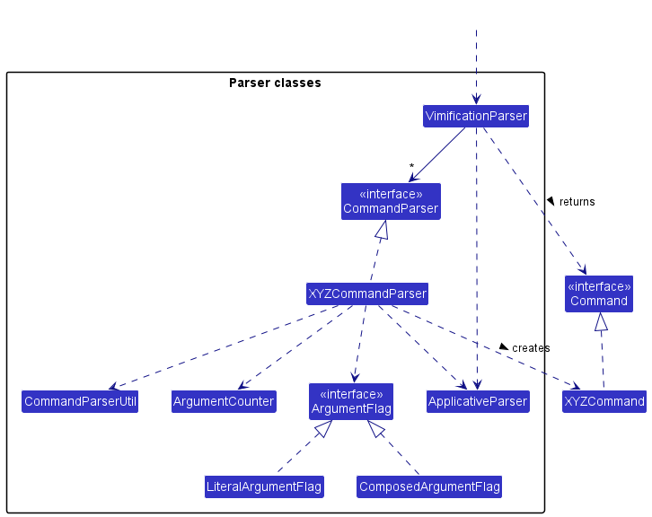

* Table of Contents
{:toc}

--------------------------------------------------------------------------------------------------------------------

## **Acknowledgements**

* Our application is based on the [AB3](https://se-education.org/addressbook-level3/) project created by the [SE-EDU initiative](https://se-education.org/)
* Our application makes use of [JavaFX](https://openjfx.io/) as the UI framework.

--------------------------------------------------------------------------------------------------------------------

## **Setting up, getting started**

Refer to the guide [_Setting up and getting started_](SettingUp.md).

--------------------------------------------------------------------------------------------------------------------

## **Design**

:bulb: **Tip:** The `.puml` files used to create diagrams in this document can be found in the [diagrams](https://github.com/AY2223S2-CS2103T-W11-3/tp/tree/master/docs/diagrams) folder. Refer to the [_PlantUML Tutorial_ at se-edu/guides](https://se-education.org/guides/tutorials/plantUml.html) to learn how to create and edit diagrams.

### Architecture

The ***Architecture Diagram*** given above explains the high-level design of the App.

Given below is a quick overview of main components and how they interact with each other.

**Main components of the architecture**

**`Main`** has two classes called [`Main`](https://github.com/AY2223S2-CS2103T-W11-3/tp/blob/master/src/main/java/seedu/address/Main.java) and [`MainApp`](https://github.com/AY2223S2-CS2103T-W11-3/tp/blob/master/src/main/java/seedu/address/MainApp.java). It is responsible for,
* At app launch: Initializes the components in the correct sequence, and connects them up with each other.
* At shut down: Shuts down the components and invokes cleanup methods where necessary.

[**`Commons`**](#common-classes) represents a collection of classes used by multiple other components.

The rest of the App consists of four components.

* [**`UI`**](#ui-component): The UI of the App.
* [**`Logic`**](#logic-component): The command executor.
* [**`Model`**](#model-component): Holds the data of the App in memory.
* [**`Storage`**](#storage-component): Reads data from, and writes data to, the hard disk.

**How the architecture components interact with each other**

The *Sequence Diagram* below shows how the components interact with each other for the scenario where the user issues the command `delete 1`.

Each of the four main components (also shown in the diagram above),

* defines its *API* in an `interface` with the same name as the Component.
* implements its functionality using a concrete `{Component Name}Manager` class (which follows the corresponding API `interface` mentioned in the previous point.

For example, the `Logic` component defines its API in the `Logic.java` interface and implements its functionality using the `LogicManager.java` class which follows the `Logic` interface. Other components interact with a given component through its interface rather than the concrete class (reason: to prevent outside component's being coupled to the implementation of a component), as illustrated in the (partial) class diagram below.

The sections below give more details of each component.

### UI component

The **API** of this component is specified in [`Ui.java`](https://github.com/AY2223S2-CS2103T-W11-3/tp/blob/master/src/main/java/seedu/address/ui/Ui.java)

The UI consists of a `MainWindow` that is made up of parts e.g.`CommandBox`, `ResultDisplay`, `PersonListPanel`, `StatusBarFooter` etc. All these, including the `MainWindow`, inherit from the abstract `UiPart` class which captures the commonalities between classes that represent parts of the visible GUI.

The `UI` component uses the JavaFx UI framework. The layout of these UI parts are defined in matching `.fxml` files that are in the `src/main/resources/view` folder. For example, the layout of the [`MainWindow`](https://github.com/se-edu/addressbook-level3/tree/master/src/main/java/seedu/address/ui/MainWindow.java) is specified in [`MainWindow.fxml`](https://github.com/se-edu/addressbook-level3/tree/master/src/main/resources/view/MainWindow.fxml)

The `UI` component,

* executes user commands using the `Logic` component.
* listens for changes to `Model` data so that the UI can be updated with the modified data.
* keeps a reference to the `Logic` component, because the `UI` relies on the `Logic` to execute commands.
* depends on some classes in the `Model` component, as it displays `Card` object residing in the `Model`.

### Logic component

**API** : [`Logic.java`](https://github.com/AY2223S2-CS2103T-W11-3/tp/blob/master/src/main/java/seedu/address/logic/Logic.java)

Here's a (partial) class diagram of the `Logic` component:

How the `Logic` component works:
1. When `Logic` is called upon to execute a  command, it uses the `MasterDeckParser` class (more precisely, a method within `MasterDeckParser` which depends on the current mode of the application) to parse the user command.
2. This results in a `Command` object (more precisely, an object of one of its subclasses e.g., `AddCommand`) which is executed by the `LogicManager`.
3. The command can communicate with the `Model` when it is executed (e.g. to add a card).
4. The result of the command execution is encapsulated as a `CommandResult` object which is returned back from `Logic`.

The Sequence Diagram below illustrates the interactions within the `Logic` component for the `execute("delete 1")` API call.

:information_source: **Note:** The lifeline for `DeleteCommandParser` should end at the destroy marker (X) but due to a limitation of PlantUML, the lifeline reaches the end of diagram.

Here are the other classes in `Logic` (omitted from the class diagram above) that are used for parsing a user command:

How the parsing works:
* When called upon to parse a user command, the `MasterDeckParser` class parse the command differently based on the current mode (MAIN, DECK, REVIEW) of the application and creates an `XYZCommandParser` (`XYZ` is a placeholder for the specific command name e.g., `AddCommandParser`) which uses the other classes shown above to parse the user command and create a `XYZCommand` object (e.g., `AddCommand`) which the `MasterDeckParser` returns back as a `Command` object.
* All `XYZCommandParser` classes (e.g., `AddCommandParser`, `DeleteCommandParser`, ...) inherit from the `Parser` interface so that they can be treated similarly where possible e.g, during testing.

### Model component
**API** : [`Model.java`](https://github.com/se-edu/addressbook-level3/tree/master/src/main/java/seedu/address/model/Model.java)

The `Model` component,

* stores the master deck data i.e., all `Card` objects (which are contained in a `UniqueCardList` object) and all `Deck` objects (which are contained in a `UniqueDeckList` object).
* stores the currently 'selected' `Card` objects (e.g., results of a selecting a deck) as a separate _filtered_ list which is exposed to outsiders as an unmodifiable `ObservableList<Card>` that can be 'observed' e.g. the UI can be bound to this list so that the UI automatically updates when the data in the list change.
* stores the currently 'selected' `Deck` objects (e.g., results of a search query) as a separate _filtered_ list which is exposed to outsiders as an unmodifiable `ObservableList<Deck>` that can be 'observed' e.g. the UI can be bound to this list so that the UI automatically updates when the data in the list change.
* stores a `UserPref` object that represents the user’s preferences. This is exposed to the outside as a `ReadOnlyUserPref` objects.
* does not depend on any of the other three components (as the `Model` represents data entities of the domain, they should make sense on their own without depending on other components)

Each `Card` object,
* stores one `Question`, one `Answer`, one 'Deck' which the `Card` object references from the `Deck` list, and one optional `Tag`.

[//]: # (
:information_source: **Note:** An alternative &#40;arguably, a more OOP&#41; model is given below. It has a `Tag` list in the `MasterDeck`, which `Card` references. This allows `MasterDeck` to only require one `Tag` object per unique tag, instead of each `Card` needing their own `Tag` objects. )

[//]: # ()
[//]: # ()

[//]: # ()
[//]: # (
)

### Storage component

**API** : [`Storage.java`](https://github.com/AY2223S2-CS2103T-W11-3/tp/blob/master/src/main/java/seedu/address/storage/Storage.java)

The `Storage` component,
* can save both master deck data and user preference data in json format, and read them back into corresponding objects.
* inherits from both `MasterDeckStorage` and `UserPrefStorage`, which means it can be treated as either one (if only the functionality of only one is needed).
* depends on some classes in the `Model` component (because the `Storage` component's job is to save/retrieve objects that belong to the `Model`)

### Common classes

Classes used by multiple components are in the `seedu.addressbook.commons` package.

--------------------------------------------------------------------------------------------------------------------

## **Implementation**

This section describes some noteworthy details on how certain features are implemented.

### Implementation of Commands based on Application's Mode
The following activity diagram summarises how the application handles a new user command:

The rake symbol (in the Check validity of command action above) is used to show that the action is described in another subsidiary activity diagram elsewhere. That diagram is given below.

#### Activity: Check validity of command 

### Implementation of Main Mode Features

### Implementation of Card Mode Features

### Implementation of Review Mode Features

### \[Proposed\] Undo/redo feature

#### Proposed Implementation

The proposed undo/redo mechanism is facilitated by `VersionedAddressBook`. It extends `MasterDeck` with an undo/redo history, stored internally as an `addressBookStateList` and `currentStatePointer`. Additionally, it implements the following operations:

* `VersionedAddressBook#commit()` — Saves the current address book state in its history.
* `VersionedAddressBook#undo()` — Restores the previous address book state from its history.
* `VersionedAddressBook#redo()` — Restores a previously undone address book state from its history.

These operations are exposed in the `Model` interface as `Model#commitAddressBook()`, `Model#undoAddressBook()` and `Model#redoAddressBook()` respectively.

Given below is an example usage scenario and how the undo/redo mechanism behaves at each step.

Step 1. The user launches the application for the first time. The `VersionedAddressBook` will be initialized with the initial address book state, and the `currentStatePointer` pointing to that single address book state.

Step 2. The user executes `delete 5` command to delete the 5th card in the address book. The `delete` command calls `Model#commitAddressBook()`, causing the modified state of the address book after the `delete 5` command executes to be saved in the `addressBookStateList`, and the `currentStatePointer` is shifted to the newly inserted address book state.

Step 3. The user executes `add n/David …​` to add a new card. The `add` command also calls `Model#commitAddressBook()`, causing another modified address book state to be saved into the `addressBookStateList`.

:information_source: **Note:** If a command fails its execution, it will not call `Model#commitAddressBook()`, so the address book state will not be saved into the `addressBookStateList`.

Step 4. The user now decides that adding the card was a mistake, and decides to undo that action by executing the `undo` command. The `undo` command will call `Model#undoAddressBook()`, which will shift the `currentStatePointer` once to the left, pointing it to the previous address book state, and restores the address book to that state.

:information_source: **Note:** If the `currentStatePointer` is at index 0, pointing to the initial AddressBook state, then there are no previous AddressBook states to restore. The `undo` command uses `Model#canUndoAddressBook()` to check if this is the case. If so, it will return an error to the user rather
than attempting to perform the undo.

The following sequence diagram shows how the undo operation works:

:information_source: **Note:** The lifeline for `UndoCommand` should end at the destroy marker (X) but due to a limitation of PlantUML, the lifeline reaches the end of diagram.

The `redo` command does the opposite — it calls `Model#redoAddressBook()`, which shifts the `currentStatePointer` once to the right, pointing to the previously undone state, and restores the address book to that state.

:information_source: **Note:** If the `currentStatePointer` is at index `addressBookStateList.size() - 1`, pointing to the latest address book state, then there are no undone AddressBook states to restore. The `redo` command uses `Model#canRedoAddressBook()` to check if this is the case. If so, it will return an error to the user rather than attempting to perform the redo.

Step 5. The user then decides to execute the command `list`. Commands that do not modify the address book, such as `list`, will usually not call `Model#commitAddressBook()`, `Model#undoAddressBook()` or `Model#redoAddressBook()`. Thus, the `addressBookStateList` remains unchanged.

Step 6. The user executes `clear`, which calls `Model#commitAddressBook()`. Since the `currentStatePointer` is not pointing at the end of the `addressBookStateList`, all address book states after the `currentStatePointer` will be purged. Reason: It no longer makes sense to redo the `add n/David …​` command. This is the behavior that most modern desktop applications follow.

The following activity diagram summarizes what happens when a user executes a new command:

#### Design considerations:

**Aspect: How undo & redo executes:**

* **Alternative 1 (current choice):** Saves the entire address book.
  * Pros: Easy to implement.
  * Cons: May have performance issues in terms of memory usage.

* **Alternative 2:** Individual command knows how to undo/redo by
  itself.
  * Pros: Will use less memory (e.g. for `delete`, just save the card being deleted).
  * Cons: We must ensure that the implementation of each individual command are correct.

_{more aspects and alternatives to be added}_

### \[Proposed\] Data archiving

_{Explain here how the data archiving feature will be implemented}_

--------------------------------------------------------------------------------------------------------------------

## **Documentation, logging, testing, configuration, dev-ops**

* [Documentation guide](Documentation.md)
* [Testing guide](Testing.md)
* [Logging guide](Logging.md)
* [Configuration guide](Configuration.md)
* [DevOps guide](DevOps.md)

--------------------------------------------------------------------------------------------------------------------

## **Appendix: Requirements**

### Product scope

**Target user profile**:

* Needs to study a group of terms and definitions efficiently
* prefer desktop apps over other types
* can type fast
* prefers typing to mouse interactions
* is reasonably comfortable using CLI apps

**Value proposition**: study various topics using flashcards on the computer

### User stories

Priorities: High (must have) - `* * *`, Medium (nice to have) - `* *`, Low (unlikely to have) - `*`

| Priority | As a …​  | I want to …​                                                                               | So that I can…​                                        |
|----------|----------|--------------------------------------------------------------------------------------------|--------------------------------------------------------|
| `* * *`  | new user | see usage instructions                                                                     | refer to instructions when I forget how to use the App |
| `Epic`   | user     | **manage PowerCards**                                                                      ||
| `* * *`  | user     | create a new PowerCard with a question and answer pair                                     ||
| `* *`    | user     | search for PowerCards using keywords in the questions                                      ||
| `* *`    | user     | rewrite the question or the answer in the PowerCard                                        ||
| `Epic`   | user     | **group PowerCards into decks of the same topic**                                          ||
| `* * *`  | user     | set the name of a masterDeck                                                               ||
| `* * *`  | user     | list all decks I have created                                                              ||
| `* * *`  | user     | list all the PowerCards in a masterDeck                                                    ||
| `* * *`  | user     | add PowerCards in a masterDeck                                                             ||
| `* * *`  | user     | remove PowerCards in a masterDeck                                                          ||
| `* *`    | user     | rename a masterDeck                                                                        ||
| `* *`    | user     | delete a masterDeck                                                                        ||
| `* *`    | user     | add the description of each masterDeck                                                     | I can check later what this masterDeck is about.       |
| `Epic`   | user     | **review decks of PowerCards**                                                             ||
| `* * *`  | user     | review a single masterDeck of PowerCards                                                   | I can test my knowledge of the topic                   |
| `* * *`  | user     | mark a flash card to be correct / wrong during review                                      ||
| `* *`    | user     | review multiple decks of PowerCards                                                        | I can test my knowledge of multiple topics             |
| `* *`    | user     | see how many PowerCards I have left to review in one masterDeck                            ||
| `Epic`   | user     | **keep track of how effective my learning has been**                                       ||
| `* *`    | user     | record the number of questions I got right                                                 | I can see my progress                                  |
| `* *`    | user     | see which are the PowerCards I struggle with / succeed at                                  ||
| `*`      | user     | see which topics (decks) I am stronger / weaker in                                         ||
| `*`      | user     | see how many times I have reviewed a PowerCard or masterDeck                               ||
| `*`      | user     | see how long I spent on each question during review                                        ||
| `*`      | user     | revise PowerCards that I got wrong for                                                     | I can see what I’m weak at                             |
| `* *`    | user     | reset the statistics                                                                       ||
| `Epic`   | user     | **share and receive decks from my friends**                                                ||
| `* * *`  | user     | import decks from other users.                                                             ||
| `* * *`  | user     | export decks for other users.                                                              ||
| `Epic`   | user     | **undo and redo changes I make**                                                           ||
| `*`      | user     | retrieve a masterDeck or flash card should I accidentally delete a PowerCard or masterDeck ||
| `*`      | user     | redo changes that I had undone.                                                            ||
| `Epic`   | user     | **adjust the frequency of certain PowerCards appearing based on my input**                 ||
| `* *`    | user     | tag PowerCards that are hard                                                               | they will appear more frequently                       |
| `* *`    | user     | tag PowerCards that are easy                                                               | they will appear less frequently                       |

### Use cases

For all use cases below, the **System** is the `Powercard` and the **Actor** is the `user`, unless specified otherwise.

**Use case: UC1 - Add a powerdeck**

**MSS:**

1. User requests to create a new deck with a specified name.
2. System creates a new deck with the given name.   

   Use case ends.

**Use case: UC2 - Select a powerdeck**

**MSS:**
1. User chooses a deck to add powercard to.
2. System enters the chosen deck and shows cards in that deck.

   Use case ends.

**Use case: UC - Add a powercard**

**MSS:**
1. User <u>selects a powerdeck (UC2)</u> to add powercard to.
2. User enters the question and answer details for the card.
3. System adds the card to the chosen deck.

   Steps 3-4 are repeated for as many times as required until the User finishes adding more cards to the deck.
   
   Use case ends.

**Use case: UC - Delete a powercard**

**MSS:**

1. User <u>selects a powerdeck (UC2)</u> to delete powercard from.
2. User requests to delete a specific powercard in the deck.
3. System deletes the powercard.  

  Use case ends.

**Extensions:**

* 2a. The list is empty.  
       
  Use case ends.

* 3a1. System shows an error message.  

  Use case resumes at step 2.

**Use case: UC - Find a powercard**

**MSS:**

1. User requests to find powercards containing a certain string in the question.
2. System shows a list of cards matching the query.

   Use case ends.

**Extensions:**

* 2a. There are no powercards the match the query.    
  
  Use case ends.

**Use case: UC - Review  a deck**

**MSS:**

1. User requests to review a particular deck
2. Application shows a random, non-repeating card in the deck
3. User attempts to answer the question in the card.
4. Application reveals the answer to the powercard.
5. User self-grades question as easy/medium/difficult.  
   Repeat step 2-5 until all powercards in deck have been exhausted.

   Use case ends.

**Extensions:**

* 1a. There are no decks with the name requested by the user.  
  Use case ends.

* *a. User decides to end the review early.  
  * *a1. User requests to end the review session.  
  * *a2. Powercard ends the session and brings the user back to the area before the review started.  
    Use case ends.

### Non-Functional Requirements

1. Should work on any _mainstream OS_ as long as it has Java `11` or above installed.
2. Should be able to hold up to 1000 Powercards without a noticeable sluggishness in performance for typical usage.
3. A Powercard should load when prompted without any noticeable lag
4. Every command should provide a response within 2 seconds
5. The Powercard program is not expected to determine the correctness of the user’s response
6. A Powercard should be easily added/deleted in less than 3 commands after opening the program
7. The data stored by Powercard should be forward compatible such that old data can still be loaded in newer versions of the program
8. The maximum character limit of a powercard text should be [TO BE DETERMINED]
*{More to be added}*

### Glossary

* **Mainstream OS**: Windows, Linux, Unix, OS-X
* **Deck**: A group of PowerCards (flashcards) of a specific topic
*{More to be added}*

--------------------------------------------------------------------------------------------------------------------

## **Appendix: Instructions for manual testing**

Given below are instructions to test the app manually.

:information_source: **Note:** These instructions only provide a starting point for testers to work on;
testers are expected to do more *exploratory* testing.

### Launch and shutdown

1. Initial launch

   1. Download the jar file and copy into an empty folder

   1. Double-click the jar file Expected: Shows the GUI with a set of sample contacts. The window size may not be optimum.

1. Saving window preferences

   1. Resize the window to an optimum size. Move the window to a different location. Close the window.

   1. Re-launch the app by double-clicking the jar file. 
       Expected: The most recent window size and location is retained.

1. _{ more test cases …​ }_

### Deleting a card

1. Deleting a card while all cards are being shown

   1. Prerequisites: List all cards using the `list` command. Multiple cards in the list.

   1. Test case: `delete 1` 
      Expected: First contact is deleted from the list. Details of the deleted contact shown in the status message. Timestamp in the status bar is updated.

   1. Test case: `delete 0` 
      Expected: No card is deleted. Error details shown in the status message. Status bar remains the same.

   1. Other incorrect delete commands to try: `delete`, `delete x`, `...` (where x is larger than the list size) 
      Expected: Similar to previous.

1. _{ more test cases …​ }_

### Saving data

1. Dealing with missing/corrupted data files

   1. _{explain how to simulate a missing/corrupted file, and the expected behavior}_

1. _{ more test cases …​ }_
