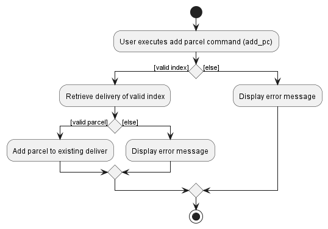
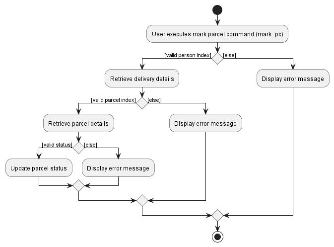
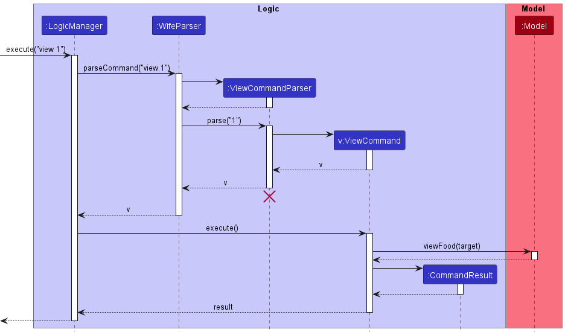

* Table of Contents
{:toc}

--------------------------------------------------------------------------------------------------------------------

## **Acknowledgements**

* This project is based on the [AddressBook-Level3 project](https://se-education.org/addressbook-level3/) created by the [SE-EDU initiative](https://se-education.org/). 
* {list here sources of all reused/adapted ideas, code, documentation, and third-party libraries -- include links to the original source as well}

--------------------------------------------------------------------------------------------------------------------

## **Setting up, getting started**

Refer to the guide [_Setting up and getting started_](SettingUp.md).

--------------------------------------------------------------------------------------------------------------------

## **Design**

:bulb: **Tip:** The `.puml` files used to create diagrams in this document can be found in the [diagrams](https://github.com/AY2223S2-CS2103-W16-1/tp/tree/master/docs/diagrams) folder. Refer to the [_PlantUML Tutorial_ at se-edu/guides](https://se-education.org/guides/tutorials/plantUml.html) to learn how to create and edit diagrams.

### Architecture

The ***Architecture Diagram*** given above explains the high-level design of the App.

Given below is a quick overview of main components and how they interact with each other.

**Main components of the architecture**

**`Main`** has two classes called [`Main`](https://github.com/AY2223S2-CS2103-W16-1/tp/blob/master/src/main/java/bookopedia/Main.java) and [`MainApp`](https://github.com/AY2223S2-CS2103-W16-1/tp/blob/master/src/main/java/bookopedia/MainApp.java). It is responsible for,
* At app launch: Initializes the components in the correct sequence, and connects them up with each other.
* At shut down: Shuts down the components and invokes cleanup methods where necessary.

[**`Commons`**](#common-classes) represents a collection of classes used by multiple other components.

The rest of the App consists of four components.

* [**`UI`**](#ui-component): The UI of the App.
* [**`Logic`**](#logic-component): The command executor.
* [**`Model`**](#model-component): Holds the data of the App in memory.
* [**`Storage`**](#storage-component): Reads data from, and writes data to, the hard disk.

**How the architecture components interact with each other**

The *Sequence Diagram* below shows how the components interact with each other for the scenario where the user issues the command `delete 1`.

Each of the four main components (also shown in the diagram above),

* defines its *API* in an `interface` with the same name as the Component.
* implements its functionality using a concrete `{Component Name}Manager` class (which follows the corresponding API `interface` mentioned in the previous point.

For example, the `Logic` component defines its API in the `Logic.java` interface and implements its functionality using the `LogicManager.java` class which follows the `Logic` interface. Other components interact with a given component through its interface rather than the concrete class (reason: to prevent outside component's being coupled to the implementation of a component), as illustrated in the (partial) class diagram below.

The sections below give more details of each component.

### UI component

The **API** of this component is specified in [`Ui.java`](https://github.com/AY2223S2-CS2103-W16-1/tp/blob/master/src/main/java/bookopedia/ui/Ui.java)

The UI consists of a `MainWindow` that is made up of parts e.g.`CommandBox`, `ResultDisplay`, `PersonListPanel`, `StatusBarFooter` etc. All these, including the `MainWindow`, inherit from the abstract `UiPart` class which captures the commonalities between classes that represent parts of the visible GUI.

The `UI` component uses the JavaFx UI framework. The layout of these UI parts are defined in matching `.fxml` files that are in the `src/main/resources/view` folder. For example, the layout of the [`MainWindow`](https://github.com/AY2223S2-CS2103-W16-1/tp/blob/master/src/main/java/bookopedia/ui/MainWindow.java) is specified in [`MainWindow.fxml`](https://github.com/AY2223S2-CS2103-W16-1/tp/blob/master/src/main/resources/view/MainWindow.fxml)

The `UI` component,

* executes user commands using the `Logic` component.
* listens for changes to `Model` data so that the UI can be updated with the modified data.
* keeps a reference to the `Logic` component, because the `UI` relies on the `Logic` to execute commands.
* depends on some classes in the `Model` component, as it displays `Person` object residing in the `Model`.

### Logic component

**API** : [`Logic.java`](https://github.com/AY2223S2-CS2103-W16-1/tp/blob/master/src/main/java/bookopedia/logic/Logic.java)

Here's a (partial) class diagram of the `Logic` component:

How the `Logic` component works:
1. When `Logic` is called upon to execute a command, it uses the `AddressBookParser` class to parse the user command.
1. This results in a `Command` object (more precisely, an object of one of its subclasses e.g., `AddCommand`) which is executed by the `LogicManager`.
1. The command can communicate with the `Model` when it is executed (e.g. to add a person).
1. The result of the command execution is encapsulated as a `CommandResult` object which is returned back from `Logic`.

The Sequence Diagram below illustrates the interactions within the `Logic` component for the `execute("delete 1")` API call.

:information_source: **Note:** The lifeline for `DeleteCommandParser` should end at the destroy marker (X) but due to a limitation of PlantUML, the lifeline reaches the end of diagram.

Here are the other classes in `Logic` (omitted from the class diagram above) that are used for parsing a user command:

How the parsing works:
* When called upon to parse a user command, the `AddressBookParser` class creates an `XYZCommandParser` (`XYZ` is a placeholder for the specific command name e.g., `AddCommandParser`) which uses the other classes shown above to parse the user command and create a `XYZCommand` object (e.g., `AddCommand`) which the `AddressBookParser` returns back as a `Command` object.
* All `XYZCommandParser` classes (e.g., `AddCommandParser`, `DeleteCommandParser`, ...) inherit from the `Parser` interface so that they can be treated similarly where possible e.g, during testing.

### Model component
**API** : [`Model.java`](https://github.com/AY2223S2-CS2103-W16-1/tp/blob/master/src/main/java/bookopedia/model/Model.java)

The `Model` component,

* stores the address book data i.e., all `Person` objects (which are contained in a `UniquePersonList` object).
* stores the currently 'selected' `Person` objects (e.g., results of a search query) as a separate _filtered_ list which is exposed to outsiders as an unmodifiable `ObservableList<Person>` that can be 'observed' e.g. the UI can be bound to this list so that the UI automatically updates when the data in the list change.
* stores a `UserPref` object that represents the user’s preferences. This is exposed to the outside as a `ReadOnlyUserPref` objects.
* does not depend on any of the other three components (as the `Model` represents data entities of the domain, they should make sense on their own without depending on other components)

:information_source: **Note:** An alternative (arguably, a more OOP) model is given below. It has a `Tag` list in the `AddressBook`, which `Person` references. This allows `AddressBook` to only require one `Tag` object per unique tag, instead of each `Person` needing their own `Tag` objects. 

### Storage component

**API** : [`Storage.java`](https://github.com/AY2223S2-CS2103-W16-1/tp/blob/master/src/main/java/bookopedia/storage/Storage.java)

The `Storage` component,
* can save both address book data and user preference data in json format, and read them back into corresponding objects.
* inherits from both `AddressBookStorage` and `UserPrefStorage`, which means it can be treated as either one (if only the functionality of only one is needed).
* depends on some classes in the `Model` component (because the `Storage` component's job is to save/retrieve objects that belong to the `Model`)

### Common classes

Classes used by multiple components are in the `bookopedia.commons` package.

--------------------------------------------------------------------------------------------------------------------

## **Implementation**

This section describes some noteworthy details on how certain features are implemented.

### Mark delivery feature

#### Implementation details

The mark delivery feature is supported by `DeliveryStatus` enumerable that represents the possible delivery statuses:
- DONE (delivery that has been completed)
- OTW (delivery that is in progress)
- FAILED (delivery that failed to deliver)
- PENDING (delivery that is still pending)

A new command argument prefix, `s/`, is assigned to capture delivery status argument. The argument has to be either lowercase or uppercase of the aforementioned statuses.

The `Person` class will have an attribute `deliveryStatus` of type `DeliveryStatus` to indicate the status of the delivery.

The `MarkCommand` will update the delivery status of the target `Person` with the aforementioned statuses. Before `MarkCommand` is created, `MarkCommandParser` checks if the command arguments are of the correct format. The command requires both the index and the status. `MarkCommand` will then be executed: it will first get the current address book list, get the target person at the index, create a copy of the person with the new status, and then replacing the target person with its new copy.

The following activity diagram summarizes what happens when a user executes the mark delivery command.

The following sequence diagram shows the interaction between the objects when a user executes the mark delivery command.

#### Design Considerations

- **Alternative 1**:
  - Add `DeliveryStatus` as `Parcel`'s attribute
    - May be too complicated for user's understanding, hence kept it simple 
    - Delivery rider delivers all parcels at one go for a recipient
- **Alternative 2** _(implemented)_:
  - Add `DeliveryStatus` as `Person`'s attribute
    - Mark all parcels under a person as delivered in one go
    - Simple for the user to understand and easy to implement for the developer

### Add Parcel to Delivery feature

#### Implementation Details
The adding of a parcel uses a new command argument prefix, `pc/`, to capture the parcel's name.

The `AddParcelCommand` will add in a new `Parcel` to the target `Person` indicated by the given user index.
Before `AddParcelCommand` is created, `AddParcelCommandParser` checks if the command arguments are of the correct format, `AddParcelCommand` requires the person index and the parcel.
`AddParcelCommand` will then be executed: it will first retrieve the current address book list, get the target person at the given index, create a copy of the person with the newly added parcel, and then replacing the target person with its new copy.

The following activity diagram summarizes what happens when a user tries to add a parcel to an existing delivery.

The following sequence diagram shows the interaction between the objects when a user executes the add parcel command - `add_pc 1 pc/lazada`.

#### Design Considerations
**Aspect: Number of parcel(s) to be added in each command**
* **Alternative 1 (current choice):** 1 parcel at a time
    * Pros: Easy to implement, less prone to errors
    * Cons: A little more troublesome for users to repeatedly type `add_pc` each time
* **Alternative 2:** Allowing multiple parcels to be added at a time
    * Pros: Seems more convenient for user as command line `add_pc` will not need to be repeated
    * Cons: More prone to user errors

### Mark Parcel feature
#### Implementation Details
The mark parcel feature is supported by `ParcelStatus` enumerable that represents the possible parcel statuses:
- FRAGILE (parcel that needs to be handled with care)
- BULKY (parcel that needs to be handled with extra assistance e.g. trolley)
- _More types of statuses can be added in the future_

The command argument prefix, `pc/` is now used to capture the parcel's index of the target person.

Additionally, `s/`,  is used to capture the parcel status argument.
The argument can either be lowercase or uppercase of the aforementioned statuses.

The `Parcel` class will have variables `isFragile` and `isBulky`  to indicate the status of the parcel, as a parcel can take up any number of statuses (>= 0).

The `MarkParcelCommand` will update the statuses of the target `Parcel` of the target `Person` with the aforementioned statuses. 
Before `MarkParcelCommand` is created, `MarkParcelCommandParser` checks if the command arguments are of the correct format, `MarkParcelCommand` requires the person index, parcel index and the status.
`MarkParcelCommand` will then be executed: it will first retrieve the current address book list, get the target parcel of the target person, create a copy of the person with the new updated parcel, and then replacing the target person with its new copy.

The following activity diagram summarizes what happens when a user tries to mark a parcel.

The following sequence diagram shows the interaction between the objects when a user executes the mark parcel command - `mark_pc 1 pc/1 s/fragile`.

#### Design Considerations
**Aspect: Method to choose which parcel to be marked**
* **Alternative 1:** Name of parcel
    * Pros: Easier to implement as parcel can be immediately found based off name
    * Cons: More prone to user errors
* **Alternative 2 (current choice):** Index of parcel
    * Pros: Less prone to user errors, as the full name of parcel do not have to be typed out
    * Cons: Harder to implement as will have to keep track of parcel list for each person

**Aspect: Number of statuses a parcel can have**
* **Alternative 1: Each parcel only have one status** 
    * Pros: Easier to implement with the use of `ParcelStatus` enumerable only
    * Cons: In reality, a parcel can have more than one status (e.g. a parcel can be both bulky and fragile at the same time)
* **Alternative 2 (current choice): Each parcel only have any number of statuses** 
    * Pros: A parcel can now have more than one status
    * Cons: Harder to implement as just using the `ParcelStatus` enumerable won't suffice

### View Delivery feature
#### Implementation Details
The feature is implemented by making use of the `Index` class to select a recipient of choice from the list of person that is part of the `Model` component.

The `ViewCommand` will display all the delivery details (i.e. parcels, address, contact information, etc.) of the selected recipient under the `CommandResult` class.

The following partial sequence diagram will show how the view delivery feature is implemented

#### Design Considerations
**Aspect: The method to select recipient**
* **Alternative 1 (current choice):** Use the `Index` class to select recipient from the list
    * Pros: Easy to implement, `Index` for each person is unique
    * Cons: Have to execute `ListCommand` to obtain `Index` of recipient of interest
* **Alternative 2:** Use the name of the recipient to select
    * Pros: Physical parcels have the names of recipient on it, making it easy to locate the delivery details of said person
    * Cons: Names may not be unique, it is possible to obtain the wrong delivery details

### Sort feature
#### Implementation Details
The sort feature has been implemented to enable users to organize and arrange the delivery list ordered by `Delivery Status`.

The `SortCommand` invokes a sorting on the current list of deliveries and subsequently displays the newly sorted list. 

The following partial sequence diagram will show how the view delivery feature is implemented

The implementation of the sort feature involves the following steps:
1. **Identify the data:**
   * The data to be sorted is the list of persons that is part of the `Model` component.
2. **Sorting criteria:**
   * The list is sorted according to the Delivery Status of each entry in ascending order.
   * Ordering: `PENDING` < `OTW` < `DONE` < `FAILED`
   * Entries with the same Delivery Status are sorted in ascending alphabetical order of name.
3. **Invoke sort:**
   * The list being stored in the `Model` component is sorted and replaces the previous list.
4. **Displaying the sorted data:**
   * As the sort command automatically replaces the previous list with the newly sorted list,
   the address book being shown to the User is always updated.

#### Design Considerations
**Aspect: How to specify sorting criteria**
* **Alternative 1 (current choice):** Predefines the sorting criteria to Delivery Status
    * Pros: Easy to implement, there is already a defined ordering for Delivery Status
    * Cons: Limits functionality of the sort command
* **Alternative 2:** User specifies sorting criteria when typing the command
    * Pros: Gives the user higher functionality by allowing the user to sort the list of deliveries in various orderings.
    * Cons: Parsing the user specified sorting criteria is difficult to implement and unnecessarily complicates the logic.

--------------------------------------------------------------------------------------------------------------------

## **Documentation, logging, testing, configuration, dev-ops**

* [Documentation guide](Documentation.md)
* [Testing guide](Testing.md)
* [Logging guide](Logging.md)
* [Configuration guide](Configuration.md)
* [DevOps guide](DevOps.md)

--------------------------------------------------------------------------------------------------------------------

## **Appendix: Requirements**

### Product scope

**Target user profile**:

* has a need to manage a significant number of deliveries 
* requires the ability to track, monitor and update the status of deliveries
* shows a preference for desktop applications
* has proficient typing skills
* prefers typing to mouse-based interactions
* is reasonably comfortable using CLI apps

**Value proposition**: optimize delivery management through an application that utilizes CLI commands,
providing a more efficient alternative to conventional mouse-driven GUI applications.

### User stories

Priorities: High (must have) - `* * *`, Medium (nice to have) - `* *`, Low (unlikely to have) - `*`

| Priority | As a …​                              | I want to …​                                                       | So that I can…​                                                                    |
|----------|--------------------------------------|--------------------------------------------------------------------|------------------------------------------------------------------------------------|
| `* * *`  | parcel delivery rider (basic)        | view all my deliveries                                             | I can view my future deliveries as well                                            |
| `* * *`  | parcel delivery rider (basic)        | view a specific delivery                                           | I can view the details of the delivery                                             |
| `* * *`  | parcel delivery rider (basic)        | delete a delivery                                                  | I can delete the delivery if I input it wrongly                                    |
| `* * *`  | parcel delivery rider (basic)        | add deliveries                                                     | I can add new delivery jobs                                                        |
| `* * *`  | parcel delivery rider (basic)        | mark a delivery in progress                                        | I can keep track of which deliveries is in progress                                |
| `* * *`  | parcel delivery rider (basic)        | mark a delivery as done                                            | I can keep track of which deliveries are done                                      |
| `* * *`  | parcel delivery rider (basic)        | mark a delivery as failed                                          | I can keep track of which deliveries have failed to be delivered                   |
| `* * *`  | parcel delivery rider (basic)        | check what specific parcel I need to deliver to a specific address | I will delivery the correct parcel to the correct customers                        |
| `* * `   | parcel delivery rider (basic)        | add parcels to existing deliveries                                 | I do not have to recreate a delivery                                               |
| `* * `   | parcel delivery rider (basic)        | see the phone number of the customer                               | I can contact the customer if there is no response at the address                  |
| `* * `   | parcel delivery rider (basic)        | view the number of failed attempts                                 | I know which deliveries have multiple failed attempts                              |
| `* * `   | parcel delivery rider (intermediate) | see the weight of the parcels                                      | I can carry the appropriate amount of parcels                                      |
| `* * `   | parcel delivery rider (intermediate) | mark parcels as fragile                                            | I can be more careful for fragile parcels                                          |
| `* * `   | parcel delivery rider (intermediate) | mark parcels as bulky                                              | I can prepare trolleys to move parcels                                             |
| `* * `   | parcel delivery rider (expert)       | sort my deliveries by priority                                     | I know which deliveries I have to deliver first                                    |
| `* * `   | parcel delivery rider (expert)       | get and store customer's signature                                 | I can assure that the delivery has been successfully received by intended customer |
| `* * `   | parcel delivery rider (expert)       | take a picture and upload it to each delivery                      | I can verify that the delivery is completed                                        |

### Use cases

(For all use cases below, the **System** is the `Bookopedia` and the **Actor** is the `user`, unless specified otherwise)

**Use case: UC1 - Add Delivery**

**Guarantees:** New delivery is added

**MSS:**
1. User requests to add delivery along with the relevant details of delivery name and address
2. System adds the delivery

    Use case ends

**Extensions:**
* 1a. User inputs invalid details/address.

    * 1a1. System shows error message.

        Use case resumes at step 1.

**Use Case: UC2 - View Delivery**

**MSS:**
1. User request to see all deliveries
2. System shows all deliveries
3. User picks one delivery to view its remaining details
4. System shows the remaining details of the chosen delivery
    
    Use case ends

**Extensions:**
* 2a. There is no delivery in the system.

    Use case ends.
* 3a. The chosen delivery is invalid.

    * 3a1. System shows error message.
    
      Use case resumes at step 3.

**Use Case: UC3 - Mark Delivery**

**Guarantees:** Delivery is marked with the user given status

**MSS:**
1. User request to see all deliveries
2. System shows all deliveries
3. User request to mark a chosen delivery with the relevant status (i.e. In Progress, Done, Failed)
4. System marks the delivery with user given status

    Use case ends

**Extensions:**
* 2a. There is no delivery in the system.
    
    Use case ends.
* 3a. User inputs invalid delivery status.
    * 3a1. System shows error message and list the valid statuses.
        
        Use case resumes at step 3.
* 3b. User chose an invalid delivery.
    * 3b1. System shows error message

        Use case resumes at step 3.

**Use Case: UC4 - Delete Delivery**

**Preconditions:** At least one delivery is currently stored in Bookopedia

**Guarantees:** Removal of a specified delivery

**MSS:**
1. User request to see all deliveries
2. System shows all deliveries
3. User choose a delivery to delete
4. System deletes chosen delivery

    Use case ends

**Extensions:**
* 2a. There is no delivery in the system.

  Use case ends.
* 3a. User chose an invalid delivery.
    * 3a1. System shows error message

        Use case resumes at step 3.

**Use Case: UC5 - List All Deliveries**

**MSS:**
1. User request to see all deliveries
2. System shows all deliveries

    Use case ends

**Extensions:**
* 2a. There is no delivery in the system.

    Use case ends

**Use Case: UC6 - Add Parcel to Delivery**

**Preconditions:** At least one delivery is currently stored in Bookopedia

**Guarantees:** New parcel will be added to existing delivery

**MSS:**
1. User request to see all deliveries
2. System shows all deliveries
3. User choose a delivery to add parcel with parcel name
4. System adds parcel to existing chosen delivery

   Use case ends

**Extensions:**
* 2a. There is no delivery in the system.

  Use case ends

**Use Case: UC7 - Sort Deliveries**

**Guarantees:** Delivery List will be sorted according to Delivery Status of each entry in ascending order.

**MSS:**
1. User request to sort list
2. System sorts list
3. System displays sorted list

    Use Case ends

**Use Case: UC8 - Mark Parcel**

**Guarantees:** A parcel is marked with the user given status

**MSS:**
1. User request to see all deliveries
2. System shows all deliveries
3. User request to mark a chosen parcel from an existing delivery with the relevant status (i.e. Fragile, Bulky)
4. System marks the parcel with user given status

   Use case ends

**Extensions:**
* 2a. There is no delivery in the system.

  Use case ends.
* 3a. User inputs invalid parcel status.
    * 3a1. System shows error message and list the valid statuses.

      Use case resumes at step 3.
* 3b. User chose an invalid delivery.
    * 3b1. System shows error message

      Use case resumes at step 3.
* 3c. User chose an invalid parcel.
    * 3c1. System shows error message

      Use case resumes at step 3.

### Non-Functional Requirements

1. Bookopedia should work on any _mainstream OS_ as long as it has Java `11` or above installed.
2. Bookopedia should be able to hold up to 50 deliveries without a noticeable sluggishness in performance for typical usage.
3. A user with above average typing speed for regular English text (i.e. not code, not system admin commands) should be able to accomplish most of the tasks faster using commands than using the mouse.
4. Bookopedia should work without requiring an installer.
5. Bookopedia should not depend on your own remote server.
6. Bookopedia should be packaged into a single _JAR_ file
7. The file size of the _JAR_ file should be reasonable and not exceed the limit of 100MB.
8. The _GUI_ should work well and usable under HD screens (1920x1080) at 100% scale.
9. A _DBMS_ should not be used to store data.
10. The data should be stored locally and should be in a human editable text file.
11. Bookopedia should be for a single user i.e. (not a multi-user product).
12. Bookopedia should respond to commands within 5s.

### Planned Enhancement
1. Upgrade the View Display into a ScrollPane to accommodate more parcels being added.
2. Wrapping the text in View Display to allow for more extreme inputs.
3. Ability to remove individual parcel from a delivery.
4. Ability to edit individual parcel from a delivery.
5. Ability to unmark a parcel status.

### Glossary

* **Mainstream OS**: Windows, Linux, Unix, OS-X
* **Private contact detail**: A contact detail that is not meant to be shared with others
* **MSS**: Main Success Scenario
* **JAR**: Java ARchive
* **GUI**: Graphical User Interface
* **DBMS**: Database Management System

--------------------------------------------------------------------------------------------------------------------

## **Appendix: Instructions for manual testing**

Given below are instructions to test the app manually.

:information_source: **Note:** These instructions only provide a starting point for testers to work on;
testers are expected to do more *exploratory* testing.

Refer to the [user guide](https://ay2223s2-cs2103-w16-1.github.io/tp/UserGuide.html#features) for more features to test.

### Launch and shutdown

1. Initial launch

   1. Download the jar file and copy into an empty folder

   1. Double-click the jar file Expected: Shows the GUI with a set of sample deliveries. The window size may not be optimum.

1. Saving window preferences

   1. Resize the window to an optimum size. Move the window to a different location. Close the window.

   1. Re-launch the app by double-clicking the jar file. 
       Expected: The most recent window size and location is retained.

1. Shutdown
   1. Use the `exit` command to shutdown Bookopedia.

### Adding a delivery
1. Adding a new delivery

   Test case: `add n/tester a/address` 
      Expected: Delivery is added to the list. Details of the newly added delivery shown in the status message.

2. Adding an existing delivery (continuing from previous test case)

   Test case: `add n/tester a/address` 
      Expected: No delivery is added. Error details shown in the status message.

3. Adding another new delivery (continuing from previous test cases)

   Test case: `add n/tester a/newaddress` 
      Expected: Delivery is added to the list. Details of the newly added delivery shown in the status message.

### Deleting a delivery
Deleting a delivery while all deliveries are being shown
   1. Prerequisites: List all deliveries using the `list` command. At least one delivery in the list.
   1. Test case: `delete 1` 
      Expected: First delivery is deleted from the list. Details of the deleted delivery shown in the status message.
   1. Test case: `delete 0` 
      Expected: No delivery is deleted. Error details shown in the status message.
   1. Other incorrect delete commands to try: `delete`, `delete x`, `...` (where x is larger than the list size) 
      Expected: No delivery is deleted. Error details shown in the status message.

### Saving data

Dealing with corrupted data file
1. In the data folder, corrupt the data file `bookopedia.json` by either adding in some random text or removing a chunk of the file
2. Launch Bookopedia as usual 
   Expected: Bookopedia will still run normally but **without any data**

Dealing with missing data file
1. Delete data file `bookopedia.json` found in the data folder
2. Launch Bookopedia as usual 
   Expected: Bookopedia will still run normally but with some **sample data**
   
