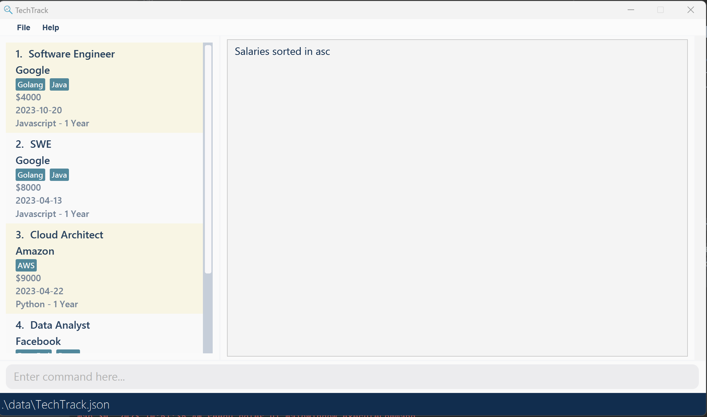
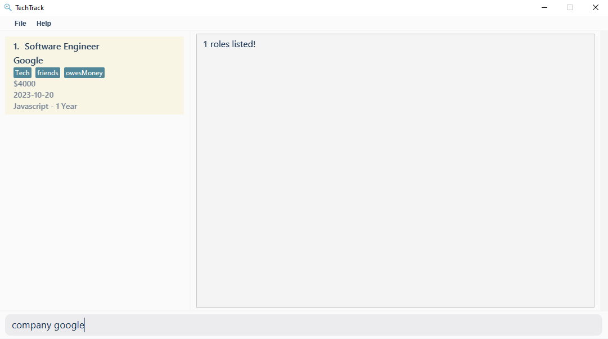
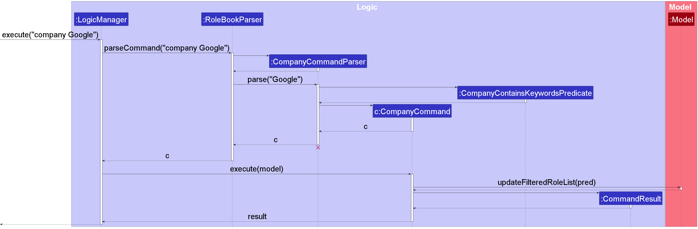

TechTrack is a software which helps students with internship search and optimizes their search progress. Computing
students are more familiar with and used to using CLI.

##### Table of Contents

Todo: Add links
1. [Acknowledgements]()
2. [Setting up, getting started]()
3. [Design]()
   1. [UI Component]()
   2. [Logic Component]()
   3. [Model Component]()
   4. [Storage Component]()
4. [Implementation]()

--------------------------------------------------------------------------------------------------------------------

## **Acknowledgements**

* {list here sources of all reused/adapted ideas, code, documentation, and third-party libraries -- include links to the
  original source as well}

--------------------------------------------------------------------------------------------------------------------

## **Setting up, getting started**

Refer to the guide [_Setting up and getting started_](SettingUp.md).

--------------------------------------------------------------------------------------------------------------------

## **Design**

:bulb: **Tip:** The `.puml` files used to create diagrams in this document can be found in
the [diagrams](https://github.com/se-edu/addressbook-level3/tree/master/docs/diagrams/) folder. Refer to the [_PlantUML
Tutorial_ at se-edu/guides](https://se-education.org/guides/tutorials/plantUml.html) to learn how to create and edit
diagrams.

### Architecture

The ***Architecture Diagram*** given above explains the high-level design of the App.

Given below is a quick overview of main components and how they interact with each other.

**Main components of the architecture**

**`Main`** has two classes
called [`Main`](https://github.com/se-edu/addressbook-level3/tree/master/src/main/java/seedu/address/Main.java)
and [`MainApp`](https://github.com/se-edu/addressbook-level3/tree/master/src/main/java/seedu/address/MainApp.java). It
is responsible for,

* At app launch: Initializes the components in the correct sequence, and connects them up with each other.
* At shut down: Shuts down the components and invokes cleanup methods where necessary.

[**`Commons`**](#common-classes) represents a collection of classes used by multiple other components.

The rest of the App consists of four components.

* [**`UI`**](#ui-component): The UI of the App.
* [**`Logic`**](#logic-component): The command executor.
* [**`Model`**](#model-component): Holds the data of the App in memory.
* [**`Storage`**](#storage-component): Reads data from, and writes data to, the hard disk.

**How the architecture components interact with each other**

The *Sequence Diagram* below shows how the components interact with each other for the scenario where the user issues
the command `delete 1`.

Each of the four main components (also shown in the diagram above),

* defines its *API* in an `interface` with the same name as the Component.
* implements its functionality using a concrete `{Component Name}Manager` class (which follows the corresponding
  API `interface` mentioned in the previous point.

For example, the `Logic` component defines its API in the `Logic.java` interface and implements its functionality using
the `LogicManager.java` class which follows the `Logic` interface. Other components interact with a given component
through its interface rather than the concrete class (reason: to prevent outside component's being coupled to the
implementation of a component), as illustrated in the (partial) class diagram below.

The sections below give more details of each component.

### UI component

The **API** of this component is specified
in [`Ui.java`](https://github.com/se-edu/addressbook-level3/tree/master/src/main/java/seedu/address/ui/Ui.java)

The UI consists of a `MainWindow` that is made up of parts e.g.`CommandBox`, `ResultDisplay`, `PersonListPanel`
, `StatusBarFooter` etc. All these, including the `MainWindow`, inherit from the abstract `UiPart` class which captures
the commonalities between classes that represent parts of the visible GUI.

The `UI` component uses the JavaFx UI framework. The layout of these UI parts are defined in matching `.fxml` files that
are in the `src/main/resources/view` folder. For example, the layout of
the [`MainWindow`](https://github.com/se-edu/addressbook-level3/tree/master/src/main/java/seedu/address/ui/MainWindow.java)
is specified
in [`MainWindow.fxml`](https://github.com/se-edu/addressbook-level3/tree/master/src/main/resources/view/MainWindow.fxml)

The `UI` component,

* executes user commands using the `Logic` component.
* listens for changes to `Model` data so that the UI can be updated with the modified data.
* keeps a reference to the `Logic` component, because the `UI` relies on the `Logic` to execute commands.
* depends on some classes in the `Model` component, as it displays `Person` object residing in the `Model`.

### Logic component

**
API** : [`Logic.java`](https://github.com/se-edu/addressbook-level3/tree/master/src/main/java/seedu/address/logic/Logic.java)

Here's a (partial) class diagram of the `Logic` component:

How the `Logic` component works:

1. When `Logic` is called upon to execute a command, it uses the `AddressBookParser` class to parse the user command.
1. This results in a `Command` object (more precisely, an object of one of its subclasses e.g., `AddCommand`) which is
   executed by the `LogicManager`.
1. The command can communicate with the `Model` when it is executed (e.g. to add a person).
1. The result of the command execution is encapsulated as a `CommandResult` object which is returned back from `Logic`.

The Sequence Diagram below illustrates the interactions within the `Logic` component for the `execute("delete 1")` API
call.

:information_source: **Note:** The lifeline for `DeleteCommandParser` should end at the destroy marker (X) but due to a limitation of PlantUML, the lifeline reaches the end of diagram.

Here are the other classes in `Logic` (omitted from the class diagram above) that are used for parsing a user command:

How the parsing works:

* When called upon to parse a user command, the `AddressBookParser` class creates an `XYZCommandParser` (`XYZ` is a
  placeholder for the specific command name e.g., `AddCommandParser`) which uses the other classes shown above to parse
  the user command and create a `XYZCommand` object (e.g., `AddCommand`) which the `AddressBookParser` returns back as
  a `Command` object.
* All `XYZCommandParser` classes (e.g., `AddCommandParser`, `DeleteCommandParser`, ...) inherit from the `Parser`
  interface so that they can be treated similarly where possible e.g, during testing.

### Model component

**
API** : [`Model.java`](https://github.com/se-edu/addressbook-level3/tree/master/src/main/java/seedu/address/model/Model.java)

The `Model` component,

* stores the address book data i.e., all `Person` objects (which are contained in a `UniquePersonList` object).
* stores the currently 'selected' `Person` objects (e.g., results of a search query) as a separate _filtered_ list which
  is exposed to outsiders as an unmodifiable `ObservableList<Person>` that can be 'observed' e.g. the UI can be bound to
  this list so that the UI automatically updates when the data in the list change.
* stores a `UserPref` object that represents the user’s preferences. This is exposed to the outside as
  a `ReadOnlyUserPref` objects.
* does not depend on any of the other three components (as the `Model` represents data entities of the domain, they
  should make sense on their own without depending on other components)

:information_source: **Note:** An alternative (arguably, a more OOP) model is given below. It has a `Tag` list in the `AddressBook`, which `Person` references. This allows `AddressBook` to only require one `Tag` object per unique tag, instead of each `Person` needing their own `Tag` objects. 

### Storage component

**
API** : [`Storage.java`](https://github.com/se-edu/addressbook-level3/tree/master/src/main/java/seedu/address/storage/Storage.java)

The `Storage` component,

* can save both address book data and user preference data in json format, and read them back into corresponding
  objects.
* inherits from both `RoleBookStorage` and `UserPrefStorage`, which means it can be treated as either one (if only
  the functionality of only one is needed).
* depends on some classes in the `Model` component (because the `Storage` component's job is to save/retrieve objects
  that belong to the `Model`)

### Common classes

Classes used by multiple components are in the `seedu.addressbook.commons` package.

--------------------------------------------------------------------------------------------------------------------

## **Implementation**

This section describes some noteworthy details on how certain features are implemented.

### \[Proposed\] Salary Command Feature

The proposed SalaryCommand feature allows the user to sort their roles based on the given salaries. The idea is that the
user can sort the list with different attributes with commands such as the salary command which allows the roles to be
sorted in ascending or descending orderParser.

The feature uses operations in the `Model` interface as `Model#displaySortedSalaryList()`.

Given below is an example usage of how Salary Command is being used in the following steps.

1. The user launches the application for the first time. The `AddressBook` will be initialized with the current address
   book from the storage and loads it.

   

2. The user can choose to use the `SalaryCommand` in asc or desc orderParser.
    - The user executes `salary asc` command to sort the salary of the roles in the ascending
      orderParser.

      
    - The user executes `salary desc` command to sort the salary of the roles in the descending
      orderParser.

      

The following sequence diagram shows how the Salary Command is being done:

The following activity diagram summarizes what happens when a user executes a new command:

#### Design considerations:

**Aspect: How Salary Command executes:**

* **Alternative 1 (current choice):** Sort the salary of the roles in asc/desc orderParser.
    * Pros: Easy to implement.
    * Cons: More CLI needs to be added if more attributes are needed to sort.

* **Alternative 2:** One sort command with the given attribute.
    * Pros: Easy CLI for the user to use.
    * Cons: Can be harder to implement and debug if more attributes are being sorted.

_{more aspects and alternatives to be added}_

### \[Proposed\] Deadline Command Feature

The proposed DeadlineCommand feature allows the user to sort their roles based on the given deadline of application. The idea is that the
user can sort the list with different attributes with commands such as the deadline command which allows the roles to be
sorted in ascending or descending orderParser.

The feature uses operations in the `Model` interface as `Model#displaySortedDeadlineList()`.

Given below is an example usage of how Salary Command is being used in the following steps.

1. The user launches the application for the first time. The `AddressBook` will be initialized with the
   current address book. 

2. The user can choose to use the `DeadlineCommand` in asc or desc orderParser.
    - The user executes `deadline asc` command to sort the salary of the roles in the ascending
      order. 
    - The user executes `deadline desc` command to sort the salary of the roles in the descending
      order. 

The following sequence diagram shows how the Deadline Command is being done and used:

The following activity diagram summarizes what happens when a user executes a new command:

#### Design considerations:

**Aspect: How Salary Command executes:**

* **Alternative 1 (current choice):** Sort the salary of the roles in asc/desc orderParser.
    * Pros: Easy to implement.
    * Cons: More CLI needs to be added if more attributes are needed to sort.

* **Alternative 2:** One sort command with the given attribute.
    * Pros: Easy CLI for the user to use.
    * Cons: Can be harder to implement and debug if more attributes are being sorted.

_{more aspects and alternatives to be added}_

### Company Command Feature

The proposed CompanyCommand feature allows the user to filter companies based on a given keyword. The idea is that the
user can filter the job list by company which shows all roles pertaining to a certain company.

The feature uses operations in the `Model` interface as `Model#updateFilteredRoleList()`.

Given below is an example usage of how CompanyCommand is being used in the following steps.

1. The user launches the application for the first time. The `AddressBook` will be initialized with the
   current address book. 

2. The user can choose to use the `Company Command` to filter companies.
    - The user executes `company <keyword>` command to filter roles by their company.
    

The following sequence diagram shows how the Company Command is being done:

The following activity diagram summarizes what happens when a user executes a new command:

#### Design considerations:

**Aspect: How Company Command executes:**

* **Alternative 1 (current choice):** Filter roles that contain the keyword in the company field.
    * Pros: Easy to implement.
    * Cons: More CLI needs to be added if more attributes are needed to sort.

_{more aspects and alternatives to be added}_

### Tag Command Feature

The proposed TagCommand feature allows the user to filter tags based on a given keyword. The idea is that the
user can filter the job list by tag which shows all roles pertaining to a certain tag.

The feature uses operations in the `Model` interface as `Model#updateFilteredRoleList()`.

Given below is an example usage of how TagCommand is being used in the following steps.

1. The user launches the application for the first time. The `AddressBook` will be initialized with the
   current address book. 

2. The user can choose to use the `Tag Command` to filter tags.
    - The user executes `tag <keyword>` command to filter roles by their tag.
      

The following sequence diagram shows how the Tag Command is being done:

The following activity diagram summarizes what happens when a user executes a new command:

#### Design considerations:

**Aspect: How Tag Command executes:**

* **Alternative 1 (current choice):** Filter roles that contain the keyword in the tag field.
    * Pros: Easy to implement.
    * Cons: More CLI needs to be added if more attributes are needed to sort.

_{more aspects and alternatives to be added}_

### \[Proposed\] View Command Feature
The proposed ViewCommand feature allows the user to view more details about a specific role. We decided to hide
less important details regarding a role, and only show certain important details like Name, Company, Salary, Deadline,
etc.

The view command does not affect the address book in any way. In other words, it does not add/edit/delete
any roles in the address book.

An example usage of the `View` command is given below:

1. The user launches the application for the first time. The AddressBook will be initialized with the current address book.
   
2. The user can use the `view` command to show more details pertaining to a role.
   - The user executes `view 1` to view details regarding the first role.
     

The following sequence diagram shows how the `view` Command is being done:
[to be created]

The following activity diagram summarizes what happens when a user executes a `view` command:
[to be created]

#### Design considerations:

**Aspect: How view Command executes:**

* **Alternative 1 (current choice):** Displays the remaining details of a `role` object in the `ResultDisplay` through
appending its information to the `feedbackToUser` string.
    * Pros: Easy to implement, hard to have bugs.
    * Cons: Limited customization of `feedbackToUser` in `ResultDisplay`
* **Alternative 2 (alternative choice):** Create a view manager for `ResultDisplay`, changing the children
node of `ResultDisplay` based on command given (in this case, `view`)
    * Pros: Provides an easy and extendable way to create custom views
    * Cons: Need to refactor most of the existing codebase.

_{more aspects and alternatives to be added}_

--------------------------------------------------------------------------------------------------------------------

## **Documentation, logging, testing, configuration, dev-ops**

* [Documentation guide](Documentation.md)
* [Testing guide](Testing.md)
* [Logging guide](Logging.md)
* [Configuration guide](Configuration.md)
* [DevOps guide](DevOps.md)

--------------------------------------------------------------------------------------------------------------------

## **Appendix: Requirements**

### Product Scope

**Target user profile**:

* Students studying computing-related courses looking for internships
* Reasonably comfortable using CLI apps
* Has a need to manage a significant number of internship positions

**Value Proposition**: manage jobs faster than a typical mouse/GUI driven app

### User stories

Priorities: High (must have) - `* * *`, Medium (nice to have) - `* *`, Low (unlikely to have) - `*`

| Priority | As a…. | I want to …                                | So that I can…                                          |
|----------|--------|--------------------------------------------|---------------------------------------------------------|
| ***      | user   | add contacts for companies                 | quickly send my application through those contacts      |
| ***      | user   | add a job/internship to the program        | see whether the internship is suitable for me           |
| ***      | user   | view all the internships that I have added | see all the internships that I'm interested in one shot |
| ***      | user   | delete company internship                  | ignore the companies that I don't like                  |
| ***      | user   | Save data                                  | view my internship job later on                         |
| **       | user   | rank the jobs                              | know which job I am most interested                     |
| *        | user   | use the UI with ease                       | quicky do certain app operations                        |
| *        | user   | find by tags                               | filter by certain skills or notes of the job            |
| *        | user   | sort by salary                             | view by the highest paid role                           |
| *        | user   | find companies                             | find relevant comapnies and relevant roles              |

### Use cases

(For all use cases below, the System is the TechTrack and the Actor is the user, unless specified otherwise)

**Use case: Add a job**

**MSS**

1. User opens the program
2. User enters job to add a job
3. TechTrack adds a job to its list.

Use case ends.

**Extensions**

* 3a. Job exist
    * 3a1. TechTrack
      Use case resumes at step 3b.
* 3b. Save job
    * 3b1. Job is auto-saved
      Use case resumes at step 2.
* 3c. Duplicate job detected
    * 3c1. TechTrack outputs error
      Use case resumes at Step 2
* 3d. Invalid data detected
    * 3d1. TechTrack outputs error
      Use case resumes at Step 2

**Use case: View a job**
**MSS**

1. User opens the application
2. User enters the “view” command
3. UI displays more specific details on the jobs saved

Use case ends.

**Extensions:**

* 2a. Job does not exist
    * 2a1. TechTrack outputs error
      Use case resumes at step 2.
* 2b. List is empty
  Use Case ends.

**Use case: Delete a job**

**MSS**

1. User opens the application
2. User enters the “view” command to see which jobs to delete
3. UI display the list of jobs with its index
4. User enters the “delete {job ID}” to delete the jobs
5. UI will response with the selected jobs being deleted

Use case ends.

**Extensions**

* 2a. The list is empty.
  Use case ends.
* 3a. The given index is invalid.
    * 3a1. TechTrack shows an error message.
      Use case resumes at step 2.

* 4a. Save job
    * 4a1. Job is saved

**Use case: Sort jobs by salary**

**MSS**

1. User opens the application
2. User enters the “salary” command followed by either "asc" or "desc"
3. UI display the list of jobs sorted by salaries in either ascending or descending orderParser with indexes.

Use case ends.

**Extensions**

* 2a. The list is empty.
  Use case ends
* 2b. The given second command is invalid e.g "ascending".
    * 2b1. TechTrack shows an error message.
      Use case resumes at step 2.

**Use case: Sort jobs by deadline**

**MSS**

1. User opens the application
2. User enters the “deadline” command followed by either "asc" or "desc"
3. UI display the list of jobs sorted by deadlines in either ascending or descending orderParser with their indexes.

Use case ends.

**Extensions**

* 2a. The list is empty.
  Use case ends.
* 2b. The given second command is invalid e.g "ascending".
    * 2b1. TechTrack shows an error message.
      Use case resumes at step 2.

**Use case: find jobs by Companies**

**MSS**

1. User opens the application
2. User enters the “Company” command followed by the keyword.
3. UI display the list of jobs with companies that contain the keyword.

Use case ends.

**Extensions**

* 2a. The list is empty.
  Use case ends.

**Use case: find jobs by Tags**

**MSS**

1. User opens the application
2. User enters the “Tag” command followed by the keyword.
3. UI display the list of jobs with companies that contain the keyword.

Use case ends.

**Extensions**

* 2a. The list is empty.
  Use case ends.

### Non-function requirement

1. Should work on any mainstream OS as long as it has Java 11 or above installed.
2. Should be able to hold up to 1000 roles without a noticeable sluggishness in performance for typical usage.
3. A user with above average typing speed for regular English text (i.e. not code, not system admin commands) should be
   able to accomplish most of the tasks faster using commands than using the mouse.
4. The CLI should be easy to use, with intuitive commands and clear error messages.
5. The CLI should be reliable and stable, with no crashes or data corruption.
6. The CLI should be fast and responsive, with minimal latency and minimal resource usage.
7. The CLI should be accessible to users with different abilities and needs, including support for assistive
   technologies and localization.

*{More to be added}*

### Glossary

* **Mainstream OS**: Windows, Linux, Unix, OS-X
* **Job**: Refers to internship job/job posting/internship role

--------------------------------------------------------------------------------------------------------------------

## **Appendix: Instructions for manual testing**

Given below are instructions to test the app manually.

:information_source: **Note:** These instructions only provide a starting point for testers to work on;
testers are expected to do more *exploratory* testing.

### Launch and shutdown

1. Initial launch

1. Download the jar file and copy into an empty folder

1. Double-click the jar file Expected: Shows the GUI with a set of sample contacts. The window size may not be optimum.

1. Saving window preferences

1. Resize the window to an optimum size. Move the window to a different location. Close the window.

1. Re-launch the app by double-clicking the jar file. 
   Expected: The most recent window size and location is retained.

1. _{ more test cases …​ }_

### Deleting a person

1. Deleting a person while all persons are being shown

1. Prerequisites: List all persons using the `list` command. Multiple persons in the list.

1. Test case: `delete 1` 
   Expected: First contact is deleted from the list. Details of the deleted contact shown in the status message.
   Timestamp in the status bar is updated.

1. Test case: `delete 0` 
   Expected: No person is deleted. Error details shown in the status message. Status bar remains the same.

1. Other incorrect delete commands to try: `delete`, `delete x`, `...` (where x is larger than the list size) 
   Expected: Similar to previous.

1. _{ more test cases …​ }_

### Saving data

1. Dealing with missing/corrupted data files

1. _{explain how to simulate a missing/corrupted file, and the expected behavior}_

1. _{ more test cases …​ }_
