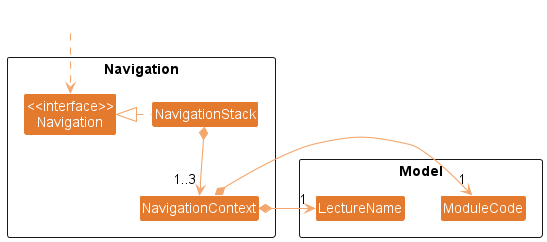
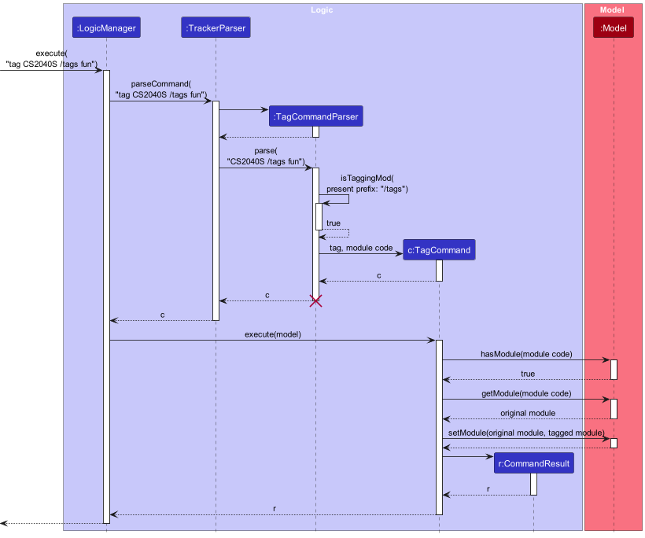
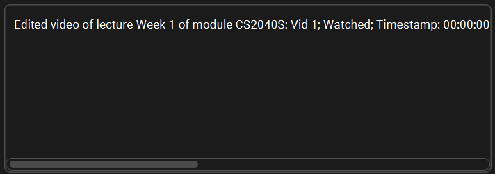

## **Le Tracker** Development ~

Welcome to the Developer Guide for **Le Tracker**!

This guide is intended to provide developers with an overview of the **Le Tracker** codebase, such as the [design](#design) of the codebase and the [implementation](#implementation) details of each feature as needed.

This guide also contains the [requirements](#appendix-requirements) of **Le Tracker** to provide insights on the decision making process of the team and the goals of the application.

Before reading, it is recommended that developers read the [User Guide](https://ay2223s2-cs2103-f10-2.github.io/tp/UserGuide.html) first to gain an understanding of the features provided by **Le Tracker**.

:information_source: **Le Tracker** was developed with [**Java 11**](https://www.oracle.com/java/technologies/javase/jdk11-archive-downloads.html) and thus, it is recommended that developers use this version of Java.

---

## Table of Contents

- [Acknowledgements](#acknowledgements)
- [Setting up, getting started](#setting-up-getting-started)
- [Design](#design)
  - [Architecture](#architecture)
  - [UI component](#ui-component)
  - [Logic component](#logic-component)
  - [Navigation component](#navigation-component)
  - [Model component](#model-component)
  - [Storage component](#storage-component)
  - [Common classes](#common-classes)
- [Implementation](#implementation)
  - [Navigation feature](#navigation-feature)
  - [List module, lecture and video feature](#list-module-lecture-and-video-feature)
  - [Find module, lecture and video feature](#find-module-lecture-and-video-feature)
  - [Add module, lecture, and video feature](#add-module-lecture-and-video-feature)
  - [Edit module, lecture, and video feature](#edit-module-lecture-and-video-feature)
  - [Delete module, lecture, and video feature](#delete-module-lecture-and-video-feature)
  - [Mark / UnMark video feature](#mark--unmark-video-feature)
  - [Tag module, lecture, and video feature](#tag-module-lecture-and-video-feature)
  - [Untag module, lecture, and video feature](#untag-module-lecture-and-video-feature)
  - [Exporting data feature](#exporting-data-feature)
  - [Import archived data feature](#import-archived-data-feature)
  - [Clear feature](#clear-feature)
- [Documentation, logging, testing, configuration, dev-ops](#documentation-logging-testing-configuration-dev-ops)
- [Appendix: Requirements](#appendix-requirements)
  - [Product scope](#product-scope)
  - [User stories](#user-stories)
  - [Use cases](#use-cases)
  - [Non-Functional Requirements](#non-functional-requirements)
  - [Glossary](#glossary)
- [Appendix: Instructions for manual testing](#appendix-instructions-for-manual-testing)
- [Appendix: Planned enhancements](#appendix-planned-enhancements)

---

## Acknowledgements

- Forked from: [AddressBook Level-3](https://github.com/nus-cs2103-AY2223S2/tp)
- Libraries utilised: [Jackson](https://github.com/FasterXML/jackson), [JavaFX](https://openjfx.io/), [JUnit 5](https://junit.org/junit5/)
- Tools utilised: [Gradle](https://gradle.org/)

---

## Setting up, getting started

Refer to the guide [*Setting up and getting started*](SettingUp.md).

---

## Design

<div markdown="span" class="alert alert-primary">

:bulb: **Tip:** The `.puml` files used to create diagrams in this document can be found in the [diagrams](https://github.com/AY2223S2-CS2103-F10-2/tp/tree/master/docs/diagrams) folder. Refer to the [*PlantUML Tutorial* at se-edu/guides](https://se-education.org/guides/tutorials/plantUml.html) to learn how to create and edit diagrams.

</div>

### Architecture


The ***Architecture Diagram*** given above explains the high-level design of the App.

Given below is a quick overview of main components and how they interact with each other.

**Main components of the architecture**

**`Main`** has two classes called [`Main`](https://github.com/AY2223S2-CS2103-F10-2/tp/tree/master/src/main/java/seedu/address/Main.java) and [`MainApp`](https://github.com/AY2223S2-CS2103-F10-2/tp/tree/master/src/main/java/seedu/address/MainApp.java). It is responsible for,

- At app launch: Initializes the components in the correct sequence, and connects them up with each other.
- At shut down: Shuts down the components and invokes cleanup methods where necessary.

[**`Commons`**](#common-classes) represents a collection of classes used by multiple other components.

The rest of the App consists of four components.

- [**`UI`**](#ui-component): The UI of the App.
- [**`Logic`**](#logic-component): The command executor.
- [**`Model`**](#model-component): Holds the data of the App in memory.
- [**`Storage`**](#storage-component): Reads data from, and writes data to, the hard disk.

**How the architecture components interact with each other**

The *Sequence Diagram* below shows how the components interact with each other for the scenario where the user issues the command `delete CS2040S`.


Each of the four main components (also shown in the diagram above),

- defines its *API* in an `interface` with the same name as the Component.
- implements its functionality using a concrete `{Component Name}Manager` class (which follows the corresponding API `interface` mentioned in the previous point.

For example, the `Logic` component defines its API in the `Logic.java` interface and implements its functionality using the `LogicManager.java` class which follows the `Logic` interface. Other components interact with a given component through its interface rather than the concrete class (reason: to prevent outside component's being coupled to the implementation of a component), as illustrated in the (partial) class diagram below.


The sections below give more details of each component.

### UI component

The **API** of this component is specified in [`Ui.java`](https://github.com/AY2223S2-CS2103-F10-2/tp/tree/master/src/main/java/seedu/address/ui/Ui.java)


The UI consists of a `MainWindow` that is made up of parts e.g.`CommandBox`, `ResultDisplay`, `ModuleListPanel`, `StatusBarFooter` etc. All these, including the `MainWindow`, inherit from the abstract `UiPart` class which captures the commonalities between classes that represent parts of the visible GUI.

The `UI` component uses the JavaFx UI framework. The layout of these UI parts are defined in matching `.fxml` files that are in the `src/main/resources/view` folder. For example, the layout of the [`MainWindow`](https://github.com/AY2223S2-CS2103-F10-2/tp/tree/master/src/main/java/seedu/address/ui/MainWindow.java) is specified in [`MainWindow.fxml`](https://github.com/AY2223S2-CS2103-F10-2/tp/tree/master/src/main/resources/view/MainWindow.fxml)

The `UI` component,

- executes user commands using the `Logic` component.
- listens for changes to `Model` data so that the UI can be updated with the modified data.
- keeps a reference to the `Logic` component, because the `UI` relies on the `Logic` to execute commands.
- depends on some classes in the `Model` component, as it displays `Module`, `Lecture`, `Video` objects residing in the `Model`.

### Logic component

**API** : [`Logic.java`](https://github.com/AY2223S2-CS2103-F10-2/tp/tree/master/src/main/java/seedu/address/logic/Logic.java)

Here's a (partial) class diagram of the `Logic` component:


How the `Logic` component works:

1. When `Logic` is called upon to execute a command, several observers subscribe to the `TrackerEventSystem.`
1. The command text is first pre-processed (e.g. `NavigationInjector` could modify the command text by inserting `/mod CS2040S /lec Week 1`).
1. `Logic` then uses the `TrackerParser` class to parse the user command.
1. This results in a `Command` object (more precisely, an object of one of its subclasses e.g., `AddCommand`) which is executed by the `LogicManager`.
1. The command can communicate with the `Model` when it is executed (e.g. to add a module).
1. The result of the command execution is encapsulated as a `CommandResult`.
1. Based on the `CommandResult`, several systems such as `Navigation` are notified through the `TrackerEventSystem`.
1. The `CommandResult` object is then returned back from `Logic`.

The Sequence Diagram below illustrates the interactions within the `Logic` component for the `execute("add CS2040S")` API call.


<div markdown="span" class="alert alert-info">:information_source: **Note:** The lifeline for `AddCommandParser` should end at the destroy marker (X) but due to a limitation of PlantUML, the lifeline reaches the end of diagram.
</div>

Here are the other classes in `Logic` (omitted from the class diagram above) that are used for parsing a user command:


How the parsing works:

- When called upon to parse a user command, the `TrackerParser` class creates an `XYZCommandParser` (`XYZ` is a placeholder for the specific command name e.g., `AddCommandParser`) which uses the other classes shown above to parse the user command and create a `XYZCommand` object (e.g., `AddVideoCommand`) which the `TrackerParser` returns back as a `Command` object.
- All `XYZCommandParser` classes (e.g., `AddCommandParser`, `NavCommandParser`, ...) inherit from the `Parser` interface so that they can be treated similarly where possible e.g, during testing.

### Navigation component

**API**: [`Navigation.java`](https://github.com/AY2223S2-CS2103-F10-2/tp/tree/master/src/main/java/seedu/address/model/Navigation.java)

Here's a (partial) class diagram of the `Navigation` component:



\*\* This class diagram omits some classes and dependencies in the `Navigation` component for the purpose of simplicity.

What the `Navigation` component does:

- Tracking the current working context.
- Tracking navigation through the hierarchy.
- Enforcing valid navigation between adjacent layers in the module-lecture-video hierarchy.

What the `Navigation` component is **NOT RESPONSIBLE** for:

- Ensuring that modules or lectures exist in the `Model` component.
  - This avoids circular dependency as the `Model` component already depends on the `Navigation` component.
  - This enforces the single responsibility principle as the `Navigation` component does not need to verify the existence of actual module or lecture data in the Tracker system.

For more information on the Navigation system and how to develop **context-sensitive** commands that work with the Navigation system, please refer the [navigation feature](#navigation-feature).

### Model component

**API** : [`Model.java`](https://github.com/AY2223S2-CS2103-F10-2/tp/tree/master/src/main/java/seedu/address/model/Model.java)


\*\* This class diagram omits some classes and dependencies in the `Model` component for the purpose of simplicity (classes excluded include `ModuleCode`, `ModuleName`, `LectureName`, `VideoName`, `Tag` and other classes)

The `Model` component,

- stores the tracker data i.e., all `Module` objects which are contained in a `UniqueModuleList` object, along with the `Lecture` objects contained in the `UniqueLectureList` objects of said `Module` objects, as well as the `Video` objects contained in the `UniqueVideoList` objects of said `Lecture` objects.
- stores the currently 'selected' `Module` objects (e.g., results of a search query) as a separate *filteredModules* list which is exposed to outsiders as an unmodifiable `ObservableList<Module>` that can be 'observed' e.g. the UI can be bound to this list so that the UI automatically updates when the data in the list change.
- stores the currently 'selected' `Lecture` objects (e.g., results of a search query) as a separate *filteredLectures* list which is exposed to outsiders as an unmodifiable `ObservableList<Lecture>` that can be 'observed' e.g. the UI can be bound to this list so that the UI automatically updates when the data in the list change.
- stores the currently 'selected' `Video` objects (e.g., results of a search query) as a separate *filteredVideos* list which is exposed to outsiders as an unmodifiable `ObservableList<Video>` that can be 'observed' e.g. the UI can be bound to this list so that the UI automatically updates when the data in the list change.
- stores the [navigation component](#navigation-component) which tracks the current working context.
- stores a `UserPref` object that represents the user’s preferences. This is exposed to the outside as a `ReadOnlyUserPref` objects.
- does not depend on any of the other three components (as the `Model` represents data entities of the domain, they should make sense on their own without depending on other components).

### Storage component

**API** : [`Storage.java`](https://github.com/AY2223S2-CS2103-F10-2/tp/tree/master/src/main/java/seedu/address/storage/Storage.java)


The `Storage` component,

- can save both tracker data and user preference data in json format, and read them back into corresponding objects.
- inherits from both `TrackerStorage` and `UserPrefStorage`, which means it can be treated as either one (if only the functionality of only one is needed).
- depends on some classes in the `Model` component (because the `Storage` component's job is to save/retrieve objects that belong to the `Model`).

### Common classes

Classes used by multiple components are in the `seedu.addressbook.commons` package.

---

## Implementation

This section describes some noteworthy details on how certain features are implemented.

### Navigation feature

> The navigation system was designed to eliminate the need for users to repeat the same /mod /lec arguments for multiple commands. This is based on the observation that users often make multiple commands from the same context (i.e. tracking a specific module or lecture).

#### How the navigation system works

Similar to the `cd` command which changes the current working directory in Unix-based systems, the navigation commands (i.e. `nav`, `navb`) allows the user to navigate through the module-lecture-video hierarchy to a specified module or lecture. Once the user has navigated to a context, they do not need to include the `/mod` or `/lec` arguments for commands related to the current context.

Instead, the navigation system will inject `/mod` or `/lec` arguments into the user's command based on the current working context. Hence, context-sensitive commands will be able to infer the specified module or lecture from these arguments without being directly coupled to the navigation system.

#### Navigation injection

Here's a (partial) class diagram for the `NavigationInjector` component.


How `NavigationInjector` injects the correct arguments into the command based on the current working context:

1. When `Logic` is called upon to execute a command, the command text string is first passed to the `Injector` object via its `inject(String, Model)` method.

2. The `NavigationInjector` implementation of `Injector` then obtains the `NavigationContext` object which represents the current working context by communicating with the `Model`.

3. The `NavigationInjector` then injects the appropriate `/mod` and `/lec` arguments that represent the current working context into the command text string based on the arguments obtained from the `NavigationContext` object.

4. The modified command text string is then returned back from `NavigationInjector` to `Logic`.

#### Usage scenario

Given below is an example usage scenario and how the navigation system behaves at each step.

Steps:

1. The user launches the application. The Navigation system is initialized with a root context as the current working context.

2. The user wants to navigate to the module CS2040S and executes the `nav CS2040S` command. The following sequence diagram depicts `nav CS2040S`'s execution:
   

3. The user wants to navigate to the lecture Week 1 in the CS2040S context and executes the `nav Week 1` command.

#### Designing context-sensitive commands

We want to reduce the need for similar sounding command names such as `add-module`, `add-lecture`, `add-video` which all involve the "adding" operation. Hence, these context-sensitive commands share a single command name such as `add`. To determine whether a module, lecture or video is being processed for a given command, we instead parse the context-specifying arguments such as `/mod`, `/lec` to instantiate the **context specific command**.

Hence, we define a common format for context-sensitive commands:
> `command [/mod {module_code}] [/lec {lecture_name}]`

Parsing context-specifying arguments to determine context:

| Has `/mod` argument | Has `/lec` argument |        Context       | Context Specific Command |
| -----------------   | -----------------   | ------------------   | ----------------------   |
|         No          |         No          | Root Context         |  `XYZModuleCommand`      |
|         Yes         |         No          | Module Context       |  `XYZLectureCommand`     |
|         Yes         |         Yes         | Lecture Context      |  `XYZVideoCommand`       |

If you are *confused* about why there appears to be a mismatch between Context and Context Specific Command (i.e. Module Context -> `XYZLectureCommand`), remember that a context specific command does **NOT** manipulate the **context** itself but the objects that are **contained** under that context (i.e. modules contain lectures).

Implementing your context-sensitive command based on this format will ensure seamless integration with the navigation system.

For concrete examples on how to implement a context-sensitive command, you can refer to the
[add command](#add-module-lecture-and-video-feature) or [edit command](#edit-module-lecture-and-video-feature).

### List module, lecture and video feature

The `list` command supports:

- Listing modules in the tracker
- Listing lectures in a module in the tracker
- Listing videos in a lecture which belongs to a module in the tracker

It's behaviour is dependent on the arguments provided by the user.

The feature utilises the following classes/variable:

- `ListCommandParser` – Creates the appropriate `ListCommand` subclass object base on the user's input
- `ListCommand` – Base class of any `Command` subclass that list some entity in the tracker
- `PREDICATE_SHOW_ALL_MODULES` – Constant `Predicate` with type `ReadOnlyModule` that list all modules
- `LecturePredicate` – Class that implements `Predicate` interface with type `ReadOnlyLecture`
- `VideoPredicate` – Class that implements `Predicate` interface with type `Video`

The following sequence diagram depicts a `list` command execution for listing lectures in a module in the tracker.


The following is a description of the code execution flow:

1. `ListCommandParser#parse(String)` takes the user's input as an argument and determines the intent of the command as well as the appropriate subclass of `ListCommand` to create an object for. The following table describes how the intent is determined base on the arguments provided in the user's input. Any combination of inputs that do not comply with the combination of arguments specified in the table is considered an error and will result in a `ParseException` being thrown and the command will not be executed.

   In Root Context:

   | Has `/mod` argument | Has `/lec` argument | Intent        | `Predicate` tested           |
   | ------------------- | ------------------- | ------------- | ---------------------------- |
   | No                  | No                  | List modules  | `PREDICATE_SHOW_ALL_MODULES` |
   | Yes                 | No                  | List lectures | `LecturePredicate`           |
   | Yes                 | Yes                 | List videos   | `VideoPredicate`             |

   In Module Context:

   | Has `/mod` argument | Has `/lec` argument | Intent        | `Predicate` tested |
   | ------------------- | ------------------- | ------------- | ------------------ |
   | No                  | No                  | List lectures | `LecturePredicate` |
   | Yes                 | No                  | List lectures | `LecturePredicate` |
   | No                  | Yes                 | List videos   | `VideoPredicate`   |
   | Yes                 | Yes                 | List videos   | `VideoPredicate`   |

   In Lecture Context:

   | Has `/mod` argument | Has `/lec` argument | Intent        | `Predicate` tested |
   | ------------------- | ------------------- | ------------- | ------------------ |
   | Yes                 | No                  | List lectures | `LecturePredicate` |
   | No                  | Yes/No              | List videos   | `VideoPredicate`   |
   | Yes                 | Yes                 | List videos   | `VideoPredicate`   |

   In All Context:

   | Has `/r` argument | Intent      | `Predicate` tested           |
   | ----------------- | ----------- | ---------------------------- |
   | Yes               | List module | `PREDICATE_SHOW_ALL_MODULES` |

2. The argument values are then checked for their validity by using the appropriate methods in `ParserUtil`. If any of the values are invalid, a `ParserException` will be thrown and the command will not be executed.

3. The appropriate `ListCommand` subclass object is created and then returned to the caller.

4. `LogicManager` calls the `Command#execute(Model)` method of the `Command` object returned by `ListCommandParser#parse(String)`. During execution of the command, a `CommandException` can be thrown for the following scenarios:

   - The `Module` which `Lectures` are to be listed does not exist
   - The `Lecture` which `Videos` are to be listed does not exist

5. Note that extra arguments are ignored.\
   Examples:

   - `list /r foo` or `list bar /r` :arrow_right: `list /r`
   - `list bar /mod CS2040S` :arrow_right: `list /mod CS2040S`

6. If no errors occur (no exceptions are thrown), the command succeeds in listing the modules/lectures/videos.

### Find module, lecture and video feature

The `find` command supports:

- Finding a module in the tracker
  1. By module code and name
  2. By module tags
- Finding a lecture in a module in the tracker
  1. By lecture name
  2. By lecture tags
- Finding a video in a lecture which belongs to a module in the tracker
  1. By video name
  2. By video tags

It's behaviour is dependent on the arguments provided by the user.

The feature utilises the following classes:

- `FindCommandParser` – Creates the appropriate `FindCommand` subclass object base on the user's input
- `FindCommand` – Base class of any `Command` subclass that finds some entity in the tracker
- `ModuleContainsKeywordsPredicate` – Class that implements `Predicate` interface with type `ReadOnlyModule`
- `ModuleTagContainsKeywordsPredicate` – Class that implements `Predicate` interface with type `ReadOnlyModule`
- `LectureNameContainsKeywordsPredicate` – Class that implements `Predicate` interface with type `ReadOnlyLecture`
- `LectureTagContainsKeywordsPredicate` – Class that implements `Predicate` interface with type `ReadOnlyLecture`
- `VideoNameContainsKeywordsPredicate` – Class that implements `Predicate` interface with type `Video`
- `VideoTagContainsKeywordsPredicate` – Class that implements `Predicate` interface with type `Video`

The following sequence diagram depicts a `find` command execution for finding a module in the tracker.


Below is an activity diagram that showcase the event that occurs when find command is executed.


The following is a description of the code execution flow:

1. `FindCommandParser#parse(String)` takes the user's input as an argument and determines the intent of the command as well as the appropriate subclass of `FindCommand` to create an object for. The following table describes how the intent is determined base on the arguments provided in the user's input. Any combination of inputs that do not comply with the combination of arguments specified in the table is considered an error and will result in a `ParseException` being thrown and the command will not be executed.

   In Root Context:

   | Has preamble | Has `/mod` argument | Has `/lec` argument | Has `/byTag` argument | Intent       | `Predicate` tested                     |
   | ------------ | ------------------- | ------------------- | --------------------- | ------------ | -------------------------------------- |
   | Yes          | No                  | No                  | No                    | Find module  | `ModuleContainsKeywordsPredicate`      |
   | Yes          | No                  | No                  | Yes                   | Find module  | `ModuleTagContainsKeywordsPredicate`   |
   | Yes          | Yes                 | No                  | No                    | Find lecture | `LectureNameContainsKeywordsPredicate` |
   | Yes          | Yes                 | No                  | Yes                   | Find lecture | `LectureTagContainsKeywordsPredicate`  |
   | Yes          | Yes                 | Yes                 | No                    | Find video   | `VideoNameContainsKeywordsPredicate`   |
   | Yes          | Yes                 | No                  | Yes                   | Find video   | `VideoTagContainsKeywordsPredicate`    |

   In Module Context:

   | Has preamble | Has `/mod` argument | Has `/lec` argument | Has `/byTag` argument | Intent       | `Predicate` tested                     |
   | ------------ | ------------------- | ------------------- | --------------------- | ------------ | -------------------------------------- |
   | Yes          | Yes/No              | No                  | No                    | Find lecture | `LectureNameContainsKeywordsPredicate` |
   | Yes          | Yes/No              | No                  | Yes                   | Find lecture | `LectureTagContainsKeywordsPredicate`  |
   | Yes          | Yes/No              | Yes                 | No                    | Find video   | `VideoNameContainsKeywordsPredicate`   |
   | Yes          | Yes/No              | Yes                 | Yes                   | Find video   | `VideoTagContainsKeywordsPredicate`    |

   In Lecture Context:

   | Has preamble | Has `/mod` argument | Has `/lec` argument | Has `/byTag` argument | Intent       | `Predicate` tested                     |
   | ------------ | ------------------- | ------------------- | --------------------- | ------------ | -------------------------------------- |
   | Yes          | Yes                 | No                  | No                    | Find lecture | `LectureNameContainsKeywordsPredicate` |
   | Yes          | Yes                 | No                  | Yes                   | Find lecture | `LectureTagContainsKeywordsPredicate`  |
   | Yes          | No                  | No                  | No                    | Find video   | `VideoNameContainsKeywordsPredicate`   |
   | Yes          | Yes                 | Yes                 | No                    | Find video   | `VideoNameContainsKeywordsPredicate`   |
   | Yes          | No                  | No                  | Yes                   | Find video   | `VideoTagContainsKeywordsPredicate`    |
   | Yes          | Yes                 | Yes                 | Yes                   | Find video   | `VideoTagContainsKeywordsPredicate`    |

   In All Context:

   | Has preamble | Has `/r` argument | Has `/byTag` argument | Intent      | `Predicate` tested                   |
   | ------------ | ----------------- | --------------------- | ----------- | ------------------------------------ |
   | Yes          | Yes               | No                    | Find module | `ModuleContainsKeywordsPredicate`    |
   | Yes          | Yes               | Yes                   | Find module | `ModuleTagContainsKeywordsPredicate` |

2. The argument values are then checked for their validity by using the appropriate methods in `ParserUtil`. If any of the values are invalid, a `ParserException` will be thrown and the command will not be executed.

3. The appropriate `FindCommand` subclass object is created and then returned to the caller.

4. `LogicManager` calls the `Command#execute(Model)` method of the `Command` object returned by `FindCommandParser#parse(String)`. During execution of the command, a `CommandException` can be thrown for the following scenarios:

   - The `Module` specified by user does not exist when listing `Lectures`
   - The `Lecture` of a `Module` or the `Module` specified by user does not exist when listing `Videos`

5. If no errors occur (no exceptions are thrown), the command succeeds in finding the module/lecture/video associated to the keyword.

### Add module, lecture, and video feature

The `add` command supports:

- Adding a `Module` object to the `Tracker` object contained in the `ModelManager` object
- Adding a `Lecture` object to a `Module` object contained in the `Tracker` object
- Adding a `Video` object to a `Lecture` object contained in a `Module` object that is contained in the `Tracker` object

It's behaviour is dependent on the user's input.

**Notable Classes**

- `AddCommandParser` – Creates the appropriate `AddCommand` subclass object base on the user's input
- `AddCommand` – Base class of any `Command` subclass that handles adding some entity to the `Tracker` object
- `AddModuleCommand` – Subclass of `AddCommand` which handles adding a `Module` object to the `Tracker` object
- `AddLectureCommand` – Subclass of `AddCommand` which handles adding a `Lecture` object to a `Module` object
- `AddVideoCommand` – Subclass of `AddCommand` which handles adding a `Video` object to a `Lecture` object

**Execution**

The following sequence diagram depicts an `add` command execution for adding a `Module` object to the `Tracker` object.


**Notes for `AddCommandParser#parse(String)`**

- The string passed in contains the arguments in the user's input and is use to determine the intent of the command as well as the appropriate subclass of `AddCommand` to create an object for. The following table describes how the intent is determined base on the arguments provided in the user's input. Any combination of arguments not described in the table will result in a `ParseException` object being thrown and the command will not be executed.

  | Has preamble | Has `/mod` argument | Has `/lec` argument |        Intent        | `AddCommand` subclass |
  | :----------: | :-----------------: | :-----------------: | :------------------: | :-------------------: |
  |     Yes      |         No          |         No          | Add `Module` object  |  `AddModuleCommand`   |
  |     Yes      |         Yes         |         No          | Add `Lecture` object |  `AddLectureCommand`  |
  |     Yes      |         Yes         |         Yes         |  Add `Video` object  |   `AddVideoCommand`   |

- The argument values are checked for their validity by using the appropriate methods in the `ParserUtil` class. If any of the values are invalid, a `ParserException` object will be thrown and the command will not be executed.

**Notes for `AddCommand#execute()`**

- A `CommandException` object can be thrown for the following scenarios:
  - The `Module`/`Lecture`/`Video` object is the same as another existing `Module`/`Lecture`/`Video` object according to `Module#isSameModule(Module)`/`Lecture#isSameLecture(Lecture)`/`Video#isSameVideo(Video)`.
  - The `Module` object which a `Lecture` object is being added to does not exist.
  - The `Module` object which a `Lecture` object is specified to be in does not exist.
  - The `Lecture` object which a `Video` object is being added to does not exist.

### Edit module, lecture, and video feature

The `edit` command supports:

- Editing the details of a `Module` object in the `Tracker` object contained in the `ModelManager` object
- Editing the details of a `Lecture` object belonging to a `Module` object contained in the `Tracker` object
- Editing the details of a `Video` object belonging to a `Lecture` object contained in a `Module` object that is contained in the `Tracker` object

It's behaviour is dependent on the user's input.

**Notable Classes**

- `EditCommandParser` – Creates the appropriate `EditCommand` subclass object base on the user's input
- `EditCommand` – Base class of any `Command` subclass that handles editing some entity of the `Tracker` object
- `EditModuleCommand` – Subclass of `EditCommand` which handles editing the details of a `Module` object belonging to the `Tracker` object
- `EditLectureCommand` – Subclass of `EditCommand` which handles editing the details of a `Lecture` object belonging to a `Module` object
- `EditVideoCommand` – Subclass of `EditCommand` which handles editing the details of a `Video` object belonging to a `Lecture` object

**Execution**

The following sequence diagram depicts an `edit` command execution for editing the name of a `Module` object in the `Tracker` object.


**Notes for `EditCommandParser#parse(String)`**

- The string passed in contains the arguments in the user's input and is use to determine the intent of the command as well as the appropriate subclass of `EditCommand` to create an object for. The following table describes how the intent is determined base on the arguments provided in the user's input. Any combination of arguments not described in the table will result in a `ParseException` object being thrown and the command will not be executed.

  | Has preamble | Has `/mod` argument | Has `/lec` argument |        Intent         | `EditCommand` subclass |
  | :----------: | :-----------------: | :-----------------: | :-------------------: | :--------------------: |
  |     Yes      |         No          |         No          | Edit `Module` object  |  `EditModuleCommand`   |
  |     Yes      |         Yes         |         No          | Edit `Lecture` object |  `EditLectureCommand`  |
  |     Yes      |         Yes         |         Yes         |  Edit `Video` object  |   `EditVideoCommand`   |

- The argument values are checked for their validity by using the appropriate methods in the `ParserUtil` class. If any of the values are invalid, a `ParserException` object will be thrown and the command will not be executed.

- If no arguments related to updated fields are provided, a `ParseException` object will be thrown and the command will not be executed.

**Notes for `EditCommand#execute()`**

- A `CommandException` object can be thrown for the following scenarios:
  - The edited `Module`/`Lecture`/`Video` object is the same as another `Module`/`Lecture`/`Video` object according to `Module#isSameModule(Module)`/`Lecture#isSameLecture(Lecture)`/`Video#isSameVideo(Video)`.
  - The `Module` object which a `Lecture` object is specified to be in does not exist.
  - The `Lecture` object which a `Video` object is specified to be in does not exist.

### Delete module, lecture, and video feature

The `delete` command supports:

- Deleting a single specified module.
- Deleting a single specified lecture under a specified module context.
- Deleting a single specified video under a specified module and specified lecture context.
- Deleting multiple specified modules / lectures / videos under the respective specified contexts mentioned in the above points.
  - E.g.: User wishes to delete a module CS2040S.\
     Executing `delete CS2040S` would allow the user to do so, unless the module does not exist, in which case, Le Tracker will throw an error.
  - E.g.: User wishes to delete multiple modules CS2107, ST2334 AND CS3230\
     Executing `delete CS2107, ST2334, CS3230` will allow the user to do so. If either module does not exist, nothing is deleted and Le Tracker will throw an error.

This feature's behaviour is dependent on the arguments provided by the user, as well as by the state of Le Tracker.

**Implementation Details**

The feature utilises the following classes:

- `DeleteCommandParser`: parses the arguments appropriately for the appropriate `DeleteCommand` to be returned to be executed
- `DeleteCommand`: Abstract class extending from `Commands` for commands that delete a specified entity from the tracker
- `DeleteModuleCommand`: Subclass of `DeleteCommand` which handles the deletion a module from the tracker
- `DeleteLectureCommand`: Subclass of `DeleteCommand` which handles the deletion a lecture from a module in the tracker
- `DeleteVideoCommand`: Subclass of `DeleteCommand` which handles the deletion a video from a lecture from a module in the tracker.
- `DeleteMultipleModulesCommand`: Subclass of `DeleteCommand` which handles the deletion of multiple modules from the tracker
- `DeleteMultipleLecturesCommand`: Subclass of `DeleteCommand` which handles the deletion of multiple lectures from the same module in the tracker
- `DeleteMultipleVideosCommand`: Subclass of `DeleteCommand` which handles the deletion of multiple videos from the same lecture in the same module in the tracker.
- `MultipleEventsParser`: Interface that parses string for commands that can be executed on multiple objects at once

The following diagram shows the Class Diagram of the `DeleteCommand` hierarchy:


The following diagram shows the Sequence Diagram of parsing a `delete` command into a `DeleteMultipleModulesCommand`:


The following diagram shows the Sequence Diagram of the execution of a `DeleteMultipleModulesCommand`, which acts as a continuation of the above diagram:


The following is a description of the code execution flow

1. `DeleteCommandParser#parse(String)` takes the user's input as a `String` argument and determines the intention of the command (delete module, lecture or video).
   The following table below depicts the consideration of inputs against the user's argument:

   | Has Preamble | has `/mod` argument | has `/lec` agrgument | Intent         |
   | ------------ | ------------------- |----------------| ------------- |
   | Yes          | No                  | No                   | Delete Module  |
   | Yes          | Yes                 | No                   | Delete Lecture |
   | Yes          | Yes                 | Yes                  | Delete Video   |

2. The argument values are then checked on as such:

   - ModuleCode: valid mod code that begins with capital letters, followed by numbers. could optionally end with capital letters at the end
   - LectureName: valid lecture name that does not contain symbols
   - VideoName: valid video name that does not contain symbols

   Note: ModuleCode, LectureName and VideoName should not contain commas (","). Rather than throwing as errors, Le Tracker will treat it as though the user intended to delete multiple entities

3. The appropriate `DeleteCommand` subclass object is created then returned to its caller.

- `DeleteModuleCommand`: single module to be deleted
- `DeleteMultipleModulesCommand`: more than one module to be deleted
- `DeleteLectureCommand`: single lecture to be deleted
- `DeleteMultipleLecturesCommand`: more than one lecture to be deleted
- `DeleteVideoCommand`: single video to be deleted
- `DeleteMultipleVideosCommand`: more than one video to be deleted

4. If no exceptions are thrown, Le Tracker has successfully maanged to delete the specified module(s)/lecture(s)/video(s) the respective context. <br>
Possible exceptions that could be thrown are:
    - Command contains duplicate entities to be deleted
    - Invalid format for any entity
    - Entity does not exist in respective context

5. If `DeleteMultipleModulesCommand`, `DeleteMultipleLecturesCommand` or `DeleteMultipleVideosCommand` is parsed, on execution, the command calls `DeleteModuleCommand`, `DeleteLectureCommand` or `DeleteVideoCommand` respectively

**Reasons for such implementation**

1. Adhering to Open-Close Principle: Open for Extension, Closed for Modification.
2. Having abstract classes to group multiple commands together allows for adherance of DRY (Don't Repeat Yourself) in cases such as `DeleteCommand.COMMAND_WORD` in every class

**Alternatives considered**

1. Combine all featured classes into one large single class
   - Pros:
     - all file content in one single place
     - easily adheres to DRY since there would be no need to repeat information across multiple files
   - Cons:
     - violates Open-Close Principle
     - creates a large file that needs to be edited. Hard to search through

**Possible further implementation**

- encapsulate conditional checks in each delete command execution
- capture the essence of DeleteMultipleModulesCommand in DeleteModuleCommand
- capture the essence of DeleteMultipleLecturesCommand in DeleteLectureCommand
- capture the essence of DeleteMultipleVideosCommand in DeleteVideoCommand

### Mark / UnMark video feature

The `mark` command supports:

- Marking unmarked videos as watched
- Marking marked videos as unwatched
- Marking multiple videos in 1. and 2.
  - E.g.: User wishes to mark multile videos "Vid 1, Vid 2" in lecture "Week 1" of module "CS2040S" as watched.\
    Executing `mark Vid 1, Vid 2 /mod CS2040S /lec Week 1` would allow the user to do so, unless either one of the following conditions are true:
    1. the module (CS2040S) does not exist in the Tracker
    2. the lecture (Week 1) does not exist in the module (CS2040S)
    3. either of the videos (Vid 1, Vid 2) does not exist in the lecture of the module (CS2040S > Week 1)
    4. either of the videos (Vid 1, Vid 2) has already been marked as watched
  - E.g.: User wishes to mark multiple videos "Vid 3", "Vid 4" and "Lecture Summary" in lecture "Topic 4" of module "ST2334" as unwatched.\
    Executing `unmark Vid 3, Vid 4, Lecture Summary /mod ST2334 /lec Topic 1` would allow the user to do so, unless either one of the following conditions are true:
    1. the module (ST2334) doese not exist in the Tracker
    2. the lecture (Topic 1) does not exist in the module (ST2334)
    3. either of the videos (Vid 3, Vid 4, Lecture Summary) does not exist in the lecture of the module (ST2334 > Topic 1)
  - E.g.: User wishes to mark a single video "Vid 1" in lecture "Topic 4" of module "ST2334" as unwatched.\
    Executing `unmark Vid 1 /mod ST2334 /lec Topic 4` would allow the user to do so, unless either one of the following conditions are true:
    1. the module (ST2334) does not exist in the Tracker
    2. the lecture (Topic 4) does not exist in the module (ST2334)
    3. the video (Vid 1) is already unmarked
    4. the video (Vid 1) does not exist in the lecture of the module (ST2334 > Topic 4)

This feature's behaviour is dependent on the arguments provided by the user, as well as the state of Le Tracker.

Note the difference between mark multiple and unmark multiple. As of current implementation, unmark multiple does not alert the user if video was already unmarked. However, unmark a single video does.

**Implementation Details**

The feature utilises the following classes:

- `MarkCommand`: Abstract class extending from `Command` for commands that mark a specified video as watched or unwatched
- `MarkAsWatchedCommandParser`: parses arguments appropriately for `MarkAsWatchedCommand` to be returned to be executed
- `MarkAsWatchedCommand`: Subclass of `MarkCommand` which handles marking a video as watched. Can handle marking multiple videos as well
- `MarkAsUnwatchedCommandParser`: parses arguments appropriately for `MarkAsUnwatchedCommand` and `MarkMultipleAsUnwatchedCommand` to be returned to be executed
- `MarkAsUnwatchedCommand`: Subclass of `MarkCommand` which handles marking a video as unwatched
- `MarkMultipleAsUnwatchedCommand`: Subclass of `MarkCommand` which handles marking multiple videos as unwatched
- `MultipleEventsParser`: Interface that parses string for commands that can be executed on multiple objects at once

The following diagram shows the Sequence Diagram of parsing a `mark` command into a `MarkAsWatchedCommand`:


The following diagram shows the Sequence Diagram of executing a `MarkAsWatchedCommand`, which adds on to the sequence diagram above:


As a comparison to the diagram above, the following diagram shows the Sequence Diagram of executing a `MarkMultipleAsUnwatchedCommand`:


The following is a description of the code execution flow:

1. `MarkAsWatchedCommandParser#parse(String)` / `MarkAsUnwatchedCommandParser#parse(String` takes the user's input as a `String` argument and determines the target video to be marked. The following table below depicts the command returned against the user's intent

   | Parser                         | Has Multiple Videos | Command                          |
   | ------------------------------ | ------------------- | -------------------------------- |
   | `MarkAsWatchedCommandParser`   | Yes / No              | `MarkAsWatchedCommand`           |
   | `MarkAsUnwatchedCommandParser` | Yes                 | `MarkAsUnwatchedCommand`         |
   | `MarkAsUnwatchedCommandParser` | No                  | `MarkMultipleAsUnwatchedCommand` |

2. The argument values are then checked on as such:

   - ModuleCode: valid module code that complies with the module code format
   - LectureName: valid lecture name that does not containt symbols
   - VideoName: valid lecture name that does not contain symbols

   Note: VideoName should not contain commas (","). Rather than throwing errors, Le Tracker will treat it as though the user intended to delete multiple videos

3. The appropriate `MarkCommand` subclass object is created then returned to its caller

4. Upon execution, the argument values in the `MarkCommand` subclass object are then checked on as such:

   - ModuleCode: if module with ModuleCode exists in Le Tracker
   - LectureName: if lecture with LectureName exists in module ModuleCode
   - VideoName: if video(s) with VideoName exists in lecture LectureName of module ModuleCode and whether there are duplicates specified
      - For `mark`, the videos of the specified VideoName(s) are checked on whether they are marked as watched
      - For `unmark` and a **single** VideoName is specified, VideoName is checked on whether it is marked as unwatched
      - For `unmark` and **multiple** VideoNames are specified, VideoNames are **not** checked on whether they are marked as unwatched (unlike its counterparts)

5. If no exceptions are thrown, Le Tracker has successfully managed to mark/unmark the specified video(s)

**Reasons for such implementation**

1. Adhering to Open-Close Principle: Open for Extension, Closed for Modification
2. Having abstract classes to group mark commands together allows for adherance of DRY (Don't Repeat Yourself) in cases such as success message formats in every class

**Alternatives considered**

1. Combine all featured classes into one large single class
   Pros:
   - all file content in one single place
   - easily adheres to DRY since there would be no need to repeat information across multiple files
     Cons:
   - violates Open-Close Principle
   - creates a large file that needs to be edited. Hard to search through

**Possible further implementation**

- Update command result of `MarkMultipleAsUnwatchedCommand` to catch when this command is called when the videos are already marked as unwatched, similar to `MarkAsUnwatchedCommand` and `MarkAsWatchedCommand`
- Collate `MarkAsUnwatchedCommand` and `MarkMultipleAsUnwatchedCommand` into one class, similar to `MarkAsWatchedCommand`

### Tag module, lecture, and video feature

The `tag` command supports:

- Adding multiple `Tag` objects to a `Module` object in a `Tracker` object contained in the `ModelManager` object
- Adding multiple `Tag` objects to a `Lecture` object of a `Module` object contained in a `Tracker` object
- Adding multiple `Tag` objects to a `Video` object of a `Lecture` object contained in a `Module` object in a `Tracker` object

The `tag` behaviour is dependent on the arguments provided by the user. `Module` objects, `Lecture` objects, and
`Video` objects can have multiple, unique `Tag` objects. If a command contains new tags and tags that were already
added to `Module` objects, `Lecture` objects, or `Video` objects, only the new tags will be added.

**Notable Classes**

The feature utilises the following classes:

- `TagCommandParser` – Creates the appropriate `TagCommand` object based on the user's input
- `TagCommand` – Handles adding `Tag` objects to a `Module`/`Lecture`/`Video` object based on
  the user's input

**Execution**

The following sequence diagram depicts a `tag` command execution for adding a `Tag` object to a `Module` object in a
`Tracker` object.



The following is a description of the code execution flow:

1. `TagCommandParser#parse()` takes in the user input and determine whether the user wanted to tag a module,
   a lecture, or a video based on the appropriate prefixes included in the user's input.
2. The user input is then checked to determine whether it contains the required prefixes according to the table
   below. Any combination of inputs that do not satisfy the command's required prefixes will be considered an error.
   A `ParseException` will be thrown, and the command will not be executed.

   | Intent       | has `/mod` prefix | has `/lec` prefix | has `/tags` prefix |
   |:------------:|:-----------------:|:-----------------:|:------------------:|
   | Tag Module   |        No         |        No         |        Yes         |
   | Tag Lecture  |        Yes        |        No         |        Yes         |
   | Tag Video    |        Yes        |        Yes        |        Yes         |

3. A set of `Tag` objects to add is then determined from the user's input. Afterwards, The command creates an
   appropriate `TagCommand` object and returns it to the caller.
4. `LogicManager` calls the `Command#execute()` method of the `TagCommand` object returned by
   `TagCommandParser#parse()`. During the execution, a `CommandException` will be thrown if no tags were
   provided, or if the tracker doesn't contain the specified `Module` object, `Lecture` object, or `Video` object.
5. If no exceptions are thrown, the command succeeds in adding `Tag` objects to the `Module` object, `Lecture` object,
   or `Video` object.

**Notes for `TagCommandParser#parse()`**

- A `ParseException` will be thrown if the appropriate prefixes according to the above table aren't included.

**Notes for `TagCommand#execute()`**

- A `CommandException` will be thrown for the following scenarios:
  - The user did not specify any tags to add.
  - The current `Tracker` object does not contain the specified `Module`/`Lecture`/`Video` object.

### Untag module, lecture, and video feature

The `untag` command supports:

- Removing multiple `Tag` objects from a `Module` object in a `Tracker` object that is contained in a `ModelManager`
  object
- Removing multiple `Tag` objects from a `Lecture` object of a `Module` object in a `Tracker` object
- Removing multiple `Tag` objects from a `Video` object of a `Lecture` object which belongs to a `Module` object in a
  `Tracker` object

The `untag` behaviour is dependent on the arguments provided by the user. Multiple `Tag` objects can be deleted in a
single command. If a command contains nonexistent tags and tags that were already added to modules, lectures, or
videos, a `CommandException` will be thrown. Duplicated tags in the command, if any, will be ignored.

**Notable Classes**

The feature utilises the following classes:

- `UntagCommandParser` – Creates the appropriate `UntagCommand` object based on the user's input
- `UntagCommand` – Handles removing `Tag` objects from a `Module`/`Lecture`/`Video` object
  based on the user's input

**Execution**

The following sequence diagram depicts an `untag` command execution for removing a `Tag` object from a `Module` object
in a `Tracker` object.


The following is a description of the code execution flow:

1. `UntagCommandParser#parse()` takes in the user input and determine whether the user wants to remove `Tag`
   objects a `Module`, `Lecture`, or `Video` object based on the appropriate prefixes included in the user's input.
2. The user input is then checked to determine whether it contains the required prefixes according to the table
   below. Any combination of inputs that do not satisfy the command's required prefixes will be considered an error.

   | Intent        | has `/mod` prefix | has `/lec` prefix | has `/tags` prefix |
   |:-------------:|:-----------------:|:-----------------:|:------------------:|
   | Untag Module  |        No         |        No         |        Yes         |
   | Untag Lecture |        Yes        |        No         |        Yes         |
   | Untag Video   |        Yes        |        Yes        |        Yes         |

3. A set of `Tag` objects to remove is then determined from the user's input. Afterwards, the command creates an
   appropriate `UntagCommand` object and returns it to the caller.
4. `LogicManager` calls the `Command#execute()` method of the `UntagCommand` object returned by
   `UntagCommandParser#parse()`.
5. If no exceptions are thrown, the command succeeds in removing the `Tag` objects from the
   `Module`/`Lecture`/`Video` object.

**Notes for `UntagCommandParser#parse()`**

- A `ParseException` will be thrown if the appropriate prefixes according to the above table aren't included.

**Notes for `UntagCommand#execute()`**

- A `CommandException` will be thrown for the following scenarios:
  - The user did not specify any tags to remove.
  - The current `Tracker` object does not contain the specified `Module`/`Lecture`/`Video` object.
  - The specified tags do not correspond with existing `Tag` objects in the `Module`/`Lecture`/`Video` object.

### Exporting data feature

The `export` command supports:

- Saving a `Tracker` object and the `Module`, `Lecture`, and `Video` objects it contains to a new file path, in a JSON
  format file
- Saving a `Tracker` object and the `Module`, `Lecture`, and `Video` objects it contains to an existing file path, in a
  JSON format file, overwriting its content

The `export` behaviour is dependent on the arguments provided by the user.

**Notable Classes**

The feature utilises the following classes:

- `ExportCommandParser` – Creates the appropriate `ExportCommand` object based on the user's input
- `ExportCommand` – Creates the appropriate `CommandResult` object containing the file path for export
- `Archive` – Handles saving the `Tracker` object and the `Module`, `Lecture`, and `Video` objects it contains to
  the specified file path in `CommandResult`

**Execution**

The following sequence diagram depicts a `export` command execution for exporting a `Tracker` object to a specified
file path


The following is a description of the code execution flow:

1. `ExportCommandParser#parse()` takes in the user input and determine the file path that the user wants to
   export to, as well as whether the user wants to overwrite the data in the file path, if it exists, based on the
   `/overwrite` flag.
2. The command creates an appropriate `ExportCommand` object and returns it to the caller.
3. `LogicManager` calls the `Command#execute()` method of the `ExportCommand`. An appropriate `CommandResult` object containing a `Path` object with the
   saving file path is then returned to the caller.
4. `LogicManager` calls the `Archive#exportToArchive()` method.
5. If no exceptions are thrown, the command succeeds in saving the `Tracker` object and the `Module`, `Lecture`, and
   `Video` objects it contains to the specified file path.

**Notes for `ExportCommandParser#parse()`**

- A `ParseException` will be thrown if the saving file path is not specified in user's input.

**Notes for `ExportCommand#execute()`**

- A `CommandException` will be thrown if the specified file path is invalid.

**Notes for `Archive#exportToArchive()`**

- A `CommandException` will be thrown for the following scenarios:
  - The file at the specified file path does not have write permission.
  - The user is trying to export to the current working tracker path.
  - The user is trying to export to an existing file without the `/overwrite` flag.

### Import archived data feature

The `import` command supports:

- Importing all `Module` objects from a valid Le Tracker data file into the current `Tracker` object
- Importing all `Module` objects from a valid Le Tracker data file into the current `Tracker` object, overwriting
  current `Module` objects with imported `Module` objects if these modules exist in the current `Tracker` object
- Importing specific `Module` objects from a valid Le Tracker data file into the current `Tracker` object
- Importing specific `Module` objects from a valid Le Tracker data file into the current `Tracker` object, overwriting
  current `Module` objects with imported `Module` objects if these modules exist in the current `Tracker` object

The `import` behaviour is dependent on the arguments provided by the user.

**Notable Classes**

The feature utilises the following classes:

- `ImportCommandParser` - Creates the appropriate `ImportCommand` object based on the user's input
- `ImportCommand` - Creates the appropriate `CommandResult` object containing the file path for import and the set
  of `ModuleCode` objects that references the `Module` objects to import
- `Archive` - Handles importing `Module` objects from the file path in `CommandResult` to the current `Tracker` object

**Execution**

The following sequence diagram depicts a `import` command execution for importing a single module from a specified
file path to the current `Tracker` object


The following is a description of the code execution flow:

1. `ImportCommandParser#parse()` takes in the user input and determine the file path that the user wants to
   import from, as well as whether the user wants to overwrite the data in the file path, if it exists, based on the
   `/overwrite` flag.
2. The command creates an appropriate `ImportCommand` object and returns it to the caller.
3. `LogicManager` calls `Command#execute()` method of the `ImportCommand` object. An appropriate `CommandResult` object containing a `Path` object with the
   importing file path and a set of `ModuleCode` objects to reference the `Module` objects to import is then
   returned to the caller.
4. `LogicManager` calls the `Archive#importFromArchive()` method. The `Archive` object then checks whether the
   modules in user's input exist in the current Tracker, and in the specified file path.
5. If no exceptions are thrown, the command succeeds in importing `Module` objects from the specified file path to the
   current `Tracker` object.

**Notes for `ImportCommandParser#parse()`**

- A `ParseException` will be thrown for the following scenarios:
  - The user specified `/mod` without providing any module code
  - The importing file path is not specified in user's input

**Notes for `ImportCommand#execute()`**

- A `CommandException` will be thrown if the specified file path is invalid.

**Notes for `Archive#importFromArchive()`**

- A `CommandException` will be thrown for the following scenarios:
  - The file doesn't exist in the specified file path.
  - The file doesn't have read permission
  - The file isn't a valid Le Tracker data file
  - The user is importing modules that doesn't exist in the saving file
  - The user is importing modules that exists in the current `Tracker` object without the `/overwrite` flag

### Clear feature

The `clear` feature supports clearing the entire tracker of all modules, lectures and videos

The feature utilises the following classes:

- `ClearCommand` - executable command to clear modules, lectures and videos in the tracker

The following is a description of the code execution flow:

1. `TrackerParser#parseCommand` parses based on the command word `clear` to identify that the Clear feature is being called.
2. `ClearCommand#execute(Model)` calls `Model#clearTracker` to clear the tracker

**Reasons for such implementation**

- This implementation allows for adherence to basic Object Oriented Programming principles

**Possible further implementation**

- add a prompt to check with user whether they really want to clear everything since the command is irreversible

## Documentation, logging, testing, configuration, dev-ops

- [Documentation guide](Documentation.md)
- [Testing guide](Testing.md)
- [Logging guide](Logging.md)
- [Configuration guide](Configuration.md)
- [DevOps guide](DevOps.md)

---

## Appendix: Requirements

### Product scope

**Target user profile**:

- NUS students
- has a need to keep track of a significant number of modules, lectures, and lecture videos
- has a need to categorize and organize modules, lectures, and videos with tags
- falling behind on lecture materials
- feeling lost regarding lecture content
- prefer desktop apps over other types
- can type fast
- prefers typing to mouse interactions
- is afraid of losing current data
- wants to track productivity level
- is reasonably comfortable using CLI apps

**Value proposition**: fast and stress-free way to organise and track module progress and lecture material

- Easily log lecture progress, search for lectures and lecture media by module code, keywords, or tags for a
  stress-free learning environment
- Tailored to needs of students: provides additional information specific to lecture media such as watch progress,
  topics, and tags
- Allow students to track progress of all modules
- Offer the users great control over their current modules progress
- Allow the users to back up their current progress, as well as import progress from backed up files
- Faster than a typical mouse/GUI driven app
- Intuitive, easy to navigate GUI

### User stories

Priorities: High (must have) - `* * *`, Medium (nice to have) - `* *`, Low (unlikely to have) - `*`

| Priority | As a/an …​       | I can …​                                                                           | So that I can…​                                                                                                                |
| -------- | ---------------- | ---------------------------------------------------------------------------------- | ------------------------------------------------------------------------------------------------------------------------------ |
| `* * *`  | new user         | access a guide on how to use the app                                               | learn how to use the app                                                                                                       |
| `* * *`  | user             | add a video                                                                        | track what videos I have watched                                                                                               |
| `* * *`  | user             | add a lecture                                                                      | track my watch progress by lectures and organise my videos by lectures                                                         |
| `* * *`  | user             | add a module                                                                       | track my watch progress by modules and organise my lectures                                                                    |
| `* * *`  | user             | edit details of existing modules                                                   | add new details and correct mistakes                                                                                           |
| `* * *`  | user             | edit details of existing lectures                                                  | add new details and correct mistakes                                                                                           |
| `* * *`  | user             | edit details of existing videos                                                    | add new details and correct mistakes                                                                                           |
| `* * *`  | user             | delete specific modules                                                            | remove modules that were added by accident or are no longer relevant to my studies (e.g. dropped / completed)                  |
| `* * *`  | user             | delete specific lectures                                                           | remove lectures that were added by accident                                                                                    |
| `* * *`  | user             | delete specific videos                                                             | remove videos that were added by accident                                                                                      |
| `* * *`  | user             | mark videos that I have watched                                                    | keep track of which videos I have watched                                                                                      |
| `* * *`  | user             | unmark videos that I have previously marked as watched                             | correct my mistakes when I mark a video by accident                                                                            |
| `* * *`  | user             | list my modules                                                                    | view the details of all modules that are being tracked by the app                                                              |
| `* * *`  | user             | list lectures of a specific module                                                 | view the details of all lectures of a module                                                                                   |
| `* * *`  | user             | list videos of a specific lecture                                                  | view the details of all videos of a lecture                                                                                    |
| `* *`    | user             | find modules, lectures or videos by relevant keywords                              | can avoid wasting time manually searching through a list to find a specific module, lecture, or video                          |
| `* *`    | user             | add tags to modules                                                                | label and organise my modules more effectively                                                                                 | <!-- TODO: Verify by lennoxtr -->
| `* *`    | user             | add tags to lectures                                                               | label and organise my lectures more effectively                                                                                | <!-- TODO: Verify by lennoxtr -->
| `* *`    | user             | add tags to videos                                                                 | label and organise my lectures more effectively                                                                                | <!-- TODO: Verify by lennoxtr -->
| `* *`    | user             | remove tags from modules                                                           | remove tags that are no longer relevant or added by accident                                                                   | <!-- TODO: Verify by lennoxtr -->
| `* *`    | user             | remove tags from lectures                                                          | remove tags that are no longer relevant or added by accident                                                                   | <!-- TODO: Verify by lennoxtr -->
| `* *`    | user             | remove tags from videos                                                            | remove tags that are no longer relevant or added by accident                                                                   | <!-- TODO: Verify by lennoxtr -->
| `* *`    | user             | delete all modules                                                                 | remove obsolete modules quickly after a semester is over or clear sample modules                                               |
| `* *`    | user             | set timestamps on videos                                                           | track where I last left off on a video                                                                                         |
| `* *`    | user             | view the overall watch progress of a module                                        | have an idea of how much progress I have made for a module and how much more progress is left                                  |
| `* *`    | user             | view the overall watch progress of a lecture                                       | have an idea of how much progress I have made for a lecture and how much more progress is left                                 |
| `* *`    | user             | export my progress data                                                            | backup my data or transfer it to a new device                                                                                  | <!-- TODO: Verify by lennoxtr -->
| `* *`    | user             | import my progress data                                                            | restore my tracker should I change or wipe my device                                                                           | <!-- TODO: Verify by lennoxtr -->
| `* *`    | forgetful user   | be reminded of where to find the guide                                             | relearn how to use the app                                                                                                     |
| `* *`    | user             | navigate through the hierarchy of modules, lectures, and videos                    | not type the same lengthy arguments each time I type a command                                                                 |
| `*`      | user             | delete multiple modules of my choosing through one action                          | quickly remove multiple modules that were added by accident or are no longer relevant to my studies (e.g. dropped / completed) |
| `*`      | user             | delete multiple lectures of my choosing through one action                         | quickly remove lectures that were added by accident                                                                            |
| `*`      | user             | delete multiple videos of my choosing through one action                           | quickly remove videos that were added by accident                                                                              |
| `*`      | user             | mark multiple videos that I have watched through one action                        | quickly update my progress when I open up the app after watching multiple videos                                               |
| `*`      | user             | unmark multiple videos that I have previously marked as watched through one action | quickly fix my mistake when I mark multiple videos by accident                                                                 |
| `*`      | user             | scroll commands I have previously executed                                         | execute similar commands without typing out the command again                                                                  |
| `*`      | unmotivated user | feel rewarded for making progress in watching lecture videos                       | be motivated to keep up or catch up with the syllabus                                                                          |
| `*`      | user             | be notified when a new lecture video is out                                        | stay up to date with my lectures                                                                                               |
| `*`      | user             | store summaries/notes for lectures                                                 | reference those notes when I'm revising the contents of the lecture                                                            |

### Use cases

(For all use cases below, the **System** is `Le Tracker` and the **Actor** is the `user`, unless specified otherwise)

#### Navigate to a lecture context

**MSS**

1. User requests to navigate to a specific lecture belonging to a specific module.
2. Le Tracker navigates to the specified lecture and displays a confirmation message.

   Use case ends.

**Extensions**

- 1a. The user does not enter sufficient details for the lecture.

  - 1a1. Le Tracker shows an error message.

    Use case ends.

- 1b. The specified lecture or module does not exist.

  - 1b1. Le Tracker shows an error message.

    Use case ends.

#### List modules

**MSS**

1. User wants to see all modules and executes list modules command.
1. A list of module is populated.

   Use case ends.

**Extensions**

- 1a. The list command is invalid.

  - 1a1. Le Tracker shows an error message.

    Use case resumes at step 1.

#### List module's lectures

**MSS**

1. User wants to see all lectures of a module and executes list lectures command with module supplied.
1. A list of lectures of specified module is populated.

   Use case ends.

**Extensions**

- 1a. The module does not exists.

  - 1a1. Le Tracker shows an error message.

    Use case resumes at step 1.

- 1b. The list command is invalid.

  - 1b1. Le Tracker shows an error message.

    Use case resumes at step 1.

#### List lecture's videos

**MSS**

1. User wants to see all videos of a lecture in a module and executes list videos command with a module and a lecture supplied.
1. A list of videos of the specified lecture in the specified module is populated.

   Use case ends.

**Extensions**

- 1a. The module does not exists.

  - 1a1. Le Tracker shows an error message.

    Use case resumes at step 1.

- 1b. The lecture does not exists.

  - 1b1. Le Tracker shows an error message.

    Use case resumes at step 1.

- 1c. The list command is invalid.

  - 1c1. Le Tracker shows an error message.

    Use case resumes at step 1.

#### Find module

**MSS**

1. User wants to find modules that starts with a keyword and executes find modules command with keyword supplied.
1. A list of modules relevant to the keyword is populated.

   Use case ends.

- 1a. The keyword is in wrong format.

  - 1a1. Le Tracker shows an error message.

    Use case resumes at step 1.

- 1b. The find command is invalid.

  - 1b1. Le Tracker shows an error message.

    Use case resumes at step 1.

#### Find lecture

**MSS**

1. User wants to find lectures in a module that starts with a keyword and executes find lecture command with module and keyword supplied.
1. A list of lectures in the specified module which are relevant to the keyword is populated.

   Use case ends.

- 1a. The keyword is in wrong format.

  - 1a1. Le Tracker shows an error message.

    Use case resumes at step 1.

- 1b. The module does not exists.

  - 1b1. Le Tracker shows an error message.

    Use case resumes at step 1.

- 1c. The find command is invalid.

  - 1c1. Le Tracker shows an error message.

    Use case resumes at step 1.

#### Find video

**MSS**

1. User wants to find videos in a lecture belonging in a module that starts with a keyword and executes find video command
with module, lecture and keyword supplied.
1. A list of videos in the specified lecture in the specified module which are relevant to the keyword is populated.

   Use case ends.

- 1a. The keyword is in wrong format.

  - 1a1. Le Tracker shows an error message.

    Use case resumes at step 1.

- 1b. The module does not exists.

  - 1b1. Le Tracker shows an error message.

    Use case resumes at step 1.

- 1c. The lecture does not exists.

  - 1c1. Le Tracker shows an error message.

    Use case resumes at step 1.

- 1d. The find command is invalid.

  - 1d1. Le Tracker shows an error message.

    Use case resumes at step 1.

#### Add a module

**MSS**

1. User requests to add a module and specifies the details of the module.
2. Le Tracker adds the module.

   Use case ends.

**Extensions**

- 1a. The user does not enter sufficient details for the module.

  - 1a1. Le Tracker shows an error message.

    Use case ends.

- 1b. One or more of the details specified is invalid.

  - 1b1. Le Tracker shows an error message.

    Use case ends.

- 1c. The module to be added is a duplicate of an existing module in Le Tracker.

  - 1c1. Le Tracker shows an error message.

    Use case ends.

#### Add a lecture

**MSS**

1. User requests to add a lecture to a module and specifies the details of the lecture.
2. Le Tracker adds the lecture.

   Use case ends.

**Extensions**

- 1a. The module to add the lecture to does not exist.

  - 1a1. Le Tracker shows an error message.

    Use case ends.

- 1b. The user does not enter sufficient details for the lecture.

  - 1b1. Le Tracker shows an error message.

    Use case ends.

- 1c. One or more of the details specified is invalid.

  - 1c1. Le Tracker shows an error message.

    Use case ends.

- 1d. The lecture to be added is a duplicate of an existing lecture in the module.

  - 1d1. Le Tracker shows an error message.

    Use case ends.

#### Add a video

**MSS**

1. User requests to add a video to a lecture of a module and specifies the details of the video.
2. Le Tracker adds the video.

   Use case ends.

**Extensions**

- 1a. The module that is suppose to contain the lecture does not exist.

  - 1a1. Le Tracker shows an error message.

    Use case ends.

- 1b. The lecture to add the video to does not exist.

  - 1b1. Le Tracker shows an error message.

    Use case ends.

- 1c. The user does not enter sufficient details for the video.

  - 1c1. Le Tracker shows an error message.

    Use case ends.

- 1d. One or more of the details specified is invalid.

  - 1d1. Le Tracker shows an error message.

    Use case ends.

- 1e. The video to be added is a duplicate of an existing video in the lecture.

  - 1e1. Le Tracker shows an error message.

    Use case ends.

#### Edit a module

**MSS**

1. User requests to edit a module and specifies the updated details for the module.
2. Le Tracker edits the module.

   Use case ends.

**Extensions**

- 1a. The module the user is requesting to edit does not exist.

  - 1a1. Le Tracker shows an error message.

    Use case ends.

- 1b. The user does not enter any updated details.

  - 1b1. Le Tracker shows an error message.

    Use case ends.

- 1c. One or more of the updated details specified is invalid.

  - 1c1. Le Tracker shows an error message.

    Use case ends.

- 1d. The resulting edited module is a duplicate of another module in Le Tracker.

  - 1d1. Le Tracker shows an error message.

    Use case ends.

#### Edit a lecture

**MSS**

1. User requests to edit a lecture of a module and specifies the updated details of the lecture.
2. Le Tracker adds the lecture.

   Use case ends.

**Extensions**

- 1a. The module that is suppose to contain the lecture to edit does not exist.

  - 1a1. Le Tracker shows an error message.

    Use case ends.

- 1b. The lecture the user is requesting to edit does not exist.

  - 1b1. Le Tracker shows an error message.

    Use case ends.

- 1c. The user does not enter any updated details.

  - 1c1. Le Tracker shows an error message.

    Use case ends.

- 1d. One or more of the updated details specified is invalid.

  - 1d1. Le Tracker shows an error message.

    Use case ends.

- 1e. The resulting edited lecture is a duplicate of another lecture in the module.

  - 1e1. Le Tracker shows an error message.

    Use case ends.

#### Edit a video

**MSS**

1. User requests to edit a video of a lecture belonging to a module and specifies the updated details of the video.
2. Le Tracker adds the lecture.

   Use case ends.

**Extensions**

- 1a. The module that is suppose to contain the lecture does not exist.

  - 1a1. Le Tracker shows an error message.

    Use case ends.

- 1b. The lecture that is suppose to contain the video to edit does not exist.

  - 1b1. Le Tracker shows an error message.

    Use case ends.

- 1c. The video the user is requesting to edit does not exist.

  - 1c1. Le Tracker shows an error message.

    Use case ends.

- 1d. The user does not enter any updated details.

  - 1d1. Le Tracker shows an error message.

    Use case ends.

- 1e. One or more of the updated details specified is invalid.

  - 1e1. Le Tracker shows an error message.

    Use case ends.

- 1f. The resulting edited video is a duplicate of another video in the lecture.

  - 1f1. Le Tracker shows an error message.

    Use case ends.

#### Delete a Module

**Preconditions**: User has added a module

**MSS**

1. User requests to delete the specific module by specifying the module code
2. Le Tracker deletes the module

   Use case ends.

**Extensions**

- 1a. The given module code does not follow the module code format.

  - 1a1. Le Tracker shows an error message.

    Use case ends.

  1b. Module of module code does not exist in Le Tracker.

  - 1b1. Le Tracker shows an error message.

    Use case ends.

#### Delete multiple Modules

**Preconditions**: User has added a few modules

**MSS**

1. User requests to delete specific modules by specifying their respective module codes
2. Le Tracker deletes the specified modules

  Use case ends.

**Extensions**

- 1a. At least one of module codes supplied does not follow the module code format.

  - 1a1. Le Tracker shows an error message.

    Use case ends.

- 1b. Module codes supplied contains duplicates.

  - 1b1. Le Tracker shows an error message.

    Use case ends.

- 1c. At least one module of module codes do not exist in Le Tracker.

  - 1c1. Le Tracker shows an error message.

    Use case ends.


#### Delete a Lecture

**Preconditions**: User has added a module and a lecture

**MSS**

1. User requests to delete a specific lecture by specifying a module code and lecture name
2. Le Tracker deletes the lecture

   Use case ends.

**Extensions**

- 1a. The supplied module code does not follow the module code format.

  - 1a1. Le Tracker shows an error message.

    Use case ends.

- 1b. The supplied lecture name does not follow the lecture name format.

  - 1b1. Le Tracker shows an error message.

    Use case ends.

- 1c. The module of module code that is supposed to contain the lecture of lecture name does not exist.

  - 1c1. Le Tracker shows an error message.

    Use case ends.

- 1d. The lecture of lecture name does not exist in module of module code.

  - 1d1. Le Tracker shows an error message.

    Use case ends.

#### Delete multiple Lectures

**Preconditions**: User has added a module and a few lectures

**MSS**

1. User specifies multiple lecture names to be deleted and a module code
2. Le Tracker deletes the specified lectures of lecture names from the specified module of module code

    Use case ends.

**Extensions**

- 1a. The module code specified does not follow the module code format.

  - 1a1. Le Tracker shows an error message.

    Use case ends.

- 1b. At least one of the lecture names supplied does not follow the lecture name format.

  - 1b1. Le Tracker shows an error message.

    Use case ends.

- 1c. Lecture names supplied contains duplicates.

  - 1c1. Le Tracker shows an error message.

    Use case ends.

- 1d. The module of module code does not exist in Le Tracker.

  - 1d1. Le Tracker shows an error message.

    Use case ends.

- 1e. At least one lecture of the supplied lecture names does not exist in the module of module code.

  - 1e1. Le Tracker shows an error message.

    Use case ends.

#### Delete a Video

**Preconditions**: User has added a module, a lecture and a video

**MSS**

1. User requests to delete a specific video by citing its video name, lecture name of the lecture that contains it, and the module code of the module that contains the lecture
2. Le Tracker deletes the video from the lecture of the module

   Use case ends.

**Extensions**

- 1a. Module code supplied does not follow the module code format.

  - 1a1. Le Tracker shows an error message.

    Use case ends.

- 1b. Lecture name supplied does not follow the lecture name format.

  - 1b1. Le Tracker shows an error message.

    Use case ends.

- 1c. Video name supplied does not follow the video name format.

  - 1c1. Le Tracker shows an error message.

    Use case ends.

- 1d. There is no such module of module code in Le Tracker.

  - 1d1. Le Tracker shows an error message.

    Use case ends.

- 1e. There is no such lecture of lecture name in the module.

  - 1e1. Le Tracker shows an error message.

    Use case ends.

- 1f. There is no such video of video name in the lecture.

  - 1f1. Le Tracker shows an error message.

    Use case ends.

#### Delete multiple Videos

**Precondition**: User has added a module, a lecture and a few videos

**MSS**

1. User requests to delete the specific videos by supplying their video names, the lecture name of the lecture containing them and the module code of the module containing the lecture
2. Le Tracker deletes the specified videos from the lecture of the module

  Use case ends.

**Extensions**

- 1a. Module code supplied does not follow the module code format.

  - 1a1. Le Tracker shows an error message.

    Use case ends.

- 1b. Lecture name supplied does not follow the lecture name format.

  - 1b1. Le Tracker shows an error message.

    Use case ends.

- 1c. At least one of the video names supplied does not follow the video name format.

  - 1c1. Le Tracker shows an error message.

    Use case ends.

- 1d. The video names supplied contains duplicates.

  - 1d1. Le Tracker shows an error message.

    Use case ends.

- 1e. There is no such module of module code in Le Tracker.

  - 1e1. Le Tracker shows an error message.

    Use case ends.

- 1f. There is no such lecture of lecture name in the module.

  - 1f1. Le Tracker shows an error message.

    Use case ends.

- 1g. At least one of the videos of video names supplied do not exist in the lecture.

  - 1g1. Le Tracker shows an error message.

    Use case ends.

#### Mark/Unmark a video

**Preconditions**: User has added a module, a lecture and a video

**MSS**

1. User specifies the module code, lecture name and video name to mark/unmark the video as watched/unwatched
2. Le Tracker marks/unmarks the video as watched/unwatched

   Use case ends.

**Extensions**

- 1a. Invalid module code that does not follow module code format is supplied.

  - 1a1. Le Tracker shows an error message.

    Use case ends.

- 1b. Invalid lecture name that does not follow lecture name format is supplied.

  - 1b1. Le Tracker shows an error message.

    Use case ends.

- 1c. Invalid video name that does not follow video name format is supplied.

  - 1c1. Le Tracker shows an error message.

    Use case ends.

- 1d. Module of module code does not exist in Le Tracker.

  - 1d1. Le Tracker shows an error message.

    Use case ends.

- 1e. Lecture of lecture name does not exist in module of module code.

  - 1e1. Le Tracker shows an error message.

    Use case ends.

- 1f. Video name does not exist in lecture of lecture name in module of module code.

  - 1f1. Le Tracker shows an error message.

    Use case ends.

- 2a. Video to mark is already marked as watched.

  - 2a1. Le Tracker shows an error message.

    Use case ends.

- 2b. Video to unmark is already unmarked.

  - 2b1. Le Tracker shows an error message.

    Use case ends.

#### Mark/Unmark multiple videos

**Preconditions**: User has added a module, a lecture and a few videos

**MSS**

1. User specifies the module code, lecture name and multiple video names to mark/unmark as watched/unwatched
2. Le Tracker marks/unmarks the videos as watched/unwatched

  Use case ends.

**Extensions**

- 1a. Invalid module code that does not follow module code format is supplied.

  - 1a1. Le Tracker shows an error message.

    Use case ends.

- 1b. Invalid lecture name that does not follow lecture name format is supplied.

  - 1b1. Le Tracker shows an error message.

    Use case ends.

- 1c. At least one of video names supplied does not follow video name format.

  - 1c1. Le Tracker shows an error message.

    Use case ends.

- 1d. The video names supplied contain duplicates.

  - 1d1. Le Tracker shows an error message.

    Use case ends.

- 1e. Module of module code does not exist in Le Tracker.

  - 1e1. Le Tracker shows an error message.

    Use case ends.

- 1f. Lecture of lecture name does not exist in module of module code.

  - 1f1. Le Tracker shows an error message.

    Use case ends.

- 1g. At least one of the videos of video names do not exist in lecture of lecture name in module of module code.

  - 1g1. Le Tracker shows an error message.

    Use case ends.

- 2a. At least one of the videos to mark is already marked as watched.

  - 2a1. Le Tracker shows an error message.

    Use case ends.

#### Tag a module

**MSS**

1. User requests to tag a module.
2. User specifies the tags and the reference to the module.
3. The module is tagged.

   Use case ends.

**Extensions**

- 2a. Module does not exist.

  - 2a1. Le Tracker shows an error message.

    Use case resumes at step 1.

- 2b. Reference to module is empty.

  - 2b1. Le Tracker shows an error message.

    Use case resumes at step 1.

- 2c. No tag is provided.

  - 2c1. Le Tracker shows an error message.

    Use case resumes at step 1.

#### Tag a lecture

**Precondition: User has added a module and a lecture**

**MSS**

1. User requests to tag a lecture of a module.
2. User specifies the tags as well as the lecture and the module the lecture belongs to.
3. The lecture is tagged.

   Use case ends.

**Extensions**

- 2a. Module does not exist.

  - 2a1. Le Tracker shows an error message.

    Use case resumes at step 1.

- 2b. Reference to module is empty.

  - 2b1. Le Tracker shows an error message.

    Use case resumes at step 1.

- 2c. Lecture does not exist.

  - 2c1. Le Tracker shows an error message.

    Use case resumes at step 1.

- 2d. Reference to lecture is empty.

  - 2d1. Le Tracker shows an error message.

    Use case resumes at step 1.

- 2e. No tag is provided.

  - 2e1. Le Tracker shows an error message.

    Use case resumes at step 1.

#### Tag a video

**Precondition: User has added a module, a lecture, and a video**

**MSS**

1. User requests to tag a video of a lecture.
2. User specified the tags, as well as the video, the lecture the video belongs to, and the module
   the lecture belongs to.
3. The video is tagged.

   Use case ends.

**Extensions**

- 2a. Module does not exist.

  - 2a1. Le Tracker shows an error message.

    Use case resumes at step 1.

- 2b. Reference to module is empty.

  - 2b1. Le Tracker shows an error message.

    Use case resumes at step 1.

- 2c. Lecture does not exist.

  - 2c1. Le Tracker shows an error message.

    Use case resumes at step 1.

- 2d. Reference to lecture is empty.

  - 2d1. Le Tracker shows an error message.

    Use case resumes at step 1.

- 2e. Video does not exist.

  - 2e1. Le Tracker shows an error message.

    Use case resumes at step 1.

- 2f. Reference to video is empty.

  - 2f1. Le Tracker shows an error message.

    Use case resumes at step 1.

- 2g. No tag is provided.

  - 2g1. Le Tracker shows an error message.

    Use case resumes at step 1.

#### Untag a module

**Precondition: User has added a module, and has tagged that module**

**MSS**

1. User requests to remove some tags from a module.
2. User specifies the tags to remove and the reference to the module.
3. The module's tags are removed.

   Use case ends.

**Extensions**

- 2a. Module does not exist.

  - 2a1. Le Tracker shows an error message.

    Use case resumes at step 1.

- 2b. Reference to module is empty.

  - 2b1. Le Tracker shows an error message.

    Use case resumes at step 1.

- 2c. No tag is provided.

  - 2c1. Le Tracker shows an error message.

    Use case resumes at step 1.

- 2d. Module tags do not exist.

  - 2d1. Le Tracker shows an error message.

    Use case resumes at step 1.

#### Untag a lecture

**Precondition: User has added a module and a lecture, and has tagged the lecture**

**MSS**

1. User requests to remove some tags from a lecture of a module.
2. User specifies the tags as well as the lecture and the module the lecture belongs to.
3. The lecture's tags are removed.

   Use case ends.

**Extensions**

- 2a. Module does not exist.

  - 2a1. Le Tracker shows an error message.

    Use case resumes at step 1.

- 2b. Reference to module is empty.

  - 2b1. Le Tracker shows an error message.

    Use case resumes at step 1.

- 2c. Lecture does not exist.

  - 2c1. Le Tracker shows an error message.

    Use case resumes at step 1.

- 2d. Reference to lecture is empty.

  - 2d1. Le Tracker shows an error message.

    Use case resumes at step 1.

- 2e. No tag is provided.

  - 2e1. Le Tracker shows an error message.

    Use case resumes at step 1.

- 2f. Lecture tags do not exist.

  - 2f1. Le Tracker shows an error message.

    Use case resumes at step 1.

#### Untag a video

**Precondition: User has added a module, a lecture, and a video, and has tagged the video**

**MSS**

1. User requests to remove some tags from a video of a lecture.
2. User specifies the tags, as well as the video, the lecture the video belongs to, and the module
   the lecture belongs to.
3. The video's tags are removed.

   Use case ends.

**Extensions**

- 2a. Module does not exist.

  - 2a1. Le Tracker shows an error message.

    Use case resumes at step 1.

- 2b. Reference to module is empty.

  - 2b1. Le Tracker shows an error message.

    Use case resumes at step 1.

- 2c. Lecture does not exist.

  - 2c1. Le Tracker shows an error message.

    Use case resumes at step 1.

- 2d. Reference to lecture is empty.

  - 2d1. Le Tracker shows an error message.

    Use case resumes at step 1.

- 2e. Video does not exist.

  - 2e1. Le Tracker shows an error message.

    Use case resumes at step 1.

- 2f. Reference to video is empty.

  - 2f1. Le Tracker shows an error message.

    Use case resumes at step 1.

- 2g. No tag is provided.

  - 2g1. Le Tracker shows an error message.

    Use case resumes at step 1.

- 2h. Video tags do not exist.

  - 2h1. Le Tracker shows an error message.

    Use case resumes at step 1.

#### Export all modules to a new file

**MSS**

1. User requests to save all data in the current tracker to a new file.
2. User specifies the name of the file to save to.
3. All modules data in the current tracker is saved to the file.

   Use case ends.

**Extensions**

- 2a. File name is invalid.

  - 2a1. Le Tracker shows an error message.

    Use case resumes at step 1.

- 2b. File already exists.

  - 2b1. Le Tracker shows an error message.

    Use case resumes at step 1.

#### Export all modules to an existing file

**MSS**

1. User requests to save all data in the current tracker to an existing file.
2. User specifies the name of the file to save to, as well as indicating that user wants to overwrite the existing file.
3. All modules data in the current tracker is saved to the file.

   Use case ends.

**Extensions**

- 2a. File name is invalid.

  - 2a1. Le Tracker shows an error message.

    Use case resumes at step 1.

- 2b. File cannot be written to.

  - 2b1. Le Tracker shows an error message.

    Use case resumes at step 1.

- 2c. No indication of overwriting file.

  - 2c1. Le Tracker shows an error message.

    Use case resumes at step 1.

#### Import all modules from a file

**MSS**

1. User requests to import all modules data from an existing file.
2. User specifies the name of the file to import from.
3. All modules data in the file is imported to the current tracker.

   Use case ends.

**Extensions**

- 2a. File name is invalid.

  - 2a1. Le Tracker shows an error message.

    Use case resumes at step 1.

- 2b. File does not exist.

  - 2b1. Le Tracker shows an error message.

    Use case resumes at step 1.

- 2c. File cannot be read.

  - 2c1. Le Tracker shows an error message.

    Use case resumes at step 1.

- 2d. Some modules already exist in the current tracker.

  - 2d1. Le Tracker shows an error message.

    Use case resumes at step 1.

#### Import all modules from a file

**MSS**

1. User requests to import all modules data from an existing file.
2. User specifies the name of the file to import from.
3. All modules data in the file is imported to the current tracker.

   Use case ends.

**Extensions**

- 2a. File name is invalid.

  - 2a1. Le Tracker shows an error message.

    Use case resumes at step 1.

- 2b. File does not exist.

  - 2b1. Le Tracker shows an error message.

    Use case resumes at step 1.

- 2c. File cannot be read.

  - 2c1. Le Tracker shows an error message.

    Use case resumes at step 1.

- 2d. Some modules already exist in the current tracker.

  - 2d1. Le Tracker shows an error message.

    Use case resumes at step 1.

#### Import some modules from a file

**MSS**

1. User requests to import some modules data from an existing file.
2. User specifies the name of the file to import from, as well as references to the modules to be imported.
3. Modules data in the file is imported to the current tracker.

   Use case ends.

**Extensions**

- 2a. File name is invalid.

  - 2a1. Le Tracker shows an error message.

    Use case resumes at step 1.

- 2b. File does not exist.

  - 2b1. Le Tracker shows an error message.

    Use case resumes at step 1.

- 2c. File cannot be read.

  - 2c1. Le Tracker shows an error message.

    Use case resumes at step 1.

- 2d. Some modules already exist in the current tracker.

  - 2d1. Le Tracker shows an error message.

    Use case resumes at step 1.

- 2e. Specified modules do not exist in the saved file.

  - 2e1. Le Tracker shows an error message.

    Use case resumes at step 1.

#### Clear all Modules

**MSS**

1. User requests to clear all modules
2. Le Tracker clears all modules

### Non-Functional Requirements

Usability:

- The app should be easy to navigate and use, with a user-friendly interface that is intuitive and clear.
- The app should be accessible to users of different skill levels and backgrounds.
- A user with above average typing speed for regular English text (i.e. not code, not system admin commands) should be able to accomplish most of the tasks faster using commands than using the mouse.

Reliability:

- The app should be reliable and stable, with minimal downtime or disruptions. It should be able to handle a large number of users and requests without crashing or malfunctioning.
- The app should be able to continue functioning even if a component or service fails, with backup systems or redundancy in place.

Performance:

- The app should respond quickly to user requests, with minimal loading times or delays.
- The app should be able to hold up to 1000 lectures without a noticeable sluggishness in performance for typical usage.

Security:

- The app should be secure, with measures in place to protect user data and prevent unauthorized access. This may include encryption, authentication, and authorization mechanisms.

Scalability:

- The app should be scalable, with the ability to handle an increasing number of users and data as the user base grows.

Compatibility:

- The app should work on any *mainstream OS* as long as it has Java `11` or above installed so that it can be accessed and used by a wide range of users.

Maintainability:

- The app should be easy to maintain and update, with clear and well-organized code, documentation, and version control. This will help ensure that the app remains functional and up-to-date over time.

### Glossary

- **Context**: A *module code* or *module code - lecture name* pair that represents a location in the module-lecture-video hierarchy
- **Current Working Context**: A specified context that allows the navigation system to inject `/mod` or `/lec` prefixes into the user's command
- **Lecture**: A lecture of a module
- **Lecture Name**: A name given to a lecture by the user
- **Mainstream OS**: Windows, Linux, Unix, OS-X
- **Module**: A module or course in NUS
- **Module Code**: The unique official code assigned to a module by NUS (e.g. CS2103)
- **Navigate**: To specify a current working context
- **Timestamp**: The timestamp of a video, representing a specific point in the video, specified in hours, minutes, and seconds
- **Video**: A video recording of a lecture
- **Video Name**: A name given to a video by the user

## Appendix: Instructions for manual testing

Given below are instructions to test the app manually.

:exclamation:**Note**: These instructions may not be comprehensive and serve only as a starting point for manual testing; Testers are encouraged to conduct further *exploratory* testing to find unexpected behaviour.

Please ensure that you begin with the original sample data set before testing!

- Delete the `{leTracker_directory}/data` folder to regenerate the sample data.

To make things easier for testing

- Before testing, execute `export test.json` to make a copy of the sample data.
  - You can then execute `import test.json /overwrite` to revert any changes and restore the original sample data set.

Before beginning each test case, ensure that

1. You are at the root context .
2. You are using the unmodified original sample data set.

### List Modules

| Test Case  | Expected Result                                          |
| ---------- | -------------------------------------------------------- |
| `list`     | **Message:**<br/>`Listed all modules`<br/> **List updates:** <br/>Show modules with code [`CS2040S`, `ST2334`] |
| `list /r`  | Same as previous                                         |
| `list foo` | Same as previous                                         |

### List Lectures of a Module

| Test Case                     | Expected Result                                                          |
| ----------------------------- | ------------------------------------------------------------------------ |
| 1.`nav CS2040S`<br/> 2.`list` | **Message:**<br/>`Listed all lectures from module: CS2040S`<br/> **List updates:** <br/>Show lectures with name [`Week 1`, `Week 2`, ... , `Week 7`] |
| `list /mod CS2040S`           | Same as previous                                                         |

### List Videos of a Lecture

| Test Case                                        | Expected Result                             |
| ------------------------------------------------ | ------------------------------------------- |
| 1.`nav CS2040S`<br/> 2.`nav Week 1`<br/>3.`list` | **Message:**<br/>`Listed all videos from module: CS2040S, lecture: Week 1`<br/> **List updates:** <br/>Show videos with name [`Vid 3`] |
| 1.`nav CS2040S`<br/> 2.`list /lec Week 1`        | Same as previous                            |
| 1.`nav /mod CS2040S /lec Week 1`<br/>2.`list`    | Same as previous                            |
| `list /mod CS2040S /lec Week 1`                  | Same as previous                            |

### Find Modules

| Test Case    | Expected Result                                |
| ------------ | ---------------------------------------------- |
| `find cs`    | **Message:**<br/>`1 modules listed!`<br/> **List updates:** Show modules with code [`CS2040S`] |
| `find cs /r` | Same as previous                               |
| `find foo`   | **Message:**<br/>`0 modules listed!`<br/> **List updates:** Shows an empty list

### Find Modules by Tag

| Test Case             | Expected Result                                          |
| --------------------- | -------------------------------------------------------- |
| `find math /byTag`   | **Message:**<br/>`2 modules listed!`<br/> **List updates:** Show modules with code [`CS2040S`, `ST2334`] |
| `find prob /r /byTag` | **Message:**<br/>`1 modules listed!`<br/> **List updates:** Show modules with code [`ST2334`]            |
| `find foo /byTag`     | **Message:**<br/>`0 modules listed!`<br/> **List updates:** Shows an empty list                           |

### Find Lectures of a Module

| Test Case                            | Expected Result                                |
| ------------------------------------ | ---------------------------------------------- |
| 1.`nav CS2040S`<br/> 2.`find week 1` | **Message:**<br/>`1 lectures listed!`<br/> **List updates:** Show lectures with name [`Week 1`] |
| `find week 1 /mod CS2040S`           | Same as previous                               |
| `find wk /mod CS2040S`               | **Message:**<br/>`0 lectures listed!`<br/> **List updates:** Shows an empty list                 |

### Find Lectures of a Module by Tag

| Test Case                                | Expected Result                                          |
| ---------------------------------------- | -------------------------------------------------------- |
| 1.`nav CS2040S`<br/> 2.`find arr /byTag` | **Message:**<br/>`2 lectures listed!`<br/> **List updates:** Show lectures with name [`Week 2`, `Week 4`] |
| `find arr /mod CS2040S /byTag`           | Same as previous                                         |
| `find arry /mod CS2040S /byTag`          | **Message:**<br/>`0 lectures listed!`<br/> **List updates:** Shows an empty list |

### Find Videos of a Lecture

| Test Case                                              | Expected Result                             |
| ------------------------------------------------------ | ------------------------------------------- |
| 1.`nav CS2040S`<br/> 2.`nav Week 1`<br/>3.`find vid 3` | **Message:**<br/>`1 videos listed!`<br/> **List updates:** Show videos with name [`Vid 3`] |
| 1.`nav CS2040S`<br/> 2.`find vid 3 /lec Week 1`        | Same as previous                            |
| 1.`nav /mod CS2040S /lec Week 1`<br/>2.`find vid 3`    | Same as previous                            |
| `find vid 3 /mod CS2040S /lec Week 1`                  | Same as previous                            |
| 1.`nav /mod CS2040S /lec Week 1`<br/>2.`find`          | **Message:**<br/>`Invalid command format!`<br/> **List updates:** None |

### Find Videos of a Lecture by Tag

| Test Case                                                    | Expected Result                             |
| ------------------------------------------------------------ | ------------------------------------------- |
| 1.`nav CS2040S`<br/> 2.`nav Week 2`<br/>3.`find math /byTag` | **Message:**<br/>`1 videos listed!`<br/> **List updates:** Show videos with name [`Vid 2`] |
| 1.`nav CS2040S`<br/> 2.`find math /lec Week 2 /byTag`        | Same as previous                            |
| 1.`nav /mod CS2040S /lec Week 2`<br/>2.`find math /byTag`    | Same as previous                            |
| `find math /mod CS2040S /lec Week 2 /byTag`                  | Same as previous                            |
| 1.`nav /mod CS2040S /lec Week 2`<br/>2.`find`                | **Message:**<br/>`Invalid command format!`<br/> **List updates:** None |

### Add a Module

| Test Case                                                                                               | Expected Result                                                                                                                                                                                              |
| ------------------------------------------------------------------------------------------------------- | ------------------------------------------------------------------------------------------------------------------------------------------------------------------------------------------------------------ |
| `add CS2103T /name Software Engineering /tags Coding, 4MCs`                                             | **Message:**<br/>`New module added: CS2103T; Name: Software Engineering; Tags: [4MCs][Coding]`<br/>**List updates:** New entry for "CS2103T", with name "Software Engineering" and tags "Coding", and "4MCs" |
| 1. `nav CS2040S`<br/>2. `add CS2103T /r /name Software Engineering /tags Coding, 4MCs`                  | **Message:**<br/>`New module added: CS2103T; Name: Software Engineering; Tags: [4MCs][Coding]`<br/>**List updates:** None                                                                                    |
| 1. `nav /mod CS2040S /lec Week 1`<br/>2. `add CS2103T /r /name Software Engineering /tags Coding, 4MCs` | Same as previous                                                                                                                                                                                             |

Some incorrect commands to try from root context:

- `add` (incorrect format)
- `add CS2040S` (duplicate module)
- `add 123` (invalid module code)
- `add CS2103T /name N@me` (invalid module name)
- `add CS2103T /tags T@g` (invalid tag)

### Add a Lecture

| Test Case                                                                                | Expected Result                                                                                                                                                       |
| ---------------------------------------------------------------------------------------- | --------------------------------------------------------------------------------------------------------------------------------------------------------------------- |
| `add Week 7 /mod CS2040S /tags AVLTree, Census`                                          | **Message:**<br/>`New lecture added to module CS2040S: Week 7; Tags: [Census][AVLTree]`<br/>**List updates:** None                                                    |
| 1. `nav CS2040S`<br/>2. `add Week 7 /tags AVLTree, Census`                               | **Message:**<br/>`New lecture added to module CS2040S: Week 7; Tags: [Census][AVLTree]`<br/>**List updates:** New entry for "Week 7" with tags "AVLTree" and "Census" |
| 1. `nav /mod CS2040S /lec Week 1`<br/>2. `add Week 7 /mod CS2040S /tags AVLTree, Census` | **Message:**<br/>`New lecture added to module CS2040S: Week 7; Tags: [Census][AVLTree]`<br/>**List updates:** None                                                    |

Some incorrect commands to try from root context:

- `add /mod CS2040S` (incorrect format)
- `add Week 1 /mod CS2040S` (duplicate lecture)
- `add Lecture N@me /mod CS2040S` (invalid lecture name)
- `add Week 7 /mod CS2040S /tags T@g` (invalid tag)

### Add a Video

| Test Case                                                                                                 | Expected Result                                                                                                                                                                                                                                                              |
| --------------------------------------------------------------------------------------------------------- | ---------------------------------------------------------------------------------------------------------------------------------------------------------------------------------------------------------------------------------------------------------------------------- |
| `add Vid 3 /mod CS2040S /lec Week 1 /timestamp 01:04:20 /watch /tags Analysis, BigO`                      | **Message:**<br/>`New video added to lecture Week 1 of module CS2040S: Vid 3; Watched; Timestamp: 01:04:20; Tags: [Big][Analysis]`<br/>**List updates:** None                                                                                                                |
| 1. `nav CS2040S`<br/>2. `add Vid 3 /lec Week 1 /timestamp 01:04:20 /watch /tags Analysis, BigO`           | Same as previous                                                                                                                                                                                                                                                             |
| 1. `nav /mod CS2040S /lec Week 1`<br/>2. `add Vid 3 /lec Week 1 /timestamp 01:04:20 /tags Analysis, BigO` | **Message:**<br/>`New video added to lecture Week 1 of module CS2040S : Vid 3; Not Watched; Timestamp: 01:04:20; Tags: [BigO][Analysis]`<br/>**List updates:** New entry for "Vid 3" with timestamp "01:04:20", tags "Analysis" and "BigO", and video marked as "not watched" |

Some incorrect commands to try from root context:

- `add /mod CS2040S /lec Week 1` (incorrect format)
- `add Vid 1 /mod CS2040S /lec Week 1` (duplicate video)
- `add V!deo /mod CS2040S /lec Week 1` (invalid video name)
- `add Vid 3 /mod CS2040S /lec Week 1 /tags T@g` (invalid tag)

### Edit a Module

| Test Case                                                                                                 | Expected Result                                                                                                                                                                                                                                                                                                                                                                                                                                                                                                                                                                                                                                                                                                                                                                                                                                                |
| --------------------------------------------------------------------------------------------------------- | -------------------------------------------------------------------------------------------------------------------------------------------------------------------------------------------------------------------------------------------------------------------------------------------------------------------------------------------------------------------------------------------------------------------------------------------------------------------------------------------------------------------------------------------------------------------------------------------------------------------------------------------------------------------------------------------------------------------------------------------------------------------------------------------------------------------------------------------------------------- |
| `edit CS2040S /code CS2040 /name DSAG /tags Analytical, 4MCs`                                             | **Message:**<br/>`Edited module: CS2040; Name: DSAG; Tags: [4MCs][Analytical]; Lectures: Week 1; Tags: [Intro]; Videos: Vid 1; Watched; Timestamp: 00:00:00; Tags: [Algo]Vid 2; Watched; Timestamp: 00:00:00; Tags: [Analysis]Week 2; Tags: [Sorting]; Videos: Vid; Watched; Timestamp: 00:00:00Week 3; Tags: [Arrays][LinkedList]; Videos: Vid 1; Watched; Timestamp: 00:00:00; Tags: [Algo]Vid 2; Watched; Timestamp: 00:00:00; Tags: [Analysis]Week 4; Tags: [Stacks][Queues]; Videos: Vid; Watched; Timestamp: 00:00:00Week 5; Tags: [Hashing]; Videos: Vid 1; Watched; Timestamp: 00:00:00; Tags: [Algo]Vid 2; Watched; Timestamp: 00:00:00; Tags: [Analysis]Week 6; Tags: [BloomFilter]; Videos: Vid; Not Watched; Timestamp: 00:24:20`<br/>**List updates:** Entry for "CS2040S" updated to "CS2040", with name "DSAG" and tags "Analytical" and "4MCs" |
| 1. `nav CS2040S`<br/>2. `edit CS2040S /r /code CS2040 /name DSAG /tags Analytical, 4MCs`                  | **Message:**<br/>`Edited module: CS2040; Name: DSAG; Tags: [4MCs][Analytical]; Lectures: Week 1; Tags: [Intro]; Videos: Vid 1; Watched; Timestamp: 00:00:00; Tags: [Algo]Vid 2; Watched; Timestamp: 00:00:00; Tags: [Analysis]Week 2; Tags: [Sorting]; Videos: Vid; Watched; Timestamp: 00:00:00Week 3; Tags: [Arrays][LinkedList]; Videos: Vid 1; Watched; Timestamp: 00:00:00; Tags: [Algo]Vid 2; Watched; Timestamp: 00:00:00; Tags: [Analysis]Week 4; Tags: [Stacks][Queues]; Videos: Vid; Watched; Timestamp: 00:00:00Week 5; Tags: [Hashing]; Videos: Vid 1; Watched; Timestamp: 00:00:00; Tags: [Algo]Vid 2; Watched; Timestamp: 00:00:00; Tags: [Analysis]Week 6; Tags: [BloomFilter]; Videos: Vid; Not Watched; Timestamp: 00:24:20`<br/>**List updates:** None                                                                                       |
| 1. `nav /mod CS2040S /lec Week 1`<br/>2. `edit CS2040S /r /code CS2040 /name DSAG /tags Analytical, 4MCs` | Same as previous                                                                                                                                                                                                                                                                                                                                                                                                                                                                                                                                                                                                                                                                                                                                                                                                                                               |

Some incorrect commands to try from root context:

- `edit` (incorrect format)
- `edit CS2040S /code ST2334` (duplicate module)
- `edit 123` (invalid module code)
- `edit CS2040S` (no updated fields)
- `edit CS2103 /code CS2103T` (non-existent module)
- `edit CS2040S /code 123` (invalid module code)
- `edit CS2040S /name N@me` (invalid module name)
- `edit CS2040S /tags T@g` (invalid tag)

### Edit a Lecture

| Test Case                                                                                      | Expected Result                                                                                                                                                                                                                                                                     |
| ---------------------------------------------------------------------------------------------- | ----------------------------------------------------------------------------------------------------------------------------------------------------------------------------------------------------------------------------------------------------------------------------------- |
| `edit Week 1 /mod CS2040S /name W1 /tags Intro, BigO`                                          | **Message:**<br/>`Edited lecture of module CS2040S: W1; Tags: [BigO][Intro]; Videos: Vid 1; Watched; Timestamp: 00:00:00; Tags: [Algo]Vid 2; Watched; Timestamp: 00:00:00; Tags: [Analysis]`<br/>**List updates:** None                                                             |
| 1. `nav CS2040S`<br/>2. `edit Week 1 /name W1 /tags Intro, BigO`                               | **Message:**<br/>`Edited lecture of module CS2040S: W1; Tags: [BigO][Intro]; Videos: Vid 1; Watched; Timestamp: 00:00:00; Tags: [Algo]Vid 2; Watched; Timestamp: 00:00:00; Tags: [Analysis]`<br/>**List updates:** Entry for "Week 1" updated to "W1", with tags "Intro" and "BigO" |
| 1. `nav /mod CS2040S /lec Week 1`<br/>2. `edit Week 1 /mod CS2040S /name W1 /tags Intro, BigO` | **Message:**<br/>`Edited lecture of module CS2040S: W1; Tags: [BigO][Intro]; Videos: Vid 1; Watched; Timestamp: 00:00:00; Tags: [Algo]Vid 2; Watched; Timestamp: 00:00:00; Tags: [Analysis]`<br/>**List updates:** None                                                             |

Some incorrect commands to try from root context:

- `edit /mod CS2040S` (incorrect format)
- `edit Week 1 /mod CS2040S /name Week 2` (duplicate lecture)
- `edit Week! /mod CS2040S` (invalid lecture name)
- `edit Week 1 /mod CS2040S` (no updated fields)
- `edit Week 7 /mod CS2040S /name Week 07` (non-existent lecture)
- `edit Week 1 /mod CS2040S /name Week!` (invalid lecture name)
- `edit Week 1 /mod CS2040S /tags T@g` (invalid tag)

### Edit a Video

| Test Case                                                                                                            | Expected Result                                                                                                                                                                                                                                                                              |
| -------------------------------------------------------------------------------------------------------------------- | -------------------------------------------------------------------------------------------------------------------------------------------------------------------------------------------------------------------------------------------------------------------------------------------- |
| `edit Vid 1 /mod CS2040S /lec Week 1 /name Vid 01 /timestamp 01:04:20 /unwatch /tags Analysis, BigO`                 | **Message:**<br/>`Edited video of lecture Week 1 of module CS2040S: Vid 01; Not Watched; Timestamp: 01:04:20; Tags: [BigO][Analysis]`<br/>**List updates:** None                                                                                                                             |
| 1. `nav CS2040S`<br/>2. `edit Vid 1 /lec Week 1 /name Vid 01 /timestamp 01:04:20 /unwatch /tags Analysis, BigO`      | Same as previous                                                                                                                                                                                                                                                                             |
| 1. `nav /mod CS2040S /lec Week 1`<br/>2. `edit Vid 1 /name Vid 01 /timestamp 01:04:20 /unwatch /tags Analysis, BigO` | **Message:**<br/>`Edited video of lecture Week 1 of module CS2040S: Vid 01; Not Watched; Timestamp: 01:04:20; Tags: [BigO][Analysis]`<br/>**List updates:** Entry for "Vid 1" updated to "Vid 01", with timestamp "01:04:20", tags "Analysis" and "BigO", and video marked as "not watched". |

Some incorrect commands to try from root context:

- `edit /mod CS2040S /lec Week 1` (incorrect format)
- `edit Vid 1 /mod CS2040S /lec Week 1 /name Vid 2` (duplicate video)
- `edit V!d 1 /mod CS2040S /lec Week 1` (invalid video name)
- `edit Vid 1 /mod CS2040S /lec Week 1` (no updated fields)
- `edit Vid 5 /mod CS2040S /lec Week 1 /name Vid 05` (non-existent video)
- `edit Vid 1 /mod CS2040S /lec Week 1 /name V!d 1` (invalid video name)
- `edit Vid 1 /mod CS2040S /lec Week 1 /timestamp 100:00:00` (invalid timestamp format)
- `edit Vid 1 /mod CS2040S /lec Week 1 /timestamp 00:99:00` (invalid timestamp range)
- `edit Vid 1 /mod CS2040S /lec Week 1 /tags T@g` (invalid tag)
- `edit Vid 1 /mod CS2040S /lec Week 1 /watch /unwatch` (conflicting arguments)

### Delete Module(s)

| Test Case                                   | Expected Result |
| ------------------------------------------- | --------------- |
| `delete CS2040S`                            | **Message:**<br/>`Deleted Module: CS2040S`<br/>**List Updates** Entry for "CS2040S" removed |
| 1. `nav CS2040S`<br/> 2. `delete CS2040S /r`| **Message:** Same as previous<br/>**List Updates:** Show list of remaining modules, where entry for "CS2040S" is removed |
| 1. `nav CS2040S`<br/>2. `nav Week 1`<br/>3. `delete CS2040S /r`| Same as previous |
| 1. `nav ST2334`<br/>2. `delete CS2040S /r` | **Message:** Same as previous<br/>**List Updates:** None |
| `delete CS2040S, ST2334`                    | **Message:**<br/>`2 Modules deleted（CS2040S, ST2334)`<br/>**List Updates:** Entry for "CS2040S" and "ST2334" are removed |
| 1. `nav CS2040S`<br/>2. `delete CS2040S, ST2334 /r`| **Message:** Same as previous<br/>**List Updates:** Show list of remaining modules, where entries for "CS2040S" and "ST2334" are removed |
| 1. `nav CS2040S`<br/>2. `nav Week 1`<br/>3. `delete CS2040S, ST2334 /r`| Same as previous |

Some incorrect commands to try from root context:
- `delete` (incorrect command format)
- `delete mod23` (invalid module code format)
- `delete CS2040S, CS2040S` (duplicate module code)
- `delete CS1234` (module does not exist)

### Delete Lecture(s)

| Test Case                                   | Expected Result |
| ------------------------------------------- | --------------- |
| `delete Week 1 /mod CS2040S`                | **Message:**<br/>`Deleted Lecture: Week 1 from Module CS2040S`<br/>**List Updates:** Total number of lectures in the entry for "CS2040S" is updated to 5 |
| 1. `nav CS2040S`<br/> 2. `delete Week 1`    | **Message:** Same as previous<br/>**List Updates:** Entry for "Week 1" removed |
| 1. `nav CS2040S`<br/>2. `nav Week 1`<br/>3. `delete Week 1 /mod CS2040S`| **Message:** Same as previous<br/>**List Updates:** Show list of remaining lectures of CS2040S, where entry for "Week 1" is removed |
| 1. `nav CS2040S`<br/>2. `delete Week 1, Week 2 /mod CS2040S`        | **Message:**<br/><code>2 Lectures deleted from Module CS2040S:<br/>Week 1, Week 2</code><br/>**List Updates:** Entry for "Week 1" and "Week 2" removed |
| 1. `nav CS2040S`<br/>2. `nav Week 2`<br/>3. `delete Week 1, Week 2 /mod CS2040S` | **Message:** Same as previous<br/>**List Updates:** Show list of remaining lectures of CS2040S, where entry for "Week 1" and "Week 2" are removed |

Some incorrect commands to try from root context:
- `delete Week #1 /mod CS2040S` (invalid lecture name format)
- `delete Week 1 /mod mod23` (invalid module code format)
- `delete Week 1, Week 1 /mod CS2040S` (duplicate lecture names)
- `delete Topic 1 /mod CS2040S` (lecture does not exist in module)
- `delete Week 1 /mod NOT123` (module does not exist)

### Delete Video(s)

| Test case                                   | Expected Result |
| ------------------------------------------- | --------------- |
| `delete Vid 1 /mod CS2040S /lec Week 1`     | **Message:**<br/>`Deleted Video: Vid 1 from Lecture Week 1 in Module CS2040S`<br/>**List Updates:** None |
| 1. `nav CS2040S`<br/>2. `delete Vid 1 /lec Week 1` | **Message:** Same as previous<br/>**List Updates:** Total number of videos for the entry for "Week 1" is updated to 1|
| 1. `nav CS2040S`<br/>2. `nav Week 1`<br/>3. `delete Vid 1` | **Message:** Same as previous<br/>**List Updates:** Entry for "Vid 1" removed |
| 1. `nav CS2040S`<br/>2. `nav Week 1`<br/>3. `delete Vid 1, Vid 2 /mod CS2040S /lec Week 1` | **Message:**<br/>`2 Videos deleted from Module CS2040S > Lecture Week 1`<br/>**List Updates:** Entry for "Vid 1" and "Vid 2" are removed |

Some incorrect commands to try from root context:
- `delete Vid 1 /lec Week 1` (invalid command format)
- `delete V!d 1 /mod CS2040S /lec Week 1` (invalid video name format)
- `delete Vid 1 /mod CS2040S /lec Week #1` (invalid lecture name format)
- `delete Vid 1 /mod mod123 /lec Week 1` (invalid module code format)
- `delete Vid 1, Vid 1 /mod CS2040s /lec Week 1` (duplicate video names)
- `delete VidNotExist /mod CS2040S /lec Week 1` (video does not exist in lecture)
- `delete Vid 1 /mod CS2040S /lec LecDoesNotExist` (lecture does not exist in module)
- `delete Vid 1 /mod NOT123 /lec Week 1` (module does not exist)

### Mark a Video

| Test Case                                    | Expected Result |
| -------------------------------------------- | --------------- |
| `mark Vid /mod CS2040S /lec Week 6`        | **Message:**<br/>`Successfully marked 1 Video in Lecture Week 6 Module CS2040S: Vid`<br/>**List Updates:** Watch progress of entry for "CS2040S" updated to show a full bar with `Covered 6/6 lectures` |
| 1. `nav CS2040S`<br/>2. `mark Vid /lec Week 6` | **Message:** Same as previous<br/>**List Updates:** Watch progress of entry for "Week 6" is updated to show a full bar with `Watched 1/1 videos` |
| 1. `nav CS2040S`<br/>2. `nav Week 6` <br> 3. `mark Vid` | **Message:** Same as previous<br/>**List Updates:** Watch progress of entry for "Vid" is updated to show `Watched` |
| 1. `nav ST2334`<br/>2. `mark Vid /mod CS2040S /lec Week 6` | **Message:** Same as previous<br/>**List Updates:** None |
| 1. `nav CS2040S`<br/>2. `nav Week 6`<br/>3. `add Vid 2`<br/>4. `mark Vid, Vid2`| **Message:** `Successfully marked 2 Videos in Lecture Week 6 Module CS2040S: Vid, Vid 2`<br/>**List Updates:** Watch progress of entries "Vid" and "Vid 2" are updated to show `Watched` |

Some incorrect commands to try from root context:
- `mark` (invalid command format)
- `mark V!d /mod CS2040S /lec Week 6` (invalid video name format)
- `mark Vid /mod CS2040S /lec Week #6` (invalid lecture name format)
- `mark Vid /mod mod123 /lec Week 6` (invalid module code format)
- `mark Vid, Vid /mod CS2040s /lec Week 6` (duplicate video names)
- `mark VidNotExist /mod CS2040S /lec Week 6` (video does not exist in lecture)
- `mark Vid /mod CS2040S /lec LecDoesNotExist` (lecture does not exist in module)
- `mark Vid /mod NOT123 /lec Week 6` (module does not exist)
- `mark Vid 1 /mod CS2040S /lec Week 1` (video already marked)
- `mark Vid 1, Vid 2 /mod CS2040S /lec Week 1` (videos already marked)

### Unmark a Video

| Test Case                                    | Expected Result |
| -------------------------------------------- | --------------- |
| `unmark Vid 1 /mod CS2040S /lec Week 1`      | **Message:**<br/>`Successfully unmarked Video in Lecture Week 1 Module CS2040S: Vid 1`<br/>**List Updates:** Watch progress of entry for "CS2040S" is updated to show a less filled bar with `Covered 4/6 lectures` |
| 1. `nav CS2040S`<br/>2. `unmark Vid 1 /lec Week 1`| **Message:** Same as previous<br/>**List Updates:** Watch progress of entry for "Week 1" is updated to show a half full bar with `Watched 1/2 videos` |
| 1. `nav CS2040S`<br/>2. `nav Week 1`<br/>3. `unmark Vid 1, Vid 2` | **Message:**<br/>`Successfully unmarked 2 Videos in Lectre Week 1 Module CS2040S: Vid 1, Vid 2`<br/>**List Updates:** Watch progress of entries for "Vid 1" and "Vid 2" are updated to show `Not Watched` |
| 1. `nav CS2040S`<br/>2. `nav Week 1`<br/>3. `unmark Vid 1, Vid 2`<br/>4. `unmark Vid 1, Vid 2` | Same as previous |

Some incorrect commands to try from root context:
- `unmark` (invalid command format)
- `unmark V!d 1 /mod CS2040S /lec Week 1` (invalid video name format)
- `unmark Vid 1 /mod CS2040S /lec Week #1` (invalid lecture name format)
- `unmark Vid 1 /mod mod123 /lec Week 1` (invalid module code format)
- `unmark Vid 1, Vid 1 /mod CS2040s /lec Week 1` (duplicate video names)
- `unmark VidNotExist /mod CS2040S /lec Week 1` (video does not exist in lecture)
- `unmark Vid 1 /mod CS2040S /lec LecDoesNotExist` (lecture does not exist in module)
- `unmark Vid 1 /mod NOT123 /lec Week 1` (module does not exist)
- `unmark Vid /mod CS2040S /lec Week 6` (video already unmarked)

### Tag a Module

| Test Case                       |                   Expected Result                    |
|:--------------------------------|:----------------------------------------------------:|
| `tag CS2040S /tags fun, cool`   |    CS2040S should be tagged with [`fun`, `cool`]     |
| `tag CS2040S /tags Heavy`       | There should be no change no current tags of CS2040S |
| `tag CS2040S /tags cool, cool`  |   CS2040S should only be tagged with [`cool`] once   |
| `tag CS2040S /tags @@`          |          `Tag(s) @@ should be alphanumeric`          |
| `tag CS2040S`                   |                   Invalid command                    |

### Tag a Lecture

| Test Case                                                                           |               Expected Result                |
|:------------------------------------------------------------------------------------|:--------------------------------------------:|
| 1. `tag Week 1 /mod CS2040S /tags fun, cool` <br/> 2. `nav CS2040S`                 | Week 1 should be tagged with [`fun`, `cool`] |
| 1. `nav CS2040S` <br/> 2. `tag Week 1 /tags fun, cool`                              |               Same as previous               |
| 1. `nav ST2334` <br/> 2. `tag CS2040S /tags fun, cool` <br/> 3. `nav /mod CS2040S`  |               Same as previous               |

### Tag a Video

| Test Case                                                                                                                               |               Expected Result               |
|:----------------------------------------------------------------------------------------------------------------------------------------|:-------------------------------------------:|
| 1. `tag Vid 3 /lec Week 1 /mod CS2040S /tags fun, cool` <br/> 2. `nav /lec Week 1 /mod CS2040S`                                         | Vid 3 should be tagged with [`fun`, `cool`] |
| 1. `nav CS2040S` <br/> 2. `tag Vid 3 /lec Week 1 /tags fun, cool` <br/> 3. `nav Week 1`                                                 |              Same as previous               |
| 1. `nav /mod CS2040S /lec Week 1` <br/> 2. `tag Vid 3 /tags fun, cool`                                                                  |              Same as previous               |
| 1. `nav /mod ST2334 /lec Topic 1` <br/> 2. `tag Vid 3 /lec Week 1 /mod CS2040S /tags fun, cool` <br/> 3. `nav /lec Week 1 /mod CS2040S` |              Same as previous               |

### Untag a Module

| Test Case                          |                      Expected Result                      |
|:-----------------------------------|:---------------------------------------------------------:|
| `untag CS2040S /tags Heavy, Math`  | CS2040S should no longer be tagged with [`Heavy`, `Math`] |
| `untag CS2040S /tags Heavy, Hehe`  |        `Tag Hehe of Module CS2040S does not exist`        |
| `untag CS2040S /tags Heavy, Heavy` |     CS2040S should no longer be tagged with [`Heavy`]     |
| `untag CS2040S`                    |                      Invalid Command                      |

### Untag a Lecture

| Test Case                                                                                    |                Expected Result                 |
|:---------------------------------------------------------------------------------------------|:----------------------------------------------:|
| 1. `untag Week 1 /mod CS2040S /tags Intro` <br/> 2. `nav CS2040S`                            | Week 1 should no long be tagged with [`Intro`] |
| 1. `nav CS2040S` <br/> 2. `untag Week 1 /tags Intro`                                         |                Same as previous                |
| 1. `nav ST2334` <br/> 2. `untag Week 1 /mod CS2040S /tags Intro` <br/> 3. `nav /mod CS2040S` |                Same as previous                |

### Untag a Video

| Test Case                                                                                                                             |                 Expected Result                 |
|:--------------------------------------------------------------------------------------------------------------------------------------|:-----------------------------------------------:|
| 1. `untag Vid 3 /lec Week 1 /mod CS2040S /tags Intro` <br/> 2. `nav /lec Week 1 /mod CS2040S`                                         | Vid 3 should no longer be tagged with [`Intro`] |
| 1. `nav CS2040S` <br/> 2. `untag Vid 3 /lec Week 1 /tags Intro` <br/> 3. `nav Week 1`                                                 |                Same as previous                 |
| 1. `nav /mod CS2040S /lec Week 1` <br/> 2. `untag Vid 3 /tags Intro`                                                                  |                Same as previous                 |
| 1. `nav /mod ST2334 /lec Topic 1` <br/> 2. `untag Vid 3 /lec Week 1 /mod CS2040S /tags Intro` <br/> 3. `nav /lec Week 1 /mod CS2040S` |                Same as previous                 |

### Export All Modules to a File

| Test Case                                                |                                      Expected Result                                       |
|:---------------------------------------------------------|:------------------------------------------------------------------------------------------:|
| `export hello.json`                                      |                A hello.json file should appear in {JAR_file_location}/data                 |
| 1. `export hi.json` <br/> 2. `export hi.json`            | `File already exist. If you want to overwrite this file, insert /overwrite in the command` |
| 1. `export ha.json` <br/> 2. `export ha.json /overwrite` |                             `All modules archived to ha.json`                              |
| `export letracker.json /overwrite`                       |               `Cannot export to the current working directory of Le Tracker`               |

### Import Modules from a File

| Test Case                                                                             |                                                  Expected Result                                                  |
|:--------------------------------------------------------------------------------------|:-----------------------------------------------------------------------------------------------------------------:|
| 1. `export hello.json` <br/> 2. `delete CS2040S, ST2334` <br/> 3. `import hello.json` |                    `CS2040S` and `ST2334` should be deleted and imported back into Le Tracker                     |
| 1. `export ha.json` <br/> 2. `delete CS2040S` <br/> 3. `import ha.json`               | `ST2334 already exist in tracker. If you want to overwrite data in this module, insert /overwrite in the command` |
| 1. `export he.json` <br/> 2. `delete CS2040S` </br> 3. `import he.json /mod CS2040S`  |                           `CS2040S` should be deleted and imported back into Le Tracker                           |

### Clear

| Test Case | Expected Result |
| --------- | --------------- |
| `clear`   | All modules deleted from Le Tracker |
| 1. `nav CS2040S` <br> 2. `clear` | Same as previous |
| 1. `nav CS2040S` <br> 2. `nav Week 1` <br> 3. `clear` | Same as previous |

## Appendix: Planned enhancements

### Feature Flaw #1: Some messages are poorly formatted

**Description:**

Currently some messages which serve as command feedback are poorly formatted.



- The message is represented as a **single line**, requiring users to use the horizontal scroll bar when the message
extends beyond the width of result display window.
- The message may append excessive information to a single line without any line breaks, making it hard for the user to decipher the feedback of a command.

Here are some examples of poorly formatted messages that the team has identified:

1. The following is a sample command for adding a module and it's output message upon success:\
Command: `add CS2103T /name Software Engineering /tags Coding, 4MCs`\
Output:

```
New module added: CS2103T; Name: Software Engineering; Tags: [4MCs][Coding]
```

2. The following is a sample command for adding a lecture and it's output message upon success:\
Command: `add Week 7 /mod CS2040S /tags AVLTree, Census`\
Output:

```
New lecture added to module CS2040S: Week 7; Tags: [Census][AVLTree]
```

3. The following is a sample command for adding a video and it's output message upon success:\
Command: `add Vid 3 /mod CS2040S /lec Week 1 /timestamp 01:04:20 /watch /tags Analysis, BigO`\
Output:

```
`New video added to lecture Week 1 of module CS2040S: Vid 3; Watched; Timestamp: 01:04:20; Tags: [Big][Analysis]`
```

4. The following is a sample command for editing a module and it's output message upon success:\
Command: `edit CS2040S /code CS2040 /name DSAG /tags Analytical, 4MCs`\
Output:

```
Edited module: CS2040; Name: DSAG; Tags: [4MCs][Analytical]; Lectures: Week 1; Tags: [Intro]; Videos: Vid 1; Watched; Timestamp: 00:00:00; Tags: [Algo]Vid 2; Watched; Timestamp: 00:00:00; Tags: [Analysis]Week 2; Tags: [Sorting]; Videos: Vid; Watched; Timestamp: 00:00:00Week 3; Tags: [Arrays][LinkedList]; Videos: Vid 1; Watched; Timestamp: 00:00:00; Tags: [Algo]Vid 2; Watched; Timestamp: 00:00:00; Tags: [Analysis]Week 4; Tags: [Stacks][Queues]; Videos: Vid; Watched; Timestamp: 00:00:00Week 5; Tags: [Hashing]; Videos: Vid 1; Watched; Timestamp: 00:00:00; Tags: [Algo]Vid 2; Watched; Timestamp: 00:00:00; Tags: [Analysis]Week 6; Tags: [BloomFilter]; Videos: Vid; Not Watched; Timestamp: 00:24:20
```

5. The following is a sample command for editing a lecture and it's output message upon success:\
Command: `edit Week 1 /mod CS2040S /name W1 /tags Intro, BigO`\
Output:

```
Edited lecture of module CS2040S: W1; Tags: [BigO][Intro]; Videos: Vid 1; Watched; Timestamp: 00:00:00; Tags: [Algo]Vid 2; Watched; Timestamp: 00:00:00; Tags: [Analysis]
```

6. The following is a sample command for editing a video and it's output message upon success:\
Command: `edit Vid 1 /mod CS2040S /lec Week 1 /name Vid 01 /timestamp 01:04:20 /unwatch /tags Analysis, BigO`\
Output:

```
Edited video of lecture Week 1 of module CS2040S: Vid 01; Not Watched; Timestamp: 01:04:20; Tags: [BigO][Analysis]
```

**Proposed Solution:**

We plan on changing the output message to be more user friendly and to make better use of the vertical space of result display window.

Given the above 6 examples, their respective redesigned output will be as such:

1. The following is a sample command for adding a module and it's output message upon success:\
Command: `add CS2103T /name Software Engineering /tags Coding, 4MCs`\
Output:

```
New module added
Code: CS2103T
Name: Software Engineering
Tags: [4MCs] [Coding]
```

2. The following is a sample command for adding a lecture and it's output message upon success:\
Command: `add Week 7 /mod CS2040S /tags AVLTree, Census`\
Output:

```
New lecture added to module "CS2040S"
Name: Week 7
Tags: [Census] [AVLTree]
```

3. The following is a sample command for adding a video and it's output message upon success:\
Command: `add Vid 3 /mod CS2040S /lec Week 1 /timestamp 01:04:20 /watch /tags Analysis, BigO`\
Output:

```
New video added to lecture "Week 1" of module "CS2040S"
Name: Vid 3
Status: Not Watched
Timestamp: 01:04:20
Tags: [BigO] [Analysis]
```

4. The following is a sample command for editing a module and it's output message upon success:\
Command: `edit CS2040S /code CS2040 /name DSAG /tags Analytical, 4MCs`\
Output:

```
Edited module "CS2040S":
Updated Code: CS2040
Updated Name: DSAG
Updated Tags: [4MCs] [Analytical]
```

5. The following is a sample command for editing a lecture and it's output message upon success:\
Command: `edit Week 1 /mod CS2040S /name W1 /tags Intro, BigO`\
Output:

```
Edited lecture "Week 1" of module "CS2040S":
Updated Name: W1
Updated Tags: [BigO] [Intro]
```

6. The following is a sample command for editing a video and it's output message upon success:\
Command: `edit Vid 1 /mod CS2040S /lec Week 1 /name Vid 01 /timestamp 01:04:20 /unwatch /tags Analysis, BigO`\
Output:

```
Edited video "Vid 1" of lecture "Week 1" of module "CS2040S":
Updated Name: Vid 01
Updated Watch Status: Not Watched
Updated Timestamp: 01:04:20
Updated Tags: [BigO] [Analysis]
```

### Feature flaw #2: No length limit for module code, module name, lecture name, video name, and tag

**Description**

There is currently **no limit** on the length of a module code and module name that can be assigned to a module. This is the same for the name of a lecture and the name of a video. This allows users to assign ridiculously long values to these fields, causing the UI to be truncated. This may also potentially slow down the application, and increase the size of the data file.

The following is an example of a lecture with a very long name, causing the name to be truncated:


**Proposed Solution**

For the commands that allow a user to assign values to the mentioned fields (`add`, `edit`, `tag`, `untag`, etc.), the arguments should have their length limited to some value (e.g. 30 characters).

The checking and limiting of length can be done while parsing the arguments and should produce an error message if the maximum length is exceeded:

```text
The following {field} should not exceed the length limit of 30 characters: {value}
```

### Feature flaw #3

### Feature flaw #4: Limited Find function capability

**Description**

When user finds a module, there is only matches for module code/name that **starts with** the keyword specified by user.
This reduces the flexibility of the find function as they might be users who do not remember what a module starts with, which may create an unpleasant experience for them.


**Proposed Solution**

Instead of matching contents that **starts with** a keyword, relax it to **contain** the keyword.
E.g. `find 2040` will match `CS2040` because `CS2040` contains `2040`.

### Feature flaw #5: Over buffering command history

**Description**

Commands executed by users are saved in a stack. However, no limit is set to the number of past commands that a user can see.
This can lead to having too much memory being allocated for it and having no boundary.

**Proposed Solution**

Set a limit to the number of commands viewable in command history.
Perhaps allowing user to see the last 5 or 10 or 15 commands only, the oldest command will be deleted forever if the limit
is exceeded.
