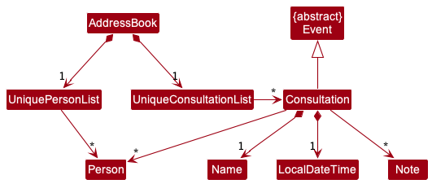

* Table of Contents
{:toc}

--------------------------------------------------------------------------------------------------------------------

## **Acknowledgements**

* {list here sources of all reused/adapted ideas, code, documentation, and third-party libraries -- include links to the original source as well}

--------------------------------------------------------------------------------------------------------------------

## **Setting up, getting started**

Refer to the guide [_Setting up and getting started_](SettingUp.md).

--------------------------------------------------------------------------------------------------------------------

## **Design**

:bulb: **Tip:** The `.puml` files used to create diagrams in this document can be found in the [diagrams](https://github.com/AY2223S2-CS2103-F11-1/tp/tree/master/docs/diagrams/) folder. Refer to the [_PlantUML Tutorial_ at se-edu/guides](https://se-education.org/guides/tutorials/plantUml.html) to learn how to create and edit diagrams.

### Architecture

The ***Architecture Diagram*** given above explains the high-level design of the App.

Given below is a quick overview of main components and how they interact with each other.

**Main components of the architecture**

**`Main`** has two classes called [`Main`](https://github.com/AY2223S2-CS2103-F11-1/tp/tree/master/src/main/java/seedu/address/Main.java) and [`MainApp`](https://github.com/AY2223S2-CS2103-F11-1/tp/tree/master/src/main/java/seedu/address/MainApp.java). It is responsible for,
* At app launch: Initializes the components in the correct sequence, and connects them up with each other.
* At shut down: Shuts down the components and invokes cleanup methods where necessary.

[**`Commons`**](#common-classes) represents a collection of classes used by multiple other components.

The rest of the App consists of four components.

* [**`UI`**](#ui-component): The UI of the App.
* [**`Logic`**](#logic-component): The command executor.
* [**`Model`**](#model-component): Holds the data of the App in memory.
* [**`Storage`**](#storage-component): Reads data from, and writes data to, the hard disk.

**How the architecture components interact with each other**

The *Sequence Diagram* below shows how the components interact with each other for the scenario where the user issues the command `delete 1`.

Each of the four main components (also shown in the diagram above),

* defines its *API* in an `interface` with the same name as the Component.
* implements its functionality using a concrete `{Component Name}Manager` class (which follows the corresponding API `interface` mentioned in the previous point.

For example, the `Logic` component defines its API in the `Logic.java` interface and implements its functionality using the `LogicManager.java` class which follows the `Logic` interface. Other components interact with a given component through its interface rather than the concrete class (reason: to prevent outside component's being coupled to the implementation of a component), as illustrated in the (partial) class diagram below.

The sections below give more details of each component.

### UI component

The **API** of this component is specified in [`Ui.java`](https://github.com/AY2223S2-CS2103-F11-1/tp/tree/master/src/main/java/seedu/address/ui/Ui.java)

The UI consists of a `MainWindow` that is made up of parts e.g.`CommandBox`, `ResultDisplay`, `PersonListPanel`, `StatusBarFooter` etc. All these, including the `MainWindow`, inherit from the abstract `UiPart` class which captures the commonalities between classes that represent parts of the visible GUI.

The `UI` component uses the JavaFx UI framework. The layout of these UI parts are defined in matching `.fxml` files that are in the `src/main/resources/view` folder. For example, the layout of the [`MainWindow`](https://github.com/se-edu/addressbook-level3/tree/master/src/main/java/seedu/address/ui/MainWindow.java) is specified in [`MainWindow.fxml`](https://github.com/se-edu/addressbook-level3/tree/master/src/main/resources/view/MainWindow.fxml)

The `UI` component,

* executes user commands using the `Logic` component.
* listens for changes to `Model` data so that the UI can be updated with the modified data.
* keeps a reference to the `Logic` component, because the `UI` relies on the `Logic` to execute commands.
* depends on some classes in the `Model` component, as it displays `Person` object residing in the `Model`.

### Logic component

**API** : [`Logic.java`](https://github.com/AY2223S2-CS2103-F11-1/tp/tree/master/src/main/java/seedu/address/logic/Logic.java)

Here's a (partial) class diagram of the `Logic` component:

How the `Logic` component works:
1. When `Logic` is called upon to execute a command, it uses the `AddressBookParser` class to parse the user command.
1. This results in a `Command` object (more precisely, an object of one of its subclasses e.g., `AddCommand`) which is executed by the `LogicManager`.
1. The command can communicate with the `Model` when it is executed (e.g. to add a person).
1. The result of the command execution is encapsulated as a `CommandResult` object which is returned back from `Logic`.

The Sequence Diagram below illustrates the interactions within the `Logic` component for the `execute("rm 1")` API call.

:information_source: **Note:** The lifeline for `DeleteCommandParser` should end at the destroy marker (X) but due to a limitation of PlantUML, the lifeline reaches the end of diagram.

Here are the other classes in `Logic` (omitted from the class diagram above) that are used for parsing a user command:

How the parsing works:
* When called upon to parse a user command, the `AddressBookParser` class creates an `XYZCommandParser` (`XYZ` is a placeholder for the specific command name e.g., `AddCommandParser`) which uses the other classes shown above to parse the user command and create a `XYZCommand` object (e.g., `AddCommand`) which the `AddressBookParser` returns back as a `Command` object.
* All `XYZCommandParser` classes (e.g., `AddCommandParser`, `DeleteCommandParser`, ...) inherit from the `Parser` interface so that they can be treated similarly where possible e.g, during testing.

### Model component
**API** : [`Model.java`](https://github.com/AY2223S2-CS2103-F11-1/tp/tree/master/src/main/java/seedu/address/model/Model.java)

The `Model` component,

* stores the address book data i.e., all `Person`, `Consultation`, `Tutorial`, `Lab` objects (which are contained in a `UniquePersonList`, `UniqueConsultationList`, `UniqueTutorialList`, `UniqueLabList` objects respectively).
* stores the currently 'selected' `Person` objects (e.g., results of a search query) as a separate _filtered_ list which is exposed to outsiders as an unmodifiable `ObservableList<Person>` that can be 'observed' e.g. the UI can be bound to this list so that the UI automatically updates when the data in the list change.
* stores the currently 'selected' `Tutorial` objects (e.g., results of a filter / sort query) as a separate _filtered_ list which is exposed to outsiders as an unmodifiable `ObservableList<Tutorial>` that can be 'observed' e.g. the UI can be bound to this list so that the UI automatically updates when the data in the list change.
* stores the currently 'selected' `Consultation` objects (e.g., results of a filter / sort query) as a separate _filtered_ list which is exposed to outsiders as an unmodifiable `ObservableList<Consultation>` that can be 'observed' e.g. the UI can be bound to this list so that the UI automatically updates when the data in the list change.
* stores the currently 'selected' `Lab` objects (e.g., results of a filter / sort query) as a separate _filtered_ list which is exposed to outsiders as an unmodifiable `ObservableList<Lab>` that can be 'observed' e.g. the UI can be bound to this list so that the UI automatically updates when the data in the list change.
* stores a `UserPref` object that represents the user’s preferences. This is exposed to the outside as a `ReadOnlyUserPref` objects.
* does not depend on any of the other three components (as the `Model` represents data entities of the domain, they should make sense on their own without depending on other components)
* It might seem strange at first as to why can Tutorial, Lab and Consultation exist without students. How can a Tutorial or Lab or Consultation be conducted without students in the first place? That is because the purpose of our application is to remind TAs that they are supposed to attend an event. During the event itself, the TA will add students to the event for attendance taking.
* Thereafter, the TA will be able to edit the performance (score) of the student for the event related task.

:information_source: **Note:** An alternative (arguably, a more OOP) model is given below. It has a `Tag` list in the `AddressBook`, which `Person` references. This allows `AddressBook` to only require one `Tag` object per unique tag, instead of each `Person` needing their own `Tag` objects. 

:information_source: **Note:** An alternative (arguably, a more OOP) model is given below. It has a `Event` abstract class in the `AddressBook`, which `Tutorial` inherits from. 

:information_source: **Note:** An alternative (arguably, a more OOP) model is given below. It has a `Event` abstract class in the `AddressBook`, which `Lab` inherits from. 

:information_source: **Note:** An alternative (arguably, a more OOP) model is given below. It has a `Event` abstract class in the `AddressBook`, which `Consultation` inherits from. 

### Storage component

**API** : [`Storage.java`](https://github.com/AY2223S2-CS2103-F11-1/tp/tree/master/src/main/java/seedu/address/storage/Storage.java)

The `Storage` component,
* can save both address book data and user preference data in json format, and read them back into corresponding objects.
* inherits from both `AddressBookStorage` and `UserPrefStorage`, which means it can be treated as either one (if only the functionality of only one is needed).
* depends on some classes in the `Model` component (because the `Storage` component's job is to save/retrieve objects that belong to the `Model`)

### Common classes

Classes used by multiple components are in the `seedu.addressbook.commons` package.

--------------------------------------------------------------------------------------------------------------------

## **Implementation**

This section describes some noteworthy details on how certain features are implemented.

### \[Proposed\] Undo/redo feature

#### Proposed Implementation

The proposed undo/redo mechanism is facilitated by `VersionedAddressBook`. It extends `AddressBook` with an undo/redo history, stored internally as an `addressBookStateList` and `currentStatePointer`. Additionally, it implements the following operations:

* `VersionedAddressBook#commit()` — Saves the current address book state in its history.
* `VersionedAddressBook#undo()` — Restores the previous address book state from its history.
* `VersionedAddressBook#redo()` — Restores a previously undone address book state from its history.

These operations are exposed in the `Model` interface as `Model#commitAddressBook()`, `Model#undoAddressBook()` and `Model#redoAddressBook()` respectively.

Given below is an example usage scenario and how the undo/redo mechanism behaves at each step.

Step 1. The user launches the application for the first time. The `VersionedAddressBook` will be initialized with the initial address book state, and the `currentStatePointer` pointing to that single address book state.

Step 2. The user executes `delete 5` command to delete the 5th person in the address book. The `delete` command calls `Model#commitAddressBook()`, causing the modified state of the address book after the `delete 5` command executes to be saved in the `addressBookStateList`, and the `currentStatePointer` is shifted to the newly inserted address book state.

Step 3. The user executes `add n/David …​` to add a new person. The `add` command also calls `Model#commitAddressBook()`, causing another modified address book state to be saved into the `addressBookStateList`.

:information_source: **Note:** If a command fails its execution, it will not call `Model#commitAddressBook()`, so the address book state will not be saved into the `addressBookStateList`.

Step 4. The user now decides that adding the person was a mistake, and decides to undo that action by executing the `undo` command. The `undo` command will call `Model#undoAddressBook()`, which will shift the `currentStatePointer` once to the left, pointing it to the previous address book state, and restores the address book to that state.

:information_source: **Note:** If the `currentStatePointer` is at index 0, pointing to the initial AddressBook state, then there are no previous AddressBook states to restore. The `undo` command uses `Model#canUndoAddressBook()` to check if this is the case. If so, it will return an error to the user rather
than attempting to perform the undo.

The following sequence diagram shows how the undo operation works:

:information_source: **Note:** The lifeline for `UndoCommand` should end at the destroy marker (X) but due to a limitation of PlantUML, the lifeline reaches the end of diagram.

The `redo` command does the opposite — it calls `Model#redoAddressBook()`, which shifts the `currentStatePointer` once to the right, pointing to the previously undone state, and restores the address book to that state.

:information_source: **Note:** If the `currentStatePointer` is at index `addressBookStateList.size() - 1`, pointing to the latest address book state, then there are no undone AddressBook states to restore. The `redo` command uses `Model#canRedoAddressBook()` to check if this is the case. If so, it will return an error to the user rather than attempting to perform the redo.

Step 5. The user then decides to execute the command `list`. Commands that do not modify the address book, such as `list`, will usually not call `Model#commitAddressBook()`, `Model#undoAddressBook()` or `Model#redoAddressBook()`. Thus, the `addressBookStateList` remains unchanged.

Step 6. The user executes `clear`, which calls `Model#commitAddressBook()`. Since the `currentStatePointer` is not pointing at the end of the `addressBookStateList`, all address book states after the `currentStatePointer` will be purged. Reason: It no longer makes sense to redo the `add n/David …​` command. This is the behavior that most modern desktop applications follow.

The following activity diagram summarizes what happens when a user executes a new command:

#### Design considerations:

**Aspect: How undo & redo executes:**

* **Alternative 1 (current choice):** Saves the entire address book.
  * Pros: Easy to implement.
  * Cons: May have performance issues in terms of memory usage.

* **Alternative 2:** Individual command knows how to undo/redo by
  itself.
  * Pros: Will use less memory (e.g. for `delete`, just save the person being deleted).
  * Cons: We must ensure that the implementation of each individual command are correct.

_{more aspects and alternatives to be added}_

### \[Proposed\] Event feature

#### Proposed Implementation

The proposed CRUD (Create, Read, Update and Delete) mechanism for events is facilitated by `Event`, `Tutorial`, `Lab`, `Consultation`. The Teaching Assistant (TA) using the application will be able to:

* Add a tutorial which will be saved in the current address book state in its history.
* Delete a tutorial which will be saved in the current address book state in its history.
* Edit a tutorial which will be saved in the current address book state in its history.

* Add a lab which will be saved in the current address book state in its history.
* Delete a lab which will be saved in the current address book state in its history.
* Edit a lab which will be saved in the current address book state in its history.

* Add a consultation which will be saved in the current address book state in its history.
* Delete a consultation which will be saved in the current address book state in its history.
* Edit a consultation which will be saved in the current address book state in its history.

The following activity diagram summarizes what happens when a TA executes an add event.
Do take note that whether the event is recurring or not is included as well:

The following activity diagram summarizes what happens when a TA executes an delete event:

The following activity diagram summarizes what happens when a TA executes an edit event:

The following activity diagram summarizes what happens when a TA executes an add student to event:

The following activity diagram summarizes what happens when a TA executes an edit student in event:

The following activity diagram summarizes what happens when a TA executes an delete student from event:

#### Design considerations:

**Aspect: How CRUD (non-recurring) events executes:**

* **Alternative 1 (current choice):** Save Tutorial, Lab and Consultation as separate events.
    * Pros: Easy to implement, better abstraction.
    * Cons: More memory since more code is written.

* **Alternative 2:** Combine all the Tutorial, Lab and Consultations in an event, and check whether it is Tutorial, Lab or Consultation based on the title or command.
  itself.
    * Pros: Will use less memory since less code is written,
    * Cons: Involves checking the content of the event such as the title, which does not obey to Software Principles.

**Aspect: How CRUD (recurring) events executes:**

* **1:** Increments Tutorial, Lab and Consultation only by date.
    * Pros: Ensures consistency and no duplicates due to mishandled / unhandles cases.
    * Cons: There can be a recurring event based by name. For example, the head TA can be in charge of multiple tutorials occurring at the same time,
  but TrAcker does not allow this since only one event can occur during a period of time (i.e. no timing overlap of events ).
  
  
This implementation can be overcome in future versions by allowing TrAcker to warn the TA of overlapping timings and the TA agreeing to it. This will involve
  a lot of cases which is why it is not allowed for now.
--------------------------------------------------------------------------------------------------------------------

## **Documentation, logging, testing, configuration, dev-ops**

* [Documentation guide](Documentation.md)
* [Testing guide](Testing.md)
* [Logging guide](Logging.md)
* [Configuration guide](Configuration.md)
* [DevOps guide](DevOps.md)

--------------------------------------------------------------------------------------------------------------------

## **Appendix: Requirements**

### Product scope

**Target user profile**:

* CS2040 TAs
* has a need to manage a small number of undergraduate students
* prefer desktop apps over other types
* can type fast
* prefers typing to mouse interactions
* is reasonably comfortable using CLI apps
* prefer using vim commands

**Value proposition**: manage students and practice using vim commands

### User stories

Priorities: High (must have) - `* * *`, Medium (nice to have) - `* *`, Low (unlikely to have) - `*`

1. Epic: As a CS2040 TA, I can monitor my schedule through the number of events (consultations / labs / tutorials) I have

| Priority    | As a CS2040 …​  | I want to …​                    | So that I …​                                                   |
|-------------|--------------------|------------------------------------|-------------------------------------------------------------------|
| `* * *`     | Lab TA             | create lab events                  | can track details related to the lab                              |
| `* * *`     | TA                 | create consultation events         | can track details related to the consultation                     |
| `* * *`     | Lab TA             | edit a lab event                   | will be reminded of the correct lab schedule                      |
| `* * *`     | Tutorial TA        | edit a tutorial event              | will be reminded of the correct tutorial schedule                 |
| `* * *`     | TA                 | edit a consultation event          | will be reminded of the correct consultation schedule             |
| `* * *`     | Tutorial TA        | delete a tutorial event            | can remove completed/cancelled tutorials                          |
| `* * *`     | Lab TA             | delete a lab event                 | can remove completed/cancelled labs                               |
| `* * *`     | TA                 | delete a consultation event        | can remove completed/cancelled consultations                      |
| `* * *`     | New TA             | list all upcoming the 2040 events  | can effectively pre-plan the schedule for the rest of my modules  |

2. Epic: As a CS2040 TA, I can effectively manage and keep track of all my students

| Priority | As a CS2040 …​| I want to …​                                            | So that I …​                                                                                      |
|----------|------------------|------------------------------------------------------------|------------------------------------------------------------------------------------------------------|
| `* * *`  | TA               | edit 2040 student's information                            | can fix erroneously added students                                                                   |
| `* * *`  | TA               | delete students from a 2040 event                          | can remove students who are no longer in the module                                                  |
| `* * *`  | TA               | have a search function to search for the desired student   | do not have to scroll through the namelist when marking attendance/giving class participation marks  |
| `* * *`  | New TA           | list all my students of 2040                               | can view all my students at a glance                                                                 |

3. Epic: As a CS2040 TA, I can track students progress and information

| Priority | As a CS2040 …​| I want to …​                                                                                                              | So that I …​                                                                                                       |
|----------|------------------|---------------------------------------------------------------------------------------------------------------------------------|-----------------------------------------------------------------------------------------------------------------------------|
| `* * *`  | TA               | view a list of low-performing students at a glance based on grades                                                              | can immediately tell who is falling behind and personally offer them help                                                   |
| `* *`    | Tutorial TA      | see the attendance of students during a particular class in a calendar                                                          | can manage any admin matters efficiently and correctly, or flag out any low outliers                                        |
| `* *`    | Concerned TA     | find out which students are suddenly performing poorly/experienced sudden drop in performance                                   | know which students to check in on                                                                                          |
| `* *`    | TA               | be able to see how my students are doing in their examinations                                                                  | have data on their individual performance, which allows me to flag out low performers and help them out                     |
| `* *`    | TA               | have an an overview of students' progress in tutorials and labs submissions, especially where progress seemed slow or difficult | can identify trends in learning difficulties, ie which specific topics/concepts students seem to generally struggle with    |
| `* *`    | Lab TA           | track my students' progress on weekly lab assignments                                                                           | can make sure everyone submits their assignments on time and offer guidance if they need it                                 |
| `*`      | Concerned Lab TA | view the number of late lab submission per student                                                                              | can immediately tell who is falling behind and personally offer them help                                                   |
| `*`      | TA               | remind students via email if a 2040 event is rescheduled                                                                        | will not wast student's time                                                                                                |
| `*`      | Busy TA          | automatically send out reminders to students about upcoming deadlines                                                           | can spend less time on these administrative matters                                                                         |
| `*`      | Busy TA          | receive reminders on students who have yet to submit their work nearing the deadline                                            | can check up on them individually if needed                                                                                 |
| `*`      | Tutorial TA      | know my students' progress on their tutorial questions every week (ie. how many questions they are unsure of)                   | can decide how to pace my tutorial                                                                                          |
| `*`      | Lab TA           | see how my students are progressing on weekly topics on Visualgo                                                                | can send out reminders if I believe they have missed out on any weekly topics or offer help if they appear to be struggling |
| `*`      | Motivational TA  | find out who are the most consistent students                                                                                   | can recommend them for future TA positions                                                                                  |

4. Epic: As a CS2040 TA, I want to note down important information during an event

| Priority | As a CS2040 …​   | I want to …​                                           | So that I …​                                           |
|----------|---------------------|-----------------------------------------------------------|-----------------------------------------------------------|
| `* *`    | TA                  | add notes to events (such as tutorials)                   | won’t lose track of past events information               |
| `* *`    | TA                  | edit event notes                                          | will convenient update them when I have to                |
| `* *`    | TA                  | delete notes from an event                                | will not have cluttered notes                             |
| `*`      | Tutorial TA         | take down the queries of student                          | can seek to reply them later                              |
| `*`      | TA                  | summarise my performances at the end of this semester     | may reflect upon them                                     |
| `*`      | Lab TA              | note down some common vim commands as a cheatsheet        | can better navigate to inspect student codes via terminal |

5. Epic: As a CS2040 TA, I want to see a help guide

| Priority | As a CS2040 …​  | I want to …​                                          | So that I …​                                                |
|----------|--------------------|----------------------------------------------------------|----------------------------------------------------------------|
| `* *`    | New TA             | have an instruction to tell me what input format to use  | do not have to trial-and-error to figure out the right format  |
| `* *`    | New TA             | have the help page functions to be clear and unambiguous | will not be confused and input wrong commands                  |
| `*`      | New TA             | have an interactive help guide                           | do not have to manually read the help manual                   |

*{More to be added}*

### Use cases

(For all use cases below, the **System** is the `TrAcker` and the **Actor** is the `user`, unless specified otherwise)

---
System: Software System (TrAcker)
 
Use case: UC01 - Add Tutorial lessons
 
Person: An undergraduate student in NUS enrolled in CS2040 as a student
 
Actor: CS2040 Tutorial Teaching Assistant (TA)
 
Precondition: TA has access to the TrAcker application

**MSS**

1.  TA starts TrAcker desktop application.
2.  TA enters command to create new tutorial.
3.  TA confirms creation of tutorial.
4.  TrAcker displays the new tutorial event.

Use case ends.

**Extensions**

* 3a. TrAcker detects an error in the entered tutorial data.
  * 3a1. TrAcker requests for the correct tutorial data where there was an error.
  * 3a2. TA enters new tutorial data.
  Steps 3a1 - 3a2 are repeated until the data entered to create a new tutorial are correct.
   
  Use case resumes from Step 4.

* a. At any time, TA decides not to create a new tutorial.
  * a1. TA removes input from TrAcker.

Use case ends

---
System: Software System (TrAcker)
 
Use case: UC02 - Add Lab lessons
 
Person: An undergraduate student in NUS enrolled in CS2040 as a student
 
Actor: CS2040 Lab Teaching Assistant (TA)
 
Precondition: TA has access to the TrAcker application

**MSS**

1.  TA starts TrAcker desktop application.
2.  TA enters command to create new lab.
3.  TA confirms creation of lab.
4.  TrAcker displays the new lab event.

Use case ends.

**Extensions**

* 3a. TrAcker detects an error in the entered lab data.
    * 3a1. TrAcker requests for the correct lab data where there was an error.
    * 3a2. TA enters new lab data.
      Steps 3a1 - 3a2 are repeated until the data entered to create a new lab are correct.
       
      Use case resumes from Step 4.

* a. At any time, TA decides not to create a new lab.
    * a1. TA removes input from TrAcker.

Use case ends

---
System: Software System (TrAcker)
 
Use case: UC03 - Add Consultation lessons
 
Person: An undergraduate student in NUS enrolled in CS2040 as a student
 
Actor: CS2040 Teaching Assistant (TA)
 
Precondition: TA has access to the TrAcker application

**MSS**

1.  TA starts TrAcker desktop application.
2.  TA enters command to create new consultation.
3.  TA confirms creation of consultation.
4.  TrAcker displays the new consultation event.

Use case ends.

**Extensions**

* 3a. TrAcker detects an error in the entered consultation data.
    * 3a1. TrAcker requests for the correct consultation data where there was an error.
    * 3a2. TA enters new consultation data.
      Steps 3a1 - 3a2 are repeated until the data entered to create a new consultation are correct.
       
      Use case resumes from Step 4.

* a. At any time, TA decides not to create a new consultation.
    * a1. TA removes input from TrAcker.

Use case ends.

---
System: Software System (TrAcker)
 
Use case: UC04 - Add students to event
 
Person: An undergraduate student in NUS enrolled in CS2040 as a student
 
Actor: CS2040 Teaching Assistant (TA)
 
Preconditions: 
- TA has access to the TrAcker application

**MSS**

1.  TA starts TrAcker desktop application.
2.  TA enters command to add student to an event.
3.  TA confirms addition of student to an event. 
4.  TrAcker marks the student's attendance as present.
5.  TrAcker displays the new student in the event.

Use case ends.

**Extensions**

* 3a. TrAcker detects that the event does not exist.
    * 3a1. TrAcker requests for the correct event data.
    * 3a2. TA enters new event data that the student should be added to.
      Steps 3a1 - 3a2 are repeated until the event data entered is correct and exists.
       
      Use case resumes from Step 4.

* 3b. TrAcker detects that the student does not exist.
    * 3b1. TrAcker requests for the correct student data.
    * 3b2. TA enters new student data.
      Steps 3b1 - 3b2 are repeated until the student data entered is correct and exists.
       
      Use case resumes from Step 4.

* 3c. TrAcker detects that the data entered is in a wrong format.
    * 3c1. TrAcker requests for the correct data format.
    * 3c2. TA enters new data format.
      Steps 3c1 - 3c2 are repeated until the data format is correct.
       
      Use case resumes from Step 4.

* a. At any time, TA decides not to add a student to the event.
    * a1. TA removes input from TrAcker.

Use case ends

*{More to be added}*

### Non-Functional Requirements

1. Should work on any _mainstream OS_ as long as it has Java `11` or above installed.
2. Should be able to hold up to 200 students without a noticeable sluggishness in performance for typical usage.
3. A user with above average typing speed for regular English text (i.e. not code, not system admin commands) should be able to accomplish most of the tasks faster using commands than using the mouse.
4. The Help syntax should be easily rendered.
5. Help displayed should be segmented properly.
6. Help displayed should be easy to follow.
7. Syntax help provided should be unambiguous.
8. Each page should load within 2 seconds.
9. The application should run on any operating system.
10. Any sorting should run in a maximum time of O(nlogn).
11. Events should be added in 1 second.
12. Events should be delete in 1 second.
13. There should be no keyboard input lag at any time.
14. Uploading attachments should take at most 10 seconds.
15. Deleting attachments should take at most 10 seconds.
16. Displaying a student profile picture should take at most 5 seconds.
17. Data should be saved to local storage after any data change has been made within the application.
18. Event notes should be pure texts (no images or videos).

*{More to be added}*

### Glossary

* **Mainstream OS**: Windows, Linux, Unix, OS-X
* **Private contact detail**: A contact detail that is not meant to be shared with others

--------------------------------------------------------------------------------------------------------------------

## **Appendix: Instructions for manual testing**

Given below are instructions to test the app manually.

:information_source: **Note:** These instructions only provide a starting point for testers to work on;
testers are expected to do more *exploratory* testing.

### Launch and shutdown

1. Initial launch

   1. Download the jar file and copy into an empty folder

   1. Double-click the jar file Expected: Shows the GUI with a set of sample contacts. The window size may not be optimum.

1. Saving window preferences

   1. Resize the window to an optimum size. Move the window to a different location. Close the window.

   1. Re-launch the app by double-clicking the jar file. 
       Expected: The most recent window size and location is retained.

1. _{ more test cases …​ }_

### Deleting a person

1. Deleting a person while all persons are being shown

   1. Prerequisites: List all persons using the `list` command. Multiple persons in the list.

   1. Test case: `rm 1` 
      Expected: First contact is deleted from the list. Details of the deleted contact shown in the status message. Timestamp in the status bar is updated.

   1. Test case: `rm 0` 
      Expected: No person is deleted. Error details shown in the status message. Status bar remains the same.

   1. Other incorrect delete commands to try: `rm`, `rm x`, `...` (where x is larger than the list size) 
      Expected: Similar to previous.

1. _{ more test cases …​ }_

### Saving data

1. Dealing with missing/corrupted data files

   1. _{explain how to simulate a missing/corrupted file, and the expected behavior}_

1. _{ more test cases …​ }_
