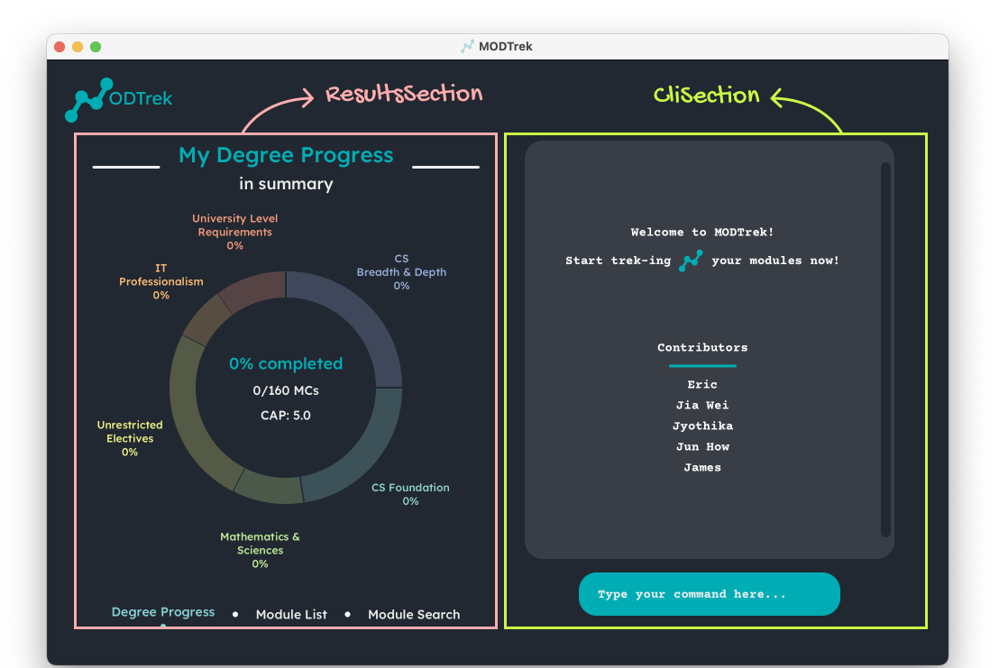

 
 

**MODTrek** is a desktop application for managing a typical NUS Computer Science student’s modules and degree progression, optimised for use via a Command Line Interface (CLI). The app provides a convenient platform for students to easily access and update their modules within presses of a keyboard.  
This application is currently geared towards NUS Computer Science Students of the AY2021-2022 cohort only. We hope to expand our application's scope in the coming years.

## Table of Contents 

1. [Acknowledgements](#acknowledgements)
2. [Setting up, getting started](#setting-up)
3. [Design](#design) 
   3.1. [Architecture](#architecture) 
   3.2. [UI component](#ui-component) 
   3.3. [Logic component](#logic-component) 
   3.4. [Model component](#model-component) 
   3.5. [Storage component](#storage-component) 
   3.6. [Common classes](#common-classes) 
4. [Implementation](#implementation) 
   4.1. [Add module feature](#add-module-feature) 
   4.2. [Find module feature](#find-module-feature) 
   4.3. [Delete module feature](#delete-module-feature) 
   4.4. [Sort modules feature](#sort-modules-feature) 
   4.5. [View progress/modules feature](#view-feature) 
5. [Documentation, logging, testing, configuration, dev-ops](#miscellaneous)
6. [Appendix: Requirements](#appendix) 
   6.1. [Product Scope](#product-scope) 
   6.2. [User Stories](#user-stories) 
   6.3. [Use Cases](#use-cases) 
   6.4. [Non-Functional Requirements](#non-functional-requirements) 
   6.5. [Glossary](#glossary) 
7. [Appendix: Instructions for manual testing](#manual-testing) 
   7.1. [Launch and shutdown](#launch-and-shutdown) 
   7.2. [Adding a module](#adding-a-module) 
   7.3. [Deleting a module](#deleting-module) 
   7.4. [Editing a module](#editing-a-module) 
   7.5. [Adding/removing tag(s) to a module](#tagging-a-module) 
   7.6. [Finding module(s)](#finding-module) 
   7.7. [Sorting modules](#sorting-modules) 
   7.8. [Toggling between Degree Progress and Module List screens](#toggling-screens) 
   7.9. [Requesting for help](#requesting-for-help) 
   7.10. [Exiting the program](#exiting-program) 
   7.11. [Saving data](#saving-data) 
   
--------------------------------------------------------------------------------------------------------------------

## **Acknowledgements** 

* The skeleton implementation of [DoughnutChart](https://github.com/AY2223S2-CS2103T-T13-1/tp/blob/master/src/main/java/seedu/modtrek/ui/progresssection/DoughnutChart.java) in [ProgressSection](https://github.com/AY2223S2-CS2103T-T13-1/tp/blob/master/src/main/java/seedu/modtrek/ui/progresssection/ProgressSection.java) is adapted from [this stackoverflow post](https://stackoverflow.com/questions/24121580/).

[Back to Table of Contents](#toc)

--------------------------------------------------------------------------------------------------------------------

## **Setting up, getting started** 

Refer to the guide [_Setting up and getting started_](SettingUp.md).

[Back to Table of Contents](#toc)

--------------------------------------------------------------------------------------------------------------------

## **Design** 

:bulb: **Tip:** The .puml files used to create diagrams in this document can be found in the [diagrams](https://github.com/AY2223S2-CS2103T-T13-1/tp/tree/master/docs/diagrams) folder. Refer to the [_PlantUML Tutorial_ at se-edu/guides](https://se-education.org/guides/tutorials/plantUml.html) to learn how to create and edit diagrams.

[Back to Table of Contents](#toc)

### Architecture 

The ***Architecture Diagram*** given above explains the high-level design of the App.

Given below is a quick overview of main components and how they interact with each other.

**Main components of the architecture**

**`Main`** has two classes called [`Main`](https://github.com/AY2223S2-CS2103T-T13-1/tp/blob/master/src/main/java/seedu/modtrek/Main.java) and [`MainApp`](https://github.com/AY2223S2-CS2103T-T13-1/tp/blob/master/src/main/java/seedu/modtrek/MainApp.java). It is responsible for,
* At app launch: Initializes the components in the correct sequence, and connects them up with each other.
* At shut down: Shuts down the components and invokes cleanup methods where necessary.

[**`Commons`**](#common-classes) represents a collection of classes used by multiple other components.

The rest of the App consists of four components.

* [**`UI`**](#ui-component): The UI of the App.
* [**`Logic`**](#logic-component): The command executor.
* [**`Model`**](#model-component): Holds the data of the App in memory.
* [**`Storage`**](#storage-component): Reads data from, and writes data to, the hard disk.

**How the architecture components interact with each other**

The *Sequence Diagram* below shows how the components interact with each other for the scenario where the user issues the command `delete cs1101s`.

Each of the four main components (also shown in the diagram above),

* defines its *API* in an `interface` with the same name as the Component.
* implements its functionality using a concrete `{Component Name}Manager` class (which follows the corresponding API `interface` mentioned in the previous point).

For example, the `Logic` component defines its API in the `Logic.java` interface and implements its functionality using the `LogicManager.java` class which follows the `Logic` interface. Other components interact with a given component through its interface rather than the concrete class (reason: to prevent outside component's being coupled to the implementation of a component), as illustrated in the (partial) class diagram below.

The sections below give more details of each component.

### UI component 

**API** : [`Ui.java`](https://github.com/AY2223S2-CS2103T-T13-1/tp/blob/master/src/main/java/seedu/modtrek/ui/Ui.java)

Here's a (partial) class diagram of the `Ui` component:

:information_source: **Note:** Most components contained in `MainWindow` (with the exception of `DoughnutChart`, `CliScreen` and `CliInput`) inherit from the abstract `UiPart` class (not shown in the above class diagram) which captures the commonalities between classes that represent parts of the visible GUI.

The UI consists of a `MainWindow` that is made up of two main sections: `ResultsSection` and `CliSection`, as depicted below:

`CliSection` consists of `CliScreen` and `CliInput` components, depicted below:

`ResultsSection` consists of three subsections: `ProgressSection`, `ModuleListSection` and `ModuleSearchSection`, as depicted below. At any point in time, only one section is actively shown on the `ResultsSection`.

Each of these subsections consists of smaller UI components, which are annotated below:

:information_source: **Note:** 
There are no separate Java classes created for `CliScreen` and `CliInput` due their simplicity in functionality. It is sufficient to compose them within the `CliSection` class in the form of basic JavaFx components (`CliScreen` as a `VBox` and `CliInput` as a `TextField`). They are referenced in [`CliSection.fxml`](https://github.com/AY2223S2-CS2103T-T13-1/tp/blob/master/src/main/resources/view/clisection/CliSection.fxml).
Likewise, many smaller, simple components composed within larger components like [`ModuleCard`](https://github.com/AY2223S2-CS2103T-T13-1/tp/blob/master/src/main/java/seedu/modtrek/ui/modulesection/ModuleCard.java) do not have separate Java classes created for them.

The `Ui` component uses the JavaFx UI framework. The layout of these UI parts are defined in matching `.fxml` files that are in the `src/main/resources/view` folder. For example, the layout of the [`MainWindow`](https://github.com/AY2223S2-CS2103T-T13-1/tp/blob/master/src/main/java/seedu/modtrek/ui/MainWindow.java) is specified in [`MainWindow.fxml`](https://github.com/AY2223S2-CS2103T-T13-1/tp/blob/master/src/main/resources/view/MainWindow.fxml)

The `Ui` component,

* executes user commands using the `Logic` component.
* listens for changes to `Model` data so that the UI can be updated with the modified data.
* keeps a reference to the `Logic` component, because the `UI` relies on the `Logic` to execute commands.
* depends on some classes in the `Model` component, as it displays `Module` and `DegreeProgression` objects residing in the `Model`.

[Back to Table of Contents](#toc)

### Logic component 

**API** : [`Logic.java`](https://github.com/AY2223S2-CS2103T-T13-1/tp/blob/master/src/main/java/seedu/modtrek/logic/Logic.java)

Here's a (partial) class diagram of the `Logic` component:

How the `Logic` component works:
1. When `Logic` is called upon to execute a command, it uses the `ModTrekParser` class to parse the user command.
1. This results in a `Command` object (more precisely, an object of one of its subclasses e.g., `AddCommand`) which is executed by the `LogicManager`.
1. The command can communicate with the `Model` when it is executed (e.g. to add a module).
1. The result of the command execution is encapsulated as a `CommandResult` object which is returned back from `Logic`.

The Sequence Diagram below illustrates the interactions within the `Logic` component for the `execute("delete /m CS1010 /m Cs2040")` API call.

:information_source: **Note:** The lifeline for `DeleteCommandParser` should end at the destroy marker (X) but due to a limitation of PlantUML, the lifeline reaches the end of diagram.

Here are the other classes in `Logic` (omitted from the class diagram above) that are used for parsing a user command:

How the parsing works:
* When called upon to parse a user command, the `ModTrekParser` class creates an `XYZCommandParser` (`XYZ` is a placeholder for the specific command name e.g., `AddCommandParser`) which uses the other classes shown above to parse the user command and create a `XYZCommand` object (e.g., `AddCommand`) which the `ModTrekParser` returns back as a `Command` object.
* All `XYZCommandParser` classes (e.g., `AddCommandParser`, `DeleteCommandParser`, ...) inherit from the `Parser` interface so that they can be treated similarly where possible e.g, during testing.

[Back to Table of Contents](#toc)

### Model component 

**API** : [`Model.java`](https://github.com/AY2223S2-CS2103T-T13-1/tp/blob/master/src/main/java/seedu/modtrek/model/Model.java)

Here's a (partial) class diagram of the `Model` component:

[Back to Table of Contents](#toc)

The `Model` component,

* stores the degree progression i.e., all `Module` objects (which are contained in a `UniqueModuleList` object) and generates `DegreeProgressionData` if needed.
* stores the currently 'selected' `Module` objects (e.g., results of the `find` command) as a separate _filtered_ list which is exposed to outsiders as an unmodifiable `ObservableList<Module>` that can be 'observed' e.g. the UI can be bound to this list so that the UI automatically updates when the data in the list change.
* stores a `UserPref` object that represents the user’s preferences. This is exposed to the outside as a `ReadOnlyUserPref` objects.
* does not depend on any of the other three components (as the `Model` represents data entities of the domain, they should make sense on their own without depending on other components)

[Back to Table of Contents](#toc)

### Storage component 

**API** : [`Storage.java`](https://github.com/AY2223S2-CS2103T-T13-1/tp/blob/master/src/main/java/seedu/modtrek/storage/Storage.java)

Here's a (partial) class diagram of the `Storage` component:

The `Storage` component,
* can save both degree progression's `UniqueModuleList` and user preference data in json format, and read them back into corresponding objects.
* inherits from both `DegreeProgressionStorage` and `UserPrefStorage`, which means it can be treated as either one (if only the functionality of only one is needed).
* depends on some classes in the `Model` component (because the `Storage` component's job is to save/retrieve objects that belong to the `Model`)

[Back to Table of Contents](#toc)

### Common classes 

Classes used by multiple components are in the `seedu.modtrek.commons` package.

[Back to Table of Contents](#toc)

--------------------------------------------------------------------------------------------------------------------

## **Implementation** 

This section describes some noteworthy details on how certain features are implemented.

### **Add module feature** 

#### About this feature

The add module feature allows users to quickly add a module in to the application using the command `add /m <code> /c <credits> /y <year-semester> (/g <grade>) (/t <tag>...)`

#### How it is implemented

The `add` command is facilitated by the `AddCommand` and the `AddCommandParser`.
`AddCommandParser` makes use of the `ArgumentTokenizer::tokenize` to extract out the relevant inputs of each field which will be used to make new `Code`, `Credit`, `SemYear`, `Grade` and `Set<Tag>` objects. These objects will then be used to make a new `Module` object. The method `addModule` from the `Model` interface will then add the new `Module` object into the `UniqueModuleList` of modules.

#### Parsing user input

1. The user inputs the `add` command with its relevant details.
2. The `LogicManager` takes the input and passes it to the `ModTrekParser` which processes the input and recognises it as an add command and makes a new `AddCommandParser`.
3. The `AddCommandParser` then calls `ArgumentTokenizer::tokenize` to extract the relevant inputs of each field. If any of the compulsory fields are missing, a `ParseException` would be thrown.
4. `ParserUtil` will then check the validity of the input for `Code`, `Credit`, `SemYear`, `Grade` and `Set<Tag>` and make an object for them. If any of the inputs are invalid, a `ParseException` will be thrown.
5. A `Module` object will then be created with the objects created for each input field and an `AddCommand` object which takes in that `Module` object will be created.

#### Command execution

1. The `LogicManager` executes the `AddCommand`
2. `AddCommand` calls `ModelManager::addModule` which is implemented the `Model` interface to add the `Module` into the `UniqueModuleList` of `DegreeProgression`.

#### Displaying of result

1. `AddCommand` will create a new `CommandResult` with a success message and return it back to the `LogicManager`.
2. The GUI will make extract out the message from the `CommandResult` and display it to the user.

#### Design consideration

Some users may not have taken the module or are still not certain how they want to tag the module. We hence implemented for the `Code`, `Credit` and `SemYear` fields to be compulsory so that they can add the modules
yet to be taken as a way of letting them plan what modules that want to take in the future.

The following sequence diagram shows how the `add` command works:

The following activity diagram shows what happens when a user executes an `add` command:

[Back to Table of Contents](#toc)

### **Find module feature** 

#### About this feature

The find module feature serves as a filtering tool that allows users to find a specific modules based on its code or according to a code prefix, credits, year-semester, grade, or tags.

The command format is either `find (<moduleCode>)` or `find (/m <codePrefix>) (/c <credits>) (/y <year-semester>) (/g <grade>) (/t <tags>...)`

#### How it is implemented
The `find` command is facilitated by the `FindCommand` and the `FindCommandParser` classes.
`FindCommandParser` makes use of the `ArgumentTokenizer::tokenize` method to extract out the relevant inputs of each field in the form of a String which will be used as arguments to make a new `ModuleCodePredicate` object. In the same `FindCommandParser` class, a new `FindCommand` object will be instantiated, with the `ModuleCodePredicate` object being passed as an argument. Finally, the `FindCommand` object will be executed by the `LogicManager`.

#### Parsing user input
1. The user inputs the `find` command with the relevant arguments. At least one argument needs to be provided.
2. The `LogicManager` takes the input and passes it to the `ModTrekParser` which processes the input, recognises it as a find command and makes a new `AddCommandParser` object.
3. The `FindCommandParser` then calls `ArgumentTokenizer::tokenize` to extract out the relevant inputs of each field. If no arguments are provided, or if prefixes are provided without the relevant details, a `ParseException` will be thrown.
4. The `ParserUtil` will then check the validity of the input for `CodePrefix`, `Credit`, `SemYear`, `Grade` and `Set<Tag>`. If any of the inputs are invalid, a `ParseException` will be thrown as well.
5. If the input is valid, `ModuleCodePredicate` object will be created, taking in the arguments `CodePrefix`, `Credit`, `SemYear`, `Grade` and `Set<Tag>`. Following which, a `FindCommand` object will be created.

#### Command execution
1. The `LogicManager` executes the `FindCommand`.
2. `FindCommand` calls `ModelManager::updateFilteredModuleList` taking in the `ModuleCodePredicate` to update the `FilteredModuleList` formed from `UniqueModuleList` of `DegreeProgression`.

#### Displaying of result
1. `FindCommand` will create a new `CommandResult` object with a success message and return it back to `LogicManager`.
2. The GUI will extract out the message from the `CommandResult` and display it to the user.

#### Design considerations
**Aspect: Command format**

User may choose between the two formats for the FindCommand which function differently below:
* **Format 1:** Finds a specific module.
    * Format notation: `find <moduleCode>`
    * Example: `find CS1101S`
    * Reason for implementation: User may want to conveniently access a specific module which they have taken to check its details.

* **Format 2:** Finds a set of modules by filters (single or multiple).
    * Format notation: `find /m <codePrefix> /c <credits> /y <year-semester> /g <grade> /t <tags>...`
    * Example: `find /m CS`
    * Reason for implementation: User may want to filter modules by a certain category to review the modules which fulfill a condition.

The following sequence diagram shows how the `find` command works:

The following activity diagram shows what happens when a user executes a `find` command:

[Back to Table of Contents](#toc)

### **Delete module feature** 

#### About this feature
The delete feature allows users to delete multiple modules via the command
`delete /m <module code> /m <module code>...` or all modules via the command `delete all`.

#### How it is implemented
When the user inputs `delete` command, the input will be parsed and the `all` keyword will be extracted using
`ArgumentMultimap#preamble()`. Otherwise, if the parser does not find the `all` keyword in the input,
the parser will parse module codes in the input in the form `/m <module code>` using
`ArgumentMultimap#getAllValues(PREFIX_CODE)`. As the command is executed, all modules will be removed from the
`UniqueModuleList` if the `all` keyword is present or the modules with the matching parsed modules codes
will be removed from the `UniqueModuleList` using the command `ModelManager#deleteModule(Module)`.

#### Parsing user input
1. The user inputs the `delete` command with its relevant details.
2. The `LogicManager` takes the  input and passes it to the `ModTrekParser` which processes the input and recognises it
as a delete command and makes a new `DeleteCommandParser`.
3. The `DeleteCommandParser` then calls `ArgumentTokenizer::tokenize` to extract the relevant inputs
of each field. If any of the compulsory fields are missing, a `ParseException` would be thrown.
4. `ParserUtil` will then check the validity of the inputs for `Set<Code>` if the `all` keyword is missing. If the
inputs are invalid, a `ParseException` would be thrown.
5. `Code` objects and a `Set<Code>` object will be created and a `DeleteCommand` object which takes in a boolean,
`isAll` to indicate if the `all` keyword is present in the user input, and a `Set<Code>` object will be created.

#### Command execution
1. The `LogicManager` executes the `DeleteCommand`.
2. The `DeleteCommand` object calls `ModelManager::deleteModule` which is implements the `Model` interface to delete
the retrieved `Module` objects from `UniqueModuleList` of `DegreeProgression` based on the `isAll` boolean and
`Set<Code>` object.

#### Displaying of result
1. `DeleteCommand` will create a new `CommandResult` object with message indicating which modules were successfully
deleted based on the input and return it back to `LogicManager`.
2. The GUI will extract out the message from the `CommandResult` and display it to the user.

#### Design considerations
**Aspect: Command format**

User may choose between the two formats for the `delete` command which function differently below:
* **Format 1:** Deletes all specific module.
    * Format notation: `delete /m <moduleCode> ...`
    * Example: `delete /m CS3233 /m CS3203`
    * Reason for implementation: User may want to conveniently delete a specific modules they have withdrawn from
or wrongly added.

* **Format 2:** Deletes all modules.
    * Format notation: `delete all`
    * Reason for implementation: User may want to start adding modules freshly, in case they realise all or most of the modules they added are irrelevant to them.

The following sequence diagram shows how the `delete`:

The following activity diagram shows what happens when a user executes a `delete` command:

[Back to Table of Contents](#toc)

### **Sort modules feature** 

#### About this feature
The sort feature allows users to categorise their modules in MODTrek via the command `sort <flag>`.
The flag parameter indicates which category to sort by.

The available categories are:
- Semester Year (Default)
- Module Code Prefix
- Grade
- Tags
- Credits

#### How it is implemented
When the user inputs the `sort` command with the flag as parameter, the input will be parsed and the flag will be retrieved
with `ArgumentMultimap#preamble()`. As the command is executed, the list will be sorted into a treemap according to the
flag. Once sorted, the GUI is able to display the sorted modules.

#### Parsing user input
1. The user input `sort` command
2. The `ModTrekParser` processes the input and creates a new `SortCommandParser`
3. The `SortCommandParser` calls the `ArgumentMultimap#preamble()` to retrieve the flag. 
If the flag is missing, a `ParseException` will be thrown.
4. The `SortCommandParser` will check if the flag is valid. If it is invalid, a `ParseException` will be thrown.
5. The `SortCommandParser` then creates a `SortCommand` determined by the flag.

#### Command execution
1. The `LogicManager` executes the `SortCommand`.
2. The `SortCommand` calls `Model#sortMap(CliSyntax flag)` to update the internal state of the map in the model to
sort by the corresponding category.

#### Displaying of result
1. The `SortCommand` creates a `CommandResult` with a success message and boolean to indicate which of the GUI screen
to switch to.

The following sequence diagram shows how `SortCommand` works during execution for `sort /m`:

The following activity diagram shows the logic flow as the user inputs the `sort` command for `sort /m`:

#### Design considerations
**Aspect: Command to sort the modules**

As the user adds more modules, he/she might find it more useful to look at the list of modules in different categories. However, the more useful categorising, in terms of progression, will be by the Semester Year. Therefore, at startup, the module list will be categorised by Semester Year, but this command is implemented to give the user flexibility in their module viewing.

[Back to Table of Contents](#toc)

### **View progress/modules feature** 

#### About this feature
The View feature displays either the degree progress or modules tracked by the app on the left panel (`ResultsSection`) of the GUI. The syntax of the command for this feature is `view <VIEW_TARGET>`, where `<VIEW_TARGET>` can either be `progress` or `modules`.

The `view progress` command displays some summary statistics of the degree progress to the user as follows:
- Percentage of total MCs completed thus far.
- Number of meaningful (details of meaningful will be under [Generation of Progression Data](#generation-of-degree-progression-data)) MCs completed out of total MCs required to compete the CS degree.
- Current CAP.
- Percentage of MCs completed for each degree requirement, displayed in a doughnut chart.

The `view progress` command also displays more details on the (`CliScreen`) of the GUI to the user as follows:
- Current CAP.
- Number of MCs completed for each degree requirement.
- Number of MCs in total for planned modules.
- Number of meaningful MCs

The `view modules` command displays all modules that have been added to the app by the user thus far. The modules displayed are categorised by year/semester by default. The criteria of categorisation can be changed via the `sort` command (described **below**). The following details of each module is displayed:
- Module code
- Modular credits
- Year/semester
- Grade (if applicable)
- Tags (degree requirements, if tagged)

#### How it is implemented
**View degree progress:**
The following are noteworthy classes involved in the handling of `view progress` command:
- `ViewCommand` which handles the execution of the command.
- `ViewCommandParser` which handles the parsing of the command.
- `ProgressSection` which displays the current degree progress on the GUI.
- `DegreeProgressionData` which calculates the relevant details based on the module list.
- `DegreeProgressionException` which denotes calculation exception.

**View modules:**
The following are noteworthy classes involved in the handling of `view modules` command:
- `ViewCommand` which handles the parsing and execution of the command.
- `ViewCommandParser` which handles the parsing of the command.
- `ModuleListSection` which displays all the modules on the GUI.

The implementation details are described in further details below.

#### Parsing user input
1. The user inputs the `view` command.
2. `ModTrekParser` processes the input and creates a new `ViewCommandParser`.
3. The `ViewCommandParser` validates whether `<VIEW_TARGET>` is present in the input and is either `progress` or `modules`. If `<VIEW_TARGET>` is absent or invalid, a `ParseException` would be thrown.
4. The `ViewCommandParser` then creates a `ViewCommand`, determined by the `<VIEW_TARGET>`.

#### Command execution
**View degree progress:**
- `LogicManager` executes `ViewCommand` and generates the `DegreeProgressionData`.
- If the `DegreeProgressionData` is invalid, a `CommandException` is thrown to notify the user that the calculation has an error.
- On success, the execution returns a `CommandResult`, encapsulating the information that degree progress is to be displayed and the information to be displayed on the (`CliScreen`).

**View modules:**
- `LogicManager` executes `ViewCommand` and returns a `CommandResult`, encapsulating the information that all modules tracked by the app so far are to be displayed.

#### Displaying of result
1. `MainWindow` validates from the returned `CommandResult` that the degree progress is to be displayed on the GUI, and calls `ResultsSection::displayProgress`. `ResultsSection::displayProgress` takes in a `ReadOnlyDegreeProgression` object which encapsulates information on the user's current degree progress, based on the modules added by the user thus far.
2. `ResultsSection` renders the `ProgressSection`, which displays a `DoughnutChart`.
3. `DoughnutChart` obtains and displays summary statistics regarding the degree progress through the `DegreeProgressionData` object.

The following sequence diagram illustrates how the `view` command works for the GUI:

The following sequence diagram illustrates what happens when the user inputs the `view progress` command:

The following activity diagram illustrates the workflow of the `view` command:

#### Generation of Degree Progression Data
An algorithm is used to generate the necessary data for `view progress`. **Meaningful credits** are credits counted into the requirements that are not duplicated. This is to prevent the scenario where multiple modules tagged into a singular requirement and the overall completion rate is 100%.

The following activity diagram illustrates the workflow of the algorithm when `DegreeProgressionData::generate` is called with the module list:

#### Design considerations
**Aspect: How to signal the Ui component to display the relevant screen (either `ProgressSection` or `ModuleListSection`), while ensuring that the _Separation of concerns principle_ is not violated?**

The `view <VIEW_TARGET>` command involves dynamic changes to the GUI, in terms of the correct screen to display upon execution of the command. Bearing in mind the _Separation of concerns principle_, we have to find an appropriate way to signal to `MainWindow` which screen is to be displayed, while ensuring that `MainWindow` does not handle any checking or parsing of the user input to obtain this information.
- **Solution:** Pass the information to the `CommandResult` returned by executing `ViewCommand`. Since `MainWindow` already has access to `CommandResult`, we can easily obtain the correct information regarding which screen to display through `CommandResult`.

[Back to Table of Contents](#toc)

--------------------------------------------------------------------------------------------------------------------

## **Documentation, logging, testing, configuration, dev-ops** 

* [Documentation guide](Documentation.md)
* [Testing guide](Testing.md)
* [Logging guide](Logging.md)
* [Configuration guide](Configuration.md)
* [DevOps guide](DevOps.md)

[Back to Table of Contents](#toc)

--------------------------------------------------------------------------------------------------------------------

## **Appendix: Requirements** 

### Product scope 

**Target user profile**:

* is a mainstream NUS Computer Science student
* has a need to track their degree progress, modules and grades
* prefer desktop apps over other types
* can type fast
* prefers typing to mouse interactions
* is reasonably comfortable using CLI apps
* wants an overview of their academic progress quickly

**Value proposition**: Manage module grades and credits faster than typical GUI/app

* All module information taken by student is recorded in a single platform and can be referred to easily
* Offers a higher level of convenience, since the user can access module features within clicks on a keyboard

[Back to Table of Contents](#toc)

### User stories 

Priorities: High (must have) - `* * *`, Medium (nice to have) - `* *`, Low (unlikely to have) - `*`

| Priority |   As a…  |                                                  I want to…                                                   |                             So that I can…                             |
|:--------:|:--------:|:-------------------------------------------------------------------------------------------------------------:|:----------------------------------------------------------------------:|
|  * * *   | User     |                              add a new module to a current or previous semester                               | track what modules I have already taken                                |
|  * * *   | User     |                                              edit module details                                              | correct mistakes in details I previously added                         |
|  * * *   | User     |                                                delete a module                                                | remove modules that I have wrongly added                               |
|  * * *   | User     |                                             list out all modules                                              | view what modules I have already taken                                 |
|  * * *   | User     | tag a module with  degree requirements (e.g. University Level Requirements, Computer Science Foundation etc). | track which degree requirement each module fulfils                     |
|  * * *   | New user |                                            see usage instructions                                             | refer to instructions when I forget how to use the App                 |
|   * *    | User     |                             find a module by code, grade, semester and/or credits                             | locate some specific modules without having to go through the entire list |
|   * *    | User     |                         sort modules by subject, grade, semester, credits, level, tag                         | view my modules from another consolidated point of view |
|   * *    | User     |                                                  view my CAP                                                  | know how well I have done so far in my CS |
|   * *    | User     |                          check how much of each degree requirement I have completed                           |  know what requirements I still need to complete |
|   * *    | User     |         view my current degree completion progress in terms of percentage and number of MCs completed         | - |

[Back to Table of Contents](#toc)

--------------------------------------------------------------------------------------------------------------------

### Use cases 

(For all use cases below, the **System** is the `MODTrek` and the **Actor** is the `user`, unless specified otherwise)

 

#### Use case: Add a module

**MSS**

1.  User requests to add a module.
2.  MODTrek adds the module to the module list.

    Use case ends.

**Extensions**

* 1a. The given module code, credits and/or year-semester is missing or invalid.

    * 1a1. MODTrek shows an error message.

      Use case ends.

 

#### Use case: Edit a module

**MSS**

1.  User requests to edit a module’s details.
2.  MODTrek edits the module’s details.

    Use case ends.

**Extensions**

* 1a. No fields to edit (e.g. module code, year-semester) are provided.

    * 1a1. MODTrek shows an error message.

      Use case ends.

 

#### Use case: Delete a module

**MSS**

1. User requests to delete a specific module(s) in the module list.
2. MODTrek deletes the module(s).

    Use case ends.

**Extensions**

* 1a. The list is empty.

    * 1a1. No modules are deleted.

  Use case ends.

* 1b. The module requested to be deleted is not present in the module list.

    * 1b1. No modules are deleted.

  Use case ends.

* 1c. The given module code is invalid.

    * 1c1. MODTrek shows an error message.

  Use case ends.

 

#### Use case: Find modules

**MSS**

1.  User requests to find modules according to a certain set of filters (e.g. module code, year-semester etc).
2.  MODTrek finds the modules satisfying the set of filters and displays them.

    Use case ends.

**Extensions**

* 1a. The set of filters provided by the user is empty.

    * 1a1. MODTrek shows an error message.

      Use case ends.

* 2a. No matching modules were found.

    * 2a1. MODTrek shows a message indicating that no matching modules were found.

      Use case ends.

 

#### Use case: Tag module

**MSS**

1.  User requests to tag a module with one or more degree requirement(s).
2.  MODTrek tags the module and displays it.

    Use case ends.

**Extensions**

* 1a. The module requested to be tagged is not present in the module list.

    * 1a1. MODTrek shows an error message.

      Use case ends.

* 1b. A tag provided by the user is not one of the six valid degree requirements.

    * 1b1. MODTrek shows an error message.

      Use case ends.

 

#### Use case: View all modules

**MSS**

1. User requests to view all modules in the module list.
2. MODTrek shows the list of modules.

Use case ends.

**Extensions**

* 1a. The module list is empty.
    * 1a1. MODTrek shows a message indicating that there are no modules found in the module list.

      Use case ends.

 

#### Use case: View degree progress

**MSS**

1. User requests to view the degree progress.
2. MODTrek shows the user's degree progression data.

Use case ends.

**Extensions**

* 1a. The module list is empty.
    * 1a1. MODTrek shows an empty degree progression data.

      Use case ends.

 

#### Use case: Sort modules

**MSS**

1.  User requests to sort the modules in the module list by a certain category (year, code, credits, grade or tag).
2.  MODTrek sorts the module by the category.

Use case ends.

**Extensions**

* 1a. No category is provided.
    * 1a1. MODTrek shows an error message.

      Use case ends.

* 1b. The category provided is invalid.
    * 1b1. MODTrek shows an error message.

      Use case ends.

* 1c. The module list is empty.
    * 1c1. MODTrek shows a message indicating that there are no modules found in the module list.

      Use case ends.

 

#### Use case: Requesting for help

**MSS**

1. User requests for help to check out the list of commands available and their syntax.
2. MODTrek shows the list of commands available on MODTrek.

Use case ends.

**Extensions**

* 2a. User requests for help on a particular command available on MODTrek.
    * 2a1. MODTrek shows the use case of each command and its syntax.

      Use case ends.

[Back to Table of Contents](#toc)

--------------------------------------------------------------------------------------------------------------------

### Non-Functional Requirements 

1.  The application should work on any _mainstream OS_ as long as it has Java `11` or above installed.
2.  The application should be able to hold up to 1000 modules without a noticeable sluggishness in performance for typical usage.
3.  A user with above average typing speed for regular English text (i.e. not code, not system admin commands) should be able to accomplish most of the tasks faster using commands than using the mouse.
4. The graph for degree progress should be rendered within two seconds.
5. The application should be fast for expert users who frequently use a CLI.
6. The application is not required to allocate modules to their mapping requirement automatically.
7. The application is not required to handle any conflicts (eg. preclusion, prerequisites, corequisites) for any modules.

[Back to Table of Contents](#toc)

### Glossary 

|        Term        |                                                                                                                             Explanation                                                                                                                            |
|:------------------:|:------------------------------------------------------------------------------------------------------------------------------------------------------------------------------------------------------------------------------------------------------------------:|
| Mainstream OS      | Windows, Linux, Unix, OS-X                                                                                                                                                                                                                                         |
| Degree Requirement | Each module can be tagged into a degree requirement (or category) of any of the following types: University Level Requirements (ULR), Computer Science Foundation (CSF), Computer Science Breadth & Depth (CSBD), IT Professionalism (ITP), Mathematics & Sciences (MS), Unrestricted Electives (UE). |
| Degree Progress / Progression    | The completion status of each degree requirement, Cumulative Average Point (CAP), total MCs completed and remaining MCs needed to complete the degree.                                                                                                             |
| CS | Computer Science |
| CAP / GPA | Cumulative Average Point / Grade Point Average can be used interchangeably, denotes a measure of a student's academic performance over the entire duration of his/her studies at NUS. |
| MC / credits | Modular Credits, denotes the weightage of each module and is used in the calculation of CAP. |
| Code | Module Code |
| Year & Semester | Denotes the year (counted by number of years in the course) and semester (Semester 1, Special term 1, Semester 2, special term 2) in which the user has taken the module in. |
| CLI | Command line interface. This is the bottom-right section of the app, whereby users input data on a command line. |
| GUI | Graphical user interface. Our app has a GUI that will be launched upon using the jar file |

:information_source: **Note:** The above module information are specific to National University of Singapore. Furthermore, we are using the old terms `Module`, `Modular Credits`, `CAP` prior to 1 August 2023. After 1 August 2023, `Module` is changed to `Course`, `Modular Credits` to `Units`, `CAP` to `GPA` (Grade Point Average). We used the old terms to specifically cater to our target audience, who are CS students matriculated in AY 21/22.

[Back to Table of Contents](#toc)

--------------------------------------------------------------------------------------------------------------------

## **Appendix: Instructions for manual testing** 

Given below are instructions to test the app manually.

:information_source: **Note:** These instructions only provide a starting point for testers to work on;
testers are expected to do more *exploratory* testing.

### Launch and shutdown 

1. Initial launch

   1. Download the `modtrek.jar` file and copy it into an empty folder.

   2. Double-click the jar file. 
      Expected: Shows the GUI with ProgressSection shown by default on the right panel and CliSection shown on the left panel. The initial module list is empty by default.

1. Saving window preferences

   1. Resize the window to an optimum size. Move the window to a different location. Close the window.

   1. Re-launch the app by double-clicking the jar file. 
       Expected: The most recent window size and location is retained.

[Back to Table of Contents](#toc)
      
### Adding a module 
Command: `add` 
For more details regarding the usage, refer to [Add a module](UserGuide.md#add-module).

1. Test case: `add /m CS2103T /y Y1S1 /c 4` 
   Expected: Module with the code "CS2103T" will be added. The card UI component representing the module will show it as incomplete. Details of the added module shown in the response message on the command screen.
2. Test case: `add /m CS2103T /y Y1S1 /c 4 /g A+` 
   Expected: Similar to the previous test case.
3. Test case: `add /m CS2103T /y Y1S1 /c 4 /g A+ /t CSF` 
   Expected: Module with the code "CS2103T" will be added. The card UI component representing the module will show it as completed. Details of the added module shown in the response message on the command screen.
4. Test case: `add /m CS2103T /y Y1S1` 
   Expected: No module is added. Error details shown in the response message on the command screen.
5. Other invalid `add` commands to try: `add`, `add /m 2103T /y Y1S1 /c 4`, `add /m CS2103T /c 4`
   Expected: Similar to the previous test case.

[Back to Table of Contents](#toc)

### Deleting module(s) 
Command: `delete` 
For more details regarding the usage, refer to [Delete module(s)](UserGuide.md#delete-module).

1. Deleting a module that is in the module list 
   Prerequisites: The module "CS2103T" is in the module list.
   1. Test case: `delete /m CS2103T` 
      Expected: Module with the code "CS2103T" will be deleted. Details of the deleted module shown in the status message.
   2. Test case: `delete /m 2103T` 
      Expected: No module is deleted. Error details shown in the response message on the command screen.

2. Deleting a module that is not in the module list 
   Prerequisites: The module "MA1521" is not in the module list.
   1. Test case: `delete /m MA1521` 
   Expected: No module is deleted. Error details shown in the response message on the command screen.
   
3. Deleting all modules in the module list 
   1. Test case: `delete all` 
   Expected: All modules in the module list will be deleted.

4. Other incorrect `delete` commands to try: `delete` 
   Expected: No module is deleted. Error details shown in the response message on the command screen.

[Back to Table of Contents](#toc)

### Editing a module 
1. Editing a module that is in the module list 
   Prerequisites: The module "CS2103X" is in the module list.
   1. Test case: `edit CS2103X /m CS2103T /g A+` 
      Expected: Module with the code "CS2103X" will be edited, with its new code being "CS2103T" and new grade being "A+". Details of the edited module shown in the response message on the command screen.
   2. Test case: `edit CS2103X` 
      Expected: No module is edited. Error details shown in the response message on the command screen.
   
2. Editing a module that is not in the module list 
   Prerequisites: The module "CS2103T" is in the module list.
   1. Test case: `edit CS2103T /m g A+` 
      Expected: No module is edited. Error details shown in the response message on the command screen.

3. Other incorrect `edit` commands to try: `edit`, `edit /m CS2103T` 
   Expected: No module is edited. Error details shown in the response message on the command screen.

[Back to Table of Contents](#toc)

### Adding/removing tag(s) to a module 
Command: `tag` 
For more details regarding the usage, refer to [Tag a module](UserGuide.md#tag-module).

1. Tagging/untagging a module that is in the module list 
   Prerequisites: The module "CS3230" is in the module list. 
    1. Test case: `tag CS3230 include /t CSF /t CSBD` 
       Expected: The tags "CSF" and "CSBD" will be added to the module with the code "CS3230". Details of the tagged module shown in the response message on the command screen.
    2. Test case: `tag CS3230 remove /t CSBD` 
       Expected: The tag "CSBD" will be removed from the module with the code "CS3230", if it already exists. Otherwise, no tag is removed. 
    3. Test case: `tag CS3230` 
       Expected: No module is tagged. Error details shown in the response message on the command screen.

3. Tagging/untagging a module that is not in the module list 
   Prerequisites: The module "CS2104" is in the module list.
    1. Test case: `tag CS2104 include /t CSBD` 
       Expected: No module is tagged. Error details shown in the response message on the command screen.
    2. Test case: `tag CS2104 remove /t CSBD` 
       Expected: Similar to the previous test case.

4. Other incorrect `tag` commands to try: `tag`, `tag GESS1000 include /t ULR`, `tag MA2001 /t MS` 
   Expected: No module is tagged/untagged. Error details shown in the response message on the command screen.

[Back to Table of Contents](#toc)

### Finding module(s) 
Command: `sort` 
For more details regarding the usage, refer to [Find module(s)](UserGuide.md#find-module).

1. Test case: `find CS2103T` 
   Expected: If module with the code "CS2103T" exists in the module list, the module will be displayed on the Module Search Section. Otherwise, a message indicating that no modules are found will be shown on the Module Search Section.
2. Test case: `find /m CS /g A+` 
   Expected: All "CS" modules with grade "A+" in the module list will be displayed on the Module Search Screen. If none of such modules exist, a message indicating that no modules are found will be shown on the Module Search Section.
3. Test case: `find /m CS1101S` 
   Expected: No modules will be found. Error details shown in the response message on the command screen.
4. Other incorrect `find` commands to try: `find`, `find A+` 
   Expected: No modules will be found. Error details shown in the response message on the command screen.

[Back to Table of Contents](#toc)

### Sorting modules 
Command: `sort` 
For more details regarding the usage, refer to [Sort modules](UserGuide.md#sort-module).

1. Test case: `sort /g` 
   Expected: Modules in the Module List Section will be categorized by grade.
2. Test case: `sort /t` 
   Expected: Modules in the Module List Section will be categorized by tag.
3. Test case: `sort /p` 
   Expected: Modules in the Module List Section will not be changed in the way they are originally sorted. Error details shown in the response message on the command screen.
4. Test case: `sort` 
   Expected: Similar to the previous test case.

[Back to Table of Contents](#toc)

### Toggling between Degree Progress and Module List screens 
Command: `view` 
For more details regarding the usage, refer to [Toggle between Degree Progress and Module List screens](UserGuide.md#change-view).

1. Test case: `view modules` 
   Expected: The right panel of the GUI will be switched to the Module List Section, if it is not already active. All modules tracked by the app will be displayed. The way the modules are sorted will be unchanged. Modules are sorted according to year by default.
2. Test case: `view progress` 
   Expected: The right panel of the GUI will be switched to the Degree Progress Section, if it is not already active. Data regarding the degree progress (calculated from all the modules in the module list) will be displayed in a doughnut chart.

[Back to Table of Contents](#toc)

### Requesting for help 
Command: `help` 
For more details regarding the usage, refer to [View help](UserGuide.md#view-help).

1. Test case: `help` 
   Expected: A response message showing a list of help commands will be displayed on the command screen.

[Back to Table of Contents](#toc)

### Exiting the program 
Command: `exit` 
For more details regarding the usage, refer to [Exit MODTrek](UserGuide.md#exit-app).

1. Test case: `exit` 
   Expected: The GUI will close in 2 seconds. All data will be saved.

[Back to Table of Contents](#toc)

### Saving data 

1. Dealing with corrupted data files

   1. Open `modtrek.jar` through the `java -jar modtrek.jar` command. Using commands supported on MODTrek, make changes to the module list, leaving at least one module in list.
   2. Close `modtrek.jar` and edit the `data/degreeprogression.json` file by making any one of the following dummy changes that causes the file to be corrupted, i.e. of an invalid format:
      * Change the "grade" attribute of one of the modules to "Z".
      * For one of the modules, add an extra attribute "Professor" with the value "James Tan" assigned to it.
      * Make any other illogical or nonsensical change to the file.
   3. Re-open `modtrek.jar` again. Expected: MODTrek will start with a clean slate, with an empty module list. 
   

2. Dealing with missing data files
   1. Test case: Delete the `data/degreeprogression.json` file. 
      Expected: MODTrek will start with a clean slate on the next launch of `modtrek.jar`, with an empty module list. 
   2. Test case: Delete the `config.json` file. 
      Expected: MODTrek will start with all data previously saved, on the next launch of `modtrek.jar`. User's previously saved GUI preferences are also kept.
   3. Test case: Delete the `preferences.json` file. 
      Expected: MODTrek will start with all data previously saved, on the next launch of `modtrek.jar`. User's previously saved GUI preferences are deleted and reset to the default settings.

[Back to Table of Contents](#toc)
