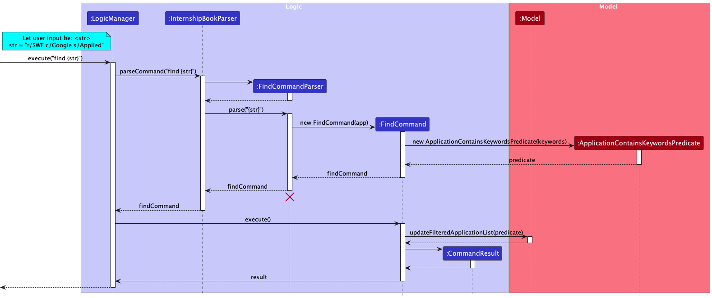

* Table of Contents
{:toc}

--------------------------------------------------------------------------------------------------------------------

## **1. Introduction**

### 1.1 About sprINT 

**sprINT** is an **internship-tracking application** that was created to assist students in their internship hunt. 

Students often face a great administrative burden in keeping track of the high volume of job or internship 
applications. With sprINT, students can easily manage details of their internship applications, including the company, 
contacts, status and task deadlines.

### 1.2 About this guide

This developer guide details the high-level software architecture and design decisions for the implementation of sprINT.
It is intended for:

* Advanced users who wish to get a better understanding of sprINT's features
* Present and future developers, designers and testers of sprINT 

--------------------------------------------------------------------------------------------------------------------

## **2. Acknowledgements**

sprINT is adapted from the [AddressBook-Level3](https://se-education.org/addressbook-level3/) 
project created by the SE-EDU initative. 

--------------------------------------------------------------------------------------------------------------------

## **3. Setting up, getting started**

Refer to the guide [_Setting up and getting started_](SettingUp.md).

--------------------------------------------------------------------------------------------------------------------

## **4. Design**
### 4.1 Architecture

The ***Architecture Diagram*** given above explains the high-level design of the App.

Given below is a quick overview of main components and how they interact with each other.

**Main components of the architecture**

**`Main`** has two classes called [`Main`](https://github.com/AY2223S2-CS2103T-T13-3/tp/tree/master/src/main/java/seedu/sprint/Main.java) 
and [`MainApp`](https://github.com/AY2223S2-CS2103T-T13-3/tp/tree/master/src/main/java/seedu/sprint/MainApp.java). 
It is responsible for,
* At app launch: Initializes the components in the correct sequence, and connects them up with each other.
* At shut down: Shuts down the components and invokes cleanup methods where necessary.

[**`Commons`**](#common-classes) represents a collection of classes used by multiple other components.

The rest of the App consists of four components.

* [**`UI`**](#ui-component): The UI of the App.
* [**`Logic`**](#logic-component): The command executor.
* [**`Model`**](#model-component): Holds the data of the App in memory.
* [**`Storage`**](#storage-component): Reads data from, and writes data to, the hard disk.

**How the architecture components interact with each other**

The *Sequence Diagram* below shows how the components interact with each other for the scenario where the user issues the command `delete-app 1`.

Each of the four main components (also shown in the diagram above),

* defines its *API* in an `interface` with the same name as the Component.
* implements its functionality using a concrete `{Component Name}Manager` class (which follows the corresponding API `interface` mentioned in the previous point.

For example, the `Logic` component defines its API in the `Logic.java` interface and implements its functionality using the `LogicManager.java` class which follows the `Logic` interface. Other components interact with a given component through its interface rather than the concrete class (reason: to prevent outside component's being coupled to the implementation of a component), as illustrated in the (partial) class diagram below.

The sections below give more details of each component.

### 4.2 UI component

The **API** of this component is specified in [`Ui.java`](https://github.com/AY2223S2-CS2103T-T13-3/tp/tree/master/src/main/java/seedu/sprint/ui/Ui.java).

The UI consists of a `MainWindow` that is made up of parts e.g.`CommandBox`, `ResultDisplay`, `ApplicationListPanel`, `StatusBarFooter` etc. All these, including the `MainWindow`, inherit from the abstract `UiPart` class which captures the commonalities between classes that represent parts of the visible GUI.

The `UI` component uses the JavaFx UI framework. The layout of these UI parts are defined in matching `.fxml` files that are in the `src/main/resources/view` folder. For example, the layout of the [`MainWindow`](https://github.com/AY2223S2-CS2103T-T13-3/tp/tree/master/src/main/java/seedu/sprint/ui/MainWindow.java) is specified in [`MainWindow.fxml`](https://github.com/AY2223S2-CS2103T-T13-3/tp/tree/master/src/main/resources/view/MainWindow.fxml)

The `UI` component,

* executes user commands using the `Logic` component.
* listens for changes to `Model` data so that the UI can be updated with the modified data.
* keeps a reference to the `Logic` component, because the `UI` relies on the `Logic` to execute commands.
* depends on some classes in the `Model` component, as it displays `Application` objects residing in the `Model`.

### 4.3 Logic component

The **API** of this component is specified in [`Logic.java`](https://github.com/AY2223S2-CS2103T-T13-3/tp/tree/master/src/main/java/seedu/sprint/logic/Logic.java).

Here's a (partial) class diagram of the `Logic` component:

How the `Logic` component works:
1. When `Logic` is called upon to execute a command, it uses the `InternshipBookParser` class to parse the user command.
1. This results in a `Command` object (more precisely, an object of one of its subclasses e.g., `AddApplicationCommand`) which is executed by the `LogicManager`.
1. The command can communicate with the `Model` when it is executed (e.g. to add an application).
1. The result of the command execution is encapsulated as a `CommandResult` object which is returned from `Logic`.

The Sequence Diagram below illustrates the interactions within the `Logic` component for the `execute("delete-app 1")` API call.

:information_source: **Note:** The lifeline for `DeleteCommandParser` 
should end at the destroy marker (X) but due to a limitation of PlantUML, the lifeline reaches the end of diagram.

Here are the other classes in `Logic` (omitted from the class diagram above) that are used for parsing a user command:

How the parsing works:
* When called upon to parse a user command, the `InternshipBookParser` class creates an `XYZCommandParser` (`XYZ` is a placeholder for the specific command name e.g., `AddApplicationCommandParser`) which uses the other classes shown above to parse the user command and create a `XYZCommand` object (e.g., `AddApplicationCommand`) which the `InternshipBookParser` returns back as a `Command` object.
* All `XYZCommandParser` classes (e.g., `AddApplicationCommandParser`, `DeleteApplicationCommandParser`, ...) inherit from the `Parser` interface so that they can be treated similarly where possible e.g, during testing.

### 4.4 Model component
The **API** of this component is specified in [`Model.java`](https://github.com/AY2223S2-CS2103T-T13-3/tp/tree/master/src/main/java/seedu/sprint/model/Model.java).

The `Model` component,

* stores the internship book data i.e., all `Application` objects (which are contained in a `UniqueApplicationList` object).
* stores the currently 'selected' `Application` objects (e.g., results of a search query) as a separate _filtered_ list which is exposed to outsiders as an unmodifiable `ObservableList<Application>` that can be 'observed' e.g. the UI can be bound to this list so that the UI automatically updates when the data in the list change.
* stores a `UserPref` object that represents the user’s preferences. This is exposed to the outside as a `ReadOnlyUserPref` objects.
* does not depend on any of the other three components (as the `Model` represents data entities of the domain, they should make sense on their own without depending on other components)

### 4.5 Storage component

The **API** of this component is specified in [`Storage.java`](https://github.com/AY2223S2-CS2103T-T13-3/tp/tree/master/src/main/java/seedu/sprint/storage/Storage.java).

The `Storage` component,
* can save both internship book data and user preference data in json format, and read them back into corresponding objects.
* inherits from both `InternshipBookStorage` and `UserPrefStorage`, which means it can be treated as either one (if only the functionality of only one is needed).
* depends on some classes in the `Model` component (because the `Storage` component's job is to save/retrieve objects that belong to the `Model`)

### 4.6 Common classes

Classes used by multiple components are in the `seedu.sprint.commons` package.

--------------------------------------------------------------------------------------------------------------------

## **5. Implementation**

This section describes some noteworthy details on how certain features are implemented.

### 5.1 Add Application feature

#### About
The add application command is a core feature of sprINT, allowing users to easily keep track of their internship
applications. By issuing the command with the appropriate prefixes, users can input the key details of their application,
including the role, company, email, and status. 

:information_source: **Note:** While `task` is also a field associated
with an application, users are only allowed to add a task to an application via the 
<a href="#56-add-task-feature">add task command</a>.

With this command, users no longer have to rely on memory or scattered notes to keep track of their
applications. Instead, they can quickly and easily input all relevant information into sprINT, and access it at any
time to monitor their progress.

#### Usage
To add an application in sprINT, simply issue the command in the following format:

`add-app r/[role] c/[company name] e/[company email] s/[status]`

Here's a breakdown of what each prefix means:

- `r/` - indicates the role or position you're applying for in the internship application.
- `c/` - indicates the name of the company you're applying to for the internship.
- `e/` - indicates the email address of the company or the contact person you're communicating with regarding the application.
- `s/` - indicates the [status](#status) of your application.
- `t/` - indicates the tags that you want to associate with your application.

#### Implementation
The add application mechanism is facilitated by the Ui, Logic and Model components of sprINT. 

Given below are the steps that illustrate the interaction between the components when it receives a valid add
application command from the user.

1. The Ui component receives the user command from the `CommandBox` of sprINT's GUI.
2. The command is processed as a value of type `String`, and is passed to `LogicManager` via its `execute()` method.
3. The `LogicManager` passes the string input to the `InternshipBookParser` via the `parseCommand()` method.
4. The `InternshipBookParser` in turn creates an `AddApplicationCommandParser` that is responsible for the specific purpose of 
parsing user commands for adding applications.
5. The `InternshipBookParser` then passes the string input to the `AddApplicationCommandParser` via the `parse()` method.
6. The `AddApplicationCommandParser` then identifies the different prefixes in the string and creates the fields for the application.

:information_source: **Note:** The field entities that are minimally created include
the `Role`, `CompanyName`, `CompanyEmail` and `Status`. These also coincide with the compulsory fields that the user
must provide in the input when using the add application feature.

7. These fields will then be used to create an `Application` instance.
8. The newly created `Application` instance will then be used to create an `AddApplicationCommand`. This command instances
is returned back to `LogicManager`.
9. The `LogicManager` then calls the `execute()` method of the `AddApplicationCommand`. This initializes the execution
the logic behind adding the associated application instance to the existing `InternshipBook`.
10. An instance of `CommandResult` is created which contains the information that will be displayed back to the User after
the execution of the command. 
11. The Ui component displays the contents of the `CommandResult` to the User.

:information_source: **Note:** The CommandResult will display the newly updated
application list to the User, should the add command execute successfully. If an error occurred during execution, the corresponding
exception that was thrown and the error message will be displayed to the user.

For a more graphical illustration of how an add application command is processed, please refer to the following
sequence diagram:

--------------------------------------------------------------------------------------------------------------------

### 5.2 Edit Application feature

#### About
The edit application command is another core feature of sprINT, similar to [add](#51-add-application-feature). Users 
can edit any field(s) of an existing application to update it or rectify input errors.

#### Usage
To edit an application in sprINT, simply issue the command in the following format:

`edit-app INDEX r/[role] c/[company name] e/[company email] s/[status]`

Apart from `INDEX`, all other fields are optional. However, at least one of the optional fields must be provided.

#### Implementation
The edit application mechanism is facilitated by the Ui, Logic and Model components of sprINT.

Given below are the steps that illustrate the interaction between the components when it receives a valid edit
application command from the user.

1. The Ui component receives the user command from the `CommandBox` of sprINT's GUI.
2. The command is processed as a value of type `String`, and is passed to `LogicManager` via its `execute()` method.
3. The `LogicManager` passes the string input to the `InternshipBookParser` via the `parseCommand()` method.
4. The `InternshipBookParser` in turn creates an `EditApplicationCommandParser` that is responsible for the specific purpose of
   parsing user commands for editing applications.
5. The `InternshipBookParser` then passes the string input to the `EditApplicationCommandParser` via the `parse()` method.
6. The `EditApplicationCommandParser` then identifies the input prefixes in the string and edits the fields for the application.
7. These fields will then be used to create an edited `Application` instance through `createEditedApplication` method.
8. The newly created `Application` instance will then be used to create an `EditApplicationCommand`. This command instances
   is returned back to `LogicManager`.
9. The `LogicManager` then calls the `execute()` method of the `EditApplicationCommand`. This initializes the execution
   the logic behind adding the associated application instance to the existing `InternshipBook`.
10. An instance of `CommandResult` is created which contains the information that will be displayed back to the User after
    the execution of the command.
11. The Ui component displays the contents of the `CommandResult` to the User.

For a more graphical illustration of how an edit application command is processed, please refer to the following
sequence diagram:

--------------------------------------------------------------------------------------------------------------------

### 5.3 Find Application feature

#### About
The find command is a feature that enables users to search for a specific application within the internship book.

Users can locate the application by providing its index and optionally using the parameters `r/`, `c/`, and `s/` to 
refine their search. These parameters correspond to the role, company, and status fields in the internship book, 
allowing for customised searches. Without any of the required prefixes, it will do a global search for the
keyword in all fields of the applications.

#### Usage
To find an application in sprINT, issue the command in the following format:

`find [r/keyword(s)] [c/keyword(s)] [s/keyword(s)]` or `find keyword(s)`

Here's a breakdown of what each prefix means:

- `r/` - finds the role of the application.
- `c/` - finds the company name of the application.
- `s/` - finds the status of the application. The only valid values are "interested", "applied", "rejected" and "offered".

When no prefix is specified, the keywords are searched in the role, company name and status fields of applications.

#### Implementation
The find application mechanism is facilitated by the Ui, Logic and Model components of sprINT.

Given below are the steps that illustrate the interaction between the components when it receives a valid find 
command from the user.

1. The Ui component receives the user command from the `CommandBox` of sprINT's GUI.
2. The command is processed as a value of type `String`, and is passed to `LogicManager` via its `execute()` method.
3. The `LogicManager` passes the string input to the `InternshipBookParser` via the `parseCommand()` method.
4. The `InternshipBookParser` in turn creates an `FindCommandParser` that is responsible for the specific purpose of
   parsing user commands for finding applications.
5. The `InternshipBookParser` then passes the string input to the `FindCommandParser` via the `parse()` method.
6. The `FindCommandParser` then identifies the different prefixes (if any) in the string and creates a list of keywords.
7. The `parse()` method will return a `FindCommand(new NameContainsKeywordsPredicate(keywords))`.
8. This `FindCommand` is returned back to `LogicManager`.
9. The `LogicManager` then calls the `execute()` method of the `FindCommand`. This initializes the execution
   logic behind finding the associated application instance in the existing `InternshipBook`.
10. An instance of `CommandResult` is created which contains the information that will be displayed back to the User after
    the execution of the command.
11. The Ui component displays the contents of the `CommandResult` to the User.

For a more graphical illustration of how a find application command is processed, please refer to the following
sequence diagram:

--------------------------------------------------------------------------------------------------------------------

### 5.4 Sort Applications feature

#### About
The sort command is a feature that enables users to rearrange the list of applications they see on the GUI.
The following table details the parameters to be used with the `sort` command:

| Parameter | Compulsory | Constraints                                 | 
|-----------|------------|---------------------------------------------|
| Sequence  | Yes        | Must be either `a` or `d`                   |
| Order     | Yes        | Must be either `alphabetical` or `deadline` |

Examples:
- `sort a deadline` will sort applications by the deadline of their upcoming tasks in ascending order (i.e. from earliest 
to latest). 

:information_source: **Note:** Only applications that have a task 
associated will be displayed in the sorted list. Those without an associated task will **not** be shown.
 

- `sort d alphabetical` will sort applications by the role in descending order (from Z to A). If there are two or more 
applications with the same role, their company name will be used as a tiebreaker. 

#### Implementation
The sort application mechanism is facilitated by the Ui, Logic and Model components of sprINT.

Given below are the steps that illustrate the interaction between the components when it receives a valid sort
command from the user.

1. The Ui component receives the user command from the `CommandBox` of sprINT's GUI.
2. The command is processed as a value of type `String`, and is passed to `LogicManager` via its `execute()` method.
3. The `LogicManager` passes the string input to the `InternshipBookParser` via the `parseCommand()` method.
4. The `InternshipBookParser` in turn creates an `SortCommandParser` that is responsible for the specific purpose of
   parsing user commands for sorting the application list.
5. The `InternshipBookParser` then passes the string input to the `SortCommandParser` via the `parse()` method.
6. The `SortCommandParser` then identifies the part of the string that describes the sorting order the user wants.
7. The `isValidSortingOrder` method in `SortCommandParser` will then check that the user-inputted sorting order is one
      of the accepted sorting order as dictated by the enum values in enum `SortingOrder`.
8. The `SortCommandParser` also identifies the part of the string that describes the sorting sequence the user wants.
9. The `isValidSortingSequence` method in `SortCommandParser` will then check that the user-inputted sorting sequence is one
      of the accepted sorting sequence as dictated by the enum values in enum `SortingSequence`.
10. The `parse()` method in `SortCommandParser` will then return a `SortCommand(SortingOrder sortingOrder, SortingSequence sortingSequence)`.
11. The `SortCommand`'s comparator will be set to the corresponding comparator in its constructor.
12. This `SortCommand` is then returned to `LogicManager`.
13. The `LogicManager` then calls the `execute()` method of the `SortCommand`. This initializes the execution
    logic behind modifying the existing sorted list in `InternshipBook`, by calling the method `updateSortedApplicationList` in `LogicManager`.
14. `updateSortedApplicationList` will make use of the comparator from the `SortCommand` to sort the model's sorted list.
15. The model's sorted list is then passed to the UI to be shown to the user on the GUI.
16. An instance of `CommandResult` is also created which contains the information that will be displayed back to the User after
    the execution of the command.
17. The Ui component displays the contents of the `CommandResult` to the User.

For a more graphical illustration of how a sort command is processed, please refer to the following
sequence diagram:

#### Future extensions
Should the need to implement other ways of sorting the application list arise in the future, you can do so by following these 3 main steps:
1. Create a new `Comparator` class not dissimilar to `AlphabeticalComparator` and `DeadlineComparator` that
implements the `Comparator<Application>` interface.
2. Modify `SortCommandParser` to accept a new sorting order.
3. Modify `SortCommand`. Specifically, its enum class `SortingOrder` should be expanded to accept a new enum values for your new sorting order.
Also, modify its constructor so that it can create a comparator of the newly created `Comparator` class for `SortCommand`.

#### Relation with `list` command
The implementation of the `sort` command shares some similarities with the `list` command.
The `list` command lists all applications in the order of creation; i.e., applications that are more recently added
will be shown higher up in the list.
The execution of these commands is essentially a two-step process of first **filtering** and then **storing**: 
1. `LogicManager` takes the internal list that keeps track of all the applications. It stores a **filtered** version of this
list in `FilteredList`.
2. `LogicManager` then takes the `FilteredList` and stores a **sorted** version of this list in `SortedList`.

See the following activity diagram that illustrates this workflow with some example executions of the `sort`, `find`
and `list` commands:

--------------------------------------------------------------------------------------------------------------------

### 5.5 Undo/redo feature

#### About

The undo/redo command is a feature that helps to enhance users' experience. The undo command allows users to backtrack
and reverse their previous action, while the redo command allows users to reapply any changes they have undone. 

#### Usage

To undo or redo the previous command, simply issue the command `undo` or `redo` respectively.

#### Implementation

The undo/redo mechanism is facilitated by `VersionedInternshipBook`. It extends `InternshipBook` with an undo/redo history, stored internally as an `internshipBookStateList` and `currentStatePointer`. Additionally, it implements the following operations:

* `VersionedInternshipBook#commit()` — Saves the current internship book state in its history.
* `VersionedInternshipBook#undo()` — Restores the previous internship book state from its history.
* `VersionedInternshipBook#redo()` — Restores a previously undone internship book state from its history.

These operations are exposed in the `Model` interface as `Model#commitInternshipBook()`, `Model#undoInternshipBook()` and `Model#redoInternshipBook()` respectively.

Given below is an example usage scenario and how the undo/redo mechanism behaves at each step.

Step 1. The user launches the application for the first time. The `VersionedInternshipBook` will be initialized with the initial internship book state, and the `currentStatePointer` pointing to that single internship book state.

Step 2. The user executes `delete 5` command to delete the 5th application in the internship book. The `delete` command calls `Model#commitInternshipBook()`, causing the modified state of the internship book after the `delete 5` command executes to be saved in the `internshipBookStateList`, and the `currentStatePointer` is shifted to the newly inserted internship book state.

Step 3. The user executes `add-app c/Google …​` to add a new application. The `add-app` command also calls `Model#commitInternshipBook()`, causing another modified internship book state to be saved into the `internshipBookStateList`.

:information_source: **Note:** If a command fails its execution, it will 
not call `Model#commitInternshipBook()`, so the internship book state will not be saved into the 
`internshipBookStateList`.

:information_source: **Note:** The command shown in the diagram above 
is shortened for brevity. For the complete correct syntax, please refer to the <a href="#51-add-application-feature">add-application</a> section.

Step 4. The user now decides that adding the application was a mistake, and decides to undo that action by executing 
the `undo` command. The `undo` command will call `Model#undoInternshipBook()`, which will shift the 
`currentStatePointer` once to the left, pointing it to the previous internship book state, and restores the
internship book to that state.

:information_source: **Note:** If the `currentStatePointer` is at index 0, 
pointing to the initial InternshipBook state, then there are no previous InternshipBook states to restore. The `undo` 
command uses `Model#canUndoInternshipBook()` to check if this is the case. If so, it will return an error to the user rather
than attempting to perform the undo.

The following sequence diagram provides a graphical illustration of how the undo operation works:

:information_source: **Note:** The lifeline for `UndoCommand` should end at the destroy marker (X) but due to a limitation of PlantUML, the lifeline reaches the end of diagram.

The `redo` command does the opposite — it calls `Model#redoInternshipBook()`, which shifts the `currentStatePointer` once to the right, pointing to the previously undone state, and restores the internship book to that state.

:information_source: **Note:** If the `currentStatePointer` is at index 
`internshipBookStateList.size() - 1`, pointing to the latest internship book state, then there are no undone 
InternshipBook states to restore. The `redo` command uses `Model#canRedoInternshipBook()` to check if this is the case. 
If so, it will return an error to the user rather than attempting to perform the redo.

Step 5. The user then decides to execute the command `list`. Commands that do not modify the internship book, such as `list`, will usually not call `Model#commitInternshipBook()`, `Model#undoInternshipBook()` or `Model#redoInternshipBook()`. Thus, the `internshipBookStateList` remains unchanged.

Step 6. The user executes `clear`, which calls `Model#commitInternshipBook()`. Since the `currentStatePointer` is not pointing at the end of the `internshipBookStateList`, all internship book states after the `currentStatePointer` will be purged. Reason: It no longer makes sense to redo the `add-app c/Google …​` command. This is the behaviour that most modern desktop applications follow.

The following activity diagram summarizes what happens when a user executes a new command:

#### Design considerations

**Aspect: How undo & redo executes:**

* **Alternative 1 (current choice):** Saves the entire internship book.
  * Pros: Easy to implement.
  * Cons: May have performance issues in terms of memory usage.

* **Alternative 2:** Individual command knows how to undo/redo by
  itself.
  * Pros: Will use less memory (e.g. for `delete`, just save the company being deleted).
  * Cons: We must ensure that the implementation of each individual command are correct.

--------------------------------------------------------------------------------------------------------------------

### 5.6 Add Task feature 

#### About

The add task command is a feature that allows users to add a [task](#task) to an existing application in the 
internship book. This allows users to keep track of additional requirements for an application that other fields 
may not be able to capture adequately.

:information_source: **Note:** Currently, sprINT only supports adding 
**one** task per application. This means that users will **not** be allowed to add more tasks to an application that 
already has an existing task associated with it.

#### Usage

To add a task to an existing application in sprINT, simply issue the command in the following format:
`add-task INDEX d/[description] by/[deadline]`

Here's a breakdown of what each prefix means:
* `d/` - indicates the description of the task.
* `by/` - indicates the deadline of the task, in `DD-MM-YYYY` format. 

#### Implementation

The add task mechanism is facilitated by the Ui, Logic and Model components of sprINT. Although it has its own parser 
class (`AddTaskCommandParser`), the steps taken when it receives a valid add task command from the user are largely 
similar to the [edit application](#52-edit-application-feature) command, since the add task feature uses existing logic
from `EditApplicationCommand` under the hood (for why this is the case, refer to 
[Design Considerations](#design-considerations)).

The following sequence diagram provides a graphical illustration of how the add task operation works:

#### Design considerations

**Aspect: How `add task` executes**
  
* **Option 1** (Current design): Use existing logic from the `EditApplicationCommand` class (i.e. 
  `createEditedApplication` and `EditApplicationDescriptor`).
  * Pros:
    * Reduces duplicate code (and thus code redundancy).
    * Makes sense from a logical perspective: since `Task` is implemented as just another field in `Application`, 
      _adding a task_ to an application is essentially just another interface for _editing_ the application.
  * Cons:
    * Increases coupling between `AddTaskCommand` and `EditApplicationCommand`.

* **Option 2**: Implement logic for `createEditedApplication` and `EditApplicationDescriptor` **within** the 
    `AddTaskCommand` class.
    * Pros:
      * Reduces coupling between `AddTaskCommand` and `EditApplicationCommand`.
    * Cons:
      * Increases code redundancy.
      * Violates Single Responsibility Principle.

--------------------------------------------------------------------------------------------------------------------

### 5.7 Exit sprINT feature

#### About

The exit command allows users to close the desktop application safely, terminating any running processes and freeing up
system resources. With this feature, users can efficiently exit the application without any risk of data loss or 
system instability. This action serves the same purpose as closing the application window by clicking the top-right 
X button.

#### Usage

To exit sprINT, simply issue the command `exit` or click on the X button on the top-right of the application window.

#### Implementation
1. The Ui component receives the user command from the `CommandBox` of sprINT's GUI.
2. The command is processed as a value of type string, and is passed to `LogicManager` via it's `execute()` method.
3. The `LogicManager` passes the string input to the `InternshipBookParser` via the `parseCommand()` method.
4. Upon parsing the `exit` Command Keyword, the `InternshipBookParser` creates a `ExitSprintCommand`. This command instance
   is returned back to `LogicManager`.
5. The `LogicManager` then calls the `execute()` method of the `ExitSprintCommand`.
6. An instance of `CommandResult` is created and returned to the Ui component.
7. The Ui component detects the `CommandResult` initiated from an `ExitSprintCommand`, and then handles the closure
   of the desktop application.

:information_source: **Note:** All `CommandResult` instances have an
`exit` boolean field. The boolean value indicates whether the CommandResult corresponds to that of an `exit` command.
This is what allows the Ui Component, `MainWindow`, to detect that a request to close the application has been issued
from the user.

 

For a more graphical illustration of how the exit sprINT command is processed, please refer to the following
sequence diagram:

--------------------------------------------------------------------------------------------------------------------

## **6. Documentation, logging, testing, configuration, dev-ops**

* [Documentation guide](Documentation.md)
* [Testing guide](Testing.md)
* [Logging guide](Logging.md)
* [Configuration guide](Configuration.md)
* [DevOps guide](DevOps.md)

--------------------------------------------------------------------------------------------------------------------

## **7. Glossary**

### 7.1 sprINT-specific Terminology

#### Application
Represents an internship application entry in the internship book. Each application contains a role,
company name, company email and one of four possible statuses.

#### Status
Represents the current stage of the internship application. Can be one of 4 values:
* **Interested**: An internship that the user is interested in, but has yet to apply to.
* **Applied**: An internship that the user has applied to, but has yet to receive an offer or rejection for.
* **Offered**: An internship that the user has received an offer for.
* **Rejected**: An internship that the user has been rejected for.

#### Task 
Represents additional milestones that are part of the internship application process. Examples include online 
assessment, technical interview, etc.

### 7.2 Others

#### GUI
Graphical User Interface

#### CLI
Command Line Interface

#### Mainstream OS
Windows, Linux, Unix, OS-X

--------------------------------------------------------------------------------------------------------------------

## **8. Appendix: Requirements**

### 8.1 Product Scope

**Target user profile**:

* is a student going to or is currently applying for internships
* has a need to manage a significant number of internship applications
* prefer desktop apps over other types of apps
* can type fast
* prefers typing to mouse interactions
* is reasonably comfortable using CLI apps

**Value proposition**: manages internship applications faster than a typical mouse while offering an intuitive and user-centred GUI design

### 8.2 User Stories

Priorities: High (must have) - `* * *`, Medium (nice to have) - `* *`, Low (unlikely to have) - `*`

| Priority | As a …​               | I want to …​                                     | So that I can…​                                                                              |
|----------|-----------------------|--------------------------------------------------|----------------------------------------------------------------------------------------------|
| `* * *`  | new or forgetful user | see usage instructions                           | refer to instructions when I first start using sprINT or when I forget how to use it         |
| `* * *`  | user                  | view all application entries                     | look through all of them easily                                                              |
| `* * *`  | user                  | add a new application entry                      |                                                                                              |
| `* * *`  | user                  | edit an new application entry                    | update progress of an internship application or amend mistakes I might have made in an entry |
| `* * *`  | neat user             | delete an application entry                      | remove entries that I no longer need                                                         |
| `* * *`  | user                  | add an upcoming task to an application           | remind myself of the work I need to do for this application                                  |
| `* * *`  | user                  | edit an upcoming task for an application         | update the application with the next task I need to complete                                 |
| `* * *`  | neat user             | delete a task from an application                | remove tasks that I have done or are past the deadline                                       |
| `* *`    | user                  | find application entry to a specified company    | keep track of all the positions I have applied to at this company more easily                |
| `* *`    | user                  | find application entry with a specified role     | keep track of all the applications with this role                                            |
| `* *`    | user                  | find application entry with a specified deadline | keep track of all the applications and their upcoming tasks I need to complete by then       |
| `* *`    | user                  | sort application entries by specified order      | view them in order to get a better idea of which ones I should prioritise                    |
| `* *`    | clumsy user           | undo a command                                   | if I ever typed one by mistake                                                               |
| `* *`    | clumsy user           | redo a command                                   | lest I undone one by mistake                                                                 |
| `* `     | neat user             | clear my internship book                         | restart the whole process of tracking my internship applications                             |
| `* `     | user                  | tag an application                               | label them as I wish                                                                         |
| `* `     | data-oriented user    | view statistics of all my application entries    | get the general idea of how well I'm doing in my internship hunt                             |

### 8.3 Use Cases

(For all use cases below, the **System** refers to `sprINT` and the **Actor** refers to the `user`, unless specified otherwise)

**Use case: UC01 - Add an application entry**

**MSS**

1. User provides application details (role applied, company name, company email and status).
2. sprINT creates the application entry and shows the updated list of application entries.

    Use case ends.

**Extensions**

* 1a. User did not provide details for mandatory fields.
  * 1a1. sprINT displays an error message that shows fields that are missing.
  * 1a2. sprINT prompts User to try again.
  
    Use case resumes at step 1.
        
* 1b. Error occurred when parsing arguments for certain fields.
  * 1b1. sprINT displays an error message that shows the first incorrect field value entered.
  * 1b2. sprINT prompts User to try again.
    
    Use case resumes at step 1.
        
* 1c. Application already exists in the database.
  * 1c1. sprINT displays an error message that informs User of a duplicate application entry.
  * 1c2. sprINT prompts User to try again.
        
    Use case resumes at step 1.

---

**Use case: UC02 - Edit an application entry**

**MSS**

1. sprINT displays a list of current application entries.
2. User requests to edit a specific application entry in the list.
3. sprINT updates the application entry and shows updated list of entries.

   Use case ends.

**Extensions**

* 1a. The list is empty.

  Use case ends.

* 2a. The index provided by User is invalid (e.g. not an integer or out of bound).
  * 2a1. sprINT shows an error message.
  
    Use case resumes at step 1.
  
* 2b. User did not provide any index.
  * 2b1. sprINT shows an error message.
  
    Use case resumes at step 1.

---

**Use case: UC03 - Delete an application entry**

**MSS**

1. sprINT displays a list of current application entries.
2. User requests to delete a specific application entry in the list.
3. sprINT updates the application entry and displays updated list of entries.

   Use case ends.

**Extensions**

* 2a. The list is empty.

  Use case ends.

* 2a. The index provided by User is invalid (e.g. not an integer or out of bound).
    * 2a1. sprINT shows an error message.

      Use case resumes at step 1.

* 2b. User did not provide any index.
    * 2b1. sprINT shows an error message.

      Use case resumes at step 1.

___

**Use case: UC04 - Add a task to an application entry**

**MSS**

1. User provides task details (description, deadlines) and specifies the application to add this task to.
2. sprINT adds the task to the specified application and shows the updated list of application entries.

   Use case ends.

**Extensions**

* 1a. User did not provide details for mandatory fields.
    * 1a1. sprINT displays an error message that shows fields that are missing.
    * 1a2. sprINT prompts User to try again.

      Use case resumes at step 1.
  
* 1b. The index provided by User is invalid (e.g. not an integer or out of bound).
    * 1b1. sprINT shows an error message.
  
      Use case resumes at step 1.

* 1c. User did not provide any index.
    * 1c1. sprINT shows an error message.

      Use case resumes at step 1.

* 1d. Error occurred when parsing arguments for certain fields.
    * 1d1. sprINT displays an error message that shows the first incorrect field value entered.
    * 1d2. sprINT prompts User to try again.

      Use case resumes at step 1.
    
---

**Use case: UC05 - Edit an application's task**

**MSS**

1. sprINT displays a list of current application entries.
2. User requests to edit the task for a specific application entry in the list.
3. sprINT updates the application entry and shows updated list of entries.

   Use case ends.

**Extensions**

* 1a. The list is empty.

  Use case ends.

* 2a. The index provided by User is not valid (e.g. not an integer or out of bound).
    * 2a1. sprINT shows an error message.

      Use case resumes at step 1.

* 2b. User did not provide any index.
    * 2b1. sprINT shows an error message.

      Use case resumes at step 1.

* 2c. The application entry specified by User does not have an existing task.
    * 2c1. sprINT shows an error message.

      Use case resumes at step 1.

---

**Use case: UC06 - Delete an application's task**

**MSS**

1. sprINT displays a list of current application entries.
2. User requests to delete the task of a specific application entry in the list.
3. sprINT updates the application entry and displays updated list of entries.

   Use case ends.

**Extensions**

* 1a. The list is empty.

  Use case ends.

* 2a. The index provided by User is invalid (e.g. not an integer or out of bound).
    * 2a1. sprINT shows an error message.

      Use case resumes at step 1.

* 2b. User did not provide any index.
    * 2b1. sprINT shows an error message.

      Use case resumes at step 1.

* 2c. The application entry specified by User does not have an existing task.
    * 2c1. sprINT shows an error message.

      Use case resumes at step 1.
    
___

**Use case: UC07 - Find applications by keywords**

**MSS**

1. User requests to find applications using the role, company name, and/or the application
status as the keyword.
2. sprINT displays the filtered list of entries.

   Use case ends.

**Extensions**

* 1a. No keyword is given.
  * 1a1. sprINT displays an error message.

    Use case resumes at step 1.

* 2a. No matching applications are found and the filtered list is empty.
  
  Use case resumes at step 2.

---

**Use case: UC08 - Sort applications by specified order**

**MSS**

1. sprINT displays a list of current application entries.
2. User requests to sort applications by alphabetical order.
3. sprINT displays the sorted list of entries.

    Use case ends.

**Extensions**

* 2a. User requests to sort applications by order of deadline of their upcoming task, with applications that have
upcoming tasks of closer deadlines being showed first.
  * 2a1. sprINT shows list of entries that have tasks (and therefore deadlines). 
  This list is sorted with earlier deadlines being showed first.

      Use case ends.

---

**Use case: UC09 - List all applications**

**MSS**

1. User requests to list all applications in the internship book.
2. sprINT displays the full list of entries, in the order of when they are added. 
(i.e., More recently added entries are shown first.)

   Use case ends.

**Extensions**

* 1a. There are currently no entries in the internship book.
    
  Use case ends.

---

**Use case: UC10 - Clear internship book**

**MSS**

1. User requests to clear all applications in the internship book.
2. sprINT displays a new empty list of entries.

   Use case ends.

---

**Use case: UC11 - Undo a command**

**MSS**

1. User requests to <u>clear the internship book (UC10)</u>.
2. sprINT executes the command requested by User.
3. User requests to undo the command executed in step 1.
4. sprINT undoes the command executed in step 1.

   Use case ends.

**Extensions**

* 1a. User requests to <u>add an application entry (UC01)</u>. User can also choose to:
    1. <u>Edit an application entry (UC02)</u>
    2. <u>Delete an application entry (UC03)</u>
    3. <u>Add a task to an existing application entry (UC04)</u>
    4. <u>Edit an application's task (UC05)</u>
    5. <u>Delete an application's task (UC06)</u>

    Use case resumes at step 2.

---

**Use case: UC12 - Redo a command**

**MSS**

1. User requests for <u>a command that can be undone (UC01, UC02, UC03, UC04,
UC05, UC06, UC10).</u>
2. sprINT executes the command.
3. User requests to <u>undo the previous command in step 1 (UC11)</u>.
4. sprINT undoes the command executed.
5. User requests to redo the command that has been undone in step 4.
6. sprINT redoes the command executed in step 2.

   Use case ends.

---

**Use case: UC13 - Exit sprINT**

**MSS**

1. User requests to exit the program.
2. sprINT closes the program window.

   Use case ends.

---

### 8.4 Non-Functional Requirements

1. Should work on any _mainstream OS_ as long as it has Java `11` or above installed.
2. Should take less than 500MB of memory while in operation.
3. Should be able to view all (up to 500) application entries on the homepage interface without noticeable lags.
4. Will not perform any automated tasks e.g., send periodic reminders. Hence, sprINT will not have a server component.
5. A user with above average typing speed for regular English text (i.e. not code, not system admin commands) should be able to accomplish most of the tasks faster using commands than using the mouse.

--------------------------------------------------------------------------------------------------------------------

## **9. Appendix: Instructions for manual testing**

Given below are instructions to test the app manually.

:information_source: **Note:** These instructions only provide a starting point for testers to work on;
testers are expected to do more *exploratory* testing.

### Launch and shutdown

1. Initial launch

   1. Download the jar file and copy into an empty folder

   2. Double-click the jar file   Expected: Shows the GUI with a set of sample contacts. The window size may not be optimum.

2. Saving window preferences

   1. Resize the window to an optimum size. Move the window to a different location. Close the window.

   2. Re-launch the app by double-clicking the jar file. 
       Expected: The most recent window size and location is retained.

### Adding an application

Before each test scenario, ensure that your sprINT application is launched and opened on your device.

1. Adding an application to sprINT

    1. Prerequisites: sprINT's main window is launched and opened.

    2. Test case: `add-app c/NUS r/Teaching Assistant e/tahiring@nus.com s/offered t/school t/nsws` 
        Expected: A new application is added to sprINT. Details of the newly added application shown in the status message.

    3. Test case: `add-app 1 c/NUS r/Teaching Assistant e/tahiring@nus.com s/offered t/school t/nsws` 
       Expected: No application is added due to **Invalid Command Format**. Add application command does not accept an 
   `INDEX` parameter. Error details shown in the status message.
   
   4. Test case: `add-app c/NUS r/Teaching Assistant s/offered t/school t/nsws`  
        Expected: No application is added due to **Invalid Command Format**. The `Company Email` prefix and input is missing
   from the command. `Company Email` is a compulsory input parameter for the add application command.

### Finding an application

1. Finding an application while all applications are being shown.

    1. Prerequisites: List of applications is displayed through means like `list` or `sort`.

    1. Test case: `find r/SWE` 
       Expected: Finds all the applications with the role containing SWE. The number of applications found is shown in the status message.

    1. Test case: `find c/Google` 
      Expected: Finds all the applications with the company name containing Google. The number of applications found is shown in the status message.

    1. Test case: `find s/Offered` 
      Expected: Finds all the applications with the `Offered` status. The number of applications found is shown in the status message.

    1. Test case: `find r/SWE c/Google s/Offered` 
       Expected: Finds all the applications with the role of `SWE`, company name containing `Google` and `Offered` status. Number of applications found is shown in the status message.

    1. Test case: `find` 
      Expected: No application is found. Invalid command error is shown in the status message. Status bar remains the same, with the input command highlighted in red.

### Help

1. Opening the help window for a summary of commands and their formats.

    1. Prerequisites: sprINT's main window is working.

    1. Test case: Enter `help` command 
       Expected: Pop-up window for a summary of help commands and their formats is shown, and `Opened Help window.` is shown in the status message.

    1. Test case: Manually clicking on the help button on the Toolbar 
       Expected: Pop-up window for a summary of help commands and their formats is shown.

    1. Test case: Enter `help [keyword]` command, where keyword can comprise some characters. 
       Expected: Pop-up window for a summary of help commands and their formats is shown, because the first word is recognised as the command by design, and `Opened Help window.` is shown in the status message.

   1. Test case: Enter `help123` command 
      Expected: No Pop-up window is shown, `Unknown command` is displayed in the status message as the word is recognised to be an invalid command.

### Deleting an application

1. Deleting an application while all applications are being shown

   1. Prerequisites: List all applications using the `list` command. Multiple applications in the list.

   2. Test case: `delete-app 1` 
      Expected: First application is deleted from the list. Details of the deleted application shown in the status message. Timestamp in the status bar is updated.

   3. Test case: `delete-app 0` 
      Expected: No application is deleted. Error details shown in the status message. 

   4. Other incorrect delete commands to try: `delete-app`, `delete-app x`, `...` (where x is larger than the list size) 
      Expected: Similar to the above test case for `delete-app 0`.

### Sorting the application list

1. Sorting the application list while all applications are being shown

   1. Prerequisites: List all applications using the `list` command. Multiple applications in the list. Multiple applications with tasks (and deadlines).
   
   2. Test case: `sort a alphabetical`  
      Expected: Applications are listed in alphabetical order of their role from A to Z. 
      Applications with the same role will have their company name as a tiebreaker.

   3. Test case: `sort d alphabetical`  
      Expected: Same behaviour as the test case for `sort a alphabetical`. Except that the alphabetical order is now
      in reverse from Z to A.

   4. Test case: `sort a deadline`  
      Expected: Applications without tasks are **not** shown. Applications with tasks are listed by order of the deadline of their task. 
      Applications with closer deadlines will be shown first.

   5. Test case: `sort d deadline`  
      Expected: Same behaviour as the test case for `sort a deadline`. Except that the order is in reverse;
      applications with further deadlines will be shown first.
   
   6. Other incorrect sort commands to try: `sort a` (without the order specified), `sort deadline` (without the sequence specified),
      `sort` (nothing specified), `...`  
      Expected: No sorting is done and application list remains the same. Error details shown in the status message.
      
2. Sorting the application list when it is a filtered state, due to a previously executed `find` command

   1. Prerequisites: Multiple applications in the current displayed list. Multiple applications with tasks (and deadlines).
   
   2. Valid test cases: Same as the test cases mentioned in steps 2-5 for sorting while all applications are being shown  
      Expected: Same behaviour as when sorting while all applications are being shown.   Additionally, check that no application entries that are not in the currently displayed list of applications
      shows up after sorting.

   3. Other incorrect sort commands to try:  Same as the invalid test cases mentioned in step 6 for sorting while all applications are being shown  
      Expected: No sorting is done and the currently displayed list of applications remains the same. Error details shown in the status message.

### Listing all applications

Before each test scenario, execute `list` beforehand and take note of the **original full list of applications**. They should be ranked
in the **default order**, meaning the order in which they were added. (i.e., more recently added application entries show up first)

1. Listing all applications after list has been filtered with a `find` command

   1. Prerequisites: Multiple applications in the original full list. From there, select one or more applications with `find [keyword(s)]`.  

   2. Test case: `list`  
      Expected: The displayed list should return to the original full list of applications, in the default order.

2. Listing all applications after list has been sorted with a `sort` command

   1. Prerequisites: Multiple applications in the original full list. From there, the list is sorted with one of the following:
      * `sort a deadline`
      * `sort d deadline`
      * `sort a alphabetical`
      * `sort d alphabetical`
   
   2. Test case: `list`  
      Expected: The displayed list should return to the original full list of applications, in the default order.

3. Listing all applications after list has been filtered and sorted with a series of `find` and `sort` commands

   1. Prerequisites: Multiple applications in the original full list. From there, execute any sequence of `find` and `sort` commands  
      Example: `find r/SWE` followed by `sort a deadline`
   
   2. Test case: `list`  
      Expected: The displayed list should return to the original full list of applications, in the default order.

### Deleting all applications
Before each test scenario, execute `list` beforehand and take note of the **original full list of applications**. If your original list is empty, 
please add dummy applications by executing the `add-app` command.

1. Clearing all applications 
   1. Prerequisites: There is **at least 1** application present in sprINT.
   2. Test case: `clear`  
      Expected: All applications in sprINT will be deleted. 
   3. Test case: `clear [keyword]`, where keyword can be any combination of characters.  
      Expected: All applications in sprINT will be deleted. By default, only the first expression in the input is recognised
   as the command. In this case, it is `clear`.
   4. Test case: `clear1234`.  
      Expected: Applications will not be deleted. In this case, the first expression is recognised as `clear1234`, which is an invalid command.
   Error message `Unknown command` will be displayed in the status message.

### Adding a task
Prerequisites for test cases: there are at least 2 applications in the internship book, and the first 2 applications 
do not have a task. 

1. Test case 1: `add-task 1 d/Interview by/31-03-2023` 

   Expected: A new task is added to the first application on the list. Details of the newly added task shown in the 
   status message.

2. Test case 2: `add-task 2`

   Expected: No task is added due to **Invalid Command Format**. The `Description` and `Deadline` prefixes and inputs
   are missing from the command. `Description` and `Deadline` are compulsory input parameters for the add task command. 
   Error details shown in the status message. 

3. Test case 3: `add-task 2 d/Online Assessment by/33-05-2023`

   Expected: No task is added due to invalid date input (non-existent date). Error details shown in the status message.

### Editing a task
Prerequisites for test cases: there are at least 2 applications in the internship book, and the first 2 applications
have an existing task. 

1. Test case 1: `edit-task 1 by/Online Interview`

   Expected: The description of the task for the first application is updated to "Online Interview". 

2. Test case 2: `edit-task 2`

    Expected: The task for the second application is not edited due to **Invalid Command Format**. Edit task command
    needs at least one of `Deadline` and `Description` parameters to be provided. Error details shown in the status
    message. 

3. Test case 3: `edit-task 2 by/20042023`

   Expected: The task for the second application is not edited due to invalid date input (incorrect format). Error 
   details shown in the status message.

### Deleting a task

Prerequisites for test cases: there are at least 2 applications in the internship book, the first application has
an existing task and the second application does not have an existing task.

1. Test case 1: `delete-task 1`

   Expected: The task for the first application is deleted. Details of the deleted task shown in the status message.
   Timestamp in the status bar is updated.

2. Test case 2: `delete-task 2`

   Expected: No task is deleted (no existing task). Error details shown in the status message. 

3. Test case 3: `delete-task 0`

   Expected: No task is deleted (invalid index). 

### Exiting sprINT
Before each test scenario, ensure that sprINT application is launched and opened on your device.

1. Exiting sprINT
    1. Prerequisites: sprINT's main window is launched and opened.
   2. Test case: `exit`  
      Expected: The sprINT application will close.
   3. Test case: `exit [keyword]`, where keyword can be any combination of characters.  
      Expected: The sprINT application will close. By default, only the first expression in the input is recognised as the command. In this case,
   it is `exit`.
   4. Test case: `exit1234`.  
      Expected: sprINT application remains open. In this case, the first expression is recognised as `exit1234`, which is an invalid command.
    Error message `Unknown command` will be displayed in the status message.

--------------------------------------------------------------------------------------------------------------------

## **10. Appendix: Planned Enhancements**

There are a few known feature flaws in the application currently. Here are some proposed fixes we intend to 
implement in a future iteration to address them and improve functionality for our users:

#### 1. Command to sort by deadline does not inform user when there are no applications with deadlines to display and sort

Currently, if the user has no applications with tasks (and therefore deadlines), and requests to sort by deadline (e.g., `sort a deadline`), 
an empty list shows up.
Note that this is the expected behaviour as `SortCommand` first filters out applications with no tasks before sorting.

**Potential Enhancement and Suggested Implementation:**   
In the future, we plan to inform the user through the Command Result Box that the list is empty because they currently do not have applications with deadlines.

In the `execute` function of `SortCommand`, check for the size of the currently displayed application list. Craft an appropriate message
as part of the `CommandResult` to inform the user that they have no applications with deadlines to display and sort.

#### 2. Edit operations display misleading status message when edited values are the same as the original values 

At present, the application treats any edit made by the user to a task or application as a modification, **regardless of 
whether the new value is identical to the original value**. As a result, the status message displayed after a user 
carries out such an operation suggests that the task or application was edited, even though the fields remain the same 
in reality. While this does not affect the functionality of the commands themselves, it could potentially confuse 
the user.

**Potential Enhancement and Suggested Implementation:**  
In the future, we plan to make a distinction between changes that result in a new value and those that preserve 
the original value by displaying a different command result message (`No changes detected.`) to the user in the latter 
scenario.   

#### 3. UI does not scale down responsively

When a user scales down sprINT's UI to below a certain height and width, the "Total Number of Internship Applications" 
label gets truncated while the pie chart overflows past its container as seen in the screenshot below. 

While this does not affect sprINT's main functionalities and can be resolved simply by enlarging the application window, 
it could bring about some inconvenience to users, especially when they wish to work with a smaller window.

**Potential Enhancement and Suggested Implementation:**  
In the future, we plan to update the UI such that text within the "Total Number of Internship Applications" label 
wraps around when the window is resized below a certain width. This way, users can still view how many internships
they have applied to. We also plan to increase the minimum window height to ensure that the pie chart stays within
the Statistics Display Panel. 

#### 4. Role of application gets truncated if it exceeds a certain length

When a user enters a role name that exceeds a certain length, the last part of the label is truncated and cannot be 
viewed by the user. This is illustrated in the screenshot below.

While such role names of such length are uncommon, it is not impossible. 

**Potential Enhancement and Suggested Implementation:**  
In the future, we plan to have the role name wrap around (i.e. continue on a second line) if it goes beyond a certain
length to provide better readability. 

#### 5. Applications tags gets truncated if tags are too long or too many tags are added

When a user adds a large number of tags to a single application, or when each tag is excessively lengthy, the display
of the tags is truncated at the edge of the `ApplicationCard`. This results in the User not being able to view all tags
completely. Refer to the screenshot below for an illustration of said problem.

While such situations are uncommon, it is not impossible.

**Potential Enhancement and Suggested Implementation:**  
This issue is caused by the `Flowpane` GUI entity (used for encapsulating tags) sharing the same `VBox` as the
`Label` GUI entity (used for encapsulating application Role). As seen from the previous point, the Role field suffers
from a similar truncation issue. 

To further illustrate this, refer to the screenshot below.

We observe that with a reasonable length for the application Role, the wrap around structure for the tags already exists, and kicks in automatically.
Therefore, we could resolve this by specifying and refurnishing the boundaries for the shared `VBox`, such that it is not too dynamic and 
dependent on the Role length.
This enables the automatic wrap around to be applied to both the Tags and Role fields, preventing the truncation issue which
would negatively affect user's readability.

#### 6. Integer overflow, zero or negative index error message for commands that take in an index (`edit-app`, `edit-task`, `delete-app`, `delete-task`) not specific enough

When a user types in an edit or delete command with a non-positive value for the index, the error message just states
invalid command format, instead of being specific that the index given is invalid.

A more specific error may be beneficial in bringing a more positive user experience.

**Potential Enhancement and Suggested Implementation:**  
In the future, we plan to add an additional check when parsing the command that makes sure
the user has given a valid positive input for the index, and if not, it will throw an exception that will
be returned to the user to state specifically that the index they input should be positive.
